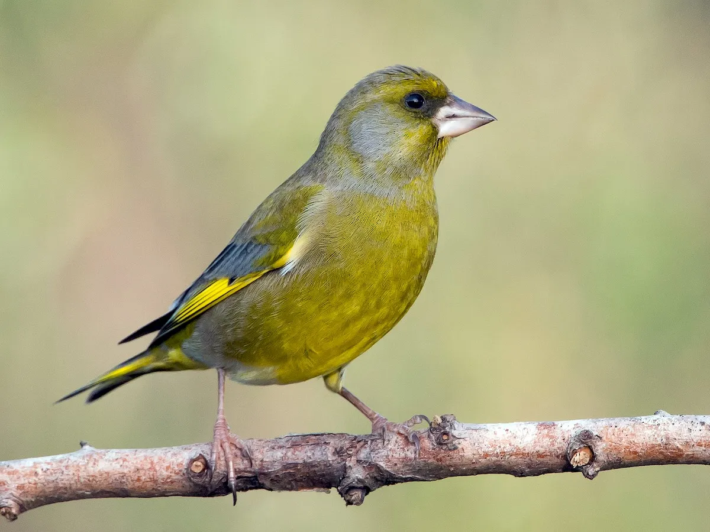
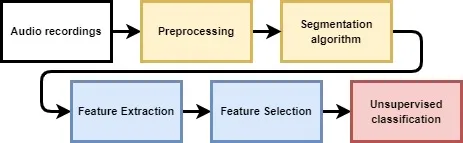
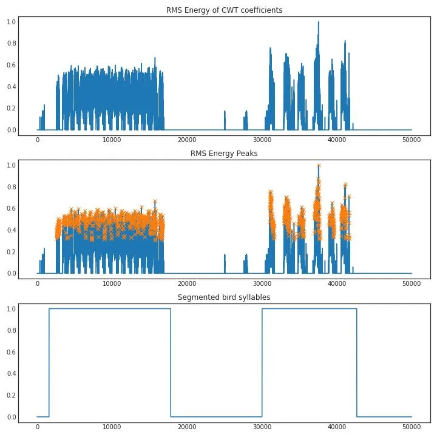
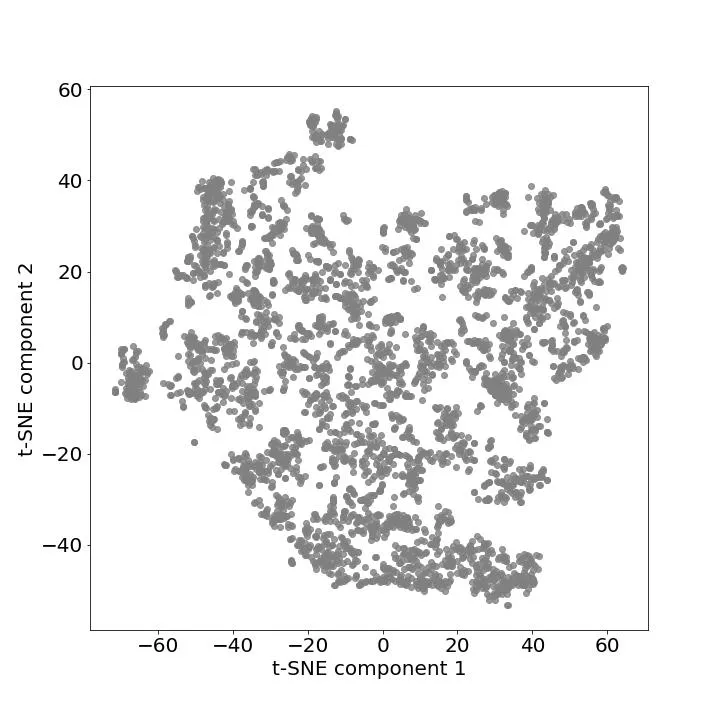
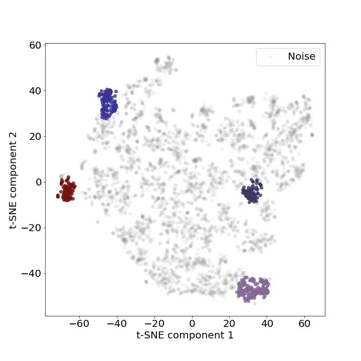
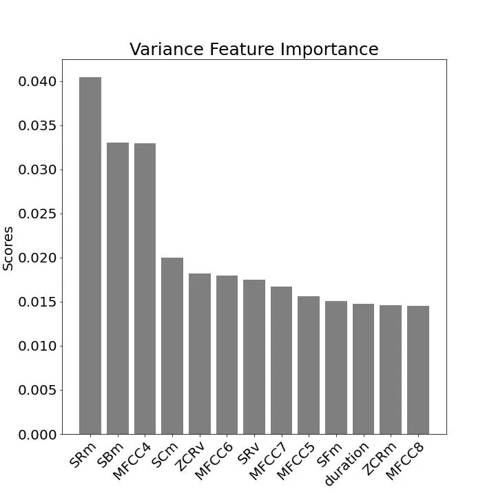
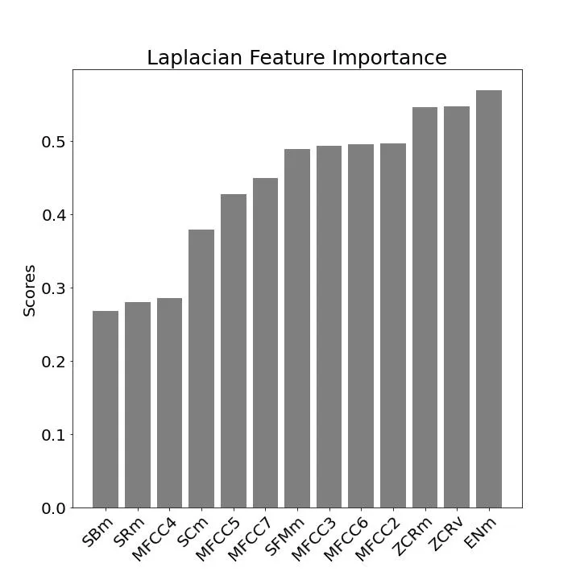
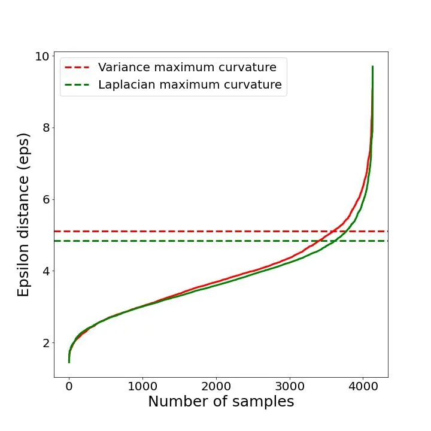
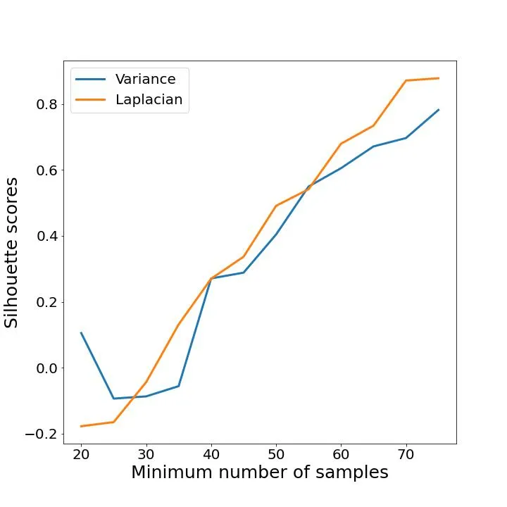
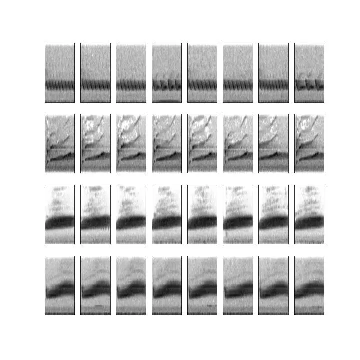

# ESTIMATING THE REPERTOIRE SIZE IN BIRDS USING UNSUPERVISED CLUSTERING TECHNIQUES

###### Abstract

Birds produce multiple types of vocalizations that, together, constitute
a vocal repertoire. For some species, the repertoire size is of
importance because it informs us about their brain capacity, territory
size or social behaviour. Estimating the repertoire size is challenging
because it requires large amounts of data which can be difficult to
obtain and analyse. From birds vocalizations recordings, songs are
extracted and segmented as sequences of syllables before being
clustered. Segmenting songs in such a way can be done either by simple
enumeration, where one counts unique vocalization types until there are
no new types detected, or by specific algorithms permitting reproducible
studies. In this paper, we present a specific automatic method to
compute a syllable distance measure that allows an unsupervised
classification of bird song syllables. The results obtained from the
segmenting of the bird songs are evaluated using the Silhouette metric
score.

## 1 Introduction

According to \[1\] \[1\], bird vocalizations can be divided into five
general categories: elements, syllables, phrases, calls and songs. These
elements can be regarded as elementary sonic units in bird
vocalizations. The syllables include one or more elements and are
usually to a few hundred milliseconds in duration. The phrases are short
groupings of syllables, while the calls are generally compact sequences
of phrases. Songs, on the other hand, are long and complex
vocalizations.



Figure 1: European Greenfinch © Rogério Rodrigues

The song of the European Greenfinch (Chloris Chloris) is organized in a
variation of elements which may go on for more than one minute. More
precisely, the song of a male greenfinch has been characterized by
having groups of tremolos, repetitions of tonal units, nasal chewlee and
a buzzing nasal wheeze, which could be uttered on its own \[2\] and
categorized into four phrases classes \[3\]:

1.  1.  A trill
2.  2.  A pure tone
3.  3.  A nasal tone
4.  4.  A nasal “tswee”

It is the “tswee” sound (a rough element, more specifically a vibrato)
that characterizes the song of the greenfinch and which is an element
repeated 10% of the time \[4\]\[5\]. Some researchers consider the nasal
“tswee” not to be learnt, but already being present in the bird’s
genetic makeup. Most of the analysis found in \[5\] focuses on other
elements and how they are combined (ex. the silent intervals between
syllables in tours, length of tours, intervals between tours, size of
the repertoire, the distance of syllables in tours among other acoustic
characteristics).

Moreover, \[3\] \[3\] argues that the size of the repertoire can be
determined by the number of phrases, where, most phrases of the
greenfinch, or short group of syllables, are repeated after identical
intervals, for a period, on the average, which lasts 0.5 seconds. Based
on these observations, we propose to use Machine Learning techniques to
design an unsupervised system able to estimate the size of the
repertoire of the greenfinch. The proposed system receives as input a
set of audio time series data downloaded from an online collaborative
database¹¹ 1 https://xeno-canto.org which is segmented and converted
into a reduced representation set called a feature vector. Feature
vector has the ability of discriminating among classes and is used to
characterize the size of the bird song repertoire. The system is finally
evaluated using clustering performance metrics to find the ideal number
of syllables in the data set.

## 2 Related Work

Estimating the size of the repertoire can be quite challenging as it
needs to perform syllable classification from audio recordings. While
experts can manually annotate bird syllables using simple enumeration
techniques (i.e. counting the number of types present in a sample of
signal) \[6\], this becomes more challenging when the repertoire size is
large, because counting all syllables requires large samples and a large
investment of time and effort \[7\]. Previous studies used simple
enumeration techniques, as well as curve-fitting \[8\], and
capture–recapture analysis \[9\] to estimate the repertoire size. One of
the bottle necks of these techniques is the segmentation of bird
vocalisations into individual syllables. Simple segmentation in time
domain proves difficult because of overlapping signals over different
frequency bands. The common approach is to convert audio recordings into
a spectrogram and apply image processing techniques to pick out the
signal of interest \[10\].

Segmented audio signals of a specific bird species can be parameterized
by a feature vector that can help discriminate between the syllables of
a specific bird. Although single feature vector used for parametrization
of bird song such as Mel-Frequency Cepstral Coefficients (MFCCs) \[11\],
Linear Predictive Coefficients (LPC) \[12\], or wavelets \[13\] can
provide good results for a small number of species \[14\]. It is noted
that with the increase in the number of species, a single feature vector
is not enough to be able to deal with the large diversity of sounds that
different species can produce. In the same way, we assume that a similar
observation can be made with the increase in the number of syllables in
bird vocalization. Therefore, researchers have proposed different
feature vectors in order to represent all the descriptive features
\[15\]\[16\]. The main drawback of this strategy is that it requires the
computation of all candidate features during the classification stage to
build the new feature space, which can be time-consuming. Therefore,
selection of features is useful to select the most relevant original
features as it just requires the computation of a reduced number of
selected features during the classification stage \[17\]. Among the
feature selection techniques, we were particularly interested in those
based on individual ranking. These algorithms rank the candidate
features with respect to a score which measures their relevance. In the
unsupervised context, selection of features is usually done using
Variance and Laplacian scores \[18\].

Furthermore, new estimation techniques based on automatic pattern
recognition methods have been created to automate the detection of
relevant structure in audio data \[19\]\[20\]. These techniques are
based on unsupervised learning methods, which do not require the data to
be labeled. Thus, the literature reveals that researchers put great
efforts into producing feature vectors to discriminate birdsong as well
as new estimation techniques for pattern recognition in audio data. In
this study, we propose an unsupervised method (Figure 2) to estimate the
size of the repertoire with (1) a segmentation algorithm that extracts
segments of bird audio from the recording (2) the extraction of combined
vectors of descriptive features and Mel-Frequency Cepstral Coefficients,
(3) the selection of features ranked with respect to a score which
measures their relevance, (4) a clustering algorithm able to interpret
the input data and find natural groups or clusters in the feature space.



Figure 2: A schematic overview of the proposed method

## 3 Materials and methods

The estimation of the size of the repertoire starts with recording the
vocalization of birds. This can rarely be done in isolation, especially
when the recordings are made in a natural habitat. The recordings
contain not only the sound of the intended target individual but also
any combination of other individuals, such as noise from other animals
including humans, environmental noise (e.g. wind, water, trees, man-made
noise) and electronic noise in the recorder. Parts of the audio that
contains bird songs need to be segmented from the background, as well as
individual syllables need to be segmented from each other before they
can be used as input for the clustering algorithm.

### 3.1 Pre-processing

In signal processing, wavelets have been widely investigated for use in
filtering bio-electric signals, among many other applications.
Bio-electric signals are good candidates for Multi-Resolution Analysis
(MRA) \[21\] wavelet filtering over standard Fourier analysis, due to
their non-stationary character. Filtering of signals using wavelets is
based on the idea that as the Discrete Wavelet Transform (DWT)
decomposes the signal into details and approximation parts, at some
scale the details contain mostly the insignificant noise and can be
removed or zeroed out using threshold without affecting the signal. This
idea is discussed in more detail in the introductory paper of \[22\]. In
this study, we propose to use a high pass filter with two basic filter
design parameters:

1.  1.  Wavelet type: Daubechies wavelet \[23\]
2.  2.  Threshold: High part of the decomposition filter values in order to
        remove the background noise.

### 3.2 Segmentation

Segmentation typically refers to the process of partitioning a given
document into multiple segments with the goal of simplifying the
representation into something that is more meaningful and easier to
analyze than the original document \[24, Chapter 4.1.1\]. In this study,
Continuous Wavelet Transform (CWT) coefficients are calculated as inputs
to the automatic segmentation algorithm as, unlike to the Fourier
transform, the wavelet transform does not require to use a window
function to avoid discontinuities, since wavelets are not continuous
functions. Fourier Transform is used to extract frequencies from a
signal as it uses a series of sine waves with different frequencies to
analyze a signal. However, the main difficulty is to find the right
window size. According to Heisenberg’s uncertainty principle: a narrow
window will localize the signal in time but there will be significant
uncertainty in frequency. If the window is wide enough, the time
uncertainty increases. This is referred to as the tradeoff between time
and frequency resolution. As mentioned above, one way to avoid this
problem is to use MRA in order to analyze the signal at different
resolution levels. In this study, we use the free library for the Python
programming language $`PyWavelets`$²² 2
https://pypi.org/project/PyWavelets to compute the CWT coefficients and
calculate the energy envelope of each wavelet vector using Root Mean
Square (RMS) energy function. That way, we isolate segments by finding
high-energy peaks in the energy envelope and apply a threshold mask set
to -20 dB (Figure 3).



Figure 3: Segmentation of bird syllables with high-energy peaks
detection

### 3.3 Feature Extraction

Feature extraction is the process in which input data are converted into
a reduced representation set called a feature vector. Feature vector has
the ability of discrimination among classes. In this study, the features
are computed on short-term frames $`F=f1,f2,f3...fn`$ and these frames
are based on overlapped samples $`S=s1,s2,s3...sn`$ of audio signals
\[25, Chapter 6.1.2\]. We transform the discrete signals into $`N`$
short-term frames of overlapped samples and then extract the audio
features from these frames.

#### 3.3.1 Descriptive features (DFs)

Spectral characteristics of different birds are varied and the signal
model is not known. Since bird sounds are musical in nature, time and
frequency-based features, called Descriptive Features, used in audio and
music retrieval can be used for bird species recognition \[16\]. These
features are extensively used and described by \[26, Chapter 3\] and
\[25, Chapter 6.2.2\] for music and audio retrieval, and \[14\] and
\[27\] for recognition of bird species. In this study, the following
features are used.

1.  1.  Energy (EN)
2.  2.  Zero Crossing Rate (ZCR)
3.  3.  Duration of the Syllable (DUR)
4.  4.  Spectral Centroid (SC)
5.  5.  Spectral Bandwidth (SB)
6.  6.  Spectral Flux (SF)
7.  7.  Spectral Roll Off (SR)
8.  8.  Spectral Flatness (SF)

Except the duration (DUR), all the features are extracted on frame
basis, and mean ($`m`$) and variance ($`v`$) of these features are
computed over the entire syllable. This gives 14 features to which
duration of the syllable is concatenated, thus yielding a feature vector
of length 15.

#### 3.3.2 Mel-Frequency Cepstral Coefficients (MFCCs)

Mel frequency cepstral coefficients (MFCCs) have their origin in speech
processing but were also found to be suited to model timbre in music.
The MFCC feature is calculated in the frequency domain, derived from the
signal’s spectrogram \[26, Chapter 3.2.1\]. In this study, we use the
MFCC FB-24 configuration proposed by Cambridge Hidden Markov Models
(HMM) Toolkit known as HTK because of its wide use. The name HTK MFCC
FB-24 denotes the number of filters recommended by Young for speech
bandwidth \[0, 8000\] Hz. Owing to its widespread use, MFCC filter
parameters are considered as the basis for the evaluation of other
feature sets. For comparison, in this study we use 24 band filters, 13
cepstral coefficients for all feature extraction methods as well as a
frequency range of \[0 11025\] Hz as we are dealing with bird songs
which are higher in frequency than speech.

### 3.4 Classification

After features are extracted from augmented data, they are normalized
using the max–min method, selected based on individual ranking, and fed
into an unsupervised algorithm to automatically cluster bird syllables
in the audio recordings. Because we are dealing with high-dimensional
feature vector, we facilitate the classification process by applying a
non-metric dimensionality reduction technique, namely the t-Distributed
Stochastic Neighbor Embedding (t-SNE)\[28\], to project the data in two
dimensions (Figure 4). Additionally, we group the samples rapidly and
objectively using the DBSCAN algorithm \[29\]. This algorithm is useful
to find core samples with high density and expand clusters from them.
Moreover, one of the significant attributes of this algorithm is noise
cancellation which is helpful to discard th noisy samples as well as the
capacity to find the number of clusters while coping with unbalanced
classes (Figure 5).



Figure 4: Exploratory visualization using the t-SNE algorithm



Figure 5: Unsupervised bird song syllable classification using the
DBSCAN algorithm

## 4 Dataset

The data set used to develop and validate the system is created using
the Xeno-Canto database³³ 3 https://xeno-canto.org/, a collaborative
project dedicated to sharing bird sounds from all over the world. We use
Xeno Canto’s web Application Programming Interface (API v2)⁴⁴ 4
https://xeno-canto.org/explore/api to build the data set with data being
organized according to the API documentation. Data can be used without
restrictions with a rate limit of 10 requests per second and are
accessible by sending query parameters (i.e. query and page) which
return a JSON object containing details about the recordings found with
the given query. In this study, we use an area-based query gathering
European recordings of the greenfinch. We select only high quality
recordings according to the Xeno-Canto quality ratings ranging from A
(highest quality) to E (lowest quality)⁵⁵ 5
https://xeno-canto.org/api/2/recordings?query=chloris+area:europe+q:a
and remove recordings that have an other species referenced in the
background. This allows us to build a data set with 339 audio recordings
of an average duration of 48.64 seconds each. Audio recordings are
accompanied with a detailed description of the fields of the object
present in the recordings array. The following fields are kept for the
study.

- •
  id: catalog number of the recording on xeno-canto
- •
  gen: generic name of the species
- •
  en: English name of the species
- •
  cnt: country where the recording was made
- •
  file-name: original file name of the audio file
- •
  type: the sound type of the recording (e.g. ’call’, ’song’, etc)
- •
  length: the length of the recording in minutes

## 5 Feature selection

Feature selection is a way of selecting the subset of the most relevant
features from the original features set by removing the redundant,
irrelevant, or noisy features. In this study, we compare two feature
selection method: (1) Variance Threshold, and (2) Laplacian score, and
evaluate them with the DBSCAN clustering algorithm. We select potential
set of features by removing candidate features below the median score as
it benefits from reduction in memory and computations, and can improve
generalization and interpretability \[30\].

Selection of feature vectors are generated in four phases:

- •
  Calculation of the Descriptive Features and MFCCs
- •
  Normalization of the features values adjusted to the same dynamic
  range $`(0,1)`$ so that each feature has equal significance to the
  classification result
- •
  Ranking of candidate features with respect to a score which measures
  their relevance
- •
  Removing of candidate features below the median score to fasten the
  calculation

### 5.1 Variance Threshold

The Variance Threshold is a simple baseline approach to feature
selection. It removes all features whose variance does not meet some
threshold. By default, it removes all zero-variance features, i.e.
features that have the same value in all samples. For each feature,
$`f`$, the Variance is computed as follows

```math
Var[f]=p(1-p) \tag{1}
```

The features with the highest $`Var[f]`$ values are ranked by order of
importance in Figure 6.



Figure 6: Variance Feature Importance scores in descending order

### 5.2 Laplacian Score

The Laplacian score of a feature indicates its relevance to preserve
locality. The Laplacian score is based on the observation that two
instances that are close to each other generally belong to the same
class. Laplacian score uses the nearest neighbor graph to obtain the
local structure of the data and obtains the Laplacian score value of
each feature according to the distance metric (euclidean).

For each feature, $`f`$, the Laplacian score of the $`r`$th feature is
computed as follows

```math
L_{r}=\frac{\tilde{f}_{r}^{T}L\tilde{f}_{r}}{\tilde{f}_{r}^{T}D\tilde{f}_{r}} \tag{2}
```

where the vector $`\tilde{f}_{r}`$ is

```math
\tilde{f}_{r}={f}_{r}-\frac{{f}_{r}^{T}D1}{1^{T}D1} \tag{3}
```

and $`L`$ and $`D`$ are defined in the spectral algorithm. Based on the
assumption that the interesting underlying structure of the data (e.g.
clusters) depends on the slowly varying features in the data, \[18\]
proposed to select the features with the smallest scores. The features
are ranked by order of importance in Figure 7.



Figure 7: Laplacian Feature Importance scores in ascending order

## 6 Results and discussion

After the selection of the feature vectors, we use the free software
machine learning library for the Python programming language
scikit-learn \[31\] to implement the unsupervised clustering techniques.
We start by projecting the feature vectors in two dimensions using the
t-SNE algorithm and save the following parameters as they represent the
best visualization of the data.

- •
  perplexity = 45
- •
  n_iter = 1500
- •
  init = ’pca’
- •
  learning_rate = ’auto’

We then adjust the main parameters of the DBSCAN clustering algorithm
(i.e. $`eps`$ and $`min\_samples`$) using k-distance graph to find the
optimal epsilon ($`eps`$) distance between the samples, and Silhouette
metric \[32\] to determine the minimum number of samples
($`min\_samples`$) needed to define the optimal number of clusters.
Observations showed that there was never more than one big cluster. At
most, there was one large cluster identified as noise and some small
clusters identified as bird song syllables.

### 6.1 Evaluation

We evaluate the proposed system using the DBSCAN algorithm and the
Silhouette metric score with euclidean distance calculation. Silhouette
score always ranges between -1 to 1 with a high score suggesting that
the objects are well matched to their own cluster and poorly matched to
their neighborhood clusters. This is computed as follows.

```math
s=\frac{b-a}{max(a,b)} \tag{4}
```

Where:

$`a`$ = mean distance between a sample and all other points in the same
class

$`b`$ = mean distance between a sample and all other points in the next
nearest cluster

#### 6.1.1 Euclidean distance method

The biggest challenge with the DBSCAN algorithm is to find the right
parameters to model the algorithm. According to \[29\], the minimum
number of samples in a neighborhood for a point to be considered as a
core point should be greater than or equal to the dimensionality of the
dataset multiply by 2. In this study, we start setting DBSCAN’s default
$`min\_samples`$ value to 26 as our feature vector contains 13
dimensions.

We then calculate the minimum euclidean distance among each data points
and plot the result (Figure 8). The ideal value for $`eps`$ is equal to
the distance value at the ”knee” point, or the point of maximum
curvature. This point represents the optimization point where
diminishing returns are no longer worth the additional cost. This
concept of diminishing returns applies here because while increasing the
number of clusters will always improve the fit of the model, it also
increases the risk that over fitting will occur. We compute the knee
point of our function using the free library for the Python programming
language $`kneed`$⁶⁶ 6 https://pypi.org/project/kneed.



Figure 8: Optimal epsilon distance ($`eps\approx 5`$)

Finally, we set the DBSCAN algorithm with the optimal $`eps`$ parameter
through various ranges of minimum samples values (i.e. from 20 to 75).
We find the right value according to the highest Silhouette score while
comparing the two selected feature vectors. From Table 1, we can see
that $`min\_samples`$ value should be set to 75 as it yields the number
of clusters to the highest Silhouette score. Clustering performance
evaluation isolate five clusters using Laplacian feature vector
selection with four clusters of bird syllables (Figure 10) for a maximum
Silhouette score of 0.88% and one cluster of outliers.



Figure 9: Clustering performance evaluation based on the Silhouette
metric

| Variance — Laplacian |                |                   |
| -------------------- | -------------- | ----------------- |
| min_sample           | Clusters found | Silhouette scores |
| 20                   | 1 — 4          | 0.105 — -0.177    |
| 25                   | 4 — 4          | -0.093 — -0.165   |
| 30                   | 4 — 11         | -0.086 — -0.043   |
| 35                   | 10 — 15        | -0.055 — 0.131    |
| 40                   | 14 — 24        | 0.270 — 0.269     |
| 45                   | 21 — 25        | 0.288 — 0.336     |
| 50                   | 26 — 27        | 0.403 — 0.491     |
| 55                   | 22 — 20        | 0.549 — 0.541     |
| 60                   | 19 — 14        | 0.605 — 0.679     |
| 65                   | 12 — 11        | 0.671 — 0.734     |
| 70                   | 10 — 4         | 0.696 — 0.870     |
| 75                   | 8 — 4          | 0.781 — 0.878     |

Table 1: Silhouette scores for minimum sample values



Figure 10: Spectrograms of the four clusters of syllables

## 7 Conclusions

As mentioned by \[3\] in \[3\], the size of the repertoire can be
determined by the number of its phrases (short groupings of syllables).
In this paper, we estimated the repertoire size of the greenfinch based
on bird song data from different places in Europe. The method is based
on (1) a segmentation algorithm that extracts segments of bird audio
from the recording, (2) the extraction and (3) the selection of combined
vectors of audio features. This study provided us with a repertoire size
estimation distinguishing four clusters of syllables using unsupervised
clustering techniques.

Most phrases of the greenfinch have been characterized into four classes
by \[3\]:

1.  1.  A trill
2.  2.  A pure tone
3.  3.  A nasal tone
4.  4.  A nasal “tswee”

Based on the scores of the clustering performance evaluation of our
system, we found a similar number of classes. This confirms \[3\]’s
results despite the fact that his method is different from the one
employed in this study.

The main benefits of the system are the visualization and the
sonification of bird syllables clusters which turns out to be accurate
for finding the presence of similar patterns in the data. Nevertheless,
due to the strong presence of noisy samples detected by the DBSCAN
algorithm in the data (3678 out of a total of 4133 samples), the
proposed system can under or overestimate the repertoire size in birds.
Consequently, this system is only useful for an experimental estimation
of the repertoire size. Further improvements can focus on finding more
robust techniques to denoise the audio recordings such as denoising
auto-encoder neural networks as discussed in \[33\] or experimenting new
feature extraction techniques such as those discussed in \[19\].

Furthermore, geographic variation between the greenfinches songs from
Spain, France, Germany, Denmark, Britain and New Zealand have been found
in \[3\]. Thus, new study can explore whether geographic variation is
also observed in the data that has been selected, by focusing on the
specific syllable clusters found by the unsupervised algorithm. However,
selection of the data will have to be rethought in order to homogenize
the number of recordings for each European country.

### Data Accessibility

The audio recordings are accessible from the Xeno-Canto sound library
([https://xeno-canto.org](https://xeno-canto.org)). Source codes
(Python) are available at:
[https://github.com/joachimpoutaraud/estimating-repertoire-size-in-birds](https://github.com/joachimpoutaraud/estimating-repertoire-size-in-birds).
A step by step instruction to run the study is provided in the notebooks
of the repository.

## References

- \[1\] John Krebs and Donald Kroodsma “Repertoires and geographical
  variation in bird song” In _Advances in the Study of Behavior_ 11
  Elsevier, 1980, pp. 143–177
- \[2\] S Cramp, CM Perrins and DJ Brooks “Vol. VIII: Crows to finches”
  Oxford \[etc.\]: Oxford University Press, 1994
- \[3\] Hans. Güttinger “Variable and Constant Structures in Greenfinch
  Songs (Chloris chloris) in Different Locations” In _Behaviour_ 60.3/4
  Brill, 1977, pp. 304–318 URL:
  [http://www.jstor.org/stable/4533805](http://www.jstor.org/stable/4533805)
- \[4\] KA. Shiovitz “The process of species-specific song recognition
  by the indigo bunting, Passerina cyanea, and its relationship to the
  organization of avian acoustical behavior” Behaviour, 1975, pp. 128–79
  DOI: [doi:
  10.1163/156853975x00452](https://dx.doi.org/doi:%2010.1163/156853975x00452)
- \[5\] Hans. Güttinger, Jochen Wolffgramm and Franz Thimm “The
  Relationship between Species Specific Song Programs and Individual
  Learning in Songbirds: A Study of Individual Variation in Songs of
  Canaries, Greenfinches, and Hybrids between the Two Species” In
  _Behaviour_ 65.3/4 Brill, 1978, pp. 241–262 URL:
  [http://www.jstor.org/stable/4533896](http://www.jstor.org/stable/4533896)
- \[6\] Miguel. Acevedo et al. “Automated classification of bird and
  amphibian calls using machine learning: A comparison of methods” In
  _Ecol. Informatics_ 4, 2009, pp. 206–214
- \[7\] Donald. Kroodsma “Correlates of Song Organization Among North
  American Wrens” In _The American Naturalist_ 111.981 \[University of
  Chicago Press, American Society of Naturalists\], 1977, pp. 995–1008
  URL:
  [http://www.jstor.org/stable/2460394](http://www.jstor.org/stable/2460394)
- \[8\] Joyce Wildenthal “Structure in primary song of the mockingbird
  (Mimus polyglottos)” In _The Auk_ JSTOR, 1965, pp. 161–189
- \[9\] Clive Catchpole and Peter Slater “Bird song: biological themes
  and variations” Cambridge university press, 2003
- \[10\] Hendrik Koops, Jan Balen and Frans Wiering “Automatic
  segmentation and deep learning of bird sounds” In _International
  Conference of the Cross-Language Evaluation Forum for European
  Languages_, 2015, pp. 261–267 Springer
- \[11\] Naomi Harte, Sadhbh Murphy, David Kelly and Nicola Marples
  “Identifying new bird species from differences in birdsong.” In
  _INTERSPEECH_, 2013, pp. 2900–2904
- \[12\] Wei Chu and Daniel Blumstein “Noise robust bird song detection
  using syllable pattern-based hidden Markov models” In _2011 IEEE
  International Conference on Acoustics, Speech and Signal Processing
  (ICASSP)_, 2011, pp. 345–348 IEEE
- \[13\] T TanttuJuha “Wavelets in recognition of bird sounds” In
  _EURASIP Journal on Advances in Signal Processing_ Hindawi Limited
  PUB1800 London, UK, United Kingdom, 2007
- \[14\] Panu Somervuo, Aki Harma and Seppo Fagerlund “Parametric
  representations of bird sounds for automatic species recognition” In
  _IEEE Transactions on Audio, Speech, and Language Processing_ 14.6
  IEEE, 2006, pp. 2252–2263
- \[15\] Sai-hua Zhang et al. “Automatic bird vocalization
  identification based on fusion of spectral pattern and texture
  features” In _2018 IEEE International Conference on acoustics, Speech
  and signal processing (ICASSP)_, 2018, pp. 271–275 IEEE
- \[16\] Arti Bang and Priti Rege “Evaluation of various feature sets
  and feature selection towards automatic recognition of bird species”
  In _International Journal of Computer Applications in Technology_ 56.3
  Inderscience Publishers (IEL), 2017, pp. 172–184
- \[17\] Mariam Kalakech, Alice Porebski, Nicolas Vandenbroucke and
  Denis Hamad “Unsupervised local binary pattern histogram selection
  scores for color texture classification” In _Journal of Imaging_ 4.10
  Multidisciplinary Digital Publishing Institute, 2018, pp. 112
- \[18\] Xiaofei He, Deng Cai and Partha Niyogi “Laplacian score for
  feature selection” In _Advances in neural information processing
  systems_ 18, 2005
- \[19\] Juan Ulloa et al. “Estimating animal acoustic diversity in
  tropical environments using unsupervised multiresolution analysis” In
  _Ecological Indicators_ 90 Elsevier, 2018, pp. 346–355
- \[20\] Louis Ranjard and Howard Ross “Unsupervised bird song syllable
  classification using evolving neural networks” In _The Journal of the
  Acoustical Society of America_ 123.6 Acoustical Society of America,
  2008, pp. 4358–4368
- \[21\] Stephane Mallat “A theory for multiresolution signal
  decomposition: the wavelet representation” In _IEEE transactions on
  pattern analysis and machine intelligence_ 11.7 Ieee, 1989, pp.
  674–693
- \[22\] Amara Graps “An introduction to wavelets” In _IEEE
  computational science and engineering_ 2.2 IEEE, 1995, pp. 50–61
- \[23\] J Zhu “Image compression using wavelets and JPEG2000: a
  tutorial” In _Electronics & Communication Engineering Journal_ 14.3
  IET, 2002, pp. 112–121
- \[24\] Meinard Müller “Fundamentals of music processing: Audio,
  analysis, algorithms, applications” Springer, 2015
- \[25\] Björn Schuller “Intelligent audio analysis” Springer, 2013
- \[26\] Peter Knees and Markus Schedl “Music similarity and retrieval:
  an introduction to audio-and web-based strategies” Springer, 2016
- \[27\] Seppo Fagerlund “Bird species recognition using support vector
  machines” In _EURASIP Journal on Advances in Signal Processing_ 2007
  Springer, 2007, pp. 1–8
- \[28\] Laurens Van and Geoffrey Hinton “Visualizing data using t-SNE.”
  In _Journal of machine learning research_ 9.11, 2008
- \[29\] Martin Ester, Hans-Peter Kriegel, Jörg Sander and Xiaowei Xu “A
  density-based algorithm for discovering clusters in large spatial
  databases with noise.” In _kdd_ 96.34, 1996, pp. 226–231
- \[30\] Ofir Lindenbaum et al. “Differentiable unsupervised feature
  selection based on a gated laplacian” In _Advances in Neural
  Information Processing Systems_ 34, 2021
- \[31\] Fabian Pedregosa et al. “Scikit-learn: Machine learning in
  Python” In _the Journal of machine Learning research_ 12 JMLR. org,
  2011, pp. 2825–2830
- \[32\] Peter Rousseeuw “Silhouettes: a graphical aid to the
  interpretation and validation of cluster analysis” In _Journal of
  computational and applied mathematics_ 20 Elsevier, 1987, pp. 53–65
- \[33\] Dan Stowell and Richard Turner “Denoising without access to
  clean data using a partitioned autoencoder” In _arXiv preprint
  arXiv:1509.05982_, 2015
