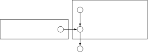

# Correlation Clustering of Bird Sounds

David Stein   Bjoern Andres

TU Dresden

###### Abstract

Bird sound classification is the task of relating any sound recording to
those species of bird that can be heard in the recording. Here, we study
bird sound clustering, the task of deciding for any pair of sound
recordings whether the same species of bird can be heard in both. We
address this problem by first learning, from a training set,
probabilities of pairs of recordings being related in this way, and then
inferring a maximally probable partition of a test set by correlation
clustering. We address the following questions: How accurate is this
clustering, compared to a classification of the test set? How do the
clusters thus inferred relate to the clusters obtained by
classification? How accurate is this clustering when applied to
recordings of bird species not heard during training? How effective is
this clustering in separating, from bird sounds, environmental noise not
heard during training?

## 1 Introduction

The abundance and variety of bird species are well-established markers
of biodiversity and the overall health of ecosystems \[10\]. Traditional
approaches to measuring these quantities rely on human experts counting
bird species at select locations by sighting and hearing \[34\]. This
approach is labor-intensive, costly and biased by the experience of
individual experts. Recently, progress has been made toward replacing
this approach by a combination of passive audio monitoring \[40, 8, 29\]
and automated bird sound classification \[21\]. The effectiveness of
this automated approach can be seen, for instance, in \[22, 45\]. Bird
sound classification is the task of relating any sound recording to
those species of bird that can be heard in the recording \[12, 21\].
Models and algorithms for bird sound classification are a topic of the
annual BirdCLEF Challenge \[11, 16, 17, 19, 20\]. Any model for bird
sound classification is defined and learned for a fixed set of bird
species. At the time of writing, the most accurate models developed for
this task all have the form of a neural network \[11, 12, 18, 20, 21,
22, 37, 39\].

Here, we study bird sound clustering, the task of deciding for any pair
of bird sound recordings whether the same species of bird can be heard
in both. We address this task in three steps. Firstly, we define a
probabilistic model of bird sound clusterings. Secondly, we learn from a
training set a probability mass function of the probability of pairs of
sound recordings being related. Thirdly, we infer a maximally probable
partition of a test set by solving a correlation clustering problem
locally. Unlike models for bird sound classification, the model we
define for bird sound clustering is agnostic to the notion of bird
species.

In this article, we make four contributions: Firstly, we quantify
empirically how accurate bird sound correlation clustering is compared
to bird sound classification. To this end, we compare in terms of a
metric known as the variation of information \[3, 31\] partitions of a
test set inferred using our model to partitions of the same test set
induced by classifications of this set according to a fixed set of bird
species. Secondly, we measure empirically how the clusters of the test
set inferred using our model relate to bird species. To this end, we
relate each cluster to an optimally matching bird species and count, for
each bird species, the numbers of false positives and false negatives.
Thirdly, we quantify empirically how accurate correlation clustering is
when applied to recordings of bird species not heard during training.
Fourthly, we quantify empirically the effectiveness of correlation
clustering in separating from bird sounds environmental noise not heard
during training.

## 2 Related Work

_Metric-based clustering_ of bird sounds with prior knowledge of the
number of clusters is studied in \[7, 30, 38\]: $`k`$ means clustering
in \[38\], $`k`$ nearest neighbor clustering in \[7\], and clustering
with respect to the distance to all elements of three given clusters in
\[30, Section 2.2\]. In contrast, we study _correlation clustering_
\[4\] of bird sounds without prior knowledge of the number of clusters.

In \[7\], the coefficients in the objective function of a clustering
problem are defined by the output of a Siamese network. Siamese
networks, introduced in \[6\] and described in the recent survey \[27\],
are applied to the tasks of classifying and embedding bird sounds in
\[7, 36\]. We follow \[7\] in that we also define the coefficients in
the objective function of a clustering problem by the output of a
Siamese network. However, as we consider a correlation clustering
problem, we learn the Siamese network by minimizing a loss function
fundamentally different from that in \[7\]. Beyond bird sounds,
correlation clustering with respect to costs defined by the output of a
Siamese network is considered in \[14, 26, 41\] for the task of
clustering images, and in \[43\] for the task of tracking humans in a
video. We are unaware of prior work on correlation clustering of bird
sounds.

Probabilistic models of the partitions of a set, and, more generally,
the decompositions of graphs, without priors or constraints on the
number or size of clusters, are studied for various applications,
including image segmentation \[1, 2, 23, 25\], motion trajectory
segmentation \[24\] and multiple object tracking \[42, 43\]. The
Bayesian network we introduce here for bird sound clustering is
analogous to the specialization to complete graphs of the model
introduced in \[2\] for image segmentation. Like in \[43\] and unlike in
\[2\], the probability mass function we consider here for the
probability of a pair of bird sounds being in the same cluster has the
form of a Siamese network. Like in \[2\] and unlike in \[43\], we
cluster all elements, without the possibility of choosing a subset.

Complementary to prior work and ours on either classification or
clustering of bird sounds are models for sound separation \[44\] that
can separate multiple bird species audible in the same sound recoding
and have been shown to increase the accuracy of bird sound
classification \[9\].

General theoretical connections between clustering and classification
are established in \[5, 47\].

## 3 Model



Figure 1: Depicted above is a Bayesian network defining conditional
independence assumptions of a probabilistic model for bird sound
clustering we introduce in Section 3.2.

### 3.1 Representation of clusterings

We consider a finite, non-empty set $`A`$ of sound recordings that we
seek to cluster. The feasible solutions to this task are the partitions
of the set $`A`$. Recall that a partition $`\Pi`$ of $`A`$ is a
collection $`\Pi\subseteq 2^{A}`$ of non-empty and pairwise disjoint
subsets of $`A`$ whose union is $`A`$. Here, $`2^{A}`$ denotes the power
set of $`A`$. We will use the terms _partition_ and _clustering_
synonymously for the purpose of this article and refer to the elements
of a partition as _clusters_.

Below, we represent any partition $`\Pi`$ of the set $`A`$, by the
function $`y^{\Pi}:\tbinom{A}{2}\to\{0,1\}`$ that maps any pair
$`\{a,a^{\prime}\}\in\tbinom{A}{2}`$ of distinct sound recordings
$`a,a^{\prime}\in A`$ to the number $`y^{\Pi}_{\{a,a^{\prime}\}}=1`$ if
$`a`$ and $`a^{\prime}`$ are in the same cluster, i.e. if there exists a
cluster $`U\in\Pi`$ such that $`a\in U`$ and $`a^{\prime}\in U`$, and
maps the pair to the number $`y^{\Pi}_{\{a,a^{\prime}\}}=0`$, otherwise.

Importantly, not every function $`y:\tbinom{A}{2}\to\{0,1\}`$
well-defines a partition of the set $`A`$. Instead, there can be three
distinct elements $`a,b,c`$ such that $`y_{\{a,b\}}=y_{\{b,c\}}=1`$ and
$`y_{\{a,c\}}=0`$. However, it is impossible to put $`a`$ and $`b`$ in
the same cluster, and put $`b`$ and $`c`$ in the same cluster, and not
put $`a`$ and $`c`$ in the same cluster, as this violates transitivity.
The functions $`y:\tbinom{A}{2}\to\{0,1\}`$ that well-define a partition
of the set $`A`$ are precisely those that hold the additional property

```math
\displaystyle\forall a\in A\;\forall b\in A\setminus\{a\}\;\forall c\in A\setminus\{a,b\}\colon\quad y_{\{a,b\}}+y_{\{b,c\}}-1\leq y_{\{a,c\}}\kern 5.0pt. \tag{1}
```

We let $`Z_{A}`$ denote the set of all such functions. That is:

```math
\displaystyle Z_{A}:=\left\{y^{\Pi}:\tbinom{A}{2}\to\{0,1\}\ \middle|\ \eqref{eq:triangle-inequalities}\right\}\kern 5.0pt. \tag{2}
```

### 3.2 Bayesian model

With the above representation of clusterings in mind, we define a
probabilistic model with four classes of random variables. This model is
depicted in Figure 1.

For every $`\{a,a^{\prime}\}\in\tbinom{A}{2}`$, let
$`\mathcal{X}_{\{a,a^{\prime}\}}`$ be a random variable whose value is a
vector $`x_{\{a,a^{\prime}\}}\in\mathbb{R}^{2m}`$, with
$`m\in\mathbb{N}`$. We call the first $`m`$ coordinates a _feature
vector_ of the sound recording $`a`$, and we call the last $`m`$
coordinates a feature vector of the sound recording $`a^{\prime}`$.
These feature vectors are described in more detail in Section 6.

For every $`\{a,a^{\prime}\}\in\tbinom{A}{2}`$, let
$`\mathcal{Y}_{\{a,a^{\prime}\}}`$ be a random variable whose value is a
binary number $`y_{\{a,a^{\prime}\}}\in\{0,1\}`$, indicating whether the
recordings $`a`$ and $`a^{\prime}`$ are in the same cluster,
$`y_{\{a,a^{\prime}\}}=1`$, or distinct clusters,
$`y_{\{a,a^{\prime}\}}=0`$.

For a fixed number $`n\in\mathbb{N}`$ and every $`j\in\{1,\dots,n\}`$,
let $`\Theta_{j}`$ be a random variable whose value is a real number
$`\theta_{j}\in\mathbb{R}`$ that we call a _model parameter_.

Finally, let $`\mathcal{Z}`$ be a random variable whose value is a set
$`Z\subseteq\{0,1\}^{\tbinom{A}{2}}`$ of feasible maps from the set
$`\tbinom{A}{2}`$ of pairs of distinct sound recordings to the binary
numbers. We will fix this random variable to the set $`Z_{A}`$ defined
in (2) of those functions that well-define a partition of the set $`A`$.

Among these random variables, we assume conditional independencies
according to the Bayesian Net depicted in Figure 1. This implies the
factorization:

```math
\displaystyle P(\mathcal{X},\mathcal{Y},\mathcal{Z},\Theta)=P(\mathcal{Z}\mid\mathcal{Y})\,\prod_{\mathclap{\{a,a^{\prime}\}\in\tbinom{A}{2}}}P(\mathcal{Y}_{\{a,a^{\prime}\}}\mid\mathcal{X}_{\{a,a^{\prime}\}},\Theta)\,\prod_{\mathclap{\{a,a^{\prime}\}\in\tbinom{A}{2}}}P(\mathcal{X}_{\{a,a\}})\prod_{j=1}^{2m}P(\Theta_{j}) \tag{3}
```


Figure 2: In order to decide if the same species of bird can be heard in
the spectrograms $`x_{a},x_{a^{\prime}}\in\mathbb{R}^{m}`$ of two
distinct sound recordings $`a,a^{\prime}\in A`$, we learn a Siamese
neural network. In this network, each spectrogram is mapped to a
$`d`$-dimensional vector via the same ResNet-18 \[13\],
$`g_{\mu}\colon\mathbb{R}^{m}\to\mathbb{R}^{d}`$, with output dimension
$`d=128`$ and parameters $`\mu\in\mathbb{R}^{11235905}`$. These vectors
are then concatenated and put into a fully connected layer
$`h_{\theta}\colon\mathbb{R}^{d}\times\mathbb{R}^{d}\to\mathbb{R}`$ with
a single linear output neuron and parameters
$`\nu\in\mathbb{R}^{33025}`$. Overall, this network defines the function
$`f_{\theta}\colon\mathbb{R}^{2m}\to\mathbb{R}`$ in the logistic
distribution (5), with parameters $`\theta:=(\mu,\nu)`$, such that for
any input pair $`(x_{a},x_{a^{\prime}})=x_{a,a^{\prime}}`$, we have
$`f_{\theta}(x_{\{a,a^{\prime}\}})=h_{\nu}(g_{\mu}(x_{a}),g_{\mu}(x_{a^{\prime}}))`$.

For the conditional probabilities on the right-hand side, we define
probability measures:

First is a probability mass function that assigns a probability mass of
zero to all $`y\notin Z`$ and assigns equal and positive probability
mass to all $`y\in Z`$. For any $`Z\subseteq\{0,1\}^{\tbinom{A}{2}}`$
and any $`y\in\{0,1\}^{\tbinom{A}{2}}`$:

```math
\displaystyle p_{\mathcal{Z}\mid\mathcal{Y}}(Z,y)\propto\begin{cases}1&\text{if\ }y\in Z\\
0&\text{otherwise}\end{cases}\kern 5.0pt. \tag{4}
```

Recall that we fix $`Z=Z_{A}`$, i.e. we assign positive and equal
probability mass to those binary labelings of pairs of audio recordings
that well-define a clustering of the set $`A`$.

Second is a logistic distribution: For any
$`\forall\{a,a^{\prime}\}\in\tbinom{A}{2}`$, any
$`x_{\{a,a^{\prime}\}}\in\mathbb{R}^{2m}`$ and any
$`\theta\in\mathbb{R}^{n}`$:

```math
\displaystyle p_{\mathcal{Y}_{\{a,a^{\prime}\}}\mid\mathcal{X}_{\{a,a^{\prime}\}},\Theta}(1,x_{\{a,a^{\prime}\}},\theta)=\frac{1}{1+2^{-f_{\theta}\left(x_{\{a,a^{\prime}\}}\right)}}\kern 5.0pt. \tag{5}
```

Here, the function $`f_{\theta}\colon\mathbb{R}^{2m}\to\mathbb{R}`$ has
the form of the Siamese neural network depicted in Figure 2.

Third is a uniform distribution on a finite interval. For a fixed
$`\tau\in\mathbb{R}^{+}`$, any $`j\in\{1,\dots,n\}`$ and any
$`\theta_{j}\in\mathbb{R}`$:

```math
\displaystyle p_{\Theta_{j}}(\theta_{j})\propto\begin{cases}1&\text{if\ }\theta_{j}\in[-\tau,\tau]\\
0&\text{otherwise}\end{cases}\kern 5.0pt. \tag{6}
```

## 4 Learning

Training data consists of (i) a set $`A`$ of sound recordings, (ii) for
each sound recording $`a\in A`$, a feature vector $`x_{a}`$, (iii) for
each pair $`\{a,a^{\prime}\}\in\tbinom{A}{2}`$ of distinct sound
recordings, a binary number $`y_{\{a,a^{\prime}\}}\in\{0,1\}`$ that is
$`1`$ if and only if a human annotator has labeled both $`a`$ and
$`a^{\prime}`$ with the same bird species. This training data fixes the
values of the random variables $`X`$ and $`Y`$ in the probabilistic
model. In addition, we fix $`Z=Z_{A}`$, as described above.

We learn model parameters by maximizing the conditional probability

```math
\displaystyle P(\Theta\mid\mathcal{X},\mathcal{Y},\mathcal{Z}) \displaystyle\propto\prod_{\{a,a^{\prime}\}\in\tbinom{A}{2}}\hskip-12.91663ptP(\mathcal{Y}_{\{a,a^{\prime}\}}\mid\mathcal{X}_{\{a,a^{\prime}\}},\Theta)\prod_{j=1}^{2m}P(\Theta_{j})\kern 5.0pt. \tag{7}
```

With the logistic distribution (5) and the prior distribution (6), and
after elementary arithmetic transformations, this problem takes the form
of the linearly constrained non-linear logistic regression problem

```math
\displaystyle\inf_{\theta\in\mathbb{R}^{2m}}\quad \displaystyle\sum_{\{a,a^{\prime}\}\in\tbinom{A}{2}}\left(-y_{\{a,a^{\prime}\}}f_{\theta}(x_{\{a,a^{\prime}\}})+\log_{2}(1+2^{f_{\theta}(x_{\{a,a^{\prime}\}})})\right) \tag{8}
```

```math
\displaystyle\forall j\in\{1,\dots,n\}\colon\ -\tau\leq\theta_{j}\leq\tau\kern 5.0pt. \tag{9}
```

In practice, we choose $`\tau`$ large enough for the constraints (9) to
be inactive for the training data we consider, i.e. we consider an
uninformative prior over the model parameters. We observe that the
unconstrained problem (8) is non-convex, due to the non-convexity of
$`f_{\theta}`$. In practice, we do not solve this problem, not even
locally. Instead, we compute a feasible solution
$`\hat{\theta}\in\mathbb{R}^{n}`$ heuristically, by means of stochastic
gradient descent with an adaptive learning rate. More specifically, we
employ the algorithm AdamW \[28\] with mini-batches
$`B_{A}\subseteq\tbinom{A}{2}`$ and the loss

```math
\frac{1}{|B_{A}|}\sum_{\{a,a^{\prime}\}\in B_{A}}\left(-y_{\{a,a^{\prime}\}}f_{\theta}(x_{\{a,a^{\prime}\}})+\log_{2}(1+2^{f_{\theta}(x_{\{a,a^{\prime}\}})})\right)\kern 5.0pt. \tag{10}
```

We set the initial learning rate to $`10^{-4}`$, the batch size to 64,
and the number of iterations to 380,000. Moreover, we balance the
batches in the sense that there are exactly $`|B_{A}|/2`$ elements in
$`B_{A}`$ with $`y_{\{a,a^{\prime}\}}=1`$ and exactly $`|B_{A}|/2`$
elements in $`B_{A}`$ with $`y_{\{a,a^{\prime}\}}=0`$. All learning is
carried out on a single NVIDIA A100 GPU with 16 AMD EPYC 7352 CPU cores,
equipped with 32 GB of RAM.

## 5 Inference

We assume to have learned and now fixed model parameters
$`\hat{\theta}`$. In addition, we are given a feature vector $`x_{a}`$
for every sound recording $`a\in A`$ of a test set $`A`$. This fixes the
values of the random variables $`\Theta`$ and $`X`$ in the probabilistic
model. In addition, we fix $`Z=Z_{A}`$, as described above, so as to
concentrate the probability measure on those binary decisions for pairs
of recordings that well-define a partition of the set $`A`$.

We infer a clustering of the set $`A`$ by maximizing the conditional
probability

```math
\displaystyle P(\mathcal{Y}\mid\mathcal{X},\mathcal{Z},\Theta)\ \propto\ P(\mathcal{Z}\mid\mathcal{Y})\ \prod_{\mathclap{\{a,a^{\prime}\}\in\tbinom{A}{2}}}P(\mathcal{Y}_{\{a,a^{\prime}\}}\mid\mathcal{X}_{\{a,a^{\prime}\}},\Theta) \tag{11}
```

For the uniform distribution (4) on the subset $`Z_{A}`$, and for the
logistic distribution (5), the maximizers of this probability mass can
be found by solving the correlation clustering problem

```math
\displaystyle\max_{y\colon\tbinom{A}{2}\to\{0,1\}}\quad \displaystyle f_{\theta}(x_{\{a,a^{\prime}\}})\;y_{\{a,a^{\prime}\}} \tag{12}
```

```math
\displaystyle\forall a\in A\;\forall b\in A\setminus\{a\}\;\forall c\in A\setminus\{a,b\}\colon\ y_{\{a,b\}}+y_{\{b,c\}}-1\leq y_{\{a,c\}} \tag{13}
```

In practice, we compute a locally optimal feasible solution
$`\hat{y}\colon\tbinom{A}{2}\to\{0,1\}`$ to this np-hard problem by
means of the local search algorithm GAEC, until convergence, and then
the local search algorithm KLj, both from \[25\]. The output $`\hat{y}`$
is guaranteed to well-define a clustering of the set $`A`$ such that any
distinct sound recordings $`a,a^{\prime}\in A`$ belong to the same
cluster if and only if $`\hat{y}_{\{a,a^{\prime}\}}=1`$.

## 6 Experiments

### 6.1 Dataset

We start from those 17,313 audio recordings of a total of 316 bird
species from the collection Xeno-Canto \[46\] of quality A or B that are
recorded in Germany, contain bird songs and do not contain background
species. The files are re-sampled to 44,100 Hz and split into chunks of
2 seconds. For each chunk, we compute the mel spectrogram with a frame
width of 1024 samples, an overlap of 768 samples and 128 mel bins and
re-scale it to $`128\times 384`$ entries. Finally, to distinguish
salient from non-salient chunks, we apply the signal detector proposed
in \[22\]. Bird species with less than 100 salient audio chunks are
excludeed. This defines a first dataset of 68 bird species with at least
10 minutes of audio recordings in total. We split this set according to
the proportions 8/1/1 into disjoint subsets Train-68, Val-68 and
Test-68. In addition, we consider a set Test-0,87 of 87 bird species
with less than 10 minutes but more than one minute of audio data. We
call the union of both test sets Test-68,87. In addition, we define a
set Test-N containing 39 classes of environmental noise not used for
augmentation from the collection ESC-50 \[33\]. We refer to the union of
Test-68 and Test-N as Test-68,N. During learning, we employ augmentation
techniques, specifically: horizontal and vertical roll, time shift,
SpecAugment \[32\], as well as the addition of white noise, pink noise
and some environmental noise from ESC-50.

### 6.2 Metrics

In order to measure the distance between a predicted partition
$`\hat{\Pi}`$ of a finite set $`A`$, on the one hand, and a true
partition $`\Pi`$ of the same set $`A`$, on the other hand, we evaluate
a metric known as the variation of information \[3, 31\]:

```math
\textnormal{VI}(\Pi,\hat{\Pi})=H(\Pi\mid\hat{\Pi})+H(\hat{\Pi}\mid\Pi) \tag{14}
```

Here, the conditional entropy $`H(\Pi\mid\hat{\Pi})`$ is indicative of
false joins, whereas the conditional entropy $`H(\hat{\Pi}\mid\Pi)`$ is
indicative of false cuts.

In order to measure the accuracy of decisions
$`\hat{y}\colon\tbinom{A}{2}\to\{0,1\}`$ for all pairs
$`\{a,a^{\prime}\}\in\tbinom{A}{2}`$ of sound recordings also for
decisions that do not well-define a clustering of $`A`$, we calculate
the numbers of true joins (TJ), true cuts (TC), false cuts (FC) and
false joins (FJ) of these pairs according to Equations 15 and 16 below.
From these, we calculate in the usual way the precision and recall of
cuts, the precision and recall of joins, and Rand’s index \[35\].

```math
\displaystyle\textnormal{TJ}(y^{\Pi},\hat{y})=\sum_{ij\in\tbinom{A}{2}}y^{\Pi}_{ij}\hat{y}_{ij}\kern 5.0pt,\quad \displaystyle\textnormal{TC}(y^{\Pi},\hat{y})=\sum_{ij\in\tbinom{A}{2}}(1-y^{\Pi}_{ij})(1-\hat{y}_{ij}) \tag{15}
```

```math
\displaystyle\textnormal{FC}(y^{\Pi},\hat{y})=\sum_{ij\in\tbinom{A}{2}}(1-\hat{y}_{ij})y^{\Pi}_{ij}\kern 5.0pt,\quad \displaystyle\textnormal{FJ}(y^{\Pi},\hat{y})=\sum_{ij\in\tbinom{A}{2}}\hat{y}_{ij}(1-y^{\Pi}_{ij})\kern 5.0pt. \tag{16}
```

### 6.3 Clustering vs Classification

|     |                               |         |      |      |                                       |                                       |       |       |       |       |       |
| --- | ----------------------------- | ------- | ---- | ---- | ------------------------------------- | ------------------------------------- | ----- | ----- | ----- | ----- | ----- |
|     | Model                         | $`\Pi`$ | RI   | VI   | $`\textnormal{VI}_{\textnormal{FC}}`$ | $`\textnormal{VI}_{\textnormal{FJ}}`$ | PC    | RC    | PJ    | RJ    | CA    |
| 1.  | $`f_{\theta}`$                | no      | 0.89 | -    | -                                     | -                                     | 97.9% | 89.9% | 42.6% | 79.5% | -     |
| 2.  | $`f_{\theta}`$ + Aug          | no      | 0.87 | -    | -                                     | -                                     | 98.7% | 86.9% | 38.7% | 87.6% | -     |
| 3.  | $`f_{\theta}`$ + CC           | yes     | 0.93 | 4.21 | 1.99                                  | 2.22                                  | 97.3% | 95.0% | 57.6% | 72.1% | -     |
| 4.  | $`f_{\theta}`$ + Aug + CC     | yes     | 0.91 | 3.28 | 1.34                                  | 1.95                                  | 98.1% | 92.0% | 48.9% | 81.3% | -     |
| 5.  | $`f_{\theta}`$ + CC + T       | yes     | 0.93 | 4.21 | 2.02                                  | 2.19                                  | 97.3% | 95.2% | 58.5% | 71.7% | -     |
| 6.  | $`f_{\theta}`$ + Aug + CC + T | yes     | 0.91 | 3.27 | 1.35                                  | 1.91                                  | 98.1% | 92.2% | 49.4% | 80.8% | -     |
| 7.  | ResNet18                      | yes     | 0.94 | 4.67 | 2.33                                  | 2.34                                  | 96.7% | 96.9% | 66.2% | 64.8% | 59.6% |
| 8.  | ResNet18 + Aug                | yes     | 0.96 | 3.20 | 1.68                                  | 1.72                                  | 97.3% | 97.8% | 75.3% | 71.8% | 72.7% |
| 9.  | BirdNET Analyzer              | yes     | 0.77 | 3.50 | 1.22                                  | 2.28                                  | 94.3% | 79.4% | 18.3% | 48.9% | 49.7% |
| 10. | $`f_{\theta}`$ + T            | yes     | 0.93 | 4.26 | 1.97                                  | 2.29                                  | 97.3% | 95.0% | 57.8% | 72.2% | 64.1% |
| 11. | $`f_{\theta}`$ + Aug + T      | yes     | 0.94 | 3.31 | 1.48                                  | 1.83                                  | 97.8% | 95.6% | 62.6% | 77.3% | 73.1% |

Table 1: Above, we report, for models trained on Train-68 and evaluated
on Test-68, whether the inferred solution well-defines a partition of
Test-68 ($`\Pi`$) and how this solution compares to the truth in terms
of Rand’s index (RI), the variation of information (VI), conditional
entropies due to false cuts ($`\textnormal{VI}_{\textnormal{FC}}`$) and
false joins ($`\textnormal{VI}_{\textnormal{FJ}}`$), the precision (P)
and recall (R) of cuts (C) and joins (J), and the classification
accuracy (CA).

Here, we describe the experiments we conduct in order to compare the
accuracy of a clustering of bird sounds with the accuracy of a
classification of bird sounds. The results are shown in Table 1 and
Figure 3.

Procedure and results. Toward clustering, we learn the model
$`f_{\theta}`$ defined in Section 3.2, as described in Section 4, from
the data set Train-68, with and without data augmentation, and apply it
to the independent data set Test-68 in two different ways: Firstly, we
infer an independent decision $`y_{\{a,a^{\prime}\}}\in\{0,1\}`$ for
every pair of distinct sound recordings $`a,a^{\prime}`$, by asking
whether $`f_{\theta}(x_{\{a,a^{\prime}\}})\geq 0`$
($`y_{\{a,a^{\prime}\}}=1`$) or $`f_{\theta}(x_{\{a,a^{\prime}\}})<0`$
($`y_{\{a,a^{\prime}\}}=0`$). These decisions together do not
necessarily well-define a clustering of Test-68. Yet, we compare these
decisions independently to the truth, in Rows 1-2 of Table 1. Secondly,
we infer a partition of Test-68 by correlation clustering, as described
in Section 5 (Rows 3-4 of Table 1). Thirdly, we infer a partition of
Test-68 and a subsample of Train-68, which contains 128 randomly chosen
recordings per species, jointly by locally solving the correlation
clustering problem for the union of these data sets, also as described
in Section 5; (Rows 5-6 of Table 1).

Toward classification, we learn a ResNet-18 on Train-68, with and
without data augmentation. Using this model, we infer a classification
of Test-68 (Rows 7-8 of Table 1). In addition, we classify Test-68 by
means of BirdNET analyzer \[22\] (Row 9 of Table 1). We remark that
BirdNET is defined for 3-second sound recordings while we work with
2-second sound recordings. When applying BirdNET to these 2-second
recordings, they are padded with random noise as described in \[15\].
Finally, we infer a classification of Test-68 by assigning each sound
recording to one of the true clusters of Train-68 for which this
assignment is maximally probable according to the model $`f_{\theta}`$
learned on Train-68. We report the accuracy of this classification with
respect to $`f_{\theta}`$ in Rows 10-11 of Table 1. For each
classification of Test-68, we report the distance from the truth of the
_clustering_ of Test-68 induced by the classification. This allows for a
direct comparison of classification with clustering.

Discussion. Closest to the truth by a variation of information of
$`3.20`$ is the clustering of Test-68 induced by the classification of
Test-68 by means of the ResNet-18 learned from Train-68, with data
augmentation (Row 8 in Table 1). This result is expected, as
classification is clustering with a constrained set of clusters, and
this constraint constitutes additional prior knowledge. Dropping this
information during learning but not during inference (Row 6 in Table 1)
leads to the second best clustering that differs from the true
clustering of Test-68 by a variation of information of $`3.27`$.
Dropping this knowledge during learning and inference (Row 4 in Table 1)
leads to a variation of information $`3.28`$. It can be seen from these
results that a clustering of this bird sound data set is less accurate
than a classification, but still informative. From a comparison of Rows
2 and 4 of Table 1, it can bee seen that the local solution of the
correlation clustering problem not only leads to decisions for pairs of
sound recordings that well-define a clustering of Test-68 but also
increases the accuracy of these decisions in terms of Rand’s index, from
0.87 to 0.91. Looking at these two experiments in more detail, we
observe an increase in the recall of cuts and precision of joins due to
correlation clustering, while the precision of cuts decreases slightly
and the recall of joins decreases strongly. Indeed, we observe more
clusters than bird species (see Figure 3). There are two possible
explanations for this effect. Firstly, the local search algorithm we
apply starts from the finest possible clustering into singleton sets and
is therefore biased toward excessive cuts (more clusters). Secondly,
there might be different types of sounds associated with the same bird
species. We have not been able to confirm or refute this hypothesis and
are encouraged to collaborate with ornithologists to gain additional
insight.

### 6.4 Clustering Unseen Data

|     | Model                     | $`\Pi`$ | RI   | VI   | $`\textnormal{VI}_{\textnormal{FC}}`$ | $`\textnormal{VI}_{\textnormal{FJ}}`$ | PC    | RC    | PJ    | RJ    | CA    |
| --- | ------------------------- | ------- | ---- | ---- | ------------------------------------- | ------------------------------------- | ----- | ----- | ----- | ----- | ----- |
| 1.  | $`f_{\theta}`$            | no      | 0.82 | -    | -                                     | -                                     | 97.5% | 83.5% | 14.6% | 57.1% | -     |
| 2.  | $`f_{\theta}`$ + Aug      | no      | 0.78 | -    | -                                     | -                                     | 97.8% | 79.2% | 13.1% | 64.0% | -     |
| 3.  | $`f_{\theta}`$ + CC       | yes     | 0.90 | 5.42 | 2.30                                  | 3.12                                  | 96.9% | 92.4% | 20.8% | 40.9% | 37.7% |
| 4.  | $`f_{\theta}`$ + Aug + CC | yes     | 0.86 | 5.06 | 1.83                                  | 3.23                                  | 97.2% | 88.4% | 16.7% | 47.5% | 39.4% |

Table 2: Above, we report the accuracy of the learned model
$`f_{\theta}`$ when applied to the task of clustering the data set
Test-0,87 of bird sounds of 87 bird species not heard during training.

|     | Model                     | $`\Pi`$ |     | $`J_{\textnormal{UU}}`$ | $`C_{\textnormal{UU}}`$ | $`J_{\textnormal{UB}}`$ | $`C_{\textnormal{UB}}`$ | $`J_{\textnormal{BB}}`$ | $`C_{\textnormal{BB}}`$ |
| --- | ------------------------- | ------- | --- | ----------------------- | ----------------------- | ----------------------- | ----------------------- | ----------------------- | ----------------------- |
| 1.  | $`f_{\theta}`$            | no      | P:  | 14.6%                   | 97.5%                   | 0%                      | 100%                    | 42.6%                   | 97.9%                   |
|     |                           |         | R:  | 57.1%                   | 83.5%                   | 100%                    | 84.6%                   | 79.5%                   | 89.9%                   |
| 2.  | $`f_{\theta}`$ + Aug      | no      | P:  | 13.1%                   | 97.8%                   | 0%                      | 100%                    | 38.7%                   | 98.7%                   |
|     |                           |         | R:  | 64.0%                   | 79.2%                   | 100%                    | 81.1%                   | 87.6%                   | 86.9%                   |
| 3.  | $`f_{\theta}`$ + CC       | yes     | P:  | 14.3%                   | 96.1%                   | 0%                      | 100%                    | 59.7%                   | 97.1%                   |
|     |                           |         | R:  | 23.2%                   | 93.2%                   | 100%                    | 91.7%                   | 70.1%                   | 95.5%                   |
| 4.  | $`f_{\theta}`$ + CC + Aug | yes     | P:  | 17.7%                   | 96.8%                   | 0%                      | 100%                    | 47.7%                   | 98.1%                   |
|     |                           |         | R:  | 39.0%                   | 91.1%                   | 100%                    | 89.0%                   | 81.3%                   | 91.6%                   |

Table 3: Above, we report the accuracy of the learned model
$`f_{\theta}`$ when applied to the task of clustering the data set
Test-68,87 of bird sounds of 68 bird species heard during training and
87 bird species not heard during training. More specifically, we report
precision and recall of cuts and joins, separately for pairs of sound
recordings both belonging to Test-0,87 (UU), both belonging to Test-68
(BB) or containing one from the set Test-0,87 and one from the set
Test-68 (UB).

Next, we describe the experiments we conduct in order to quantify the
accuracy of the learned model for bird sound clustering when applied to
sounds of bird species not heard during training. The results are shown
in Table 2. Additional results for a combination of bird species heard
and not heard during training are shown in Table 3.

Procedure and results. To begin with, we learn $`f_{\theta}`$ on
Train-68 as described in Section 4. Then, analogously to Section 6.3, we
infer an independent decision $`y_{\{a,a^{\prime}\}}\in\{0,1\}`$ for
every pair of distinct sound recordings $`a,a^{\prime}`$ from the data
set Test-0,87, by asking whether
$`f_{\theta}(x_{\{a,a^{\prime}\}})\geq 0`$. We compare these independent
decisions to the truth, in Rows 1-2 of Table 2. Next, we infer a
partition of Test-0,87 by correlation clustering, as described in
Section 5; see Rows 3-4 of Table 2. Analogously to these two
experiments, we infer decisions and a partition of the joint test set
Test-68,87; see Table 3.

Discussion. It can be seen from Rows 3 and 4 of Table 2 that a
clustering inferred using the model $`f_{\theta}`$ of the bird sounds of
the data set Test-0,87 of 87 bird species not contained in the training
data Train-68 is informative, i.e. better than random guessing.
Furthermore, it can be seen from a comparison of Rows 1 and 3 as well as
from a comparison of Rows 2 and 4 of Table 2 that correlation clustering
increases the recall of cuts and the precision of joins, but decreases
the precision of cuts and the recall of joins. Precision and recall of
cuts are consistently higher than precision and recall of joins. This
observation is consistent with the excessive cuts we have observed also
for bird species seen during training, cf. Section 6.3. Possible
explanations are, firstly, the bias toward excessive cuts in clusterings
output by the local search algorithm we use for the correlation
clustering problem and, secondly, the presence of different types of
sounds for the same bird species in the data set Test-0,87. From
Table 3, it can be seen that the clustering inferred using
$`f_{\theta}`$ separates heard from unheard bird species accurately.
From a comparison of Tables 1, 3 and 2, it can be seen for pairs of bird
sounds both from species heard during training (BB) or both from species
not heard during training (UU), that the accuracy degrades little in a
clustering of the joint set Test-68,87, compared to clusterings of the
separate sets Test-68 and Test-0,87.

| Model                     | $`\Pi`$ |     | $`J_{\textnormal{NN}}`$ | $`C_{\textnormal{NN}}`$ | $`J_{\textnormal{NB}}`$ | $`C_{\textnormal{NB}}`$ | $`J_{\textnormal{BB}}`$ | $`C_{\textnormal{BB}}`$ |
| ------------------------- | ------- | --- | ----------------------- | ----------------------- | ----------------------- | ----------------------- | ----------------------- | ----------------------- |
| $`f_{\theta}`$            | no      | P:  | 3.9%                    | 98.5%                   | 0%                      | 100%                    | 42.6%                   | 97.9%                   |
|                           |         | R:  | 64.1%                   | 59.2%                   | 100%                    | 78.4%                   | 79.5%                   | 89.9%                   |
| $`f_{\theta}`$ + Aug      | no      | P:  | 3.2%                    | 98.9%                   | 0%                      | 100%                    | 38.7%                   | 98.7%                   |
|                           |         | R:  | 84.9%                   | 34.2%                   | 100%                    | 77.9%                   | 87.6%                   | 86.9%                   |
| $`f_{\theta}`$ + CC       | yes     | P:  | 3.3%                    | 97.7%                   | 0%                      | 100%                    | 57.5%                   | 97.3%                   |
|                           |         | R:  | 25.0%                   | 81.4%                   | 100%                    | 87.0%                   | 72.0%                   | 95.0%                   |
| $`f_{\theta}`$ + CC + Aug | yes     | P:  | 3.5%                    | 98.0%                   | 0%                      | 100%                    | 47.7%                   | 98.2%                   |
|                           |         | R:  | 47.5%                   | 66.8%                   | 100%                    | 88.2%                   | 82.3%                   | 91.5%                   |

Table 4: Above, we report the accuracy of the learned model
$`f_{\theta}`$ on Test-68,N. This includes precision and recall of cuts
and joins for pairs of recordings both the from Test-N (NN), both from
Test-68 (BB) or one from Test-N and one from Test-68 (NB).

### 6.5 Clustering Noise

Next, we describe the experiments we conduct in order to quantify the
accuracy of clusterings, inferred using the learned model, of bird
sounds and environmental noise not heard during training. The results
are shown in Table 4.

Procedure and results. To begin with, we learn $`f_{\theta}`$ on the
data set Train-68 as described in Section 4. Then, analogously to
Section 6.4, we infer an independent decision
$`y_{\{a,a^{\prime}\}}\in\{0,1\}`$ for every pair of distinct sound
recordings $`a,a^{\prime}`$ from the data set Test-68,N, by asking
whether $`f_{\theta}(x_{\{a,a^{\prime}\}})\geq 0`$. We compare these
independent decisions to the truth, in Rows 1-2 of Table 4. Next, we
infer a partition of Test-68,N by correlation clustering, as described
in Section 5; see Rows 3-4 of Table 4.

Discussion. From Table 4, it can be seen that $`f_{\theta}`$ separates
environmental noise form the set Test-N accurately from bird sounds from
the set Test-68, with or without correlation clustering, and despite the
fact that the noise has not been heard during training on Train-68. From
a comparison of Tables 4 and 1, it can be seen that the clustering of
those sound recordings that both belong to Test-68 (BB) degrades only
slightly when adding the environmental noise from the set Test-N to the
problem. From the column $`J_{NB}`$ and $`C_{NB}`$ of Table 4, it can be
seen that clustering the 39 types of noise is more challenging. This is
expected, as environmental noise is different from bird sounds and has
not been heard during training.

## 7 Conclusion

We have defined a probabilistic model, along with heuristics for
learning and inference, for clustering sound recordings of birds by
estimating for pairs of recordings whether the same species of bird can
be heard in both. For a public collection of bird sounds, we have shown
empirically that partitions inferred by our model are less accurate than
classifications with a known and fixed set of bird species, but are
still informative. Specifically, we have observed more clusters than
bird species. This observation encourages future work toward solving the
instances of the inference problem exactly, with the goal of eliminating
a bias toward additional clusters introduced by the inexact local search
algorithm we employ here. This observation also encourages future
collaboration with ornithologists toward an analysis of the additional
clusters. Finally, our model has proven informative when applied to
sound recordings of 87 bird species not heard during training, and in
separating from bird sounds 39 types of environmental noise not used for
training. Further work is required to decide if this can be exploited in
practice, e.g. for rare species with little training data.

### Acknowledgment

The authors acknowledge funding by the Federal Ministry of Education and
Research of Germany, from grant 01LC2006A.


Figure 3: For a correlation clustering of the set Test-68 with respect
to the model $`f_{\theta}`$ trained on Train-68, the relation between
predicted clusters (rows) and true bird species (columns) is shown in
terms of precision (blue) and recall (red).

## References

- \[1\] Bjoern Andres, Jörg H. Kappes, Thorsten Beier, Ullrich Köthe,
  and Fred A. Hamprecht. Probabilistic image segmentation with
  closedness constraints. In ICCV, 2011.
  [doi:10.1109/ICCV.2011.6126550](https://doi.org/10.1109/ICCV.2011.6126550).
- \[2\] Bjoern Andres, Thorben Kröger, Kevin L. Briggman, Winfried Denk,
  Natalya Korogod, Graham Knott, Ullrich Köthe, and Fred A. Hamprecht.
  Globally optimal closed-surface segmentation for connectomics. In
  ECCV, 2012.
  [doi:10.1007/978-3-642-33712-3_56](https://doi.org/10.1007/978-3-642-33712-3_56).
- \[3\] Phipps Arabie and Scott A. Boorman. Multidimensional scaling of
  measures of distance between partitions. Journal of Mathematical
  Psychology, 10(2):148–203, 1973.
  [doi:10.1016/0022-2496(73)90012-6](<https://doi.org/10.1016/0022-2496(73)90012-6>).
- \[4\] Nikhil Bansal, Avrim Blum, and Shuchi Chawla. Correlation
  clustering. Machine Learning, 56(1):89–113, 2004.
  [doi:10.1023/B:MACH.0000033116.57574.95](https://doi.org/10.1023/B:MACH.0000033116.57574.95).
- \[5\] Han Bao, Takuya Shimada, Liyuan Xu, Issei Sato, and Masashi
  Sugiyama. Pairwise supervision can provably elicit a decision
  boundary. In AISTATS, 2022. URL:
  [https://proceedings.mlr.press/v151/bao22a.html](https://proceedings.mlr.press/v151/bao22a.html).
- \[6\] Jane Bromley, Isabelle Guyon, Yann LeCun, Eduard Säckinger, and
  Roopak Shah. Signature verification using a “siamese” time delay
  neural network. In NIPS, 1993. URL:
  [https://proceedings.neurips.cc/paper_files/paper/1993/file/288cc0ff022877bd3df94bc9360b9c5d-Paper.pdf](https://proceedings.neurips.cc/paper_files/paper/1993/file/288cc0ff022877bd3df94bc9360b9c5d-Paper.pdf).
- \[7\] Thailsson Clementino and J. Colonna. Using triplet loss for bird
  species recognition on BirdCLEF 2020. In Conference and Labs of the
  Evaluation Forum (working notes), 2020.
- \[8\] Kevin Darras, Péter Batáry, Brett Furnas, Antonio Celis-Murillo,
  Steven L. Van Wilgenburg, Yeni A. Mulyani, and Teja Tscharntke.
  Comparing the sampling performance of sound recorders versus point
  counts in bird surveys: A meta-analysis. Journal of Applied Ecology,
  55(6):2575–2586, 2018.
  [doi:https://doi.org/10.1111/1365-2664.13229](https://doi.org/https://doi.org/10.1111/1365-2664.13229).
- \[9\] Tom Denton, Scott Wisdom, and John R. Hershey. Improving bird
  classification with unsupervised sound separation. In International
  Conference on Acoustics, Speech and Signal Processing, 2022.
  [doi:10.1109/ICASSP43922.2022.9747202](https://doi.org/10.1109/ICASSP43922.2022.9747202).
- \[10\] John W Fitzpatrick and Irby J Lovette. Handbook of bird
  biology. John Wiley & Sons, 2016.
- \[11\] Hervé Goëau, Stefan Kahl, Hervé Glotin, Robert Planqué,
  Willem-Pier Vellinga, and Alexis Joly. Overview of BirdCLEF 2018:
  monospecies vs. soundscape bird identification. In Conference and Labs
  of the Evaluation Forum, 2018.
- \[12\] Gaurav Gupta, Meghana Kshirsagar, Ming Zhong, Shahrzad Gholami,
  and Juan Lavista Ferres. Comparing recurrent convolutional neural
  networks for large scale bird species classification. Scientific
  reports, 11(1):17085, 2021.
  [doi:10.1038/s41598-021-96446-w](https://doi.org/10.1038/s41598-021-96446-w).
- \[13\] Kaiming He, Xiangyu Zhang, Shaoqing Ren, and Jian Sun. Deep
  residual learning for image recognition. In CVPR, 2016.
  [doi:10.1109/CVPR.2016.90](https://doi.org/10.1109/CVPR.2016.90).
- \[14\] Kalun Ho, Janis Keuper, Franz-Josef Pfreundt, and Margret
  Keuper. Learning embeddings for image clustering: An empirical study
  of triplet loss approaches. In International Conference on Pattern
  Recognition, 2021.
  [doi:10.1109/ICPR48806.2021.9412602](https://doi.org/10.1109/ICPR48806.2021.9412602).
- \[15\] Stefan Kahl. BirdNET Analyzer. URL:
  [https://github.com/kahst/BirdNET-Analyzer](https://github.com/kahst/BirdNET-Analyzer).
- \[16\] Stefan Kahl, Mary Clapp, W Alexander Hopping, Hervé Goëau,
  Hervé Glotin, Robert Planqué, Willem-Pier Vellinga, and Alexis Joly.
  Overview of BirdCLEF 2020: Bird sound recognition in complex acoustic
  environments. In Conference and Labs of the Evaluation Forum, 2020.
- \[17\] Stefan Kahl, Tom Denton, Holger Klinck, Hervé Glotin, Hervé
  Goëau, Willem-Pier Vellinga, Robert Planqué, and Alexis Joly. Overview
  of BirdCLEF 2021: Bird call identification in soundscape recordings.
  In Conference and Labs of the Evaluation Forum (working notes), 2021.
- \[18\] Stefan Kahl, Hussein Hussein, Etienne Fabian, Jan Schloßhauer,
  Enniyan Thangaraju, Danny Kowerko, and Maximilian Eibl. Acoustic event
  classification using convolutional neural networks. In Informatik 2017. Gesellschaft für Informatik, Bonn, 2017.
  [doi:10.18420/in2017_217](https://doi.org/10.18420/in2017_217).
- \[19\] Stefan Kahl, Amanda Navine, Tom Denton, Holger Klinck, Patrick
  Hart, Hervé Glotin, Hervé Goëau, Willem-Pier Vellinga, Robert Planqué,
  and Alexis Joly. Overview of BirdCLEF 2022: Endangered bird species
  recognition in soundscape recordings. In Conference and Labs of the
  Evaluation Forum (working notes), 2022.
- \[20\] Stefan Kahl, Fabian-Robert Stöter, Hervé Goëau, Hervé Glotin,
  Robert Planque, Willem-Pier Vellinga, and Alexis Joly. Overview of
  BirdCLEF 2019: large-scale bird recognition in soundscapes. In
  Conference and Labs of the Evaluation Forum, 2019.
- \[21\] Stefan Kahl, Thomas Wilhelm-Stein, Hussein Hussein, Holger
  Klinck, Danny Kowerko, Marc Ritter, and Maximilian Eibl. Large-scale
  bird sound classification using convolutional neural networks. In
  Conference and Labs of the Evaluation Forum (working notes), 2017.
- \[22\] Stefan Kahl, Connor M. Wood, Maximilian Eibl, and Holger
  Klinck. BirdNET: A deep learning solution for avian diversity
  monitoring. Ecological Informatics, 61:101236, 2021.
  [doi:https://doi.org/10.1016/j.ecoinf.2021.101236](https://doi.org/https://doi.org/10.1016/j.ecoinf.2021.101236).
- \[23\] Jörg Hendrik Kappes, Paul Swoboda, Bogdan Savchynskyy, Tamir
  Hazan, and Christoph Schnörr. Multicuts and perturb & MAP for
  probabilistic graph clustering. J. Math. Imaging Vis.,
  56(2):221–237, 2016.
  [doi:10.1007/s10851-016-0659-3](https://doi.org/10.1007/s10851-016-0659-3).
- \[24\] Margret Keuper, Bjoern Andres, and Thomas Brox. Motion
  trajectory segmentation via minimum cost multicuts. In ICCV, 2015.
  [doi:10.1109/ICCV.2015.374](https://doi.org/10.1109/ICCV.2015.374).
- \[25\] Margret Keuper, Evgeny Levinkov, Nicolas Bonneel, Guillaume
  Lavoué, Thomas Brox, and Bjoern Andres. Efficient decomposition of
  image and mesh graphs by lifted multicuts. In ICCV, 2015.
  [doi:10.1109/ICCV.2015.204](https://doi.org/10.1109/ICCV.2015.204).
- \[26\] Evgeny Levinkov, Alexander Kirillov, and Bjoern Andres. A
  comparative study of local search algorithms for correlation
  clustering. In GCPR, 2017.
  [doi:10.1007/978-3-319-66709-6_9](https://doi.org/10.1007/978-3-319-66709-6_9).
- \[27\] Yikai Li, C. L. Philip Chen, and Tong Zhang. A survey on
  siamese network: Methodologies, applications, and opportunities.
  Transactions on Artificial Intelligence, 3(6):994–1014, 2022.
  [doi:10.1109/TAI.2022.3207112](https://doi.org/10.1109/TAI.2022.3207112).
- \[28\] Ilya Loshchilov and Frank Hutter. Decoupled weight decay
  regularization. In ICLR, 2019. URL:
  [https://openreview.net/forum?id=Bkg6RiCqY7](https://openreview.net/forum?id=Bkg6RiCqY7).
- \[29\] Nonka Markova-Nenova, Jan O. Engler, Anna F. Cord, and Frank
  Wätzold. A cost comparison analysis of bird-monitoring techniques for
  result-based payments in agriculture. Technical report, University
  Library of Munich, Germany, 2023. URL:
  [https://EconPapers.repec.org/RePEc:pra:mprapa:116311](https://EconPapers.repec.org/RePEc:pra:mprapa:116311).
- \[30\] Kate McGinn, Stefan Kahl, M. Zachariah Peery, Holger Klinck,
  and Connor M. Wood. Feature embeddings from the BirdNET algorithm
  provide insights into avian ecology. Ecological Informatics,
  74:101995, 2023.
  [doi:https://doi.org/10.1016/j.ecoinf.2023.101995](https://doi.org/https://doi.org/10.1016/j.ecoinf.2023.101995).
- \[31\] Marina Meilă. Comparing clusterings—an information based
  distance. Journal of Multivariate Analysis, 98(5):873–895, 2007.
  [doi:10.1016/j.jmva.2006.11.013](https://doi.org/10.1016/j.jmva.2006.11.013).
- \[32\] Daniel S. Park, William Chan, Yu Zhang, Chung-Cheng Chiu,
  Barret Zoph, Ekin D. Cubuk, and Quoc V. Le. SpecAugment: A Simple Data
  Augmentation Method for Automatic Speech Recognition. In Interspeech
  2019, 2019.
  [doi:10.21437/Interspeech.2019-2680](https://doi.org/10.21437/Interspeech.2019-2680).
- \[33\] Karol J. Piczak. ESC: Dataset for Environmental Sound
  Classification. In ACM Conference on Multimedia, 2015.
  [doi:10.1145/2733373.2806390](https://doi.org/10.1145/2733373.2806390).
- \[34\] C John Ralph, John R Sauer, and Sam Droege. Monitoring bird
  populations by point counts. Pacific Southwest Research Station, 1995.
- \[35\] William M. Rand. Objective criteria for the evaluation of
  clustering methods. Journal of the American Statistical Association,
  66(336):846–850, 1971.
  [doi:10.1080/01621459.1971.10482356](https://doi.org/10.1080/01621459.1971.10482356).
- \[36\] Santiago Rentería, Edgar E. Vallejo, and Charles E. Taylor.
  Birdsong phrase verification and classification using siamese neural
  networks. bioRxiv, 2021. (preprint).
  [doi:10.1101/2021.03.16.435625](https://doi.org/10.1101/2021.03.16.435625).
- \[37\] Justin Salamon and Juan Pablo Bello. Deep convolutional neural
  networks and data augmentation for environmental sound classification.
  Signal Processing Letters, 24(3):279–283, 2017.
  [doi:10.1109/LSP.2017.2657381](https://doi.org/10.1109/LSP.2017.2657381).
- \[38\] Harshita Seth, Rhythm Bhatia, and Padmanabhan Rajan. Feature
  learning for bird call clustering. In International Conference on
  Industrial and Information Systems, 2018.
  [doi:10.1109/ICIINFS.2018.8721418](https://doi.org/10.1109/ICIINFS.2018.8721418).
- \[39\] Antoine Sevilla and Hervé Glotin. Audio bird classification
  with inception-v4 extended with time and time-frequency attention
  mechanisms. In Conference and Labs of the Evaluation Forum (working
  notes), 2017.
- \[40\] Julia Shonfield and Erin M Bayne. Autonomous recording units in
  avian ecological research: current use and future applications. Avian
  Conservation & Ecology, 12(1), 2017.
  [doi:10.5751/ACE-00974-120114](https://doi.org/10.5751/ACE-00974-120114).
- \[41\] Jie Song, Bjoern Andres, Michael J Black, Otmar Hilliges, and
  Siyu Tang. End-to-end learning for graph decomposition. In ICCV, 2019.
  [doi:10.1109/ICCV.2019.01019](https://doi.org/10.1109/ICCV.2019.01019).
- \[42\] Siyu Tang, Bjoern Andres, Miykhaylo Andriluka, and Bernt
  Schiele. Subgraph decomposition for multi-target tracking. In
  CVPR, 2015.
  [doi:10.1109/CVPR.2015.7299138](https://doi.org/10.1109/CVPR.2015.7299138).
- \[43\] Siyu Tang, Mykhaylo Andriluka, Bjoern Andres, and Bernt
  Schiele. Multiple people tracking by lifted multicut and person
  re-identification. In CVPR, 2017.
  [doi:10.1109/CVPR.2017.394](https://doi.org/10.1109/CVPR.2017.394).
- \[44\] Scott Wisdom, Efthymios Tzinis, Hakan Erdogan, Ron J. Weiss,
  Kevin Wilson, and John R. Hershey. Unsupervised sound separation using
  mixture invariant training. In NeurIPS, 2020. URL:
  [https://proceedings.neurips.cc/paper/2020/file/28538c394c36e4d5ea8ff5ad60562a93-Paper.pdf](https://proceedings.neurips.cc/paper/2020/file/28538c394c36e4d5ea8ff5ad60562a93-Paper.pdf).
- \[45\] Connor M. Wood, Ralph J. Gutiérrez, and M. Zachariah Peery.
  Acoustic monitoring reveals a diverse forest owl community,
  illustrating its potential for basic and applied ecology. Ecology,
  100(9), 2019.
  [doi:10.1002/ecy.2764](https://doi.org/10.1002/ecy.2764).
- \[46\] Xeno-canto. Sharing wildlife sounds from around the
  world, 2023. URL:
  [https://xeno-canto.org/about/xeno-canto](https://xeno-canto.org/about/xeno-canto).
- \[47\] Jian Zhang and Rong Yan. On the value of pairwise constraints
  in classification and consistency. In ICML, 2007.
  [doi:10.1145/1273496.1273636](https://doi.org/10.1145/1273496.1273636).
