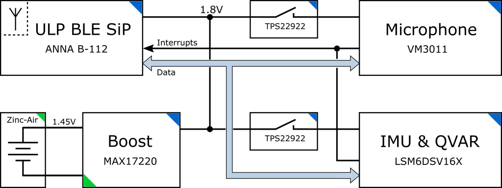
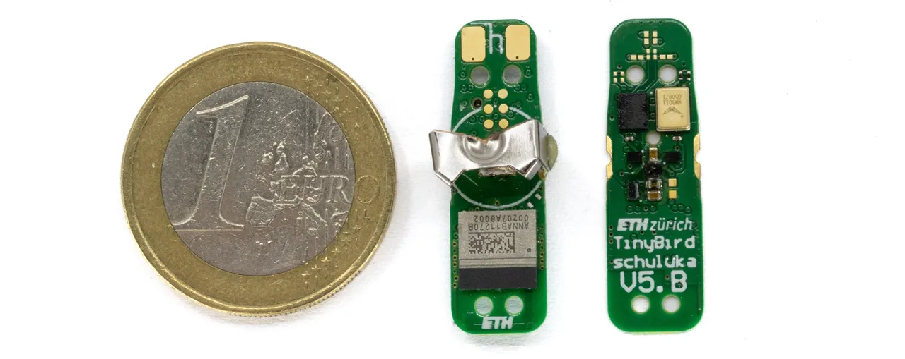
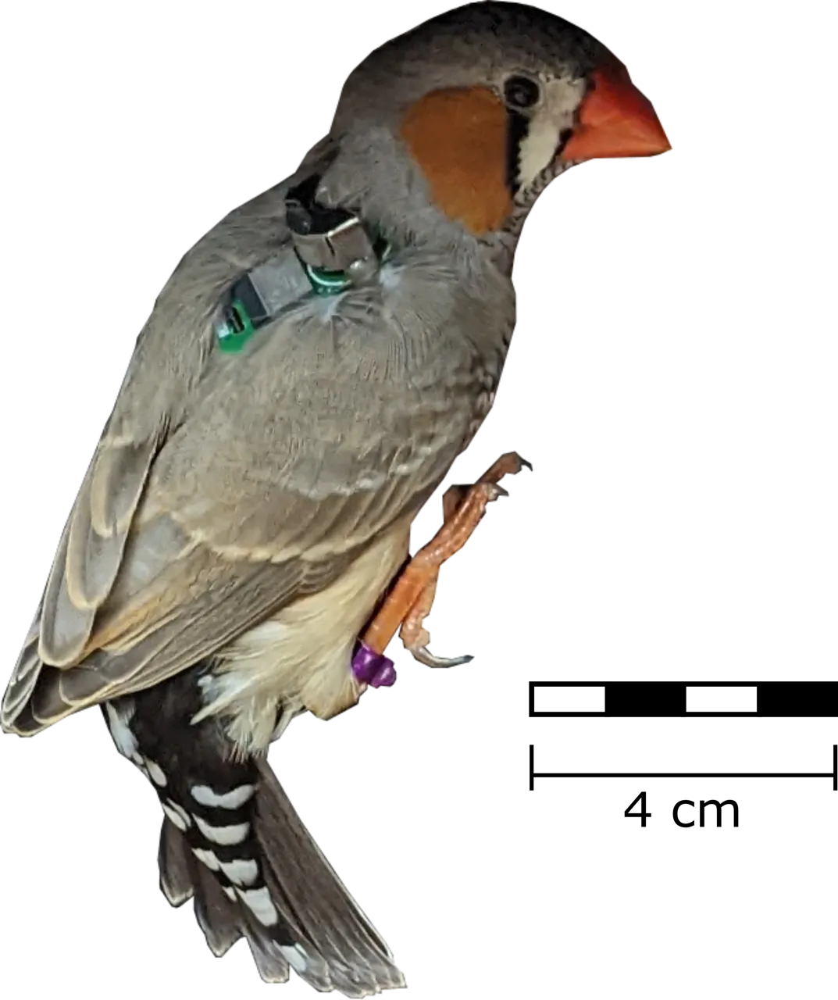
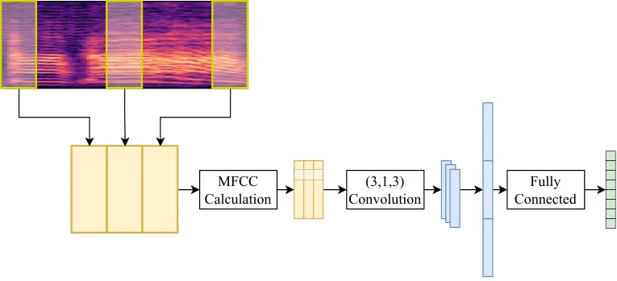
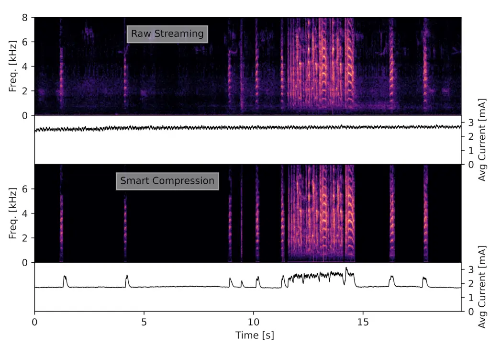

# TinyBird-ML: An ultra-low Power Smart Sensor Node for Bird Vocalization Analysis and Syllable Classification

Lukas Schulthess¹, Steven Marty¹, Matilde Dirodi², Mariana D. Rocha²
Affiliation:     Linus Rüttimann², Richard H. R. Hahnloser², Michele
Magno¹ Affiliation:  Affiliation: ¹Dept. of Information Technology and
Electrical Engineering, ETH Zürich, Switzerland Affiliation: ²Institute
for Neuroinformatics, ETH Zürich, Switzerland

###### Abstract

Animal vocalisations serve a wide range of vital functions. Although it
is possible to record animal vocalisations with external microphones,
more insights are gained from miniature sensors mounted directly on
animals’ backs. We present TinyBird-ML; a wearable sensor node weighing
only 1.4 g for acquiring, processing, and wirelessly transmitting
acoustic signals to a host system using Bluetooth Low Energy.
TinyBird-ML embeds low-latency tiny machine learning algorithms for song
syllable classification. To optimize battery lifetime of TinyBird-ML
during fault-tolerant continuous recordings, we present an efficient
firmware and hardware design. We make use of standard lossy compression
schemes to reduce the amount of data sent over the Bluetooth antenna,
which increases battery lifetime by 70% without negative impact on
offline sound analysis. Furthermore, by not transmitting signals during
silent periods, we further increase battery lifetime.

One advantage of our sensor is that it allows for closed-loop
experiments in the microsecond range by processing sounds directly on
the device instead of streaming them to a computer. We demonstrate this
capability by detecting and classifying song syllables with minimal
latency and a syllable error rate of 7%, using a light-weight neural
network that runs directly on the sensor node itself. Thanks to our
power-saving hardware and software design, during continuous operation
at a sampling rate of 16 kHz, the sensor node achieves a lifetime of 25
hours on a single size 13 zinc-air battery.

###### Index Terms: 

Wireless sensor node, low power, audio compression, machine learning,
bird monitoring, bluetooth low energy.

## I Introduction

Among all animal forms of communication, vocal expression contains much
information about an individual’s physiological and behavioral
states \[1, 2, 3, 4, 5\]. Thus, to better understand animals’ behaviours
and their group dynamics, it is of utmost importance to study vocal
patterns and their meanings \[6\]. Unfortunately, the unambiguous
assignment of a sound to the individual that generated it can be a major
challenge, especially when animals rapidly move and irregularly vocalize
in the midst of background sounds. A possible solution to meet this
challenge is to record animals with wireless animal-borne sensors to
directly capture vocalizations at their source \[7, 8\].

Such animal-borne bio-loggers have been successfully used on large and
mid-sized animals \[2, 9, 10, 11\]. For small animals such as songbirds,
in particular zebra finches (Taeniopygia guttata), the design of
animal-borne sensor nodes is inflicted by many constraints \[12, 13\].
Design imperatives are avoidance of stress from the weight or shape of
the sensor node, because otherwise the behavioral readout may be of no
value \[7\]. For this reason, bio-loggers need to be comfortable, very
small and light-weight \[14\]. At the same time, to ensure an
undisturbed observation period, a long battery lifetime is desired for
chronic recordings. A day-long recording typically lasts 14 hours, which
provides sufficient time for a battery change at night when birds do not
sing and move \[12\].

Traditionally, animal-borne sensors are based on frequency modulation
(FM) to transmit data \[15, 16\]. Although this approach can achieve
minimal power consumption \[17\], there are well-known issues in terms
of signal quality and interference when more than a single transmitter
is in the same area \[18\]. Moreover, FM transmitters allow only one-way
communication from the sensor to the receiver, and there is no way to
send information back to the sensor node on the bird \[16\].

Recent technological advances in the fields of sensors, wireless
communication, and power-efficient power MCUs Microcontrollers (MCUs)
have paved the way for new approaches \[7, 12, 19\]. Switching from
fully analog to digital solutions such as Bluetooth Low Energy (BLE)
offers several advantages: communication is bidirectional and it allows
the host station to send messages and commands to a sensor node, which
is not possible with FM transmitters. Moreover, BLE allows simultaneous
communication with multiple nodes and the on-board MCU is capable of
performing complex mathematical operations such as running small neural
networks to detect specific events in the data stream \[20\]. Such
events in the field of bird vocalization analysis are the occurrence of
syllables, which involves segmenting the syllables in time and
identifying the syllable types \[21\]. Moving from post-processing to
real-time on-device syllable detection enables new research
opportunities.

Since longitudinal observations are preferable and frequent battery
changes can cause stress to an animal, animal-borne devices must be
power-optimized on both hardware and firmware levels. Energy-efficient
compression algorithms as described in \[22\] enable compression with
tolerable data loss. On-board compression therefore can contribute to
improving the energy efficiency by reducing the transmitted data
volume \[23, 24\].

The paper presents TinyBird-ML, a miniaturized and power-optimized
digital animal-borne sensor node that features a zero-power digital
micro electromechanical system (MEMS) microphone and an inertial
measurement unit (IMU). The node also hosts non-invasive electrodes in
combination with a state-of-the-art electrostatic sensor to enable the
acquisition of signals such as heart rate, respiration rate and muscle
contractions which provides additional information for assessing the
birds behaviour \[25, 26\]. The paper demonstrates the importance of
on-board processing using tiny machine learning, proposing a
light-weight neural network that fully runs on the TLE microcontroller
and allows real-time signal analysis. We present a dual-stage classifier
for detection of syllables and classification of their types. Due to the
low-power design, including a "zero-power listening" acoustic sensor and
on-board processing, TinyBird-ML achieves a lifetime of up to 25 h on a
single 0.8 gram zinc-air battery.

## II System Architecture

TinyBird-ML has been designed with low power and energy efficiency in
mind to maximize operating time whilst keeping the total weight and
therefore the impact on birds’ natural behaviors at a minimum.
Furthermore, the sensor nodes’ elongated shape is designed to not
disturb a bird during flight. Fig. 1 shows a simplified block diagram of
the proposed light-weight animal-borne sensor node for vocal monitoring.
The system can be divided into three sub-parts:

II-A; the core of the sensor node is the ANNA-B112 BLE, a module from
ublox, II-B; the sensors for data acquisition and II-C; the power
management based on a power-efficient boost-converter. Finally, the
hardware design is described in II-D.

Fig. 1: High-level block diagram of the sensor node.

### II-A Bluetooth Low Energy Module

The ANNA-B112 BLE module from ublox is an ultra compact System in
Package (SiP) based on the nRF52832 System on Chip (SoC) from Nordic
Semiconductor. It integrates Radio Frequency (RF) matching as well as an
internal antenna. The ARM Cortex-M4F microcontroller with
$`64\text{\,}\mathrm{kB}`$ RAM and $`512\text{\,}\mathrm{kB}`$ flash
memory can run at a clock frequency up to $`64\text{\,}\mathrm{MHz}`$
and thus offers enough computational power and memory to perform
on-board audio processing and to run small neural networks. To increase
the computational efficiency, the integrated Digital Signal Processor
(DSP) can be exploited for compression algorithms. With a current
consumption of
$`58\text{\,}\mathrm{\SIUnitSymbolMicro A}\text{/}\mathrm{MHz}`$ while
running from flash memory, together with a Tx peak current of
$`5.3\text{\,}\mathrm{mA}`$ at $`0\text{\,}\mathrm{\text{dBm}}`$, the
module offers outstanding performance in a small package. Its excellent
trade-off between light weight, size, and low power consumption is the
main reasons for selecting the ANNA-B112 BLE module.

### II-B Sensors

For sound acquisition, we used the high performance digital
piezoelectric MEMS microphone VM3011 from Vesper MEMS. It features
adaptive zero-power listening, allowing it to reduce the microphone
current consumption down to $`10\text{\,}\mathrm{\SIUnitSymbolMicro A}`$
while still being capable of detecting sounds louder than the background
noise level. This functionality allows TinyBird-ML to further minimize
the power consumption while the bird is not vocalizing, for example
after the stressful sensor node attachment. As soon as the bird has
recovered and the desired behavior (e.g. song) is recognized, the
microphone generates a wake-up signal and the microcontroller leaves its
power-saving idle state.

The LSM6DSV16X, an IMU with integrated Qvar (Q = charge var = variation)
electrostatic sensor from ST Microelectronics for non-invasive vital
signs acquiring completes the sensor node. Both, MEMS microphone and
IMU-Qvar sensor communicate over individual I2C peripherals and,
depending on the application, can be power-gated using load switches.

### II-C Power Management

TinyBird-ML is powered by a non-rechargeable A13 standard-size
$`1.45\text{\,}\mathrm{V}`$ zinc-air battery, which is commonly used in
hearing aids. Such batteries benefit from a very high theoretical energy
density of
$`1086\text{\,}\mathrm{W}\text{\,}\mathrm{h}\text{/}\mathrm{kg}`$
\[27\], which is crucial for our application. To overcome the low cell
voltage, the nano-power synchronous boost converter MAX17220 from Maxim
is integrated. It converts the low input voltage to the sensor node’s
operating voltage of $`3\text{\,}\mathrm{V}`$. The boost converter’s
minimal input voltage of $`400\text{\,}\mathrm{mV}`$ allows to
completely deplete the battery and, together with a high conversion
efficiency of over $`90\text{\,}\mathrm{\%}`$, ensures an optimal power
usage during operation.

### II-D Hardware Design

The entire sensor node is realized on a rigid 4-layer PCB with a total
thickness of $`0.4\text{\,}\mathrm{mm}`$. The zinc-air battery is held
by a weight-optimized battery clip, allowing for a reliable contact,
facilitating battery replacement and achieving device reusability. Two
contacts on the sensor node’s top side can be used to attach two Qvar
electrodes for cutaneous measurements of electrocardiograms (ref.
Fig. 2). For bird-borne sensor nodes, the overall weight is very
crucial. The total weight of TinyBird-ML, including battery, amounts to
$`1.4\text{\,}\mathrm{g}`$. Fig. 4 summarizes the weight and size of
each part.

Fig. 2: The space-, weight-, and power-optimized sensor node. The size
of the body is only $`27.15\text{\,}\mathrm{mm}`$ $`\times`$
$`8.15\text{\,}\mathrm{mm}`$. Left: Top view of the sensor node with the
electrode contacts on top and the BLE SoC at the bottom. Right: Bottom
view of the sensor node with the Qvar top-left and the microphone
top-right.

Fig. 3: Male zebra finch with a mounted sensor node.

Fig. 4: Weight distribution of the proposed sensor node in milligrams.
Its total weight, including battery, amounts to
$`1.4\text{\,}\mathrm{g}`$

## III Firmware

Once TinyBird-ML is powered up, it starts to send advertising packets.
After having set up a connection, the central node subscribes to the
TinyBird-ML’s BLE characteristic responsible for the audio data. The
recording does not start immediately because the bird may need time to
acclimate itself to the backpack. To save power during this period, the
BLE Connection Interval (CI) is set to a high value to save transmission
power.

### III-A Smart Compression

In applications of vocal communication research, the main emphasis is on
calls and song syllables. Therefore, to save energy, we tried to avoid
transmission of sounds due to the movement of the bird and during silent
periods altogether. Nevertheless, to allow for reconstruction of vocal
output, we transmitted the temporal information about non-vocal periods.
A simple approach is an amplitude threshold: acoustic signals below the
threshold are classified as silent and lead to incrementation of a
silence counter. Silent phases are thereby encoded as the counter
magnitude. When the amplitude exceeds the threshold, the recording is
started, compressed and send to the central, the silence counter is
prepended to the audio block to allow correct reconstruction of the
audio signal in the time domain.

### III-B Syllable Classification using TinyML

Zebra finch calls and song syllables can span over half a second, and
the gaps between them can be as short as a few milliseconds \[28, 29\].
This indicates that no practical analysis window is small enough to
always contain parts of just a single syllable and large enough to
always include an entire syllable. To detect and analyze syllables, the
data is windowed into non-overlapping blocks of a power-of-two samples,
such that the Fast Fourier Transform (FFT) could be computed
efficiently. The signal blocks are processed by using two hierarchical
classifiers. The first classifier analyses each block and decides, based
on a single-layer perceptron with 16 Mel-frequency Cepstral Coefficients
(MFCCs) as input, whether it contains parts of a syllable. This keeps
the computational overhead minimal. The second classifier recognizes
syllable types and is based on a mix of convolutional and fully
connected layers, as illustrated in Fig. 5. By waiting until the end of
the syllable before classifying its type, more information about the
syllable can be gathered. Three evenly distributed blocks are selected
between syllable on- and offset. Each block is then transformed into
sixteen MFCCs and used as input to the syllable classifier network.
After nonlinear activation functions, the activations are flattened and
fed through a fully connected layer with a softmax layer at the end.

Fig. 5: Syllable classification network.

## IV Experimental Results

### IV-A Smart Compression

Fig. 6 shows spectrograms of raw and of compressed audio signals. During
reception of the latter, the current consumption only rises above the
baseline level when vocalizations are detected and data is streamed over
BLE. Comparing the two spectrograms reveals high-fidelity reconstruction
from the compressed data.

Fig. 6: Spectrogram and average current consumption for raw data
streaming and smart compression.

### IV-B Compression Algorithms

Compression algorithms reduce the number of bytes required to represent
data at the cost of a computational overhead. To be effective, a
compression scheme must achieve a reasonable quality wherein the energy
savings from data reduction outweigh the power needed for compression. A
comparison between different compression algorithms with respect to
current consumption and memory usage is presented in Table I. Algorithms
with a compression rate of 16 (Bitrate of
$`2\text{\,}\mathrm{kbit}\text{/}\mathrm{s}`$) represent the signals
insufficiently for vocal analysis. Among the remaining algorithms, the
Adaptive Differential Pulse Code Modulation (ADPCM) shows the best
performance with a minimal computational overhead of only
$`50\text{\,}\mathrm{\SIUnitSymbolMicro A}`$ and a low average BLE
current consumption of $`190\text{\,}\mathrm{\SIUnitSymbolMicro A}`$

| Compression | Bitrate                                 | Overhead            | Current                 | Overhead                | Overhead                  |
| ----------- | --------------------------------------- | ------------------- | ----------------------- | ----------------------- | ------------------------- |
| Algorithm   | \[$`\mathrm{kbit}\text{/}\mathrm{s}`$\] | \[$`\mathrm{mA}`$\] | BLE \[$`\mathrm{mA}`$\] | RAM \[$`\mathrm{kB}`$\] | Flash \[$`\mathrm{kB}`$\] |
| Raw         | 32                                      | \-                  | 0.82                    | \-                      | \-                        |
| ADPCM       | 8                                       | 0.05                | 0.19                    | \< 1                    | \< 1                      |
| SBC High    | 8                                       | 0.11                | 0.20                    | 1.5                     | 5                         |
| Opus High   | 8                                       | 1.12                | 0.20                    | 7                       | 50                        |
| DM          | 2                                       | \-                  | 0.06                    | \< 1                    | \< 1                      |
| CFDM        | 2                                       | 0.07                | 0.08                    | \<1                     | \< 1                      |
| SBC Low     | 2                                       | 0.07                | 0.07                    | 1.5                     | 5                         |
| Opus Low    | 2                                       | 0.87                | 0.09                    | 7                       | 50                        |

TABLE I: Comparison of different compression algorithms.

### IV-C Syllable Classification

The proposed 8-bit quantized two-stage classification network achieved a
syllable error rate \[21\] of $`7\text{\,}\mathrm{\%}`$ on eight
different syllable classes with an overall inference time of
$`5.4\text{\,}\mathrm{ms}`$. Table II summarizes the classification
networks performances and memory requirements.

| Network        | Inference           | RAM Usage           | Flash Usage         |
| -------------- | ------------------- | ------------------- | ------------------- |
|                | \[$`\mathrm{ms}`$\] | \[$`\mathrm{kB}`$\] | \[$`\mathrm{kB}`$\] |
| Detection      | 1.2                 | 0.5                 | 1.2                 |
| Classification | 4.2                 | 1.2                 | 2.7                 |

TABLE II: Performance of the classification network.

For syllable detection, the microphone’s buffer is fed through the
detection network every $`16\text{\,}\mathrm{ms}`$. The classification
network only runs if a syllable has been detected (ref. Fig. 7).
Detected syllables sent over BLE require little data, including only the
time between each syllable and the syllable type. An average power
consumption of $`5.73\text{\,}\mathrm{mW}`$ has been achieved. It
consists of the microphone’s constant power consumption of
$`5.25\text{\,}\mathrm{mW}`$ and the classifier’s computational overhead
of $`0.48\text{\,}\mathrm{mW}`$.

Fig. 7: Current consumption for both detection and classification
network, measured at $`3\text{\,}\mathrm{V}`$.

The total power consumed is less than during audio streaming with any
other standard compression algorithm, which makes on-board syllable
detection an attractive power-saving solution.

## V Conclusion

This paper presented TinyBird-ML a miniaturized and power-optimized
digital animal-borne sensor node that can be placed on small birds such
as zebra finches. Besides a zero-power digital MEMS microphone,
TinyBird-ML features an IMU with an integrated electrostatic sensor to
enable monitoring a bird’s vital signs such as its heart beats or muscle
contractions. A light-weight neural network running on a microcontroller
detects and classifies up to eight syllable types in real-time with a
syllable error rate of 7%. Weighing only 1.4 grams, TinyBird-ML
minimizes weight whilst achieving an operating time of up to 25 hours
during continuous data acquisition.

## Acknowledgment

This work has been partially found by: the Swiss National Science
Foundation (Agreement No 31003A-182638 and the NCCR Evolving Language
Agreement no. 51NF40-180888), the BRAIN Initiative (Targeted BRAIN
Circuits Project on ‘Neural sequences for planning and production of
learned Vocalizations’), and the European Union’s Horizon 2020 Marie
Sklodowska-Curie (grant 101025762 to M.D.R).

## References

- \[1\] E. Verreycken, R. Simon, B. Quirk-Royal, W. Daems, J. Barber,
  and J. Steckel, “Bio-acoustic tracking and localization using
  heterogeneous, scalable microphone arrays,” _Communications Biology_,
  vol. 4, 11 2021. \[Online\]. Available:
  [https://doi.org/10.1038/s42003-021-02746-2](https://doi.org/10.1038/s42003-021-02746-2)
- \[2\] E. Lynch, L. Angeloni, K. Fristrup, D. Joyce, and G. Wittemyer,
  “The use of on-animal acoustical recording devices for studying animal
  behavior,” _Ecology and evolution_, vol. 3, pp. 2030–7, 07 2013.
- \[3\] U. Jürgens, K. Hammerschmidt, and C. Fichtel, “On the vocal
  expression of emotion. a multi-parametric analysis of different states
  of aversion in the squirrel monkey,” _Behaviour_, vol. 138, no. 1, pp.
  97–116, 2001.
- \[4\] C. V. Portfors, “Types and functions of ultrasonic vocalizations
  in laboratory rats and mice,” _Journal of the American Association for
  Laboratory Animal Science_, vol. 46, no. 1, pp. 28–34, 2007.
- \[5\] R. M. Seyfarth and D. L. Cheney, “Meaning and emotion in animal
  vocalizations,” _Annals of the New York Academy of Sciences_, vol.
  1000, no. 1, pp. 32–55, 2003.
- \[6\] S. Insley, B. Robson, T. Yack, R. Ream, and W. Burgess,
  “Acoustic determination of activity and flipper stroke rate in
  foraging northern fur seal females,” _Endangered Species Research_,
  vol. 4, pp. 147–155, 01 2008.
- \[7\] M. Magno, F. Vultier, B. Szebedy, H. Yamahachi, R. H. R.
  Hahnloser, and L. Benini, “A bluetooth-low-energy sensor node for
  acoustic monitoring of small birds,” _IEEE Sensors Journal_, vol. 20,
  no. 1, pp. 425–433, 2020.
- \[8\] R. Hahnloser, “Measurement and control of vocal interactions in
  songbirds,” _The Journal of the Acoustical Society of America_, vol.
  137, no. 4, pp. 2250–2250, 2015. \[Online\]. Available:
  [https://doi.org/10.1121/1.4920206](https://doi.org/10.1121/1.4920206)
- \[9\] M. Wijers, P. Trethowan, A. Markham, B. du Preez,
  S. Chamaillé-Jammes, A. Loveridge, and D. Macdonald, “Listening to
  lions: Animal-borne acoustic sensors improve bio-logger calibration
  and behaviour classification performance,” _Frontiers in Ecology and
  Evolution_, vol. 6, 2018. \[Online\]. Available:
  [https://www.frontiersin.org/article/10.3389/fevo.2018.00171](https://www.frontiersin.org/article/10.3389/fevo.2018.00171)
- \[10\] L. Nóbrega, A. Tavares, A. Cardoso, and P. Gonçalves, “Animal
  monitoring based on iot technologies,” in _2018 IoT Vertical and
  Topical Summit on Agriculture - Tuscany (IOT Tuscany)_, 2018, pp. 1–5.
- \[11\] E. Lynch, L. Angeloni, K. Fristrup, D. Joyce, and G. Wittemyer,
  “The use of on-animal acoustical recording devices for studying animal
  behavior,” _Ecology and evolution_, vol. 3, pp. 2030–7, 07 2013.
- \[12\] O. Brunecker and M. Magno, “Tinybird: An energy neutral
  acoustic bluetooth-low-energy sensor node with rf energy harvesting,”
  in _Proceedings of the 7th International Workshop on Energy Harvesting
  & Energy-Neutral Sensing Systems_, 2019, pp. 1–7.
- \[13\] T. M. Pegan, D. P. Craig, E. R. Gulson-Castillo, R. M.
  Gabrielson, W. Bezner Kerr, R. MacCurdy, S. P. Powell, and D. W.
  Winkler, “Solar-powered radio tags reveal patterns of post-fledging
  site visitation in adult and juvenile tree swallows tachycineta
  bicolor,” _PLOS ONE_, vol. 13, no. 11, pp. 1–14, 11 2018. \[Online\].
  Available:
  [https://doi.org/10.1371/journal.pone.0206258](https://doi.org/10.1371/journal.pone.0206258)
- \[14\] M. Magno, F. Vultier, B. Szebedy, H. Yamahachi, R. H.
  Hahnloser, and L. Benini, “A bluetooth-low-energy sensor node for
  acoustic monitoring of small birds,” _IEEE Sensors Journal_, vol. 20,
  no. 1, pp. 425–433, 2019.
- \[15\] V. Anisimov, J. Herbst, A. Abramchuk, A. Latanov, R. Hahnloser,
  and A. Vyssotski, “Reconstruction of vocal interactions in a group of
  small songbirds,” _Nature methods_, vol. 11, 09 2014.
- \[16\] A. Ter Maat, L. Trost, H. Sagunsky, S. Seltmann, and M. Gahr,
  “Zebra finch mates use their forebrain song system in unlearned call
  communication,” _PloS one_, vol. 9, p. e109334, 10 2014.
- \[17\] L. Rüttimann, J. Rychen, T. Tomka, H. Hörster, M. D. Rocha, and
  R. Hahnloser, “Multimodal system for recording individual-level
  behaviors in songbird groups,” _bioRxiv_, 2022. \[Online\]. Available:
  [https://www.biorxiv.org/content/early/2022/09/23/2022.09.23.509166](https://www.biorxiv.org/content/early/2022/09/23/2022.09.23.509166)
- \[18\] H. Hashemi, “The indoor radio propagation channel,”
  _Proceedings of the IEEE_, vol. 81, no. 7, pp. 943–968, 1993.
- \[19\] M. Magno, F. Vultier, B. Szebedy, and L. Benini, “Long-term
  monitoring of small-sized birds using a miniaturized
  bluetooth-low-energy sensor node,” in _2017 IEEE SENSORS_, 2017, pp.
  1–3.
- \[20\] M. Scherer, M. Magno, J. Erb, P. Mayer, M. Eggimann, and
  L. Benini, “Tinyradarnn: Combining spatial and temporal convolutional
  neural networks for embedded gesture recognition with short range
  radars,” _IEEE Internet of Things Journal_, vol. 8, no. 13, pp.
  10 336–10 346, 2021.
- \[21\] Y. Cohen, D. Nicholson, A. Sanchioni, E. K. Mallaber,
  V. Skidanova, and T. J. Gardner, “Tweetynet: A neural network that
  enables high-throughput, automated annotation of birdsong,” _BioRxiv_,
  pp. 2020–08, 2020.
- \[22\] E. Zimos, D. Toumpakaris, A. Munteanu, and N. Deligiannis,
  “Multiterminal source coding with copula regression for wireless
  sensor networks gathering diverse data,” _IEEE Sensors Journal_,
  vol. 17, no. 1, pp. 139–150, 2017.
- \[23\] M. Ghamari, H. Arora, R. S. Sherratt, and W. Harwin,
  “Comparison of low-power wireless communication technologies for
  wearable health-monitoring applications,” in _2015 International
  Conference on Computer, Communications, and Control Technology
  (I4CT)_, 2015, pp. 1–6.
- \[24\] M. Magno, S. Marinkovic, B. Srbinovski, and E. Popovici,
  “Wake-up radio receiver based power minimization techniques for
  wireless sensor networks: A review,” _Microelectronics Journal_,
  vol. 45, 12 2014.
- \[25\] A. Manoni, A. Gumiero, A. Zampogna, C. Ciarlo, L. Panetta,
  A. Suppa, L. Della Torre, and F. Irrera, “Long-term polygraphic
  monitoring through mems and charge transfer for low-power wearable
  applications,” _Sensors_, vol. 22, no. 7, 2022. \[Online\]. Available:
  [https://www.mdpi.com/1424-8220/22/7/2566](https://www.mdpi.com/1424-8220/22/7/2566)
- \[26\] X. Hui and E. Kan, “No-touch measurements of vital signs in
  small conscious animals,” _Science Advances_, vol. 5, p. eaau0169,
  02 2019.
- \[27\] F. Hussain, M. Z. Rahman, A. N. Sivasengaran, and
  M. Hasanuzzaman, “Chapter 6 - energy storage technologies,” in _Energy
  for Sustainable Development_, M. Hasanuzzaman and N. A. Rahim,
  Eds. Academic Press, 2020, pp. 125–165. \[Online\]. Available:
  [https://www.sciencedirect.com/science/article/pii/B9780128146453000067](https://www.sciencedirect.com/science/article/pii/B9780128146453000067)
- \[28\] M. Araki, M. M. Bandi, and Y. Yazaki-Sugiyama, “Mind the gap:
  neural coding of species identity in birdsong prosody,” _Science_,
  vol. 354, no. 6317, pp. 1282–1287, 2016.
- \[29\] K. Sasahara, O. Tchernichovski, M. Takahasi, K. Suzuki, and
  K. Okanoya, “A rhythm landscape approach to the developmental dynamics
  of birdsong,” _Journal of the Royal Society Interface_, vol. 12, no.
  112, p. 20150802, 2015.
