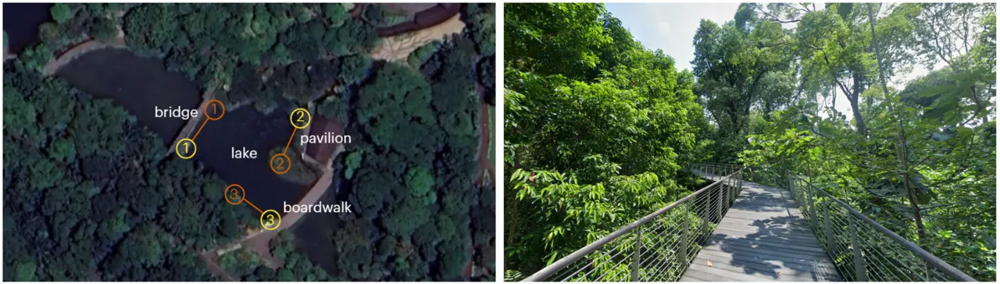
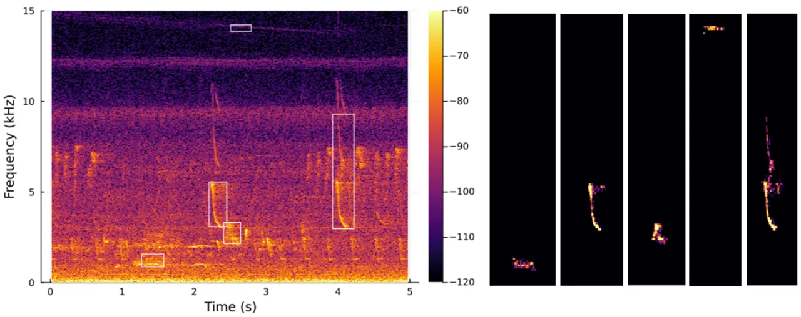
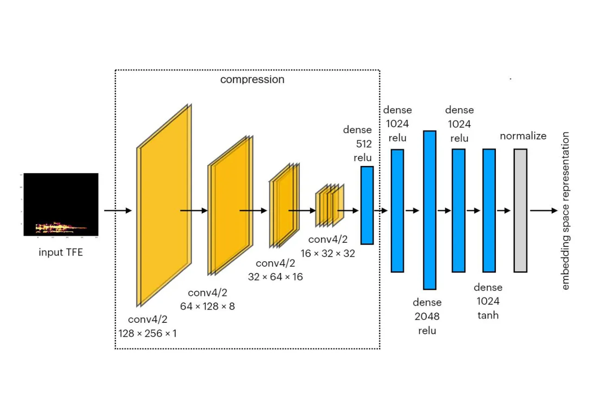
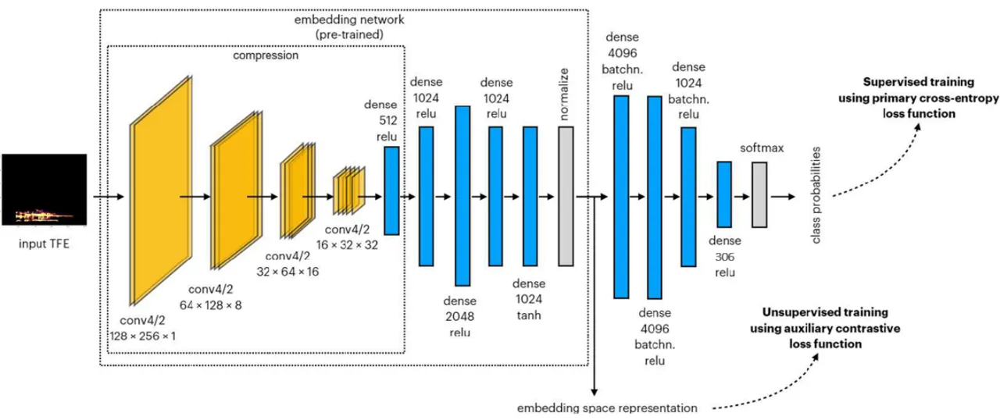
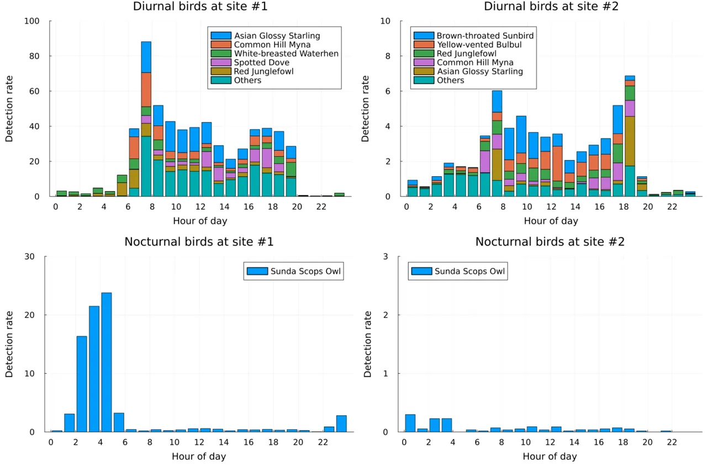
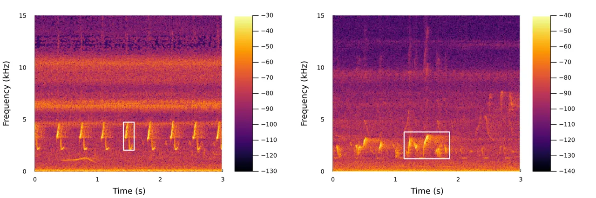

# Localized time-frequency representation learning for bioacoustic classification in complex soundscapes

Simen Hexeberg Affiliation: ARL, Tropical Marine Science Institute,
National University of Singapore Affiliation: Department of Electrical &
Computer Engineering, National University of Singapore    Mandar Chitre
Email: <mandar@nus.edu.sg> Affiliation: ARL, Tropical Marine Science
Institute, National University of Singapore Affiliation: Department of
Electrical & Computer Engineering, National University of Singapore   
Matthias Hoffmann-Kuhnt Affiliation: ARL, Tropical Marine Science
Institute, National University of Singapore    Bing Wen Low
Affiliation: National Parks Board, Singapore

###### Abstract

Prevailing bioacoustic classifiers assign species labels to fixed
time-frequency windows rather than to individual vocalizations. When
multiple vocalizations occur within the same window, predictions cannot
be unambiguously linked to specific calls, which limits analyses at the
level of individual vocalizations. This work introduces a framework for
time-frequency localized bird classification. A Local-Context Classifier
(LCC) identifies species from localized time-frequency events (TFEs),
while a Dual-Context Classifier (DCC) combines local and global acoustic
context through a fine-tuned bioacoustic foundation model. On an
in-distribution dataset from Singapore comprising 306 vocalization
classes from 103 bird species, the LCC achieves an F1-micro score of
79.3%, while combining local and global context through the DCC yields
the highest overall performance (94.6%). To reduce labeled data
requirements, the LCC is pre-trained via self-supervised contrastive
learning, achieving an 18.8% relative gain on an out-of-distribution
dataset. A focused evaluation on continuous soundscape recordings
further demonstrates the potential of the framework for long-term
monitoring applications. By preserving the time-frequency localization
of individual vocalizations, the proposed framework supports both
ecological monitoring and vocalization-level studies of animal acoustic
behavior.

## I Introduction

Biodiversity monitoring is a critical aspect of biodiversity
conservation, as it helps inform decision making, improves our knowledge
and enhances public education and awareness. Birds are one of the most
surveyed animal groups in biodiversity monitoring programs, with point
counts and transect surveys being well-established survey techniques for
monitoring bird communities \[2\]. However, birds can be very difficult
to detect and identify especially in tropical regions characterized by
dense foliage, high avian diversity and numerous rare species \[30,
31\]. Additionally, such manned survey techniques are
manpower-intensive, require highly specialized expertise, and tend to
overlook rare species that are sensitive to human presence \[8, 7, 40\].

Passive monitoring of biodiversity using acoustics is thus an area of
great potential, as various animal groups including birds make unique
vocalizations, which can be used to validate their presence. Such
systems allow for automated collection of large amounts of audio data
without human supervision and can survey cryptic species more
effectively \[8, 17\]. However, the comprehensive analysis of such large
volumes of data is prohibitive in terms of the man-hours
required \[16\]. This constraint, and the rapid advancement in machine
learning techniques, have made data-driven algorithms increasingly
popular for bioacoustic species detection and classification tasks.

Besides serving as indicators of ecosystem health, birds are also of
interest from a machine learning perspective, as bird vocalizations have
been shown to be a good source for bioacoustic models to generalize
across taxa, extending beyond birds to groups such as amphibians and
marine mammals \[11\]. However, automatically monitoring birds can be
especially challenging during chorus periods, when many individuals
vocalize simultaneously. This challenge is amplified in highly
biodiverse regions such as tropical ecosystems, where ecological
monitoring is particularly important \[22\]. These dense and overlapping
soundscapes are precisely where current bioacoustic classifiers face
limitations. Many approaches are single-label methods \[13, 39, 27,
32\], meaning they can only identify one species within a given time
window. Multi-label classifiers \[20, 21, 28\] address this shortcoming
by allowing multiple species to be recognized simultaneously. However,
both single- and multi-label methods commonly rely on global-context
representations. Although earlier work has explored localized
time-frequency representations \[4, 5\], recent state-of-the-art
bioacoustic classifiers typically operate on global-context inputs, most
commonly Mel spectrograms \[35, 36\]. Such classifiers can detect
multiple species within a recording but cannot precisely localize
detections in time and frequency or associate predictions with specific
vocalizations when multiple vocalizations occur within the same input
window. Moreover, the input windows used by these models are typically
fixed and model-specific \[35\], despite vocalizations naturally varying
in both temporal and spectral extent.

To address these limitations, we propose a Local-Context Classifier
(LCC) that learns directly from localized time-frequency representations
rather than broadband fixed-window inputs. Because local context alone
may omit broader temporal cues relevant for species classification, we
further propose a Dual-Context Classifier (DCC), which combines LCC with
a fine-tuned version of BirdNET \[20\]—a state-of-the-art bioacoustic
foundation model operating on global context. The resulting framework
enables vocalization-level detections and supports bioacoustic studies
in complex soundscapes where precise time-frequency localization of
sound sources is important—for example, studies of how animals adapt
their vocalizations in response to changes in their acoustic
environment \[3, 23, 18, 10\], including introduced anthropogenic noise.
The framework may also support population estimation for species with
individually distinctive call signatures, providing an alternative or
complement to triangulation-based approaches \[15\].

Beyond source isolation, the LCC offers two related but distinct
advantages. First, it enables multi-label inference without requiring
training on multi-label data. This is advantageous for two reasons: (i)
single-label classification is generally a simpler learning objective
and may require less training data, and (ii) multi-label datasets are
costly to annotate \[5\] and remain relatively scarce in the open-source
community—a limitation that motivated the release of the BirdSet
dataset \[29\]. Second, it facilitates efficient retrieval of similar
vocalizations from long-duration continuous recordings. Together with
time-frequency localization, this can reduce annotation effort when
constructing multi-label datasets.

To date, most passive acoustic monitoring studies have focused on
pristine habitats, while largely overlooking urban ecosystems \[9, 12\].
As urban green spaces become increasingly important for bird populations
under rapid urbanization \[19\], evaluating the efficacy of automated
analysis in urban soundscapes is particularly urgent. Singapore—one of
the few tropical cities with a connected network of green spaces
adjacent to dense urban areas \[41\]—is therefore an ideal study site.
The proposed models are trained on soundscapes from Singapore and
evaluated both in-distribution within Singapore and out-of-distribution
on recordings collected outside Singapore. Finally, to assess deployment
potential in a realistic long-term monitoring scenario, a focused
evaluation is conducted on continuous soundscape recordings from two
sites within the Singapore Botanic Gardens (SBG), one of the oldest
botanic gardens in Southeast Asia, receiving millions of visitors
annually.

## II Methodology

This section describes the methods and experimental setup used in this
study. We begin by describing the study site and recording setup in
Section II.1. We then introduce the Local-Context Classifier, a
three-step pipeline that segments and classifies individual bird calls
from acoustic recordings (Section II.2). Next, we present fine-tuned
versions of BirdNET (Section II.3) before BirdNET and the LCC are
combined in a Dual-Context Classifier (Section II.4). Finally, we
describe the datasets used for training and evaluation (Section II.5),
and the metrics used to assess performance (Section II.6).

### II.1 Study site and recording setup



Figure 1: Left: first deployment at the SBG (site #1) from July 4, 2020
until September 20, 2020. The approximate locations of the recording
units are marked as yellow circles, with the corresponding external
microphones of each unit marked as orange circles. The six microphones
surround a lake and cover an area of roughly 50 m $`\times`$ 50 m.
Right: a section of the elevated boardwalk used for the second
deployment at the SBG (site #2) from September 20, 2020 until February
1, 2021. The same six microphones from site #1 were deployed along the
circular boardwalk in a similar constellation, but without direct line
of sight between units due to the dense vegetation. Photos from Google
Maps.

Our primary source of acoustic data was acquired from two different
locations in the SBG over a combined period of 7 months from July 2020
to February 2021. Three _Wildlife Acoustics SongMeter 4 TS_ recorders
were deployed at both locations. Each recording unit was equipped with
two omni-directional microphones, yielding soundscape recordings from
six microphones simultaneously. The first 2.5 months of data collection
took place around a lake with minimal obstruction between the
microphones (site #1). This setup allows the same call to be detected on
multiple recorders (Figure 1), which we later exploit during model
training. The units were then relocated to a second site for the
remaining 4.5 months (site #2). A similar constellation was used but
dense vegetation occluded the direct paths between microphones
(Figure 1). During calibration tests at site #2, we emitted
high-frequency transients and found that the sounds were mostly audible
only on the nearest few microphones. Although low-frequency sounds may
attenuate less, site #2 is likely to have a shorter detection range than
site #1.

### II.2 Local-Context Classifier

The Local-Context Classifier is a three-step method:

1.  1.  Time-frequency events: Extract individual bird calls using an
        energy-based segmentation technique. Isolating individual calls
        limits noise and allows time-overlapping vocalizations to be treated
        separately, provided they do not also overlap in frequency.
2.  2.  Embedding representation: Learn compact embedding representations of
        the time-frequency segments from step 1, encouraging embeddings that
        are translationally invariant and that place acoustically similar
        sounds close together—two key properties for efficient clustering
        and classification of bioacoustic sounds.
3.  3.  Supervised classification: Feed the learned embeddings to a
        classification head and train it on labeled data. This step also
        serves as a final refinement of the embedding space.

Note that only the last step requires labeled data: step 1 does not
involve any learning while step 2 is self-supervised. Each step is
detailed in the next sections.

#### II.2.1 Time-frequency events



Figure 2: An example illustrating extraction of TFEs from audio
recordings. The left panel shows the spectrogram from a 5-second audio
clip, with a few detected sounds enclosed by white rectangles. The right
panels show the respective extracted TFEs. This example is
non-exhaustive, i.e., not all detections in the audio clip are shown
here.

Most bird vocalizations are frequency-modulated signals. While
vocalizations may overlap in time, they may be separated in frequency.
Rather than training on broadband, fixed-duration spectrograms—which in
dense soundscapes often contain vocalizations from multiple species—we
extract individual acoustic events and process them separately. Related
acoustic-focused approaches have previously localized animal
vocalizations in time and frequency before classification. Neal et
al. \[26\] and Briggs et al. \[5\] used supervised time-frequency
segmentation to separate bird sounds from background noise in
spectrograms. More recently, object-detection approaches have been used
to localize vocalizations with bounding boxes rather than pixel-level
masks \[15\]. While this reduces annotation effort, it still requires
manually annotated training data. Ruiz-Muñoz et al. \[33\] avoided the
annotation requirement by using unsupervised spectrogram segmentation to
generate candidate regions for birdsong classification. However, that
method relies on handcrafted features extracted from the segmented
regions and performs classification at the recording level. In contrast,
we use an annotation-free, energy-based time-frequency segmentation
technique followed by self-supervised feature learning, enabling
classification at the level of individual extracted events. The
resulting segments are represented as $`128\times 256`$ numerical
matrices, which we refer to as time-frequency events (TFEs). TFEs are
extracted from acoustic recordings through the following steps:

1.  1.  Compute a spectrogram of the acoustic data with 2,048 FFT bins, a
        Hamming window, and an overlap of 1,536 samples between windows.
        Retain frequencies between 500 Hz and 15 kHz, as this range
        encompasses most bird sounds while rejecting unwanted noise.
2.  2.  Convert the spectrogram to dB and use the inter-quartile range for
        each frequency bin to obtain a robust estimate of the noise variance
        $`\sigma`$ at that frequency. Normalize each frequency bin by
        subtracting the median + $`2\sigma`$, dividing by $`2\sigma`$, and
        clip the resulting data between 0 and 1. This adaptively extracts
        regions in the time-frequency plane that have significantly higher
        energy than the background noise at that frequency. Moreover, it
        reduces the natural dominance of low-frequency calls resulting from
        higher attenuation of high-frequency signals \[37\].
3.  3.  Reduce the frequency resolution by a factor of 5 by max-pooling.
4.  4.  Zero out time bins with low variance across broad frequency bands,
        as these represent impulsive sounds not characteristic of birds.
5.  5.  Perform a watershed segmentation of the resulting spectrogram to
        obtain disconnected regions of high energy in the spectrogram.
6.  6.  Filter out regions with very short durations or very small
        time-bandwidth products, as these are uncharacteristic of bird
        sounds.

The end result of the above steps is illustrated by an example in
Figure 2. The spectrogram on the left shows a 5-second recording with
multiple bird vocalizations. After segmentation, the spectrogram is
converted to a number of TFEs. A few of these TFEs are shown in the
panels on the right with corresponding sections marked with white
rectangles in the original spectrogram on the left. Although the
heuristic rules filter out many events uncharacteristic of birds, the
remaining TFEs are not guaranteed to contain only bird sounds. For
example, frequency-modulated, high-energy sounds such as insect noise
and human speech may pass through these filters and must be handled
downstream. Furthermore, TFEs may not capture complete calls when
successive syllables within a vocalization are not sufficiently
contiguous in time and frequency to be grouped into a single segment.

Although TFEs have variable durations, several algorithms in our
processing chain require fixed-length input. We therefore standardize
all TFEs to a duration of 2.7 seconds (256 time bins) as most TFEs fall
within this range. The few TFEs longer than 2.7 seconds are cropped to
256 bins, while shorter ones are randomly zero-padded on both sides. The
random padding and cropping is applied at runtime to create different
versions of the TFE each time it is used during training.

#### II.2.2 Embedding representation

Although TFEs provide a localized representation of individual acoustic
events, they are not necessarily optimal input representations for
classification or clustering. First, TFEs are sparse: most entries have
zero energy. Feeding sparse representations directly to a fully
connected neural network would be computationally inefficient, as most
inputs would contain no signal. Second, bird vocalization classification
is time-invariant: shifting a vocalization in time does not alter its
class. The objective of this stage is therefore to learn compact
embeddings of TFEs that are invariant to time translations and map
acoustically similar sounds to nearby points in the embedding space.

Several approaches have been proposed for learning bioacoustic
embeddings. One strategy is to use the internal representations of large
pre-trained models by removing the classifier head, an approach that has
been shown to support transfer learning for bioacoustic
classification \[11\]. Contrastive learning has also been explored for
bioacoustic tasks, including few-shot bird-sound classification \[24\]
and bioacoustic event detection \[1\]. Our setting differs in that we
seek not only self-supervised representations, but also embeddings that
preserve time-frequency localization and support both classification and
retrieval of similar vocalizations in continuous soundscapes.

To achieve this, we employ a two-stage neural network architecture
(Figure 3). The first stage comprises a convolutional neural network
that extracts local time-frequency features from TFEs, followed by a
dense layer that projects these features into a lower-dimensional latent
space. Specifically, each $`128\times 256`$ TFE is compressed into a
512-dimensional latent vector, reducing the representation size by a
factor of 64. The second stage consists of four fully connected layers
that transform the latent representation produced by the first stage
into the final embedding.

We train the embedding network using self-supervised contrastive
learning. In traditional contrastive learning \[6\], positive pairs are
created by applying different augmentations to the same training
example, and the network is trained to place positive pairs close
together while separating unrelated examples. We follow this overall
framework, but introduce two modifications tailored to passive acoustic
monitoring. Other than a random translation necessary to obtain TFEs of
constant duration (Section II.2.1), we do not perform synthetic
augmentation. Instead, positive pairs are derived from recordings of the
same acoustic event on the two microphones connected to each recorder
unit, which are spaced approximately 10 meters apart (Figure 1). The
natural variability in sound propagation thus provides a source of
“augmentation” without requiring synthetic transformations.
Consequently, paired TFEs can differ in both SNR and time-frequency
structure (Figure 4). Since the sound may arrive at the two microphones
at different times, the corresponding events on both microphones must
first be associated. This association is performed using a combination
of time information and a requirement for high cross-correlation between
the two acoustic waveforms. These pairs may include any sound captured
by the TFE segmentation—not exclusively bird vocalizations. The
resulting representation space is referred to as the _embedding space_
hereafter. Because the approach is self-supervised, no class labels are
used during this stage of training. The training is performed over
50 epochs using the Adam optimizer, but with a loss function that
differs from the one proposed by Chen et al. \[6\].



Figure 3: Architecture of the self-supervised contrastive neural
network. Features are extracted from the input TFE, compressed, and
mapped to a 1024-dimensional embedding space. The embeddings are
normalized to lie on the surface of a unit hypersphere, allowing
similarity between embeddings to be measured by their dot product, or
equivalently by the angle between them.

Figure 4: Examples of positive TFE pairs used to train the contrastive
network. Pairs are obtained by associating the same sound event on two
nearby microphones, allowing propagation effects to create natural
“augmentations”.

Although the loss function proposed by Chen et al. \[6\] is
theoretically sound, it was developed for a computer vision task quite
different from our needs and did not perform well on our problem. Based
on the intuition that the embedding space can be modeled as a surface of
a 1024-dimensional hypersphere, we do not seek maximal angular
separation between dissimilar sounds, but rather orthogonality. Maximal
angular separation pushes dissimilar sounds to diametrically opposite
sides of the hypersphere, but that can only accommodate two classes.
Instead, orthogonality pushes dissimilar sounds to different axes of the
hypersphere, and can support up to 1024 distinct classes for a
1024-dimensional hypersphere. With this in mind, the loss function we
use is:

```math
\displaystyle L(\mathbf{Z}) \displaystyle= \displaystyle\sum_{p=1}^{N}l_{2p,2p-1}+l_{2p-1,2p}, \tag{1}
```

```math
\displaystyle l_{i,j} \displaystyle= \displaystyle-\left[\mathbf{z}_{i}^{T}\mathbf{z}_{j}+\beta\sum_{k\neq i,k\neq j}^{2N}\min\left(1-\mathbf{z}_{i}^{T}\mathbf{z}_{k},\;1\right)^{2}\right]. \tag{2}
```

Here $`\mathbf{Z}=\{\mathbf{z}_{i}\forall i\}`$ is the set of embedding
space representations for the training TFEs, organized such that the
first pair is $`(\mathbf{z}_{1},\mathbf{z}_{2})`$, the second pair is
$`(\mathbf{z}_{3},\mathbf{z}_{4})`$, and so on. The two terms in (1)
correspond to two possible orderings of samples in each pair. The first
term in (2) maximizes the similarity within each pair, while the second
term induces orthogonality for non-paired representations. The
$`\min(\cdot,1)`$ function prevents maximal angular separation and
$`\beta=3`$ is a hyperparameter that controls the balance between the
two terms, chosen empirically without extensive tuning. In practice, the
loss is not evaluated over the entire dataset, but in mini-batches of
$`N=512`$.

After training, we observe an average cosine similarity of 0.93 for
positive pairs, while non-paired samples are approximately orthogonal.
While this ensures that paired samples (similar sounds) have high
similarity, it does not guarantee low similarity between every pair of
dissimilar sounds. Since the loss function minimizes the average
similarity between dissimilar sounds, some clusters of dissimilar sounds
still experience similar representations. This is addressed by allowing
the embedding space representation to improve further in a final,
supervised classification stage.

#### II.2.3 Supervised classification



Figure 5: Complete LCC architecture. TFEs extracted from raw recordings
are mapped to embedding vectors using the pre-trained contrastive
network, followed by a four-layer classification head that outputs class
confidence scores. The embedding network and classifier are trained in
alternating rounds to ensure that the embeddings retain their
contrastive objective while adapting to the classification task: five
epochs of supervised end-to-end training of the full model (i.e., the
embedding network is not frozen) are followed by one epoch of
self-supervised contrastive training of the embedding network.

The final step of the LCC method is a classification stage consisting of
four dense layers with batch normalization between each layer. It is
trained with a standard cross-entropy loss,takes the preceding TFE
embedding as input and assigns a confidence score to each class
(Figure 5). Classes are defined at call level rather than species level,
by labeling groups of similar TFEs (e.g., Olive-winged Bulbul: call type
1). Predictions at species level, when needed, are obtained simply by
ignoring the call-type distinctions.

To address the challenge that some clusters of dissimilar sounds occur
close in embedding space (Section II.2.2), the classifier is trained
end-to-end without freezing any preceding layers—allowing the embedding
network to improve further. During this training, however, the embedding
network can “forget” that paired samples should have high similarity and
unpaired samples low similarity. To reinforce this property, we
simultaneously train the embedding network with the same contrastive
loss as before (Section II.2.2). In practice, the training is
implemented in sets of 5 epochs of the primary cross-entropy loss,
followed by 1 epoch of the auxiliary contrastive loss. We train the
network over 100 such sets and retain a mean similarity score of 0.866
for paired samples and near orthogonality (0.046) for unpaired samples.

#### II.2.4 Extensions for long-duration deployments

The classifier is optimized to separate the training classes by
minimizing the supervised loss. Therefore, it primarily learns decision
boundaries tailored to the training distribution. When applied to
continuous field recordings, however, it is exposed to a substantially
broader range of acoustic events, many of which may produce embeddings
that lie close to known classes and lead to false positives. To improve
robustness in this setting, we introduce two extensions.

First, we train a separate bird-pass filter to distinguish bird sounds
from non-bird sounds. This binary classifier consists of three fully
connected layers and operates on TFE embeddings as input. Since even a
small false-positive rate can accumulate to many errors in long-duration
recordings, we prioritize precision over recall. To enforce this, false
positives (non-bird sounds classified as birds) are penalized more
strongly than false negatives.

Second, we introduce an additional “sink” class in the primary
classifier. This class captures non-bird sounds that are acoustically
similar to bird vocalizations and therefore prone to being
misclassified. It is trained using 1,893 TFEs from SBG site #1 that
caused false positives when applying the LCC to continuous data. This
encourages the network to learn discriminative features for such sounds
while also providing an explicit rejection class for inputs that do not
correspond to any of the target bird classes. To further reduce false
positives in long-duration recordings, the sink class is assigned a
higher loss weight. Specifically, as the sink class contains
approximately 38 times more samples than each bird class, it is weighted
by a factor of $`3/38`$—effectively weighting it three times more than
each bird class.

### II.3 Fine-tuned BirdNET

BirdNET is a widely used bioacoustic classifier first introduced in
2021 \[20\], covering over 6,000 bird species as well as a small number
of non-bird classes including human speech. We start from a pre-trained
BirdNET v2.4 \[38\] model (BN-PT) and fine-tune it on data from
Singapore (BN-FT) under two input schemes: local and global context.
Local-context inputs have limited and variable time-frequency extent,
similar to TFEs, while global-context inputs are fixed-duration
broadband spectrograms, consistent with BirdNET’s original training
format. To allow adaptation of BN-FT to our data, we remove its original
classifier head, freeze the backbone, and add a new trainable head with
306 outputs for local-context classification and 103 outputs for
global-context classification. The architecture of the new head and
other hyperparameters are obtained through BirdNET’s autotuning feature.
We run 20 hyperparameter trials on global context inputs with 5 runs per
trial to reduce variance and select the configuration with the best
performance on the validation set (Table 1). The resulting classifier
head has two dense layers with batch normalization between layers and
ReLU activation functions. Hence, both BN-FT and the LCC have classifier
heads with non-linear capacity.

|                        |               |        |
| ---------------------- | ------------- | ------ |
|                        | Input context |        |
| BirdNET parameter      | Local         | Global |
| Output dim             | 306           | 103    |
| Hidden units           | 256           | 512    |
| Dropout                | 0.33          | 0.5    |
| Batch size             | 64            | 64     |
| Learning rate          | 0.001         | 0.001  |
| Upsampling ratio       | 0.5           | 0.33   |
| Label smoothing        | Yes           | No     |
| Minimum frequency (Hz) | 500           | 500    |
| Minimum confidence     | 0.1           | 0.1    |

Table 1: Non-default BirdNET hyperparameters used to fine-tune BirdNET
on both local- and global-context inputs. With the exception of the
minimum frequency and the minimum confidence score, which are kept fixed
for both models, the parameters are obtained in a hyperparameter search
over 20 trials and 5 runs per trial using BirdNET’s autotune option. The
output dimension matches the number of target classes: 306 vocalization
classes for local context and 103 species for global context.

#### II.3.1 Fine-tuning on local context

To compare the LCC with BirdNET, we fine-tune BirdNET on the same
training data used for the LCC. However, BirdNET takes 3-second audio
segments as input and is not directly compatible with either TFEs or TFE
embeddings. To approximate the information content of TFEs, source
recordings are first bandpass-filtered and time-cropped around each
TFE¹¹ 1 Although TFEs are defined in Section II.2.1 as matrices of size
$`128\times 256`$, only the bounding box around the non-zero energy
regions are retained., and the resulting localized segments are embedded
into 3-second clips of ambient soundscape recordings, with random time
shifts applied to encourage time invariance. The ambient clips were
extracted from recordings at SBG site #1 between 5 and 6 am, a period of
low vocal activity, retaining only those confirmed to be free of
vocalizations. Since ambient noise levels at this time are considerably
lower than during daytime hours—when most TFEs are
extracted—local-context inputs tend to have higher SNRs than their
global-context counterparts, described next.

#### II.3.2 Fine-tuning on global context

Global-context inputs are obtained by extracting 3-second segments
centered on the midpoint of each TFE, with frequencies limited to
0.5–15 kHz to match the range used during TFE extraction. Broader
context may aid classification by capturing additional temporal and
spectral cues relevant to the target species, but at the cost of also
including vocalizations from other species and background noise. Unlike
the local-context model, this variant is trained at species level, as
the wider input window may capture multiple calls from the same species.
As labels are tied to individual TFEs and are sparse and non-exhaustive,
each sample is assigned a single ground-truth label, even if other
species are audible.

### II.4 Dual-Context Classifier

The Dual-Context Classifier (DCC) leverages both local and global
context by combining predictions from the LCC and BN-FT. The confidence
scores of the two models are first normalized to account for differences
in baseline confidence levels: for each model
$`m\in\{\text{LCC},\text{BN-FT}\}`$, the raw confidence score
$`\hat{y}_{m}`$ is normalized as

```math
\bar{\hat{y}}_{m}=\frac{\hat{y}_{m}}{\mu_{m}} \tag{3}
```

where $`\bar{\hat{y}}_{m}`$ denotes the vector of normalized class
confidence scores and $`\mu_{m}`$ is the mean confidence score among
true positive predictions on the validation set.

We evaluate two fusion strategies: _max voting_ and _weighted average
voting_. In max voting, the final prediction is taken from the model
with the highest normalized confidence score. In weighted average
voting, normalized confidence scores are combined class-wise:

```math
\hat{y}_{\text{DCC}}=\arg\max\left(w\bar{\hat{y}}_{\text{LCC}}+(1-w)\bar{\hat{y}}_{\text{BN-FT}}\right) \tag{4}
```

where the $`\arg\max`$ operator returns the class with the highest fused
confidence score and $`w=0.55`$ controls the contribution of each model
and is selected by maximizing the macro-averaged F1 score on the
validation set.

### II.5 Datasets

We use three main datasets for training and evaluation (Table 2): (i) a
self-supervised pre-training (SSPT) dataset used to train the embedding
network, (ii) a supervised fine-tuning (SFT) dataset used to train the
LCC, fine-tune BirdNET and evaluate in-distribution performance, and
(iii) an out-of-distribution (OOD) dataset used to assess both LCC
generalization and the effect of contrastive pre-training on downstream
performance.

#### II.5.1 Self-supervised pre-training dataset

The SSPT dataset is constructed using the pairing strategy described in
Section II.2.2, where simultaneous recordings from two microphones are
used to form positive TFE pairs corresponding to the same acoustic
event. We apply this strategy to a subset of days from the 7-month
recording period across the two SBG deployments, yielding 19,311
reliable TFE pairs. We use 18,811 pairs for training and 500 pairs for
validation (Table 3).

#### II.5.2 Supervised fine-tuning dataset

The SFT dataset is curated from two sources: focal recordings from the
Xeno-canto database \[42\] recorded in Singapore (63.5%), and soundscape
recordings from the two SBG sites (36.5%). TFEs are first extracted from
raw audio and converted to embeddings using the pre-trained embedding
network. The resulting embeddings are clustered, and groups of similar
TFEs are assigned labels by an avian expert based on representative
samples. This procedure demonstrates how learned embeddings can be used
as a tool for vocalization discovery, enabling the identification of
acoustically similar sound groups directly from raw soundscape
recordings, and thereby facilitating efficient annotation.

The curated SFT dataset contains 5,174 labeled TFEs spanning 306
vocalization classes across 103 bird species. The dataset is highly
imbalanced, with class sizes ranging from a few samples to several
hundred. We randomly assign samples to the training, validation, and
test splits, ensuring that each class is represented by at least one
sample in each split. To improve class balance during training, we cap
the number of training samples per class at 50 and augment
underrepresented classes using small random frequency shifts, minor time
stretching, and additive Gaussian and white noise. Low-sample classes in
the validation set are also augmented but capped at 20 samples per
class. The test set, however, remains unaugmented to ensure final
evaluation entirely on natural vocalizations (Table 3). To avoid data
leakage from the contrastive pre-training stage, we ensure that TFEs
from the SSPT dataset are not present in the validation and test splits.

#### II.5.3 Out-of-distribution dataset

The OOD dataset is used to evaluate generalization of the
Singapore-trained LCC model to new geographic regions and recording
conditions. It is derived from the Xeno-canto subset of BirdSet \[29\],
the only BirdSet subset sharing species with the SFT dataset. We retain
only recordings collected outside Singapore, resulting in 11,092
recordings covering 95 of the 103 species present in the SFT dataset.

Species labels are provided at the recording level, meaning that precise
temporal annotations of vocalizations are not available. Recording
durations vary, with a median length of 24 seconds. The number of
recordings per species ranges from 5 to 1,064, with a mean of 117.

#### II.5.4 Bird-pass filter dataset

In addition to the three main datasets, we construct a separate dataset
to train the bird-pass filter used in the long-duration deployment
extension (Section II.2.4). This dataset consists of two classes only: a
bird class (positives) and a non-bird class (negatives). The positive
class comprises all 5,174 non-augmented SFT samples. The negative class
consists of 3,152 non-bird TFEs drawn primarily from the UrbanSound8K
dataset \[34\] and supplemented with underwater recordings of marine
mammal vocalizations collected in Singapore waters \[15\]. To balance
class sizes, non-bird samples are augmented using random frequency
shifts to exactly match the sample size of the bird class.

|         |                     |            |        |             |           |           |           |
| ------- | ------------------- | ---------- | ------ | ----------- | --------- | --------- | --------- |
| Dataset | Source              | Rec. type  | Size   | Sample type | Location  | \#Classes | \#Species |
| SSPT    | Self-collected      | Soundscape | 19,311 | TFE pairs   | Singapore | —         | —         |
| SFT     | Self-collected / XC | Mixed      | 5,174  | TFEs        | Singapore | 306       | 103       |
| OOD     | XC                  | Focal      | 11,092 | Recordings  | Non-SG    | 95        | 95        |

Table 2: Overview of three datasets used in this work: Self-supervised
pre-training (SSPT), Supervised fine-tuning (SFT), and
Out-of-distribution (OOD). TFE pairs for contrastive pre-training are
derived from simultaneous recordings of the same vocalization on two
microphones. The SFT set comprises a mixture of soundscape (36.5%) and
focal (63.5%) recordings. Non-SG denotes recordings collected outside
Singapore.

|         |      |        |       |      |        |
| ------- | ---- | ------ | ----- | ---- | ------ |
| Dataset | Aug. | Train  | Val.  | Test | Total  |
| SSPT    | No   | 18,811 | 500   | —    | 19,311 |
| SFT     | No   | 3,259  | 971   | 943  | 5,174  |
| SFT     | Yes  | 15,300 | 6,257 | —    | 21,557 |

Table 3: Data splits for self-supervised pre-training (SSPT) and
supervised fine-tuning (SFT) datasets, with and without augmentation.
The SFT test set remains unaugmented and consists exclusively of natural
vocalizations, ensuring evaluation on real-world data.

### II.6 Evaluation metrics

#### II.6.1 Alignment of single- and multi-label outputs

A key difference between BirdNET and the LCC lies in their output
structure. BirdNET is multi-class multi-label, applying a binary
classifier to each class, whereas the LCC is multi-class single-label,
applying a single softmax across all classes. As a result, BirdNET can
produce multiple high-confidence predictions for the same input—even if
only a single species is present.

To ensure comparability between the multi-label and single-label
approaches, we mark a prediction as correct if: (i) it matches the true
class, (ii) has the highest confidence score among predictions, and
(iii) its confidence exceeds 0.1. BirdNET occasionally assigns the
maximum confidence score of 1.0 to multiple classes, resulting in ties.
In such cases, one of the tied classes is selected at random. This
tie-breaking rule prevents artificially inflated performance when
multiple classes receive identical maximum scores.

#### II.6.2 F1 metrics

For the in-distribution SFT dataset, we report performance using
micro-averaged (F1-micro) and macro-averaged (F1-macro) F1 scores. F1 is
defined as the harmonic mean of precision and recall (Eq. 5). F1-micro
is computed by aggregating true positives (TP), false positives (FP),
and false negatives (FN) across all $`N`$ samples (Eq. 6), whereas
F1-macro is obtained by averaging class-wise F1 scores over the $`C`$
classes (Eq. 7).

```math
F1=2\cdot\frac{\text{Precision}\cdot\text{Recall}}{\text{Precision}+\text{Recall}} \tag{5}
```

```math
\text{F1-micro}=2\cdot\frac{P_{\text{micro}}\cdot R_{\text{micro}}}{P_{\text{micro}}+R_{\text{micro}}} \tag{6}
```

where

```math
\displaystyle P_{\text{micro}} \displaystyle=\frac{\sum_{i=1}^{N}\text{TP}_{i}}{\sum_{i=1}^{N}(\text{TP}_{i}+\text{FP}_{i})}
```

```math
\displaystyle R_{\text{micro}} \displaystyle=\frac{\sum_{i=1}^{N}\text{TP}_{i}}{\sum_{i=1}^{N}(\text{TP}_{i}+\text{FN}_{i})}
```

```math
\text{F1-macro}=\frac{1}{C}\sum_{c=1}^{C}F1_{c} \tag{7}
```

Both averaging schemes have limitations on the imbalanced SFT test set.
F1-macro is sensitive to classes with very few samples whereas F1-micro
is dominated by the performance of a small number of large classes.
Therefore, performance should be interpreted jointly using both metrics.

To quantify the uncertainty associated with evaluating performance on a
finite test set, we estimate 95% confidence intervals for both F1
metrics using bootstrap resampling. Specifically, we generate 10,000
resampled test sets by sampling with replacement while preserving the
original sample size, recompute the evaluation metrics for each
resampled test set, and report the 2.5th and 97.5th percentiles.

#### II.6.3 Hit rate

The OOD dataset is annotated at the recording level, i.e., the exact
time-frequency location(s) of the target species within each recording
is unknown. In addition, most recordings contain vocalizations from
other non-annotated background species. To evaluate performance under
these conditions, we define a hit rate metric. For each (recording,
species) pair, a pair is counted as a hit if at least one predicted TFE
matches the ground-truth species label. The hit rate is then computed as
the fraction of recordings for which at least one hit is obtained.

## III Results

This section presents the experimental results. We begin by evaluating
all classifiers on the in-distribution supervised fine-tuning (SFT) test
set from Singapore (Section III.1). We then assess the Local-Context
Classifier (LCC) under two additional conditions: out-of-distribution
recordings collected outside Singapore (Section III.2) and continuous
soundscape recordings in a deployment-like setting (Section III.3).
Next, we summarize the performance of the time-frequency event (TFE)
extraction stage based on a separate study (Section III.4). Finally, we
analyze the effect of contrastive pre-training on downstream
classification performance (Section III.5).

### III.1 In-distribution recordings

For evaluation on the in-distribution SFT test set, we group methods by
their input context: local context, global context, and combined local
and global context. Within the local-context category, we compare the
proposed LCC against two BirdNET variants: the original pre-trained
model (BN-PT) and a version fine-tuned on local data (BN-FT). We
additionally evaluate an ensemble of LCC and BN-FT, constructed
analogously to the DCC (Section II.4) except that the models both
operate on local-context inputs. For the global-context category, we
only evaluate BirdNET models as the LCC method is inherently
local-context. Finally, the DCC combines the LCC with the global-context
BN-FT model and is the only method that leverages both context types.

The BN-PT model is evaluated without additional training, while all
BN-FT models are trained on the same training samples as the LCC,
differing only in context and input representation (Section II.3). Since
BirdNET was originally trained on more than 6,000 species, while our
test set covers only 103, we restrict BN-PT to these 103 species to
ensure a fair comparison with LCC.

We find that BirdNET exhibits some performance variability across
training runs. To reduce the influence of this variability, each BN-FT
configuration is trained 10 times for 50 epochs using the tuned
hyperparameters in Table 1. The model achieving the highest
validation-set performance is then selected for test-set evaluation.

The resulting test-set performance is summarized in Table 4. The LCC
outperforms the pre-trained BirdNET models on both local and global
contexts. BirdNET improves substantially after fine-tuning on
in-distribution data in both contexts, highlighting the challenge of
generalization even for models pre-trained on large, diverse datasets.

While local context allows time-frequency localization of calls, the
global context results suggest that larger context improves
classification performance. Combining local and global context in the
DCC improves performance on the test set further, suggesting that local
and global representations provide complementary information. Using
weighted average voting ($`w=0.55`$), the DCC achieves F1-micro and
F1-macro scores of 94.6% and 93.8%, respectively. These correspond to
gains of 6.9 and 1.7 percentage points over the best-performing BirdNET
model. This ensemble strategy also yields higher performance than max
voting, which achieves F1 micro and macro scores of 93.2% and 91.8%,
respectively.

|                |             |                     |                     |
| -------------- | ----------- | ------------------- | ------------------- |
| Input context  | Model       | F1-micro            | F1-macro            |
| Local          | LCC         | 0.793 (0.767–0.819) | 0.685 (0.663–0.730) |
|                | BN-PT       | 0.265 (0.238–0.294) | 0.296 (0.253–0.326) |
|                | BN-FT       | 0.780 (0.752–0.805) | 0.717 (0.699–0.766) |
|                | LCC + BN-FT | 0.883 (0.861–0.902) | 0.820 (0.797–0.858) |
| Global         | BN-PT       | 0.619 (0.587–0.650) | 0.622 (0.603–0.680) |
|                | BN-FT       | 0.877 (0.852–0.894) | 0.921 (0.900–0.942) |
| Local + Global | DCC         | 0.946 (0.930–0.960) | 0.938 (0.919–0.963) |

Table 4: Performance on the SFT test set. Values are reported as F1
scores with 95% bootstrap confidence intervals. LCC operates on
local-context TFE inputs, whereas BirdNET is evaluated on both local-
and global-context inputs. Models operating on local context are
evaluated at the TFE level (except BN-PT), and all other models at the
species level.

### III.2 Out-of-distribution recordings

The OOD dataset consists of 11,092 weakly labeled Xeno-canto recordings
from 95 species recorded outside Singapore (Section II.5.3). BirdNET is
not evaluated on this dataset because its pre-training data includes
recordings from Xeno-canto.

At the recording level, the LCC detects the ground-truth species in
3,084 of the 11,092 recordings, corresponding to a micro hit rate of
27.8%. Note that hit rate measures the proportion of recordings
containing at least one correct detection but does not reflect detection
frequency. Among recordings with at least one correct detection, the
mean detection rate is 5.4 detections per minute across a combined 48.2
hours of audio. Species-level hit rates range from 0% to 85.7%, with a
macro-average of 27.8%. As expected, species-level performance generally
increases with the number of training samples (Figure 6). For example,
the six species with a 0% hit rate are represented by only 1–7 TFEs
prior to augmentation.

However, there are also species that achieve relatively strong
performance despite limited training data, indicating that performance
is influenced by factors beyond training set size. The Large-tailed
Nightjar, for instance, is trained on only seven non-augmented TFEs from
a single 15-second recording, yet is detected in 66 of 112 recordings,
yielding a hit rate of 58.9%. The total number of detections in these 66
recordings is 1,487, equivalent to 29.1 detections per minute across 51
minutes of audio. Of the 46 recordings without any correct detections,
17 contain a call type absent from the SFT training data, while the
remaining 29 are misclassifications.

Figure 6: LCC performance by species on the OOD dataset showing hit
rates (blue) and the number of non-augmented training samples for the
corresponding species (orange).

### III.3 Continuous soundscape recordings



Figure 7: Hourly detection rates for the 16 shortlisted species,
averaged over a 10-day period at both SBG sites and grouped into diurnal
and nocturnal species. The five species with the highest detection
counts at each site are listed by name. Note that the y-axis ranges
differ between the sites by an order of magnitude.

The SFT test set evaluates the detector on isolated vocalizations from
species represented during training. In a practical deployment, however,
the detector is applied to continuous recordings where many extracted
TFEs correspond to non-bird sounds or vocalizations outside the model’s
target classes. To assess feasibility in such conditions, we conduct a
preliminary evaluation on continuous soundscape recordings from the SBG.
The objectives are twofold: (i) to estimate performance for a subset of
promising classes in a realistic long-term monitoring scenario, and (ii)
to demonstrate how detector outputs can be aggregated to reveal
ecologically meaningful temporal activity patterns. We limit the
evaluation to precision, as estimating recall at the vocalization level
from continuous recordings would require substantial manual annotation
effort.

To keep the analysis tractable, we restrict the evaluation to a subset
of classes. We first exclude species known to be absent from the SBG and
migratory species not expected during the evaluation period, analogous
to the geo-temporal filtering available in frameworks such as
BirdNET \[38\]. From the remaining classes, we select vocalization
classes that exhibit characteristic vocalizations suitable for manual
verification. Following manual verification, only classes with
sufficient precision are retained for the subsequent long-term analysis.
This selection introduces a positive bias toward higher-performing
classes; consequently, the reported precision and temporal activity
patterns should be interpreted as a focused assessment of
deployment-ready classes rather than an estimate of overall performance
across all 306 classes.

The LCC is applied to one full day of recordings from SBG site #1.
Following bird-pass filtering at a threshold of 0.5 (Section II.2.4), up
to 50 high-confidence predictions (confidence $`\geq 0.7`$) are randomly
selected from each class for manual verification, yielding 958 samples
in total. Of these, 732 are true positives and 226 are false positives,
corresponding to a precision of 76.4% when averaged over all samples and
78.1% when averaged over classes (Table 5). Several classes achieve high
precision despite limited training data, suggesting that distinctive
vocalization types can be learned from relatively few annotated
examples. For example, one Brown-throated Sunbird class is trained on
only four non-augmented samples yet correctly classifies 41 of 50
verified predictions (82%).

To illustrate long-term monitoring applications, the detector is
subsequently applied to 10 days of recordings from each SBG site between
July 2020 and January 2021. With six microphones recording in parallel
(and occasional downtime), this translates to approximately 1350
microphone-hours of recordings per site. Figure 7 shows hourly detection
rates (detections per microphone-hour) averaged over the 10-day period
for the shortlisted species. Detections from different months are
naturally aligned with dawn and dusk because sunrise and sunset in
Singapore remain close to 7 am and 7 pm throughout the year.

The resulting temporal patterns are largely consistent with expected
bird behavior. Diurnal species exhibit pronounced peaks around dawn and
dusk, with relatively few detections during nighttime. In contrast, the
only nocturnal species among the shortlisted classes, the Sunda Scops
Owl (Otus lempiji), is detected primarily between 2 and 5 am. As
nocturnal activity declines, the Red Junglefowl (Gallus gallus)
dominates the soundscape at site #1 between 5 and 6 am, consistent with
its well-known pre-dawn calling behavior.

Detections outside the expected activity periods are likely false
positives, consistent with the precision estimates in Table 5. Site #2,
in particular, exhibits a relatively high detection rate of
White-breasted Waterhen (Amaurornis phoenicurus) between midnight and
dawn. Inspection of a sample of these nighttime detections indicates
that most are false positives originating from low-frequency traffic
sounds that generate TFEs resembling those of White-breasted Waterhen
vocalizations. This highlights the importance of robust generalization
across soundscapes, as even nearby survey locations can differ
substantially in background noise characteristics.

|       |                  |                              |                        |            |     |           |
| ----- | ---------------- | ---------------------------- | ---------------------- | ---------- | --- | --------- |
| Class | Training samples | Common name                  | Scientific name        | Detections | TPs | Precision |
| 1     | 33               | Asian Glossy Starling        | Aplonis panayensis     | 50         | 44  | 0.88      |
| 2     | 6                | Black-naped Oriole           | Oriolus chinensis      | 14         | 10  | 0.71      |
| 3     | 4                | Blue-eared Kingfisher        | Alcedo meninting       | 50         | 30  | 0.60      |
| 4     | 34               | Brown-throated Sunbird       | Anthreptes malacensis  | 36         | 34  | 0.94      |
| 5     | 4                | Brown-throated Sunbird       | Anthreptes malacensis  | 50         | 41  | 0.82      |
| 6     | 3                | Changeable Hawk-eagle        | Nisaetus cirrhatus     | 2          | 2   | 1.00      |
| 7     | 50               | Common Hill Myna             | Gracula religiosa      | 50         | 42  | 0.84      |
| 8     | 6                | Common Hill Myna             | Gracula religiosa      | 24         | 22  | 0.92      |
| 9     | 3                | Common Hill Myna             | Gracula religiosa      | 1          | 1   | 1.00      |
| 10    | 6                | Crimson Sunbird              | Aethopyga siparaja     | 10         | 7   | 0.70      |
| 11    | 1                | Greater Racket-tailed Drongo | Dicrurus paradiseus    | 14         | 7   | 0.50      |
| 12    | 11               | Olive-backed Sunbird         | Cinnyris jugularis     | 34         | 33  | 0.97      |
| 13    | 15               | Olive-backed Sunbird         | Cinnyris jugularis     | 20         | 15  | 0.75      |
| 14    | 50               | Olive-winged Bulbul          | Pycnonotus plumosus    | 50         | 40  | 0.80      |
| 15    | 22               | Olive-winged Bulbul          | Pycnonotus plumosus    | 32         | 25  | 0.78      |
| 16    | 30               | Olive-winged Bulbul          | Pycnonotus plumosus    | 50         | 26  | 0.52      |
| 17    | 33               | Olive-winged Bulbul          | Pycnonotus plumosus    | 50         | 42  | 0.84      |
| 18    | 6                | Red-whiskered Bulbul         | Pycnonotus jocosus     | 50         | 25  | 0.50      |
| 19    | 33               | Red Junglefowl               | Gallus gallus          | 50         | 44  | 0.88      |
| 20    | 26               | Red Junglefowl               | Gallus gallus          | 50         | 33  | 0.66      |
| 21    | 50               | Red Junglefowl               | Gallus gallus          | 6          | 5   | 0.83      |
| 22    | 50               | Spotted Dove                 | Spilopelia chinensis   | 50         | 48  | 0.96      |
| 23    | 50               | Sunda Scops Owl              | Otus lempiji           | 50         | 37  | 0.74      |
| 24    | 18               | White-breasted Waterhen      | Amaurornis phoenicurus | 15         | 12  | 0.80      |
| 25    | 11               | White-breasted Waterhen      | Amaurornis phoenicurus | 50         | 28  | 0.56      |
| 26    | 26               | Yellow-vented Bulbul         | Pycnonotus goiavier    | 50         | 36  | 0.72      |
| 27    | 11               | Yellow-vented Bulbul         | Pycnonotus goiavier    | 50         | 43  | 0.86      |

Table 5: Performance of shortlisted classes from a full day of
continuous soundscape recordings at site #1. Bird names follow the
Checklist of Bird Species for Singapore \[25\].

### III.4 TFE extraction performance

As the first stage of the pipeline, TFE extraction directly affects all
downstream stages. Vocalizations missed at this stage cannot be
recovered in later stages, while TFEs from non-target sources such as
insects or anthropogenic noise must either be filtered by the bird-pass
filter or assigned to the sink class to avoid becoming false positives.
In the following, we summarize the TFE extraction performance reported
in our previous work \[14\].

The TFE method is evaluated on its ability to localize bird
vocalizations (i.e., distinguishing bird sounds from non-bird sounds) in
time and frequency. Performance is measured using Intersection over
Minimum (IoMin), an overlap metric designed for acoustic events which is
more tolerant of annotation ambiguities than conventional
intersection-over-union (IoU). Such ambiguities arise because
vocalizations often have diffuse temporal and spectral boundaries, and
because annotators may disagree on whether temporally fragmented
vocalizations should be labeled as a single event or multiple
events \[14\]. IoMin is defined as

```math
\text{IoMin}=\frac{\text{intersection}}{\min(\text{area}_{TFE},\ \text{area}_{gt})}, \tag{8}
```

where $`\text{area}_{TFE}`$ and $`\text{area}_{gt}`$ denote the bounding
box areas of the detected TFE and the ground-truth vocalization,
respectively.

Using a minimum overlap threshold of 50% (IoMin@50) to declare a true
positive, the method achieves an F1-score of 42.1% on 18,095 labeled
vocalizations from SBG and 48.6% on 81,691 vocalizations across four
sites in Hawaii. Two common limitations of the TFE method are
illustrated in Figure 8: imperfect vocalization boundaries and false
detections caused by non-bird sounds such as insect noise and human
speech.


Figure 8: Example of extracted TFEs and human-labeled bird vocalizations
(reproduced from \[14\]). The TFE method detects both bird and non-bird
acoustic events, including insect noise (top) and human speech (bottom).

### III.5 Effect of contrastive pre-training

To measure the effect of contrastive pre-training, we train an LCC model
without it (LCC\*) and compare it to the pre-trained LCC on both the
in-distribution SFT and out-of-distribution (OOD) test sets. The two
models are architecturally identical and differ only in the use of
contrastive pre-training. Contrastive pre-training has a small negative
effect on the in-distribution SFT test set, reducing the number of
correctly classified TFEs by 13 (-1.7% relative change). In contrast,
performance on the OOD dataset improves substantially, with the number
of recordings with hits increasing from 2,596 to 3,084, corresponding to
an 18.8% relative gain (Table 6).

|         |          |             |       |       |             |
| ------- | -------- | ----------- | ----- | ----- | ----------- |
| Dataset | Metric   | Aggregation | LCC\* | LCC   | Rel. Gain   |
| SFT     | Accuracy | Micro       | 82.4% | 81.0% | $`-1.7\%`$  |
|         |          | Macro       | 74.4% | 72.8% | $`-2.2\%`$  |
| OOD     | Hit Rate | Micro       | 23.4% | 27.8% | $`+18.8\%`$ |
|         |          | Macro       | 25.0% | 27.8% | $`+11.2\%`$ |

Table 6: Comparison of LCC and LCC without contrastive pre-training
(LCC\*) on the SFT and OOD test sets.

## IV Discussion



Figure 9: Examples from the SBG recordings illustrating the
complementary strengths of local and global context. Left: A repeating
call sequence from a Common Tailorbird (Orthotomus sutorius) together
with a low-frequency call from an Asian Koel (Eudynamys scolopaceus)
around 0.5–1 s. Global-context models such as BirdNET may detect both
species but cannot associate predictions with individual vocalizations,
whereas the LCC preserves time-frequency localization. Right: A dominant
call from an Olive-winged Bulbul (Pycnonotus plumosus) together with
several low-SNR background calls. Localized TFEs do not always capture
complete vocalization sequences, illustrating how broader acoustic
context can support classification.

Many bioacoustic studies aim to understand animal behavior in natural
acoustic environments, including how vocal behavior adapts to conditions
such as anthropogenic noise. Such studies therefore benefit from models
that can both accurately classify species in noisy conditions and
localize vocalizations in time and frequency. Singapore provides a
useful testbed, combining high biodiversity with dense urbanization. The
SBG, in particular, contains diverse acoustic sources—including birds,
amphibians, reptiles, heavy rainfall, and human activity from nearby
traffic and millions of annual visitors.

The evaluation results from Singapore (Table 4) suggest that local and
global context provide complementary value: while local context enables
source localization, global context provides additional information
beneficial for species classification. Figure 9 illustrates these
complementary roles. In the left example, two species vocalize within
the same spectrogram window. Although both BN-FT and the LCC identify
the correct species, only the LCC can associate predictions with
individual vocalizations. In the right example, the LCC captures only
part of the target call, whereas global context provides additional
acoustic information that may improve classification.

The results also emphasize the importance of region-specific training
data. Fine-tuning BirdNET on recordings from Singapore yields
substantial performance gains, indicating that local adaptation remains
important even for foundation models trained on large and diverse
datasets. This presents a practical challenge for biodiversity
monitoring, as collecting and annotating regional datasets can be
costly. The challenge is particularly pronounced in settings where
monitoring is most needed: biodiverse but remote habitats such as
tropical rainforests, and for rare or endangered species, whose
vocalizations are inherently difficult to capture in large quantities.
This highlights the value of frameworks that are both sample-efficient
and support efficient labeling.

The proposed LCC framework helps reduce dependence on annotated regional
datasets in two ways. First, the embedding network is pre-trained
entirely through self-supervised learning without manually labeled data.
Second, because the embedding network is trained to group acoustically
similar sounds, it can support efficient annotation of new recordings by
clustering embeddings extracted from raw soundscape data, allowing
groups of similar segments to be labeled in bulk rather than
individually.

Consistent with this, the evaluations on continuous and
out-of-distribution recordings (Table 5 and Figure 6) show that high
performance can be achieved with very limited training data. Moreover,
the contrastive pre-training not only enables efficient search in novel
soundscapes but also improves generalization (Table 6).

While contrastive pre-training improves generalization on
out-of-distribution data, a performance gap remains between
in-distribution and out-of-distribution evaluation. Part of this gap
reflects true domain shift, similar to the degradation observed when
BirdNET is applied to Singapore recordings without local fine-tuning.
However, two additional factors may contribute to the observed errors.
First, although the LCC is trained on species present in the OOD
dataset, the available training data may not capture the full diversity
of vocalization types for each species. This results in cases where
target calls in the OOD data are not represented in the training
distribution; for the Large-tailed Nightjar in Section III.2, for
example, 17 of 46 false negative recordings (37.0%) arise from missing
vocalization types rather than poor generalization. Second, the TFE
method does not retain all bird vocalizations, as reported in
Section III.4. Consequently, some vocalizations are lost at this initial
stage and cannot be classified downstream.

Together, these findings suggest several avenues for improving
robustness and coverage in future work.

## V Future directions

### V.1 Scale up training data

Although the proposed method demonstrates that high performance can be
achieved with limited training data, several classes remain weak,
particularly in out-of-distribution settings. This likely reflects both
limited sample size and incomplete coverage of species-specific
vocalization types. A natural extension is therefore to scale training
across three axes to improve robustness: dataset size, vocalization
diversity, and geographic coverage.

### V.2 Improve TFE extraction

The current TFE extraction stage identifies many bird vocalizations but
cannot fully distinguish them from other high-energy,
frequency-modulated signals such as insect noise or human speech.
Because this is the first stage in the pipeline, its errors propagate
downstream: non-bird TFEs can lead to false positives, while missed
detections result in irrecoverable false negatives. Improving this stage
is particularly important for long-duration passive acoustic monitoring
where non-bird TFEs can accumulate in large numbers. One promising
direction is to replace the current TFE extractor and bird-pass filter
with a single, learnable bird vocalization detector, as proposed by
Hexeberg et al. \[14\].

### V.3 Combine time-frequency localization with global context

While local context enables localization of calls in time and frequency,
we find that broader context improves species classification. Exploring
methods that leverage global context while still preserving
time-frequency localization would therefore be an interesting direction
for future work. The proposed dual-context classifier is a first step in
this direction. While it achieves high classification accuracy, precise
localization is only available through the LCC. Consequently, if the LCC
fails to detect a target species while BN-FT succeeds, localization is
still unavailable. A more integrated approach could instead treat TFE
embeddings as tokens and model their temporal relationships using
sequence-based architectures such as transformers, enabling joint
modeling of local events and broader acoustic context.

## VI Conclusions

In this work, we address a limitation of prevailing bioacoustic
classifiers by introducing (i) a Local-Context Classifier that operates
on localized time–frequency representations rather than broadband,
fixed-duration spectrograms, and (ii) a Dual-Context Classifier that
combines local and global context. By isolating individual vocalizations
in both time and frequency, the framework simplifies the learning
objective in complex soundscapes and supports studies where precise
localization of calls is important, such as investigations of how
animals adapt their vocalizations in response to changes in their
acoustic environment.

We train and evaluate the methods on recordings from Singapore’s dense
and acoustically complex soundscape, which combines high biodiversity
with multiple sources of anthropogenic noise. Our results highlight two
main findings. First, while localized inputs enable precise source
localization, broader time-frequency context improves species
classification: the DCC achieves the highest F1 scores among the tested
methods on a test set comprising 103 bird species. Second, we show that
strong performance can be achieved with limited training data. While
there is growing interest in large-scale foundation models, our results
indicate that fine-tuning on regional data remains important for
achieving high performance. However, the cost of collecting labeled data
in new regions highlights the need for data-efficient methods. The
proposed contrastive pre-training strategy is entirely self-supervised
and improves generalization on an out-of-distribution test set. The
resulting embedding network can further support efficient annotation by
clustering acoustically similar sounds in novel soundscapes.

Although validated on bird data, the proposed framework is not
restricted to avian bioacoustics but can be applied to other acoustic
monitoring tasks involving clustering or classification of
frequency-modulated sounds. We hope this work not only helps bridge an
important gap in bioacoustic soundscape analysis but also motivates
further exploration of methods that integrate local and global
time–frequency context in bioacoustic applications.

###### Acknowledgements.

This research was supported by The National Parks Board – Singapore
(NParks).

## References

- \[1\] P. C. Bermant, L. Brickson, and A. J. Titus (2022) Bioacoustic
  event detection with self-supervised contrastive learning. bioRxiv.
  External Links:
  [Document](https://dx.doi.org/10.1101/2022.10.12.511740),
  [Link](https://www.biorxiv.org/content/early/2022/10/16/2022.10.12.511740.1),
  https://www.biorxiv.org/content/early/2022/10/16/2022.10.12.511740.1.full.pdf
  Cited by: §II.2.2.
- \[2\] C. J. Bibby, N. D. Burgess, and D. A. Hill (2000) Bird census
  techniques. Revised edition, Academic Press, London, UK. Cited by: §I.
- \[3\] C. Both and T. Grant (2012) Biological invasions and the
  acoustic niche: the effect of bullfrog calls on the acoustic signals
  of white-banded tree frogs. Biology Letters 8 (5), pp. 714–716.
  External Links: [Document](https://dx.doi.org/10.1098/rsbl.2012.0412)
  Cited by: §I.
- \[4\] T. S. Brandes (2008) Feature vector selection and use with
  hidden markov models to identify frequency-modulated bioacoustic
  signals amidst noise. IEEE Transactions on Audio, Speech, and Language
  Processing 16 (6), pp. 1173–1180. External Links:
  [Document](https://dx.doi.org/10.1109/TASL.2008.925872) Cited by: §I.
- \[5\] F. Briggs, B. Lakshminarayanan, L. Neal, X. Fern, R. Raich, S.
  Frey, A. Hadley, and M. Betts (2012) Acoustic classification of
  multiple simultaneous bird species: a multi-instance multi-label
  approach. The Journal of the Acoustical Society of America 131,
  pp. 4640–50. External Links:
  [Document](https://dx.doi.org/10.1121/1.4707424) Cited by: §I, §I,
  §II.2.1.
- \[6\] T. Chen, S. Kornblith, M. Norouzi, and G. Hinton (2020) A simple
  framework for contrastive learning of visual representations. In
  Proceedings of the 37th International Conference on Machine Learning
  (ICML), Proceedings of Machine Learning Research, Vol. 119,
  pp. 1597–1607. Cited by: §II.2.2, §II.2.2.
- \[7\] K. Darras, P. Batáry, B. J. Furnas, I. Grass, Y. A. Mulyani,
  and T. Tscharntke (2019) Autonomous sound recording outperforms human
  observation for sampling birds: a systematic map and user guide.
  Ecological Applications 29 (6), pp. e01954. External Links:
  [Link](https://esajournals.onlinelibrary.wiley.com/doi/abs/10.1002/eap.1954)
  Cited by: §I.
- \[8\] K. Darras, B. Furnas, Irfan. Fitriawan, Y. Mulyani, and T.
  Tscharntke (2018) Estimating bird detection distances in sound
  recordings for standardizing detection ranges and distance sampling.
  Methods in Ecology and Evolution 9, pp. 1928–1938. External Links:
  [Link](https://doi.org/10.1111/2041-210X.13031) Cited by: §I, §I.
- \[9\] A. J. Fairbrass, P. Rennert, C. Williams, H. Titheridge,
  and K. E. Jones (2017) Biases of acoustic indices measuring
  biodiversity in urban areas. Ecological Indicators 83, pp. 169–177.
  External Links:
  [Document](https://dx.doi.org/https%3A//doi.org/10.1016/j.ecolind.2017.07.064)
  Cited by: §I.
- \[10\] A. Farina, N. Pieretti, and N. Morganti (2013) Acoustic
  patterns of an invasive species: the red-billed leiothrix (leiothrix
  lutea scopoli 1786) in a mediterranean shrubland. Bioacoustics 22 (3),
  pp. 175–194. External Links:
  [Document](https://dx.doi.org/10.1080/09524622.2012.761571),
  [Link](https://doi.org/10.1080/09524622.2012.761571),
  https://doi.org/10.1080/09524622.2012.761571 Cited by: §I.
- \[11\] B. Ghani, T. Denton, S. Kahl, and H. Klinck (2023) Global
  birdsong embeddings enable superior transfer learning for bioacoustic
  classification. Scientific Reports 13 (1). External Links: ISSN
  2045-2322, [Link](http://dx.doi.org/10.1038/s41598-023-49989-z),
  [Document](https://dx.doi.org/10.1038/s41598-023-49989-z) Cited by:
  §I, §II.2.2.
- \[12\] R. Gibb, E. Browning, P. Glover-Kapfer, and K. E. Jones (2019)
  Emerging opportunities and challenges for passive acoustics in
  ecological assessment and monitoring. Methods in Ecology and Evolution
  10 (2), pp. 169–185. External Links:
  [Document](https://dx.doi.org/https%3A//doi.org/10.1111/2041-210X.13101)
  Cited by: §I.
- \[13\] G. Gupta, M. Kshirsagar, M. Zhong, S. Gholami, and J. Lavista
  Ferres (2021) Comparing recurrent convolutional neural networks for
  large scale bird species classification. Scientific Reports 11.
  External Links:
  [Document](https://dx.doi.org/10.1038/s41598-021-96446-w) Cited by:
  §I.
- \[14\] S. Hexeberg, F. Tong, H. Vishnu, and M. Chitre (2026)
  Time-frequency localization of bird calls in dense soundscapes.
  External Links: 2606.10407, [Link](https://arxiv.org/abs/2606.10407)
  Cited by: Figure 8, §III.4, §III.4, §V.2.
- \[15\] S. Hexeberg, H. Vishnu, K. T. Beng, A. Ho, W. Yusong, M.
  Chitre, K. Tun, and K. Lim (2023) Acoustic detector for multiple
  vocalizing marine mammal individuals. In OCEANS 2023 - Limerick, Vol.
  , pp. 1–8. External Links:
  [Document](https://dx.doi.org/10.1109/OCEANSLimerick52467.2023.10244432)
  Cited by: §I, §II.2.1, §II.5.4.
- \[16\] A. Hingston, T. Wardlaw, S. Baker, and G. Jordan (2018) Data
  obtained from acoustic recording units and from field observer point
  counts of tasmanian forest birds are similar but not the same.
  Australian Field Ornithology 35, pp. 30–39. External Links:
  [Document](https://dx.doi.org/10.20938/afo35030039) Cited by: §I.
- \[17\] S. Hoefer, D. McKnight, S. Allen-Ankins, E. Nordberg, and L.
  Schwarzkopf (2023) Passive acoustic monitoring in terrestrial
  vertebrates: a review. Bioacoustics 32, pp. 506–531. External Links:
  [Document](https://dx.doi.org/10.1080/09524622.2023.2209052) Cited by:
  §I.
- \[18\] J. M. Hopkins, D. S. Bower, W. Edwards, and L.
  Schwarzkopf (2023) Effects of invasive toad calls and synthetic tones
  on call properties of native australian toadlets. Journal of
  Herpetology 57, pp. 437–446. External Links:
  [Document](https://dx.doi.org/10.1670/23-004) Cited by: §I.
- \[19\] A. Hughes, M. Orr, F. Lei, Q. Yang, and H. Qiao (2022)
  Understanding drivers of global urban bird diversity. Global
  Environmental Change 76. External Links:
  [Document](https://dx.doi.org/10.1016/j.gloenvcha.2022.102588) Cited
  by: §I.
- \[20\] S. Kahl, C. M. Wood, M. Eibl, and H. Klinck (2021) BirdNET: a
  deep learning solution for avian diversity monitoring. Ecological
  Informatics 61, pp. 101236. Cited by: §I, §I, §II.3.
- \[21\] J. LeBien, M. Zhong, M. Campos-Cerqueira, J. P. Velev, R.
  Dodhia, J. L. Ferres, and T. M. Aide (2020) A pipeline for
  identification of bird and frog species in tropical soundscape
  recordings using a convolutional neural network. Ecological
  Informatics 59. External Links: ISSN 1574-9541,
  [Document](https://dx.doi.org/https%3A//doi.org/10.1016/j.ecoinf.2020.101113),
  [Link](https://www.sciencedirect.com/science/article/pii/S1574954120300637)
  Cited by: §I.
- \[22\] D. Martínez-Medina (2025) Tuning into nature: the sonic boost
  transforming tropical biodiversity research. Philosophical
  Transactions B 380, pp. 1–4. External Links:
  [Document](https://dx.doi.org/10.1098/rstb.2024.0044) Cited by: §I.
- \[23\] C. I. Medeiros, C. Both, T. Grant, and S. M. Hartz (2017)
  Invasion of the acoustic niche: variable responses by native species
  to invasive american bullfrog calls. Biological Invasions 19 (2),
  pp. 675–690. External Links:
  [Document](https://dx.doi.org/10.1007/s10530-016-1327-7),
  [Link](https://doi.org/10.1007/s10530-016-1327-7), ISSN 1573-1464
  Cited by: §I.
- \[24\] I. Moummad, N. Farrugia, and R. Serizel (2024) Self-supervised
  learning for few-shot bird sound classification. In 2024 IEEE
  International Conference on Acoustics, Speech, and Signal Processing
  Workshops (ICASSPW), Vol. , pp. 600–604. External Links:
  [Document](https://dx.doi.org/10.1109/ICASSPW62465.2024.10627576)
  Cited by: §II.2.2.
- \[25\] National Parks Board (2026) Checklist of bird species for
  singapore. Note:
  [https://www.nparks.gov.sg/nature/species-list/birds](https://www.nparks.gov.sg/nature/species-list/birds)Accessed:
  2026-06-06 Cited by: Table 5.
- \[26\] L. Neal, F. Briggs, R. Raich, and X. Z. Fern (2011)
  Time-frequency segmentation of bird song in noisy acoustic
  environments. In 2011 IEEE International Conference on Acoustics,
  Speech and Signal Processing (ICASSP), Vol. , pp. 2012–2015. External
  Links: [Document](https://dx.doi.org/10.1109/ICASSP.2011.5946906)
  Cited by: §II.2.1.
- \[27\] I. Nolasco, S. Singh, V. Morfi, V. Lostanlen, A.
  Strandburg-Peshkin, E. Vidaña-Vila, L. Gill, H. Pamuła, H.
  Whitehead, I. Kiskin, F. H. Jensen, J. Morford, M. G. Emmerson, E.
  Versace, E. Grout, H. Liu, B. Ghani, and D. Stowell (2023) Learning to
  detect an animal sound from five examples. Ecological Informatics 77.
  External Links: ISSN 1574-9541,
  [Document](https://dx.doi.org/https%3A//doi.org/10.1016/j.ecoinf.2023.102258)
  Cited by: §I.
- \[28\] A. Noumida and R. Rajan (2022) Multi-label bird species
  classification from audio recordings using attention framework.
  Applied Acoustics 197. External Links: ISSN 0003-682X,
  [Document](https://dx.doi.org/https%3A//doi.org/10.1016/j.apacoust.2022.108901),
  [Link](https://www.sciencedirect.com/science/article/pii/S0003682X22002754)
  Cited by: §I.
- \[29\] L. Rauch, R. Schwinger, M. Wirth, R. Heinrich, D. Huseljic, M.
  Herde, J. Lange, S. Kahl, B. Sick, S. Tomforde, and C. Scholz (2025)
  BirdSet: a large-scale dataset for audio classification in avian
  bioacoustics. In International Conference on Learning Representations
  (ICLR), External Links:
  [Link](https://openreview.net/forum?id=dRXxFEY8ZE) Cited by: §I,
  §II.5.3.
- \[30\] W. Robinson, J. Brawn, and S. Robinson (2000) Forest bird
  community structure in central panama: influence of spatial scale and
  biogeography. Ecological Monographs 70, pp. 209–235. External Links:
  [Document](https://dx.doi.org/https%3A//doi.org/10.1890/0012-9615%282000%29070%5B0209%3AFBCSIC%5D2.0.CO%3B2)
  Cited by: §I.
- \[31\] W. D. Robinson, A. C. Lees, and J. G. Blake (2018) Surveying
  tropical birds is much harder than you think: a primer of best
  practices. Biotropica 50 (6), pp. 846–849. External Links:
  [Document](https://dx.doi.org/https%3A//doi.org/10.1111/btp.12608)
  Cited by: §I.
- \[32\] A. R. Rodrigo Manriquez P and B. de Boer (2024) Bioacoustic
  classification of a small dataset of mammalian vocalisations using
  deep learning. Bioacoustics 33 (4), pp. 354–371. External Links:
  [Document](https://dx.doi.org/10.1080/09524622.2024.2354468),
  [Link](https://doi.org/10.1080/09524622.2024.2354468) Cited by: §I.
- \[33\] J. F. Ruiz-Muñoz, M. Orozco-Alzate, and G.
  Castellanos-Dominguez (2015) Multiple instance learning-based birdsong
  classification using unsupervised recording segmentation. In
  Proceedings of the 24th International Conference on Artificial
  Intelligence, IJCAI’15, pp. 2632–2638. External Links: ISBN
  9781577357384 Cited by: §II.2.1.
- \[34\] J. Salamon, C. Jacoby, and J. P. Bello (2014) A dataset and
  taxonomy for urban sound research. In 22nd ACM International
  Conference on Multimedia (ACM-MM’14), Orlando, FL, USA, pp. 1041–1044.
  Cited by: §II.5.4.
- \[35\] R. Schwinger, P. Vali Zadeh, L. Rauch, M. Kurz, T.
  Hauschild, S. Lapp, and S. Tomforde (2026) Foundation models for
  bioacoustics – a comparative review. Ecological Informatics 96,
  pp. 103765. External Links: ISSN 1574-9541,
  [Document](https://dx.doi.org/https%3A//doi.org/10.1016/j.ecoinf.2026.103765),
  [Link](https://www.sciencedirect.com/science/article/pii/S1574954126001718)
  Cited by: §I.
- \[36\] D. Stowell (2022) Computational bioacoustics with deep
  learning: a review and roadmap. PeerJ 10, pp. e13152. Cited by: §I.
- \[37\] L. Sutherland and G. Daigle (1998) Atmospheric sound
  propagation. pp. 341–365. Cited by: item 2.
- \[38\] B. Team BirdNET-analyzer: neural network for bird sound
  recognition. Note:
  [https://github.com/birdnet-team/BirdNET-Analyzer](https://github.com/birdnet-team/BirdNET-Analyzer)Version
  2.4, accessed 8 September 2025 Cited by: §II.3, §III.3.
- \[39\] A. Thakur, D. Thapar, P. Rajan, and A. Nigam (2019) Deep metric
  learning for bioacoustic classification: Overcoming training data
  scarcity using dynamic triplet loss. The Journal of the Acoustical
  Society of America 146 (1), pp. 534–547. External Links: ISSN
  0001-4966, [Document](https://dx.doi.org/10.1121/1.5118245) Cited by:
  §I.
- \[40\] A. Wheeldon, H. L. Mossman, M. J. P. Sullivan, J. Mathenge,
  and S. R. de Kort (2019) Comparison of acoustic and traditional point
  count methods to assess bird diversity and composition in the aberdare
  national park, kenya. African Journal of Ecology 57 (2), pp. 168–176.
  External Links:
  [Document](https://dx.doi.org/https%3A//doi.org/10.1111/aje.12596)
  Cited by: §I.
- \[41\] J. Wong, M. Soh, B. W. Low, and K. Er (2023) Tropical bird
  communities benefit from regular-shaped and naturalised urban green
  spaces with water bodies. Landscape and Urban Planning 231. External
  Links:
  [Document](https://dx.doi.org/10.1016/j.landurbplan.2022.104644) Cited
  by: §I.
- \[42\] Xeno-canto: an online database of bird sounds. Note:
  [https://xeno-canto.org](https://xeno-canto.org)Accessed: 2023 Cited
  by: §II.5.2.
