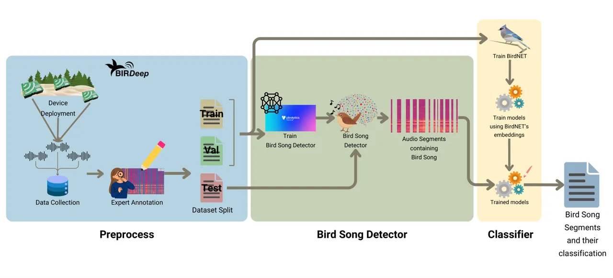
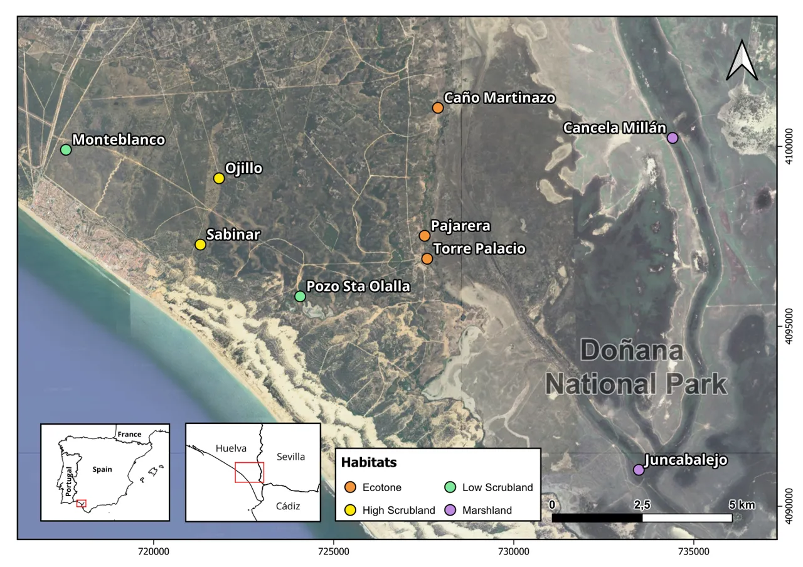
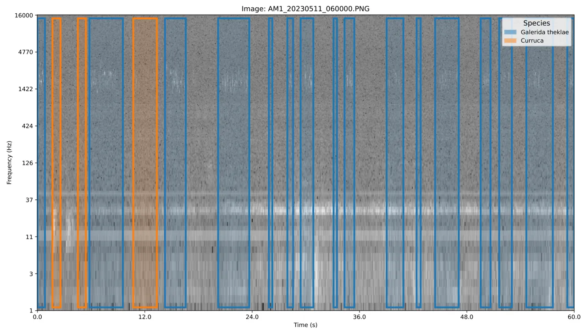
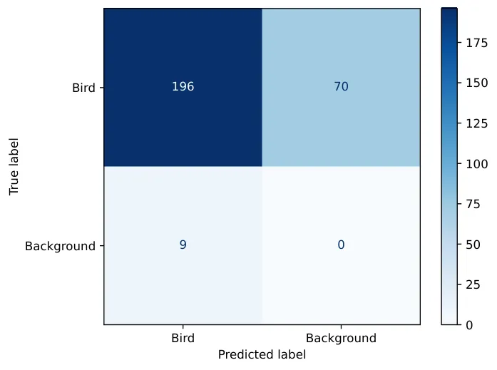
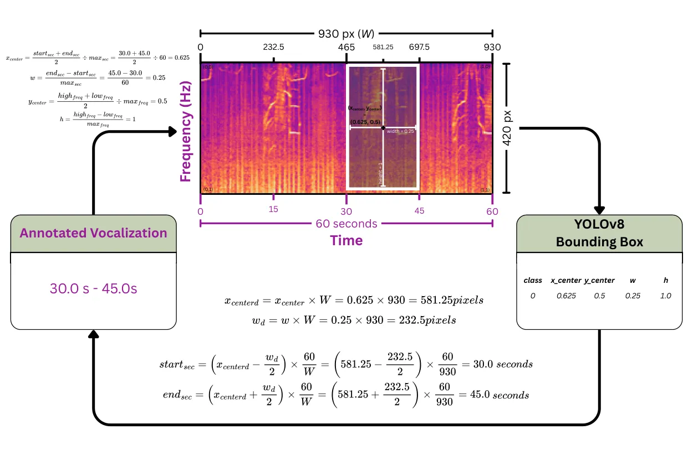
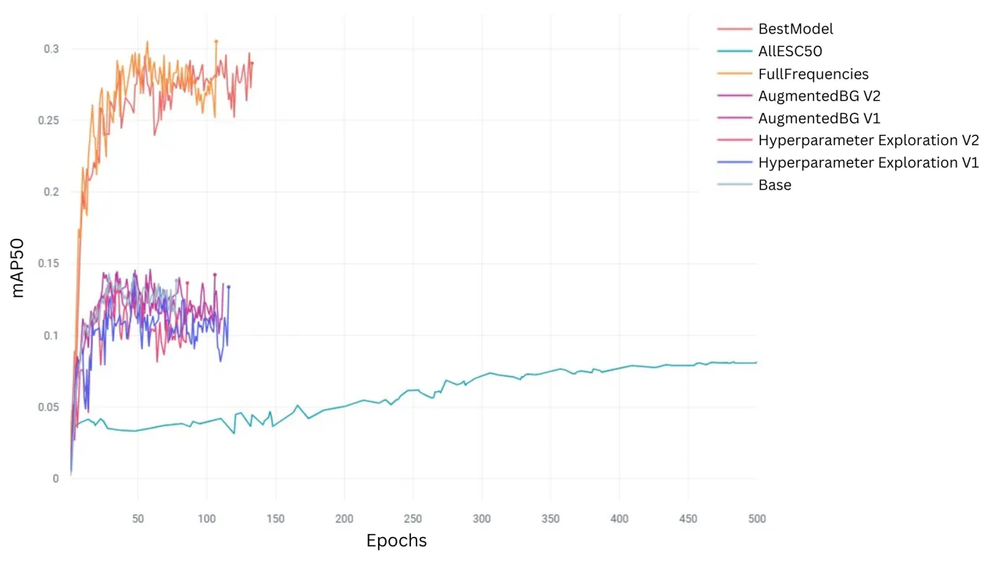

# A Bird Song Detector for improving bird identification through Deep Learning: a case study from Doñana

Journal: Ecological Informatics

Alba Márquez-Rodríguez^(\*) Affiliation: University of Córdoba, Córdoba,
Spain Affiliation: Estación Biológica de Doñana, Sevilla, Spain
Affiliation: University of Cádiz, Puerto Real, Cádiz, Spain    Miguel
Ángel Mohedano-Munoz Affiliation: Estación Biológica de Doñana, Sevilla,
Spain Affiliation: Universidad Politécnica de Madrid, Madrid, Spain   
Manuel J. Marín-Jiménez Affiliation: University of Córdoba, Córdoba,
Spain    Eduardo Santamaría-García Affiliation: Estación Biológica de
Doñana, Sevilla, Spain    Giulia Bastianelli Affiliation: Estación
Biológica de Doñana, Sevilla, Spain    Pedro Jordano
Affiliation: Estación Biológica de Doñana, Sevilla, Spain
Affiliation: University of Sevilla, Sevilla, Spain    Irene Mendoza
Affiliation: Estación Biológica de Doñana, Sevilla, Spain
Affiliation: University of Sevilla, Sevilla, Spain

###### Abstract

Passive Acoustic Monitoring (PAM), which uses devices like automatic
audio recorders, has become a fundamental tool in conserving and
managing natural ecosystems. However, the large volume of unsupervised
audio data that PAM generates poses a major challenge for extracting
meaningful information. Deep Learning techniques, particularly automated
species identification models based on computer vision, offer a
promising solution. BirdNET, a widely used model for bird
identification, has shown success in many study systems but is limited
at local scale due to biases in its training data, which focus on
specific locations and target sounds rather than entire soundscapes. A
key challenge in bird species detection is that many recordings either
lack target species or contain overlapping vocalizations, complicating
automatic identification. To overcome these problems, we developed a
three-stage pipeline for automatic bird vocalization identification in
Doñana National Park (SW Spain), a wetland facing significant
conservation threats. We deployed AudioMoth recorders in three main
habitats across nine different locations within Doñana, and the manual
annotation of 461 minutes of audio data, resulting in 3749 annotations
covering 34 classes. Our working pipeline included, first, the
development of a Bird Song Detector to isolate bird vocalizations, using
spectrograms as graphical representations of bird audio data and
applying image processing methods. Second, we classified bird species
training custom classifiers at the local scale with BirdNET’s
embeddings. The best-performing detection model incorporated synthetic
background audios through data augmentation and an environmental sound
library (ESC-50). Applying the Bird Song Detector before classification
improved species identification, as all classification models performed
better when analyzing only the segments where birds were detected.
Specifically, the combination of the Bird Song Detector and fine-tuned
BirdNET increased weighted precision (from 0.18 to 0.37), recall (from
0.21 to 0.30), and F1 score (from 0.17 to 0.28), compared to the
baseline without the Bird Song Detector. Our approach demonstrated the
effectiveness of integrating a Bird Song Detector with fine-tuned
classification models for bird identification at local soundscapes.
These findings highlight the need to adapt general-purpose tools for
specific ecological challenges, as demonstrated in Doñana. Automatically
detecting bird species serves for tracking the health status of this
threatened ecosystem, given the sensitivity of birds to environmental
changes, and helps in the design of conservation measures for reducing
biodiversity loss.

###### Keywords: 

AudioMoth , Computer Vision , Convolutional Neural Networks ,
Ecoacoustics , Ecosystem health , Passive Acoustic Monitoring

## 1 Introduction

Natural environments face significant challenges in terms of
conservation due to different drivers of global change, such as habitat
loss, climate change, species invasion or anthropogenic pressure. In
response to this crisis, biodiversity monitoring and species interaction
assessments have become essential to understanding environmental impacts
and developing conservation strategies. Effective biodiversity
monitoring is fundamental for conservation efforts, as it provides the
data necessary to make informed decisions. Still, it is challenging to
get the necessary data at large spatio-temporal scales.

In this regard, identifying and tracking the presence of birds is
crucial, as birds serve as indicators of ecosystem health (Gregory and
van Strien, 2010). Although various automatic monitoring technologies,
such as cameras and audio recorders, are already in use, efficiently
managing and analyzing the large volumes of data generated by these
devices remains a challenge. An effective technology is Passive Acoustic
Monitoring (PAM), which uses audio recorders to continuously capture
sounds of an environment. PAM is particularly valuable for monitoring
biodiversity, as it can operate in remote and inaccessible areas,
providing continuous data without disturbing habitat (Sugai et al.,
2019). Using PAM, the spatiotemporal scale of monitoring can be
significantly expanded, allowing more comprehensive and detailed
ecological studies (Gibb et al., 2019).

In recent years, the cost of automatic recording devices has been
reduced, leading to an increase in the collection of this type of data
for ecological studies (Farley et al., 2018; Darras et al., 2019;
Metcalf et al., 2023). Despite their advantages, they generate large
amounts of unlabeled data, making analysis difficult and limiting their
utility for decision making (Tuia et al., 2022). The primary objective
of any PAM project is to address the challenge of efficiently extracting
biodiversity information from large volumes of audio data. Thanks to
this process, the identification of bird species is automated, which
greatly improves data analysis efficiency in the context of
environmental monitoring.

Historically, early bird vocalization recognition methods relied on
basic sound feature analysis, using techniques such as Random Forests
for classification. These methods focused on extracting specific audio
features – such as frequency, pitch, or duration – to create a feature
set that could be used for classification (Keen et al., 2021). Despite
of being effective to a certain extent, these approaches were limited by
their reliance on manually crafted features and often struggled with
complex and overlapping sounds. Such challenges in traditional feature
engineering approaches are well-documented in foundational works on
Machine Learning (Hastie et al., 2009; Murphy, 2012), where the need for
automated, high-level feature extraction was emphasized as a challenge
for accurate classification in complex domains. The recent shift towards
Deep Learning (Goodfellow, 2016), has enabled more advanced
architectures that autonomously learn rich representations from data,
addressing many limitations of earlier methods.



Figure 1: Pipeline used for the development of our Bird Song Detector.
The process was divided into three main stages: (1) Preprocess: This
stage involved deploying automatic recording devices (AudioMoths) in
natural habitats of Doñana to collect audio data, as a part of the
BIRDeep project. Audio recordings were then annotated by experts to
identify bird vocalizations, followed by splitting the dataset into
training, validation, and test sets. (2) Bird Song Detector: We trained
the Bird Song Detector using the annotated dataset. Our Detector was
derived from YOLOv8, which is a state-of-the-art model suitable for
detecting objects in images. The Bird Song Detector was developed to
identify segments of the audio recordings that contained the sonogram of
a bird vocalization (only the presence/absence of any bird species).
After training, the Detector model was applied to the test dataset,
producing segments that contained potential bird vocalizations. (3)
Classifier: The final stage consisted first of a fine-tuning of BirdNET
model, using the audio from Doñana annotated by experts. Second, this
fine-tuned BirdNET model was then used to extract feature embeddings and
train other Machine Learning algorithms. Finally those algorithms were
validated and tested with the segments that were previously identified
by the Bird Song Detector as containing bird songs. After applying this
pipeline, we were able to greatly improve the classification of bird
species from Doñana present in each segment. Classifications using the
detector first vs. those only using BirdNET, the state-of-the-art
approach, improved: True Positives were increased, and False Negatives
were reduced.

In the case of bird vocalization recognition, Deep Learning techniques
have represented a revolution for monitoring bird populations (Xie
et al., 2023; Stowell, 2022). One of the most popular models of bird
vocalization recognition is BirdNET (Kahl et al., 2021), which has
proved to be successful in many cases (Pérez-Granados, 2023; Wood and
Kahl, 2024; Schuster et al., 2024). These models were tested in
environments where the base model was especially well trained, mainly in
Northern America and central-Northern Europe. This means that the model
was initially trained on a dataset that closely resembles the conditions
of the test environment, thereby increasing its predictive accuracy.
While BirdNET performs well in regions it was trained on, its accuracy
declines in unfamiliar soundscapes due to local variations in bird
vocalizations, background noise, and overlapping bird vocalizations
(Beery et al., 2019; Lauha et al., 2022; Pérez-Granados, 2023). In these
cases, False Positives (FPs) often arise from other vocalizing animals
not being birds, anthropogenic sounds, or weather conditions (Stowell
et al., 2019; Kahl et al., 2021; Clark et al., 2023).

Foundational models like BirdNET also struggle to recognize species they
were not trained on. In theory, it is possible to retrain an existing
model to add missing species, known as fine-tuning (Lalor et al., 2017).
Alternatives such as Google’s Perch model (Hamer et al., 2023) and
custom models based on BirdNET with fine-tuning for local conditions
have been developed (Brunk et al., 2023; Sossover et al., 2024; Ghani
et al., 2024; Pérez-Granados et al., 2025). These fine-tuned models aim
to improve accuracy by accounting for the unique characteristics of
local bird populations (Lauha et al., 2022). However, this task is quite
challenging as it requires Machine Learning expertise similar to having
to train models from scratch. While recent studies have demonstrated
progress in applying Machine Learning to accelerate the annotation
process in ecoacoustics (Martin et al., 2022; Sethi et al., 2024), these
approaches are still under development and not yet widely implemented.

To address these limitations, we have been inspired by methodologies
used in camera trap projects (Beery et al., 2019; Rigoudy et al., 2023),
in which a detector is applied prior to species classification on
captured images. Similarly, we propose a two-stage pipeline approach
that uses first a generalizable bird vocalization detector combined
later with a classifier, improving accuracy and reducing false
positives. In particular, we have developed a Bird Song Detector based
on the YOLOv8 model (You Only Look Once v8; Jocher et al. (2023))
trained with data from our case study in Doñana National Park. Once the
audio segments containing bird songs have been detected, we applied
several classifier models, and in all of them, we have proven an
improvement of the classification when the detector was present (Figure
1).

The added value of this pipeline lies in its ability to isolate relevant
segments of audio that contain bird vocalizations before applying a more
computationally intensive species classifier. This process not only
reduces the number of non-bird segments incorrectly identified as bird
vocalizations but also simplifies the fine-tuning of the species
classifier, as the model is optimized to work with segments that are
already confirmed to contain bird sounds. By separating the detection
and classification stages, we minimize background noise interference and
focus the classifier’s resources on the most relevant audio data,
leading to improved overall system performance. The generalization
ability of the Bird Song Detector also ensures that it can identify bird
vocalizations for locally abundant species for which it was not
originally trained, making this approach robust for real-world
applications with diverse species compositions.



Figure 2: Spatial distribution of the nine sampling sites where PAM
devices (AudioMoths) were deployed in Doñana National Park. The sampling
design included the three main habitats of Doñana: marshland, scrubland
(high or low), and ecotone. Each habitat type is distinguished by a
different colour in the map. Names of study sites belong to the local
denomination by the ICTS-Doñana (ICTS Doñana, 2025) permanent
infrastructure where the devices were installed.

As a study case, we applied this pipeline to the PAM program developed
by the BIRDeep project at Doñana National Park (SW Spain) (Birdeep.org,
2025). This area presents a high conservation concern due to the
alarming decline of its bird populations over time due to different
human impacts. Monitoring bird diversity through PAM serves then as a
proxy for assessing the health status of Doñana’s endangered ecosystems.

## 2 Material and Methods

### 2.1 Preprocess

#### 2.1.1 Field study site and PAM design

Soundscapes were recorded at Doñana National Park (SW Spain). This area
corresponds to the marshes of the Guadalquivir delta and is one of the
most important wetlands in Southern Europe, where millions of migrating
birds stopover and winter every year (Rendón et al., 2008; Green et al.,
2016). The area has serious conservation threats due to water
over-exploitation for agriculture and tourism, climate and land-use
change, and pollution due to a mine spillover in 1998, among others
(Green et al., 2024), which poses serious concerns both at the local and
European administration levels. These threats are particularly affecting
bird populations, which are in decline over the last years (Camacho
et al., 2022; Campo-Celada et al., 2022). Doñana includes four major
habitats, which are differentiated by their flooding regime and
vegetation: coastal dunes, scrublands, marshlands, and the ecotone or
transition among them. The deployment design of the BIRDeep project
included nine AudioMoth recorders (Hill et al., 2019) that were
distributed among three of these habitats: two in the marshland, three
in the ecotone and four in the scrubland, differentiating high and low
scrubland (see Figure 2). AudioMoths are low-cost automatic audio
recording devices with open-source hardware (Hill et al., 2018). They
continuously recorded 1 minute of audio every 10 minutes. Configuration
parameters of deployed AudioMoth included a sampling rate of 32 kHz, a
medium gain, and a filter band focused on bird frequencies (0.6-16.0
kHz).

#### 2.1.2 Acoustic data annotation by experts

Although devices have been continuously recording since their
deployment, for this study, we selected a manually annotated subset
spanning from March to October 2023 for logistic reasons. From the total
of audios, we selected 461 minutes. We tried to balance representation
across sites and habitats while keeping the annotation effort
manageable. We also prioritized periods of high bird activity, primarily
the morning chorus, to maximize the number of detectable vocalizations
in the annotations (Robbins, 1981).

Annotation was carried out manually by two co-authors with
ornithological expertise (ESG and GB). The process is labor-intensive
and time-consuming, requiring simultaneous listening to the audio and
visualization of the spectrogram, which displays how the sound’s
frequency content evolves over time. Annotating these 461 minutes
required approximately 13,445 minutes (about 224 hours) of labor effort,
with a median annotation time of 18 minutes and an average of 29.4
minutes per 1-minute file. The experts used Audacity software (Audacity,
2017), which facilitates species identification using auditory signals
and visual patterns based on spectrograms. These annotations were then
exported from the Audacity format and converted to CSV files. Each
annotation consisted of bounding boxes with the minimum and maximum
frequency, as well as the start and end time of each bird vocalization
in the spectrogram.

When ornithological experts faced uncertainties for labeling species in
the audios, they referred to field censuses done in the same sampling
stations to ensure the accuracy of their annotations. These field
censuses were conducted periodically (43 censuses from March 2023 until
February 2024) and provided diversity data that was used to
cross-validate the audio labels. By cross-validating the audio data with
field observations, the annotators could confirm species presence and
improve the reliability of their annotations at the same time that it
helped to narrow down the number of potential species, making it easier
to identify the species present in the recordings.

The number of annotations was highly unbalanced across recorders,
whereas the number of annotated files was more similar, except for
Juncabalejo site (Figure 3). This was the most isolated site in the
marshland and we found logistic problems to access the recorders to
change batteries and SIM cards during the flooding time. Some recorders
had a high number of annotations because their recordings were rich in
bird vocalizations, likely reflecting variations in bird occurrence and
activity, environmental conditions, and recording quality across
sampling sites.

(a) Total number of vocalization annotations per recorder.

(b) Number of unique audio files per recorder.

Figure 3: Number of annotations and audio files across sampling sites
(see Figure 2 for reference of site names), illustrating the varying
levels of annotation effort across recorders.

After standardizing the annotations, a total of 3749 annotations were
created, spanning 34 different classes, as shown in Figure 4. In
addition to the species-specific classes, we have distinguished other
general classes: Sturnus sp., Passer sp., and Lanius sp., which were
used when the species was unknown but the genus could be identified;
Alaudidae, Fringillidae, and Sylviidae, used when only the bird family
could be determined; a general Bird class for cases where the sound was
identified as avian but further classification was not possible.
Finally, there was a No Bird class for recordings that contain
soundscapes without bird songs or any non-avian biotic sound. For the
Bird Song Detector, which only distinguises between two classes Bird and
No bird, all bird-related classifications were re-labeled as Bird. For
the species classifiers, to avoid confusion, general classes that
overlapped with specific species (e.g., Alaudidae, Bird and
Fringillidae) were removed. Upupa epops was also removed, due to split
considerations, explained in next Section 2.1.3. These classes,
represented in orange in Figure 4, were excluded to ensure a clear
distinction between general and specific labels.

Figure 4: Number of annotations of the 34 annotated classes in the
dataset. All annotated classes, including genus- and family-level labels
(e.g., Sturnus sp., Fringillidae) and the general Bird label, were used
to train the Bird Song Detector by relabeling them under a unified Bird
class. For species classification, only the 29 classes shown in blue
were retained. The orange bars represent general or ambiguous classes
(e.g., family-level or uncertain identifications) that were excluded
from classifier training to ensure specificity.

It is important to note that the dataset (Márquez-Rodríguez et al., 2025) exhibits class imbalance, with varying frequencies of annotations
across different classes. Additionally, the dataset contains inherent
challenges related to environmental noise (see subsection 3.1).

#### 2.1.3 Dataset split

Figure 5: Distribution of the number of annotations per class across
training (blue), validation (orange), and test (green) sets.

The dataset (Márquez-Rodríguez et al., 2025) was divided into training,
validation, and test sets, with the aim of achieving an 80-10-10
proportion per species (Hardy, 2010). However, maintaining independence
and avoiding correlation among subsets to avoid overestimation during
model evaluation was challenging (Kattenborn et al., 2022), as some
audios were multilabeled and contained vocalizations from more than one
species (see Figure 3). This made it difficult to strictly adhere to the
desired 80-10-10 ratio. To mitigate these issues, we prioritized
ensuring that no audio file appeared in more than one subset, even if it
contained multiple species, to maintain independence. In the particular
case of Upupa epops, all vocalizations of this species were contained
within a single audio file assigned to the validation set, which also
included annotations of other species. Consequently, Upupa epops was
placed exclusively in the validation set and excluded from both training
and testing tests to prevent bias during detector evaluation. This
species was not included in the classifier due to the lack of additional
audio recordings (Figure 4). The final distribution of sets reflects
these adjustments that balance classes as much as possible but also
consider independence constraints (Figure 5).

#### 2.1.4 Data Preparation

The audio data were transformed into spectrograms, which are graphical
representations that display how the signal’s energy is distributed
across different frequencies over time. This transformation makes the
application of Deep Learning models based on image processing
techniques, i.e. Convolutional Neural Networks, suitable for audios
(Carvalho and Gomes, 2023). A log-scaled spectrogram is a variant of a
spectrogram where the frequency axis is represented logarithmically,
emphasizing lower frequencies while preserving the visibility of higher
frequencies. This scaling is particularly suitable for analyzing bird
vocalizations, as it provides greater resolution in the lower frequency
range where many bird songs and calls are concentrated, while still
capturing harmonics and other features that extend into higher
frequencies (Wyse, 2017).

Spectrograms were generated using the librosa Python library (McFee
et al., 2015), a popular toolkit for audio analysis. The Short-Time
Fourier Transform (STFT) was applied to the audio signal to compute the
spectrogram, and the amplitude of the resulting frequency bins was
converted to a decibel (dB) scale. The frequency axis was displayed on a
logarithmic scale. The frequency range of the spectrograms was set to a
minimum of 1 Hz and a maximum of 16,000 Hz, which encompasses the
typical range of bird vocalizations while excluding inaudible
frequencies or irrelevant noise. The dimensions of the output
spectrogram images were $`930\times 462`$ pixels. Although our
annotations originally included frequency windows for each vocalization,
to simplify detection given the limited data, bounding boxes spanned the
entire frequency y-axis. This choice prioritizes the temporal
localization of bird vocalizations, which are the primary signal for
subsequent classification (see Figure 6 as an example).



Figure 6: An example of a log-scaled spectrogram, in gray scale for
clearer visualization, from the Doñana dataset with annotations (i.e.,
blue and orange rectangles) for temporal windows and the complete
frequency spectrum for the annotated vocalizations of two bird species.

To enhance the dataset and improve the robustness of downstream models,
additional preprocessing steps were applied. Specifically, synthetic
audio samples were generated by adding random noise (using NumPy Python
library (Harris et al., 2020), to simulate background interference and
slightly adjust the intensity of the signals. These modifications aimed
to increase the number of training examples that contained only
background noise, ensuring a more diverse dataset for both detection and
classification tasks.

The annotations were further processed to adopt the format required by
the YOLOv8-based object detection model (Jocher et al., 2023). A
detailed explanation of the mathematical conversion from YOLOv8’s
normalized coordinates to temporal annotations in seconds is presented
in A.

### 2.2 Bird Song Detector Model Development

We chose a pre-trained YOLOv8 model to develop our Bird Song Detector
because it is the state-of-the-art for real-time object detection
models. YOLOv8’s architecture consists of multiple convolutional layers
followed by fully connected layers that predict bounding boxes,
objectness scores, and class probabilities for detected objects. YOLOv8
divides each input image into a grid and predicts bounding boxes for the
presence of these image events, along with a confidence score for each
prediction. In our case study, the input images were spectrograms, and
the relevant events were bird vocalizations represented as sonograms in
the images. Given the nature of our local audio data, which contains a
mix of bird sounds and background noise, we chose YOLOv8s (small version
of YOLOv8) for distinguishing relevant events. This reduced version was
more effective in maintaining high detection accuracy while minimizing
computational load at initial experiments (Pasupa and Sunhem, 2016).

The training of the Bird Song Detector model was done using the
previously described spectrograms that were annotated with the bird
vocalizations from Doñana. We performed data augmentation techniques to
improve the robustness of the model: YOLO’s internal augmentation
methods, which involve modifications such as changes in HSV (hue,
saturation, and value), temporal translations (shifting the audio in
time), and mixup (Zhang et al., 2017; Tokozume et al., 2017), a
technique widely used in audio data augmentation. The dataset was also
supplemented with additional samples from an external dataset (Piczak,
2015a) to further enrich model training (see Section 3.1 below).

#### 2.2.1 Evaluation metrics for Detections

Currently, there are no widely available, general-purpose bird
vocalization detectors trained for global-scale datasets. As a result, a
direct comparison of our Bird Song Detector with another
state-of-the-art bird vocalization detector is not possible. Existing
tools like BirdNET, while primarily designed for species classification,
also includes background training data. Therefore, BirdNET can serve as
a baseline detector for identifying audio segments containing bird
vocalizations and we compared it with the Bird Song Detector developed
in our study. More information about BirdNET is provided in Section
2.3.1.

The performance of both detectors used (Bird Song Detector and BirdNET)
was assessed using standard metrics for object detection and
classification tasks, including TPs, FPs, FNs, Precision, Recall,
F1-score, and Accuracy. The detection metrics were calculated as
follows:

```math
\text{Precision}=\frac{\text{TP}}{\text{TP}+\text{FP}}
```

```math
\text{Recall}=\frac{\text{TP}}{\text{TP}+\text{FN}}
```

```math
\text{F1-Score}=\frac{2\cdot\text{Precision}\cdot\text{Recall}}{\text{Precision}+\text{Recall}}
```

```math
\text{Accuracy}=\frac{\text{TP}+\text{TN}}{\text{TP}+\text{FP}+\text{FN}+\text{TN}}
```

Additionally, we applied an Intersection over Union (IoU) criterion to
ensure that detected segments overlapped with Ground Truth annotations,
making the evaluation more consistent across different detection
approaches. A prediction is considered correct if its overlap with a
Ground Truth annotation meets the required threshold, quantified using
the IoU metric. IoU measures the intersection between predicted and
actual vocalization segments relative to their total duration. It is
defined as:

```math
\text{IoU}=\frac{\text{Intersection (Overlap Duration)}}{\text{Union (Total Duration of Prediction and Ground Truth)}}
```

##### 2.2.1.1 Bird Song Detector

For this study, a minimum IoU threshold of 0.1 was used to determine
matches. Predictions with IoU values below this threshold were
classified as FP, and Ground Truth annotations without matching
predictions were classified as FN. Temporal segments from the Bird Song
Detector were further filtered based on a confidence score threshold to
exclude low-confidence predictions.

##### 2.2.1.2 BirdNET as a bird vocalization detector

BirdNET processes audio recordings by segmenting them into fixed
3-second intervals and classifying each segment (see Section 2.3.1). In
this study, we assessed BirdNET’s ability to function as a binary bird
presence detector, independent of species classification. A detection
was considered correct if any part of a GT annotation overlapped with a
BirdNET segment, even if the GT annotation spanned multiple segments.
This approach accounts for cases where annotated bird vocalizations
extend across adjacent 3-second intervals.

To ensure a fair comparison with the Bird Song Detector, we applied an
IoU-based evaluation. Because BirdNET operates on fixed 3-second
windows, its segments do not always align precisely with ground truth
annotations. Therefore, instead of a strict IoU match, we required a
minimum overlap between GT annotations and predicted segments, similar
to the IoU threshold used for the Bird Song Detector.

BirdNET assigns a confidence score to each prediction, reflecting the
likelihood that a species vocalization is present. To ensure a
species-agnostic evaluation, we applied a uniform confidence threshold
across all predictions rather than optimizing it for individual taxa.
The selected confidence threshold determines how conservatively BirdNET
predicts the presence of a bird vocalization:

- 1.  Confidence Score = 0.1 (Default Value): This is the default BirdNET
      threshold. Prior studies have shown that using this threshold in
      real-world PAM scenarios leads to an increase in FPs, as BirdNET
      assigns low-confidence scores to background noise or ambiguous
      detections (Pérez-Granados, 2023). However, lowering the confidence
      threshold improves recall by reducing missed detections.
- 2.  Confidence Score = 0.6 (Adjusted Threshold): Higher confidence
      thresholds have been recommended for improving the reliability of
      BirdNET predictions in complex acoustic environments. Funosas
      et al. (2024) found that BirdNET predictions become significantly more
      reliable when using thresholds above 0.7. We adopted a slightly lower
      threshold of 0.6 to balance precision and recall, reducing FPs while
      still capturing a sufficient number of detections.

To systematically evaluate BirdNET as a detector, we applied both 0.1
and 0.6 thresholds uniformly to all species, treating BirdNET’s
predictions as binary vocalization detections rather than
species-specific classifications. This ensures that confidence score
variations across species do not influence the detection performance
comparison.

Different evaluations were carried out with different species lists.
First, we used a full list of species from Doñana that included 412
classes, as provided by BirdNET, based on the study area coordinates. We
then later reduced this list by selecting the most common species in the
area and removing sporadic observations, using references from existing
literature (García et al., 2000; Garrido et al., 2004) and our own field
observations from expert censuses. This resulted in a shorter list of
337 species, which we have called the “expert list”.

To comprehensively assess BirdNET’s performance under different
conditions, we tested the following four configurations:

- 1.  BirdNET without fine-tuning at a confidence threshold of 0.6, using
      the default species list for Doñana National Park coordinates.
- 2.  BirdNET without fine-tuning at a confidence threshold of 0.6, using
      the expert species list for Doñana National Park.
- 3.  BirdNET fine-tuned at a confidence threshold of 0.6, using classifier
      species classes.
- 4.  BirdNET fine-tuned with a lower confidence threshold of 0.1, to assess
      detection sensitivity.

##### 2.2.1.3 Comparison of Methods

The percentage improvements in TPs, FNs, FPs were calculated based on
changes observed between both methods, using the following general
formula:

```math
\text{{PercentageChange}}=\left(\frac{\text{{NewValue}}-\text{{OldValue}}}{\text{{OldValue}}}\right)\times 100
```

Where NewValue refers to the value obtained from our Bird Song Detector
and OldValue refers to the value obtained from BirdNET with the specific
confidence score threshold.

An increase in TPs indicates an improvement in detection accuracy, as
more bird vocalizations are correctly identified. A decrease in FNs is
also a sign of improved performance, as the system misses fewer bird
vocalizations. Conversely, a decrease in FPs represents a reduction in
erroneous detections of non-bird sounds. For all metrics, positive
percentage changes in TPs and negative changes in FN and FP signify
improvements, while negative changes in TPs or positive changes in FNs
and FPs indicate a decline in performance.

When evaluating percentage changes in the results, it is important to
consider them in absolute terms. A large percentage increase or decrease
might appear significant at first glance, but its actual impact depends
on the scale of the values involved. For instance, changes from small
baseline values can result in high percentage variations, even if the
absolute difference is relatively minor. Conversely, changes in metrics
with larger absolute values might show smaller percentage shifts but
represent a more substantial impact on overall performance. Therefore,
it is crucial to interpret these percentages within the context of the
absolute figures to avoid misinterpreting the true extent of the
changes.

### 2.3 Bird-Song Classifier Model Development

#### 2.3.1 BirdNET

As the third step in our pipeline (Figure 1), we fine-tuned BirdNET v2.4
to create a feature extractor specifically adapted to the ecological
context of Doñana. BirdNET is a Deep Learning model designed to classify
bird species using audio inputs. It segments audio recordings into
3-second clips, it transforms the audio into spectrogram images, and it
performs the classification into a bird species using a deep
Convolutional Neural Network (Kahl et al., 2021). BirdNET v2.4 uses an
EfficientNetB0-like backbone with a final embedding size of 1024 for
feature extraction and classification. It covers frequencies from 0 Hz
to 15 kHz, and it is trained for 6,522 classes (including 10 non-event
classes), making it suitable for the identification of diverse bird
species all over the world. Non-event classes refer to categories that
represent sounds or signals that are not related to bird vocalizations,
such as background noise, human-made sounds, or other environmental
noises.

The fine-tuning was performed in the BirdNET v2.4 GUI v1.5.1 (Kahl,
2021), with the default training parameters. The training mode was set
to replace, ensuring that the original classification layer was
overwritten and only the newly trained classes remained. To address
class imbalance, repeat upsampling was applied, with minority classes
resampled at 10% of the majority class frequency. This fine-tuning step
adapted BirdNET to the bird species and soundscapes of Doñana, intending
to reduce bias and improve model performance for audio recordings from
the region.

Once fine-tuned, the model was used to extract feature
embeddings—1024-dimensional vector representations capturing essential
audio characteristics. These embeddings served as input features for
subsequent classifiers.

The training data for fine-tuning were derived directly from the expert
annotations (Márquez-Rodríguez et al., 2025). Each annotated time window
was segmented and organized into folders corresponding to their
respective annotated classes, adhering to BirdNET’s required training
input structure.

#### 2.3.2 Other classifiers

In addition to the fine-tuned BirdNET model, we explored other
classification approaches: a Machine Learning classifier, and two Deep
Learning models.

For the Machine Learning approach, we used Random Forest, a
well-established method in bioacoustics for species classification due
to its ability to handle structured data efficiently and provide stable
predictions (Breiman, 2001). The model was trained using BirdNET
embeddings (1024-dimensional feature vectors) extracted from the same
dataset used for fine-tuning.

The Random Forest model was implemented using the RandomForestClassifier
from the scikit-learn library (Pedregosa et al., 2011) of Python. The
optimal configuration included a maximum depth of 50, with a minimum of
2 samples per leaf and 10 samples per split.

For Deep Learning models, we trained ResNet50 and MobileNetV2 using the
Keras Python library (Chollet et al., 2015), initializing both with
pre-trained ImageNet weights. The original classification layer was
removed, and all layers were initially frozen. A new classification head
was added, consisting of a Global Average Pooling layer, followed by a
256-unit dense layer with ReLU activation and a final softmax layer for
classification. The model was first trained with only the newly added
layers, keeping the pre-trained base frozen. After this initial phase,
the entire model was unfrozen for a final fine-tuning step across all
layers. MobileNetV2 was selected due to its reduced dimensionality,
which helps to prevent overfitting, especially given the relatively
small dataset size, while also reducing training time and computational
requirements. Both deep learning models were trained using 3-second
spectrograms generated from the segments used for the fine-tuned
BirdNET.

During evaluation, the models were tested using both full 1-minute audio
files (segmented into 3-second windows) and shorter audio segments
identified by the Bird Song Detector. When these detected segments were
shorter than the required 3-second input length, they were padded with
zeros—representing silence—to match the model’s input size.

We compared these four classifiers (fine-tuned BirdNET, Random Forest,
and two Deep Learning models) with and without previously using the Bird
Song Detector. This allowed us to evaluate how the Bird Song Detector
improved bird classification in different approaches.

#### 2.3.3 Evaluation metrics for Classifiers

All BirdNET-based classifiers were evaluated using a fixed confidence
score threshold of 0.1, both with and without the Bird Song Detector. If
BirdNET did not assign any species a confidence score above this
threshold, the segment was classified as background. However, for other
classifiers trained specifically for this study (e.g., Random Forest,
ResNet50, MobileNetV2), a separate Background class was included in the
model itself. Since these classifiers explicitly learned to distinguish
bird vocalizations from background noise, no confidence threshold was
applied, and the species classification with the highest confidence
score was selected for each segment, whether it was a bird species or
background noise. This approach ensured that BirdNET adhered to a
stricter filtering process, while other models relied on their learned
classification structure.

The classification performance of the models was evaluated using
standard metrics from the scikit-learn Python library (Pedregosa et al.,
2011), including the confusion matrix, accuracy, precision, recall, and
F1-score, along with custom indices designed to assess the classifier’s
ability to estimate the total number of bird vocalizations.

Beyond standard classification metrics, we introduce the Idx Pred/Ann
metric to further analyze model behavior. This metric helps evaluate not
only classification accuracy but also the ability of models to filter
additional false positives, providing insight into whether the
classifier tends to over-predict or under-predict species occurrences:

- 1.  Number of Predictions: The total number of predictions made by the
      classifier, regardless of their correctness.
- 2.  Idx Pred/Ann: Index of Predictions per Annotation. This index
      quantifies the degree to which the classifier overestimates
      ($`\text{Idx Pred/Ann}>1`$) or underestimates
      ($`\text{Idx Pred/Ann}<1`$) the number of bird vocalizations in the
      test set. A value close to 1 indicates that the classifier predicts a
      number of vocalizations similar to the number of annotated ground
      truth segments, while deviations highlight either an excessive or
      insufficient number of predictions. It evaluates the capability of
      detection and filtering additional false positives.

## 3 Experiments

### 3.1 Bird Song Detector Training

To select the Bird Song Detector, multiple YOLOv8 models with different
configurations were trained, and their performance was evaluated using
the mean Average Precision (mAP) metric at an Intersection over Union
(IoU) threshold of 50% (mAP50) (Padilla et al., 2021). Initial
experiments, represented by the purple lines in Supplementary Figure 1
(Base, Hyperparameter Exploration V1, Hyperparameter Exploration V2,
AugmentedBG V1 and AugmentedBG V2), showed suboptimal performance,
particularly due to a high number of FPs (Table 1).

Given the complexity and small size of the dataset (Márquez-Rodríguez
et al., 2025), the bounding boxes, which were initially designed to
delimit both the frequency spectrum and the time window, were simplified
(represented by the light orange line, FullFrequencies, in Figure 1).
This approach aimed to reduce the complexity of the task for the model,
given the limited amount of data available.

To address the issue of the FPs, the ESC-50 dataset (Piczak, 2015b),
which is a large collection of 50 environmental sound classes, was
introduced as background noise (negative samples). To prevent confusion,
bird-related classes were removed only from ESC-50, but not from our
primary dataset. When the dataset was fully included, the model
primarily learned to recognize background sounds and failed to detect
bird songs effectively (green line, AllESC50, in Figure 1).

Subsequently, the ESC-50 dataset was reduced to comprise only 25% of the
total training data. This adjustment led to significant improvements in
the model’s performance (dark orange line, Best Model, in Figure 1).
This balanced approach allowed the model to better differentiate between
bird songs and background noises, improving detection accuracy while
minimizing FPs.

The various model configurations employed during the experimentation are
summarized in Table 1, which also presents the performance metrics for
each configuration. The Best Model, which employed synthetic background
augmentation of noise and intensity changes and a reduced ESC50 dataset,
achieved high mAP50 scores (0.29), along with balanced precision and
recall. Other configurations, such as AllESC50, displayed lower
performance metrics. On the other hand, the Full Frequencies model
without the ESC50 dataset had the best performance during training, with
an mAP50 score of 0.305. This highlights the importance of specific
augmentation strategies and dataset choices in optimizing detection
accuracy.

### 3.2 Selection of confidence score threshold for the Bird Song Detector

To evaluate the confidence scores generated by the Bird Song Detector,
we transformed confidence scores resulting from the output of the model
into logit scores. This transformation allowed us to convert unitless
confidence scores into a probability of detection, using a logistic
regression (Wood and Kahl, 2024).

By converting the confidence scores into logit scores, we were able to
assess the model’s performance more accurately across various
probability thresholds (Padilla et al., 2021; Wood and Kahl, 2024). This
transformation helped identify the point at which the model’s
predictions were most reliable, ensuring that the selected threshold
maximized True Positives while maintaining an acceptable level of False
Positives. Through this method, we were able to ensure that the
confidence scores reflected the actual likelihood of correct
predictions, improving the interpretability and robustness of the
model’s output.

The conversion from confidence scores to logit scores is based on the
logistic function:

```math
\text{logit}(p)=\log\left(\frac{p}{1-p}\right)
```

where $`p`$ represents the confidence score of the detector’s
prediction. This transformation helps to interpret the confidence scores
probabilistically, providing a more nuanced understanding of the
detector’s performance characteristics.

| Probability Threshold | Logit Score | Confidence Score | TP Loss (%) |
| --------------------- | ----------- | ---------------- | ----------- |
| 40%                   | -2.75       | 0.06             | 0.00        |
| 60%                   | -1.78       | 0.14             | 22.08       |
| 80%                   | -0.58       | 0.36             | 74.35       |
| 95%                   | 1.30        | 0.79             | 99.03       |

Table 1: Comparison of different probability thresholds for detection
with their respective logit scores, confidence scores, and TP losses.

We evaluated the Bird Song Detector using different probability
thresholds (40%, 60%, 80%, and 95%) to find the optimal balance between
maximizing True Positive (TP) and minimizing False Negatives (FN; see
Table 1 and Figure 7). This optimization process involved analyzing the
trade-off between increasing TP detection (i.e., capturing more bird
vocalizations) and keeping errors as low as possible due to FPs or FNs.
Higher probability thresholds tend to reduce the number of detections,
including fewer FPs and TPs. After evaluation, we determined that the
60% threshold provided the best balance: it minimized the loss of TPs
while keeping the FN rate at an acceptable level (see Figure 7). The
selected threshold (60% ) corresponds to a logit score of -1.78. When
transformed back into a confidence score, this results in a threshold of
0.14.

Figure 7: Logistic Regression Model with a 60% probability threshold for
accurate predictions. Each black dot (with some transparency to allow
overlapping) represents a detection made by the Bird Song Detector. The
confidence score of each detection is transformed into a logit score and
plotted along the X-axis. A Y-axis value of 0 indicates an incorrect
detection (i.e., it does not match an actual bird vocalization according
to the ground truth). Conversely, a Y-axis value of 1 indicates that the
detection was correct, based on the ground truth annotations provided by
experts. The blue line represents the logistic regression model fitted
to these data points. The shaded area surrounding the blue line
represents the 90% confidence interval (CI) for the model’s predictions,
calculated with a bootstrapping method. The orange lines represent the
intersection of the selected threshold (60% ) with the blue logistic
regression line, showing the corresponding logit score, which is
approximately -1.78 (back-transformed into a confidence score of 0.14).

In practical terms, applying a confidence score threshold of 0.14 to our
Bird Song Detector ensures that for any given prediction, the
probability of it being correct is at least 60%, regardless of the
original confidence score provided by the model.

Lower thresholds, such as 40%, result in a 0% loss of TPs but occur
before the logistic regression model’s effects begin to improve
performance significantly (logit = -2.75, confidence = 0.06; Table 1).
At this threshold, the model fails to utilize the logistic regression
adjustments effectively, as evidenced by the extremely low confidence
score.

On the other hand, higher thresholds, like 80% or 95%, lead to excessive
losses of TPs (74.35% and 99.03%, respectively). These thresholds result
in an impractical trade-off, where the reduction in FPs comes at the
cost of almost complete loss of the TPs (which need to have a high
probability threshold to be retained), significantly degrading the
detector’s performance.

In this case and for our case study, the 60% threshold is high enough to
ensure that the logistic regression model’s adjustments are actively
enhancing detection performance, while also preserving a manageable
amount of TPs. This threshold ensures that the model remains both
reliable and practical for detecting bird songs, thereby offering an
optimal balance between confidence and detection accuracy. For further
experiments and results in the Bird Song Detector, a confidence score
threshold of 0.15 will be used.

### 3.3 Bird Song Detector Selection

The performance of the top models (Best Model and Full Frequencies) was
compared using the same validation dataset. As explained above, we set
confidence scores to ensure a 60% probability of correct predictions:
0.14 for the Best Model and 0.06 for the Full Frequencies model.
Although both models display comparable performance across certain
metrics, the Best Model outperforms Full Frequencies, notably in the
number of predictions (315 vs. 59; Figure 8). At a 60% of correct
prediction rate, the Best Model not only generates significantly more
predictions, but also maintains competitive performance metrics,
including accuracy and F1-Score.

(a) Comparison between models used for the Detector according to
different metrics: Accuracy, Precision, Recall, F1 Score, and an index
calculated based on the number of predictions relative to the total
number of annotations (Idx Pred/Annn).

(b) Detailed Breakdown of Predictions. This plot illustrates the integer
values of TP, FN, FP, and the total Number of Predictions.

Figure 8: Spider Web Plots Comparing Model Performance Metrics. The blue
area represents the Best Model, while the orange area indicates the Full
Frequencies model.

In the case of the Full Frequencies model, although higher precision is
achieved, the limited number of predictions raises concerns about its
robustness and generalizability. In contrast, the Best Model, with a
greater number of predictions and balanced performance metrics, stands
out as the more reliable choice for our ecological monitoring
objectives, given its consistent performance across metrics.

The Best Model also demonstrates a better fit to the validation data and
a lower prediction uncertainty, suggesting a stronger ability to
generalize across the dataset and provide more reliable detections than
the Full Frequencies model. This enhanced performance can be attributed
to the model’s specific augmentation strategy, which includes synthetic
background noise, intensity variations, and the use of a reduced ESC50
dataset. These augmentation techniques likely contribute to the model’s
ability to make more confident predictions and improve overall
reliability.

## 4 Results

### 4.1 Bird Song Detector Performance

The Bird Song Detector built with the Best Model was evaluated on the
test dataset, and its binary confusion matrix for these detections is
shown in Figure 9. This matrix shows that the detector was effective for
identifying temporal windows containing bird vocalizations and had a
relatively low proportion of FNs and FPs.



Figure 9: Binary confusion matrix for the Bird Song Detector on the test
dataset with a confidence threshold of 0.15.

### 4.2 Bird Song Detector vs BirdNET as a Bird Vocalization Detector

The Bird Song Detector was compared against BirdNET, as a bird
vocalization detector, in various configurations. Table 2 presents the
confusion matrices for these configurations.

[TABLE]

Table 2: Comparison of confusion matrices for different models used as
bird vocalization detectors, including various configurations of BirdNET
(fine-tuned and non fine-tuned, with different confidence thresholds and
species lists) and Bird Song Detector model. All models are evaluated
solely in terms of detection performance, that is, their ability to
distinguish between segments with bird vocalizations and background
noise, independently of species classification. The table shows the
number of TPs, FPs and FNs for each configuration. The last two rows
highlight relative changes in performance when comparing the Bird Song
Detector to fine-tuned BirdNET at confidence thresholds of 0.6 (blue)
and 0.1 (orange). Bold values indicate improvements made by Bird Song
Detector.

### 4.3 Bird Species Classification

To assess the impact of the Bird Song Detector on species
classification, different classifiers were tested on both raw audio and
pre-segmented audio from the detector. Table 3 summarizes the results.

|                    |                    |      |           |      |      |              |      |      |              |
| ------------------ | ------------------ | ---- | --------- | ---- | ---- | ------------ | ---- | ---- | ------------ |
| Classifier         | Bird Song Detector | Acc. | Macro Avg |      |      | Weighted Avg |      |      | Idx Pred/Ann |
|                    |                    |      | Prec.     | Rec. | F1   | Prec.        | Rec. | F1   |              |
| BirdNET fine-tuned | ✗                  | 0.21 | 0.12      | 0.14 | 0.11 | 0.18         | 0.21 | 0.17 | 1.8046       |
| BirdNET fine-tuned | ✓                  | 0.30 | 0.21      | 0.14 | 0.13 | 0.37         | 0.30 | 0.28 | 0.9183       |
| Random Forest      | ✗                  | 0.19 | 0.10      | 0.10 | 0.08 | 0.19         | 0.19 | 0.15 | 0.9059       |
| Random Forest      | ✓                  | 0.29 | 0.11      | 0.12 | 0.10 | 0.24         | 0.29 | 0.23 | 0.5435       |
| ResNet50           | ✗                  | 0.02 | 0.00      | 0.03 | 0.00 | 0.00         | 0.02 | 0.00 | 3.2682       |
| ResNet50           | ✓                  | 0.08 | 0.01      | 0.05 | 0.01 | 0.01         | 0.08 | 0.02 | 0.6306       |
| MobileNetV2        | ✗                  | 0.02 | 0.01      | 0.04 | 0.01 | 0.01         | 0.02 | 0.01 | 3.2682       |
| MobileNetV2        | ✓                  | 0.08 | 0.01      | 0.04 | 0.01 | 0.02         | 0.08 | 0.02 | 0.6306       |

Table 3: Comparison of classifier performance with and without the Bird
Song Detector. Shown metrics are Accuracy (Acc.), macro and weighted
average (Avg) precision (Prec.), recall (Rec.), F1-score (F1), and an
index calculated based on the number of predictions relative to the
total number of annotations (Idx Pred/Annn). Shaded rows indicate
improvement when using Bird Song Detector. All metrics are better at
higher values, except for Idx Pred/Ann, which is optimal when closer to

1.

Among the classifiers tested, fine-tuned BirdNET combined with the Bird
Song Detector demonstrated the highest performance, achieving an
accuracy of 0.30, a weighted F1-score of 0.28, and the best alignment
between predictions and ground truth annotations (Idx Pred/Ann =
0.9183). Given its superior performance, a more detailed analysis of
this classifier is presented, focusing on per-species performance
metrics.

Figure 10 provides the species-specific normalized confusion matrix,
offering a visual representation of misclassifications and correct
predictions. Darker cells along the diagonal indicate TPs, while
off-diagonal cells correspond to FPs and FNs, illustrating common
misclassification patterns.

Figure 10: Species-specific normalized confusion matrix showing the
performance of the BirdNET classifier on predicted segments from the
test dataset, processed by the Bird Song Detector. The values are
normalized by rows, with Y-axis labels representing the ground truth
species and X-axis labels representing the predicted classes. Darker
cells indicate higher correct prediction ratios. The main diagonal
(highlighted in bold) corresponds to TP ratios for each species, where
predicted labels match the ground truth. Off-diagonal cells represent
FPs, where the prediction is incorrect. The “Bird” category includes
species not present in the classifier’s training data. In such cases,
predictions were assigned to the “Bird” class, as no better
classification could be made.

Additionally, to better understand the classification behavior, Table 2
presents the classification report for the Bird Song Detector and
fine-tuned BirdNET, showing precision, recall, and F1-score for each
species. This allows for an assessment of which species were more
accurately identified and which ones posed challenges for
classification.

## 5 Discussion

This study presents the methodological development and evaluation of a
two-stage pipeline designed to enhance bird species identification in
PAM. The results demonstrate that incorporating a Bird Song Detector
significantly enhances bird identification in audio recordings. By
segmenting recordings and isolating relevant audio regions, the detector
effectively reduces FNs while keeping FPs to a minimum. This
pre-filtering process ensures that classifiers operate on cleaner, more
focused segments, reducing the risk of misclassification due to
background noise or overlapping sounds.

Evaluation of Detectors. Most publicly available ecoacoustic algorithms
(Kahl, 2021; Google Research, 2024) focus primarily on bird species
classification rather than the detection of vocalizations. However,
general species classification models often struggle in PAM programs
deployed in real-world scenarios, as it is already a known case for
BirdNET (Pérez-Granados, 2023; Funosas et al., 2024). Our results
confirm that relying solely on BirdNET for binary bird detection leads
to high FN and FP rates, which limits its ability to detect bird
presence.

Selecting an appropriate confidence threshold for the Bird Song Detector
is key to balance recall and precision. As shown, increasing the
threshold reduces FPs but also results in substantial TP losses—up to
99% at the highest setting. We found that a threshold of 0.15 offered
the best compromise, maintaining reasonable recall while limiting the
number of non-informative detections processed downstream. This balance
is critical in real-world deployments, where excessively low thresholds
would flood subsequent stages with noise, while overly conservative
thresholds risk missing important vocalizations. The chosen threshold of
0.15 minimizes FN rates without overwhelming the classifier with FP
detections, thus optimizing overall system efficiency and ecological
reliability.

Fine-tuned BirdNET, when used as a detector with a 0.6 confidence score
threshold, failed to detect 68% of positive samples, meaning a large
portion of bird vocalizations were missed. Lowering the confidence
threshold to 0.1 improved recall, reducing FNs to 36%, but at the cost
of 20% FPs, a 950% rise in FPs. In contrast, the Bird Song Detector
achieved a more balanced trade-off, reducing FNs to 26% while keeping
FPs below 5%. This demonstrates its effectiveness in distinguishing bird
vocalizations from background noise while maintaining high precision.

Threshold Optimization and Error Analysis. Compared to BirdNET at 0.6
confidence, the Bird Song Detector significantly improved detection
performance. Specifically, FNs decreased by 67% (from 211 to 70),
ensuring that far more bird vocalizations were correctly identified.
While this came with a 50% increase in FPs (from 6 to 9), the absolute
increase was only three additional FPs. Considering that this evaluation
was conducted on the test subset, which comprised approximately 100 to
200 minutes of annotated audio, where the potential for false detections
is virtually limitless, an increase of three FPs has a negligible impact
on overall performance while higher numbers like 63 would create
excessive noise in PAM applications.

Upon reviewing the Bird Song Detector’s FPs, we found that some errors
were due to anthropogenic noises, such as repetitive fence hits, which
may share frequency patterns or temporal structures with bird
vocalizations. This highlights an ongoing challenge in field recordings,
where separating natural and human-made sounds can be difficult. Further
refinements, such as incorporating additional non-bird training data or
adaptive thresholding strategies, could help reduce these
misclassifications.

On the other hand, when compared to BirdNET at the lower 0.1 confidence
score threshold, which is BirdNET’s default confidence score threshold
setting, the Bird Song Detector further reduced FNs by 48% and FPs by
86%, though it resulted in a 20% decrease in TPs. Despite this slight
reduction, the overall improvement in FN minimization and precision
suggests that the Bird Song Detector provides a more reliable balance
between sensitivity and accuracy. This is particularly relevant in
ecological studies, where minimizing FNs is often more critical than
reducing FPs, as missed vocalizations can lead to an underestimation of
species presence and activity.

Beyond improving bird presence detection, the Bird Song Detector
enhances species classification by ensuring that only relevant audio
segments are analyzed. Unlike BirdNET, which operates on fixed 3-second
windows regardless of whether they contain a vocalization, our detector
selects only segments where bird sounds have been detected. This
targeted segmentation reduces background noise and mitigates the effects
of overlapping calls, two major obstacles in species identification. As
a result, downstream classifiers operate with a higher signal-to-noise
ratio, leading to greater classification accuracy and a more efficient
analysis of bioacoustic data.

Comparison of Classifiers and Deep Learning Models. The Bird Song
Detector significantly improved classification accuracy across all
models. Without it, classifiers exhibited higher FP rates and greater
misclassification errors, as they processed unfiltered, noisy audio
segments. The reduction in Idx Pred/Ann indicates that the Bird Song
Detector provided cleaner, more structured data, improving the alignment
between predictions and ground truth annotations.

The shown improvements underscore the importance of pre-filtering
irrelevant audio segments before classification, as it reduces false
detections and improves prediction reliability. The Random Forest
classifier also demonstrated notable gains, increasing its accuracy from
0.19 to 0.29 when paired with the Bird Song Detector, suggesting that
traditional machine learning models can remain competitive in
bioacoustic classification when leveraging BirdNET embeddings (Ghani
et al., 2023).

However, despite these improvements, classification performance in this
study remained lower than the results reported in the original BirdNET
research (Kahl et al., 2021). BirdNET was originally evaluated on clean,
single-species recordings, achieving a mean average precision of 0.791,
an F0.5 score of 0.414 for annotated soundscapes, and an average
correlation of 0.251 with hotspot observations (areas with high species
diversity). However, in real-world PAM applications, these conditions do
not hold, leading to a notable decline in performance (Kahl et al.,
2021; Pérez-Granados, 2023). Our findings align with these observations,
species classification accuracy remained moderate even after fine-tuning
BirdNET and applying the Bird Song Detector. Background noise, species
imbalances in training data, and acoustic similarities among certain
species contributed to misclassifications, highlighting the ongoing
challenges of automated species identification in PAM programs.

Several species exhibited particularly low precision, recall, and
F1-scores, reflecting a failure to correctly classify them. These
misclassifications are likely due to class imbalance, species
similarity, and dataset limitations. The Bird Song Detector improves
classification by filtering out non-bird segments, but it does not
eliminate the fundamental challenge of uneven species representation in
training data, which remains a limiting factor in overall classification
performance.

Despite overall improvements, deep learning models such as ResNet50 and
MobileNetV2 performed poorly in both approaches. Their baseline accuracy
was extremely low (0.02), and they exhibited high FP rates. Without the
Bird Song Detector, these models had very high Idx Pred/Ann values
(3.2682), meaning they overpredicted species occurrences far beyond the
actual number of vocalizations. Although applying the Bird Song Detector
reduced this metric to 0.6306, their classification performance remained
inadequate, with weighted F1-scores below 0.02.

These findings suggest that deep learning models pre-trained on image
datasets (e.g., ImageNet) do not generalize well to bioacoustic
classification tasks. Unlike images, bird vocalizations are temporal and
frequency-dependent, requiring models to extract patterns across time
and frequency domains. The poor performance of ResNet50 and MobileNetV2
suggests that models optimized for visual features fail to capture the
nuances of bioacoustic signals. Future adaptations for deep learning in
this field should explore pretraining on bioacoustic datasets rather
than visual datasets like ImageNet or using spectrogram-specific
architectures designed for temporal pattern recognition (Ghani et al.,
2023; Xiao et al., 2022; Xie et al., 2022; Gong et al., 2021).

The reduction in Idx Pred/Ann after applying the Bird Song Detector
further reinforces the importance of pre-filtering noisy audio segments,
even for deep learning architectures. However, the failure of ResNet50
and MobileNetV2 to achieve meaningful classification—despite cleaner
input data—suggests that architectural modifications, domain-specific
pretraining, and tailored feature extraction methods are necessary for
deep learning to be effective in species classification.

Limitations Due to Class Imbalance. One limitation of our dataset is the
imbalance in the number of annotated vocalizations per species. This
imbalance mirrors natural patterns in animal abundance, behavior, and
detectability — a well-documented issue in ecological monitoring studies
(Cui et al., 2019; Beery et al., 2018; MacKenzie et al., 2002). While
this poses a challenge for classification performance, it also reflects
the operational conditions of real-world PAM applications, reinforcing
the need for methods that can handle such skewed data distributions.

This class imbalance was also evident during dataset splitting and model
evaluation. Some species had a disproportionately larger number of
training samples than others, while others, such as Falco tinnunculus
and Milvus migrans, were extremely underrepresented. The poor
performance of the model was likely due to this imbalance, as
classifiers tend to overfit to these dominant classes while performing
poorly on underrepresented ones (Johnson and Khoshgoftaar, 2019; Cui
et al., 2019; Pantazis et al., 2024). Although BirdNET’s built-in
oversampling was supplemented with mixup augmentation, these techniques
were not sufficient to counteract imbalance effect—particularly for
underrepresented species. Combining diverse augmentation methods has
shown promising results in recent work for improving species-level
recall in imbalanced datasets (Kumar et al., 2024).

Prior to this upsampling, 17 species had fewer than 10 instances, and
their classification results were generally poor, with most having an
F1-score of 0.00. In contrast, only three species had more than 50
instances, and they exhibited relatively higher F1-scores, with Sturnus
achieving 0.42 and Emberiza calandra reaching 0.46. Class frequency and
recall appear highly correlated. A clear example is Anthus pratensis,
which had 42 instances in the test set and achieved a recall of 1.00 but
a low precision of 0.16, indicating that the model predicts this class
frequently. Conversely, species like Cettia cetti and Galerida cristata
have moderate recall values (0.13 and 0.47, respectively), showing some
predictive ability but still suffering from low precision. This suggests
that the model frequently predicted this species, even when incorrect,
due to its prevalence in the training data. Conversely, species like
Falco tinnunculus (n=2) or Milvus migrans (n=9) had zero recall and
precision, indicating that the model was completely unable to recognize
them. These bird species normally fly over large altitude and far away
from the recorders, so getting more vocalizations that could be labelled
and used to train the models would require a more focused sampling. The
model likely overfits to the more frequently occurring classes while
underperforms on rare species. This issue is further exacerbated by the
presence of species with very small sample sizes, leading to cases where
the model never correctly identifies them.

This variation in classification accuracy across species suggests that
more balanced training datasets are needed to improve generalization and
adaptive thresholding techniques, where confidence scores are
dynamically adjusted per species, which could enhance performance
(Pérez-Granados, 2023; Wood and Kahl, 2024). Despite these challenges,
the Bird Song Detector mitigates some imbalanced effects by ensuring
classifiers only process relevant bird vocalizations, reducing
misclassifications from overwhelming background noise.

The Bird Song Detector helps mitigate data imbalance by ensuring that
classifiers only process relevant audio segments of any bird
vocalization, reducing misclassification errors caused by excessive
background noise. However, even with this improvement, classification
performance is still constrained by the lack of diverse and
representative training data. Addressing this limitation would require
curated datasets with balanced species representation and adaptive
thresholding techniques to optimize classification confidence based on
species prevalence.

Data Bias in Public Bird Sound Resources. Additionally, BirdNET’s
performance is still influenced by biases in its training data. The
public datasets used for BirdNET training (e.g., Xeno-canto (canto
Foundation, 2024), Macaulay Library (Macaulay Library, 2024)) are
dominated by high-quality focal recordings, which lack overlapping
sounds and real-world acoustic complexity. This makes BirdNET less
effective in identifying species in dense, multi-species environments,
such as Doñana National Park.

Ecological Implications and Future Applications. Although the
conservation challenges of Doñana are multiple and require complex
solutions from the different social agents involved, we believe that the
practical implications of our research for ecological monitoring and
conservation of bird populations are significant. Indeed, the
integration of Deep Learning models applied to PAM allows for the
cost-effective and scalable monitoring of bird diversity, which is
essential for tracking bird-species trends over large protected areas.
Managers of Doñana can use information from automatic sound
classification of bird species to assess the health status of the
different habitats present in the area (as many bird species serve as
indicators of environmental changes), effectively combining them with
direct census monitoring and other methods. This information helps to
design conservation measures trying to mitigate bird species diversity
loss. While the current work is based on a subset of annotated data,
full-scale deployment of this pipeline across the entire dataset from
Doñana National Park is ongoing. For this reason, winter migratory
species may not be represented in the annotated subset used here.
However, future analyses will incorporate these additional recordings.
At last, the main aim of the BIRDeep project is to enable a real-time
tracking of avian diversity to have accurate information on bird
diversity in large, protected areas such as Doñana National Park.

## 6 Conclusions

We have demonstrated the feasibility and advantages of integrating a
Bird Song Detector with fine-tuned classifiers for detecting and
classifying bird vocalizations in the soundscapes of Doñana National
Park. The proposed pipeline enhances both detection and classification
accuracy by isolating relevant audio segments before species
identification. This approach mitigates many of the challenges faced by
traditional classification models, particularly in complex acoustic
environments.

The Bird Song Detector plays a crucial role in improving model
reliability by significantly reducing FNs while maintaining a manageable
FP rate. This ensures that classifiers process only the most relevant
segments, leading to more accurate species predictions. However,
persistent challenges, such as species misclassification due to class
imbalance and the presence of anthropogenic noise, highlight the need
for further refinements. Addressing these limitations will require
expanding annotated datasets, incorporating adaptive thresholding
strategies, and improving classifier fine-tuning for underrepresented
species.

Another key challenge lies in the biases present in public-access
bioacoustic datasets, which primarily contain clean, focal recordings
with minimal background noise. These datasets do not fully represent
real-world soundscapes, affecting model generalization in environments
like Doñana, where overlapping bird calls and non-bird sounds are
common. Future work should focus on developing datasets that better
capture the complexity of natural soundscapes and on training models to
differentiate between species in multi-species recordings.

Future research should explore the integration of more advanced
bioacoustic deep learning architectures, as models pretrained on image
datasets like ImageNet may not fully capture the temporal and spectral
characteristics of bird vocalizations. Additionally, refining detection
models to better distinguish between bird sounds and anthropogenic noise
will further enhance the applicability of this approach in real-world
conservation settings.

By providing a structured and scalable method for bird vocalization
analysis, the proposed pipeline represents a significant step toward
improving automated biodiversity monitoring. With continued advancements
in data quality and model adaptation, this framework has the potential
to be deployed in diverse ecological contexts, facilitating more precise
and efficient monitoring of avian populations and applying bird
identification for conservation and management.

## Data Availability

The dataset mentioned in this work (Márquez-Rodríguez et al., 2025) that
includes annotated audio, split into train-validation-test and the best
data augmentations achieved during experimentation is freely accessible
at the following address:
[https://huggingface.co/datasets/GrunCrow/BIRDeep_AudioAnnotations](https://huggingface.co/datasets/GrunCrow/BIRDeep_AudioAnnotations),
doi:[10.57967/hf/4821](https://doi.org/10.57967/hf/4821). Metadata
follow the Darwin-Core standard (Wieczorek et al., 2012).

All code used for this manuscript is freely accessible at the following
URL:
[https://github.com/GrunCrow/BIRDeep_BirdSongDetector_NeuralNetworks](https://github.com/GrunCrow/BIRDeep_BirdSongDetector_NeuralNetworks).
The DOI for this repository is
doi:[10.5281/zenodo.14940479](https://doi.org/10.5281/zenodo.14940479).

The GitHub repository for the Bird Song Detector, which includes an
interface, scripts and models to run the detector, is available at:
[https://github.com/GrunCrow/Bird-Song-Detector](https://github.com/GrunCrow/Bird-Song-Detector).
The DOI for this repository is
doi:[10.5281/zenodo.15019122](https://doi.org/10.5281/zenodo.15019122).

## Acknowledgements

This study has received financial support from the BIRDeep project
(TED2021-129871A-I00), which is funded by
MICIU/AEI/10.13039/501100011033 and the ‘European Union
NextGenerationEU/PRTR’, as well as grants PID2020-115129RJ-I00 from
MCIN/AEI/10.13039/501100011033 and PTA2021-020336-I. AMR received a
JAE-Intro grant from CSIC (ref. JAEINT23_EX_0243). Logistic and
technical support for the installation of the recorders and fieldwork
assistance were provided by the ICTS-Doñana (ICTS Doñana, 2025).

## References

- Audacity (2017) Audacity, T., 2017. Audacity. The name audacity (R) is
  a registered trademark of dominic mazzoni retrieved from
  http://audacity. sourceforge. net .
- Beery et al. (2019) Beery, S., Morris, D., Yang, S., 2019. Efficient
  pipeline for camera trap image review. arXiv preprint arXiv:1907.06772
  .
- Beery et al. (2018) Beery, S., Van Horn, G., Perona, P., 2018.
  Recognition in terra incognita, in: Proceedings of the European
  conference on computer vision (ECCV), pp. 456–473.
- Birdeep.org (2025) Birdeep.org, 2025. Birdeep.
  [https://birdeeporg.github.io](https://birdeeporg.github.io).
  Accessed: 2025-03-13.
- Breiman (2001) Breiman, L., 2001. Random forests. Machine learning 45,
  5–32.
- Brunk et al. (2023) Brunk, K.M., Gutiérrez, R., Peery, M.Z., Cansler,
  C.A., Kahl, S., Wood, C.M., 2023. Quail on fire: changing fire regimes
  may benefit mountain quail in fire-adapted forests. Fire Ecology 19,
  1–13.
- Camacho et al. (2022) Camacho, C., Negro, J.J., Elmberg, J., Fox,
  A.D., Nagy, S., Pain, D.J., Green, A.J., 2022. Groundwater extraction
  poses extreme threat to doñana world heritage site. Nature Ecology &
  Evolution 6, 654–655.
- Campo-Celada et al. (2022) Campo-Celada, M., Jordano, P.,
  Benítez-López, A., Gutiérrez-Expósito, C., Rabadán-González, J.,
  Mendoza, I., 2022. Assessing short and long-term variations in
  diversity, timing and body condition of frugivorous birds. Oikos 2022.
- Carvalho and Gomes (2023) Carvalho, S., Gomes, E.F., 2023. Automatic
  classification of bird sounds: using mfcc and mel spectrogram features
  with deep learning. Vietnam Journal of Computer Science 10, 39–54.
- Chollet et al. (2015) Chollet, F., et al., 2015. Keras. URL:
  [https://github.com/fchollet/keras](https://github.com/fchollet/keras).
- Clark et al. (2023) Clark, M.L., Salas, L., Baligar, S., Quinn, C.A.,
  Snyder, R.L., Leland, D., Schackwitz, W., Goetz, S.J., Newsam,
  S., 2023. The effect of soundscape composition on bird vocalization
  classification in a citizen science biodiversity monitoring project.
  Ecological Informatics 75, 102065.
- Cui et al. (2019) Cui, Y., Jia, M., Lin, T.Y., Song, Y., Belongie,
  S., 2019. Class-balanced loss based on effective number of samples,
  in: Proceedings of the IEEE/CVF conference on computer vision and
  pattern recognition, pp. 9268–9277.
- Darras et al. (2019) Darras, K., Batáry, P., Furnas, B.J., Grass, I.,
  Mulyani, Y.A., Tscharntke, T., 2019. Autonomous sound recording
  outperforms human observation for sampling birds: a systematic map and
  user guide. Ecological Applications 29, e01954.
- Farley et al. (2018) Farley, S.S., Dawson, A., Goring, S.J., Williams,
  J.W., 2018. Situating ecology as a big-data science: current advances,
  challenges, and solutions. BioScience 68, 563–576.
- canto Foundation (2024) canto Foundation, X., 2024. Xeno-canto: Bird
  sounds from around the world. URL:
  [https://www.xeno-canto.org](https://www.xeno-canto.org). accessed:
  2024-07-13.
- Funosas et al. (2024) Funosas, D., Barbaro, L., Schillé, L., Elger,
  A., Castagneyrol, B., Cauchoix, M., 2024. Assessing the potential of
  birdnet to infer european bird communities from large-scale
  ecoacoustic data. Ecological Indicators 164, 112146.
- García et al. (2000) García, L., Ibáñez, F., Garrido, H., Arroyo, J.,
  Máñez, M., Calderón, J., 2000. Prontuario de las aves de doñana.
  anuario ornitológico de doñana, nº 0, diciembre 2000.
- Garrido et al. (2004) Garrido, H., Arroyo, J., García, L., Ibáñez, F.,
  Máñez, M., Vázquez, M., 2004. Anuario ornitológico de doñana, nº 1
  (septiembre 1999–agosto 2001). Estación Biológica de Doñana y
  Ayuntamiento de Almonte, Almonte (Huelva)(in Spanish) .
- Ghani et al. (2023) Ghani, B., Denton, T., Kahl, S., Klinck, H., 2023.
  Global birdsong embeddings enable superior transfer learning for
  bioacoustic classification. Scientific Reports 13, 22876.
- Ghani et al. (2024) Ghani, B., Kalkman, V.J., Planqué, B., Vellinga,
  W.P., Gill, L., Stowell, D., 2024. Generalization in birdsong
  classification: impact of transfer learning methods and dataset
  characteristics. arXiv preprint arXiv:2409.15383 .
- Gibb et al. (2019) Gibb, R., Browning, E., Glover-Kapfer, P., Jones,
  K.E., 2019. Emerging opportunities and challenges for passive
  acoustics in ecological assessment and monitoring. Methods in Ecology
  and Evolution 10, 169–185.
- Gong et al. (2021) Gong, Y., Chung, Y.A., Glass, J., 2021. Ast: Audio
  spectrogram transformer. arXiv preprint arXiv:2104.01778 .
- Goodfellow (2016) Goodfellow, I., 2016. Deep learning.
- Google Research (2024) Google Research, 2024. Perch: A bioacoustics
  research project. URL:
  [https://github.com/google-research/perch](https://github.com/google-research/perch).
  accessed: 2024-07-15.
- Green et al. (2016) Green, A.J., Bustamante, J., Janss, G.,
  Fernández-Zamudio, R., Díaz-Paniagua, C., et al., 2016. Doñana
  wetlands .
- Green et al. (2024) Green, A.J., Guardiola-Albert, C., Bravo-Utrera,
  M.Á., Bustamante, J., Camacho, A., Camacho, C., Contreras-Arribas, E.,
  Espinar, J.L., Gil-Gil, T., Gomez-Mestre, I., et al., 2024.
  Groundwater abstraction has caused extensive ecological damage to the
  doñana world heritage site, spain. Wetlands 44, 20.
- Gregory and van Strien (2010) Gregory, R.D., van Strien, A., 2010.
  Wild bird indicators: using composite population trends of birds as
  measures of environmental health. Ornithological Science 9, 3–22.
- Hamer et al. (2023) Hamer, J., Triantafillou, E., van Merrienboer, B.,
  Kahl, S., Klinck, H., Denton, T., Dumoulin, V., 2023. Birb: A
  generalization benchmark for information retrieval in bioacoustics.
  arXiv preprint arXiv:2312.07439 .
- Hardy (2010) Hardy, M., 2010. Pareto’s law. The Mathematical
  Intelligencer 32, 38–43.
- Harris et al. (2020) Harris, C.R., Millman, K.J., van der Walt, S.J.,
  Gommers, R., Virtanen, P., Cournapeau, D., Wieser, E., Taylor, J.,
  Berg, S., Smith, N.J., Kern, R., Picus, M., Hoyer, S., van Kerkwijk,
  M.H., Brett, M., Haldane, A., del Río, J.F., Wiebe, M., Peterson, P.,
  Gérard-Marchant, P., Sheppard, K., Reddy, T., Weckesser, W., Abbasi,
  H., Gohlke, C., Oliphant, T.E., 2020. Array programming with NumPy.
  Nature 585, 357–362. URL:
  [https://doi.org/10.1038/s41586-020-2649-2](https://doi.org/10.1038/s41586-020-2649-2),
  doi:doi:[10.1038/s41586-020-2649-2](https://doi.org/10.1038/s41586-020-2649-2).
- Hastie et al. (2009) Hastie, T., Tibshirani, R., Friedman, J.H.,
  Friedman, J.H., 2009. The elements of statistical learning: data
  mining, inference, and prediction. volume 2. Springer.
- Hill et al. (2018) Hill, A.P., Prince, P., Piña Covarrubias, E.,
  Doncaster, C.P., Snaddon, J.L., Rogers, A., 2018. Audiomoth:
  Evaluation of a smart open acoustic device for monitoring biodiversity
  and the environment. Methods in Ecology and Evolution 9, 1199–1211.
- Hill et al. (2019) Hill, A.P., Prince, P., Snaddon, J.L., Doncaster,
  C.P., Rogers, A., 2019. Audiomoth: A low-cost acoustic device for
  monitoring biodiversity and the environment. HardwareX 6, e00073.
- ICTS Doñana (2025) ICTS Doñana, 2025. Icts doñana. URL:
  [https://icts-donana.csic.es/](https://icts-donana.csic.es/).
  accessed: 2025-03-13.
- Jocher et al. (2023) Jocher, G., Chaurasia, A., Qiu, J., 2023.
  Ultralytics YOLO. URL:
  [https://github.com/ultralytics/ultralytics](https://github.com/ultralytics/ultralytics).
- Johnson and Khoshgoftaar (2019) Johnson, J.M., Khoshgoftaar,
  T.M., 2019. Survey on deep learning with class imbalance. Journal of
  big data 6, 1–54.
- Kahl (2021) Kahl, S., 2021. Birdnet-analyzer.
  [https://github.com/kahst/BirdNET-Analyzer](https://github.com/kahst/BirdNET-Analyzer).
- Kahl et al. (2021) Kahl, S., Wood, C.M., Eibl, M., Klinck, H., 2021.
  Birdnet: A deep learning solution for avian diversity monitoring.
  Ecological Informatics 61, 101236.
- Kattenborn et al. (2022) Kattenborn, T., Schiefer, F., Frey, J.,
  Feilhauer, H., Mahecha, M.D., Dormann, C.F., 2022. Spatially
  autocorrelated training and validation samples inflate performance
  assessment of convolutional neural networks. ISPRS Open Journal of
  Photogrammetry and Remote Sensing 5, 100018.
- Keen et al. (2021) Keen, S.C., Odom, K.J., Webster, M.S., Kohn, G.M.,
  Wright, T.F., Araya-Salas, M., 2021. A machine learning approach for
  classifying and quantifying acoustic diversity. Methods in ecology and
  evolution 12, 1213–1225.
- Kumar et al. (2024) Kumar, A.S., Schlosser, T., Kahl, S., Kowerko,
  D., 2024. Improving learning-based birdsong classification by
  utilizing combined audio augmentation strategies. Ecological
  Informatics 82, 102699.
- Lalor et al. (2017) Lalor, J.P., Wu, H., Yu, H., 2017. Improving
  machine learning ability with finetuning. CoRR, abs/1702.08563.
  Version 1.
- Lauha et al. (2022) Lauha, P., Somervuo, P., Lehikoinen, P., Geres,
  L., Richter, T., Seibold, S., Ovaskainen, O., 2022. Domain-specific
  neural networks improve automated bird sound recognition already with
  small amount of local data. Methods in Ecology and Evolution 13,
  2799–2810.
- Macaulay Library (2024) Macaulay Library, 2024. The world’s premier
  scientific archive of natural history audio, video, and photographs.
  [https://www.macaulaylibrary.org/about/history/](https://www.macaulaylibrary.org/about/history/).
  Accessed: 2024-07-13.
- MacKenzie et al. (2002) MacKenzie, D.I., Nichols, J.D., Lachman, G.B.,
  Droege, S., Andrew Royle, J., Langtimm, C.A., 2002. Estimating site
  occupancy rates when detection probabilities are less than one.
  Ecology 83, 2248–2255.
- Márquez-Rodríguez et al. (2025) Márquez-Rodríguez, A., Muñoz-Mohedano,
  M.Á., Marín-Jiménez, M.J., Santamaría-García, E., Bastianelli, G.,
  Mendoza, I., 2025. Birdeepaudioannotations (revision 4cf0456). URL:
  [https://huggingface.co/datasets/GrunCrow/BIRDeep_AudioAnnotations](https://huggingface.co/datasets/GrunCrow/BIRDeep_AudioAnnotations),
  doi:doi:[10.57967/hf/4821](https://doi.org/10.57967/hf/4821).
- Martin et al. (2022) Martin, K., Adam, O., Obin, N., Dufour, V., 2022.
  Rookognise: Acoustic detection and identification of individual rooks
  in field recordings using multi-task neural networks. Ecological
  Informatics 72, 101818.
- McFee et al. (2015) McFee, B., Raffel, C., Liang, D., Ellis, D.P.,
  McVicar, M., Battenberg, E., Nieto, O., 2015. librosa: Audio and music
  signal analysis in python, in: Proceedings of the 14th python in
  science conference.
- Metcalf et al. (2023) Metcalf, O., Abrahams, C., Ashington, B., Baker,
  E., Bradfer-Lawrence, T., Browning, E., Carruthers-Jones, J., Darby,
  J., Dick, J., Eldridge, A., et al., 2023. Good practice guidelines for
  long-term ecoacoustic monitoring in the uk .
- Murphy (2012) Murphy, K.P., 2012. Machine learning: a probabilistic
  perspective. MIT press.
- Padilla et al. (2021) Padilla, R., Passos, W.L., Dias, T.L., Netto,
  S.L., Da Silva, E.A., 2021. A comparative analysis of object detection
  metrics with a companion open-source toolkit. Electronics 10, 279.
- Pantazis et al. (2024) Pantazis, O., Bevan, P., Pringle, H., Ferreira,
  G.B., Ingram, D.J., Madsen, E., Thomas, L., Thanet, D.R., Silwal, T.,
  Rayamajhi, S., et al., 2024. Deep learning-based ecological analysis
  of camera trap images is impacted by training data quality and size.
  arXiv preprint arXiv:2408.14348 .
- Pasupa and Sunhem (2016) Pasupa, K., Sunhem, W., 2016. A comparison
  between shallow and deep architecture classifiers on small dataset,
  in: 2016 8th International Conference on Information Technology and
  Electrical Engineering (ICITEE), IEEE. pp. 1–6.
- Pedregosa et al. (2011) Pedregosa, F., Varoquaux, G., Gramfort, A.,
  Michel, V., Thirion, B., Grisel, O., Blondel, M., Prettenhofer, P.,
  Weiss, R., Dubourg, V., Vanderplas, J., Passos, A., Cournapeau, D.,
  Brucher, M., Perrot, M., Duchesnay, E., 2011. Scikit-learn: Machine
  learning in Python. Journal of Machine Learning Research 12,
  2825–2830.
- Pérez-Granados (2023) Pérez-Granados, C., 2023. Birdnet: applications,
  performance, pitfalls and future opportunities. Ibis 165, 1068–1075.
- Pérez-Granados et al. (2025) Pérez-Granados, C., Funosas, D., Morant,
  J., Marín, O.H., Mendoza, I., Mohedano-Muñoz, M.A., Santamaría, E.,
  Bastianelli, G., Márquez-Rodríguez, A., Budka, M., et al., 2025.
  Optimisation of passive acoustic bird surveys: a global assessment of
  birdnet settings .
- Piczak (2015a) Piczak, K.J., 2015a. Esc: Dataset for environmental
  sound classification, in: Proceedings of the 23rd ACM international
  conference on Multimedia, pp. 1015–1018.
- Piczak (2015b) Piczak, K.J., 2015b. ESC: Dataset for Environmental
  Sound Classification, in: Proceedings of the 23rd Annual ACM
  Conference on Multimedia, ACM Press. pp. 1015–1018. URL:
  [http://dl.acm.org/citation.cfm?doid=2733373.2806390](http://dl.acm.org/citation.cfm?doid=2733373.2806390),
  doi:doi:[10.1145/2733373.2806390](https://doi.org/10.1145/2733373.2806390).
- Rendón et al. (2008) Rendón, M.A., Green, A.J., Aguilera, E., Almaraz,
  P., 2008. Status, distribution and long-term changes in the waterbird
  community wintering in doñana, south–west spain. Biological
  Conservation 141, 1371–1388.
- Rigoudy et al. (2023) Rigoudy, N., Dussert, G., Benyoub, A., Besnard,
  A., Birck, C., Boyer, J., Bollet, Y., Bunz, Y., Caussimont, G.,
  Chetouane, E., et al., 2023. The deepfaune initiative: a collaborative
  effort towards the automatic identification of european fauna in
  camera trap images. European Journal of Wildlife Research 69, 113.
- Robbins (1981) Robbins, C.S., 1981. Effect of time of day on bird
  activity. Studies in avian biology 6, 275–286.
- Schuster et al. (2024) Schuster, G.E., Walston, L.J., Little,
  A.R., 2024. Evaluation of an autonomous acoustic surveying technique
  for grassland bird communities in nebraska. PloS one 19, e0306580.
- Sethi et al. (2024) Sethi, S.S., Bick, A., Chen, M.Y., Crouzeilles,
  R., Hillier, B.V., Lawson, J., Lee, C.Y., Liu, S.H.,
  de Freitas Parruco, C.H., Rosten, C.M., et al., 2024. Large-scale
  avian vocalization detection delivers reliable global biodiversity
  insights. Proceedings of the National Academy of Sciences 121,
  e2315933121.
- Sossover et al. (2024) Sossover, D., Burrows, K., Kahl, S., Wood,
  C.M., 2024. Using the birdnet algorithm to identify wolves, coyotes,
  and potentially their interactions in a large audio dataset. Mammal
  Research 69, 159–165.
- Stowell (2022) Stowell, D., 2022. Computational bioacoustics with deep
  learning: a review and roadmap. PeerJ 10, e13152.
- Stowell et al. (2019) Stowell, D., Wood, M.D., Pamuła, H., Stylianou,
  Y., Glotin, H., 2019. Automatic acoustic detection of birds through
  deep learning: the first bird audio detection challenge. Methods in
  Ecology and Evolution 10, 368–380.
- Sugai et al. (2019) Sugai, L.S.M., Silva, T.S.F., Ribeiro Jr, J.W.,
  Llusia, D., 2019. Terrestrial passive acoustic monitoring: review and
  perspectives. BioScience 69, 15–25.
- Tokozume et al. (2017) Tokozume, Y., Ushiku, Y., Harada, T., 2017.
  Learning from between-class examples for deep sound recognition.
  arxiv 2017. arXiv preprint arXiv:1711.10282 .
- Tuia et al. (2022) Tuia, D., Kellenberger, B., Beery, S., Costelloe,
  B.R., Zuffi, S., Risse, B., Mathis, A., Mathis, M.W., Van Langevelde,
  F., Burghardt, T., et al., 2022. Perspectives in machine learning for
  wildlife conservation. Nature communications 13, 1–15.
- Ultralytics (2024) Ultralytics, 2024. Ultralytics yolo format
  documentation.
  [https://docs.ultralytics.com/datasets/detect/##ultralytics-yolo-format](https://docs.ultralytics.com/datasets/detect/##ultralytics-yolo-format).
  Accessed: 2025-01-27.
- Wieczorek et al. (2012) Wieczorek, J., Bloom, D., Guralnick, R., Blum,
  S., Döring, M., Giovanni, R., Robertson, T., Vieglais, D., 2012.
  Darwin core: an evolving community-developed biodiversity data
  standard. PloS one 7, e29715.
- Wood and Kahl (2024) Wood, C.M., Kahl, S., 2024. Guidelines for
  appropriate use of birdnet scores and other detector outputs. Journal
  of Ornithology , 1–6.
- Wyse (2017) Wyse, L., 2017. Audio spectrogram representations for
  processing with convolutional neural networks. arXiv preprint
  arXiv:1706.09559 .
- Xiao et al. (2022) Xiao, H., Liu, D., Chen, K., Zhu, M., 2022.
  Amresnet: An automatic recognition model of bird sounds in real
  environment. Applied Acoustics 201, 109121.
- Xie et al. (2022) Xie, J., Zhao, S., Li, X., Ni, D., Zhang, J., 2022.
  Kd-cldnn: Lightweight automatic recognition model based on bird
  vocalization. Applied Acoustics 188, 108550.
- Xie et al. (2023) Xie, J., Zhong, Y., Zhang, J., Liu, S., Ding, C.,
  Triantafyllopoulos, A., 2023. A review of automatic recognition
  technology for bird vocalizations in the deep learning era. Ecological
  Informatics 73, 101927.
- Zhang et al. (2017) Zhang, H., Cisse, M., Dauphin, Y.N., Lopez-Paz,
  D., 2017. mixup: Beyond empirical risk minimization. arXiv preprint
  arXiv:1710.09412 .

## Declaration of generative AI and AI-assisted technologies in the writing process

During the preparation of this work the authors used ChatGPT in order to
enhance the writing quality and facilitate language translation. After
using this tool/service, the authors reviewed and edited the content as
needed and take full responsibility for the content of the publication.

## Appendix A Additional Technical Details

### YOLOv8 Annotation Format and File Structure

Annotations were created by manually labeling the temporal and frequency
localization of vocalizations—i.e., using start and end times (in
seconds) and frequency ranges (in Hz) relative to each 60-second audio
file. These real-world values were then transformed into bounding boxes
formatted according to the YOLOv8 object detection standard, where all
coordinates are normalized with respect to the spectrogram image
dimensions.

- 1.  class: the zero-indexed label corresponding to the annotated class,
- 2.  x_center, y_center: the normalized center coordinates of the bounding
      box,
- 3.  x_width, y_height: the normalized width and height of the bounding
      box.

Due to data limitations and to simplify the detection task, we chose to
fix the vertical dimension of all bounding boxes to span the full
frequency range of the spectrogram. This means each bounding box covers
the entire vertical axis, and only the horizontal (temporal) dimension
is variable. Thus, the vertical values were set as:

```math
y\_center=0.5,\quad y\_height=1.0
```

Annotations were stored in individual .txt files, each corresponding to
a spectrogram image. These files were placed in a mirrored directory
structure matching the organization of the original audio files. In
accordance with YOLOv8 standards (Ultralytics, 2024), each file contains
one row per annotation in the following format:

```math
\textit{class}\quad x\_center\quad y\_center\quad x\_width\quad y\_height
```

Spectrograms with no annotated vocalizations have an empty .txt file.

### Temporal Conversion of Bird Song Detector Predictions

Since the Bird Song Detector is implemented as a YOLOv8 object detector,
its output consists of predicted bounding boxes in YOLOv8 format. To
interpret these predictions in ecologically meaningful terms—i.e., as
time intervals in the original audio—they must be converted back from
normalized image coordinates to temporal coordinates in seconds.

Each spectrogram image corresponds to a 60-second audio segment and has
fixed dimensions of $`W=930`$ pixels in width (time axis) and $`H=462`$
pixels in height (frequency axis). Therefore, the temporal resolution is
approximately 0.0645 seconds per pixel.

YOLOv8 bounding boxes are returned in normalized format. Each box
provides:

- 1.  $`x_{\text{center}}`$: the normalized center of the box along the time
      axis,
- 2.  $`w`$: the normalized width of the box.

To compute the corresponding temporal boundaries in seconds, the
following denormalization and conversion formulas are used:

```math
x_{\textit{center\_d}}=x_{\textit{center}}\times\textit{W}
```

```math
\textit{w\_d}=\textit{w}\times\textit{W}
```

```math
\textit{start\_sec}=\left(x_{\textit{center\_d}}-\frac{\textit{w\_d}}{2}\right)\times\frac{60}{\textit{W}}
```

```math
\textit{end\_sec}=\left(x_{\textit{center\_d}}+\frac{\textit{w\_d}}{2}\right)\times\frac{60}{\textit{W}}
```

Where $`W`$ is the width of the spectrogram image used as input for the
Bird Song Detector, set to $`W=930`$ pixels in our case. The variables
$`x_{\text{center}}`$ and $`w`$ are normalized values representing the
bounding box center and width, respectively. To map these predictions to
real-world time, they are first denormalized into
$`x_{\textit{center\_d}}`$ and $`w_{\textit{d}}`$ by scaling with $`W`$.
The resulting values, start_sec and end_sec, correspond to the start and
end times (in seconds) of the detected bird song segment relative to
that segment.

As shown in Figure 1, bounding boxes are first normalized for training
and then later converted back into real-world time using the spectrogram
width and duration. This visualization helps clarify the role of each
variable in the forward and reverse transformation, and illustrates how
the detector’s output aligns with the original audio.



Figure 1: Visual representation of the YOLOv8 annotation format and its
conversion between image-based bounding boxes and real-time bird
vocalization intervals. The 60-second spectrogram shown includes an
example annotation of a vocalization spanning from 30.0 to 35.0 seconds,
corresponding to a width of 930 pixels (W). This annotated vocalization
is normalized and converted to temporal coordinates based on YOLOv8
outputs, using the formulas displayed on the left side of the image.
Conversely, YOLOv8 bounding boxes can be reconverted to temporal
annotations using the formulas in the center of the image. Since all
vocalizations are annotated across the full frequency range, the
vertical axis of the bounding box remains constant across samples:
$`y_{\text{center}}=0.5`$, representing the normalized center of the
image, and $`y_{\text{height}}=1.0`$, spanning the full height of the
image.

## Appendix B Additional Figures and Tables



Figure 1: Mean Average Precision at 50% Intersection over Union (mAP50)
during training for different experiments of the Bird Song detector.
Initial models (purple lines) showed high FP rates. Including a partial
ESC50 dataset (dark orange line, Best Model) significantly improved
model performance. The worse values (green line) correspond to the whole
inclusion of the ESC50 dataset.

|                               |                                   |               |                    |       |           |        |
| ----------------------------- | --------------------------------- | ------------- | ------------------ | ----- | --------- | ------ |
| Name                          | Background Augmentation           |               | Frequency Spectrum | mAP50 | Precision | Recall |
|                               | Synthetic Background Augmentation | ESC50 Dataset |                    |       |           |        |
| BestModel                     | Add Noise + Intensity Change      | Reduced       | Full Spectrum      | 0.29  | 0.412     | 0.308  |
| AllESC50                      | Add Noise + Intensity Change      | Full          | Full Spectrum      | 0.082 | 0.142     | 0.201  |
| FullFrequencies               | Add Noise + Intensity Change      | ✗             | Full Spectrum      | 0.305 | 0.399     | 0.302  |
| AugmentedBG V2                | Add Noise + Intensity Change      | ✗             | Range Bounded      | 0.142 | 0.291     | 0.163  |
| AugmentedBG V1                | Add Noise                         | ✗             | Range Bounded      | 0.136 | 0.232     | 0.17   |
| Hyperparameter Exploration V2 | ✗                                 | ✗             | Range Bounded      | 0.137 | 0.272     | 0.172  |
| Hyperparameter Exploration V1 | ✗                                 | ✗             | Range Bounded      | 0.134 | 0.258     | 0.172  |
| Base                          | ✗                                 | ✗             | Range Bounded      | 0.138 | 0.275     | 0.174  |

Table 1: Experimental results and configurations of the Bird Song
Detector. The ✗ symbol indicates that no synthetic augmentation or
dataset was applied in that experiment.

|                           |           |        |          |                        |
| ------------------------- | --------- | ------ | -------- | ---------------------- |
|                           | Precision | Recall | F1-score | Number of test samples |
| Anthus pratensis          | 0.16      | 1.00   | 0.28     | 42                     |
| Calandrella brachydactyla | 0.16      | 0.07   | 0.10     | 113                    |
| Carduelis carduelis       | 0.00      | 0.00   | 0.00     | 1                      |
| Cettia cetti              | 0.60      | 0.13   | 0.21     | 23                     |
| Chloris chloris           | 1.00      | 0.08   | 0.15     | 12                     |
| Ciconia ciconia           | 0.50      | 0.05   | 0.10     | 19                     |
| Cisticola juncidis        | 0.17      | 0.14   | 0.15     | 7                      |
| Sylviidae                 | 0.33      | 0.06   | 0.10     | 17                     |
| Cyanopica cooki           | 0.00      | 0.00   | 0.00     | 3                      |
| Emberiza calandra         | 0.56      | 0.39   | 0.46     | 51                     |
| Falco tinnunculus         | 0.00      | 0.00   | 0.00     | 2                      |
| Galerida theklae          | 0.00      | 0.00   | 0.00     | 3                      |
| Galerida cristata         | 0.70      | 0.47   | 0.56     | 30                     |
| Hippolais polyglotta      | 0.00      | 0.00   | 0.00     | 4                      |
| Linaria cannabina         | 0.00      | 0.00   | 0.00     | 1                      |
| Luscinia megarhynchos     | 0.30      | 0.38   | 0.33     | 29                     |
| Melanocorypha calandra    | 0.00      | 0.00   | 0.00     | 2                      |
| Merops apiaster           | 0.00      | 0.00   | 0.00     | 3                      |
| Milvus migrans            | 0.00      | 0.00   | 0.00     | 9                      |
| Motacilla flava           | 0.00      | 0.00   | 0.00     | 2                      |
| Parus major               | 0.00      | 0.00   | 0.00     | 2                      |
| Passer sp.                | 0.00      | 0.00   | 0.00     | 8                      |
| Pica pica                 | 0.00      | 0.00   | 0.00     | 5                      |
| Saxicola rubicola         | 0.47      | 0.30   | 0.37     | 23                     |
| Serinus serinus           | 0.00      | 0.00   | 0.00     | 4                      |
| Streptopelia decaocto     | 0.33      | 0.12   | 0.18     | 16                     |
| Sturnus sp.               | 0.40      | 0.43   | 0.42     | 76                     |
| Turdus merula             | 0.73      | 0.50   | 0.59     | 48                     |
| Accuracy                  |           |        | 0.30     | 563                    |
| Macro Avg                 | 0.21      | 0.14   | 0.13     | 563                    |
| Weighted Avg              | 0.37      | 0.30   | 0.28     | 563                    |

Table 2: Classification report for each class of the Bird Song Detector
and a fine-tuned BirdNET approach, which was the best performing among
all tested models. The table presents precision, recall and F1-score for
each class. The last three rows show overall performance metrics:
Accuracy, Macro average, and Weighted average.
