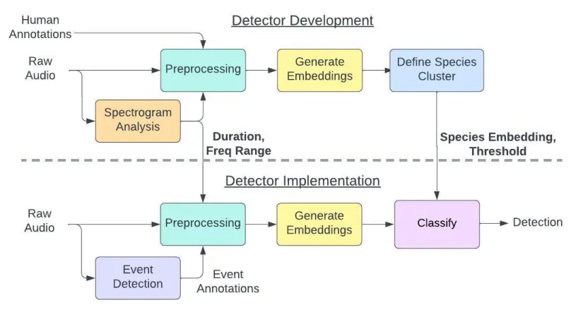
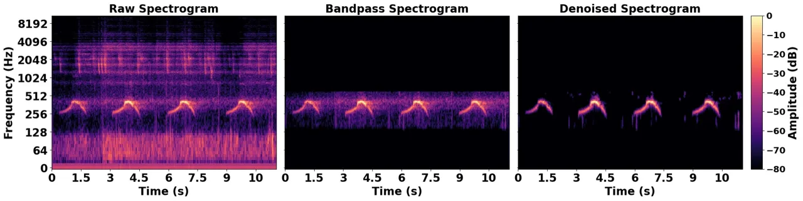
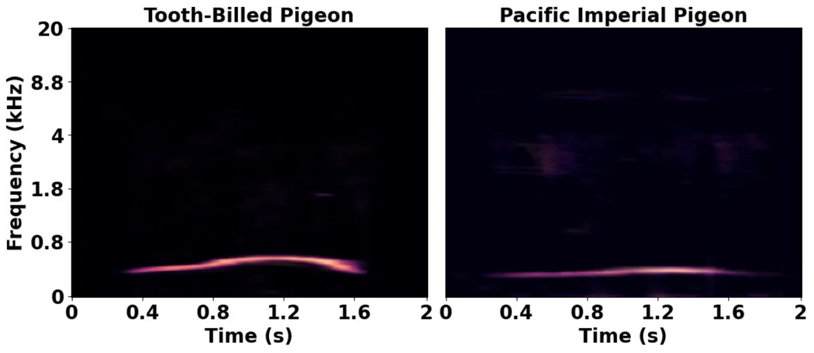
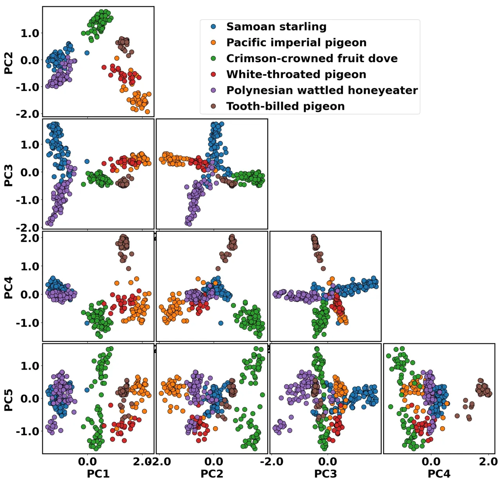
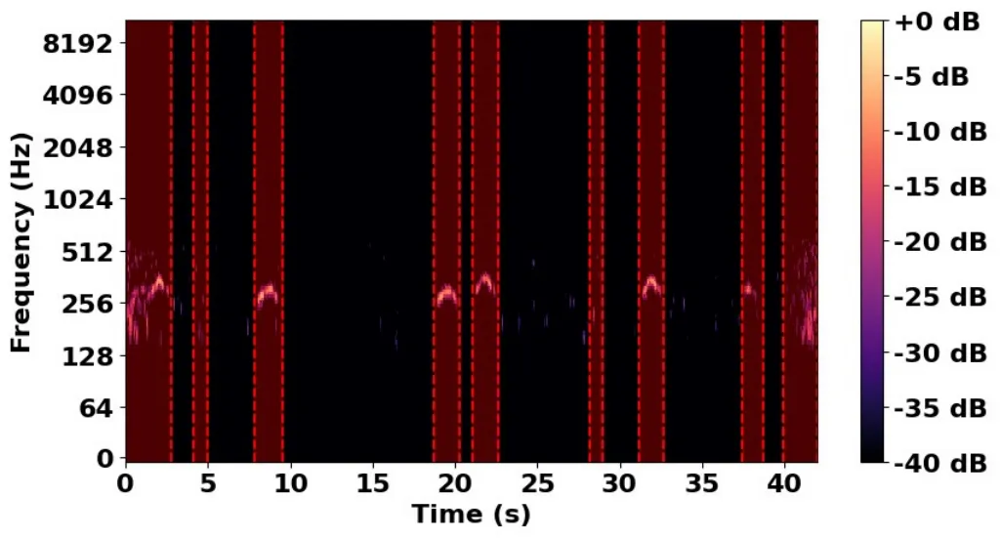

\correspondence

\extraAuth

Abhishek Jana  
abhishek@colossal.com

# An Automated Pipeline for Few-Shot Bird Call Classification, a Case Study with the Tooth-Billed Pigeon

Abhishek Jana ^(1,∗), Moeumu Uili ^(2,5,∗), James Atherton ⁵, Mark
O’Brien ³, Joe Wood ⁴, and Leandra Brickson ^(1,5) Address: 

###### Abstract

## 1

This paper presents a largely automated one-shot bird call
classification pipeline, incorporating targeted manual quality control
steps, designed for rare species absent from large publicly available
classifiers like BirdNET and Perch. While these models excel at
detecting common birds with abundant training data, they lack options
for species with only 1–3 known recordings, a critical limitation for
conservationists monitoring the last remaining individuals of endangered
birds. To address this, we leverage the embedding space of large bird
classification networks and develop a classifier using cosine
similarity, combined with filtering and denoising preprocessing
techniques, to optimize detection with minimal training data. We
evaluate various embedding spaces using clustering metrics and validate
our approach in both a simulated scenario with Xeno-Canto recordings and
a real-world test on the critically endangered tooth-billed pigeon
(Didunculus strigirostris), which has no existing classifiers and only
three confirmed recordings. The final model achieved 1.0 recall and 0.95
accuracy in detecting tooth-billed pigeon calls, making it practical for
use in the field. This open-source system provides a practical tool for
conservationists seeking to detect and monitor rare species on the brink
of extinction.

\helveticabold

## 2 Keywords:

Deep Learning, Bird Conservation, Bird Call Detection, Few-shot
Learning, Tooth-billed Pigeon

^(†)^(†)firstpage: 1

## 3 Introduction

Effective avian conservation relies on the ability to identify, monitor,
and track species populations in their natural habitats. These efforts
provide essential data on species distribution, habitat use, and the
impact of human activity, informing conservation priorities (Sutherland
et al., 2004). For critically endangered species, the need to locate the
few remaining individuals is especially urgent. Conservationists may
seek to find these individuals for relocation to captive breeding
programs or to collect genetic material for sequencing or
cryopreservation, ensuring the species’ genetic lineage is not
permanently lost.

Locating these critically endangered avian species presents significant
challenges. Many birds in forest environments reside in the upper
canopy, limiting direct visual observation. Camera traps face similar
constraints, as their effectiveness is reduced by dense foliage and
their fixed field of view. In contrast, passive acoustic monitoring
provides a more viable solution, as sound can propagate through
vegetation and be recorded omnidirectionally (Marques et al., 2013).

Moreover, when only a few individuals remain, the search area must be
extensive, requiring widespread deployment of recording devices.
Detecting a single call may necessitate analyzing hundreds or thousands
of hours of audio, creating a data volume that is impractical for manual
review.

In response to these needs, recent advancements in artificial
intelligence (AI) have led to the development of bird call classifiers
using audio data. On the foundation of earlier methods and datasets
(Stowell et al., 2016; Vellinga and Planqué, 2015), the BirdCLEF
competition emerged to challenge the AI community to accurately classify
bird calls (Goëau et al., 2014). This challenge was built on the
Xeno-Canto dataset, which continues to grow with more diverse
soundscapes and more species each year (Vellinga and Planqué, 2015; Kahl
et al., 2019; Kahl et al., 2020; Vellinga, 2024).

The BirdCLEF challenge has spurred many impressive models in the
subsequent years. The most notable models with high accuracy are Perch
(Research, 2023), which achieved the highest Top-1 accuracy across a
benchmarking test (Ghani et al., 2023). Another notable model is BirdNET
2.4 (Kahl et al., 2021), which was second highest in the same benchmark
test (Ghani et al., 2023). These models are trained on large, publicly
available datasets, such as Xeno-Canto, and other crowd-sourced bird
call sources. However, these datasets often suffer from significant
class imbalance, with recordings heavily skewed toward common species
(Goëau et al., 2018). This skewed distribution affects model
generalization, particularly for species with few or no training
examples.

Moreover, while BirdNET has been successfully applied to numerous
conservation efforts for species with sufficient training data
(Manzano-Rubio et al., 2022; Doell et al., 2024; Cole et al., 2022;
Tilson, 2022), it faces challenges in extremely data-scarce scenarios.
It struggles with overlapping calls in complex soundscapes, often
misclassifying species with acoustically similar vocalizations (Kahl et
al., 2021), and also has difficulty detecting soft calls (Priyadarshani
et al., 2018). As a result, BirdNET is not always reliable for
conservation-driven applications where only a handful of recordings
exist and high accuracy is critical (Stowell et al., 2019;
Pérez-Granados, 2023).

These limitations underscore the need for methods capable of detecting
species with minimal training data. Recent advancements have explored
zero-shot and few-shot classification to address this challenge, though
current methods still fall short of the accuracy required for robust
field deployment (Moummad et al., 2024; Poutaraud, 2023). Some studies
have approached zero-shot classification by integrating metadata, such
as textual descriptions of bird calls and other relevant features
(Gebhard et al., 2024; Miao et al., 2023). Notably, the CLAP model has
demonstrated promising quantitative performance (Miao et al., 2023).
However, it faces challenges in distinguishing fine-grained
species-level categories due to its reliance on textual descriptions of
the calls (Miao et al., 2024). Alternative approaches have focused on
analyzing the embedding space of bird call classifier models (Ghani et
al., 2023; Sanchez et al., 2024). Among these, one study reported
particularly strong results by retraining the final layer using
traditional few-shot supervised transfer learning, achieving
approximately 0.9 area under the curve (AUC) for classification on
several bird benchmarks with only four training examples per class
(Ghani et al., 2023). A complementary line of work frames rare-call
detection as an agile modeling problem, in which embedding-based vector
search retrieves acoustically similar segments from a single query
example and a human-in-the-loop active learning loop iteratively refines
the recognizer (Dumoulin et al., 2025). This interactive retrieval
approach has been applied to conservation settings, including a
Christmas Island occupancy-modeling case study that is biologically
analogous to our own. Our method differs in that it defines a fixed
cosine similarity threshold from the available recordings, without an
interactive retrieval or relabeling loop, trading the adaptivity of
active learning for a simpler, fully specified pipeline that can be
deployed once calibrated.

Inspired by this work, our study aims to refine one-shot or few-shot
classification accuracy for extremely rare bird species, particularly
when the available field data consist of only a single 5-minute
recording of an individual. The proposed pipeline is developed to
classify a specific bird of interest for targeted surveys. To achieve
this, the data is carefully preprocessed to extract the specific
features relevant to the particular bird of interest. Then, a deep
learning model is selected using rigorous clustering-quality metrics to
select a state-of-the-art bird call classification model to use for
embeddings. Finally, a cluster thresholding method that minimizes false
negatives is developed to provide the final classification from the
embeddings. The largely automated pipeline for this technique, with
targeted manual quality control steps, is made publicly available in a
repository to support conservation efforts in tracking and detecting
rare species.

This method is first validated using a simulated dataset of bird species
from the American Northeast, providing a sufficiently large test set to
strengthen the reliability of the results. We then apply the approach to
a real-world scenario: detecting the tooth-billed pigeon (Didunculus
strigirostris), a critically endangered species native to Samoa whose
continued existence in the wild is uncertain. Only three confirmed field
recordings of this species are currently available, alongside numerous
recordings of other bird species sharing its habitat. Evaluating our
system in this challenging context allows us to rigorously demonstrate
its utility for conservation efforts targeting extremely rare birds.

The contributions of this work are as follows:

- •
  Targeted Detection Pipeline: A specialized pipeline focused on
  maximizing the detection of a single bird species, with the intent to
  improve recall significantly over networks trained to detect multiple
  bird species.
- •
  Refinement of Bird-Call Embeddings: While prior work by Ghani et al.
  (Ghani et al., 2023) has explored bird-call embeddings, our study
  revisits bird call classification models, assessing them with three
  clustering metrics to identify the approach that minimizes intra-class
  variability, a factor known to improve the performance of few-shot
  transfer learning (Chen et al., 2019).
- •
  Real-World Application: Our results demonstrate the detection
  pipeline’s effectiveness, tested on real-world field recordings from
  the Samoan Conservation Society.
- •
  Public Repository: We provide a largely automated, end-to-end pipeline
  with targeted manual quality control steps, fully accessible through a
  public repository, allowing conservationists and researchers to easily
  train and deploy new classifiers for their bird species of interest.
  [https://github.com/abhishek-jana/few-shot-bird-call](https://github.com/abhishek-jana/few-shot-bird-call)
  The repository is archived on Zenodo
  ([https://doi.org/10.5281/zenodo.20726966](https://doi.org/10.5281/zenodo.20726966))
  under the MIT license.

## 4 Methods

Figure 1: Overview of the classification pipeline. The upper section
illustrates the development process, where key parameters such as
duration, frequency range, and threshold are defined, along with the
species embedding for the target species. The lower section demonstrates
how the finalized model is applied on field data to detect calls from
the species of interest.

Our methodology first preprocesses raw audio recordings, followed by
feature extraction using a deep learning model to generate embeddings.
These embeddings are then compared to a species-specific reference
embedding to classify calls based on similarity. Using this approach,
the model is fine-tuned to detect the target species amidst acoustically
similar bird calls. To utilize this model, an event detector first
isolates bird calls from the entire recording, after which
classification is performed using the developed pipeline. Figure 1
provides an overview of the entire pipeline development and
implementation. The following sections describe each component of this
workflow in detail.

### 4.1 Eastern Towhee Dataset

To evaluate the system, we designed a test scenario that replicates a
similar conservation challenge while enabling validation with a larger
test set. This scenario was simulated using five common bird species
that frequently co-occur in the Appalachian region of the United States:
Kentucky Warbler, White-Throated Sparrow, Carolina Wren, Northern
Cardinal, and Eastern Towhee. The Eastern Towhee was designated as the
rare bird of interest for this study.

For each species, three recordings from Xeno-Canto were used to create
the training dataset, while six recordings per species were reserved for
testing. Because of the larger test dataset, this dataset provides a
broader validation of the classifier. However, unlike the Tooth-Billed
Pigeon dataset, it does not evaluate the model’s performance on species
absent from Perch or BirdNET’s training data, nor do the recordings
share uniform environmental conditions or recording setups.

Through event detection, one recording produces multiple calls for
evaluation. However, calls from the same recording likely originate from
a single individual and are therefore acoustically similar. To prevent
bias, train/test splits were made at the recording level rather than at
the individual call level. The number of recordings and detected calls
for the Eastern Towhee dataset is detailed in Table 1.

| Class                  | Train |            | Test  |            |
| ---------------------- | ----- | ---------- | ----- | ---------- |
|                        | Calls | Recordings | Calls | Recordings |
| Kentucky Warbler       | 10    | 3          | 45    | 6          |
| White-Throated Sparrow | 17    | 3          | 43    | 6          |
| Carolina Wren          | 17    | 3          | 64    | 6          |
| Northern Cardinal      | 10    | 3          | 43    | 6          |
| Eastern Towhee         | 18    | 3          | 47    | 6          |

Table 1: Details of the Eastern Towhee dataset

### 4.2 Tooth-Billed Pigeon Dataset

To collect the Tooth-Billed pigeon dataset, two types of acoustic
recording units (ARUs) were used: Audiomoth and AR4 recorders, both
equipped with built-in omnidirectional microphones. In total, fifteen
Audiomoth and five AR4 recorders were deployed across randomly selected
sites in Samoa in either intact native forest or disturbed open forest.
To ensure spatial diversity, ARUs were placed at least 5 km apart and
left in the field for three to four months per monitoring period,
accumulating three years of recordings from 2021 to 2023. The units
collected data year-round, capturing both the wet season
(November–April) and the dry season (May–October). Regular maintenance
allowed for battery replacements and memory card changes.

From the over 20,000 hours of recordings collected, a subset of 160
hours was selected for manual analysis based on data quality. Expert
annotators manually reviewed these recordings, identifying and
extracting clips containing tooth-billed pigeon calls based on auditory
recognition. Across the entire dataset, a small number of recordings
containing confirmed tooth-billed pigeon calls were identified. The
4-minute, 49-second recording was reserved for training and contained 36
tooth-billed pigeon calls from a single individual. The test set
consists of a separate group of five field recordings provided by our
collaborators, described below. All training and test recordings are
temporally and spatially distinct, with no temporal or recording-level
overlap between training and test data.

These 160 hours of recordings also contained vocalizations from other
bird species, most commonly the crimson-crowned fruit dove,
white-throated pigeon, Polynesian wattled honeyeater, Samoan starling,
and Pacific imperial pigeon. Since these species were frequently
detected by our ARUs, they were selected as comparison classes for the
classifier. The Pacific imperial pigeon was of particular interest due
to its highly similar call structure to the tooth-billed pigeon, as
illustrated in Figure 3. To provide strong counter-examples for the
classifier, we selected an additional 20 minutes of recordings
containing Pacific imperial pigeon calls from the full dataset. Manual
annotations from local experts accompany the full 30 minutes of
recordings, marking species identification and the start and end times
of bird calls within each segment.

To define the classification threshold in the embedding space, a
training set was constructed using a 4-minute, 49-second field recording
of a tooth-billed pigeon, which contained 36 calls from a single
individual. Calls from other species present in the same recording were
included as comparison classes.

For the test set, five field recordings provided by our collaborators
were used for independent evaluation, with durations of approximately 3
minutes, 1 minute 45 seconds, 42 seconds, 10 seconds, and 11 seconds.
These recordings contain tooth-billed pigeon calls together with calls
from the co-occurring comparison species. From them, 32 candidate call
segments were curated and given to expert annotators for confirmation;
these 32 segments are a subset of the larger test set detailed in
Table 2. Two expert annotators independently marked individual calls in
these segments, and a segment was accepted as a given species only when
both annotators agreed.

Of the five recordings, two contained confirmed tooth-billed pigeon
calls, totaling seven calls from up to two individuals (these two
recordings are 10 and 11 seconds long, 21 seconds in total), while the
remaining three were dominated by acoustically similar co-occurring
species, principally the Pacific imperial pigeon. The Tooth-Billed
pigeon dataset is detailed in Table 2.

| Class                         | Train |            | Test  |            |
| ----------------------------- | ----- | ---------- | ----- | ---------- |
|                               | Calls | Recordings | Calls | Recordings |
| Tooth Billed Pigeon           | 36    | 1          | 7     | 2          |
| Pacific Imperial Pigeon       | 27    | 3          | 20    | 3          |
| White Throated Pigeon         | 16    | 3          | 11    | 3          |
| Crimson Crowned Fruit Dove    | 23    | 3          | 20    | 3          |
| Polynesian Wattled Honeyeater | 22    | 3          | 19    | 3          |
| Samoan Starling               | 5     | 4          | 6     | 3          |

Table 2: Details of the Tooth-Billed Pigeon dataset

### 4.3 Preprocessing

The audio recordings were resampled to 22.05 kHz, enabling analysis of
frequencies up to 11 kHz, which covers the typical range of bird calls
(Dooling et al., 2000).

Recordings were filtered based on the species of interest’s specific
frequency range, determined from existing literature or spectrogram
analysis, as detailed in later sections. This bandpass filtering was
applied consistently to all clips, both training and test, for both the
Eastern Towhee and Tooth-Billed Pigeon datasets. The frequency limits
differ between species, reflecting each species’ vocal range; the
per-species bandpass limits used in this study are listed in Table 3.
For the Tooth-Billed Pigeon, the spectrogram analysis tool identified a
vocal range of 155–674 Hz; a slightly wider filter of 100–700 Hz was
applied in practice to avoid clipping call boundaries.

Next, the noisereduce library (Sainburg, 2019; Sainburg et al., 2020)
was used to enhance the clarity of the bird calls by reducing background
noise. Accounting for background noise has been shown to improve
classification performance, particularly in data-sparse scenarios where
clean training samples are limited (Lauha et al., 2022). Figure 2
illustrates a sample Tooth-billed Pigeon spectrogram as it progresses
through these initial steps of the preprocessing pipeline.

Each labeled call was then segmented from the full field recording. An
automated tool for determining the optimal clip length is discussed in
the following subsection. For this study, a 2-second clip length was
selected. Calls shorter than this duration were centered and
zero-padded. These segmented calls were normalized to -20 dB amplitude.

For the deep learning models investigated in this work, spectrograms
serve as the primary input feature. Mel-spectrograms, which are
extensively utilized in human speech processing and event recognition
tasks (Kiyokawa et al., 2019; Delphin-Poulat and Plapous, 2019), were
employed for this study. The Mel band count was configured to 227,
aligning with the parameter settings used in comparable studies. To
ensure compatibility with the specified dimensions (227x227 pixels), the
hop length was dynamically adjusted. The Mel-spectrograms were converted
to a decibel scale, with values below -40 dB set to zero to filter out
low-energy noise and irrelevant sounds.

Finally, manual inspections were conducted on the resulting spectrograms
to identify and eliminate any segments containing overlapping or
simultaneous vocalizations from multiple species. This ensures that each
call accurately represents a distinct vocalization event, thereby
allowing for clear delineation of the embedding for each species. In
practice, the bandpass filtering and denoising steps applied earlier in
the pipeline substantially suppressed out-of-band noise and non-target
energy, such that no clips required exclusion due to overlapping
vocalizations in either the Eastern Towhee or Tooth-Billed Pigeon
datasets used in this study. However, this step remains a potential
bottleneck for large-scale deployment in more acoustically complex
environments, and the potential for automating it via source separation
techniques is discussed in the Discussion.

Figure 2: Comparison of raw (left), bandpass filtered (center), and
denoised (right) spectrograms of a TBP bird call, shown on a (0-80) dB
scale. The bandpassed spectrogram isolates the target frequency band,
while the denoised spectrogram highlights essential call features.

#### 4.3.1 Spectrogram Analysis Tool

A spectrogram analysis tool was created to determine the average call
duration and frequency range of bird calls, necessary hyperparameters
for the preprocessing steps. This tool can be skipped if these
parameters are already known.

First, average spectrograms are generated for the labeled calls, as
shown in Figure 3 for the tooth-billed pigeon (left) and the pacific
imperial pigeon (right). The minimum and maximum frequencies are
identified using basic image processing techniques and then expanded by
50% to ensure full capture of the call. For the tooth-billed pigeon
spectrogram, this resulted in a range of 155 to 674 Hz, which aligns
well with documented frequency ranges (Beichle, 1991; Baumann and
Beichle, 2020; Serra et al., 2020).

In a similar way, the average call duration is calculated from the
spectrograms, with a 50% buffer applied to each end. For the
tooth-billed pigeon, this results in 1.5 seconds, while the longest call
in our study, the Pacific imperial pigeon, spans 1.6 seconds. To ensure
that all species’ calls are fully included in the clip length, a
duration of 2 seconds was chosen for our model.

The bandpass frequency limits applied to each species in both datasets
are summarised in Table 3. These limits were derived using the
spectrogram analysis tool above, with a conservative buffer to avoid
clipping call boundaries.

|         |                               |          |           |
| ------- | ----------------------------- | -------- | --------- |
| Dataset | Species                       | Low (Hz) | High (Hz) |
| ET      | Eastern Towhee                | 2500     | 6500      |
| ET      | White-throated Sparrow        | 2500     | 5000      |
| ET      | Northern Cardinal             | 1100     | 5000      |
| ET      | Carolina Wren                 | 1400     | 5000      |
| ET      | Kentucky Warbler              | 2000     | 5500      |
| TBP     | Tooth-billed Pigeon           | 100      | 700       |
| TBP     | Pacific Imperial Pigeon       | 100      | 700       |
| TBP     | White-throated Pigeon         | 100      | 700       |
| TBP     | Crimson-crowned Fruit Dove    | 200      | 900       |
| TBP     | Polynesian Wattled Honeyeater | 900      | 4000      |
| TBP     | Samoan Starling               | 1300     | 4200      |

Table 3: Per-species bandpass filter limits applied during preprocessing
for both the Eastern Towhee (ET) and Tooth-Billed Pigeon (TBP) datasets.

Figure 3: Average spectrograms of vocalizations from the tooth-billed
pigeon (left) and pacific imperial pigeon (right), the species in our
dataset with a call most similar to the tooth-billed pigeon.

### 4.4 Generate Embeddings

Embeddings were generated for all bird calls across a variety of deep
learning models to evaluate how well different models distinguish
between species. For this section, the goal is to evaluate each model to
find one that best clusters the labeled species’ calls and reduces
intra-class variability. We evaluated 15 models, including 13
convolutional neural networks (CNNs) and 2 transformer-based models,
extending previous benchmarking efforts (Ghani et al., 2023) by
incorporating more recent architectures and evaluation metrics.

CNNs are adept at capturing spatial hierarchies (LeCun et al., 2015),
while transformers excel in modeling temporal dependencies (Vaswani,
2017), critical for audio analysis. For bird call classification, we
utilized models pre-trained on datasets such as ImageNet (Deng et al., 2009) and Xeno-Canto (Kahl et al., 2021), including those designed for
both spectrogram images and raw audio. The general foundation models
selected included ResNet(18,34,50) (He et al., 2016), ResNeXt (Xie et
al., 2017), EfficientNet(B0,B1,B2,B3) (Tan and Le, 2019), VGG (Simonyan,
2014), MobileNet (Howard, 2017), and DenseNet (Huang et al., 2017). For
transformer-based models, we selected the Vision Transformer (ViT)
(Dosovitskiy et al., 2020) and Computer Vision Transformer (CVIT) (Roka
and Diwakar, 2023).

Additionally, we included BirdNET (Kahl et al., 2021) and Perch
(Research, 2023), which are specifically designed for bird call
classification and are based on ResNet and EfficientNet-B1
architectures, respectively. These two models have been shown to produce
the best embeddings for bird call classification in previous
benchmarking tests (Ghani et al., 2023).

All audio clips were converted to 227$`\times`$227 pixel
mel-spectrograms using a dynamically adjusted hop length, as described
in Section 4.3. For the CNN-based models, this single-channel
spectrogram was replicated across three channels to match the input
expectations of the ImageNet-pretrained networks, while the
transformer-based models (ViT and CVIT) used the same 227$`\times`$227
spectrogram without modification. BirdNET and Perch apply their own
internal preprocessing, so for these two models the raw 22.05 kHz audio
clips were provided as input and embeddings were extracted from their
penultimate layers.

### 4.5 Clustering Analysis to Select Model

For both datasets, embeddings used for model selection were generated
from the training recordings only, using the same preprocessing pipeline
applied to training data: resampling, bandpass filtering, and denoising.
For the TBP dataset, this corresponds to the 4-minute, 49-second
training recording containing 36 tooth-billed pigeon calls and calls
from co-occurring species. For the ET dataset, the Xeno-Canto training
recordings for all five species were used.

To make explicit which operations are applied at each stage of the
workflow, Table 4 summarizes the preprocessing steps used during model
selection, threshold definition, testing, and field deployment. The
signal-level steps (resampling, bandpass filtering, denoising, and
amplitude normalization) are applied identically at every stage,
ensuring that embeddings are always generated from uniformly
preprocessed 2-second clips. The wavelet event detector differs by
stage: the controlled evaluation and the development stages operate on
expert-annotated, manually segmented calls, so event detection is used
only for training-data curation and during deployment, where call
timings are not known in advance.

| Preprocessing step               | Model selection | Threshold definition | Testing | Deployment |
| -------------------------------- | --------------- | -------------------- | ------- | ---------- |
| Resampling (22.05 kHz)           | Yes             | Yes                  | Yes     | Yes        |
| Bandpass filtering               | Yes             | Yes                  | Yes     | Yes        |
| Denoising (noisereduce)          | Yes             | Yes                  | Yes     | Yes        |
| Amplitude normalization (-20 dB) | Yes             | Yes                  | Yes     | Yes        |
| Wavelet event detection          | No^(∗)          | No^(∗)               | No^(∗)  | Yes        |

Table 4: Preprocessing steps applied at each stage of the pipeline.
^(∗)Model selection, threshold definition, and testing operate on
expert-annotated, manually segmented call clips; the event detector is
used for training-data curation and field deployment, where call
boundaries are not pre-annotated.

The embeddings generated by the various deep learning models were
reduced using principal component analysis (PCA) to increase the
information density of the embeddings. For each model, the number of
principal components was selected to capture 95% of the variance in the
embeddings. Following the dimensionality reduction, L2 normalization was
applied.

After generating the PCA embeddings for each call, we evaluated the
clustering quality of the neural network embeddings to select the most
suitable model for our detector. We used three metrics to assess
clustering effectiveness in the embedding space: the Silhouette score,
which measures cluster cohesion and separation (Dudek, 2020; Sanchez et
al., 2024); the Davies-Bouldin index, which evaluates cluster
compactness and separation (Petrovic, 2006; Merchan et al., 2019); and
the Dunn index, which considers the ratio of the minimum inter-cluster
distance to the maximum intra-cluster distance, rewarding well-separated
and compact clusters (Dunn, 1974).

To provide a comparative overview, the scores were normalized such that
higher values indicate better clustering quality across all metrics.
Specifically, the Silhouette and Dunn scores were normalized to a 0-1
scale, and the Davies-Bouldin scores were inverted for consistency. The
overall score for each model was then calculated as the average of these
normalized scores. This normalized score was used to select the final
model for our work.

### 4.6 Defining the Species Cluster

Once a model is selected, the next step is to define a classifier based
on the embeddings generated by the model. For this work, we use a cosine
similarity-based approach, a common method for comparing embeddings in
acoustic classification tasks (Liu et al., 2023; Abdullah and Er, 2022).
We do not fine-tune or retrain any neural networks in this study.
Instead, we leverage the precomputed embedding space from the model
selected in the previous section and define a classification threshold
based on cosine similarity.

To construct the classifier, we first calculate the median PCA embedding
for each species, representing the centroid of its embedding space
cluster. We then compute the cosine similarity between the embeddings of
labeled calls and these median embeddings. The resulting similarity
scores are transformed using a softmax function to provide a
probabilistic interpretation.

When dealing with extremely rare species, minimizing false negatives is
critical, as even a single missed call can impact conservation efforts.
Additionally, because the calls of rare species occur far less
frequently than those of other birds, standard metrics such as accuracy
become less meaningful. Therefore, we selected recall as the metric for
threshold selection (Sokolova and Lapalme, 2009), as it directly
quantifies the model’s ability to correctly identify calls from the
species of interest. The final classification threshold is set to the
lowest similarity score that achieves a specified recall for the target
species in the training set. While this parameter is adjustable, a
recall of 0.9 was chosen in this study to account for outliers and
potential mislabeling. Setting the threshold to achieve a fixed recall
necessarily accepts some false positives: a lower threshold captures
more true calls but also admits more non-target detections.
Practitioners should calibrate this tradeoff based on their deployment
context, raising the threshold if manual review burden is a concern or
lowering it if missing calls is the greater risk.

### 4.7 Evaluating the Classifier

To assess the performance of the classification model, we evaluated
precision, recall, F1 score, and accuracy (Sokolova and Lapalme, 2009)
using the set-aside test dataset of tooth-billed pigeon calls. Accuracy
was calculated by treating the classifier as binary, measuring the
proportion of correctly identified calls from the species of interest
relative to all classification decisions.

Additionally, we report the F1 score, a metric that balances precision
and recall. The F1 score is especially useful in scenarios with extreme
class imbalance, ensuring that both false positive and false negative
errors are considered in the evaluation.

### 4.8 Event Detection

Following model development, rapid labeling of bird call events is
essential for accurate segmentation during preprocessing. In field
deployment, new data will not have pre-annotated labels or precise call
timings, and therefore, an event detector will be necessary. The authors
could not find an easy-to-use, publicly available tool suited for bird
call event detection, leading us to create and open-source our own. A
wavelet-based event detector was developed to use on the band-passed,
denoised field data. This detector was inspired by existing wavelet
transformation methods for event detection (Juodakis and Marsland, 2022;
Du et al., 2006). Crucially, applying bandpass filtering and denoising
prior to event detection substantially reduces the number of candidate
segments passed to the classifier: out-of-band sounds and broadband
noise are suppressed before detection, so the detector responds
primarily to calls within the target species’ frequency range. This
pre-filtering step therefore acts as a first-pass filter that eliminates
a large proportion of non-target vocalizations before any
embedding-based classification is performed.

This event detector starts by identifying the minimum and maximum
significant frequencies (typically 20 Hz to 8,000 Hz) using the
short-time Fourier transform (STFT). These values guide the wavelet
transform scales. Features are computed by summing the absolute values
of wavelet coefficients across 20 logarithmically spaced scales, using
the Morlet wavelet. A moving average filter with a 0.15-second window
smooths the features to enhance continuous event detection.

Detected events are defined as those where smoothed features exceed 10%
of the mean value. Events shorter than 0.5 seconds, the typical call
length in our dataset, are filtered out, though this duration can be
adjusted for species with shorter calls.

It is important to note that the classification metrics reported in
Section 5 are computed on manually segmented, expert-annotated call
clips and therefore do not capture any false negatives introduced at the
event detection stage. In field deployment, system-level recall is
bounded by the recall of the event detector. The event detector is
applied during training data curation and during field deployment (the
lower section of Figure 1), but not during the controlled classification
evaluation reported in Section 5. We evaluated the event detector
against the expert annotations on these recordings (Section 6, Table 7):
with bandpass filtering and denoising it recovered all expert-annotated
calls, including all seven tooth-billed pigeon calls. Because the
annotated call set was itself curated with assistance from the detector,
a fully independent measurement of detector recall on exhaustively
hand-labeled audio, and thereby the true end-to-end system recall,
remains a valuable direction for future work.

## 5 Results

### 5.1 Spectrogram Analysis and Preprocessing

Figure 3 displays the average spectrograms for the tooth-billed pigeon
and the Pacific imperial pigeon. The automated analysis identified a
frequency range of 155 to 674 Hz, closely aligning with documented
values (150–650 Hz) (Beichle, 1991; Baumann and Beichle, 2020; Serra et
al., 2020).

When used on these datasets, this tool effectively determined the
frequency ranges for less-documented species and is valuable when the
frequency range is unknown. However, while many species yielded clear,
coherent average spectrograms, not all provided as distinct a signal as
those shown in Figure 3. This discrepancy likely arises from variability
in call uniformity or diversity in call types. A similar effect was
observed in call duration estimation, though this parameter is less
sensitive. To ensure consistency, a call length of 2 seconds was
selected.

### 5.2 Model Selection for Embeddings

To determine the most suitable deep learning model for generating call
embeddings, we assessed clustering performance using the metrics
summarized in Table 5. Perch emerged as the top performer with an
overall score of 0.99, followed by BirdNET at 0.72, which also exhibited
strong intra-cluster compactness and inter-cluster separation. Based on
these results, Perch was selected for further analysis and
classification pipeline development. However, if computational
efficiency is a priority, BirdNET remains a viable alternative.

| Model           | Overall Score | Silhouette Score | DB Index | Dunn Index | N Components |
| --------------- | ------------- | ---------------- | -------- | ---------- | ------------ |
| Perch           | 0.99          | 0.21             | 1.87     | 0.41       | 142          |
| BirdNET         | 0.72          | 0.19             | 2.04     | 0.32       | 130          |
| ResNet18        | 0.59          | 0.18             | 1.81     | 0.23       | 62           |
| EfficientNet-B0 | 0.58          | 0.18             | 2.02     | 0.27       | 82           |
| ResNet50        | 0.54          | 0.16             | 2.05     | 0.27       | 92           |
| EfficientNet-B2 | 0.53          | 0.17             | 2.11     | 0.26       | 95           |
| DenseNet        | 0.53          | 0.14             | 2.16     | 0.31       | 76           |
| EfficientNet-B1 | 0.52          | 0.17             | 1.90     | 0.23       | 76           |
| VGG             | 0.51          | 0.17             | 1.95     | 0.23       | 87           |
| ResNet34        | 0.44          | 0.15             | 2.08     | 0.24       | 69           |
| MobileNet       | 0.43          | 0.15             | 2.19     | 0.26       | 98           |
| EfficientNet-B3 | 0.42          | 0.15             | 2.20     | 0.25       | 102          |
| ResNeXt         | 0.37          | 0.13             | 2.17     | 0.26       | 116          |
| ViT             | 0.33          | 0.11             | 3.43     | 0.40       | 236          |
| CVIT            | 0.19          | 0.11             | 3.12     | 0.30       | 141          |

Table 5: All clustering performance metrics of the various models
tested. N Components is the number of principal components used for the
reduced embedding.

Figure 4: Scatter plot matrix of the top 5 principal components of the
Perch model embeddings.

Figure 4 illustrates the top five PCA components for Perch, providing a
visual representation of the clustering patterns. The distinct clusters
observed align with the quantitative performance metrics found for the
Perch model.

### 5.3 Cosine similarity

The evaluation metrics in Table 6 summarize the model’s performance on
both test datasets. For the Eastern Towhee dataset, the model performed
well across all metrics. On the Tooth-Billed Pigeon test set, it
achieved a recall of 1.00 and an accuracy of 0.951, correctly
identifying all tooth-billed pigeon vocalizations. While the F1 score
was 0.778, indicating a higher rate of false positives, this trade-off
is acceptable given that maximizing recall is the primary objective.
Given a recall of 1.0 and an F1 score of 0.778, the implied precision on
the Tooth-Billed Pigeon test set is approximately 0.64. Of the 83 total
test clips, the model produced approximately four false positive
predictions, that is, non-target clips classified as tooth-billed
pigeon. While this increases the manual review effort, a conservationist
reviewing flagged clips from a multi-hour deployment would still face a
tractable workload.

| Test Metric | Tooth-Billed Pigeon | Eastern Towhee |
| ----------- | ------------------- | -------------- |
| Accuracy    | 0.951               | 0.988          |
| Recall      | 1.000               | 0.979          |
| F1          | 0.778               | 0.968          |

Table 6: Results for classification of the species of interest on the
test datasets. Results for the chosen metrics are shown for using a
recall of 0.9 to determine the classification threshold in training.

### 5.4 Event Detection

The test data is preprocessed as described in Section 4.3. Following
this, the data is analyzed with our event detection algorithm. Figure 5
illustrates the results of this detection, with vocalization events
highlighted in red. This demonstrates how the event detector is used to
isolate calls from a recording.

Figure 5: Spectrogram of the test dataset after preprocessing and
applying the event detector. The red-highlighted regions indicate the
call’s detected vocalization events.

## 6 Discussion

This study presents a largely automated pipeline, incorporating targeted
manual quality control steps, for classifying rare bird species that
have not been previously represented in classification models. The
manual quality-control steps, namely spectrogram inspection, overlap
removal, and threshold calibration, are confined to the one-time
development phase; once calibrated, the detection pipeline runs
automatically on new field recordings, with manual effort limited to
reviewing flagged candidate detections. The results demonstrate a
practical, easy-to-use approach that either outperforms previous
one-shot classifiers (Moummad et al., 2024; Poutaraud, 2023) or achieves
comparable performance (Ghani et al., 2023). Notably, the pipeline is
capable of training an effective classifier from just five minutes of
recordings, achieving a recall of 0.98 and an accuracy of 0.90 in a
simulated test scenario. When applied to the real-world case of the
critically endangered tooth-billed pigeon, the model was trained on only
a single recording and achieved a recall of 1.0 and an accuracy of 0.951
on identifying two unseen individuals, highlighting its potential for
conservation applications.

A key strength of this pipeline is its systematic integration of
preprocessing, embedding selection, and classification thresholding,
allowing for effective classification even with limited training data.
Large-scale bird classifiers, while trained on extensive datasets, often
struggle with species that lack sufficient representation. Our approach
addresses this challenge by leveraging embeddings from models trained on
large datasets while simultaneously optimizing classification for a
single target species within a specific acoustic environment. Equally
important is the role of preprocessing, including filtering and
denoising. To quantify this contribution, we ran an ablation on five
tooth-billed pigeon test recordings (Recordings A to E; Table 7)
comprising 32 expert-annotated calls, of which seven were confirmed
tooth-billed pigeon calls (three in Recording A and four in the held-out
Recording E). The remaining calls were deliberately retained as hard
negatives dominated by acoustically similar species (Pacific imperial
pigeon, white-throated pigeon, and crimson-crowned fruit dove). For
already-segmented calls, bandpass filtering and denoising had little
effect on the embedding classifier itself: recall and accuracy were
essentially unchanged with or without these steps, reflecting the
robustness of the Perch front end. Preprocessing was instead decisive at
the event-detection stage. With preprocessing, the wavelet detector
produced localized, call-length events (111 in total, median duration on
the order of one to two seconds) that cleanly isolated every annotated
call. Without preprocessing, the detector collapsed to a single
undifferentiated event spanning close to the entire recording in most
files (seven events in total, each covering essentially 100% of its
recording), and could no longer localize individual calls. When these
large unfiltered events were subsequently windowed into two-second
segments and classified, both conditions recovered all seven true
tooth-billed pigeon calls with comparable precision on the hard
negatives, confirming that the classifier is robust once calls are
segmented. Preprocessing is therefore essential to end-to-end
performance because it enables reliable event detection and segmentation
in field recordings, even though the downstream classifier is itself
insensitive to it.

|           |                 |                    |                 |                       |              |
| --------- | --------------- | ------------------ | --------------- | --------------------- | ------------ |
| Recording | Annotated calls | With preprocessing |                 | Without preprocessing |              |
|           |                 | Events             | Median dur. (s) | Events                | Coverage (%) |
| A         | 3               | 4                  | 1.4             | 1                     | 97           |
| B         | 10              | 72                 | 0.8             | 1                     | 100          |
| C         | 9               | 20                 | 1.3             | 3                     | 98           |
| D         | 6               | 11                 | 2.0             | 1                     | 100          |
| E         | 4               | 4                  | 1.4             | 1                     | 99           |
| Total     | 32              | 111                | –               | 7                     | –            |

Table 7: Event-detector preprocessing ablation on the five tooth-billed
pigeon test recordings (A: Salelologa; B: Magiagi; C: Macaulay; D: West
Uafato; E: Manumea, held out). With preprocessing (bandpass filtering
and denoising) the wavelet detector produces localized, call-length
events that isolate every annotated call. Without preprocessing it
collapses to one to three events per recording, each covering close to
100% of the recording, so individual calls can no longer be localized.
“Coverage” is the fraction of the recording spanned by detected events.

To compare localization strategies and their computational cost, we
evaluated four pipelines on the five test recordings (Table 8): the
wavelet event detector and a brute-force sliding-window classifier
(2-second windows, 0.5-second hop), each with and without preprocessing.
Localization quality was quantified as the mean temporal
intersection-over-union (IoU) between detected and annotated call
intervals. The event detector with preprocessing localized calls most
accurately (mean IoU 0.76, boundary error approximately 0.5 seconds)
while issuing only 111 classifier queries across roughly six minutes of
audio. Without preprocessing the detector collapses to whole-recording
events (IoU 0.04): computationally cheap (7 queries) but unable to
localize calls. The sliding-window classifier required 699 queries, a
roughly six-fold increase, and three to nine times the runtime, yet
localized far less precisely (IoU 0.15 with preprocessing, 0.06
without); on raw audio it additionally missed 22 of the 32 calls and
produced 9 false-positive intervals. The event detector combined with
preprocessing therefore provides both the most accurate localization and
a substantial efficiency gain, reducing the number of embedding
computations by roughly six-fold relative to brute-force windowing.

| Pipeline                  | Calls recovered | Localization IoU | Classifier queries | Runtime (s) |
| ------------------------- | --------------- | ---------------- | ------------------ | ----------- |
| Event detector + denoised | 32/32           | 0.76             | 111                | 84          |
| Event detector + raw      | 32/32^(∗)       | 0.04             | 7                  | 30          |
| Sliding window + denoised | 32/32           | 0.15             | 699                | 286         |
| Sliding window + raw      | 10/32           | 0.06             | 699                | 270         |

Table 8: Localization accuracy and computational cost of four candidate
pipelines on the five test recordings (32 annotated calls; $`\sim`$6
minutes of audio; CPU runtime, one-time model load excluded).
Localization IoU is the mean temporal intersection-over-union between
detected and annotated call intervals. ^(∗)The raw event detector
recovers calls only as a degenerate artifact: it emits single
whole-recording events that trivially overlap every call without
localizing any of them.

Another finding of this study is that prioritizing recall through a
classification threshold, rather than selecting the most confident
prediction, significantly improved detection performance. This approach
helped mitigate the impact of uncertain or overlapping calls, enhancing
the recall of the species of interest even at the cost of increased
false positives.

Despite the strong performance of this pipeline, some limitations
remain. While the classification threshold is clearly defined, its
effectiveness may vary across different species or recording conditions,
requiring user adjustment for each new species. In particular, dove and
pigeon vocalizations tend to be highly stereotyped, which likely
facilitated learning from a single individual in our case study. Species
with greater within-individual or between-individual call variability
may require additional training examples or wider threshold margins, and
the pipeline’s generalizability to such species remains to be evaluated.
Relatedly, the classification threshold was defined on a single training
recording and validated within the same deployment region. Its
transferability to recordings from different field sites, recorder
hardware configurations, or acoustic environments is not guaranteed, and
we recommend recalibrating the threshold when deploying in substantially
different conditions. Additionally, although thresholding helps mitigate
noise from overlapping calls, source separation techniques could further
improve classification by isolating simultaneous vocalizations.
Promising methods such as MixIT (Wisdom et al., 2020) and other bird
call-specific separation algorithms (Dai et al., 2021; Xie et al., 2024)
could be explored in future iterations.

Future work could explore alternative distance metrics, such as
Euclidean, Manhattan, or Minkowski, as well as other classification
methods like k-nearest neighbors (KNN), decision trees, random forests,
neural networks, and autoencoders to further refine performance.

## 7 Conclusion

This study presents a novel, largely automated pipeline that enhances
few-shot bird call classification, significantly improving the
accessibility of rare bird call detection with minimal training data,
requiring as little as a single recording. By systematically
incorporating preprocessing, embedding selection, and optimized
classification thresholds, the pipeline successfully classifies the
Tooth-Billed Pigeon, achieving a recall of 1.0 and an accuracy of 0.951,
making it suitable for use in the field. Coupling preprocessing with
event detection also makes the pipeline efficient: it localizes calls
accurately while reducing the number of embedding computations roughly
six-fold relative to brute-force windowing, an important consideration
when scanning thousands of hours of field audio. Future work would
likely benefit from the integration of source separation techniques and
more refined embedding space classification approaches to further refine
accuracy and improve precision. More broadly, this pipeline provides a
practical and adaptable tool for conservationists monitoring critically
endangered species, with potential applications extending to similar
conservation challenges.

## Funding

The funding for developing the classification pipeline is from Colossal
Biosciences, while the funding for expeditions and data collection is
from Toledo Zoo, Birdlife International, and Colossal Biosciences, where
the Birdlife International funds are from Waddesdon Foundation via the
Zoological Society of London.

## Data Accessibility Statement

The raw and processed data supporting the findings of this study are
available on Figshare:
[https://doi.org/10.6084/m9.figshare.29211299.v1](https://doi.org/10.6084/m9.figshare.29211299.v1).
The code repository
([https://github.com/abhishek-jana/few-shot-bird-call](https://github.com/abhishek-jana/few-shot-bird-call))
is archived on Zenodo
([https://doi.org/10.5281/zenodo.20726966](https://doi.org/10.5281/zenodo.20726966))
under the MIT license. The datasets labeled us_train_data and
us_test_data were compiled from the publicly available Xeno-Canto
repository. The datasets labeled train_data and test_data are a mix of
Xeno-Canto samples and field recordings collected during our
expeditions. Details regarding the composition and collection of these
datasets are described in Sections 4.1 and 4.2. Due to conservation
concerns and the critically endangered status of the Tooth-Billed
Pigeon, we have not made those specific recordings publicly available.

## Competing Interests Statement

The authors declare that they have no competing interests.

## Acknowledgments

We are grateful to the local communities in Samoa who partnered with us
to launch the Manumea Friendly Village Program, supporting our efforts
to gather essential bird call data. This program aims to deepen our
understanding of Manumea vocalizations and improve field detection
techniques. Special thanks go to the communities of Magiagi, Faleaseela,
Matafaa, Uafato, Malololelei, Tafua-tai, Salelologa, Safotu-Mt Matavanu
Crater, Aopo, Falealupo, and Masamasa Falelima National Park, among
others, for their invaluable contributions. Additional data were
obtained from Xeno-Canto (www.xeno-canto.org), a community-driven
repository of bird sound recordings, for which we are also grateful.

We sincerely thank Laulu Fialelei for their expertise and invaluable
assistance in the annotation process. Their careful assessment of the
field recordings and contributions to call identification were essential
in refining the test set and ensuring the accuracy of our classification
approach.

We also thank the CEO and staff of the Samoa Ministry of Natural
Resources and Environment, as well as the President and technical teams
at the Samoa Conservation Society, Professor Liba Pejchar and Sara
Bombaci, and Michael Pardo of the Department of Fish, Wildlife, and
Conservation Biology at Colorado State University for their guidance. We
further acknowledge the Birdlife International Pacific Partnership in
Suva, Fiji, the IUCN Pigeons and Doves Specialist Group, Toledo Zoo.

Additional appreciation goes to our partners who have supported our
field data collection over the years, including Auckland Zoo, the New
Zealand Department of Conservation, the New Zealand Foreign Affairs and
Trade, Pelgar International, the Global Diversity Foundation–Community
and Conservation Foundation, and the UK Government’s Darwin Initiative.

We would also like to acknowledge the invaluable knowledge contributed
by Dr Ulf Beichle, Dr Gianluca Serra, and Dr Rebecca Stirnemann through
their extensive research collaborations on the Manumea.

## Author Contributions

Abhishek Jana led the development of the classification pipeline,
performed data preprocessing, model evaluation, and co-wrote the
majority of the manuscript.  
Moeumu Uili coordinated field data collection, led the expert annotation
process, and contributed significantly to the species-specific
ecological context and manuscript refinement.  
James Atherton and Mark O’Brien contributed to conservation strategy
design, data interpretation, and manuscript review.  
Joe Wood was heavily involved in orchestrating the Manumea search,
authored key project proposals, and contributed to conservation strategy
design and project coordination.  
Leandra Brickson co-wrote the majority of the manuscript, contributed to
project conception, secured funding, supervised the research, and
provided critical feedback throughout.  
All authors reviewed and approved the final manuscript.

## References

- Abdullah and Er (2022) K. H. Abdullah and M. B. Er Lung sound signal
  classification by using cosine similarity-based multilevel discrete
  wavelet transform decomposition with cnn-lstm hybrid model. In 2022
  4th International Conference on Artificial Intelligence and Speech
  Technology (AIST), pp. 1–4. Cited by: §4.6.
- Baumann and Beichle (2020) S. Baumann and U. Beichle Acoustical
  identification of didunculus strigirostris, critically endangered
  tooth-billed pigeon of samoa. Journal of Ornithology 161 (2),
  pp. 439–446. Cited by: §4.3.1, §5.1.
- Beichle (1991) U. Beichle Status and acoustical demarcation of pigeons
  of western samoa. Notornis 38 (1), pp. 81–86. Cited by: §4.3.1, §5.1.
- Chen et al. (2019) W. Chen, Y. Liu, Z. Kira, Y. F. Wang, and J. Huang
  A closer look at few-shot classification. arXiv preprint
  arXiv:1904.04232. Cited by: 2nd item.
- Cole et al. (2022) J. S. Cole, N. L. Michel, S. A. Emerson, and R. B.
  Siegel Automated bird sound classifications of long-duration
  recordings produce occupancy model outputs similar to manually
  annotated data. Ornithological Applications 124 (2), pp. duac003.
  Cited by: §3.
- Dai et al. (2021) Y. Dai, J. Yang, Y. Dong, H. Zou, M. Hu, and B. Wang
  Blind source separation-based iva-xception model for bird sound
  recognition in complex acoustic environments. Electronics Letters 57
  (11), pp. 454–456. Cited by: §6.
- Delphin-Poulat and Plapous (2019) L. Delphin-Poulat and C. Plapous
  Mean teacher with data augmentation for dcase 2019 task 4. Orange Labs
  Lannion, France, Tech. Rep. Cited by: §4.3.
- Deng et al. (2009) J. Deng, W. Dong, R. Socher, L. Li, K. Li, and L.
  Fei-Fei Imagenet: a large-scale hierarchical image database. In 2009
  IEEE conference on computer vision and pattern recognition,
  pp. 248–255. Cited by: §4.4.
- Doell et al. (2024) M. Doell, D. Kuehn, V. Suessle, M. J.
  Burnett, C. T. Downs, A. Weinmann, and E. Hergenroether Automated
  bioacoustic monitoring for south african bird species on unlabeled
  data. arXiv preprint arXiv:2406.13579. Cited by: §3.
- Dooling et al. (2000) R. J. Dooling, B. Lohr, and M. L. Dent Hearing
  in birds and reptiles. Springer. Cited by: §4.3.
- Dosovitskiy et al. (2020) A. Dosovitskiy, L. Beyer, A. Kolesnikov, D.
  Weissenborn, X. Zhai, T. Unterthiner, M. Dehghani, M. Minderer, G.
  Heigold, S. Gelly, et al. An image is worth 16x16 words: transformers
  for image recognition at scale. arXiv preprint arXiv:2010.11929. Cited
  by: §4.4.
- Du et al. (2006) P. Du, W. A. Kibbe, and S. M. Lin Improved peak
  detection in mass spectrum by incorporating continuous wavelet
  transform-based pattern matching. bioinformatics 22 (17),
  pp. 2059–2065. Cited by: §4.8.
- Dudek (2020) A. Dudek Silhouette index as clustering evaluation tool.
  In Classification and Data Analysis: Theory and Applications 28,
  pp. 19–33. Cited by: §4.5.
- Dumoulin et al. (2025) V. Dumoulin, O. Stretcu, J. Hamer, L.
  Harrell, R. Laber, H. Larochelle, B. van Merriënboer, A. Navine, P.
  Hart, B. Williams, T. A. C. Lamont, T. B. Razak, S. Brodie, B.
  Doohan, P. Eichinski, P. Roe, L. Schwarzkopf, and T. Denton The search
  for squawk: agile modeling in bioacoustics. Note: arXiv preprint
  arXiv:2505.03071 External Links: 2505.03071 Cited by: §3.
- Dunn (1974) J. C. Dunn Well-separated clusters and optimal fuzzy
  partitions. Journal of cybernetics 4 (1), pp. 95–104. Cited by: §4.5.
- Gebhard et al. (2024) A. Gebhard, A. Triantafyllopoulos, T. Bez, L.
  Christ, A. Kathan, and B. W. Schuller Exploring meta information for
  audio-based zero-shot bird classification. In ICASSP 2024-2024 IEEE
  International Conference on Acoustics, Speech and Signal Processing
  (ICASSP), pp. 1211–1215. Cited by: §3.
- Ghani et al. (2023) B. Ghani, T. Denton, S. Kahl, and H. Klinck Global
  birdsong embeddings enable superior transfer learning for bioacoustic
  classification. Scientific Reports 13 (1), pp. 22876. Cited by: 2nd
  item, §3, §3, §4.4, §4.4, §6.
- Goëau et al. (2014) H. Goëau, H. Glotin, W. Vellinga, R. Planqué, A.
  Rauber, and A. Joly Lifeclef bird identification task 2014. In CLEF:
  Conference and Labs of the Evaluation forum, pp. 585–597. Cited by:
  §3.
- Goëau et al. (2018) H. Goëau, S. Kahl, H. Glotin, R. Planqué, W.
  Vellinga, and A. Joly Overview of birdclef 2018: monospecies vs.
  soundscape bird identification. In CLEF 2018-conference and labs of
  the evaluation forum, Vol. 2125. Cited by: §3.
- He et al. (2016) K. He, X. Zhang, S. Ren, and J. Sun Deep residual
  learning for image recognition. In Proceedings of the IEEE conference
  on computer vision and pattern recognition, pp. 770–778. Cited by:
  §4.4.
- Howard (2017) A. Howard Mobilenets: efficient convolu-tional neural
  networks for mobile vision applications. arXiv preprint
  arXiv:1704.04861. Cited by: §4.4.
- Huang et al. (2017) G. Huang, Z. Liu, L. Van Der Maaten, and K. Q.
  Weinberger Densely connected convolutional networks. In Proceedings of
  the IEEE conference on computer vision and pattern recognition,
  pp. 4700–4708. Cited by: §4.4.
- Juodakis and Marsland (2022) J. Juodakis and S. Marsland Wind-robust
  sound event detection and denoising for bioacoustics. Methods in
  Ecology and Evolution 13 (9), pp. 2005–2017. Cited by: §4.8.
- Kahl et al. (2020) S. Kahl, M. Clapp, W. A. Hopping, H. Goëau, H.
  Glotin, R. Planqué, W. Vellinga, and A. Joly Overview of birdclef
  2020: bird sound recognition in complex acoustic environments. In CLEF
  2020-Conference and Labs of the Evaluation Forum, Vol. 2696. Cited by:
  §3.
- Kahl et al. (2019) S. Kahl, F. Stöter, H. Goëau, H. Glotin, R.
  Planque, W. Vellinga, and A. Joly Overview of birdclef 2019:
  large-scale bird recognition in soundscapes. In CLEF 2019-conference
  and labs of the evaluation forum, Vol. 2380. Cited by: §3.
- Kahl et al. (2021) S. Kahl, C. M. Wood, M. Eibl, and H. Klinck
  BirdNET: a deep learning solution for avian diversity monitoring.
  Ecological Informatics 61, pp. 101236. Cited by: §3, §3, §4.4, §4.4.
- Kiyokawa et al. (2019) Y. Kiyokawa, S. Mishima, T. Toizumi, K.
  Sagi, R. Kondo, and T. Nomura Sound event detection with resnet and
  self-mask module for dcase 2019 task 4. Tech. Rep.. Cited by: §4.3.
- Lauha et al. (2022) P. Lauha, P. Somervuo, P. Lehikoinen, L. Geres, T.
  Richter, S. Seibold, and O. Ovaskainen Domain-specific neural networks
  improve automated bird sound recognition already with small amount of
  local data. Methods in Ecology and Evolution 13 (12), pp. 2799–2810.
  Cited by: §4.3.
- LeCun et al. (2015) Y. LeCun, Y. Bengio, and G. Hinton Deep learning.
  nature 521 (7553), pp. 436–444. Cited by: §4.4.
- Liu et al. (2023) E. M. Liu, J. Yeh, J. Lu, and Y. Liu Speaker
  embedding space cosine similarity comparisons of singing voice
  conversion models and voice morphing. The Journal of the Acoustical
  Society of America 154 (4_supplement), pp. A244–A244. Cited by: §4.6.
- Manzano-Rubio et al. (2022) R. Manzano-Rubio, G. Bota, L. Brotons, E.
  Soto-Largo, and C. Pérez-Granados Low-cost open-source recorders and
  ready-to-use machine learning approaches provide effective monitoring
  of threatened species. Ecological Informatics 72, pp. 101910. Cited
  by: §3.
- Marques et al. (2013) T. A. Marques, L. Thomas, S. W. Martin, D. K.
  Mellinger, J. A. Ward, D. J. Moretti, D. Harris, and P. L. Tyack
  Estimating animal population density using passive acoustics.
  Biological reviews 88 (2), pp. 287–309. Cited by: §3.
- Merchan et al. (2019) F. Merchan, G. Echevers, H. Poveda, J. E.
  Sanchez-Galan, and H. M. Guzman Detection and identification of
  manatee individual vocalizations in panamanian wetlands using
  spectrogram clustering. The Journal of the Acoustical Society of
  America 146 (3), pp. 1745–1757. Cited by: §4.5.
- Miao et al. (2024) Z. Miao, B. Elizalde, S. Deshmukh, J. Kitzes, H.
  Wang, R. Dodhia, and J. L. Ferres Multi-modal language models in
  bioacoustics with zero-shot transfer: a case study. Cited by: §3.
- Miao et al. (2023) Z. Miao, B. Elizalde, S. Deshmukh, J. Kitzes, H.
  Wang, R. Dodhia, and J. M. L. Ferres Zero-shot transfer for wildlife
  bioacoustics detection. Cited by: §3.
- Moummad et al. (2024) I. Moummad, N. Farrugia, and R. Serizel
  Self-supervised learning for few-shot bird sound classification. In
  2024 IEEE International Conference on Acoustics, Speech, and Signal
  Processing Workshops (ICASSPW), pp. 600–604. Cited by: §3, §6.
- Pérez-Granados (2023) C. Pérez-Granados BirdNET: applications,
  performance, pitfalls and future opportunities. Ibis 165 (3),
  pp. 1068–1075. Cited by: §3.
- Petrovic (2006) S. Petrovic A comparison between the silhouette index
  and the davies-bouldin index in labelling ids clusters. In Proceedings
  of the 11th Nordic workshop of secure IT systems, Vol. 2006,
  pp. 53–64. Cited by: §4.5.
- Poutaraud (2023) J. Poutaraud Unsupervised meta-embedding for bird
  songs clustering in soundscape recordings. Master’s Thesis. Cited by:
  §3, §6.
- Priyadarshani et al. (2018) N. Priyadarshani, S. Marsland, and I.
  Castro Automated birdsong recognition in complex acoustic
  environments: a review. Journal of Avian Biology 49 (5),
  pp. jav–01447. Cited by: §3.
- Research (2023) G. Research Google bird vocalization classifier: a
  global bird embedding and classification model. External Links:
  [Link](https://tfhub.dev/google/bird-vocalization-classifier/4) Cited
  by: §3, §4.4.
- Roka and Diwakar (2023) S. Roka and M. Diwakar Cvit: a convolution
  vision transformer for video abnormal behavior detection and
  localization. SN Computer Science 4 (6), pp. 829. Cited by: §4.4.
- Sainburg et al. (2020) T. Sainburg, M. Thielk, and T. Q. Gentner
  Finding, visualizing, and quantifying latent structure across diverse
  animal vocal repertoires. PLoS computational biology 16 (10),
  pp. e1008228. Cited by: §4.3.
- Sainburg (2019) Timsainb/noisereduce: v1.0 External Links:
  [Document](https://dx.doi.org/10.5281/zenodo.3243139),
  [Link](https://doi.org/10.5281/zenodo.3243139) Cited by: §4.3.
- Sanchez et al. (2024) F. J. B. Sanchez, N. B. English, M. R. Hossain,
  and S. T. Moore Improved analysis of deep bioacoustic embeddings
  through dimensionality reduction and interactive visualisation.
  Ecological Informatics 81, pp. 102593. Cited by: §3, §4.5.
- Serra et al. (2020) G. Serra, G. Wood, S. Faiilagi, S. Foliga, M.
  Uili, and F. Enoka Using samoan traditional ecological knowledge to
  identify calls of the critically endangered endemic tooth-billed
  pigeon (didunculus strigirostris). Pacific Conservation Biology. Cited
  by: §4.3.1, §5.1.
- Simonyan (2014) K. Simonyan Very deep convolutional networks for
  large-scale image recognition. arXiv preprint arXiv:1409.1556. Cited
  by: §4.4.
- Sokolova and Lapalme (2009) M. Sokolova and G. Lapalme A systematic
  analysis of performance measures for classification tasks. Information
  processing & management 45 (4), pp. 427–437. Cited by: §4.6, §4.7.
- Stowell et al. (2019) D. Stowell, M. D. Wood, H. Pamuła, Y. Stylianou,
  and H. Glotin Automatic acoustic detection of birds through deep
  learning: the first bird audio detection challenge. Methods in Ecology
  and Evolution 10 (3), pp. 368–380. Cited by: §3.
- Stowell et al. (2016) D. Stowell, M. Wood, Y. Stylianou, and H. Glotin
  Bird detection in audio: a survey and a challenge. In 2016 IEEE 26th
  International Workshop on Machine Learning for Signal Processing
  (MLSP), pp. 1–6. Cited by: §3.
- Sutherland et al. (2004) W. J. Sutherland, I. Newton, and R. Green
  Bird ecology and conservation: a handbook of techniques. Oxford
  university press. Cited by: §3.
- Tan and Le (2019) M. Tan and Q. Le Efficientnet: rethinking model
  scaling for convolutional neural networks. In International conference
  on machine learning, pp. 6105–6114. Cited by: §4.4.
- Tilson (2022) D. Tilson Emerging technology for the study of one of
  north america’s most elusive birds, the black rail (laterallus
  jamaicensis). Master’s Thesis, University of Georgia. Cited by: §3.
- Vaswani (2017) A. Vaswani Attention is all you need. Advances in
  Neural Information Processing Systems. Cited by: §4.4.
- Vellinga and Planqué (2015) W. Vellinga and R. Planqué The xeno-canto
  collection and its relation to sound recognition and classification..
  In CLEF (Working Notes), Cited by: §3.
- Vellinga (2024) W. Vellinga Xeno-canto - bird sounds from around the
  world. Xeno-canto Foundation for Nature Sounds. Note: Accessed on
  \[date\] External Links: [Link](https://doi.org/10.15468/qv0ksn) Cited
  by: §3.
- Wisdom et al. (2020) S. Wisdom, E. Tzinis, H. Erdogan, R. Weiss, K.
  Wilson, and J. Hershey Unsupervised sound separation using mixture
  invariant training. Advances in neural information processing systems
  33, pp. 3846–3857. Cited by: §6.
- Xie et al. (2024) J. Xie, Y. Shi, D. Ni, M. Milling, S. Liu, J.
  Zhang, K. Qian, and B. W. Schuller Automatic bird sound source
  separation based on passive acoustic devices in wild environment. IEEE
  Internet of Things Journal. Cited by: §6.
- Xie et al. (2017) S. Xie, R. Girshick, P. Dollár, Z. Tu, and K. He
  Aggregated residual transformations for deep neural networks. In
  Proceedings of the IEEE conference on computer vision and pattern
  recognition, pp. 1492–1500. Cited by: §4.4.
