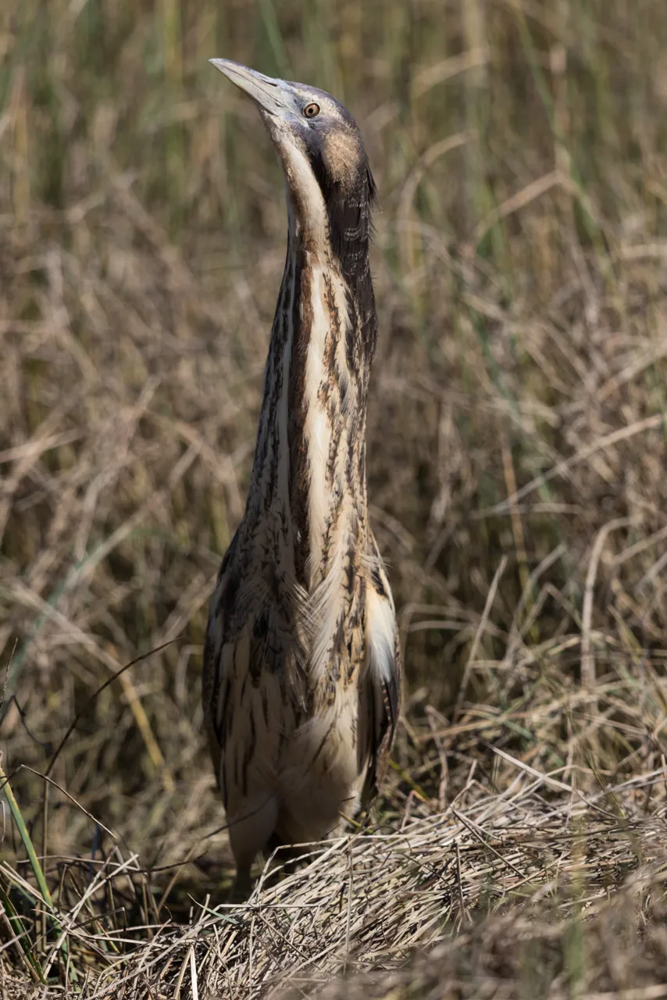

# Perch 2.0: The Bittern Lesson for Bioacoustics

Bart van Merriënboer Affiliation: Google DeepMind    Vincent Dumoulin
Affiliation: Google DeepMind    Jenny Hamer Affiliation: Google DeepMind
   Lauren Harrell Affiliation: Google Research    Andrea Burns
Affiliation: Google DeepMind    Tom Denton Affiliation: Google DeepMind

###### Abstract

Perch is a performant pre-trained model for bioacoustics. It was trained
in supervised fashion, providing both off-the-shelf classification
scores for thousands of vocalizing species as well as strong embeddings
for transfer learning. In this new release, Perch 2.0, we expand from
training exclusively on avian species to a large multi-taxa dataset. The
model is trained with self-distillation using a prototype-learning
classifier as well as a new source-prediction training criterion. Perch
2.0 obtains state-of-the-art performance on the BirdSet and BEANS
benchmarks. It also outperforms specialized marine models on marine
transfer learning tasks, despite having almost no marine training data.
We present hypotheses as to why fine-grained species classification is a
particularly robust pre-training task for bioacoustics.

## 1 Introduction

Bioacoustics is an important tool in the fields of biology and ecology
with vital applications in conservation and biodiversity monitoring
(Laiolo, 2010). In recent years machine learning methods such as deep
learning have largely replaced (Stowell, 2022) more traditional signal
processing methods such as template matching (Towsey et al., 2012) for
event detection and classification in bioacoustics. Moreover, models
trained on large amounts of avian, labeled bioacoustics data such as
BirdNET (Kahl et al., 2021) and the previous iteration of Perch (Hamer
et al., 2023, Perch 1.0,) have been shown to transfer to novel tasks
such as individual identification (Huang et al., 2025) as well as
non-avian bioacoustics problems (Ghani et al., 2023).

Figure 1: Australasian bittern.

In the famous essay _The Bitter Lesson_ (Sutton, 2019) it was argued
that advancements in AI come from simple, general-purpose methods. The
‘bittern lesson’ from Perch 2.0 is that simple, supervised models are
difficult to beat. Bitterns are a subfamily of herons; the Australasian
bittern pictured here is an elusive, endangered species whose
distinctive booming vocalizations can carry long distances. (Image by
[Imogen
Warren](https://commons.wikimedia.org/wiki/File:Australasian_Bittern_09042017-23.jpg)
licensed under [CC BY-SA
4.0](https://creativecommons.org/licenses/by-sa/4.0/).)

In this paper we introduce Perch 2.0, a new iteration of the Perch model
that achieves state-of-the-art results on two bioacoustics benchmarks:
BirdSET and the BEnchmark of ANimal Sounds (BEANS) (Section 3). Perch
2.0 was primarily trained with the task of species classification.
Although self-supervised learning has been explored in the literature as
a way to further improve bioacoustics models—Bird-MAE (Rauch et al.,
2025a), BirdAVES (Hagiwara, 2023) and SimCLR-style models (Moummad et
al., 2024)—these approaches generally struggle to outperform strong
supervised baselines (Ghani et al., 2023; Kather et al., 2025). In our
exploratory research we too have experimented with a variety of
self-supervised methods such as MAEs, HuBERT and SimCLR but experienced
a similar inability to consistently outperform supervised models. We
present some hypotheses as to why the fine-grained task of (avian)
species classification is a particularly useful pre-training task
(Section 4).

Compared to previous iterations of the Perch model we use additional
training data (including non-avian taxa; Section 2.1) and new data
augmentations and training objectives. We generally find that increasing
the difficulty of the classification problem increases the overall
quality of the embedding model: To that end, we introduce a novel
generalization of mixup (Zhang et al., 2018) that mixes more than two
sources (Section 2.1). Additionally, recent BirdCLEF competitions have
demonstrated strong results with iterative pseudo-labeling (Kahl et al.,
2024). Building on this observation, we introduce a variation of
self-distillation (Allen-Zhu and Li, 2022) where a prototype learning
classifier (Chen et al., 2019; Heinrich et al., 2025) is used to
generate predictions that are used as soft targets for the network’s
dense linear classifier (Section 2.2 and Section 2.3). Finally, noting
that label granularity contributes to transfer learning performance
(Section C.1), we add an auxiliary self-supervised loss in the form of
source prediction (Balestriero, 2023, DIET,), asking the model to
predict the source recording of an audio window (Section 2.2 and Section
2.3). A similar objective has been shown to be useful for individual
animal identification (Lapp et al., 2025).

Beyond raw performance on bioacoustics benchmarks, the goal of the Perch
model is to satisfy properties we believe are important for downstream
applications: a relatively small model that can adapt to a wide variety
of domains and tasks using linear probing, since this requires fewer
computational resources, less machine learning expertise, and less
labeled data than full fine-tuning. These constraints enable
practitioners to run the model on consumer-grade hardware, enabling
robust clustering, nearest-neighbor search¹¹ 1
[https://search.acousticobservatory.org/](https://search.acousticobservatory.org/)
or agile modeling (Dumoulin et al., 2025) workflows. To meet these
constraints, the Perch 2.0 model is based on EfficientNet-B3 (Tan and
Le, 2019), a small model by modern machine learning standards, reducing
the processing time of large datasets. We develop an extensive model
selection procedure (Section 2.5.1) which evaluates the model in a
variety of domain shift and transfer learning tasks using linear probing
and retrieval.

## 2 Methodology

In this section we provide a breakdown of the training data, model
architecture, training objectives, and evaluation procedure.

### 2.1 Training data

##### Data sources

We train on a combination of four labeled audio datasets: Xeno-Canto
(Vellinga and Planqué, 2005), iNaturalist (iNaturalist contributors,
2025), the Tierstimmenarchiv (Frommolt, 1996) and FSD50K (Fonseca et
al., 2022). The first three contain bioacoustics recordings with species
labels while the latter contains a variety of non-bird sounds (Table 1).
In total the data contains 14,795 different classes of which 14,597 are
species labels and the remaining 198 classes are general sound event
classes from FSD50K.

|                   |           |          |         |          |          |           |
| ----------------- | --------- | -------- | ------- | -------- | -------- | --------- |
|                   | Aves      | Amphibia | Insecta | Mammalia | Other    | Total     |
| Xeno-Canto        | 860,701   | 2,260    | 31,971  | 1,323    | 0        | 896,255   |
| iNaturalist       | 480,230   | 51,450   | 30,535  | 9,074    | 409      | 571,698   |
| Tierstimmenarchiv | 26,622    | 1,341    | 860     | 4,992    | 44       | 33,859    |
| FSD50k            | 0         | 0        | 0       | 0        | 40,966\* | 40,966    |
| Total             | 1,367,553 | 55,051   | 63,366  | 15,389   | 41,419   | 1,542,778 |

Table 1: Recordings per taxonomic class represented in the training
data. \*Note that FSD50k contains some coarsely-labeled animal sound
classes, which we treat as ‘Other’ in this table.

Xeno-Canto and iNaturalist are large citizen-science repositories. The
Xeno-Canto data was obtained from the public API²² 2
[https://xeno-canto.org/explore/api](https://xeno-canto.org/explore/api)
and the iNaturalist data was obtained by collecting the ‘research-grade’
audio examples reported to the Global Biodiversity Information Facility
(GBIF)³³ 3 [https://www.gbif.org/](https://www.gbif.org/), similarly to
Chasmai et al. (2025). Our training datasets for iNaturalist and
Xeno-Canto were downloaded in March 2025. The Tierstimmenarchiv (Animal
Sound Archive) is a repository from the Berlin Natural History Museum.
We collected these recordings from the website⁴⁴ 4
[https://suche.tierstimmenarchiv.de/](https://suche.tierstimmenarchiv.de/)
in April 2025.

Since Xeno-Canto, iNaturalist and the Tierstimmenarchiv use different
taxonomies (species names) we manually mapped the classes from
Xeno-Canto and the Tierstimmenarchiv into the iNaturalist classes. We
also removed all bat recordings from the datasets (as their
vocalizations cannot be represented using the spectrogram parameters we
selected).

##### Window selection

All of our data sources contain recordings of variable length, ranging
from less than a second to over an hour (with the majority in the 5–150
s range). As a result, the labels for the recordings are ‘weak’ in the
sense that we don’t know at which time(s) the species is actually
vocalizing if the recording is longer than 5 s. Because our model
operates on audio segments of a fixed 5 s size, we must select which
windows to feed to the model for training. We explore two window
selection methods:

1.  1.  Random window selection: Each time a recording is selected for
        training, produce a uniformly random 5 s audio window. Although this
        might produce windows in which the target species is not actually
        heard, the resulting label noise might be of acceptable levels.
2.  2.  Energy peak selection: A heuristic that was important in the
        training of Perch 1.0 where a wavelet transform is used to select
        windows containing the strongest signal (details in Appendix B).
        This is based on the assumption that the labeled species is likely
        the most prominent sound in the recording. We select a 6 s window
        based on the energy peaks and then select a random 5 s window within
        this larger window. Similar signal detectors are used in the
        training of BirdNET (Kahl et al., 2021) and other bioacoustics
        models (Sprengel et al., 2016, e.g.,).

##### Mixup

We apply a variation of mixup (Zhang et al., 2018), mixing together
different windows of audio in order to create a new composite signal. We
generalize the original mixup implementation to more than 2 components
as follows: We first choose the number of components by sampling from a
beta-binomial distribution, $`N\sim\mathrm{BetaBin}(n,\alpha,\beta)+1`$.
We then sample weights for each of the components from a symmetric
Dirichlet distribution, $`\mathbf{w}\sim\mathrm{SymDir}(N,\omega)`$. The
composite signal is constructed by taking the weighted sum of the
components using weights $`\mathbf{w}=(w_{1},\ldots,w_{N})`$ and then
dividing the signal by $`\sqrt{\sum_{i=1}^{N}w_{i}^{2}}`$ (to ensure
that the gain of the mixed audio signal remains unchanged). The
parameters $`n`$, $`\alpha`$, $`\beta`$ and $`\omega`$ are all treated
as hyperparameters. Unlike the original mixup implementation, we
construct a multi-hot target vector rather than taking a weighted
average of one-hot target vectors, as this reflects the fact that all
vocalizations in an audio window should be recognized with high
confidence irrespective of their loudness.

### 2.2 Model Architecture

The model has three parts: a frontend (which converts raw audio into a
spectrogram), an embedding model, and a set of output heads.

Figure 2: Perch 2.0 model architecture.

##### Frontend

The model frontend consumes monaural audio sampled at 32 kHz and
produces a log mel-spectrogram. The frontend takes in audio segments of
length 5 s (160,000 samples) and uses a hop and window length of 10 and
20 ms respectively, outputting a total of 500 frames with 128 mel-scaled
frequency bins ranging from 60 Hz to 16 kHz. Further details can be
found in Section A.2.

##### Embedding model

The embedding model is an EfficientNet-B3 (Tan and Le, 2019), a
convolutional residual network with 12 million parameters, utilizing
depthwise convolutions to maximize parameter efficiency. Note that this
is larger than our original Perch model (which used an EfficientNet-B1
with 7.8 million parameters), reflecting the increased amount of
training data. From the embedding model we obtain a _spatial embedding_,
$`E_{S}`$, of shape $`(5,3,1536)`$ with axes corresponding to time,
frequency and features. We average over the spatial dimensions to obtain
a single 1536-dimensional _mean embedding_ $`E_{A}`$.

##### Output heads

During training, we have three output heads.

1.  1.  A _linear classifier_ which projects $`E_{A}`$ into our
        14,795-dimensional space of class labels. Training a linear
        classifier on our embeddings encourages the final embeddings of our
        model to be linearly separable for different species which should
        improve the performance of linear probing.
2.  2.  A _prototype learning classifier_ which also makes predictions over
        the class labels. This classifier head was introduced as part of the
        ProtoPNet model in Chen et al. (2019) and was used in bioacoustics
        as part of AudioProtoPNet in Heinrich et al. (2025). It takes as
        input the spatial embeddings, $`E_{S}`$. Four prototypes are learned
        for each class and the final prediction uses the maximum activation
        across the prototypes.
3.  3.  The _source prediction head_ is a linear classifier which predicts
        the (one-hot encoded) source recording from the mean embedding,
        $`E_{A}`$. Our training set has over 1.5 million source recordings
        so we use a low-rank projection of rank 512. This head is used for
        the self-supervised source prediction loss from DIET (Balestriero,
        2023).

### 2.3 Training objectives

Our model is trained by optimizing three separate training objectives.

##### Species classification cross entropy

Following Mahajan et al. (2018) we train the linear classifier using a
softmax activation layer and a cross entropy loss using a target vector
where each of the $`k`$ target classes (species) has the value
$`\frac{1}{k}`$. We have found this to train faster than using the more
traditional sigmoid binary cross-entropy used in multi-label
classification.

##### Self-distillation

The protoype learning classifier is trained for species classification
in a similar fashion using a softmax activation function and cross
entropy. Following Heinrich et al. (2025); Donnelly et al. (2022) an
orthogonality loss is also computed to maximize variation across the
prototypes.

A stop-gradient separates the embedding model from the prototype
learning classifier so that its gradients do not propagate to the
embedding model. Instead, the predictions from the prototype learning
classifier are used as soft targets for the linear classifier.

This is a form of self-distillation where the prototype learning
classifier is the teacher and the linear classifier is the student (with
both sharing the embedding model parameters). Self-distillation is known
to improve performance (Allen-Zhu and Li, 2022).

##### Source prediction

Source prediction is a simple self-supervised objective: Assign each
example in the dataset its own class and train a classifier in
supervised fashion as usual using softmax cross entropy. This technique
was proposed in Balestriero (2023) in the context of vision and is
reliant on data augmentation to force the network to learn salient
features. In our case the data augmentation comes in the form of
windowing: Longer recordings can produce entirely non-overlapping 5 s
windows which the model will need to learn to assign to the same class.
That is, the network must predict the source recording given a short 5 s
window.

Note that this self-supervised method can just as well be seen as an
extremely fine-grained supervised classification problem, which might go
some way to explaining its effectiveness.

##### Training phases

Our model is optimized in two phases. The linear classifier and source
prediction head are trained in both phases. During the first phase we
train the prototype learning classifier but we do not use the
predictions from the prototype learning classifier as soft targets for
self distillation yet. Once the prototype learning classifier is trained
we start the second phase of training during which we perform the
self-distillation. All losses are minimized using Adam (Kingma and Ba,
2015). For the first and second phases we budget up to 300,000 and
400,000 steps, respectively.

### 2.4 Hyperparameter selection

For hyperparameter selection we apply Vizier (Golovin et al., 2017), a
black-box optimization algorithm for machine learning hyperparameter
optimization.

For the first phase of training (i.e., without self-distillation) we use
Vizier to explore the learning rate, dropout rate applied on the
embeddings before the classification heads, source prediction loss
weight and mixup hyperparameters. In each phase we run Vizier in two
stages, training 100 models in each stage (i.e., 100 models are trained
and based on their validation scores Vizier selects a new set of 100
hyperparameters for the second stage). Training for each model took
between 20 and 30 hours on a TPUv3-8, depending mainly on the number of
mixup signals used.

We select the best model according to the best mean performance on the
validation tasks (Section 2.5). We then continue training this model for
the second (self-distillation) phase, performing a second sweep with
Vizier over the same hyperparameters as before but now adding the
self-distillation loss weight as well. We ran both phases of training
using random windows and energy peak selection.

During the first phase we found that Vizier preferred models that mixed
multiple signals, $`N\in\{2,\ldots,5\}`$, had non-negligible source
prediction loss weights of in the range $`(0.1,0.9)`$⁵⁵ 5 Note that
given the large number of classes in the source prediction task the
scale of this loss is higher than that of the species classification
loss., and dropout rates in $`(0.3,0.6)`$. The better models had
$`\alpha>\beta`$ and a concentration, $`\omega`$, around $`(10,30)`$ for
the mixup parameters.

During the self-distillation phase, Vizier preferred models with a small
learning rate, little or no mixup (mostly $`N=1`$, i.e., no mixing), low
source prediction loss, $`(0,0.4)`$, and less dropout, $`(0,0.5)`$. It
assigned high weights to the self-distillation loss, $`(1.5,4.5)`$. The
hyperparameters of the final models are listed in Section A.1.

### 2.5 Evaluation

The field of bioacoustics recognized domain shift as an important
problem early on (Lasseck and Others, 2013), acknowledging that
deployment conditions and tasks might differ from training time. Hence,
our model selection (validation) is set up to test several forms of
generalization: we consider avian soundscapes (which are qualitatively
different from the focal recordings found in our training data);
consider tasks other than species identification (e.g., call-type and
dialect recognition); and evaluate transfer to species classification of
non-avian taxa (bats, marine mammals, mosquitoes, etc.) For our model
evaluation (testing) we use both BirdSet (Rauch et al., 2025b) and BEANS
(Hagiwara et al., 2023). Combined, these benchmarks cover a similar set
of domain shifts while still allowing us to make a fair comparison with
existing models.

In practice, bioacoustics models like Perch are often used by
practitioners who have limited computational resources and machine
learning expertise while working on novel problems with little or no
labeled data (but potentially large amounts of unlabeled data). In these
settings a sensible approach is to embed the data once and then use
methods such as clustering, nearest neighbor searches, few-shot learning
and agile modeling (Dumoulin et al., 2025). We want to ensure that our
model produces embeddings that perform well in these situations, so
during both model selection and evaluation we freeze the embedding
model.

#### 2.5.1 Model-selection tasks

To ensure that our model performs well in the applications described in
Section 2.5 we consider three different types of tasks at validation
time:

1.  1.  We evaluate _pretrained classifier performance_ using ROC-AUC on two
        fully-annotated bird datasets, where the class labels are a subset
        of the training classes of the Perch model: Powdermill (Denton et
        al., 2022) (as in Rauch et al. (2025b)) and Caples (Denton et al.,
        2022). These tasks validate that our model makes useful species
        predictions out-of-the-box. We make predictions for every 5 s window
        with a 2.5 s stride and count the prediction as correct when it
        overlaps with a ground truth annotation.
2.  2.  We examine _one-shot retrieval_ by selecting random examples from a
        fully-annotated dataset, ranking the nearest neighbors (using cosine
        distance) and then computing the ROC-AUC for all examples of that
        species in the dataset (using all other species as negatives). This
        is a proxy for our model performance in nearest neighbor searches
        and clustering applications. We evaluate this task on the BEANS
        benchmark (Hagiwara et al., 2023)’s detection datasets and the Weldy
        calltype dataset (Weldy et al., 2024) as well as Powdermill and
        Caples.
3.  3.  Finally, we have _linear transfer tasks_ in which we select a random
        subset of $`16`$ examples per class and compute an embedding for
        each (by embedding each 5 s window with a stride of 5 s and
        averaging them). We then train a linear classifier for 10,000 steps
        on the selected examples using scikit-learn. All remaining examples
        are used to compute an ROC-AUC score. This follows the procedure
        applied in Ghani et al. (2023) and evaluates how well our model’s
        embeddings do in few-shot learning and agile modeling setups. We
        evaluate this task on the BEANS classification tasks, some of the
        datasets from Ghani et al. (2023) as well as marine datasets such as
        DCLDE (Palmer et al., 2025), NOAA (NOAA Pacific Islands Fisheries
        Science Center, 2021) and ReefSet (Williams et al., 2025).

For each task-type, we compute a geometric mean over all relevant
datasets to obtain an overall task-performance score. Finally, we
compute an overall model quality score by taking the geometric mean of
the three task-performance scores. The geometric mean will tend to favor
models with less variance in the scores (van Merriënboer et al., 2024).

In summary, the validation tasks for Perch 2.0 were designed to evaluate
real world usage of the model on a broad collection of datasets (a total
of 19 constituent datasets; refer to Table 2).

[TABLE]

- a
  From this paper only the Godwit Calls, Yellowhammer Dialects and Bats
  datasets are used. The other datasets overlap with the BEANS
  benchmark.
- b
  We do not use the ESC-50 and Speech Commands datasets for validation.

Table 2: Summary of Datasets

#### 2.5.2 Evaluation tasks

The BirdSet benchmark (Rauch et al., 2025b) consists of six
fully-annotated datasets from the continental United States, Hawai‘i,
Peru and Colombia. BirdSet provides training sets for each of these
soundscapes for model fine-tuning. In our evaluations we forgo
fine-tuning and simply use the predictions of our prototype learning
classifier predictions directly.

The BEnchmark of Animal Sounds (Hagiwara et al., 2023, BEANS) provides
twelve cross-taxa test tasks, including birds, land and marine mammals,
anurans, and insects. Each dataset is divided into train, validation,
and test data. We use the train data to train both linear and
prototypical probes on the embeddings, but again forgo any fine-tuning
of the embedding model. The prototype probing is performed using the
same prototype classifier head as described in Section 2.2.

In Section C.2 we compare Perch 2.0 to specialized marine models:
SurfPerch (Williams et al., 2025) and Google’s Multispecies Whale Model
(Harvey et al., 2024).

## 3 Results

We present results on variety of baseline models and several ablations
on the BirdSet and BEANS benchmarks, described in Section 2.5.2. In
Table 3 we present the mean class-mean average precision (cmAP), AUROC,
and top-1 accuracy scores on BirdSet across all tasks. For BEANS, we
present mean metrics for each of the two task types: mean accuracy on
classification transfer tasks, and mean macro-averaged average precision
on detection tasks. We include the full breakdown of model performance
across benchmark sub-tasks in Appendix C.

|                         |            |       |       |       |            |       |       |
| ----------------------- | ---------- | ----- | ----- | ----- | ---------- | ----- | ----- |
|                         | BirdSet    |       |       |       | BEANS      |       |       |
|                         | Method^(a) | AUROC | cmAP  | Acc   | Method^(a) | Acc   | mAP   |
| Audio ProtoPNet-5       | Pre        | 0.896 | 0.423 | 0.623 | –^(b)      | –     | –     |
| BirdMAE-L^(c)           | FT         | 0.886 | 0.440 | 0.601 | –          | –     | –     |
| BirdMAE-L^(c)           | PP         | 0.886 | 0.409 | 0.521 | –          | –     | –     |
| AVES-Bio                | –          | –     | –     | –     | FT         | 0.817 | 0.398 |
| BioLingual              | –          | –     | –     | –     | FT         | –     | 0.479 |
| NatureLM-Audio          | –          | –     | –     | –     | 0          | –     | 0.153 |
| Perch 1.0               | Pre        | 0.839 | 0.356 | 0.613 | LP         | 0.809 | 0.353 |
| Perch 2.0 - Phase I     | Pre        | 0.902 | 0.431 | 0.642 | LP         | 0.835 | 0.426 |
|                         |            |       |       |       | PP         | 0.841 | 0.499 |
| Perch 2.0 - Peak-select | Pre        | 0.907 | 0.430 | 0.619 | LP         | 0.839 | 0.426 |
|                         |            |       |       |       | PP         | 0.841 | 0.504 |
| Perch 2.0 - Random      | Pre        | 0.908 | 0.431 | 0.665 | LP         | 0.838 | 0.415 |
|                         |            |       |       |       | PP         | 0.840 | 0.502 |

- a
  ‘Pre’ indicates application of a pre-trained classification head, ‘FT’
  indicates model fine-tuning on a train split of the data, ‘LP’
  indicates a linear probe, ‘PP’ is a prototypical probe, and ‘0’
  indicates zero-shot language queries.
- b
  For models with a dash (–) in place of a numeric score, one or more
  scores on a benchmark specific task were not reported.
- c
  Note that the BirdSet scores reported for BirdMAE-L are calculated
  using the scores on the High Sierras Nevada (HSN) subtask, even though
  this dataset was used by BirdMAE-L for hyperparameter tuning.

Table 3: Benchmark results

Although the BirdSet benchmark calculates several scores, we believe
that the ROC-AUC score is the most stable and informative (van
Merriënboer et al., 2024). On this metric, as well as on the BEANS
tasks, Perch 2.0 achieves state-of-the-art performance. Note that this
was achieved without any fine-tuning of the embedding model.

Although Perch 2.0’s performance with linear probing on BEANS compares
favorably to existing models, we note that prototypical probing seems to
improve the performance on detection tasks.

Contrary to our experience with Perch 1.0 and other results in the
literature, we find that training with random windows performs on par
with using energy peak selection. We hypothesize that the
self-distillation phase helps address some of the issues with label
noise, negating the need for window selection methods.

## 4 Discussion

### 4.1 Why supervision?

The fields of natural language processing and computer vision have seen
a strong trend towards _foundation models_ (Bommasani et al., 2021):
self-supervised models trained on large amounts of unlabeled data which
can be adapted to a variety of downstream tasks with minimal or no
fine-tuning. Many other areas of machine learning have tried to emulate
this success leading to mixed results (Xu et al., 2024; Cole et al.,
2022). As evidenced by the results in this paper, supervision remains
dominant in bioacoustics as well. We posit some hypotheses as to why
this is the case.

Most successful self-supervised methods depend on using large amounts of
unlabeled data and correspondingly large models (Chen et al., 2020a;
Chen et al., 2020b, Figure 1). For example, a strong self-supervised
model in vision such as DINOv2 (Oquab et al., 2024) was trained on 142
million images. In comparison, Xeno-Canto and iNaturalist are two orders
of magnitude smaller. Perhaps bioacoustics will need to unlock
significant amounts of diverse, unlabeled data to replicate the success
of self-supervised learning in vision.

Self-supervised methods also rely on domain-specific training objectives
and data augmentations (Tamkin et al., 2021; Gui et al., 2024) and the
performance of models is highly dependent on the chosen data
augmentations (Morningstar et al., 2024). In speech, self-supervised
models such as wav2vec (Baevski et al., 2020) have shown strong
performance but general purpose audio benchmarks such as HEAR (Turian et
al., 2022) are still dominated by supervised and semi-supervised models
despite several attempts to apply self-supervised methods to general
audio problems (Saeed et al., 2021; Al-Tahan and Mohsenzadeh, 2021).
Comparisons of bioacoustics models in the literature similarly find that
supervised models still outperform self-supervised models (Ghani et al.,
2023; Kather et al., 2025). It is possible that work remains on finding
the right data augmentations to use in bioacoustics. This domain
specificity is reminiscent of similar observations made in the context
of source-free domain adaptation (Boudiaf et al., 2023): there,
approaches developed in the context of computer vision problems were not
as generalizable to bioacoustics as one would hope.

On the other hand, there are indications that bioacoustics is
particularly well-positioned to exploit supervised learning. Results
such as those presented in Cole et al. (2022, Figure 2) suggest that if
there are enough labeled examples available (hundreds of thousands) then
it becomes increasingly difficult to outperform supervised models; we
use over 1.5 million labeled recordings in the training of Perch 2.0.

Supervised pre-training benefits particularly from having fine-grained
labels (Hong et al., 2024). The performance gap between self-supervised
and supervised models becomes bigger as the supervised models have
access to finer-grained labels (Cole et al., 2022, Figure 5). Not only
does our problem space have over 15,000 classes, but distinguishing
between different species within the same genus can be a particularly
fine-grained problem. In Section C.1, we demonstrate that reducing the
granularity of supervised labels results in worse transfer learning
performance for the resulting embeddings.

Furthermore, one could suspect that models trained on primarily avian
recordings are likely to fail in transferring to non-avian
vocalizations. However, the great diversity of birdsong (Kroodsma, 2004)
and the existence of universal mechanisms of sound production in
terrestrial vertebrates (Elemans et al., 2015) are both likely to
contribute to the successful transfer to a surprisingly large number of
bioacoustic domains (Ghani et al., 2023).

### 4.2 Conclusion

Though we have previously seen wide transfer of bird vocalization
embeddings to a surprising number of bioacoustics tasks, we are
confident that the expansion of training targets in Perch 2.0 will make
it applicable to an even wider range of problems. We have seen in this
work that high quality transfer learning does not require very large
models, and that well-tuned supervised models using strong data
augmentations and auxiliary training objectives can have strong
performance. The simplicity of the final model and the linear
separability of its embeddings ensure scalability to large datasets. In
particular, transfer and classification on fixed embeddings (as opposed
to model fine-tuning) means that embeddings can be computed once and
reused for large datasets. This represents a massive savings of
resources for e.g. one-shot retrieval through embedding vector search
(i.e., ‘query-by-example’), which is an important first step to transfer
learning through agile modeling (Dumoulin et al., 2025).

### 4.3 Future work

The validation procedures used for Perch 2.0 try to close the gap
between model evaluation and actual deployment, which is a particularly
complex topic (van Merriënboer et al., 2024). We believe more work
remains to be done in the development of benchmarks that actually
reflect the real world use of bioacoustics models.

Our model’s use of source prediction also opens up a clear avenue for
semi-supervised learning which can be used to fill gaps in labeled
training data (e.g., for taxa that have relatively few labeled examples
such as mammals).

The success of supervised learning also raises the question as to
whether we can construct other classification tasks using the metadata
that is available for many recordings (e.g., the time of day, season,
location).

## References

- Al-Tahan and Mohsenzadeh (2021) H. Al-Tahan and Y. Mohsenzadeh. CLAR:
  Contrastive learning of auditory representations. In A. Banerjee
  and K. Fukumizu, editors, _Proceedings of The 24th International
  Conference on Artificial Intelligence and Statistics_, volume 130 of
  _Proceedings of Machine Learning Research_, pages 2530–2538.
  PMLR, 2021.
- Allen et al. (2021) A. N. Allen, M. Harvey, L. Harrell, A.
  Jansen, K. P. Merkens, C. C. Wall, J. Cattiau, and E. M. Oleson. A
  convolutional neural network for automated detection of humpback whale
  song in a diverse, long-term passive acoustic dataset. _Frontiers in
  marine science_, 8:607321, 17 Mar. 2021.
- Allen et al. (2024) A. N. Allen, M. Harvey, L. Harrell, M.
  Wood, A. R. Szesciorka, J. L. K. McCullough, and E. M. Oleson. Bryde’s
  whales produce biotwang calls, which occur seasonally in long-term
  acoustic recordings from the central and western north pacific.
  _Frontiers in marine science_, 11(1394695):1394695, 18 Sept. 2024.
- Allen-Zhu and Li (2022) Z. Allen-Zhu and Y. Li. Towards understanding
  ensemble, knowledge distillation and self-distillation in deep
  learning. In _The Eleventh International Conference on Learning
  Representations_, 29 Sept. 2022.
- Baevski et al. (2020) A. Baevski, Y. Zhou, A. Mohamed, and M. Auli.
  wav2vec 2.0: A framework for self-supervised learning of speech
  representations. In H. Larochelle, M. Ranzato, R. Hadsell, M. F.
  Balcan, and H. Lin, editors, _Advances in Neural Information
  Processing Systems_, volume 33, pages 12449–12460. Curran Associates,
  Inc., 2020.
- Balestriero (2023) R. Balestriero. Unsupervised learning on a DIET:
  Datum IndEx as target free of self-supervision, reconstruction,
  projector head. _arXiv \[cs.AI\]_, 20 Feb. 2023.
- Bommasani et al. (2021) R. Bommasani, D. A. Hudson, E. Adeli, R.
  Altman, S. Arora, S. von Arx, M. S. Bernstein, J. Bohg, A.
  Bosselut, E. Brunskill, E. Brynjolfsson, S. Buch, D. Card, R.
  Castellon, N. Chatterji, A. Chen, K. Creel, J. Q. Davis, D.
  Demszky, C. Donahue, M. Doumbouya, E. Durmus, S. Ermon, J.
  Etchemendy, K. Ethayarajh, L. Fei-Fei, C. Finn, T. Gale, L.
  Gillespie, K. Goel, N. Goodman, S. Grossman, N. Guha, T. Hashimoto, P.
  Henderson, J. Hewitt, D. E. Ho, J. Hong, K. Hsu, J. Huang, T.
  Icard, S. Jain, D. Jurafsky, P. Kalluri, S. Karamcheti, G. Keeling, F.
  Khani, O. Khattab, P. W. Koh, M. Krass, R. Krishna, R. Kuditipudi, A.
  Kumar, F. Ladhak, M. Lee, T. Lee, J. Leskovec, I. Levent, X. L. Li, X.
  Li, T. Ma, A. Malik, C. D. Manning, S. Mirchandani, E. Mitchell, Z.
  Munyikwa, S. Nair, A. Narayan, D. Narayanan, B. Newman, A. Nie, J. C.
  Niebles, H. Nilforoshan, J. Nyarko, G. Ogut, L. Orr, I.
  Papadimitriou, J. S. Park, C. Piech, E. Portelance, C. Potts, A.
  Raghunathan, R. Reich, H. Ren, F. Rong, Y. Roohani, C. Ruiz, J.
  Ryan, C. Ré, D. Sadigh, S. Sagawa, K. Santhanam, A. Shih, K.
  Srinivasan, A. Tamkin, R. Taori, A. W. Thomas, F. Tramèr, R. E.
  Wang, W. Wang, B. Wu, J. Wu, Y. Wu, S. M. Xie, M. Yasunaga, J. You, M.
  Zaharia, M. Zhang, T. Zhang, X. Zhang, Y. Zhang, L. Zheng, K. Zhou,
  and P. Liang. On the opportunities and risks of foundation models.
  _arXiv \[cs.LG\]_, 16 Aug. 2021.
- Boudiaf et al. (2023) M. Boudiaf, T. Denton, B. Van Merriënboer, V.
  Dumoulin, and E. Triantafillou. In search for a generalizable method
  for source free domain adaptation. In _Proceedings of the 40th
  International Conference on Machine Learning_, ICML’23, Honolulu,
  Hawaii, USA, 2023. JMLR.org.
- Chasmai et al. (2025) M. Chasmai, A. Shepard, S. Maji, and G. Van
  Horn. The iNaturalist sounds dataset. _Neural Information Processing
  Systems_, abs/2506.00343:132524–132544, 31 May 2025.
- Chen et al. (2019) C. Chen, O. Li, D. Tao, A. Barnett, C. Rudin,
  and J. K. Su. This looks like that: Deep learning for interpretable
  image recognition. In H. Wallach, H. Larochelle, A. Beygelzimer, F.
  d'Alché-Buc, E. Fox, and R. Garnett, editors, _Advances in Neural
  Information Processing Systems_, volume 32. Curran Associates,
  Inc., 2019.
- Chen et al. (2020a) T. Chen, S. Kornblith, M. Norouzi, and G. Hinton.
  A simple framework for contrastive learning of visual representations.
  In _Proceedings of the 37th International Conference on Machine
  Learning_, ICML’20. JMLR.org, 2020a.
- Chen et al. (2020b) T. Chen, S. Kornblith, K. Swersky, M. Norouzi,
  and G. Hinton. Big self-supervised models are strong semi-supervised
  learners. In _Proceedings of the 34th International Conference on
  Neural Information Processing Systems_, NIPS ’20, Red Hook, NY, USA,
  2020b. Curran Associates Inc.
- Chronister et al. (2021) L. M. Chronister, T. A. Rhinehart, A. Place,
  and J. Kitzes. An annotated set of audio recordings of eastern north
  american birds containing frequency, time, and species information.
  _Ecology_, 102(6):e03329, 1 June 2021.
- Clapp et al. (2023) M. Clapp, S. Kahl, E. Meyer, M. McKenna, H.
  Klinck, and G. Patricelli. A collection of fully-annotated soundscape
  recordings from the southern sierra nevada mountain range, 2023.
- Cole et al. (2022) E. Cole, X. Yang, K. Wilber, O. M. Aodha, and S.
  Belongie. When does contrastive visual representation learning work?
  In _2022 IEEE/CVF Conference on Computer Vision and Pattern
  Recognition (CVPR)_, pages 01–10. IEEE, June 2022.
- Denton et al. (2022) T. Denton, S. Wisdom, and J. R. Hershey.
  Improving bird classification with unsupervised sound separation. In
  _ICASSP 2022 - 2022 IEEE International Conference on Acoustics, Speech
  and Signal Processing (ICASSP)_, pages 636–640, 2022.
- Donnelly et al. (2022) J. Donnelly, A. J. Barnett, and C. Chen.
  Deformable ProtoPNet: An interpretable image classifier using
  deformable prototypes. In _2022 IEEE/CVF Conference on Computer Vision
  and Pattern Recognition (CVPR)_, pages 10255–10265, 2022.
- Dumoulin et al. (2025) V. Dumoulin, O. Stretcu, J. Hamer, L.
  Harrell, R. Laber, H. Larochelle, B. van Merriënboer, A. Navine, P.
  Hart, B. Williams, T. A. C. Lamont, T. B. Razak, Mars Coral
  Restoration Team, S. Brodie, B. Doohan, P. Eichinski, P. Roe, L.
  Schwarzkopf, and T. Denton. The search for squawk: Agile modeling in
  bioacoustics. _arXiv \[eess.AS\]_, 5 May 2025.
- Elemans et al. (2015) C. P. H. Elemans, J. H. Rasmussen, C. T.
  Herbst, D. N. Düring, S. A. Zollinger, H. Brumm, K. Srivastava, N.
  Svane, M. Ding, O. N. Larsen, S. J. Sober, and J. G. Švec. Universal
  mechanisms of sound production and control in birds and mammals.
  _Nature communications_, 6(1):8978, 27 Nov. 2015.
- Fonseca et al. (2022) E. Fonseca, X. Favory, J. Pons, F. Font, and X.
  Serra. FSD50K: An open dataset of human-labeled sound events.
  _IEEE/ACM Transactions on Audio, Speech, and Language Processing_,
  30:829–852, 2022.
- Frommolt (1996) K.-H. Frommolt. The archive of animal sounds at the
  humboldt-university of berlin. _Bioacoustics_, 6(4):293–296,
  Jan. 1996.
- Ghani et al. (2023) B. Ghani, T. Denton, S. Kahl, and H. Klinck.
  Global birdsong embeddings enable superior transfer learning for
  bioacoustic classification. _Scientific Reports_, 13(1):22876, 18
  Dec. 2023.
- Golovin et al. (2017) D. Golovin, B. Solnik, S. Moitra, G.
  Kochanski, J. Karro, and D. Sculley. Google vizier: A service for
  black-box optimization. In _Proceedings of the 23rd ACM SIGKDD
  International Conference on Knowledge Discovery and Data Mining_, New
  York, NY, USA, 13 Aug. 2017. ACM.
- Gui et al. (2024) J. Gui, T. Chen, J. Zhang, Q. Cao, Z. Sun, H. Luo,
  and D. Tao. A survey on self-supervised learning: Algorithms,
  applications, and future trends. _IEEE transactions on pattern
  analysis and machine intelligence_, 46(12):9052–9071, Dec. 2024.
- Hagiwara (2023) M. Hagiwara. AVES: Animal vocalization encoder based
  on self-supervision. In _ICASSP 2023 - 2023 IEEE International
  Conference on Acoustics, Speech and Signal Processing (ICASSP)_, pages
  1–5. IEEE, 4 June 2023.
- Hagiwara et al. (2023) M. Hagiwara, B. Hoffman, J.-Y. Liu, M.
  Cusimano, F. Effenberger, and K. Zacarian. BEANS: The benchmark of
  animal sounds. In _ICASSP 2023 - 2023 IEEE International Conference on
  Acoustics, Speech and Signal Processing (ICASSP)_, pages 1–5. IEEE, 4
  June 2023.
- Hamer et al. (2023) J. Hamer, E. Triantafillou, B. van
  Merriënboer, S. Kahl, H. Klinck, T. Denton, and V. Dumoulin. BIRB: A
  generalization benchmark for information retrieval in bioacoustics.
  _arXiv \[cs.LG\]_, 12 Dec. 2023.
- Harvey et al. (2024) M. Harvey, A. Allen, and L. Harrell. Google
  multispecies whale model, 2024.
- Heinrich et al. (2025) R. Heinrich, L. Rauch, B. Sick, and C. Scholz.
  AudioProtoPNet: An interpretable deep learning model for bird sound
  classification. _Ecological Informatics_, 87:103081, 2025.
- Hong et al. (2024) G. Z. Hong, Y. Cui, A. Fuxman, S. H. Chan, and E.
  Luo. Why fine-grained labels in pretraining benefit generalization?
  _Transactions on Machine Learning Research_, 2024.
- Hopping et al. (2022) W. A. Hopping, S. Kahl, and H. Klinck. A
  collection of fully-annotated soundscape recordings from the
  southwestern amazon basin, 2022.
- Huang et al. (2025) L. Huang, R. H. Clarke, D. Teixeira, A.
  Chiaradia, and B. Meyer. Acoustic recognition of individuals in closed
  and open bird populations. _Ecological informatics_,
  90(103330):103330, 1 Dec. 2025.
- iNaturalist contributors (2025) iNaturalist contributors. iNaturalist
  research-grade observations, 2025.
- Kahl et al. (2021) S. Kahl, C. M. Wood, M. Eibl, and H. Klinck.
  BirdNET: A deep learning solution for avian diversity monitoring.
  _Ecological informatics_, 61(101236):101236, 1 Mar. 2021.
- Kahl et al. (2022a) S. Kahl, R. Charif, and H. Klinck. A collection
  of fully-annotated soundscape recordings from the northeastern united
  states, 2022a.
- Kahl et al. (2022b) S. Kahl, C. M. Wood, P. Chaon, M. Zachariah
  Peery, and H. Klinck. A collection of fully-annotated soundscape
  recordings from the western united states, 2022b.
- Kahl et al. (2024) S. Kahl, T. Denton, H. Klinck, V. Ramesh, V.
  Joshi, M. Srivathsa, A. Anand, C. Arvind, H. Cp, S. Sawant, R. Vv, H.
  Glotin, H. Goeau, W.-P. Vellinga, R. Planqué, and A. Joly. Overview of
  BirdCLEF 2024: Acoustic identification of under-studied bird species
  in the western ghats.
  [http://agritrop.cirad.fr/613024/](http://agritrop.cirad.fr/613024/), 2024.
  Accessed: 2025-8-5.
- Kather et al. (2025) V. S. Kather, B. Ghani, and D. Stowell.
  Clustering and novel class recognition: evaluating bioacoustic deep
  learning feature extractors. In _Proceedings of the Convention of the
  European Acoustics Association_, June 2025.
- Kingma and Ba (2015) D. P. Kingma and J. Ba. Adam: A method for
  stochastic optimization. In _International Conference on Learning
  Representations (ICLR)_, 2015.
- Kroodsma (2004) D. Kroodsma. The diversity and plasticity of
  birdsong. In _Nature’s Music_, pages 108–131. Elsevier, 1 Jan. 2004.
- Laiolo (2010) P. Laiolo. The emerging significance of bioacoustics in
  animal species conservation. _Biological conservation_,
  143(7):1635–1645, 1 July 2010.
- Lapp et al. (2025) S. Lapp, R. P. Lyon, S. J. Wilson, T. A.
  Rhinehart, C. Czarnecki, L. Chronister, C. Fiss, J. Larkin, E. Bayne,
  and J. Kitzes. Automated identification of individual birds by song
  enables multi-year recapture from passive acoustic monitoring data.
  _bioRxiv_, page 2025.06.26.661638, 28 June 2025.
- Lasseck and Others (2013) M. Lasseck and Others. Bird song
  classification in field recordings: Winning solution for NIPS4B 2013
  competition. In _Proc. of int. symp. Neural Information Scaled for
  Bioacoustics, sabiod. org/nips4b, joint to NIPS, Nevada_, pages
  176–181, 2013.
- Mahajan et al. (2018) D. Mahajan, R. Girshick, V. Ramanathan, K.
  He, M. Paluri, Y. Li, A. Bharambe, and L. van der Maaten. Exploring
  the limits of weakly supervised pretraining. In _Proceedings of the
  European Conference on Computer Vision (ECCV)_, pages 181–196, 2018.
- Morningstar et al. (2024) W. Morningstar, A. Bijamov, C. Duvarney, L.
  Friedman, N. Kalibhat, L. Liu, P. Mansfield, R. Rojas-Gomez, K.
  Singhal, B. Green, and S. Prakash. Augmentations vs algorithms: What
  works in self-supervised learning. _arXiv \[cs.LG\]_, 8 Mar. 2024.
- Moummad et al. (2024) I. Moummad, R. Serizel, E. Benetos, and N.
  Farrugia. Domain-invariant representation learning of bird sounds.
  _arXiv \[cs.SD\]_, 13 Sept. 2024.
- NOAA Pacific Islands Fisheries Science Center (2021) NOAA Pacific
  Islands Fisheries Science Center. Pacific islands passive acoustic
  network (PIPAN) 10kHz data, 2021.
- Oquab et al. (2024) M. Oquab, T. Darcet, T. Moutakanni, H. V. Vo, M.
  Szafraniec, V. Khalidov, P. Fernandez, D. Haziza, F. Massa, A.
  El-Nouby, M. Assran, N. Ballas, W. Galuba, R. Howes, P.-Y. Huang,
  S.-W. Li, I. Misra, M. Rabbat, V. Sharma, G. Synnaeve, H. Xu, H.
  Jegou, J. Mairal, P. Labatut, A. Joulin, and P. Bojanowski. DINOv2:
  Learning robust visual features without supervision. _Transactions on
  Machine Learning Research_, 2024.
- Palmer et al. (2025) K. J. Palmer, E. Cummings, M. G. Dowd, K.
  Frasier, F. Frazao, A. Harris, A. Houweling, J. Kanes, O. S.
  Kirsebom, H. Klinck, H. LeBlond, L. Laturnus, C. Matkin, O. Murphy, H.
  Myers, D. Olsen, C. O’Neill, B. Padovese, J. Pilkington, L.
  Quayle, A. R. Vuibert, K. Trounce, S. Vagle, S. Veirs, V. Veirs, J.
  Wladichuk, J. Wood, T. Yack, H. Yurk, and R. Joy. A public dataset of
  annotated orcinus orca acoustic signals for detection and ecotype
  classification. _Scientific data_, 12(1):1137, 3 July 2025.
- Rauch et al. (2025a) L. Rauch, R. Heinrich, I. Moummad, A. Joly, B.
  Sick, and C. Scholz. Can masked autoencoders also listen to birds?
  _Transactions on machine learning research_, 2025a.
- Rauch et al. (2025b) L. Rauch, R. Schwinger, M. Wirth, R.
  Heinrich, D. Huseljic, M. Herde, J. Lange, S. Kahl, B. Sick, S.
  Tomforde, and C. Scholz. BirdSet: A large-scale dataset for audio
  classification in avian bioacoustics. In _Proceedings of the
  international conference on learning representations_, 2025b.
- Saeed et al. (2021) A. Saeed, D. Grangier, and N. Zeghidour.
  Contrastive learning of general-purpose audio representations. In
  _ICASSP 2021 - 2021 IEEE International Conference on Acoustics, Speech
  and Signal Processing (ICASSP)_, pages 3875–3879, 2021.
- Sprengel et al. (2016) E. Sprengel, M. Jaggi, Y. Kilcher, and T.
  Hofmann. Audio based bird species identification using deep learning
  techniques. _CLEF (working notes)_, 1609, 2016.
- Stowell (2022) D. Stowell. Computational bioacoustics with deep
  learning: a review and roadmap. _PeerJ_, 10:e13152, 21 Mar. 2022.
- Sutton (2019) R. Sutton. The bitter lesson. _Incomplete Ideas
  (blog)_, 13(1):38, 2019.
- Tamkin et al. (2021) A. Tamkin, V. Liu, R. Lu, D. Fein, C. Schultz,
  and N. Goodman. DABS: a domain-agnostic benchmark for self-supervised
  learning. In _Thirty-fifth Conference on Neural Information Processing
  Systems Datasets and Benchmarks Track (Round 1)_, 8 June 2021.
- Tan and Le (2019) M. Tan and Q. Le. EfficientNet: Rethinking model
  scaling for convolutional neural networks. In _International
  Conference on Machine Learning_, pages 6105–6114. PMLR, 24 May 2019.
- Towsey et al. (2012) M. Towsey, B. Planitz, A. Nantes, J. Wimmer,
  and P. Roe. A toolbox for animal call recognition. _Bioacoustics_,
  21(2):107–125, 10 June 2012.
- Turian et al. (2022) J. Turian, J. Shier, H. R. Khan, B. Raj, B. W.
  Schuller, C. J. Steinmetz, C. Malloy, G. Tzanetakis, G. Velarde, K.
  McNally, M. Henry, N. Pinto, C. Noufi, C. Clough, D. Herremans, E.
  Fonseca, J. Engel, J. Salamon, P. Esling, P. Manocha, S. Watanabe, Z.
  Jin, and Y. Bisk. HEAR: Holistic evaluation of audio representations.
  In D. Kiela, M. Ciccone, and B. Caputo, editors, _Proceedings of the
  NeurIPS 2021 Competitions and Demonstrations Track_, volume 176 of
  _Proceedings of Machine Learning Research_, pages 125–145. PMLR, 2022.
- van Merriënboer et al. (2024) B. van Merriënboer, J. Hamer, V.
  Dumoulin, E. Triantafillou, and T. Denton. Birds, bats and beyond:
  evaluating generalization in bioacoustics models. _Frontiers in Bird
  Science_, 3:1369756, 1 July 2024.
- Vega-Hidalgo et al. (2023) Á. Vega-Hidalgo, S. Kahl, L. B. Symes, V.
  Ruiz-Gutiérrez, I. Molina-Mora, F. Cediel, L. Sandoval, and H. Klinck.
  A collection of fully-annotated soundscape recordings from neotropical
  coffee farms in colombia and costa rica, 2023.
- Vellinga and Planqué (2005) W.-P. Vellinga and B. Planqué. Xeno-canto.
  [https://xeno-canto.org/](https://xeno-canto.org/), 30 May 2005.
  Accessed: 2025-8-4.
- von Benda-Beckmann et al. (2022) A. M. von Benda-Beckmann, C.
  Binder, H. Johnson, J. MacDonnell, J. Theriault, A. Vanderlaan, and D.
  Thomson. Northern right whale sonobuoy localisation dataset for the
  DCDLE workshop. Technical report, TNO, 11 Nov. 2022.
- Weldy et al. (2024) M. J. Weldy, T. Denton, A. B. Fleishman, J.
  Tolchin, M. McKown, R. S. Spaan, Z. J. Ruff, J. M. A. Jenkins, M. G.
  Betts, and D. B. Lesmeister. Audio tagging of avian dawn chorus
  recordings in california, oregon and washington. _Biodiversity data
  journal_, 12:e118315, 29 Apr. 2024.
- Williams et al. (2025) B. Williams, B. van Merriënboer, V.
  Dumoulin, J. Hamer, A. B. Fleishman, M. McKown, J. Munger, A. N.
  Rice, A. Lillis, C. White, C. Hobbs, T. Razak, D. Curnick, K. E.
  Jones, and T. Denton. Using tropical reef, bird and unrelated sounds
  for superior transfer learning in marine bioacoustics. _Philosophical
  transactions of the Royal Society of London. Series B, Biological
  sciences_, 380(1928):20240280, 12 June 2025.
- Xu et al. (2024) Z. Xu, R. Gupta, W. Cheng, A. Shen, J. Shen, A.
  Talwalkar, and M. Khodak. Specialized foundation models struggle to
  beat supervised baselines. In _The Thirteenth International Conference
  on Learning Representations_, 4 Oct. 2024.
- Zhang et al. (2018) H. Zhang, M. Cisse, Y. N. Dauphin, and D.
  Lopez-Paz. mixup: Beyond empirical risk minimization. In
  _International Conference on Learning Representations_, 15 Feb. 2018.

## Appendix A Model details

### A.1 Hyperparameters

For the first phase of training, the best performing model had the
following hyperparameters:

- •
  Dropout rate: 0.49
- •
  Source prediction loss weight: 0.11
- •
  Mixup parameters: $`\alpha=91.3,\beta=100,\omega=1,n=2`$
- •
  Learning rate: $`6.41\cdot 10^{-4}`$

For the second phase of training, the selected hyperparameters were:

- •
  Self-distillation loss weight: 4.22
- •
  Dropout rate: 0
- •
  Source prediction loss weight: 0
- •
  Mixup parameters: $`n=0`$ (no mixup)
- •
  Learning rate: $`3.20\cdot 10^{-6}`$

### A.2 Frontend

Our frontend outputs mel-scaled log-spectrograms, taking in 5 s of audio
at 32 kHz (160,000 samples). It uses a hop length of 10 ms (320 samples)
and a window length of 20 ms (640 samples). The FFT window is set to
1,024 samples for computational efficiency. The frames are uncentered
(i.e., the first frame begins at the first sample) and a Hann window is
used. We calculate the energy (magnitude) spectrogram (so not a power
spectrogram). The mel-scale is calculated using the HTK formula. Similar
to SciPy’s STFT implementation the output is scaled by the reciprocal of
the sum of the window values. After the calculation of the
mel-spectrogram we apply a logarithm with a floor of $`10^{-5}`$ and
then multiply the output by 0.1.

## Appendix B Peak-finding

A mel-spectrogram of the recording is constructed using a window size of
80 ms and a hop of $`10`$ ms. The magnitudes are log-scaled (using a
floor of $`0.01`$) and then scaled by $`0.1`$.

Then, a two-step denoising process is applied: For each frequency bin
the mean and standard deviation of the log-magnitudes is calculated
across time. Any values which are greater than the mean plus $`1.5`$
standard deviations are discarded. A second mean and standard deviation
is calculated using the remaining values. This second mean and standard
deviation are used to select signal, which are all values that lie above
the mean plus 0.75 standard deviations. The signal is shifted by this
second mean, and the rest is discarded.

Finally, the magnitudes of the denoised spectrogram are summed across
the frequency bins. SciPy’s signal.find_peaks_cwt is then used to find
peaks ranging between $`0.5`$ and $`2`$ s using $`10`$ wavelet filters.
We calculate the total value of the summed magnitudes in the 600 ms
window surrounding the peak. If this total value is less than $`1.5`$
times the mean frequency-summed magnitude over the entire recording the
peak is discarded. The remaining peaks are sorted by their summed
magnitudes and only the top $`5`$ are kept.

If a recording is less than 6 s, it is padded with zeros before applying
the peak finding. If not a single peak is found, we simply select the
first 6 s of the recording.

## Appendix C Additional results

|                         |                |       |       |       |       |       |       |       |
| ----------------------- | -------------- | ----- | ----- | ----- | ----- | ----- | ----- | ----- |
|                         | PER            | NES   | UHH   | HSN   | NBP   | SSW   | SNE   | Mean  |
|                         | ROC-AUC        |       |       |       |       |       |       |       |
| Audio ProtoPNet-5       | 0.790          | 0.930 | 0.870 | 0.920 | 0.930 | 0.970 | 0.860 | 0.896 |
| BirdMAE-L (FT)          | 0.820          | 0.910 | 0.820 | 0.900 | 0.940 | 0.930 | 0.880 | 0.886 |
| BirdMAE-L (PP)          | 0.820          | 0.930 | 0.830 | 0.900 | 0.920 | 0.940 | 0.860 | 0.886 |
| Perch 1.0               | 0.700          | 0.900 | 0.760 | 0.860 | 0.910 | 0.910 | 0.830 | 0.839 |
| Perch 2.0 - Phase I     | 0.783          | 0.948 | 0.896 | 0.896 | 0.941 | 0.968 | 0.885 | 0.902 |
| Perch 2.0 - Peak-Select | 0.802          | 0.948 | 0.901 | 0.896 | 0.941 | 0.974 | 0.887 | 0.907 |
| Perch 2.0 - Random      | 0.786          | 0.953 | 0.912 | 0.915 | 0.933 | 0.973 | 0.883 | 0.908 |
|                         | cmAP           |       |       |       |       |       |       |       |
| Audio ProtoPNet-5       | 0.300          | 0.380 | 0.310 | 0.540 | 0.680 | 0.420 | 0.330 | 0.424 |
| BirdMAE-L (FT)          | 0.350          | 0.410 | 0.300 | 0.550 | 0.720 | 0.410 | 0.340 | 0.440 |
| BirdMAE-L (PP)          | 0.310          | 0.380 | 0.300 | 0.490 | 0.690 | 0.380 | 0.300 | 0.407 |
| Perch 1.0               | 0.180          | 0.390 | 0.270 | 0.450 | 0.630 | 0.280 | 0.290 | 0.356 |
| Perch 2.0 - Phase I     | 0.230          | 0.396 | 0.368 | 0.522 | 0.682 | 0.464 | 0.351 | 0.431 |
| Perch 2.0 - Peak-Select | 0.255          | 0.382 | 0.375 | 0.504 | 0.695 | 0.455 | 0.342 | 0.430 |
| Perch 2.0 - Random      | 0.232          | 0.403 | 0.380 | 0.533 | 0.661 | 0.469 | 0.341 | 0.431 |
|                         | Top-1 Accuracy |       |       |       |       |       |       |       |
| Audio ProtoPNet-5       | 0.590          | 0.520 | 0.490 | 0.650 | 0.710 | 0.660 | 0.740 | 0.623 |
| BirdMAE-L (FT)          | 0.600          | 0.520 | 0.420 | 0.640 | 0.720 | 0.700 | 0.610 | 0.601 |
| BirdMAE-L (PP)          | 0.590          | 0.470 | 0.360 | 0.380 | 0.690 | 0.620 | 0.540 | 0.521 |
| Nature LM-Audio         | 0.620          | 0.470 | 0.600 | 0.580 | 0.660 | –     | 0.760 | –     |
| Perch 1.0               | 0.480          | 0.660 | 0.570 | 0.580 | 0.690 | 0.620 | 0.690 | 0.613 |
| Perch 2.0 - Phase I     | 0.534          | 0.537 | 0.539 | 0.629 | 0.703 | 0.778 | 0.776 | 0.642 |
| Perch 2.0 - Peak-Select | 0.528          | 0.504 | 0.462 | 0.620 | 0.677 | 0.782 | 0.763 | 0.619 |
| Perch 2.0 - Random      | 0.535          | 0.562 | 0.595 | 0.659 | 0.724 | 0.789 | 0.791 | 0.665 |

Table 4: BirdSet per-dataset results.

|                       | esc50 | watkins | bats  | cbi   | dogs  | humbugdb | speech | Mean  |
| --------------------- | ----- | ------- | ----- | ----- | ----- | -------- | ------ | ----- |
| AVES-Bio              | 0.773 | 0.879   | 0.748 | 0.598 | 0.950 | 0.810    | 0.964  | 0.817 |
| BioLingual (FT)       | 0.908 | 0.894   | 0.766 | 0.744 | 0.971 | 0.817    | –      | –     |
| NatureLM-Audio        | 0.820 | 0.788   | –     | 0.778 | –     | 0.114    | –      | –     |
| Perch 1.0             | 0.800 | 0.855   | 0.718 | 0.757 | 0.942 | 0.739    | 0.853  | 0.809 |
| Perch 2.0 - Phase I   | 0.892 | 0.900   | 0.764 | 0.791 | 0.964 | 0.756    | 0.776  | 0.835 |
| Perch 2.0 (Peak., LP) | 0.908 | 0.900   | 0.774 | 0.789 | 0.957 | 0.758    | 0.789  | 0.839 |
| Perch 2.0 (Peak., PP) | 0.890 | 0.858   | 0.815 | 0.785 | 0.935 | 0.768    | 0.838  | 0.841 |
| Perch 2.0 (Rand., LP) | 0.895 | 0.885   | 0.766 | 0.792 | 0.964 | 0.762    | 0.801  | 0.838 |
| Perch 2.0 (Rand., PP) | 0.875 | 0.870   | 0.804 | 0.793 | 0.942 | 0.770    | 0.827  | 0.840 |

Table 5: BEANS per-dataset results on tasks measuring accuracy.

|                       | dcase | enabirds | hiceas | rfcx  | hainan gibbons | Mean  |
| --------------------- | ----- | -------- | ------ | ----- | -------------- | ----- |
| AVES-Bio              | 0.392 | 0.555    | 0.629  | 0.13  | 0.284          | 0.398 |
| BioLingual (FT)       | 0.475 | 0.688    | 0.677  | 0.178 | 0.376          | 0.479 |
| NatureLM-Audio        | 0.058 | 0.314    | 0.336  | 0.025 | 0.005          | 0.148 |
| Perch 1.0             | 0.283 | 0.603    | 0.502  | 0.232 | 0.146          | 0.353 |
| Perch 2.0 - Phase I   | 0.370 | 0.656    | 0.516  | 0.153 | 0.434          | 0.426 |
| Perch 2.0 (Peak., LP) | 0.373 | 0.671    | 0.497  | 0.137 | 0.452          | 0.426 |
| Perch 2.0 (Peak., PP) | 0.457 | 0.764    | 0.585  | 0.2   | 0.516          | 0.504 |
| Perch 2.0 (Rand., LP) | 0.377 | 0.661    | 0.492  | 0.141 | 0.406          | 0.415 |
| Perch 2.0 (Rand., PP) | 0.469 | 0.751    | 0.575  | 0.200 | 0.515          | 0.502 |

Table 6: BEANS per-dataset results on tasks measuring mAP. ‘Peak‘ and
‘Rand‘ indicate peak-selected vs. random window distilled models, ‘LP’
indicates linear probe, and ‘PP’ indicates prototypical probe.

### C.1 Label Granularity

We perform an additional experiment to demonstrate the importance of
label granularity for transfer learning tasks.

For this experiment, we train a model on Xeno-Canto only. No prototype
linear classifier is trained; architecturally this is the same as Perch
1.0, but trained on increased Xeno-Canto data relative to the earlier
model. (Note that the total number of classes for this new model is
slightly smaller than Perch 1.0; this is due to the removal of some
species from Xeno-Canto due to poaching concerns.)

We observe steady degradation of transfer learning performance as the
labels are made more granular.

We additionally observe that the new model trained on only Xeno-Canto
outperforms Perch 1.0, demonstrating the impact of accumulating new
supervisory data over time.

| Model       | Num Classes | BEANS Acc. | BEANS mAP |
| ----------- | ----------- | ---------- | --------- |
| Perch 1.0   | 10932       | 0.809      | 0.353     |
| XC: Species | 10906       | 0.837      | 0.398     |
| XC: Genus   | 2398        | 0.820      | 0.389     |
| XC: Family  | 249         | 0.761      | 0.318     |
| XC: Order   | 41          | 0.608      | 0.217     |

- Transfer learning performance of models trained on Xeno-Canto alone,
  with training labels converted to different levels of granularity.

Table 7: Label granularity

### C.2 Few shot learning for underwater audio results

In marine bioacoustics, association of sounds with species is much more
challenging given the general lack of visual confirmation. In this
context, few-shot learning and transfer learning are valuable tools that
allow for quick iteration as new sounds are discovered.

##### Datasets

To establish Perch 2.0’s performance for underwater audio tasks, we
evaluate its performance on three marine audio validation sets: NOAA
PIPAN, ReefSet, and DCLDE 2026. The DCLDE 2026 dataset is further broken
down into three label sets for evaluations:

- •
  Species: humpback, orca, abiotic, and undetermined biological sounds.
  The specific ecotype annotations for orcas are combined into a single
  label for this task.
- •
  Ecotype: orca-NRKW, -OKW, -SAR, -SRKW, and -TKW. Ecotypes are locally
  adapted populations with distinct traits, e.g., NRKW refers to
  northern resident killer whales (orcas) which live in the northeast
  part of the Pacific Ocean.
- •
  Known species: humpback and orca.

The NOAA PIPAN audio data comes from the NOAA Passive Acoustic Archive
(NOAA Pacific Islands Fisheries Science Center, 2021). The labeled
segments were extracted from annotations provided in Allen et al.
(2021); Allen et al. (2024) in addition to annotations provided by NOAA.
The label classes in the NOAA PIPAN evaluation set are at the species
level for the following baleen species: common minke whale, humpback
whale, sei whale, blue whale, fin whale, and Bryde’s whale. Additional
label classes include anthropomorphic noise, unknown whale species, and
‘other’. The ReefSet data are described in detail in Williams et al.
(2025), but include a mix of biological reef noises (such as croaks,
crackles, growls), classes for some species/genera (e.g., damselfish,
dolphins, and groupers), as well as anthropomorphic noise classes and
waves.

##### Method

We compare the performance of the mean embeddings generated by Perch 2.0
versus Perch 1.0, SurfPerch (Williams et al., 2025), and the Google
Multispecies Whale model (Harvey et al., 2024; Allen et al., 2024) on
few-shot classification using ROC-AUC computed from $`k=16`$ examples
per class in Table 8. We use the same transfer learning protocol with
linear probing as described in Section 2.5.1, i.e., we evaluate the
embeddings of these models in a few-shot classification setup and do not
use the predictions of the models directly.

Note that the published SurfPerch model was trained on the ReefSet data,
and similarly a large portion of the NOAA PIPAN labeled audio data was
used to train the Multispecies Whale model (but the Multispecies Whale
model does not include classes or label sets for sei whales,
anthropomorphic noise, or unknown whale). The data for DCLDE 2026 is
previously unseen for all models, although the Multispecies Whale model
was trained on killer whales. The scores in Table 8 might differ
slightly from previously reported results in the literature due to
differences in the linear probe estimation implementation⁶⁶ 6 In
particular, Williams et al. (2025) evaluated the SurfPerch model on
ReefSet by training a linear layer using mini-batches and the Adam
optimizer. In our experiments we use scikit-learn’s LogisticRegression
class, which uses the L-BFGS optimizer and weight decay by default..
Perch 2.0’s training data includes a few dozen cetacean recordings, but
these were mostly phone recordings made above water and not reflective
of underwater hydrophone recordings.

| Model              | DCLDE 2026 |     |         |     |                   |       | NOAA PIPAN |     | Reefset |     |
| ------------------ | ---------- | --- | ------- | --- | ----------------- | ----- | ---------- | --- | ------- | --- |
|                    | Species    |     | Ecotype |     | Known Bio Species |       |            |     |         |     |
|                    | LP         | CLS | LP      | CLS | LP                | CLS   | LP         | CLS | LP      | CLS |
| Multispecies Whale | 0.914      | –   | 0.821   | –   | 0.954             | 0.612 | 0.917\*    | –   | 0.855   | –   |
| SurfPerch          | 0.947      | –   | 0.903   | –   | 0.984             | –     | 0.899      | –   | 0.986\* | –   |
| Perch 1.0          | 0.968      | –   | 0.931   | –   | 0.981             | –     | 0.905      | –   | 0.970   | –   |
| Perch 2.0          | 0.977      | –   | 0.945   | –   | 0.989             | –     | 0.924      | –   | 0.981   | –   |

- ROC-AUC of few shot transfer learning of Perch 2.0 against Perch 1.0
  and pretrained models for Multispecies Whale and SurfPerch for
  $`k=16`$ samples per class for training. (\*) indicates the dataset
  was in the training data for the model.

Table 8: Marine learning transfer tasks

##### Results

We find that Perch 2.0 outperforms the published comparison models on
the linear transfer tasks for cetacean species (DCLDE 2026 species,
DCLDE 2026 ecotypes, DCLDE 2026 species-known bio and NOAA PIPAN
whales). On ReefSet, Perch 2.0 has an ROC-AUC of 0.981 versus 0.986 from
SurfPerch (which was trained directly on ReefSet). These results show
that the Perch 2.0 has outstanding performance for transfer learning
even in the marine acoustic environments, and thus show that when doing
transfer learning or agile modeling, using Perch 2.0 as the embedding
model would be expected to provide a more efficient and high quality
search and classification workflow for similar types of sounds. For the
DCLDE data, if we use logits from directly applying the Google
Multispecies model, the AUC-ROC is 0.612, but if using the embeddings
from this model for few-shot learning, the performance jumps to 0.954.
The discrepancy in performance in those two approaches demonstrates the
value of pretrained models as foundational models that can be
efficiently fine-tuned for specific domains and classes, even if the
model’s supported label classes for logits have lower performance. With
that said, Perch 2.0 demonstrated superior performance against the
whale-specific model in the linear probe, and thus would be recommended
for generating embeddings for cetacean-classification tasks.
