# Investigating Target Class Influence on Neural Network Compressibility for Energy-Autonomous Avian Monitoring

Nina Brolich Affiliation: Fraunhofer Institute for Integrated Circuits
IIS, Germany Affiliation: Fachhochschule Erfurt, Germany
Affiliation: Universität Erfurt, Germany    Simon Geis
Affiliation: Fraunhofer Institute for Integrated Circuits IIS, Germany
   Maximilian Kasper Affiliation: Fraunhofer Institute for Integrated
Circuits IIS, Germany    Alexander Barnhill
Affiliation: Friedrich-Alexander-Universität Erlangen-Nürnberg (FAU),
Germany    Axel Plinge Affiliation: Fraunhofer Institute for Integrated
Circuits IIS, Germany    Dominik Seuß Affiliation: Fraunhofer Institute
for Integrated Circuits IIS, Germany Affiliation: Center for Artificial
Intelligence and Robotics (CAIRO), Technische Hochschule
Würzburg-Schweinfurt, Germany

###### Abstract

Biodiversity loss poses a significant threat to humanity, making
wildlife monitoring essential for assessing ecosystem health. Avian
species are ideal subjects for this due to their popularity and the ease
of identifying them through their distinctive songs. Traditional avian
monitoring methods require manual counting and are therefore costly and
inefficient. In passive acoustic monitoring, soundscapes are recorded
over long periods of time. The recordings are analyzed to identify bird
species afterwards. Machine learning methods have greatly expedited this
process in a wide range of species and environments, however, existing
solutions require complex models and substantial computational
resources. Instead, we propose running machine learning models on
inexpensive microcontroller units (MCUs)directly in the field. Due to
the resulting hardware and energy constraints, efficient artificial
intelligence (AI)architecture is required.

In this paper, we present our method for avian monitoring on MCUs. We
trained and compressed models for various numbers of target classes to
assess the detection of multiple bird species on edge devices and
evaluate the influence of the number of species on the compressibility
of neural networks. Our results demonstrate significant compression
rates with minimal performance loss. We also provide benchmarking
results for different hardware platforms and evaluate the feasibility of
deploying energy-autonomous devices.

Keywords: edge AI, biodiversity monitoring, energy-autonomous, energy
benchmarking.

## 1 Introduction

Among today’s global environmental crises, the ongoing loss of
biodiversity stands out as especially severe: it ensures access to vital
resources \[1\] and contributes to various environmental services such
as climate regulation, control of pollution and soil erosion, as well as
pollination of crops, while also holding intrinsic value for cultural
identity \[2\]. Currently, biodiversity is declining at unprecedented
rates, highlighting the need for conservation efforts \[3\]. In this
context, biodiversity monitoring provides essential information for
tracking environmental changes and plays an integral role in assessing
population trajectories of different species \[4\]. Birds are
particularly well suited for monitoring due to their frequent and
distinctive vocalizations \[5\], their role as indicators of ecosystem
health \[6\], and their popular appeal \[7\].

Avian monitoring has been done mainly through point counts \[8\], where
the goal is to record all birds seen or heard within a given time
period, with the observer being stationary \[9\]. However, point counts
are highly susceptible to external circumstances, such as weather
conditions, dependent on human expertise \[10\], and their scalability
is limited by logistic and financial constraints \[11\].

In recent years, autonomous recording units (ARUs)have emerged as a
cost-effective alternative to point counts, allowing long-term sound
collection through passive acoustic monitoring (PAM)with minimal
disturbance, broader spatial and temporal coverage, and permanent
recordings for re-analysis \[12\]. However, analyzing these large
datasets is challenging \[13\]: manual methods require reducing the
number of recordings or species (\[14\]), while automatic approaches
remain difficult. Deep neural networks (DNNs)show promise but face
computational constraints (\[15, 16\]). _BirdNET_ \[11\], capable of
identifying thousands of species, is an example of a successful
DNN-based solution and provides our method with a baseline for data
collection and pre-processing. However, this approach is computationally
expensive, requires internet access, and often exceeds the needs of
localized surveys.

As an alternative, we propose species identification in real-time on an
embedded, energy self-sustaining solution, shifting from retrospective
analysis of ARUdata to in-field processing, thereby reducing
computational overhead while improving both energy and cost efficiency.
The system is to be realized with edge artificial intelligence (AI)using
a microcontroller unit (MCU), which introduces resource constraints such
as limited memory, low processing capacity, and lack of parallelism
\[17\]. To operate effectively under these constraints, deployment on
edge devices like MCUsrequires compact models, achieved either through
lightweight network design or compression, to accommodate hardware
constraints while preserving performance.

To assess the feasibility of avian monitoring on the edge and to examine
target class influence on compressibility, we trained and compressed
models for various numbers of avian target classes and benchmarked their
energy consumption and latency on an _ARM Cortex-M4_, an _ARM
Cortex-M7_, and a _Raspberry Pi 4_. Based on the results, we provide an
estimate for the required battery capacity for real-life deployment. In
the following, we describe our methodology, present and discuss the
results, and conclude with an outlook on future work.

## 2 Methodology

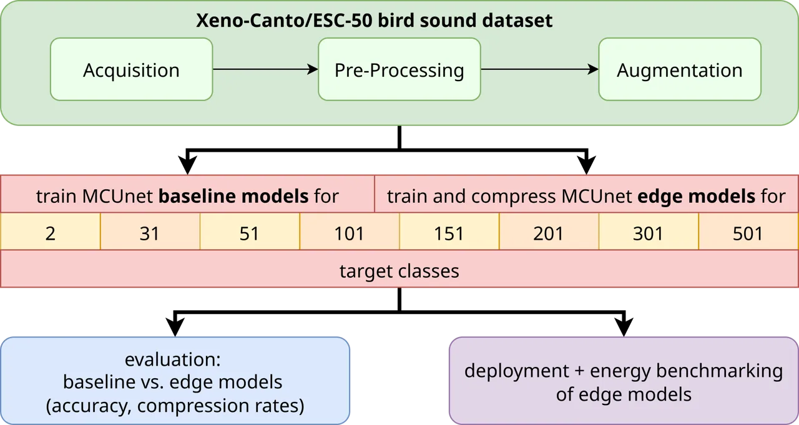

Figure 1: Methodology overview: workflow for dataset preparation, MCUNet
model training, compression, and edge benchmarking.

An overview of our methodology is provided in Fig. 1. The dataset was
primarily compiled from *Xeno-Canto* \[18\], an open database of
user-submitted bird recordings, resulting in a large but heterogeneous
collection in both quality and duration. 500 species were selected based
on the availability of sufficient samples, with preference first given
to German, then European and finally global species. German species and
data were prioritized to match the intended deployment region and to
ensure data representativeness. For each species, 250 recordings were
randomly chosen. In addition, the *ESC-50* \[19\] dataset was used to
form a single non-avian class by merging 49 environmental sound
categories (excluding bird calls). The data samples were pre-processed
using the following steps:

1.  1.  Discarding audio samples shorter than 2 seconds, based on the
        average length of a bird vocalization of 1.94 seconds \[20\].
2.  2.  Removing silent sections, defined as amplitudes below
        $`20\text{\,}\mathrm{\%}`$ of the maximum peak.
3.  3.  Sequentially splitting recordings into 2-second chunks with a
        maximum of 30 chunks per recording while discarding chunks without
        peaks (at least $`7.5\text{\,}\mathrm{\%}`$ louder than surrounding
        points).
4.  4.  Normalizing each chunk so that its maximum absolute amplitude equals
        1 to ensure consistency in amplitude throughout the dataset.
5.  5.  Converting the normalized chunks into mel-spectrograms, using a
        sample rate of $`48\text{\,}\mathrm{kHz}`$, 64 mel bands, a fast
        fourier transform (FFT)window size of 512 and a hop length of
        384 \[11\]. The frequency was constrained to
        $`150\text{\,}\mathrm{Hz}`$ and $`7.5\text{\,}\mathrm{kHz}`$.

This produced an easily attainable but heterogeneous dataset, containing
samples of varying quality with both avian and non-avian background
noises. While not optimal for training, it realistically represents the
acoustic challenges encountered in edge-deployed avian monitoring. On
average, this resulted in 2452 chunks per bird species with a standard
deviation of 874. The dataset was partitioned into training, validation,
and test sets without data leakage.

To increase the diversity of our training data and to enhance the
generalizability of our models, we applied the data augmentation
pipeline outlined by \[11\] to our data. Four different augmentation
methods were applied, as illustrated in Fig. 2.

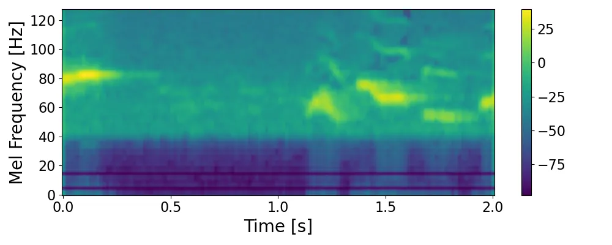

(a) Original input mel-spectrogram

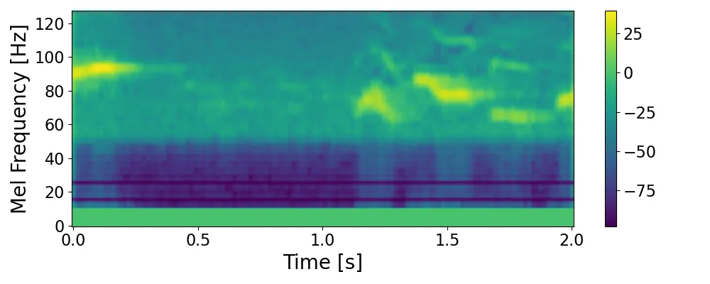

(b) Vertically shifted mel-spectrogram

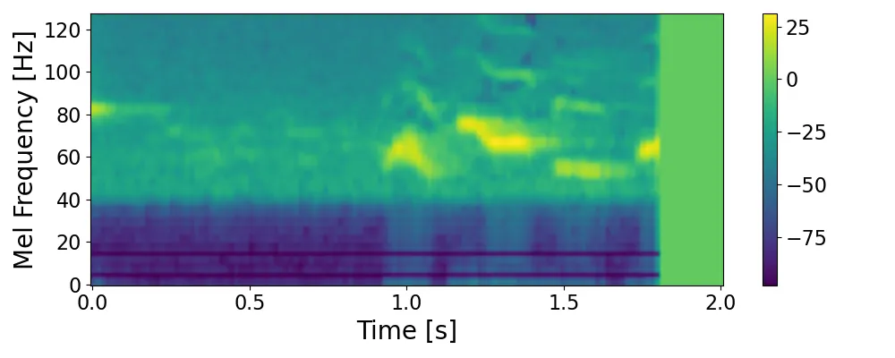

(c) Horizontally shifted mel-spectrogram

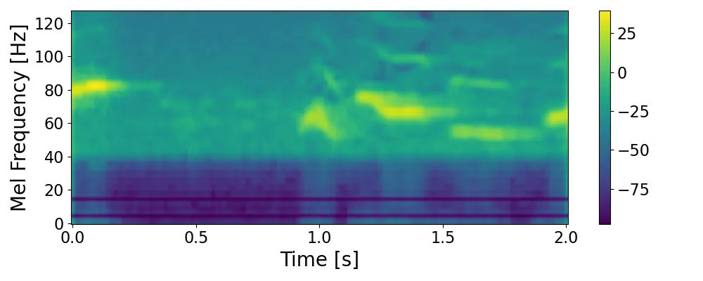

(d) Time-warped mel-spectrogram

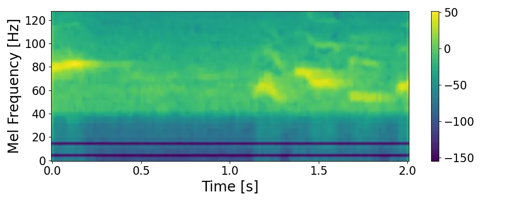

(e) Mel-spectrogram with added noise

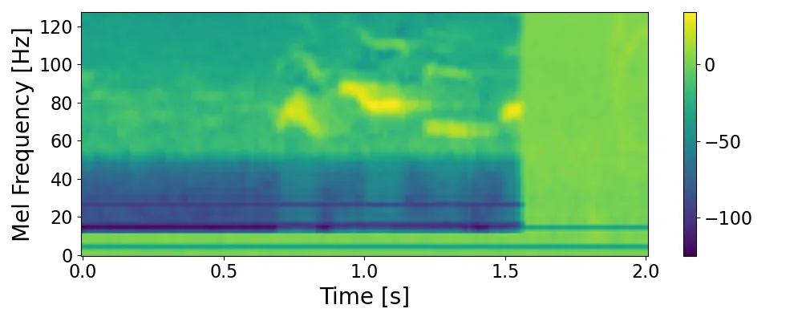

(f) Mel-spectrogram with all augmentations

Figure 2: Mel-spectrograms with different data augmentation methods
applied.

- •
  Random vertical shifts (frequency roll): the mel-spectrogram was
  shifted up or down by a random factor between -$`5\text{\,}\mathrm{\%}`$ and $`5\text{\,}\mathrm{\%}`$, with the
  vacated area filled with zeros.
- •
  Random horizontal shifts (time roll): the mel-spectrogram was shifted
  left or right by a random factor between -$`25\text{\,}\mathrm{\%}`$
  and $`25\text{\,}\mathrm{\%}`$, with zeros filling the empty region.
- •
  Time warping: the mel-spectrogram was deformed in time direction using
  the _SpecAugment_ algorithm \[21\].
- •
  Addition of noise: randomly selected noise chunks, previously
  discarded during preprocessing and verified to contain no bird calls,
  were added at a random intensity between $`20\text{\,}\mathrm{\%}`$
  and $`80\text{\,}\mathrm{\%}`$.

These augmentation methods all represent acoustic variations between
training and test data like the changes in the vocal output of birds
depending on environmental factors, high levels of ambient noise, and
lack of training sample diversity \[11\]. Each augmentation was applied
with a $`50\text{\,}\mathrm{\%}`$ probability per chunk, in random
order, with a maximum of three augmentations per chunk.

For the experiments, the _mcunet-in4_ model from the _MCUNet_ framework
\[22\] was selected and adapted for bird sound classification. _MCUNet_
is specifically designed for deep learning on microcontrollers,
combining efficient neural architecture search (_TinyNAS_) with a
memory-optimized inference engine (_TinyEngine_) to accommodate hardware
constraints. Despite the existance of smaller _MCUNet_ models,
_mcunet-in4_ was chosen for its better performance and to ensure support
for higher numbers of target classes. Nevertheless, it still allows
deployment on edge devices, which was also aided by further compression
of the models. Its architecture, illustrated in Fig. 3, consists of an
initial convolutional layer, 17 _MobileInvertedResidualBlocks_ \[23\],
and a final linear layer. To accommodate mel-spectrogram inputs, the
first layer was modified to accept a single input channel, while the
output layer was adjusted to match the number of target classes (31, 51,
101, etc.), including a non-avian class. Pre-trained weights from
*ImageNet* \[24\] were loaded for all layers except the first and last.

Figure 3: Structure and components of _MCUNet_.

In total, one uncompressed baseline model and 50 compressed edge models
were trained for 2, 31, 51, 101, 151, 201, 301, and 501 target classes.
For the model with only two target classes, the objective was to
identify one bird species against 29 others, as well as non-bird data,
i.e., it was trained with two classes, one consisting of data for the
common blackbird (_turdus merula_), and the other one consisting of data
of the 29 other most common bird species in Germany, as well as the
environment data. From 31 target classes onward, the models were trained
to identify 30 (or 50, 100, …) bird species, as well as one non-event
class.

The baseline models were trained with a set number of 30 training
epochs. The training was conducted with a batch size of 32, using the
stochastic gradient descent (SGD)optimizer with a learning rate of 0.001
and a momentum of 0.9. Cross-entropy loss served as the loss function.
The edge models were trained using an internal tool from _Fraunhofer
IIS_. While the same general training configuration was utilized as for
the baseline models, an interleaved pruning process with quantization at
the end of the training process was employed. This tool implements the
neural network compression approach from \[25\], performing multiple
training and compression trials to maximize accuracy and minimize
read-only memory (ROM), random-access memory (RAM), and floating point
operations (FLOPs)requirements. For each edge model, 50 trials were run,
producing 50 compressed models, some of which are Pareto optimal across
these objectives. A model is considered Pareto optimal if no other model
performs better in one objective without performing worse in at least
one other.

For the evaluation of the results, the performance of the edge models
was first compared to the corresponding baseline models. A
representative compressed model was selected from the 50 trials
conducted for each target class number. To rank the trial $`t_{x}`$, the
trade-off between accuracy $`acc(t_{x})`$ (Eq. 1) and the combined
memory metrics $`mem(t_{x})`$ of ROM, RAM, and FLOPs(Eq. 2) was
emphasized, as showcased in the ranking function $`r(t_{x})`$ in Eq. 3.

```math
acc(t_{x})=\frac{\text{ACC}(t_{x})}{\max\{\text{ACC}(t_{i})|i\in[0,49]\}} \tag{1}
```

```math
mem(t_{x})=\frac{1-\frac{\text{RAM}(t_{x})}{\max\{\text{RAM}(t_{i})\}}+1-\frac{\text{ROM}(t_{x})}{\max\{\text{ROM}(t_{i})\}}+1-\frac{\text{FLOPs}(t_{x})}{\max\{\text{FLOPs}(t_{i})\}}}{3},\ i\in[0,49] \tag{2}
```

```math
r(t_{x})=mem(t_{x})+acc(t_{x}) \tag{3}
```

To evaluate compressibility, we defined ROM, RAM, and FLOPscompression
rates $`cr`$, shown in Eq. 4 for FLOPs, with the values for ROMand
RAMcomputed analogously.

```math
cr_{\text{FLOPs}}(\text{FLOPs}_{\text{baseline}},\text{FLOPs}_{\text{edge}})=1-\frac{\text{FLOPs}_{\text{edge}}}{\text{FLOPs}_{\text{baseline}}} \tag{4}
```

The overall compression rate of a model was defined as the mean of its
FLOPs, ROM, and RAMcompression rates, while the average overall
compression rate was computed as the mean of these values across all
Pareto-optimal trials for the target classes.

The _dnnruntime_ framework \[26\] was used to convert the models to C
code and create a deployable binary file.

This binary file was then flashed onto _ARM Cortex-M4_ and _ARM
Cortex-M7_ processors on a _SparkFun MicroMod ATP_ carrier board to
measure the latency and energy consumption of the models on the two
microcontrollers. Additionally, we benchmarked the models on a
_Raspberry Pi 4_ using the _onnxruntime_ framework \[27\]. As the
inference on this device may be influenced by the operating system and
the scheduler, we measured 1000 inference steps and provide the mean and
standard deviation of the results.

For an estimation of the feasibility of energy-autonomous deployment, we
make the following assumptions:

1.  1.  The device is equipped with a battery which should be able to power
        the device for at least 48 hours without charging.
2.  2.  In addition, the device is equipped with a solar panel that should
        be able to fully charge the battery in 24 hours.
3.  3.  The device is in sleep mode per default and wakes up every 10
        seconds. If the device recognizes sound from the microphone,
        inference is performed as long as sound is detected. Otherwise, the
        device returns to sleep for the next 10 seconds. We assume that
        $`10\text{\,}\mathrm{\%}`$ of the time, the inference step is
        performed.

Based on the power required during inference and idle, we can then infer
the required battery size of the device for running for 48 hours. The
required size $`A`$ of the solar cell can then be estimated by the
average sun-radiation power density $`S_{\text{rad}}`$ in Germany and by
the required charging output $`P_{\text{charge}}`$ as shown in Eq. 5. We
assume a solar panel efficiency $`\eta_{\text{solar}}`$ of
$`20\text{\,}\mathrm{\%}`$ and a charging efficiency
$`\eta_{\text{bat}}`$ of $`90\text{\,}\mathrm{\%}`$.

```math
A=\dfrac{P_{\text{charge}}}{\eta_{\text{solar}}\cdot\eta_{\text{bat}}\cdot S_{\text{rad}}} \tag{5}
```

## 3 Results

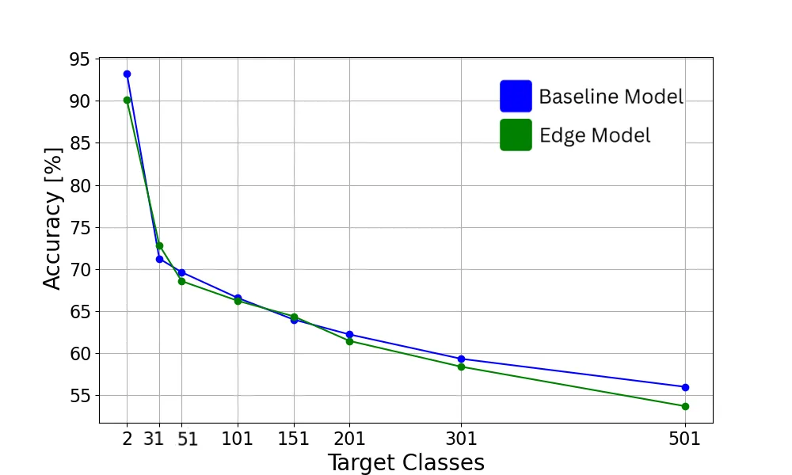

Figure 4: Validation accuracies for one baseline and one edge model per
number of target classes.

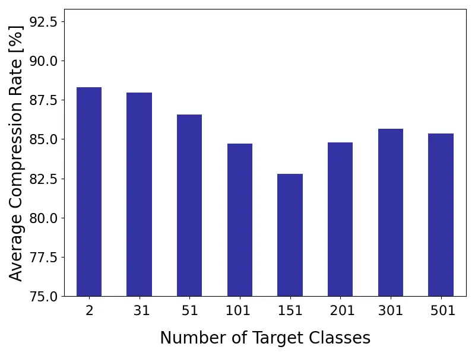

Figure 5: Average overall compression rate for all Pareto optimal trials
per number of target classes regarding the reduction in RAM, ROMand
FLOPs.

To assess the general performance of the models, one baseline and one
representative edge model per target class number were selected
according to the rank defined in Eq. 3. Their validation accuracies are
shown in Fig. 4.

Overall, validation accuracy declines as the number of target classes
increases. While the models achieve high accuracy values for lower
target class numbers, performance is more moderate with more target
classes. Notably, there is almost no accuracy loss due to compression,
as the accuracies of the baseline and edge models remain within a very
similar range.

To assess target class influence on compressibility, the average
compression rate was computed across different target class numbers and
is shown in Fig. 5. The results indicate a slight decline in
compressibility with increasing class numbers. From 201 classes onward,
however, this trend reverses, with compressibility improving for larger
class counts. This result is unexpected, as a larger number of target
classes would hypothetically require more complex architectures with
higher memory and FLOPsdemands, thereby reducing compressibility. While
this trend is observed up to a certain point, it appears to reverse for
larger class counts. Since the training and compression procedures are
essentially a black box, a definitive explanation is difficult.
Nonetheless, several factors may contribute: with more classes, models
may exploit feature sharing more effectively, capturing overlapping
features with fewer parameters \[28\]. Moreover, the inclusion of
additional classes may encourage the learning of more generalized and
compact representations, ultimately reducing resource requirements
\[29\]. However, the observed decrease and subsequent increase in
compressibility are subtle, with compression rates ranging only between
approximately $`82\text{\,}\mathrm{\%}`$ and $`88\text{\,}\mathrm{\%}`$
and thus may not reflect a clear or consistent trend.

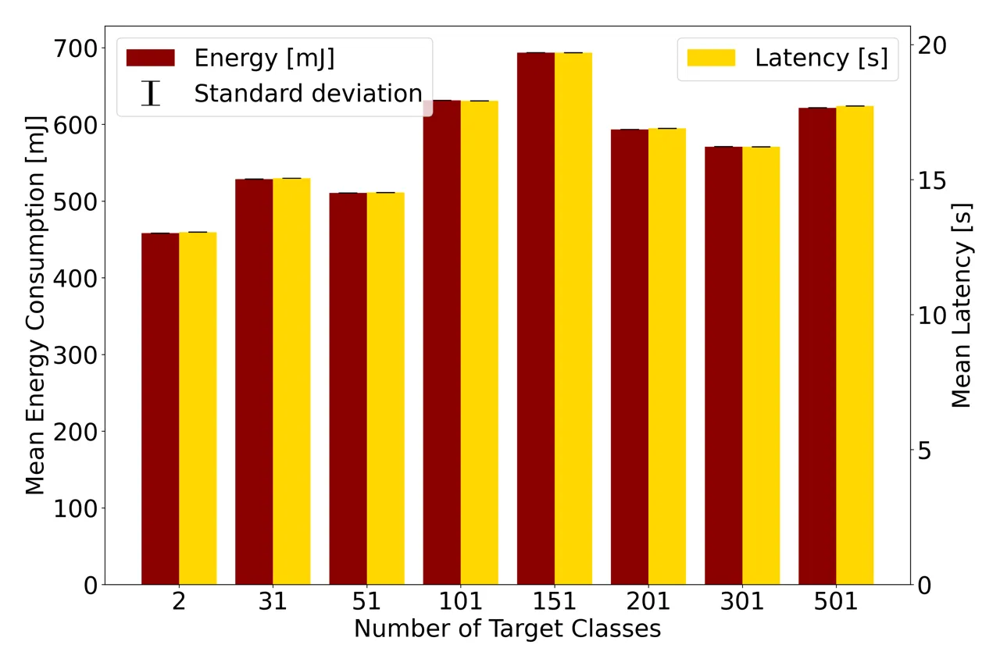

(a) ARM Cortex-M4

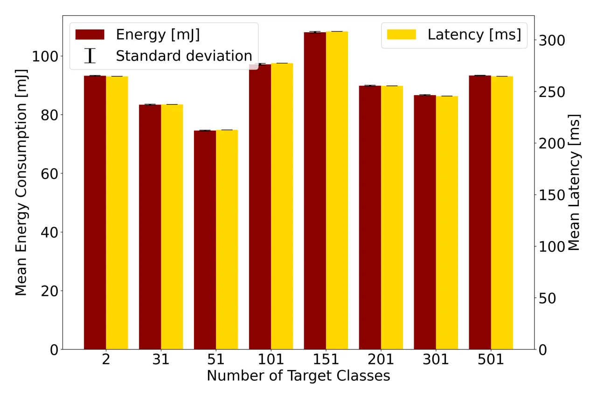

(b) ARM Cortex-M7

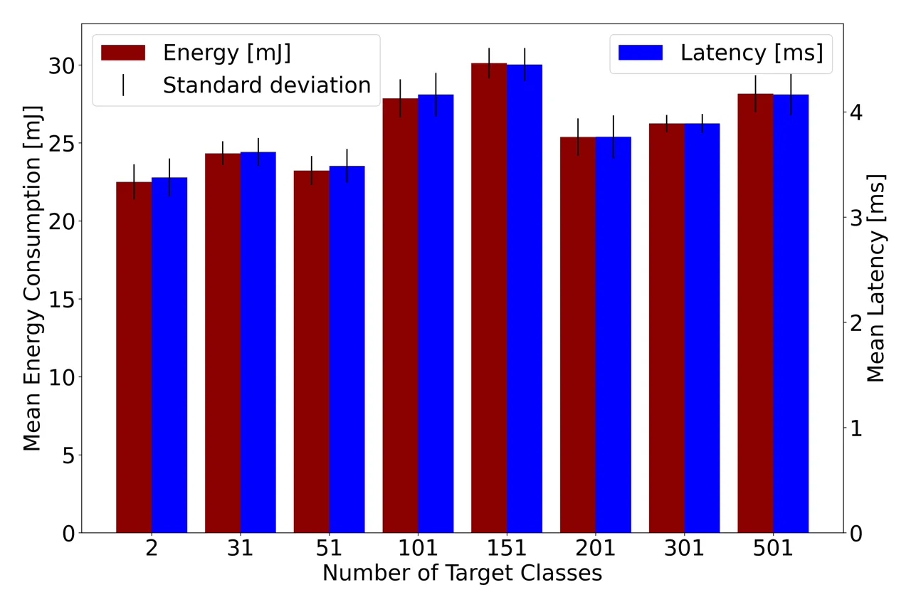

(c) Raspberry Pi 4

Figure 6: Average energy consumption and latency of one inference step
of the best ranked model for each number of target classes.

To evaluate the feasibility of deploying the compressed models on an
MCU, energy consumption and latency were measured for one model per
number of target classes, selected according to the ranking in Eq. 3.
The results are shown in Fig. 6. Overall, both latency and energy
consumption increase with a growing number of target classes, though the
improved compressibility of models with more than 151 classes is
partially reflected in lower values for these metrics. Because both
energy consumption and latency are largely determined by the number of
FLOPsperformed during inference, they are only indirectly related to
compressibility. Since model selection accounted for FLOPs, ROM, and
RAM, cases arise where a model with more FLOPsthan its successor was
chosen due to lower memory requirements. This explains, for example, why
the 31-class model consumes more energy than the 51-class model.
Finally, the benchmarking results indicate that the compressed models
achieve energy and latency values suitable for real-world deployment on
the _ARM Cortex-M7_ and _Raspberry Pi 4_. In contrast, on the more
resource-constrained _ARM Cortex-M4_, latency consistently exceeded the
audio chunk length, making real-world deployment infeasible.

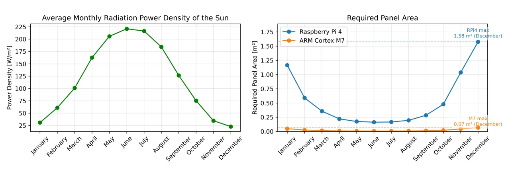

Figure 7: Average power density of the sun’s radiation in Germany \[30\]
(left) and the resulting area of the solar panel for each month (right).

For the evaluation of energy-autonomous devices, we selected the model
with 31 classes as an example. We measured an energy consumption of
$`83\text{\,}\mathrm{mJ}`$ and a latency of $`237\text{\,}\mathrm{ms}`$
for the inference and $`55\text{\,}\mathrm{mJ}`$ and
$`170\text{\,}\mathrm{ms}`$ for the spectrogram generation on the _ARM
Cortex M7_. This results in an average power draw of
$`339\text{\,}\mathrm{mW}`$. During sleep, we measured a power
consumption of $`116\text{\,}\mathrm{mW}`$, resulting in average power
consumption of $`138.3\text{\,}\mathrm{mW}`$ during the course of the
day. Overall, this leads to a required battery capacity of
$`6.6\text{\,}\mathrm{Wh}`$.

For the _Raspberry Pi 4_, we measured $`24.3\text{\,}\mathrm{mJ}`$ and
$`3.6\text{\,}\mathrm{ms}`$ for the inference and
$`483.0\text{\,}\mathrm{mJ}`$ and $`80.9\text{\,}\mathrm{ms}`$ for the
mel-spectrogram generation, leading to an average power of
$`6.0\text{\,}\mathrm{W}`$. During idle, we measured a power consumption
of $`2.93\text{\,}\mathrm{W}`$, resulting in an average power of
$`3.24\text{\,}\mathrm{W}`$. In total, this would result in a required
battery capacity of $`155.5\text{\,}\mathrm{Wh}`$.

Based on these values, the required size of the solar panel can be
calculated as described in Eq. 5. During December, the sun has the
lowest power density of
$`22.8\text{\,}\frac{\mathrm{W}}{{\mathrm{m}}^{2}}`$ as shown in Fig. 7.
With a required charging power of $`275\text{\,}\mathrm{mW}`$, this
results in a required panel area of $`0.067\text{\,}{\mathrm{m}}^{2}`$
for the _ARM Cortex M7_. The _Raspberry Pi_ requires a charging power of
$`6.48\text{\,}\mathrm{W}`$ and therefore a panel size of
$`1.58\text{\,}{\mathrm{m}}^{2}`$.

## 4 Conclusion

Avian species identification is a challenging task, with model accuracy
generally decreasing as the number of target classes increases. This is
partly due to the heterogeneity of the dataset and the use of a single,
relatively simple model architecture across all class numbers, which
reflects realistic conditions for edge deployment and was necessary to
facilitate comparability of compressibility across different target
class numbers.

Our results demonstrate that high compression rates are achievable with
minimal loss of accuracy across different numbers of target classes.
Although compressibility initially decreased with increasing class
numbers and later increased beyond 151 classes, the overall variation is
minor and does not necessarily suggest a clear trend. Instead, it
reflects the complex interplay between task complexity, model
architecture, and learned representations. The evaluation of energy
consumption and latency shows that real-world deployment is feasible on
the _Raspberry Pi 4_ and on the _ARM Cortex-M7_, but not on the more
constrained _ARM Cortex-M4_, emphasizing the importance of selecting
appropriate hardware for edge applications.

Overall, we showed that neural network compression is a practical and
effective strategy for edge-based avian monitoring, even for large
numbers of target classes. Finally, our results indicate that avian
monitoring is feasible on energy-autonomous edge devices which could
play a crucial role in wildlife monitoring and biodiversity
conservation.

Future work could include curating a scientific dataset, exploring
different species arrangements in the training data, comparing
alternative compression frameworks, and investigating end-to-end audio
models to reduce pre-processing overhead. Furthermore, real-life
deployment will require additional functionalities, such as counting,
data storage, and energy management, potentially combining edge AIwith
automated data collection technologies.

## Acknowledgment

This work is part of the GreenICT@FMD project and is funded by the
German Federal Ministry for Research, Technology and Space (BMFTR)
(grant number 16ME0491K).

## References

- \[1\] V. Singh, S. Shukla, and A. Singh, “The principal factors
  responsible for biodiversity loss,” _Open Journal of Plant Science_,
  vol. 6, no. 1, pp. 011–014, 2021.
- \[2\] M. S. Habibullah, B. H. Din, S.-H. Tan, and H. Zahid, “Impact of
  climate change on biodiversity loss: global evidence,” _Environmental
  Science and Pollution Research_, vol. 29, no. 1, pp. 1073–1086, 2022,
  publisher: Springer.
- \[3\] R. E. Almond, M. Grooten, and T. Peterson, _Living Planet Report
  2020-Bending the curve of biodiversity loss_. World Wildlife
  Fund, 2020.
- \[4\] D. Schmeller, K. Henle, A. Loyau, A. Besnard, and P.-Y. Henry,
  “Bird-monitoring in Europe–a first overview of practices, motivations
  and aims,” _Nature Conservation_, vol. 2, pp. 41–57, 2012, publisher:
  Pensoft Publishers.
- \[5\] J. Shonfield and E. M. Bayne, “Autonomous recording units in
  avian ecological research: current use and future applications.”
  _Avian Conservation & Ecology_, vol. 12, no. 1, 2017.
- \[6\] S. Mekonen, “Birds as biodiversity and environmental indicator,”
  _Indicator_, vol. 7, no. 21, 2017.
- \[7\] Ç. H. Şekercioğlu, “Promoting community-based bird monitoring in
  the tropics: Conservation, research, environmental education,
  capacity-building, and local incomes,” _Biological Conservation_, vol.
  151, no. 1, pp. 69–73, 2012, publisher: Elsevier.
- \[8\] V. Cavarzere, G. P. Moraes, J. J. Roper, L. F. Silveira, and
  R. J. Donatelli, “Recommendations for monitoring avian populations
  with point counts: a case study in southeastern Brazil,” _Papéis
  Avulsos de Zoologia_, vol. 53, pp. 439–449, 2013, publisher: SciELO
  Brasil.
- \[9\] M. A. Etterson, G. J. Niemi, and N. P. Danz, “Estimating the
  effects of detection heterogeneity and overdispersion on trends
  estimated from avian point counts,” _Ecological Applications_,
  vol. 19, no. 8, pp. 2049–2066, 2009, publisher: Wiley Online Library.
- \[10\] J. P. Brewster and T. R. Simons, “Testing the importance of
  auditory detections in avian point counts,” _Journal of field
  ornithology_, vol. 80, no. 2, pp. 178–182, 2009, publisher: Wiley
  Online Library.
- \[11\] S. Kahl, C. M. Wood, M. Eibl, and H. Klinck, “BirdNET: A deep
  learning solution for avian diversity monitoring,” _Ecological
  Informatics_, vol. 61, p. 101236, 2021, publisher: Elsevier.
- \[12\] C. Pérez-Granados and J. Traba, “Estimating bird density using
  passive acoustic monitoring: a review of methods and suggestions for
  further research,” _Ibis_, vol. 163, no. 3, pp. 765–783, 2021,
  publisher: Wiley Online Library.
- \[13\] I. Molina-Mora, V. Ruíz-Gutierrez, Á. Vega-Hidalgo, and
  L. Sandoval, “The utility of passive acoustic monitoring for using
  birds as indicators of sustainable agricultural management practices,”
  _Frontiers in Bird Science_, vol. 3, p. 1386759, 2024, publisher:
  Frontiers Media SA.
- \[14\] B. J. Furnas, “Rapid and varied responses of songbirds to
  climate change in California coniferous forests,” _Biological
  Conservation_, vol. 241, p. 108347, 2020, publisher: Elsevier.
- \[15\] I. Potamitis, S. Ntalampiras, O. Jahn, and K. Riede, “Automatic
  bird sound detection in long real-field recordings: Applications and
  tools,” _Applied Acoustics_, vol. 80, pp. 1–9, 2014, publisher:
  Elsevier.
- \[16\] E. Znidersic, M. Towsey, W. K. Roy, S. E. Darling,
  A. Truskinger, P. Roe, and D. M. Watson, “Using visualization and
  machine learning methods to monitor low detectability species—The
  least bittern as a case study,” _Ecological Informatics_, vol. 55, p.
  101014, 2020, publisher: Elsevier.
- \[17\] B. Sudharsan, J. G. Breslin, and M. I. Ali, “Ml-mcu: A
  framework to train ml classifiers on mcu-based iot edge devices,”
  _IEEE Internet of Things Journal_, vol. 9, no. 16, pp. 15 007–15 017,
  2021, publisher: IEEE.
- \[18\] B. Planqué, W.-P. Vellinga, S. Pieterse, and J. Jongsma,
  “Xeno-canto: sharing bird sounds from around the world,” _Available:
  www. xeno-canto. org_, 2005.
- \[19\] K. J. Piczak, “ESC: Dataset for environmental sound
  classification,” in _Proceedings of the 23rd ACM international
  conference on Multimedia_, 2015, pp. 1015–1018.
- \[20\] M. S. S. Kahl, “Identifying birds by sound: large-scale
  acoustic event recognition for avian activity monitoring,” Ph.D.
  dissertation, Chemnitz University of Technology, 2019.
- \[21\] D. S. Park, W. Chan, Y. Zhang, C.-C. Chiu, B. Zoph, E. D.
  Cubuk, and Q. V. Le, “Specaugment: A simple data augmentation method
  for automatic speech recognition,” _arXiv preprint
  arXiv:1904.08779_, 2019.
- \[22\] J. Lin, W.-M. Chen, Y. Lin, C. Gan, S. Han, and others,
  “Mcunet: Tiny deep learning on iot devices,” _Advances in neural
  information processing systems_, vol. 33, pp. 11 711–11 722, 2020.
- \[23\] M. Sandler, A. Howard, M. Zhu, A. Zhmoginov, and L.-C. Chen,
  “Mobilenetv2: Inverted residuals and linear bottlenecks,” in
  _Proceedings of the IEEE conference on computer vision and pattern
  recognition_, 2018, pp. 4510–4520.
- \[24\] J. Deng, W. Dong, R. Socher, L.-J. Li, K. Li, and L. Fei-Fei,
  “Imagenet: A large-scale hierarchical image database,” in _2009 IEEE
  conference on computer vision and pattern recognition_. Ieee, 2009,
  pp. 248–255.
- \[25\] M. Deutel, G. Kontes, C. Mutschler, and J. Teich, “Combining
  multi-objective bayesian optimization with reinforcement learning for
  tinyml,” _ACM Transactions on Evolutionary Learning_, vol. 5, no. 3,
  pp. 1–21, 2025.
- \[26\] M. Deutel, P. Woller, C. Mutschler, and J. Teich,
  “Energy-efficient Deployment of Deep Learning Applications on Cortex-M
  based Microcontrollers using Deep Compression,” in _MBMV 2023; 26th
  Workshop_. VDE, 2023, pp. 1–12.
- \[27\] O. R. developers, “Onnx runtime,”
  [https://onnxruntime.ai/](https://onnxruntime.ai/), 2021.
- \[28\] G. Liu, H. Zeng, and D. K. Gifford, “Visualizing complex
  feature interactions and feature sharing in genomic deep neural
  networks,” _BMC bioinformatics_, vol. 20, pp. 1–14, 2019, publisher:
  Springer.
- \[29\] F. Zhu, X.-Y. Zhang, R.-Q. Wang, and C.-L. Liu, “Learning by
  seeing more classes,” _IEEE Transactions on Pattern Analysis and
  Machine Intelligence_, vol. 45, no. 6, pp. 7477–7493, 2022, publisher:
  IEEE.
- \[30\] Deutscher Wetterdienst, “Global radiation in germany,”
  [https://www.dwd.de/EN/ourservices/solarenergy/maps_globalradiation_mvs.html](https://www.dwd.de/EN/ourservices/solarenergy/maps_globalradiation_mvs.html).
