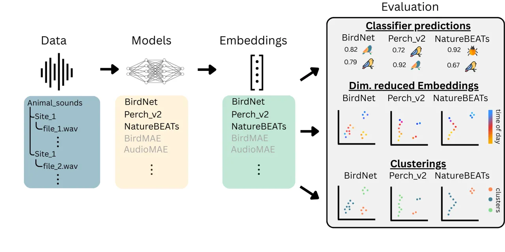
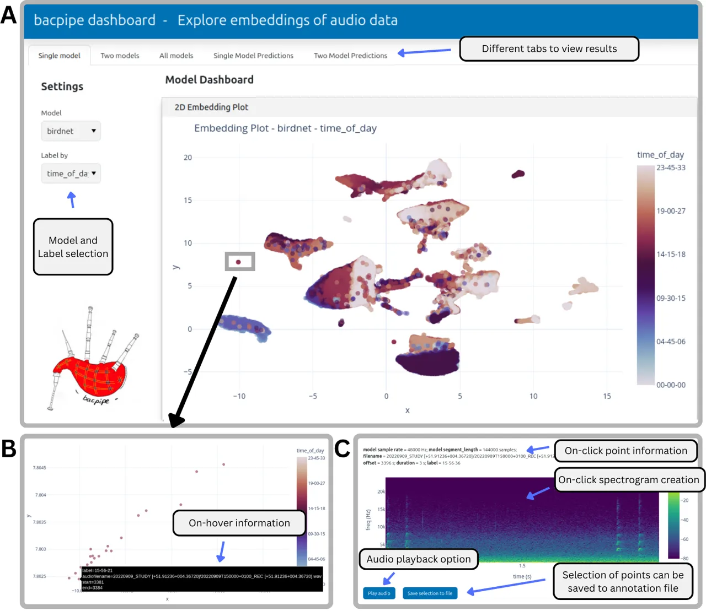
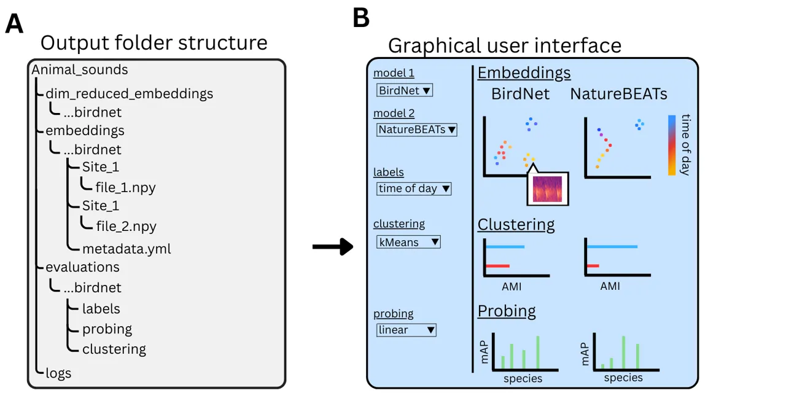
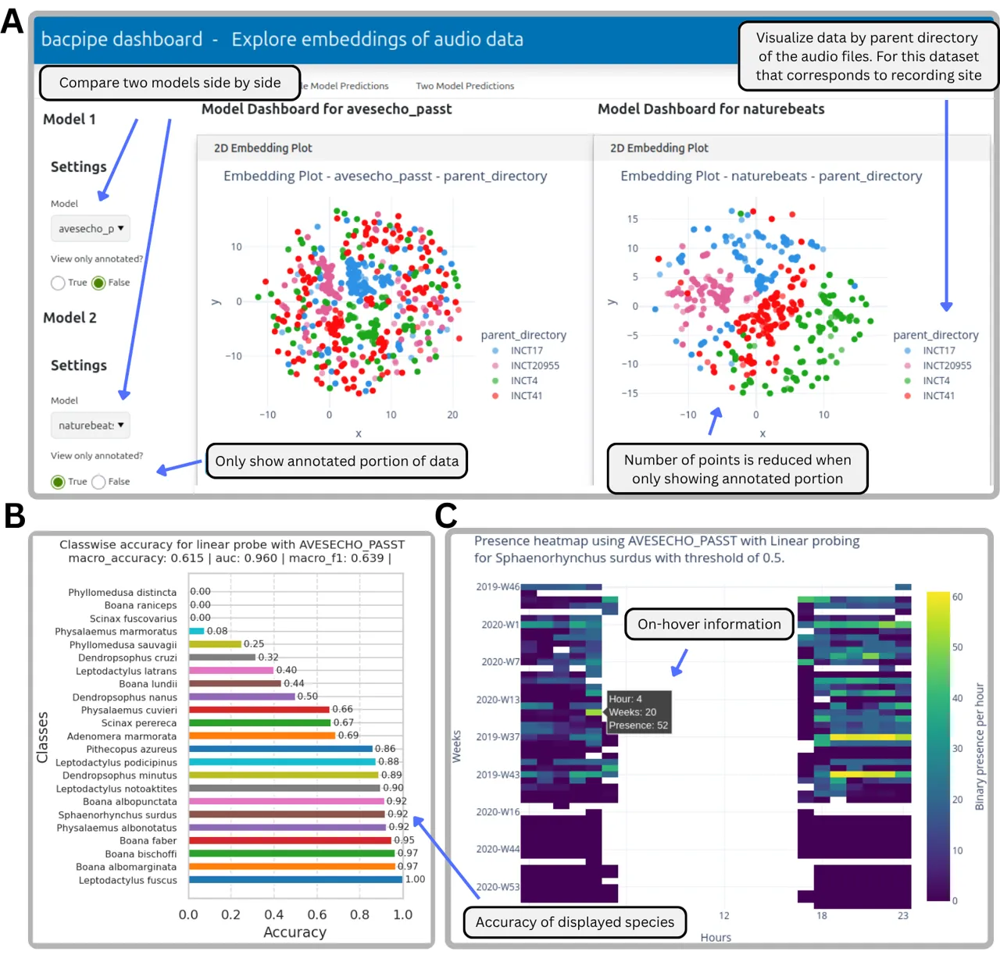

\papertype

Application \corraddressVincent S. Kather
\corremailvincent.kather@naturalis.nl \fundinginfoSupported by Marie
Skłodowska-Curie Action Bioacoustic AI,grant agreement No 101116715

# bacpipe: a Python package to make bioacoustic deep learning models accessible

Vincent S. Kather Affiliation: Naturalis Biodiversity Center, Leiden,
The Netherlands    Sylvain Haupert Affiliation: Muséum Nationale
d’Histoire Naturelle, Paris, France    Burooj Ghani
Affiliation: Naturalis Biodiversity Center, Leiden, The Netherlands   
Dan Stowell Affiliation: Naturalis Biodiversity Center, Leiden, The
Netherlands Affiliation: Department of Intelligent Systems, Tilburg
University, Tilburg, The Netherlands

###### Abstract

1.  1.  Natural sounds have been recorded for millions of hours over the
        previous decades using passive acoustic monitoring. Improvements in
        deep learning models have vastly accelerated the analysis of large
        portions of this data. While new models advance the
        state-of-the-art, accessing them using tools to harness their full
        potential is not always straightforward.
2.  2.  Here we present bacpipe, a collection of bioacoustic deep learning
        models and evaluation pipelines accessible through a graphical and
        programming interface, designed for both ecologists and computer
        scientists.
3.  3.  Bacpipe streamlines the usage of state-of-the-art models on custom
        audio datasets, generating acoustic feature vectors (embeddings) and
        classifier predictions. A modular design allows evaluation and
        benchmarking of models through interactive visualizations,
        clustering and probing.
4.  4.  We believe that access to new deep learning models is important. By
        designing bacpipe to target a wide audience, researchers will be
        enabled to answer new ecological and evolutionary questions in
        bioacoustics.

###### keywords

bioacoustics, ecoacoustics, biodiversity monitoring, PAM, deep learning,
embeddings, clustering

## 1 Introduction

In bioacoustics, recordings of natural soundscapes span massive spatial
and temporal scales \[51\] , the analysis of which has for a long time
relied on automated processing for animal species detection \[3\] and
soundscape characterization \[44\]¹¹ 1
[https://github.com/bioacoustic-ai/bioacoustics-datasets](https://github.com/bioacoustic-ai/bioacoustics-datasets).
Bioacoustic recordings are evaluated to study evolutionary and
ecological phenomena, i.e. animal behaviour \[46\], interaction with
environments \[38, 8\], sound production \[39\] and more. Data is
commonly gathered using passive acoustic monitoring (PAM) setups \[23,
4, 45\]. Studying changes of phenomena in large datasets was previously
restricted to portions of datasets that were annotated manually by
bioacousticians listening to recordings \[45\]. This precise study of
recordings is a time-consuming practice, that therefore limits the
amount of data that can be processed \[23, 45\]. In recent years, the
rapid advance of deep learning in terrestrial, freshwater and marine
bioacoustics has opened up the opportunity to develop tools to process
and organize large acoustic datasets which has vastly improved automated
species detection \[43\].

New bioacoustic deep learning models (see Glossary) are trained and
released at increasing rates \[43, 37, 25\]. At the same time, means to
compare and use models are often limited by how well their respective
code is maintained. Computing acoustic indices and unsupervised
classification of soundscapes have been made accessible through numerous
Python software packages, e.g. for acoustic indices, scikit-maad \[47\]
and for unsupervised classification, bambird \[24\], open soundscape
\[21\], soundscape explorer \[41\] and pykanto \[32\]. This
accessibility is lacking for bioacoustic deep learning models making it
hard for users to switch and compare between models. Recent reviews
\[25, 37, 50\] give some guidance about model capabilities. However,
reproducing these results and comparing between models remains
cumbersome. For example, BirdNET, a model trained on a large corpus of
bird vocalizations, is available with a graphical user interface (GUI)
tool, making it accessible which explains its widespread use \[18, 30\].
As the field of computational bioacoustics is an interdisciplinary field
with researchers coming from varying degrees of ecological/computational
backgrounds, the accessibility of newly developed methods to researchers
with different skill sets, directly impacts if these methods get
included in ecological workflows or not.

Deep learning models compute rich, high-dimensional embeddings for any
given input. Embeddings can then be used for classification tasks, e.g.
providing predictions on species presence. Recent studies show that
while models are trained to classify specific species, using these
models to organize large acoustic datasets based on the extracted
embeddings offers up a plethora of opportunities for other bioacoustic
applications \[10, 11, 2, 25\]. Furthermore, using deep learning
embeddings rather than model predictions provides a continuous space
where all data is represented rather than relying on model predictions
to filter datasets. Models are being trained on broader datasets, going
from bird-focused training sets like BIRB \[14\] and the annotated bird
recordings on the citizen science platform xeno-canto \[54\] to
incorporate more species groups like amphibians \[5\], mammals \[36\]
and insects \[6\]. Models trained on general audio are also being
trained for bioacoustic datasets \[37, 25\]. Yet, at this point, clear
tendencies on what models to use for an acoustic environment are
inconclusive and require researchers to have the tools to test and
compare models in order to identify the best method for their research
needs.

Here, we present bacpipe (bioacoustic collection pipeline), a Python
software package to facilitate the use of state-of-the-art bioacoustic
deep learning models. By centering bacpipe on extracting acoustic
representations using deep learning models (generating embeddings),
large acoustic datasets can be structured and investigated without
limiting the models to their classifier predictions. Thereby generating
embeddings for a variety of models can be incorporated into existing
workflows and models can be compared. As a stand-alone software, bacpipe
provides interactive visualizations of acoustic representations
(embeddings) from different models in a dashboard GUI enabling users to
explore large datasets and benefit from the structuring capabilities of
state-of-the-art deep learning models. As an add-on, the package comes
with a variety of evaluation tools enabling researchers to probe model
performance on their own data. Bacpipe is built in a modular design
ensuring that with further development, new deep learning models can be
easily included. In the following we will describe how bacpipe enables
researchers to

1.  1.  process large PAM datasets with a variety of state-of-the-art deep
        learning models,
2.  2.  interactively explore acoustic representations visually and aurally,
3.  3.  extract classifier predictions from a variety of models and
4.  4.  use bacpipe to evaluate models on alternative bioacoustic tasks.

## 2 Basic workflow

Bacpipe can be used via its API or as a stand-alone software. The user
can therefore decide which of bacpipe’s processing steps to run.
Figure 1 shows a schematic overview of these processing steps. In the
following section the package concept and workflow will be explained in
more detail.

{biography}

Glossary  
Key vocabulary used in this manuscript with their specific meaning in
the field of computational bioacoustics.

Deep learning model: Deep neural network machine learning model based on
(for example) convolutional neural network (CNN) or transformer
architecture and in this manuscript trained using acoustic recordings.
Deep learning models usually consist of feature extractors and
classifiers, the former of which is used to generate embeddings. In this
manuscript deep learning model refers to the feature extraction part of
the model.

Embeddings: High-dimensional feature vectors created by deep learning
models based on a section of audio.

Embedding space: High-dimensional vector space containing embeddings of
a model. Dimensionality reduction tools can be used to visualize these
spaces.

Classification: Class predictions are generated by the deep learning
model by first computing an embedding and subsequently mapping that
embedding onto a list of classes.

Benchmarking: Evaluation of deep learning models including their
pretrained classifiers.

Clustering: Unsupervised algorithm that organizes the embeddings into
clusters, used here to evaluate deep learning models.

Probing: Supervised algorithm used to evaluate deep learning models by
fitting a classifier on top of the model.

Linear probing: Training a linear classifier consisting of a single
fully connected layer.

kNN probing: Fitting a (parameter-free) k nearest neighbours classifier.
Using a fraction of the data to fit the classifier and using it to
classify the remainder.

### 2.1 Design philosophy

Figure 1: Processing workflow of bacpipe. From left to right, audio data
(Data) is passed into deep neural networks (Models), which generate
acoustic feature vectors (Embeddings). Embeddings are then used for a
number of tasks which are applied to all selected models for
comparability (Evaluation). Evaluation outputs are saved to a
standardized folder structure (see Fig. 3). By default, evaluations
include classification (outputs produce lists of predicted species),
dimensionality reduction, (used for visualizations) and clustering (used
to measure shared mutual information), but can be expanded for other
tasks.

Bacpipe is designed to target two audiences: 1. experienced listeners
with expertise in ecology and bioacoustics and perhaps little experience
with Python and 2. experienced deep learning researchers working in
bioacoustics with Python experience. To address both audiences, bacpipe
is available as a fully functional and well documented stand-alone
GitHub repository²² 2
[https://github.com/bioacoustic-ai/bacpipe](https://github.com/bioacoustic-ai/bacpipe)
and as a pip (PiPy) package. Once started, bacpipe processes files based
on user-defined configurations and visualizes results in an interactive
GUI dashboard (see Section 3). Alternatively, bacpipe’s embedding
generation or evaluation modules can be used via its API and integrated
into existing workflows (see Section 4). Loading and processing audio
has been developed to work both on the CPUs of laptop computers and GPUs
of computers or servers. In terms of processing, bacpipe is centred
around the computation of embeddings with a large variety of bioacoustic
models, as can be seen for sections the Data, Models and Embeddings in
Figure 1. Add-on features to evaluate embedding spaces, like linear
probing, clustering and visualization are included in the package (see
Section 2.5). Furthermore, benchmarking of multi-label classifier
predictions is possible. Accessibility and modularity are the core
design principles of bacpipe to enable all researchers and practitioners
to access the state-of-the-art deep learning models for their
bioacoustic dataset. The models included in the package can be seen in
Table 1.

### 2.2 Simple starting-point

To run bacpipe, the user has to specify the source path to the audio
files and which models to run. All further configurations are optional.
These configurations are specified in the bacpipe/config.yaml file or,
when using the API, using bacpipe.config . More fine-grained settings
(like to run the computation on a GPU rather than the default CPU) can
be modified in the bacpipe/settings.yaml file (or the attribute for
API). Once bacpipe gets started, all data is processed and a dashboard
visualization is started in a browser window with a GUI, allowing the
user to interact and explore the results of their processing (see
Section 3). For each execution, configurations are saved with a
corresponding timestamp, ensuring that users can go back and reproduce
previous experiments. This interaction and both visual and auditory
exploration of the processed data makes the analysis accessible for all
audiences. Figure 2 shows an example case study using a large unlabeled
dataset where only the dataset path and model name were specified.

Structurally, the package is made up of three subpackages: core,
model_pipelines and embedding_evaluation. The subpackages handle audio
loading and preparing inference (core), loading and executing the
respective models (model_pipelines) and evaluating the generated
embeddings through linear probing, classification and visualization
(embedding_evaluation). Upon execution, core checks to see if the
combination of input data and selected deep learning models already
exist. If this is the case, embedding_evaluation is used to load and
visualize the data within seconds rather than requiring to be computed
again. This also allows continuously growing datasets or prematurely
failed processing runs to be continued where left off, which is
practical when processing very large PAM datasets. Throughout the
processing, a (human-readable) metadata file (metadata.yml) is created
with detailed information within the corresponding embeddings folder.
All of these convenience features can be included or excluded in the API
(see Section 4).

Figure 2: A large unlabeled dataset from a noisy urban soundscape in the
Netherlands is visualized in different ways. A: Bacpipe dashboard view
of a 2d UMAP visualization of BirdNET embeddings from the entire
dataset. The embeddings ($`\approx 10^{5}`$) were processed from 104
recordings ($`\approx`$ 100 hrs of audio). Little boxes indicate what
purpose different sections of the dashboard serve. The points are
coloured by generated time-of-day timestamps. While the view of the
entire dataset (A) shows some structure, the grey rectangle corresponds
to the zoomed-in view (B). In C a spectrogram is shown visualizing the
audio data corresponding to a selected embedding point in B. Using the
inbuilt functions, a handful of unknown bird vocalizations could be
found and isolated, listened to and exported as a .csv file to isolate
them from the otherwise anthropogenic noise dominated soundscape.
Without any ground truth, these processing and interactive capabilities
make evaluating large noise-dominated datasets more feasible.

### 2.3 Reducing unnecessary recomputation

Bacpipe can be used on acoustic datasets of any folder structure or
commonly supported audio file format. When processing, bacpipe creates a
standardized folder structure where embeddings, reduced dimension
embeddings, classifier predictions, evaluations and metadata are saved.
The top level folder name corresponds to the name of the processed audio
dataset. The output folder structure can be seen in Figure 3A. Inside
it, the embeddings file structure mirrors the audio file structure,
meaning that for every audio file there is a corresponding embedding
file, this makes association easier for downstream analysis purposes.
The same is true for classifier predictions. The evaluation folder
contains classifier predictions, clustering results, generated labels
and more, which are used during for the dashboard GUI and which can also
be returned via the API (see Section 4). Saving these processed analyses
vastly reduces the computational time for future processing. Once
processing is complete, bacpipe no longer requires access to the audio
files, as returning embeddings, visualizing or evaluation is done using
the output files. By using a standardized output folder structure,
results can be transferred between devices enabling one researcher to
visualize the results that were processed by another (or to process on a
GPU cluster and analyse on a laptop).

High-dimensional embeddings are saved as Numpy array files (ending with
.npy) to reduce storage requirements, while reduced low-dimensional
embedding (by default, 2d-UMAP \[22\]) files are saved as human-readable
dictionary files (ending with .json). By default, classification
predictions are saved as annotation tables (one per audio file) in the
Raven \[29\] format as well as a combined annotations file for all
classifier predictions in the dataset.

| name           | clfier | training | architecture | dim  | trained on      | sr \[kHz\] | size \[$`10^{6}`$\] | ref.   |
| -------------- | ------ | -------- | ------------ | ---- | --------------- | ---------- | ------------------- | ------ |
| AudioMAE       | no     | ssl + ft | ViT          | 768  | general         | 16.0       | 86.0                | \[17\] |
| AudioProtoPNet | yes    | supl     | ConvNeXt     | 768  | birds           | 32.0       | 98.0                | \[15\] |
| AvesEcho       | yes    | supl     | PaSST        | 1024 | birds           | 32.0       | 86.3                | \[10\] |
| AVES           | no     | ssl + ft | HuBERT       | 768  | general, biotic | 16.0       | 94.2                | \[13\] |
| BEATs          | no     | ssl + ft | HuBERT       | 768  | general         | 16.0       | 91.0                | \[7\]  |
| BioLingual     | no     | supl     | CLAP         | 512  | animals, birds  | 48.0       | 190.0               | \[34\] |
| BirdAVES       | no     | ssl + ft | HuBERT       | 1024 | general, birds  | 16.0       | 316.0               | \[13\] |
| BirdMAE        | no     | ssl + ft | ViT          | 768  | general         | 32.0       | 300.0               | \[31\] |
| BirdNET        | yes    | supl     | EffNetB0     | 1024 | birds           | 48.0       | 12.8                | \[18\] |
| ConvNeXt_bs    | yes    | supl     | ConvNeXt     | 768  | birds           | 32.0       | 88.0                | \[37\] |
| Google_Whale   | yes    | supl     | EffNetB0     | 1280 | whales          | 24.0       | 5.0                 | \-     |
| HBdet          | yes    | supl     | ResNet50     | 1024 | hback. whales   | 2.0        | 23.0                | \[20\] |
| Insect459NET   | no     | supl     | EffNetv2s    | 1280 | insects         | 44.1       | 20.6                | \-     |
| Insect66NET    | no     | supl     | EffNetv2s    | 1280 | insects         | 44.1       | 20.5                | \-     |
| Mix2           | no     | supl     | MobileNetv3  | 960  | amphibians      | 16.0       | 3.0                 | \[26\] |
| NatureBEATs    | no     | ssl + ft | HuBERT       | 768  | all             | 16.0       | 90.7                | \[33\] |
| Perch_Bird     | yes    | supl     | EffNetB1     | 1280 | birds           | 32.0       | 7.8                 | \[9\]  |
| Perch_2        | yes    | supl     | EffNetB3     | 1536 | animals         | 32.0       | 12.0                | \[49\] |
| ProtoCLR       | no     | sup cl   | CvT-13       | 384  | birds           | 16.0       | 19.6                | \[27\] |
| RCL_FS_BSED    | no     | sup cl   | ResNet9      | 2048 | animals         | 22.0       | 7.2                 | \[28\] |
| SurfPerch      | yes    | supl     | EffNetB0     | 1280 | corals, birds   | 32.0       | 8.0                 | \[52\] |
| VGGish         | no     | supl     | VGG          | 128  | general         | 16.0       | 62.0                | \[16\] |

Table 1: List of models currently available in bacpipe. The column
headings correspond to the following: clfier lists if a classifier is
included for the model, training shows the training setup, i.e. ssl for
self-supervised learning, supl for supervised learning, sup cl for
supervised contrastive learning and ft for fine-tuning. architecture
lists the model backbone and dim shows the dimension of the embeddings.
trained on shows the model’s training data, sr lists the sample rate in
kHz, size shows the model size in millions of parameters and ref. lists
the respective publication.

Figure 3: Output folder structure (A) and graphical user interface (B)
of bacpipe. In A, the standardized folder structure is shown. This is
how the processed files are saved, showing that the saved embeddings
mirror the input structure from Figure 1. Furthermore, evaluations,
dimensionality reduced embeddings and processing logs are saved. In B,
the graphical interface that is produced by default is shown. The
interface enables evaluating the results in an accessible way.

### 2.4 Labels are inferred

Bioacoustic datasets often feature a nested folder structure based on
deployment sites and date. Using this information along with the
file-specific timestamps can be helpful to analyse species activity and
embedding structure in respect to spatial and temporal patterns. To make
use of this, bacpipe creates default labels based on this information.
At the point of writing the default labels that are automatically
generated, are "time_of_day", "day_of_year", "continuous_timestamp",
"parent_directory" and "audio_file_name". As different models use
different input lengths of audio, the default labels get mapped onto the
model-specific timestamps, thereby associating each embedding with a
default label. If ground truth annotations are provided, the labels are
read and also mapped onto the timestamps of models. This can be very
useful for benchmarking, evaluating clustering, visualizing or linear
probing.

### 2.5 Benchmarking, clustering and probing

Traditionally, deep learning models are evaluated using benchmarking, in
which classifier predictions are generated for a benchmarking dataset.
These benchmarking datasets must not be included in the training data.
Ideally, bioacoustic benchmarking datasets feature data from different
environments, so that the generalization capabilities of the models can
be tested. The resulting predictions are evaluated, for example using
mean average precision (mAP) and compared against the state-of-the-art
to showcase improvements. Common bioacoustic benchmarking datasets used
for this, are BEANS \[12\] for single label or BIRB for \[14\]
multi-label classifier performance. While bacpipe does not include any
datasets, it includes benchmarking capabilities. Users have to specify
the dataset name corresponding to the top level audio folder (see
Section 2.3) and the model they wish to evaluate. The (multi-label)
ground truth labels are mapped to the model-specific timestamps and
compared to the generated predictions using mAP.

To quantify a deep learning model’s ability to extract acoustic
features, recent research has moved beyond the traditional benchmarking
of classifier performance. Instead, to evaluate embedding spaces, new
classification heads are trained and evaluated on top of pretrained
models - this process is called probing (see glossary) \[1\]. In the
following probing refers to the process of training kNN or linear probes
on top of feature extractors, while classification refers to the use of
the integrated classification head which is part of a published deep
learning model. Recent studies have applied this practice to
bioacoustics, enabling them to compare models that were trained on
different species \[37, 25, 49, 19\]. Bacpipe includes both training
linear and kNN probes on top of processed embeddings. A linear probe is
a trainable single fully connected layer which can be useful to test the
global structure of the embeddings by trying to separate classes
linearly. A kNN probe on the other hand is a parameter-free classifier
based on (euclidean) distance, which emphasizes local structure by
testing if nearest neighbour associations are useful to separate
classes. These evaluation tasks do not require access to the models, as
they can be processed on the precomputed embeddings.

Another evaluation strategy supported by bacpipe is clustering. Past
studies have shown that KMeans clustering provides a fast and scalable
way to evaluate bioacoustic embedding spaces \[19\]. If the clustering
evaluation task is enabled, by default a KMeans clustering of the
embeddings (in their original high dimension) is computed. The
clustering is evaluated using adjusted mutual information (AMI) \[35\]
and adjusted rand index (ARI) \[42\] by comparing it to the
automatically generated default labels. Clustering can be computed
without ground truth annotations. However, if ground truth annotations
are provided, the clustering evaluations are also compared to it, and
are computed twice: once for the entire dataset, and once for only the
annotated portion of the dataset. This way embeddings corresponding to
vocalizations of specific species can be evaluated disregarding periods
of "noise".

If the probing evaluation task is enabled, bacpipe searches for a ground
truth annotations file (this file requires predefined column names:
"audiofilename", "start", "end", "label:species" (species can be
replaced) and its location needs to be specified in the settings). The
user has to simply specify which evaluation tasks to run in the
configuration file, and subsequently these evaluations can be
immediately computed for each of the selected models. Parameters for
these evaluations have default values and so can be computed
immediately, but can also be customized by referring to the settings
file. To train linear and kNN probes on the embeddings, the annotations
are split into train, validation and test. Results are evaluated per
label class and as a global average using mean average precision (see
Fig 4).

## 3 Graphical user interface

Bacpipe generates a browser-hosted graphical user interface based on the
Python package panel ³³ 3
[https://panel.holoviz.org/](https://panel.holoviz.org/). A schematic of
this is shown in Figure 3B. The interface shows different tabs, which
visualize the results in two strategies, 1. display model-specific
embedding spaces and 2. display model-specific heatmaps of classifier
predictions. For each visualization there are tabs showing the
performance for 1. a single model and 2. a side-by-side comparison of
two models. For the embedding visualizations there is an additional
overview of all models. In the following the visualization strategies
are explained in detail. Figures 2 and 4 show two case studies using the
graphical user interface.

### 3.1 Explore visually and aurally

While deep learning models enable the processing of vast amounts of
audio data, the interpretability of their output can be limited.
Classification performance of models is steadily increasing, yet, many
species of interest are not well represented in datasets (or not
represented at all), leading to classifier predictions being irrelevant
for a given research project. Beyond classifier predictions, it is also
possible to visualize embeddings produced by deep learning models using
dimensionality reduction techniques (see Section 4.1). The vast amounts
of embeddings show emerging structures and clusters that, when overlaid
with labels reveal patterns how data is organized by models (for more
information on labels see Section 2.3). This way, visualizations of
embeddings can be colour-coded with automatically extracted default
labels like timestamps, as well as computed clusters or (if provided)
ground truth labels. Side-by-side comparisons of models make differences
apparent and enable users to decide based on their study species or
noise environment which model is best suited. For ecoacoustics this
comparison can be helpful to investigate how differences between
soundscapes relate to differences in space, time or habitat
characteristics.

Low dimensional (2 or 3-dimensional) UMAP (or t-SNE) embeddings have the
benefit that they can be visualized. However, without the ability to
link the embeddings back to the underlying audio source, evaluations are
limited to qualitative differences in appearance \[22\]. We therefore
provide interactive visualizations based on the Python package plotly
\[40\], which displays a spectrogram of the audio when clicking on an
embedding point. The spectrograms audio can also be played back. This
connects the high level deep learning embeddings back to its source and
enables an intuitive exploration of audio data whilst benefiting from
the structuring and processing capabilities of deep learning. As the
spectrograms are generated in real-time, access to the original audio
data is required. The visualized audio is resampled to the
model-specific sample rate, which provides visual feedback on what
portion of the spectrogram the embedding corresponds to. Figure 2 shows
a case study in which embeddings and spectrogram visualizations were
used to isolate bird vocalizations in a large unlabeled dataset.

By using plotly, users can zoom and pan in the embedding space. For PAM
datasets spanning years of data, this is essential, as the large number
of embeddings contain complex structures and substructures that only
become apparent when narrowing in on small sections. A selection tool
can be used to choose a number of points in the embedding space, which
can then be exported as annotations to a csv file. This can be useful
for the task of annotating or investigating segments with similar
acoustic characteristics.

### 3.2 Visualize clustering and probing metrics

Aside from embeddings, the clustering and probing performance metrics
are displayed (if enabled in config file). The clustering results show
AMI and ARI values, quantifying the overlap of the calculated clusters
with the specified label. The overlap between the clusters and the
automatically generated labels is an indication if the model is
structuring the data according to diurnal, seasonal or habitat-based
patterns. If ground truth data is provided, the clustering is also
computed between the default labels and the ground truth. This can be
insightful to quantify the overlap between the ground truth labels and
automatically generated labels to show that the presence of classes
coincides with diurnal, seasonal or habitat-based patterns. Figure 4 A
shows a side-by-side comparison of two models, in which points are
labeled by the parent directory. If the parent directory corresponds to
the location site, the overlaps between the site and the ground truth
can be quantified, which can indicate that species only vocalize in
specific places and that the model’s embeddings are organized similarly.

If probing is enabled in the configurations, kNN and linear probes are
trained on the provided ground truth annotations (as described in
Section 2.5). The results of the probing are shown as bar plots. Users
can switch between kNN and linear probes to see the respective results.
For each label class, the accuracy values are displayed. Using the
probing evaluation, users can see how well a model’s embeddings can be
classified into the annotated species using both kNN and linear probing.
Figure 4 B shows the class-wise performance of the AvesEcho_Passt model
using linear probing on the AnuraSet dataset.

For both the clustering and the classification, overall performance is
displayed in the all_models tab.

Figure 4: Case study of a large annotated dataset using AnuraSet which
consists of recordings from the Amazonian rainforest \[5\]. In A a
bacpipe dashboard is shown with a side-by-side comparison of 2d UMAP
visualizations of embeddings generated using two different models:
AvesEcho_Passt \[11\] and NatureBEATs \[33\]. Little boxes indicate what
purpose different sections of the dashboard serve. The points are
coloured by the parent directory of the audio file they were processed
from, which corresponds to the recording site. The embedding plot for
NatureBEATs shows fewer points, as only the annotated portion of the
dataset was chosen to be displayed. For B the model was retrained using
the probing procedure (see Section 2.5) on species which were annotated
in the AnuraSet dataset. With the linear probe, the model is now able to
classify frog species and the results of the class-wise performance are
shown in a bar plot. In C an automatically generated presence heatmap is
shown of the frog species Sphaenorhynchus surdus using the model
AvesEcho_Passt with the trained linear probe. These heatmaps can be
generated for all species present in the annotations. This workflow
demonstrates that bacpipe can be used to retrain models on classes they
were not originally trained on and visualize species presence
immediately.

### 3.3 Classification and probing heatmaps

While generating embeddings, by default bacpipe also generates
classifier predictions using the model provided classifier. These
predictions are saved as Raven style annotations (see Section 2.3). The
generated predictions are displayed in the dashboard of bacpipe as an
activity heatmap. The heatmap is generated to show the dates on the y-
and the hours on the x-axis and colour-coded by the number of
occurrences. Users can choose between species from a drop-down menu and
thereby visualize the activity for each species found within the
dataset.

As discussed in Section 2.5, probing can be applied to classify the
embeddings. In this case the previously trained linear probe is loaded
and used to classify the precomputed embeddings. This way a classifier
for a new task (e.g. different species group, individual identification)
is trained and can be used to generate predictions. For models that do
not provide classification layers (see Table 1), this provides an
opportunity to generate classifier predictions. The results of this
classification can also be displayed in the same way as the pretrained
classifiers. Figure 4 C shows a species presence heatmap which was
generated using a linear probe trained on the model AvesEcho_Passt using
frog vocalizations annotated in the AnuraSet dataset \[5\].

## 4 Developer section

For users that look to integrate bacpipe into their existing bioacoustic
pipelines, an API is provided. This API features the same modules and
functions as described in Section 2. In the following section, the API
will be described in more detail. For more information see the
documentation ⁴⁴ 4
[https://bacpipe.readthedocs.io/en/latest](https://bacpipe.readthedocs.io/en/latest).

### 4.1 Extending bacpipe

The aim of bacpipe is to streamline the processing of audio recordings
using interchangeable bioacoustic deep learning models. The models
included in the package can be seen in Table 1. Once the brief
installation of bacpipe is successful, the user will be able to process
their audio data using a plethora of different deep learning models,
among them the most used and state-of-the-art models. Comparing existing
models against newly developed ones is crucial, which is why the modular
design of the package allows users to easily add new models or add
modified versions of existing ones. Any new model will go through the
same evaluation pipeline, this way the results of new/modified models
can be explored and compared. To visualize the model outputs,
dimensionality reduction techniques (e.g. UMAP \[22\], t-SNE \[48\],
PCA \[53\]) are included in bacpipe. Generated visualizations can be
used to compare how different models structure the data and are
interactive, allowing the user to connect the embeddings back to the
audio segment they were processed on. Just like bioacoustic deep
learning models, they too can be added or modified for comparisons.
Finally, the evaluation tool-set are functions applied to all specified
models and this tool-set can also be changed or expanded as the field
advances. The section Evaluation in Figure 3 shows some of these
downstream processing steps.

### 4.2 Low to high level pipelines

Bacpipe comes with a high level prepackaged fully operational pipeline,
accessible through bacpipe.play(). Based on the attributes of
bacpipe.config and bacpipe.settings all audio files in a given directory
will be processed with all selected models. Subsequent evaluation will
be performed and visualization of the results is facilitated in the
dashboard GUI (explained in Section 3). However, to integrate smoothly
into existing workflows, numerous pipelines are provided to work with
varying levels of underlying processing. This way users can run a
pipeline that will process audio folders for 1. all specified models, 2.
a single specified model or 3. a single audio file for a given model. A
selection of API functions along with descriptions are provided in the
Appendix (see Table 2).

The lower level workflow of bacpipe divides the main tasks of
path-handling, audio-handling, model-handling and classifier-handling
into the four classes, Loader, AudioHandler, Embedder and Classifier. To
initialize the processing, bacpipe uses the Loader class, which
organizes the loading of audio files and embedding files (if already
processed). The loading of audio files itself, along with resampling to
model-specific sampling rates, padding audio and segmenting it into
batches is done by the AudioHandler class. The batched file segments
then get passed on to the Embedder class, which handles loading the
model and generating embeddings. Finally the Classifier class receives
embeddings and generates class predictions. As the Loader class handles
all paths, the object generated from it, can be used to load all
embeddings, predictions and metadata after processing.

A large number of functions are provided to facilitate the integration
into the different bacpipe pipelines. These functions can be used to
extract date-time information from audio files, generate arrays of
ground truth labels fitted to the model-specific timestamps, list all
processable audio files in directories and more. Higher level functions
allow users to generate clusterings, train and evaluate probes and
visualize their results. Finally, a benchmarking function allows users
to evaluate single or multi-label model predictions in respect to a
provided annotation file.

## 5 Perspectives

The field of computational bioacoustics is experiencing an accelerated
development, fuelled by advancements in deep learning and interest in
questions of ecology and evolution. The previous decades have seen the
creation of massive corpora of recordings being collected by
researchers, conservationists and citizen scientists all over the world.
However, evaluating datasets of very large proportions without
computational tools is extremely time-consuming. In practice, for this
reason, evaluations are often restricted to small portions of the
datasets.

Here, we presented bacpipe, a collection of bioacoustic pipelines
consisting of state-of-the-art deep learning models and evaluation
techniques, made accessible through a graphical and a programming
interface. Bacpipe is inspired by and builds on the variety of tools,
which have been developed and published for the processing of
bioacoustic data (mentioned in Section 1). However, it is the first tool
to include all the state-of-the-art models in bioacoustics and make them
accessible to both computer scientists and ecologists. Its modular setup
is designed to integrate with existing tools and workflows to ensure
researchers can compare models for their specific hypotheses.

With the accelerated pace of deep learning developments and models being
released, accessibility of these methods will be increasingly important.
At the same time archives of acoustic datasets all over the world, span
millions of hours and contain valuable ecological and evolutionary
information. By harnessing the full potential of deep learning models,
this information can be organized. If combined with interactive tools,
these datasets can be explored and isolated events and vocalizations can
be discovered.

While recent review papers show, that scores are improving for bird song
classification, noisy and polyphonic soundscape recordings still lead to
poor classifier performance \[25, 37, 49\]. We argue that the usage of
deep learning models in bioacoustics should not be limited to classifier
predictions. Instead, using deep learning models as acoustic feature
extractors to organize and reveal structure in large PAM datasets,
empowers users to explore and identify sounds of interest through
interactivity. Figure 2 shows a case study of this workflow.

Computational bioacoustics is an interdisciplinary field, that requires
interdisciplinary workflows to best combine people’s expertise from
their respective fields. Like many before it, the aim of bacpipe is to
be a collaborative tool, shaped by and for the community. Contributions
are very welcome, especially newly developed models by deep learning
practitioners and evaluation workflows by ecologists. We refer to the
github repository for more detailed descriptions ⁵⁵ 5
[https://github.com/bioacoustic-ai/bacpipe](https://github.com/bioacoustic-ai/bacpipe).
We hope that this introduction and description will invite researchers
to collaborate and design systems accessible to all audiences.

## 6 Author Contributions

Conceptualization and Software: VK. Methodology: VK, SH, BG, DS.
Supervision: BG, SH, DS. Writing—original draft: VK. Writing - Review &
Editing: SH, BG, DS. All authors contributed critically to the drafts
and gave final approval for publication.

## 7 Acknowledgments

The authors would like to thank all people that have contributed issues,
pull requests, feedback and especially the creators of the deep learning
models. The authors would like to also thank Nicole Allison for the
design of the bacpipe logo.

## 8 Conflict of interest statement

The authors declare no conflict of interest.

## 9 Data availability statement

Bacpipe is developed openly in GitHub at
[https://github.com/bioacoustic-ai/bacpipe](https://github.com/bioacoustic-ai/bacpipe),
available under Apache 2.0 open-source license. Documentation is
available at
[https://bacpipe.readthedocs.io](https://bacpipe.readthedocs.io).
Bacpipe is installable through PyPi
([https://pypi.org/project/bacpipe/](https://pypi.org/project/bacpipe/))
and has been tested on Linux, Mac and Windows.

\printendnotes

## References

- \[1\] G. Alain and Y. Bengio (2018) Understanding intermediate layers
  using linear classifier probes. arXiv. External Links: 1610.01644,
  [Document](https://dx.doi.org/10.48550/arXiv.1610.01644) Cited by:
  §2.5.
- \[2\] S. Allen-Ankins, S. Hoefer, J. Bartholomew, S. Brodie, and L.
  Schwarzkopf (2025) The use of BirdNET embeddings as a fast solution to
  find novel sound classes in audio recordings. Frontiers in Ecology and
  Evolution 12. External Links: ISSN 2296-701X,
  [Document](https://dx.doi.org/10.3389/fevo.2024.1409407) Cited by: §1.
- \[3\] M. F. Baumgartner and S. E. Mussoline (2011) A generalized
  baleen whale call detection and classification system. The Journal of
  the Acoustical Society of America 129 (5), pp. 2889–2902. External
  Links: ISSN 0001-4966,
  [Document](https://dx.doi.org/10.1121/1.3562166) Cited by: §1.
- \[4\] T. A. Calupca, K. M. Fristrup, and C. W. Clark (2000) A compact
  digital recording system for autonomous bioacoustic monitoring. The
  Journal of the Acoustical Society of America 108 (5_Supplement),
  pp. 2582. External Links: ISSN 0001-4966,
  [Document](https://dx.doi.org/10.1121/1.4743595) Cited by: §1.
- \[5\] J. S. Cañas, M. P. Toro-Gómez, L. S. M. Sugai, H. D. B.
  Restrepo, J. Rudas, B. P. Bautista, L. F. Toledo, S. Dena, A. H. R.
  Domingos, F. L. de Souza, S. Neckel-Oliveira, A. da Rosa, V.
  Carvalho-Rocha, J. V. Bernardy, J. L. M. M. Sugai, C. E. dos
  Santos, R. P. Bastos, D. Llusia, and J. S. Ulloa (2023) AnuraSet: A
  dataset for benchmarking Neotropical anuran calls identification in
  passive acoustic monitoring. arXiv. External Links: 2307.06860,
  [Document](https://dx.doi.org/10.48550/arXiv.2307.06860) Cited by: §1,
  Figure 4, §3.3.
- \[6\] M. Chasmai, A. Shepard, S. Maji, and G. V. Horn (2024) The
  iNaturalist Sounds Dataset. In The Thirty-eight Conference on Neural
  Information Processing Systems Datasets and Benchmarks Track, Cited
  by: §1.
- \[7\] S. Chen, Y. Wu, C. Wang, S. Liu, D. Tompkins, Z. Chen, and F.
  Wei (2022) BEATs: Audio Pre-Training with Acoustic Tokenizers. arXiv.
  External Links: 2212.09058,
  [Document](https://dx.doi.org/10.48550/arXiv.2212.09058) Cited by:
  Table 1.
- \[8\] C. Desjonquères, S. Linke, J. Greenhalgh, F. Rybak, and J.
  Sueur (2024) The potential of acoustic monitoring of aquatic insects
  for freshwater assessment. Philosophical Transactions of the Royal
  Society B: Biological Sciences 379 (1904), pp. 20230109. External
  Links: [Document](https://dx.doi.org/10.1098/rstb.2023.0109) Cited by:
  §1.
- \[9\] B. Ghani, T. Denton, S. Kahl, and H. Klinck (2023) Global
  birdsong embeddings enable superior transfer learning for bioacoustic
  classification. Scientific Reports 13 (1), pp. 22876. External Links:
  ISSN 2045-2322,
  [Document](https://dx.doi.org/10.1038/s41598-023-49989-z) Cited by:
  Table 1.
- \[10\] B. Ghani, V. J. Kalkman, B. Planqué, W. Vellinga, L. Gill,
  and D. Stowell (2024) Generalization in birdsong classification:
  impact of transfer learning methods and dataset characteristics.
  arXiv. External Links: 2409.15383 Cited by: §1, Table 1.
- \[11\] B. Ghani, V. J. Kalkman, B. Planqué, W. Vellinga, L. Gill,
  and D. Stowell (2025) Impact of transfer learning methods and dataset
  characteristics on generalization in birdsong classification.
  Scientific Reports 15 (1), pp. 16273. External Links: ISSN 2045-2322,
  [Document](https://dx.doi.org/10.1038/s41598-025-00996-2) Cited by:
  §1, Figure 4.
- \[12\] M. Hagiwara, B. Hoffman, J. Liu, M. Cusimano, F. Effenberger,
  and K. Zacarian (2023) BEANS: The Benchmark of Animal Sounds. In
  ICASSP 2023 - 2023 IEEE International Conference on Acoustics, Speech
  and Signal Processing (ICASSP), pp. 1–5. External Links: ISSN
  2379-190X,
  [Document](https://dx.doi.org/10.1109/ICASSP49357.2023.10096686) Cited
  by: §2.5.
- \[13\] M. Hagiwara (2022) AVES: Animal Vocalization Encoder based on
  Self-Supervision. arXiv. External Links: 2210.14493,
  [Document](https://dx.doi.org/10.48550/arXiv.2210.14493) Cited by:
  Table 1, Table 1.
- \[14\] J. Hamer, E. Triantafillou, B. van Merriënboer, S. Kahl, H.
  Klinck, T. Denton, and V. Dumoulin (2023) BIRB: A Generalization
  Benchmark for Information Retrieval in Bioacoustics. arXiv. External
  Links: 2312.07439,
  [Document](https://dx.doi.org/10.48550/arXiv.2312.07439) Cited by: §1,
  §2.5.
- \[15\] R. Heinrich, L. Rauch, B. Sick, and C. Scholz (2025)
  AudioProtoPNet: An interpretable deep learning model for bird sound
  classification. Ecological Informatics 87, pp. 103081. External Links:
  ISSN 1574-9541,
  [Document](https://dx.doi.org/10.1016/j.ecoinf.2025.103081) Cited by:
  Table 1.
- \[16\] S. Hershey, S. Chaudhuri, D. P. W. Ellis, J. F. Gemmeke, A.
  Jansen, R. C. Moore, M. Plakal, D. Platt, R. A. Saurous, B.
  Seybold, M. Slaney, R. J. Weiss, and K. Wilson (2017) CNN
  Architectures for Large-Scale Audio Classification. arXiv. External
  Links: 1609.09430 Cited by: Table 1.
- \[17\] P. Huang, H. Xu, J. Li, A. Baevski, M. Auli, W. Galuba, F.
  Metze, and C. Feichtenhofer (2022) Masked Autoencoders that Listen.
  Advances in Neural Information Processing Systems 35, pp. 28708–28720.
  Cited by: Table 1.
- \[18\] S. Kahl, C. M. Wood, M. Eibl, and H. Klinck (2021) BirdNET: A
  deep learning solution for avian diversity monitoring. Ecological
  Informatics 61, pp. 101236. External Links: ISSN 15749541,
  [Document](https://dx.doi.org/10.1016/j.ecoinf.2021.101236) Cited by:
  §1, Table 1.
- \[19\] V. S. Kather, B. Ghani, and D. Stowell (2025) Clustering and
  Novel Class Recognition: Evaluating Bioacoustic Deep Learning Feature
  Extractors. In Proceedings of the 11th Convention of the European
  Acoustics Association Forum Acusticum / EuroNoise 2025, External
  Links: [Document](https://dx.doi.org/10.61782/fa.2025.0231) Cited by:
  §2.5, §2.5.
- \[20\] V. Kather, F. Seipel, B. Berges, G. Davis, C. Gibson, M.
  Harvey, L. Henry, A. Stevenson, and D. Risch (2024) Development of a
  machine learning detector for North Atlantic humpback whale song. The
  Journal of the Acoustical Society of America 155 (3), pp. 2050–2064.
  External Links: ISSN 0001-4966,
  [Document](https://dx.doi.org/10.1121/10.0025275) Cited by: Table 1.
- \[21\] S. Lapp, T. Rhinehart, L. Freeland-Haynes, J. Khilnani, A.
  Syunkova, and J. Kitzes (2023) OpenSoundscape: An open-source
  bioacoustics analysis package for Python. Methods in Ecology and
  Evolution 14 (9), pp. 2321–2328. External Links: ISSN 2041-210X,
  [Document](https://dx.doi.org/10.1111/2041-210X.14196) Cited by: §1.
- \[22\] L. McInnes, J. Healy, and J. Melville (2020) UMAP: Uniform
  Manifold Approximation and Projection for Dimension Reduction. arXiv.
  External Links: 1802.03426 Cited by: §2.3, §3.1, §4.1.
- \[23\] D. K. Mellinger, K. M. Stafford, S. E. Moore, R. P. Dziak,
  and H. Matsumoto (2007) An overview of fixed passive acoustic
  observation methods for cetaceans. Oceanography 20 (4), pp. 36–45.
  External Links: 24860138 Cited by: §1.
- \[24\] F. Michaud, J. Sueur, M. Le Cesne, and S. Haupert (2023)
  Unsupervised classification to improve the quality of a bird song
  recording dataset. Ecological Informatics 74, pp. 101952. External
  Links: ISSN 1574-9541,
  [Document](https://dx.doi.org/10.1016/j.ecoinf.2022.101952) Cited by:
  §1.
- \[25\] M. Miron, D. Robinson, M. Alizadeh, E. Gilsenan-McMahon, G.
  Narula, E. Chemla, M. Cusimano, F. Effenberger, M. Hagiwara, B.
  Hoffman, S. Keen, D. Kim, J. Lawton, J. Liu, A. Raskin, O. Pietquin,
  and M. Geist (2025) What Matters for Bioacoustic Encoding. arXiv.
  External Links: 2508.11845,
  [Document](https://dx.doi.org/10.48550/arXiv.2508.11845) Cited by: §1,
  §1, §2.5, §5.
- \[26\] I. Moummad, N. Farrugia, R. Serizel, J. Froidevaux, and V.
  Lostanlen (2024) Mixture of Mixups for Multi-label Classification of
  Rare Anuran Sounds. arXiv. External Links: 2403.09598,
  [Document](https://dx.doi.org/10.48550/arXiv.2403.09598) Cited by:
  Table 1.
- \[27\] I. Moummad, R. Serizel, E. Benetos, and N. Farrugia (2024)
  Domain-Invariant Representation Learning of Bird Sounds. Cited by:
  Table 1.
- \[28\] I. Moummad, R. Serizel, and N. Farrugia (2024) Regularized
  Contrastive Pre-training for Few-shot Bioacoustic Sound Detection.
  arXiv. External Links: 2309.08971,
  [Document](https://dx.doi.org/10.48550/arXiv.2309.08971) Cited by:
  Table 1.
- \[29\] C. L. of Ornithology (2014) Raven Pro: Interactive sound
  analysis software. Version 1.5. Cornell Lab of Ornithology Ithaca, New
  York, USA. Cited by: §2.3.
- \[30\] C. Pérez-Granados (2023) BirdNET: applications, performance,
  pitfalls and future opportunities. Ibis 165 (3), pp. 1068–1075.
  External Links: ISSN 1474-919X,
  [Document](https://dx.doi.org/10.1111/ibi.13193) Cited by: §1.
- \[31\] L. Rauch, R. Heinrich, I. Moummad, A. Joly, B. Sick, and C.
  Scholz (2025) Can Masked Autoencoders Also Listen to Birds?. arXiv.
  External Links: 2504.12880,
  [Document](https://dx.doi.org/10.48550/arXiv.2504.12880) Cited by:
  Table 1.
- \[32\] N. M. Recalde (2023) Pykanto: a python library to accelerate
  research on wild bird song. Methods in Ecology and Evolution 14 (8),
  pp. 1994–2002. External Links: 2302.10340, ISSN 2041-210X, 2041-210X,
  [Document](https://dx.doi.org/10.1111/2041-210X.14155) Cited by: §1.
- \[33\] D. Robinson, M. Miron, M. Hagiwara, and O. Pietquin (2024)
  NatureLM-audio: an Audio-Language Foundation Model for Bioacoustics.
  arXiv. External Links: 2411.07186,
  [Document](https://dx.doi.org/10.48550/arXiv.2411.07186) Cited by:
  Table 1, Figure 4.
- \[34\] D. Robinson, A. Robinson, and L. Akrapongpisak (2023)
  Transferable Models for Bioacoustics with Human Language Supervision.
  arXiv. External Links: 2308.04978,
  [Document](https://dx.doi.org/10.48550/arXiv.2308.04978) Cited by:
  Table 1.
- \[35\] S. Romano, J. Bailey, V. Nguyen, and K. Verspoor (2014)
  Standardized Mutual Information for Clustering Comparisons: One Step
  Further in Adjustment for Chance. In Proceedings of the 31st
  International Conference on Machine Learning, pp. 1143–1151. External
  Links: ISSN 1938-7228 Cited by: §2.5.
- \[36\] J. C. Schäfer-Zimmermann, V. Demartsev, B. Averly, K.
  Dhanjal-Adams, M. Duteil, G. Gall, M. Faiß, L. Johnson-Ulrich, D.
  Stowell, M. B. Manser, M. A. Roch, and A. Strandburg-Peshkin (2024)
  Animal2vec and MeerKAT: A self-supervised transformer for rare-event
  raw audio input and a large-scale reference dataset for bioacoustics.
  arXiv. External Links: 2406.01253 Cited by: §1.
- \[37\] R. Schwinger, P. V. Zadeh, L. Rauch, M. Kurz, T. Hauschild, S.
  Lapp, and S. Tomforde (2025) Foundation Models for Bioacoustics – a
  Comparative Review. arXiv. External Links: 2508.01277,
  [Document](https://dx.doi.org/10.48550/arXiv.2508.01277) Cited by: §1,
  §1, §2.5, Table 1, §5.
- \[38\] E. Sebastián-González and C. Pérez-Granados (2025) Geographic
  Variation in Acoustic Signals in Wildlife: A Systematic Review.
  Journal of Biogeography 52 (6), pp. e15116. External Links: ISSN
  1365-2699, [Document](https://dx.doi.org/10.1111/jbi.15116) Cited by:
  §1.
- \[39\] R. M. Seyfarth and D. L. Cheney (2010) Production, usage, and
  comprehension in animal vocalizations. Brain and Language 115 (1),
  pp. 92–100. External Links: ISSN 0093-934X,
  [Document](https://dx.doi.org/10.1016/j.bandl.2009.10.003) Cited by:
  §1.
- \[40\] C. Sievert, C. Parmer, T. Hocking, S. Chamberlain, K. Ram, M.
  Corvellec, and P. Despouy (2015) Plotly: Create Interactive Web
  Graphics via ’plotly.js’. Comprehensive R Archive Network. External
  Links: [Document](https://dx.doi.org/10.32614/CRAN.package.plotly)
  Cited by: §3.1.
- \[41\] (2026) Sound-scape-explorer/sound-scape-explorer. Note:
  sound-scape-explorer Cited by: §1.
- \[42\] D. Steinley, M. J. Brusco, and L. Hubert (2016) The variance of
  the adjusted Rand index. Psychological Methods 21 (2), pp. 261–272.
  External Links: ISSN 1939-1463,
  [Document](https://dx.doi.org/10.1037/met0000049) Cited by: §2.5.
- \[43\] D. Stowell (2022) Computational bioacoustics with deep
  learning: a review and roadmap. PeerJ 10, pp. e13152. External Links:
  ISSN 2167-8359, [Document](https://dx.doi.org/10.7717/peerj.13152)
  Cited by: §1, §1.
- \[44\] J. Sueur, A. Farina, A. Gasc, N. Pieretti, and S.
  Pavoine (2014) Acoustic indices for biodiversity assessment and
  landscape investigation. Acta Acustica united with Acustica 100 (4),
  pp. 772–781. Cited by: §1.
- \[45\] L. S. M. Sugai, T. S. F. Silva, J. W. Ribeiro, and D.
  Llusia (2019) Terrestrial Passive Acoustic Monitoring: Review and
  Perspectives. BioScience 69 (1), pp. 15–25. External Links: ISSN
  0006-3568, [Document](https://dx.doi.org/10.1093/biosci/biy147) Cited
  by: §1.
- \[46\] D. Teixeira, M. Maron, and B. J. van Rensburg (2019)
  Bioacoustic monitoring of animal vocal behavior for conservation.
  Conservation Science and Practice 1 (8), pp. e72. External Links: ISSN
  2578-4854, [Document](https://dx.doi.org/10.1111/csp2.72) Cited by:
  §1.
- \[47\] J. S. Ulloa, S. Haupert, J. F. Latorre, T. Aubin, and J.
  Sueur (2021) Scikit-maad: An open-source and modular toolbox for
  quantitative soundscape analysis in Python. Methods in Ecology and
  Evolution 12 (12), pp. 2334–2340. External Links: ISSN 2041-210X,
  [Document](https://dx.doi.org/10.1111/2041-210X.13711) Cited by: §1.
- \[48\] L. Van der Maaten and G. Hinton (2008) Visualizing data using
  t-SNE.. Journal of machine learning research 9 (11). Cited by: §4.1.
- \[49\] B. van Merriënboer, V. Dumoulin, J. Hamer, L. Harrell, A.
  Burns, and T. Denton (2025) Perch 2.0: The Bittern Lesson for
  Bioacoustics. arXiv. External Links: 2508.04665,
  [Document](https://dx.doi.org/10.48550/arXiv.2508.04665) Cited by:
  §2.5, Table 1, §5.
- \[50\] B. van Merriënboer, J. Hamer, V. Dumoulin, E. Triantafillou,
  and T. Denton (2024) Birds, bats and beyond: evaluating generalization
  in bioacoustics models. Frontiers in Bird Science 3. External Links:
  ISSN 2813-3870,
  [Document](https://dx.doi.org/10.3389/fbirs.2024.1369756) Cited by:
  §1.
- \[51\] C. C. Wall, S. M. Haver, L. T. Hatch, J. Miksis-Olds, R.
  Bochenek, R. P. Dziak, and J. Gedamke (2021) The Next Wave of Passive
  Acoustic Data Management: How Centralized Access Can Enhance Science.
  Frontiers in Marine Science 8. External Links: ISSN 2296-7745,
  [Document](https://dx.doi.org/10.3389/fmars.2021.703682) Cited by: §1.
- \[52\] B. Williams, B. van Merriënboer, V. Dumoulin, J. Hamer, E.
  Triantafillou, A. B. Fleishman, M. McKown, J. E. Munger, A. N.
  Rice, A. Lillis, C. E. White, C. A. D. Hobbs, T. B. Razak, K. E.
  Jones, and T. Denton (2024) Leveraging tropical reef, bird and
  unrelated sounds for superior transfer learning in marine
  bioacoustics. arXiv. External Links: 2404.16436,
  [Document](https://dx.doi.org/10.48550/arXiv.2404.16436) Cited by:
  Table 1.
- \[53\] S. Wold, K. Esbensen, and P. Geladi (1987) Principal component
  analysis. Chemometrics and Intelligent Laboratory Systems 2 (1),
  pp. 37–52. External Links: ISSN 0169-7439,
  [Document](https://dx.doi.org/10.1016/0169-7439%2887%2980084-9) Cited
  by: §4.1.
- \[54\] xeno-canto (2025) Xeno-canto :: Sharing wildlife sounds from
  around the world. Note: https://xeno-canto.org/ Cited by: §1.

## 10 Appendix

In this section further materials are provided.

| name                               | brief description                                                                                       |
| ---------------------------------- | ------------------------------------------------------------------------------------------------------- |
| config, settings                   | bacpipe config and bacpipe settings                                                                     |
| supported_models                   | list all supported models                                                                               |
| integrated pipelines               |                                                                                                         |
| play                               | runs the entire bacpipe pipeline, for all specified models and evaluation tasks                         |
| benchmark                          | calculates precision, recall and f1 score for a classifier based on provided ground truth annotations   |
| Loader                             | class to handle file loading and saving                                                                 |
| Embedder                           | class to handle model loading and processing                                                            |
| Embedder.get_embeddings_from_model | returns a single embedding array from an audio file                                                     |
| Embedder.generate_embeddings       | generates embeddings and classifier predictions for all audio files in the specified directory          |
| Embedder.run_pipeline_for_models   | generates embeddings, classifier predictions and dimension reduced embeddings from all specified models |
| functions for data handling        |                                                                                                         |
| get_audio_files                    | list all audio files in a directory with supported formats                                              |
| get_dt_filename                    | return array of datetimes corresponding to the time and date in each audio file name                    |
| ground_truth_by_model              | return multi-label ground truth associated with the model specific input time length                    |
| create_default_labels              | returns dictionary with automatically generated labels                                                  |
| Loader attributes                  |                                                                                                         |
| Loader.embeddings()                | returns a Numpy array (or dictionary) of all embeddings                                                 |
| Loader.predictions()               | returns a Numpy array (or dictionary or dataframe) of all classifier predictions                        |

Table 2: Selection of API functions of bacpipe. All pipelines can be
used with the supported models or models that are passed during runtime.
