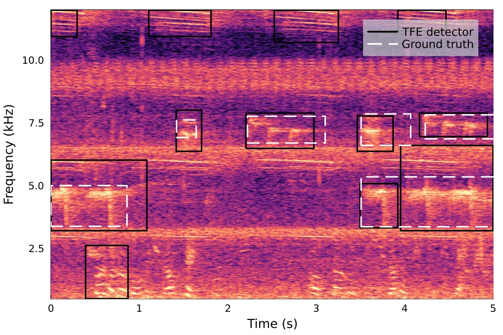
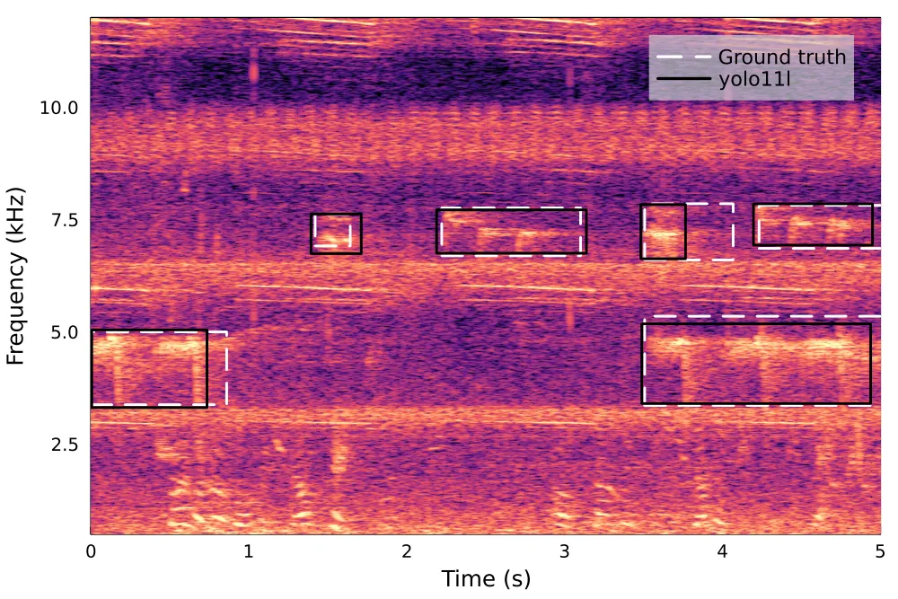
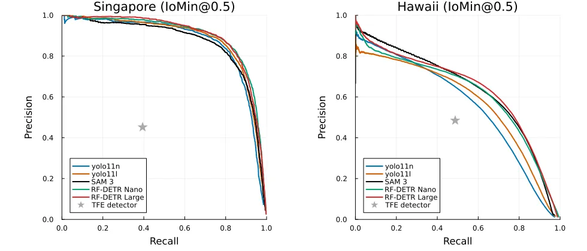
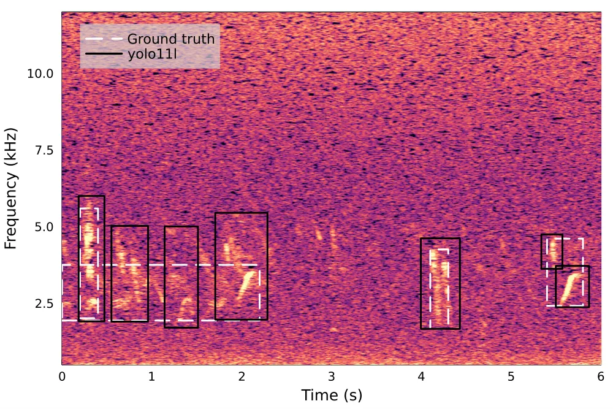
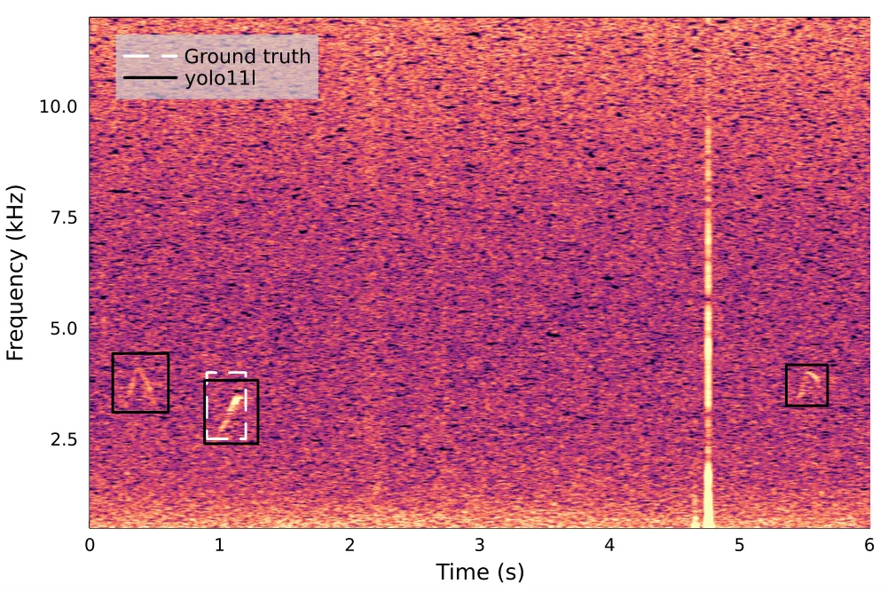
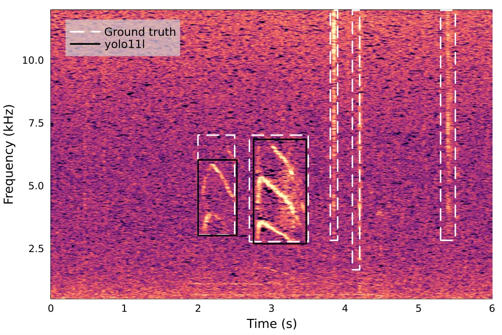

# Time-frequency localization of bird calls in dense soundscapes

Simen Hexeberg    Fanghui Tong    Hari Vishnu    Mandar Chitre

###### Abstract

Passive acoustic monitoring enables large-scale wildlife observation.
Most bioacoustic classifiers predict species presence in a time window
without localizing vocalizations precisely in time or frequency,
limiting downstream analyses. We formulate time-frequency localization
of bird calls as object detection on spectrograms and compare three
computer vision model families (YOLO11, SAM 3, RF-DETR) against a
non-learnable baseline. We introduce Intersection over Minimum (IoMin),
an evaluation metric that better handles ambiguous acoustic boundaries
than IoU. We also open-source a browser-based tool for efficient
bounding-box labeling. The best RF-DETR model nearly doubles baseline
performance on in-distribution, dense soundscapes from Singapore (83.4%
vs. 42.1% IoMin@50 F1-score) and generalizes better to
out-of-distribution recordings from Hawaii (63.2% vs. 48.6%). These
results indicate that fine-tuned computer-vision models are well suited
for time-frequency localization of bird vocalizations in complex
soundscapes.

###### Index Terms: 

Sound event detection, Bioacoustics, Time-frequency localization, Object
detection, Bird vocalizations

^(†)^(†)address: ¹Tropical Marine Science Institute, National University
of Singapore  
²Dept. of Electrical and Computer Engineering, National University of
Singapore  
³School of Computing, National University of Singapore

## 1 Introduction

Combining Passive Acoustic Monitoring (PAM) with machine-learning
classifiers enables biodiversity monitoring at spatial and temporal
scales infeasible with traditional manual surveys. Most bioacoustic
classifiers operate on fixed-duration broadband spectrograms \[15\]. In
dense soundscapes, such global-context inputs may contain simultaneous
vocalizations from multiple species and substantial background noise,
making classification difficult and increasing training data
requirements. Moreover, global-context classifiers do not localize
predictions in time and frequency, limiting interpretability and
downstream analyses.

In contrast, local-context approaches enable measurements of call
characteristics such as duration, bandwidth, and amplitude, facilitating
studies of how animals modify vocal behavior in response to changes in
their acoustic environment \[2, 9, 6\]. We previously proposed a
local-context bird classification method, where time-frequency events
(TFEs) are extracted using an energy-based detector and subsequently
embedded and classified \[7\]. This approach performed well across many
species with little labeled data. However, the pipeline depends heavily
on the first-stage TFE detector: false positives increase the burden on
the downstream classifier, while false negatives (missed events) cannot
be recovered by later stages.

Non-learnable, energy-based TFE detectors \[3, 1, 7\] are attractive
because they require no training. However, they extract narrowband
frequency-modulated (FM) signals and cannot distinguish bird
vocalizations from other FM signals. For instance, in Singapore’s
complex soundscape, the TFE detector in \[7\] detects bird calls but
also insect noise and human speech (Figure 1). Moreover, the event
boundaries are not robust to overlapping signals. This motivates
learnable methods that better localize bird calls in time and frequency
amid ambient noise and FM signals from non-target sources.

We formulate TFE extraction as a two-dimensional time-frequency
localization problem and evaluate three computer vision model families:
YOLO11 \[11\], Segment Anything Model 3 (SAM 3) \[4\], and
RF-DETR \[14\]. YOLO has previously been applied to bioacoustic sound
event detection \[8, 5, 10\], but its application to bird vocalizations
remains limited. The SAM family has seen even less use in bioacoustics,
but the initial version was recently applied to dolphin whistle contour
detection \[16\]. RF-DETR, to the best of our knowledge, has not
previously been used for sound event detection. We compare all three
model families against the energy-based detector from \[7\] on bird
vocalizations recorded in Singapore and Hawaii.

This work makes three contributions: (1) benchmarking an energy-based
TFE detector against three object detection model families for
localizing bird vocalizations in dense soundscapes; (2) introducing
Intersection over Minimum (IoMin), an IoU adaptation that accounts for
ambiguity in acoustic event boundaries; and (3) releasing a
browser-based annotation tool for acoustic-event labeling¹¹ 1
https://org-arl.github.io/birdwatch-public/, along with source code and
model checkpoints for reproducibility²² 2
https://github.com/org-arl/birdwatch-public.





Figure 1: TFE detector (left) and YOLO11l (right) predictions on the
same Singapore recording. The TFE detector detects non-bird sounds
(insect noise, human speech) and produces imprecise boundaries, both of
which YOLO avoids.

## 2 Methodology

### 2.1 Spectrogram Generation

YOLO11, SAM 3, and RF-DETR are pretrained on natural images. To apply
them to audio, we convert waveforms to time-frequency representations
via the short-time Fourier transform (STFT). Recordings are split into
6-second windows with 1-second overlap, and the frequency range is
restricted to $`0.5`$–$`12~\mathrm{kHz}`$ to capture most bird
vocalizations while excluding out-of-band noise. For a
$`44.1~\mathrm{kHz}`$ sampling rate, we use $`N_{\mathrm{FFT}}=4096`$, a
Hann window, and a hop length of 259. This yields near-square
spectrograms. With minor downsampling and zero-padding, we reach a
target size of $`1024\times 1024`$ for YOLO11 and RF-DETR, and
$`1008\times 1008`$ for SAM 3.

To improve visibility of low-SNR vocalizations, STFT magnitudes are
converted to log-power, clipped to the $`[1,\,99.8]`$ percentile range,
and gamma-compressed ($`\gamma=0.85`$). Since the models require
three-channel inputs, the single-channel spectrograms are converted to
RGB using the magma colormap, which performed better than replicating
grayscale across channels for YOLO, possibly because its color
statistics better match those of the COCO pretraining dataset \[12\].

### 2.2 Datasets and Annotation

We use two datasets (Table 1): one recorded in Singapore for training
and in-distribution (ID) evaluation, and one recorded in Hawaii for
out-of-distribution (OOD) evaluation of generalization to new species
and soundscapes.

| Dataset                              | Singapore      | Hawaii   |
| ------------------------------------ | -------------- | -------- |
| Role                                 | ID             | OOD      |
| Usage                                | train/val/test | test     |
| Recording sites                      | 2              | 4        |
| Annotation count                     | 18 095         | 81 691   |
| Audio duration                       | 4.5 hours      | 51 hours |
| Annotation density (annotations/min) | 68             | 27       |

Table 1: Comparison of the in-distribution (ID) and out-of-distribution
(OOD) datasets.

To annotate and analyze recordings efficiently, we developed and
open-sourced an annotation tool called BirdWatch. It is designed for
fine-tuning bounding-box detectors such as YOLO on acoustic data. It
runs in the browser and supports bounding-box annotation and performance
evaluation. Playback can also be restricted to a box’s time-frequency
extent, allowing annotators to listen to isolated calls in noisy
soundscapes. We convert 4.5 hours of recordings from two sites in the
Singapore Botanic Gardens \[7\] into 6-second spectrograms with 1-second
overlaps and manually annotate them, yielding 18,095 labels. Consecutive
blocks of ten spectrograms are split into training, validation, and test
sets in a 7:1:2 ratio. The 1-second overlaps between data splits are
masked to prevent data leakage.

The Hawaii dataset \[13\] is used only for testing and was selected for
its ecological and acoustic differences from Singapore: whereas the
Singapore Botanic Gardens is a low-elevation equatorial site in a
densely populated urban environment, the Hawaiian sites are remote,
high-elevation locations with different habitats, avifauna, and
soundscape. To align with Singapore, the 27 labeled species are treated
as a single “bird present” class, and annotations are cropped to
6-second, $`0.5`$–$`12`$ kHz spectrograms with one second overlap.

### 2.3 Models

YOLO. We evaluate all five YOLO11 sizes—nano (n), small (s), medium (m),
large (l), and extra-large (x). Due to space constraints, we report only
two: YOLO11n for the best accuracy-compute trade-off and YOLO11l for the
best overall performance. The models are initialized from
COCO-pretrained weights and fine-tuned on the Singapore training set
using YOLO’s default learning rate ($`1\times 10^{-2}`$), weight decay
($`5\times 10^{-4}`$), and Non-Maximum Suppression (NMS) IoU threshold
(0.7). NMS reduces redundant predictions by suppressing boxes whose IoU
with a higher-confidence box exceeds the threshold. We use YOLO’s
default augmentation pipeline, as a preliminary comparison on the
Singapore dataset showed no benefit from restricting augmentations to
acoustically motivated transformations.

Segment Anything Model. SAM 3 is a large pretrained foundation model for
text-conditioned object detection and segmentation. Unlike YOLO11, which
is predominantly a convolutional architecture, SAM 3 employs
transformer-based vision and text encoders and a transformer-based
detection module. With 848M parameters, it is also substantially larger,
with 326 times as many parameters as YOLO11n. We use SAM 3 for
bounding-box detection (not segmentation), and follow its official
fine-tuning configuration. However, we freeze the vision and text
encoders and fine-tune only the detection module (30.4M parameters). We
train with a batch size of 8, learning rate of $`2\times 10^{-4}`$, and
early stopping based on validation AP. At inference, NMS with an IoU
threshold of 0.7 is applied for consistency with YOLO11.

For our single-class task, we use a fixed “bird vocalization” prompt. As
SAM 3 is not pretrained on spectrograms, the resulting text embedding is
unlikely to aid detection. To verify this, we replaced the prompt with a
random string at inference and observed only about a 2-percentage-point
drop in IoMin@50 F1-score, suggesting that the model largely ignores the
text embedding.

RF-DETR. RF-DETR is a transformer-based object detector. During
pretraining, it performed an architecture search over thousands of
configurations in a single training run, rather than training each
configuration separately. Different architectures can then be selected
at inference. The authors provide six default architectures that span
different model sizes and accuracy-latency trade-offs. We fine-tune and
evaluate the Nano and Large architectures with default settings and no
additional hyperparameter tuning.

Baseline Model. We compare all models against the non-learnable,
energy-based TFE detector from \[7\]. Rather than learning from labeled
examples, the TFE detector extracts candidate regions directly from
spectrograms using a fixed three-stage pipeline. First, the spectrogram
is normalized independently at each frequency bin using the
interquartile range as a robust local noise-floor estimate, highlighting
energy elevated relative to its frequency band regardless of global SNR.
Second, watershed segmentation separates the spectrogram into connected
high-energy regions. Third, regions with time-frequency shapes
uncharacteristic of bird vocalizations are filtered using heuristic
rules.

### 2.4 Evaluation Metrics

Unlike natural objects in images, vocalization boundaries in
spectrograms are inherently ambiguous: calls may fade gradually in time
and frequency, and call sequences may be annotated as one or multiple
events. For example, the bird vocalizations in Figure 3(a) are annotated
as four events, whereas YOLO11l produces seven predictions. Neither is
incorrect, but under IoU@50, only the leftmost prediction is a true
positive (TP). The remaining six predictions have IoU below 50% and are
considered false positives (FPs), while the three unmatched
ground-truths become false negatives. We therefore make two acoustically
motivated modifications to standard TP and FP definitions. First, we
complement IoU with IoMin, defined as the ratio of the intersection
area, $`A_{\cap}`$, to the smaller of the predicted and ground-truth box
areas, $`A_{p}`$ and $`A_{gt}`$:

```math
\text{IoMin}=\frac{A_{\cap}}{\min(A_{p},\ A_{gt})} \tag{1}
```

IoMin does not penalize partial capture of a target, or predictions
exceeding it. To prevent the models from exploiting this by predicting
arbitrarily large boxes, IoMin is used only for evaluation, not
training. Second, we ignore duplicate TPs: when multiple predictions
match the same ground-truth above the overlap threshold, only one counts
as a TP and the rest are ignored rather than penalized as FPs. Together,
these modifications yield four TPs and zero FPs under IoMin@50 for the
above example, better reflecting the underlying detection performance.

Since the optimal confidence threshold is model- and
application-dependent, we report mean Average Precision (mAP) under IoU
and IoMin, along with maximum F1-score and corresponding precision and
recall. As the TFE detector produces no confidence scores, we report
only precision, recall, and F1-score.

## 3 Results



Figure 2: Precision-recall curves for the best-performing training runs,
selected by validation F1-score. The gray star indicates baseline
performance.

| Dataset        | Method             | Model Params | Training runs | IoU@50                   |                          |                          |                          | IoMin@50                 |                          |                          |                          |
| -------------- | ------------------ | ------------ | ------------- | ------------------------ | ------------------------ | ------------------------ | ------------------------ | ------------------------ | ------------------------ | ------------------------ | ------------------------ |
|                |                    |              |               | mAP                      | F1                       | Prec.                    | Recall                   | mAP                      | F1                       | Prec.                    | Recall                   |
| Singapore (ID) | TFE detector \[7\] | N/A          | N/A           | N/A                      | $`14.9`$                 | $`15.5`$                 | $`14.4`$                 | N/A                      | $`42.1`$                 | $`45.2`$                 | $`39.4`$                 |
|                | YOLO11n            | 2.6M         | 5             | $`67.3\pm 0.4`$          | $`65.8\pm 0.3`$          | $`70.4\pm 2.3`$          | $`61.9\pm 1.4`$          | $`87.2\pm 0.3`$          | $`81.7\pm 0.2`$          | $`83.2\pm 1.8`$          | $`80.3\pm 1.5`$          |
|                | YOLO11l            | 25.3M        | 5             | $`67.4\pm 0.9`$          | $`66.5\pm 0.7`$          | $`69.5\pm 1.5`$          | $`63.8\pm 1.1`$          | $`87.5\pm 0.5`$          | $`81.8\pm 0.7`$          | $`82.1\pm 1.3`$          | $`81.6\pm 1.0`$          |
|                | RF-DETR Nano       | 30.5M        | 5             | $`71.5\pm 0.6`$          | $`69.4\pm 0.3`$          | $`\mathbf{73.8\pm 1.2}`$ | $`65.6\pm 1.1`$          | $`89.9\pm 0.2`$          | $`\mathbf{83.4\pm 0.3}`$ | $`84.1\pm 1.4`$          | $`\mathbf{82.8\pm 1.7}`$ |
|                | RF-DETR Large      | 33.9M        | 5             | $`\mathbf{71.9\pm 0.3}`$ | $`\mathbf{69.6\pm 0.7}`$ | $`73.0\pm 2.0`$          | $`\mathbf{66.5\pm 1.5}`$ | $`\mathbf{90.0\pm 0.3}`$ | $`\mathbf{83.4\pm 0.2}`$ | $`\mathbf{84.4\pm 1.5}`$ | $`82.6\pm 1.7`$          |
|                | SAM 3              | 848M         | 5             | $`64.2\pm 0.6`$          | $`64.4\pm 0.7`$          | $`67.1\pm 1.6`$          | $`62.0\pm 0.8`$          | $`86.5\pm 0.5`$          | $`80.6\pm 0.5`$          | $`80.7\pm 1.0`$          | $`80.5\pm 0.5`$          |
| Hawaii (OOD)   | TFE detector \[7\] | N/A          | N/A           | N/A                      | $`10.3`$                 | $`8.7`$                  | $`12.5`$                 | N/A                      | $`48.6`$                 | $`48.5`$                 | $`48.7`$                 |
|                | YOLO11n            | 2.6M         | 5             | $`6.6\pm 1.0`$           | $`16.4\pm 1.1`$          | $`15.6\pm 1.3`$          | $`17.2\pm 1.1`$          | $`53.2\pm 2.2`$          | $`55.9\pm 1.5`$          | $`56.2\pm 1.1`$          | $`55.7\pm 2.8`$          |
|                | YOLO11l            | 25.3M        | 5             | $`9.0\pm 0.6`$           | $`19.1\pm 0.7`$          | $`18.8\pm 1.3`$          | $`19.4\pm 0.6`$          | $`55.1\pm 2.1`$          | $`57.6\pm 2.0`$          | $`57.9\pm 0.9`$          | $`57.3\pm 3.3`$          |
|                | RF-DETR Nano       | 30.5M        | 5             | $`14.0\pm 0.6`$          | $`22.8\pm 0.5`$          | $`23.4\pm 1.1`$          | $`22.3\pm 0.5`$          | $`60.7\pm 0.9`$          | $`62.3\pm 0.8`$          | $`59.3\pm 1.1`$          | $`65.6\pm 1.0`$          |
|                | RF-DETR Large      | 33.9M        | 5             | $`\mathbf{15.4\pm 1.0}`$ | $`\mathbf{24.2\pm 1.0}`$ | $`\mathbf{24.7\pm 1.3}`$ | $`\mathbf{23.7\pm 1.1}`$ | $`61.9\pm 1.3`$          | $`\mathbf{63.2\pm 1.0}`$ | $`\mathbf{60.9\pm 0.7}`$ | $`65.6\pm 1.4`$          |
|                | SAM 3              | 848M         | 5             | $`10.4\pm 0.6`$          | $`20.6\pm 0.7`$          | $`20.5\pm 0.8`$          | $`20.7\pm 0.9`$          | $`\mathbf{62.4\pm 0.7}`$ | $`62.4\pm 0.5`$          | $`58.5\pm 0.9`$          | $`\mathbf{66.8\pm 0.9}`$ |

Table 2: Detection performance of the TFE detector, two YOLO
architectures, two RF-DETR variants, and SAM 3, under IoU@50 and
IoMin@50. Bold marks the best result per metric and dataset.



(a) Annotation boundary ambiguity.



(b) Missing ground-truth annotations.



(c) Erroneous ground-truth annotations.

Figure 3: Examples of ambiguous, missing, and erroneous annotations in
the Hawaii dataset.

Performance is reported as mean $`\pm`$ standard deviation over five
training runs (Table 2). All three model families outperform the
baseline by a large margin across metrics. Figure 2 shows the
precision-recall curves for the best-performing run of each model,
selected by F1-score. Qualitatively, the fine-tuned vision models better
suppress non-bird sounds and produce more precise boundaries (Figure 1).
RF-DETR Large performs best across most metrics. On in-distribution
data, it yields an IoMin@50 F1-score of 83.4%, compared with 42.1% for
the baseline. On out-of-distribution recordings, the best model under
IoMin@50 depends on the desired precision-recall trade-off: RF-DETR
Large performs better at higher recall, whereas SAM 3 performs better at
higher precision (Figure 2). We tested fine-tuning SAM 3’s vision
encoder using Low-Rank Adaptation but it did not improve performance
over the frozen encoder.

The models generalize reasonably well to the Hawaii recordings despite
differences in species and soundscape from the Singapore training data.
However, the highest out-of-distribution IoMin@50 F1 score (63.2%,
RF-DETR Large) remains 20.2 percentage points below its in-distribution
score (83.4%). While part of this gap likely reflects true
generalization loss, three annotation-related factors artificially
inflate it. First, the datasets differ in annotation practices
(Figure 3(a)), to which IoMin is less sensitive than IoU. Second, some
correctly detected bird calls are absent from the ground truth
(Figure 3(b)). Third, a few ground-truth annotations correspond to
non-bird calls (Figure 3(c)).

## 4 Conclusion

In this work, we formulate time-frequency localization of bird calls as
an object detection task on spectrograms. Fine-tuned vision models
substantially outperform the non-learnable baseline, with RF-DETR Large
performing best across most metrics. SAM 3 achieves comparable
out-of-distribution performance under IoMin@50. However, its 848M
parameters and 3.6 GB disk footprint make it impractical for power- and
memory-constrained edge devices typically used in long-duration PAM
surveys. In contrast, YOLO11n and RF-DETR Large offer faster inference
and require only 5.6 MB and 138 MB, respectively. The results also
highlight the need for a standardized benchmark for training and
evaluating bioacoustic time-frequency localization methods, which could
help separate true generalization loss from annotation-related artifacts
such as those observed here. To support research in this area, we
release BirdWatch, an open-source analysis and annotation tool for
spectrogram-based object detection.

## References

- \[1\] R. Abbasi, N. Holighaus, P. Balazs, V. Lostanlen, D. J. Penn,
  and S. M. Zala (2025) Robust multicomponent tracking of ultrasonic
  vocalizations. In Proc. IEEE Int. Conf. Acoustics, Speech and Signal
  Processing (ICASSP), pp. 1–5. External Links:
  [Document](https://dx.doi.org/10.1109/ICASSP49660.2025.10890025) Cited
  by: §1.
- \[2\] C. Both and T. Grant (2012) Biological invasions and the
  acoustic niche: the effect of bullfrog calls on the acoustic signals
  of white-banded tree frogs. Biology Letters 8 (5), pp. 714–716.
  External Links: [Document](https://dx.doi.org/10.1098/rsbl.2012.0412)
  Cited by: §1.
- \[3\] T. S. Brandes (2008) Feature vector selection and use with
  hidden markov models to identify frequency-modulated bioacoustic
  signals amidst noise. IEEE Transactions on Audio, Speech, and Language
  Processing 16 (6), pp. 1173–1180. External Links:
  [Document](https://dx.doi.org/10.1109/TASL.2008.925872) Cited by: §1.
- \[4\] N. Carion, L. Gustafson, Y. Hu, S. Debnath, R. Hu, D. S.
  Coll-Vinent, C. Ryali, K. V. Alwala, H. Khedr, A. Huang, J. Lei, T.
  Ma, B. Guo, A. Kalla, M. Marks, J. Greer, M. Wang, P. Sun, R.
  Rädle, T. Afouras, E. Mavroudi, K. Xu, T. Wu, Y. Zhou, L. Momeni, R.
  Hazra, S. Ding, S. Vaze, F. Porcher, F. Li, S. Li, A. Kamath, H. K.
  Cheng, P. Dollar, N. Ravi, K. Saenko, P. Zhang, and C.
  Feichtenhofer (2026) SAM 3: segment anything with concepts. In The
  Fourteenth International Conference on Learning Representations,
  External Links: [Link](https://openreview.net/forum?id=r35clVtGzw)
  Cited by: §1.
- \[5\] C. Escobar-Amado, M. Badiey, and L. Wan (2024) Computer vision
  for bioacoustics: detection of bearded seal vocalizations in the
  Chukchi Shelf using YOLOV5. IEEE Journal of Oceanic Engineering 49
  (1), pp. 133–144. External Links:
  [Document](https://dx.doi.org/10.1109/JOE.2023.3307175) Cited by: §1.
- \[6\] A. Farina, N. Pieretti, and N. Morganti (2013) Acoustic patterns
  of an invasive species: the Red-billed Leiothrix (Leiothrix lutea
  Scopoli 1786) in a Mediterranean shrubland. Bioacoustics 22 (3),
  pp. 175–194. External Links:
  [Document](https://dx.doi.org/10.1080/09524622.2012.761571) Cited by:
  §1.
- \[7\] S. Hexeberg, M. Chitre, M. Hoffmann-Kuhnt, and B. W. Low (2025)
  Semi-supervised classification of bird vocalizations. Note:
  arXiv:2502.13440Under review Cited by: §1, §1, §1, §2.2, §2.3, Table
  2, Table 2.
- \[8\] S. Hexeberg, H. Vishnu, K. T. Beng, A. Ho, W. Yusong, M.
  Chitre, K. Tun, and K. Lim (2023) Acoustic detector for multiple
  vocalizing marine mammal individuals. In OCEANS 2023 - Limerick,
  pp. 1–8. External Links:
  [Document](https://dx.doi.org/10.1109/OCEANSLimerick52467.2023.10244432)
  Cited by: §1.
- \[9\] J. M. Hopkins, D. S. Bower, W. Edwards, and L.
  Schwarzkopf (2023) Effects of invasive toad calls and synthetic tones
  on call properties of native Australian toadlets. Journal of
  Herpetology 57, pp. 437–446. External Links:
  [Document](https://dx.doi.org/10.1670/23-004) Cited by: §1.
- \[10\] Z. Huang, D. Ochs, M. C. P. Amorim, P. J. Fonseca, M.
  Goel, N. J. Nunes, M. Vieira, and M. Lopes (2025) Deep learning–based
  frameworks for the detection and classification of soniferous fish.
  The Journal of the Acoustical Society of America 158 (2),
  pp. 1060–1071. External Links:
  [Document](https://dx.doi.org/10.1121/10.0038800) Cited by: §1.
- \[11\] G. Jocher and J. Qiu (2024) Ultralytics YOLO11. Note:
  Ultralytics Cited by: §1.
- \[12\] T. Lin, M. Maire, S. Belongie, J. Hays, P. Perona, D.
  Ramanan, P. Dollár, and C. L. Zitnick (2014) Microsoft COCO: common
  objects in context. In Computer Vision – ECCV 2014, pp. 740–755. Cited
  by: §2.1.
- \[13\] A. Navine, S. Kahl, A. Tanimoto-Johnson, H. Klinck, and P.
  Hart (2022) A collection of fully-annotated soundscape recordings from
  the island of Hawai‘i. Note: doi:10.5281/zenodo.7078499 Cited by:
  §2.2.
- \[14\] I. Robinson, P. Robicheaux, M. Popov, D. Ramanan, and N.
  Peri (2026) RF-DETR: neural architecture search for real-time
  detection transformers. In The Fourteenth International Conference on
  Learning Representations, External Links:
  [Link](https://openreview.net/forum?id=qHm5GePxTh) Cited by: §1.
- \[15\] R. Schwinger, P. Vali Zadeh, L. Rauch, M. Kurz, T.
  Hauschild, S. Lapp, and S. Tomforde (2026) Foundation models for
  bioacoustics – a comparative review. Ecological Informatics 96,
  pp. 103765. External Links: ISSN 1574-9541,
  [Document](https://dx.doi.org/https%3A//doi.org/10.1016/j.ecoinf.2026.103765),
  [Link](https://www.sciencedirect.com/science/article/pii/S1574954126001718)
  Cited by: §1.
- \[16\] X. Zhang, X. Liu, M. N. Alksne, and M. A. Roch (2025)
  Automating time $`\times`$ frequency annotations of delphinid whistles
  by adapting a foundational transformer neural network. Scientific
  Reports 15 (1), pp. 37809. External Links: ISSN 2045-2322,
  [Document](https://dx.doi.org/10.1038/s41598-025-21642-x),
  [Link](https://doi.org/10.1038/s41598-025-21642-x) Cited by: §1.
