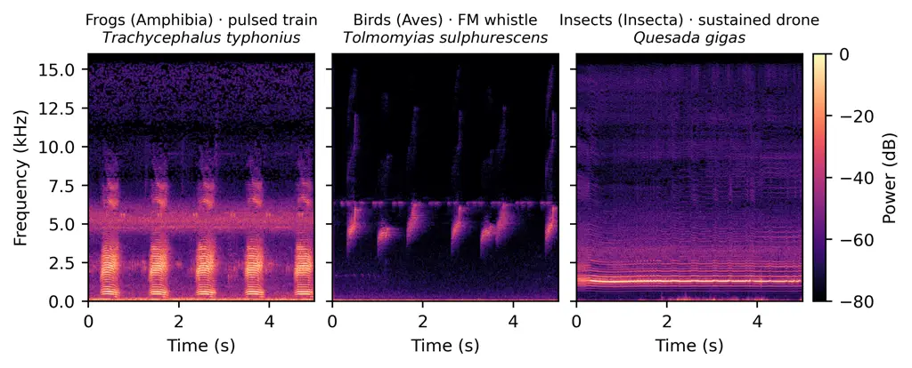
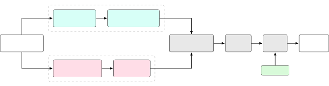
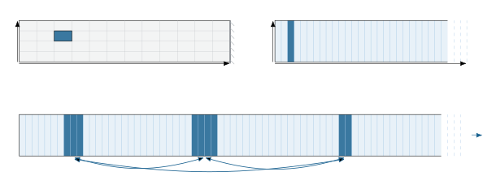
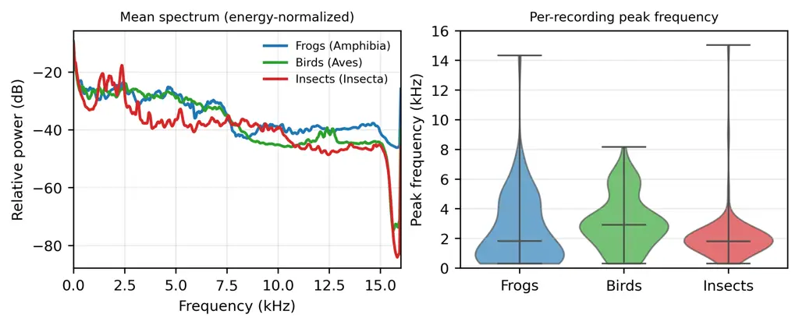

^(\*1)

^(\*1)

^(\*1)

# Can Tokens Compete? Token Representations against Supervised CNN Backbones for BirdCLEF+ 2026

Anthony Miyaguchi
[](https://orcid.org/0000-0002-9165-8718)
   Murilo Gustineli
[](https://orcid.org/0009-0003-9818-496X)
   Adrian Cheung
[](https://orcid.org/0009-0006-8650-4550)

###### Abstract

This paper details the DS@GT ARC team’s approach to BirdCLEF+ 2026,
multi-label detection of animal vocalizations in soundscapes from the
Pantanal wetlands. The 2026 edition adds about an hour of labeled
soundscapes, shifting the task toward supervised pipelines fit to the
labeled set. First, we build a competitive supervised baseline that
ensembles a frozen Perch v2 backbone, a trained HGNetV2-B0
sound-event-detection network, and a non-bird prototypical head,
reaching a private leaderboard score of 0.936 at rank 1894 within a
90-minute CPU budget. Second, we ask whether token-based representations
can compete, contrasting codec representations from neural audio codecs
against semantic representations from foundational embeddings. We
compare two bioacoustic specialist models against four token-based
encoders trained on AudioSet. The repository for this work can be found
at
[https://github.com/dsgt-arc/birdclef-2026](https://github.com/dsgt-arc/birdclef-2026).

###### keywords

BirdCLEF ,Bioacoustics ,Soundscape classification ,Audio foundation
models ,Neural audio codecs

^(†)^(†)copyrightyear: 2026^(†)^(†)copyright: Copyright for this paper
by its authors. Use permitted under Creative Commons License Attribution
4.0 International (CC BY 4.0).^(†)^(†)venue: CLEF 2026: Conference and
Labs of the Evaluation Forum, September 21-24, 2026, Jena,
Germany^(†)^(†)email: acmiyaguchi@gatech.edu^(†)^(†)email:
murilogustineli@gatech.edu^(†)^(†)url:
https://murilogustineli.com^(†)^(†)email:
acheung@gatech.edu^(†)^(†)address: Georgia Institute of Technology, 225
North Ave NW, Atlanta, GA 30332^(†)^(†)corresp: Corresponding author.

## 1 Introduction

BirdCLEF+ Kahl et al. (2026) is a competition, hosted on Kaggle and
organized through the LifeCLEF lab at the Conference and Labs of the
Evaluation Forum (CLEF) Picek et al. (2026), to build a model that
detects and classifies animal vocalizations in soundscapes. Soundscapes
are recordings of a landscape captured by autonomous recording units
deployed to the field. The 2026 edition of the competition is focused on
multi-label detection on 60-second soundscapes from the Pantanal
wetlands in South America.

The largest challenge in the previous years was that while there were
many recordings for each species, they were weakly labeled. A given
audio clip in the focal set contains vocalizations for a particular
species, but the time range in which the vocalization occurs is not
given, and there may also be multiple sources of sound. The focal
recordings are also biased toward the most common species that can be
found via population centers, because they are easier to capture and
there are likely to be more people around to capture those sounds. This
heavy-tailed distribution makes species with only a handful of examples
hard to learn, and the problem formulation encourages few-shot
solutions.

The 2026 edition of the competition added about an hour of labeled
soundscapes, leading to a significant change in the strategy for model
development. Previous editions focused on the domain shift from focal
recordings taken from Xeno-canto Xeno-canto Foundation (2025), which are
crowd-sourced, to the soundscape domain, which is multi-label and
without provided ground truth. This means that supervised algorithms now
dominate the leaderboard and lean heavily into the small set of labeled
data.

First, we build a supervised baseline system following the best
practices established by the Kaggle community, leading to a competitive
leaderboard submission on the labeled soundscape set for team DS@GT ARC
at rank 1894 with a score of 0.936. Second, we investigate whether
token-based representations can be effective on this leaderboard, and
compare the semantic representations produced by foundational audio
embeddings against the reconstruction-oriented codec representations
produced by neural audio codecs. We close with discussion around a
future of foundational systems capable of contextualizing soundscapes,
beyond the domain of short focal recordings.

## 2 Related Work

Soundscape recognition typically uses deep networks on audio
spectrograms. The usual representation is the mel-scaled short-time
Fourier transform (STFT), which scales frequencies to the perceptual
scale of human hearing and is fed into convolutional networks (CNNs)
whose spatial bias suits the spectral structure of sound. BirdNET Kahl
et al. (2021) and Perch v2 van Merriënboer et al. (2025) are the state
of the art, training CNNs to produce both windowed species occurrence
probabilities and a reusable embedding space. Global birdsong embeddings
demonstrate a large domain gap in transfer learning with respect to
general-purpose foundation models like AudioMAE for bioacoustics Ghani
et al. (2023). Self-supervised encoders like AVES Hagiwara (2022),
benchmarks like BirdSet Rauch et al. (2025b), and a recent comparative
review Schwinger et al. (2025) help contextualize efforts toward
exploiting larger bioacoustic datasets.

We study two families of token representations. Semantic embeddings come
from self-supervised audio models: AST Gong et al. (2021) adapted vision
transformers to spectrograms, BEATs Chen et al. (2023) and EAT Chen et
al. (2024) improved this with masked prediction, wav2vec 2.0 Baevski et
al. (2020) learns from speech, and Bird-MAE Rauch et al. (2025a) adapts
masked autoencoding to birds. Codec representations come from neural
audio codecs: SoundStream Zeghidour et al. (2021), EnCodec Défossez et
al. (2022), and the single-codebook WavTokenizer Ji et al. (2024) are
trained to reconstruct waveforms for human perception. We also test
linear-time state-space models, where Mamba Gu and Dao (2023), SSAMBA
Shams et al. (2024), and recent bioacoustic SSMs Tang and Baskiyar
(2025) scale to the long sequences needed to contextualize a full
soundscape.

The recurring difficulty in earlier editions was domain shift: focal
recordings from Xeno-canto Xeno-canto Foundation (2025) had to
generalize to unlabeled multi-label soundscapes Liang et al. (2024), and
the 2026 labeled hour shifts this toward supervised pipelines fit to the
labeled set. The DS@GT team has competed since 2022: motif mining
Miyaguchi et al. (2022) in 2022 Kahl et al. (2022), transfer learning on
BirdNET embeddings Miyaguchi et al. (2023) in 2023 Kahl et al. (2023),
sound-separation pseudo-labels Miyaguchi et al. (2024); Denton et al.
(2021) in 2024 Kahl et al. (2024), and a word2vec-style token model
Miyaguchi et al. (2025); Mikolov et al. (2013) in 2025 Cañas et al.
(2025). We build upon these techniques, reusing the vectorized knowledge
of models in sample-efficient ways.

## 3 Data

BirdCLEF 2026 data contains 522.1 hours of audio, split between 344.5 h
of focal recordings across 206 species and 177.6 h of soundscapes from
23 sites in the Pantanal, Brazil. Only 1.03 h (66 files, 739 unique 5 s
windows, spanning 9 of the 23 sites) of the soundscape audio is labeled;
the remaining 176.5 h is unlabeled. Of the 234 target species, 28 are
derived from soundscapes alone, many of those being insects. Only 2.4%
of focal recordings come from the Pantanal bounding box, and 87 species
have zero recordings from Pantanal.



Figure 1: Representative spectrograms of three vocalizing taxa in
BirdCLEF 2026. The taxa overlap in frequency. Frogs produce pulsed call
trains, birds frequency-modulated whistles, and insects a sustained
broadband droning sound.

|          |                    |        |                      |           |
| -------- | ------------------ | ------ | -------------------- | --------- |
|          | Focal (recordings) |        | Soundscape (windows) |           |
| Class    | Species            | % recs | Species              | % windows |
| Aves     | 162                | 97.89  | 28                   | 28.7      |
| Amphibia | 32                 | 1.27   | 17                   | 76.6      |
| Insecta  | 3                  | 0.56   | 25                   | 22.7      |
| Mammalia | 8                  | 0.28   | 4                    | 5.5       |
| Reptilia | 1                  | 0.003  | 1                    | 1.8       |

Table 1: Class composition of the focal training set vs. the labeled
soundscape windows. The focal training is mostly birds, while the
soundscape is mostly amphibians. In the insect class, the focal species
do not overlap with the soundscape species. Note that soundscape windows
are multi-label, and thus the percentage of windows sums up to a value
greater than 100.

The animal vocalizations are not necessarily separable by frequency
band. Frogs, birds, and insects all concentrate energy in 1–4 kHz and
differ in spectro-temporal structure (Figure 1).

A statistical breakdown of the training and test data (Table 1)
reiterates the challenges posed by the competition and lab. The gap
between recording domains, together with the long-tailed distribution of
recordings over species, means that models must be sample-efficient and
account for the low-resource nature of the data.

## 4 Supervised Baseline System

The 2026 data rewards supervised pipelines fit directly to the hour of
labeled soundscape data, and we follow Kaggle community best practices
to build a competitive baseline. The system is an ensemble of a frozen
Perch v2 van Merriënboer et al. (2025) backbone with MLP probes whose
probabilities are blended with a trained HGNetV2-B0
sound-event-detection (SED) network. The best model, which includes a
prototypical head for non-bird species, reaches a public leaderboard
score of 0.931 and a private score of 0.936 at rank 1894 (Figure 2,
Table 2). Most score gains come from frontend and architecture choices
rather than training tricks or extra data, and we’ve aimed for a
parsimonious system.

### 4.1 Methodology



Figure 2: The supervised baseline is an equal-weight, two-member
ensemble extended with a non-bird prototypical head. Each 60 s
soundscape is split into 12 non-overlapping 5 s windows that feed both
members: a _frozen_ Perch v2 backbone read through logit-space MLP
probes, and a trained HGNetV2-B0 SED network on log-mel spectrograms.
Their 234-species probability vectors are blended equally,
post-processed with site/hour priors, and merged with non-bird prototype
scores. The whole pipeline runs in $`\sim`$64 min, within the 90 min CPU
limit. Public LB scores are shown in green.

The ensemble uses two different backbones. The first is Perch v2 van
Merriënboer et al. (2025) which is frozen with no backbone training. It
emits a 1536-dimensional embedding and 14,795-class logits per 5 s
window, which we map onto the 234 competition species (203 direct
scientific-name matches, 6 genus proxies, 25 insect sonotypes
suppressed). The second is an HGNetV2-B0 convolutional SED network
operating on log-mel spectrograms (256 mel bins, 32 kHz, 2048-point FFT,
313-sample hop).

For the Perch member we fit logit-space MLP probes on the frozen
embeddings over the 59 fully-labeled soundscapes (of the 66 labeled
files) using 5-fold out-of-fold (OOF) GroupKFold cross-validation. We
also explored ProtoSSM, a temporal head that refines the per-window
probe logits across the twelve 5 s windows of a soundscape. It uses a
bidirectional state-space model and a per-species prototype layer Snell
et al. (2017) with a learned gate against probe logits. The SED member
trains HGNetV2-B0 on the focal and soundscape recordings across 4 folds,
with spectrogram mixup and a multi-label binary cross-entropy loss. The
SED member adds dB-scale mel normalization (AmplitudeToDB) and higher
mel resolution.

At inference each 60 s soundscape is split into 12 non-overlapping 5 s
windows, and each member emits a 234-species probability vector per
window. The two members are averaged together with equal weight
($`w_{\text{Perch}}=0.5`$), with the SED member additionally test-time
augmented across its 4 folds. Site- and hour-conditioned priors are then
applied as post-processing.

#### Non-Bird Prototypical Head

Of the 234 competition species, 72 are non-bird taxa outside the
training labels of Perch. To score these species, we introduce a
prototypical head Snell et al. (2017) that uses the Perch backbone.
Although Perch was trained exclusively on avian audio, it captures
generalized acoustic features that help cluster non-bird vocalizations.
Of the 72 non-bird taxa, 47 appear in the labeled soundscapes, allowing
us to construct positive ($`\boldsymbol{\mu}^{+}_{s}`$) and negative
($`\boldsymbol{\mu}^{-}_{s}`$) prototypes by averaging the Perch
embeddings of all windows where the species is present, and all windows
where it is absent, respectively. We compute a cosine-difference score
for each species $`s`$ and window $`t`$:

```math
\displaystyle\hat{y}^{\text{proto}}_{t,s}=\text{clip}(\cos(\mathbf{e}_{t},\boldsymbol{\mu}^{+}_{s})-\cos(\mathbf{e}_{t},\boldsymbol{\mu}^{-}_{s}),\;0,\;1)
```

For all non-bird taxa, we first take the SED predictions directly. If a
prototype is available for a species, these precomputed scores are
merged via element-wise maximum with the SED output:
$`\hat{y}^{\text{final}}_{t,s}=\max\left(\hat{y}^{\text{sed}}_{t,s},\,\hat{y}^{\text{proto}}_{t,s}\right)`$.
Because the prototype matrices reuse Perch embeddings from the bird
head, they add little inference overhead. The full pipeline completes in
roughly 64 minutes, well within the 90-minute CPU limit.

### 4.2 Leaderboard Results

The ensemble performs better than either of its constituents. The frozen
Perch probe scores 0.920 and the SED member 0.917, while their blend
reaches 0.929 (Table 2). The simplest Perch member uses a ridge
regression probe Hoerl and Kennard (1970) scoring 0.866 and is
replicated in later experiments such as that in Table 6. Dropping
augmentations like the ProtoSSM and the site/hour post-processing leads
to only marginal degradation in leaderboard performance.

Adding the non-bird prototypical head to the MLP-only ensemble raises
the public score to 0.931 and the private score to 0.936. Offline
evaluation on the 66 labeled soundscapes shows the prototype
substantially outperforms the SED model alone for non-bird taxa (macro
AP 0.895 vs. 0.074). This confirms that the Perch embedding space
carries useful information for non-bird species, despite only being
trained on bird data.

|                                       |           |       |            |
| ------------------------------------- | --------- | ----- | ---------- |
|                                       | Kaggle LB |       |            |
| Configuration                         | pub       | priv  | $`\Delta`$ |
| _Members (standalone)_                |           |       |            |
| Perch v2 + ridge probe (frozen)       | 0.866     | 0.862 | —          |
| Perch v2 + MLP probes (frozen)        | 0.920     | 0.918 | $`+0.054`$ |
| HGNetV2-B0 SED (4-fold)               | 0.917     | 0.924 | $`+0.051`$ |
| _Ensemble_ ($`w_{\text{Perch}}=0.5`$) |           |       |            |
|    with ProtoSSM head                 | 0.927     | 0.923 | $`+0.061`$ |
|    MLP-only (drop ProtoSSM)           | 0.929     | 0.925 | $`+0.063`$ |
|    no post-processing                 | 0.922     | 0.916 | $`+0.056`$ |
| _Non-bird prototypical head_          |           |       |            |
|    MLP-only + non-bird head           | 0.931     | 0.936 | $`+0.065`$ |

Table 2: Baseline ablations on the BirdCLEF 2026 Kaggle leaderboard.
$`\Delta`$ is the public-LB gain over the frozen ridge probe.

|                   |                                        |       |            |
| ----------------- | -------------------------------------- | ----- | ---------- |
| Stage             | Change                                 | pub   | $`\Delta`$ |
| Base SED          | EfficientNet-B0 SED ($`+`$ post-proc.) | 0.827 | —          |
| $`+`$ dB-mel      | high-res mel $`+`$ AmplitudeToDB       | 0.859 | $`+0.032`$ |
| $`+`$ HGNetV2-B0  | backbone swap $`+`$ NNAudio dB-mel     | 0.906 | $`+0.047`$ |
| $`+`$ 4-fold      | logit-mean over folds                  | 0.913 | $`+0.007`$ |
| $`+`$ priors      | site/hour post-processing              | 0.917 | $`+0.004`$ |
| $`+`$ Perch probe | score-level blend (ensemble)           | 0.929 | $`+0.012`$ |

Table 3: Architectural ablations from the SED member. Each row is the
best public-LB checkpoint at that stage. $`\Delta`$ is relative to the
row above.

Table 3 contains an ablation of architectural changes to the SED branch
of the ensemble. Frontend and backbone choices contribute to most of the
score gains. dB-scale mel normalization is the largest frontend lever by
making quiet and loud recordings comparable, which matters when focal
training clips and soundscape test clips differ sharply in level. We try
a few more elaborate choices like an ImageNet EfficientNet-B0 SED
distilled from Perch v2 embeddings which recovers an identical single
fold, and an EfficientNetV2-S pretrained on tropical Xeno-Canto audio
(Appendix A). Neither buys significant accuracy, and both add complexity
through teacher pipelines or large-scale training.

Offline validation AUROC anti-correlated with the public leaderboard
across 20+ submissions, so we treated every change as a single-variable
experiment. A curated record is in Appendix A (Table 9).

## 5 Token Representations for Bioacoustic Soundscapes

Having established a supervised baseline, we ask whether token-based
representations can compete with it on this leaderboard. We compare
codec representations from neural audio codecs, which are trained to
reconstruct the waveform, versus semantic representations from
foundational audio embeddings, which are trained to preserve similarity
and separability. We rule out the reconstruction route, then turn to the
semantic embeddings for their versatility.

### 5.1 Codec Representations

We tested whether a discrete neural audio codec could replace embeddings
for species retrieval. We used WavTokenizer-large Ji et al. (2024) (75
tokens/s, single 4096-code codebook, 24 kHz) as the tokenizer for a
sample of the bioacoustic data in BirdCLEF 2026. Perch v2 served as the
round-trip evaluator. We evaluated this experiment on round-trip quality
against Perch embeddings and logits, alongside semantic retrieval tasks.
The first task is a round-trip reconstruction task where we take a clip
of audio, pass it through the codec encoder-decoder, and compare the
cosine distance of the Perch embeddings under lossless and lossy
conditions. The second task uses the same round-tripped audio, but this
time does a retrieval task over the Perch embeddings. The third task
uses the WavTokenizer pooled embeddings directly for retrieval on focal
recordings. We choose a set of 10 species to analyze the performance.

|                 |                        |        |        |            |
| --------------- | ---------------------- | ------ | ------ | ---------- |
| Phase           | Metric                 | Target | Result | Met?       |
| Round-trip      | Perch embedding cosine | ¿0.90  | 0.313  | $`\times`$ |
| Round-trip      | Precision@1            | ¿0.80  | 0.09   | $`\times`$ |
| Focal retrieval | Precision@10           | ¿0.80  | 0.195  | $`\times`$ |

Table 4: WavTokenizer codec retrieval against its predefined success
gates. Every gate is missed by a wide margin. The soundscape phase
carried no hard gate; its recall, taken at the most permissive
threshold, is indistinguishable from noise.

WavTokenizer codec retrieval failed on every measured account (Table 4).
Round-tripping audio through the codec collapses Perch-embedding cosine
similarity (0.313 against the 0.90 gate) and top-1 species accuracy
(9%). The resulting encodings are also not useful for semantic search in
this domain. WavTokenizer was trained on human speech, and breaking
round-trip performance down by species shows that lower-frequency,
speech-like vocalizations survive the codec better than high-frequency
bird calls (Table 5).

|                            |          |         |       |
| -------------------------- | -------- | ------- | ----- |
| Species                    | Class    | Cos sim | Top-1 |
| Lesser Snouted Tree Frog   | Amphibia | 0.539   | 25%   |
| Domestic Dog               | Mammalia | 0.423   | 10%   |
| Pale-legged Weeping Frog   | Amphibia | 0.374   | 5%    |
| Purplish Jay               | Aves     | 0.357   | 5%    |
| Common Potoo               | Aves     | 0.340   | 30%   |
| Bare-faced Curassow        | Aves     | 0.337   | 15%   |
| Rufous Hornero             | Aves     | 0.214   | 0%    |
| Great Kiskadee             | Aves     | 0.201   | 0%    |
| Chestnut-vented Conebill   | Aves     | 0.200   | 0%    |
| White-faced Whistling Duck | Aves     | 0.145   | 0%    |

Table 5: Per-species round-trip cosine similarity. Speech-like
vocalizations (low-frequency tonal calls, dog barks) survive the codec
better than the high frequency bird calls.

### 5.2 Semantic Representations

We measure how well foundational audio embeddings transfer by ranking
encoders on the BirdCLEF target task. We evaluate encoders built largely
on vision-transformer architectures, which have not typically appeared
as competitive solutions. We screened these encoders on ESC-50 Piczak
(2015) via 5-fold linear probing and separately probed a
static-embedding deployment path for cheaper CPU inference; both are
collected in Appendix D. We finetune with LoRA adapters Hu et al. (2022)
as a parameter-efficient alternative to full updates, since many of
these models are large and require significant GPU memory. ESC-50 is a
proxy task, environmental sound classification, and does not rank these
encoders on the target soundscape task; however it is a useful source
reproducibility check.

AST Gong et al. (2021) is a strong spectrogram-transformer baseline at
95.5% on ESC-50, and one of the first to experiment with vision
transformers in the audio domain. BEATs Chen et al. (2023) is the
strongest encoder we tested at 95.8%, and is trained using
self-supervision and masking. EAT Chen et al. (2024) is an efficient
audio transformer that extends the BEATs masked-prediction recipe with
more aggressive masking and benefits from LoRA finetuning. SSAMBA Shams
et al. (2024) is a variation of AST that uses Mamba layers Gu and Dao
(2023) to approximate attention and can in theory scale to much larger
token regimes than AST can.

To compare these models, we fit a ridge Hoerl and Kennard (1970) head on
each encoder’s frozen embeddings using the focal training recordings. We
evaluate using a leave-one-site-out (LOSO) split over the 739 labeled
windows and report pooled out-of-fold macro AUROC. This validation
metric is different from those in the CNN baseline, but their Kaggle
leaderboard measures are provided for consistency in the final test set.
We add the bioacoustic specialists Perch v2 van Merriënboer et al.
(2025) and BirdNET Kahl et al. (2021) as anchors.

### 5.3 Leaderboard Results

|         |      |       |           |       |        |
| ------- | ---- | ----- | --------- | ----- | ------ |
|         |      | LOSO  | Kaggle LB |       | CPU    |
| Encoder | dim  | AUROC | pub       | priv  | min/1k |
| Perch   | 1536 | 0.620 | 0.866     | 0.862 | 11.5   |
| BEATs   | 768  | 0.612 | 0.777     | 0.760 | 29.6   |
| BirdNET | 1024 | 0.588 | 0.814     | 0.798 | 34.5   |
| AST     | 768  | 0.576 | 0.778     | 0.768 | 38.2   |
| EAT     | 768  | 0.569 | 0.780     | 0.766 | 25.5   |
| SSAMBA  | 384  | 0.563 | 0.731     | 0.689 | 72.5   |

Table 6: Frozen LOSO ranking vs. deployed Kaggle leaderboard for six
encoders on BirdCLEF 2026. AUROC is the leaderboard-aligned score from
the 9-fold LOSO ridge probe; the public/private LB deploys the same
ridge head. CPU min/1k is the projected minutes per 1000 60 s clips at 4
vCPU.

We report LOSO training scores and post-competition leaderboard results
in Table 6. In local scoring, Perch as a bioacoustic specialist barely
beats the general encoder BEATs on frozen features, while AST, EAT, and
SSAMBA cluster at the bottom. However, on the leaderboard, Perch far
outranks the other models, with the other specialist BirdNET coming in
second. BirdNET overtakes BEATs despite ranking below it offline, so our
offline ranking is not necessarily a good predictor of leaderboard
standing. Perch is also the most robust to the public-to-private shift,
while the SSL-only SSAMBA degrades the most.

## 6 Discussion

### 6.1 The Geometry of Semantic Tokens

Figure 3: Embedding-space species separability across the six deployed
encoders. Two-dimensional PaCMAP projections of frozen embeddings for
eight BirdCLEF 2026 species (one point per focal recording,
mean-pooled).

To analyze a feature encoder, we visualize how classes cluster in space.
Our results are consistent with Ghani et al. (2023), where birdsong
embeddings out-compete AudioMAE and show better separability in a t-SNE
scatterplot of their embeddings. In Figure 3, we apply PaCMAP to
recording centroids across a small hand-selected set of animals. The
specialists are nearly linearly separable, while transformer-based
models conflate several bird species. SSAMBA pools everything together
into a blob. The leaderboard ordering is partly recoverable from
$`k`$-nearest-neighbor accuracy over recording centroids used in the
embedding plot ($`k=10`$, macro-averaged over the 206 focal species).
This kNN ranking recovers the top and bottom of the public leaderboard
(Perch 0.71, BirdNET 0.58, AST 0.29, EAT 0.27, BEATs 0.23, SSAMBA 0.07).

### 6.2 Toward Sequence Modeling of Arbitrary-Length Audio

Our experiments and successful solutions on the leaderboard demonstrate
that the strongest practical systems are the ones that take advantage of
foundational bioacoustic backbones and exploit the newly added
supervision signals. These sample-efficient methods use strong
foundational encoders and adjust for the domain shift, but all rely on
some labeling, weak or otherwise. Between Perch and EAT, there is nearly
a 9-point gap in public-leaderboard macro AUROC, reflecting Perch’s
stronger discriminative power across taxa and species, and Perch is also
over 2x faster at inference. The differences are no surprise, given that
transformer-based models lack the inherent spatial and temporal biases
of convolutional neural networks and are forced into token embeddings
that were designed to make discrete data continuous. Additionally, the
computational complexity of attention forces engineering decisions that
result in a Pareto frontier of potential solutions that scale with the
available data and compute.

Our experimental approach this year failed to exploit the unlabeled
soundscapes, with which the labeled soundscapes are distributionally
aligned. As in many previous competition years, there is a domain shift
between the focal recordings, which contain clear indications of a
particular animal’s vocalization, and a soundscape, where there can be
many different vocalizations at the same time at different distances.
Transformer-based models can exploit unlabeled data through
self-supervised objectives like masked reconstruction. The Bird-MAE
authors show that, when trained correctly, the larger parameterization
of transformer-based models trained on a specific domain can outperform
models like Perch by a fair margin. However, a limitation of their
training methods is that these models were given a limited context of
audio up to 10 seconds, which aligns with the BirdSet (or AudioSet)
classification tasks.



Figure 4: Patch geometry on ViT-styled tokenization of spectrograms. (a)
The default ViT grid ties tokens to a fixed 2-D layout where audio is
locked into dimensions of the training data. (b) Full-band
$`128\times 1`$ columns collapse the entire spectrum into each token
($`128`$ mel bins $`\times`$ 10 ms, one per frame) yielding a 1-D
stream. (c) Because the stream is one-dimensional, a sequence model can
contextualize an entire soundscape the way a language model reads a long
prompt.

One potential path forward would be to build foundational models that
can ingest arbitrary length audio instead of fixed 5-10 second windows.
Figure 4 contrasts two tokenization regimes: the default ViT
$`16\times 16`$ square patches fix the model into a two-dimensional
grid, whereas full-band $`128\times 1`$ columns yield a one-dimensional
token stream that can be ingested into a sequence model. The
transformer-based audio models like AST describe some limited
experiments with tokenization strategies that favor taller tokens
spanning more of the frequency range which achieve comparable or better
classification performance, but many models found in shared repositories
distribute square patches due to the computational savings from starting
off a backbone initialized on something like ImageNet. This
representation is well suited to linear-time backbones like Mamba, or
other models that scale linearly with the number of tokens, in their
ability to contextualize a whole soundscape instead of just the
immediate fragment under consideration. We experimented with continued
self-supervised learning of a pre-trained SSAMBA Shams et al. (2024). At
the scale we could train, however, the result was inconclusive: our
55k-clip self-supervised run is an order of magnitude smaller than SSL
runs in the literature, and none of our models reached the supervised
BirdSet Rauch et al. (2025b) baselines (Appendix E).

Despite there being 177 hours of soundscape audio, these are distributed
across a much smaller number of sites. The time and place then becomes a
useful deductive tool that could be implicitly encoded into a backbone.
Another natural direction is to encourage few-shot behavior by creating
question and answer pairs joined by separator tokens, and to propagate
back signal through a head that learns to attend to similar patterns.
This might exhibit itself as a prototypical retrieval system where
classes with only a few examples can be used to modulate how the model
perceives tokens in context. Additionally, it might be viable to build a
multi-modal model where language describing the taxonomy and the audible
properties of the soundscape could be trained with a CLIP loss to aid in
active learning loops. Despite the leaderboard’s affinity for small,
fast models, larger and more expressive models might still exploit
low-resource class data well enough to distill into a smaller deployable
model.

## 7 Conclusion

This year we pursued a supervised baseline built to the community’s best
practices, and a study of whether token-based representations could
compete with it on the same leaderboard. The baseline carried the
result, with an equal-weight ensemble of a frozen Perch v2 backbone and
a trained HGNetV2-B0 sound-event-detection network reaching 0.929 at
rank 1962 on private leaderboard within the 90-minute CPU budget. Adding
in a prototypical head for insects brough this up to 0.936 at rank 1894.
The representational thread was less conclusive. The codec route failed
on bioacoustic retrieval due to representational constraints, the
semantic embeddings transferred only modestly due to domain gap, and the
linear-time state-space alternative remained inconclusive at the scale
we could train. However, we look forward to foundational bioacoustic
systems that exploit unlabeled data and make use of low-resource
classes, in a domain where expertise is limited and conservation needs
are urgent. We are curious to see how artificial intelligence develops
in service of conservation, ideally in ways that help us quantify and
act on positive change.

## Acknowledgments

We thank the Data Science at Georgia Tech Applied Research Competitions
group (DS@GT ARC) for their support. This research was supported in part
through research cyberinfrastructure resources and services provided by
the Partnership for an Advanced Computing Environment (PACE) at the
Georgia Institute of Technology, Atlanta, Georgia, USA PACE (2017).

## Declaration on Generative AI

AI-assisted tools (e.g., Claude Code, Codex) were used during the
development of this work to aid in programming, debugging, grammar and
spelling checks, literature review, and experimentation. All experiments
were designed and configured by the authors, all results were manually
verified, and all scientific interpretations and conclusions reflect the
authors’ own judgment. The authors take full responsibility for the
accuracy, integrity, and originality of the work presented in this
paper.

## References

- Baevski et al. (2020) A. Baevski, Y. Zhou, A. Mohamed, and M. Auli
  Wav2vec 2.0: a framework for self-supervised learning of speech
  representations. Advances in neural information processing systems 33,
  pp. 12449–12460. Cited by: §2.
- Cañas et al. (2025) J. S. Cañas, S. Kahl, T. Denton, M. P.
  Toro-Gómez, S. Rodríguez-Buritica, J. L. Benavides-Lopez, J. S.
  Ulloa, P. Caycedo-Rosales, H. Klinck, H. Goëau, W. Vellinga, R.
  Planqué, and A. Joly Overview of BirdCLEF+ 2025: Multi-Taxonomic Sound
  Identification in the Middle Magdalena, Colombia. In Working Notes of
  the Conference and Labs of the Evaluation Forum, CLEF 2025, Madrid,
  Spain, 9–12 September 2025, G. Faggioli, N. Ferro, P. Rosso, and D.
  Spina (Eds.), CEUR Workshop Proceedings, Vol. 4038, pp. 2909–2919.
  Cited by: §2.
- Chen et al. (2023) S. Chen, Y. Wu, C. Wang, S. Liu, D. Tompkins, Z.
  Chen, W. Che, X. Yu, and F. Wei BEATs: Audio Pre-Training with
  Acoustic Tokenizers. In Proceedings of the 40th International
  Conference on Machine Learning (ICML 2023), Proceedings of Machine
  Learning Research, Vol. 202, pp. 5178–5193. External Links: 2212.09058
  Cited by: §2, §5.2.
- Chen et al. (2024) W. Chen, Y. Liang, Z. Ma, Z. Zheng, and X. Chen
  EAT: Self-Supervised Pre-Training with Efficient Audio Transformer. In
  Proceedings of the Thirty-Third International Joint Conference on
  Artificial Intelligence (IJCAI 2024), pp. 3807–3815. External Links:
  2401.03497 Cited by: §2, §5.2.
- Défossez et al. (2022) A. Défossez, J. Copet, G. Synnaeve, and Y. Adi
  High Fidelity Neural Audio Compression. External Links: 2210.13438
  Cited by: §2.
- Denton et al. (2021) T. Denton, S. Wisdom, and J. R. Hershey Improving
  bird classification with unsupervised sound separation. External
  Links: 2110.03209, [Link](https://arxiv.org/abs/2110.03209) Cited by:
  §2.
- Dosovitskiy et al. (2021) A. Dosovitskiy, L. Beyer, A. Kolesnikov, D.
  Weissenborn, X. Zhai, T. Unterthiner, M. Dehghani, M. Minderer, G.
  Heigold, S. Gelly, J. Uszkoreit, and N. Houlsby An Image is Worth
  16x16 Words: Transformers for Image Recognition at Scale. In
  International Conference on Learning Representations (ICLR), External
  Links: 2010.11929 Cited by: Appendix E.
- Gemmeke et al. (2017) J. F. Gemmeke, D. P. W. Ellis, D. Freedman, A.
  Jansen, W. Lawrence, R. C. Moore, M. Plakal, and M. Ritter Audio Set:
  An ontology and human-labeled dataset for audio events. In 2017 IEEE
  International Conference on Acoustics, Speech and Signal Processing
  (ICASSP), pp. 776–780. External Links:
  [Document](https://dx.doi.org/10.1109/ICASSP.2017.7952261) Cited by:
  Appendix D.
- Ghani et al. (2023) B. Ghani, T. Denton, S. Kahl, and H. Klinck Global
  birdsong embeddings enable superior transfer learning for bioacoustic
  classification. Scientific Reports 13 (1), pp. 22876. Cited by: §2,
  §6.1.
- Gong et al. (2021) Y. Gong, Y. Chung, and J. Glass AST: Audio
  Spectrogram Transformer. In Interspeech 2021, pp. 571–575. External
  Links: 2104.01778,
  [Document](https://dx.doi.org/10.21437/Interspeech.2021-698) Cited by:
  §2, §5.2.
- Gu and Dao (2023) A. Gu and T. Dao Mamba: Linear-Time Sequence
  Modeling with Selective State Spaces. External Links: 2312.00752 Cited
  by: §2, §5.2.
- Hagiwara (2022) M. Hagiwara AVES: Animal Vocalization Encoder based on
  Self-Supervision. External Links: 2210.14493 Cited by: §2.
- Hoerl and Kennard (1970) A. E. Hoerl and R. W. Kennard Ridge
  Regression: Biased Estimation for Nonorthogonal Problems.
  Technometrics 12 (1), pp. 55–67. External Links: ISSN 0040-1706,
  [Document](https://dx.doi.org/10.1080/00401706.1970.10488634) Cited
  by: 1st item, §4.2, §5.2.
- Hu et al. (2022) E. J. Hu, Y. Shen, P. Wallis, Z. Allen-Zhu, Y. Li, S.
  Wang, L. Wang, and W. Chen LoRA: Low-Rank Adaptation of Large Language
  Models. In International Conference on Learning Representations
  (ICLR), External Links: 2106.09685 Cited by: §5.2.
- Ji et al. (2024) S. Ji, Z. Jiang, W. Wang, Y. Chen, M. Fang, J.
  Zuo, Q. Yang, X. Cheng, Z. Wang, R. Li, Z. Zhang, X. Yang, R.
  Huang, Y. Jiang, Q. Chen, S. Zheng, and Z. Zhao WavTokenizer: an
  Efficient Acoustic Discrete Codec Tokenizer for Audio Language
  Modeling. External Links: 2408.16532 Cited by: §2, §5.1.
- Kahl et al. (2024) S. Kahl, T. Denton, H. Klinck, V. Ramesh, V.
  Joshi, M. Srivathsa, A. Anand, C. Arvind, H. Cp, S. Sawant, R. Vv, H.
  Glotin, H. Goëau, W. Vellinga, R. Planqué, and A. Joly Overview of
  BirdCLEF 2024: Acoustic identification of under-studied bird species
  in the Western Ghats. In Working Notes of the Conference and Labs of
  the Evaluation Forum (CLEF 2024), Grenoble, France, 9–12 September,
  2024, G. Faggioli, N. Ferro, P. Galuscáková, and A. García Seco de
  Herrera (Eds.), CEUR Workshop Proceedings, Vol. 3740, pp. 1948–1957.
  Cited by: §2.
- Kahl et al. (2023) S. Kahl, T. Denton, H. Klinck, H. Reers, F.
  Cherutich, H. Glotin, H. Goëau, W. Vellinga, R. Planqué, and A. Joly
  Overview of BirdCLEF 2023: Automated Bird Species Identification in
  Eastern Africa. In Working Notes of the Conference and Labs of the
  Evaluation Forum (CLEF 2023), Thessaloniki, Greece, September 18–21,
  2023, M. Aliannejadi, G. Faggioli, N. Ferro, and M. Vlachos (Eds.),
  CEUR Workshop Proceedings, Vol. 3497, pp. 1934–1942. Cited by: §2.
- Kahl et al. (2026) S. Kahl, T. Denton, L. Sugai, L. Piatti, W. H.
  Arruda Moreno, M. M. Barbosa, M. Eibl, C. Z. Fieker, C. M.
  Garcia, D. L. Hokama Sousa, J. E. d. A. Júnior, R. C. Kridler, M.
  Lasseck, A. V. d. Melo, H. Müller, M. d. O. Neves, M. G. d.
  Reis, L. K. Sampaio Teles, Karl-L. Schuchmann, J. L. M. M.
  Sugai, K. T. P. Azevedo, P. d. N. Lopes, M. I. Marques, H. Klinck, H.
  Glotin, H. Goëau, W. Vellinga, R. Planqué, and A. Joly Overview of
  BirdCLEF+ 2026: acoustic species identification in the Pantanal, South
  America. In Working Notes of CLEF 2026 – Conference and Labs of the
  Evaluation Forum, Cited by: §1.
- Kahl et al. (2022) S. Kahl, A. Navine, T. Denton, H. Klinck, P.
  Hart, H. Glotin, H. Goëau, W. Vellinga, R. Planqué, and A. Joly
  Overview of BirdCLEF 2022: Endangered bird species recognition in
  soundscape recordings. In Proceedings of the Working Notes of CLEF
  2022 — Conference and Labs of the Evaluation Forum, Bologna, Italy,
  September 5–8, 2022, G. Faggioli, N. Ferro, A. Hanbury, and M.
  Potthast (Eds.), CEUR Workshop Proceedings, Vol. 3180, pp. 1929–1939.
  Cited by: §2.
- Kahl et al. (2021) S. Kahl, C. M. Wood, M. Eibl, and H. Klinck
  BirdNET: A deep learning solution for avian diversity monitoring.
  Ecological Informatics 61, pp. 101236. External Links: ISSN 1574-9541,
  [Document](https://dx.doi.org/10.1016/j.ecoinf.2021.101236) Cited by:
  §2, §5.2.
- Liang et al. (2024) J. Liang, I. Nolasco, B. Ghani, H. Phan, E.
  Benetos, and D. Stowell Mind the Domain Gap: a Systematic Analysis on
  Bioacoustic Sound Event Detection. External Links: 2403.18638 Cited
  by: Appendix C, §2.
- Liu et al. (2022) Z. Liu, H. Mao, C. Wu, C. Feichtenhofer, T. Darrell,
  and S. Xie A ConvNet for the 2020s. In Proceedings of the IEEE/CVF
  Conference on Computer Vision and Pattern Recognition (CVPR),
  pp. 11966–11976. External Links: 2201.03545,
  [Document](https://dx.doi.org/10.1109/CVPR52688.2022.01167) Cited by:
  Appendix E.
- Mikolov et al. (2013) T. Mikolov, K. Chen, G. Corrado, and J. Dean
  Efficient Estimation of Word Representations in Vector Space. In
  International Conference on Learning Representations (ICLR) Workshop
  Track, External Links: 1301.3781 Cited by: §2.
- Miyaguchi et al. (2024) A. Miyaguchi, A. Cheung, M. Gustineli, and A.
  Kim Transfer Learning with Pseudo Multi-Label Birdcall Classification
  for DS@GT BirdCLEF 2024. In Working Notes of the Conference and Labs
  of the Evaluation Forum (CLEF 2024), Grenoble, France, 9–12 September,
  2024, G. Faggioli, N. Ferro, P. Galuscáková, and A. García Seco de
  Herrera (Eds.), CEUR Workshop Proceedings, Vol. 3740, pp. 2158–2169.
  External Links: 2407.06291 Cited by: §2.
- Miyaguchi et al. (2025) A. Miyaguchi, M. Gustineli, and A. Cheung
  Distilling Spectrograms into Tokens: Fast and Lightweight Bioacoustic
  Classification for BirdCLEF+ 2025. In Working Notes of the Conference
  and Labs of the Evaluation Forum, CLEF 2025, Madrid, Spain, 9–12
  September 2025, G. Faggioli, N. Ferro, P. Rosso, and D. Spina (Eds.),
  CEUR Workshop Proceedings, Vol. 4038, pp. 3111–3127. External Links:
  2507.08236 Cited by: §2.
- Miyaguchi et al. (2022) A. Miyaguchi, J. Yu, B. Cheungvivatpant, D.
  Dudley, and A. Swain Motif Mining and Unsupervised Representation
  Learning for BirdCLEF 2022. In Proceedings of the Working Notes of
  CLEF 2022 — Conference and Labs of the Evaluation Forum, Bologna,
  Italy, September 5–8, 2022, G. Faggioli, N. Ferro, A. Hanbury, and M.
  Potthast (Eds.), CEUR Workshop Proceedings, Vol. 3180, pp. 2159–2167.
  External Links: 2206.04805 Cited by: §2.
- Miyaguchi et al. (2023) A. Miyaguchi, N. Zhong, M. Gustineli, and C.
  Hayduk Transfer Learning with Semi-Supervised Dataset Annotation for
  Birdcall Classification. In Working Notes of the Conference and Labs
  of the Evaluation Forum (CLEF 2023), Thessaloniki, Greece, September
  18–21, 2023, M. Aliannejadi, G. Faggioli, N. Ferro, and M. Vlachos
  (Eds.), CEUR Workshop Proceedings, Vol. 3497, pp. 2091–2106. External
  Links: 2306.16760 Cited by: §2.
- PACE (2017) PACE Partnership for an Advanced Computing Environment
  (PACE). Note: http://www.pace.gatech.edu Cited by: Acknowledgments.
- Picek et al. (2026) L. Picek, L. Adam, S. Kahl, R. Bossy, L.
  Chrobak, H. Goëau, K. Papafitsoros, H. Klinck, W. Vellinga, R.
  Planqué, T. Denton, K. Barnard, C. Nédellec, L. Deléger, M.
  Courtin, G. Martellucci, I. Moummad, F. Vinatier, P. Bonnet, and A.
  Joly Overview of LifeCLEF 2026: ai challenges for biodiversity
  understanding and ecosystem management. In International Conference of
  the Cross-Language Evaluation Forum for European Languages (CLEF),
  Cited by: §1.
- Piczak (2015) K. J. Piczak ESC: Dataset for Environmental Sound
  Classification. In Proceedings of the 23rd ACM International
  Conference on Multimedia (MM ’15), pp. 1015–1018. External Links:
  [Document](https://dx.doi.org/10.1145/2733373.2806390) Cited by:
  Appendix D, §5.2.
- Ramsauer et al. (2021) H. Ramsauer, B. Schäfl, J. Lehner, P. Seidl, M.
  Widrich, T. Adler, L. Gruber, M. Holzleitner, M. Pavlović, G. K.
  Sandve, V. Greiff, D. Kreil, M. Kopp, G. Klambauer, J. Brandstetter,
  and S. Hochreiter Hopfield Networks is All You Need. In International
  Conference on Learning Representations (ICLR), External Links:
  2008.02217 Cited by: 3rd item.
- Rauch et al. (2025a) L. Rauch, R. Heinrich, I. Moummad, A. Joly, B.
  Sick, and C. Scholz Can Masked Autoencoders Also Listen to Birds?.
  External Links: 2504.12880 Cited by: Appendix E, §2.
- Rauch et al. (2025b) L. Rauch, R. Schwinger, M. Wirth, R. Heinrich, D.
  Huseljic, M. Herde, J. Lange, S. Kahl, B. Sick, S. Tomforde, and C.
  Scholz BirdSet: A Large-Scale Dataset for Audio Classification in
  Avian Bioacoustics. In The Thirteenth International Conference on
  Learning Representations (ICLR 2025), External Links: 2403.10380 Cited
  by: Appendix C, Appendix E, §2, §6.2.
- Schwinger et al. (2025) R. Schwinger, P. V. Zadeh, L. Rauch, M.
  Kurz, T. Hauschild, S. Lapp, and S. Tomforde Foundation Models for
  Bioacoustics – a Comparative Review. External Links: 2508.01277 Cited
  by: §2.
- Shams et al. (2024) S. Shams, S. S. Dindar, X. Jiang, and N. Mesgarani
  SSAMBA: Self-Supervised Audio Representation Learning With Mamba State
  Space Model. In IEEE Spoken Language Technology Workshop (SLT 2024),
  Macao, December 2–5, 2024, pp. 1053–1059. External Links:
  [Document](https://dx.doi.org/10.1109/SLT61566.2024.10832304) Cited
  by: Appendix E, §2, §5.2, §6.2.
- Snell et al. (2017) J. Snell, K. Swersky, and R. Zemel Prototypical
  networks for few-shot learning. Advances in neural information
  processing systems 30. Cited by: §4.1, §4.1.
- Tan and Le (2019) M. Tan and Q. V. Le EfficientNet: Rethinking Model
  Scaling for Convolutional Neural Networks. In Proceedings of the 36th
  International Conference on Machine Learning (ICML 2019), Proceedings
  of Machine Learning Research, Vol. 97, pp. 6105–6114. External Links:
  1905.11946 Cited by: Appendix E.
- Tang and Baskiyar (2025) C. Tang and S. Baskiyar State Space Models
  for Bioacoustics: A Comparative Evaluation with Transformers. External
  Links: 2512.03563 Cited by: §2.
- van Merriënboer et al. (2025) B. van Merriënboer, V. Dumoulin, J.
  Hamer, L. Harrell, A. Burns, and T. Denton Perch 2.0: The Bittern
  Lesson for Bioacoustics. External Links: 2508.04665 Cited by: Appendix
  C, §2, §4.1, §4, §5.2.
- Xeno-canto Foundation (2025) Xeno-canto Foundation Xeno-canto: Sharing
  Wildlife Sounds from Around the World. Note: https://xeno-canto.org
  Cited by: §1, §2.
- Zeghidour et al. (2021) N. Zeghidour, A. Luebs, A. Omran, J. Skoglund,
  and M. Tagliasacchi SoundStream: An End-to-End Neural Audio Codec.
  External Links: 2107.03312 Cited by: §2.

## Appendix A Baseline Ablation Record

This appendix records the experiments behind the supervised baseline
(Section 4): an overview of every main experiment, the parity of three
SED recipes, and the curated negative results that justify the
deliberately simple deployed model.

Table 7 summarizes the main experiments and their leaderboard results.

|                                             |     |        |            |
| ------------------------------------------- | --- | ------ | ---------- |
| Approach / model                            | Exp | pub LB | Role       |
| _Clip-level fine-tuning (LoRA encoders)_    |     |        |            |
| ProtoCLR (focal)                            | 011 | 0.736  | superseded |
| ProtoCLR ($`+`$ labeled soundscape)         | 012 | 0.767  | superseded |
| ProtoCLR ($`+`$ pseudo-labels)              | 015 | 0.762  | rejected   |
| _Sound-event detection (SED)_               |     |        |            |
| EfficientNet-B0 SED                         | 016 | 0.827  | superseded |
| $`+`$ high-res mel $`+`$ AmplitudeToDB      | 017 | 0.859  | superseded |
| HGNetV2-B0 SED (4-fold)                     | 019 | 0.913  | ensemble   |
| $`+`$ site/hour priors                      | 021 | 0.917  | ensemble   |
| _Frozen Perch v2 probes_                    |     |        |            |
| $`+`$ MLP probes (OOF)                      | 018 | 0.918  | ensemble   |
| $`+`$ ProtoSSM temporal head (TF)           | 020 | 0.925  | explored   |
| _Pretraining & distillation_                |     |        |            |
| EfficientNet-B0 SED $`+`$ Perch KD (5-fold) | 032 | 0.915  | explored   |
| EfficientNetV2-S broad-XC pretrain (4-fold) | 038 | 0.916  | explored   |
| _Other directions explored_                 |     |        |            |
| PCEN normalization                          | 022 | 0.880  | rejected   |
| Iterative pseudo-labeling                   | 025 | 0.897  | rejected   |
| Alternate losses / inference                | 027 | 0.906  | rejected   |
| 2025$`\to`$2026 warm-start                  | 029 | 0.885  | rejected   |
| Sydorskyi mixup                             | 030 | 0.901  | rejected   |
| Own-teacher pseudo-labels                   | 033 | 0.899  | rejected   |
| Noisy-student soft pseudo-labels            | 037 | 0.832  | rejected   |
| _Final ensemble_                            |     |        |            |
| Perch v2 probe $`+`$ HGNetV2-B0 SED         | 023 | 0.929  | deployed   |

Table 7: Overview of the main experiments run for the supervised system,
grouped by track. Each row is the best public-LB (macro-AUROC) result
for that experiment. Roles: _deployed_ (final submission), _ensemble_
(member or its lineage), _explored_ (matched but not adopted),
_superseded_ (improved on later), _rejected_ (regressed or no gain).

The deployed HGNetV2-B0 SED is the simplest of three recipes that reach
the same public LB (Table 8). An ImageNet EfficientNet-B0 SED distilled
from Perch v2 embeddings recovers the identical single-fold score (a
$`+0.050`$ gain over its no-distillation control), and an
EfficientNetV2-S pretrained from scratch on broad Neotropical Xeno-Canto
audio also matches it. Since distillation requires a teacher pipeline
and custom pretraining adds a large-scale training stage, neither buys
accuracy over the plain ImageNet recipe.

|                                    |                  |        |        |
| ---------------------------------- | ---------------- | ------ | ------ |
| Recipe                             | Pretraining      | single | 4-fold |
| HGNetV2-B0 SED (deployed)          | ImageNet         | 0.906  | 0.917  |
| EfficientNet-B0 SED $`+`$ Perch KD | ImageNet         | 0.906  | 0.915  |
| EfficientNetV2-S SED               | broad Xeno-Canto | 0.907  | 0.916  |

Table 8: Three independent SED recipes converge to the same public LB.
Knowledge distillation and broad-Xeno-Canto pretraining match, but do
not beat, the plain ImageNet HGNetV2-B0 recipe we deploy.

The discipline behind the ladder in Section 4 is that offline validation
AUROC anti-correlated with the public leaderboard across 20$`+`$
submissions, so every change was treated as a single-variable experiment
arbitrated by a Kaggle submission. Mst candidate improvements regressed
(Table 9). The levers that worked were few and frontend- or
architecture-level.

|                              |                          |                                          |
| ---------------------------- | ------------------------ | ---------------------------------------- |
| Change                       | $`\Delta`$ LB            | Root cause                               |
| Pseudo-labeling (6 variants) | $`-0.005`$ to $`-0.074`$ | diffuse soft labels poison training      |
| Cross-entropy loss           | $`-0.41`$                | logits collapse without per-class margin |
| Waveform mixup               | $`-0.019`$ to $`-0.036`$ | amplitude shift, train/infer mismatch    |
| Learnable PCEN               | $`-0.026`$               | inferior to AmplitudeToDB                |
| Attention pooling head       | $`-0.013`$ to $`-0.035`$ | train/infer window mismatch              |
| Multi-context (10–20 s)      | $`-0.010`$ to $`-0.025`$ | window-length mismatch                   |
| 2025$`\to`$2026 warm-start   | $`-0.021`$               | under-trained random-init head rows      |
| Training-recipe sweep        | 0-for-14                 | v5j at a local optimum                   |

Table 9: Curated negative results for the SED member. Across 20$`+`$
single-variable leaderboard submissions, offline validation AUROC
anti-correlated with the public LB, and nearly every training-recipe or
extra-data change regressed. The levers that worked were few and
frontend- or architecture-level (Table 3).

## Appendix B Taxon Frequency Overlap

The spectrogram frontend (Section 4) is motivated by the taxa not being
separable by frequency band. We measure band occupancy over 80 random
recordings per taxon (Figure 5). Frogs, birds, and insects all
concentrate energy in 1–4 kHz, with peak-frequency medians of 1.8, 2.9,
and 1.8 kHz. A hand-crafted frequency-band feature cannot separate the
taxa (Figure 1).



Figure 5: Spectral band occupancy by taxon, over 80 random recordings
each. Left: mean energy-normalized power spectrum. Right: per-recording
peak frequency, with the median marked. All three taxa concentrate
energy in 1–4 kHz (peak-frequency medians: frogs 1.8, birds 2.9, insects
1.8 kHz), so frequency band alone does not separate them.

## Appendix C Frozen Perch Transfer Learning

This appendix documents exploratory probes on frozen Perch v2 van
Merriënboer et al. (2025) embeddings that model the focal-to-soundscape
domain shift directly. They add considerable modeling machinery for a
result that did not surpass the supervised baseline.

All heads operate on Perch v2’s embeddings and are evaluated under a
9-fold leave-one-site-out (LOSO) split on the labeled soundscape
windows, reporting macro AUROC and cmAP. We compare three heads
(Table 10):

- •
  Ridge + empirical-Bayes prior. Ridge regression Hoerl and
  Kennard (1970) with a per-class L2 penalty and Bayesian-style pooling
  that shares information across the species and site dimensions.
- •
  Star-schema prototype retrieval. A recommendation-system framing of
  the problem with a species fact table on an item axis, a site
  dimension table on a context axis, and feedback observed on the
  (window, species, site) join, scored by cosine similarity against
  multiple prototypes.
- •
  Hopfield retrieval. A modern Hopfield head Ramsauer et al. (2021) as a
  learned prototype-retrieval layer over a representation shared across
  focal and soundscape recordings.

|                                        |       |
| -------------------------------------- | ----- |
| Method                                 | AUROC |
|    Ridge + empirical-Bayes prior       | 0.749 |
|    Star schema cosine, multi-prototype | 0.696 |
|    Hopfield, learned projection        | 0.761 |

Table 10: Perch heads on the labeled soundscape subset. These AUROC
values use an empirical-Bayes prior estimator and are not directly
comparable to the leaderboard-aligned pooled-OOF figure for Perch in
Table 6 (0.620).

|                              |                  |                   |             |
| ---------------------------- | ---------------- | ----------------- | ----------- |
| Model                        | w/ focal (42 sp) | w/o focal (28 sp) | all (70 sp) |
| Star schema cosine           | 0.816            | 0.258 (random)    | 0.593       |
| Ridge (focal emb + EB prior) | 0.858            | 0.500 (random)    | 0.749       |

Table 11: Star schema decomposition by focal data availability.
Prototype retrieval in Perch’s embedding space works on species with
focal recordings but collapses to random for species without. Ridge
regression regularizes predictions toward the mean and does not see the
same gap.

|                              |         |        |
| ---------------------------- | ------- | ------ |
| Subset                       | Species | AUROC  |
| Birds (data-rich)            | 162     | 0.868  |
| Amphibians (medium-resource) | 35      | 0.653  |
| Insect morphotypes           | 28      | — ^(†) |
| With focal data              | 206     | 0.769  |
| Without focal data           | 28      | 0.661  |

^(†)No positive labels in the held-out fold; AUROC undefined.

Table 12: Hopfield factored retrieval per-subset breakdown. The learned
projection lifts the focal-less subset from 0.258 (Table 11) to 0.661.
Insect morphotypes remain unreachable: 25 of 28 are unresolved
sound-types with no focal data and no taxonomic siblings.

We find the domain shift is real and has to be accounted for explicitly.
Prototype retrieval in Perch’s embedding space works well on species
with focal recordings (Table 11) but collapses to chance for the 28
species with none. A learned Hopfield projection recovers part of that
gap ($`0.258\to 0.661`$, Table 12), while ridge regression sidesteps it
by regularizing toward the mean. Insect prototypes are unreachable, as
25 of 28 do not have focal data or taxonomic siblings. Characterizing
this shift more carefully is ongoing work. Recent benchmarks like
BirdSet Rauch et al. (2025b) formalize the focal-to-soundscape transfer
problem, and the DCASE bioacoustic task documents a similar gap Liang et
al. (2024).

## Appendix D Encoder Screening and Static-Embedding Deployment

This appendix collects the general-domain encoder screening and a
static-embedding deployment. We evaluate each encoder through a proxy
task that exploits the learned linearity and separability of the
representation. We use 5-fold linear probing on ESC-50 Piczak (2015), a
small environmental sound classification dataset that can be evaluated
quickly and has concrete classes usable in a supervised training
pipeline. Table 13 reports 5-fold accuracy across encoders and training
strategies (linear probe, LoRA, full finetune).

|                 |                                 |              |
| --------------- | ------------------------------- | ------------ |
| Encoder         | Strategy                        | Accuracy (%) |
| BEATs           | Linear probe                    | 95.8         |
| AST             | Linear probe                    | 95.5         |
| EAT             | Linear probe                    | 77.9         |
| EAT             | LoRA $`r{=}8`$                  | 94.6         |
| SSAMBA-HF-small | Linear probe                    | 61.6         |
| SSAMBA-HF-small | LoRA $`r{=}8`$ (matched recipe) | 87.0^(†)     |
| SSAMBA-HF-small | Full finetune (matched recipe)  | 87.0^(†)     |
| wav2vec2        | Linear probe                    | 48.2         |
| wav2vec2        | LoRA $`r{=}8`$                  | 3.0          |

^(†)Fold 1 only; full 5-fold CV did not complete.

Table 13: ESC-50 5-fold CV accuracy across encoders and training
strategies.

|                                             |                                        |        |         |               |
| ------------------------------------------- | -------------------------------------- | ------ | ------- | ------------- |
| Configuration                               | Head                                   | Params | Acc (%) | Speedup       |
| Full BEATs (teacher)                        | Mean pool + Linear                     | 90M    | 84.0    | 1.0$`\times`$ |
| Static codebook lookup, frozen head         |                                        |        |         |               |
|    768d                                     | Mean pool                              | 0      | 35.9    | 17$`\times`$  |
|    768d + SIF                               | SIF-weighted mean                      | 0      | 35.7    | 16$`\times`$  |
|    256d (PCA + SIF)                         | SIF-weighted mean                      | 0      | 43.9    | 17$`\times`$  |
| Static codebook lookup, learned pooler head |                                        |        |         |               |
|    AttentionPooler                          | Attention + mean                       | 1.5M   | 38.9    | —             |
|    CNNAttentionPooler                       | CNN + attention                        | 2.0M   | 43.4    | —             |
|    LightCNN1DPooler                         | 768$`\to`$256$`\to`$768 bottleneck CNN | 1.0M   | 58.1    | —             |
|    CNN1DPooler                              | 768$`\to`$768 CNN                      | 5.9M   | 62.6    | —             |

Table 14: ESC-50 5-fold CV accuracy and CPU inference speedup for BEATs
deployment heads. Replacing the BEATs forward pass with a static
token-codebook lookup gives a $`\sim`$17$`\times`$ CPU speedup but loses
48 points of accuracy. Feature-space transforms recover a few points;
learned poolers over the static lookup recover some of the gap, but does
not close it. Speedup is wall-clock CPU inference vs full BEATs (1503 s
for 2000 ESC-50 clips, 4-thread Intel Xeon Gold 6226). For learned
pooler heads, we report partial results only 2 out of the 5 folds.

Beyond fine-tuning, we tested whether static embeddings could reduce
inference cost. We use the Model2Vec methodology from language models
which takes a static codebook of tokens, applies smooth inverse
frequency (SIF) to reweight principal components of the tokens, and adds
a linear probe at the head. Passing the entire vocabulary through the
sequence model alone captures enough contextual knowledge that
cross-attention can be dropped at inference, often an order-of-magnitude
speedup on CPU. We also experimented with distilling a token model, such
that we could construct the original tokens using the 500k AudioSet
subset Gemmeke et al. (2017) to match the per-position contextual
embeddings. We used BEATs as the teacher and ConvNeXt1D-Small (2.5M
parameters) as the student, but poor GPU utilization led us to drop this
experiment.

Static embeddings gave an order-of-magnitude speedup at a substantial
accuracy cost (Table 14). Several recontextualization methods on the
target task failed to recover the lower bound of full-model performance.

## Appendix E SSAMBA Configuration and Inference Profiling

This appendix collects the exploratory SSAMBA Shams et al. (2024)
experiments. We record the patch-shape sweep, the inference profile
against BEATs, and the full model chain.

We first experimented with reshaping the patch size on SSAMBA. The
default $`16\times 16`$ patch grid is inherited from ViT Dosovitskiy et
al. (2021) and is modified using a bidirectional Mamba scan. We examined
several configurations (Table 15), favoring tokens that capture more of
the spectral information per time step. The default tokenization uses
only 1.5k tokens over a 30 s clip, while a $`32\times 1`$ grid uses 12k
over the same period. To see the benefits of $`O(n)`$ scaling, we need
roughly 6,000 tokens in a 30 s clip. Against BEATs, SSAMBA is
$`3-4\times`$ slower per clip but uses $`\sim 3\times`$ less GPU memory
(Table 16). Without mamba-ssm CUDA kernels, SSAMBA is 22–130$`\times`$
slower, so the fused CUDA kernel or ONNX operator is required for these
models to be viable at all. We implemented an ONNX custom operator to
run the Mamba selective scan efficiently on CPU.

|                            |        |          |       |                             |
| -------------------------- | ------ | -------- | ----- | --------------------------- |
|                            |        | ms / fwd |       |                             |
| Config                     | Tokens | Tiny     | Small | Notes                       |
| coarse-128$`\times`$24     | 125    | 28.3     | 28.4  | overhead floor              |
| fullband-128$`\times`$2    | 1,500  | 28.3     | 28.3  | best at $`\sim`$1.5k tokens |
| baseline-16$`\times`$16    | 1,496  | 65.4     | 65.8  | SSAMBA default              |
| framelevel-128$`\times`$1  | 3,000  | 29.2     | 49.3  | 10 ms temporal res          |
| halfframe-64$`\times`$1    | 6,000  | 43.1     | 90.3  | enters linear regime        |
| quarterframe-32$`\times`$1 | 12,000 | 84.4     | 182.3 | peak throughput             |
| eighthframe-8$`\times`$1   | 48,000 | 490.5    | 1,078 | superlinear (L2 spill)      |

Table 15: SSAMBA patch-shape sweep. Forward-pass latency on RTX 6000
(24GB) for 30s audio, varying patch grid (frequency $`\times`$ time).
Lower frequency-resolution rectangular patches are 2-2.3$`\times`$
faster than the standard 16$`\times`$16 square patches at equivalent
token counts.

|       |              |       |                 |       |               |
| ----- | ------------ | ----- | --------------- | ----- | ------------- |
|       | Latency (ms) |       | GPU memory (MB) |       |               |
| Batch | SSAMBA       | BEATs | SSAMBA          | BEATs | Ratio (lat)   |
| 1     | 30           | 8     | 132             | 242   | 3.8$`\times`$ |
| 4     | 42           | 13    | 205             | 496   | 3.3$`\times`$ |
| 16    | 150          | 44    | 494             | 1,459 | 3.4$`\times`$ |
| 32    | 292          | 92    | 881             | 2,759 | 3.2$`\times`$ |

Table 16: Inference profile: SSAMBA-HF-small (26M) vs BEATs (90M) on
V100-PCIE-16GB, 5s audio @ 16kHz, mamba-ssm CUDA kernels enabled.

Table 17 lists the SSAMBA models we trained; none reaches the baselines
reported by BirdSet Rauch et al. (2025b) on supervised ConvNeXt Liu et
al. (2022) and EfficientNet Tan and Le (2019). Linear probe is also a
known-bad evaluator for MAE features (Bird-MAE Rauch et al. (2025a)
shows 13 vs 49 mAP gap between linear and prototypical probes). Results
are inconclusive at our scale of 55k clips, an order of magnitude
smaller than other SSL runs in the literature.

|                                                  |                                |       |
| ------------------------------------------------ | ------------------------------ | ----- |
| Setup                                            | Notes                          | cmAP  |
| SSAMBA-Tiny scratch                              | Random init                    | 0.086 |
| SSAMBA-Tiny + AudioSet pretrain (16$`\times`$16) | Full transfer                  | 0.179 |
| SSAMBA-Tiny + AudioSet pretrain (128$`\times`$1) | Mamba-only transfer            | 0.172 |
| SSAMBA-Tiny + SED + focal loss                   | Attention pool, 128$`\times`$1 | 0.164 |
| SSAMBA-Small + SED + focal loss                  | 25M params, no gain            | 0.165 |
| SSAMBA-Tiny SSL (BirdCLEF 55K)                   | Linear probe                   | 0.009 |
| References                                       |                                |       |
| ConvNeXt (BirdSet LT)                            | Supervised pretrain            | 0.47  |
| EfficientNet (BirdSet LT)                        | Supervised pretrain            | 0.35  |
| Bird-MAE ViT-L (1.6M)                            | MAE + prototypical probe       | 0.55  |

Table 17: SSAMBA + SSL experiments. cmAP on BirdSet HSN unless otherwise
noted.
