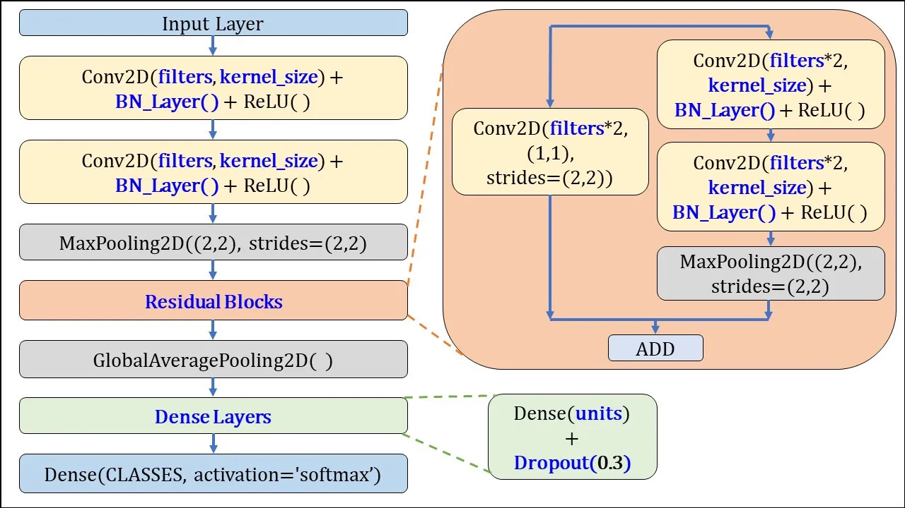
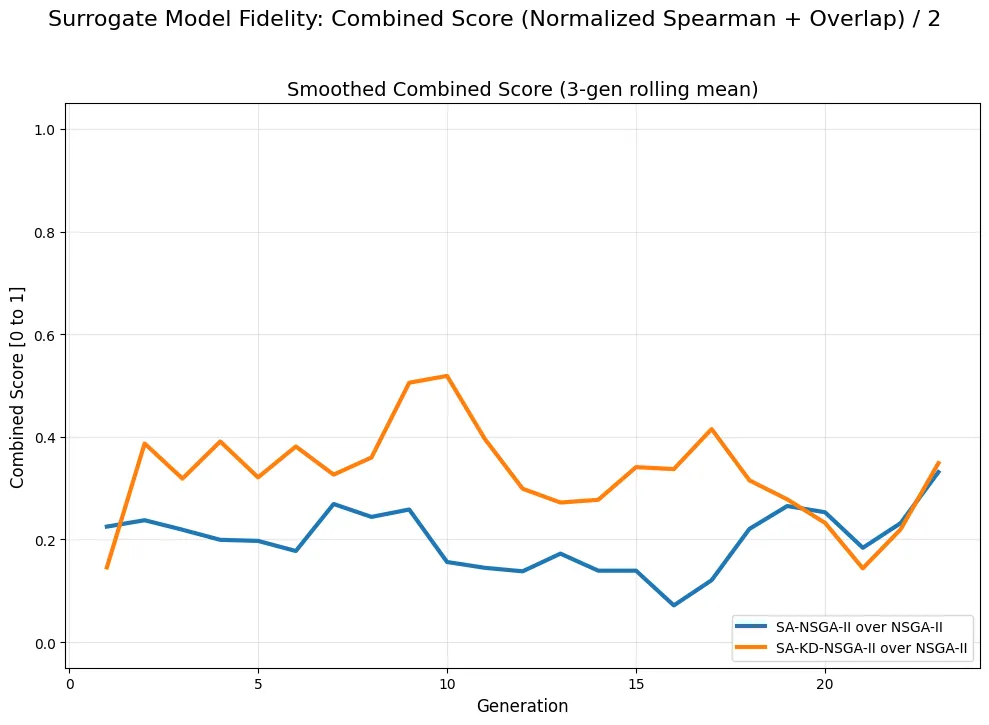
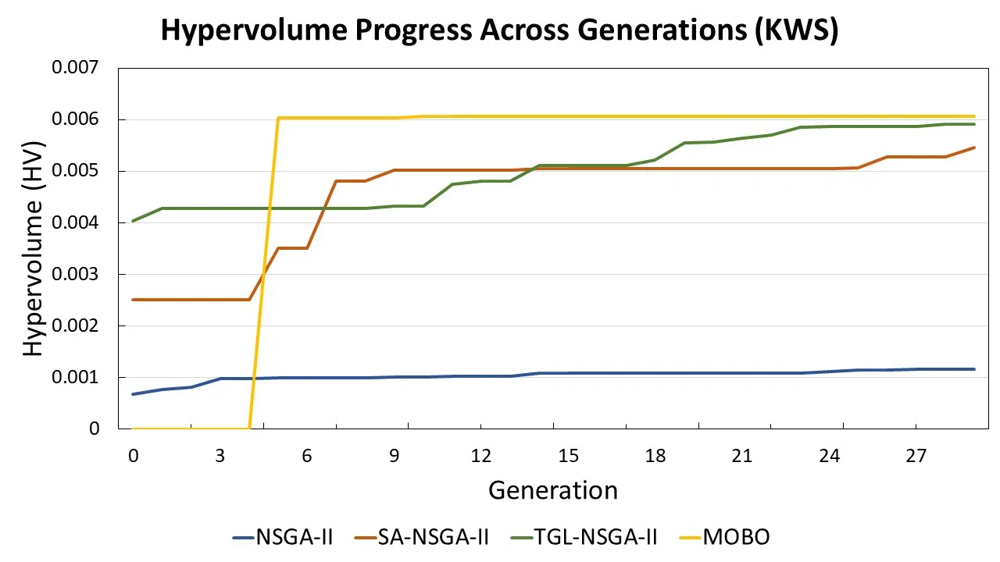
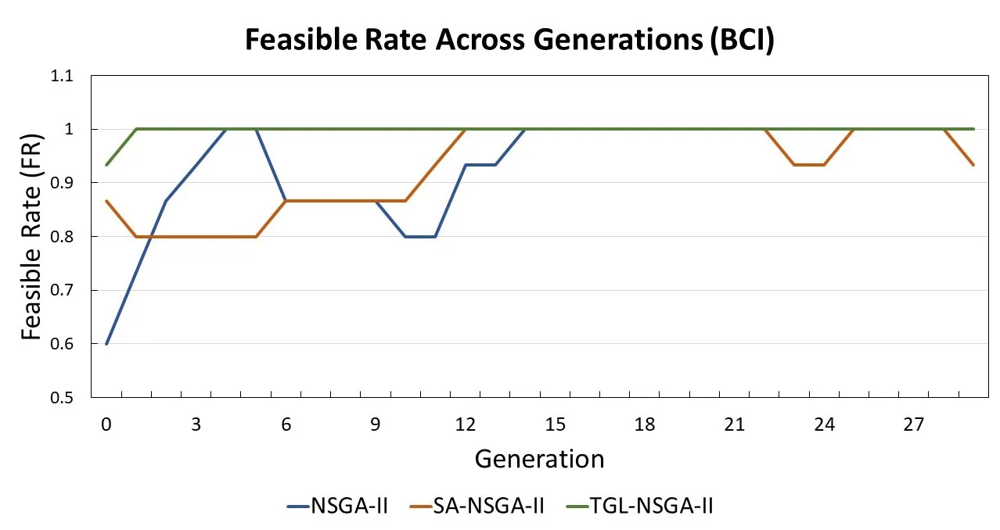
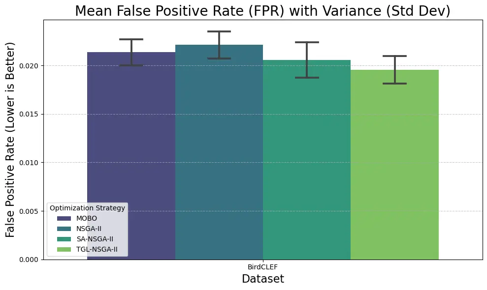
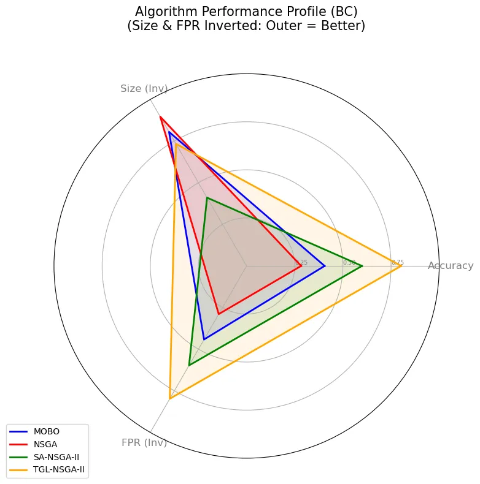

# Rank-Reliable Teacher-Guided Fitness Approximation for Expensive Evolutionary Optimization: A TinyML Architecture Search Study

Soumen Garai    Suman Samui ^(†)^(†)thanks: S. Garai and S. Samui are
with the Department of Electronics and Communication Engineering,
National Institute of Technology Durgapur, West Bengal 713209, India
(e-mail: soumengoroi@gmail.com; ssamui.ece@nitdgp.ac.in). Manuscript
submitted to the _IEEE Transactions on Evolutionary Computation_ Special
Issue on “Evolutionary Computation Meets Machine Learning for
Combinatorial Optimization.”

###### Abstract

Expensive evolutionary search does not always need an exact fitness
estimate for every candidate. It often needs a reliable answer to a
simpler question: which candidate is better? We address this need
through Teacher-Guided Learning NSGA-II (TGL-NSGA-II), a low-fidelity
framework for constrained Tiny Machine Learning (TinyML) neural
architecture search. A pretrained teacher organizes samples into strata
defined jointly by difficulty and class. Each candidate then undergoes
KD-Lite, a short and capped knowledge-distillation procedure on a
compact training set, before being scored on a separate stratified
evaluation set. This teacher-guided score is fused with a
Gaussian-process surrogate to select candidates for full evaluation. For
a fixed candidate population, we analyse evaluation variance, score
concentration, pairwise rank inversion, expected Kendall-$`\tau`$,
first-front identification, and hypervolume perturbation. We also derive
a variance-aware fusion weight and a capacity-adaptive distillation
rule. On keyword spotting and bird-call classification, the measured
Kendall-$`\tau`$ values are $`0.74`$ and $`0.62`$, exceeding the
corresponding predicted lower bounds of $`0.60`$ and $`0.46`$. Joint
stratification reduces proxy-score variance by $`41\%`$ relative to
random evaluation. Selective teacher mismatch, in contrast, increases
differential bias and reduces Kendall-$`\tau`$ to $`0.41`$. Under a
constrained evaluation budget, TGL-NSGA-II achieves the largest mean
hypervolume and smallest generational distance on keyword spotting,
records the lowest mean false-positive rate on BirdCLEF, and runs
$`2.2\times`$ faster than full NSGA-II. These guarantees apply to
population-level low-fidelity evaluation and do not establish
convergence of the complete evolutionary trajectory.

###### Index Terms: 

Combinatorial optimization, constrained multi-objective optimization,
curriculum learning, expensive optimization, fitness
approximation,knowledge distillation (KD), neural architecture search,
TinyML.

## I Introduction

Many practically important optimization problems are simultaneously
combinatorial, constrained, and expensive to evaluate. Their decision
variables are discrete, the search space can grow exponentially with
problem size, multiple conflicting objectives must often be considered,
and hard constraints may render large portions of the search space
infeasible. The difficulty is further compounded when evaluating a
candidate requires an expensive simulation, physical measurement, or
model-training procedure. Evolutionary computation is well suited to
such settings because it can explore discrete design spaces while
maintaining multiple trade-off solutions. When objective evaluations are
costly, surrogate-assisted evolutionary algorithms (SAEAs) can reduce
this burden by using a learned surrogate to approximate expensive
evaluations and reserving the true evaluation budget for selected
candidates. However, as highlighted by Liu et al. \[1\], most SAEA
research has focused on continuous optimization, whereas expensive
combinatorial optimization problems (ECOPs) have received comparatively
less attention despite their practical relevance.

This work considers a representative ECOP from Tiny Machine Learning
(TinyML), where deep-learning models must operate under the stringent
resource constraints of microcontroller-class hardware \[2\].
Specifically, we study neural architecture search (NAS) as a discrete
multi-objective constrained optimization problem. An architecture is
specified by choices such as the number of layers, layer widths, kernel
sizes, normalization options, and quantization configuration, yielding a
rapidly growing discrete search space. Candidate architectures must
balance competing objectives such as predictive performance, memory
usage, latency, and energy consumption. At the same time, SRAM and flash
limits impose hard feasibility constraints: an architecture that exceeds
the available hardware resources cannot be deployed, irrespective of its
predictive performance. The problem is also expensive because reliably
assessing predictive performance requires training the candidate
architecture. These characteristics make population-based
multi-objective evolutionary search particularly suitable; in this work,
NSGA-II \[3\] is used to maintain a diverse set of nondominated
candidate architectures rather than reducing the objectives to a single
predetermined scalarization.

An important feature of this problem is the asymmetry in evaluation
cost. Resource quantities such as memory, latency, and energy can be
obtained efficiently from the architecture encoding and a calibrated
hardware cost model \[4\], whereas estimating predictive performance
requires candidate training and therefore dominates the evaluation cost.
Consequently, the central challenge is not to approximate every
objective equally, but to obtain an inexpensive yet sufficiently
reliable estimate of the expensive performance objective. This
observation motivates the teacher-guided low-fidelity evaluation
developed in this work.

### I-A Capacity Mismatch in Low-Fidelity Ranking

NSGA-II uses objective values in two different ways. Nondominated
sorting compares candidates and asks whether one dominates another.
Crowding distance, however, also depends on the numerical spacing
between objective values and may change under a nonlinear transformation
even when the order is preserved. Our theory therefore focuses on the
comparison-based part of selection. A candidate-independent additive
bias cancels in pairwise comparisons, whereas architecture-dependent
bias can reverse them. Distortion of crowding distance is treated
separately as a limitation. Existing studies already recognize the
importance of ranking. Zero-cost proxies are commonly evaluated using
Spearman correlation \[5\], reduced-training studies report
Kendall-$`\tau`$ retention \[6, 7\], and several recent surrogates
predict order directly \[8, 9, 10\]. The remaining gap appears one step
earlier. The low-fidelity evaluations used to train these surrogates are
usually accepted as given, and their ranking quality is measured only
after they have been constructed. We are not aware of a low-fidelity
mechanism designed with an explicit a priori bound on pairwise inversion
and then linked to perturbation of the Pareto front.

A naive low-fidelity evaluation can fail in a predictable way. When
every candidate is trained briefly on a small subset, the resulting
error is rarely uniform. Small candidates may underfit and appear weaker
than they are, while large candidates may adapt quickly and appear
stronger than they are. The proxy error then becomes correlated with
model capacity, which is itself a variable explored by the search. As a
result, the ranking is not simply noisy; it can be systematically
tilted.

We address this problem with a teacher-guided evaluator that uses
knowledge distillation only as a short and inexpensive measurement
procedure. We call it _KD-Lite_: “KD” refers to knowledge distillation
\[11\], while “Lite” emphasizes that each candidate receives only a
small, capped number of updates on compact data. The complete
Teacher-Guided Learning (TGL) score combines KD-Lite with stratified
evaluation. A Gaussian process (GP) then contributes information from
architectures that have already been fully evaluated. The method follows
four connected steps. First, a pretrained teacher with Monte Carlo
dropout \[12\] uses confidence, margin, and entropy \[13\] to organize
samples by difficulty. Second, two disjoint compact sets are drawn from
strata defined by both difficulty and class. Third, KD-Lite trains each
candidate from easy to hard, using a balance between task loss and
distillation that may vary with capacity (Proposition 3). Finally, the
TGL and GP scores are fused using residual statistics rather than a
manually chosen schedule (Proposition 2). The fused score determines
which offspring receive expensive full evaluation.

### I-B Contributions

These observations lead to the following contributions.

1.  1.  The low-fidelity evaluation problem is reformulated as a
        _ranking-reliability_ task, which is delineated from the already
        well-established problem of learning a rank-aware surrogate model.
2.  2.  TGL-NSGA-II and its low-fidelity evaluator, KD-Lite, are introduced.
        The latter employs short curriculum-based knowledge distillation on
        a compact stratified training set, while an independent stratified
        set is reserved for evaluation. The resulting teacher-guided score
        is then fused with a Gaussian-process surrogate to determine which
        candidates are subjected to expensive full evaluation.
3.  3.  A population-level proof chain is established for a _fixed candidate
        set_. It is shown that stratified evaluation reduces sampling
        variance; from this, a score-concentration bound is derived. This
        concentration result is then leveraged to yield pairwise inversion
        and expected Kendall-$`\tau`$ bounds, which in turn are used to
        control first-front identification. Additionally, the perturbation
        in hypervolume induced by substituting true accuracy with proxy
        accuracy on the same candidate set is bounded.
4.  4.  Two implementation rules are derived. The first rule provides a
        clipped, variance-aware fusion coefficient for the surrogate and
        proxy following the centering of their respective errors. The second
        rule furnishes a first-order capacity-adaptive distillation
        mechanism, which removes the component of signed proxy bias linearly
        correlated with model capacity, provided that the required
        coefficient is feasible. Furthermore, the scope of the theoretical
        guarantees is explicitly stated. These guarantees analyse
        low-fidelity evaluation and population-level selection reliability.

The remainder of the paper develops this argument in stages. Section II
positions the work in the literature, Section III defines the
constrained search problem, and Section IV presents the algorithm.
Section V develops the ranking analysis, after which the experiments and
discussion connect the theoretical quantities to the observed search
behaviour.

## II Related Work and Research Gap

The proposed method lies at the intersection of three research threads:
surrogate-assisted combinatorial optimization, low-fidelity performance
estimation, and teacher-guided learning for constrained TinyML.
Reviewing them together makes the remaining gap clear.

Expensive combinatorial optimization and surrogate-assisted NAS. The
closest problem setting is expensive combinatorial optimization. Liu et
al. \[1\] survey SAEAs for ECOPs and show that discrete problems remain
less developed than the mature continuous branch \[14\]. Han and Wang
\[15\] make an observation that is central to this work: when a
surrogate approximates a constraint, its errors can misguide the search.
This is fundamentally a ranking failure rather than only a
value-accuracy failure. Gu et al. address expensive constrained discrete
problems \[16\] and large-scale binary optimization \[17\] through
surrogate and resource-allocation design. Architecture-search research
has similarly moved from value prediction toward order prediction,
including dominance-relation classifiers \[18\], pairwise comparators
\[10\], order-preserving score predictors \[8\], and group-rank models
with online refinement \[9\]. Other work improves sample efficiency
using architecture embeddings \[19\] or meta-learned few-epoch screening
\[20\]. Model-based approaches such as ParEGO \[21\], MOEA/D-EGO \[22\],
and GP-UCB acquisition \[23\] fit Gaussian processes to evaluations
collected during the search. Lyu et al. \[24\] address surrogate cold
start using transfer stacking and knee-region distillation, while
learned models have also been combined with NSGA-II for CNN tuning
\[25\]. These methods carefully model ranking at the surrogate stage,
but they generally accept the low-fidelity evaluations used to train the
surrogate as given.

Low-fidelity estimation. Within this broader literature, low-fidelity
estimators are usually assessed empirically. Zero-cost proxies report
Spearman $`\rho\!\approx\!0.82`$ \[5\], and reduced-epoch training
reports Kendall $`\tau_{b}\!>\!0.7`$ \[6\]. However, their bias and
variance are typically analysed only after the estimator has been chosen
\[7\]. Training-speed estimators \[26\] and neural-tangent-kernel
estimators at initialization \[27\] follow the same pattern. Zhao et al.
\[28\] further show that unsuitable low-fidelity information can
actively reduce predictor quality in a manner that depends on the search
space. The remaining gap is therefore narrow but important: low-fidelity
labels are rarely constructed with an a priori inversion bound, and we
did not find a result that propagates their comparison error to
perturbation of a population-level Pareto front.

Curriculum, distillation, and constrained TinyML search. Curriculum
learning and knowledge distillation provide two further pieces of this
study. Curriculum theory predicts faster convergence under a useful
ordering \[13\], although its generalization benefit is conditional
rather than universal \[29, 30\]. The idea can be viewed as numerical
continuation \[31\] and dates to Bengio et al. \[32\]; progressive
distillation can also induce an implicit curriculum \[33\]. Distillation
theory studies supervision complexity \[34\] and the limits of matching
a teacher \[35\]. Curriculum and distillation have been combined in
several forms \[36, 37, 38, 39\], including multi-objective losses \[40,
41\] and representational alignment through CKA \[42\]. These methods
aim to train a better final student. In contrast, we use short
distillation as a measuring instrument that feeds an evolutionary
selection operator. For deployment constraints, constrained
multi-objective evolutionary algorithms offer adaptive penalties \[43\],
stochastic ranking \[44\], and $`\varepsilon`$-relaxation \[45\]. We use
an adaptive penalty that combines naturally with a scalar promotion
score. Similar multi-objective formulations have been effective for
constrained embedded design on physiological signals \[46\].
Hardware-aware microcontroller NAS is also well developed \[4, 47, 48,
49, 50, 51\], including surrogate-initialization schemes for tight
evaluation budgets \[52\]. Here again, however, the fitness estimate is
usually treated as an input rather than designed for ranking
reliability.

Table I summarizes the specific distinction used in this paper.

| Literature group                                            | Rank-aware by design      | A priori error bound | Linked to HV perturbation |
| ----------------------------------------------------------- | ------------------------- | -------------------- | ------------------------- |
| Surrogate-assisted evolutionary NAS (ENAS) \[8, 9, 10, 18\] | Surrogate only            | No                   | No                        |
| Low-fidelity and zero-cost proxies \[5, 7, 6, 26\]          | Measured post hoc         | No                   | No                        |
| Curriculum learning with KD \[36, 37, 33\]                  | Not applicable (training) | Not applicable       | No                        |
| SAEAs for ECOPs \[1, 15, 16, 17\]                           | Surrogate only            | No                   | No                        |
| Hardware-aware NAS \[4, 47, 48\]                            | Assumed input             | No                   | No                        |
| This work                                                   | Proxy itself              | Yes (Theorem 2)      | Yes (Proposition 1)       |

TABLE I: Positioning of the proposed method relative to representative
literature groups. HV denotes hypervolume.

Taken together, the literature shows that ranking, low-fidelity
evaluation, distillation, and constrained search are individually well
studied. What is missing is a direct connection between them. Our
contribution is to design the low-fidelity evaluation around explicit
analyses of sampling variance and pairwise inversion, and then connect
the resulting comparison errors to the first nondominated front of a
fixed candidate population. The next section formalizes the optimization
problem for which this connection is needed.

## III Problem Formulation

We now make the setting precise before developing the method. Let
$`\mathcal{A}`$ be a finite architecture space. Each $`a\in\mathcal{A}`$
is a fixed-length vector of _discrete_ design variables: depth,
per-layer width, kernel size, normalization flags, dense-layer count and
quantization choice. With $`L_{\mathrm{arch}}`$ layers drawn from
$`|V|`$ per-layer options plus the global choices, $`|\mathcal{A}|`$
grows as $`O(|V|^{L_{\mathrm{arch}}})`$, so even the modest space of
Table III holds on the order of $`10^{5}`$ feasible-in-principle
designs. The problem is therefore combinatorial in the usual sense, and
expensive in the sense of \[1\]: no closed form links the encoding to
the accuracy objective, which is available only through a training run.
Let $`\mathcal{D}`$ be the labelled pool. Full training gives
$`\theta^{\star}(a)\in\arg\min_{\theta}\mathcal{L}(\theta;a,\mathcal{D})`$,
after which

```math
\mathbf{f}(a)=\big[e(a),\,M(a),\,L(a),\,E_{\mathrm{inf}}(a)\big]^{\!\top}\in\mathbb{R}^{d_{\mathrm{obj}}},\hskip 9.24994ptd_{\mathrm{obj}}=4, \tag{1}
```

with $`e(a)\in[0,1]`$ the validation error, $`M(a)`$ the peak memory,
$`L(a)`$ the latency, and $`E_{\mathrm{inf}}(a)`$ the per-inference
energy. Write $`u(a)=1-e(a)`$.

We use multi-objective neural architecture search (MONAS) to denote
architecture search with more than one objective.

###### Definition 1 (Constrained MONAS problem).

$`\min_{a\in\mathcal{A}}\mathbf{f}(a)`$ subject to $`g_{j}(a)\leq 0`$
for $`j=1,\dots,J`$, where the core constraints encode resource limits
such as $`M(a)\leq M_{\max}`$, $`L(a)\leq L_{\max}`$, and an energy or
flash-memory ceiling. In the audio implementation, false-positive rate
(FPR) is additionally used as an application-level screening and
feasibility metric. Its low-fidelity estimation error is evaluated
empirically and is not part of the single-coordinate ranking theorem.
The total constraint violation (CV) is

```math
\mathrm{CV}(a)=\sum\nolimits_{j}\max\{0,\,g_{j}(a)\}, \tag{2}
```

and $`a`$ is feasible when $`\mathrm{CV}(a)=0`$. The solution is the
feasible Pareto set, scored by the hypervolume of its feasible members
\[53\].

For the theoretical analysis, $`M`$, $`L`$, and $`E_{\mathrm{inf}}`$ are
treated as known from the encoding and the calibrated cost model, so
only the accuracy coordinate is modelled as uncertain. The practical
audio implementation additionally predicts FPR during promotion; true
FPR is used after full evaluation when reporting feasibility.

###### Definition 2 (Proxy, induced order, ranking quality).

A proxy is a map $`S:\mathcal{A}\to\mathbb{R}`$ meant to increase with
$`u`$. For a population $`\mathcal{P}`$ of size $`P`$, the pair
$`(a_{i},a_{j})`$ is _inverted_ when
$`\big(S(a_{i})-S(a_{j})\big)\big(u(a_{i})-u(a_{j})\big)<0`$. With $`D`$
the number of inverted pairs,

```math
\tau(\mathcal{P})=1-2D\big/\tbinom{P}{2}. \tag{3}
```

Equation (3) is the ranking measure commonly reported in the proxy
literature. Having defined both the constrained search problem and its
ranking criterion, we can now construct a low-fidelity evaluator whose
design leads to a lower bound on $`\mathbb{E}[\tau]`$, rather than
relying only on post hoc measurement.

## IV Proposed TGL-NSGA-II Framework

With the ranking criterion now defined, we turn to the complete
TGL-NSGA-II procedure. Its purpose is to reduce expensive full-training
evaluations while preserving the comparisons needed by evolutionary
selection. The method uses two complementary low-cost signals. KD-Lite
supplies a teacher-guided score even when only a few architectures have
been fully evaluated. A Gaussian-process (GP) surrogate then learns from
those fully evaluated architectures and becomes more informative as the
archive grows. Their fused score is used only to decide which offspring
should be promoted to expensive full evaluation.

The complete procedure has an offline stage and a generation-wise search
stage, as shown in Fig. 1. In the offline stage, a fixed pretrained
teacher is used only once to estimate the difficulty of the available
samples. The data are then divided jointly by difficulty and class, and
two disjoint compact sets are drawn: a proxy-training set
$`\mathcal{D}_{\mathrm{tr}}`$ and a proxy-evaluation set
$`\mathcal{D}_{\mathrm{ev}}`$. During the evolutionary search, every
offspring receives a short teacher-guided evaluation on these compact
sets. Only a small fraction of promising or uncertain offspring are then
fully trained. Their true objective values are added to the archive
$`\mathcal{E}`$ and are used to update the GP surrogate. In this way,
the teacher is most useful when the archive is small, while the
surrogate becomes more informative as the search progresses.

![](data:image/svg+xml;base64,PHN2ZyBpZD0iUzQuRjEucGljMSIgY2xhc3M9Imx0eF9waWN0dXJlIGx0eF9jZW50ZXJpbmciIGhlaWdodD0iNDIwLjQ2IiBvdmVyZmxvdz0idmlzaWJsZSIgdmVyc2lvbj0iMS4xIiB2aWV3Ym94PSIwIDAgMzMwLjU5IDQyMC40NiIgd2lkdGg9IjMzMC41OSI+PGcgc3R5bGU9Ii0tbHR4LXN0cm9rZS1jb2xvcjojMDAwMDAwOy0tbHR4LWZpbGwtY29sb3I6IzAwMDAwMDsiIGZpbGw9IiMwMDAwMDAiIHN0cm9rZT0iIzAwMDAwMCIgdHJhbnNmb3JtPSJ0cmFuc2xhdGUoMCw0MjAuNDYpIG1hdHJpeCgxIDAgMCAtMSAwIDApIHRyYW5zbGF0ZSgxMDcuNSwwKSB0cmFuc2xhdGUoMCw0MTAuMzYpIj48ZyBzdHJva2Utd2lkdGg9IjAuNHB0Ij48ZyBzdHJva2UtZGFzaGFycmF5PSIzLjBwdCwzLjBwdCIgc3Ryb2tlLWRhc2hvZmZzZXQ9IjAuMHB0Ij48cGF0aCBzdHlsZT0iZmlsbDpub25lIiBkPSJNIDEyNS42MyA5LjgyIEwgLTUwLjE4IDkuODIgQyAtNTEuNzEgOS44MiAtNTIuOTUgOC41OSAtNTIuOTUgNy4wNiBMIC01Mi45NSAtMTQ0LjE1IEMgLTUyLjk1IC0xNDUuNjggLTUxLjcxIC0xNDYuOTIgLTUwLjE4IC0xNDYuOTIgTCAxMjUuNjMgLTE0Ni45MiBDIDEyNy4xNiAtMTQ2LjkyIDEyOC40IC0xNDUuNjggMTI4LjQgLTE0NC4xNSBMIDEyOC40IDcuMDYgQyAxMjguNCA4LjU5IDEyNy4xNiA5LjgyIDEyNS42MyA5LjgyIFogTSAtNTIuOTUgLTE0Ni45MiIgLz48L2c+PGcgc3R5bGU9Ii0tbHR4LXN0cm9rZS1jb2xvcjojMDAwMDAwOy0tbHR4LWZpbGwtY29sb3I6IzAwMDAwMDsiIGZpbGw9IiMwMDAwMDAiIHN0cm9rZT0iIzAwMDAwMCIgc3Ryb2tlLWRhc2hhcnJheT0iMy4wcHQsMy4wcHQiIHN0cm9rZS1kYXNob2Zmc2V0PSIwLjBwdCIgdHJhbnNmb3JtPSJtYXRyaXgoMS4wIDAuMCAwLjAgMS4wIC00OS42MyAtNjguNTUpIj48Zm9yZWlnbm9iamVjdCBzdHlsZT0iLS1sdHgtZm8td2lkdGg6MTMuNjVlbTstLWx0eC1mby1oZWlnaHQ6MGVtOy0tbHR4LWZvLWRlcHRoOjBlbTtmb250LXNpemU6OXB0OyIgaGVpZ2h0PSIwIiBvdmVyZmxvdz0idmlzaWJsZSIgdHJhbnNmb3JtPSJtYXRyaXgoMSAwIDAgLTEgMCAwKSIgd2lkdGg9IjE2OS45OSI+PHNwYW4gY2xhc3M9Imx0eF9mb3JlaWdub2JqZWN0X2NvbnRhaW5lciI+PHNwYW4gY2xhc3M9Imx0eF9mb3JlaWdub2JqZWN0X2NvbnRlbnQiPgo8c3BhbiBpZD0iUzQuRjEucGljMS4xIiBjbGFzcz0ibHR4X2lubGluZS1ibG9jayBsdHhfbWluaXBhZ2UgbHR4X2FsaWduX3RvcCIgc3R5bGU9IndpZHRoOjEzLjY1ZW07Ij4KPHNwYW4gaWQ9IlM0LkYxLnBpYzEuMS4xIiBjbGFzcz0ibHR4X3AiPjwvc3Bhbj4KPC9zcGFuPjwvc3Bhbj48L3NwYW4+PC9mb3JlaWdub2JqZWN0PjwvZz48ZyBzdHJva2UtZGFzaGFycmF5PSIzLjBwdCwzLjBwdCIgc3Ryb2tlLWRhc2hvZmZzZXQ9IjAuMHB0Ij48cGF0aCBzdHlsZT0iZmlsbDpub25lIiBkPSJNIDIyMC4wNSAtMTU0Ljg2IEwgLTU0LjYxIC0xNTQuODYgQyAtNTYuMTMgLTE1NC44NiAtNTcuMzcgLTE1Ni4xIC01Ny4zNyAtMTU3LjYzIEwgLTU3LjM3IC0zOTkuMTIgQyAtNTcuMzcgLTQwMC42NSAtNTYuMTMgLTQwMS44OCAtNTQuNjEgLTQwMS44OCBMIDIyMC4wNSAtNDAxLjg4IEMgMjIxLjU4IC00MDEuODggMjIyLjgyIC00MDAuNjUgMjIyLjgyIC0zOTkuMTIgTCAyMjIuODIgLTE1Ny42MyBDIDIyMi44MiAtMTU2LjEgMjIxLjU4IC0xNTQuODYgMjIwLjA1IC0xNTQuODYgWiBNIC01Ny4zNyAtNDAxLjg4IiAvPjwvZz48ZyBzdHlsZT0iLS1sdHgtc3Ryb2tlLWNvbG9yOiMwMDAwMDA7LS1sdHgtZmlsbC1jb2xvcjojMDAwMDAwOyIgZmlsbD0iIzAwMDAwMCIgc3Ryb2tlPSIjMDAwMDAwIiBzdHJva2UtZGFzaGFycmF5PSIzLjBwdCwzLjBwdCIgc3Ryb2tlLWRhc2hvZmZzZXQ9IjAuMHB0IiB0cmFuc2Zvcm09Im1hdHJpeCgxLjAgMC4wIDAuMCAxLjAgLTUzLjIyIC0yNzguMzcpIj48Zm9yZWlnbm9iamVjdCBzdHlsZT0iLS1sdHgtZm8td2lkdGg6MjEuMjRlbTstLWx0eC1mby1oZWlnaHQ6MGVtOy0tbHR4LWZvLWRlcHRoOjBlbTtmb250LXNpemU6OXB0OyIgaGVpZ2h0PSIwIiBvdmVyZmxvdz0idmlzaWJsZSIgdHJhbnNmb3JtPSJtYXRyaXgoMSAwIDAgLTEgMCAwKSIgd2lkdGg9IjI2NC41MSI+PHNwYW4gY2xhc3M9Imx0eF9mb3JlaWdub2JqZWN0X2NvbnRhaW5lciI+PHNwYW4gY2xhc3M9Imx0eF9mb3JlaWdub2JqZWN0X2NvbnRlbnQiPgo8c3BhbiBpZD0iUzQuRjEucGljMS4yIiBjbGFzcz0ibHR4X2lubGluZS1ibG9jayBsdHhfbWluaXBhZ2UgbHR4X2FsaWduX3RvcCIgc3R5bGU9IndpZHRoOjIxLjI0ZW07Ij4KPHNwYW4gaWQ9IlM0LkYxLnBpYzEuMi4xIiBjbGFzcz0ibHR4X3AiPjwvc3Bhbj4KPC9zcGFuPjwvc3Bhbj48L3NwYW4+PC9mb3JlaWdub2JqZWN0PjwvZz48ZyBzdHlsZT0iLS1sdHgtc3Ryb2tlLWNvbG9yOiMwMDAwMDA7LS1sdHgtZmlsbC1jb2xvcjojMDAwMDAwOyIgZmlsbD0iIzAwMDAwMCIgc3Ryb2tlPSIjMDAwMDAwIiB0cmFuc2Zvcm09Im1hdHJpeCgxLjAgMC4wIDAuMCAxLjAgLTQ3Ljk2IC0yLjQyKSI+PGZvcmVpZ25vYmplY3Qgc3R5bGU9Ii0tbHR4LWZvLXdpZHRoOjguNGVtOy0tbHR4LWZvLWhlaWdodDowLjYyZW07LS1sdHgtZm8tZGVwdGg6MC4yMWVtO2ZvbnQtc2l6ZTo4LjQ0cHQ7IiBoZWlnaHQ9IjkuNjkiIG92ZXJmbG93PSJ2aXNpYmxlIiB0cmFuc2Zvcm09Im1hdHJpeCgxIDAgMCAtMSAwIDcuMjYpIiB3aWR0aD0iOTguMjEiPjxzcGFuIGNsYXNzPSJsdHhfZm9yZWlnbm9iamVjdF9jb250YWluZXIiPjxzcGFuIGNsYXNzPSJsdHhfZm9yZWlnbm9iamVjdF9jb250ZW50Ij48c3BhbiBpZD0iUzQuRjEucGljMS4zIiBjbGFzcz0ibHR4X3RleHQgbHR4X2ZvbnRfaXRhbGljIiBzdHlsZT0iZm9udC1zaXplOjcwJTsiPihhKSBvbmNlIHBlciBzZWFyY2g8L3NwYW4+PC9zcGFuPjwvc3Bhbj48L2ZvcmVpZ25vYmplY3Q+PC9nPjxwYXRoIHN0eWxlPSJmaWxsOm5vbmUiIGQ9Ik0gMjUuNjcgLTEyLjY5IEwgLTQ3LjQxIC0xMi42OSBDIC00OC40OCAtMTIuNjkgLTQ5LjM1IC0xMy41NSAtNDkuMzUgLTE0LjYyIEwgLTQ5LjM1IC0zMC40MyBDIC00OS4zNSAtMzEuNSAtNDguNDggLTMyLjM3IC00Ny40MSAtMzIuMzcgTCAyNS42NyAtMzIuMzcgQyAyNi43NCAtMzIuMzcgMjcuNjEgLTMxLjUgMjcuNjEgLTMwLjQzIEwgMjcuNjEgLTE0LjYyIEMgMjcuNjEgLTEzLjU1IDI2Ljc0IC0xMi42OSAyNS42NyAtMTIuNjkgWiBNIC00OS4zNSAtMzIuMzciIC8+PGcgc3R5bGU9Ii0tbHR4LXN0cm9rZS1jb2xvcjojMDAwMDAwOy0tbHR4LWZpbGwtY29sb3I6IzAwMDAwMDsiIGZpbGw9IiMwMDAwMDAiIHN0cm9rZT0iIzAwMDAwMCIgdHJhbnNmb3JtPSJtYXRyaXgoMS4wIDAuMCAwLjAgMS4wIC00Ni4zIC0yNS44OSkiPjxmb3JlaWdub2JqZWN0IHN0eWxlPSItLWx0eC1mby13aWR0aDo2LjQyZW07LS1sdHgtZm8taGVpZ2h0OjAuNTRlbTstLWx0eC1mby1kZXB0aDowZW07Zm9udC1zaXplOjlwdDsiIGhlaWdodD0iNi43MyIgb3ZlcmZsb3c9InZpc2libGUiIHRyYW5zZm9ybT0ibWF0cml4KDEgMCAwIC0xIDAgNi43MykiIHdpZHRoPSI3OS45NSI+PHNwYW4gY2xhc3M9Imx0eF9mb3JlaWdub2JqZWN0X2NvbnRhaW5lciI+PHNwYW4gY2xhc3M9Imx0eF9mb3JlaWdub2JqZWN0X2NvbnRlbnQiPgo8c3BhbiBpZD0iUzQuRjEucGljMS40IiBjbGFzcz0ibHR4X2lubGluZS1ibG9jayBsdHhfbWluaXBhZ2UgbHR4X2FsaWduX3RvcCIgc3R5bGU9IndpZHRoOjYuNDJlbTsiPgo8c3BhbiBpZD0iUzQuRjEucGljMS40LjEiIGNsYXNzPSJsdHhfcCI+PC9zcGFuPgo8c3BhbiBpZD0iUzQuRjEucGljMS40LjIiIGNsYXNzPSJsdHhfcCI+PHNwYW4gaWQ9IlM0LkYxLnBpYzEuNC4yLjEiIGNsYXNzPSJsdHhfdGV4dCIgc3R5bGU9ImZvbnQtc2l6ZTo3MCU7Ij5Qb29sIDxtYXRoIGlkPSJTNC5GMS5waWMxLm0xIiBjbGFzcz0ibHR4X01hdGgiIGFsdHRleHQ9IlxtYXRoY2Fse0R9IiBkaXNwbGF5PSJpbmxpbmUiIGludGVudD0iOmxpdGVyYWwiPjxzZW1hbnRpY3M+PG1pIGNsYXNzPSJsdHhfZm9udF9tYXRoY2FsaWdyYXBoaWMiPvCdkp88L21pPjxhbm5vdGF0aW9uIGVuY29kaW5nPSJhcHBsaWNhdGlvbi94LXRleCI+XG1hdGhjYWx7RH08L2Fubm90YXRpb24+PC9zZW1hbnRpY3M+PC9tYXRoPjwvc3Bhbj48L3NwYW4+Cjwvc3Bhbj48L3NwYW4+PC9zcGFuPjwvZm9yZWlnbm9iamVjdD48L2c+PHBhdGggc3R5bGU9ImZpbGw6bm9uZSIgZD0iTSAxMjIuODYgLTYuODggTCA0OS43OCAtNi44OCBDIDQ4LjcxIC02Ljg4IDQ3Ljg0IC03Ljc0IDQ3Ljg0IC04LjgxIEwgNDcuODQgLTM2LjI0IEMgNDcuODQgLTM3LjMxIDQ4LjcxIC0zOC4xOCA0OS43OCAtMzguMTggTCAxMjIuODYgLTM4LjE4IEMgMTIzLjkzIC0zOC4xOCAxMjQuOCAtMzcuMzEgMTI0LjggLTM2LjI0IEwgMTI0LjggLTguODEgQyAxMjQuOCAtNy43NCAxMjMuOTMgLTYuODggMTIyLjg2IC02Ljg4IFogTSA0Ny44NCAtMzguMTgiIC8+PGcgc3R5bGU9Ii0tbHR4LXN0cm9rZS1jb2xvcjojMDAwMDAwOy0tbHR4LWZpbGwtY29sb3I6IzAwMDAwMDsiIGZpbGw9IiMwMDAwMDAiIHN0cm9rZT0iIzAwMDAwMCIgdHJhbnNmb3JtPSJtYXRyaXgoMS4wIDAuMCAwLjAgMS4wIDUwLjg5IC0xNi42NSkiPjxmb3JlaWdub2JqZWN0IHN0eWxlPSItLWx0eC1mby13aWR0aDo2LjQyZW07LS1sdHgtZm8taGVpZ2h0OjAuNTRlbTstLWx0eC1mby1kZXB0aDoxLjQ4ZW07Zm9udC1zaXplOjlwdDsiIGhlaWdodD0iMjUuMjEiIG92ZXJmbG93PSJ2aXNpYmxlIiB0cmFuc2Zvcm09Im1hdHJpeCgxIDAgMCAtMSAwIDYuNzMpIiB3aWR0aD0iNzkuOTUiPjxzcGFuIGNsYXNzPSJsdHhfZm9yZWlnbm9iamVjdF9jb250YWluZXIiPjxzcGFuIGNsYXNzPSJsdHhfZm9yZWlnbm9iamVjdF9jb250ZW50Ij4KPHNwYW4gaWQ9IlM0LkYxLnBpYzEuNSIgY2xhc3M9Imx0eF9pbmxpbmUtYmxvY2sgbHR4X21pbmlwYWdlIGx0eF9hbGlnbl90b3AiIHN0eWxlPSJ3aWR0aDo2LjQyZW07Ij4KPHNwYW4gaWQ9IlM0LkYxLnBpYzEuNS4xIiBjbGFzcz0ibHR4X3AiPjwvc3Bhbj4KPHNwYW4gaWQ9IlM0LkYxLnBpYzEuNS4yIiBjbGFzcz0ibHR4X3AiPjxzcGFuIGlkPSJTNC5GMS5waWMxLjUuMi4xIiBjbGFzcz0ibHR4X3RleHQiIHN0eWxlPSJmb250LXNpemU6NzAlOyI+VGVhY2hlciA8bWF0aCBpZD0iUzQuRjEucGljMS5tMiIgY2xhc3M9Imx0eF9NYXRoIiBhbHR0ZXh0PSJUX3tccGhpfSIgZGlzcGxheT0iaW5saW5lIiBpbnRlbnQ9IjpsaXRlcmFsIj48c2VtYW50aWNzPjxtc3ViPjxtaT5UPC9taT48bWk+z5U8L21pPjwvbXN1Yj48YW5ub3RhdGlvbiBlbmNvZGluZz0iYXBwbGljYXRpb24veC10ZXgiPlRfe1xwaGl9PC9hbm5vdGF0aW9uPjwvc2VtYW50aWNzPjwvbWF0aD48L3NwYW4+PC9zcGFuPgo8c3BhbiBpZD0iUzQuRjEucGljMS41LjMiIGNsYXNzPSJsdHhfcCI+PHNwYW4gaWQ9IlM0LkYxLnBpYzEuNS4zLjEiIGNsYXNzPSJsdHhfdGV4dCIgc3R5bGU9ImZvbnQtc2l6ZTo3MCU7Ij5NQyBkcm9wb3V0IDxtYXRoIGlkPSJTNC5GMS5waWMxLm0zIiBjbGFzcz0ibHR4X01hdGgiIGFsdHRleHQ9Ilx0aW1lcyBLIiBkaXNwbGF5PSJpbmxpbmUiIGludGVudD0iOmxpdGVyYWwiPjxzZW1hbnRpY3M+PG1yb3c+PG1waGFudG9tPjwvbXBoYW50b20+PG1vIGxzcGFjZT0iMC4yMjJlbSIgcnNwYWNlPSIwLjIyMmVtIj7DlzwvbW8+PG1pPks8L21pPjwvbXJvdz48YW5ub3RhdGlvbiBlbmNvZGluZz0iYXBwbGljYXRpb24veC10ZXgiPlx0aW1lcyBLPC9hbm5vdGF0aW9uPjwvc2VtYW50aWNzPjwvbWF0aD48L3NwYW4+PC9zcGFuPgo8L3NwYW4+PC9zcGFuPjwvc3Bhbj48L2ZvcmVpZ25vYmplY3Q+PC9nPjxwYXRoIHN0eWxlPSJmaWxsOm5vbmUiIGQ9Ik0gMTIyLjg2IC01Mi4xMiBMIDQ5Ljc4IC01Mi4xMiBDIDQ4LjcxIC01Mi4xMiA0Ny44NCAtNTIuOTkgNDcuODQgLTU0LjA2IEwgNDcuODQgLTk4LjA5IEMgNDcuODQgLTk5LjE2IDQ4LjcxIC0xMDAuMDMgNDkuNzggLTEwMC4wMyBMIDEyMi44NiAtMTAwLjAzIEMgMTIzLjkzIC0xMDAuMDMgMTI0LjggLTk5LjE2IDEyNC44IC05OC4wOSBMIDEyNC44IC01NC4wNiBDIDEyNC44IC01Mi45OSAxMjMuOTMgLTUyLjEyIDEyMi44NiAtNTIuMTIgWiBNIDQ3Ljg0IC0xMDAuMDMiIC8+PGcgc3R5bGU9Ii0tbHR4LXN0cm9rZS1jb2xvcjojMDAwMDAwOy0tbHR4LWZpbGwtY29sb3I6IzAwMDAwMDsiIGZpbGw9IiMwMDAwMDAiIHN0cm9rZT0iIzAwMDAwMCIgdHJhbnNmb3JtPSJtYXRyaXgoMS4wIDAuMCAwLjAgMS4wIDUwLjg5IC02MS44OSkiPjxmb3JlaWdub2JqZWN0IHN0eWxlPSItLWx0eC1mby13aWR0aDo2LjQyZW07LS1sdHgtZm8taGVpZ2h0OjAuNTRlbTstLWx0eC1mby1kZXB0aDoyLjgyZW07Zm9udC1zaXplOjlwdDsiIGhlaWdodD0iNDEuODIiIG92ZXJmbG93PSJ2aXNpYmxlIiB0cmFuc2Zvcm09Im1hdHJpeCgxIDAgMCAtMSAwIDYuNzMpIiB3aWR0aD0iNzkuOTUiPjxzcGFuIGNsYXNzPSJsdHhfZm9yZWlnbm9iamVjdF9jb250YWluZXIiPjxzcGFuIGNsYXNzPSJsdHhfZm9yZWlnbm9iamVjdF9jb250ZW50Ij4KPHNwYW4gaWQ9IlM0LkYxLnBpYzEuNiIgY2xhc3M9Imx0eF9pbmxpbmUtYmxvY2sgbHR4X21pbmlwYWdlIGx0eF9hbGlnbl90b3AiIHN0eWxlPSJ3aWR0aDo2LjQyZW07Ij4KPHNwYW4gaWQ9IlM0LkYxLnBpYzEuNi4xIiBjbGFzcz0ibHR4X3AiPjwvc3Bhbj4KPHNwYW4gaWQ9IlM0LkYxLnBpYzEuNi4yIiBjbGFzcz0ibHR4X3AiPjxzcGFuIGlkPSJTNC5GMS5waWMxLjYuMi4xIiBjbGFzcz0ibHR4X3RleHQiIHN0eWxlPSJmb250LXNpemU6NzAlOyI+ZGlmZmljdWx0eSA8bWF0aCBpZD0iUzQuRjEucGljMS5tNCIgY2xhc3M9Imx0eF9NYXRoIiBhbHR0ZXh0PSJkX3tpfSIgZGlzcGxheT0iaW5saW5lIiBpbnRlbnQ9IjpsaXRlcmFsIj48c2VtYW50aWNzPjxtc3ViPjxtaT5kPC9taT48bWk+aTwvbWk+PC9tc3ViPjxhbm5vdGF0aW9uIGVuY29kaW5nPSJhcHBsaWNhdGlvbi94LXRleCI+ZF97aX08L2Fubm90YXRpb24+PC9zZW1hbnRpY3M+PC9tYXRoPjwvc3Bhbj48L3NwYW4+CjxzcGFuIGlkPSJTNC5GMS5waWMxLjYuMyIgY2xhc3M9Imx0eF9wIj48c3BhbiBpZD0iUzQuRjEucGljMS42LjMuMSIgY2xhc3M9Imx0eF90ZXh0IiBzdHlsZT0iZm9udC1zaXplOjcwJTsiPmZyb20gPG1hdGggaWQ9IlM0LkYxLnBpYzEubTUiIGNsYXNzPSJsdHhfTWF0aCIgYWx0dGV4dD0iY197aX0sbV97aX0sXHdpZGV0aWxkZXtIfV97aX0iIGRpc3BsYXk9ImlubGluZSIgaW50ZW50PSI6bGl0ZXJhbCI+PHNlbWFudGljcz48bXJvdz48bXN1Yj48bWk+YzwvbWk+PG1pPmk8L21pPjwvbXN1Yj48bW8+LDwvbW8+PG1zdWI+PG1pPm08L21pPjxtaT5pPC9taT48L21zdWI+PG1vPiw8L21vPjxtc3ViPjxtb3ZlciBhY2NlbnQ9InRydWUiPjxtaT5IPC9taT48bW8gbWF0aHNpemU9IjEuMjkwZW0iPn48L21vPjwvbW92ZXI+PG1pPmk8L21pPjwvbXN1Yj48L21yb3c+PGFubm90YXRpb24gZW5jb2Rpbmc9ImFwcGxpY2F0aW9uL3gtdGV4Ij5jX3tpfSxtX3tpfSxcd2lkZXRpbGRle0h9X3tpfTwvYW5ub3RhdGlvbj48L3NlbWFudGljcz48L21hdGg+PC9zcGFuPjwvc3Bhbj4KPC9zcGFuPjwvc3Bhbj48L3NwYW4+PC9mb3JlaWdub2JqZWN0PjwvZz48cGF0aCBzdHlsZT0iZmlsbDpub25lIiBkPSJNIDI1LjY3IC01My4xNyBMIC00Ny40MSAtNTMuMTcgQyAtNDguNDggLTUzLjE3IC00OS4zNSAtNTQuMDMgLTQ5LjM1IC01NS4xIEwgLTQ5LjM1IC05Ny4wNCBDIC00OS4zNSAtOTguMTEgLTQ4LjQ4IC05OC45OCAtNDcuNDEgLTk4Ljk4IEwgMjUuNjcgLTk4Ljk4IEMgMjYuNzQgLTk4Ljk4IDI3LjYxIC05OC4xMSAyNy42MSAtOTcuMDQgTCAyNy42MSAtNTUuMSBDIDI3LjYxIC01NC4wMyAyNi43NCAtNTMuMTcgMjUuNjcgLTUzLjE3IFogTSAtNDkuMzUgLTk4Ljk4IiAvPjxnIHN0eWxlPSItLWx0eC1zdHJva2UtY29sb3I6IzAwMDAwMDstLWx0eC1maWxsLWNvbG9yOiMwMDAwMDA7IiBmaWxsPSIjMDAwMDAwIiBzdHJva2U9IiMwMDAwMDAiIHRyYW5zZm9ybT0ibWF0cml4KDEuMCAwLjAgMC4wIDEuMCAtNDYuMyAtNjIuNzMpIj48Zm9yZWlnbm9iamVjdCBzdHlsZT0iLS1sdHgtZm8td2lkdGg6Ni40MmVtOy0tbHR4LWZvLWhlaWdodDowLjUyZW07LS1sdHgtZm8tZGVwdGg6Mi42N2VtO2ZvbnQtc2l6ZTo5cHQ7IiBoZWlnaHQ9IjM5LjcyIiBvdmVyZmxvdz0idmlzaWJsZSIgdHJhbnNmb3JtPSJtYXRyaXgoMSAwIDAgLTEgMCA2LjUyKSIgd2lkdGg9Ijc5Ljk1Ij48c3BhbiBjbGFzcz0ibHR4X2ZvcmVpZ25vYmplY3RfY29udGFpbmVyIj48c3BhbiBjbGFzcz0ibHR4X2ZvcmVpZ25vYmplY3RfY29udGVudCI+CjxzcGFuIGlkPSJTNC5GMS5waWMxLjciIGNsYXNzPSJsdHhfaW5saW5lLWJsb2NrIGx0eF9taW5pcGFnZSBsdHhfYWxpZ25fdG9wIiBzdHlsZT0id2lkdGg6Ni40MmVtOyI+CjxzcGFuIGlkPSJTNC5GMS5waWMxLjcuMSIgY2xhc3M9Imx0eF9wIj48L3NwYW4+CjxzcGFuIGlkPSJTNC5GMS5waWMxLjcuMiIgY2xhc3M9Imx0eF9wIj48c3BhbiBpZD0iUzQuRjEucGljMS43LjIuMSIgY2xhc3M9Imx0eF90ZXh0IiBzdHlsZT0iZm9udC1zaXplOjcwJTsiPmpvaW50IHN0cmF0YTogZGlmZmljdWx0eSA8bWF0aCBpZD0iUzQuRjEucGljMS5tNiIgY2xhc3M9Imx0eF9NYXRoIiBhbHR0ZXh0PSJcdGltZXMiIGRpc3BsYXk9ImlubGluZSIgaW50ZW50PSI6bGl0ZXJhbCI+PHNlbWFudGljcz48bW8+w5c8L21vPjxhbm5vdGF0aW9uIGVuY29kaW5nPSJhcHBsaWNhdGlvbi94LXRleCI+XHRpbWVzPC9hbm5vdGF0aW9uPjwvc2VtYW50aWNzPjwvbWF0aD4gY2xhc3M8L3NwYW4+PC9zcGFuPgo8L3NwYW4+PC9zcGFuPjwvc3Bhbj48L2ZvcmVpZ25vYmplY3Q+PC9nPjxwYXRoIHN0eWxlPSJmaWxsOm5vbmUiIGQ9Ik0gMTE2LjIyIC0xMTIuMTMgTCAtNDcuNDEgLTExMi4xMyBDIC00OC40OCAtMTEyLjEzIC00OS4zNSAtMTEzIC00OS4zNSAtMTE0LjA3IEwgLTQ5LjM1IC0xNDEuMzkgQyAtNDkuMzUgLTE0Mi40NiAtNDguNDggLTE0My4zMiAtNDcuNDEgLTE0My4zMiBMIDExNi4yMiAtMTQzLjMyIEMgMTE3LjI5IC0xNDMuMzIgMTE4LjE2IC0xNDIuNDYgMTE4LjE2IC0xNDEuMzkgTCAxMTguMTYgLTExNC4wNyBDIDExOC4xNiAtMTEzIDExNy4yOSAtMTEyLjEzIDExNi4yMiAtMTEyLjEzIFogTSAtNDkuMzUgLTE0My4zMiIgLz48ZyBzdHlsZT0iLS1sdHgtc3Ryb2tlLWNvbG9yOiMwMDAwMDA7LS1sdHgtZmlsbC1jb2xvcjojMDAwMDAwOyIgZmlsbD0iIzAwMDAwMCIgc3Ryb2tlPSIjMDAwMDAwIiB0cmFuc2Zvcm09Im1hdHJpeCgxLjAgMC4wIDAuMCAxLjAgLTQ2LjMgLTEyMS43OSkiPjxmb3JlaWdub2JqZWN0IHN0eWxlPSItLWx0eC1mby13aWR0aDoxNC42NGVtOy0tbHR4LWZvLWhlaWdodDowLjUzZW07LS1sdHgtZm8tZGVwdGg6MS40OGVtO2ZvbnQtc2l6ZTo5cHQ7IiBoZWlnaHQ9IjI1LjExIiBvdmVyZmxvdz0idmlzaWJsZSIgdHJhbnNmb3JtPSJtYXRyaXgoMSAwIDAgLTEgMCA2LjYyKSIgd2lkdGg9IjE4Mi4zMiI+PHNwYW4gY2xhc3M9Imx0eF9mb3JlaWdub2JqZWN0X2NvbnRhaW5lciI+PHNwYW4gY2xhc3M9Imx0eF9mb3JlaWdub2JqZWN0X2NvbnRlbnQiPgo8c3BhbiBpZD0iUzQuRjEucGljMS44IiBjbGFzcz0ibHR4X2lubGluZS1ibG9jayBsdHhfbWluaXBhZ2UgbHR4X2FsaWduX3RvcCIgc3R5bGU9IndpZHRoOjE0LjY0ZW07Ij4KPHNwYW4gaWQ9IlM0LkYxLnBpYzEuOC4xIiBjbGFzcz0ibHR4X3AiPjwvc3Bhbj4KPHNwYW4gaWQ9IlM0LkYxLnBpYzEuOC4yIiBjbGFzcz0ibHR4X3AiPjxzcGFuIGlkPSJTNC5GMS5waWMxLjguMi4xIiBjbGFzcz0ibHR4X3RleHQiIHN0eWxlPSJmb250LXNpemU6NzAlOyI+Y29tcGFjdCBzZXRzOiBwcm94eSB0cmFpbiA8bWF0aCBpZD0iUzQuRjEucGljMS5tNyIgY2xhc3M9Imx0eF9NYXRoIiBhbHR0ZXh0PSJcbWF0aGNhbHtEfV97XG1hdGhybXt0cn19IiBkaXNwbGF5PSJpbmxpbmUiIGludGVudD0iOmxpdGVyYWwiPjxzZW1hbnRpY3M+PG1zdWI+PG1pIGNsYXNzPSJsdHhfZm9udF9tYXRoY2FsaWdyYXBoaWMiPvCdkp88L21pPjxtaT50cjwvbWk+PC9tc3ViPjxhbm5vdGF0aW9uIGVuY29kaW5nPSJhcHBsaWNhdGlvbi94LXRleCI+XG1hdGhjYWx7RH1fe1xtYXRocm17dHJ9fTwvYW5ub3RhdGlvbj48L3NlbWFudGljcz48L21hdGg+OyBwcm94eSBldmFsdWF0ZSA8bWF0aCBpZD0iUzQuRjEucGljMS5tOCIgY2xhc3M9Imx0eF9NYXRoIiBhbHR0ZXh0PSJcbWF0aGNhbHtEfV97XG1hdGhybXtldn19IiBkaXNwbGF5PSJpbmxpbmUiIGludGVudD0iOmxpdGVyYWwiPjxzZW1hbnRpY3M+PG1zdWI+PG1pIGNsYXNzPSJsdHhfZm9udF9tYXRoY2FsaWdyYXBoaWMiPvCdkp88L21pPjxtaT5ldjwvbWk+PC9tc3ViPjxhbm5vdGF0aW9uIGVuY29kaW5nPSJhcHBsaWNhdGlvbi94LXRleCI+XG1hdGhjYWx7RH1fe1xtYXRocm17ZXZ9fTwvYW5ub3RhdGlvbj48L3NlbWFudGljcz48L21hdGg+PC9zcGFuPjwvc3Bhbj4KPC9zcGFuPjwvc3Bhbj48L3NwYW4+PC9mb3JlaWdub2JqZWN0PjwvZz48cGF0aCBzdHlsZT0iZmlsbDpub25lIiBkPSJNIDI3Ljg4IC0yMi41MyBMIDQxLjk0IC0yMi41MyIgLz48ZyBzdHJva2UtZGFzaGFycmF5PSJub25lIiBzdHJva2UtZGFzaG9mZnNldD0iMC4wcHQiIHN0cm9rZS1saW5lam9pbj0ibWl0ZXIiIHRyYW5zZm9ybT0ibWF0cml4KDEuMCAwLjAgMC4wIDEuMCA0MS45NCAtMjIuNTMpIj48cGF0aCBkPSJNIDQuNTIgMCBDIDMuOTcgMC4xNCAxLjUzIDAuOSAwIDEuNzMgTCAwIC0xLjczIEMgMS41MyAtMC45IDMuOTcgLTAuMTQgNC41MiAwIFoiIC8+PC9nPjxwYXRoIHN0eWxlPSJmaWxsOm5vbmUiIGQ9Ik0gODYuMzIgLTM4LjQ2IEwgODYuMzIgLTQ2LjIxIiAvPjxnIHN0cm9rZS1kYXNoYXJyYXk9Im5vbmUiIHN0cm9rZS1kYXNob2Zmc2V0PSIwLjBwdCIgc3Ryb2tlLWxpbmVqb2luPSJtaXRlciIgdHJhbnNmb3JtPSJtYXRyaXgoMC4wIC0xLjAgMS4wIDAuMCA4Ni4zMiAtNDYuMjEpIj48cGF0aCBkPSJNIDQuNTIgMCBDIDMuOTcgMC4xNCAxLjUzIDAuOSAwIDEuNzMgTCAwIC0xLjczIEMgMS41MyAtMC45IDMuOTcgLTAuMTQgNC41MiAwIFoiIC8+PC9nPjxwYXRoIHN0eWxlPSJmaWxsOm5vbmUiIGQ9Ik0gNDcuNTcgLTc2LjA3IEwgMzMuNTEgLTc2LjA3IiAvPjxnIHN0cm9rZS1kYXNoYXJyYXk9Im5vbmUiIHN0cm9rZS1kYXNob2Zmc2V0PSIwLjBwdCIgc3Ryb2tlLWxpbmVqb2luPSJtaXRlciIgdHJhbnNmb3JtPSJtYXRyaXgoLTEuMCAwLjAgMC4wIC0xLjAgMzMuNTEgLTc2LjA3KSI+PHBhdGggZD0iTSA0LjUyIDAgQyAzLjk3IDAuMTQgMS41MyAwLjkgMCAxLjczIEwgMCAtMS43MyBDIDEuNTMgLTAuOSAzLjk3IC0wLjE0IDQuNTIgMCBaIiAvPjwvZz48cGF0aCBzdHlsZT0iZmlsbDpub25lIiBkPSJNIC0xMC44NyAtOTkuMjUgTCAtMTAuODcgLTEwNi4yMiIgLz48ZyBzdHJva2UtZGFzaGFycmF5PSJub25lIiBzdHJva2UtZGFzaG9mZnNldD0iMC4wcHQiIHN0cm9rZS1saW5lam9pbj0ibWl0ZXIiIHRyYW5zZm9ybT0ibWF0cml4KDAuMCAtMS4wIDEuMCAwLjAgLTEwLjg3IC0xMDYuMjIpIj48cGF0aCBkPSJNIDQuNTIgMCBDIDMuOTcgMC4xNCAxLjUzIDAuOSAwIDEuNzMgTCAwIC0xLjczIEMgMS41MyAtMC45IDMuOTcgLTAuMTQgNC41MiAwIFoiIC8+PC9nPjxnIHN0eWxlPSItLWx0eC1zdHJva2UtY29sb3I6IzAwMDAwMDstLWx0eC1maWxsLWNvbG9yOiMwMDAwMDA7IiBmaWxsPSIjMDAwMDAwIiBzdHJva2U9IiMwMDAwMDAiIHRyYW5zZm9ybT0ibWF0cml4KDEuMCAwLjAgMC4wIDEuMCAtNTEuNTYgLTE2Ny45MykiPjxmb3JlaWdub2JqZWN0IHN0eWxlPSItLWx0eC1mby13aWR0aDo4LjM3ZW07LS1sdHgtZm8taGVpZ2h0OjAuNjJlbTstLWx0eC1mby1kZXB0aDowLjIxZW07Zm9udC1zaXplOjguNDRwdDsiIGhlaWdodD0iOS42OSIgb3ZlcmZsb3c9InZpc2libGUiIHRyYW5zZm9ybT0ibWF0cml4KDEgMCAwIC0xIDAgNy4yNikiIHdpZHRoPSI5Ny43OCI+PHNwYW4gY2xhc3M9Imx0eF9mb3JlaWdub2JqZWN0X2NvbnRhaW5lciI+PHNwYW4gY2xhc3M9Imx0eF9mb3JlaWdub2JqZWN0X2NvbnRlbnQiPjxzcGFuIGlkPSJTNC5GMS5waWMxLjkiIGNsYXNzPSJsdHhfdGV4dCBsdHhfZm9udF9pdGFsaWMiIHN0eWxlPSJmb250LXNpemU6NzAlOyI+KGIpIGVhY2ggZ2VuZXJhdGlvbjwvc3Bhbj48L3NwYW4+PC9zcGFuPjwvZm9yZWlnbm9iamVjdD48L2c+PHBhdGggc3R5bGU9ImZpbGw6bm9uZSIgZD0iTSAyMi4wNyAtMTc4LjIgTCAtNTEuMDEgLTE3OC4yIEMgLTUyLjA4IC0xNzguMiAtNTIuOTUgLTE3OS4wNyAtNTIuOTUgLTE4MC4xNCBMIC01Mi45NSAtMTk1Ljk1IEMgLTUyLjk1IC0xOTcuMDIgLTUyLjA4IC0xOTcuODggLTUxLjAxIC0xOTcuODggTCAyMi4wNyAtMTk3Ljg4IEMgMjMuMTQgLTE5Ny44OCAyNC4wMSAtMTk3LjAyIDI0LjAxIC0xOTUuOTUgTCAyNC4wMSAtMTgwLjE0IEMgMjQuMDEgLTE3OS4wNyAyMy4xNCAtMTc4LjIgMjIuMDcgLTE3OC4yIFogTSAtNTIuOTUgLTE5Ny44OCIgLz48ZyBzdHlsZT0iLS1sdHgtc3Ryb2tlLWNvbG9yOiMwMDAwMDA7LS1sdHgtZmlsbC1jb2xvcjojMDAwMDAwOyIgZmlsbD0iIzAwMDAwMCIgc3Ryb2tlPSIjMDAwMDAwIiB0cmFuc2Zvcm09Im1hdHJpeCgxLjAgMC4wIDAuMCAxLjAgLTQ5LjkgLTE5MC40NikiPjxmb3JlaWdub2JqZWN0IHN0eWxlPSItLWx0eC1mby13aWR0aDo2LjQyZW07LS1sdHgtZm8taGVpZ2h0OjAuNTRlbTstLWx0eC1mby1kZXB0aDowLjE1ZW07Zm9udC1zaXplOjlwdDsiIGhlaWdodD0iOC42MSIgb3ZlcmZsb3c9InZpc2libGUiIHRyYW5zZm9ybT0ibWF0cml4KDEgMCAwIC0xIDAgNi43MykiIHdpZHRoPSI3OS45NSI+PHNwYW4gY2xhc3M9Imx0eF9mb3JlaWdub2JqZWN0X2NvbnRhaW5lciI+PHNwYW4gY2xhc3M9Imx0eF9mb3JlaWdub2JqZWN0X2NvbnRlbnQiPgo8c3BhbiBpZD0iUzQuRjEucGljMS4xMCIgY2xhc3M9Imx0eF9pbmxpbmUtYmxvY2sgbHR4X21pbmlwYWdlIGx0eF9hbGlnbl90b3AiIHN0eWxlPSJ3aWR0aDo2LjQyZW07Ij4KPHNwYW4gaWQ9IlM0LkYxLnBpYzEuMTAuMSIgY2xhc3M9Imx0eF9wIj48L3NwYW4+CjxzcGFuIGlkPSJTNC5GMS5waWMxLjEwLjIiIGNsYXNzPSJsdHhfcCI+PHNwYW4gaWQ9IlM0LkYxLnBpYzEuMTAuMi4xIiBjbGFzcz0ibHR4X3RleHQiIHN0eWxlPSJmb250LXNpemU6NzAlOyI+cG9wdWxhdGlvbiA8bWF0aCBpZD0iUzQuRjEucGljMS5tOSIgY2xhc3M9Imx0eF9NYXRoIiBhbHR0ZXh0PSJcbWF0aGNhbHtQfV97dH0iIGRpc3BsYXk9ImlubGluZSIgaW50ZW50PSI6bGl0ZXJhbCI+PHNlbWFudGljcz48bXN1Yj48bWkgY2xhc3M9Imx0eF9mb250X21hdGhjYWxpZ3JhcGhpYyI+8J2SqzwvbWk+PG1pPnQ8L21pPjwvbXN1Yj48YW5ub3RhdGlvbiBlbmNvZGluZz0iYXBwbGljYXRpb24veC10ZXgiPlxtYXRoY2Fse1B9X3t0fTwvYW5ub3RhdGlvbj48L3NlbWFudGljcz48L21hdGg+PC9zcGFuPjwvc3Bhbj4KPC9zcGFuPjwvc3Bhbj48L3NwYW4+PC9mb3JlaWdub2JqZWN0PjwvZz48cGF0aCBzdHlsZT0iZmlsbDpub25lIiBkPSJNIDExOS4yNiAtMTczLjMzIEwgNDYuMTggLTE3My4zMyBDIDQ1LjExIC0xNzMuMzMgNDQuMjUgLTE3NC4yIDQ0LjI1IC0xNzUuMjcgTCA0NC4yNSAtMjAwLjgxIEMgNDQuMjUgLTIwMS44OCA0NS4xMSAtMjAyLjc1IDQ2LjE4IC0yMDIuNzUgTCAxMTkuMjYgLTIwMi43NSBDIDEyMC4zMyAtMjAyLjc1IDEyMS4yIC0yMDEuODggMTIxLjIgLTIwMC44MSBMIDEyMS4yIC0xNzUuMjcgQyAxMjEuMiAtMTc0LjIgMTIwLjMzIC0xNzMuMzMgMTE5LjI2IC0xNzMuMzMgWiBNIDQ0LjI1IC0yMDIuNzUiIC8+PGcgc3R5bGU9Ii0tbHR4LXN0cm9rZS1jb2xvcjojMDAwMDAwOy0tbHR4LWZpbGwtY29sb3I6IzAwMDAwMDsiIGZpbGw9IiMwMDAwMDAiIHN0cm9rZT0iIzAwMDAwMCIgdHJhbnNmb3JtPSJtYXRyaXgoMS4wIDAuMCAwLjAgMS4wIDQ3LjI5IC0xODMuMSkiPjxmb3JlaWdub2JqZWN0IHN0eWxlPSItLWx0eC1mby13aWR0aDo2LjQyZW07LS1sdHgtZm8taGVpZ2h0OjAuNTRlbTstLWx0eC1mby1kZXB0aDoxLjMzZW07Zm9udC1zaXplOjlwdDsiIGhlaWdodD0iMjMuMzMiIG92ZXJmbG93PSJ2aXNpYmxlIiB0cmFuc2Zvcm09Im1hdHJpeCgxIDAgMCAtMSAwIDYuNzMpIiB3aWR0aD0iNzkuOTUiPjxzcGFuIGNsYXNzPSJsdHhfZm9yZWlnbm9iamVjdF9jb250YWluZXIiPjxzcGFuIGNsYXNzPSJsdHhfZm9yZWlnbm9iamVjdF9jb250ZW50Ij4KPHNwYW4gaWQ9IlM0LkYxLnBpYzEuMTEiIGNsYXNzPSJsdHhfaW5saW5lLWJsb2NrIGx0eF9taW5pcGFnZSBsdHhfYWxpZ25fdG9wIiBzdHlsZT0id2lkdGg6Ni40MmVtOyI+CjxzcGFuIGlkPSJTNC5GMS5waWMxLjExLjEiIGNsYXNzPSJsdHhfcCI+PC9zcGFuPgo8c3BhbiBpZD0iUzQuRjEucGljMS4xMS4yIiBjbGFzcz0ibHR4X3AiPjxzcGFuIGlkPSJTNC5GMS5waWMxLjExLjIuMSIgY2xhc3M9Imx0eF90ZXh0IiBzdHlsZT0iZm9udC1zaXplOjcwJTsiPlNCWCA8bWF0aCBpZD0iUzQuRjEucGljMS5tMTAiIGNsYXNzPSJsdHhfTWF0aCIgYWx0dGV4dD0iKyIgZGlzcGxheT0iaW5saW5lIiBpbnRlbnQ9IjpsaXRlcmFsIj48c2VtYW50aWNzPjxtbz4rPC9tbz48YW5ub3RhdGlvbiBlbmNvZGluZz0iYXBwbGljYXRpb24veC10ZXgiPis8L2Fubm90YXRpb24+PC9zZW1hbnRpY3M+PC9tYXRoPiBwb2x5LiBtdXRhdGlvbjwvc3Bhbj48L3NwYW4+Cjwvc3Bhbj48L3NwYW4+PC9zcGFuPjwvZm9yZWlnbm9iamVjdD48L2c+PHBhdGggc3R5bGU9ImZpbGw6bm9uZSIgZD0iTSAyMTYuNDYgLTE3OC4yIEwgMTQzLjM4IC0xNzguMiBDIDE0Mi4zMSAtMTc4LjIgMTQxLjQ0IC0xNzkuMDcgMTQxLjQ0IC0xODAuMTQgTCAxNDEuNDQgLTE5NS45NSBDIDE0MS40NCAtMTk3LjAyIDE0Mi4zMSAtMTk3Ljg4IDE0My4zOCAtMTk3Ljg4IEwgMjE2LjQ2IC0xOTcuODggQyAyMTcuNTMgLTE5Ny44OCAyMTguMzkgLTE5Ny4wMiAyMTguMzkgLTE5NS45NSBMIDIxOC4zOSAtMTgwLjE0IEMgMjE4LjM5IC0xNzkuMDcgMjE3LjUzIC0xNzguMiAyMTYuNDYgLTE3OC4yIFogTSAxNDEuNDQgLTE5Ny44OCIgLz48ZyBzdHlsZT0iLS1sdHgtc3Ryb2tlLWNvbG9yOiMwMDAwMDA7LS1sdHgtZmlsbC1jb2xvcjojMDAwMDAwOyIgZmlsbD0iIzAwMDAwMCIgc3Ryb2tlPSIjMDAwMDAwIiB0cmFuc2Zvcm09Im1hdHJpeCgxLjAgMC4wIDAuMCAxLjAgMTQ0LjQ4IC0xOTAuNDYpIj48Zm9yZWlnbm9iamVjdCBzdHlsZT0iLS1sdHgtZm8td2lkdGg6Ni40MmVtOy0tbHR4LWZvLWhlaWdodDowLjU0ZW07LS1sdHgtZm8tZGVwdGg6MC4xNWVtO2ZvbnQtc2l6ZTo5cHQ7IiBoZWlnaHQ9IjguNjEiIG92ZXJmbG93PSJ2aXNpYmxlIiB0cmFuc2Zvcm09Im1hdHJpeCgxIDAgMCAtMSAwIDYuNzMpIiB3aWR0aD0iNzkuOTUiPjxzcGFuIGNsYXNzPSJsdHhfZm9yZWlnbm9iamVjdF9jb250YWluZXIiPjxzcGFuIGNsYXNzPSJsdHhfZm9yZWlnbm9iamVjdF9jb250ZW50Ij4KPHNwYW4gaWQ9IlM0LkYxLnBpYzEuMTIiIGNsYXNzPSJsdHhfaW5saW5lLWJsb2NrIGx0eF9taW5pcGFnZSBsdHhfYWxpZ25fdG9wIiBzdHlsZT0id2lkdGg6Ni40MmVtOyI+CjxzcGFuIGlkPSJTNC5GMS5waWMxLjEyLjEiIGNsYXNzPSJsdHhfcCI+PC9zcGFuPgo8c3BhbiBpZD0iUzQuRjEucGljMS4xMi4yIiBjbGFzcz0ibHR4X3AiPjxzcGFuIGlkPSJTNC5GMS5waWMxLjEyLjIuMSIgY2xhc3M9Imx0eF90ZXh0IiBzdHlsZT0iZm9udC1zaXplOjcwJTsiPm9mZnNwcmluZyA8bWF0aCBpZD0iUzQuRjEucGljMS5tMTEiIGNsYXNzPSJsdHhfTWF0aCIgYWx0dGV4dD0iXG1hdGhjYWx7UX1fe3R9IiBkaXNwbGF5PSJpbmxpbmUiIGludGVudD0iOmxpdGVyYWwiPjxzZW1hbnRpY3M+PG1zdWI+PG1pIGNsYXNzPSJsdHhfZm9udF9tYXRoY2FsaWdyYXBoaWMiPvCdkqw8L21pPjxtaT50PC9taT48L21zdWI+PGFubm90YXRpb24gZW5jb2Rpbmc9ImFwcGxpY2F0aW9uL3gtdGV4Ij5cbWF0aGNhbHtRfV97dH08L2Fubm90YXRpb24+PC9zZW1hbnRpY3M+PC9tYXRoPjwvc3Bhbj48L3NwYW4+Cjwvc3Bhbj48L3NwYW4+PC9zcGFuPjwvZm9yZWlnbm9iamVjdD48L2c+PHBhdGggc3R5bGU9ImZpbGw6bm9uZSIgZD0iTSAyNC4yOSAtMTg4LjA0IEwgMzguMzQgLTE4OC4wNCIgLz48ZyBzdHJva2UtZGFzaGFycmF5PSJub25lIiBzdHJva2UtZGFzaG9mZnNldD0iMC4wcHQiIHN0cm9rZS1saW5lam9pbj0ibWl0ZXIiIHRyYW5zZm9ybT0ibWF0cml4KDEuMCAwLjAgMC4wIDEuMCAzOC4zNCAtMTg4LjA0KSI+PHBhdGggZD0iTSA0LjUyIDAgQyAzLjk3IDAuMTQgMS41MyAwLjkgMCAxLjczIEwgMCAtMS43MyBDIDEuNTMgLTAuOSAzLjk3IC0wLjE0IDQuNTIgMCBaIiAvPjwvZz48cGF0aCBzdHlsZT0iZmlsbDpub25lIiBkPSJNIDEyMS40OCAtMTg4LjA0IEwgMTM1LjUzIC0xODguMDQiIC8+PGcgc3Ryb2tlLWRhc2hhcnJheT0ibm9uZSIgc3Ryb2tlLWRhc2hvZmZzZXQ9IjAuMHB0IiBzdHJva2UtbGluZWpvaW49Im1pdGVyIiB0cmFuc2Zvcm09Im1hdHJpeCgxLjAgMC4wIDAuMCAxLjAgMTM1LjUzIC0xODguMDQpIj48cGF0aCBkPSJNIDQuNTIgMCBDIDMuOTcgMC4xNCAxLjUzIDAuOSAwIDEuNzMgTCAwIC0xLjczIEMgMS41MyAtMC45IDMuOTcgLTAuMTQgNC41MiAwIFoiIC8+PC9nPjxwYXRoIHN0eWxlPSJmaWxsOm5vbmUiIGQ9Ik0gMjYuMDEgLTIxNi41NSBMIC01MS4wMSAtMjE2LjU1IEMgLTUyLjA4IC0yMTYuNTUgLTUyLjk1IC0yMTcuNDIgLTUyLjk1IC0yMTguNDggTCAtNTIuOTUgLTI2Ny43NiBDIC01Mi45NSAtMjY4LjgzIC01Mi4wOCAtMjY5LjcgLTUxLjAxIC0yNjkuNyBMIDI2LjAxIC0yNjkuNyBDIDI3LjA4IC0yNjkuNyAyNy45NSAtMjY4LjgzIDI3Ljk1IC0yNjcuNzYgTCAyNy45NSAtMjE4LjQ4IEMgMjcuOTUgLTIxNy40MiAyNy4wOCAtMjE2LjU1IDI2LjAxIC0yMTYuNTUgWiBNIC01Mi45NSAtMjY5LjciIC8+PGcgc3R5bGU9Ii0tbHR4LXN0cm9rZS1jb2xvcjojMDAwMDAwOy0tbHR4LWZpbGwtY29sb3I6IzAwMDAwMDsiIGZpbGw9IiMwMDAwMDAiIHN0cm9rZT0iIzAwMDAwMCIgdHJhbnNmb3JtPSJtYXRyaXgoMS4wIDAuMCAwLjAgMS4wIC00OS45IC0yMzYuNzgpIj48Zm9yZWlnbm9iamVjdCBzdHlsZT0iLS1sdHgtZm8td2lkdGg6Ni43OWVtOy0tbHR4LWZvLWhlaWdodDowLjUzZW07LS1sdHgtZm8tZGVwdGg6MS41NWVtO2ZvbnQtc2l6ZTo5cHQ7IiBoZWlnaHQ9IjI1LjkzIiBvdmVyZmxvdz0idmlzaWJsZSIgdHJhbnNmb3JtPSJtYXRyaXgoMSAwIDAgLTEgMCA2LjYyKSIgd2lkdGg9Ijg0LjU2Ij48c3BhbiBjbGFzcz0ibHR4X2ZvcmVpZ25vYmplY3RfY29udGFpbmVyIj48c3BhbiBjbGFzcz0ibHR4X2ZvcmVpZ25vYmplY3RfY29udGVudCI+CjxzcGFuIGlkPSJTNC5GMS5waWMxLjEzIiBjbGFzcz0ibHR4X2lubGluZS1ibG9jayBsdHhfbWluaXBhZ2UgbHR4X2FsaWduX3RvcCIgc3R5bGU9IndpZHRoOjYuNzllbTsiPgo8c3BhbiBpZD0iUzQuRjEucGljMS4xMy4xIiBjbGFzcz0ibHR4X3AiPjwvc3Bhbj4KPHNwYW4gaWQ9IlM0LkYxLnBpYzEuMTMuMiIgY2xhc3M9Imx0eF9wIj48c3BhbiBpZD0iUzQuRjEucGljMS4xMy4yLjEiIGNsYXNzPSJsdHhfdGV4dCIgc3R5bGU9ImZvbnQtc2l6ZTo3MCU7Ij5HUCBzdXJyb2dhdGU8L3NwYW4+PC9zcGFuPgo8c3BhbiBpZD0iUzQuRjEucGljMS4xMy4zIiBjbGFzcz0ibHR4X3AiPjxtYXRoIGlkPSJTNC5GMS5waWMxLm0xMiIgY2xhc3M9Imx0eF9NYXRoIiBhbHR0ZXh0PSJcd2lkZWhhdHtcbWF0aHJte0FDQ319LFxzaWdtYV97XG1hdGhybXtncH19LFx3aWRlaGF0e1xtYXRocm17Q1Z9fSIgZGlzcGxheT0iaW5saW5lIiBpbnRlbnQ9IjpsaXRlcmFsIj48c2VtYW50aWNzPjxtcm93Pjxtb3ZlciBhY2NlbnQ9InRydWUiPjxtaSBtYXRoc2l6ZT0iMC43MDBlbSI+QUNDPC9taT48bW8gbWF0aHNpemU9IjAuOTAwZW0iPl48L21vPjwvbW92ZXI+PG1vIG1hdGhzaXplPSIwLjcwMGVtIj4sPC9tbz48bXN1Yj48bWkgbWF0aHNpemU9IjAuNzAwZW0iPs+DPC9taT48bWkgbWF0aHNpemU9IjAuNzAwZW0iPmdwPC9taT48L21zdWI+PG1vIG1hdGhzaXplPSIwLjcwMGVtIj4sPC9tbz48bW92ZXIgYWNjZW50PSJ0cnVlIj48bWkgbWF0aHNpemU9IjAuNzAwZW0iPkNWPC9taT48bW8gbWF0aHNpemU9IjAuOTAwZW0iPl48L21vPjwvbW92ZXI+PC9tcm93Pjxhbm5vdGF0aW9uIGVuY29kaW5nPSJhcHBsaWNhdGlvbi94LXRleCI+XHdpZGVoYXR7XG1hdGhybXtBQ0N9fSxcc2lnbWFfe1xtYXRocm17Z3B9fSxcd2lkZWhhdHtcbWF0aHJte0NWfX08L2Fubm90YXRpb24+PC9zZW1hbnRpY3M+PC9tYXRoPjwvc3Bhbj4KPHNwYW4gaWQ9IlM0LkYxLnBpYzEuMTMuNCIgY2xhc3M9Imx0eF9wIj48bWF0aCBpZD0iUzQuRjEucGljMS5tMTMiIGNsYXNzPSJsdHhfTWF0aCIgYWx0dGV4dD0iXFJpZ2h0YXJyb3cgU197XG1hdGhybXtncH19IiBkaXNwbGF5PSJpbmxpbmUiIGludGVudD0iOmxpdGVyYWwiPjxzZW1hbnRpY3M+PG1yb3c+PG1waGFudG9tPjwvbXBoYW50b20+PG1vIG1hdGhzaXplPSIwLjcwMGVtIiBzdHJldGNoeT0iZmFsc2UiPuKHkjwvbW8+PG1zdWI+PG1pIG1hdGhzaXplPSIwLjcwMGVtIj5TPC9taT48bWkgbWF0aHNpemU9IjAuNzAwZW0iPmdwPC9taT48L21zdWI+PC9tcm93Pjxhbm5vdGF0aW9uIGVuY29kaW5nPSJhcHBsaWNhdGlvbi94LXRleCI+XFJpZ2h0YXJyb3cgU197XG1hdGhybXtncH19PC9hbm5vdGF0aW9uPjwvc2VtYW50aWNzPjwvbWF0aD48L3NwYW4+Cjwvc3Bhbj48L3NwYW4+PC9zcGFuPjwvZm9yZWlnbm9iamVjdD48L2c+PHBhdGggc3R5bGU9ImZpbGw6bm9uZSIgZD0iTSAyMTYuNDYgLTIxNi41NSBMIDEzOS40NCAtMjE2LjU1IEMgMTM4LjM3IC0yMTYuNTUgMTM3LjUgLTIxNy40MiAxMzcuNSAtMjE4LjQ4IEwgMTM3LjUgLTI3OS45NCBDIDEzNy41IC0yODEuMDEgMTM4LjM3IC0yODEuODggMTM5LjQ0IC0yODEuODggTCAyMTYuNDYgLTI4MS44OCBDIDIxNy41MyAtMjgxLjg4IDIxOC4zOSAtMjgxLjAxIDIxOC4zOSAtMjc5Ljk0IEwgMjE4LjM5IC0yMTguNDggQyAyMTguMzkgLTIxNy40MiAyMTcuNTMgLTIxNi41NSAyMTYuNDYgLTIxNi41NSBaIE0gMTM3LjUgLTI4MS44OCIgLz48ZyBzdHlsZT0iLS1sdHgtc3Ryb2tlLWNvbG9yOiMwMDAwMDA7LS1sdHgtZmlsbC1jb2xvcjojMDAwMDAwOyIgZmlsbD0iIzAwMDAwMCIgc3Ryb2tlPSIjMDAwMDAwIiB0cmFuc2Zvcm09Im1hdHJpeCgxLjAgMC4wIDAuMCAxLjAgMTQwLjU1IC0yMjYuMzIpIj48Zm9yZWlnbm9iamVjdCBzdHlsZT0iLS1sdHgtZm8td2lkdGg6Ni43OWVtOy0tbHR4LWZvLWhlaWdodDowLjU0ZW07LS1sdHgtZm8tZGVwdGg6NC4yMmVtO2ZvbnQtc2l6ZTo5cHQ7IiBoZWlnaHQ9IjU5LjI0IiBvdmVyZmxvdz0idmlzaWJsZSIgdHJhbnNmb3JtPSJtYXRyaXgoMSAwIDAgLTEgMCA2LjczKSIgd2lkdGg9Ijg0LjU2Ij48c3BhbiBjbGFzcz0ibHR4X2ZvcmVpZ25vYmplY3RfY29udGFpbmVyIj48c3BhbiBjbGFzcz0ibHR4X2ZvcmVpZ25vYmplY3RfY29udGVudCI+CjxzcGFuIGlkPSJTNC5GMS5waWMxLjE0IiBjbGFzcz0ibHR4X2lubGluZS1ibG9jayBsdHhfbWluaXBhZ2UgbHR4X2FsaWduX3RvcCIgc3R5bGU9IndpZHRoOjYuNzllbTsiPgo8c3BhbiBpZD0iUzQuRjEucGljMS4xNC4xIiBjbGFzcz0ibHR4X3AiPjwvc3Bhbj4KPHNwYW4gaWQ9IlM0LkYxLnBpYzEuMTQuMiIgY2xhc3M9Imx0eF9wIj48c3BhbiBpZD0iUzQuRjEucGljMS4xNC4yLjEiIGNsYXNzPSJsdHhfdGV4dCIgc3R5bGU9ImZvbnQtc2l6ZTo3MCU7Ij5LRC1MaXRlPC9zcGFuPjwvc3Bhbj4KPHNwYW4gaWQ9IlM0LkYxLnBpYzEuMTQuMyIgY2xhc3M9Imx0eF9wIj48c3BhbiBpZD0iUzQuRjEucGljMS4xNC4zLjEiIGNsYXNzPSJsdHhfdGV4dCIgc3R5bGU9ImZvbnQtc2l6ZTo3MCU7Ij5zaG9ydCBjdXJyaWN1bHVtIG9uIDxtYXRoIGlkPSJTNC5GMS5waWMxLm0xNCIgY2xhc3M9Imx0eF9NYXRoIiBhbHR0ZXh0PSJcbWF0aGNhbHtEfV97XG1hdGhybXt0cn19IiBkaXNwbGF5PSJpbmxpbmUiIGludGVudD0iOmxpdGVyYWwiPjxzZW1hbnRpY3M+PG1zdWI+PG1pIGNsYXNzPSJsdHhfZm9udF9tYXRoY2FsaWdyYXBoaWMiPvCdkp88L21pPjxtaT50cjwvbWk+PC9tc3ViPjxhbm5vdGF0aW9uIGVuY29kaW5nPSJhcHBsaWNhdGlvbi94LXRleCI+XG1hdGhjYWx7RH1fe1xtYXRocm17dHJ9fTwvYW5ub3RhdGlvbj48L3NlbWFudGljcz48L21hdGg+PC9zcGFuPjwvc3Bhbj4KPHNwYW4gaWQ9IlM0LkYxLnBpYzEuMTQuNCIgY2xhc3M9Imx0eF9wIj48c3BhbiBpZD0iUzQuRjEucGljMS4xNC40LjEiIGNsYXNzPSJsdHhfdGV4dCIgc3R5bGU9ImZvbnQtc2l6ZTo3MCU7Ij5ldmFsdWF0ZSBvbiA8bWF0aCBpZD0iUzQuRjEucGljMS5tMTUiIGNsYXNzPSJsdHhfTWF0aCIgYWx0dGV4dD0iXG1hdGhjYWx7RH1fe1xtYXRocm17ZXZ9fSIgZGlzcGxheT0iaW5saW5lIiBpbnRlbnQ9IjpsaXRlcmFsIj48c2VtYW50aWNzPjxtc3ViPjxtaSBjbGFzcz0ibHR4X2ZvbnRfbWF0aGNhbGlncmFwaGljIj7wnZKfPC9taT48bWk+ZXY8L21pPjwvbXN1Yj48YW5ub3RhdGlvbiBlbmNvZGluZz0iYXBwbGljYXRpb24veC10ZXgiPlxtYXRoY2Fse0R9X3tcbWF0aHJte2V2fX08L2Fubm90YXRpb24+PC9zZW1hbnRpY3M+PC9tYXRoPjwvc3Bhbj48L3NwYW4+CjxzcGFuIGlkPSJTNC5GMS5waWMxLjE0LjUiIGNsYXNzPSJsdHhfcCI+PG1hdGggaWQ9IlM0LkYxLnBpYzEubTE2IiBjbGFzcz0ibHR4X01hdGgiIGFsdHRleHQ9IlxSaWdodGFycm93IFNfe1xtYXRocm17dGdsfX0iIGRpc3BsYXk9ImlubGluZSIgaW50ZW50PSI6bGl0ZXJhbCI+PHNlbWFudGljcz48bXJvdz48bXBoYW50b20+PC9tcGhhbnRvbT48bW8gbWF0aHNpemU9IjAuNzAwZW0iIHN0cmV0Y2h5PSJmYWxzZSI+4oeSPC9tbz48bXN1Yj48bWkgbWF0aHNpemU9IjAuNzAwZW0iPlM8L21pPjxtaSBtYXRoc2l6ZT0iMC43MDBlbSI+dGdsPC9taT48L21zdWI+PC9tcm93Pjxhbm5vdGF0aW9uIGVuY29kaW5nPSJhcHBsaWNhdGlvbi94LXRleCI+XFJpZ2h0YXJyb3cgU197XG1hdGhybXt0Z2x9fTwvYW5ub3RhdGlvbj48L3NlbWFudGljcz48L21hdGg+PC9zcGFuPgo8L3NwYW4+PC9zcGFuPjwvc3Bhbj48L2ZvcmVpZ25vYmplY3Q+PC9nPjxwYXRoIHN0eWxlPSJmaWxsOm5vbmUiIGQ9Ik0gMTc5LjkyIC0xOTguMTYgTCAxNzkuOTIgLTIwNy4yMiBMIC0xMi41IC0yMDcuMjIgTCAtMTIuNSAtMjEwLjY0IiAvPjxnIHN0cm9rZS1kYXNoYXJyYXk9Im5vbmUiIHN0cm9rZS1kYXNob2Zmc2V0PSIwLjBwdCIgc3Ryb2tlLWxpbmVqb2luPSJtaXRlciIgdHJhbnNmb3JtPSJtYXRyaXgoMC4wIC0xLjAgMS4wIDAuMCAtMTIuNSAtMjEwLjY0KSI+PHBhdGggZD0iTSA0LjUyIDAgQyAzLjk3IDAuMTQgMS41MyAwLjkgMCAxLjczIEwgMCAtMS43MyBDIDEuNTMgLTAuOSAzLjk3IC0wLjE0IDQuNTIgMCBaIiAvPjwvZz48cGF0aCBzdHlsZT0iZmlsbDpub25lIiBkPSJNIDE3OS45MiAtMTk4LjE2IEwgMTc5LjkyIC0yMDcuMjIgTCAxNzcuOTUgLTIwNy4yMiBMIDE3Ny45NSAtMjEwLjY0IiAvPjxnIHN0cm9rZS1kYXNoYXJyYXk9Im5vbmUiIHN0cm9rZS1kYXNob2Zmc2V0PSIwLjBwdCIgc3Ryb2tlLWxpbmVqb2luPSJtaXRlciIgdHJhbnNmb3JtPSJtYXRyaXgoMC4wIC0xLjAgMS4wIDAuMCAxNzcuOTUgLTIxMC42NCkiPjxwYXRoIGQ9Ik0gNC41MiAwIEMgMy45NyAwLjE0IDEuNTMgMC45IDAgMS43MyBMIDAgLTEuNzMgQyAxLjUzIC0wLjkgMy45NyAtMC4xNCA0LjUyIDAgWiIgLz48L2c+PHBhdGggc3R5bGU9ImZpbGw6bm9uZSIgZD0iTSAxMTIuNjIgLTI4NiBMIC01MS4wMSAtMjg2IEMgLTUyLjA4IC0yODYgLTUyLjk1IC0yODYuODcgLTUyLjk1IC0yODcuOTQgTCAtNTIuOTUgLTMwMy43NSBDIC01Mi45NSAtMzA0LjgyIC01Mi4wOCAtMzA1LjY4IC01MS4wMSAtMzA1LjY4IEwgMTEyLjYyIC0zMDUuNjggQyAxMTMuNjkgLTMwNS42OCAxMTQuNTYgLTMwNC44MiAxMTQuNTYgLTMwMy43NSBMIDExNC41NiAtMjg3Ljk0IEMgMTE0LjU2IC0yODYuODcgMTEzLjY5IC0yODYgMTEyLjYyIC0yODYgWiBNIC01Mi45NSAtMzA1LjY4IiAvPjxnIHN0eWxlPSItLWx0eC1zdHJva2UtY29sb3I6IzAwMDAwMDstLWx0eC1maWxsLWNvbG9yOiMwMDAwMDA7IiBmaWxsPSIjMDAwMDAwIiBzdHJva2U9IiMwMDAwMDAiIHRyYW5zZm9ybT0ibWF0cml4KDEuMCAwLjAgMC4wIDEuMCAtNDkuOSAtMjk5LjkpIj48Zm9yZWlnbm9iamVjdCBzdHlsZT0iLS1sdHgtZm8td2lkdGg6MTQuNjRlbTstLWx0eC1mby1oZWlnaHQ6MC44ZW07LS1sdHgtZm8tZGVwdGg6MC4xNWVtO2ZvbnQtc2l6ZTo5cHQ7IiBoZWlnaHQ9IjExLjg4IiBvdmVyZmxvdz0idmlzaWJsZSIgdHJhbnNmb3JtPSJtYXRyaXgoMSAwIDAgLTEgMCA5Ljk5KSIgd2lkdGg9IjE4Mi4zMiI+PHNwYW4gY2xhc3M9Imx0eF9mb3JlaWdub2JqZWN0X2NvbnRhaW5lciI+PHNwYW4gY2xhc3M9Imx0eF9mb3JlaWdub2JqZWN0X2NvbnRlbnQiPgo8c3BhbiBpZD0iUzQuRjEucGljMS4xNSIgY2xhc3M9Imx0eF9pbmxpbmUtYmxvY2sgbHR4X21pbmlwYWdlIGx0eF9hbGlnbl90b3AiIHN0eWxlPSJ3aWR0aDoxNC42NGVtOyI+CjxzcGFuIGlkPSJTNC5GMS5waWMxLjE1LjEiIGNsYXNzPSJsdHhfcCI+PC9zcGFuPgo8c3BhbiBpZD0iUzQuRjEucGljMS4xNS4yIiBjbGFzcz0ibHR4X3AiPjxzcGFuIGlkPSJTNC5GMS5waWMxLjE1LjIuMSIgY2xhc3M9Imx0eF90ZXh0IiBzdHlsZT0iZm9udC1zaXplOjcwJTsiPm5vcm1hbGl6ZSA8bWF0aCBpZD0iUzQuRjEucGljMS5tMTciIGNsYXNzPSJsdHhfTWF0aCIgYWx0dGV4dD0iKyIgZGlzcGxheT0iaW5saW5lIiBpbnRlbnQ9IjpsaXRlcmFsIj48c2VtYW50aWNzPjxtbz4rPC9tbz48YW5ub3RhdGlvbiBlbmNvZGluZz0iYXBwbGljYXRpb24veC10ZXgiPis8L2Fubm90YXRpb24+PC9zZW1hbnRpY3M+PC9tYXRoPiBmdXNlIDxtYXRoIGlkPSJTNC5GMS5waWMxLm0xOCIgY2xhc3M9Imx0eF9NYXRoIiBhbHR0ZXh0PSJcYmV0YV57XHN0YXJ9IiBkaXNwbGF5PSJpbmxpbmUiIGludGVudD0iOmxpdGVyYWwiPjxzZW1hbnRpY3M+PG1zdXA+PG1pPs6yPC9taT48bW8+4ouGPC9tbz48L21zdXA+PGFubm90YXRpb24gZW5jb2Rpbmc9ImFwcGxpY2F0aW9uL3gtdGV4Ij5cYmV0YV57XHN0YXJ9PC9hbm5vdGF0aW9uPjwvc2VtYW50aWNzPjwvbWF0aD47IGFkZCA8bWF0aCBpZD0iUzQuRjEucGljMS5tMTkiIGNsYXNzPSJsdHhfTWF0aCIgYWx0dGV4dD0iXHpldGFfe3R9XHdpZGVoYXR7XG1hdGhybXtDVn19IiBkaXNwbGF5PSJpbmxpbmUiIGludGVudD0iOmxpdGVyYWwiPjxzZW1hbnRpY3M+PG1yb3c+PG1zdWI+PG1pPs62PC9taT48bWk+dDwvbWk+PC9tc3ViPjxtbyBsc3BhY2U9IjBlbSIgcnNwYWNlPSIwZW0iPuKAizwvbW8+PG1vdmVyIGFjY2VudD0idHJ1ZSI+PG1pPkNWPC9taT48bW8gbWF0aHNpemU9IjEuMjkwZW0iPl48L21vPjwvbW92ZXI+PC9tcm93Pjxhbm5vdGF0aW9uIGVuY29kaW5nPSJhcHBsaWNhdGlvbi94LXRleCI+XHpldGFfe3R9XHdpZGVoYXR7XG1hdGhybXtDVn19PC9hbm5vdGF0aW9uPjwvc2VtYW50aWNzPjwvbWF0aD48L3NwYW4+PC9zcGFuPgo8L3NwYW4+PC9zcGFuPjwvc3Bhbj48L2ZvcmVpZ25vYmplY3Q+PC9nPjxwYXRoIHN0eWxlPSJmaWxsOm5vbmUiIGQ9Ik0gMTEyLjYyIC0zMTcuMjYgTCAtNTEuMDEgLTMxNy4yNiBDIC01Mi4wOCAtMzE3LjI2IC01Mi45NSAtMzE4LjEzIC01Mi45NSAtMzE5LjIgTCAtNTIuOTUgLTM0Ni42MyBDIC01Mi45NSAtMzQ3LjcgLTUyLjA4IC0zNDguNTYgLTUxLjAxIC0zNDguNTYgTCAxMTIuNjIgLTM0OC41NiBDIDExMy42OSAtMzQ4LjU2IDExNC41NiAtMzQ3LjcgMTE0LjU2IC0zNDYuNjMgTCAxMTQuNTYgLTMxOS4yIEMgMTE0LjU2IC0zMTguMTMgMTEzLjY5IC0zMTcuMjYgMTEyLjYyIC0zMTcuMjYgWiBNIC01Mi45NSAtMzQ4LjU2IiAvPjxnIHN0eWxlPSItLWx0eC1zdHJva2UtY29sb3I6IzAwMDAwMDstLWx0eC1maWxsLWNvbG9yOiMwMDAwMDA7IiBmaWxsPSIjMDAwMDAwIiBzdHJva2U9IiMwMDAwMDAiIHRyYW5zZm9ybT0ibWF0cml4KDEuMCAwLjAgMC4wIDEuMCAtNDkuOSAtMzI3LjAzKSI+PGZvcmVpZ25vYmplY3Qgc3R5bGU9Ii0tbHR4LWZvLXdpZHRoOjE0LjY0ZW07LS1sdHgtZm8taGVpZ2h0OjAuNTRlbTstLWx0eC1mby1kZXB0aDoxLjQ4ZW07Zm9udC1zaXplOjlwdDsiIGhlaWdodD0iMjUuMjEiIG92ZXJmbG93PSJ2aXNpYmxlIiB0cmFuc2Zvcm09Im1hdHJpeCgxIDAgMCAtMSAwIDYuNzMpIiB3aWR0aD0iMTgyLjMyIj48c3BhbiBjbGFzcz0ibHR4X2ZvcmVpZ25vYmplY3RfY29udGFpbmVyIj48c3BhbiBjbGFzcz0ibHR4X2ZvcmVpZ25vYmplY3RfY29udGVudCI+CjxzcGFuIGlkPSJTNC5GMS5waWMxLjE2IiBjbGFzcz0ibHR4X2lubGluZS1ibG9jayBsdHhfbWluaXBhZ2UgbHR4X2FsaWduX3RvcCIgc3R5bGU9IndpZHRoOjE0LjY0ZW07Ij4KPHNwYW4gaWQ9IlM0LkYxLnBpYzEuMTYuMSIgY2xhc3M9Imx0eF9wIj48L3NwYW4+CjxzcGFuIGlkPSJTNC5GMS5waWMxLjE2LjIiIGNsYXNzPSJsdHhfcCI+PHNwYW4gaWQ9IlM0LkYxLnBpYzEuMTYuMi4xIiBjbGFzcz0ibHR4X3RleHQiIHN0eWxlPSJmb250LXNpemU6NzAlOyI+cHJvbW90aW9uIHNjb3JlOiBwcmVkaWN0ZWQgcXVhbGl0eSA8bWF0aCBpZD0iUzQuRjEucGljMS5tMjAiIGNsYXNzPSJsdHhfTWF0aCIgYWx0dGV4dD0iKyIgZGlzcGxheT0iaW5saW5lIiBpbnRlbnQ9IjpsaXRlcmFsIj48c2VtYW50aWNzPjxtbz4rPC9tbz48YW5ub3RhdGlvbiBlbmNvZGluZz0iYXBwbGljYXRpb24veC10ZXgiPis8L2Fubm90YXRpb24+PC9zZW1hbnRpY3M+PC9tYXRoPiBHUCB1bmNlcnRhaW50eTwvc3Bhbj48L3NwYW4+Cjwvc3Bhbj48L3NwYW4+PC9zcGFuPjwvZm9yZWlnbm9iamVjdD48L2c+PHBhdGggc3R5bGU9ImZpbGw6bm9uZSIgZD0iTSAyNi4wMSAtMzYyLjUgTCAtNTEuMDEgLTM2Mi41IEMgLTUyLjA4IC0zNjIuNSAtNTIuOTUgLTM2My4zNyAtNTIuOTUgLTM2NC40NCBMIC01Mi45NSAtMzk1LjUyIEMgLTUyLjk1IC0zOTYuNTkgLTUyLjA4IC0zOTcuNDYgLTUxLjAxIC0zOTcuNDYgTCAyNi4wMSAtMzk3LjQ2IEMgMjcuMDggLTM5Ny40NiAyNy45NSAtMzk2LjU5IDI3Ljk1IC0zOTUuNTIgTCAyNy45NSAtMzY0LjQ0IEMgMjcuOTUgLTM2My4zNyAyNy4wOCAtMzYyLjUgMjYuMDEgLTM2Mi41IFogTSAtNTIuOTUgLTM5Ny40NiIgLz48ZyBzdHlsZT0iLS1sdHgtc3Ryb2tlLWNvbG9yOiMwMDAwMDA7LS1sdHgtZmlsbC1jb2xvcjojMDAwMDAwOyIgZmlsbD0iIzAwMDAwMCIgc3Ryb2tlPSIjMDAwMDAwIiB0cmFuc2Zvcm09Im1hdHJpeCgxLjAgMC4wIDAuMCAxLjAgLTQ5LjkgLTM3NS45MikiPjxmb3JlaWdub2JqZWN0IHN0eWxlPSItLWx0eC1mby13aWR0aDo2Ljc5ZW07LS1sdHgtZm8taGVpZ2h0OjAuODNlbTstLWx0eC1mby1kZXB0aDoxLjQ4ZW07Zm9udC1zaXplOjlwdDsiIGhlaWdodD0iMjguODciIG92ZXJmbG93PSJ2aXNpYmxlIiB0cmFuc2Zvcm09Im1hdHJpeCgxIDAgMCAtMSAwIDEwLjM4KSIgd2lkdGg9Ijg0LjU2Ij48c3BhbiBjbGFzcz0ibHR4X2ZvcmVpZ25vYmplY3RfY29udGFpbmVyIj48c3BhbiBjbGFzcz0ibHR4X2ZvcmVpZ25vYmplY3RfY29udGVudCI+CjxzcGFuIGlkPSJTNC5GMS5waWMxLjE3IiBjbGFzcz0ibHR4X2lubGluZS1ibG9jayBsdHhfbWluaXBhZ2UgbHR4X2FsaWduX3RvcCIgc3R5bGU9IndpZHRoOjYuNzllbTsiPgo8c3BhbiBpZD0iUzQuRjEucGljMS4xNy4xIiBjbGFzcz0ibHR4X3AiPjwvc3Bhbj4KPHNwYW4gaWQ9IlM0LkYxLnBpYzEuMTcuMiIgY2xhc3M9Imx0eF9wIj48c3BhbiBpZD0iUzQuRjEucGljMS4xNy4yLjEiIGNsYXNzPSJsdHhfdGV4dCIgc3R5bGU9ImZvbnQtc2l6ZTo3MCU7Ij50b3AtPG1hdGggaWQ9IlM0LkYxLnBpYzEubTIxIiBjbGFzcz0ibHR4X01hdGgiIGFsdHRleHQ9ImtcJSIgZGlzcGxheT0iaW5saW5lIiBpbnRlbnQ9IjpsaXRlcmFsIj48c2VtYW50aWNzPjxtcm93PjxtaT5rPC9taT48bW8gbWF0aHNpemU9IjEuMjkwZW0iPiU8L21vPjwvbXJvdz48YW5ub3RhdGlvbiBlbmNvZGluZz0iYXBwbGljYXRpb24veC10ZXgiPmtcJTwvYW5ub3RhdGlvbj48L3NlbWFudGljcz48L21hdGg+IDxtYXRoIGlkPSJTNC5GMS5waWMxLm0yMiIgY2xhc3M9Imx0eF9NYXRoIiBhbHR0ZXh0PSJcdG8iIGRpc3BsYXk9ImlubGluZSIgaW50ZW50PSI6bGl0ZXJhbCI+PHNlbWFudGljcz48bW8gc3RyZXRjaHk9ImZhbHNlIj7ihpI8L21vPjxhbm5vdGF0aW9uIGVuY29kaW5nPSJhcHBsaWNhdGlvbi94LXRleCI+XHRvPC9hbm5vdGF0aW9uPjwvc2VtYW50aWNzPjwvbWF0aD4gZnVsbCB0cmFpbmluZzwvc3Bhbj48L3NwYW4+Cjwvc3Bhbj48L3NwYW4+PC9zcGFuPjwvZm9yZWlnbm9iamVjdD48L2c+PHBhdGggc3R5bGU9ImZpbGw6bm9uZSIgZD0iTSAxMTYuOSAtMzY1LjI3IEwgMzkuODggLTM2NS4yNyBDIDM4LjgxIC0zNjUuMjcgMzcuOTUgLTM2Ni4xNCAzNy45NSAtMzY3LjIxIEwgMzcuOTUgLTM5Mi43NSBDIDM3Ljk1IC0zOTMuODIgMzguODEgLTM5NC42OSAzOS44OCAtMzk0LjY5IEwgMTE2LjkgLTM5NC42OSBDIDExNy45NyAtMzk0LjY5IDExOC44NCAtMzkzLjgyIDExOC44NCAtMzkyLjc1IEwgMTE4Ljg0IC0zNjcuMjEgQyAxMTguODQgLTM2Ni4xNCAxMTcuOTcgLTM2NS4yNyAxMTYuOSAtMzY1LjI3IFogTSAzNy45NSAtMzk0LjY5IiAvPjxnIHN0eWxlPSItLWx0eC1zdHJva2UtY29sb3I6IzAwMDAwMDstLWx0eC1maWxsLWNvbG9yOiMwMDAwMDA7IiBmaWxsPSIjMDAwMDAwIiBzdHJva2U9IiMwMDAwMDAiIHRyYW5zZm9ybT0ibWF0cml4KDEuMCAwLjAgMC4wIDEuMCA0MC45OSAtMzc1LjA0KSI+PGZvcmVpZ25vYmplY3Qgc3R5bGU9Ii0tbHR4LWZvLXdpZHRoOjYuNzllbTstLWx0eC1mby1oZWlnaHQ6MC41NGVtOy0tbHR4LWZvLWRlcHRoOjEuMzNlbTtmb250LXNpemU6OXB0OyIgaGVpZ2h0PSIyMy4zMyIgb3ZlcmZsb3c9InZpc2libGUiIHRyYW5zZm9ybT0ibWF0cml4KDEgMCAwIC0xIDAgNi43MykiIHdpZHRoPSI4NC41NiI+PHNwYW4gY2xhc3M9Imx0eF9mb3JlaWdub2JqZWN0X2NvbnRhaW5lciI+PHNwYW4gY2xhc3M9Imx0eF9mb3JlaWdub2JqZWN0X2NvbnRlbnQiPgo8c3BhbiBpZD0iUzQuRjEucGljMS4xOCIgY2xhc3M9Imx0eF9pbmxpbmUtYmxvY2sgbHR4X21pbmlwYWdlIGx0eF9hbGlnbl90b3AiIHN0eWxlPSJ3aWR0aDo2Ljc5ZW07Ij4KPHNwYW4gaWQ9IlM0LkYxLnBpYzEuMTguMSIgY2xhc3M9Imx0eF9wIj48L3NwYW4+CjxzcGFuIGlkPSJTNC5GMS5waWMxLjE4LjIiIGNsYXNzPSJsdHhfcCI+PHNwYW4gaWQ9IlM0LkYxLnBpYzEuMTguMi4xIiBjbGFzcz0ibHR4X3RleHQiIHN0eWxlPSJmb250LXNpemU6NzAlOyI+dXBkYXRlIGFyY2hpdmUgPG1hdGggaWQ9IlM0LkYxLnBpYzEubTIzIiBjbGFzcz0ibHR4X01hdGgiIGFsdHRleHQ9IlxtYXRoY2Fse0V9IiBkaXNwbGF5PSJpbmxpbmUiIGludGVudD0iOmxpdGVyYWwiPjxzZW1hbnRpY3M+PG1pIGNsYXNzPSJsdHhfZm9udF9tYXRoY2FsaWdyYXBoaWMiPuKEsDwvbWk+PGFubm90YXRpb24gZW5jb2Rpbmc9ImFwcGxpY2F0aW9uL3gtdGV4Ij5cbWF0aGNhbHtFfTwvYW5ub3RhdGlvbj48L3NlbWFudGljcz48L21hdGg+PC9zcGFuPjwvc3Bhbj4KPC9zcGFuPjwvc3Bhbj48L3NwYW4+PC9mb3JlaWdub2JqZWN0PjwvZz48cGF0aCBzdHlsZT0iZmlsbDpub25lIiBkPSJNIDIwNy44IC0zNjQuMzMgTCAxMzAuNzggLTM2NC4zMyBDIDEyOS43MSAtMzY0LjMzIDEyOC44NCAtMzY1LjIgMTI4Ljg0IC0zNjYuMjcgTCAxMjguODQgLTM5My42OSBDIDEyOC44NCAtMzk0Ljc2IDEyOS43MSAtMzk1LjYzIDEzMC43OCAtMzk1LjYzIEwgMjA3LjggLTM5NS42MyBDIDIwOC44NyAtMzk1LjYzIDIwOS43MyAtMzk0Ljc2IDIwOS43MyAtMzkzLjY5IEwgMjA5LjczIC0zNjYuMjcgQyAyMDkuNzMgLTM2NS4yIDIwOC44NyAtMzY0LjMzIDIwNy44IC0zNjQuMzMgWiBNIDEyOC44NCAtMzk1LjYzIiAvPjxnIHN0eWxlPSItLWx0eC1zdHJva2UtY29sb3I6IzAwMDAwMDstLWx0eC1maWxsLWNvbG9yOiMwMDAwMDA7IiBmaWxsPSIjMDAwMDAwIiBzdHJva2U9IiMwMDAwMDAiIHRyYW5zZm9ybT0ibWF0cml4KDEuMCAwLjAgMC4wIDEuMCAxMzEuODkgLTM3NC4xKSI+PGZvcmVpZ25vYmplY3Qgc3R5bGU9Ii0tbHR4LWZvLXdpZHRoOjYuNzllbTstLWx0eC1mby1oZWlnaHQ6MC41NGVtOy0tbHR4LWZvLWRlcHRoOjEuNDhlbTtmb250LXNpemU6OXB0OyIgaGVpZ2h0PSIyNS4yMSIgb3ZlcmZsb3c9InZpc2libGUiIHRyYW5zZm9ybT0ibWF0cml4KDEgMCAwIC0xIDAgNi43MykiIHdpZHRoPSI4NC41NiI+PHNwYW4gY2xhc3M9Imx0eF9mb3JlaWdub2JqZWN0X2NvbnRhaW5lciI+PHNwYW4gY2xhc3M9Imx0eF9mb3JlaWdub2JqZWN0X2NvbnRlbnQiPgo8c3BhbiBpZD0iUzQuRjEucGljMS4xOSIgY2xhc3M9Imx0eF9pbmxpbmUtYmxvY2sgbHR4X21pbmlwYWdlIGx0eF9hbGlnbl90b3AiIHN0eWxlPSJ3aWR0aDo2Ljc5ZW07Ij4KPHNwYW4gaWQ9IlM0LkYxLnBpYzEuMTkuMSIgY2xhc3M9Imx0eF9wIj48L3NwYW4+CjxzcGFuIGlkPSJTNC5GMS5waWMxLjE5LjIiIGNsYXNzPSJsdHhfcCI+PHNwYW4gaWQ9IlM0LkYxLnBpYzEuMTkuMi4xIiBjbGFzcz0ibHR4X3RleHQiIHN0eWxlPSJmb250LXNpemU6NzAlOyI+Y29uc3RyYWluZWQgc29ydCA8bWF0aCBpZD0iUzQuRjEucGljMS5tMjQiIGNsYXNzPSJsdHhfTWF0aCIgYWx0dGV4dD0iKyIgZGlzcGxheT0iaW5saW5lIiBpbnRlbnQ9IjpsaXRlcmFsIj48c2VtYW50aWNzPjxtbz4rPC9tbz48YW5ub3RhdGlvbiBlbmNvZGluZz0iYXBwbGljYXRpb24veC10ZXgiPis8L2Fubm90YXRpb24+PC9zZW1hbnRpY3M+PC9tYXRoPiBjcm93ZGluZzwvc3Bhbj48L3NwYW4+Cjwvc3Bhbj48L3NwYW4+PC9zcGFuPjwvZm9yZWlnbm9iamVjdD48L2c+PC9nPjxnIHN0cm9rZS13aWR0aD0iMC40cHQiPjxwYXRoIHN0eWxlPSJmaWxsOm5vbmUiIGQ9Ik0gLTEyLjUgLTI2OS45NyBMIC0xMi41IC0yODAuMDkiIC8+PGcgc3Ryb2tlLWRhc2hhcnJheT0ibm9uZSIgc3Ryb2tlLWRhc2hvZmZzZXQ9IjAuMHB0IiBzdHJva2UtbGluZWpvaW49Im1pdGVyIiB0cmFuc2Zvcm09Im1hdHJpeCgwLjAgLTEuMCAxLjAgMC4wIC0xMi41IC0yODAuMDkpIj48cGF0aCBkPSJNIDQuNTIgMCBDIDMuOTcgMC4xNCAxLjUzIDAuOSAwIDEuNzMgTCAwIC0xLjczIEMgMS41MyAtMC45IDMuOTcgLTAuMTQgNC41MiAwIFoiIC8+PC9nPjwvZz48ZyBzdHJva2Utd2lkdGg9IjAuNHB0Ij48cGF0aCBzdHlsZT0iZmlsbDpub25lIiBkPSJNIDE3Ny45NSAtMjgyLjE1IEwgMTc3Ljk1IC0yOTUuODQgTCAxMjAuNDYgLTI5NS44NCIgLz48ZyBzdHJva2UtZGFzaGFycmF5PSJub25lIiBzdHJva2UtZGFzaG9mZnNldD0iMC4wcHQiIHN0cm9rZS1saW5lam9pbj0ibWl0ZXIiIHRyYW5zZm9ybT0ibWF0cml4KC0xLjAgMC4wIDAuMCAtMS4wIDEyMC40NiAtMjk1Ljg0KSI+PHBhdGggZD0iTSA0LjUyIDAgQyAzLjk3IDAuMTQgMS41MyAwLjkgMCAxLjczIEwgMCAtMS43MyBDIDEuNTMgLTAuOSAzLjk3IC0wLjE0IDQuNTIgMCBaIiAvPjwvZz48L2c+PGcgc3Ryb2tlLXdpZHRoPSIwLjRwdCI+PHBhdGggc3R5bGU9ImZpbGw6bm9uZSIgZD0iTSAzMC44MSAtMzA1Ljk2IEwgMzAuODEgLTMxMS4zNiIgLz48ZyBzdHJva2UtZGFzaGFycmF5PSJub25lIiBzdHJva2UtZGFzaG9mZnNldD0iMC4wcHQiIHN0cm9rZS1saW5lam9pbj0ibWl0ZXIiIHRyYW5zZm9ybT0ibWF0cml4KDAuMCAtMS4wIDEuMCAwLjAgMzAuODEgLTMxMS4zNikiPjxwYXRoIGQ9Ik0gNC41MiAwIEMgMy45NyAwLjE0IDEuNTMgMC45IDAgMS43MyBMIDAgLTEuNzMgQyAxLjUzIC0wLjkgMy45NyAtMC4xNCA0LjUyIDAgWiIgLz48L2c+PC9nPjxnIHN0cm9rZS13aWR0aD0iMC40cHQiPjxwYXRoIHN0eWxlPSJmaWxsOm5vbmUiIGQ9Ik0gMzAuODEgLTM0OC44NCBMIDMwLjgxIC0zNTQuNzUgTCAtMTIuNSAtMzU0Ljc1IEwgLTEyLjUgLTM1Ni42IiAvPjxnIHN0cm9rZS1kYXNoYXJyYXk9Im5vbmUiIHN0cm9rZS1kYXNob2Zmc2V0PSIwLjBwdCIgc3Ryb2tlLWxpbmVqb2luPSJtaXRlciIgdHJhbnNmb3JtPSJtYXRyaXgoMC4wIC0xLjAgMS4wIDAuMCAtMTIuNSAtMzU2LjYpIj48cGF0aCBkPSJNIDQuNTIgMCBDIDMuOTcgMC4xNCAxLjUzIDAuOSAwIDEuNzMgTCAwIC0xLjczIEMgMS41MyAtMC45IDMuOTcgLTAuMTQgNC41MiAwIFoiIC8+PC9nPjwvZz48ZyBzdHJva2Utd2lkdGg9IjAuNHB0Ij48cGF0aCBzdHlsZT0iZmlsbDpub25lIiBkPSJNIDI4LjIyIC0zNzkuOTggTCAzMi4wNCAtMzc5Ljk4IiAvPjxnIHN0cm9rZS1kYXNoYXJyYXk9Im5vbmUiIHN0cm9rZS1kYXNob2Zmc2V0PSIwLjBwdCIgc3Ryb2tlLWxpbmVqb2luPSJtaXRlciIgdHJhbnNmb3JtPSJtYXRyaXgoMS4wIDAuMCAwLjAgMS4wIDMyLjA0IC0zNzkuOTgpIj48cGF0aCBkPSJNIDQuNTIgMCBDIDMuOTcgMC4xNCAxLjUzIDAuOSAwIDEuNzMgTCAwIC0xLjczIEMgMS41MyAtMC45IDMuOTcgLTAuMTQgNC41MiAwIFoiIC8+PC9nPjwvZz48ZyBzdHJva2Utd2lkdGg9IjAuNHB0Ij48cGF0aCBzdHlsZT0iZmlsbDpub25lIiBkPSJNIDExOS4xMiAtMzc5Ljk4IEwgMTIyLjk0IC0zNzkuOTgiIC8+PGcgc3Ryb2tlLWRhc2hhcnJheT0ibm9uZSIgc3Ryb2tlLWRhc2hvZmZzZXQ9IjAuMHB0IiBzdHJva2UtbGluZWpvaW49Im1pdGVyIiB0cmFuc2Zvcm09Im1hdHJpeCgxLjAgMC4wIDAuMCAxLjAgMTIyLjk0IC0zNzkuOTgpIj48cGF0aCBkPSJNIDQuNTIgMCBDIDMuOTcgMC4xNCAxLjUzIDAuOSAwIDEuNzMgTCAwIC0xLjczIEMgMS41MyAtMC45IDMuOTcgLTAuMTQgNC41MiAwIFoiIC8+PC9nPjwvZz48ZyBzdHJva2Utd2lkdGg9IjAuNHB0Ij48ZyBzdHJva2UtZGFzaGFycmF5PSIzLjBwdCwzLjBwdCIgc3Ryb2tlLWRhc2hvZmZzZXQ9IjAuMHB0Ij48cGF0aCBzdHlsZT0iZmlsbDpub25lIiBkPSJNIDc4LjM5IC0zOTQuOTcgTCA3OC4zOSAtNDAyLjA1IEwgLTY5LjQ2IC00MDIuMDUgTCAtNjkuNDYgLTM3OS45OCBMIC02OS40NiAtMjQzLjEyIEwgLTU4Ljg1IC0yNDMuMTIiIC8+PC9nPjxnIHN0cm9rZS1kYXNoYXJyYXk9Im5vbmUiIHN0cm9rZS1kYXNob2Zmc2V0PSIwLjBwdCIgc3Ryb2tlLWxpbmVqb2luPSJtaXRlciIgdHJhbnNmb3JtPSJtYXRyaXgoMS4wIDAuMCAwLjAgMS4wIC01OC44NSAtMjQzLjEyKSI+PHBhdGggZD0iTSA0LjUyIDAgQyAzLjk3IDAuMTQgMS41MyAwLjkgMCAxLjczIEwgMCAtMS43MyBDIDEuNTMgLTAuOSAzLjk3IC0wLjE0IDQuNTIgMCBaIiAvPjwvZz48L2c+PGcgc3Ryb2tlLXdpZHRoPSIwLjRwdCI+PHBhdGggc3R5bGU9ImZpbGw6bm9uZSIgZD0iTSAxNjkuMjkgLTM5NS45MSBMIDE2OS4yOSAtNDEwLjA4IEwgLTg1LjIxIC00MTAuMDggTCAtODUuMjEgLTM3OS45OCBMIC04NS4yMSAtMTg4LjA0IEwgLTU4Ljg1IC0xODguMDQiIC8+PGcgc3Ryb2tlLWRhc2hhcnJheT0ibm9uZSIgc3Ryb2tlLWRhc2hvZmZzZXQ9IjAuMHB0IiBzdHJva2UtbGluZWpvaW49Im1pdGVyIiB0cmFuc2Zvcm09Im1hdHJpeCgxLjAgMC4wIDAuMCAxLjAgLTU4Ljg1IC0xODguMDQpIj48cGF0aCBkPSJNIDQuNTIgMCBDIDMuOTcgMC4xNCAxLjUzIDAuOSAwIDEuNzMgTCAwIC0xLjczIEMgMS41MyAtMC45IDMuOTcgLTAuMTQgNC41MiAwIFoiIC8+PC9nPjxnIHN0eWxlPSItLWx0eC1zdHJva2UtY29sb3I6IzAwMDAwMDstLWx0eC1maWxsLWNvbG9yOiMwMDAwMDA7IiBmaWxsPSIjMDAwMDAwIiBzdHJva2U9IiMwMDAwMDAiIHRyYW5zZm9ybT0ibWF0cml4KDEuMCAwLjAgMC4wIDEuMCAtMTA2LjExIC0yNjMuMzEpIj48Zm9yZWlnbm9iamVjdCBzdHlsZT0iLS1sdHgtZm8td2lkdGg6MS43ZW07LS1sdHgtZm8taGVpZ2h0OjAuNThlbTstLWx0eC1mby1kZXB0aDowLjE3ZW07Zm9udC1zaXplOjguMTlwdDsiIGhlaWdodD0iOC41NyIgb3ZlcmZsb3c9InZpc2libGUiIHRyYW5zZm9ybT0ibWF0cml4KDEgMCAwIC0xIDAgNi42MikiIHdpZHRoPSIxOS4yNCI+PHNwYW4gY2xhc3M9Imx0eF9mb3JlaWdub2JqZWN0X2NvbnRhaW5lciI+PHNwYW4gY2xhc3M9Imx0eF9mb3JlaWdub2JqZWN0X2NvbnRlbnQiPjxtYXRoIGlkPSJTNC5GMS5waWMxLm0yNSIgY2xhc3M9Imx0eF9NYXRoIiBhbHR0ZXh0PSJcbWF0aGNhbHtQfV97dCsxfSIgZGlzcGxheT0iaW5saW5lIiBpbnRlbnQ9IjpsaXRlcmFsIj48c2VtYW50aWNzPjxtc3ViPjxtaSBjbGFzcz0ibHR4X2ZvbnRfbWF0aGNhbGlncmFwaGljIiBtYXRoc2l6ZT0iMC43MDBlbSI+8J2SqzwvbWk+PG1yb3c+PG1pIG1hdGhzaXplPSIwLjcwMGVtIj50PC9taT48bW8gbWF0aHNpemU9IjAuNzAwZW0iPis8L21vPjxtbiBtYXRoc2l6ZT0iMC43MDBlbSI+MTwvbW4+PC9tcm93PjwvbXN1Yj48YW5ub3RhdGlvbiBlbmNvZGluZz0iYXBwbGljYXRpb24veC10ZXgiPlxtYXRoY2Fse1B9X3t0KzF9PC9hbm5vdGF0aW9uPjwvc2VtYW50aWNzPjwvbWF0aD48L3NwYW4+PC9zcGFuPjwvZm9yZWlnbm9iamVjdD48L2c+PC9nPjxnIHN0cm9rZS13aWR0aD0iMC40cHQiPjxnIHN0cm9rZS1kYXNoYXJyYXk9IjMuMHB0LDMuMHB0IiBzdHJva2UtZGFzaG9mZnNldD0iMC4wcHQiPjxwYXRoIHN0eWxlPSJmaWxsOm5vbmUiIGQ9Ik0gMTE4LjQzIC0xMjcuNzMgTCAxNDQuMDIgLTEyNy43MyBMIDE0NC4wMiAtMjQ5LjIxIEwgMjEzLjA0IC0yNDkuMjEiIC8+PC9nPjxnIHN0cm9rZS1kYXNoYXJyYXk9Im5vbmUiIHN0cm9rZS1kYXNob2Zmc2V0PSIwLjBwdCIgc3Ryb2tlLWxpbmVqb2luPSJtaXRlciIgdHJhbnNmb3JtPSJtYXRyaXgoMS4wIDAuMCAwLjAgMS4wIDIxMy4wNCAtMjQ5LjIxKSI+PHBhdGggZD0iTSA0LjUyIDAgQyAzLjk3IDAuMTQgMS41MyAwLjkgMCAxLjczIEwgMCAtMS43MyBDIDEuNTMgLTAuOSAzLjk3IC0wLjE0IDQuNTIgMCBaIiAvPjwvZz48L2c+PC9nPjwvc3ZnPg==)

Fig. 1: Overview of TGL-NSGA-II. The teacher is used once to score
sample difficulty and to form the disjoint proxy-training and
proxy-evaluation sets. In each generation, every offspring receives a
low-cost KD-Lite score and a GP-surrogate score. Their fused score,
together with GP uncertainty, determines which offspring are promoted to
expensive full training. Only fully evaluated promoted offspring update
the archive and enter environmental selection with the parent
population.

The teacher $`T_{\phi}`$ first provides a stable easy-to-hard ordering
of samples. Since a single deterministic prediction can be
overconfident, we use Monte Carlo dropout \[12\]: for sample $`i`$, the
teacher is run $`K`$ times with dropout and averaged to $`\bar{p}_{i}`$.
From $`\bar{p}_{i}`$ we compute confidence
$`c_{i}=\max_{c}\bar{p}_{i}(c)`$, top-two margin
$`m_{i}=\bar{p}_{i}(c_{(1)})-\bar{p}_{i}(c_{(2)})`$, and
class-normalized entropy
$`\widetilde{H}_{i}=H_{i}/\log C_{\mathrm{cls}}`$, all in $`[0,1]`$, and
combine them into a single difficulty score,

```math
d_{i}=\omega_{1}(1-c_{i})+\omega_{2}(1-m_{i})+\omega_{3}\widetilde{H}_{i},\hskip 18.49988pt\textstyle\sum_{j}\omega_{j}=1, \tag{4}
```

where
$`\boldsymbol{\omega}=[\omega_{1},\omega_{2},\omega_{3}]\in[0,1]^{3}`$
weight the three uncertainty cues; their default calibration is
discussed in Section VI-C. Larger $`d_{i}`$ means lower teacher
certainty. This score is used only to order and stratify samples. It is
neither ground-truth difficulty nor architecture fitness. Because it
does not use the true class, it may also miss a confidently wrong
teacher. Table V examines this failure mode through uniformly and
selectively weak teacher controls.

### IV-A Joint Stratification and Compact Sets

The difficulty score becomes useful once it is combined with class
information. This produces compact data sets that lower the
proxy-training cost while retaining the stratified structure required by
the theory.

###### Definition 3 (Joint strata and compact sets).

Sort $`\mathcal{D}`$ by $`d_{i}`$ into three difficulty tiers
($`S_{\mathrm{easy}},S_{\mathrm{med}},S_{\mathrm{hard}}`$), and then
split each tier by class to obtain cell $`\mathcal{D}_{rc}`$ with weight
$`w_{rc}=|\mathcal{D}_{rc}|/|\mathcal{D}|`$. Draw two disjoint compact
sets from these cells: the proxy-training set
$`\mathcal{D}_{\mathrm{tr}}`$ of size $`n_{\mathrm{tr}}`$ and the
proxy-evaluation set $`\mathcal{D}_{\mathrm{ev}}`$ of size
$`n_{\mathrm{ev}}`$. Proportional allocation gives
$`|\mathcal{D}_{\mathrm{tr}}^{(rc)}|\approx w_{rc}n_{\mathrm{tr}}`$ and
$`|\mathcal{D}_{\mathrm{ev}}^{(rc)}|\approx w_{rc}n_{\mathrm{ev}}`$,
with uniform sampling without replacement within each cell and
$`\mathcal{D}_{\mathrm{tr}}\cap\mathcal{D}_{\mathrm{ev}}=\varnothing`$.
By default, $`n_{\mathrm{tr}}=\varphi|\mathcal{D}|`$ with
$`\varphi=0.03`$.

Proportional allocation preserves the joint composition of class and
difficulty without forcing all cells to have the same size. Variance is
reduced by estimating performance within each stratum and then
recombining the estimates using $`w_{rc}`$. The same difficulty tiers
naturally provide the curriculum used by KD-Lite.

### IV-B KD-Lite Fitness Approximation

The teacher now takes a second role by providing soft supervision. In
_KD-Lite_, each candidate is trained only on the compact set
$`\mathcal{D}_{\mathrm{tr}}`$, and the teacher probabilities are cached
once. By default, $`|\mathcal{D}_{\mathrm{tr}}|`$ is only $`3\%`$ of the
full data pool. KD-Lite is therefore a low-fidelity evaluator rather
than a complete distillation procedure. It follows an easy-to-hard
curriculum
$`\mathcal{D}_{\mathrm{tr}}^{(1)}\subset\mathcal{D}_{\mathrm{tr}}^{(2)}\subset\mathcal{D}_{\mathrm{tr}}^{(3)}=\mathcal{D}_{\mathrm{tr}}`$,
corresponding to easy samples, easy and medium samples, and finally all
three tiers. At stage $`s`$, $`\theta`$ is updated by minimizing

```math
F_{s}(\theta)=\frac{1}{|\mathcal{D}_{\mathrm{tr}}^{(s)}|}\sum_{x\in\mathcal{D}_{\mathrm{tr}}^{(s)}}\Big[\big(1-\alpha(a)\big)\,\ell_{\mathrm{CE}}(\theta;x)\\
+\alpha(a)T_{\mathrm{KD}}^{2}D_{\mathrm{KL}}\!\left(p_{T}^{T_{\mathrm{KD}}}(x)\,\|\,p_{\theta}^{T_{\mathrm{KD}}}(x)\right)\Big], \tag{5}
```

where $`\ell_{\mathrm{CE}}`$ is cross-entropy, $`D_{\mathrm{KL}}`$ is KL
divergence, and $`p_{T}^{T_{\mathrm{KD}}}`$ and
$`p_{\theta}^{T_{\mathrm{KD}}}`$ are the teacher and candidate
distributions at temperature $`T_{\mathrm{KD}}`$. The factor
$`T_{\mathrm{KD}}^{2}`$ follows standard distillation practice \[11\],
while $`\alpha(a)\in[0,1]`$ balances hard-label supervision against
teacher supervision. Each stage stops when its validation loss no longer
improves, using a patience of one epoch, but it is also capped at
$`t_{\max}=15`$ SGD steps. If stage $`s`$ uses $`t_{s}\leq t_{\max}`$
steps, then the total proxy budget is
$`T_{c}=t_{1}+t_{2}+t_{3}\leq 3t_{\max}=45`$. Easy stages often converge
well before the cap, so the realized value of $`T_{c}`$ is typically
smaller. Each stage warm-starts the next, and the final short-trained
parameters are denoted by $`\theta_{c}(a)`$. The cap ensures
$`T_{c}\ll T_{\mathrm{full}}`$ even when an individual candidate
converges slowly.

The distillation weight may depend on capacity: with $`\pi(a)\in[0,1]`$
a normalized capacity measure,

```math
\alpha(a)=\alpha_{0}+\alpha_{1}\pi(a), \tag{6}
```

clipped to $`[0,1]`$. Rather than assuming larger models need more
supervision, $`\alpha_{1}`$ is calibrated on a small pilot set to reduce
capacity-dependent proxy bias; Proposition 3 justifies this, and the
useful sign of $`\alpha_{1}`$ follows the measured bias trend.

After KD-Lite training, $`\theta_{c}(a)`$ is scored on the independent
set $`\mathcal{D}_{\mathrm{ev}}`$. Keeping $`\mathcal{D}_{\mathrm{ev}}`$
separate from $`\mathcal{D}_{\mathrm{tr}}`$ avoids evaluating a
candidate on the samples used for its short training and makes the
sampling component of the score directly analyzable. The next subsection
turns these evaluation outputs into the practical teacher-guided score.

### IV-C Teacher-Guided Fitness Score

The practical TGL score combines model fidelity with application-level
behaviour. It is kept separate from the simpler accuracy statistic used
in the theory. Let $`\ell_{\mathrm{CE}}(a)`$ and
$`\ell_{\mathrm{KL}}(a)`$ denote the mean cross-entropy and the KL
divergence between teacher and candidate on
$`\mathcal{D}_{\mathrm{ev}}`$. Let $`\mathrm{CKA}(a)`$ denote the
centered kernel alignment \[42\] between their cached activations. The
lower-is-better fidelity term is

```math
\displaystyle S_{\mathrm{fid}}(a) \displaystyle=\psi_{1}\widetilde{\ell}_{\mathrm{CE}}(a)+\psi_{2}\widetilde{\ell}_{\mathrm{KL}}(a) \tag{7}
```

```math
\displaystyle+\psi_{3}\bigl(1-\mathrm{CKA}(a)\bigr),\hskip 18.49988pt\textstyle\sum_{j}\psi_{j}=1,
```

where $`\boldsymbol{\psi}\in[0,1]^{3}`$ and tildes denote
minimum-maximum normalization over the offspring set. CKA is a practical
cue and is not assumed by the theory. The application term uses relative
FPR,

```math
\displaystyle S_{\mathrm{perf}}(a) \displaystyle=\frac{\mathrm{FPR}_{S}(a)-\mathrm{FPR}_{T}}{\max\{\mathrm{FPR}_{T},\epsilon_{0}\}}. \tag{8}
```

and the two combine as
$`S_{\mathrm{tgl}}(a)=\rho\,\widetilde{S}_{\mathrm{fid}}(a)+(1-\rho)\widetilde{S}_{\mathrm{perf}}(a)`$
(lower better), where $`\rho\in[0,1]`$ balances fidelity against
application behaviour and $`S_{\mathrm{perf}}`$ is replaced or omitted
for tasks without a meaningful FPR. For the theoretical analysis we use
instead the stratified accuracy statistic

```math
S(a)=\sum_{r,c}w_{rc}\,\bar{g}_{rc}(a), \tag{9}
```

where $`\bar{g}_{rc}(a)`$ is the mean correctness of $`\theta_{c}(a)`$
on $`\mathcal{D}_{\mathrm{ev}}^{(rc)}`$. Thus, $`S_{\mathrm{tgl}}`$ is
the practical multi-signal promotion score, while $`S(a)`$ is the
estimator analysed in Section V. The teacher-guided score is immediately
available for new candidates; the GP surrogate described next
contributes information accumulated from earlier full evaluations.

### IV-D Surrogate Fusion and Candidate Promotion

KD-Lite provides candidate-specific information even during surrogate
cold start. The GP surrogate complements this signal by learning from
the archive $`\mathcal{E}`$ of fully evaluated architectures. For the
audio tasks, it predicts accuracy $`\widehat{\mathrm{ACC}}(a)`$, FPR
$`\widehat{\mathrm{FPR}}(a)`$, and posterior uncertainty
$`\sigma_{\mathrm{gp}}(a)`$. Cheap hardware quantities are obtained
separately from the calibrated cost model. The lower-is-better surrogate
quality score is

```math
S_{\mathrm{gp}}(a)=\nu\big(1-\widehat{\mathrm{ACC}}(a)\big)+(1-\nu)\widehat{\mathrm{FPR}}(a),\hskip 9.24994pt\nu\in[0,1], \tag{10}
```

For tasks without an FPR objective, the FPR term is omitted by setting
$`\nu=1`$. Predicted constraint violations are summarized by
$`\widehat{\mathrm{CV}}(a)`$. After minimum-maximum normalization of
$`S_{\mathrm{gp}}`$ and $`S_{\mathrm{tgl}}`$ over the current offspring
set, the fused lower-is-better screening score is

```math
S_{\mathrm{c}}(a)=\beta^{\star}\widetilde{S}_{\mathrm{gp}}(a)+(1-\beta^{\star})\widetilde{S}_{\mathrm{tgl}}(a)+\zeta_{t}\,\widetilde{\widehat{\mathrm{CV}}}(a), \tag{11}
```

where $`\beta^{\star}\in[0,1]`$ is the clipped residual-variance weight
of Proposition 2, and $`\zeta_{t}\geq 0`$ is a generation-dependent
constraint penalty (small early to allow exploration near the boundary,
larger later). Predicted quality and GP uncertainty then form the
higher-is-better promotion score

```math
S_{\mathrm{f}}(a)=(1-\eta_{e})\big(1-\widetilde{S}_{\mathrm{c}}(a)\big)+\eta_{e}\,\widetilde{\sigma}_{\mathrm{gp}}(a),\hskip 9.24994pt\eta_{e}\in[0,1], \tag{12}
```

This follows the GP-UCB intuition \[23\]. The exploration weight
$`\eta_{e}`$ balances predicted quality against the GP uncertainty
bonus. The top $`k\%`$ of offspring, with a default of $`20\%`$, are
promoted to full training. Only these promoted offspring receive true
objective values and enter constrained nondominated sorting with the
parent population. The remaining offspring are discarded rather than
entering selection with proxy values. Consequently, the archive, the
population, and the reported Pareto front remain on the same fully
evaluated scale. Algorithm 1 summarizes the complete procedure,
including offspring generation by SBX and polynomial mutation.

1: population size $`P`$, number of generations $`G`$, teacher
$`T_{\phi}`$, hardware cost model $`C`$, promotion fraction $`k`$

2: feasible Pareto set

3: Offline: run $`T_{\phi}`$ on $`\mathcal{D}`$; compute $`d_{i}`$ using
(4); build joint strata; draw disjoint $`\mathcal{D}_{\mathrm{tr}}`$ and
$`\mathcal{D}_{\mathrm{ev}}`$; cache teacher outputs

4: initialize population $`\mathcal{P}_{0}`$; fully evaluate it;
initialize archive $`\mathcal{E}`$

5: for $`t=0`$ to $`G-1`$ do

6:    fit the GP surrogate on $`\mathcal{E}`$; estimate
$`\beta^{\star}`$; update $`\zeta_{t}`$

7:    generate offspring $`\mathcal{Q}_{t}`$ from $`\mathcal{P}_{t}`$ by
SBX and polynomial mutation

8:    for all $`a\in\mathcal{Q}_{t}`$ do

9:     obtain cheap hardware objectives and constraints from $`C(a)`$

10:     run KD-Lite on $`\mathcal{D}_{\mathrm{tr}}`$ to obtain
$`\theta_{c}(a)`$

11:     evaluate $`\theta_{c}(a)`$ on $`\mathcal{D}_{\mathrm{ev}}`$ and
compute $`S_{\mathrm{tgl}}(a)`$

12:     compute $`S_{\mathrm{gp}}(a)`$, $`S_{\mathrm{c}}(a)`$, and
$`S_{\mathrm{f}}(a)`$

13:    end for

14:    let $`\mathcal{Q}^{\mathrm{full}}_{t}`$ be the top $`k\%`$
offspring by $`S_{\mathrm{f}}`$; fully evaluate them; add them to
$`\mathcal{E}`$

15:    form $`\mathcal{P}_{t+1}`$ by constrained nondominated sorting
and crowding on $`\mathcal{P}_{t}\cup\mathcal{Q}^{\mathrm{full}}_{t}`$

16: end for

Algorithm 1 TGL-NSGA-II

### IV-E Computational Cost

Having described how candidates are promoted, we can now account for the
additional computation. A central design choice keeps the teacher away
from the repeated search loop as much as possible. The MC-dropout
difficulty pass runs once on $`\mathcal{D}`$, after which the teacher
probability vectors and required activations for the compact sets are
cached. The one-time teacher cost is therefore $`O(|\mathcal{D}|)`$
forward evaluations, scaled by the MC-dropout count $`K`$.

In each generation, every offspring receives a KD-Lite evaluation. If
$`n_{\mathrm{tr}}=|\mathcal{D}_{\mathrm{tr}}|`$ and
$`n_{\mathrm{ev}}=|\mathcal{D}_{\mathrm{ev}}|`$, the short-training cost
is approximately $`O(Pn_{\mathrm{tr}}T_{c})`$, followed by an evaluation
cost proportional to $`Pn_{\mathrm{ev}}`$. Only the promoted fraction
$`kP`$ receives full training, which gives an expensive-training cost of
$`O(kPT_{\mathrm{full}})`$. The intended regime is
$`n_{\mathrm{tr}}T_{c}\ll T_{\mathrm{full}}`$. For a standard
implementation, GP fitting costs approximately
$`O(n_{\mathcal{E}}^{3})`$ with $`n_{\mathcal{E}}=|\mathcal{E}|`$, while
NSGA-II environmental selection adds $`O(P^{2})`$ per generation.
TGL-NSGA-II therefore spends a small amount of computation on every
offspring to avoid a full training run for poor candidates. The
experiments report wall-clock cost so that this trade-off can be
assessed directly. The next section examines what this low-fidelity
procedure guarantees about candidate ordering.

## V Theoretical Analysis

Having specified the algorithm, we now ask what can be guaranteed about
the low-fidelity accuracy score that drives its promotion decisions. The
scope is deliberately narrow: the results hold for a fixed architecture
$`a`$ or a fixed finite population $`\mathcal{P}`$, and quantify
sampling error, pairwise-comparison error, and the resulting
perturbation of the first nondominated front. They do not establish
convergence of the full multi-generation NSGA-II trajectory, since an
incorrect decision in one generation changes which candidates are
generated later. The analysis proceeds in four steps: (i) variance
reduction via stratification, (ii) optimization error of KD-Lite, (iii)
concentration and ranking bounds, and (iv) population-level front and
hypervolume perturbation. Each step is self-contained, and the
implementation rules are derived directly from the bounds.

### V-A Assumptions and Error Decomposition

For a fixed architecture $`a`$, let $`\theta_{c}(a)`$ denote the
parameters obtained after the short curriculum training on
$`\mathcal{D}_{\mathrm{tr}}`$. Let

```math
u_{c}(a)=\Pr_{(x,y)\sim\mathcal{D}}\!\left[\hat{y}_{\theta_{c}(a)}(x)=y\right] \tag{13}
```

be the population accuracy of the proxy-trained candidate, and let
$`u(a)`$ denote its full-training population accuracy defined in
Section III. The stratified score $`S(a)`$ in (9) estimates $`u_{c}(a)`$
using the independent set $`\mathcal{D}_{\mathrm{ev}}`$.

We define the _signed proxy bias_

```math
B(a)=u_{c}(a)-u(a), \tag{14}
```

and the centred evaluation noise

```math
Z(a)=S(a)-u_{c}(a). \tag{15}
```

Hence

```math
S(a)=u(a)+B(a)+Z(a). \tag{16}
```

This decomposition separates a systematic training bias $`B(a)`$ from
the sampling fluctuation $`Z(a)`$. Increasing $`n_{\mathrm{ev}}`$
reduces $`Z(a)`$ but does not, by itself, remove $`B(a)`$.

###### Assumption 1 (Linearized short-training regime).

During the $`T_{c}`$ proxy-training steps, the candidate logits are well
approximated by an affine function of the trainable parameters on the
domain visited by projected stochastic gradient descent (SGD). Under
this approximation, the cross-entropy and forward KL distillation terms
in (5) are convex in the optimized parameters.

###### Assumption 2 (Teacher stratification is informative).

For the correctness statistic of a fixed proxy-trained candidate, at
least two strata defined jointly by difficulty and class have different
conditional means. Equivalently, the between-stratum variance defined in
(19) is nonzero. If this assumption fails, stratification reduces to
simple random sampling in expectation, so no degradation occurs. The
assumption is testable from pilot evaluations and does not require the
teacher to be perfectly accurate.

###### Assumption 3 (Bounded stage drift and smoothness).

For curriculum stage $`s`$, the linearized objective $`F_{s}`$ is
$`\mu`$-strongly convex and $`L`$-smooth, with gradients bounded by
$`G_{F}`$ on the optimization domain. If $`\theta_{s}^{\star}`$ is its
minimizer, then
$`\|\theta_{s}^{\star}-\theta_{s+1}^{\star}\|\leq\delta_{s}`$.

###### Assumption 4 (Margin transfer and bounded systematic bias).

There exists a finite constant $`c_{m}>0`$ such that the optimization
residual of the short-training problem changes population classification
accuracy by at most $`c_{m}\sqrt{\epsilon_{\mathrm{opt}}(a)}`$ in the
regime considered. Such margin bounds are standard in classification
theory when the loss is margin-calibrated. In addition, the systematic
difference between the proxy-training objective and full task training
is bounded by a nonnegative teacher-mismatch term
$`\varepsilon_{\mathrm{KD}}(a)`$ and a residual capacity term
$`\Gamma(a)`$. Thus

```math
|B(a)|\leq b_{\max}(a):=c_{m}\sqrt{\epsilon_{\mathrm{opt}}(a)}+\alpha(a)\varepsilon_{\mathrm{KD}}(a)+\Gamma(a). \tag{17}
```

Here $`\varepsilon_{\mathrm{KD}}(a)`$ measures mismatch between the
teacher soft target and the task target in the distillation objective;
it is not identified with the teacher’s zero-one classification error.

### V-B Variance Reduction by Stratification

The first step controls the sampling term $`Z(a)`$. We show that scoring
a fixed proxy-trained candidate on proportionally stratified data is
never worse, and generically better, than scoring it on a simple random
draw of the same size.

###### Lemma 1 (Variance reduction under proportional stratification).

Fix the trained parameters $`\theta_{c}(a)`$ and define
$`g_{a}(x,y)=\mathbf{1}[\hat{y}_{\theta_{c}(a)}(x)=y]\in[0,1]`$. Let
$`\mu_{g}`$ and $`\sigma^{2}`$ be the pool mean and variance of
$`g_{a}`$. For a partition into cells $`\{\mathcal{D}_{\iota}\}`$ with
weights $`w_{\iota}`$, cell means $`\mu_{\iota}`$, and within-cell
variances $`\sigma_{\iota}^{2}`$, let $`\bar{g}_{\mathrm{srs}}`$ be the
mean of $`n_{\mathrm{ev}}`$ simple-random-sampling draws and let
$`\bar{g}_{\mathrm{str}}`$ be the proportionally stratified estimator.
Ignoring the favourable finite-population correction for sampling
without replacement,

```math
\operatorname{Var}[\bar{g}_{\mathrm{srs}}]-\operatorname{Var}[\bar{g}_{\mathrm{str}}]=\frac{1}{n_{\mathrm{ev}}}\sum_{\iota}w_{\iota}(\mu_{\iota}-\mu_{g})^{2}\geq 0. \tag{18}
```

Define the stratification efficiency

```math
\rho_{\mathrm{str}}=\frac{\sum_{\iota}w_{\iota}(\mu_{\iota}-\mu_{g})^{2}}{\sigma^{2}}\in[0,1]. \tag{19}
```

Then

```math
\operatorname{Var}[\bar{g}_{\mathrm{str}}]=(1-\rho_{\mathrm{str}})\frac{\sigma^{2}}{n_{\mathrm{ev}}}. \tag{20}
```

If partition $`\mathcal{B}`$ refines partition $`\mathcal{A}`$, then
$`\rho_{\mathrm{str}}(\mathcal{B})\geq\rho_{\mathrm{str}}(\mathcal{A})`$,
provided proportional allocation remains feasible in the refined cells.

###### Proof.

Condition on $`\theta_{c}(a)`$. The law of total variance gives
$`\sigma^{2}=\sum_{\iota}w_{\iota}\sigma_{\iota}^{2}+\sum_{\iota}w_{\iota}(\mu_{\iota}-\mu_{g})^{2}`$.
Under proportional allocation $`n_{\iota}=w_{\iota}n_{\mathrm{ev}}`$, so
$`\operatorname{Var}[\bar{g}_{\mathrm{str}}]=\sum_{\iota}w_{\iota}^{2}\sigma_{\iota}^{2}/n_{\iota}=\tfrac{1}{n_{\mathrm{ev}}}\sum_{\iota}w_{\iota}\sigma_{\iota}^{2}`$.
Subtracting this from $`\sigma^{2}/n_{\mathrm{ev}}`$ gives Eqs. (18)
and (20). The refinement claim follows because conditional expectation
onto a finer partition cannot reduce the between-cell variance
$`\operatorname{Var}(\mathbb{E}[g_{a}\mid Z])`$, by the tower property
and $`L^{2}`$ contraction. ∎

Lemma 1 concerns the independent evaluation set
$`\mathcal{D}_{\mathrm{ev}}`$. It does _not_ claim that drawing a
stratified proxy-training set automatically reduces the variance of a
data-dependent trained predictor. This separation is why
$`\mathcal{D}_{\mathrm{tr}}`$ and $`\mathcal{D}_{\mathrm{ev}}`$ are
defined independently.

### V-C KD-Lite Optimization Error

Having bounded the sampling term, we turn to the systematic term
$`B(a)`$, which originates in the short curriculum training itself. The
next lemma makes the KD-Lite objective analyzable by giving a per-stage
optimization-error recursion under the linearized regime.

###### Lemma 2 (Convexity and staged recursion).

Under Assumption 1, $`F_{s}`$ in (5) is convex for every
$`\alpha\in[0,1]`$ and distillation temperature $`T_{\mathrm{KD}}>0`$.
Under Assumption 3, projected SGD with step size $`\eta\leq 1/L`$ for
$`t_{s}`$ steps at stage $`s`$, warm-started from the averaged iterate
of stage $`s-1`$, satisfies

```math
\epsilon_{s}\leq\frac{1}{2\eta t_{s}}\left(\sqrt{\frac{2\epsilon_{s-1}}{\mu}}+\delta_{s-1}\right)^{2}+\frac{\eta G_{F}^{2}}{2}, \tag{21}
```

where
$`\epsilon_{s}=\mathbb{E}[F_{s}(\bar{\theta}_{s})]-F_{s}(\theta_{s}^{\star})`$
and $`\delta_{0}=0`$. Let $`\epsilon_{\mathrm{opt}}(a):=\epsilon_{3}`$.

###### Proof.

Cross-entropy with a fixed target and the forward KL divergence
$`D_{\mathrm{KL}}(p_{T}^{T_{\mathrm{KD}}}\|p_{\theta}^{T_{\mathrm{KD}}})`$
are both convex in the student logits (the teacher distribution is
fixed); under Assumption 1 the logits are affine in the parameters, so
convexity is preserved. The recursion follows from the standard
projected-SGD bound under $`L`$-smoothness and $`\mu`$-strong convexity:
$`\epsilon_{s}\leq\|\theta_{s-1}-\theta_{s}^{\star}\|^{2}/(2\eta t_{s})+\eta G_{F}^{2}/2`$,
the triangle inequality, and strong convexity
$`\|\theta_{s-1}-\theta_{s-1}^{\star}\|\leq\sqrt{2\epsilon_{s-1}/\mu}`$.
∎

The lemma provides an analyzable optimization residual. It does not
state that curriculum ordering is always superior to random ordering. A
curriculum is useful when successive stage minimizers are sufficiently
close; otherwise the staged schedule may provide no optimization
advantage.

### V-D Score Concentration

The two preceding results combine directly: the stratified variance of
Lemma 1 controls the sampling fluctuation, while the optimization
residual of Lemma 2 feeds the bias bound of Assumption 4. Together they
bound how far the observed score can stray from true accuracy.

###### Theorem 1 (Conditional concentration of the TGL accuracy score).

Fix architecture $`a`$ and condition on the proxy-trained parameters
$`\theta_{c}(a)`$ obtained from $`\mathcal{D}_{\mathrm{tr}}`$. Let
$`S(a)`$ be evaluated on the independent proportionally stratified set
$`\mathcal{D}_{\mathrm{ev}}`$ of size $`n_{\mathrm{ev}}`$. Then, for any
$`\delta\in(0,1)`$, with probability at least $`1-\delta`$ over the draw
of $`\mathcal{D}_{\mathrm{ev}}`$,

```math
|S(a)-u(a)|\leq|B(a)|+\Psi(n_{\mathrm{ev}},\delta), \tag{22}
```

where

```math
\Psi(n_{\mathrm{ev}},\delta)=\sqrt{\frac{2(1-\rho_{\mathrm{str}})\sigma^{2}\log(2/\delta)}{n_{\mathrm{ev}}}}+\frac{2\log(2/\delta)}{3n_{\mathrm{ev}}}. \tag{23}
```

Under Assumption 4, $`|B(a)|`$ may be replaced by $`b_{\max}(a)`$ in
(17). Moreover, the centred sampling error $`Z(a)`$ is sub-Gaussian with
variance proxy

```math
\sigma_{\mathrm{ev}}^{2}=(1-\rho_{\mathrm{str}})\sigma^{2}/n_{\mathrm{ev}}. \tag{24}
```

###### Proof.

From (16), $`S(a)-u(a)=B(a)+Z(a)`$. Conditional on $`\theta_{c}(a)`$,
$`g_{a}`$ is fixed and $`S(a)`$ is a proportionally stratified mean
whose variance is given by Lemma 1. Bernstein’s inequality for bounded
independent stratum samples gives (23), and the triangle inequality
yields (22). Hoeffding’s lemma within each independent stratum, combined
over weighted stratum means, gives the sub-Gaussian form in (24). ∎

Only the sampling term decreases with $`n_{\mathrm{ev}}`$; the
systematic term $`B(a)`$ is produced by short training, distillation,
and capacity, and its architecture-independent part cancels in pairwise
comparisons.

### V-E Ranking Reliability

Concentration of a single score is only a means to the end that matters
for selection: the reliability of _comparisons_. We now split the signed
bias into a common part and a candidate-dependent part, and show that
only the latter can invert a pairwise comparison.

###### Theorem 2 (Rank inversion and expected Kendall-$`\tau`$).

For architecture $`a`$, write the signed bias as

```math
B(a)=\bar{B}+\xi(a), \tag{25}
```

where $`\bar{B}`$ is common to all candidates in the population and
$`|\xi(a)|\leq\bar{\xi}`$, with $`\bar{\xi}`$ a known upper bound
estimated from pilot data. For the population-level bound,
$`\sigma^{2}`$ denotes a uniform upper bound on the conditional
correctness variance across all candidates in $`\mathcal{P}`$, and
$`\rho_{\mathrm{str}}`$ denotes a conservative lower bound on the
stratification efficiency. Consider two candidates $`a`$ and
$`a^{\prime}`$ with true accuracy gap $`\Delta=|u(a)-u(a^{\prime})|`$.
Define $`t=(\Delta-2\bar{\xi})_{+}`$. Then

```math
\displaystyle\Pr[(a,a^{\prime})\text{ is inverted}] \displaystyle\leq q(\Delta) \tag{26}
```

```math
\displaystyle:=\min\!\left\{1,2\exp\!\left[-\frac{n_{\mathrm{ev}}t^{2}}{8(1-\rho_{\mathrm{str}})\sigma^{2}}\right]\right\}.
```

For a fixed population $`\mathcal{P}`$ of size $`P`$,

```math
\mathbb{E}[\tau(\mathcal{P})]\geq 1-\frac{2}{\binom{P}{2}}\sum_{i<j}q(\Delta_{ij}). \tag{27}
```

The common signed bias $`\bar{B}`$ does not appear in either bound.

###### Proof.

Assume without loss of generality that $`u(a)>u(a^{\prime})`$. By (16)
and (25),

```math
S(a)-S(a^{\prime})=\Delta+\xi(a)-\xi(a^{\prime})+Z(a)-Z(a^{\prime}).
```

The common term $`\bar{B}`$ cancels exactly. If the pair is inverted,
then $`Z(a^{\prime})-Z(a)\geq t`$. This event implies that either
$`Z(a^{\prime})\geq t/2`$ or $`-Z(a)\geq t/2`$. Therefore, by the union
bound,

```math
\Pr[\text{inversion}]\leq\Pr[Z(a^{\prime})\geq t/2]+\Pr[-Z(a)\geq t/2].
```

Each term is bounded using the sub-Gaussian tail from Theorem 1 with
variance proxy $`\sigma_{\mathrm{ev}}^{2}`$ from (24). Clipping the
resulting expression at one gives (26). Equation (27) follows from
$`\tau=1-2D/\binom{P}{2}`$ and
$`\mathbb{E}[D]=\sum_{i<j}\Pr[(a_{i},a_{j})\text{ is inverted}]`$. ∎

###### Remark 1 (Uniform additive bias and differential bias).

A candidate-independent additive bias does not affect dominance
comparisons based on the accuracy coordinate because it cancels in every
pairwise difference. Differential bias $`\xi(a)`$ can reverse such
comparisons and therefore matters directly for ranking. This statement
does not imply that arbitrary value distortions are harmless to NSGA-II:
crowding distance uses numerical objective spacing. The practical
teacher-selection criterion suggested by Theorem 2 is therefore to
prefer a teacher whose induced _signed bias is uniform across
architecture families_, subject also to adequate predictive quality.

The quantities in (27) must be estimated from information available
before the main search if the bound is to be called a priori. In our
protocol, $`\rho_{\mathrm{str}}`$ and $`\sigma^{2}`$ are estimated from
pilot proxy evaluations, while $`\bar{\xi}`$ is estimated on a small
pilot set spanning the architecture-capacity range. These pilot
evaluations are reported as part of the evaluation budget and are not
taken from the final search outcomes.

### V-F Fixed-Population Front and Hypervolume

Pairwise reliability lifts to the object NSGA-II actually selects. Since
the first nondominated front changes only when a decisive dominance
relation is reversed, the inversion probability of Theorem 2 bounds the
chance that the proxy front differs from the true one.

###### Theorem 3 (Population-level first-front identification).

Let $`\mathcal{P}=\{a_{1},\ldots,a_{P}\}`$ be a _fixed_ candidate
population. Let $`F_{1}(\mathcal{P})`$ be its first nondominated front
under the true objectives and let $`\widehat{F}_{1}(\mathcal{P})`$ be
the first front obtained when only the accuracy coordinate is replaced
by the proxy score. Let $`\mathcal{K}`$ contain the candidate pairs
whose dominance relation can change only through the accuracy coordinate
while their feasibility status is unchanged; explicitly,
$`\mathcal{K}=\{(i,j):a_{i}\text{ and }a_{j}\text{ are incomparable or one dominates the other in all objectives except accuracy}\}`$.
Then

```math
\Pr[\widehat{F}_{1}(\mathcal{P})\neq F_{1}(\mathcal{P})]\leq\sum_{(i,j)\in\mathcal{K}}q(\Delta_{ij}), \tag{28}
```

where $`q(\cdot)`$ is defined in (26).

###### Proof.

For the fixed population, a difference between the true and proxy first
fronts requires at least one critical dominance relation to be reversed.
Hence

```math
\{\widehat{F}_{1}(\mathcal{P})\neq F_{1}(\mathcal{P})\}\subseteq\bigcup_{(i,j)\in\mathcal{K}}\{(a_{i},a_{j})\text{ is inverted}\}.
```

Applying the union bound and Theorem 2 gives (28). ∎

We also state a separate value-perturbation result for hypervolume. Let
$`\mathbf{f}(a_{i})`$ be the true objective vector of candidate
$`a_{i}`$, and let $`\widehat{\mathbf{f}}(a_{i})`$ be the same vector
with only the accuracy/error coordinate replaced by its proxy estimate.
Denote these two sets of objective vectors for the same candidates by
$`\mathcal{Y}`$ and $`\widehat{\mathcal{Y}}`$, with the same reference
point used for both.

###### Proposition 1 (Hypervolume perturbation for the same candidate set).

Assume all objective vectors lie in the box
$`\prod_{j=1}^{d_{\mathrm{obj}}}[l_{j},u_{j}]`$, and let
$`V_{-e}=\prod_{j\neq e}(u_{j}-l_{j})`$ be the volume of the projection
onto all coordinates except the estimated accuracy/error coordinate
$`e`$. If $`\epsilon_{\infty}=\max_{a\in\mathcal{P}}|S(a)-u(a)|`$, then

```math
|HV(\mathcal{Y})-HV(\widehat{\mathcal{Y}})|\leq V_{-e}\epsilon_{\infty}. \tag{29}
```

Consequently, if $`b_{\mathcal{P}}=\max_{a\in\mathcal{P}}|B(a)|`$,

```math
\mathbb{E}|HV(\mathcal{Y})-HV(\widehat{\mathcal{Y}})|\leq V_{-e}\left[b_{\mathcal{P}}+\sigma_{\mathrm{ev}}\sqrt{2\log(2P)}\right]. \tag{30}
```

###### Proof.

Changing only one coordinate of every point by at most
$`\epsilon_{\infty}`$ changes the dominated region only inside a slab of
thickness at most $`\epsilon_{\infty}`$ along that coordinate. The
slab’s cross-sectional volume is at most $`V_{-e}`$, which gives (29).
From (16), $`\epsilon_{\infty}\leq b_{\mathcal{P}}+\max_{a}|Z(a)|`$. The
standard maximal inequality for $`P`$ sub-Gaussian variables with
uniform variance proxy $`\sigma_{\mathrm{ev}}^{2}`$ gives
$`\mathbb{E}[\max_{a}|Z(a)|]\leq\sigma_{\mathrm{ev}}\sqrt{2\log(2P)}`$;
independence is not required for this upper bound. ∎

Theorem 3 and Proposition 1 are population-level statements. They do not
bound the final hypervolume difference between two complete evolutionary
runs that visit different candidate sets. In the experiments, the
relationship between ranking quality and end-of-run hypervolume is
therefore tested empirically rather than presented as a theorem.

### V-G Derived Implementation Rules

The preceding analysis explains how the score behaves and provides two
rules that can be used directly in the algorithm. The first sets the
fusion weight between the GP and proxy from measured residual
statistics. The second calibrates the capacity-adaptive distillation
slope to cancel the component of bias aligned with model capacity.

###### Proposition 2 (Clipped variance-aware fusion).

Suppose the normalized GP score and normalized TGL score are both
compared with the same fully evaluated screening target on the current
archive. After centering the resulting residual sequences, let their
residual standard deviations be $`\sigma_{r,\mathrm{gp}}`$ and
$`\sigma_{r,\mathrm{tgl}}`$, with residual correlation $`\varrho`$.
These residual quantities are distinct from the GP posterior uncertainty
$`\sigma_{\mathrm{gp}}(a)`$ used in the exploration term. For the convex
combination $`\beta S_{\mathrm{gp}}+(1-\beta)S_{\mathrm{tgl}}`$,
$`\beta\in[0,1]`$, the variance-minimizing coefficient is

```math
\beta^{\star}=\Pi_{[0,1]}\left(\frac{\sigma_{r,\mathrm{tgl}}^{2}-\varrho\sigma_{r,\mathrm{gp}}\sigma_{r,\mathrm{tgl}}}{\sigma_{r,\mathrm{gp}}^{2}+\sigma_{r,\mathrm{tgl}}^{2}-2\varrho\sigma_{r,\mathrm{gp}}\sigma_{r,\mathrm{tgl}}}\right), \tag{31}
```

where $`\Pi_{[0,1]}(x)=\min\{1,\max\{0,x\}\}`$ denotes projection onto
$`[0,1]`$.

###### Proof.

The residual variance is a convex quadratic in $`\beta`$. Its
unconstrained stationary point is the fraction inside the parentheses in
(31). Projection onto $`[0,1]`$ gives the constrained minimum. If the
stationary point lies outside the interval, the optimum is one of the
two endpoints. ∎

The residual correlation $`\varrho`$ is estimated from candidates in the
fully evaluated archive $`\mathcal{E}`$ for which both normalized
screening scores and the same fully evaluated reference target are
available. Because this is a variance rule rather than a complete
ranking-risk optimum, the coefficient is recalculated from the growing
archive in every generation.

###### Proposition 3 (First-order removal of capacity-aligned signed bias).

Let $`\pi(a)\in[0,1]`$ be the normalized architecture-capacity variable.
Suppose that, over a pilot set spanning the capacity range, the signed
bias in (14) has the first-order form

```math
B(a)=B_{0}+\left(\gamma_{1}+\kappa_{T}\alpha_{1}\right)\pi(a)+r(a), \tag{32}
```

where $`\gamma_{1}`$ is the capacity-aligned slope without adaptive
teacher weighting, $`\kappa_{T}\neq 0`$ is the first-order change in
that slope produced by the adaptive KD coefficient, and $`r(a)`$
contains higher-order residual terms. Then

```math
\alpha_{1}^{\star}=-\gamma_{1}/\kappa_{T} \tag{33}
```

removes the linear capacity-aligned component when
$`\alpha_{1}^{\star}`$ lies in the feasible interval imposed by
$`\alpha(a)\in[0,1]`$.

###### Proof.

The coefficient multiplying $`\pi(a)`$ in (32) is
$`\gamma_{1}+\kappa_{T}\alpha_{1}`$. Setting it to zero gives (33). If
the solution is infeasible, the closest feasible endpoint minimizes the
absolute first-order slope. ∎

Equation (33) does not imply that $`\alpha_{1}`$ must always be
positive. A positive adaptive slope is justified only when the pilot
estimates show that $`\gamma_{1}`$ and $`\kappa_{T}`$ have opposite
signs. In the implementation, $`\alpha_{1}`$ is calibrated on a small
pilot set and then clipped so that $`\alpha(a)\in[0,1]`$ for every
architecture.

### V-H Scope and Limitations

The guarantees above have five explicit limits. First, Assumptions 1 and
3 describe a short-training linearized regime rather than unrestricted
deep-network optimization. Second, Assumption 4 is needed to convert an
optimization residual into an accuracy-bias bound; without a
margin-transfer condition, classification accuracy is not a Lipschitz
function of cross-entropy loss. Third, Lemma 1 applies to the
independent evaluation set $`\mathcal{D}_{\mathrm{ev}}`$ after
conditioning on the trained predictor; it does not by itself prove that
stratified _training_ reduces model variance. Fourth, the ranking
theorem permits dependence between candidate evaluation noises, but
still assumes each conditional tail bound is valid. Fifth, Theorem 3 and
Proposition 1 concern a fixed candidate population; they do not capture
error propagation through later variation operators or the
value-sensitive crowding-distance calculation of NSGA-II. Accordingly,
the experiments are designed to test the consequences of these
guarantees rather than to verify the assumptions directly, and the
results should be interpreted within these stated limits.

## VI Experimental Setup

The experiments follow the theoretical chain developed in Section V. A
good final Pareto front is important, but it does not explain whether
the low-fidelity evaluator worked as intended. We therefore begin by
testing whether the proxy preserves the ordering of candidates. We then
isolate the mechanisms responsible for that ordering before examining
the complete constrained search. This sequence allows the final search
quality to be interpreted in light of the proxy behaviour rather than
from hypervolume alone.

### VI-A Evaluation Plan

Table II summarizes this progression from the low-fidelity estimator to
the complete search. Repeated scoring of a fixed, fully evaluated
architecture set first measures whether the proxy preserves candidate
order. Component ablations then show how stratification, curriculum, and
teacher quality affect that order. Equal-budget searches finally measure
Pareto-front quality, constraint satisfaction, computational cost, and
the properties of the selected architectures. These search-level results
are empirical outcomes. They are not treated as a proof of Theorem 3,
which applies only to a fixed candidate population.

| Analysis                 | Evidence                                                                                                                |
| ------------------------ | ----------------------------------------------------------------------------------------------------------------------- |
| Ranking fidelity         | Predicted and measured Kendall-$`\tau`$ on the same fixed architecture set.                                             |
| Component contribution   | Random, difficulty-only, no-curriculum, and no-teacher ablations with variance and Kendall-$`\tau`$.                    |
| Teacher robustness       | Strong, uniformly weak, and selectively weak teachers with common bias, differential bias, and Kendall-$`\tau`$.        |
| Constrained search       | Hypervolume, generational distance, spread, feasible rate, FPR, and set coverage under an equal full-evaluation budget. |
| Efficiency and selection | Wall-clock cost and Tchebycheff-ranked deployable architectures.                                                        |

TABLE II: Sequence of experimental analyses and the corresponding
evidence.

### VI-B Benchmarks

To instantiate this evaluation sequence, we use two audio-classification
tasks. Audio is well suited to the study because it combines an
expensive accuracy objective, a model-size objective, and a
false-positive-rate (FPR) constraint with clear operational meaning. The
first task is keyword spotting (KWS) on Google Speech Commands v2 (GSC)
\[54\], a standard TinyML benchmark for small-footprint recognition
\[55\]. It is used for both fixed-set ranking analysis and constrained
architecture search. The second task is bird-call classification on
BirdCLEF 2021 \[56\], where compact detectors are commonly obtained
through multi-objective search and distillation \[57\]. BirdCLEF has
stronger background variation and places greater practical importance on
FPR. A detector that frequently responds to noise is not useful for
continuous monitoring, even when its classification accuracy is high.
For both tasks, audio is converted to log-mel spectrograms and
classified by a compact residual convolutional network. The architecture
encoding is discrete, and reliable accuracy is available only after
training, so both tasks are genuine expensive combinatorial NAS
problems.

### VI-C Search Space and Experimental Protocol

With the benchmark tasks established, we next define a common search
protocol. The architecture encoding controls the number of convolutional
layers, filter count, kernel size, batch normalization, dropout, and
number of fully connected layers in the residual convolutional backbone
of Fig. 2. Skip connections support the training of deeper variants.
Global average pooling reduces the parameter count and also acts as a
structural regularizer, both of which are useful under a TinyML memory
budget. The highlighted quantities in the figure correspond directly to
the discrete design variables in Section III. NSGA-II,
surrogate-assisted NSGA-II (SA-NSGA-II), and TGL-NSGA-II use the same
population size and variation operators. Multi-objective Bayesian
optimization (MOBO) retains its own acquisition procedure. In all
surrogate-assisted methods, the GP is fitted only to architectures that
have been fully evaluated.



Fig. 2: Residual convolutional backbone used for spectrogram-based audio
classification. Bold blue tokens (filters, kernel_size,
batch-normalization flags, residual-block count, dense-layer units, and
dropout) are the discrete design variables optimized by the search; a
global average pooling layer precedes the softmax classifier to keep the
parameter count within the TinyML budget.

The default TGL compact training fraction is $`\varphi=0.03`$. The short
curriculum runs three stages, each trained to convergence with early
stopping and capped at $`t_{\max}=15`$ SGD steps, so the total proxy
budget is $`T_{c}\leq 45`$ (typically much smaller). The proxy-training
set $`\mathcal{D}_{\mathrm{tr}}`$ and proxy-evaluation set
$`\mathcal{D}_{\mathrm{ev}}`$ are disjoint, as required by Theorem 1.
For fair comparison, the primary budget is the number of expensive
full-training evaluations. Wall-clock time is reported as a secondary
measure because GP fitting and TGL scoring add different amounts of
overhead.

_Scoring weights._ Section IV introduces several convex-combination
weights: $`\boldsymbol{\omega}`$ for sample difficulty in (4),
$`\boldsymbol{\psi}`$ for fidelity in (7), $`\rho`$ for the balance
between fidelity and performance in $`S_{\mathrm{tgl}}`$, $`\nu`$ for
the balance between accuracy and FPR in (10), and $`\eta_{e}`$ for
exploration in (12). Two quantities are obtained from the analysis
rather than tuned manually. Proposition 2 sets the fusion weight
$`\beta^{\star}`$ in each generation, while Proposition 3 determines the
capacity-adaptive slope $`\alpha_{1}`$. For the remaining weights, we
use equal values:
$`\boldsymbol{\omega}=\boldsymbol{\psi}=[\tfrac{1}{3},\tfrac{1}{3},\tfrac{1}{3}]`$
and $`\rho=\nu=\eta_{e}=\tfrac{1}{2}`$. This neutral choice is
reasonable because every component is normalized to $`[0,1]`$ and there
is no prior reason to favour one cue. It also avoids task-specific
tuning that could confound the ablations. A deployment with a stricter
false-alarm requirement can instead increase $`1-\nu`$ or the FPR
contribution controlled by $`\rho`$.

|                                            |           |      |             |                                              |
| ------------------------------------------ | --------- | ---- | ----------- | -------------------------------------------- |
| Parameter                                  | NSGA- II  | MOBO | SA- NSGA-II | TGL                                          |
| Population $`P`$                           | 40        | —    | 40          | 40                                           |
| Generations $`G`$                          | 50        | 50   | 50          | 50                                           |
| Crossover / mutation                       | 0.9 / 0.1 | —    | 0.9 / 0.1   | 0.9 / 0.1                                    |
| SBX / mutation index                       | 15 / 20   | —    | 15 / 20     | 15 / 20                                      |
| Surrogate                                  | —         | GP   | GP          | GP                                           |
| Promotion fraction $`k`$                   | —         | —    | 20%         | 20%                                          |
| KD temperature $`T_{\mathrm{KD}}`$         | —         | —    | —           | $`2`$ to $`5`$                               |
| $`\alpha_{0}`$                             | —         | —    | —           | 0.3                                          |
| Difficulty weights $`\boldsymbol{\omega}`$ | —         | —    | —           | $`[\tfrac{1}{3},\tfrac{1}{3},\tfrac{1}{3}]`$ |
| Fidelity weights $`\boldsymbol{\psi}`$     | —         | —    | —           | $`[\tfrac{1}{3},\tfrac{1}{3},\tfrac{1}{3}]`$ |
| Balances $`\rho,\nu,\eta_{e}`$             | —         | —    | —           | $`\tfrac{1}{2}`$ each                        |
| Fusion weight $`\beta^{\star}`$            | —         | —    | —           | Prop. 2                                      |
| Adaptive slope $`\alpha_{1}`$              | —         | —    | —           | Prop. 3                                      |
| Compact fraction $`\varphi`$               | —         | —    | —           | 3%                                           |
| Proxy steps per stage (cap $`t_{\max}`$)   | —         | —    | —           | 15                                           |
| Constraint penalty $`\zeta_{t}`$           | —         | —    | —           | increasing schedule                          |

TABLE III: Main search configuration used for all reported runs. A dash
(—) indicates that a parameter is not applicable to a method.

### VI-D Baselines and Ablations

Once the common protocol is fixed, the comparison methods can be used to
separate the contributions of evolutionary search, surrogate assistance,
and low-fidelity evaluation. Full NSGA-II provides the standard
evolutionary baseline \[3\]. Multi-objective Bayesian optimization
(MOBO) follows the TinyML formulation of Deutel _et al._ \[47\].
SA-NSGA-II serves as the surrogate-only control. It uses the same
NSGA-II population and variation operators as TGL-NSGA-II, but candidate
promotion depends only on the GP surrogate. Its construction follows the
surrogate-assisted comparison and rank-prediction literature \[10, 9\].
The random-subset proxy is a matched low-fidelity control in which
candidates are trained and evaluated on randomly sampled compact data,
representing reduced-training performance estimators \[6\]. Zero-cost
NSGA-II uses a zero-cost NAS proxy in the style of Abdelfattah _et al._
\[5\]. TGL-NSGA-II is the proposed method.

The ablations then examine the proposed evaluator one component at a
time. Joint stratification is first replaced with random sampling. Class
refinement is removed in a second variant, leaving only difficulty
strata. A third variant removes curriculum staging while retaining the
same number of proxy steps, and a fourth removes teacher guidance.
Separate teacher-quality controls compare a strong teacher with
uniformly and selectively weakened teachers while keeping their average
quality as close as possible.

### VI-E Evaluation Metrics

These comparisons require metrics at both the ranking and search levels.
Ranking quality is measured by Kendall-$`\tau`$, Spearman rank
correlation $`\rho_{s}`$, and Top-5 overlap. Kendall-$`\tau`$ is the
primary measure because it appears directly in Theorem 2. Top-5 overlap
shows whether the low-fidelity evaluator identifies the same strongest
candidates as full evaluation. For the diagnostic across generations,
Spearman correlation is mapped from $`[-1,1]`$ to $`[0,1]`$ and then
averaged with Top-5 overlap. This combined score complements the
fixed-set Kendall-$`\tau`$ analysis rather than replacing it. The Top-5
models are defined after applying the same Tchebycheff scalarization to
the proxy and fully evaluated objective vectors, which makes the two
ranking views directly comparable in each generation.

Search quality is measured using hypervolume (HV), generational distance
(GD), spread, and feasible rate (FR). Higher values are preferred for HV
and FR, while lower values are preferred for GD and spread. FPR is
reported separately because it is an operational constraint in the audio
tasks. These search-level indicators are interpreted together with
ranking fidelity. This prevents a favourable final front from being
attributed to the low-fidelity mechanism without direct evidence that
candidate order was preserved.

### VI-F Reporting Protocol

The reporting protocol follows naturally from these two levels of
evaluation. Unless a figure is identified as a representative single-run
diagnostic, search metrics are reported as mean $`\pm`$ standard
deviation over five independent random seeds. The same seeds are used
across methods to keep the comparison controlled. The fixed-set tables
instead report aggregate estimates from repeated proxy evaluations. In
those tables, measured Kendall-$`\tau`$ is compared directly with its
predicted lower bound, while the ablations are interpreted through
evaluation variance, differential bias, and Kendall-$`\tau`$. We
describe these patterns as empirical differences and do not claim
statistical significance without a corresponding inferential test.

## VII Experimental Results

Following the experimental design, we present the results in four
stages: fixed-set ranking fidelity, component ablations, complete
constrained search, and computational cost. This order separates the
quality of the low-fidelity evaluator from the final search outcome and
helps explain why the method succeeds or fails.

### VII-A Proxy Ranking Fidelity

A fixed architecture set is sampled before the search and fully trained
to obtain the reference order $`u(a)`$. The same candidates are then
scored repeatedly by TGL using independent draws of
$`\mathcal{D}_{\mathrm{ev}}`$. The quantities $`\rho_{\mathrm{str}}`$,
$`\sigma^{2}`$, and $`\bar{\xi}`$ are estimated using the pilot
procedure described after Theorem 2, and Eq. (27) gives the
corresponding lower bound on Kendall-$`\tau`$.

| Dataset  | $`\hat{\rho}_{\mathrm{str}}`$ | $`\hat{\sigma}^{2}`$ | $`\hat{\bar{\xi}}`$ | $`\tau_{\mathrm{pred}}`$ | $`\tau_{\mathrm{meas}}`$ |
| -------- | ----------------------------- | -------------------- | ------------------- | ------------------------ | ------------------------ |
| GSC      | 0.42                          | 0.0964               | 0.018               | 0.60                     | 0.74                     |
| BirdCLEF | 0.34                          | 0.1642               | 0.028               | 0.46                     | 0.62                     |

TABLE IV: Predicted and measured ranking fidelity on the fixed
architecture set. Values are aggregate estimates from repeated proxy
evaluations.

Table IV shows that the measured ranking fidelity exceeds the
theoretical lower bound on both tasks. For GSC, the predicted
Kendall-$`\tau`$ is $`0.60`$, whereas the measured value is $`0.74`$, a
margin of $`0.14`$. BirdCLEF is more difficult: its lower stratification
gain ($`\hat{\rho}_{\mathrm{str}}=0.34`$ versus $`0.42`$), larger score
variance ($`0.1642`$ versus $`0.0964`$), and larger differential bias
($`0.028`$ versus $`0.018`$) reduce the predicted and measured
Kendall-$`\tau`$ to $`0.46`$ and $`0.62`$, respectively. Nevertheless,
the measured value remains $`0.16`$ above the predicted bound. The
cross-dataset pattern is therefore intuitive: the noisier and more
heterogeneous BirdCLEF task produces weaker candidate ordering, but the
bound remains conservative in both cases.

Figure 3 provides a complementary view across generations. It compares
SA-NSGA-II with the teacher-guided variant used in the audio runs. The
figure retains the earlier label SA-KD-NSGA-II for this variant, which
is now incorporated into TGL-NSGA-II. The teacher-guided score is
strongest in the early generations, when the GP archive contains
relatively few observations. The gap narrows as more architectures are
fully evaluated and the surrogate improves. This behaviour is consistent
with the intended role of TGL during surrogate cold start. The figure
uses normalized Spearman correlation and Top-5 overlap rather than
Kendall-$`\tau`$, so it should be read as supporting evidence rather
than a direct test of Theorem 2.



Fig. 3: Generation-wise surrogate fidelity (average of normalized
Spearman correlation and Top-5 overlap, three-generation rolling mean).
The legacy label SA-KD-NSGA-II denotes the teacher-guided variant folded
into TGL-NSGA-II.

The ranking results show that the low-fidelity evaluator preserves
order. The next set of experiments explains which components produce
this behaviour.

### VII-B Component and Teacher Ablations

Table V isolates the contribution of each part of the evaluator on the
same fixed architecture set. The first group compares random evaluation,
difficulty-only strata, strata defined jointly by difficulty and class,
removal of the curriculum, and removal of teacher guidance. The second
group distinguishes uniformly weak supervision from selective teacher
mismatch. This distinction matters because a common shift in candidate
scores need not change their order, whereas architecture-dependent error
directly changes pairwise differences.

| Variant / Teacher         | $`\operatorname{Var}(S)/\operatorname{Var}(S_{\mathrm{rand}})`$ | $`    | \hat{\bar{B}} | `$   | $`\hat{\bar{\xi}}`$ | Kendall-$`\tau`$ |
| ------------------------- | --------------------------------------------------------------- | ----- | ------------- | ---- | ------------------- | ---------------- |
| Full TGL (strong teacher) | 0.59                                                            | 0.042 | 0.021         | 0.68 |
| Random evaluation         | 1.00                                                            | N/A   | N/A           | 0.56 |
| Difficulty strata only    | 0.71                                                            | N/A   | N/A           | 0.63 |
| Without curriculum        | 0.60                                                            | N/A   | N/A           | 0.64 |
| Without teacher guidance  | 0.83                                                            | N/A   | N/A           | 0.49 |
| Uniformly weak teacher    | N/A                                                             | 0.086 | 0.025         | 0.62 |
| Selectively weak teacher  | N/A                                                             | 0.082 | 0.061         | 0.41 |

TABLE V: Component and teacher-quality ablations on the fixed
architecture set. Variance is normalized by random evaluation; lower
bias terms and higher Kendall-$`\tau`$ are better. N/A indicates that a
quantity is not applicable to that control.

Joint stratification reduces the normalized score variance from $`1.00`$
under random evaluation to $`0.59`$, corresponding to a $`41\%`$
reduction, and raises Kendall-$`\tau`$ from $`0.56`$ to $`0.68`$. Using
difficulty strata without class refinement still helps, but its variance
ratio of $`0.71`$ and Kendall-$`\tau`$ of $`0.63`$ are weaker than those
of the full method. This shows that difficulty balancing provides most
of the sampling benefit, while class refinement supplies an additional
gain by preventing common classes from dominating individual strata.

Removing curriculum produces a variance ratio of $`0.60`$, almost
identical to the full method, but lowers Kendall-$`\tau`$ from $`0.68`$
to $`0.64`$. This is consistent with the design: curriculum changes the
short training trajectory, not the variance of the independent
evaluation sample. Removing teacher guidance has a much larger effect.
Its variance ratio rises to $`0.83`$ and Kendall-$`\tau`$ falls to
$`0.49`$, indicating that the teacher contributes both to more
homogeneous sampling strata and to better short-training comparisons.

The teacher-quality controls clarify that average bias alone is not the
decisive quantity. Weakening the teacher uniformly approximately doubles
the common bias from $`0.042`$ to $`0.086`$. Even so, differential bias
remains small at $`0.025`$, and Kendall-$`\tau`$ decreases only
moderately from $`0.68`$ to $`0.62`$. The selectively weak teacher has a
similar common-bias magnitude of $`0.082`$, but its differential bias
increases to $`0.061`$ and Kendall-$`\tau`$ falls to $`0.41`$. A teacher
can therefore be imperfect in a roughly uniform way without destroying
the candidate order. Selective mismatch is more harmful because it
favours some architecture families over others.

Together, these ablations explain where the ranking improvement comes
from. We next examine whether the same improvement is visible in the
complete constrained search.

### VII-C Constrained Search Quality

The representative search traces provide the first view of end-to-end
behaviour. In the KWS hypervolume trace of Fig. 4a, TGL-NSGA-II improves
steadily and finishes above full NSGA-II \[3\] and the surrogate-only
run. MOBO \[47\] makes a sharp early jump and reaches a slightly larger
HV in this particular run. The main feature of the TGL trajectory is
therefore its steady improvement under a restricted evaluation budget,
rather than dominance at every generation.



(a) KWS hypervolume.



(b) Bird-call feasible rate.

Fig. 4: Representative single-run audio search diagnostics. (a) HV rises
steadily for TGL-NSGA-II; (b) TGL reaches a fully feasible population
early and stays near one.

Figure 5 provides the corresponding operational view on BirdCLEF.
TGL-NSGA-II has the lowest mean FPR among the four methods. This matters
in continuous acoustic monitoring because frequent false alarms can make
a model unusable even when its accuracy is high. TGL also shows the
broadest balanced profile after model size and FPR are inverted so that
outward values are better. NSGA-II performs well on inverted model size
but is weaker in accuracy and FPR, which reinforces the need to report
all objectives rather than accuracy alone.



(a) Mean FPR $`\pm`$ standard deviation.



(b) Normalized profile.

Fig. 5: BirdCLEF operational analysis. (a) TGL-NSGA-II attains the
lowest mean FPR (lower is better). (b) Three-objective profile with
model size and FPR inverted so larger radial values are better on all
axes.

The five-seed results in Table VI provide a more stable comparison
through hypervolume (HV), generational distance (GD), and spread. On
KWS, TGL-NSGA-II attains the largest mean HV and the smallest mean GD.
It therefore covers a favourable portion of the objective space while
remaining closest to the reference front. Its spread is comparable to
that of NSGA-II, although SA-NSGA-II produces the most uniform front.
MOBO achieves a strong mean HV but has much larger GD and the worst
spread among the conventional baselines. The zero-cost proxy also
improves HV over plain NSGA-II, but its very large GD shows that many
selected candidates remain far from the reference front. TGL is
therefore strongest when coverage and convergence are considered
together, even though it is not best on every individual indicator.

| Method                  | HV$`\uparrow`$                 | GD$`\downarrow`$               | Spread$`\downarrow`$         |
| ----------------------- | ------------------------------ | ------------------------------ | ---------------------------- |
| NSGA-II \[3\]           | $`0.0049{\pm}0.0006`$          | $`0.0032{\pm}0.0004`$          | $`1.028{\pm}0.031`$          |
| MOBO \[47\]             | $`0.0809{\pm}0.0071`$          | $`0.1210{\pm}0.0153`$          | $`1.218{\pm}0.048`$          |
| Zero-Cost NSGA-II \[5\] | $`0.0714{\pm}0.0090`$          | $`6.290{\pm}0.812`$            | $`1.921{\pm}0.087`$          |
| SA-NSGA-II \[10\]       | $`0.0878{\pm}0.0043`$          | $`0.0459{\pm}0.0061`$          | $`\mathbf{0.961{\pm}0.024}`$ |
| TGL-NSGA-II             | $`\mathbf{0.0935{\pm}0.0038}`$ | $`\mathbf{0.0019{\pm}0.0003}`$ | $`1.049{\pm}0.029`$          |

TABLE VI: Pareto-front quality on the KWS runs (mean $`\pm`$ standard
deviation over five seeds; higher HV is better, lower GD and spread are
better). Best mean per column in bold.

The pairwise set-coverage ($`C`$-metric) in Table VII provides a
solution-level view of these fronts. TGL-NSGA-II dominates $`100\%`$ of
the zero-cost front, $`80\%`$ of the SA-NSGA-II front, $`50\%`$ of the
MOBO front, and $`7.1\%`$ of the NSGA-II front. In the reverse
direction, no solution from NSGA-II, MOBO, or the zero-cost method
dominates a TGL solution; SA-NSGA-II dominates $`15.4\%`$ of the TGL
front. This asymmetry supports the favourable coverage of TGL while also
showing that SA-NSGA-II retains a small complementary region of the
objective space.

|             | TGL   | NSGA-II | MOBO  | SA-NSGA-II | Zero-Cost |
| ----------- | ----- | ------- | ----- | ---------- | --------- |
| TGL-NSGA-II | N/A   | 0.000   | 0.000 | 0.154      | 0.000     |
| NSGA-II     | 0.071 | N/A     | 0.071 | 0.000      | 0.000     |
| MOBO        | 0.500 | 0.000   | N/A   | 0.250      | 0.000     |
| SA-NSGA-II  | 0.800 | 0.000   | 0.000 | N/A        | 0.000     |
| Zero-Cost   | 1.000 | 0.000   | 0.000 | 0.667      | N/A       |

TABLE VII: Set-coverage $`C`$-matrix on the KWS runs (fronts pooled over
five seeds). Entry $`(i,j)`$ is the fraction of row-$`i`$ solutions
dominated by at least one column-$`j`$ solution; diagonal entries are
not applicable.

The HV and feasible-rate traces in Fig. 4 show that these advantages
appear early and persist. TGL-NSGA-II rises quickly and remains stable,
while the baselines fluctuate more strongly. Together with Tables IV
and V, these search results show that better ranking fidelity is
accompanied by better feasible-front quality. This association supports
the practical value of the low-fidelity evaluator. It does not, however,
turn Theorem 3 into a convergence guarantee for the complete
evolutionary trajectory.

Search quality must also be weighed against the additional cost of
KD-Lite. The final results subsection examines this trade-off and the
models selected from the returned fronts.

### VII-D Runtime and Selected Architectures

Table VIII reports wall-clock cost on an NVIDIA RTX A4000 GPU with an
Intel Xeon W-2245 CPU. Values are shown as mean $`\pm`$ standard
deviation over five seeds. Full NSGA-II is the slowest method because
every candidate is fully trained. TGL-NSGA-II adds KD-Lite to surrogate
filtering, so it is slower than SA-NSGA-II and MOBO. Even so, it reduces
runtime from $`1389.58`$ s to $`621.71`$ s relative to full NSGA-II,
which corresponds to a $`2.2\times`$ speed-up. The proxy remains much
cheaper than full training because $`\mathcal{D}_{\mathrm{tr}}`$
contains only $`3\%`$ of the data pool and each curriculum stage has a
fixed step cap. The value of this additional cost lies in the stronger
ranking fidelity and the favourable combination of HV and GD in
Table VI, not in runtime alone.

| Method            | Cost (s)$`\downarrow`$ |
| ----------------- | ---------------------- |
| NSGA-II \[3\]     | $`1389.58{\pm}42.7`$   |
| MOBO \[47\]       | $`147.10{\pm}9.8`$     |
| SA-NSGA-II \[10\] | $`224.39{\pm}12.3`$    |
| TGL-NSGA-II       | $`621.71{\pm}18.5`$    |

TABLE VIII: Measured computational cost on the audio search (seconds;
mean $`\pm`$ standard deviation over five seeds).

Runtime alone does not determine which architecture should be deployed.
We therefore rank the returned models by Tchebycheff scalarization over
negated accuracy, model size, and FPR. Each objective is normalized
using its minimum and maximum, and user preferences are represented by
$`\boldsymbol{\lambda}`$. The selected model minimizes
$`T(\theta)=\max_{k}\lambda_{k}\hat{f}_{k}(\theta)`$, which avoids
choosing a favourable point by hand after the search. Table IX lists the
leading configurations for both tasks. With the reported balanced
weights, GSC_MOBO-1 is the top KWS configuration because it combines a
very low FPR with a compact model and only a modest accuracy loss. On
BirdCLEF, BC_SA-NSGA-II-1 has the lowest overall Tchebycheff score. The
TGL alternatives occupy a different operating region. In particular,
BC_TGL-NSGA-II-3 has the highest accuracy and lowest FPR in the table,
but its larger size increases its balanced score. It becomes attractive
when recognition quality and false-alarm control are given more
importance than memory. The table therefore represents task-dependent
trade-offs rather than a single optimizer that is best for every
deployment preference.

|             |                   |                       |                      |                       |                 |        |
| ----------- | ----------------- | --------------------- | -------------------- | --------------------- | --------------- | ------ |
| Dataset     | Model             | Accuracy              | Size (MB)            | FPR                   | Hyperparameters | Score  |
| GSC         | GSC_MOBO-1        | $`0.9121{\pm}0.0043`$ | $`0.2743{\pm}0.006`$ | $`0.0106{\pm}0.0012`$ | {32,3,0,1,1,1}  | 0.0006 |
|             | GSC_MOBO-2        | $`0.9024{\pm}0.0051`$ | $`0.2743{\pm}0.006`$ | $`0.0101{\pm}0.0011`$ | {32,2,0,1,1,1}  | 0.0034 |
|             | GSC_SA-NSGA-II-1  | $`0.9059{\pm}0.0047`$ | $`0.3236{\pm}0.008`$ | $`0.0105{\pm}0.0013`$ | {16,5,1,2,2,1}  | 0.0041 |
|             | GSC_NSGA-II-1     | $`0.9093{\pm}0.0049`$ | $`0.1854{\pm}0.005`$ | $`0.0896{\pm}0.0071`$ | {16,5,0,1,1,1}  | 0.0064 |
|             | GSC_TGL-NSGA-II-1 | $`0.8841{\pm}0.0055`$ | $`0.1191{\pm}0.004`$ | $`0.0129{\pm}0.0015`$ | {16,3,1,2,1,0}  | 0.0126 |
|             | GSC_TGL-NSGA-II-2 | $`0.8797{\pm}0.0058`$ | $`0.0982{\pm}0.003`$ | $`0.0134{\pm}0.0016`$ | {32,3,0,1,1,0}  | 0.0141 |
| BirdCLEF’21 | BC_SA-NSGA-II-1   | $`0.7752{\pm}0.0062`$ | $`0.1650{\pm}0.005`$ | $`0.0226{\pm}0.0019`$ | {16,3,0,2,2,0}  | 0.0219 |
|             | BC_MOBO-1         | $`0.7821{\pm}0.0059`$ | $`0.2252{\pm}0.006`$ | $`0.0218{\pm}0.0018`$ | {16,5,0,1,2,1}  | 0.0229 |
|             | BC_NSGA-II-1      | $`0.7860{\pm}0.0057`$ | $`0.1857{\pm}0.005`$ | $`0.0208{\pm}0.0018`$ | {16,5,0,1,1,0}  | 0.0236 |
|             | BC_TGL-NSGA-II-1  | $`0.7897{\pm}0.0054`$ | $`0.1650{\pm}0.005`$ | $`0.0212{\pm}0.0017`$ | {16,3,0,2,2,0}  | 0.0243 |
|             | BC_TGL-NSGA-II-2  | $`0.8124{\pm}0.0050`$ | $`0.3222{\pm}0.008`$ | $`0.0189{\pm}0.0016`$ | {16,5,0,2,2,0}  | 0.0524 |
|             | BC_TGL-NSGA-II-3  | $`0.8154{\pm}0.0048`$ | $`0.3239{\pm}0.008`$ | $`0.0185{\pm}0.0015`$ | {16,3,1,2,3,1}  | 0.0530 |

TABLE IX: Tchebycheff-ranked model configurations for both audio tasks
(accuracy, size, and FPR reported as mean $`\pm`$ standard deviation
over five seeds). Hyperparameters are listed as {filters, kernel size,
use BN, residual blocks, FC layers, use dropout}. Lower score is better.

## VIII Discussion

Taken together, the results tell a consistent story. GSC has a larger
stratification gain, lower score variance, and smaller differential bias
than BirdCLEF. It also achieves the higher measured Kendall-$`\tau`$,
with $`0.74`$ compared with $`0.62`$. Both measured values remain above
their predicted lower bounds of $`0.60`$ and $`0.46`$. The bound is
therefore conservative, yet it still reflects the greater difficulty of
BirdCLEF. This gives more insight than rank correlation alone because
the observed ordering can be connected to specific sources of
uncertainty.

The ablations then explain how this ranking behaviour is produced. Joint
stratification reduces score variance by $`41\%`$ relative to random
evaluation. Class refinement adds a smaller but consistent improvement
over difficulty-only strata. Curriculum has little effect on evaluation
variance, but it improves the candidate order. Teacher guidance is the
most influential component because removing it produces the lowest
Kendall-$`\tau`$ among the structural ablations. The two weak-teacher
controls reveal an equally important point. A uniformly weak teacher has
about twice the common bias of the strong teacher, yet it preserves most
of the ranking because its differential bias remains small. A
selectively weak teacher has almost the same common bias, but its larger
differential bias reduces Kendall-$`\tau`$ to $`0.41`$. In practice,
teacher suitability should therefore be judged across architecture
families rather than by average teacher accuracy alone.

The fidelity curve in Fig. 3 shows when the teacher-guided signal is
most useful. Early in the search, the GP archive contains few fully
evaluated architectures, so TGL provides the stronger guidance. The gap
narrows as the archive grows and the GP improves. On KWS, this behaviour
is accompanied by the best mean HV and GD over five seeds. SA-NSGA-II
still provides the best spread, and MOBO briefly leads in the
representative single-run trace. TGL should therefore be viewed as
improving the reliability and convergence of the front, not as
guaranteeing the best value in every generation or for every metric.
BirdCLEF provides the stronger evidence for constraint handling. TGL
reaches a feasible rate close to one and records the lowest mean FPR,
which is particularly important for continuous acoustic monitoring.

These improvements come with a clear computational trade-off. TGL is
slower than MOBO and surrogate-only SA-NSGA-II because every candidate
receives a KD-Lite evaluation. It is nevertheless $`2.2\times`$ faster
than full NSGA-II. The additional computation is accompanied by better
fixed-set ranking and a stronger combination of HV and GD. Table IX also
shows why search performance and deployment choice should be treated
separately. Balanced scalarization favours MOBO on GSC and SA-NSGA-II on
BirdCLEF. The most accurate BirdCLEF model with the lowest FPR comes
from TGL, but it also requires more memory.

This interpretation identifies both the strengths of the method and the
conditions under which they hold. The remaining limitations are
discussed next.

### VIII-A Limitations

The theoretical guarantees apply to a fixed candidate population and
should not be read as an end-to-end convergence theorem. NSGA-II
crowding distance depends on numerical spacing, so the ranking theory
applies more directly to dominance than to value-sensitive diversity
selection. The short-training analysis also relies on the linearized
regime and the margin-transfer condition in Assumption 4. These are
modelling assumptions rather than universal properties of deep networks.

The method also requires a pretrained teacher and a small pilot set. The
selectively weak teacher experiment shows that architecture-dependent
mismatch remains a genuine failure mode. In addition, the empirical
study covers only two audio tasks, so transfer to other modalities
remains to be established. The plots across generations are
representative single-run diagnostics and should be interpreted together
with the five-seed tables rather than as stand-alone statistical
evidence. Finally, wall-clock time and model size cannot replace direct
measurement of on-device latency and energy. The scope of the paper is
therefore a population-level ranking principle demonstrated within a
constrained evolutionary search. Improvements over the complete search
are empirical outcomes rather than theoretical guarantees.

## IX Conclusion

This work began with a simple observation: an expensive evolutionary
search often needs reliable comparisons more than exact low-fidelity
fitness values. TGL-NSGA-II addresses this need by combining KD-Lite, a
short teacher-guided procedure for low-fidelity fitness estimation, with
an independent stratified evaluation set and a GP surrogate. The
analysis separates systematic bias from sampling noise and connects both
quantities to pairwise inversion, expected Kendall-$`\tau`$, and
first-front identification for a fixed population.

The experimental results follow the same chain. On GSC and BirdCLEF, the
measured Kendall-$`\tau`$ values of $`0.74`$ and $`0.62`$ exceed the
predicted lower bounds of $`0.60`$ and $`0.46`$. Joint stratification
reduces score variance by $`41\%`$. The teacher controls further show
that differential bias is more damaging to candidate ordering than a
similar amount of common bias, with selective mismatch reducing
Kendall-$`\tau`$ to $`0.41`$. In the complete search, TGL provides
useful guidance during surrogate cold start, reaches a feasible rate
close to one and the lowest mean FPR on BirdCLEF, and obtains the
largest mean HV and smallest mean GD on KWS. It is also $`2.2\times`$
faster than full NSGA-II, although MOBO and SA-NSGA-II remain faster and
may provide preferable individual architectures under particular
deployment weights.

The conclusion is therefore specific rather than universal. When
sampling variance and architecture-dependent bias are controlled,
rank-aware low-fidelity evaluation can make expensive constrained
evolutionary search more reliable. It improves the quality of candidate
comparisons and can translate that improvement into a stronger feasible
front without requiring every candidate to be fully trained.

## References

- \[1\] S. Liu, H. Wang, W. Peng, and W. Yao (2024) Surrogate-assisted
  evolutionary algorithms for expensive combinatorial optimization: a
  survey. Complex Intell. Syst. 10 (4), pp. 5933–5949. Cited by: §I,
  TABLE I, §II, §III.
- \[2\] J. Lin, L. Zhu, W. Chen, W. Wang, and S. Han (2023) Tiny machine
  learning: progress and futures. IEEE Circuits Syst. Mag.. Cited by:
  §I.
- \[3\] K. Deb, A. Pratap, S. Agarwal, and T. Meyarivan (2002) A fast
  and elitist multiobjective genetic algorithm: NSGA-II. IEEE Trans.
  Evol. Comput. 6 (2), pp. 182–197. Cited by: §I, §VI-D, §VII-C, TABLE
  VI, TABLE VIII.
- \[4\] A. Burrello, M. Risso, B. A. Motetti, E. Macii, L. Benini,
  and D. Jahier Pagliari (2023) Enhancing neural architecture search
  with multiple hardware constraints for deep learning model deployment
  on tiny IoT devices. IEEE Trans. Emerg. Topics Comput.. Cited by: §I,
  TABLE I, §II.
- \[5\] M. S. Abdelfattah, A. Mehrotra, Ł. Dudziak, and N. D.
  Lane (2021) Zero-cost proxies for lightweight NAS. In Int. Conf.
  Learn. Represent. (ICLR), Cited by: §I-A, TABLE I, §II, §VI-D, TABLE
  VI.
- \[6\] G. Kyriakides and K. Margaritis (2020) The effect of reduced
  training in neural architecture search. Neural Comput. Appl.. Cited
  by: §I-A, TABLE I, §II, §VI-D.
- \[7\] X. Ning, C. Tang, W. Li, Z. Zhou, S. Liang, H. Yang, and Y.
  Wang (2021) Evaluating efficient performance estimators of neural
  architectures. Adv. Neural Inf. Process. Syst. (NeurIPS). Cited by:
  §I-A, TABLE I, §II.
- \[8\] P. Jiang, Y. Xue, and F. Neri (2025) Score predictor-assisted
  evolutionary neural architecture search. IEEE Trans. Emerg. Topics
  Comput. Intell.. Cited by: §I-A, TABLE I, §II.
- \[9\] Y. Xue, C. Zhang, and F. Neri (2024) An effective
  surrogate-assisted rank method for evolutionary neural architecture
  search. Appl. Soft Comput.. Cited by: §I-A, TABLE I, §II, §VI-D.
- \[10\] Y. Tian, J. Hu, C. He, H. Ma, L. Zhang, and X. Zhang (2023) A
  pairwise comparison based surrogate-assisted evolutionary algorithm
  for expensive multi-objective optimization. Swarm Evol. Comput.. Cited
  by: §I-A, TABLE I, §II, §VI-D, TABLE VI, TABLE VIII.
- \[11\] G. Hinton, O. Vinyals, and J. Dean (2015) Distilling the
  knowledge in a neural network. arXiv:1503.02531. Cited by: §I-A,
  §IV-B.
- \[12\] Y. Gal and Z. Ghahramani (2016) Dropout as a Bayesian
  approximation: representing model uncertainty in deep learning. In
  Int. Conf. Mach. Learn. (ICML), Cited by: §I-A, §IV.
- \[13\] D. Weinshall, G. Cohen, and D. Amir (2018) Curriculum learning
  by transfer learning: theory and experiments with deep networks. In
  Int. Conf. Mach. Learn. (ICML), Cited by: §I-A, §II.
- \[14\] M. Cui, L. Li, M. Zhou, and A. Abusorrah (2022)
  Surrogate-assisted autoencoder-embedded evolutionary optimization
  algorithm to solve high-dimensional expensive problems. IEEE Trans.
  Evol. Comput.. Cited by: §II.
- \[15\] L. Han and H. Wang (2021) A random forest assisted evolutionary
  algorithm using competitive neighborhood search for expensive
  constrained combinatorial optimization. Memetic Comput.. Cited by:
  TABLE I, §II.
- \[16\] Q. Gu, Q. Wang, N. N. Xiong, S. Jiang, and L. Chen (2021)
  Surrogate-assisted evolutionary algorithm for expensive constrained
  multi-objective discrete optimization problems. Complex Intell. Syst..
  Cited by: TABLE I, §II.
- \[17\] H. Gu, H. Wang, and Y. Jin (2025) Surrogate-assisted
  neighborhood search with only a few weight vectors for expensive
  large-scale multiobjective binary optimization. IEEE Trans. Evol.
  Comput.. Cited by: TABLE I, §II.
- \[18\] L. Pan, C. He, Y. Tian, H. Wang, X. Zhang, and Y. Jin (2019) A
  classification-based surrogate-assisted evolutionary algorithm for
  expensive many-objective optimization. IEEE Trans. Evol. Comput..
  Cited by: TABLE I, §II.
- \[19\] L. Fan and H. Wang (2022) Surrogate-assisted evolutionary
  neural architecture search with network embedding. Complex Intell.
  Syst.. Cited by: §II.
- \[20\] Y. Li, G. Liu, R. Zhao, R. Shang, and L. Jiao (2025) Meta
  knowledge assisted evolutionary neural architecture search. IEEE
  Trans. Circuits Syst. Video Technol.. Cited by: §II.
- \[21\] J. Knowles (2006) ParEGO: a hybrid algorithm with on-line
  landscape approximation for expensive multiobjective optimization
  problems. IEEE Trans. Evol. Comput. 10 (1), pp. 50–66. Cited by: §II.
- \[22\] Q. Zhang, W. Liu, E. Tsang, and B. Virginas (2010) Expensive
  multiobjective optimization by MOEA/D with Gaussian process model.
  IEEE Trans. Evol. Comput. 14 (3), pp. 456–474. Cited by: §II.
- \[23\] N. Srinivas, A. Krause, S. M. Kakade, and M. Seeger (2010)
  Gaussian process optimization in the bandit setting: no regret and
  experimental design. In Int. Conf. Mach. Learn. (ICML), Cited by: §II,
  §IV-D.
- \[24\] K. Lyu, H. Li, M. Gong, L. Xing, and A. K. Qin (2024)
  Surrogate-assisted evolutionary multiobjective neural architecture
  search based on transfer stacking and knowledge distillation. IEEE
  Trans. Evol. Comput. 28 (3), pp. 608–622. Cited by: §II.
- \[25\] A. Gayibov and V. Gasimov (2025) Interactive evolutionary
  NSGA-II with machine learning for efficient hyperparameter
  optimization of convolutional neural networks. In 6th Int. Conf.
  Probl. Cybern. Informatics (PCI), Cited by: §II.
- \[26\] B. Ru, C. Lyle, L. Schut, M. Fil, M. van der Wilk, and Y.
  Gal (2021) Speedy performance estimation for neural architecture
  search. Adv. Neural Inf. Process. Syst. (NeurIPS). Cited by: TABLE I,
  §II.
- \[27\] J. Mok, B. Na, J. Kim, D. Han, and S. Yoon (2022) Demystifying
  the neural tangent kernel from a practical perspective: can it be
  trusted for neural architecture search without training?. In IEEE/CVF
  Conf. Comput. Vis. Pattern Recognit. (CVPR), Cited by: §II.
- \[28\] J. Zhao, X. Ning, E. Liu, B. Ru, Z. Zhou, T. Zhao, C. Chen, J.
  Zhang, Q. Liao, and Y. Wang (2023) Dynamic ensemble of low-fidelity
  experts: mitigating NAS “cold-start”. In Proc. AAAI Conf. Artif.
  Intell. (AAAI), Note: arXiv:2302.00932 Cited by: §II.
- \[29\] Y. Wang, K. Zhang, and R. Arora (2025) When does curriculum
  learning help? a theoretical perspective. In Adv. Neural Inf. Process.
  Syst. (NeurIPS), Cited by: §II.
- \[30\] L. Saglietti, S. S. Mannelli, and A. Saxe (2022) An analytical
  theory of curriculum learning in teacher-student networks. In Adv.
  Neural Inf. Process. Syst. (NeurIPS), Cited by: §II.
- \[31\] E. L. Allgower and K. Georg (2003) Introduction to numerical
  continuation methods. SIAM. Cited by: §II.
- \[32\] Y. Bengio, J. Louradour, R. Collobert, and J. Weston (2009)
  Curriculum learning. In Int. Conf. Mach. Learn. (ICML), Cited by: §II.
- \[33\] A. Panigrahi, B. Liu, S. Malladi, A. Risteski, and S.
  Goel (2025) Progressive distillation induces an implicit curriculum.
  In Int. Conf. Learn. Represent. (ICLR), Note: arXiv:2410.05464 Cited
  by: TABLE I, §II.
- \[34\] H. Harutyunyan, A. S. Rawat, A. K. Menon, S. Kim, and S.
  Kumar (2023) Supervision complexity and its role in knowledge
  distillation. Int. Conf. Learn. Represent. (ICLR). Cited by: §II.
- \[35\] S. Stanton, P. Izmailov, P. Kirichenko, A. A. Alemi, and A. G.
  Wilson (2021) Does knowledge distillation really work?. Adv. Neural
  Inf. Process. Syst. (NeurIPS). Cited by: §II.
- \[36\] C. Wang, J. Yang, S. Song, and G. Huang (2022) TC3KD: knowledge
  distillation via teacher-student cooperative curriculum customization.
  Neurocomputing 508, pp. 284–292. Cited by: TABLE I, §II.
- \[37\] H. Zhao, X. Sun, J. Dong, C. Chen, and Z. Dong (2021) Knowledge
  distillation via instance-level sequence learning. Knowl. Based Syst.
  233, pp. 107519. Cited by: TABLE I, §II.
- \[38\] G. Panagiotatos, N. Passalis, A. Iosifidis, M. Gabbouj, and A.
  Tefas (2019) Curriculum-based teacher ensemble for robust neural
  network distillation. In 27th Eur. Signal Process. Conf. (EUSIPCO),
  Cited by: §II.
- \[39\] S. Das, S. Garai, S. Chatterjee, R. Saha, and S. Samui (2026)
  Learning what to trust: confidence-aware curriculum distillation for
  TinyML vision. In IEEE Int. Conf. Signal Process. Commun. (SPCOM),
  Cited by: §II.
- \[40\] Z. Hayder, A. Cheraghian, L. Petersson, M. Harandi, and R.
  Hartley (2026) DTO-KD: dynamic trade-off optimization for effective
  knowledge distillation. Int. Conf. Learn. Represent. (ICLR). Cited by:
  §II.
- \[41\] Y. Tian, M. Chen, L. Shen, B. Jiang, and Z. Li (2021) Knowledge
  distillation with multi-objective divergence learning. IEEE Signal
  Process. Lett. 28, pp. 962–966. Cited by: §II.
- \[42\] S. Kornblith, M. Norouzi, H. Lee, and G. Hinton (2019)
  Similarity of neural network representations revisited. In Int. Conf.
  Mach. Learn. (ICML), Cited by: §II, §IV-C.
- \[43\] K. Deb (2000) An efficient constraint handling method for
  genetic algorithms. Comput. Methods Appl. Mech. Eng. 186 (2–4),
  pp. 311–338. Cited by: §II.
- \[44\] T. P. Runarsson and X. Yao (2000) Stochastic ranking for
  constrained evolutionary optimization. IEEE Trans. Evol. Comput. 4
  (3), pp. 284–294. Cited by: §II.
- \[45\] T. Takahama and S. Sakai (2010) Constrained optimization by the
  $`\varepsilon`$ constrained differential evolution with an archive and
  gradient-based mutation. In Proc. IEEE Congr. Evol. Comput. (CEC),
  Cited by: §II.
- \[46\] A. A. Shaikh, A. K. Mukhopadhyay, S. Poddar, and S.
  Samui (2024) Towards robust and accurate myoelectric controller design
  based on multi-objective optimization using evolutionary computation.
  IEEE Sensors J. 24, pp. 6418–6429. Cited by: §II.
- \[47\] M. Deutel, G. Kontes, C. Mutschler, and J. Teich (2023)
  Combining multi-objective bayesian optimization with reinforcement
  learning for TinyML. ACM Trans. Evol. Learn. Optim. 4 (1). Cited by:
  TABLE I, §II, §VI-D, §VII-C, TABLE VI, TABLE VIII.
- \[48\] M. Gambella, J. Pomponi, S. Scardapane, and M. Roveri (2025)
  NACHOS: neural architecture search for hardware-constrained early-exit
  neural networks. IEEE Trans. Neural Netw. Learn. Syst. 36 (10),
  pp. 19342–19356. Cited by: TABLE I, §II.
- \[49\] H. Bouzidi, S. Niar, H. Ouarnoughi, and E. Talbi (2024) SONATA:
  self-adaptive evolutionary framework for hardware-aware neural
  architecture search. arXiv:2402.13204. Cited by: §II.
- \[50\] L. L. Zhang, Y. Yang, Y. Jiang, W. Zhu, and Y. Liu (2020) Fast
  hardware-aware neural architecture search. In IEEE/CVF Conf. Comput.
  Vis. Pattern Recognit. Workshops (CVPRW), Cited by: §II.
- \[51\] B. Saha, R. Samanta, S. K. Ghosh, and R. B. Roy (2026)
  TinyTNAS: time-bound, GPU-independent hardware-aware neural
  architecture search for TinyML time-series classification. IEEE Embed.
  Syst. Lett.. Cited by: §II.
- \[52\] S. Garai, D. Pau, and S. Samui (2026) OASI: objective-aware
  surrogate initialization for multi-objective bayesian optimization in
  TinyML. IEEE Embed. Syst. Lett.. Cited by: §II.
- \[53\] E. Zitzler, L. Thiele, M. Laumanns, C. M. Fonseca, and V. G. da
  Fonseca (2003) Performance assessment of multiobjective optimizers: an
  analysis and review. IEEE Trans. Evol. Comput. 7 (2), pp. 117–132.
  Cited by: Definition 1.
- \[54\] P. Warden (2018) Speech commands: a dataset for
  limited-vocabulary speech recognition. arXiv:1804.03209. Cited by:
  §VI-B.
- \[55\] S. Garai and S. Samui (2026) Advances in small-footprint
  keyword spotting for TinyML: a comprehensive review of efficient
  models and algorithms. Neurocomputing 695, pp. 134028. Cited by:
  §VI-B.
- \[56\] S. Kahl, C. M. Wood, M. Eibl, and H. Klinck (2021) BirdNET: a
  deep learning solution for avian diversity monitoring. Ecol. Inform.
  61, pp. 101236. Cited by: §VI-B.
- \[57\] A. Ghosh, S. Garai, and S. Samui (2026) Optimizing TinyML
  models for bird call recognition via multi-objective bayesian search
  and knowledge distillation. In Pattern Recognit. Mach. Intell.
  (PReMI), pp. 59–68. Cited by: §VI-B.
