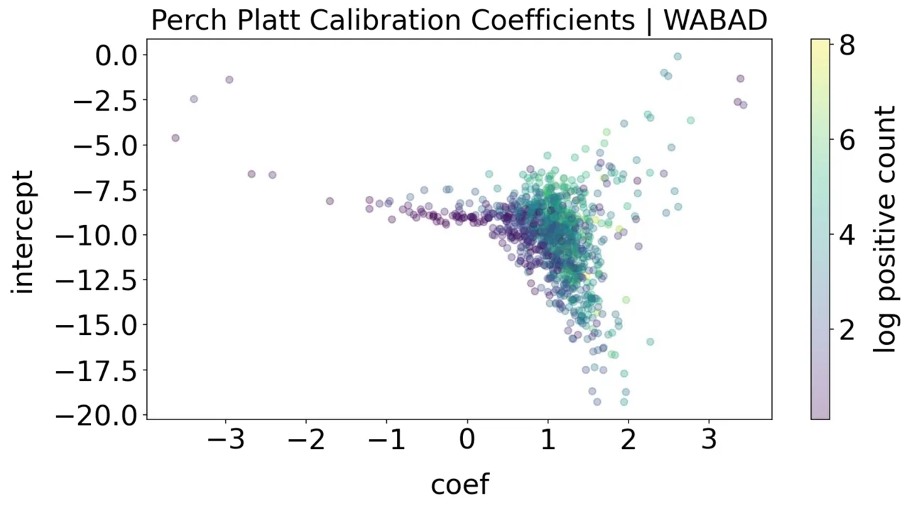
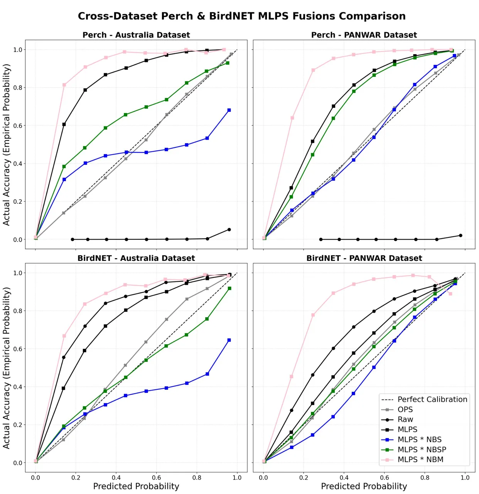

# Beyond Discrimination: Calibrated Geoprior Fusion for Bioacoustic Monitoring

Neha Sajja Affiliation: Google DeepMind Affiliation: Harvard University
Email: <nehasajja@mde.harvard.edu>    Bart van Merriënboer
Affiliation: Google DeepMind Email: [bartvm@google.com](mailto:)   
Burcu Karagol Ayan Affiliation: Google DeepMind
Email: [burcuka@google.com](mailto:)    Tom Denton Affiliation: Google
DeepMind Email: [tomdenton@google.com](mailto:)

###### Abstract

Modern bioacoustic foundation models like Perch and BirdNET can identify
species with high discriminative accuracy, yet their confidence scores
are often uncalibrated and difficult to interpret as probabilities of
real-world occurrence. This limits their use for ecological inference
beyond threshold-based detection. We leverage a global annotated
acoustic dataset (WABAD) to produce calibration priors for an acoustic
model, optionally incorporating species-level information. We introduce
new methods of fusing the acoustic predictions with geopriors, which
empirically improves calibration while preserving discrimination.
Together, these results suggest a path to simpler and more reliable
acoustic monitoring for broad biodiversity.

## 1 Introduction

Bioacoustics is increasingly used at large for scale passive acoustic
monitoring (PAM) for ecological insight, but easily available
classifiers, such as Perch v2 (van Merriënboer et al., 2025) or
BirdNET (Kahl et al., 2021), do not produce calibrated outputs, despite
strong classification performance (Wood and Kahl, 2024; Schwinger et
al., 2025). A well-calibrated model is desirable both for choosing
precision-based thresholds (August et al., 2022) or estimating call
density  (Navine et al., 2024) as an indicator for species abundance.
Model calibration is thus a helpful property for reliable analysis from
bioacoustic data.

Calibrating a model typically requires expert validation effort on data
gathered within a specific project. However, these experts are rare, and
the required validation effort is onerous, especially when trying to
monitor a large number of species across a wide variety of sites.

Simple presence or absence of the target species has a strong impact on
the interpretation of model scores: If a species is geographically
unlikely, it is unlikely to appear in an audio recording. Previous work
has shown that species geopriors can improve discriminative performance
of classifiers, both for images (Mac Aodha et al., 2019) and
acoustics (Jeantet and Dufourq, 2023). However, fusion in previous work
is achieved through simple multiplication of the probabilities from the
perception model and the geoprior model. Because these are both bounded
probability estimates, the product compresses towards zero and can lead
to under-confident predictions, even as the discrimination of relative
probabilities improves.

In this work, we attempt to obtain calibrated outputs from existing
acoustic models for broad biodiversity monitoring with no additional
validation work. To do this, we evaluate whether calibration parameters
learned on a global acoustic dataset can improve an acoustic model’s
calibration when transferred to unseen datasets. We test two different
ways of obtaining these calibration parameters from the global acoustic
dataset and evaluate the methods using using two different acoustic
foundation models across two unseen datasets. We then evaluate three
distinct methods for fusing these pre-calibrated values with geopriors
to determine if fusion improves discrimination and calibration and which
method fusion method generalizes the best across datasets, and acoustic
models.

Towards this end, we make the following contributions: (1) We
demonstrate that calibration parameters learned from a large global
acoustic dataset effectively transfers to new datasets; (2) We show that
careful fusion of these pre-calibrated scores with geopriors can further
improve discrimination and calibration. We also demonstrate that our
findings extend across distinct datasets and multiple bioacoustic
foundation models.

## 2 Related Work

#### Deep Learning in Bioacoustics

Foundational bioacoustic models, such as Perch v2 and BirdNET, have
achieved state-of-the-art accuracy in identifying thousands of global
species. However the confidence scores from these models do not reflect
real-world likelihoods and thus practitioners rely on often arbitrarily
chosen thresholds to determine species presence, which introduces false
positive and false negative biases (Knight et al., 2017; Cole et al.,
2022).

#### Calibration of Neural Networks and the Labeling Bottleneck

Deep audio classifiers, like other deep neural networks (Guo et al.,
2017; Ye et al., 2022) require post-hoc calibration efforts (e.g., Platt
scaling) to align confidence with actual correctness (Platt, 1999). In
multi-label bird sound classification, foundation models exhibit highly
variable calibration due to distribution shifts (Schwinger et al.,
2025). Crucially, calibration techniques demand additional validation
data. In ecology, this manual verification process is labor-intensive
and outpaces the capacity of domain experts (Sugai et al., 2019; Barré
et al., 2019). Consequently, validation creates a severe bottleneck that
reduces the scalability and reliability of automated monitoring.

#### Geographic Context and Geographic Priors

Species Distribution Models (SDMs) estimate the likelihood of species
presence in an area, providing continuous estimations of habitat
suitability (Elith and Leathwick, 2009). Geofencing selects a list of
likely species for a given location. Multiplicative fusion of geopriors
with classifier predictions can substantially improve discrimination for
camera trap images (Mac Aodha et al., 2019) and PAM data (Jeantet and
Dufourq, 2023).

## 3 Methods

Figure 1: Methodology overview.

### 3.1 Models

The acoustic classification models evaluated are Perch v2 (van
Merriënboer et al., 2025) and BirdNET v2.4 (Kahl et al., 2021). For
geopriors, we use the BirdNET geographic meta-model. This is a temporal
geoprior, accepting a latitude/longitude pair along with the
week-of-year.

### 3.2 Datasets and Ecological Environments

Fully annotated bioacoustic datasets are both rare and difficult to
produce, but provide valuable ground-truth for multi-species
calibration. Annotated datasets with precise multi-site geolocation
information are even more rare.

Doohan A2O (A: Eastern Australia) is a fully-annotated subset of the
Australian Acoustic Observatory (A2O) (Roe et al., 2021). The dataset
includes 39 A2O sites, yielding 14,179 time windows across 157 species
and 22,668 positive annotations. This serves as our development
dataset ¹¹ 1 We expect this dataset to be made publicly available soon..

PANWAR (P: North America) contains annotated PAM data from the
northeastern United States from 104 sites, yielding 155,280 time windows
across 104 species and 183,398 positive annotations. We use PANWAR as a
second evaluation dataset to test the generalization of our leading
methods (Panwar et al., 2025).

WABAD (Global) contains 72 sites, yielding 100,469 time windows across
1,192 species. WABAD is used exclusively to learn pre-calibration
parameters  (Pérez-Granados et al., 2026).

### 3.3 Mathematical Notation: Calibration and Fusion

We compare methods for fusing predictions from acoustic detection models
with geographic priors into a single posterior probability. Let
$`z_{\mathrm{audio}}`$ represent the raw logits from an acoustic model.
$`P(s)`$ denotes the probability of presence of a target species in a
specific spatiotemporal window, and $`P(\bar{s})`$ denotes its absence.
We define $`f(\cdot)`$ as a chosen pre-calibration function that maps
raw logits into acoustic probabilities,
$`P(s\mid A)\sim f(z_{\mathrm{audio}})`$, where $`A`$ denotes the
acoustic evidence.

The geoprior model provides a corresponding probability, $`P(s\mid G)`$
where $`G`$ denotes the geographic evidence. Finally, we define
$`\phi(\cdot)`$ as the fusion operator that combines the two
probabilities into a candidate joint posterior probability,

```math
P_{\mathrm{fused}}=P(s|A,G)\simeq\phi\left(P(s\mid A),P(s\mid G)\right). \tag{1}
```

### 3.4 Acoustic Models and Pre-Calibration Methods

Acoustic models produce uncalibrated logits $`z`$. To map these logits
to continuous probabilities, we apply the standard Platt scaling method
(Platt, 1999), where $`P(s|z)\sim\sigma(m_{s}z+b_{s})`$. The slope
$`m_{s}`$ and intercept $`b_{s}`$ parameters for each species $`s`$ are
found by logistic regression, minimizing the cross-entropy loss between
the acoustic classifier’s raw logits and the ground-truth labels. All
Platt scaling in this paper is computed with the sklearn
LogisticRegression library, with the default inverse regularization
strength $`C=1.0`$.

```math
P(s\mid A)\sim\sigma(m_{s}z+b_{s})=\frac{1}{1+\exp(-(m_{s}z+b_{s}))} \tag{2}
```

Baseline Raw Probabilities are obtained by passing raw acoustic logits
directly through a standard sigmoid
$`P_{\mathrm{RAW}}(s\mid A)=\sigma(z)`$ and use these values as our
uncalibrated probabilities. Note that Perch 2.0 was trained with softmax
activation, so this sigmoid activation yields very poor calibration.

Mean Likelihood Platt Scaling (MLPS): Each species with at least one
positive example in the WABAD dataset is calibrated with Platt scaling,
producing a collection of 1,147 Platt parameters, $`(m_{s},b_{s})`$,
illustrated in  Figure 2. For MLPS, we take the average slope $`m_{G}`$
and intercept $`b_{G}`$ across all 1,147 species and use these values as
the global mean parameters. This gives us a single global calibration
that can be transferred to a new dataset without using labels from the
target deployment.

Mean Likelihood Platt Scaling Plus (MLPS+) We observe significant
variation in fitted calibration parameters between species ( Figure 2).
To attempt to explain this variability, we train unregularized linear
regression models to predict the parameters $`(m_{s},b_{s})`$ from
dataset-agnostic features: the mean-centered log of the species training
count, and a measure of species acoustic similarity (A.2).

Using these species-level features, the regression predicts
species-specific calibration parameters $`\hat{m}_{s}`$ and
$`\hat{b}_{s}`$, which are then applied through Platt scaling. This
allows the calibration function to vary between species while still
requiring no labels from the target dataset.

Oracular Platt Scaling (OPS) provides an empirical upper bound on
calibration performance by applying Platt scaling directly on the
dataset’s ground-truth labels. Unlike MLPS and MLPS+, OPS requires
labels from the target dataset and therefore serves only as an empirical
reference.

### 3.5 Fusion Formulations

We establish distinct fusion algorithms $`\phi(\cdot)`$ for calculating
the final joint probability $`P(s|A,G)`$. Previous work assumes
categorical classification, and adopts a multiplicative fusion strategy
(NBM, below). We introduce a binary joint fusion formula:

###### Theorem 1.

Assuming independent audio and geographic evidence:

```math
P(s\mid A,G)=\frac{P(s\mid A)P(s\mid G)P(\bar{s})}{P(s\mid A)P(s\mid G)P(\bar{s})+P(\bar{s}\mid A)P(\bar{s}\mid G)P(s)}. \tag{3}
```

The full derivation of Equation 3 is provided in Appendix A.1. From this
foundational equation, we establish two fusion approaches depending on
the treatment of the prior probability $`P(s)`$.

Naive Bayes Scaled (NBS) adopts Equation 3 with the uninformative prior
$`P(s)=\frac{1}{2}`$. Setting $`\epsilon=10^{-9}`$ for numerical
stability, this yields the simplified fusion formula:

```math
P_{\mathrm{fused}}=\frac{P(s\mid A)P(s\mid G)}{\max\left(P(s\mid A)P(s\mid G)+\left(P(\bar{s}\mid A)\right)\left(P(\bar{s}\mid G)\right),\epsilon\right)}. \tag{4}
```

Naive Bayes Scaled with Prior (NBSP) applies Equation 3 with a
geographical species prior, obtained as the mean geoprior for the
species across all sites in the dataset:

```math
P(s)=\frac{1}{N}\sum_{i=1}^{N}P(s\mid G_{i}) \tag{5}
```

Naive Bayes Multiplicative Fusion (NBM) is derived from the
joint-evidence normalization of (Mac Aodha et al., 2019) in a
categorical classification scenario, assuming an constant class prior of
$`1/C`$. This reduces to simple multiplication of the classifier and
geoprior probabilities:

```math
P_{\mathrm{fused}}=P(s\mid A)\times P(s\mid G). \tag{6}
```

### 3.6 Evaluation Protocol and Metrics

We select a set of metrics which provide useful signal for multi-label,
multi-class data under extreme label imbalance, which is common in
bioacoustic datasets.

ROC-AUC and Top-1 are used for evaluating model discrimination. ROC-AUC
is computed independently for each species and then macro-averaged.
Top-1 accuracy is computed by checking, for each clip with at least one
species present, whether the highest scoring species is present in the
clip.

Unweighted Expected Calibration Error (uECE): Standard ECE measures
calibration quality by partitioning predictions into probability bins,
and computing a per-bin calibration error as the absolute difference
between accuracy and confidence. The ECE is the bin-weighted average of
these calibration errors. Because each species is typically quite sparse
in bioacoustic datasets, standard ECE is dominated by the lowest bin.
Instead, we give each populated probability bin equal weight:

```math
\mathrm{uECE}=\frac{1}{|\mathcal{B}|}\sum_{B_{m}\in\mathcal{B}}\left|\operatorname{acc}(B_{m})-\operatorname{conf}(B_{m})\right|, \tag{7}
```

where $`\mathcal{B}`$ is the set of populated bins. Lower ECE values
indicate better calibration.

Balanced KL Divergence: Global calibration metrics can be deceptive; a
method may appear well-calibrated on average while exhibiting
substantial underconfidence, overconfidence, or variation in reliability
for individual species. To measure per-species calibration, we compute
Kullback-Leibler (KL) divergence between the predicted distribution and
the oracular Platt scaling. To handle the sparsity of any particular
species in the dataset, we apply a class balanced weighting to the
metric.

Let $`y_{i}\in\{0,1\}`$ be the empirical ground truth for window $`i`$,
with $`N_{pos}`$ and $`N_{neg}`$ representing the total number of true
positives and true negatives in the dataset. Let $`\tilde{p}_{i}`$ and
$`\tilde{q}_{i}`$ be the predicted probabilities from the OPS reference
and the evaluated fusion method, respectively. To prevent numerical
instability, both probabilities are strictly clipped to the range
$`[\epsilon,1-\epsilon]`$, where $`\epsilon=10^{-15}`$.

To ensure the metric is class-balanced, we apply a sample weight
$`w_{i}`$, assigning $`w_{i}=1`$ for positive examples and
$`w_{i}=N_{pos}/N_{neg}`$ for negative examples.

The balanced KL divergence ($`bKL`$) is the weighted sum of the
pointwise Bernoulli KL divergences:

```math
bKL=\frac{\sum_{i=1}^{N}w_{i}\left[\tilde{p}_{i}\ln\left(\frac{\tilde{p}_{i}}{\tilde{q}_{i}}\right)+(1-\tilde{p}_{i})\ln\left(\frac{1-\tilde{p}_{i}}{1-\tilde{q}_{i}}\right)\right]}{\sum_{i=1}^{N}w_{i}} \tag{8}
```

This balanced metric ensures that the divergence signal of rare positive
calls is preserved, with a lower final score indicating that the
evaluated method’s outputs remain closer to OPS calibration.

Reliability Diagrams visualize the uECE metric by plotting the per-bin
confidence (on the x-axis) against the per-bin accuracy (on the y-axis).
The diagonal indicates perfect calibration, while points off the
diagonal signal under-confidence (above diagonal) or over-confidence
(below diagonal).

## 4 Experiments

We organized our experiments to separately measure the effects of
pre-calibration, geoprior fusion, and acoustic model choice. Across
experiments, Doohan (ADS) was our development dataset and Panwar (PDS)
was our final evaluation dataset. However we report both results
together so that changes observed on one dataset can be compared with a
second evaluation setting.

A.1 Pre-calibration of acoustic model outputs: We first evaluate
calibration alone. We compare RAW, MLPS, and OPS for both Perch and
BirdNET on ADS and PDS. This allows us to identify which kinds of
pre-calibration are most effective.

A.2 Explaining calibration variability: We then ask whether the
variation in WABADs species-specific Platt coefficients can itself be
predicted without target-dataset labels. We compare species-level
feature set using held-out species linear regression and measure how
much variation in the coefficient they explain. Based on this analysis
MLPS+ predicts species-specific Platt parameters from transferable
features including pretraining count and acoustic species similarity. We
compare MLPS+ with the simpler MLPS baseline on both evaluation
datasets. MLPS+ is evaluated only for Perch because the required
pretraining-count information is unavailable for BirdNET.

This experiment isolates whether calibration learned from a separate
dataset (WABAD) can improve acoustic probabilities before fusion, and
whether that behavior is consistent across both datasets.

B. Geoprior fusion of calibrated predictions: We next compare how
different pre-calibration functions $`f(\cdot)`$ and fusion operations
$`\phi(\cdot)`$ interact. We compare MLPS and MLPS+ alone with each of
the three fusion methods: NBS, NBSP, and NBM. We also compare fusion
with raw acoustic outputs to test whether geographic information alone
can compensate for uncalibrated acoustic scores. The same comparisons
are evaluated on both datasets.

C. Acoustic-model ablation: Finally, we test whether the behavior of the
fusion methods depends on the acoustic model used to provide $`P(s|a)`$.
We replace Perch with BirdNET and repeat the geoprior fusion comparison
using MLPS pre-calibration and the same NBS, NBSP, and NBM fusion
formulations. Results are again evaluated on both ADS and PDS, allowing
us to separate effects that are consistent across acoustic models from
ones that may change depending on the model.

## 5 Results

Audio model Pre-cal. ROC-AUC $`\uparrow`$ Top-1 $`\uparrow`$ uECE
$`\downarrow`$ bKL $`\downarrow`$ A P A P A P A P Perch 2.0 None 0.927
0.930 0.778 0.848 0.550 0.614 2.144 4.232 MLPS 0.927 0.930 0.778 0.848
0.315 0.216 0.255 0.063 MLPS+ 0.927 0.930 0.785 0.832 0.327 0.318 0.223
0.161 OPS 0.930 0.834 0.849 0.851 0.012 0.019 0 0 BirdNET v2.4 None
0.897 0.853 0.674 0.678 0.284 0.169 0.105 0.047 MLPS 0.897 0.853 0.674
0.678 0.225 0.078 0.074 0.043 OPS 0.897 0.853 0.753 0.767 0.053 0.051 0
0

Table 1: Pre-calibration performance of Perch and BirdNET. Reporting
Australia (A) and Panwar (P). Best scores are bold, oracle scores are
italic.

A.1: Pre-calibration for acoustic model outputs

On Doohan, uncalibrated Perch achieves an ROC-AUC of 0.927 and Top-1
accuracy of 0.778, but suffers from an uECE of 0.550 and a KL divergence
of 2.144, worse than a random-chance baseline (bKL 0.942). MLPS global
calibration preserves acoustic discrimination while drastically reducing
calibration error, reducing uECE to 0.315 and KL divergence to 0.255 on
Doohan, with even larger reductions on PANWAR ( Table 1). MLPS similarly
improves BirdNET calibration, demonstrating that this method generalizes
across both architectures and distinct ecosystems.

Oracular Platt Scaling (OPS), fit directly on target-deployment labels,
provides an empirical reference. On PANWAR, however, OPS suffers a drop
in macro ROC-AUC. This instability arises because 26% of PANWAR species
have less than 20 positive annotations; unconstrained logistic fits on
these rare taxa often produce negative slopes that invert discriminative
ranking. In contrast, global MLPS avoids this long-tail pathology by
sharing robust calibration priors across all taxa.

A.2 Explaining calibration variability: Although global MLPS
substantially improved calibration, we wanted to understand variation
among species. Variation in both the fitted slopes and intercepts can be
seen in  Figure 2. We found that dataset-specific features like
deployment and call density offered the highest joined explanation of
variance. However, the dataset-agnostic features (pre-training count,
and species similarity) explained a portion of coefficient variance on
WABAD without requiring dataset-specific labels (Table  2).



Figure 2: Variation in slope and intercept for Perch calibration on the
WABAD dataset.

|                                      |                    |                        |
| ------------------------------------ | ------------------ | ---------------------- |
| Features                             | MSE $`\downarrow`$ | $`R^{2}`$ $`\uparrow`$ |
| Log pretrain examples                | 1.82               | 0.17                   |
| WABAD deployment                     | 2.03               | 0.15                   |
| WABAD call density                   | 2.66               | 0.09                   |
| Species similarity                   | 2.43               | 0.05                   |
| Taxonomic Family                     | 2.59               | -0.04                  |
| Taxonomic Order                      | 2.70               | -0.01                  |
| n-pretrain, similarity               | 1.80               | 0.18                   |
| n-pretrain, deployment               | 1.63               | 0.23                   |
| n-pretrain, deployment, call density | 1.55               | 0.35                   |

Table 2: Prediction of transfer-calibration coefficients from dataset
and model features. Lower MSE and higher $`R^{2}`$ indicate better
prediction.

Predicting species-specific calibration parameters provided mixed
results compared to the simpler MLPS calibration. On the Australia
dataset, MLPS+ preserved per-class ROC-AUC and increased top-1 accuracy.
Balanced KL divergence also decreased compared to MLPS, indicating that
the species-level calibrated outputs for MLPS+ were closer to the OPS
reference. However uECE increased slightly. MLPS+ therefore improves
some aspects of the predictions but does not dominate MLPS across
evaluation criteria.

MLPS+ gains did not transfer to Panwar. MLPS achieved a uECE of 0.216
and KL divergence of 0.063, whereas MLPS+ increased these errors. Top-1
accuracy also decreased ( Table 1).

B: Fusion with calibrated Perch Predictions: The lowest uECE when fusing
with uncalibrated perch scores was 0.453. Geoprior fusion alone did not
compensate for poor acoustic model calibration, showing that
pre-calibration is a critical step before fusion.

Each fusion and pre-calibration methods produced tradeoffs on metrics.
NBS most aggressively reduced uECE but could substantially reduce Top-1
Accuracy. NBM consistently produced the strongest discrimination but
increased calibration error. For each fusion method, NBSP often resulted
in best balance between low uECE scores and low KL divergence while
still maintaining gains in ROC-AUC and Top 1 ( Table 3). It achieved the
lowest balanced KL divergence among the three fusion methods in all
pre-calibration settings, preserving substantially more Top-1 Accuracy
than NBS and remaining considerably better calibrated than NBM. On a
Reliability diagram, as seen in Figure 3, MLPS with NBSP fusions did not
always hug the exact 45^(∘) but did move closer to the diagonal. While
on PANWAR, MLPS with NBSP hugs the 45^(∘) closely we see in its metrics
that it saw a drop in Top-1 and an increase in balanced KL Divergence.



Figure 3: Cross-Dataset Reliability Diagrams on Australia (left) and
PANWAR (right) for Perch (top) and BirdNET (bottom) across geoprior
fusion methods.

C: Audio Model Ablation: To understand the robustness of the NBSP and
MLPS approach we tested this fusion and pre-calibration method with a
new acoustic model as the audio source. The relative behavior of the
fusion method remains consistent when BirdNET replaces Perch as the
acoustic model. On Doohan, MLPS improved calibration relative to its raw
outputs reducing uECE slightly and improving KL divergence from 0.105 to
0.074. Fusion reproduced the trade-offs observed with Perch: NBM
produced the strongest gains in discrimination, but worsened
calibration, while NBS substantially reduced Top-1 accuracy. NBSP
provided the strongest calibration and discrimination balance. It
reduced uECE to 0.039 and bKL to 0.064 while increasing ROC-AUC (see
 Table 3). These results suggest that the relative behavior of the
fusion methods generalize across acoustic foundation models.

In the Reliability diagram with BirdNET as the audio model (Figure 3),
MLPS pre-calibration with NBSP fusion hugs close to the $`45^{\circ}`$
line. While NBM, which did increase discrimination, clearly suffers from
systemic under confidence and raises well above the $`45^{\circ}`$ line.

Audio model Fusion ROC-AUC $`\uparrow`$ Top-1 $`\uparrow`$ uECE
$`\downarrow`$ bKL $`\downarrow`$ A P A P A P A P No pre-calibration or
Fusion Perch 2.0 none 0.927 0.930 0.778 0.848 0.550 0.614 2.144 4.232
BirdNET v2.4 none 0.900 0.853 0.674 0.678 0.284 0.160 0.105 0.047 No
pre-calibration Perch 2.0 NBS 0.930 0.933 0.524 0.760 0.492 0.498 1.989
3.348 NBSP 0.930 0.933 0.700 0.851 0.494 0.514 2.359 4.268 NBM 0.815
0.703 0.187 0.046 0.453 0.468 0.439 0.547 MLPS pre-calibration Perch 2.0
NBS 0.930 0.933 0.510 0.749 0.155 0.026 0.277 0.162 NBSP 0.930 0.933
0.690 0.850 0.130 0.188 0.195 0.072 NBM 0.937 0.934 0.769 0.853 0.373
0.356 0.390 0.283 BirdNET v2.4 NBS 0.912 0.860 0.462 0.676 0.166 0.043
0.100 0.085 NBSP 0.912 0.860 0.600 0.675 0.039 0.032 0.064 0.054 NBM
0.913 0.860 0.675 0.727 0.326 0.308 0.159 0.146 MLPS+ pre-calibration
Perch 2.0 NBS 0.930 0.933 0.510 0.833 0.155 0.301 0.277 0.285 NBSP 0.930
0.933 0.691 0.837 0.131 0.300 0.195 0.156 NBM 0.937 0.934 0.778 0.857
0.373 0.439 0.360 0.412 OPS pre-calibration Perch 2.0 NBS 0.929 0.841
0.663 0.778 0.253 0.196 0.059 0.105 NBSP 0.929 0.841 0.801 0.853 0.184
0.018 0.051 0.005 NBM 0.935 0.841 0.779 0.812 0.214 0.202 0.107 0.232

Table 3: Fusion performance with various pre-calibration methods,
reported on the Doohan (A) and Panwar (P) datasets.

## 6 Discussion

Our results demonstrate that bioacoustic models can often be calibrated
without local labels by using parameters from global annotated datasets
and subsequent fusion with geopriors.

Pre-calibration can be transferred across datasets: Global calibration
parameters derived from the global dataset (WABAD) improved calibration
for both Perch v2 and BirdNET on both the Doohan and Panwar datasets
(MLPS). However, we did not see significantly better calibration when
adjusting calibration to account for the amount of pretraining data for
each species (MLPS+). This suggest that species-level variation in
calibration parameters is partially predictable, but predicting that
variation does not generalize uniformly across datasets. The simpler
global MLPS provides a more consistent balance between calibration and
discrimination, likely because it corrects a systemic pattern in the
score distribution of an acoustic model without overfitting.

GeoPrior Fusion Methods and Pre-calibration: Our experiments show that
geographic evidence alone does not correct acoustic model calibration.
Pre-calibration is essential to ensure the inputs to fusion are on a
compatible scale. Once calibrated, the choice of fusion method leads to
a tradeoff between ranking and reliability.

NBM allowed the prior to suppress implausible species and improve
ranking. However, because NBM multiplies two bounded probability
estimates, it can compress predictions toward zero: Even when both
models are quite confident, the product leads to under-confidence. NBSP
resolves this by using the full Bayes formulation, handling each species
prediction as a binary classification task. By normalizing the joint
evidence against $`P(s)`$, NBSP scales the probabilities back up. It
successfully preserves the geographic filtering benefits of NBM while
improving calibration.

Relying on a single metric to evaluate this calibration is deceptive.
For example, a model that ignores audio entirely and simply predicts the
dataset’s base rate will achieve a near-perfect uECE and a flawless
reliability diagram. Failure only becomes clear when checking ROC-AUC,
Top-1, and balanced KL divergence. Because of this, fusion methods must
be evaluated holistically. NBSP proves to be the strongest method
because it maintains classification accuracy (ROC-AUC) and matches
empirical distributions (KL divergence), rather than just minimizing
uECE.

Generalization and Ecological Implications: Pre-calibration and careful
geoprior fusion generalize across Perch and BirdNET, and to both North
American and Australian datasets.

We believe that our approach generalizes well across different acoustic
models because it targets fundamental behaviors. MLPS captures and
corrects baseline acoustic model behavior on a global scale, regardless
of which acoustic model the method is being used on. By fusing this
globally corrected acoustic signal with local geographic priors, we
combine pre-calibrated acoustic evidence with a specific geographic
environment. The resulting better calibrated scores could enable
researchers to choose meaningful precision-based thresholds with less
effort or to utilize the full score distribution for tasks like
estimating call density.

Limitations and future work: While transferred calibration (MLPS)
significantly improves calibration, it does not perfectly recreate
empirical oracle calibration (OPS) and may weaken under domain shifts.
Furthermore, unconstrained OPS can become unstable for rare species,
suggesting that testing monotonic constraints is a necessary future
improvement. Because our experiments relied on a single geoprior model,
future work should evaluate alternatives; we expect that the quality and
calibration of the geoprior model is also a factor in effectiveness of
fusion. While all datasets in this work contain multiple sites,
evaluation on more datasets would improve the confidence in our results:
We were restricted by the unavailability of bioacoustic datasets with
fine-grained geographic location data. Finally, the natural next step is
to test whether these fused scores directly improve downstream
quantitative tasks. Prior work, like that in  Navine et al. (2024),
demonstrates that ecological metrics, such as call density, can be
directly estimated from the full distribution of classifier scores;
testing our calibrated outputs with these methods will determine their
effectiveness.

## 7 Conclusion

If bioacoustics is to monitor global biodiversity at scale, calibration
must be treated as a central objective alongside classification
accuracy. We demonstrate that the bottleneck of site-specific manual
labeling may not be required to achieve this. By transferring global
calibration priors and fusing them with continuous geopriors via NBSP,
raw model outputs can be transformed into calibrated probabilities. This
framework preserves the rich, continuous information that rigid
thresholds discard, clearing a path for simple and reliable broad
biodiversity monitoring.

## References

- August et al. (2022) T. A. August, M. C. Harvey, Z. Subedar, and et
  al. Emerging technologies revolutionise insect ecology and monitoring.
  Philosophical Transactions of the Royal Society B: Biological Sciences
  377 (1862), pp. 20210089. External Links:
  [Document](https://dx.doi.org/10.1098/rstb.2021.0089) Cited by: §1.
- Barré et al. (2019) K. Barré, I. Le Viol, and Y. Bas Accounting for
  automated identification errors in acoustic surveys. Methods in
  Ecology and Evolution 10 (8), pp. 1171–1188. External Links:
  [Document](https://dx.doi.org/10.1111/2041-210X.13219) Cited by: §2.
- Cole et al. (2022) J. S. Cole, N. L. Michel, S. A. Emerson, and R. B.
  Siegel Automated bird sound classifications of long-duration
  recordings produce occupancy model outputs similar to manually
  annotated data. Ornithological Applications 124 (2), pp. duac003.
  External Links: ISSN 0010-5422,
  [Document](https://dx.doi.org/10.1093/ornithapp/duac003),
  [Link](https://doi.org/10.1093/ornithapp/duac003),
  https://academic.oup.com/condor/article-pdf/124/2/duac003/43599793/duac003.pdf
  Cited by: §2.
- Elith and Leathwick (2009) J. Elith and J. R. Leathwick Species
  distribution models: ecological explanation and prediction across
  space and time. Annual Review of Ecology, Evolution, and Systematics
  40 (1), pp. 677–697. External Links:
  [Document](https://dx.doi.org/10.1146/annurev.ecolsys.110308.120159)
  Cited by: §2.
- Guo et al. (2017) C. Guo, G. Pleiss, Y. Sun, and K. Q. Weinberger On
  calibration of modern neural networks. In Proceedings of the 34th
  International Conference on Machine Learning (ICML), Vol. 70,
  pp. 1321–1330. Cited by: §2.
- Jeantet and Dufourq (2023) L. Jeantet and E. Dufourq Improving deep
  learning acoustic classifiers with contextual information for wildlife
  monitoring. Ecological Informatics 77, pp. 102256. External Links:
  ISSN 1574-9541,
  [Document](https://dx.doi.org/https%3A//doi.org/10.1016/j.ecoinf.2023.102256),
  [Link](https://www.sciencedirect.com/science/article/pii/S1574954123002856)
  Cited by: §1, §2.
- Kahl et al. (2021) S. Kahl, C. M. Wood, M. Eibl, and H. Klinck
  BirdNET: a deep learning solution for avian diversity monitoring.
  Ecological Informatics 61, pp. 101236. External Links:
  [Document](https://dx.doi.org/10.1016/j.ecoinf.2021.101236) Cited by:
  §1, §3.1.
- Knight et al. (2017) E. C. Knight, K. C. Hannah, G. J. Foley, C. D.
  Scott, R. M. Brigham, and E. M. Bayne Recommendations for acoustic
  recognizer performance assessment with application to five common
  automated signal recognition programs. Avian Conservation and Ecology
  12 (2), pp. 14. External Links:
  [Document](https://dx.doi.org/10.5751/ACE-01114-120214) Cited by: §2.
- Mac Aodha et al. (2019) O. Mac Aodha, E. Cole, and P. Perona
  Presence-only geographical priors for fine-grained image
  classification. In Proceedings of the IEEE/CVF Conference on Computer
  Vision and Pattern Recognition (CVPR), pp. 9596–9606. Cited by: §1,
  §2, §3.5.
- Navine et al. (2024) A. K. Navine, T. Denton, M. J. Weldy, and P. J.
  Hart All thresholds barred: direct estimation of call density in
  bioacoustic data. Frontiers in Bird Science 3, pp. 1380636. External
  Links: [Document](https://dx.doi.org/10.3389/fbirs.2024.1380636) Cited
  by: §1, §6.
- Panwar et al. (2025) P. Panwar, W. J. Cummings, S. J. Martinson, A. S.
  Weed, L. B. Symes, and H. M. ter Hofstede Large-scale, stratified,
  fully annotated acoustic forest soundscape dataset of avian
  vocalizations from eastern north america. Scientific Data. External
  Links: [Document](https://dx.doi.org/10.5281/zenodo.18041381) Cited
  by: §3.2.
- Pérez-Granados et al. (2026) C. Pérez-Granados, J. Morant, K. F. A.
  Darras, O. H. Marín-Gómez, I. Mendoza, M. A. Muñoz-Mohedano, E.
  Santamaría-García, G. Bastianelli, A. Márquez-Rodríguez, M. Budka, P.
  Panwar, A. S. Weed, and E. Sebastián-González WABAD: a world annotated
  bird acoustic dataset for passive acoustic monitoring. Ecology 107
  (2), pp. e70317. External Links:
  [Document](https://dx.doi.org/10.1002/ecy.70317) Cited by: §3.2.
- Platt (1999) J. C. Platt Probabilistic outputs for support vector
  machines and comparisons to regularized likelihood methods. In
  Advances in Large Margin Classifiers, A. J. Smola, P. L. Bartlett, B.
  Schölkopf, and D. Schuurmans (Eds.), pp. 61–74. Cited by: §2, §3.4.
- Roe et al. (2021) P. Roe, P. Eichinski, R. A. Fuller, P. G.
  McDonald, L. Schwarzkopf, M. Towsey, A. Truskinger, D. Tucker,
  and D. M. Watson The australian acoustic observatory. Methods in
  Ecology and Evolution 12 (10), pp. 1802–1808. External Links:
  [Document](https://dx.doi.org/https%3A//doi.org/10.1111/2041-210X.13660),
  [Link](https://besjournals.onlinelibrary.wiley.com/doi/abs/10.1111/2041-210X.13660),
  https://besjournals.onlinelibrary.wiley.com/doi/pdf/10.1111/2041-210X.13660
  Cited by: §3.2.
- Schwinger et al. (2025) R. Schwinger, B. McEwen, V. S. Kather, R.
  Heinrich, L. Rauch, and S. Tomforde Uncertainty calibration of
  multi-label bird sound classifiers. arXiv preprint arXiv:2511.08261.
  Cited by: §1, §2.
- Sugai et al. (2019) L. S. M. Sugai, T. S. F. Silva, J. W. Ribeiro,
  and D. Llusia Terrestrial passive acoustic monitoring: review and
  perspectives. BioScience 69 (1), pp. 15–25. External Links:
  [Document](https://dx.doi.org/10.1093/biosci/biy147) Cited by: §2.
- van Merriënboer et al. (2025) B. van Merriënboer, V. Dumoulin, J.
  Hamer, I. Simpson, A. Burns, L. Harrell, and T. Denton Perch 2.0:
  advanced multi-taxa bioacoustics. arXiv preprint arXiv:2508.00000.
  Cited by: §1, §3.1.
- Wood and Kahl (2024) C. M. Wood and S. Kahl Guidelines for appropriate
  use of birdnet scores and other detector outputs. Journal of
  Ornithology 165 (3), pp. 777–782. External Links:
  [Document](https://dx.doi.org/10.1007/s10336-024-02144-5) Cited by:
  §1.
- Ye et al. (2022) T. Ye, S. Si, J. Wang, N. Cheng, and J. Xiao
  Uncertainty calibration for deep audio classifiers. In Interspeech
  2022, pp. 1556–1560. External Links:
  [Document](https://dx.doi.org/10.21437/Interspeech.2022-11384) Cited
  by: §2.

## Appendix A Appendix

### A.1 Derivation of the Joint Posterior Probability

###### Proof.

Applying Bayes’ theorem and expanding the denominator using the law of
total probability gives

```math
P(s\mid A,G)=\frac{P(A,G\mid s)P(s)}{P(A,G\mid s)P(s)+P(A,G\mid\bar{s})P(\bar{s})}. \tag{9}
```

To integrate the two model outputs, we assume conditional independence
between the audio and geographic evidence given species presence or
absence:

```math
P(A,G\mid s)=P(A\mid s)P(G\mid s). \tag{10}
```

Applying Bayes’ theorem to the individual likelihoods gives

```math
P(A\mid s)=\frac{P(s\mid A)P(A)}{P(s)} \tag{11}
```

and

```math
P(G\mid s)=\frac{P(s\mid G)P(G)}{P(s)}. \tag{12}
```

Therefore, the joint likelihood becomes

```math
P(A,G\mid s)=\frac{P(s\mid A)P(s\mid G)P(A)P(G)}{P(s)^{2}}. \tag{13}
```

Substituting the corresponding expressions for both presence and absence
into Equation 9, the marginal evidence terms $`P(A)P(G)`$ cancel out,
resulting in the final foundational expression:

```math
P(s\mid A,G)=\frac{\dfrac{P(s\mid A)P(s\mid G)}{P(s)}}{\dfrac{P(s\mid A)P(s\mid G)}{P(s)}+\dfrac{P(\bar{s}\mid A)P(\bar{s}\mid G)}{P(\bar{s})}}. \tag{14}
```

∎

### A.2 Species Acoustic Similarity

To measure how likely a given species is to be confused with some other
species in the WABAD dataset, we calculate a species co-occurrence
similarity score relative to each other species, and then take the
maximum score.

To calculate the co-occurrence similarity, we use Perch v2 to extract
raw acoustic logits across all temporal windows in the target deployment
and binarize these predictions using a (relatively low) logit threshold
of $`7.0`$. We then compute a pairwise Jaccard similarity matrix across
all species detections to measure how frequently target species
co-occur. Finally, we isolate the single highest similarity score each
species shares with any other species (excluding its correlation with
itself) and apply a natural log transformation.

## Appendix B AI disclosure

In this work, we used generative AI tools to write code used in our data
processing and fusion experiments. We have not used generative AI tools
for generating synthetic data, formulating theoretical models, proving
mathematical claims, or interpreting results, and the rest of the
required disclosure tasks are not applicable. Additionally, we used AI
tools to edit the paper for readability, format LaTeX, and identify
relevant literature. We have reviewed all AI-assisted work:
LLM-generated code was tested for correctness by the authors, and
AI-edited text was manually verified for accuracy. We take
responsibility for the final content of this work, including text edited
with the aid of generative AI.
