## Decoding nature's melody: significance and challenges of machine learning in assessing bird diversity via soundscape analysis

Jiangjian Xie 1 · Shanshan Xie 1 · Yang Liu 2 · Xin Jing 3 · Mengkun Zhu 1 · Linlin Xie 1 · Junguo Zhang 1 · Kun Qian 4 · Björn W. Schuller 3,5

Received: 15 May 2025 / Accepted: 30 September 2025 / Published online: 14 November 2025

© The Author(s) 2025

## Abstract

The broad application of passive acoustic monitoring provides a critical data foundation for studying soundscape ecology, necessitating automated analysis methods to accurately extract ecological information from vast soundscape data. This review comprehensively and cohesively examines two predominant approaches in soundscape analysis: soundscape component recognition and acoustic indices methods. Focusing on machine learning (ML)-based analysis methods for bird diversity assessment over the past five years, this review surveys representative research within each category, outlining their respective strengths and limitations. This not only addresses the growing interest in this field but also identifies research gaps and poses key questions for future studies. The insights from this review are anticipated to significantly enhance the understanding of ML applications in soundscape analysis, guiding subsequent investigative efforts in this rapidly evolving discipline, and thereby better supporting long-term biodiversity monitoring and conservation initiatives.

Keywords Soundscape analysis · Biodiversity assessment · Bird vocalizations · Machine learning · Soundscape component recognition · Acoustic indices

## 1 Introduction

Biodiversity, encompassing all forms of life within ecosystems, is a cornerstone of ecological stability and functionality. Birds are integral to terrestrial ecosystems and serve as reliable indicators of environmental health due to their sensitivity to ecological changes (Bateman and Uzal 2022). Regular monitoring of bird populations not only provides critical data for conservation strategies but also supports sustainable ecosystem management. However, traditional monitoring methods, such as manual surveys and traps, are limited by their invasiveness, labor-intensiveness, and inability to scale across vast regions (Gibb et al. 2019). Biodiversity loss is a global issue, and the benefit of monitoring local regions is limited. This limitation highlights an urgent need for innovative techniques capable of providing cost-effective, large-scale, and accurate biodiversity assessments (Sethi et al. 2020).

Jiangjian Xie and Shanshan Xie have contributed equally to this work.

Extended author information available on the last page of the article

Recent advances in passive acoustic monitoring (PAM) have provided a scalable, noninvasive, and cost-effective alternative, capable of continuous and long-term deployment across diverse habitats (Hill et al. 2018; Bradfer-Lawrence et al. 2023). PAM captures the entire soundscape, defined as the collection of all sounds within a given landscape, which can be classified into three primary components: biophony-biotic sounds like animal vocalizations; geophony-natural sounds such as rivers, thunder, and wind; and anthropophony-human-associated sounds like voices and machinery (Schafer 1969). These components collectively encode ecological information relevant to biodiversity assessment (shown in Fig. 1), including species presence/absence, abundance, distribution, community structure and integrity, habitat quality, ecological complexity, acoustic activity patterns, etc. (Pijanowski et al. 2011; Sethi et al. 2020).

As summarized in Fig. 1, two main types of soundscape analysis approaches. One approach is soundscape component recognition (SCR), which automatically recognizes soundscape components to provide detailed species occurrence data, ranging from broad categories above the species level to species- and individual-level recognition (Stowell 2022; Napier et al. 2024). Despite significant advances in SCR, it remains constrained by challenges (listed in Table 1), such as labeled data scarcity (Xie et al. 2023b), geographic sound variation (Gibb et al. 2019), and limited model generalization (Xie et al. 2023b). The second approach is based on acoustic indices (AIs), emphasizing the extraction of features from the entire soundscape to infer biodiversity (Sethi et al. 2023). AIs, mathematical functions utilizing time, frequency, and energy dimensions, offer a concise representation of the overall complexity or diversity within a sound recording. These indices, designed to encapsulate community-level dynamics through statistical summaries of frequency or time domain signals, have proven to be effective tools for rapid biodiversity assessment in recent years (Servick 2014). Different indices describe different characteristics of the soundscape, such as evenness, entropy, and complexity (Sueur et al. 2008). Despite their utility, challenges (listed in Table 1) such as ecological correlation, environmental influence, and interpretability (Bradfer-Lawrence et al. 2023).

Fig. 1 Overview of two main approaches in soundscape analysis for biodiversity assessment. The first approach focuses on automatic recognition of species from soundscape recordings, providing detailed species occurrence data. The second approach emphasizes feature extraction from the entire soundscape using acoustic indices to infer biodiversity at the community level

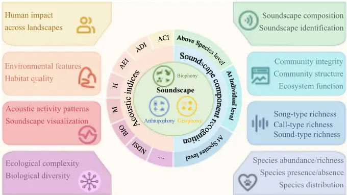

| Table 1 Challenges in sound- scape analysis approaches | Method         | Challenge                                  | Description                                                               |
| ------------------------------------------------------ | -------------- | ------------------------------------------ | ------------------------------------------------------------------------- |
|                                                        | SCR            | Data volume and quality                    | Labeled data scarcity; back- ground noise interference                    |
|                                                        |                | Adaptability to envi- ronmental variations | Species recognition lacks universality due to geographic sound variations |
|                                                        |                | Technical complexity                       | Large-scale audio analysis requires advanced tools and high resources     |
|                                                        |                | Model generalization                       | Models lack generalization across unseen environments                     |
|                                                        |                | Real-time monitoring and deployment        | Resource-constrained devices need efficient architectures                 |
|                                                        |                | Open-world recognition                     | Recognizing unseen soundscape components is challenging                   |
|                                                        | Acoustic index | Ecological correlation                     | Acoustic indices poorly corre- late with biodiversity metrics             |
|                                                        |                | Influence of environ- mental factors       | Environmental and device variations affect indices                        |
|                                                        |                | Index selection and parameter setting      | Choosing comprehensive indi- ces remains undefined                        |
|                                                        |                | Universality of indices                    | Universality of indices across ecosystems needs validation                |
|                                                        |                | Combining multiple indices                 | No consensus on combining multiple indices for soundscape patterns        |
| SCR soundscape component recognition                   |                | Interpretability and transparency          | Acoustic indices lack deep eco- logical process understanding             |

Given increasing amounts of audio data acquired by PAM, handling and interpreting such a huge volume of data is a challenge (Pérez-Granados et al. 2023). Due to the multidimensional and heterogeneous nature of these monitoring data, simple automated analysis methods are no longer suitable for efficient and accurate analysis (Tuia et al. 2022). To overcome this issue, cutting-edge technologies, notably machine learning (ML) models are introduced in soundscape analysis. ML learns patterns from data by optimizing certain performance metrics, resulting in an optimal output when encountered with new inputs (Jordan and Mitchell 2015). Deep learning (DL) is a type of neural network-based ML approach that can learn high-level features from data automatically, avoiding the need for complex feature engineering (LeCun et al. 2015). These methods enhance detection accuracy, scalability, and ecological interpretability, thereby facilitating the integration of SCR and AIs approaches. Building on this two-method framework, the subsequent sections review MLbased advancements in soundscape analysis for bird diversity assessment, emphasizing their respective strengths, limitations, and potential synergies for robust, long-term biodiversity monitoring.

In this review, peer-reviewed literature published between January 2019 and October 2024 applying ML-based soundscape analysis to bird biodiversity assessment was systematically surveyed. The search was conducted in Google Scholar search engine using combinations of keywords including soundscape; bioacoustics; ecoacoustics; bird (avian); sound classification or identification or recognition; sound detection; acoustic index; biodiversity. Studies involving multi-modal data or unreviewed preprints were excluded. Figure 2 illustrates the publication trends for these two analysis methods over the review period. By analyzing the gathered publications, this review makes three key advances over earlier syntheses. First, whereas previous reviews have treated SCR (Stowell 2022; Xie et al. 2023b; Napier et al. 2024) and AIs (Alcocer et al. 2022; Bateman and Uzal 2022; Bradfer-Lawrence et al. 2023) as distinct methodological pathways,this review proposes the first unified analytical hierarchy that delineates conditions under which taxonomic-level SCR should be prioritized over community-level indices, and vice versa, thereby addressing a long-standing methodological divide. Second, an evidence-based gap map is constructed to quantitatively identify underexplored research frontiers-such as open-set recognition and dialect-aware development-which have not been explicitly visualized in prior work. Collectively, these contributions offer a coherent framework for selecting and combining ML tools in largescale biodiversity monitoring, and set a forward-looking research agenda for this rapidly advancing field.

## 2 Soundscape components recognition methods

Recognizing soundscape components provides an intuitive and effective means of analyzing soundscapes, reflecting the composition and structure of biodiversity. Depending on research objectives, soundscape components are categorized at varying taxonomic hierarchies.

Fig. 2 Trend of published paper quantities in two major research fields from 2019 to 2024. Despite the challenges of high-precision soundscape component analysis, more studies are exploring this approach to achieve a comprehensive understanding of soundscapes. It is worth noting that the listed studies focus specifically on birds, which limits the number of publications

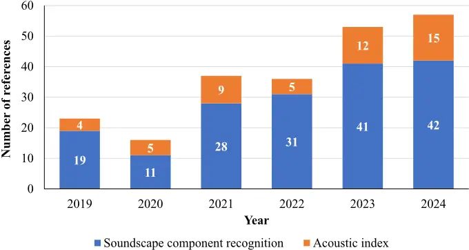

At a coarse level, they are classified into biophonies, geophonies, and anthropophonies. Biophonies can be further refined into taxonomic groups, species, or even individual-level recognition. This section reviews technologies for SCR, covering methods from coarse to fine-grained analysis (as shown in Fig. 3).

Regardless of the level of recognition, it can generally be regarded as a classification problem. The common process includes three main parts: pre-processing, feature extraction, and the recognizer. Below, recognition methods at different levels and their interpretability approaches are reviewed.

## 2.1 Recognition at and below species level

Soundscape recognition at the species or individual level facilitates species detection, population monitoring, and insights into species absence/presence (Nolan et al. 2023; Napier et al. 2024), abundance (Elizalde et al. 2024; Goitia-Urdiain et al. 2024), distribution (Elizalde et al. 2024; Goitia-Urdiain et al. 2024), density, or community structure (Morales et al. 2022). Acoustic monitoring provides critical opportunities to track population declines, assess key population parameters and trends (Provost et al. 2022; Nolan et al. 2023), and understand the impacts of biotic and abiotic factors on species (Wolfe et al. 2023).

## 2.1.1 Pre-processing

Real-world PAM data often contains non-target sounds that can interfere with species recognition, masking relevant sounds or introducing biases like false positives. Pre-processing, essential for identifying and isolating interfering sounds to ensure accurate recognition, typically comprises two steps: denoising and segmentation.

## (1) Denoising

When using PAM for bird monitoring, non-bird sounds are inevitably noise that degrades bird vocalization signals and affects recognition performance. Clark et al. (2023) found that anthropogenic noise reduces precision by increasing false positives. Additionally, lower signal-to-noise ratios (SNR) lead to worse recognition performance (Xie et al. 2020), which is a significant challenge in automatic bird vocalization recognition (BVR) (Xie et al. 2023b). Attention mechanisms (Xie et al. 2022) and adaptive noise suppression (Zhao et al. 2023) can improve model robustness to noise, but denoising methods are still necessary when SNR is low.

Fig. 3 Schematic presentation of recognition at various levels, showcasing the progression from coarse categories (biophony, geophony, and anthropophony) to finer distinctions, including taxonomic groups, species, and individual-level recognition

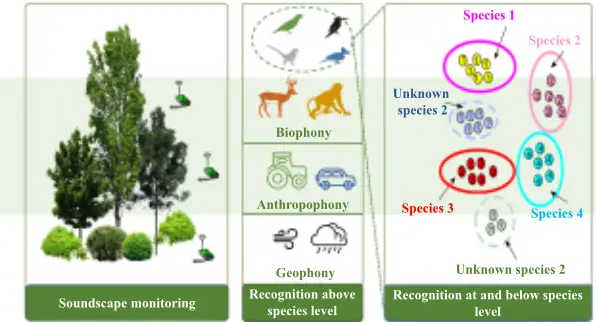

Traditional denoising methods, which assume stationary noise and rely on time-frequency characteristics, often remove parts of the bird vocalization along with the noise (Xie et al. 2023b). Juodakis and Marsland (2022) used wavelet packet models to subtract transient wind noise, improving the performance of sound event detection. DL-based methods, such as the deep feature loss network proposed by Zhang et al. (2024), offer more effective noise elimination while preserving biological sound integrity. This method leverages the power of DL to discern and extract complex features, leading to a significant improvement in the SNR. Addressing the challenge of specific noise sources, such as cicada choruses that can obscure bird vocalizations, Brown et al. (2019) combined ML classifiers and AIs to filter out cicada choruses, improving SNR in affected recordings. Zhang et al. (2024) developed CicadaNet, a DL model for real-time filtering of cicada noise, demonstrating excellent performance in long-term bird monitoring.

## (2) Segmentation

In PAM, automatic recording devices capture environmental sounds for preset durations, which are typically segmented into fixed lengths to reduce computational load and meet the fixed input requirements of recognition models (Kahl et al. 2021). The segment length should be chosen to capture complete vocalizations, guided by average vocalization duration and recognition-efficiency trade-offs (Kahl et al. 2021; Xie et al. 2020). More detailed analyses, such as examining syllabic features to study vocal behavior, require individual syllable segmentation (Cohen et al. 2022).

Manual syllable segmentation is labor-intensive, prompting the development of automated approaches. Simple energy thresholding (Merino Recalde 2023) remains common but performs poorly under low SNR and with faint calls (Xie et al. 2023b). Adaptive thresholding based on the Constant False Alarm Rate criterion improves segmentation under such conditions (Zhao et al. 2023). Treating non-vocalization screening as a classification task, Thakur and Rajan (2019) combined directional embeddings with an an support vector machine (SVM), achieving better noise-vocalization separation than conventional methods. Semi-automatic approaches combine manual silent-region extraction with similarity-based detection (Searfoss et al. 2020). Viewing spectrograms as images enables computer visionbased methods, including object detection on time-frequency heatmaps (Zsebők et al. 2019) and image segmentation to localize calls (Nolan et al. 2023), though these often require complex annotations. To address this, TweetyNet assigns syllable probabilities to each time bin and uses argmax classification to simplify segmentation (Cohen et al. 2022).

Pre-processing is essential in PAM for enhancing the quality and utility of bird vocalization data. It involves denoising to reduce noise interference, and segmentation to organize data for analysis. Current methods have made strides, especially with DL techniques for noise reduction and segmentation.

## 2.1.2 Feature extraction

The key of effective bird vocalization feature extraction is mapping signals into a separable space, enabling recognition models to better define class boundaries then improve accuracy. There are two commonly used feature extraction methods for bird vocalization signals: (1) handcrafted features extracting time-frequency domain features, and (2) automatically learning features from raw audio signals using data-driven models.

## (1) Handcrafted time-frequency domain feature extraction

Time-frequency transformations have been frequently employed to extract temporal and spectral information from audios. The procedure of converting these representations into spectrograms and then using them in prevalent image recognition networks for BVR has developed as a widespread method.

The Short Time Fourier Transform (STFT) remains a widely used method for time-frequency analysis of bird vocalizations (Xie et al. 2022; Morales et al. 2022), though its fixed window function imposes a trade-off between time and frequency resolution. To address this, adaptive transforms such as the Mel Frequency Cepstrum Transform (MFCT) modify the frequency scale to align with human auditory perception, producing Mel Frequency Cepstral Coefficients (MFCCs) that capture spectral characteristics across Mel bands. Both MFCCs and Mel spectrograms have been extensively applied in bird vocalization recognition (BVR) (Xie et al. 2020, 2022; Zhang et al. 2023; Espejo et al. 2024). While most studies treat MFCCs as a whole vector, some have examined individual or subsets of coefficients: low-frequency MFCCs show strong discriminative power (Han and Peng 2024); 20-order MFCCs yield optimal classification accuracy (Wang et al. 2022); and feature-importance analyses identify specific low-order coefficients as key for stress-state or health-state classification in poultry (Manikandan and Neethirajan 2025).

To improve the discriminative power of bird vocalization features, Chen and Zeng (2023) introduced Adaptive Frequency Cepstral Coefficients (AFCCs), which use adaptive filters to adjust frequency responses and capture subtle vocal distinctions. Similarly, the Gammatone auditory filter models cochlear frequency selectivity, producing biologically relevant spectrograms effective in BVR (Sharan and Moir 2019). Beyond humanauditory models, the Wavelet Transform (WT) offers flexible scaling and localization via wavelet basis functions, enabling the capture of both global and local vocal features (Xie et al. 2022). From WT decomposition, Local Wavelet Acoustic Patterns (LWAP) combined with MFCCs have shown robustness under low SNR (Zhao et al. 2023). The Chirplet Transform (CT) generalizes both WT and FT with scalable, rotatable basis functions, achieving superior performance over STFT and MFCT in some BVR tasks (Xie et al. 2020), while the Superlet Transform (SLT) enhances time-frequency resolution by integrating multiple CWTs, benefiting complex low-frequency sound analysis (Jancovich and Rogers 2024). Other techniques, such as the Hilbert-Huang Transform, Chroma, and Tonnetz features, offer complementary perspectives on vocalization structure (Xie et al. 2022; Zhang et al. 2023).

Rather than relying on a single transform, multi-feature fusion has been employed to integrate complementary time-frequency representations, yielding improved recognition performance (Yan et al. 2021; Zhang et al. 2021; Xie et al. 2022; Zhang et al. 2023). However, these handcrafted features depend on manually designed basis functions, often modeled on human auditory perception, and may overlook phase information and cross-frame temporal dependencies. Such limitations can be mitigated by combining phase information (Xie et al. 2025) or integrating temporal modeling approaches such as LSTM networks (Xie et al. 2022). Overall, while handcrafted time-frequency features remain useful, advanced feature extraction models are increasingly needed to capture richer and more task-relevant representations for BVR.

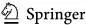

## (2) Automatically learned features from the raw audio signal

The suitability of handcrafted features for BVR remains debated, with recent advances in automatic feature learning from raw audio-commonly referred to as audio front-endsoffering more adaptive, task-specific representations. Jointly training front-ends with recognition models improves feature relevance and reduces information loss. Traditional time-frequency transforms, despite their success, rely on fixed basis functions, motivating the development of adaptive, learnable basis functions in neural architectures. SincNet (Bravo Sanchez et al. 2021) employs time-domain convolutions with parametric Sinc filters, learning only two cutoff frequencies for efficiency. LEAF (Zeghidour et al. 2021) replaces Sinc with Gabor filters, adds Gaussian low-pass filtering, depthwise convolutions, and learnable PCEN, outperforming SincNet across tasks. Similarly, Riad et al. (2021) introduced parameterized Gabor filters to learn interpretable spectro-temporal receptive fields (STRFs).

Beyond transform-inspired designs, time series models extract features directly from raw bird vocalizations. One-dimensional CNNs capture temporal patterns (Xie et al. 2021), while autoencoders (AEs) (Rowe et al. 2021) and LSTM-based encoders (Xie et al. 2020) learn compact latent features. WaveNet, with dilated causal convolutions, models long-term dependencies, as shown in AE-WaveNet hybrids for vocalization synthesis (Bhatia 2021). The BEATs model has also been used as a backbone for bird sound feature extraction (Yang et al. 2024). Although effective, such models often lack interpretability. When labeled data are scarce, self-supervised learning (SSL) enables feature extraction without manual annotation. DeLoRes (Ghosh et al. 2022) uses the Barlow Twins objective to learn distortioninvariant embeddings, achieving competitive bird sound detection with small datasets. BYOL-AIS (Zhao et al. 2023) adapts BYOL-A to capture individual-level vocal traits in Crested Ibises.

Although high-dimensional features can capture bird vocalization characteristics from multiple perspectives, they may lead to the "curse of dimensionality" (Xu et al. 2021). Feature selection mitigates this issue by removing redundant or irrelevant features while retaining the most informative ones, thereby enhancing classification performance. Embedded methods can inherently evaluate feature importance during model training. For example, gini importance analysis (tree-based model) has identified low-order MFCCs and spectral contrast as key indicators for distinguishing poultry health states and behaviors (Manikandan and Neethirajan 2025). In addition, SHAP values can be employed to analyze which aspects or components of the sound signals contribute most to the model's predictions, such as understanding which MFCCs features are most relevant to a given model and determining how their increases or decreases lead to differences in bird species classification (Das et al. 2024). Filter methods rank features independently based on statistical or relevance criteria. ReliefF has been used to identify MFCCs, spectral decrease, and spectral rolloff as highly discriminative features, achieving high classification accuracy for multiple bird species (Ugarte and Arias-Arias 2024). Minimum redundancy maximum relevance (mRMR) has also shown strong performance in selecting deep spectral features, with fusion of handcrafted features achieving up to 96.25% accuracy (Xie et al. 2022). Wrapper methods employ optimization algorithms to search for optimal feature subsets. Approaches based on the gray wolf optimizer and particle swarm optimization have effectively reduced feature dimensionality and improved classification accuracy (Pramunendar et al. 2023; Andono et al. 2023).

Feature fusion, combining handcrafted and automatically learned features, can further enhance representation. SSL-Net (Yang et al. 2024) integrates time-frequency features (Mel spectrograms, STFT, MFCCs) with learnable features from pre-trained BEATs for bird sound classification. Rookognise (Martin et al. 2022) combines Mel spectrograms with a shared front-end encoder for individual rook detection and recognition.

## 2.1.3 Recognizer

In PAM, recordings capture not only bird vocalizations but also other non-target sounds, posing challenges for automated BVR. Non-target sounds, such as anthropogenic noise and geophony, can increase both false positives and false negatives in bird audio detection (BAD) (Clark et al. 2023). Moreover, without prior field surveys, identifying the specific bird species present is difficult, complicating accurate species recognition. A practical solution is a two-step approach (as shown in Fig. 4): first, separate bird from non-bird sounds; then, apply active learning with expert input to refine species recognition (Eichinski et al. 2022). Initially, a subset of recordings is labeled to generate a species list, which is used to train a recognition model. Low-confidence predictions on the remaining recordings may indicate previously unobserved species, prompting expert validation. Confirmed new species are incorporated through model retraining, iteratively improving recognition coverage.

The following sections sequentially review the key components of this recognition workflow.

## (1) Bird audio detection model

Fig. 4 Detailed workflow for distinguishing bird vocalizations from non-bird sounds, incorporating active learning with expert validation. The process begins with labeling a subset of recordings to create a species list, followed by training a recognition model. The model's low-confidence predictions are reviewed for potential new species, and expert validation is used to confirm and annotate these species. The model is then retrained to improve its accuracy and expand its recognition capabilities

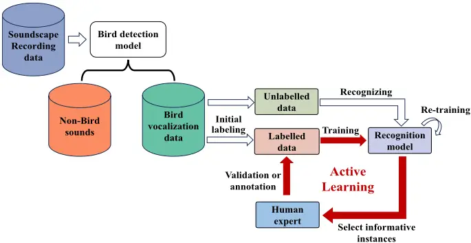

Early ML approaches, such as combining Dual-tree M-band Wavelet Transform with Gaussian Mixture Models, achieved high accuracy (97.82% on freefield1010) but remained sensitive to complex noise (Kadurka and Kanakalla 2021). Recently, DL has greatly enhanced BAD by capturing complex audio patterns. Convolutional Neural Networks (CNNs) processing Mel spectrograms improve robustness in noisy environments (Stowell et al. 2019), while fine-tuned networks (e.g., ResNet50) enable detection of rare species (Zhong et al. 2021). Hybrid architectures, such as UL-Net (U-Net + LSTM + ResNet), further improve performance, and integrating BAD with BVR enhances overall detection accuracy (Maclean and Triguero 2023).

For real-time monitoring, lightweight architectures are essential. Efficient models include 5-layer CNNs based on Bulbul (Hong and Zabidi 2021), MobileNetV3-GRU (Yuncheng 2021), and simplified ToucaNet/BarbNet (Disabato et al. 2021). Sub-band feature extraction combined with a single-layer perceptron reduces feature dimensions from 112 to 23, achieving fast inference (40 ms) without loss of accuracy (Han and Peng 2024). Advanced feature fusion-using PCEN for noise suppression, dual-branch CNNs with MFCCs and Frequency Correlation Matrices, and Spatial/Channel Synergistic + Multi-Head Attention-achieves high accuracy on DCASE2018 and natural scene datasets, while enabling low-latency deployment on edge devices such as NVIDIA Jetson Nano (Wang et al. 2025).

Overall, BAD has progressed from classical ML to DL and lightweight edge-ready frameworks, combining high detection accuracy with efficiency suitable for real-time, resource-constrained monitoring.

## (2) Bird vocalization recognition model

Classification methods are widely employed in BVR when the number of species or individuals is known. Initially, template matching was commonly used, comparing spectral and temporal features of target vocalizations with pre-selected templates (Tuncer et al. 2021). However, this approach is highly sensitive to variations in vocal patterns and background noise, limiting its effectiveness in complex environments (Xie et al. 2023b). To address this, DL models have become dominant, as they can automatically learn features from raw or handcrafted audio inputs. Typically, these models use stacked layers-fully connected, convolutional, or recurrent-to classify vocalizations, aligning the output layer with the number of classes. This section reviews commonly used DL models for BVR and strategies to enhance their performance.

Early DL applications employed deep neural networks (DNNs) (Koops et al. 2014), but parameter growth with network depth constrained their use, limiting them to small-class scenarios (Pahuja and Kumar 2021). CNNs have gained wider adoption due to their ability to reduce complexity through local connections, weight sharing, and pooling. CNNs can process both 1D raw audio and 2D time-frequency representations, making them wellsuited for BVR (Xie et al. 2023b). Spectrogram-based inputs have enabled the use of popular image classification models such as AlexNet (Florentin et al. 2020), VGG (Florentin et al. 2020; Gómez-Gómez et al. 2023; Wolfe et al. 2023), Inception (Florentin et al. 2020), ResNet (Florentin et al. 2020; Gupta et al. 2021; Morales et al. 2022; Gómez-Gómez et al. 2023), DenseNet (Florentin et al. 2020), MobileNet (Gómez-Gómez et al. 2023), and EfficientNet (Gómez-Gómez et al. 2023). To tackle challenges faced in wild environments, various strategies have been developed for custom BVR models. Mohanty et al. (2020) used Spiking Neural Networks with Permutation Pair Frequency Matrices to enhance species recognition. Kahl et al. (2021) developed BirdNET, a 157-layer residual network capable of recognizing over 6,000 species with a MAP of 0.791. Custom CNNs with varied kernel sizes (Folliot et al. 2022; Bocaccio et al. 2023) and network architecture search (NAS) (Mühling et al. 2020) further improved performance and efficiency.

Employing attention mechanisms can further improve the detection of intricate audio patterns in bird vocalizations. Time-domain self-attention assigns dynamic weights to sequence segments (Xie et al. 2020), while time-frequency attention (e.g., Convolutional Block Attention Module (CBAM)) captures spatial and channel dependencies (Xie et al. 2022; Noumida et al. 2023). Dual attention strategies have been applied to enhance discrimination across taxonomic levels (Wang et al. 2024). Fusion strategies enhance classification via feature-level or model-level integration. Multi-feature fusion, combining acoustic, visual, and DL-learned features (Xie and Zhu 2019), or integrating Chroma with LM and MFCCs (Yan et al. 2021), enriches representation. Pre-trained CNNs extract features from STFT, Mel, or Chirplet spectrograms, enhancing noise robustness (Xie et al. 2020; Zhang et al. 2021). High-level model fusion, such as CNN-RNN hybrids (Gupta et al. 2021), Mixture of Experts (Clark et al. 2023), and SSL-Net (Yang et al. 2024), further boosts accuracy. Combining attention mechanisms with multi-scale fusion (e.g., CDPNet (Guo et al. 2024), MDF-Net (Xie et al. 2024)) yields robust performance in challenging acoustic environments.

Bird vocalizations differ structurally between simple calls and complex songs, highlighting temporal dependencies. CRNNs combining CNNs with RNNs (LSTM, GRU, LMU) (Zhang et al. 2019; Gupta et al. 2021) capture these relationships. TweetyNet (Provost et al. 2022) further segments and classifies syllables. While effective, CRNNs require more computation than CNNs, motivating approaches that directly model raw audio via 1D-CNNs, BiLSTM, or attention-based frameworks. Although CRNNs have yielded promising outcomes, they typically demand more computational resources than CNNs, and the enhancements in their performance can be inconsistent. This challenge has sparked growing interest in methods that leverage raw audio signals to jointly train feature extraction and classification models. Raw audio-based approaches treat vocalizations as time series. 1D-CNN (Li et al. 2019), BiLSTM (Xie et al. 2020), and WaveNet (Bhatia 2021) capture temporal patterns, while trainable time-frequency front-ends like SincNet (Bravo Sanchez et al. 2021) and LEAF (Zeghidour et al. 2021) adaptively extract discriminative features.

Data scarcity remains a challenge. Audio augmentation (pitch shifting, time stretching, background noise) enhances dataset diversity (Nolan et al. 2023). Transfer learning from multi-species pretrained models (Chronister et al. 2024; Swaminathan et al. 2024) and fewshot learning (Maclean and Triguero 2023; Nolasco et al. 2023) enable robust classification with limited samples. Self-supervised learning supports efficient representation learning with minimal labels. SimSiam-based transfer learning (Zhang et al. 2023), transformer adaptations from DeiT (Bellafkir et al. 2023), HuBERT-based AVES (Hagiwara 2023), and multi-view contrastive frameworks like MV-MLC (Wu et al. 2024) achieve strong performance, especially under limited annotation.

In remote areas with limited network connectivity, edge intelligence can facilitate efficient data processing, transmitting only recognition results to reduce transmission costs. Lightweight models are essential for edge deployment. Approaches such as Deep Acoustic Network (DAN) (Mohaimenuzzaman 2022), KD-CLDNN (Xie et al. 2022), and SIAlex (Duan et al. 2024) reduce model size via pruning, knowledge distillation, or structural reparametrization while maintaining accuracy and real-time performance.

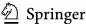

Beyond classification, spectrogram-based detection and segmentation methods, e.g., YOLOv5 (Wu et al. 2022) and U-Net (Nolan et al. 2023), provide alternatives for bird vocalization recognition, though they require complex annotated datasets. Integrating auxiliary information-geographic, temporal, and phylogenetic-further improves generalization. Multi-branch CNNs with spatial metadata (Jeantet and Dufourq 2023), taxonomyaware Phylogenetic Perspective Neural Network (PPNN) with dual attention (Wang et al. 2024), and aggregated time-series features (Singer et al. 2024) leverage contextual cues (aggregated time-series features (ATF)) to reduce misclassification among related species.

While most existing studies focus on BSR, individual bird recognition research is less prevalent due to subtler differences among individuals. Techniques include Discriminant Function Analysis (DFA), Correlation Analysis (CA), and Spectrographic Cross-Correlation (SPCC) (Deng et al. 2019), random forests (Stowell et al. 2019), attention-based autoencoders (Xie et al. 2020), multi-task learning with multi-scale densely connected module (MSD) modules (Martin et al. 2022), and BirdNET for species richness estimation (Winiarska et al. 2024).

In summary, DL has substantially advanced bird vocalization recognition, which enhance both accuracy and efficiency compared to traditional methods. Various strategies, such as attention mechanisms and feature fusion, have been implemented to further improve model performance and robustness. Additionally, the integration of auxiliary information, selfsupervised learning, and few-shot learning approaches are paving the way for advancements in recognizing not only bird species but also individual birds.

## (3) Bird vocalization recognition in the open world

Previous methods are limited to closed set recognition (CSR), requiring inputs to match predefined classes. In contrast, open set recognition (OSR) enables classifiers to identify both known and previously unseen ("Unknown") classes, addressing the challenges of diverse, unpredictable acoustic environments.

A key challenge in OSR is computing feature differences, which can be categorized into three main approaches. First, direct feature distance computation, as in Ntalampiras and Potamitis (2021), which measures reconstruction errors from Variational Autoencoders (VAEs). Second, distribution-based comparison, exemplified by Thakur et al. (2019), who modeled bird vocalization embeddings with Gaussian distributions and evaluated their differences. The third approach evaluates prediction probabilities between new and known samples. Acconcjaioco and Ntalampiras (2021) used a feature dictionary with Siamese networks, while Morgan and Braasch (2022) found OpenMax most effective for distinguishing known and unknown classes. Xie et al. (2023a) applied TDNN-LSTM with thresholded PLDA probabilities to separate known species from unknowns, and Ko et al. (2023) incorporated an "Unknown" class via Class Anchored Clustering (CAC) loss, enhancing probability-based classification across varying SNRs.

In scenarios where it is necessary to determine which species an unknown class belongs to, active learning becomes essential. Active learning optimizes the annotation process by focusing human effort on the most valuable data for improving model performance, particularly when training data is scarce and costly to obtain. Eichinski et al. (2022) demonstrated iterative selection of informative samples, significantly boosting classifier performance with minimal labeled data.

When labels are entirely absent, clustering provides an alternative for organizing vocalizations into species- or individual-specific groups. Marin-Cudraz et al. (2019) applied High Dimensional Data Clustering (HDDC) to identify individual rock ptarmigans, while Schneider et al. (2022) highlighted the effectiveness of established and novel clustering techniques, including community detection, affinity propagation, HDBSCAN, and fuzzy clustering. Deep clustering further enhances performance by combining feature extraction with finetuning. Zhao et al. (2023) used self-supervised BYOL-A with UMAP+HDBSCAN for individual Crested Ibis recognition, and Poutaraud et al. (2024) employed Meta-Embedded Clustering with DBSCAN to achieve over 80% accuracy across 30 Neotropical species.

In conclusion, OSR methods advance BVR in open-world settings by accommodating unknown classes. Feature difference computation, active learning, and clustering-especially deep clustering-jointly improve accuracy and efficiency in scenarios with limited or absent labels.

## 2.1.4 Special issues

Although automatic BVR methods employing DL have become state-of-the-art, bird recognition in the wild remains an open challenge. Two special issues for BVR-dialects and choruses-need to be addressed.

## (1) Dialects

Bird vocalizations exhibit substantial dialectal variation across regions (Smeele et al. 2024), which complicates species recognition (Xie et al. 2023a). Studying dialects informs bird communication, social behavior, and population dynamics (Story et al. 2024), but cross-corpus variability in datasets mirrors the dialect problem, necessitating robust solutions (Xie et al. 2023a).

Domain-invariant feature extraction and normalization techniques have shown promise. Instance normalization (IN) mitigates domain-specific variations (Huang and Belongie 2017), while audio residual normalization and relaxed instance frequency normalization enhance generalization across devices (Kim et al. 2021, 2022). Hybrid augmentation combined with PCEN further reduces acoustic distortions (Tang et al. 2022), and improved instance frequency normalization addresses rapid frequency modulations in bird vocalizations (Xie et al. 2023a). These normalization strategies offer a promising pathway to minimizing the effects of dialectal variations in BSR. Despite these advances, further refinement of normalization and augmentation strategies is needed, alongside the development of larger, representative datasets such as DB3V to better handle dialectal variability (Jing et al. 2024).

## (2) Chorus

Chorus, occurring typically at dawn or dusk, involve overlapping vocalizations from multiple individuals of the same or different species, posing significant challenges for automated BVR (Xie et al. 2024). Two main approaches are employed: sound source separation and polyphonic sound event detection (PSED). Sound source separation decomposes mixed audio into individual components for subsequent recognition. Recent DL-based methods have improved performance substantially. Gabriel et al. (2019) combined MUltiple SIgnal Classification (MUSIC) and Geometric High-order Decorrelation-based Source Separation (GHDSS) with CNNs for bird sound localization and separation. Dai et al. (2021) applied independent vector analysis (IVA) followed by Xception-based classification, while Bermant (2021) developed BioCPPNet, a lightweight U-Net for disentangling overlapping vocalizations. Multi-channel U-Net extensions and Deeplabv3plus architectures further integrate spectral and spatial features for precise T-F mask prediction (Xie et al. 2024).

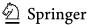

Unsupervised methods like MixIT have also been employed for single-channel bird sound separation (Denton et al. 2022). These DL approaches demonstrate the potential to achieve more accurate and robust sound source separation in complex acoustic environments.

PSED focuses on detecting and localizing overlapping events. Crous (2019) modified SEDnet to identify onset, duration, and species of overlapping sounds, achieving a framewise F-score of 0.94 for up to three simultaneous sources. Despite these advances, recognition performance may still decline in highly dense choruses. Targeted sound extraction using diffusion probabilistic modeling (DPM) offers a promising solution for isolating specific species within overlapping recordings (Hai et al. 2024).

## 2.2 Recognition above the species level

Recognition of high-level soundscape components (biophonies, geophonies, and anthropophonies) or broad taxonomic groups is simpler than species-level recognition and supports analyses of community integrity, ecosystem functioning, habitat quality, and anthropogenic impacts (Bradfer-Lawrence et al. 2023; Quinn et al. 2023), requiring minimal pre-processing, typically segmentation.

In terms of feature extraction, initially, feature selection techniques were employed. Hilasaca et al. (2021) extracted 238 audio, spectral, and image features, refining them to to improve classification of frogs, birds, and insects, achieving 89.91% accuracy with a Random Forest classifier. The advent of DL streamlined feature sets, with MFCCs (Grinfeder et al. 2022; Napier et al. 2023), Mel spectrograms (Fairbrass et al. 2019; Quinn et al. 2022; Zhang et al. 2023), STFT spectrograms (Nieto-Mora et al. 2024), and AIs (Scarpelli et al. 2021) now commonly used.

Various DL and ML methods have been applied (as shown in Table 2). CityNet, a dualCNN framework, detected urban biotic and anthropogenic sounds with precisions of 0.934 and 0.977 (Fairbrass et al. 2019). Scarpelli et al. (2021) combined false-color spectrograms (FCS) from AIs with Random Forest, achieving over 70% accuracy. Grinfeder et al. (2022) used artificial neural network (ANN) to analyze seasonal patterns. MobileNetV2-based classification achieved an F0.75-score of 0.88 (Quinn et al. 2022), while grid search-optimized models (SVM, k-NN, ANN) exceeded 96% accuracy (Napier et al. 2023). DenseNet classified seven urban forest acoustic scenes at 93.81% accuracy (Zhang et al. 2023). Unsupervised approaches, such as autoencoders (AEs), also capture key acoustic patterns to classify the forest and non-forest environments (Nieto-Mora et al. 2024).

To conclude, recognizing soundscape components beyond the species level has evolved from traditional ML techniques to advanced DL models, offering enhanced accuracy in classifying biotic, geophonic, and anthropogenic sounds. These methods provide valuable insights into ecosystem health and human impact, laying the groundwork for future advancements in environmental monitoring and biodiversity conservation.

## 2.3 Interpretability of recognition model

In SCR, DL models have largely prioritized accuracy, yet their limited interpretability hinders application in avian studies. Transparency is essential for trust, bias detection, and scientific validity, making interpretability a critical requirement for responsible deployment in ecological and biodiversity research.

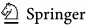

Research addressing this need remains sparse. Della Libera et al. (2024) embedded interpretability into audio classification via focal modulation networks, enhancing trust and reliability. Heinrich et al. (2025) proposed AudioProtoPNet, a ConvNeXt-based interpretable model that learns prototypical spectrogram patterns, bridging accuracy and transparency while facilitating interdisciplinary knowledge discovery. Das et al. (2024) applied XAI methods, including LIME and SHAP, to CNNs, finding SHAP particularly effective in clarifying feature contributions to species classification. Sanchez et al. (2024) developed the Embedding View tool for dimensionality reduction and interactive visualization, allowing detailed assessment of model performance and rare acoustic events.

Despite these advances, challenges remain. Interpretability is not merely technical but a scientific imperative in ecology, underpinning hypothesis generation and causal inference. By enhancing transparency, DL models can evolve from predictive tools into instruments for ecological discovery (Perry et al. 2022). As DL continues to revolutionize ecological research, the interpretability of these models remains crucial to their credibility and practical application.

## 3 Acoustic index methods

Automatic SCR offers considerable potential for assessing biodiversity in large-scale monitoring datasets. However, as noted in the preceding section, practical high-accuracy implementation remains challenging. In some contexts, the focus shifts from species-level recognition to community-level analysis of entire soundscapes, aiming to capture interspecies interaction patterns rather than individual species (Metcalf et al. 2021). Consequently, evaluating community-level soundscape characteristics has gained increasing attention (Servick 2014; Eldridge et al. 2016). AIs provide quantitative measures of community-level dynamics by summarizing frequency- or time-domain signals (Sueur et al. 2008; Servick 2014). These indices assume that increased acoustic complexity correlates with greater numbers of vocalizing individuals and species (Sueur et al. 2008). To date, nearly 70 AIs have been proposed (Quinn et al. 2023), typically categorized as alpha (within-recording) or beta (between-recording) indices (Nieto-Mora et al. 2023), with alpha indices being the primary focus due to broader usage.

Early alpha indices, including the Bioacoustic index (BIO) (Boelman et al. 2007), acoustic entropy (H) (Sueur et al. 2008), and acoustic complexity index (ACI) (Pieretti et al. 2011), demonstrated the potential to estimate species richness and abundance. Subsequent indices, such as the acoustic evenness index (AEI) (Villanueva-Rivera et al. 2011), acoustic diversity index (ADI) (Villanueva-Rivera et al. 2011), normalized difference soundscape index (NDSI) (Kasten et al. 2012), acoustic richness index (AR) (Depraetere et al. 2012), amplitude index (M), and number of frequency peaks (NP) (Gasc et al. 2013), have further enriched biodiversity assessment. The top 7 utilized alpha s and their details are listed in Table 3. Specifically, ACI quantifies amplitude variability to reflect biological sound complexity (Pieretti et al. 2011); ADI applies the Shannon-Wiener index to estimate distinct sound sources and relative abundances (Villanueva-Rivera et al. 2011); AEI, based on the Gini index, measures evenness across frequency bands (Villanueva-Rivera et al. 2011); AR captures normalized time-intensity entropy to indicate sound richness (Depraetere et al. 2012); BIO aggregates amplitude in biologically relevant frequency bands (Boelman et al.

2007); H multiplies time and spectral entropy to quantify acoustic complexity (Sueur et al. 2008); and NDSI compares biophony to anthropophony to assess human disturbance (Kasten et al. 2012). The effectiveness of these indices in practice depends on environmental and methodological factors (see Sect. 3.1). Over the past decade, AIs have evolved from proxies of species richness to tools informing taxonomic composition, temporal activity, and habitat variability, maintaining their relevance as biodiversity indicators (Scarpelli et al. 2021).

## 3.1 Dilemma of acoustic indices in biodiversity assessment

AIs, valued for their simplicity, offer rapid biodiversity assessment. Establishing consistent links with standard metrics is essential for reliable monitoring (Retamosa Izaguirre et al. 2021). Ecological studies have explored these relationships using species abundance, richness, and diversity alongside sound abundance and diversity (Alcocer et al. 2022). Table 4 summarizes research on AIs for bird diversity, highlighting their variable effectiveness as avian biodiversity indicators.

Many studies have explored the relationship between AIs and bird diversity, revealing substantial variability across habitats. Habitat types strongly influence the correlation between indices and species richness, with indices such as ACI, BIO, and AEI showing pronounced variability (Mitchell et al. 2020; Bradfer-Lawrence et al. 2020; Pan et al. 2024). Certain indices, including H, ADI, AEI, and BIO, often outperform others in predicting bird richness, whereas indices like AR, ACI, and NDSI exhibit inconsistent or weak correlations depending on the ecosystem (Eldridge et al. 2016; Dröge et al. 2021; Ross et al. 2021; Allen-Ankins et al. 2023; Budka et al. 2023; Bicudo et al. 2023; Galappaththi et al. 2024). Meta-analyses confirm moderate correlations but highlight the influence of environmental factors (Alcocer et al. 2022).

The validity of AIs is further affected by methodological and environmental conditions. Parameters such as Fourier Transform window length and the presence of anthropogenic noise significantly alter AI values (as shown in Fig. 5) (Ducay and Pease 2024). Additionally, ecological soundscape characteristics, including vocalization frequency, intensity, and source diversity, determine the sensitivity of indices; for example, H, ADI, and AEI demonstrated superior performance under controlled experiments (Zhao et al. 2019). Case studies illustrate that similar AI values can arise from distinct ecological contexts, potentially compromising basic analyses (Bradfer-Lawrence et al. 2023).

Fig. 5 Diferent ecological sources can produce similar ACI values (From Bradfer-Lawrence et al. (2023)). a Anuran chorus at 0.4-0.8 kHz, b Spix's Red-handed Howler Monkey (Alouatta discolor) chorus at 0.3-1.2 kHz, and c from the same location as (b) approximately one hour later with less consistent activity in the lower frequencies. ACIs are calculated between 0 and 4 kHz

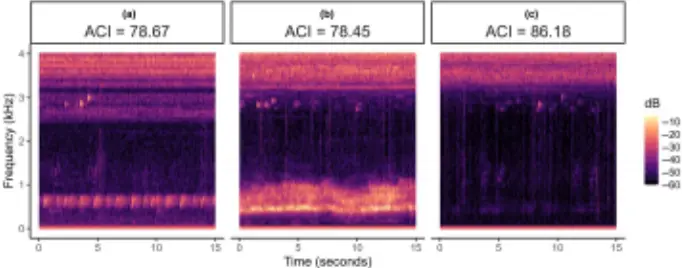

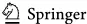

Collectively, these findings underscore that AI selection must align with research objectives, ecological context, and soundscape characteristics. Random choice of indices without validating their suitability can lead to misinterpretation. Properly selected and parameterized AIs can provide meaningful insights into biodiversity patterns, but careful consideration of environmental, methodological, and ecological factors is essential (Gaspar et al. 2023; Bradfer-Lawrence et al. 2023).

## 3.2 Enhancing acoustic index effectiveness

Enhancing the effectiveness of AIs for biodiversity assessment primarily involves two strategies: combining multiple indices and focusing on target sounds amidst diverse sound sources. Single indices capture limited aspects of the soundscape, potentially constraining predictive accuracy (Alcocer et al. 2022). Consequently, multivariate approaches that integrate multiple indices often improve ecological inference (Bradfer-Lawrence et al. 2020; Gaspar et al. 2023). For example, Allen-Ankins et al. (2023) showed that models incorporating 13 indices outperformed single-index models for vertebrate and bird richness, though performance remained limited for non-avian taxa. However, some studies in tropical forests reported marginal gains from multivariate indices, highlighting the need for context-specific selection (Bicudo et al. 2023; Kotian et al. 2024; Bradfer-Lawrence et al. 2023).

FCSs (cf. Figure 6), introduced by Towsey et al. (2014), represent an extension of this approach, mapping three AIs to RGB channels. Effective FCS construction typically requires uncorrelated indices, such as ACI, H, and AEI (Towsey et al. 2018), and has proven useful for identifying geophony, biophony, and specific sound classes across ecosystems (Scarpelli et al. 2021).

Minimizing interference from non-target sounds is equally critical. Non-bird vocalizations, geophonic, and anthropogenic sounds can mask target signals, compromising biodiversity estimates (Retamosa Izaguirre et al. 2021). Studies demonstrate that rainfall, insect stridulation, and ambient noise significantly affect AIs, necessitating appropriate filtering or thresholding (Ross et al. 2021; Zhang et al. 2024). Fixed-frequency filters are commonly used (Hyland et al. 2023), but adaptive methods, such as the frequency-dependent acoustic diversity index (FADI), offer superior resilience to variable noise conditions (Xu et al. 2023). Integrating temporal, spectral, or ecological information further refines target detection, although effectiveness may vary across contexts (Metcalf et al. 2021; Galappaththi et al. 2024; Quinn et al. 2023).

Fig. 6 Example of False-color spectrogram (FCS) (From Towsey et al. (2014)). It is a False-color 24-h spectrogram generated by combining normalized spectrograms for ACI, 1-H(t), and Acoustic Cover. Vertical gridlines represent hourly intervals, beginning and ending at midnight, while horizontal gridlines are set at 1 kHz intervals

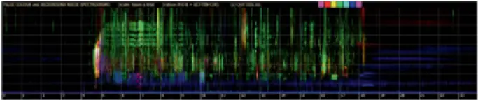

In conclusion, current research has made significant advancements in optimizing AIs for biodiversity assessment, emphasizing the integration of multiple indices, adaptation of filtering techniques, and mitigation of non-target sounds. However, the generalizability of some of these methods still requires further validation.

## 4 Datasets

DL shows strong potential for ecological studies but is hindered by sparse, noisy, and poorly labeled data, which limit model generalizability and risk overfitting. Clean, well-annotated datasets are crucial for advancing bird vocalization recognition (Michaud et al. 2023).

The existing datasets presented in Table 5 remain limited, highlighting the need for more labeled data across diverse ecosystems and locations to train better-performing models (Zhang et al. 2023). Data augmentation is widely used to expand and optimize bird sound datasets, addressing issues such as limited labels, class imbalance, and site-specific noise. Techniques are applied at both waveform and spectrogram levels. Waveform-level augmentation combines class label-preserving transforms-such as pitch shifting, time-stretching, gain variation, and background-noise injection (Schiavo et al. 2025). In spectrogram-based learning, techniques such as SpecAugment (time/frequency masking) and randomized spectrogram transforms create diverse views of the same sound, enhancing model generalization (Lu et al. 2025). Generative augmentation further benefits few-shot or rare-species scenarios-for instance, VQ-VAE2-based synthesis or site-specific mixture generation-by increasing sample diversity and improving downstream classification (Guei et al. 2024). Appropriate augmentation is crucial for expanding limited datasets and enhancing robustness in small-sample bird sound tasks, as excessive or improper transforms can degrade performance, whereas well-tuned waveform- and spectrogram-level strategies improve generalization (Wei et al. 2024).

Citizen science initiatives also hold great promise; for instance, Lehikoinen et al. (2023) demonstrated the effectiveness of engaging Finnish birdwatchers to annotate audio clips, creating a high-quality dataset through crowdsourcing. Open-access platforms like Xenocanto (Xeno-canto Foundation 2024) and Freesound (Universitat Pompeu Fabra 2024) further contribute by providing diverse bird sound samples, enabling researchers to develop models that generalize across varied contexts (Xie and Zhu 2019; Jing et al. 2024; ImageCLEF 2024). Beyond audio data, integrating environmental covariates-such as climate, terrain, forest structure, and topography-into soundscape analysis is critical for capturing comprehensive biodiversity information (Weldy et al. 2024). Encouragingly, recent datasets, as shown in Table 5, incorporate these variables, enriching their value for ecological monitoring.

While current limitations in data availability and quality pose challenges for training DL models in ecological applications, innovative methods and collaborative efforts, such as citizen science and the inclusion of environmental covariates, are paving the way for more diverse and comprehensive datasets. These advancements are crucial for improving model generalization and supporting practical applications in ecological monitoring.

## 5 Challenges and future research directions

## 5.1 Standardized data collection and annotated datasets

Variations in recording devices and compression formats introduce biases in AIs, limiting inter-study comparability (Mennill 2024; Zhang et al. 2024). Establishing unified recording protocols, including equipment calibration and data formatting, is crucial. Open ecoacoustic platforms promoting data transparency and interoperability can support long-term monitoring aligned with the Kunming-Montreal GBF goals (Napier et al. 2024). Addressing the challenge of manual annotation, approaches like unsupervised learning with expert-in-theloop annotation and leveraging large multimodal models (LMMs) can significantly expand annotated datasets. Collaborative efforts and clear frameworks for data reuse will accelerate progress and enhance the scalability of ML applications in ecoacoustics.

## 5.2 Empowering soundscape components recognition with large multi-modal models

ML, particularly DL, has advanced SCR but persistent challenges remain-low SNR, heavy reliance on labeled data, model complexity versus interpretability, costly computation for edge deployment, and segmentation/preprocessing bottlenecks that demand extensive annotation. LMMs, which unify audio, image and text modalities, offer a promising path: models such as CLAP enable zero-shot audio recognition and reduce annotation needs (Elizalde et al. 2024). Integrating computer-vision techniques (e.g., spectrogram object detection, tracking, weakly/unsupervised visual analysis) into LMMs to provide richer contextual cues for more robust, context-aware monitoring (Parcerisas et al. 2024). To make LMMs practical for biodiversity applications, future work should combine self-supervised pretraining, parameter-efficient tuning and model distillation to cut computational costs, refine promptand domain-adaptation methods to improve generalization, and develop preprocessing and segmentation pipelines that preserve biological signal while minimizing manual input (Tuia et al. 2022).

## 5.3 Theory study of the relationship between soundscape and biodiversity

Soundscape research is an emerging field with significant potential, but its advancement depends on solid foundations in acoustics, digital signal processing, and robust methodological design. Establishing theoretical frameworks that link soundscape data and AIs with biodiversity metrics is crucial, as the accuracy of these indices relies on understanding how soundscape patterns reflect ecological processes. Despite initial studies reporting correlations between soundscapes and environmental factors (Zhang et al. 2024; Pan et al. 2024), inconsistencies across sites and limited empirical validation highlight the need for rigorous testing, quantification of uncertainties, and refinement of analytical approaches (BradferLawrence et al. 2023). Developing such frameworks will enhance the reliability of AIs, improve biodiversity assessments, and expand the ecological applications of soundscape monitoring.

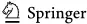

## 5.4 Enhancing ecological insights: Combining acoustic indices with deep learning

AIs provide efficient large-scale soundscape analysis but often struggle to link biodiversity consistently (Alcocer et al. 2022). DL-based methods excel in species-specific recognition but are computationally intensive and data-dependent. Integrating AIs with DL-based models combines broad-scale analysis with precise species detection, enabling effective largescale biodiversity monitoring. Successful examples include using AIs as auxiliary features to enhance DL accuracy (Podolskiy et al. 2024; Espejo et al. 2024). Additionally, learned numerical descriptors offer data-driven alternatives to traditional indices (Sethi et al. 2020; Rowe et al. 2021). Future research should focus on refining integration methods, improving model interpretability, and generalizing representations across diverse ecological contexts.

## 5.5 Transforming biodiversity conservation with intelligent soundscape analysis

Acoustic monitoring through PAM, offers continuous, real-time insights into species presence, behavior, and population dynamics (Ewers 2024). Coupled with intelligent soundscape analysis, it enables automated species recognition, biodiversity trend prediction, and data-driven conservation strategies (Farina et al. 2024). Integrating behavioral bioacoustics with climate data deepens understanding of species richness, ecological interactions, and environmental responses, while emerging concepts like digital twin ecosystems enhance adaptability and efficiency in management. Strengthened by technological innovation and expanding datasets, soundscape ecology holds substantial promise for biodiversity monitoring, provided its capabilities are advanced and applied with realistic expectations.

## 6 Conclusion

PAM is rapidly emerging as a powerful tool for biodiversity studies, from analyzing individual vocal behavior to assessing ecosystem health. Its broader application, however, is constrained by the need for advanced automated soundscape analysis to extract meaningful insights from vast, complex audio datasets. This review examined the role of ML in soundscape analysis for bird biodiversity assessment. Methods were categorized into SCR and AIs approaches, reviewing representative techniques, their advantages, challenges and prospects. While soundscape monitoring shows great promise, it remains in its early stages and requires methodological advances. Future work should prioritize standardized, openly shared datasets and integrate SCR with AIs, developing accurate, scalable, and generalizable analytical approaches to better support long-term biodiversity monitoring and conservation.

## Appendix A

See Tables 2, 3, 4 and 5.

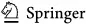

Table 2 Recognition methods at the level above the species

| Study                    | Feature                                                                         | Method                  | Components                                                                                                                                   |
| ------------------------ | ------------------------------------------------------------------------------- | ----------------------- | -------------------------------------------------------------------------------------------------------------------------------------------- |
| Fairbrass et al. (2019)  | Mel spectrogram                                                                 | CityNet                 | Biophony and anthropophony                                                                                                                   |
| Hilasaca et al. (2021)   | Selected features from 238 distinct features of audio, spectrum, and image data | Random forest           | Frogs, birds, and insects                                                                                                                    |
| Scarpelli et al. (2021)  | FCS from acoustic indi- ces like ACI, Temporal entropy, and Events per second   | Random forest           | Bird, insect, wind, silence                                                                                                                  |
| Grinfeder et al. (2022)  | MFCCs                                                                           | ANN                     | Silence, birds, mammals, insects, geophony, anthropophony                                                                                    |
| Quinn et al. (2022)      | Mel spectrogram                                                                 | Pre-trained MobileNetV2 | Human noise (Anthropophony), wild- life vocalizations (Biophony), weather phenomena (Geophony), Quiet peri- ods, and Microphone interference |
| Napier et al. (2023)     | MFCCs                                                                           | SVM, k-NN, and ANN      | Biophony, geophony, and anthropophony                                                                                                        |
| Zhang et al. (2023)      | Mel spectrogram                                                                 | DenseNet                | Human sounds, insect sounds, bird sounds, bird-human sounds, insect- human sounds, bird-insect sounds, and silence                           |
| Nieto-Mora et al. (2024) | STFT                                                                            | Autoencoder             | Forest and non-forest environments                                                                                                           |

Table 3 Typical acoustic indices

| R implementation Package: sounde- cology; Function: sound Package: sounde- cology; Function:                                                                                                                                                                                                                                                                                                                                                             | acoustic_diversity() Package: sounde- cology; Function: acoustic_evenness() Package: seewave; Function:                                                                                                                                                                                                                                                                                                                                                      | AR() Package: sounde- cology; Function: bioacoustic_index()                                                                                                                                                                                                             | Package: seewave; Func- tion: H()                                                                                                                                                                                        | Package: soundecology; Function: ndsi()                                                                                                                                                                                                            |
| -------------------------------------------------------------------------------------------------------------------------------------------------------------------------------------------------------------------------------------------------------------------------------------------------------------------------------------------------------------------------------------------------------------------------------------------------------- | ------------------------------------------------------------------------------------------------------------------------------------------------------------------------------------------------------------------------------------------------------------------------------------------------------------------------------------------------------------------------------------------------------------------------------------------------------------ | ----------------------------------------------------------------------------------------------------------------------------------------------------------------------------------------------------------------------------------------------------------------------- | ------------------------------------------------------------------------------------------------------------------------------------------------------------------------------------------------------------------------ | -------------------------------------------------------------------------------------------------------------------------------------------------------------------------------------------------------------------------------------------------- |
| Expected function of intensity difference among adjacent frequency intensity in a single frequency bin (Ik); measures variability in amplitude between adjacent frequency bins Indicates the complexity of biological sounds and aids in detecting changes in biodiversity and ecosystem health acoustic_complexity() frequency bin (pi); Splits frequency bands and employs the Estimates the number of distinct sources and their relative abundances, | index to quantify acoustic diver- percentage of each band containing amplitude threshold (the dBFS) facilitating biodiversity assessment coefficient with intensity (I) at each frequency bin acoustic evenness. AEI ranges from 0 to 1, with corresponding to lower acoustic evenness Reflects sound distribution evenness, indicating the diversity of vocalizing species temporal entropy index (Ht) and median of Estimates the number of distinct sound | number of sources, which correlates with species richness and diversity 2-8 kHz kHz bands and the variation band with the Estimates the presence and abundance of vocalizing species, offering insights into the biological richness                                    | bands, the applied to compute ) entropies. These the Acoustic Entropy indicates pure tones and Assesses sound energy distribution across frequencies, serving as a mea- sure of environmental complexity and variability | anthropophony (a). by calculat- kHz) to biophony values closer to dominant and values Assesses human activity's impact on the natural soundscape and indicating the level of human disturbance                                                     |
| formula Description Summary bins (D); the log pi Relative intensity in each spectrograms into distinct                                                                                                                                                                                                                                                                                                                                                   | ∑ Shannon-Wiener diversity sity, determined by the sounds surpassing a specified default = - 50 (AEI) et al. - ∑ Gini(I) × logGini(I) Uses Gini to calculate higher values                                                                                                                                                                                                                                                                                   | rank(M) n2 Product of the amplitude envelope (M) divided by the frequency bins (n) Chooses the interesting frequency range (mostly for avian), then divides recordings into 1 calculates acoustic complexity by measuring in signal intensity relative to the frequency | lowest amplitude (Ik) Ht × Hf Divides recordings into distinct frequency Shannon-Wiener diversity index is both temporal (Ht) and spectral (Hf are subsequently multiplied to yield index, ranging from 0 to 1, where 0  | 1 signifies high-energy Ratio of amplitude in biophony (b) and Evaluates the degree of human disturbance ing the ratio of anthropophony (1-2 (2-11 kHz). It ranges from -1 to 1, with -1 meaning that anthropophonies are closer to 1 the opposite |
| Index Computing D/ ∑ Ik Index - pi ×                                                                                                                                                                                                                                                                                                                                                                                                                     | Evenness                                                                                                                                                                                                                                                                                                                                                                                                                                                     | Richness (AR) al. 2012) rank(Ht) · (BIO) 2007) ∑ Ik                                                                                                                                                                                                                     | Entropy (H) al. 2008)                                                                                                                                                                                                    | Index al. b - a b + a                                                                                                                                                                                                                              |
| Acoustic Acoustic Complexity Index (ACI) (Pieretti et al. 2011) Acoustic Diversity (ADI) (Villanueva-Rivera                                                                                                                                                                                                                                                                                                                                              | et al. 2011) Acoustic (Villanueva-Rivera 2011) Acoustic                                                                                                                                                                                                                                                                                                                                                                                                      | (Depraetere et Bioacoustic Index (Boelman et al.                                                                                                                                                                                                                        | Acoustic (Sueur et                                                                                                                                                                                                       | Normalized Differ- ence Soundscape (NDSI) (Kasten et 2012)                                                                                                                                                                                         |

| Study Table 4                      | Diversity metrics Overview of existing | Employed acous- tic indices studies that utilize        | Study locations or ecosys- tem types acoustic indices to assess bird                                                                                | Main conclusions diversity                                                                                                                                                                                         |
| ---------------------------------- | -------------------------------------- | ------------------------------------------------------- | --------------------------------------------------------------------------------------------------------------------------------------------------- | ------------------------------------------------------------------------------------------------------------------------------------------------------------------------------------------------------------------ |
| Rajan et al. (2019)                | BR                                     | ACI, ADI, AEI, BIO, and NDSI                            | Hill Palace Museum urban park, IringoleKavusacred grove, and the Salim Ali Bird Sanctuary in Kerala, India                                          | Five acoustic indices cor- relate with BR                                                                                                                                                                          |
| Zhao et al. (2019)                 | BR                                     | ACI, ADI, AEI, AR, BIO, H, and NDSI                     | North America and Poyang Lake, China                                                                                                                | ADI, AEI, and H moder- ately correlate with BR                                                                                                                                                                     |
| Bradfer- Lawrence et al. (2020)    | BR; BA                                 | ACI, ADI, AEI, BIO, H, M, and NDSI                      | Continuous forest, frag- mented forest, riparian forest, teak plantations, re- generating scrub and cattle pasture in the Emparador landscape       | ACI, AEI, Bio, NDSI, and NDSI-β show strong positive correlations with both BR and BA, while H and NDSI-α exhibit negative correlations. ADI is inversely related to BR, whereas M positively cor- relates with BA |
| Mitchell et al. (2020)             | BR                                     | ACI, BIO, ADI, NDSI, and AEI                            | Degradation gradient (intact and logged forests, riparian forests, remnants, and oil palm plantations) in Northeast Borneo                          | Habitat type influences index correlations with BR                                                                                                                                                                 |
| Dröge et al. (2021)                | BR                                     | ACI, ADI, AEI, and H                                    | Old-growth forest, forest fragment, forest-derived and fallow-derived vanilla agro forest, herbaceous and woody fallow, rice paddy in Madagascar    | ADI and AEI inversely re- lated with BR; H are most effective in old growth forests and least so in rice paddies and fallow lands                                                                                  |
| Metcalf et al. (2021)              | BR; Shannon diversity                  | ACI and BIO                                             | Undisturbed primary forests, logged primary forests, burned primary forests, logged-and burned primary forests, and secondary forests in the Amazon | BIO positively correlates; ACI shows negative correlation                                                                                                                                                          |
| Ross et al. (2021)                 | Biotic sound-type richness             | ACI, ADI, AEI, AR, BIO, H, Ht, M, NDSI, NDSI- α, NDSI-β | Okinawajima, Japan                                                                                                                                  | AR and Ht outperform others; None of the selected acoustic indices correlated with measured richness when masked by the sound of broadband insects                                                                 |
| Retamo- sa Izaguirre et al. (2021) | BR; BA; BD; Evenness                   | ACI, ADI, AEI, BIO, Hf , Ht, MAE, SPLMean, NDSI, NP, TE | Tropical rainforests, Costa Rica                                                                                                                    | ADI and AEI effective; weak correlation for other indices                                                                                                                                                          |
| Shamon et al. (2021)               | BR                                     | ACI, ADI, AEI, and BIO                                  | Mixed-grass prairie, Mon- tana, USA                                                                                                                 | BIO and ACI strongly correlate with BR; ADI and AEI do not                                                                                                                                                         |
| Bicudo et al. (2023)               | BR                                     | ACI, ADI, AEI, BIO, and H                               | Amazonian land-bridge islands                                                                                                                       | Multivariate models with multiple acoustic indices improve prediction but still face limitations                                                                                                                   |
| Gaspar et al. (2023)               | BR; BA; BD                             | ACI, ADI, AEI, AR, BIO, H, Ht, and NDSI                 | Forests, pastures, agricul- ture, and urban areas in Brazil                                                                                         | BIO is the best single index; combined indices perform better                                                                                                                                                      |

Table 4 (continued)

| Study                          | Diversity metrics | Employed acous- tic indices                                                  | Study locations or ecosys- tem types                          | Main conclusions                                                 |
| ------------------------------ | ----------------- | ---------------------------------------------------------------------------- | ------------------------------------------------------------- | ---------------------------------------------------------------- |
| Quinn et al. (2023)            | BR                | ACI, ADI, AEI, BIO, H, Hf , Ht, M, NDSI, NDSI- α, NDSI-β, RN, RUGO, SFN, ZCR | Urban to natural habitats, Sonoma County, USA                 | Biophony and acoustic indices predict BR well                    |
| Budka et al. (2023)            | BR                | ACI, ADI, and BIO                                                            | Lowland temperate Białowieża forest                           | BIO is highest effective; correlations vary with time and season |
| Ducay and Pease (2024)         | BR                | ACI, ADI, AEI, AR, BIO, H, M, NDSI, and NP                                   | Simulated eBird data, eastern USA                             | ACI, ADI, AEI, and BIO resilient to vehicular noise              |
| Galappaththi et al. (2024)     | BR                | ACI, ADI, AEI, AR, BIO, H, and NDSI                                          | Damingshan, Shiwan- dashan, and Dayaoshan in southern China   | Indices weak and inconsis- tent across habitats                  |
| Hutschen- reiter et al. (2024) | BA                | Detection rate (DR) and Maxi- mum count per minute (MAX)                     | Late successional and mature forest patches near Lake Bacalar | DR reliable for BA; MAX for population size                      |
| Santos et al. (2024)           | BR                | ACI, ADI, AEI, BIO, H, and NDSI                                              | Urban in Brasília, Federal District                           | Indices unsuitable for urban biodiversity monitoring             |
| Kotian et al. (2024)           | BR                | ACI, ADI, AEI, BIO, H, NDSI, and NP                                          | Tropical dry forests, cen- tral India                         | Combined indices predict BR better than single ones              |

BR bird richness, BA bird abundance, BD bird diversity BSR bird species recognition, BIR bird individual recognition, BAD bird audio detection, SCR soudscape component recognition, SED sound event detection Acknowledgement This work was jointly supported by the Beijing Natural Science Foundation (Grant No. 5252014), the National Natural Science Foundation of China (Grant No. 62303063), the Key Open Research Funding of the Laboratory of Intelligent Processing Technology for Digital Music (Zhejiang Conservatory of Music), Ministry of Culture and Tourism (Grant No. 2024DMKLB001), and the National Key Research and Development Program of China (Grant No. 2023YFF1304301).

| Name Table 5 Existing datasets                                                        | Content                                                                                                                                                                                                  | Quantity                                                                                                                                                                                                            | Potential research                               |
| ------------------------------------------------------------------------------------- | -------------------------------------------------------------------------------------------------------------------------------------------------------------------------------------------------------- | ------------------------------------------------------------------------------------------------------------------------------------------------------------------------------------------------------------------- | ------------------------------------------------ |
| COL-43SD, CLO- SWTH, CLO-WTSP (Salamon et al. 2016)                                   | COL-43SD includes high-quality di- rectional recordings and noisier field samples; CLO-SWTH (Swainson's Thrush) and CLO-WTSP (White- throated Sparrow) use remote acous- tic sensors in natural habitats | COL-43SD: 5,428 clips of flight calls (43 species); CLO-SWTH: 179,111 clips; CLO-WTSP: 16,703 clips                                                                                                                 | BSR; WTSP and SWTH vo- calization detection      |
| Multi-label Bird Species Classification (MLSP) (Koluguri et al. 2017)                 | Recorded in H. J. Andrews (HJA) Long-Term Experimental Research Forest                                                                                                                                   | 645 10-second recordings (19 species)                                                                                                                                                                               | Multi-label BSR                                  |
| Bird Audio Detection dataset in DCASE2018 (Stowell et al. 2019)                       | Comprises three sub-datasets: War- blrb10k (Xeno-canto), FF1010Bird (Freefield1010), and BirdVox- DCASE-20k (nocturnal calls)                                                                            | Warblrb10k: 10,000 clips; FF1010Bird: 7,000 clips; BirdVox-DCASE- 20k: 20,000 clips                                                                                                                                 | BAD                                              |
| Call data of the Little Owl, Murrelet, and Kiri- wake's warbler (Stowell et al. 2019) | Targeted recordings of three species in distinct habitats across Europe                                                                                                                                  | Chiffchaff: totaling 550 min, 5107 training, 1131 evaluation clips; Little Owl: totaling 11 min, 545 training, 407 evaluation clips; Tree Pipit and Chiffchaff: totaling 27 min, 409 training, 303 evaluation clips | BIR                                              |
| Male Common Cuckoos (Deng et al. 2019)                                                | Recordings from breeding season in Liaohe Delta Nature Reserve, China                                                                                                                                    | 1,032 syllables from 30 male Common Cuckoos                                                                                                                                                                         | BIR                                              |
| NIPS4Bplus (Morfi et al. 2019)                                                        | Collected in France and Spain, includes species-specific tags and temporal annotations                                                                                                                   | 687 training files (51 bird species, 87 total classes); 1,000 test files                                                                                                                                            | BSR; BAD                                         |
| Birds in Central Poultry Development Organiza- tion (Mohanty et al. 2020)             | Call data of 14 bird species in Bhu- baneswar, India                                                                                                                                                     | 638 calls from 133 indi- viduals (14 species)                                                                                                                                                                       | BSR; BIR                                         |
| Cornell Bird Challenge (CBC) (Cornell Lab of Ornithology 2020)                        | Large dataset from Cornell Lab, mostly sourced from Xeno-canto                                                                                                                                           | 21,400 recordings (5 s to 2 min, 264 species)                                                                                                                                                                       | BSR                                              |
| Birdsdata (Beijing Acad- emy of Artificial Intel- ligence (BAAI) 2020)                | Bird sounds from 20 species, curated by Beijing Academy of Artificial Intelligence (BAAI)                                                                                                                | 14,311 2-second clips (20 species)                                                                                                                                                                                  | BSR                                              |
| BIRDS (Tuncer et al. 2021)                                                            | Recordings Sourced from Xeno- Canto and YouTube Annotated data from 100 autono-                                                                                                                          | 781 audio clips (average duration: 5 s, 18 species)                                                                                                                                                                 | BSR                                              |
| Ecoacoustic Dataset from Arctic North Slope Alaska (EDANSA-2019) (Çoban et al. 2022)  | mous recording units covering 9000 square miles across Alaska's North Slope and neighboring regions                                                                                                      | 10,782 samples, over 27 h of audio, with 28 tags across 9 categories                                                                                                                                                | SCR on three distinct ranks                      |
| Soundscape of southeast Cameroon (Diepstraten et al. 2022)                            | Recordings with metadata on habitat, human impact, and climate factors from three distinct sites in southeast Cameroon's rainforest                                                                      | 20,485 one-minute recordings                                                                                                                                                                                        | Detection and clas- sification of animal species |
| SiulMalaya (Jamil et al. 2023)                                                        | Lowland forest bird recordings an- notated from eBird contributions                                                                                                                                      | 1,665 segmented audios from 166 raw recordings (13 species)                                                                                                                                                         | BSR                                              |

Table 5 (continued)

| Name                                                                       | Content                                                                                                   | Quantity                                                                                               | Potential research                   |
| -------------------------------------------------------------------------- | --------------------------------------------------------------------------------------------------------- | ------------------------------------------------------------------------------------------------------ | ------------------------------------ |
| Acoustic detection data- set of birds (Aves) (Wu et al. 2023)              | Collected by six PAM stations in Yushan National Park, Taiwan                                             | 802,670 clips (6,243,820 vocalizations of 7 species) from 1.7M one-minute recordings                   | BSR; BAD                             |
| Western Mediterranean Wetland Birds (WMWB) (Gómez-Gómez et al. 2023)       | Annotated audio and spectral images of endemic bird species in Spain                                      | 5,795 audio clips, 201.6 min (20 species)                                                              | BSR; BIR                             |
| ENABIRDS (Chronister et al. 2021)                                          | Dawn chorus recordings from Powdermill Nature Reserve (USA), annotated with timestamps and frequency data | 385 min of dawn chorus with 16,052 annotations (48 species)                                            | BSR; BIR                             |
| Silent Cities (Challéat et al. 2024)                                       | Urban soundscape recordings from 261 contributors across 35 countries                                     | 2,701,378 preprocessed 10-second files labeled with 28 tags across 9 significant environmental classes | SED                                  |
| Dialect Dominated Dataset of Bird Vocalisa- tion (D3BV) (Jing et al. 2024) | Dialects of 10 bird species across three geographic regions in USA                                        | 91,752 s of audio                                                                                      | Dialect recogni- tion; BSR           |
| Uganda bird vocalization (Magumba et al. 2024)                             | Recordings from 7 Ugandan habitats                                                                        | 570 clips (212 species)                                                                                | BSR                                  |
| Wytham Great Tit Song (Recalde et al. 2024)                                | Detailed vocal and life history data from Great Tits across 703 nesting sites in Wytham Woods             | 21,283 h, over 1 M indi- vidual acoustic units from more than 400 individuals                          | BIR; song learning studies           |
| Worldwide Sound- scapes (WWSS) (Berlin Museum für Naturkunde               | Global PAM dataset spanning di- verse ecosystems and taxonomies                                           | 261,000 recording days from 8,744 locations                                                            | SCR                                  |
| 2024) Avian dawn chorus recordings (Weldy et al. 2024)                     | Dawn chorus data with environ- mental covariates from California, Oregon, and Washington, USA             | 1,575 5-minute recordings (32,994 annotations)                                                         | BSR; BAD; Animal species recognition |
| BirdCLEF 2014-2024 (ImageCLEF 2024)                                        | Annual datasets from the Bird- CLEF challenges, sourced from Xeno-Canto                                   | Tens of thousands of recordings (1,500 species globally)                                               | BSR                                  |
| Freesound (Universitat Pompeu Fabra 2024)                                  | General sound repository, including bird vocalizations                                                    | 15,750 bird sound recordings                                                                           | SCR; BSR; BAD                        |
| Xeno-canto (Xeno-canto Foundation 2024)                                    | Global repository of bird vocaliza- tions with rich metadata                                              | 899,068 recordings (12,098 species, 12,684 subspecies)                                                 | BSR                                  |

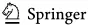

Author contributions Conceptualization: J. X. and S.X.; Investigation: J. X., S. X., Y. L., X. J., L. X. and M.Z.; Methodology: J. X.,S.X.,Y.L. and X.J.; Project administration: J. Z., K.Q. and B. S.; Supervision: J. Z. and K.Q.; Visualization: L. X., M.Z. and S.X.; Writing - original draft: J. X.,S.X. and X.J; Writing - review &amp; editing: J. X., S.X.,Y. L., J. Z., K.Q. and B. S.; Funding acquisition: J. X.

Data availability No datasets were generated or analysed during the current study.

## Declarations

Conflict of interest The authors declare no conflict of interest.

Open Access This article is licensed under a Creative Commons Attribution-NonCommercialNoDerivatives 4.0 International License, which permits any non-commercial use, sharing, distribution and reproduction in any medium or format, as long as you give appropriate credit to the original author(s) and the source, provide a link to the Creative Commons licence, and indicate if you modified the licensed material. You do not have permission under this licence to share adapted material derived from this article or parts of it. The images or other third party material in this article are included in the article's Creative Commons licence, unless indicated otherwise in a credit line to the material. If material is not included in the article's Creative Commons licence and your intended use is not permitted by statutory regulation or exceeds the permitted use, you will need to obtain permission directly from the copyright holder. To view a copy of this licence, visit h ttp://creativecommons.org/licenses/by-nc-nd/4.0/.

## References

- Allen-Ankins S, McKnight DT, Nordberg EJ, Hoefer S, Roe P, Watson DM, McDonald PG, Fuller RA, Schwarzkopf L (2023) Effectiveness of acoustic indices as indicators of vertebrate biodiversity. Ecol Ind 147:109937
- Alcocer I, Lima H, Sugai LSM, Llusia D (2022) Acoustic indices as proxies for biodiversity: a meta-analysis. Biol Rev 97(6):2209-2236
- Acconcjaioco M, Ntalampiras S (2021) One-shot learning for acoustic identification of bird species in nonstationary environments. In: Proceedings of the 2020 25th International conference on pattern recognition (ICPR), pp 755-762. IEEE
- Andono PN, Shidik GF, Prabowo DP, Yanuarsari DH, Sari Y, Pramunendar RA (2023) Feature selection on gammatone cepstral coefficients for bird voice classification using particle swarm optimization. Int J Intell Eng Syst 16(1)
- Boelman NT, Asner GP, Hart PJ, Martin RE (2007) Multi-trophic invasion resistance in Hawaii: bioacoustics, field surveys, and airborne remote sensing. Ecol Appl 17(8):2137-2144
- Bocaccio H, Domínguez M, Mahler B, Reboreda JC, Mindlin G (2023) Identification of dialects and individuals of globally threatened yellow cardinals using neural networks. Eco Inform 78:102372
- Beijing Academy of Artificial Intelligence (BAAI). Birdsdata (2020-08-12). https://www.aminer.cn/research \_report/5f3394d73c99ce0ab7bc771f
- Bermant PC (2021) Biocppnet: automatic bioacoustic source separation with deep neural networks. Sci Rep 11(1):23502
- Berlin Museum für Naturkunde. EcoSound Collection. Accessed: 2024-11-12 (2024-08-26). https://ecosoun d-web.de/ecosound_web/collection/index/106
- Brown A, Garg S, Montgomery J (2019) Automatic rain and cicada chorus filtering of bird acoustic data. Appl Soft Comput 81:105501
- Bhatia R (2021) Bird song synthesis using neural vocoders. Master's thesis, Itä-Suomen yliopisto
- Bicudo T, Llusia D, Anciães M, Gil D (2023) Poor performance of acoustic indices as proxies for bird diversity in a fragmented amazonian landscape. Eco Inform 77:102241

- Bradfer-Lawrence T, Bunnefeld N, Gardner N, Willis SG, Dent DH (2020) Rapid assessment of avian species richness and abundance using acoustic indices. Ecol Ind 115:106400
- Bradfer-Lawrence T, Desjonqueres C, Eldridge A, Johnston A, Metcalf O (2023) Using acoustic indices in ecology: guidance on study design, analyses and interpretation. Methods Ecol Evol 14(9):2192-2204
- Bravo Sanchez FJ, Hossain MR, English NB, Moore ST (2021) Bioacoustic classification of avian calls from raw sound waveforms with an open-source deep learning architecture. Sci Rep 11(1):1-12
- Budka M, Sokołowska E, Muszyńska A, Staniewicz A (2023) Acoustic indices estimate breeding bird species richness with daily and seasonally variable effectiveness in lowland temperate białowieża forest. Ecol Ind 148:110027
- Bateman J, Uzal A (2022) The relationship between the acoustic complexity index and avian species richness and diversity: a review. Bioacoustics 31(5):614-627
- Bellafkir H, Vogelbacher M, Schneider D, Kizik V, Mühling M, Freisleben B (2023) Bird species recognition in soundscapes with self-supervised pre-training. In: Proceedings of the International conference on intelligent systems and pattern recognition, pp 60-74. Springer
- Challéat S, Farrugia N, Froidevaux JS, Gasc A, Pajusco N (2024) A dataset of acoustic measurements from soundscapes collected worldwide during the covid-19 pandemic. Sci Data 11(1):928
- Chronister LM, Larkin JT, Rhinehart TA, King D, Larkin JL, Kitzes J (2024) Evaluating the predictors of habitat use and successful reproduction in a model bird species using a large-scale automated acoustic array. Ecography 06940
- Cohen Y, Nicholson DA, Sanchioni A, Mallaber EK, Skidanova V, Gardner TJ (2022) Automated annotation of birdsong with a neural network that segments spectrograms. Elife 11:63853
- Cornell Lab of Ornithology (2020) Cornell birdcall identification. https://www.kaggle.com/c/birdsong-reco gnition
- Çoban EB, Perra M, Pir D, Mandel MI (2022) Edansa-2019: The ecoacoustic dataset from arctic north slope alaska. In: Workshop on the detection and classification of acoustic scenes and events
- Crous M (2019) Polyphonic bird sound event detection with convolutional recurrent neural networks. Master's thesis, University of Amsterdam
- Chronister LM, Rhinehart TA, Place A, Kitzes J (2021) An annotated set of audio recordings of eastern north american birds containing frequency, time, and species information. Ecology 102(6)
- Clark ML, Salas L, Baligar S, Quinn CA, Snyder RL, Leland D, Schackwitz W, Goetz SJ, Newsam S (2023) The effect of soundscape composition on bird vocalization classification in a citizen science biodiversity monitoring project. Eco Inform 75:102065
- Chen X, Zeng Z (2023) Bird sound recognition based on adaptive frequency cepstral coefficient and improved support vector machine using a hunter-prey optimizer. Math Biosci Eng 20(11):19438-19453
- Disabato S, Canonaco G, Flikkema PG, Roveri M, Alippi C (2021) Birdsong detection at the edge with deep learning. In: Proceedings of the 2021 IEEE international conference on smart computing (SMARTCOMP), pp 9-16. IEEE
- Diepstraten J, Kuenbou JK, Willie J (2022) Datasets for assessing the structure and drivers of biological sounds. Data Brief 41:107930
- Della Libera L, Subakan C, Ravanelli M (2024) Focal modulation networks for interpretable sound classification. In: Proceedings of the 2024 IEEE International Conference on Acoustics, Speech, and Signal Processing Workshops (ICASSPW), pp. 853-857. IEEE
- Deng Z, Lloyd H, Xia C, Li D, Zhang Y (2019) Within-season decline in call consistency of individual male common cuckoos (cuculus canorus). J Ornithol 160(2):317-327
- Dröge S, Martin DA, Andriafanomezantsoa R, Burivalova Z, Fulgence TR, Osen K, Rakotomalala E, Schwab D, Wurz A, Richter T et al (2021) Listening to a changing landscape: acoustic indices reflect bird species richness and plot-scale vegetation structure across different land-use types in north-eastern madagascar. Ecol Ind 120:106929
- Ducay RL, Pease BS (2024) The impact of vehicular noise on acoustic indices within simulated bird assemblage soundscapes. Bioacoustics, 1-18
- Das N, Padhy N, Dey N, Paul H, Chowdhury S (2024) Exploring explainable ai methods for bird sound-based species recognition systems. Multimedia Tools and Applications, 1-31
- Depraetere M, Pavoine S, Jiguet F, Gasc A, Duvail S, Sueur J (2012) Monitoring animal diversity using acoustic indices: implementation in a temperate woodland. Ecol Ind 13(1):46-54
- Denton T, Wisdom S, Hershey JR (2022) Improving bird classification with unsupervised sound separation. In: Proceedings of the ICASSP 2022-2022 IEEE international conference on acoustics, speech and signal processing (ICASSP), pp 636-640. IEEE
- Dai Y, Yang J, Dong Y, Zou H, Hu M, Wang B (2021) Blind source separation-based iva-xception model for bird sound recognition in complex acoustic environments. Electron Lett 57(11):454-456
- Duan L, Yang L, Guo Y (2024) Sialex: species identification and monitoring based on bird sound features. Eco Inform 81:102637

- Eichinski P, Alexander C, Roe P, Parsons S, Fuller S (2022) A convolutional neural network bird species recognizer built from little data by iteratively training, detecting, and labeling. Front Ecol Evol 10:810330
- Eldridge A, Casey M, Moscoso P, Peck M (2016) A new method for ecoacoustics? Toward the extraction and evaluation of ecologically-meaningful soundscape components using sparse coding methods. PeerJ 4:2108
- Elizalde B, Deshmukh S, Wang H (2024) Natural language supervision for general-purpose audio representations. In: Proceedings of the ICASSP 2024-2024 IEEE international conference on acoustics, speech and signal processing (ICASSP), pp 336-340. IEEE
- Espejo D, Vargas V, Viveros-Muñoz R, Labra FA, Huijse P, Poblete V (2024) Short-time acoustic indices for monitoring urban-natural environments using artificial neural networks. Ecol Ind 160:111775
- Ewers RM (2024) An audacious approach to conservation. Trends Ecol Evol, 0169-5347
- Florentin J, Dutoit T, Verlinden O (2020) Detection and identification of european woodpeckers with deep convolutional neural networks. Eco Inform 55:101023
- Fairbrass AJ, Firman M, Williams C, Brostow GJ, Titheridge H, Jones KE (2019) Citynet-deep learning tools for urban ecoacoustic assessment. Methods Ecol Evol 10:186-197
- Folliot A, Haupert S, Ducrettet M, Sèbe F, Sueur J (2022) Using acoustics and artificial intelligence to monitor pollination by insects and tree use by woodpeckers. Sci Total Environ 838:155883
- Farina A, Krause B, Mullet T (2024) An exploration of ecoacoustics and its applications in conservation ecology. Biosystems 245:105296
- Gibb R, Browning E, Glover-Kapfer P, Jones KE (2019) Emerging opportunities and challenges for passive acoustics in ecological assessment and monitoring. Methods Ecol Evol 10(2):169-185
- Guei A-C, Christin S, Lecomte N, Hervet É (2024) Ecogen: bird sounds generation using deep learning. Methods Ecol Evol 15(1):69-79
- Gaspar LP, DA Scarpelli M, Oliveira EG, Alves RS-C, Gomes AM, Wolf R, Ferneda RV, Kamazuka SH, Gussoni CO, Ribeiro MC (2023) Predicting bird diversity through acoustic indices within the atlantic forest biodiversity hotspot. Front Remote Sens 4:1283719
- Galappaththi S, Goodale E, Sun J, Jiang A, Mammides C (2024) The incidence of bird sounds, and other categories of non-focal sounds, confound the relationships between acoustic indices and bird species richness in southern china. Global Ecol Conserv 51:02922
- Gómez-Gómez J, Vidaña-Vila E, Sevillano X (2023) Western mediterranean wetland birds dataset: a new annotated dataset for acoustic bird species classification. Eco Inform 75:102014
- Grinfeder E, Haupert S, Ducrettet M, Barlet J, Reynet M-P, Sèbe F, Sueur J (2022) Soundscape dynamics of a cold protected forest: dominance of aircraft noise. Landsc Ecol, pp 1-16
- Guo H, Jian H, Wang Y, Wang H, Zheng S, Cheng Q, Li Y (2024) Cdpnet: conformer-based dual path joint modeling network for bird sound recognition. Appl Intell 54(4):3152-3168
- Gabriel D, Kojima R, Hoshiba K, Itoyama K, Nishida K, Nakadai K (2019) 2d sound source position estimation using microphone arrays and its application to a vr-based bird song analysis system. Adv Robot 33(7-8):403-414
- Gupta G, Kshirsagar M, Zhong M, Gholami S, Ferres JL (2021) Comparing recurrent convolutional neural networks for large scale bird species classification. Sci Rep 11(1):1-12
- Gasc A, Sueur J, Pavoine S, Pellens R, Grandcolas P (2013) Biodiversity sampling using a global acoustic approach: contrasting sites with microendemics in new caledonia. PLoS ONE 8(5):65311
- Ghosh S, Seth A, Umesh S (2022) Decorrelating feature spaces for learning general-purpose audio representations. IEEE J Sel Topics Signal Process 16(6):1402-1414
- Goitia-Urdiain M, Sauras-Yera T, Llorente GA, Pujol-Buxó E (2024) Software-dependent biases in the recognition of di-and tri-syllabic bird songs can create false interpretations of bird abundance and singing activity. Eco Inform 79:102397
- Hutschenreiter A, Andresen E, Briseño-Jaramillo M, Torres-Araneda A, Pinel-Ramos E, Baier J, Aureli F (2024) How to count bird calls? Vocal activity indices may provide different insights into bird abundance and behaviour depending on species traits. Methods Ecol Evol
- Hagiwara M (2023) Aves: Animal vocalization encoder based on self-supervision. In: Proceedings of the ICASSP 2023-2023 IEEE International conference on acoustics, speech and signal processing (ICASSP), pp 1-5. IEEE
- Huang X, Belongie S (2017) Arbitrary style transfer in real-time with adaptive instance normalization. In: Proceedings of the IEEE international conference on computer vision, pp 1501-1510
- Hilasaca LMH, Gaspar LP, Ribeiro MC, Minghim R (2021) Visualization and categorization of ecological acoustic events based on discriminant features. Ecol Ind 126:107316
- Han X, Peng J (2024) Bird sound detection based on sub-band features and the perceptron model. Appl Acoust 217:109833

- Hill AP, Prince P, Piña Covarrubias E, Doncaster CP, Snaddon JL, Rogers A (2018) Audiomoth: evaluation of a smart open acoustic device for monitoring biodiversity and the environment. Methods Ecol Evol 9(5):1199-1211
- Heinrich R, Rauch L, Sick B, Scholz C (2025) Audioprotopnet: an interpretable deep learning model for bird sound classification. Eco Inform 87:103081
- Hyland EB, Schulz A, Quinn JE (2023) Quantifying the soundscape: how filters change acoustic indices. Ecol Ind 148:110061
- Hai J, Wang H, Yang D, Thakkar K, Dehak N, Elhilali M (2024) Dpm-tse: a diffusion probabilistic model for target sound extraction. In: Proceedings of the ICASSP 2024-2024 IEEE international conference on acoustics, speech and signal processing (ICASSP), pp 1196-1200. IEEE
- Hong TY, Zabidi M (2021) Bird sound detection with convolutional neural networks using raw waveforms and spectrograms. In: Proceedings of the international symposium on applied science and engineering, Erzurum, Turkey, pp 7-9
- ImageCLEF (2024) ImageCLEF/LifeCLEF - Multimedia Retrieval in CLEF. https://www.imageclef.org/
- Jeantet L, Dufourq E (2023) Improving deep learning acoustic classifiers with contextual information for wildlife monitoring. Eco Inform 77:102256
- Jordan MI, Mitchell TM (2015) Machine learning: trends, perspectives, and prospects. Science 349(6245):255-260
- Juodakis J, Marsland S (2022) Wind-robust sound event detection and denoising for bioacoustics. Methods Ecol Evol 13(9):2005-2017
- Jamil N, Norali AN, Ramli MI, Shah AKMK, Mamat I (2023) Siulmalaya: an annotated bird audio dataset of Malaysia lowland forest birds for passive acoustic monitoring. Bull Electr Eng Inform 12(4):2269-2281
- Jancovich BA, Rogers TL (2024) Bassa: new software tool reveals hidden details in visualisation of lowfrequency animal sounds. Ecol Evol 14(7):11636
- Jing X, Zhang L, Xie J, Gebhard A, Baird A, Schuller B (2024) Db3v: a dialect dominated dataset of bird vocalisation for cross-corpus bird species recognition. In: Proceedings of the interspeech 2024, pp 127131. https://doi.org/10.21437/Interspeech.2024-143
- Kotian M, Biniwale S, Mourya P, Burivalova Z, Choksi P (2024) Measuring biodiversity with sound: How effective are acoustic indices for quantifying biodiversity in a tropical dry forest? Conserv Sci Pract 6(6):e13133
- Kasten EP, Gage SH, Fox J, Joo W (2012) The remote environmental assessment laboratory's acoustic library: an archive for studying soundscape ecology. Eco Inform 12:50-67
- Kadurka RS, Kanakalla H (2021) Automated bird detection in audio recordings by a signal processing perspective. Int J Adv Signal Image Sci 7(2):11-20
- Ko K, Lee B, Kim D, Hong J, Ko H (2023) Open set bioacoustic signal classification based on class anchor clustering with closed set unknown bioacoustic signals. In: Proceedings of the 2023 45th Annual international conference of the ieee engineering in medicine and biology society (EMBC), pp 1-4. IEEE
- Koluguri NR, Meenakshi GN, Ghosh PK (2017) Spectrogram enhancement using multiple window Savitzky-Golay (mwsg) filter for robust bird sound detection. IEEE/ACM Trans Audio Speech Lang Process 25(6):1183-1192
- Koops HV, Balen J, Wiering F, Cappellato L, Ferro N, Halvey M, Kraaij W et al (2014) A deep neural network approach to the lifeclef 2014 bird task. CLEF2014 Working Notes 1180:634-642
- Kahl S, Wood CM, Eibl M, Klinck H (2021) Birdnet: a deep learning solution for avian diversity monitoring. Eco Inform 61:101236
- Kim B, Yang S, Kim J, Chang S (2021) Domain generalization on efficient acoustic scene classification using residual normalization. In: Proceedings of the 6th detection and classification of acoustic scenes and events 2021 Workshop (DCASE2021), pp 21-25
- Kim B, Yang S, Kim J, Park H, Lee J, Chang S (2022) Domain generalization with relaxed instance frequency-wise normalization for multi-device acoustic scene classification. In: Proceedings of the interspeech 2022, pp 2393-2397
- LeCun Y, Bengio Y, Hinton G (2015) Deep learning. Nature 521(7553):436-444
- Lu Z, Li H, Liu M, Lin Y, Qin Y, Wu X, Xu N, Pu H (2025) Dusafnet: a multi-path feature fusion and spectraltemporal attention-based model for bird audio classification. Animals 15(15):2228
- Li S, Li X, Xing Z, Zhang Z, Wang Y, Li R, Guo R, Xie J (2019) Intelligent audio bird repeller for transmission line tower based on bird species variation. In: Proceedings of the IOP conference series: materials science and engineering, vol 592, p 012142. IOP Publishing
- Lehikoinen P, Rannisto M, Camargo U, Aintila A, Lauha P, Piirainen E, Somervuo P, Ovaskainen O (2023) A successful crowdsourcing approach for bird sound classification. Citizen Sci 8(1)
- Martin K, Adam O, Obin N, Dufour V (2022) Rookognise: acoustic detection and identification of individual rooks in field recordings using multi-task neural networks. Eco Inform 72:101818

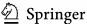

- Morgan MM, Braasch J (2022) Open set classification strategies for long-term environmental field recordings for bird species recognition. J Acoust Soc Am 151(6):4028-4038
- Metcalf OC, Barlow J, Devenish C, Marsden S, Berenguer E, Lees AC (2021) Acoustic indices perform better
- when applied at ecologically meaningful time and frequency scales. Methods Ecol Evol 12(3):421-431
- Mitchell SL, Bicknell JE, Edwards DP, Deere NJ, Bernard H, Davies ZG, Struebig MJ (2020) Spatial replication and habitat context matters for assessments of tropical biodiversity using acoustic indices. Ecol Ind 119:106717
- Morfi V, Bas Y, Pamuła H, Glotin H, Stowell D (2019) Nips4bplus: a richly annotated birdsong audio dataset. PeerJ Comput Sci 5:223
- Marin-Cudraz T, Muffat-Joly B, Novoa C, Aubry P, Desmet J-F, Mahamoud-Issa M, Nicolè F, Van Niekerk MH, Mathevon N, Sèbe F (2019) Acoustic monitoring of rock ptarmigan: a multi-year comparison with point-count protocol. Ecol Ind 101:710-719
- Magumba MA, Denton T, Bashir M (2024) A bird vocalisation dataset of birds in uganda for automated bioacoustic monitoring and analysis. Data Brief 54:110433
- Mennill D (2024) Field tests of small autonomous recording units: an evaluation of in-person versus automated point counts and a comparison of recording quality. Bioacoustics 33(2):157-177
- Mühling M, Franz J, Korfhage N, Freisleben B (2020) Bird species recognition via neural architecture search. In: Proceedings of the CLEF (working notes), pp 1-13
- Mohanty R, Mallik BK, Solanki SS (2020) Automatic bird species recognition system using neural network based on spike. Appl Acoust 161:107177
- Manikandan V, Neethirajan S (2025) Decoding poultry welfare from sound: a machine learning framework for non-invasive acoustic monitoring. Sensors 25(9):2912
- Mohaimenuzzaman M (2022) Deep learning for bioacoustic recognition in microcontrollers. PhD thesis, Monash University
- Merino Recalde N (2023) Pykanto: a python library to accelerate research on wild bird song. Methods Ecol Evol 14(8):1994-2002
- Michaud F, Sueur J, Le Cesne M, Haupert S (2023) Unsupervised classification to improve the quality of a bird song recording dataset. Eco Inform 74:101952
- Maclean K, Triguero I (2023) Identifying bird species by their calls in soundscapes. Appl Intell, pp 1-15
- Morales G, Vargas V, Espejo D, Poblete V, Tomasevic JA, Otondo F, Navedo JG (2022) Method for passive acoustic monitoring of bird communities using umap and a deep neural network. Eco Inform 72:101909
- Napier T, Ahn E, Allen-Ankins S, Schwarzkopf L, Lee I (2024) Advancements in preprocessing, detection and classification techniques for ecoacoustic data: A comprehensive review for large-scale passive acoustic monitoring. Expert Syst Appl 252:124220
- Napier T, Ahn E, Allen-Ankins S, Lee I (2023) An optimised grid search based framework for robust largescale natural soundscape classification. In: Proceedings of the Australasian joint conference on artificial intelligence, pp 468-479. Springer
- Nieto-Mora DA, Oliveira MC, Sanchez-Giraldo C, Duque-Muñoz L, Isaza-Narváez C, Martínez-Vargas JD (2024) Soundscape characterization using autoencoders and unsupervised learning. Sensors 24(8):2597
- Noumida A, Mukund R, Nair NM, Rajan R (2023) Stacked res2net-cbam with grouped channel attention for multi-label bird species classification. In: Proceedings of the 2023 31st European signal processing conference (EUSIPCO), pp 446-450. IEEE
- Nieto-Mora D, Rodríguez-Buritica S, Rodríguez-Marín P, Martínez-Vargaz J, Isaza-Narváez C (2023) Systematic review of machine learning methods applied to ecoacoustics and soundscape monitoring. Heliyon
- Ntalampiras S, Potamitis I (2021) Acoustic detection of unknown bird species and individuals. CAAI Trans Intell Technol 6(3):291-300
- Nolasco I, Singh S, Morfi V, Lostanlen V, Strandburg-Peshkin A, Vidaña-Vila E, Gill L, Pamuła H, Whitehead H, Kiskin I et al (2023) Learning to detect an animal sound from five examples. Eco Inform 77:102258
- Nolan V, Scott C, Yeiser JM, Wilhite N, Howell PE, Ingram D, Martin JA (2023) The development of a convolutional neural network for the automatic detection of northern bobwhite colinus virginianus covey calls. Remote Sens Ecol Conserv 9(1):46-61
- Pramunendar RA, Andono PN, Shidik GF, Megantara RA, Pergiwati D, Prabowo DP, Sari Y et al (2023) Integrating grey wolf optimizer for feature selection in birdsong classification using k-nearest neighbours algorithm. Int J Intell Eng Syst 16(6)
- Pieretti N, Farina A, Morri D (2011) A new methodology to infer the singing activity of an avian community: the acoustic complexity index (aci). Ecol Ind 11(3):868-873
- Pérez-Granados C, Feldman MJ, Mazerolle MJ (2023) Combining two user-friendly machine learning tools increases species detection from acoustic recordings. Can J Zool (ja)
- Pan W, Goodale E, Jiang A, Mammides C (2024) The effect of latitude on the efficacy of acoustic indices to predict biodiversity: a meta-analysis. Ecol Ind 159:111747

- Pahuja R, Kumar A (2021) Sound-spectrogram based automatic bird species recognition using mlp classifier. Appl Acoust 180:108077
- Podolskiy EA, Ogawa M, Thiebot J-B, Johansen KL, Mosbech A (2024) Acoustic monitoring reveals a diel rhythm of an arctic seabird colony (little auk, alle alle). Commun Biol 7(1):307
- Perry GL, Seidl R, Bellvé AM, Rammer W (2022) An outlook for deep learning in ecosystem science. Ecosystems 25(8):1700-1718
- Poutaraud J, Sueur J, Thébaud C, Haupert S (2024) Meta-embedded clustering (mec): a new method for improving clustering quality in unlabeled bird sound datasets. Eco Inform 82:102687
- Parcerisas C, Schall E, Te Velde K, Botteldooren D, Devos P, Debusschere E (2024) Machine learning for efficient segregation and labeling of potential biological sounds in long-term underwater recordings. Front Remote Sens 5:1390687
- Pijanowski BC, Villanueva-Rivera LJ, Dumyahn SL, Farina A, Krause BL, Napoletano BM, Gage SH, Pieretti N (2011) Soundscape ecology: the science of sound in the landscape. Bioscience 61(3):203-216
- Provost KL, Yang J, Carstens BC (2022) The impacts of fine-tuning, phylogenetic distance, and sample size on big-data bioacoustics. PLoS ONE 17(12):0278522
- Quinn CA, Burns P, Gill G, Baligar S, Snyder RL, Salas L, Goetz SJ, Clark ML (2022) Soundscape classification with convolutional neural networks reveals temporal and geographic patterns in ecoacoustic data. Ecol Ind 138:108831
- Quinn CA, Burns P, Hakkenberg CR, Salas L, Pasch B, Goetz SJ, Clark ML (2023) Soundscape components inform acoustic index patterns and refine estimates of bird species richness. Front Remote Sens 4:1156837
- Rajan SC, Athira K, Jaishanker R, Sooraj N, Sarojkumar V (2019) Rapid assessment of biodiversity using acoustic indices. Biodivers Conserv 28:2371-2383
- Recalde NM, Estandía A, Pichot L, Vansse A, Cole EF, Sheldon BC (2024) A densely sampled and richly annotated acoustic data set from a wild bird population. Anim Behav 211:111-122
- Rowe B, Eichinski P, Zhang J, Roe P (2021) Acoustic auto-encoders for biodiversity assessment. Eco Inform 62:101237
- Ross SR-J, Friedman NR, Yoshimura M, Yoshida T, Donohue I, Economo EP (2021) Utility of acoustic indices for ecological monitoring in complex sonic environments. Ecol Ind 121:107114
- Retamosa Izaguirre M, Barrantes-Madrigal J, Segura Sequeira D, Spínola-Parallada M, Ramírez-Alán O (2021) It is not just about birds: what do acoustic indices reveal about a costa rican tropical rainforest? Neotropical Biodiversity 7(1):431-442
- Riad R, Karadayi J, Bachoud-Lévi A-C, Dupoux E (2021) Learning spectro-temporal representations of complex sounds with parameterized neural networks. J Acoust Soc Am 150(1):353-366
- Sueur J, Aubin T, Simonis C (2008) Seewave, a free modular tool for sound analysis and synthesis. Bioacoustics 18(2):213
- Sethi SS, Bick A, Ewers RM, Klinck H, Ramesh V, Tuanmu M-N, Coomes DA (2023) Limits to the accurate and generalizable use of soundscapes to monitor biodiversity. Nature Ecol Evol 7(9):1373-1378
- Salamon J, Bello JP, Farnsworth A, Robbins M, Keen S, Klinck H, Kelling S (2016) Towards the automatic classification of avian flight calls for bioacoustic monitoring. PLoS ONE 11(11):0166866
- Schafer RM (1969) The new soundscape. BMI Canada Limited Don Mills
- Sanchez FJB, English NB, Hossain MR, Moore ST (2024) Improved analysis of deep bioacoustic embeddings through dimensionality reduction and interactive visualisation. Eco Inform 81:102593
- Servick K (2014) Eavesdropping on ecosystems. American Association for the Advancement of Science
- Story B, Gillespie P, Derryberry G, Derryberry E, Fefferman N, Maroulas V (2024) Dialectdecoder: human/ machine teaming for bird song classification and anomaly detection. Eco Inform 82:102657
- Schneider S, Hammerschmidt K, Dierkes PW (2022) Introducing the software case (cluster and analyze sound events) by comparing different clustering methods and audio transformation techniques using animal vocalizations. Animals 12(16):2020
- Singer D, Hagge J, Kamp J, Hondong H, Schuldt A (2024) Aggregated time-series features boost speciesspecific differentiation of true and false positives in passive acoustic monitoring of bird assemblages. Remote Sensing in Ecology and Conservation
- Sethi SS, Jones NS, Fulcher BD, Picinali L, Clink DJ, Klinck H, Orme CDL, Wrege PH, Ewers RM (2020) Characterizing soundscapes across diverse ecosystems using a universal acoustic feature set. Proc Natl Acad Sci 117(29):17049-17055
- Swaminathan B, Jagadeesh M, Vairavasundaram S (2024) Multi-label classification for acoustic bird species detection using transfer learning approach. Eco Inform 80:102471
- Scarpelli MD, Liquet B, Tucker D, Fuller S, Roe P (2021) Multi-index ecoacoustics analysis for terrestrial soundscapes: a new semi-automated approach using time-series motif discovery and random forest classification. Front Ecol Evol 9:738537

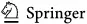

- Sharan RV, Moir TJ (2019) Acoustic event recognition using cochleagram image and convolutional neural networks. Appl Acoust 148:62-66
- Searfoss AM, Pino JC, Creanza N (2020) Chipper: open-source software for semi-automated segmentation and analysis of birdsong and other natural sounds. Methods Ecol Evol 11(4):524-531

Shamon H, Paraskevopoulou Z, Kitzes J, Card E, Deichmann JL, Boyce AJ, McShea WJ (2021) Using

ecoacoustics metrices to track grassland bird richness across landscape gradients. Ecol Ind 120:106928

- Stowell D, Petrusková T, Šálek M, Linhart P (2019) Automatic acoustic identification of individuals in multiple species: improving identification across recording conditions. J R Soc Interface 16(153):20180940
- Schiavo G, Portaccio A, Testolin A (2025) Fine-tuning birdnet for the automatic ecoacoustic monitoring of bird species in the italian alpine forests. Information 16(8):628
- Scarpelli MD, Ribeiro MC, Teixeira CP (2021) What does atlantic forest soundscapes can tell us about landscape? Ecol Ind 121:107050
- Smeele SQ, Tyndel SA, Aplin LM, McElreath MB (2024) Multilevel bayesian analysis of monk parakeet contact calls shows dialects between european cities. Behav Ecol 35(1):093
- Stowell D (2022) Computational bioacoustics with deep learning: a review and roadmap. PeerJ 10:13152
- Stowell D, Wood MD, Pamuła H, Stylianou Y, Glotin H (2019) Automatic acoustic detection of birds through deep learning: the first bird audio detection challenge. Methods Ecol Evol 10(3):368-380
- Santos EG, Wiederhecker HC, Pompermaier VT, Schirmer SC, Gainsbury AM, Marini MÂ (2024) Are acoustic indices useful for monitoring urban biodiversity? Urban Ecosyst, pp 1-7
- Tuncer T, Akbal E, Dogan S (2021) Multileveled ternary pattern and iterative relieff based bird sound classification. Appl Acoust 176:107866
- Tuia D, Kellenberger B, Beery S, Costelloe BR, Zuffi S, Risse B, Mathis A, Mathis MW, Langevelde F, Burghardt T et al (2022) Perspectives in machine learning for wildlife conservation. Nat Commun 13(1):792
- Tang T, Long Y, Li Y, Liang J (2022) Acoustic domain mismatch compensation in bird audio detection. Int J Speech Technol 25(1):251-260
- Thakur A, Rajan P (2019) Directional embedding based semi-supervised framework for bird vocalization segmentation. Appl Acoust 151:73-86. https://doi.org/10.1016/j.apacoust.2019.02.023
- Thakur A, Thapar D, Rajan P, Nigam A (2019) Deep metric learning for bioacoustic classification: overcoming training data scarcity using dynamic triplet loss. J Acoust Soc Am 146(1):534-547
- Towsey M, Znidersic E, Broken-Brow J, Indraswari K, Watson DM, Phillips Y, Truskinger A, Roe P (2018) Long-duration, false-colour spectrograms for detecting species in large audio data-sets. J Ecoacoust 2:1-13
- Towsey M, Zhang L, Cottman-Fields M, Wimmer J, Zhang J, Roe P (2014) Visualization of long-duration acoustic recordings of the environment. Procedia Comput Sci 29:703-712
- Ugarte JP, Arias-Arias J (2024) Unveiling relevant acoustic features for bird species automatic classification. Expert Syst Appl 257:125046
- Universitat Pompeu Fabra (2024) Freesound. https://freesound.org/
- Villanueva-Rivera LJ, Pijanowski BC, Doucette J, Pekin B (2011) A primer of acoustic analysis for landscape ecologists. Landscape Ecol 26:1233-1246
- Wu S-H, Chang H-W, Lin R-S, Tuanmu M-N (2022) Silic: a cross database framework for automatically extracting robust biodiversity information from soundscape recordings based on object detection and a tiny training dataset. Eco Inform 68:101534
- Wei Y-C, Chen W-L, Tuanmu M-N, Lu S-S, Shiao M-T (2024) Advanced montane bird monitoring using self-supervised learning and transformer on passive acoustic data. Eco Inform 84:102927
- Weldy MJ, Denton T, Fleishman AB, Tolchin J, McKown M, Spaan RS, Ruff ZJ, Jenkins JM, Betts MG, Lesmeister DB (2024) Audio tagging of avian dawn chorus recordings in California, oregon and Washington. Biodiversity Data J 12:e118315
- Winiarska D, Jankowiak Ł, Tryjanowski P, Osiejuk TS (2024) Common cuckoo vocalisations as an indicator for the avian diversity: a study with passive acoustic monitoring. Ecol Ind 166:112400
- Wu S-H, Ko JC-J, Lin R-S, Tsai W-L, Chang H-W (2023) An acoustic detection dataset of birds (aves) in montane forests using a deep learning approach. Biodiversity Data J 11:e97811
- Wolfe B, Proctor MD, Nolan V, Webb SL (2023) An efficient acoustic classifier for high-priority avian species in the southern great plains using convolutional neural networks. Wildl Soc Bull 47(4):1492
- Wang Q, Song Y, Du Y, Yang Z, Cui P, Luo B (2024) Hierarchical-taxonomy-aware and attentional convolutional neural networks for acoustic identification of bird species: a phylogenetic perspective. Eco Inform 80:102538
- Wang H, Xu Y, Yu Y, Lin Y, Ran J (2022) An efficient model for a vast number of bird species identification based on acoustic features. Animals 12(18):2434
- Wang Y, Zhang L, Xie J, Zhang J, Zhu R (2025) Dfefm: fusing frequency correlation and mel features for robust edge bird audio detection. Avian Res 16(2):100232

- Wu W, Zhang R, Zheng X, Fang M, Ma T, Hu Q, Kong X, Zhao C (2024) Orchard bird song recognition based on multi-view multi-level contrastive learning. Appl Acoust 224:110133
- Xu Z-Y, Chen L, Pijanowski BC, Zhao Z (2023) A frequency-dependent acoustic diversity index: a revision to a classic acoustic index for soundscape ecological research. Ecol Ind 155:110940
- Xeno-canto Foundation (2024) Xeno-canto. https://xeno-canto.org/
- Xie J, Hu K, Guo Y, Zhu Q, Yu J (2021) On loss functions and cnns for improved bioacoustic signal classification. Eco Inform 64:101331
- Xie J, Hao Z, Hu C, Zhang C, Zhang J (2025) Beyond amplitude: phase integration in bird vocalization recognition with mharesnet. Avian Res 16(1):100229
- Xie S, Lu J, Liu J, Zhang Y, Lv D, Chen X, Zhao Y (2022) Multi-view features fusion for birdsong classification. Eco Inform 72:101893
- Xie J, Shi Y, Ni D, Milling M, Liu S, Zhang J, Qian K, Schuller BW (2024) Automatic bird sound source separation based on passive acoustic devices in wild environment. IEEE Internet Things J 11(9):16604-16617
- Xie S, Xie J, Zhang J, Zhang Y, Wang L, Hu H (2024) Mdf-net: a multi-view dual-attention fusion network for efficient bird sound classification. Appl Acoust 225:110138
- Xie J, Yang J, Ding C, Li W (2020) High accuracy individual identification model of crested ibis (nipponia nippon) based on autoencoder with self-attention. IEEE Access 8:41062-41070
- Xie J, Yang J, Xing Z, Zhang Z, Chen X (2020) Bird species recognition method based on multi-feature fusion. J Appl Acoust 39(2):199-206
- Xie J, Zhu M (2019) Handcrafted features and late fusion with deep learning for bird sound classification. Eco Inform 52:74-81
- Xie J, Zhao S, Li X, Ni D, Zhang J (2022) Kd-cldnn: lightweight automatic recognition model based on bird vocalization. Appl Acoust 188:108550
- Xu H, Zhang Y, Liu J, Lv D (2021) Feature selection using maximum feature tree embedded with mutual information and coefficient of variation for bird sound classification. Math Probl Eng 2021(1):8872248
- Xie J, Zhang L, Zhang J, Zhang Y, Schuller BW (2023) Cross-corpus open set bird species recognition by vocalization. Ecol Ind 154:110826
- Xie J, Zhong Y, Zhang J, Liu S, Ding C, Triantafyllopoulos A (2023) A review of automatic recognition technology for bird vocalizations in the deep learning era. Eco Inform 73:101927
- Yan N, Chen A, Zhou G, Zhang Z, Liu X, Wang J, Liu Z, Chen W (2021) Birdsong classification based on multi-feature fusion. Multimedia Tools Appl 80(30):36529-36547
- Yuncheng X (2021) Research and application of bird sound recognition based on deep learning. Master's thesis, North China Electric Power University
- Yang Y, Zhou K, Trigoni N, Markham A (2024) Ssl-net: a synergistic spectral and learning-based network for efficient bird sound classification. In: Proceedings of the ICASSP 2024-2024 IEEE international conference on acoustics, speech and signal processing (ICASSP), pp 926-930. IEEE
- Zhang X, Chen A, Zhou G, Zhang Z, Huang X, Qiang X (2019) Spectrogram-frame linear network and continuous frame sequence for bird sound classification. Eco Inform 54:101009
- Zhang S, Gao Y, Cai J, Yang H, Zhao Q, Pan F (2023) A novel bird sound recognition method based on multifeature fusion and a transformer encoder. Sensors 23(19):8099
- Zhang C, He K, Gao X, Guo Y (2024) Automatic bioacoustics noise reduction method based on a deep feature loss network. Eco Inform 80:102517
- Zhang C, Jin N, Xie J, Hao Z (2024) Cicadanet: deep learning based automatic cicada chorus filtering for improved long-term bird monitoring. Ecol Ind 158:111423
- Zhang C, Li Q, Zhan H, Li Y, Gao X (2023) One-step progressive representation transfer learning for bird sound classification. Appl Acoust 212:109614
- Zsebők S, Nagy-Egri MF, Barnaföldi GG, Laczi M, Nagy G, Vaskuti É, Garamszegi LZ (2019) Automatic bird song and syllable segmentation with an open-source deep-learning object detection method-a case study in the collared flycatcher. Ornis Hungarica 27(2):59-66
- Zhong M, Taylor R, Bates N, Christey D, Basnet H, Flippin J, Palkovitz S, Dodhia R, Ferres JL (2021) Acoustic detection of regionally rare bird species through deep convolutional neural networks. Eco Inform 64:101333
- Zeghidour N, Teboul O, de Chaumont Quitry F, Tagliasacchi M (2021) Leaf: a learnable frontend for audio classification. In: Proceedings of the 9th international conference on learning representations (ICLR). https://openreview.net/forum?id=jM76BCb6F9m
- Zhao Z, Xu Z-Y, Bellisario K, Zeng R-W, Li N, Zhou W-Y, Pijanowski BC (2019) How well do acoustic indices measure biodiversity? computational experiments to determine effect of sound unit shape, vocalization intensity, and frequency of vocalization occurrence on performance of acoustic indices. Ecol Ind 107:105588
- Zhao S, Xie J, Ding C-Q (2023) Automatic individual recognition of wild crested ibis based on hybrid method of self-supervised learning and clustering. Eco Inform 75:102089

- Zhao Z, Yang L, Ju R-R, Chen L, Xu Z-Y (2023) Acoustic bird species classification under low snr and smallscale dataset conditions. Appl Acoust 214:109670
- Zhang F, Zhang L, Chen H, Xie J (2021) Bird species identification using spectrogram based on multichannel fusion of dcnns. Entropy 23(11):1507
- Zhang C, Zhan H, Hao Z, Gao X (2023) Classification of complicated urban forest acoustic scenes with deep learning models. Forests 14(2):206
- Zhang C, Zhang Y, Zheng X, Gao X, Hao Z (2024) Influence of recording devices and environmental noise on acoustic index scores: implications for bird sound-based assessments. Ecol Ind 159:111759

Publisher's Note Springer Nature remains neutral with regard to jurisdictional claims in published maps and institutional affiliations.

## Authors and Affiliations

Jiangjian Xie 1 · Shanshan Xie 1 · Yang Liu 2 · Xin Jing 3 · Mengkun Zhu 1 · Linlin Xie 1 · Junguo Zhang 1 · Kun Qian 4 · Björn W. Schuller 3,5

- Junguo Zhang zhangjunguo@bjfu.edu.cn
- Kun Qian

qian@bit.edu.cn

Jiangjian Xie

shyneforce@bjfu.edu.cn

Shanshan Xie xieshanshan@bjfu.edu.cn

Yang Liu

liuy353@mail.sysu.edu.cn

Xin Jing go73pan@mytum.de

Mengkun Zhu AWUche45@bjfu.edu.cn

Linlin Xie xielinlin123@bjfu.edu.cn

Björn W. Schuller schuller@ieee.org

- 1 The School of Technology, The State Key Laboratory of Efficient Production of Forest Resources, The Multimodal Eco Data Intelligence Analysis Lab (MEDIAL), Beijing Forestry University, Beijing 100083, China
- 2 The State Key Laboratory of Biocontrol, School of Ecology, Sun Yat-sen University, Shenzhen 518000, Guangdong, China
- 3 CHI-Chair of Health Informatics, MRI, Technical University of Munich, Munich, Germany
- 4 The Key Laboratory of Brain Health Intelligent Evaluation and Intervention, Ministry of Education, The School of Medical Technology, Beijing Institute of Technology, Beijing 100081, China
- 5 GLAM-Group on Language, Audio, &amp; Music, Imperial College London, London, UK

