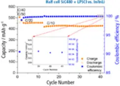
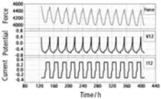
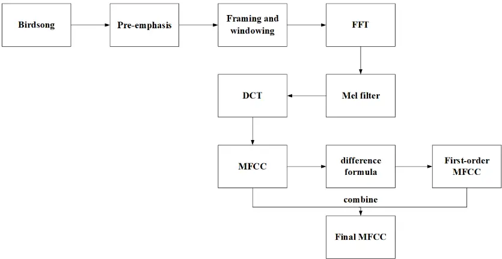
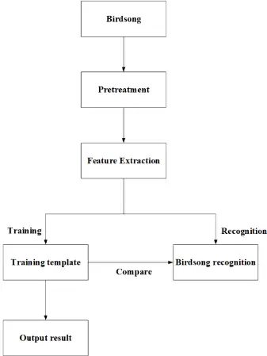
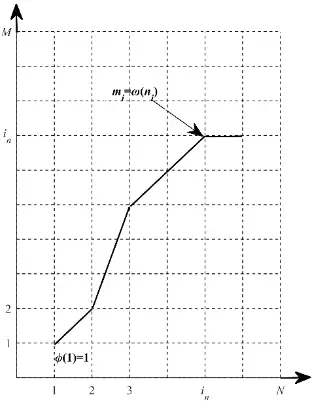
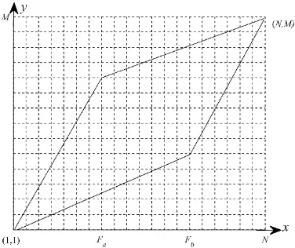
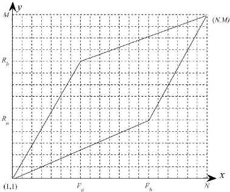

## PAPER · OPEN ACCESS

## Birdsong Recognition Based on Improved DTW

To cite this article: Hui Jiang et al 2021 J. Phys.: Conf. Ser. 1739 012038

View the article online for updates and enhancements.

## [The New PAT-Cell-Solid!](https://pagead2.googlesyndication.com/pcs/click?xai=AKAOjst9roxpPWBnyMJhva6Fa6E_FT6eHzsaPy9CIi2hl1y90e-NL6TpwuA14faMTfioz_2dw1OLebsuEi5-PqvqkjSZDLTogdKjCjR2t8SUOU49-Y5y0-vwwLHqnsAyFSqBuVds_T2q5S3Cx8ipHHpZMRVc_69NCFLaGxroCvsr72NRixPIcFJj_g6VTK6-oSJMrKjlf8Gf5jsOMgQgl6ujSuWIA7b7ZpKl4-iROvDboe6EJCZwtqKGAITWxS3Q-Oy5RWoU5HAhZbmYdNTmaxlIYN96KbmPbue0Mr2nWbmwAu0AI-nBF7lj8APtiJN3oce_5IX1pcREPZkUTTC7rytTHuFbE4VYKEwld32vyOiSF8rMfREV2xkwit5YXFhz1zFq-zBhJ7A&sig=Cg0ArKJSzCZVeolKRMAc&fbs_aeid=%5Bgw_fbsaeid%5D&adurl=https://www.el-cell.com/products/test-cells/force-test-cells/pat-cell-solid/%3Fmtm_campaign%3DIOP-banner%26mtm_kwd%3DPAT-Cell-Solid%26mtm_source%3Dbanner%26mtm_cid%3D2026)

## You may also like

- Dynamic time warping-based transfer learning for improving common spatial patterns in brain-computer interface Ahmed M Azab, Hamed Ahmadi, Lyudmila Mihaylova et al. -
- Iterative alignment discovery of speechassociated neural activity Qinwan Rabbani, Samyak Shah, Griffin Milsap et al. -
- Quantitative Exploration of the Similarity of Gamma-Ray Pulsar Light Curves C. R. García and Diego F. Torres -

[Cycle Solid-State Batteries Under Controlled Pressure of up to 300 MPa (6 mm Diameter)!](https://pagead2.googlesyndication.com/pcs/click?xai=AKAOjst9roxpPWBnyMJhva6Fa6E_FT6eHzsaPy9CIi2hl1y90e-NL6TpwuA14faMTfioz_2dw1OLebsuEi5-PqvqkjSZDLTogdKjCjR2t8SUOU49-Y5y0-vwwLHqnsAyFSqBuVds_T2q5S3Cx8ipHHpZMRVc_69NCFLaGxroCvsr72NRixPIcFJj_g6VTK6-oSJMrKjlf8Gf5jsOMgQgl6ujSuWIA7b7ZpKl4-iROvDboe6EJCZwtqKGAITWxS3Q-Oy5RWoU5HAhZbmYdNTmaxlIYN96KbmPbue0Mr2nWbmwAu0AI-nBF7lj8APtiJN3oce_5IX1pcREPZkUTTC7rytTHuFbE4VYKEwld32vyOiSF8rMfREV2xkwit5YXFhz1zFq-zBhJ7A&sig=Cg0ArKJSzCZVeolKRMAc&fbs_aeid=%5Bgw_fbsaeid%5D&adurl=https://www.el-cell.com/products/test-cells/force-test-cells/pat-cell-solid/%3Fmtm_campaign%3DIOP-banner%26mtm_kwd%3DPAT-Cell-Solid%26mtm_source%3Dbanner%26mtm_cid%3D2026)

- [Adjust and measure a force of up to 9000 N on the cell stack! Force adjustment possible throughout the entire experiment](https://pagead2.googlesyndication.com/pcs/click?xai=AKAOjst9roxpPWBnyMJhva6Fa6E_FT6eHzsaPy9CIi2hl1y90e-NL6TpwuA14faMTfioz_2dw1OLebsuEi5-PqvqkjSZDLTogdKjCjR2t8SUOU49-Y5y0-vwwLHqnsAyFSqBuVds_T2q5S3Cx8ipHHpZMRVc_69NCFLaGxroCvsr72NRixPIcFJj_g6VTK6-oSJMrKjlf8Gf5jsOMgQgl6ujSuWIA7b7ZpKl4-iROvDboe6EJCZwtqKGAITWxS3Q-Oy5RWoU5HAhZbmYdNTmaxlIYN96KbmPbue0Mr2nWbmwAu0AI-nBF7lj8APtiJN3oce_5IX1pcREPZkUTTC7rytTHuFbE4VYKEwld32vyOiSF8rMfREV2xkwit5YXFhz1zFq-zBhJ7A&sig=Cg0ArKJSzCZVeolKRMAc&fbs_aeid=%5Bgw_fbsaeid%5D&adurl=https://www.el-cell.com/products/test-cells/force-test-cells/pat-cell-solid/%3Fmtm_campaign%3DIOP-banner%26mtm_kwd%3DPAT-Cell-Solid%26mtm_source%3Dbanner%26mtm_cid%3D2026)
- [Built-in force, and temperature sensors! With optional gas pressure sensor and gas in- and outlet](https://pagead2.googlesyndication.com/pcs/click?xai=AKAOjst9roxpPWBnyMJhva6Fa6E_FT6eHzsaPy9CIi2hl1y90e-NL6TpwuA14faMTfioz_2dw1OLebsuEi5-PqvqkjSZDLTogdKjCjR2t8SUOU49-Y5y0-vwwLHqnsAyFSqBuVds_T2q5S3Cx8ipHHpZMRVc_69NCFLaGxroCvsr72NRixPIcFJj_g6VTK6-oSJMrKjlf8Gf5jsOMgQgl6ujSuWIA7b7ZpKl4-iROvDboe6EJCZwtqKGAITWxS3Q-Oy5RWoU5HAhZbmYdNTmaxlIYN96KbmPbue0Mr2nWbmwAu0AI-nBF7lj8APtiJN3oce_5IX1pcREPZkUTTC7rytTHuFbE4VYKEwld32vyOiSF8rMfREV2xkwit5YXFhz1zFq-zBhJ7A&sig=Cg0ArKJSzCZVeolKRMAc&fbs_aeid=%5Bgw_fbsaeid%5D&adurl=https://www.el-cell.com/products/test-cells/force-test-cells/pat-cell-solid/%3Fmtm_campaign%3DIOP-banner%26mtm_kwd%3DPAT-Cell-Solid%26mtm_source%3Dbanner%26mtm_cid%3D2026)
- [PAT-Solid-Core for easy assembly and reproducible results! Press and cycle solid-state batteries with 6 or 10 mm electrode diameter](https://pagead2.googlesyndication.com/pcs/click?xai=AKAOjst9roxpPWBnyMJhva6Fa6E_FT6eHzsaPy9CIi2hl1y90e-NL6TpwuA14faMTfioz_2dw1OLebsuEi5-PqvqkjSZDLTogdKjCjR2t8SUOU49-Y5y0-vwwLHqnsAyFSqBuVds_T2q5S3Cx8ipHHpZMRVc_69NCFLaGxroCvsr72NRixPIcFJj_g6VTK6-oSJMrKjlf8Gf5jsOMgQgl6ujSuWIA7b7ZpKl4-iROvDboe6EJCZwtqKGAITWxS3Q-Oy5RWoU5HAhZbmYdNTmaxlIYN96KbmPbue0Mr2nWbmwAu0AI-nBF7lj8APtiJN3oce_5IX1pcREPZkUTTC7rytTHuFbE4VYKEwld32vyOiSF8rMfREV2xkwit5YXFhz1zFq-zBhJ7A&sig=Cg0ArKJSzCZVeolKRMAc&fbs_aeid=%5Bgw_fbsaeid%5D&adurl=https://www.el-cell.com/products/test-cells/force-test-cells/pat-cell-solid/%3Fmtm_campaign%3DIOP-banner%26mtm_kwd%3DPAT-Cell-Solid%26mtm_source%3Dbanner%26mtm_cid%3D2026)
- [Cableless and highly sealed battery test cell! For precise long-term measurements of solid-state cell chemistries](https://pagead2.googlesyndication.com/pcs/click?xai=AKAOjst9roxpPWBnyMJhva6Fa6E_FT6eHzsaPy9CIi2hl1y90e-NL6TpwuA14faMTfioz_2dw1OLebsuEi5-PqvqkjSZDLTogdKjCjR2t8SUOU49-Y5y0-vwwLHqnsAyFSqBuVds_T2q5S3Cx8ipHHpZMRVc_69NCFLaGxroCvsr72NRixPIcFJj_g6VTK6-oSJMrKjlf8Gf5jsOMgQgl6ujSuWIA7b7ZpKl4-iROvDboe6EJCZwtqKGAITWxS3Q-Oy5RWoU5HAhZbmYdNTmaxlIYN96KbmPbue0Mr2nWbmwAu0AI-nBF7lj8APtiJN3oce_5IX1pcREPZkUTTC7rytTHuFbE4VYKEwld32vyOiSF8rMfREV2xkwit5YXFhz1zFq-zBhJ7A&sig=Cg0ArKJSzCZVeolKRMAc&fbs_aeid=%5Bgw_fbsaeid%5D&adurl=https://www.el-cell.com/products/test-cells/force-test-cells/pat-cell-solid/%3Fmtm_campaign%3DIOP-banner%26mtm_kwd%3DPAT-Cell-Solid%26mtm_source%3Dbanner%26mtm_cid%3D2026)

[Learn more on our product website:](https://pagead2.googlesyndication.com/pcs/click?xai=AKAOjst9roxpPWBnyMJhva6Fa6E_FT6eHzsaPy9CIi2hl1y90e-NL6TpwuA14faMTfioz_2dw1OLebsuEi5-PqvqkjSZDLTogdKjCjR2t8SUOU49-Y5y0-vwwLHqnsAyFSqBuVds_T2q5S3Cx8ipHHpZMRVc_69NCFLaGxroCvsr72NRixPIcFJj_g6VTK6-oSJMrKjlf8Gf5jsOMgQgl6ujSuWIA7b7ZpKl4-iROvDboe6EJCZwtqKGAITWxS3Q-Oy5RWoU5HAhZbmYdNTmaxlIYN96KbmPbue0Mr2nWbmwAu0AI-nBF7lj8APtiJN3oce_5IX1pcREPZkUTTC7rytTHuFbE4VYKEwld32vyOiSF8rMfREV2xkwit5YXFhz1zFq-zBhJ7A&sig=Cg0ArKJSzCZVeolKRMAc&fbs_aeid=%5Bgw_fbsaeid%5D&adurl=https://www.el-cell.com/products/test-cells/force-test-cells/pat-cell-solid/%3Fmtm_campaign%3DIOP-banner%26mtm_kwd%3DPAT-Cell-Solid%26mtm_source%3Dbanner%26mtm_cid%3D2026)

[Download the data sheet (PDF):](https://pagead2.googlesyndication.com/pcs/click?xai=AKAOjst9roxpPWBnyMJhva6Fa6E_FT6eHzsaPy9CIi2hl1y90e-NL6TpwuA14faMTfioz_2dw1OLebsuEi5-PqvqkjSZDLTogdKjCjR2t8SUOU49-Y5y0-vwwLHqnsAyFSqBuVds_T2q5S3Cx8ipHHpZMRVc_69NCFLaGxroCvsr72NRixPIcFJj_g6VTK6-oSJMrKjlf8Gf5jsOMgQgl6ujSuWIA7b7ZpKl4-iROvDboe6EJCZwtqKGAITWxS3Q-Oy5RWoU5HAhZbmYdNTmaxlIYN96KbmPbue0Mr2nWbmwAu0AI-nBF7lj8APtiJN3oce_5IX1pcREPZkUTTC7rytTHuFbE4VYKEwld32vyOiSF8rMfREV2xkwit5YXFhz1zFq-zBhJ7A&sig=Cg0ArKJSzCZVeolKRMAc&fbs_aeid=%5Bgw_fbsaeid%5D&adurl=https://www.el-cell.com/products/test-cells/force-test-cells/pat-cell-solid/%3Fmtm_campaign%3DIOP-banner%26mtm_kwd%3DPAT-Cell-Solid%26mtm_source%3Dbanner%26mtm_cid%3D2026)

[Half cell SiC480 + LPSCI vs. In/lnLi](https://pagead2.googlesyndication.com/pcs/click?xai=AKAOjst9roxpPWBnyMJhva6Fa6E_FT6eHzsaPy9CIi2hl1y90e-NL6TpwuA14faMTfioz_2dw1OLebsuEi5-PqvqkjSZDLTogdKjCjR2t8SUOU49-Y5y0-vwwLHqnsAyFSqBuVds_T2q5S3Cx8ipHHpZMRVc_69NCFLaGxroCvsr72NRixPIcFJj_g6VTK6-oSJMrKjlf8Gf5jsOMgQgl6ujSuWIA7b7ZpKl4-iROvDboe6EJCZwtqKGAITWxS3Q-Oy5RWoU5HAhZbmYdNTmaxlIYN96KbmPbue0Mr2nWbmwAu0AI-nBF7lj8APtiJN3oce_5IX1pcREPZkUTTC7rytTHuFbE4VYKEwld32vyOiSF8rMfREV2xkwit5YXFhz1zFq-zBhJ7A&sig=Cg0ArKJSzCZVeolKRMAc&fbs_aeid=%5Bgw_fbsaeid%5D&adurl=https://www.el-cell.com/products/test-cells/force-test-cells/pat-cell-solid/%3Fmtm_campaign%3DIOP-banner%26mtm_kwd%3DPAT-Cell-Solid%26mtm_source%3Dbanner%26mtm_cid%3D2026)

[Or contact us directly:](https://pagead2.googlesyndication.com/pcs/click?xai=AKAOjst9roxpPWBnyMJhva6Fa6E_FT6eHzsaPy9CIi2hl1y90e-NL6TpwuA14faMTfioz_2dw1OLebsuEi5-PqvqkjSZDLTogdKjCjR2t8SUOU49-Y5y0-vwwLHqnsAyFSqBuVds_T2q5S3Cx8ipHHpZMRVc_69NCFLaGxroCvsr72NRixPIcFJj_g6VTK6-oSJMrKjlf8Gf5jsOMgQgl6ujSuWIA7b7ZpKl4-iROvDboe6EJCZwtqKGAITWxS3Q-Oy5RWoU5HAhZbmYdNTmaxlIYN96KbmPbue0Mr2nWbmwAu0AI-nBF7lj8APtiJN3oce_5IX1pcREPZkUTTC7rytTHuFbE4VYKEwld32vyOiSF8rMfREV2xkwit5YXFhz1zFq-zBhJ7A&sig=Cg0ArKJSzCZVeolKRMAc&fbs_aeid=%5Bgw_fbsaeid%5D&adurl=https://www.el-cell.com/products/test-cells/force-test-cells/pat-cell-solid/%3Fmtm_campaign%3DIOP-banner%26mtm_kwd%3DPAT-Cell-Solid%26mtm_source%3Dbanner%26mtm_cid%3D2026)

- [+49 4079012-734](https://pagead2.googlesyndication.com/pcs/click?xai=AKAOjst9roxpPWBnyMJhva6Fa6E_FT6eHzsaPy9CIi2hl1y90e-NL6TpwuA14faMTfioz_2dw1OLebsuEi5-PqvqkjSZDLTogdKjCjR2t8SUOU49-Y5y0-vwwLHqnsAyFSqBuVds_T2q5S3Cx8ipHHpZMRVc_69NCFLaGxroCvsr72NRixPIcFJj_g6VTK6-oSJMrKjlf8Gf5jsOMgQgl6ujSuWIA7b7ZpKl4-iROvDboe6EJCZwtqKGAITWxS3Q-Oy5RWoU5HAhZbmYdNTmaxlIYN96KbmPbue0Mr2nWbmwAu0AI-nBF7lj8APtiJN3oce_5IX1pcREPZkUTTC7rytTHuFbE4VYKEwld32vyOiSF8rMfREV2xkwit5YXFhz1zFq-zBhJ7A&sig=Cg0ArKJSzCZVeolKRMAc&fbs_aeid=%5Bgw_fbsaeid%5D&adurl=https://www.el-cell.com/products/test-cells/force-test-cells/pat-cell-solid/%3Fmtm_campaign%3DIOP-banner%26mtm_kwd%3DPAT-Cell-Solid%26mtm_source%3Dbanner%26mtm_cid%3D2026)
- [sales@el-cell.com](https://pagead2.googlesyndication.com/pcs/click?xai=AKAOjst9roxpPWBnyMJhva6Fa6E_FT6eHzsaPy9CIi2hl1y90e-NL6TpwuA14faMTfioz_2dw1OLebsuEi5-PqvqkjSZDLTogdKjCjR2t8SUOU49-Y5y0-vwwLHqnsAyFSqBuVds_T2q5S3Cx8ipHHpZMRVc_69NCFLaGxroCvsr72NRixPIcFJj_g6VTK6-oSJMrKjlf8Gf5jsOMgQgl6ujSuWIA7b7ZpKl4-iROvDboe6EJCZwtqKGAITWxS3Q-Oy5RWoU5HAhZbmYdNTmaxlIYN96KbmPbue0Mr2nWbmwAu0AI-nBF7lj8APtiJN3oce_5IX1pcREPZkUTTC7rytTHuFbE4VYKEwld32vyOiSF8rMfREV2xkwit5YXFhz1zFq-zBhJ7A&sig=Cg0ArKJSzCZVeolKRMAc&fbs_aeid=%5Bgw_fbsaeid%5D&adurl=https://www.el-cell.com/products/test-cells/force-test-cells/pat-cell-solid/%3Fmtm_campaign%3DIOP-banner%26mtm_kwd%3DPAT-Cell-Solid%26mtm_source%3Dbanner%26mtm_cid%3D2026)
- [www.el-cell.com](https://pagead2.googlesyndication.com/pcs/click?xai=AKAOjst9roxpPWBnyMJhva6Fa6E_FT6eHzsaPy9CIi2hl1y90e-NL6TpwuA14faMTfioz_2dw1OLebsuEi5-PqvqkjSZDLTogdKjCjR2t8SUOU49-Y5y0-vwwLHqnsAyFSqBuVds_T2q5S3Cx8ipHHpZMRVc_69NCFLaGxroCvsr72NRixPIcFJj_g6VTK6-oSJMrKjlf8Gf5jsOMgQgl6ujSuWIA7b7ZpKl4-iROvDboe6EJCZwtqKGAITWxS3Q-Oy5RWoU5HAhZbmYdNTmaxlIYN96KbmPbue0Mr2nWbmwAu0AI-nBF7lj8APtiJN3oce_5IX1pcREPZkUTTC7rytTHuFbE4VYKEwld32vyOiSF8rMfREV2xkwit5YXFhz1zFq-zBhJ7A&sig=Cg0ArKJSzCZVeolKRMAc&fbs_aeid=%5Bgw_fbsaeid%5D&adurl=https://www.el-cell.com/products/test-cells/force-test-cells/pat-cell-solid/%3Fmtm_campaign%3DIOP-banner%26mtm_kwd%3DPAT-Cell-Solid%26mtm_source%3Dbanner%26mtm_cid%3D2026)

Journal of Physics: Conference Series

## Birdsong Recognition Based on Improved DTW

## Hui Jiang 1 , Qian Qiao 1\* , Hong Zheng 2 , Rui Wang 1 and Hanhao Zhu 2

1 School of Naval Architecture and Maritime, Zhejiang Ocean University, Zhoushan, 316022, China 2 College of Marine Science and Technology, Zhejiang Ocean University, Zhoushan, 316022, China

Email: qiaoqian@zjou.edu.cn

Abstract. In this study, the improved Dynamic Time Warping (DTW) algorithm is used in MATLAB to perform simulation classification and recognition simulation on the sounds of Nycticorax nycticorax and other 10 birds in the Wuzhishan Islands Reserve in Zhoushan, Zhejiang. By setting the slope of the path, the path is restricted in a fixed parallelogram. The algorithm combines with global restrictions can effectively speed up the path search, reduce the amount of calculation, reduce the memory requirements, reduce the recognition time, and thus improve the recognition efficiency. Experimental results show that compared with the traditional DTW algorithm, the improved DTW algorithm increases the recognition speed by 36.49%, the accuracy rate by 4.08%, and the recognition efficiency is greatly improved.

## 1. Introduction

Birds are important to the wetland ecosystem and biological indicators for monitoring the environmental quality of wetlands [1]. Birdsong is an important biological characteristic of birds, and the song of different birds varies greatly. [2] Hence, birdsong recognition is important. Currently, methods that are suitable for birdsong recognition include methods based on vocal tract models and speech knowledge, template matching [3] and artificial neural networks [4]. Typically used template matching methods include Dynamic Time Warping (DTW) [5], Hidden Markov Models (HMM) [6] and Vector Quantitation (VQ) [7].

Among the abovementioned algorithms, the Dynamic Time Warping (DTW) algorithm is a nonlinear warping technique that combines time warping and distance measurement [8]. It obtains an optimal path by calculating the distance between a training sample and a test sample. It is widely used in identification systems that are simple and fast, however, it requires excessive calculation and long processing time.

Hence, in order to reduce the computational complexity and improve the recognition efficiency, based on the DTW algorithm and combined with global restrictions, an improved DTW algorithm is proposed herein to make the recognition speed and recognition rate equal has seen an increase.

## 2. Data Collection

The data used in the experiment were the sound of birdsong recorded on the Wuzhishan Islands in Zhoushan, Zhejiang Province, under the subject 'Development of On-line Monitoring Sensors for Birds in Island and Coastal Wetlands'. The sampling frequency was set to 44100 Hz. Ten species of birds were selected as research subjects. The names of the birds and the number of samples are listed

Journal of Physics: Conference Series

in table 1, and 70% of the samples of each bird was used for training, whereas the remaining 30% was used for recognition.

Table 1. Number of samples of 10 birdsongs.

| Serial number | Bird name             | Number of samples | Serial number | Bird name             | Number of samples |
| ------------- | --------------------- | ----------------- | ------------- | --------------------- | ----------------- |
| 1             | Nycticorax nycticorax | 80                | 6             | Fulica atra           | 40                |
| 2             | Sterna hirundo        | 72                | 7             | Motacilla alba        | 77                |
| 3             | Zosterops japonicus   | 30                | 8             | Ardea cinerea         | 59                |
| 4             | Motacilla cinerea     | 45                | 9             | Monticola solitarius  | 83                |
| 5             | Bubulcus ibis         | 36                | 10            | Himantopus himantopus | 33                |

## 3. Feature Extraction

Mel-scale Frequency Cepstral Coefficients (MFCC) is based on the characteristics of human hearing. Initially, they were only used for human speech recognition, in recent years, they have also been used for birdsong recognition [9]. Fast Fourier Transform (FFT) was performed on the birdsong signal to obtain the energy spectrum, subsequently, several triangular band-pass filters were set up, the energy spectrum was passed through the filter bank, the output of each filter and its logarithm were obtained, and then Discrete Cosine Transform (DCT) was performed. The output value is the MFCC coefficient. The MFCC calculation process is shown in figure 1:

Figure 1. MFCC calculation process.

Pre-emphasis: In order to compensate for the loss of the birdsong signal at high frequencies, the birdsong signal was passed through a high-pass filter, as shown in formula (1).

$$x ( n ) = x ( n ) - \alpha x ( n - 1 )$$

Journal of Physics: Conference Series

Where x(n) is the original birdsong signal, and α is 0.97.

Framing and windowing: In order to maintain the continuity between the two frames, the Hamming window was selected for overlapping and framing, and one frame was set to 512 sampling points, the overlap rate is 50%, and the windowed signal is expressed as formula (2).

$$x ^ { ^ { * } } ( n ) = x ( n ) * _ { \mathcal { G } } ( n )$$

Fast Fourier Transform: Fast Fourier Transform (FFT) for each signal frame, as shown in formula (3).

$$X \left ( k \right ) \ \sum _ { n \ 0 } ^ { N } x ^ { ^ { * } } ( n ) e ^ { - j \frac { 2 \pi n } { N } k }$$

Mel filter: The obtained energy spectrum X(k) 2 was passed through a set of triangular filter banks to obtain M filter outputs, as in formula (4).

$$S ( m ) = \sum _ { k = 0 } ^ { N - 1 } | X ( k ) | ^ { 2 } H _ { m } ( k ) , 0 \Box m \Box M$$

DCT: First, the logarithm of the output of the Mel filter was calculated, and then, the initial MFCC coefficients were obtained after performing the DCT, as shown in formula (5).

$$\ m f c ( n ) = \sqrt { \frac { 2 } { M } } \sum _ { m \ 0 } ^ { M - 1 } \log \left [ S ( m ) \right ] \cos \left [ \frac { \pi n ( 2 m - 1 ) } { 2 M } \right ]$$

A difference formula was used on the initial MFCC coefficients to obtain the first-order MFCC coefficients, subsequently, the initial and the first-order MFCC coefficients were combined to form the final MFCC coefficients, as shown in formula (6-7).

$$d ( n ) = \frac { \sum _ { i \times m f c c ( n ) } ^ { k } } { \sqrt { \sum _ { - k } ^ { k } } i ^ { 2 } }$$

$$M F C C \quad \ m f c ( n ) + d ( n )$$

## 4. Recognition Algorithm

## 4.1. DTW Algorithm

Birdsong recognition typically includes two aspects: template training and song recognition. Template training refers to the extraction of the characteristic parameters of the birdsong signal as a training template; song recognition refers to the extraction of the parameters of the birdsong to be recognized, pattern matching with the training template, and comparing results. The identification process is shown in figure 2.

Figure 2. DTW recognition process.

Figure 3. DTW algorithm path.

Assuming that the training sample R is divided into M frames of data, the test sample F is divided into N frames of data (M≠N), the distance measure between the mth frame of the training sample and the nth frame of the test sample d [F(n), R(m)] represents the similarity of two samples, the smaller the d, the higher the similarity. The distance is measured using the Euclidean distance, and it is calculated as formula (8) followed:

$$d ( F , R ) = \frac { 1 } { k } \sqrt { \sum _ { i _ { 1 } } ^ { k } ( F _ { i } - R _ { i } ) ^ { 2 } }$$

As shown in figure 3, the horizontal axis represents the frame numbers of the test samples; the vertical axis represents the frame numbers of the training samples. The intersection of the horizontal and vertical axis is the intersection of a certain frame of the test and training sample. The DTW algorithm is performed in two steps: first, the distance between each frame corresponding to F and R is calculated, and then, the DP algorithm is used to search for an optimal path in the frame matching distance, the path from point (1, 1) until point (N, M) is searched to end the search, and the path with the discrete function mi=ω(ni) is expressed. To make the path not too inclined, the slope was specified to be between 0.5-2. Assuming that the path reaches point (i, j), the previous point reached is restricted by formula (10). The optimal path with the smallest cumulative distance among all paths was obtained, in which its minimum cumulative distance satisfies the following formula (9):

$$D ( i , j ) & \ \ d ( F ( i ) , R ( j ) ) + \min \{ D ( i - 1 , j ) , D ( i - 1 , j - 1 ) , D ( i - 1 , j - 2 ) \} , \\ 1 & \leq i \leq N ; 1 \leq j \leq M$$

$$\begin{cases} ( i , j ) & ( i - 1 , j ) ; \\ ( i , j ) & ( i - 1 , j - 1 ) ; \\ ( i , j ) & ( i - 1 , j - 2 ) ; \end{cases}$$

## 4.2. Improved DTW Algorithm

The DTW algorithm searches for the best path based on the entire grid. When the number of training samples is extremely large, this recognition method requires a significant amount of calculation and time. To reduce the amount of calculation and improve the recognition efficiency, the Efficient Dynamic Time Warping [10] (EDTW) algorithm restricted the path within the parallelogram with slopes of 0.5 and 2 respectively (figure 4), starting at (1, 1) and ending at (N, M).

Figure 4. EDTW search path.

Figure 5. Improved DTW search path.

The path search was performed in the restricted area shown in figure 4, and the dynamic bending was divided into three segments, i.e. (1, Fa), (Fa+1, Fb) and (Fb+1, N), where Fa and Fb were obtained by the following formula (11) calculation:

$$\begin{cases} \ F _ { a } & ( 2 m - n ) / 3 \\ | \ F _ { b } & 2 ( 2 n - m ) / 3 \end{cases}$$

The end point (N, M) satisfies the following restriction conditions.

$$\begin{cases} 2 M - N \geq 3 \\ 2 N - M \geq 2 \end{cases}$$

Since the path is limited to the parallelogram, the grid points outside the parallelogram cannot be reached during the matching process; hence, the frame matching distance and the cumulative distance matrix corresponding to the grid point need not be calculated. Furthermore, because the selection of grid points satisfies formula (9), the amount of calculation and storage space requirements are reduced.

When the number of test sample frames N and the number of training sample frames M do not satisfy the condition of formula (12), this means that the gap between the two is extremely large and dynamic bending matching cannot be performed. Each frame of the test sample only needs to be compared with the frame between [ymin, ymax] of the training sample, and ymin, ymax are calculated as the following formula (13-14):

$$y _ { \min } = \begin{cases} \frac { 1 } { 2 } \, x , 0 \leq x \leq F _ { b } \\ 1 \end{cases} \\ y _ { \min } = \begin{cases} 1 & \\ 2 & \\ \end{cases} \, \begin{cases} 0 \leq x \leq F _ { b } \\ 1 & \\ \end{cases} \\ y _ { \lfloor 2 x + ( M - 2 N ) , F _ { b } < x \leq N \rfloor }$$

$$y _ { \max } & \quad \begin{cases} 2 x , 0 \leq x \leq F _ { a } \\ 1 \\ | \frac { 1 } { 2 } \, x + \left ( M - \frac { 1 } { 2 } \, N \right ) , F _ { a } < x \leq N \end{cases} \\$$

However, owing to the different lengths of the birdsong, the difference between N and M may be extremely large and hence does not satisfy formula (12). To avoid this problem, an improved DTW algorithm combined with global restrictions is proposed to avoid ill-conditioned DTW matching and improve recognition accuracy and efficiency. As shown in figure 5, the path is restricted within the parallelogram with slopes of M/2N and 2M/N. The fixed positions of Fa, Fb and Ra, Rb are as formula (15):

$$\begin{cases} \ F _ { a } & \frac { 1 } { 3 } \ N \ \int _ { \L } R _ { a } & \frac { 1 } { 3 } \ M \\ \Big | _ { \L } \ F _ { b } & \frac { 2 } { 3 } \ N \ \Big | _ { \L } R _ { b } & \frac { 2 } { 3 } \ M \end{cases}$$

The entire search interval is restricted to the formula (16-18):

$$\begin{cases} \ y _ { \min } & \frac { 1 } { 2 } \frac { M } { N } \ x \\ \Big \} & 1 \leq x \leq F _ { a } \\ \Big | \ y _ { \max } & 2 \frac { M } { N } \ x \end{cases}$$

$$\begin{cases} \ Y _ { \min } & \frac { 1 } { 2 } \frac { M } { N } \ x \\ \Big | \ Y _ { \max } & 2 \frac { M } { N } \ x + \frac { 1 } { 2 } M \end{cases} , F _ { a } + 1 \leq x \leq F _ { b } \\$$

$$\begin{cases} \ y _ { \min } & 2 \frac { M } { N } \ x - M \\ \Big \} & \frac { 1 } { N } \frac { M } { N } \ 1 \\ \Big | \ y _ { \max } & \frac { 1 } { 2 } \frac { M } { N } \ x + \frac { 1 } { 2 } M \end{cases} , F _ { b } + 1 \leq x \leq N \\$$

Therefore, regardless of the difference between N and M, the path search area will be fixed, and the cumulative distance calculation will satisfy formula (8). The improved DTW algorithm only requires the cumulative distance of the previous frame and the cumulative distance of the current frame to calculate the frame matching distance once. Using this algorithm to reduce the amount of calculations also reduces the memory occupation, decreases the recognition time significantly, and improves the recognition efficiency.

## 5. Experimental Results and Analysis

In the MATLAB R2014b environment, based on the DTW and improved DTW algorithm, the abovementioned birdsong file was simulated, the simulation results are summarised in tables 2 and 3:

As summarised in table 2, the recognition time based on the improved DTW algorithm is much faster than that of the DTW algorithm, and the improved DTW algorithm is suitable for all birds.

Journal of Physics: Conference Series

Table 2. Recognition efficiency of each bird(s).

| Serial number | 1    | 2    | 3    | 4    | 5    | 6    | 7    | 8    | 9    | 10   |
| ------------- | ---- | ---- | ---- | ---- | ---- | ---- | ---- | ---- | ---- | ---- |
| DTW           | 3.18 | 2.88 | 3.19 | 1.29 | 3.21 | 3.30 | 2.86 | 3.32 | 2.90 | 0.57 |
| Improved DTW  | 1.98 | 2.03 | 2.03 | 0.84 | 2.30 | 2.05 | 2.07 | 2.18 | 2.10 | 0.42 |

Table 3 lists the recognition rate and average recognition time of the two algorithms. As listed in table 3, the improved DTW algorithm recognition time is 1.88s, which is 36.49% higher than that of the DTW algorithm. In terms of the recognition rate, the improved DTW algorithm achieved 82.17%, which is 4.08% higher than that of the DTW algorithm.

Table 3. Comparison of the recognition performance of the two algorithms.

| Algorithm    | Recognition rate (%) | Average recognition time (s) |
| ------------ | -------------------- | ---------------------------- |
| DTW          | 78.09                | 2.96                         |
| Improved DTW | 82.17                | 1.88                         |

## 6. Conclusion

To improve the recognition efficiency of the birdsong recognition system, an improved DTW algorithm that can more effectively identify birdsongs according to birdsong characteristics was proposed. Experimental results indicated that compared with the DTW algorithm, the improved DTW algorithm increased the recognition efficiency and accuracy by 36.49% and 4.08%, respectively.

## Acknowledge

This research was funded by the Development of on-line monitoring sensors for birds in island and coastal wetlands (2017YFC1403500), the National Undergraduate Training Program for Innovation and Entrepreneurship (201910340030)

## References

- [1] Feng N, Sun C Q, Zhou L G 2008 Investigation and protection countermeasures of wetlands and waterbirds in Shaanxi Province [J] Wetland Science and Management 4(3): 40-42.
- [2] Lei F M 1999 The role of bird song in the study of ornithology [J] Journal of Zoological Taxonomy 24(4): 461-466.
- [3] Nie X F, Zhao Y, Zhan Q C 2011 A speech recognition algorithm based on template matching [J] Electronic Design Engineering 19(019): 58-60.
- [4] Zhu D Q, Shi H 2006 Principle and Application of Artificial Neural Network [M] Science Press.
- [5] Zhang Y, Zhang J 1997 Dynamic Time Warping and Hidden Markov Unified Model in Speech Recognition [J] Data Collection and Processing 12(3): 218-222.
- [6] Yang J, Wang H H 2010 Text classification algorithm based on hidden Markov model [J] Journal of Computer Applications 30(9): 2348-2350.
- [7] Kang M 2009 Research on speech recognition and full-text retrieval based on vector quantization [D] Chongqing University.
- [8] Zhou B L, Deng L X, Hong M J 2018 A new DTW-based isolated word speech recognition algorithm [J] Computer Technology and Development 028(004): 119-123.
- [9] Li Y P, Tang Z M, Qian B et al. 2009 Robust speaker recognition based on plar features compensation transformation and its simulation study [J] Journal of System Simulation 21(2): 409-412.
- [10] Mansour S, Davood G, Farhad A 2012 Using DTW neural -based MFCC warping to improve emotional speech recognition [J] Neural Comput. &amp; Applic. 21: 1765-1773.
