## BirdVoxDetect: Large-Scale Detection and Classification of Flight Calls for Bird Migration Monitoring

Vincent Lostanlen, Aurora Cramer, Justin Salamon, Andrew Farnsworth, Benjamin M. Van Doren, Steve Kelling, and Juan Pablo Bello

Abstract-Sound event classification has the potential to advance our understanding of bird migration. Although it is long known that migratory species have a vocal signature of their own, previous work on automatic flight call classification has been limited in robustness and scope: e.g., covering few recording sites, short acquisition segments, and simplified biological taxonomies. In this paper, we present BirdVoxDetect (BVD), the first fullfledged solution to bird migration monitoring from acoustic sensor network data. As an open-source software, BVD integrates an original pipeline of three machine learning modules. The first module is a random forest classifier of sensor faults, trained with human-in-the-loop active learning. The second module is a deep convolutional neural network for sound event detection with per-channel energy normalization (PCEN). The third module is a multitask convolutional neural network which predicts the family, genus, and species of flight calls from passerines (Passeriformes) of North America. We evaluate BVD on a new dataset (296 hours from nine locations, the largest to date for this task) and discuss the main sources of estimation error in a real-world deployment: mechanical sensor failures, sensitivity to background noise, misdetection, and taxonomic confusion. Then, we deploy BVD to an unprecedented scale: 6672 hours of audio (approximately one terabyte), corresponding to a full season of bird migration. Running BVD in parallel over the full-season dataset yields 1.6 billion FFT's, 480 million neural network predictions, and over six petabytes of throughput. With this method, our main finding is that deep learning and bioacoustic sensor networks are ready to complement radar observations and crowdsourced surveys for bird migration monitoring, thus benefiting conservation ecology and land-use planning at large.

Index Terms-Acoustic signal detection, audio databases, deep learning, ecosystems, phylogeny.

## I. INTRODUCTION

M IGRATORY birds are worth studying for multiple reasons. They offer a broad range of "ecosystem services," such as predation, pollination, scavenging, and seed dispersion [1]; they also offer "ecosystem disservices," as they carry pathogens which may infect humans (e.g., West Nile virus) or poultry (e.g., avian influenza) [2]. Migratory birds also have cultural value: the United Nations recognizes them as "symbols of peace and of an interconnected planet" [3]. Conversely, humans put migratory birds at risk by introducing predators, emitting light pollution, destroying habitats, and

V. Lostanlen is with Laboratoire des Sciences du Num´erique de Nantes (LS2N) at the Centre National de la Recherche Scientifique (CNRS), Nantes, France. A. Cramer and J. P. Bello are with New York University (NYU), New York, NY, USA. J. Salamon is with Adobe Research, San Francisco, CA, USA. A. Farnsworth, B. M. Van Doren, and S. Kelling are with the Cornell Lab of Ornithology, Cornell University, Ithaca, NY, USA.

disrupting global climate [4]. In this sense, birds are excellent bioindicators, i.e., proxies for ecosystem health [5]. As a consequence of changes in land use and weather, each species balances the alteration of migration routes and timing from year to year, in ways that may be difficult to predict [6]. Thus, the number of individuals flying over any given area may not be extrapolated reliably from past observations alone [7]. Instead, bird migration should be monitored with as little latency as possible [8], in an effort to reduce biomass decline [9].

## A. The promise and challenge of flight call classification

In this context, new algorithms for detection and classification of acoustic scenes and events (DCASE) have a key role to play [10]. Ornithologists have long pointed out that the vocalizations made by migratory birds while in flight offer a non-invasive monitoring tool [11]. These vocalizations, known as flight calls, are scientifically interesting because they convey the "vocal signature" of migratory birds [12]. In comparison to bioacoustic sensors, radars have a longer detection range but cannot identify species from data [13]. Meanwhile, although direct observation is more accurate, it only describes a small subset of biomass movements [14]. Moreover, most birds migrate at night, which makes visual monitoring inconvenient [15]. Thanks to the development of low-cost acoustic sensors [16], audio signal processing is ready to serve as a complement to other forms of measurement, especially in areas which are rarely accessed by birdwatchers or not covered by radar.

Yet, flight calls differ from bird songs in terms of their spectrotemporal characteristics: while songs comprise multiple "syllables" and tend to last multiple seconds, a flight call often consists of a single acoustic event and often lasts between 50 and 150 milliseconds [17]. Furthermore, the distance between sensor and source is typically greater with flight calls than with songs recorded from a handheld device, hence a lower signal-to-noise ratio (SNR) [18]. Thus, dedicated tools are necessary.

## B. Related work

Flight calls appear as groups of pitch contours, and so flight call classification may simply be formulated as supervised pattern recognition in the time-frequency domains. What is more difficult is to design the classifier so that it generalizes to a broad range of recording conditions. Historically, automatic flight call recording began in the 1950s [19], with advances by the 1990s including basic signal processing techniques, such as narrowband energy thresholding [20], template matching [21], and dynamic time warping [22]. These techniques have proven occasionally useful on small-scale settings: typically, a single recording from dusk to dawn at a single location [23]. Since then, expanding the scope of applicability of flight call classification has motivated a progressive shift from feature engineering to machine learning (e.g., Gaussian mixture models [24], hidden Markov models [25], k-means [26]), and eventually to deep learning [26]-[29].

Figure 1: General flowchart of BirdVox, grouped into two blocks. Arrow labels (a) to (f) correspond to input/output data connections between operating blocks and are visualized as subfigures in Figure 2.

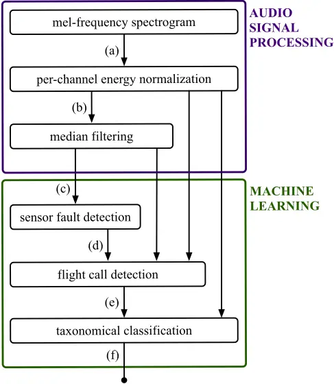

The breakthrough of deep learning in bioacoustic event classification around the year 2014 [30] has had lasting effects. By the year 2016, deep convolutional neural networks (convnets) began to consistently outperform competing systems in the LifeCLEF challenge for bird species classification, or BirdCLEF for short [31]. In 2018, almost every submission to BirdCLEF was a convnet [32]; however, the organizers did point out that the task of bioacoustic event classification was more difficult in omnidirectional sensors ("soundscapes") than with handheld recorders which are pointed at the source ("monospecies"). Since then, scaling up passive acoustic monitoring (PAM) to large spatiotemporal scales, despite nonuniform or nonstationary survey designs, has become a core preoccupation of computational bioacoustics with deep learning [33]. We refer to [34] for a review of recent advances the field, as well as a discussion of current trends.

Figure 2: Example output of BirdVoxDetect (BVD). Brighter colors in subfigures (a) to (c) denote larger values in the timefrequency domain. Red regions in subfigures (d) to (f) denote detected sensor faults. Each triangle in subfigure (e) represents a flight call. Each blue lozenge in subfigure (f) represents a flight call from an identifiable species.

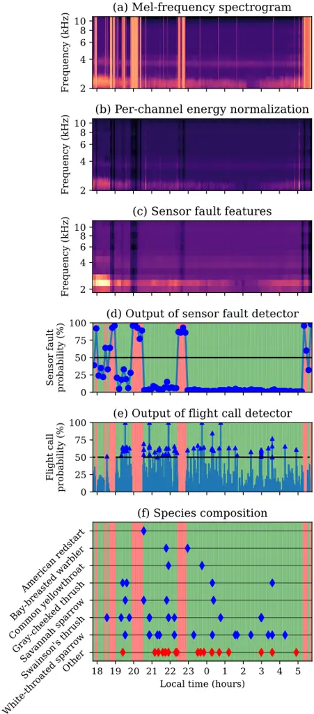

## C. Contributions

In this article, we present the first complete solution to bird migration monitoring from acoustic sensor network data. For that purpose, we develop a system which is resilient to real-world confounding factors, including mechanical sensor failures, spatiotemporal variations of background noise, and confusions between species of the same family. Practically speaking, we estimate the flight call activity of nocturnally migrating songbirds (Passeriformes) over the course of a full migration season, from August to December, and over an area of 1000km 2 in the U.S. Northeast. The unprecedented scale of this study suggests that automatic flight call classification is ready to transform bird migration monitoring.

Our main finding is that this is possible after training the system on a single night within the season, amounting to less than 1% of the acquired audio. In order to efficiently generalize to the remaining 99%, it is necessary to integrate state-of-the-art solutions to multiple research topics in audio signal processing and machine learning: efficient annotation, background noise reduction, context-adaptive sound event detection, and hierarchical sound event classification.

Our main contribution is BirdVoxDetect (BVD), a novel end-to-end pipeline for the detection and classification of avian flight calls at the terabyte scale, which we release as opensource software. Figure 1 outlines the original components of BVD, both in signal processing and machine learning. As an example, Figure 2 presents the intermediate outputs of each stage in the BVD pipeline, given a full night of bird migration.

The originality of our method is that it does not only evaluate these components in isolation but also in combination. BVD is not a proof of concept but a ready-to-use automation tool for computational bioacoustics: it runs as a single command on audio files of arbitrary length and returns a table of flight calls, each associated to a timestamp and a species. Furthermore, BVD produces calibrated estimates of probability; warns the user if the file contains an audible sensor fault; and falls back to higher taxonomical levels (i.e., family, order) if the detected flight call does not belong to the list of target species.

The second contribution of this paper resides in the release of the largest annotated dataset for flight call classification to date: BirdVox-296h dataset, or 296h for short. BirdVox-296h is disjoint from the training set of BVD and accounts for 5% of the full-season dataset. With 296h, we evaluate the scalability of BVD from training on a few gigabytes of isolated clips to deploying on a terabyte of continuous audio from dusk to dawn over nine recording locations. The second largest, named BUK, is 50 hours long [35]. In addition to 296h, we release a derived dataset for flight call classification (i.e., 14SD-1.1) as well as the datasets we used for training BVD: 222k for detection and ANAFCC-v2 for classification. Figure 3 summarizes the data curation and annotation process for this paper; a complete description is made available as supplementary material.

In the last section of this paper, we demonstrate the value of our main contribution for animal ecology. For this purpose, we run BVD on the full-season dataset (6671 hours); i.e., of the order of one terabyte of input and six petabytes of throughput. The predictions of BVD offer a new insight on Passeriformes of the U.S. Northeast: namely, that the per-species migration timing may be reconstructed from flight calls alone. To confirm this insight, we conduct a cross-modal comparison between BVD predictions and crowdsourced observationsi.e., eBird 1 . The results, published in [36], suggest a positive correlation between the two modalities (R 2 = 0.71). In this article, we discuss the implications of these results for audio signal processing and machine learning. Specifically, we stress that our protocol reflects the "non-ideal" nature of largescale bioacoustic surveys: opportunistic sampling of recording locations, audible sensor faults, missing values, nonuniform and nonstationary noise, class imbalance, and annotation uncertainty. Despite these challenges, BVD remains sufficiently robust to produce meaningful predictions, as made evident by the temporal alignment with citizen science data. Hence, BVD is the first successful example of fully automated flight call monitoring from an acoustic sensor network; and one of the first regarding terabyte-scale deep learning for passive acoustic monitoring in general.

## II. AUDIO SIGNAL PROCESSING

## A. Per-channel energy normalization (PCEN)

In order to reduce the influence of background noise and improve the generalization of deep convolutional networks across recording conditions, we apply a background noise reduction procedure known as per-channel energy normalization (PCEN) [37]. PCEN is particularly well-suited to the detection and classification of flight calls, which are short and rapidly modulated in frequency, whereas the background noise (insects, vehicle traffic) is broadband and locally stationary.

Let E(t, f ) be the mel-frequency spectrogram of some audio recording, with t and f denoting discrete time and mel frequency respectively. We define a low-pass filter φ T with a cutoff frequency equal to T -1 . PCEN applies adaptive gain control and dynamic range compression to E, yielding:

$$\stackrel { \text {the} } { \ } a c k \quad \text {PCEN} ( t , f ) = \left ( \frac { \text {E} ( t , f ) } { \left ( \varepsilon + ( \text {E} * \phi _ { T } ) ( t , f ) \right ) ^ { \alpha } } + \delta \right ) ^ { r } - \delta ^ { r } , \quad ( 1 )$$

where the quantities ε, α, δ, and r are constants and the notation (x t∗y) denotes a convolution over the time dimension. In practice, we construct φ T as a first-order IIR filter, like so:

$$M ( t , f ) = & ( E * \phi _ { T } ) ( t , f ) \\ = & s \mathbf E ( t , f ) + ( 1 - s ) \mathbf M ( t - \tau , f ) ,$$

where the constant s is the weight of the associated autoregressive process (AR(1)) and τ =1.5ms is the hop size of the melfrequency spectrogram. The recursive implementation above is more computationally efficient than FFT-based convolution while having a smaller memory footprint. Following Proposition IV.1 from [38], we define s in terms of τ and T, as:

$$\left . \begin{array} { c c } \frac { 1 } { 2 } & s = \sqrt { 1 - \cos \frac { 2 \pi \tau } { T } } \left ( \sqrt { 3 - \cos \frac { 2 \pi \tau } { T } } - \sqrt { 1 - \cos \frac { 2 \pi \tau } { T } } \right ) . \ \ ( 3 ) \\ \end{array}$$

1 Official website of eBird: https://ebird.org/

Figure 3: Diagram of the full-season dataset and its subsets. Solid and dashed lines denote labeled and unlabeled audio respectively. Black and purple lines denote training and evaluation subsets respectively. Rectangles and ellipses denote full-length acoustic scenes and isolated audio clips respectively.

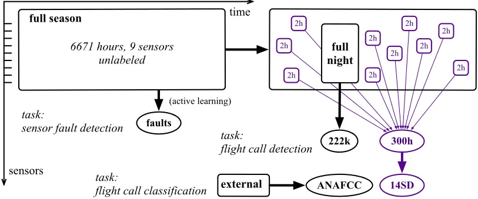

In this paper, we set T =60ms, ε =10-6 , α =0.8, δ =10, and r = 0.25. A previous publication on bioacoustic sensor networks [29] has reported that this choice of parameters Gaussianizes the distributions of normalized spectrogram magnitudes, consistently across sensors. This is in contrast with the original publication on PCEN [37], in which the proposed default parameters are optimized for automatic speech recognition in a noisy indoor environment, but inadequate for flight call detection.

In the rest of this paper, we refer to the output of PCEN by the abbreviation "PCEN-gram". Figure 2b illustrates an example PCEN-gram. We refer to [38], [39] for more details on PCEN.

## B. Median filtering

With the aim of detecting audible sensor faults in the fullseason dataset, we lower the dimensionality of the PCEN-gram by subsampling it in time and mel-frequency. Specifically, we compute the median of the PCEN-gram over non-overlapping windows of duration 30 minutes, for each mel-frequency subband f independently. Furthermore, we subsample the melfrequency axis by a factor of 12, thus reducing the number of subbands f from 120 down to 10. We call "sensor fault features" the resulting time-frequency representation, in which the time axis is sampled at a rate of two frames per hour. Extracting sensor fault features on the full-season dataset results in 12k feature vectors, i.e., one every half-hour segment. Figure 2c illustrates an example output of median filtering.

## III. SENSOR FAULT DETECTION

The prolonged deployment of autonomous acoustic sensor networks exposes them to faults [40]. Some of them (e.g., power losses) halt a sensor node and cause missing data. Others (e.g., humidity) do not affect uptime but degrade the quality of acquired audio content. If the degradation is severe, flight calls are no longer audible: hence, the detection and classification pipeline is no longer a reliable predictor of actual flight call activity. Yet, prior publications on bioacoustics for bird migration monitoring have neglected the eventuality of sensor faults. In this section, we present the automatic sensor fault detector of BVD; i.e., a random forest classifier trained with an active learning paradigm. In the functional diagram of Figure 1, the sensor fault detector corresponds to block (d).

## A. Random forest classifier

We manually label two half-hour segments in the dataset: one in which a sensor fault is present and the other in which no sensor fault is present. With scikit-learn v0.20.1 [41], we train a random forest classifier (with 100 decision trees) on the corresponding two feature vectors. Unlike neural networks, random forest are well-suited to the active learning paradigm since they able to learn from limited labeled data and can be retrained efficiently.

## B. Active learning for efficient audio annotation

Because the classifier described above is trained on a tiny dataset (two examples), it does not generalize well to unseen recording conditions. To improve accuracy, it is necessary to refine the decision boundary between classes, and thus label more examples. However, the annotation of sensor faults from bioacoustic recordings is a particularly tedious task. Furthermore, the relatively rare proportion of sensor faults in full-season (estimated between 1% and 5% of the audio data) causes a class imbalance problem, which hampers the statistical generalization of the classifier.

We address the issue of annotation efficiency in the sensor fault detection task by adopting an active learning paradigm. Instead of annotating audio segments drawn uniformly at random in full-season, we execute an algorithm which iteratively queries the human annotator with the most informative unlabeled example. Here, the informativeness of an example is defined according to the prediction confidence of the random forest classifier.

We apply the active learning algorithm of [42], known as "alternate confidence sampling", onto the full-season dataset. In 90% of the iterations, the algorithm queries the human with the unlabeled example with least confidence, that is, the one closer to the decision boundary of the classifier. Alternatively, in one every ten iteration, the algorithm queries the human with a high-confidence example: specifically, one example drawn uniformly at random among the pool of unlabeled examples whose confidence exceeds a fixed probability threshold of 85%.

The human annotator labels examples progressively, as queried by the active learning algorithm. Conversely, the random forest classifier is retrained after the labeling of every example, and thus becomes progressively more discriminative. This human-in-the-loop machine learning procedure is repeated until the classifier reaches a satisfying generalization power. In practice, two annotators (AF and VL of the authors) labeled 100 half-hour segments in full-season.

## C. Qualitative evaluation with t-SNE embedding

We propose to shed light on the active learning process described above by visualizing a t-distributed stochastic neighbor embedding (t-SNE) of the full-season dataset [43]. The t-SNE algorithm learns a nonlinear mapping from a feature space in dimension ten to a embedding space in dimension two. In doing so, t-SNE minimizes the Kullback-Leibler divergence between the joint probability distribution of examples in the feature space and that of examples in the embedding space. Therefore, spatial proximity in the 2-D embedding space denotes acoustical similarity in terms of median PCEN-gram features. We use the implementation of scikit-learn with all parameters set to their default values as of v0.20.1.

Figure 4 illustrates the outcome of t-SNE embedding. In the left column, we represent unlabeled examples as black dots and labeled examples in color: green square for positives (i.e., absence of sensor fault) and red squares for negatives (i.e., presence of sensor fault). In the right column, we represent the predictions of the sensor fault detector over all examples, be them labeled or unlabeled: darker shades of red (vs. green) denote a greater predicted probability that a sensor fault is present (resp. absent) in the corresponding audio excerpt. We repeat the display at different stages of the active learning process: initialization (top), with 10 labeled examples (center), and with 100 labeled examples (bottom).

We observe in Figure 4c (left) that the distribution of labeled examples is not uniform over the t-SNE map. Instead, it is concentrated on the regions of least confidence of the sensor fault detector: the top-left and bottom-right corners of the scatter plot in our case, appearing in pale green in Figure 4b (right). Moreover, we observe on Figure 4a (right) that the decision boundary of the sensor fault detector appears as a rectilinear color gradient at the initialization. In contrast, we observe on Figures 4b (right) and 4c (right) that the decision boundary becomes progressively sharper and nonlinear as the number of labeled examples increases. These observations provide qualitative evidence that the proposed active learning process accelerates the convergence of the sensor fault detector as a function of training set size.

## (a) with 2 labeled samples

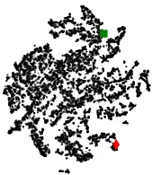

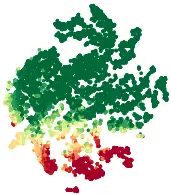

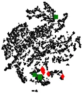

(b) with 10 labeled samples

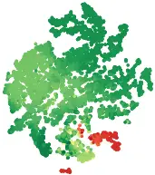

Figure 4: Visualization of sensor fault features with t-SNE. Left column: human expert annotation. Red lozenges (resp. green squares) denote the presence (resp. absence) of a sensor fault in the corresponding audio excerpt. Unlabeled examples are denoted as small black dots. Right column: machine listening prediction by a random forest classifier trained on sensor fault features in dimension ten. Darker shades of red (vs. green) denote a greater predicted probability that a sensor fault is present (resp. absent) in the corresponding audio excerpt.

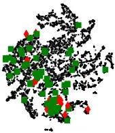

(c) with 100 labeled samples

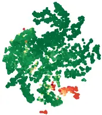

## IV. FLIGHT CALL DETECTION

This section presents our deep learning system for speciesagnostic avian flight call detection; i.e., a convolutional neural network (CNN) taking a PCEN-gram representation as its input. In the functional diagram of Figure 1, this corresponds to block (e).

## A. PCEN-based convolutional neural network

Drawing inspiration from prior research on urban sound classification [44] and species classification from clips of flight calls [28], we build a CNN with three convolutional layers and two fully connected layers. The first (resp. second) convolutional layer consists of 24 (resp. 48) kernels of size 5×5, a rectified linear unit (ReLU) activation function, and a strided max-pooling operator of shape 4×2; that is, 4

time frames and 2 frequency bands. The third convolutional layer consists of 48 kernels of size 5×5, a ReLU, and no pooling. The first fully connected layer contains 64 hidden units, followed by a ReLU. Lastly, the second fully connected layer maps those 64 hidden units to a single output unit, followed by a sigmoid nonlinearity.

The input to BVD is a PCEN-gram excerpt with 120 rows and 104 columns, hence a duration of approximately 150ms. During training, we apply batch normalization to this matrix (but not to deeper layers), thus bringing its coefficients to null mean and unit variance.

## B. Data augmentation

We augment the 222k dataset with three kinds of digital audio effects: pitch shifting, time stretching, and the combination of pitch shifting and time stretching. We draw the pitch interval at random from a normal distribution with null mean and half-unit variance, as measured in semitones according to the 12-tone equal temperament. Furthermore, we draw the time stretching factor at random from a log-normal distribution with parameters µ = 0 and σ = 0.05. The rationale behind these hyperparameters is to avoid "over-augmenting" a clip such that it would no longer be recognizable as pertaining to the target species. For this matter, an expert ornithologist (AF) determined that these augmentations would keep the flight calls within their plausible frequency and temporal ranges.

Such a randomization procedure allows to augment any given audio example more than once. Specifically, we draw ten instances of pitch shifting, ten instances of time stretching, and ten instances of pitch shifting and time streching in combination. This corresponds to 31 versions of each audio example in total: i.e., one original version and 30 augmentations. After augmenting each of the 189k examples in the training set of BirdVox-222k, we obtain a dataset of 31×189k = 5.9M examples. Although these examples could be generated on the fly from the 189k original examples, we have found data augmentation to be a computational bottleneck if repeated across epochs and hyperparameter settings. Thus, we simply store all augmented examples before training; i.e., 633 gigabytes of data on disk.

## C. Training

We train the detector on the augmented training subset of 222k via the Adam optimizer, an variation of stochastic gradient descent. We leave the hyperparameters of Adam to their default values: i.e., a learning rate of 10-3 , decay rates of β1 = 0.9 and β2 =0.999, and a denominator offset of ̂ε =10-7 [45].

We formulate the flight call detection task as binary classification and choose binary cross-entropy as objective function. Similarly to [46], we regularize this objective function by penalizing the L 2 norm of the synaptic weights in the penultimate layer, with a multiplicative factor set to 10-3 .

To implement the training procedure efficiently, we use the pescador Python package, which offers utility functions for shuffling and streaming heterogeneous data 2 . For each of the 299 segments and the 31 augmentations, we construct a "stream": that is, an infinite generator which yields positive and negative examples with equal probability. At the beginning of each epoch, pescador draws one augmentation uniformly at random (out of 31) for each of the 299 segments. We then define batches by "multiplexing" the streams corresponding to these 299 segment-augmentation pairs, so that each stream contributes one and only one example per batch. In this way, each batch reflects the acoustical diversity of the full-night dataset. We repeat the process 100 times per epoch, thus yielding 29.9k examples per epoch in total. Note that this number roughly corresponds to the number of flight calls in the training set.

2 Documentation of pescador: https://pescador.readthedocs.io

On every epoch, we draw an augmentation for each of the available segments and multiplex the corresponding streamers. Thus, different epochs contain the same original audio material but vary stochastically in terms of augmentations. Furthermore, we guarantee that the spatiotemporal density of negatives matches that of positives. We run Adam for 24 hours on a GPU and checkpoint the model with lowest validation loss.

## D. Evaluation

After training on 222k, we evaluate the detector on 296h. Note that 222k and 296h arise from the same recording locations but are disjoint in time. Furthermore, 222k was constructed from a single night of data acquisition whereas 296h is more diverse, as it involves recordings between August and November 2015.

We run BVD on each of the annotated two-hour segments in 296h according to a hop duration of 50ms, thus producing an event detection function at a rate of 20Hz. We select local peaks in the detection function above some fixed absolute threshold τ ∈]0,1[. Then, we compare the set of detected peaks to the human-provided checklist of flight call timestamps. We define matching pairs between detected events and a reference event if their timestamps are within 500ms of each other. We optimize the cardinality of this matching while guaranteeing that each reference peak matches a single detected peak at most, and vice versa. For this purpose, we solve a bipartite graph matching problem via the match_events function of the mir_eval Python package [47]. This operation yields a number of true positives, false positives, and false negatives. We convert these integer counts into information retrieval metrics: precision, recall, and F1-score. We repeat the process for sweeping values of the threshold parameter τ to derive a precision-recall curve.

## E. Results

Figure 5 summarizes out results. First, we evaluate a flight call detection system that does not rely on deep learning, but purely on feature engineering. Under the names of "Tseep" and "Thrush", this system has long served in research on the flight calls of sparrows, warblers and thrushes respectively [20]. We re-implement these detectors in Python, with help from the original authors. At the optimal threshold, the F1-score is equal to 3%. As shown on Figure 5 (curve A), this low F1-score can be explained by a low precision; that is, a large proportion of false positives in comparison with true positives.

Figure 5: Precision-recall curves of BirdVoxDetect (BVD) for the 296h dataset. Each dot on the curve denotes a different value of the BVD threshold.

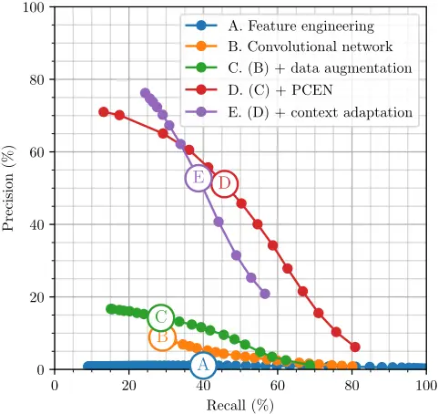

Then, we evaluate a version of the detector without PCEN nor data augmentation, by training the same CNN architecture on batch-normalized log-mel-spectrograms from 222k. At the optimal threshold, we obtain an F1-score of 5%: see curve B in Figure 5. Artificial data augmentation, as described above, brings the F1-score of the deep convolutional network to 15% at the optimal threshold: see curve C. Replacing the logmel-spectrogram representation by a PCEN-gram considerably improves F1-score up to 52% at the optimal threshold: see curve D. However, contrary to a previous publication [29], introducing context adaptation in the convolutional neural network (CA-CNN) is not beneficial across the whole precisionrecall diagram: see curve E. Our CA-CNN relies on longterm summary statistics of the PCEN-gram as descriptors of "context", i.e., of the spectral envelope of background noise. These descriptors are passed to a small auxiliary branch of the deep learning pipeline, whose output can be interpreted as a slowly time-varying threshold. This kind of context adaptation proved beneficial for generalizing across recording conditions between dusk and dawn in the full-night dataset [29]. Yet, the comparison of curves D and E in Figure 5 shows that the same approach does not allow generalization across recording conditions between September and other months in the 296h dataset. There is no logical contradiction between the previous finding and the current one: together, they suggest that the hourly scale (full-night) and the monthly scale (full-season) induce different kinds of acoustical nonstationarities. With these two evaluations in mind, we keep model D as our flight call detector of choice and release it publicly as part of the BVD v1.0 open-source package.

We also evaluate BirdNET [48] on BirdVox-296h. At the optimal threshold, we report a precision of 0.6%, a recall of

1.3%, and an F-score of 0.006%. This poor result is consistent with a previous publication [29], which evaluated a state-ofthe-art birdsong detector [49] and found it to perform near the chance level on species-agnostic flight call detection. It simply shows that birdsong and flight calls are different kinds of acoustic signals, as we have already noted in the introduction. However, we should note that the BirdNET project is evolving rapidly since its original publication and that future versions of the software may perform better than the first published version on the task of flight call detection and classification 3 .

## V. SPECIES CLASSIFICATION

This section presents our deep learning system for multilevel taxonomic avian flight call classification. Similarly to the detector in the previous section, the classifier is a CNN taking a 120-band PCEN-gram as its input. Because the detector and classifier share a common input representation, we may pass positive clips from the detector to the classifier directly in the PCEN-gram domain instead of the waveform domain, without having to recompute PCEN. In the functional diagram of Figure 1, the classifier corresponds to block (f).

## A. Multitask taxonomical neural network

The architecture of our multilevel taxonomic classifier corresponds to a non-hierarchical multitask model (abbreviated NonH. MT) presented in prior species classification research [50]. Although this prior publication reported that a hierarchically structured classifier (TaxoNet) achieved the best classification performance on its evaluation dataset, we were not able to replicate the results with the new data and now find that the non-hierarchical multitask model performs best.

The architecture of the classifier is similar to that of BVD, as it also composes three convolutional layers and two fully connected layers, with no bias weights for any layer. Before the first layer, we perform batch normalization on the PCEN-gram to stabilize and accelerate training [51]. The three convolutional layers are identical in shape to those of BVD, except that their numbers of kernels per layer are 24, 48, and 48 respectively.

The first fully connected layer contains 64 hidden units, followed by a ReLU. Lastly, the second fully connected layer maps those 64 hidden units to 15 output units followed by a softmax nonlinearity corresponding to 14 species and an "other" (i.e. out-of-vocabulary) species class. The second fully connected layer also maps its 64 hidden units to 5 output units followed by a softmax nonlinearity corresponding to 4 families and an "other" family class, and single output unit followed by a sigmoid nonlinearity corresponding to Passeriformes or non-Passeriformes (order-level classification).

We note that there are no guarantees that the outputs of the model are hierarchically consistent. For example, the classifier can simultaneously predict Cardinalidae at the family level and White-throated sparrow at the species level even though white-throated sparrows are not cardinals. Since we do not have any guarantee of hierarchically consistency, we propose a method for selecting candidates which have this guarantee.

Hierarchical consistency could be incorporated directly in the model by modeling joint class likelihoods instead of marginal class likelihoods, but we leave this question as future work.

## B. Hierarchical consistency

A simple decision rule for automatic classification is to select the class with the largest output probability for each level in our taxonomy. However, this does not ensure that these class candidates are hierarchically consistent. In order to improve the robustness of the multilevel taxonomic classifier, we propose a method to ensure (top-down) hierarchical consistency for predictions. We define a procedure that, from a set of output probabilities for each taxon, produces class candidates that are hierarchically consistent. First, we select the class for the coarsest taxon (order, in this case) that has the largest output probability. If this probability is greater than a threshold of 0.5, we select this class as the taxon's candidate; otherwise, we select "other". Then, for each subsequent taxon, we select the class with the largest output probability that is also a taxonomic child of the previous taxon's candidate. If this probability is greater than a threshold of 0.5, then we select this class for this taxon's candidate; otherwise, we select "other". Once we obtain a candidate for the finest taxon, we complete the collection of class candidates for each taxon.

## C. Training

To train and validate the classifier, we present an updated version of the BirdVox American Northeast Avian Flight Call Classification (BirdVox-ANAFCC, or ANAFCC for short) Dataset [50], which we refer to as ANAFCC-v2 4 . This dataset aggregates isolated flight calls from different data sources: BirdVox-full-night, CLO-43SD, CLO-SWTH, CLOWTSP [26], the Macaulay Library [52], Xeno-Canto [53], and Old Bird [54] 5 . More information on ANAFCC-v2 is made available as supplementary material.

We train the model to minimize a uniformly weighted summation of categorical cross-entropy for the species-level outputs, categorical cross-entropy for the family-level outputs, and binary cross-entropy loss for the order-level output. This multitask training method presented in prior species classification research [50] improves species classification performance over species-only training. We train the models using the Adam optimizer with initial learning rate set to 10-4 . We also apply L 2 regularization on the synaptic weights of the linear layers, using a multiplicative factor of 10-5 for the first linear layer and using a factor of (Ck/43) · 10-5 for each output layer for level k of the taxonomy with Ck classes. The output layer regularization factor is chosen so that each synaptic weight for the output layer is the same as in the original method [12].

## D. Evaluation

To evaluate the flight call classifier, we present a new version of the BirdVox 14 Species Dataset [50], which we refer to as 14SD-v1.1. A derivative of 296h, 14SD comprises roughly 14k isolated clips of flight calls alongside their human annotations. In comparison with the previous version (v1.0), the updated version (v1.1) addresses some edge cases regarding the alignment of clip boundaries. We evaluate the predictions with vs. without enforcing hierarchical consistency, based on class-wise and overall F1 score, as shown in Figure 6.

4 Download BirdVox-ANAFCC-v2: https://zenodo.org/records/5950000

5 Official website of Old Bird, Inc.: https://www.oldbird.org

Figure 6: Evaluation of hierarchical consistency on the 14SD-v1.1 dataset, a derivative of BirdVox-296h. Speciesspecific F1-scores are ordered (downward) and grouped (in blue brackets) by family. The row "other" represents the F1score of out-of-vocabulary examples while the row "overall" corresponds to a micro-averaged F1-score across all examples in the dataset.

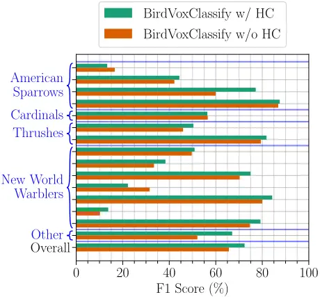

## E. Results

We observe that hierarchical consistency (HC) across taxonomical orders is most often beneficial to species classification. Figure 6 shows that the F1 score with HC (green) is above the F1 score without HC (red) on all but three species. Moreover, HC is not only beneficial to species in the taxonomy, but also to correct classification of the out-of-taxonomy sounds ("other"). Overall, HC brings the average F1 score of the species classifier from 66.71% to 72.82%.

Figure 7 shows the confusion matrix between predicted classes and the ground truth in BirdVox-14SD-1.1. We observe that this matrix has a block structure: most of the off-diagonal confusions level correspond to different species of the same taxonomical family. Figure 8 summarizes the effect of HC on species classification. We observe that flight calls within the taxonomy are confused with the "other" class more often, as indicated in the rightmost column. Such confusions induced by HC suggest that the family classifier tends to produce comparably more false negatives, an effect worthy of future investigation. Despite this shortcoming, HC generally has a net positive effect on the confusion matrix of the species classifier.

Figure 7: Confusion matrix on the 296h dataset. The color of each element indicates the percentage points of ground-truth positive examples that are predicted as each class. The species are ordered (downward and rightward) and grouped (in blue boxes) by family.

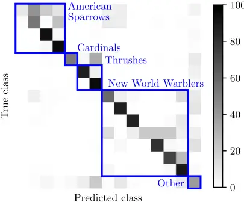

Figure 8: Effect of hierarchical consistency on the confusion matrix. Relative change in class-wise confusion at the species level for the 296h dataset, without and with hierarchical consistency. Green (resp. red) cells denote a relative decrease (resp. increase) in confusion with respect to the confusion matrix in Figure 5. The species are ordered (downward and rightward) and grouped (in blue boxes) by family.

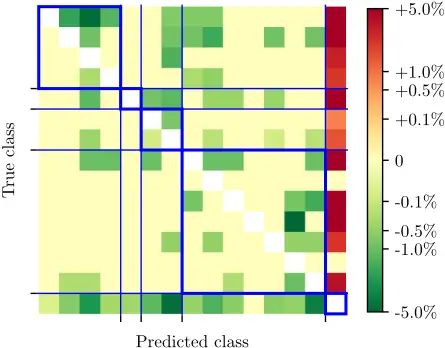

## VI. APPLICATION TO BIRD MIGRATION MONITORING

The sections above have focused on the evaluation of individual components in BirdVoxDetect: sensor fault detection, flight call detection, and species classification. It remains to be seen how the system operates once these elements are integrated within a given application.

## A. Terabyte-scale deployment

We run BirdVoxDetect on all recordings from the BirdVoxfull-season dataset. This dataset contains 6,671 hours of audio; which, given a hop length of τ =1.5ms, translates to

$$\frac { 6 6 7 1 \times 3 6 0 0 } { 1 5 \cdot 1 0 \ ^ { 3 } } \approx 1 . 6 \cdot 1 0 ^ { 9 }$$

instances of Fast Fourier Transform (FFT). The convolutional neural network in BirdVoxDetect predicts event detection function at a rate of 20Hz, hence a total of 6671×3600×20≈ 4.8 · 10 8 predictions. Furthermore, the number of synapses in the first layer of BirdVoxDetect is equal to 128×104×24≈ 3.2 · 10 6 . Because each synapse is encoded over 32 bits, or four bytes, the throughput of our computation is at least (3.2 · 10 6 )×4×(4.8 · 10 8 ) ≈ 6.1 · 10 15 bytes; i.e., around six petabytes. Lastly, the output contains 6671×3600×20×4≈ 1.921 · 10 9 bytes; i.e., around two gigabytes. These numbers demonstrate the need for parallelization over hundreds of cores. For this purpose, we use the high-performance computing facility of New York University 6 .

## B. Estimation of peak migration timing

We detect 233,124 flight calls on the full-season dataset. We aggregate the flight call counts of BirdVoxDetect across four taxonomical families: American Sparrows (Passerellidae), Cardinals (Cardinalidae), Thrushes (Turdidae), and NewWorld Warblers (Parulidae). For each night in the full-season dataset, we estimate the call rate of each family at each recording location by dividing the flight call count by the duration of the available audio data, excluding sensor faults (see Section III). Furthermore, we average the local estimates of call rate across all active sensors in the bioacoustic sensor network on any given night. For each family, we use the R package "mgcv" to fit the resulting time series with a generalized additive model (GAM). We draw 10k independent examples from the GAM's so as to generate independent migration trajectories for each family and derive 95% confidence interval for the timing of peak migration.

To corroborate our findings, we compare them with a different modality of ecological observation: namely, checklists from the eBird citizen science platform [55]. We download the eBird Basic Database (February 2021 version) and use the "auk" R package to filter it in space (Tompkins County, New York, USA), and in time (from 1 August to 30 November, 2015). We calculate daily reporting frequency by dividing number of complete checklists in which the focal taxon was reported by total number of complete checklists submitted on that day. Similarly to our acoustics-based model, we fit a GAM on the time series of daily reporting frequency for each family, draw 10k independent examples, and derive 95% confidence intervals for timing of peak migration. We refer to [36] for more details on our procedure of eBird data collection and GAM fitting.

6 Link: https://sites.google.com/nyu.edu/nyu-hpc

Figure 9 (c) confirms that the temporal profile of flight call activity, as estimated via BirdVoxDetect, is consistent with current knowledge about migration ecology. In particular, the relatively late timing of Passerellidae in the fall migration season appears both on acoustic data and on citizen science data. Yet, the two modalities are not perfectly aligned. This is partly due to the lower spatial coverage of the bioacoustic sensor network and to technical limitations throughout the computational pipeline, but also to the fact that eBird captures diurnal in-habitat observations whereas BirdVoxDetect captures nocturnal flight calls. Still, the results show that our proposed end-to-end pipeline opens the door to acoustic-based migration monitoring at an unprecedented scale. Acoustic monitoring complements existing monitoring approaches such as citizen science and radar-based monitoring, which can lead to more robust overall migration monitoring [36].

## VII. CONCLUSION

The emerging field of machine listening for bird migration monitoring has the potential to elucidate some long-lasting questions in avian population ecology and inform conservation science efforts. In this paper, we have presented BirdVoxDetect, a full-fledged system for the detection and classification of flight calls from a bioacoustic sensor network. We have integrated state-of-the-art components in signal processing and machine learning, such as per-channel energy normalization (PCEN) and deep convolutional neural networks (CNN). We have also developed novel elements such as a sensor fault detector trained with active learning and a rule-based algorithm for "hierarchical consistency" in classifying living organisms. Our paper has shown that, once all elements are composed, BirdVoxDetect produces a daily log of flight call counts that, in the case of the most vocal species, align with observations on the ground. We have released BirdVoxDetect as open-source software. Since this release, a community of flight call enthusiasts has adopted these tools and is currently using them to ease the process of nocturnal bird migration monitoring.

Beyond the technical aspects of BirdVoxDetect, it is worth stressing that the problem of flight call monitoring encompasses eleven orders of magnitude in terms of time scales: from a few microseconds for a digital audio sample up to millions of seconds for a full season. Figure 10 illustrates some of these time scales. Meanwhile, prior research on machine listening for the detection and classification of flight calls was carried out over four or five orders of magnitude: that is, up to one to ten seconds of time scale at most. With this paper, we aim to fill this gap in research by providing large-scale open audio datasets with expert annotation: BirdVox-full-season, BirdVox-296h, and BirdVox-14SD-v1.1. These datasets enable the development of a new generation of computational tools for species-specific monitoring of bird migration at large spatiotemporal scales.

## ACKNOWLEDGMENT

This work is supported by NSF awards 1633259 and 1633206, the Leon Levy Foundation, a Google faculty award, and WeAMEC project PETREL. We thank Jessie Barry, Ian Davies, Tom Fredericks, Jeff Gerbracht, Sara Keen, Holger Klinck, Anne Klingensmith, Ray Mack, Peter Marchetto, Ed Moore, Matt Robbins, Ken Rosenberg, and Chris TessagliaHymes for designing autonomous recording units and collecting data. We acknowledge that the land on which the data were collected is the unceded territory of the Cayuga nation, which is part of the Haudenosaunee (Iroquois) confederacy.

## REFERENCES

- [1] C. J. Whelan, C¸ . H. S¸ekercio˘glu, and D. G. Wenny, "Why birds matter: from economic ornithology to ecosystem services," Journal of Ornithology, vol. 156, no. 1, pp. 227-238, 2015.
- [2] T. Fuller, S. Bensch, I. M¨uller, J. Novembre, J. P´erez-Tris, R. E. Ricklefs, T. B. Smith, and J. Waldenstr¨om, "The ecology of emerging infectious diseases in migratory birds: An assessment of the role of climate change and priorities for future research," EcoHealth, vol. 9, no. 1, pp. 80-88, 2012.
- [3] A. Guterres, "Statements to mark world migratory bird day 2018," 2018. [Online]. Available: https://www.worldmigratorybirdday.org/2018/ statements-mark-world-migratory-bird-day-2018
- [4] F. Bairlein, "Migratory birds under threat," Science, vol. 354, no. 6312, pp. 547-548, 2016.
- [5] M. L. Morrison, "Bird populations as indicators of environmental change," Current Ornithology, vol. 3, pp. 429-451, 1986.
- [6] O. Gordo, "Why are bird migration dates shifting? a review of weather and climate effects on avian migratory phenology," Climate research, vol. 35, no. 1-2, pp. 37-58, 2007.
- [7] T. Alerstam and ˚A. Lindstr¨om, "Optimal bird migration: the relative importance of time, energy, and safety," in Bird migration: physiology and ecophysiology. Springer, 1990, pp. 331-351.
- [8] B. M. Van Doren and K. G. Horton, "A continental system for forecasting bird migration," Science, vol. 361, no. 6407, pp. 1115-1118, 2018.
- [9] K. V. Rosenberg, A. M. Dokter, P. J. Blancher, J. R. Sauer, A. C. Smith, P. A. Smith, J. C. Stanton, A. Panjabi, L. Helft, M. Parr et al., "Decline of the north american avifauna," Science, vol. 366, no. 6461, pp. 120-124, 2019.
- [10] D. Stowell, D. Giannoulis, E. Benetos, M. Lagrange, and M. D. Plumbley, "Detection and classification of acoustic scenes and events," Transactions on Multimedia, vol. 17, no. 10, pp. 1733-1746, 2015.
- [11] O. G. Libby, "The nocturnal flight of migrating birds," The Auk, vol. 16, no. 2, pp. 140-146, 1899.
- [12] J. Salamon, J. P. Bello, A. Farnsworth, and S. Kelling, "Fusing shallow and deep learning for bioacoustic bird species classification," in Proceedings of the International Conference on Acoustics, Speech, and Signal Processing (ICASSP). IEEE, 2017, pp. 141-145.
- [13] A. M. Dokter, A. Farnsworth, D. Fink, V. Ruiz-Gutierrez, W. M. Hochachka, F. A. La Sorte, O. J. Robinson, K. V. Rosenberg, and S. Kelling, "Seasonal abundance and survival of north america's migratory avifauna determined by weather radar," Nature ecology &amp; evolution, vol. 2, no. 10, pp. 1603-1609, 2018.
- [14] J. Kitzes and L. Schricker, "The necessity, promise and challenge of automated biodiversity surveys," Environmental Conservation, vol. 46, no. 4, pp. 247-250, 2019.
- [15] B. M. Winger, B. C. Weeks, A. Farnsworth, A. W. Jones, M. Hennen, and D. E. Willard, "Nocturnal flight-calling behaviour predicts vulnerability to artificial light in migratory birds," Proceedings of the Royal Society B, vol. 286, no. 1900, p. 20190364, 2019.
- [16] A. P. Hill, P. Prince, E. Pi˜na Covarrubias, C. P. Doncaster, J. L. Snaddon, and A. Rogers, "Audiomoth: Evaluation of a smart open acoustic device for monitoring biodiversity and the environment," Methods in Ecology and Evolution, vol. 9, no. 5, pp. 1199-1211, 2018.
- [17] A. Farnsworth, "Flight calls and their value for future ornithological studies and conservation research," The Auk, vol. 122, no. 3, pp. 733-746, 2005.
- [18] A. M. Dokter, F. Liechti, H. Stark, L. Delobbe, P. Tabary, and I. Holleman, "Bird migration flight altitudes studied by a network of operational weather radars," Journal of the Royal Society Interface, vol. 8, no. 54, pp. 30-43, 2011.

Figure 9: Cross-modal comparison between nightly flight call activity from BirdVoxDetect (a) and crowdsourced observations from eBird (b). The four columns correspond to families of migrating passerines (Passeriformes). For each modality and family, dots and segments in Subfigure (c) show the estimated peak migration timings and associated confidence intervals at 95%. Reprinted from [56] with permission.

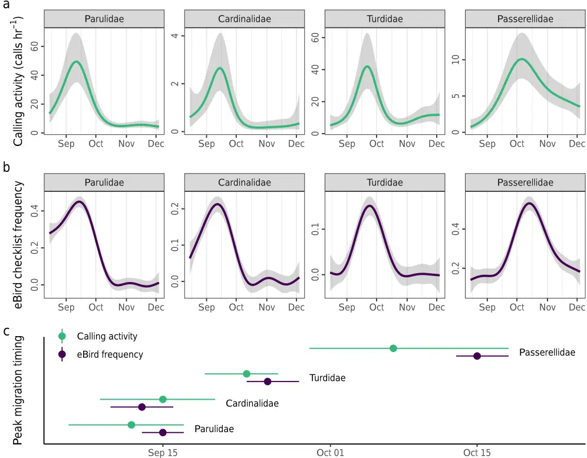

Figure 10: Timescales of bird migration monitoring with bioacoustic sensor networks. Blue triangles represent natural time scales, whereas black vertical lines represent our design choices.

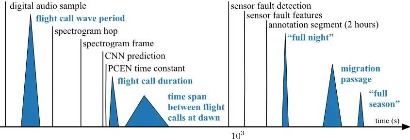

- [19] R. R. Graber and W. W. Cochran, "An audio technique for the study of nocturnal migration of birds," The Wilson Bulletin, vol. 71, no. 3, pp. 220-236, 1959.
- [20] W. R. Evans, "Monitoring avian night flight calls - the new century ahead," The Passenger Pigeon, vol. 67, pp. 15-27, 2005.
- [21] T. S. Brandes, "Automated sound recording and analysis techniques for bird surveys and conservation," Bird Conservation International, vol. 18, no. S1, pp. S163-S173, 2008.
- [22] T. Damoulas, S. Henry, A. Farnsworth, M. Lanzone, and C. Gomes, "Bayesian classification of flight calls with a novel dynamic time warping kernel," in 2010 Ninth International Conference on Machine Learning and Applications. IEEE, 2010, pp. 424-429.
- [23] T. Schrama, M. Poot, M. Robb, and H. Slabbekoorn, "Automated monitoring of avian flight calls during nocturnal migration," in International Expert meeting on IT-based detection of bioacoustical patterns, 2007, pp. 131-134.
- [24] M. Marcarini, G. A. Williamson, and L. de Sisternes Garcia, "Comparison of methods for automated recognition of avian nocturnal flight calls," in Proceedings of the International Conference on Acoustics, Speech, and Signal Processing (ICASSP). IEEE, 2008, pp. 2029--2032.
- [25] S. Bastas, M. W. Majid, G. Mirzaei, J. Ross, M. M. Jamali, P. V. Gorsevski, J. Frizado, and V. P. Bingman, "A novel feature extraction algorithm for classification of bird flight calls," in 2012 IEEE International Symposium on Circuits and Systems (ISCAS). IEEE, 2012, pp. 1676-1679.
- [26] J. Salamon, J. P. Bello, A. Farnsworth, M. Robbins, S. Keen, H. Klinck, and S. Kelling, "Towards the automatic classification of avian flight calls for bioacoustic monitoring," PLOS One, vol. 11, no. 11, 2016.
- [27] H. Pamuła, M. Kłaczy´nski, M. Remisiewicz, W. Wszołek, and D. Stowell, "Adaptation of deep learning methods to nocturnal bird audio monitoring," in Poste¸py akustyki. Polskie Towarzystwo Akustyczne, Oddziałl G´orno´sla¸ski, 2017, pp. 149-158.
- [28] J. Salamon and J. P. Bello, "Deep convolutional neural networks and data augmentation for environmental sound classification," Signal Processing Letters, vol. 24, no. 3, pp. 279-283, 2017.
- [29] V. Lostanlen, J. Salamon, A. Farnsworth, S. Kelling, and J. P. Bello, "Robust sound event detection in bioacoustic sensor networks," PLOS ONE, vol. 14, no. 10, p. e0214168, 2019.
- [30] H. V. Koops, J. Van Balen, F. Wiering, L. Cappellato, N. Ferro, M. Halvey, W. Kraaij et al., "A deep neural network approach to the lifeclef 2014 bird task," in Working Notes of the Conference and Labs of the Evaluation Forum (CLEF), vol. 1180, 2014, pp. 634-642.
- [31] H. Go¨eau, H. Glotin, W.-P. Vellinga, R. Planqu´e, and A. Joly, "Lifeclef bird identification task 2016: The arrival of deep learning," in Proceedings of the Conference and Labs of the Evaluation Forum (CLEF), no. 1609, 2016, pp. 440-449.
- [32] H. Go¨eau, S. Kahl, H. Glotin, R. Planqu´e, W.-P. Vellinga, and A. Joly, "Overview of birdclef 2018: monospecies vs. soundscape bird identification," in CLEF 2018-Conference and Labs of the Evaluation Forum, vol. 2125, no. 9, 2018.
- [33] C. M. Wood, S. Kahl, P. Chaon, M. Z. Peery, and H. Klinck, "Survey coverage, recording duration and community composition affect observed species richness in passive acoustic surveys," Methods in Ecology and Evolution, vol. 12, no. 5, pp. 885-896, 2021.
- [34] D. Stowell, "Computational bioacoustics with deep learning: a review and roadmap," PeerJ, vol. 10, p. e13152, 2022.
- [35] H. Pamula, A. Pocha, and M. Klaczynski, "Deep learning methods for acoustic monitoring of birds migrating at night," in Forum Acusticum, 2020, pp. 2761-2764.
- [36] B. M. Van Doren, V. Lostanlen, A. Cramer, J. Salamon, A. Dokter, S. Kelling, J. P. Bello, and A. Farnsworth, "Automated acoustic monitoring captures timing and intensity of bird migration," Journal of Applied Ecology, 2022.
- [37] Y. Wang, P. Getreuer, T. Hughes, R. F. Lyon, and R. A. Saurous, "Trainable frontend for robust and far-field keyword spotting," in Proceedings of the International Conference on Acoustics, Speech, and Signal Processing (ICASSP). IEEE, 2017, pp. 5670-5674.
- [38] V. Lostanlen, J. Salamon, M. Cartwright, B. McFee, A. Farnsworth, S. Kelling, and J. P. Bello, "Per-channel energy normalization: Why and how," Signal Processing Letters, vol. 26, no. 1, pp. 39-43, Jan 2019.
- [39] V. Lostanlen, "Self-calibrating acoustic sensor networks with per-channel energy normalization," in Euronoise, 2021.
- [40] C. Mydlarz, J. Salamon, and J. P. Bello, "The implementation of lowcost urban acoustic monitoring devices," Applied Acoustics, vol. 117, pp. 207-218, 2017.
- [41] O. Grisel, A. Mueller, Lars, A. Gramfort, G. Louppe, P. Prettenhofer, M. Blondel, V. Niculae, J. Nothman, A. Joly, J. Vanderplas, MechCoder,
- N. Varoquaux, R. Layton, L. Est`eve, J. H. Metzen, H. Qin, N. Dawe, R. (Venkat) Raghav, J. Sch¨onberger, W. Li, C. Woolam, K. Eren, Eustache, A. Fabisch, A. Passos, bthirion, V. Fritsch, D. Sullivan, and H. Alsalhi, "scikit-learn 0.20.3," Mar. 2019. [Online]. Available: https://doi.org/10.5281/zenodo.2582066
- [42] Y. Wang, A. E. M. Mendez, M. Cartwright, and J. P. Bello, "Active learning for efficient audio annotation and classification with a large amount of unlabeled data," in Proceedings of the IEEE International Conference on Acoustics, Speech and Signal Processing (ICASSP). IEEE, 2019, pp. 880-884.
- [43] L. Van der Maaten and G. Hinton, "Visualizing data using t-SNE," Journal of Machine Learning Research, vol. 9, no. 11, 2008.
- [44] J. Salamon, C. Jacoby, and J. P. Bello, "A dataset and taxonomy for urban sound research," in International Conference on Multimedia. Association for Computing Machinery, 2014, pp. 1041-1044.
- [45] D. Kingma and J. Ba, "Adam: A method for stochastic optimization," in Proceedings of the International Conference on Learning Representations (ICLR), 2015, pp. 1-15.
- [46] V. Lostanlen, J. Salamon, A. Farnsworth, S. Kelling, and J. P. Bello, "Birdvox-full-night: a dataset and benchmark for avian flight call detection," in Proceedings of the Conference on Acoustics, Speech, and Signal Processing (ICASSP). IEEE, 2018, pp. 266-270.
- [47] V. Lostanlen and B. Mcfee, "Efficient evaluation algorithms for sound event detection," in Proceedings of the International Workshop on Detection and Classification of Acoustic Scenes and Events (DCASE), 2023.
- [48] S. Kahl, C. M. Wood, M. Eibl, and H. Klinck, "Birdnet: A deep learning solution for avian diversity monitoring," Ecological Informatics, vol. 61, p. 101236, 2021.
- [49] J. Schl¨uter, "Bird identification from timestamped, geotagged audio recordings," Conference and Labs of the Evaluation Forum, Tech. Rep., 2018.
- [50] J. Cramer, V. Lostanlen, A. Farnsworth, J. Salamon, and J. P. Bello, "Chirping up the right tree: Incorporating biological taxonomies into deep bioacoustic classifiers," in Proceedings of the IEEE International Conference on Acoustics, Speech and Signal Processing (ICASSP), 2020, pp. 901-905.
- [51] S. Ioffe and C. Szegedy, "Batch normalization: Accelerating deep network training by reducing internal covariate shift," in Proceedings of the 32nd International Conference on Machine Learning, ser. Proceedings of Machine Learning Research, F. Bach and D. Blei, Eds., vol. 37. Lille, France: PMLR, 07-09 Jul 2015, pp. 448-456.
- [52] K. A. Nolan, K. Chan, A. Azaah, K. Biolsi, and A. Burdowski, "The use of the macaulay library of natural sounds to supplement labs and field studies," Proceedings of the Association for Biology Laboratory Education, vol. 37, p. 82, 2016.
- [53] W.-P. Vellinga and R. Planqu´e, "The Xeno-Canto Collection and its Relation to Sound Recognition and Classification," in Working Notes of the Conference and Labs of the Evaluation Forum (CLEF), 2015.
- [54] W. R. Evans and D. K. Mellinger, "Monitoring grassland birds in nocturnal migration," Studies in Avian Biology, vol. 19, pp. 219-229, 1999.
- [55] M. Fuentes, B. M. Van Doren, D. Fink, and D. Sheldon, "BirdFlow: Learning seasonal bird movements from eBird data," Methods in Ecology and Evolution, vol. 14, no. 3, pp. 923-938, 2023.
- [56] B. M. Van Doren, K. G. Horton, A. M. Dokter, H. Klinck, S. B. Elbin, and A. Farnsworth, "High-intensity urban light installation dramatically alters nocturnal bird migration," Proceedings of the National Academy of Sciences, vol. 114, no. 42, pp. 11175-11180, 2017.

## Supplementary Material to "BirdVoxDetect: Large-Scale Detection and Classification of Flight Calls for Bird Migration Monitoring"

Vincent Lostanlen, Aurora Cramer, Justin Salamon, Andrew Farnsworth, Benjamin M. Van Doren, Steve Kelling, and Juan Pablo Bello

## I. DATASETS

## A. Deployment of a bioacoustic sensor network

In 2015, we placed nine bioacoustic sensors in residential areas surrounding the town of Ithaca, NY, USA. All sensors in our deployment setting correspond to the same hardware specification: namely, the Recording and Observing Bird Identification Node (ROBIN) developed by the Cornell Lab of Ornithology. Each ROBIN comprises a Knowles EK23132 microphone element, an analog-to-digital converter, a Raspberry Pi Model B single-board computer, a solid-state memory card, and a battery. The microphone element is omnidirectional and has an approximately flat sensitivity of 53±5dB between 2 and 10kHz; that is, the frequency range of flight calls [1]. The microphone element sits at the bottom of a small horn-shaped enclosure oriented upwards. In turn, this enclosure sits inside a hard plastic housing, whose purpose is to reject lateral sound sources, such as insects or car engines 1 .

The analog-to-digital converter encodes the monophonic signal recorded by the microphone into a linear pulse-code modulation sequence at a sample rate of 24kHz and a sample depth of 16bits. The single-board computer streams this sequence under the form of 20-second buffers, which are progressively appended to a lossless audio file in FLAC format. This acquisition procedure is repeated every night from dawn to dusk between August 3 rd , 2015 and December 8 th , 2015. This corresponds to roughly 1,500 hours of audio per sensor, and thus 13,500 hours for the entire sensor network. However, due to intermittent failures of sensing hardware, only 6,671 hours were successfully retrieved.

Figure 2 presents the spatial distribution of sensors in Tompkins County, NY, USA. We observe that the availability of audio data varies starkly across sensor locations between 107 and 1,356 hours, with a median of 834 hours. Furthermore, the sensor network does not follow a simple geographical pattern, such as a uniform linear array or a rectangular grid.

## B. Expert annotation of flight calls

For this purpose, we divide all recordings in the full-season dataset into two-hour segments. The starting times of these segments are expressed in Coordinated Universal Time (UTC) and range from 6 p.m. to 6 a.m. in increments of two hours.

The local time in Ithaca, NY, corresponds to Eastern Standard Time (UTC-05:00) in winter and Eastern Daylight Time (UTC04:00) in summer. In addition, for each nocturnal recording in full-season, we extract the audio segment corresponding to the two hours preceding sunrise. To determine the time of sunrise on any given day, we rely on open data from Ithaca Tompkins Regional Airport (KITH).

To form a representative evaluation dataset for BirdVoxDetect, we select 150 two-hour segments at random within the full season. Among them, 100 segments are synchronized to the hours of local time, ranging between 6 p.m. and 6 a.m, while the remaining 50 correspond to the two hours preceding sunrise. We assign a larger relative proportion to the latter because the density of flight calls is highest shortly before dawn [2].

In 2018 and 2019, an expert ornithologist (AF of the authors) annotated each of these 150 segments by means of the Raven Pro sound analysis software 2 . The annotation task consisted in pinpointing and labeling every flight call in the time-frequency domain. It took 570 hours to complete this first round of annotation. A second round of annotation, conducted in 2021, revealed that two segments were not admissible for nocturnal flight call detection because they had mistakenly been extracted after sunrise. After excluding these two segments, we obtained 148 segments, corresponding to 296 hours of audio.

The resulting annotation files comprise over 100 distinct sound categories. We filter out categories corresponding to non-animal sounds (e.g., alarm, rain), invertebrate sounds (katydid), non-bird sounds (frog, coyote), and non-passeriforme bird sounds (Caspian Tern, Green Heron). Then, we focus on a list of 14 birds of interest: four American sparrows, one cardinal, two thrushes, and seven New World warblers (see Figure 1). Outside of these four families, we aggregate all flight calls from Passeriformes under a common catch-all category: "other Passeriformes", e.g., American Goldfinch, Baltimore Oriole, Golden-crowned Kinglet. Furthermore, we build catchall categories for each of the four passerine families of interest. For example, "other American Sparrows" includes eight species, e.g., Field Sparrow. Likewise, "other Cardinals" includes three species, e.g., Indigo Bunting; "other Thrushes" includes four species, e.g., Veery; and "other New World Warblers" includes 16 species, e.g., Magnolia Warbler.

Figure 1: Taxonomy of labels in the 296h dataset. The coarse, medium, and fine level of the taxonomy correspond to order, family, and species respectively. Species within the same bracket belong to the same family of the Passeriformes order.

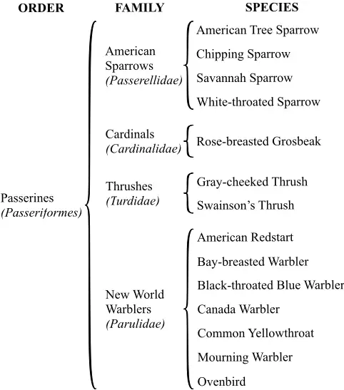

Due to the varying distance between the sensor and the source, some of the flight calls are too faint to be confidently labeled in terms of species, even to an expert ear. However, they may be identifiable at a coarser taxonomic level. In those instances, automatic species classifiers can only be evaluated against the human ground truth up to a certain level of granularity [3]. For this reason, we release three variants of the annotation, respectively denoting order, family, and species.

We name BirdVox-296h (or "296h" for short) resulting subset of BirdVox-full-season. For the sake of research reproducibility, we upload BirdVox-296h to Zenodo 3 . To this date, BirdVox296h is the largest open dataset of avian flight calls from an acoustic sensor network with expert species annotation.

## C. Data curation: BirdVox-full-night and 222k datasets

We train BirdVoxDetect, or BVD for short, on a new dataset of 222k audio clips for species-agnostic flight call detection, which is derived from the BirdVox-full-night dataset. BirdVoxfull-night (or "full-night" for short) comprises 62 hours of audio in total, as recorded on the night of September 23rd, 2017 by six different sensors. This night corresponds to a time of peak migration over the acoustic sensor network, as made evident by radar imagery [4]. In 2017, an expert ornithologist (AF of the authors) spent 102 hours annotating each of these six recordings and found 35k flight calls from passeriformes.

To make BirdVox-222k (or "222k" for short), we extract 35k audio clips from full-night, each lasting two seconds and centered around one annotated flight call. We group these 35k audio clips into 352 segments, each of them of size 100, according to their spatiotemporal contiguity in the sensor network. Then, we run a pretrained flight call detector on BirdVox-full-night: this detector combines spherical kmeans (SKM) and a support vector machine (SVM). Two previous studies [5], [2] have shown that this detector achieves competitive flight call detection results in the "shallow learning" category, as opposed to deep learning. We use the false alarms of this shallow detector as a source of challenging negatives for the spatiotemporal region corresponding to each segment. By design, the negative-to-positive ratio varies between 1 and 9 depending on the segment, but is always integer.

Furthermore, we count the spatiotemporal temporal distribution of flight calls per sensor location and per two-hour segment within the full night. Following this coarse spatiotemporal estimate, we extract audio clips at random within the time regions containing no flight calls. Combining the 35k positive clips (centered around one flight call) and the 187k negative clips (containing no flight call) yields the 222k dataset.

We divide 222k into a training set and a validation set, following a 85% / 15% random partition. Contrary to prior research on full-night, we do not perform "leave-one-sensorout" cross-validation but a simple shuffle split without regard for sensor location. Indeed, in this article, we are not primarily interested in the generalization ability of BVD from one sensor to another but from one night of audio acquisition (full-night) to several months (full-season). The training subset of 222k amounts to 299 segments or 189k samples.

## D. Data curation: BirdVox-ANAFCC-v2 dataset

An expert ornithologist (AF of the authors) verified and re-annotated each clip and aligned each flight call precisely at the center of its corresponding clip. We map the resulting annotations onto our taxonomy as shown in Figure 1. This new version of ANAFCC, v2.0, contains additional flight calls from full-night which did not appear in v1.0 release 4 .

In order to better match our heterogeneous development set to data found in realistic acoustic monitoring scenarios, we create training and validation subsets by finding a suitable partition of the ANAFCC-v2 data sources that is appropriately sized and have species distributions similar to that of the 296h dataset. To do this, we first pose the task of allocating data sources to the validation set as a knapsack problem [6] where we treat individual data sources as items. In the case of fullnight we also treat clips from different recording units as separate sources. Each item has a weight corresponding to the number of annotated audio clips from the data source contains. We set the knapsack size according to our desired validation set size and the find the optimal knapsack using the dynamic programming algorithm implemented in Google OR-Tools [7]. We obtain optimal knapsacks for knapsack sizes corresponding to between 15-30% of the total number of examples, giving us a candidate set of appropriately sized validation subsets.

Given the data sources of a validation subset, we map all to the corresponding training subset. Finally, from this set of appropriately sized candidate partitions, we select the partition where the species distribution of both subsets are most similar to that of 296h. More precisely, we choose the partition with the lowest average Jensen-Shannon divergence between the species distributions of the split subsets and 296h.

## II. SUPPLEMENTARY FIGURES

Figure 1 shows the taxonomy of labels in the 296h dataset. Figure 2 shows a map of sensor locations in the full-season dataset, with total duration of available audio per sensor. Figure 3 shows a calendar of recordings with uptime and audible sensor faults, as predicted by BirdVoxDetect. Figure 4 shows a functional diagram of our proposed convolutional neural network (convnet) for flight call detection.

## REFERENCES

- [1] K. Electronics, "Ek-23132-000x specification sheet," https://www.mouser. fr/datasheet/2/218/ek 23132 000-2526949.pdf, 2006.
- [2] V. Lostanlen, J. Salamon, A. Farnsworth, S. Kelling, and J. P. Bello, "Birdvox-full-night: a dataset and benchmark for avian flight call detection," in Proceedings of the Conference on Acoustics, Speech, and Signal Processing (ICASSP). IEEE, 2018, pp. 266-270.
- [3] M. Cartwright, A. E. M. Mendez, J. Cramer, V. Lostanlen, G. Dove, H.-H. Wu, J. Salamon, O. Nov, and J. Bello, "Sonyc urban sound tagging (sonycust): A multilabel dataset from an urban acoustic sensor network," in Proceedings of the International Workshop on Detection and Classification of Acoustic Scenes and Events (DCASE), 2019.
- [4] B. M. Van Doren, V. Lostanlen, A. Cramer, J. Salamon, A. Dokter, S. Kelling, J. P. Bello, and A. Farnsworth, "Automated acoustic monitoring captures timing and intensity of bird migration," Journal of Applied Ecology, 2022.
- [5] J. Salamon, J. P. Bello, A. Farnsworth, and S. Kelling, "Fusing shallow and deep learning for bioacoustic bird species classification," in Proceedings of the International Conference on Acoustics, Speech, and Signal Processing (ICASSP). IEEE, 2017, pp. 141-145.
- [6] S. Martello, "Knapsack problems: algorithms and computer implementations," Wiley-Interscience Series in Discrete Mathematics and Optimization, 1990.
- [7] L. Perron and V. Furnon, "OR-Tools," Google, 2019. [Online]. Available: https://developers.google.com/optimization/

den-Road-

Figure 2: Map of sensor locations in the full-season dataset. The map shows the surroundings of Ithaca, NY, USA, over an area of roughly 1.000km 2 , i.e. 40km from West to East and 25km from North to South. The area of each orange dot is proportional to the total duration of available audio in the corresponding sensor.

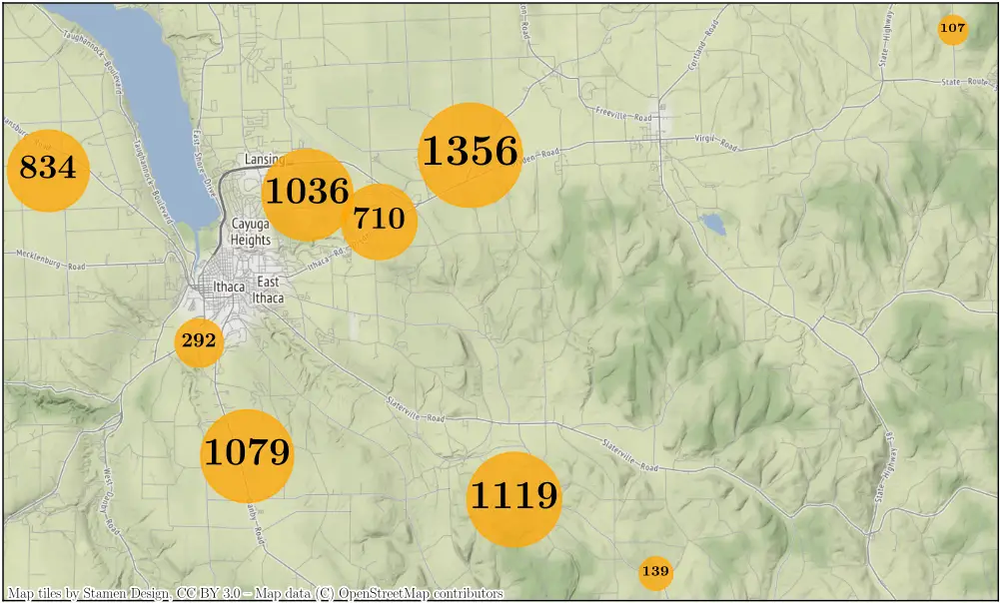

Figure 3: Calendar of recordings in the full-season dataset, organized by month (x-axis) and by uptime (y-axis). Every red (resp. green) rectangle represents a faulty (resp. non-faulty) recording, as determined by our random forest classifier. We observe that sensor faults affect all eight of the nine sensors intermittently and tend to span across consecutive nights.

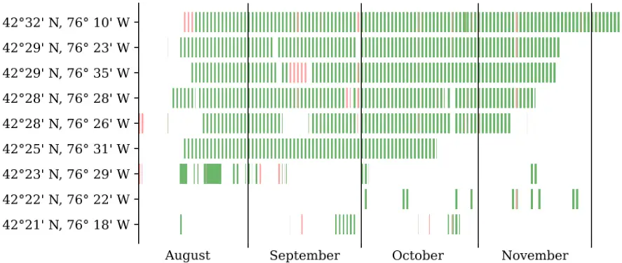

Figure 4: Functional diagram of the convolutional neural network for flight call detection in BirdVoxDetect. Grey tensors represent intermediate computations and blue regions represent receptive fields of convolutional layers.

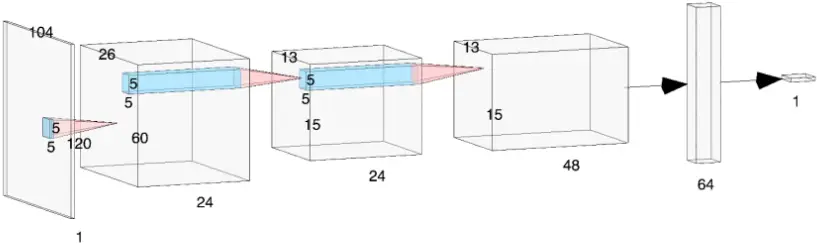
