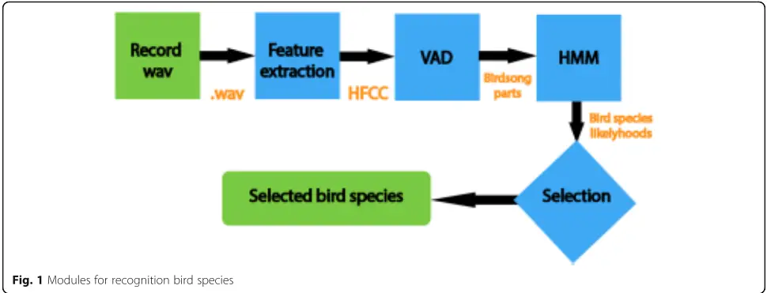
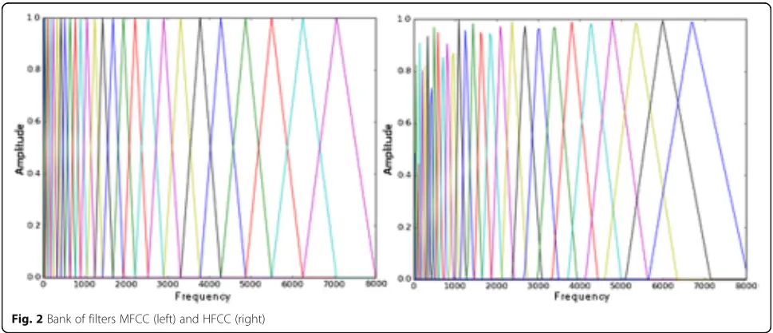
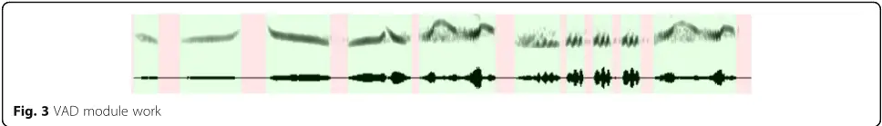
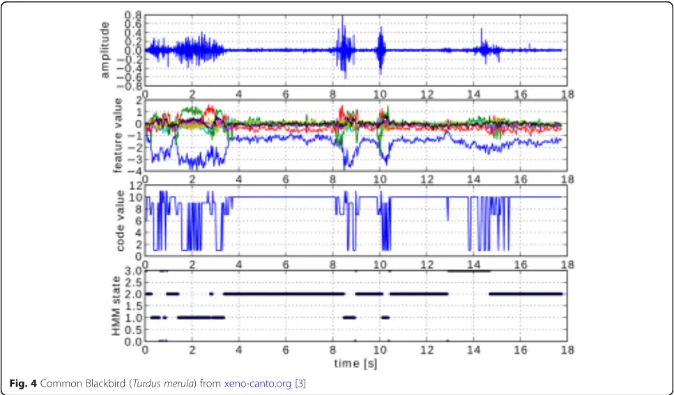
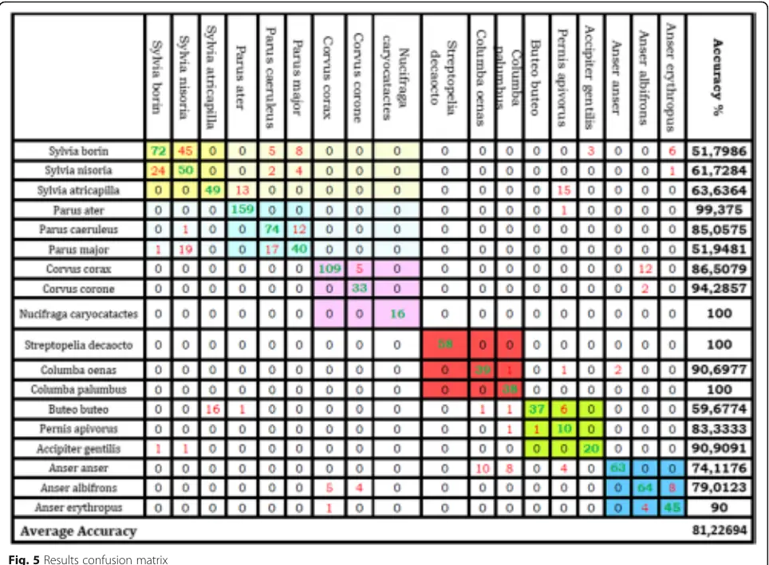

## RESEARCH

Open Access

## Automatic bird species recognition based on birds vocalization

Jiri Stastny 1,2\* , Michal Munk 3 and Lubos Juranek 1

## Abstract

This paper deals with a project of Automatic Bird Species Recognition Based on Bird Vocalization. Eighteen bird species of 6 different families were analyzed. At first, human factor cepstral coefficients representing the given signal were calculated from particular recordings. In the next phase, using the voice activity detection system, segments of bird vocalizations were detected from which a likelihood rate, with which the given code value corresponds to the given model, was calculated using individual hidden Markov models. For each bird species, just one respective hidden Markov model was trained. The interspecific success of 81.2% has been reached. For classification into families, the success has reached 90.45%.

Keywords: HFCC, VAD, kNN, HMM, Bird species recognition, Birdsong recognition, Classification

## 1 Introduction

When solving tasks of the bird vocalization automatic recognition, knowledge obtained during speech recognition research is the groundwork. The bird vocalization recognition and speech recognition are similar tasks to a large extent. In both of them, several basic problems need to be solved. As mentioned in the work [1] on human speech recognition, this is an interdisciplinary field in which findings from several scientific disciplines combine, such as physiology, acoustics, and signal processing. For the bird vocalization recognition, we also use knowledge of the vocalization production process on the basis of the voice organ physiology. We also take into account an acoustic nonlinearity of hearing the birds and try to extract key characteristics for the bird vocalization description and modeling through an appropriate parameterization method. Besides a properly chosen parameterization method, in both the cases, we have to cope with a noise in recordings and with a variety of human speech, or bird vocalization.

Birds interchange a variety of information through each vocal expression. Through the so-called calls, which we can hear more often, birds can transmit various warnings about a danger approaching, identify

[\* Correspondence: stastny@fme.vutbr.cz](mailto:stastny@fme.vutbr.cz)

1 Department of Informatics, Mendel University in Brno, Brno, Czech Republic

2 Department of Automation and Computer Science, Brno University of

Technology, Brno, Czech Republic

Full list of author information is available at the end of the article

Springer Open individuals in a flock, demarcate and keep territories, etc. The call character indicates that these are rather shorter and more efficient vocal expressions.

Bird songs are another type of the bird vocal expression. For most of the species, they cannot be heard for all the year round. Most frequently, they are produced by male birds in order to indicate a territory takeover and to call females at the beginning of a nesting period. In general, a song is a more complex vocal expression and longer in time duration than a call.

## 1.1 Related works

In literature [2], the author focused on recognition of particular bird individuals, who would not have to be subjected to catching and ringing. The applied Gaussian mixture model (GMM)-based system reached 88% success of data, which was described as high quality.

A hidden Markov model (HMM)-based system represents a bird species recognition experiment focused in a different way. Mel-frequency cepstrum coefficients (MFCCs) were chosen as feature vectors and a data set includes recordings of four different bird species (common blackbird (Turdus merula), common chiffchaff (Phylloscopus collybita), western jackdaw (Corvus monedula), and common raven (Corvus corax)). A difference consists mainly in the use of a large quantity of untreated and noised recordings from a portal xeno-canto.org [3]. The system also works with complete recordings, without the voice activity detection (VAD) module, and reaches 65% classification success [4].

Among research works abroad, the interesting work [5] compared MFCCs and human factor cepstral coefficients (HFCCs) for bird species recognition. For evaluation, recordings of five different species were used, from which bird vocalization parts were chosen using a simple VAD system. The results imply an improvement of classification success almost by 10% when using HFCCs and a hypercardioid microphone. When using HFCCs and a cardioid microphone, the improvement is by about 1%. On average, the total success for classification of five different species is 85% when using MFCCs and 90% when using HFCCs.

In [6], the authors tested application of a completely different approach. In their research, they focused on syllables as basic structural units of bird vocalization. The classification success ranged between 76 and 80%.

In the work from Briggs et al. [7], 1 several different approaches for classification of six bird species are compared. These are three different types of feature vectors. These are average values of mean frequency and bandwidth, spectrum density, and MFCC. The very classification is performed through k-nearest neighbors (kNN) algorithm with several different metrics for evaluation of distances and support vector machine (SVM) algorithm. The achieved success ranges from 42.8 to 92.5%.

## 1.2 Used data

The recordings used are taken from the PELZ BIOPHON commercial edition CD carriers [8]. The recordings include various types of voice expressions (various calls and songs) of various individuals, which were recorded in their natural environment. Some recordings include also other undesirable noises, above all vocalization of other bird species.

Table 1 Selected bird species used for classification

| Latin name              | Eng. name                   | Family       | Order                           |
| ----------------------- | --------------------------- | ------------ | ------------------------------- |
| Sylvia borin            | Garden warbler              | Sylviidae    | Passeriformes                   |
| Sylvia nisoria          | Barred warbler              |              |                                 |
| Sylvia atricapilla      | Eurasian blackcap           |              |                                 |
| Parus ater              | Coal tit                    | Paridae      |                                 |
| Parus caeruleus         | Eurasian blue tit           |              |                                 |
| Parus major             | Great tit                   |              |                                 |
| Corvus corax            | Common raven                | Corvidae     |                                 |
| Corvus corone           | Carrion crow                |              |                                 |
| Nucifraga caryocatactes | Spotted nutcracker          |              |                                 |
| Streptopelia decaocto   | Eurasian collared dove      | Columbidae   | Columbiformes                   |
| Columba oenas           | Stock dove                  |              |                                 |
| Columba palumbus        | Common wood pigeon          |              |                                 |
| Buteo buteo             | Common buzzard              | Accipitridae | Falconiformes (Accipitriformes) |
| Pernis apivorus         | European honey buzzard      |              |                                 |
| Accipiter gentilis      | Northern goshawk            |              |                                 |
| Anser anser             | Greylag goose               | Anatidae     | Anseriformes                    |
| Anser albifrons         | Greater white-fronted Goose |              |                                 |
| Anser erythropus        | Lesser white-fronted Goose  |              |                                 |

In total, we have selected 18 different bird species from 6 different families and 4 different orders. The particular species are shown in Table 1:

Regarding the use of supervised learning algorithms, data labels were necessary to be provided in next steps. For this reason, manual evaluation of recordings was performed. Recordings were manually divided into bird vocalization segments and segments containing other noises or silence. Vocalization covered 41.37% of the total length of the recordings.

## 2 Methods

The system comprises several independent modules (Fig. 1), the first of which is the feature extraction from a signal. A wav format recording enters this module; the recording is divided into individual 15-ms-long frames. A 13-dimensional vector representing the given frame is calculated for each frame.

Using the VAD module, only frames which were evaluated as vocalization are selected. A sequence of frames with bird vocalization forms code values of various lengths. The remaining parts of the recording are not used for processing anymore. This part is important for increasing the recognition accuracy, using HMM [4].

Afterwards, likelihood for each trained HMM model is calculated for each code value. In the last phase, such a model is selected that generates the highest likelihood rate for the given code value.

## 2.1 Feature extraction

For human speech recognition, a short-term analysis method is often used, when a signal is divided into very short segments where the signal is stationary. In the next analysis, only these microsegments are processed.

Sound production in birds is very similar as in humans [9]. The resulting signal is a convolution of the base signal, which is modulated by the vocal organ. For recognition purposes, deconvolution is performed and we further work only with the vocal organ function. In the convolution, the base signal is highly dependent on the particular individual [1].

For human speech, used for the common communication, the frequency range is 180 Hz-6 kHz [1]. For bird vocalization, the most frequently used frequencies range from 0.5 to 6 kHz [2]. On this assumption, we further use methods for human speech processing.

One of the most frequently used approaches is the MFCC calculation for each recording frame. During the calculation, nonlinearity of human hearing has also made provision for by nonlinearly placed triangular filters. A bank of filters for MFCCs only partly reflects nonlinearity of human hearing. It does not respect exact boundaries of critical bands, as described, e.g., in [10]. Therefore, the so-called HFCCs were formed, the calculation of which differs from MFCCs only in the used bank of filters (see Fig. 2). The calculation procedure for these coefficients can be found, e.g., in [11]. In this paper, HFCCs are used to catch key characteristics of bird vocalizations.

## 2.2 VAD

In the VAD module (see Fig. 3), frames are classified into two classes, voices and nonvoices (silence, engine sound, human voice, cough, microphone cracking, etc.). This way, sequences of frames of various lengths evaluated as voices are formed. Frames classified as voices enter further processing; the rest of the frames are not processed anymore.

The VAD system is based on a k-NN algorithm. The basic problem for this algorithm is optimal setting of k parameter (number of neighbors). For this purpose, a procedure described in [12] using a value called degrees of freedom was used. The highest classification accuracy of 90.48% (calculated through a cross-validation method) was achieved for k = 189. For distance evaluation, the Euclidean metrics with constant weights was chosen.

## 2.3 HMM

A motivation for the use of HMMs for recognition of a speaker is a presupposition that a voice organ for each voice microsegment occurs in one of a finite number of states and during voice production the voice organ passes between these states [10]. Regarding similarity of the voice production process in human and bird voice organ, we can implement this presupposition also into bird vocalization recognition tasks.

For bird species recognition, we come out from speaker recognition tasks again. To be specific, the basis is a modification of a speaker identification task in the closed-set open-dictionary identification, where the speaker is replaced by a particular bird species. For this task, we presume that the proposed code value on the input belongs always to one of the trained models (closed-set). The very recognition does not depend on the vocalization type, too, but only on key characteristics of a particular bird species (spectral features), therefore we can talk about an open-dictionary.

For the short-term analysis of bird songs, we come out from a presupposition that owing to indispensable weight of voice organs, in each time moment an individual produces sounds which are modeled as the so-called code value of HMM. States of the Markov model cannot be observed directly, but their alternating can be considered on the basis of a code value sequence.

A motivation for the HMM choice is above all robustness in length (time) variability of input code values.

Then, for each bird species, one ergodic HMM model with six hidden states (found experimentally) is trained, generating likelihood value for the particular presented code values. The model generating the highest likelihood is then chosen as a winning one.

A display of processing of a part of features using a self-organizing map (SOM) and HMM (see Fig. 4). A different configuration is used here, which was also tested (recording from xeno-canto.org [3], 13 features reduced to 6 features, 4 states of HMM). HMM in each state produces with a certain probability a code value, thus we can say that an input for HMM training is a sequence of these one-dimensional data, the code value. The question then arises, how to transform 13-dimensional HFCC/MFCC into a sequence of 1-dimensional code values. In this task, we have tested clustering using k-means method and also SOM, which has an advantage in "orderliness" 2 of resulting marking of clusters. This way, the 13-dimensional combination of MFCCs (see Fig. 4 "feature value") was marked with a particular code ("code value"). A sequence of these codes was then used as an HMM input.

Table 2 Classification success, according to families

| Family       | Success % |
| ------------ | --------- |
| Sylviidae    | 91.76     |
| Paridae      | 86.15     |
| Corvidae     | 86.89     |
| Columbidae   | 100       |
| Accipitridae | 84.52     |
| Anatidae     | 93.4      |
| Mean         | 90.45     |

## 3 Results and discussion

The detailed results of the classification of the particular code values for all the models can be found in Fig. 5. For each species, one recording of a different length with various numbers of code values has been used. The values on the diagonal determine the number of the properly classified code values.

The results were obtained through a method of cross-validation across all data using a following process:

1. We have selected a testing code value.
2. We have trained all models and extracted testing data from the training data.
3. We have calculated the testing data likelihood value for each model.
4. The highest likelihood value model has been determined a "winner."

The values in a line show a bird to which the tested code value belongs. The values in a column show a bird to which the code value has been really assigned. This way, a number and a type of particular errors can be found out, which includes a lot of information advisable for a further system analysis.

The confusion matrix in Fig. 5 also shows similarities between individual species. Besides the individual bird species recognition, our aim has also been to detect similarities of birds of the same family or order. These similarities can be seen in the color squares in the confusion matrix, which associate the same family birds (deeper color/diagonal threesomes) and the same order (pale color threesomes). In case the model made a wrong recognition, most frequently the bird was confused for another species of the same family. In addition, it is also possible to find similarities in order assignation for Passeriformes order, particularly for the Sylviidae family and Paridae family. The system could be further made more accurate, if we trained models for particular families first and then recognized for a smaller number of a particular species of this family.

The total achieved success (just above 80%) is highly negatively influenced by interspecific similarity of birds in the same family, above all in the Sylviidae family. Most of the errors are cumulated into specific cases. For example, the Buteo buteo and Sylvia antricapilla confusion (16 errors), Sylvia antricapilla and Pernis apivorus (15 errors), etc. Many items in the confusion matrix have a zero value otherwise.

Table 2 shows the classification success, according to families.

## 4 Conclusions

In the above described experiment, we show the automatic classification of vocalization of 18 bird species using the VAD module for the detection of vocalization segments in recordings. HFCCs are used as features describing time frames (25 ms). These coefficients are further transformed into a one-dimensional sequence of a code value, for which various HMMs are trained (one model for each species). The interspecific success of 81.2% has been reached. For classification into families, the success has reached 90.45%. The works mentioned in Section 1.1 work only with a relatively small set of recognized species (&lt; 10), resulting in a lower error rate of recognition in these experiments.

Determination of classification of a code value of a particular bird species implemented by us is based solely on the maximum likelihood value selection. Another improvement would be an approach taking into account also results from other models and implementing the results in the final determination. For example, if the highest likelihood for the greater white-fronted goose was produced by the common raven model, but we have got quite high likelihood values for all geese models at the same time, probably this is a goose.

The experiment's success depends on the input data quality and processing to a great extent. Further possible improvement can be achieved by making segmentation (voice-nonvoice) of the used recordings more fine (granular), dividing the recordings to the "syllables" level. Another appropriate method for bird sound recognition could be using of deep neural network, and there are many DNN models that can be applied [13-15].

## 5 Endnotes

1 The work has been elaborated under the patronage of Cornell Lab of Ornithology (http://www.birds.cornell.edu/)

2 Clusters marked e.g. 1 and 2 represent more similar data than e.g. cluster 1 and 10.

## Abbreviations

GMM: Gaussian mixture models; HFCC: Human factor cepstral coefficients; HMM: Hidden Markov model; kNN: k-Nearest neighbors; MFCC: Melfrequency cepstrum coefficients; SOM: Self-organizing map; SVM: Support vector machine; VAD: Voice activity detection

## Acknowledgements

Not applicable.

## Funding

Not applicable.

## Availability of data and materials

The used recordings are taken from the PELZ BIOPHON commercial edition CD carriers [8] and portal xeno-canto.org portal [3].

## Authors' contributions

All authors read and approved the final manuscript.

## Ethics approval

Not applicable.

## Consent for publication

Not applicable.

## Competing interests

The authors declare that they have no competing interests.

## Publisher's Note

Springer Nature remains neutral with regard to jurisdictional claims in published maps and institutional affiliations.

## Author details

1 Department of Informatics, Mendel University in Brno, Brno, Czech Republic. 2 Department of Automation and Computer Science, Brno University of Technology, Brno, Czech Republic. 3 Faculty of Natural Sciences, Constantine Philosopher University in Nitra, Nitra, Slovakia.

## Received: 12 October 2017 Accepted: 25 November 2018

## References

1. J Černocký, Zpracování řečových signálů (2006). http://www.fit.vutbr.cz/ study/courses/ZRE/public/opora/zre_opora.pdf. Accessed 11 Apr 2014.
2. L Ptáček, Birds individual automatic recognition, dissertation, University of West Bohemia, 2012.
3. Sharing bird sounds from around the world. http://xeno-canto.org. Accessed 9 Jul 2017.
4. J Šťastný, V Škorpil, J Fejfar, Audio data classification by means of new algorithms, in Proceedings of the 36th International conference on telecommunications and signal processing, Rome, 2013.
5. R Wielgat, et al., HFCC based recognition of bird species, in Signal Processing Algorithms, Architectures, Arrangements and Applications, Poznań, 2007.
6. Somervuo, P., &amp; Härmä, A. (2004). Bird song recognition based on syllable pair histograms. Montreal: Proceedings of the IEEE International Conference on Acoustics, Speech, and Signal Processing.
7. Briggs, F., Raich, R., &amp; Fern, X. Z. (2009). Audio classification of bird species: a statistical manifold approach. Miami: Proceedings of the Ninth IEEE International Conference on Data Mining.
8. ČSO, Biophon edition. https://www.birdlife.cz/. Accessed 9 Jul 2017.
9. S Fagerlund, Automatic recognition of bird species by their sounds, Master's thesis, Helsinky Univerzity of Technology, 2004.
10. Psutka, J., Müller, L., Matoušek, J., &amp; Radová, V. (2006). Mluvíme s počítačem česky, 1st edn. Prague: Academia.
11. Skowronski, M., &amp; Harris, J. (2002). Human factor cepstral coefficients. Cancun: Proceedings of the Acoustical Society of America First Pan-American/Iberian Meeting on Acoustics.
12. Hastie, T., Tibshirani, R., &amp; Friedman, J. (2009). The elements of statistical learning: data mining, inference, and prediction, 2nd edn. New York: Springer-Verlag.
13. H, Y., et al. (2018). Spoofing detection in automatic speaker verification systems using DNN classifiers and dynamic acoustic features. IEEE Transactions on Neural Networks Learning Systems, 29(10) 4633-4644.
14. H, Y., et al. (2017). DNN filter bank cepstral coefficients for spoofing detection. IEEE Access, 5, 4779-4787.
15. H Yu, et al., Adversarial network bottleneck features for noise robust speaker verification. arXiv preprint arXiv:1706.03397, 2017.

## Submit your manuscript to a SpringerOpen 0 journal and benefit from:

- Convenient online submission
- Rigorous peer review
- Open access: articles freely available online
- High visibility within the field
- Retaining the copyright to your article

Submit your next manuscript at springeropen.com
