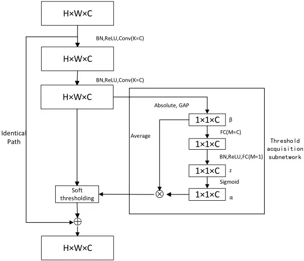
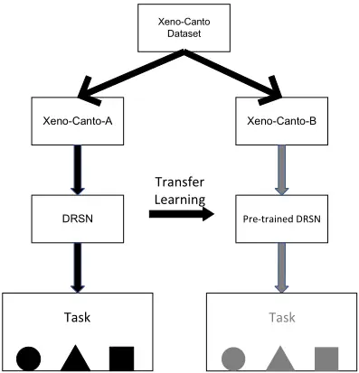
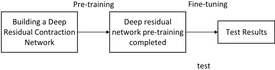
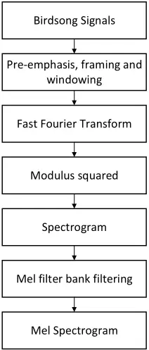
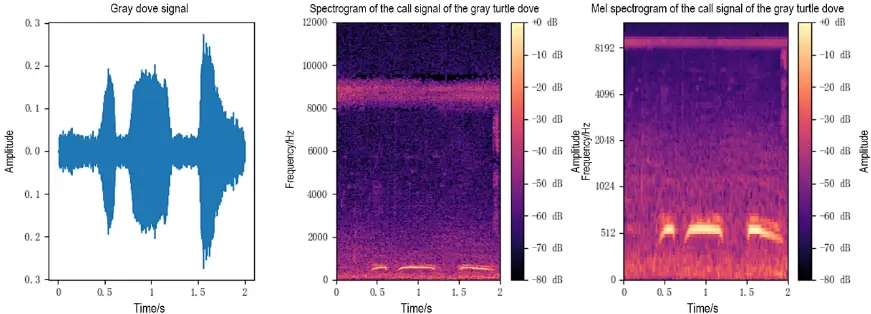
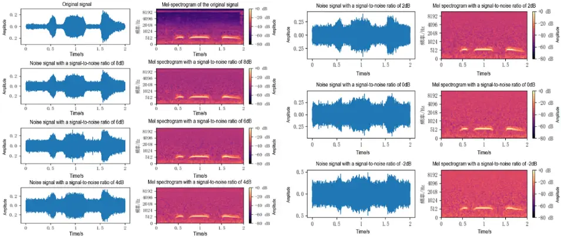
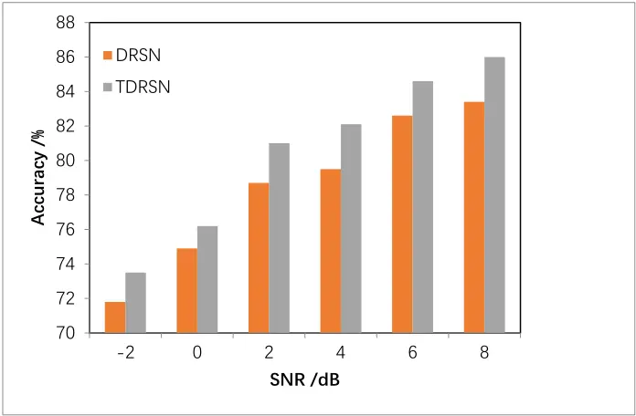

https://www.aimspress.com/journal/ERA

ERA, 33(7): 4135-4150.

DOI: 10.3934/era.2025185

Received: 10 March 2025

Revised: 26 June 2025

Accepted: 01 July 2025

Published: 04 July 2025

## Research article

## A transfer deep residual shrinkage network for bird sound recognition

## Xiao Chen 1,2, \*, Zhaoyou Zeng 1 and Tong Xu 1

- 1 School of Electronic and Information Engineering, Nanjing University of Information Science and Technology, Nanjing 210044, China
- 2 Jiangsu Collaborative Innovation Center of Atmospheric Environment and Equipment Technology, Nanjing University of Information Science and Technology, Nanjing 210044, China

* Correspondence: Email: chenxiao@nuist.edu.cn.

Abstract: Bird sound recognition has important applications in bird monitoring and ecological protection. However, in complicated environments, noise and insufficient sample data are the major factors affecting recognition accuracy. We proposed a bird sound recognition method based on a developed transfer deep residual shrinkage network. First, a deep residual shrinkage network with noise resistance was constructed based on the structural characteristics of the residual shrinkage module, multi-scale operations, and the characteristics of bird sound Mel spectrograms. Then, the deep residual shrinkage network was pre-trained using a bird sound dataset, applying an unfreezing finetuning strategy, to mitigate the impact of insufficient training data. A transfer learning alleviated the problem of data scarcity by utilizing pre-trained models, while the deep residual shrinkage network enhanced the performance of the model in a noisy environment by optimizing the network structure. Experimental results showed that this method achieves high recognition accuracy under noise and small data sets. It has advantages over the compared methods and is suitable for ecological monitoring fields such as bird population monitoring. The method has good application prospects.

Keywords: bioacoustics; bird sound recognition; audio signal processing; machine learning; deep learning; transfer learning; deep residual shrinkage network; ecological monitoring

## 1. Introduction

As an important part of the ecosystem, birds play a vital role in maintaining ecological balance and promoting biodiversity [1,2]. Bird sound, as the main way of communication, reflects the species, activity status, and habitat of birds. With the increasing demand for bird monitoring, previous bird monitoring methods, such as manual observation and infrared camera monitoring, have problems such as high costs, low monitoring efficiency, and data lag. Automatic recognition methods based on bird sounds have become a hot research topic. It can monitor the species and number of birds efficiently with low cost, especially in complex ecological environments.

With the outstanding performance of deep learning [3-6], researchers have drawn on deep learning methods to process bird sounds. Sprengel constructed a convolutional neural network suitable for birdsong recognition using five convolutional layers and extracted spectrograms from birdsong signals [7]. Rajan extracted Mel spectrograms from birdsong signals and input them into Visual Geometry Group Network (VGGNet). Based on the Xeno-Canto dataset, the researchers achieved an average F1 score of 0.65 [8]. Saad used ResNet50 and MobileNetv1 as birdsong classification and recognition models, and extracted STFT (short-time Fourier transform) spectrograms and MFCC (Mel frequency cepstrum coefficient) from birdsong signals with a duration of 1 second as model inputs. They conducted experiments based on 10 bird song sounds in the Xeno-Canto dataset [9]. However, bird sound recognition technology faces some challenges: First, data in the wild are usually interfered by a lot of background noise; second, the collection of birdsong sample data is often limited by time and space, resulting in insufficient sample data; and finally, existing recognition methods perform poorly when dealing with noisy and small sample data. Many scholars have conducted relevant research. Chen studied a noise-resistant bird sound recognition system based on time-frequency texture features and random forest classifiers, but due to insufficient sample data, the experiment was difficult to carry out on a large scale [10]. Therefore, how to effectively improve recognition accuracy in a noisy environment, solve the problem of data scarcity, and improve the robustness of the model has become an urgent problem to be solved in the field of bird sound recognition.

To address the problem of excessive noise in birdsong signals and insufficient sample data during field monitoring, a transfer deep residual shrinkage network (TDRSN) was proposed for bird sound recognition. By introducing transfer learning and a deep residual shrinkage network, the recognition accuracy and robustness were effectively improved. Transfer learning alleviates the problem of data scarcity by utilizing pre-trained models, while the deep residual shrinkage network enhances the performance of the model in a noisy environment by optimizing the network structure. The TDRSN aims to improve the accuracy of bird sound recognition, especially in the case of noise interference and scarce sample data.

## 2. Transfer deep residual shrinkage network

In TDRSN, first, a deep residual shrinkage network with noise resistance was constructed based on the structural characteristics of the residual shrinkage module, multi-scale operations, and the characteristics of birdsong Mel spectrograms. Then, the deep residual shrinkage network was pretrained using a birdsong dataset, and applying an unfreezing fine-tuning strategy, to mitigate the impact of insufficient training data.

## 2.1. Residual shrinkage module

The residual shrinkage module added a soft threshold processing function and a threshold acquisition subnetwork to a standard residual module, which is the fundamental module for the residual network [11,12]. The network structure is shown in Figure 1. Global average pooling (GAP) represents global average pooling, FC represents the fully connected layer, and each channel is given an independent threshold. BN represents batch normalization, which converts the data into data with a mean of 0 and a variance of 1.

Figure 1. The residual shrinkage module.

The soft threshold processing is a key step in many signal denoising [13-15] and signal processing algorithms [16-18], especially those based on the wavelet transform method [19,20]. Unlike the ReLU (rectified linear unit) activation function [21], which directly sets negative values to zero, soft threshold processing removes noise with amplitude close to zero and retains the feature data of negative values, thereby better retaining the effective signal. The soft threshold function is as follows:

<!-- formula-not-decoded -->

where x is the input feature, y is the output feature, and τ is the threshold. τ is automatically learned through the threshold acquisition sub-network. The process is to take the absolute value of the feature map x, and pass it through GAP, BN (batch normalization), ReLU, and two fully connected layers. The final scaling parameter α was calculated using the Sigmoid function. The Sigmoid function is as follows:

<!-- formula-not-decoded -->

In the formula, z and α are the characteristic and scaling parameters of the neuron, respectively, and the calculation formula of the threshold is as follows:

<!-- formula-not-decoded -->

Here, average( ) represents the average operation.

## 2.2. Mel spectrograms and birdsong signal processing [1]

The Mel spectrogram was calculated using Mel filters. Mel filters were defined as

<!-- formula-not-decoded -->

where m is the filter serial number, M is the number of filters used, H m(k) is the m-th filter in the filter bank, f1 (m), f1 (m-1), and f1 (m+1) are the center frequencies of the m-th, m-1st, m+1 filters in the first filter bank, fs is the sampling frequency, fh is the highest frequency within the frequency range of the sound signal, fl is the lowest frequency within the frequency range of the sound signal, 𝐹ሺ𝑧ሻ ൌ 1127 ∗ 𝑙𝑛ሺ1൅ 𝑧/700ሻ, and 𝐹 ିଵ ሺ𝑧ሻ ൌ 700ሺ𝑒 ௭/ଵଵଶହ െ1ሻ.

In this study, the sampling frequency was 8000 Hz, the minimum signal frequency was 0 Hz, the maximum signal frequency was 4000 Hz, M was 24, and the Fourier transform point number was 1024.

A segment of the original signal was divided into pieces of 25 ms, and the first 5 ms of each piece coincided with the last 5 ms of the last piece. When each piece has N data, it was augmented by

<!-- formula-not-decoded -->

Here, 0 ≤ n ≤ N-1, 𝑑ଵሺ𝑛ሻ is the nth data of the piece (n = 0, 1, 2, ..., N-1), 𝑑ሺ𝑛ሻ is the nth data of the enhanced signal, and n is the serial number of the data.

To gain the frequency, a discrete Fourier transform was used on d,

<!-- formula-not-decoded -->

where, 0 ≤ n ≤ N-1, 0 ≤ k ≤ N-1, i is an imaginary unit, 𝑖 ൌ √െ1, d (n) is the n-th data of the signal, and D (k) is the k-th data of the spectrum of the signal.

The power spectrum P was calculated by

<!-- formula-not-decoded -->

where P (k) represents the k-th data in the power spectrum of the sound signal, 0 ≤ k ≤ N-1.

## 2.3. Deep residual shrinkage network

According to the characteristics of the residual shrinkage module that can highlight both important features and reduce noise, a deep residual shrinkage network (DRSN) suitable for the task of bird sound recognition was constructed. The structure of DRSN is shown in Table 1. The input size of the network was 224-by-224-by-3. Convolution_1 down-sampled the Mel-speech spectrogram of bird sound through convolution with a stride of 2, padding of 3, and 64 convolution kernels. Convolution_2 captured features and noise information of different scales through multi-scale operation. Then, 15 residual shrinkage modules were connected in series to extract deep features of bird sound and reduce noise-related information. Convolution_2 included four branches. The first branch used two 3-by-3 convolution layers to simulate 5-by-5 convolutions, the second branch used 3-by-3 convolutions, the third branch used 3-by-3 pooling, and the fourth branch used 1-by-1 convolution. The stride of various operations in the four branches was 1. Each branch modeled the features and noise information of bird sound through operations of different scales [22]. The input and output sizes of the process of Convolution_3 remained unchanged, and the step size of the first residual shrinkage module in Convolution_4, Convolution_5, and Convolution_6 was 2 to achieve down-sampling of input features. Finally, the network was classified and recognized through Softmax.

Table 1. DRSN structure.

| Layer Name             | parameter                            | Output size    |
| ---------------------- | ------------------------------------ | -------------- |
| Convolution_1          | 7 × 7, S = 2                         | 112 × 112 × 64 |
| Max pooling            | 3 × 3, S = 2                         | 56 × 56 × 64   |
| Convolution_2          | 1×1 1×1 1×1 3×3 3×3 1×1 3×3 Pool 1×1 | 56 × 56 × 64   |
| Convolution_3          | ×2 3×3 3×3 FC 64 FC 64               | 56 × 56 × 64   |
| Convolution_4          | ×4 3×3 3×3 FC 128 FC 128             | 28 × 28 × 128  |
| Convolution_5          | ×6 3×3 3×3 FC 256 FC 256             | 14 × 14 × 256  |
| Convolution_6          | ×3 3×3 3×3 FC 512 FC 512             | 7 × 7 × 512    |
| Global average pooling | 7 × 7                                | 1 × 1 × 512    |
| Classification layer   | 23D                                  | 1 × 1 × 23     |

## 2.4. Transfer learning

Transfer learning [23] is a cross-task domain learning method that aims to efficiently transfer information from the source domain to the target domain. According to the method, transfer learning can be divided into domain adaptation, feature extraction, and fine-tuning methods. In the actual bird sound recognition, it is usually impossible to collect a large number of samples, and fewer samples will lead to poor network training results, and also lead to unsatisfactory recognition results. To solve the above problems, we adopted a transfer learning method based on fine-tuning. The process is shown in Figure 2. The Xeno-Canto dataset was divided into two datasets, Xeno-Canto-A and Xeno-CantoB. Then, the Xeno-Canto-A dataset was used as a pre-training dataset to pre-train the deep residual shrinkage network, and then fine-tuned on the training set divided by the Xeno-Canto-B dataset. The Xeno-Canto-B dataset included Dusky Warbler, Woodlark, Great Cuckoo, Skylark, Eurasian Robin, Wren, Gray Dove, Black Woodpecker, Great Reed Warbler, House Swallow, Jackdaw, Night Heron, Smith's Thrush, House Sparrow, Purple-winged Starling, Hooded Crow, Eurasian Magpie, Wood Warbler, Blue-throated Robin, Ghost Owl, Ochre-tailed Robin, Mute Swan, and Red-collared Green Parrot. The fine-tuning-based transfer learning method unfroze some layers of the pre-trained model. The parameters of these unfrozen layers can be fixed or fully unfrozen to meet the needs of specific tasks. Fine-tuning learning allows the use of common features of pre-trained models, speeding up the training process while reducing the risk of overfitting on the target task, especially when the amount of data is small.

Figure 2. Transfer learning based on fine-tuning.

## 2.5. The framework of TDRSN

Different from the traditional fine-tuning transfer learning method, by training on the source domain, the model can learn the audio features in the dataset. These features are not only highly versatile, but also can effectively capture low-level features (such as frequency and amplitude) and high-level features (such as audio mode, timbre, etc.) in audio data. The purpose of this stage is to

initialize the parameters of the network through transfer learning so that the model can converge quickly in the target task with less training data.

After completing the pre-training, we migrated the pre-trained model to the Xeno-Canto-B dataset and fine-tuned it on its training set. The key to the fine-tuning stage is to refine the pre-trained model to adapt to the specific tasks and data distribution of the Xeno-Canto-B dataset. During the fine-tuning process, the parameters of the low-level network were usually frozen because the low-level features (such as the fundamental frequency and amplitude of the audio) have good versatility in the source and target tasks, while the high-level network will be adjusted according to the needs of the target task. However, the target task and the source task in this study were the same. Therefore, not freezing the low-level parameters and enabling them to be fine-tuned according to the target task can make the model better adapt to the details of the target task, thereby improving performance. This strategy enables the target task to be effectively trained in a short time, avoiding the huge computational overhead of training from scratch.

By combining transfer learning with deep residual shrinkage network, we effectively utilized the Xeno-Canto-A dataset, reduced the demand for the dataset, and improved the generalization ability of the model. Transfer learning can significantly reduce the target task dependence on a large amount of labeled data, while the residual connection structure of the deep residual shrinkage network ensured that the gradient was effectively propagated in the deep network, avoiding the gradient vanishing problem. This combination not only sped up the training process of the target task, but also improved the model's robustness to noise and feature extraction capabilities.

Table 2. Class and quantity of birds.

| Class              | quantity | type                   | quantity |
| ------------------ | -------- | ---------------------- | -------- |
| Dark Green Warbler | 866      | Smith's Night Thrush   | 816      |
| Lin Bailing        | 833      | House Sparrow          | 1053     |
| Rhododendron       | 1004     | Purple-winged Starling | 861      |
| lark               | 861      | Hooded Crow            | 879      |
| Eurasian Robin     | 788      | Eurasian magpie        | 821      |
| Wren               | 917      | Lin Liuying            | 898      |
| Gray dove          | 935      | Bluethroat Robin       | 851      |
| Black Woodpecker   | 791      | Ghost Owl              | 825      |
| Great Reed Warbler | 913      | Ochre Redstart         | 916      |
| swallow            | 997      | Mute swan              | 833      |
| Jackdaw            | 847      | Red collared parrot    | 804      |
| Night Heron        | 1098     |                        |          |

## 3. Experiments

## 3.1. Dataset

The birdsong datasets used in the experiments of this study are all from the Xeno-Canto world wild bird sound public dataset (https://xeno-canto.org/). Xeno-Canto dataset is a large-scale bird song dataset, in which all audio data is recorded and uploaded by various public welfare organizations and bird enthusiasts around the world using professional equipment in natural environments such as forests, grasslands, wetlands, and lakes. These audio data are unprocessed, contain environmental noise, and have different durations. Experimental testing using this dataset can more accurately reflect the recognition performance of bird song recognition methods in natural environments. Due to its high audio quality and easy access, many bird song researchers both domestically and internationally have chosen this dataset as their experimental dataset.

When applying transfer learning, the dataset was first divided into two subsets: Xeno-Canto-A and Xeno-Canto-B. The Xeno-Canto-A dataset was used as the source domain to pre-train the DRSN. After completing the pre-training, we migrated the pre-trained model to the Xeno-Canto-B dataset and the fine-tuned model. The class distribution is shown in Table 2.

## 3.2. Experimental setting

The experiments were conducted under the Ubuntu operating system, and the GPU model of the hardware device was NVIDIA RTX 2080Ti, the network model was built using the TensorFlow framework, and the programming language was Python. The test process of the method in this study is shown in Figure 3. First, a DRCN was built according to the description of this study, and then the Mel spectrogram extracted from the Xeno-Canto-A dataset was input into the network for pre-training. After the pre-training was completed, no layer of the network was frozen, and then the network was fine-tuned using the divided training set, and the initial learning rate was set to 0.0001. Except for the comparative experiment based on the sub-dataset, other experiments were carried out using a five-fold cross-validation method, and the five sample groups were named A, B, C, D, and E. In order to analyze the TDRSN from multiple aspects, 4 experiments were set up to verify the method in this study. The four experiments focused on effectiveness experiments, comparative experiments with different acoustic features, noise experiments, and comparative experiments with other methods. In the four experiments, except for the comparative experiments of different acoustic features, the network input features of the other experiments were all Mel spectrograms. The confidence level was 95%.

Figure 3. Test processing.

## 3.3. Evaluation metrics

Accuracy and F1-score were used to evaluate the recognition performance of a method. In binary classification tasks, the calculation of accuracy and F1-score involved four sample categories. The first category was called True Positive (TP) with a true category of 1 and a predicted category of 1. The second category was called True Negative (TN) with a true category of 0 and a predicted category of 0. The third category was called False Positive (FP) with a true category of 0 and a predicted category of 1. The fourth category was called False Negative (FN) with a true category of 1 and a

predicted category of 0.

The accuracy represents the proportion of correctly predicted samples to the total number of samples. The calculation formula is

<!-- formula-not-decoded -->

The F1-score evaluation for imbalanced classification tasks is more reliable because it strikes a balance between accuracy and recall. The calculation formula is

<!-- formula-not-decoded -->

## 4. Results and discussion

To explore the influence of different acoustic features on the recognition effect of the TDRSN method, the spectrogram and Mel spectrogram were used as network inputs, respectively, and experiments were first conducted based on the Xeno-Canto-B dataset. The extraction process of the spectrogram and the Mel spectrogram was similar. The extraction process of the two acoustic features is shown in Figure 4. Taking the gray dove as an example, the spectrogram of the gray dove sound and its Mel spectrogram are shown in Figure 5. The experiment first extracted spectrograms and Mel spectrograms from the Xeno-Canto-A dataset and the Xeno-Canto-B dataset, respectively, and then pre-trained the network using the bird sound features extracted from the Xeno-CantoA dataset. After the pre-training was completed, no layer of the network was frozen, and the network was fine-tuned using the training set divided by the Xeno-Canto-B dataset. The experimental results are shown in Table 3. From the experimental results, we found that the accuracy of the Mel-spectrogram was higher than that of the spectrogram. This was because the frequency resolution allocation methods of the Melspectrogram and the spectrogram are relatively different. The frequency resolution of the spectrogram is uniform in each frequency band, while the Mel-spectrogram, based on the spectrogram, readjusts the frequency axis and allocates higher frequency resolution to the lower frequency part, while the energy of the birdsongs is mainly distributed in the low-frequency part. All the following experiments used a Mel spectrogram.

Table 3. Comparative experimental results of different acoustic characteristics.

| Acoustic characteristics | Accuracy (%) |
| ------------------------ | ------------ |
| Spectrogram              | 86.38        |
| Mel Spectrogram          | 87.51        |

To evaluate the performance of the TDRSN and verify its effectiveness, it was experimented with based on the Xeno-Canto-B dataset. The accuracy and F1-score were used to evaluate the recognition performance. The average F1-score values of bird sound recognition are shown in Table 4, and the accuracy is shown in Table 5. The experimental results showed that in the 5 tests, the average F1-score of 23 bird songs was not less than 0.7844, of which the average F1-score of 22 bird calls was higher than 0.8, and the average F1-score of 6 bird calls was higher than 0.9. The average accuracy rate reached 87.51%, which showed that the TDRSN method could identify bird songs more efficiently.

Figure 4. Extraction process of two acoustic features.

Figure 5. The sound of a gray dove and its two acoustic characteristics.

Birdsong signals collected in natural environments usually carry environmental noise of varying sizes. To test the recognition effect of the designed method in this study in noises of different intensities, an anti-noise experiment was designed based on the Xeno-Canto-B dataset. We first added Gaussian white noise of different intensities to all bird sound signals in the Xeno-Canto-B dataset to control the signal-to-noise ratio (SNR), then extracted the Mel spectrograms from the bird sound signals with added noise, and finally input these Mel spectrograms into the network for training and testing. Taking the gray dove as an example, the gray dove sound signals with different SNRs and their Mel spectrograms are shown in Figure 6. From the first sub-image, it can be seen that, although the original gray dove sound signal contained a certain amount of noise, the noise energy was small, so the Mel spectrogram had more obvious features near 500 Hz. As the signal-to-noise ratio decreased, the brightness and darkness difference of the Mel spectrogram at different positions gradually decreased, and the texture of the sound features became blurred, which increased the difficulty of network classification and recognition of bird sounds. We tested the recognition effects of two methods under six different signal-to-noise ratios, namely, improved DRSN and the TDRSN. The experimental results are shown in Figure 7. From the experimental results, with the decrease of the SNR, the accuracy of both methods decreased. Under the signal-to-noise ratios of -2, 0, 2, 4, 6, and 8 dB, the accuracy of TDRSN was higher than that of DRSN, showing better robustness and accuracy.

Figure 6. The sound signals of a gray dove and their Mel spectrograms at different SNRs.

Figure 7. Noise test results.

To further verify the performance of the TDRSN method, it was compared with several other current methods, including EMSCNN [24], AlexNet [25], VGGNet [8], and DRSN, on the XenoCanto-B dataset, and the experimental results are shown in Table 6. From the experimental results, we found that the average recognition accuracy achieved by the TDRSN was 2.14% higher than that of DRSN, 5.24% higher than that of EMSCNN, 16.83% higher than that of AlexNet, and 13.48% higher than that of VGGNet, which proved that transfer learning is helpful to improve the recognition accuracy of birdsong. This test once again verified the effectiveness and advancement of the TDRSN method.

Table 4. Average F1-score of birds.

| Type               | F1-score | Type                   | F1-score |
| ------------------ | -------- | ---------------------- | -------- |
| Dark Green Warbler | 0.9150   | Smith's Night Thrush   | 0.9162   |
| Lin Bailing        | 0.8647   | House Sparrow          | 0.9074   |
| Rhododendron       | 0.9529   | Purple-winged Starling | 0.8208   |
| lark               | 0.9038   | Hooded Crow            | 0.8693   |
| Eurasian Robin     | 0.8498   | Eurasian magpie        | 0.8856   |
| Wren               | 0.8418   | Lin Liuying            | 0.8348   |
| Gray dove          | 0.8623   | Bluethroat Robin       | 0.8693   |
| Black Woodpecker   | 0.8776   | Ghost Owl              | 0.9301   |
| Great Reed Warbler | 0.8857   | Ochre Redstart         | 0.8389   |
| swallow            | 0.8680   | Mute swan              | 0.8883   |
| Jackdaw            | 0.7844   | Red collared parrot    | 0.8800   |
| Night Heron        | 0.8627   |                        |          |

Table 5. Accuracy.

| Training set / test set | Accuracy (%) |
| ----------------------- | ------------ |
| A, B, C, D/E            | 88.12        |
| A, B, C, E/D            | 87.46        |
| A, B, D, E/C            | 86.58        |
| A, C, D, E/B            | 88.47        |
| B, C, D, E/A            | 86.92        |
| Average                 | 87.51        |

To verify the recognition performance of the TDRSN in a small data set, the Xeno-Canto-B data set was randomly divided into 10 sub-datasets. The number of fragment samples in 7 sub-datasets was 2041, and the number of fragment samples in 3 sub-datasets was 2040.

The 10 Xeno-Canto-B sub-datasets were randomly divided into training sets and test sets at a ratio of 4:1. All methods were trained and tested on the 10 Xeno-Canto sub-datasets, respectively. The final recognition accuracy was the average of the 10 Xeno-Canto sub-datasets. The comparative experimental results are shown in Table 7. Comparing Tables 6 and 7, after the number of samples was reduced to one-tenth of the original, the accuracy of all methods decreased. This was because the reduction in the number of samples led to a poor network training effect and could not be well generalized to new bird sound data. Although the accuracy of all methods decreased, the degree of accuracy decrease of different methods was different. Alex network (AlexNet), VGGNet, and DRSN were more affected by insufficient sample data due to their large number of layers and large number of parameters. Ensemble multi-scale convolutional neural network) (EMSCNN) was less affected by insufficient sample data due to its small number of layers and parameters. After the number of samples was reduced, the accuracy achieved by DRSN was 69.02%, which was more than ten percentage points lower than before the number of samples was reduced. The accuracy of the TDRSN method in the Xeno-Canto-B sub-dataset reached 81.64 %, the highest value among all methods, which was about six percentage points lower than before the sample size reduction. The experimental results of the above two methods were quite different. This was because the Mel spectrograms of different types of bird calls had common features. DRSN learned these common features in the pre-training stage. In the fine-tuning stage, only a small amount of sample data was needed to adjust the network parameters to achieve better recognition results. The above experimental results proved that transfer learning is helpful in solving the problem of insufficient sample data.

Table 6. Comparative experimental results based on the Xeno-Canto dataset.

| Method       | Accuracy (%) |
| ------------ | ------------ |
| EMSCNN [24]  | 82.27        |
| AlexNet [25] | 70.68        |
| VGGNet [8]   | 74.03        |
| DRSN         | 85.37        |
| TDRSN        | 87.51        |

Table 7. Comparative experimental results of Xeno-Canto-B sub-dataset.

| Method  | Accuracy (%) |
| ------- | ------------ |
| EMSCNN  | 73.10        |
| AlexNet | 53.22        |
| VGGNet  | 51.76        |
| DRSN    | 69.06        |
| TDRSN   | 81.64        |

In terms of network performance, we compared TDRSN with DRSN in quantitative analysis. The training time of DRSN was about 2.58 h, and that of TDRSN was 3.76 h in our computer. After performing DRSN training, TDRSN needed one more training round based on fine-tuning. Therefore, its training time was longer that DRSN. The parameter count of the TDRSN was the same as the DRSN. The inference times of the two methods in the tests were in the sub-second range, and there was no difference in actual use. Considering the improvement of the accuracy, it was worth it. Since some embedded systems now support DRSN, the TRDSN is also possible for embedded deployment in wildlife monitoring devices.

## 5. Conclusions

To reduce the impact of noise and insufficient sample data, we proposed a new network based on the residual shrinkage module and multi-scale operation. Using the non-freezing fine-tuning strategy, it achieved an accuracy of 87.51% in the Xeno-Canto-B dataset and 81.64% in the Xeno-Canto-B subdataset, which was divided from the Xeno-Canto-B dataset. In the Xeno-Canto-B dataset, we compared the recognition effects of the spectrogram and the Mel spectrogram, proved the effectiveness of the Mel spectrogram, tested the recognition effects of various methods under different signal-tonoise ratios, and proved that the deep residual shrinkage network can suppress noise to a certain extent. The experimental results show that transfer learning can reduce the impact of insufficient sample data to a certain extent. The TDRSN method for bird sound recognition shows excellent performance in noisy environments and small datasets. Future research can further explore more efficient network structures by combining with 3D conventional network [26], noise analysis [27], etc., to improve recognition accuracy and robustness.

## Use of AI tools declaration

The authors declare they have not used Artificial Intelligence (AI) tools in the creation of this article.

## Conflict of interest

The authors declare there is no conflict of interest.

## References

1. X. Chen, Z. Zeng, Bird sound recognition based on adaptive frequency cepstral coefficient and improved support vector machine using a hunter-prey optimizer, Math. Biosci. Eng., 20 (2023), 19438-19453. https://doi.org/10.3934/mbe.2023860
2. A. Gil-Tena, S. Saura, L. Brotons, Effects of forest composition and structure on bird species richness in a Mediterranean context: implications for forest ecosystem management, For. Ecol. Manage., 242 (2007), 470-476. https://doi.org/10.1016/j.foreco.2007.01.080
3. X. Chen, R. Jing, C. Sun, Attention mechanism feedback network for image super-resolution, J. Electron. Imaging, 31 (2022), 043006. https://doi.org/10.1117/1.JEI.31.4.043006
4. X. Chen, J. Zhu, Land scene classification for remote sensing images with an improved capsule network, J. Appl. Remote Sens., 16 (2022), 026510. https://doi.org/10.1117/1.JRS.16.026510
5. A. Krizhevsky, I. Sutskever, G. Hinton, ImageNet classification with deep convolutional neural networks, Commun. ACM, 60 (2017), 84-90. https://doi.org/10.1145/3065386
6. X. Chen, C. Sun, Multiscale recursive feedback network for image super-resolution, IEEE Access, 10 (2022), 6393-6406. https://doi.org/10.1109/ACCESS.2022.3142510
7. E. Sprengel, M. Jaggi, Y. Kilcher, T. Hofmann, Audio based bird species identification using deep learning techniques, LifeCLEF, 2016 (2016), 547-559.
8. R. Rajan, A. Noumida, Multi-label bird species classification using transfer learning, in 2021 International Conference on Communication, Control and Information Sciences, Idukki, India, (2021), 1-5. https://doi.org/10.1109/ICCISc52257.2021.9484858
9. A. Saad, J. Ahmed, A. Elaraby, Classification of bird sound using high-and low-complexity convolutional neural networks, Trait. Signal, 39 (2022), 187-193. https://doi.org/10.18280/ts.390119

10. S. Chen, Y. Li, Application of random forest classifier combining time frequency texture features in bird sound recognition, Comput. Appl. Software, 31 (2014), 154-157. https://doi.org/10.3969/j.issn.1000-386x.2014.01.040
11. W. Zhang, H. Sun, B. Zhou, TBRAFusion: Infrared and visible image fusion based on two-branch residual attention Transformer, Electron. Res. Arch., 33 (2025), 158-180. https://doi.org/10.3934/era.2025009
12. M. Sun, A vision sensing-based automatic evaluation method for teaching effect based on deep residual network, Math. Biosci. Eng., 20 (2023), 6358-6373. https://doi.org/10.3934/mbe.2023275
13. X. Chen, Y. Gao, C. Wang, Fractional derivative method to reduce noise and improve SNR for Lamb wave signals, J. Vibroeng., 17 (2015), 4211-4218.
14. X. Chen, C. Wang, Noise removing for Lamb wave signals by fractional differential, J. Vibroeng., 16 (2014), 2676-2684.
15. X. Chen, J. Li, Noise reduction for ultrasonic Lamb wave signals by empirical mode decomposition and wavelet transform, J. Vibroeng., 15 (2013), 1157-1165.
16. X. Chen, C. Wang, Noise suppression for Lamb wave signals by Tsallis mode and fractional-order differential, Acta Phys. Sin., 63 (2014), 184301. https://doi.org/10.7498/aps.63.184301
17. X. Chen, C. Wang, Tsallis distribution-based fractional derivative method for Lamb wave signal recovery, Res. Nondestr. Eval., 26 (2015), 174-188. https://doi.org/10.1080/09349847.2015.1023913
18. L. Ni, X. Chen, Mode separation for multimode Lamb waves based on dispersion compensation and fractional differential, Acta Phys. Sin., 67 (2018), 406-415. https://doi.org/10.7498/aps.67.20180561
19. X. Hu, Q. Yu, H. Yu, An ECG denoising method combining variational modal decomposition and wavelet soft threshold, Concurrency Comput. Pract. Exper., (2022), e7048.
20. X. Chen, Y. Gao, L. Bao, Lamb wave signal retrieval by wavelet ridge, J. Vibroeng., 16 (2014), 464-476.
21. V. Nair, G. Hinton, Rectified linear units improve restricted Boltzmann machines, in Proceedings of the 27th International Conference on Machine Learning, (2010), 807-814.
22. R. Zhao, K. Mao, Fuzzy bag-of-words model for document representation, IEEE Trans. Fuzzy Syst., 26 (2017), 794-804. https://doi.org/10.1109/TFUZZ.2017.2690222
23. J. Xing, Y. Wu, D. Huang, X. Liu, Transfer learning for robust urban network-wide traffic volume estimation with uncertain detector deployment scheme, Electron. Res. Arch., 31 (2023), 207-228. https://doi.org/10.3934/era.2023011
24. J. Liu, Y. Zhang, D. Lv, J. Lu, S. Xie, J. Zi, et al., Birdsong classification based on ensemble multiscale convolutional neural network, Sci. Rep., 12 (2022), 8636. https://doi.org/10.1038/s41598022-12121-8
25. B. Chandu, A. Munikoti, K. Murthy, G. Murthy V., C. Nagaraj, Automated bird species identification using audio signal processing and neural networks, in 2020 International Conference on Artificial Intelligence and Signal Processing, IEEE, (2020), 1-5. https://doi.org/10.1109/AISP48273.2020.9073584
26. X. Chen, R. Jing, Video super resolution based on deformable 3D convolutional group fusion, Sci. Rep., 15 (2025), 9050. https://doi.org/10.1038/s41598-025-93758-z

27. X. Chen, W. Zhan, Effect of transducer shadowing of ultrasonic anemometers on wind velocity measurement, IEEE Sens. J., 21 (2021), 4731-4738. https://doi.org/10.1109/JSEN.2020.3030634

©2025 the Author(s), licensee AIMS Press. This is an open access article distributed under the terms of the Creative Commons Attribution License (https://creativecommons.org/licenses/by/4.0)
