http://www.aimspress.com/journal/MBE

MBE, 20(11): 19438-19453.

DOI: 10.3934/mbe.2023860

Received: 30 July 2023

Revised: 12 October 2023

Accepted: 13 October 2023

Published: 19 October 2023

## Research article

## Bird sound recognition based on adaptive frequency cepstral coefficient and improved support vector machine using a hunter-prey optimizer

## Xiao Chen 1,2, \* and Zhaoyou Zeng 1

- 1 School of Electronic and Information Engineering, Nanjing University of Information Science and Technology, Nanjing 210044, China
- 2 Jiangsu Collaborative Innovation Center of Atmospheric Environment and Equipment Technology, Nanjing University of Information Science and Technology, Nanjing 210044, China

* Correspondence: Email: chenxiao@nuist.edu.cn.

Abstract: Bird sound recognition is crucial for bird protection. As bird populations have decreased at an alarming rate, monitoring and analyzing bird species helps us observe diversity and environmental adaptation. A machine learning model was used to classify bird sound signals. To improve the accuracy of bird sound recognition in low-cost hardware systems, a recognition method based on the adaptive frequency cepstrum coefficient and an improved support vector machine model using a hunter-prey optimizer was proposed. First, in sound-specific feature extraction, an adaptive factor is introduced into the extraction of the frequency cepstrum coefficients. The adaptive factor was used to adjust the continuity, smoothness and shape of the filters. The features in the full frequency band are extracted by complementing the two groups of filters. Then, the feature was used as the input for the following support vector machine classification model. A hunter-prey optimizer algorithm was used to improve the support vector machine model. The experimental results show that the recognition accuracy of the proposed method for five types of bird sounds is 93.45%, which is better than that of state-of-the-art support vector machine models. The highest recognition accuracy is obtained by adjusting the adaptive factor. The proposed method improved the accuracy of bird sound recognition. This will be helpful for bird recognition in various applications.

Keywords: bioacoustics; bird sound recognition; audio signal processing; machine learning; support vector machine; adaptive frequency cepstral coefficients; hunter-prey optimizer

## 1. Introduction

More than 10,000 bird species exist on Earth. Birds are one of the most important indicators of the state [1,2]. As bird populations have been decreasing at an alarming rate, monitoring and analyzing bird species help us to observe the diversity and environmental adaptation. Bird sound recognition is very important in bird protection.

Recognition of bird species based on bird sounds has become an increasingly common method. In the field of voice recognition algorithms, the combination of simplified and effective voice features and high-precision recognition models is a popular research topic. Commonly used sound features include formant frequency, line spectrum pair, Mel-frequency cepstrum coefficient (MFCC), short-term energy, short-term average zero-crossing rate and amplitude. Currently, most voice recognition technologies are applied to music and speech, and there is little research in the field of bird sound recognition, which makes it very inconvenient for bird researchers working in this field.

Birdsong classification is mainly achieved through traditional machine learning models such as dynamic time warping, Gaussian mixture models, hidden Markov models, support vector machines and random forests. Traditional machine learning methods typically require complex feature engineering. Recognition performance is directly related to the quality of the selected features. To achieve an excellent performance, the best features must be carefully selected [3,4].

Researchers have conducted relevant studies. The IVA-Xception model based on independent vector analysis and a convolutional neural network (CNN) proposed by Dai proved that the blind source separation method has better accuracy in identifying overlapping bird sounds [5]. Quan developed a transformer network for bird sound recognition [6]. Jung proposed a bird sound recognition model based on data preprocessing and convolutional neural network, and the overall performance of target bird and non-target bird sound classification reached 79.8% [7]. Xu, based on the dynamic time-warping template of syllable length, Mel frequency cepstrum coefficient and linear prediction coding coefficient, combined with time-frequency texture features, synthesized the decision results of different classifiers and applied them to bird sound recognition, achieving an accuracy rate of 92% for up to 11 categories of bird sound classification [8]. Aska used MFCC, J4.8 and multi-layer perceptron models to classify bird sounds, among which J4.8, had the highest accuracy (78.40%) [9]. However, the recognition accuracy of the above methods is not high, they cannot adapt and they are not sufficiently simple. Furthermore, deep-learning methods cannot run in low-cost embedded systems.

In view of these shortcomings, a bird sound recognition method based on the adaptive frequency cepstrum coefficient and an improved support vector machine (SVM) method using a hunter-prey optimizer (HPO) was presented. The main contributions of this study are as follows. First, in sound-specific feature extraction, an adaptive factor was introduced into the extraction of frequency cepstral coefficients instead of MFCCs. The hunter-prey optimizer algorithm was then used to improve the SVM model. The proposed method was experimentally evaluated, and a better performance was obtained.

## 2. Prior knowledge

The sound recognition method consists of two main modules: A sound-specific feature extractor as the front end, followed by a sound modeling technique for the generalized representation of features. Bird sound recognition methods based on machine learning typically involve the extraction of features that are used as the input of the model in machine learning algorithms. MFCC, which considers perception sensitivity with respect to frequency, is the most commonly used feature for sound recognition. This is expected to be the best for sound recognition.

MFCC was calculated using Mel filters. According to research on the human auditory mechanism, human ears have different auditory sensitivities to sound waves of different frequencies. A group of bandpass filters is arranged in the frequency band from low frequency to high frequency according to the critical bandwidth from dense to sparse to filter the input signal. The output signal energy of each bandpass filter is defined as the basic feature of the signal, which is used as the input feature of the model in machine learning algorithms. This group of band-pass filters is called the Mel filter, which is a triangular filter with dense low frequency and sparse high frequency, and its expression is as follows:

<!-- formula-not-decoded -->

<!-- formula-not-decoded -->

where m represents the filter serial number, M represents the number of filters used and H m(k) represents the m-th filter in the filter bank, f1 (m), f1 (m-1), f1 (m + 1) represents the center frequencies of the m-th, m-1st, m + 1 filters in the first filter bank, fs represents the sampling frequency, fh represents the highest frequency within the frequency range of the sound signal, fl represents the lowest frequency within the frequency range of the sound signal, 𝐹ሺ𝑧ሻ ൌ 1127 ∗ 𝑙𝑛ሺ 1൅ 𝑧/700ሻ, 𝐹 ିଵ ሺ𝑧ሻ ൌ 700ሺ𝑒 ௭/ଵଵଶହ െ1ሻ.

All Mel filter forms for the bird sound signals in this study are shown in Figure 1. The sampling frequency was 8000 Hz, the lowest signal frequency was 0 Hz, the highest signal frequency was 4000 Hz, the number of filters M was 24 and the number of FFT points was 1024.

Figure 1. Mel filters.

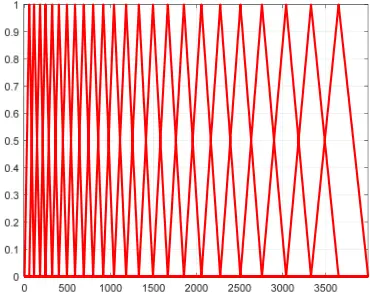

Each filter in the filter banks is discontinuous at f1 (m); the smoothness at f1 (m) cannot be automatically adjusted, and the shape of the entire filter cannot be automatically adjusted, which is not conducive to the extraction of multiple characteristic parameters.

## 3. Proposed methods

The proposed bird sound recognition method based on the adaptive frequency cepstral coefficient and improved SVM method using HPO (HPO-SVM) mostly includes bird sound signal preprocessing, adaptive feature extraction, that is, frequency cepstrum coefficients, and bird sound classification using an improved SVM model. An adaptive factor was introduced into the extraction of the frequency cepstrum coefficients instead of the Mel frequency cepstrum coefficients. HPO algorithm is used to improve the SVM classification model.

## 3.1. Bird sound signal preprocessing

To ensure the effectiveness of the bird sound signal feature extraction and reduce the calculation of the SVM classification model, the obtained original bird sound signal was processed before performing the feature extraction and the following steps. Preprocessing was performed using signal-processing methods including slicing, windowing, denoising [10-14], discrete Fourier transform, power spectrum calculation, separation [15-17], etc.

Because the bird sound signal is generated by the vibration of the vocal organ, and the vibration speed of the vocal organ is slow, the sound signal can be considered stable in a short time [18]. After slicing, processing each piece of signal is equivalent to processing continuous signals with a fixed length, which reduces the influence of nonstationary time variation on the final extracted features. A segment of the original bird sound signal was divided into pieces with a fixed value (typically 25 ms in this study), and the data of the first 5 ms of each piece coincided with the data of the last 5 ms of the previous piece. Suppose that a section of the original bird sound signal is divided into voi pieces, each piece of the signal contains N data and each piece of sound signal is weighted as follows

<!-- formula-not-decoded -->

where, 0 ≤ n ≤ N-1, 𝑑ଵሺ𝑛ሻ represents the nth data of the sound signal of the film (n = 0, 1, 2, ..., N-1), 𝑑ଶሺ𝑛ሻ is the nth data of the enhanced sound signal, and n is the serial number of the data.

Because the bird sound signal is divided into pieces, there is discontinuous data between two adjacent pieces. Therefore, each piece of data was windowed to make the bird sound signal after the division more continuous. A sound signal is usually added using a Hamming window. The expression of the hamming window, w(n), is

<!-- formula-not-decoded -->

where, 0 ≤ n ≤ N-1.

Multiplying each piece of data and the data corresponding to the serial number of the Hamming window function yields the windowed bird sound signal, d,

<!-- formula-not-decoded -->

where 0 ≤ n ≤ N-1 and 𝑑ሺ𝑛ሻ represents the n-th data of bird sound signal d after windowed.

To convert the signal from the time domain to the frequency domain, a discrete Fourier transform was performed on d,

<!-- formula-not-decoded -->

where, 0 ≤ n ≤ N-1, 0 ≤ k ≤ N-1, i is an imaginary unit, 𝑖 ൌ √െ1, d (n) is the n-th data of the sound signal after windowed and D (k) is the k-th data of the spectrum of the sound signal [19].

Calculate the power spectrum P of each piece sound signal according to its sound signal spectrum D. The power spectrum P was calculated using the following formula:

<!-- formula-not-decoded -->

where P (k) represents the k-th data in the power spectrum of the sound signal, 0 ≤ k ≤ N-1.

## 3.2. Adaptive frequency cepstrum coefficient extraction

Feature extraction transforms the original sound signal into a compact and effective representation that is more discriminative than the original sound signal. A typical acoustical feature in sound recognition is the frequency cestrum coefficient, such as the MFCC. To overcome the shortcomings of the MFCC mentioned above, an adaptive factor was introduced into the extraction of the frequency cepstrum coefficients instead of MFCCs. The extraction process for the adaptive frequency cepstrum coefficients is shown in Figure 2. The bird sound data used in this study were obtained from the bird sound database of the ornithology laboratory of Cornell University.

Figure 2. Adaptive frequency coefficient extraction.

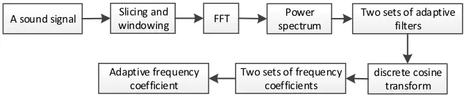

For each piece of the preprocessed bird sound signal, two sets of adaptive frequency filter banks were used to filter the power spectrum of the bird sound signal, and the adaptive frequency cestrum coefficients of the filtered signal were extracted separately. Subsequently, the two sets of adaptive frequency cestrum coefficients were combined as the feature input of the SVM model [20,21].

The first set of adaptive filters, 𝐻1௠ሺ𝑘ሻ, is,

<!-- formula-not-decoded -->

where 𝛼 is an adaptive factor of the filter and 0 ≤ 𝛼. In the process of feature extraction, the continuity of each filter in the filter bank at f1 (m), smoothness at f1 (m) and shape of the entire filter can be adjusted by changing the value of this factor, which is conducive to the extraction of multiple feature parameters. 𝐻1௠ሺ𝑘ሻ represents the m-th filter in the first filter bank. Figures 3-8 shows filters with different 𝛼 values. 𝛼 determines the shape of the filter. When it is necessary to extract frequency cepstrum coefficients from sound signals with information features concentrated at several frequency points, we increase 𝛼. When it is necessary to extract frequency cepstrum coefficients from sound signals with evenly distributed information features, we simply reduce 𝛼.

Figure 3. Filters when α = 0.

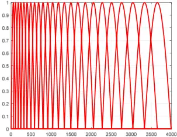

Figure 4. Filters when α = 3.

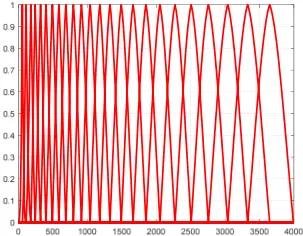

Figure 5. Filters when α = 6.

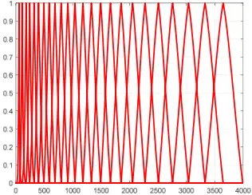

Figure 6. Filters when α = 12.

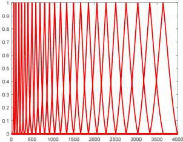

Figure 7. Filters when α = 24.

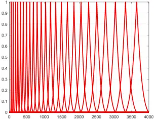

Figure 8. Filters when α = 48.

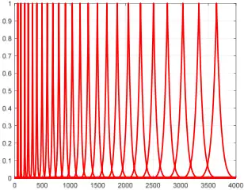

The power spectrum of the bird sound signal is filtered using the first set of filter banks. The filtered signal S1 is obtained

<!-- formula-not-decoded -->

where 0 ≤ m ≤ M and S1 (m) is the m-th data of the filtered signal S1.

The adaptive frequency cestrum coefficient C1 of the filtered signal S1 is extracted using the following formula (discrete cosine transform),

<!-- formula-not-decoded -->

where n = 0, 1, 2... L &lt; M, L denotes the order. Specifically, the 2nd to 13th coefficients of C1 are retained, while the remaining coefficients are discarded. This is because the discarded coefficients represent swift changes in filter bank coefficients, which are insignificant for automatic sound recognition.

The second set of adaptive filters, 𝐻2௠ሺ𝑘ሻ, is,

<!-- formula-not-decoded -->

<!-- formula-not-decoded -->

where 0 ≤ 𝛼 ≤1，𝐻2௠ሺ𝑘ሻ represents the m-th filter in the second filter bank, f2 (m), f2 (m - 1), f2 (m + 1) represents the center frequency of the m-th, m-1st, m + 1 filters in the second filter bank, 𝐹𝐹ሺ𝑧ሻ ൌ 2195െ2595 ∗ 𝑙𝑜𝑔ሺ1൅ ሺ4031െ 𝑧ሻ/700ሻ, 𝐹𝐹 ିଵ ሺ𝑧ሻ ൌ 700ሺ10 ௭/ଶହଽହ െ1ሻ.

The second set of adaptive filters reverses the low and high frequency bands of the first set of adaptive filters, that is, the filters are sparse in low frequency bank and dense in high frequency bank.

The power spectrum of the bird sound signal was filtered using the second set of filter banks. The filtered signal S2 is obtained.

<!-- formula-not-decoded -->

where 0 ≤ m ≤ M, S2 (m) is the m-th data of the filtered signal S2.

The adaptive frequency cestrum coefficient C2 of the filtered signal S2 is extracted using the following formula,

<!-- formula-not-decoded -->

where n = 0, 1, 2... L &lt; M.

The joint adaptive cepstrum coefficient of the sound signal segment of this spice is [C1, C2].

A section of the bird sound signal can be divided into voi slices, and we can then obtain the adaptive cepstrum coefficients of voi, that is, a characteristic parameter matrix of voi × 2 L. To reduce the longitudinal dimensions of the feature parameters, the feature parameters must be compressed longitudinally. Common compression methods include expectation variance, standard deviation and median methods. In this study, the median method was used, and a set of vectors of adaptive cepstrum coefficients was obtained from a section of the bird sound signal, reducing the complexity of the feature parameters.

## 3.3. Improved SVM using HPO

After the adaptive cepstrum coefficients are extracted, the HPO-SVM method is used to recognize the bird sound.

## 3.3.1. SVM

SVM is a powerful supervised machine-learning method used for linear or nonlinear classification and regression. It is efficient in a variety of applications owing to its ability to manage high-dimensional data and nonlinear relationships. The principle is to project a linear indivisible object into a high-dimensional space to find a hyperplane that can separate objects of different categories. The hyperplane is the decision boundary used to separate the data points of the different classes in a feature space. The dimensions of the hyperplane depended on the number of features. The hyperplane is,

<!-- formula-not-decoded -->

where 𝝎 is the normal vector to the hyperplane, i.e., the direction perpendicular to the hyperplane. B represents the offset of the hyperplane from the origin along the normal vector 𝝎. x is the adaptive cepstrum coefficients vector of any sound piece.

In actual classification, the data are in a non-ideal state, and there are classification errors near the hyperplane. Therefore, the relaxation variable ζ and the loss value C were introduced. After introducing the two parameters, the classification function is as follows:

<!-- formula-not-decoded -->

The hyperplane solution is transformed into the optimization solution of the dual problem, that is, the maximum of the pair.

<!-- formula-not-decoded -->

where αi is the Lagrange multiplier associated with the ith sound piece and αj is the Lagrange multiplier associated with the jth sound piece. xi is the adaptive cepstrum coefficient vector of the ith sound piece. xj is the adaptive cepstrum coefficients vector of the jth sound piece. yi is the classification result of the ith sound piece. yj is the classification result of the jth sound piece.

To classify and identify linear indivisible objects, kernel functions must be introduced to project data objects to higher dimensions. The common kernel functions are sigmoid, linear, polynomial and Gaussian kernels. In this paper, the Gaussian kernel is used as an example and its expression is,

<!-- formula-not-decoded -->

where σ is a kernel parameter.

The hyperplane expression is the expressed as

<!-- formula-not-decoded -->

where Q is the amount of data.

## 3.3.2. HPO

In an SVM, the kernel parameter is the most important parameter, and intelligent algorithms [22-25] may be used to optimize the kernel parameter. To determine the optimal kernel parameter, the HPO algorithm was used for searching, as shown in Figure 9. The HPO algorithm is inspired by hunters' and preys' behaviors, such as tigers and rabbits. By constantly updating the positions of the hunters, the optimal positions are obtained and the optimal parameters are obtained. The algorithm exhibited a high convergence and accuracy. The optimization process is as following:

Figure 9. HPO algorithm.

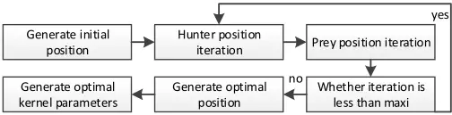

1. Initialize population number P1, maximum iteration number maxi, the upper and lower bounds of the target space. Set the initial positions of hunters and preys according to the following formula,

<!-- formula-not-decoded -->

Here, 𝛾଴ is the initial position of the hunters and preys, lb is the minimum value of the target space, ub is the maximum value of the target space, g is the number of variables and rand (1, g) generates a row of random number matrices between 0 and 1 of g columns.

- 2. Update positons by

<!-- formula-not-decoded -->

where 𝛾௜ାଵ,௝ is the position of the jth hunter in the i + 1 iteration, 𝛾௜,௝ is the position of the jth hunter in the ith iteration, 𝑤𝑧௜,௝ is the jth prey position in the ith iteration, Z is the adaptive parameter, 𝑍 ൌ 𝑅ଶ ⊗IDX൅𝑅ଷ ሬሬሬሬ⃗⊗ሺ~IDXሻ. 𝑅ଶ is a random number in [0, 1], 𝑅ଷ ሬሬሬሬ⃗ is a random vector in [0, 1], IDX is the index value of the vector 𝑅ଵ ሬሬሬሬ⃗ satisfying the condition (P2=0), P2 is the index value of 𝑅ଵ ሬሬሬሬ⃗ ＜ C, 𝑅ଵ ሬሬሬሬ⃗ is a random vector in [0, 1] and C is a balance parameter, 𝐶 ൌ 1െ 𝑖ሺ ଴.ଽ଼ ௠௔௫௜ ሻ, 𝑢ሺ𝑗ሻ is the average of the positions, 𝑢ሺ𝑗ሻ ൌ ଵ ௉ଵ ∑ 𝛾௣,௝ ௉ଵ ௣ୀଵ .

- 3. The fitness of the positions is calculated according to the following formula,

<!-- formula-not-decoded -->

<!-- formula-not-decoded -->

where 𝑠ℎ𝑓൫𝛾௜,௝൯ represents the fitness of the position 𝛾௜,௝, 𝑠ℎ𝑓൫𝛾௜ାଵ,௝൯ represents the fitness of the position 𝛾௜ାଵ,௝, 𝑐𝑢𝑟௜,௝ is the number of bird species recognition results that are the same as the actual results using a kernel function with 𝛾௜,௝ as the kernel parameter, 𝑐𝑢𝑟௜ାଵ,௝ is the number of bird species recognition results that are the same as the actual results using a kernel function with 𝛾௜ାଵ,௝ as the kernel parameter.

- 4. Update the prey's position, 𝑤𝑧௜ାଵ,௝, based on fitness,

<!-- formula-not-decoded -->

Determine whether the iteration number i is less than maxi. If yes, return to Step 2). If no, 𝛾௜ାଵ,௝ is set as the optimal kernel parameter.

## 4. Results and discussion

The whole flowchart of the HPO-SVM method is shown in Figure 10. Five types of bird sounds containing wind, rain and other field noises were randomly selected from the Xeno-canto database. This database contains recordings of wildlife sounds worldwide. The five birds are purple water fowl, cuckoo, black breasted sparrow, common kingfisher and rosefinch. Other audio signals without target bird sounds were also available in advance. Each type consists of 400 segments. In the experiment, 60% was randomly selected from each type of bird sound as the training set, 20% as the test set and the remaining 20% as the evaluation set. The training set was used to train the model, the test set was used to optimize the model and the evaluation set was used to evaluate the recognition accuracy.

Figure 10. Method flowchart.

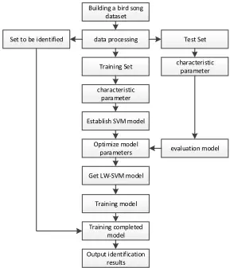

In the experiments, the kernel parameter is set between 0.01 and 100. The optimal kernel parameter with HPO algorithm is 2 when 𝛼 is between 1 and 15. The loss value is 10.

Table 1 shows the recognition accuracy results of the SVM and HPO-SVM models for the five types of bird sounds. The HPO-SVM model improved the recognition accuracy. The results show that the recognition accuracy using the HPO-SVM model is improved by 2.79%, 4.10%, 4.92%, 5.25% and 6.18%, respectively, compared to those using the SVM model. The average recognition accuracy using the HPO-SVM model was improved by 4.65% compared to that using the SVM model. The HPO-SVM model has higher recognition accuracy than the SVM model. This implies that the HPO-SVM model is more impressive that the SVM model.

Table 2 shows the recognition accuracy results of the five types of bird sounds obtained by combining the adaptive cepstrum coefficients in this study with the HPO-SVM model. Figure 11 shows a line chart based on Table 2. It can be seen more clearly that the highest recognition accuracy of different bird sounds is located in different adaptive coefficients; that is, the optimal adaptive coefficients of different birds are also different. The highest recognition accuracy of the HPO-SVM model for the five types of bird sounds was 95.80%, and the lowest recognition accuracy was 88.43% when α was between 0 and 15.

Table 1. Results of two models.

| Method - Bird species | SVM    | HPO-SVM | 𝛼   |
| --------------------- | ------ | ------- | --- |
| Pukeko                | 86.025 | 88.425  | 1   |
| Cuckoo                | 89.125 | 92.775  | 2   |
| Passer hispaniolensis | 89.475 | 93.875  | 12  |
| Home rosefinch        | 90.025 | 94.750  | 1   |
| Alcedo atthis         | 90.225 | 95.800  | 13  |

Table 2. Results of 5 types of birds at different 𝛼 (%).

| 𝛼   | Pukeko | Cuckoo | Passer hispaniolensis | Home rosefinch | Alcedo atthis |
| --- | ------ | ------ | --------------------- | -------------- | ------------- |
| 0   | 88.425 | 88.025 | 89.075                | 94.750         | 89.850        |
| 1   | 88.425 | 90.125 | 89.100                | 94.750         | 89.875        |
| 2   | 88.450 | 92.775 | 89.125                | 93.525         | 89.875        |
| 3   | 89.550 | 91.025 | 89.300                | 92.400         | 90.025        |
| 4   | 89.925 | 90.525 | 89.300                | 91.225         | 90.025        |
| 5   | 90.725 | 89.725 | 89.375                | 91.125         | 90.025        |
| 6   | 88.525 | 89.575 | 89.525                | 91.100         | 90.025        |
| 7   | 87.625 | 89.325 | 89.675                | 90.075         | 91.325        |
| 8   | 86.325 | 89.325 | 90.675                | 90.075         | 91.725        |
| 9   | 86.325 | 89.250 | 91.250                | 90.025         | 92.225        |
| 10  | 86.325 | 89.125 | 92.800                | 89.925         | 92.225        |
| 11  | 86.325 | 89.125 | 93.675                | 89.875         | 93.775        |
| 12  | 86.325 | 89.025 | 93.875                | 89.625         | 94.025        |
| 13  | 86.300 | 89.025 | 93.775                | 89.375         | 95.800        |
| 14  | 86.025 | 88.725 | 93.750                | 89.025         | 95.125        |
| 15  | 85.725 | 88.725 | 93.725                | 88.125         | 95.125        |

Figure 11. Comparative results of 5 kinds of birds at different 𝛼.

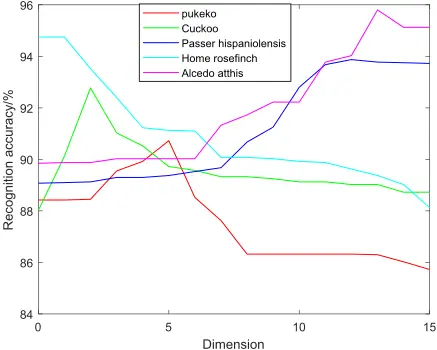

The running times of the SVM and HPO-SVM models were compared. In the experiments, the running time of the SVM model was 0.1493 ms, and that of the HPO-SVM model was 0.1584 ms. Because the HPO-SVM model must update the network parameters, it requires a little bit more time than the SVM model. However, in terms of recognition accuracy, this model was more impressive than the SVM model.

The memory capacities of the SVM and HPO-SVM models were compared. In the experiments, the memory capacity of the SVM model was 1668.5 MB and the memory capacity of the HPO-SVM model was 1667.8 MB. This requires less memory than the SVM model.

To evaluate the performance, the average recognition accuracy of the HPO-SVM model was compared with those of other state-of-the-art models, as shown in Table 3. They are the transfer learning (TL) [26], IVA-Xception [5] and J4.8 + MFCC [9] models. As shown in the table, they were inferior to those of the HPO-SVM model. The average recognition accuracy of the HPO-SVM model was improved by more than 0.59% compared to that of the TL model. The average recognition accuracy of the HPO-SVM model was improved by more than 17.1% compared to that of the J4.8 + MFCC model. The average recognition accuracy of the HPO-SVM model was improved by more than 19.2% compared to that of the J4.8 + MFCC model.

Table 3. Comparative results of different methods.

| Model            | Accuracy (%) |
| ---------------- | ------------ |
| HPO-SVM          | 93.45        |
| TL [26]          | 92.90        |
| IVA-Xception [5] | 79.80        |
| J4.8 + MFCC [9]  | 78.40        |

## 5. Conclusions

A high-accuracy method for bird sound recognition was developed in this study, which includes the extraction of adaptive cepstrum coefficients and the construction of the HPO-SVM model. In the process of adaptive cepstrum coefficient extraction, the filters can be adjusted using the adaptive factor of the filter. A hunter-prey optimizer algorithm was used to improve the support vector machine model. The highest recognition accuracy is obtained by adjusting the adaptive factor. In future work, the recognition accuracy may be further improved by combining other feature parameters, and our developed algorithms [27-30] may also be used for adaptive factor optimization.

## Use of AI tools declaration

The authors declare they have not used Artificial Intelligence (AI) tools in the creation of this article.

## Conflict of interest

The authors declare there is no conflict of interest.

## References

1. L. Patrik, S. Panu, L. Petteri, L. Geres, T. Richter, S. Seibold, et al., Domain-specific neural networks improve automated bird sound recognition already with small amount of local data, Methods Ecol. Evol., 13 (2022), 2799-2810. https://doi.org/10.1111/2041-210X.14003
2. O. Küc ̣ üktopcu, E. Masazade, C. Ünsalan, P. K. Varshney, A real-time bird sound recognition system using a low-cost microcontroller, Appl. Acoust., 148 (2019), 194-201. https://doi.org/10.1016/j.apacoust.2018.12.028
3. J. Xie, Y. Zhong, J. Zhang, S. Liu, C. Ding, A. Triantafyllopoulos, A review of automatic recognition technology for bird vocalizations in the deep learning era, Ecol. Inf., 73 (2023), 101927. https://doi.org/10.1016/j.ecoinf.2022.101927
4. K. Liu, Y. Fu, L. Wu, X. Li, C. Aggarwal, H. Xiong, Automated feature selection: A reinforcement learning perspective, IEEE Trans. Knowl. Data Eng., 35 (2023), 2272-2284. http://dx.doi.org/10.1109/TKDE.2021.3115477
5. Y. Dai, J. Yang, Y. Dong, H. Zou, M. Hu, B. Wang, Blind source separation-based IVA-Xception model for bird sound recognition in complex acoustic environments, Electron. Lett., 57 (2021), 454-456. http://dx.doi.org/10.1049/ell2.12160
6. Q. Tang, L. Xu, B. Zheng, C. He, Transound: Hyper-head attention transformer for birds sound recognition, Ecol. Inf., 75 (2023), 102001. https://doi.org/10.1016/j.ecoinf.2023.102001
7. T. Jung, H. Jeon, C. Jeon, A. Cook, A. Weiss, M. Lee, et al., Deep learning-based bird sound recognition system with data pre-processing, in Korean Electronics Engineering Association Academic Conference, (2019), 756-759.
8. S. Xu, Y. Sun, L. Huang-Fu, W. Fang, Design of a comprehensive birdsong recognition classifier based on MFCC, time-frequency map and other features, Lab. Res. Explor., 37 (2018), 81-86.
9. A. E. Mehyadin, A. M. Abdulazeez, D. A. Hasan, J. N. Saeed, Birds sound classification based on machine learning algorithms, Asian J. Res. Comput. Sci., 9 (2021), 1-11. https://doi.org/10.9734/AJRCOS/2021/v9i430227
10. X. Chen, Y. Gao, C. Wang, Fractional derivative method to reduce noise and improve SNR for Lamb wave signals, J. Vibroeng., 17 (2015), 4211-4218.

11. X. Chen, C. Wang, Tsallis distribution-based fractional derivative method for Lamb wave signal recovery, Res. Nondestr. Eval., 26 (2015), 174-188. https://doi.org/10.1080/09349847.2015.1023913
12. X. Chen, C. Wang, Noise removing for Lamb wave signals by fractional differential, J. Vibroeng., 16 (2014), 2676-2684.
13. X. Chen, C. Wang, Noise suppression for Lamb wave signals by Tsallis mode and fractional-order differential (in Chinese), Acta Phys. Sin., 63 (2014), 184301. http://dx.doi.org/10.7498/aps.63.184301
14. X. Chen, J. Li, Noise reduction for ultrasonic Lamb wave signals by empirical mode decomposition and wavelet transform, J. Vibroeng., 15 (2013), 1157-1165.
15. X. Chen, D. Ma, Mode separation for multimodal ultrasonic Lamb waves using dispersion compensation and independent component analysis of forth-order cumulant, Appl. Sci., 9 (2019), 555. http://dx.doi.org/10.3390/app9030555
16. L. Ni, X. Chen, Mode separation for multimode Lamb waves based on dispersion compensation and fractional differential, Acta Phys. Sin., 67 (2018), 204301. http://dx.doi.org/10.7498/aps.67.20180561
17. X. Chen, Y. Gao, L. Bao, Lamb wave signal retrieval by wavelet ridge, J. Vibroeng., 16 (2014), 464-476.
18. K. Salaheddine, K. Fathallah, A. Issam, B. Mohamed, Performance evaluation and implementations of MFCC, SVM and MLP algorithms in the FPGA board, Int. J. Electr. Comput. Eng. Syst., 12 (2021), 139-153. http://dx.doi.org/10.32985/ijeces.12.3.3
19. G. Ruan, Y. Zhong, J. Jiang, Design of speech interaction system based on MFCC coefficient (in Chinese), Autom. Instrum., (2022), 167-171. https://doi.org/10.14016/j.cnki.1001-9227.2022.06.167
20. B. Liu, H. Bai, W. Chen, H. Chen, Z. Zhang, Automatic detection method of epileptic seizures based on IRCMDE and PSO-SVM, Math. Biosci. Eng., 20 (2023), 9349-9363. https://doi.org/10.3934/mbe.2023410
21. X. Dai, K. Sheng, F. Shu, Ship power load forecasting based on PSO-SVM, Math. Biosci. Eng., 19 (2022), 4547-4567. https://doi.org/10.3934/mbe.2022210
22. X. Chen, R. Jing, C. Sun, Attention mechanism feedback network for image super-resolution, J. Electron. Imaging, 31 (2022), 043006. https://doi.org/10.1117/1.JEI.31.4.043006
23. X. Chen, J. Zhu, Land scene classification for remote sensing images with an improved capsule network, J. Appl. Remote Sens., 16 (2022), 026510. http://dx.doi.org/10.1117/1.JRS.16.026510
24. X. Chen, C. Sun, Multiscale recursive feedback network for image super-resolution, IEEE Access, 10 (2022), 6393-6406. https://doi.org/10.1109/ACCESS.2022.3142510.
25. X. Chen, S. Zou, Improved Wi-Fi indoor positioning based on particle swarm optimization, IEEE Sens. J., 17 (2017), 7143-7148. https://doi.org/10.1109/JSEN.2017.2749762
26. R. Rajan, A. Noumida, Multi-label bird species classification using transfer learning, in International Conference on Communication, Control and Information Sciences, (2021), 1-5.
27. X. Chen, W. Zhan, Effect of transducer shadowing of ultrasonic anemometers on wind velocity measurement, IEEE Sens. J., 21 (2021), 4731-4738. https://doi.org/10.1109/JSEN.2020.3030634

28. X. Chen, B. Zhang, 3D DV-hop localisation scheme based on particle swarm optimisation in wireless sensor networks, Int. J. Sens. Netw., 16 (2014), 100-105. https://doi.org/10.1504/IJSNET.2014.065869
29. X. Chen, B. Zhang, Improved DV-Hop node localization algorithm in wireless sensor networks, Int. J. Distrib. Sens. Netw., 2012 (2012), 213980. https://doi.org/10.1155/2012/213980
30. X. Chen, C. Hu, Adaptive medical image encryption algorithm based on multiple chaotic mapping, Saudi J. Biol. Sci., 24 (2017), 1821-1827. https://doi.org/10.1016/j.sjbs.2017.11.023

©2023 the Author(s), licensee AIMS Press. This is an open access article distributed under the terms of the Creative Commons Attribution License (http://creativecommons.org/licenses/by/4.0)
