## Classification and Ranking of Environmental Recordings to Facilitate Efficient Bird Surveys

## Liang Zhang

A thesis submitted in fulfilment of the requirements for the degree of

## Doctor of Philosophy

Principal Supervisor: Prof. Paul Roe

Associate Supervisor: Dr Michael Towsey

Associate Supervisor: Dr Jinglan Zhang

Faculty of Science and Engineering Electrical Engineering and Computer Science Queensland University of Technology Brisbane, Queensland, Australia

## Keywords

Acoustic sampling Acoustic indices Soundscape ecology Bird species richness Classification Ranking Environmental audio recordings Non-negative matrix factorisation Bird syllable extraction

Acoustic scene classification

## Abstract

Environmental acoustics captures a wealth of information for understanding biodiversity and ecosystem dynamics, offering an ecologically meaningful environment on top of what the visual cue can provide. Today, the increasing availability of environmental recordings requires new automated techniques to assist the discovery of useful knowledge that is otherwise impenetrable.

Amongst the vocal species, birds are considered as good indicators of the environmental health. Bird species richness, which studies the number of unique bird species in a specific region within a specific time, is one of the most ecologically meaningful topics that can increase the understanding of the regional biodiversity. Manual analysis of bird species richness by recordings can be accurate but is time-consuming. Although automated techniques are evolving fast, it suffers from ubiquitous characteristics of bird vocalisations, such as variations of vocalisations within and across species, the variability of the recordings (e.g. different levels of noise), and simultaneous vocalisations. Due to the escalating size of environmental recordings, there is a pressing need to develop an accurate and fast approach to analyse bird species.

This thesis formulates the problem of acoustic bird species surveys as identifying the most bird species while listening to the least recordings. It is an efficiency problem where the number of audio recordings required being listened to is the time measure. A series of assistive automated techniques are proposed to address this problem. These techniques are divided into two tasks in terms of their functionalities: classification and ranking.

This thesis creates a single-label multilayer perceptron classification model using 7 acoustic indices to analyse environmental audio recordings. The classification model aims to remove recordings that contain no bird species. Five common acoustic patterns are defined in this research, they are 'Birds', 'Insects', 'Low activity', 'Rain', and 'Wind'. The proposed classification model enables to remove a significant portion of irrelevant audio recordings (namely 'Insects', 'Low activity', 'Rain', and 'Wind') while retaining the majority of those ('Birds') that actually contain bird vocalisations. The classification process results in a pool of audio recordings that are likely to contain bird species.

To further improve the efficiency of finding bird species in environmental audio recordings, a ranking model is proposed to sort audio recordings based on bird vocalisations. First, acoustic indices are investigated in order to find the best indicator of the number of bird species in an audio recording. Audio recordings are later ranked based on this indicator to direct manual bird species surveys. Additionally, the temporal and acoustic redundancy between audio recordings has been considered to enhance the efficiency of bird species surveys. Second, a novel non-negative matrix factorisation based algorithm is proposed to deal with overlapping bird vocalisations amongst audio recordings. This method extracts distinct spectral profiles from audio recordings to represent various bird vocalisations. Based on these spectral profiles, audio recordings are sampled in a sequence that maximises the number of new distinct bird vocalisations. This work is a further step towards using automated techniques to assist bird species surveys from a large size of environmental recordings. The proposed classification and ranking approach has demonstrated the capability of sampling audio recordings for efficient bird species surveys. Although this work focuses on bird species, the approach should be

applicable to the investigation of other vocal species.

## Table of Contents

| Keywords                                                                                                                                   | ................................................................................................................................... I    |
| ------------------------------------------------------------------------------------------------------------------------------------------ | ---------------------------------------------------------------------------------------------------------------------------------------- |
| Abstract                                                                                                                                   | ..................................................................................................................................... II |
| Table of Contents                                                                                                                          | ..................................................................................................................... IV                 |
| List of Figures ........................................................................................................................   | VII                                                                                                                                      |
| List of Tables ........................................................................................................................... | IX                                                                                                                                       |
| List of publications                                                                                                                       | ................................................................................................................... X                    |
| Journal papers ........................................................................................................................    | X                                                                                                                                        |
| Conference paper...................................................................................................................        | X                                                                                                                                        |
| List of Abbreviations                                                                                                                      | ............................................................................................................. XII                        |
| Statement of original authorship                                                                                                           | ........................................................................................... XIII                                         |
| Acknowledgements ...............................................................................................................           | XIV                                                                                                                                      |
| 1 Introduction                                                                                                                             | ........................................................................................................................ 1               |
| 1.1 Background and motivation                                                                                                              | ............................................................................................. 1                                          |
| 1.1.1 Environment monitoring                                                                                                               | ........................................................................................... 1                                            |
| 1.1.2 The use of acoustics for bird species                                                                                                | surveys ............................................................ 1                                                                   |
| 1.1.3 The study of bird species richness                                                                                                   | ............................................................................. 2                                                          |
| 1.2 Research questions and objectives                                                                                                      | ................................................................................... 3                                                    |
| 1.3 Contributions and significance                                                                                                         | ......................................................................................... 4                                              |
| 1.4 Thesis outline                                                                                                                         | ................................................................................................................... 4                    |
| 2 Literature Review                                                                                                                        | ............................................................................................................... 8                        |
| 2.1 Manual bird species recognition                                                                                                        | ...................................................................................... 8                                                 |
| 2.1.1 Listening                                                                                                                            | .................................................................................................................... 8                   |
| 2.1.2 Visual inspection                                                                                                                    | ....................................................................................................... 9                                |
| 2.2 Citizen science for bird species investigations ...............................................................                        | 10                                                                                                                                       |
| 2.3 Automated bird species recognition ...............................................................................                     | 11                                                                                                                                       |
| 2.3.1 Structure of bird vocalisations .................................................................................                    | 12                                                                                                                                       |
| 2.3.2 Segmentation of bird                                                                                                                 | vocalisations.......................................................................... 13                                               |
| 2.3.3 Acoustic features                                                                                                                    | ..................................................................................................... 14                                 |
| 2.3.4 Classification applications                                                                                                          | ....................................................................................... 15                                               |
| 2.4 Acoustic scene classification                                                                                                          | .......................................................................................... 17                                            |

| 2.5 Soundscape ecology and acoustic indices                                                                                        | ...................................................................... 18                                                   |
| ---------------------------------------------------------------------------------------------------------------------------------- | --------------------------------------------------------------------------------------------------------------------------- |
| 2.6 Semi-automated techniques to assist bird species surveys.............................................                          | 21                                                                                                                          |
| 2.7 Summary                                                                                                                        | ........................................................................................................................ 22 |
| 3 Methodology                                                                                                                      | ..................................................................................................................... 24    |
| 3.1 Study sites and acoustic data ..........................................................................................       | 24                                                                                                                          |
| 3.2 Acoustic indices ............................................................................................................. | 25                                                                                                                          |
| 3.2.1 Indices derived from waveform envelopes ..............................................................                       | 26                                                                                                                          |
| 3.2.2 Indices derived from spectrograms..........................................................................                  | 28                                                                                                                          |
| 3.3 Analysis tools                                                                                                                 | ................................................................................................................. 30        |
| 3.4 Visualisation for exploratory analysis ............................................................................            | 31                                                                                                                          |
| 3.5 Classifying one-minute audio clips ................................................................................            | 32                                                                                                                          |
| 3.5.1 Single-label classifiers .............................................................................................       | 32                                                                                                                          |
| 3.5.2 Multi-label classifiers ..............................................................................................       | 33                                                                                                                          |
| 3.5.3 Parameter setting .....................................................................................................      | 33                                                                                                                          |
| 3.5.4 Evaluation metrics                                                                                                           | ................................................................................................... 34                      |
| 3.6 Ranking one-minute audio clips .....................................................................................           | 36                                                                                                                          |
| 3.6.1 Using acoustic indices as a proxy for the number of bird species ...........................                                 | 36                                                                                                                          |
| 3.6.2 Detecting shared bird species amongst audio clips .................................................                          | 37                                                                                                                          |
| 3.7 Species accumulation curves ..........................................................................................         | 37                                                                                                                          |
| 4 Classification of audio clips to assist bird species surveys ..............................................                      | 39                                                                                                                          |
| 4.1 Visualisation of a one-day audio recording ....................................................................                | 39                                                                                                                          |
| 4.2 Single-label classification ..............................................................................................     | 41                                                                                                                          |
| 4.2.1 A pilot study ............................................................................................................   | 42                                                                                                                          |
| 4.2.2 Feature selection                                                                                                            | ...................................................................................................... 46                   |
| 4.2.3 Classification accuracy ............................................................................................         | 47                                                                                                                          |
| 4.3 Multi-label classification                                                                                                     | ................................................................................................ 48                         |
| 4.3.1 Performance .............................................................................................................    | 49                                                                                                                          |
| 4.3.2 Comparisons between multi-label and single-label classification ...........................                                  | 50                                                                                                                          |
| 4.4 Investigation of bird species richness ............................................................................            | 52                                                                                                                          |
| 4.5 Summary                                                                                                                        | ........................................................................................................................ 54 |
| 5 Ranking audio clips for more efficient bird                                                                                      | species surveys ............................................ 56                                                             |
| 5.1 Ranking audio clips to direct bird species richness surveys ..........................................                         | 57                                                                                                                          |

| 5.2                                                                                                                                                                                                                             | Ranking audio clips by acoustic indices ........................................................................ 58             |
| ------------------------------------------------------------------------------------------------------------------------------------------------------------------------------------------------------------------------------- | ------------------------------------------------------------------------------------------------------------------------------- |
| 5.2.1 Summary acoustic indices                                                                                                                                                                                                  | ....................................................................................... 58                                      |
| 5.2.2 Increasing the temporal resolution ..........................................................................                                                                                                             | 59                                                                                                                              |
| 5.2.3 Spectral acoustic indices ..........................................................................................                                                                                                      | 60                                                                                                                              |
| 5.3 Redundancy removal                                                                                                                                                                                                          | ...................................................................................................... 62                       |
| 5.3.1 Removing temporal redundancy ..............................................................................                                                                                                               | 63                                                                                                                              |
| 5.3.2 Removing acoustic redundancy ...............................................................................                                                                                                              | 64                                                                                                                              |
| 5.3.3 Discussions on removing redundancy .....................................................................                                                                                                                  | 64                                                                                                                              |
| 5.4 Summary ........................................................................................................................                                                                                            | 65                                                                                                                              |
| 6 Using non-negative matrix factorisation to detect overlapping bird vocalisations audio clips ................................................................................................................................ | amongst 67                                                                                                                      |
| 6.1 Non-negative matrix factorisation ..................................................................................                                                                                                        | 68                                                                                                                              |
| 6.2 Representation of distinct bird vocalisations .................................................................                                                                                                             | 70                                                                                                                              |
| 6.2.1 Pre-processing spectrogram data .............................................................................                                                                                                             | 70                                                                                                                              |
| 6.2.2 Estimation of the factorisation rank ........................................................................                                                                                                             | 70                                                                                                                              |
| 6.2.3 Extracting distinct spectra of bird vocalisations ......................................................                                                                                                                  | 71                                                                                                                              |
| 6.2.4 Sampling audio clips ...............................................................................................                                                                                                      | 73                                                                                                                              |
| 6.3 Results ............................................................................................................................                                                                                        | 74                                                                                                                              |
| 6.3.1 The evaluation of factorisation rank                                                                                                                                                                                      | ........................................................................ 74                                                     |
| 6.3.2 Clustered spectral profiles and spectrogram reconstruction                                                                                                                                                                | .................................... 75                                                                                         |
| 6.3.3 Sampling audio clips to assist bird species surveys                                                                                                                                                                       | ................................................ 77                                                                             |
| 6.4 Discussions .....................................................................................................................                                                                                           | 79                                                                                                                              |
| 6.5 Summary                                                                                                                                                                                                                     | ........................................................................................................................ 80     |
| 7 Conclusions and future work                                                                                                                                                                                                   | ............................................................................................ 82                                 |
| 7.1 Summary of achievements                                                                                                                                                                                                     | ............................................................................................. 82                                |
| 7.2 Limitations                                                                                                                                                                                                                 | ..................................................................................................................... 85        |
| 7.3 Future work                                                                                                                                                                                                                 | .................................................................................................................... 86         |
| Appendix - Names of bird species                                                                                                                                                                                                | .......................................................................................... 87                                   |
| Bibliography                                                                                                                                                                                                                    | ............................................................................................................................ 88 |

## List of Figures

| Figure 1.1 Thesis overview ........................................................................................................ 5                                                                                                                 |
| ----------------------------------------------------------------------------------------------------------------------------------------------------------------------------------------------------------------------------------------------------- |
| Figure 2.1 The waveform of an 8-second audio clip ................................................................. 9                                                                                                                                 |
| Figure 2.2 The spectrogram of the corresponding audio clip in Figure 2.1............................. 10                                                                                                                                              |
| Figure 2.3 A general workflow of a classification system....................................................... 12                                                                                                                                    |
| Figure 2.4 Four hierarchical levels of bird vocalisations shown in a spectrogram. ................. 13                                                                                                                                                |
| Figure 2.5 Summary acoustic indices of 150 one-minute training audio clips ........................ 19                                                                                                                                                |
| Figure 2.6 A traditional spectrogram of a 24-hour recording .................................................. 20                                                                                                                                     |
| Figure 2.7 Extended Acoustic SummarY (EASY) image with civil twilights ........................ 21                                                                                                                                                    |
| Figure 3.1 Four study sites in the Samford Ecological Research Facilities, Brisbane, Australia. .................................................................................................................................................. 25 |
| Figure 3.2 Various single-length basis functions for matching pursuit algorithm .................. 27                                                                                                                                                 |
| Figure 3.3 Various number of iterations for matching pursuit algorithm ................................ 28                                                                                                                                            |
| Figure 3.4 A false-colour spectrogram of a one day's recording ............................................ 32                                                                                                                                        |
| Figure 3.5 Two benchmarks of species accumulation curves .................................................. 38                                                                                                                                        |
| Figure 4.1 An example of active bird vocalisations during the day ........................................ 40                                                                                                                                         |
| Figure 4.2 The waveforms (left) and spectrograms (right) of five pre-defined acoustic patterns ..................................................................................................................................... 40               |
| Figure 4.3 The generation of a statistical model ...................................................................... 41                                                                                                                            |
| Figure 4.4 Using the statistical model to identify unlabelled audio clips ................................ 41                                                                                                                                         |
| Figure 4.5 A decision tree model trained by Weka 3.7.11 ...................................................... 43                                                                                                                                     |
| Figure 4.6 Species accumulation curves of 15th October 2010, site 4, the SERF................... 45                                                                                                                                                   |
| Figure 4.7 Species accumulation curves of 16th October 2010, site 4, the SERF................... 45                                                                                                                                                   |
| Figure 4.8 Classification accuracy of three classifiers using different feature sets ................. 47                                                                                                                                             |
| Figure 4.9 Precisions of single- and multi-label classifiers ..................................................... 51                                                                                                                                 |
| Figure 4.10 Recalls of single- and multi-label classifiers ........................................................ 51                                                                                                                                |
| Figure 4.11 Distributions of the number of bird species per minute ....................................... 53                                                                                                                                         |

| Figure 4.12 Five species accumulative curves derived from different sampling methods ......                                                                                                                                 | 54  |
| --------------------------------------------------------------------------------------------------------------------------------------------------------------------------------------------------------------------------- | --- |
| Figure 5.1 Species accumulation curves of the maximum sampling .......................................                                                                                                                      | 56  |
| Figure 5.2 Four examples of horizontal ridge (horRidge) spectra ...........................................                                                                                                                 | 61  |
| Figure 5.3 Species accumulation curve of ranking by spectral horRidge index ......................                                                                                                                          | 62  |
| Figure 5.4 Removing n-nearest temporal neighbours of one-minute audio clips ....................                                                                                                                            | 63  |
| Figure 6.1 An example of non-negative matrix factorisation. .................................................                                                                                                               | 69  |
| Figure 6.2 Spectral profiles partitioned by the non-negative matrix factorisation ..................                                                                                                                        | 72  |
| Figure 6.3 Original spectrogram (top) and its reconstruction from non-negative matrix factorisation (bottom)............................................................................................................... | 75  |
| Figure 6.4 A reconstructed spectrogram using the clustered temporal coefficients ................                                                                                                                           | 76  |
| Figure 6.5 Nine clustered spectral profiles of an one-minute audio clip .................................                                                                                                                   | 77  |
| Figure 6.6 Five species accumulation curves generated by different sampling strategies ......                                                                                                                               | 79  |

## List of Tables

| Table 3.1 Basic information of audio recordings used in this study ........................................ 25             |
| -------------------------------------------------------------------------------------------------------------------------- |
| Table 3.2 A 2-by-2 contingency table of the single-label classification results ...................... 35                  |
| Table 4.1 Labelled one-minute audio clips for training single-label classification models .... 42                          |
| Table 4.2 Confusion matrix of training data using decision tree ............................................. 43           |
| Table 4.3 Confusion matrix of test data using decision tree .................................................... 44        |
| Table 4.4 Results before and after classification for 5 days on site 4, the SERF .................... 44                   |
| Table 4.5 Classification evaluations of the test dataset ........................................................... 48    |
| Table 4.6 Confusion matrix of test dataset using the feature selection ................................... 48              |
| Table 4.7 The number of audio clips associated with different combinations of labels .......... 48                         |
| Table 4.8 The performance of three different multi-label classifiers ...................................... 50             |
| Table 5.1 Using correlation relations to direct bird species surveys ....................................... 59            |
| Table 5.2 Different combinations of temporal and acoustic thresholds .................................. 65                 |
| Table 7.1 The mapping of achievements, research questions, and chapters ............................ 82                    |
| Table 7.2 The progressive results of the main ......................................................................... 84 |

## List of publications

## Journal papers

Zhang, L., Towsey, M., Xie, J., Zhang, J. &amp; Roe, P. (2016). Using multi-label classification for acoustic pattern detection and assisting bird species surveys, Applied Acoustics, 110, 9198, http://dx.doi.org/10.1016/j.apacoust.2016.03.027 Zhang L., Towsey, M., Zhang, J. &amp; Roe, P. (2016). Classifying and ranking audio clips to support bird species richness surveys. Ecological Informatics, 34, 108-116, http://dx.doi.org/10.1016/j.ecoinf.2016.05.005 Zhang L., Towsey, M., Zhang, J. &amp; Roe, P. (2016). Using non-negative matrix factorisation

to facilitate efficient bird species richness surveys. Ecological Indicators. (Accepted)

Conference paper Zhang, L., Towsey, M., Eichinski, P, Zhang, J. &amp; Roe, P. (2015). Assistive classification for improving the efficiency of avian species richness surveys, 2015 IEEE International Conference on Data Science and Advanced Analytics (DSAA' 2015), Paris, France, 19-21 October 2015 Zhang, L., Towsey, M., Zhang, J. &amp; Roe, P. (2015). Computer-assisted Sampling of Acoustic Data for More Efficient Determination of Bird Species Richness, IEEE International Conference on Data Mining workshop Environmental Acoustic Data Mining, Atlantic City, NJ, USA, 14-17 November 2015 Towsey, M., Zhang, L., Cottman-Fields, M., Wimmer J., Zhang, J., Roe, P. (2014). Visualization of long-duration acoustic recordings of the environment. Proceedings of the International Conference on Computational Science, Cairns, Australia. Ferroudj, M., Truskinger, A., Towsey, M., Zhang, J., Roe, P., Zhang, L. (2014). Detection of rain in acoustic recordings of the environment. The 13th Pacific Rim International Conference on Artificial Intelligence, Gold Coast, Australia. Xie, J., Towsey, M., Zhang, L., Yasumiba, K., Schwarzkopf, L., Zhang, J., Roe, P. (2016).

Multiple-Instance Multiple-Label Learning for the Classification of Frog Calls with Acoustic Event Detection, The 7th International Conference on Image and Signal Processing, TroisRivières, QC, Canada Xie, J., Towsey, M., Zhang, L., Zhang, J., Roe, P. (2016). Feature Extraction Based on Bandpass Filtering for Frog Call Classification, The 7th International Conference on Image and Signal Processing, Trois-Rivières, QC, Canada Towsey, M., Zhang, L., Roe, P. (2014). Long duration false-colour spectrograms (Abstract), Ecology and acoustics: emergent properties from community to landscape, Paris France.

## List of Abbreviations

horRidge Horizontal Ridge

verRidge Vertical Ridge

ACI

Acoustic Complexity Index

ASC

Acoustic Scene Classification

DTW

Dynamic Time Warping

EASY image Extended Acoustic SummaryY image

GMM

Gaussian Mixture Model

HMM

Hidden Markov Model

LPC

Linear Predictive Coefficients

MFCC

Mel-frequency Cepstral Coefficients

MP

Matching Pursuit

NMF

Non-negative Matrix Factorisation

RMSS

Root Mean Squared Residual

SERF

Samford Ecological Research Facilities

SNR

Signal to Noise Ratio

SRR

Signal to Residual Ratio

STFT

Short Time Fourier transform

## Statement of original authorship

The work contained in this thesis has not been previously submitted to meet requirements for an award at this or any other higher education institution. To the best of my knowledge and belief, the thesis contains no material previously published or written by another person except where due reference is made.

Signature QUT Verified Signature

1/51 2017 Date

## Acknowledgements

I wish to give my sincere gratitude to my supervisors: Prof. Paul Roe, Dr Michael Towsey, and Dr Jianglan Zhang, for your continuous support of my research, for your patience, guidance, encouragement, and generosity. As my principal supervisor, Paul has provided me insightful comments on my work and asked hard questions which always inspired me to widen and deepen my research. Michael has overseen my whole PhD project and provided helpful suggestions when I was confronted with difficult problems. Jinglan is an enthusiastic supervisor who has responded to my requests and also offered feedback on my writings timely. Thank you to all of my supervisors for proofreading my thesis.

I would like to thank my fellow groupmates for the support, friendship, and all the fun that we have had in the past three years. Special thanks are given to Dr Anthony Truskinger, Mark Cottman-Field, Phil Eichinski, and Jie Xie for the stimulating discussions and IT supports that have facilitated my experiments.

My sincere thanks also go to my wife Kou Kou. Without your encouragement, I could not have imagined starting my PhD journey, let alone getting to this far. I am gratitude to my parents and brother for supporting me spiritually throughout my life in general.

Finally, I would like to thank Chinese Scholarship Council for providing the living allowance and the Queensland University of Technology for offering tuition fee waiver sponsorship and CSC top-up scholarship. These scholarships have ameliorated my financial concerns so that I can devote myself to scientific research.

## 1 Introduction

## 1.1 Background and motivation

## 1.1.1 Environment monitoring

The natural environment is subject to the unprecedented rate of change. There is a pressing need to monitor these changes for biological conservation and natural resource management. However, the mechanism of an ecosystem is complex. Tens of thousands factors might affect an ecological process and the organisms living in the ecosystem (McMichael, Butler and Folke 2003). A significant variety of sensors and networks have been developed which can gather a wide range of environmental measurements such as the quality of the water, the nutrients in the soil, fluctuations of temperature and humidity, and the abundance and diversity of species (Mason et al. 2008). To clarify, the abundance is referred to the species' occurrences; whereas the diversity is referred to the number of unique species (Ehrlich and Roughgarden 1987). Fauna and the relationship with their habitats play an important role in maintaining environmental health. Unlike geophysical measurements, faunal monitoring requires more sophisticated tools and techniques for data collection, management, and analysis.

Vocal communication in fauna is rich for several ecological functions: it helps fauna to inform about food, attract mates, avoid danger, and protect territory. It can travel a long distance without severe attenuation and offer a wealth of information relating to the surroundings. Therefore, vocalisations also lend itself to one of the most direct ways for humans to detect them, especially at times when the fauna are difficult to see or in areas where humans are difficult to access.

## 1.1.2 The use of acoustics for bird species surveys

Amongst the vocal species, birds have long been considered as good indicators of environmental health. Firstly, they react rapidly to the environmental changes; secondly, they spread over a wide range of landscapes and have abundant vocalisations, which make them easy to detect; thirdly, their behaviours are well understood (Bardeli et al. 2010).

An efficient means of surveying bird species is to study their vocalisations (Kroosdma, Vielliard and Stiles 1996). Birds utilise acoustics for communication, sexual selection, and territory defence because acoustics can convey messages under conditions of poor lighting or obstruction where visual cues are hardly available (Catchpole and Slater 2003). Indeed, ecologists also take advantages of acoustics to study the behaviours of various species during in-field surveys (Forrest 1994). Traditional in-field surveys require a group of experienced observers to go to various locations, spending several weeks or even months on inventorying species (Hutto, Pletschet and Hendricks 1986). Such an effort is time-consuming and laborious. Tape recorders, as one of the recording techniques, were first used as complementary equipment to ameliorate such an issue (Parker 1991). Playbacks of acoustic recording were also used as stimuli to increase the detectability of secretive birds (Johnson et al. 1981). It has been tested that acoustic recordings could serve as an alternative to the in-field estimation of bird species richness (Haselmayer and Quinn 2000). The use of acoustic recordings for bird species surveys has the following advantages (Acevedo and Villanueva-Rivera 2006):

- They are non-invasive to the local ecosystem. Once deployed in the field, acoustic sensors can work continuously for weeks and even months. Only occasional maintenance is required, such as changes of batteries or interruption of routine data collection;
- The raw data can be stored permanently. Compared to the manual surveys, recorded acoustic data can be replayed as many times as possible, providing a feasible way to validate the observations;
- They are scalable. Acoustic sensors can extend human's ability for data collection over long periods of time and through large spatial scales.

Tape recorders have not been adopted for environmental monitoring due to the limitations of storage capacity and sensor stability since its inception. Today, advances in these two aspects have made digital acoustic sensors affordable and reliable substitutes for acoustic monitoring and species conservation (Brandes 2008).

## 1.1.3 The study of bird species richness

A prevalent ecological research topic about bird species is richness. It is a term sometimes used interchangeably as diversity in other research (Cotgreave and Harvey 1994; Honnay et al. 1999). To clarify, this thesis follows Spellerberg and Fedor's definitions (Spellerberg and Fedor 2003) by distinguishing species richness as a study of the number of unique species from species diversity as an index of relations between the number of species and the number of individuals. Accordingly, bird species richness studies the number of unique bird species. Although the definition of species richness implies no standardisation of field work protocols, a widely used starting point for bird species surveys is to conduct a spatiotemporal sampling of species (Whittaker, Willis and Field 2001). Point and transect counts are two popular sampling protocols that require people to inventory bird species they hear or see in the field (Ralph et al. 1993). However, in-field surveys are limited within a specific region and a specific period of time. Acoustic sensing techniques alleviate the physical constraints of the collection of the environmental sounds for ecological studies. The magnitude of collected audio recordings far outweighs what individuals can manually listen to. The problem of data collection at large scales has transmuted into the demand of effective and efficient tools to interpret the data (Aide et al. 2013). Acoustic bird species survey is such a typical problem requiring tremendous time and effort to analyse, thereby necessitating the development of automated techniques to enhance manual analysis by sampling recordings that are of interest.

- 1.2 Research questions and objectives

The overarching research question of this thesis is: How can automated techniques assist efficient bird surveys in environmental recordings? The efficiency in this context is defined as the time that people spent in listening to audio recordings for bird species surveys. Specifically, it is measured by the number of bird species found given a certain number of audio recordings. The question is further divided into two sub-questions:

1. How can irrelevant audio recordings be removed to assist bird surveys?
2. How can audio recordings be ranked to increase the efficiency of bird surveys?

The overall goal of this research is to develop a series of decision support techniques to sample audio recordings so that people can find all the bird species by listening to the least number of audio recordings. These techniques should be generalizable to recordings collected from different locations and initiatives. It gives rise to the following objectives:

1. The proposed techniques should enable to remove audio recordings that are unlikely to contain birds. A new pool of audio recordings can be presented for bird species

- surveys after the removal of non-bird recordings. Sampling audio recordings at random for bird species surveys from this new pool should be more efficient than from the original recordings.

2. Given audio recordings that are likely to contain bird species, the proposed techniques should also be able to rank audio recordings that maximise the number of bird species found in each recording.

- 1.3 Contributions and significance

This thesis contributes a series of computer-assisted techniques to sample audio recordings for efficient bird species surveys. These techniques are applicable to both manual and automated recognition of bird species in environmental recordings. The main contributions are:

- A classification model and an optimal feature set to remove audio recordings that are unlikely to contain birds;
- An acoustic index as a proxy for the number of bird species to rank audio recordings for efficient bird species surveys;
- A non-negative matrix factorisation based algorithm to detect overlapping bird vocalisations amongst the recordings and direct acoustic sampling.

This work represents a significant step towards using automated techniques to analyse acoustic data for ecological purposes. Automated techniques complement and facilitate traditional scientific processes of hypothesis generation and experimental testing. They allow unravelling the complexity of ecosystems while there are inherent challenges in analysing massive audio recordings. They also provide opportunities for experts and the general public to explore and gain a better understanding of the natural environment. Moreover, these techniques empower decision makers to develop valuable insights into the biodiversity and make timely conservation policies.

## 1.4 Thesis outline

The development of automated techniques first focuses on building classifier models to remove recordings that are less likely to contain bird species, and moves, chapter by chapter, towards solutions where detailed acoustic information is used as an indicator to sample audio recordings for manual bird species surveys. The structure of this thesis is illustrated in Figure 1.1.

## Chapter 1 Introduction

This chapter introduces the general background about acoustic monitoring and bird species surveys, proposes the research questions, and describes the contributions and significance of the research.

## Chapter 2 Literature review

This chapter reviews the prior work on manual, automated, and semi-automated techniques that have been applied for acoustic bird species analysis and identifies the research gap.

## Chapter 3 Methodology

This chapter describes in detail about the datasets, methods, and evaluation metrics used to fill the research gap.

Three core chapters of this thesis which shows the results of the proposed methods.

## Chapter 4 Classification of audio clips to assist bird species surveys

This chapter applies the classification technique to remove audio recordings that are less likely to contain bird species. It creates a subset of the original audio recordings for the follow-up process.

## Chapter 5 Ranking audio recordings for more efficient bird species surveys

Given the subset of audio recordings, this chapter aims to direct manual bird species surveys based on acoustic indices.

## Chapter 6 Using non-negative matrix factorisation to detect overlapping bird vocalisations

Since overlapping vocalisations amongst audio recordings could reduce the efficiency of manual bird species surveys and acoustic indices cannot be used to detect this information, this chapter proposes a new method to address this problem.

## Chapter 7 Conclusions

This chapter summarises the main results and relates them back to the research questions. It discusses the limitations of the proposed techniques and envisions future work.

Figure 1.1 Thesis overview

The remainder of this thesis is organised as follows. Chapter 2 reviews prior work on using manual and automated techniques respectively for acoustic data analysis. Manual identification of bird species from audio recordings is accurate but time-consuming. Although automated techniques are evolving fast and have been used as an efficient alternative for the analysis of a large number of recordings, they are error-prone due to background noise present in the recordings, variations of bird vocalisations, simultaneous vocalisations of multiple species, and unknown species. Chapter 3 describes the collection of audio recordings used in this study. Two major ideas are introduced to assist the rapid determination of bird species richness, they are classification and ranking. At the end of this chapter, species accumulation curves are introduced to evaluate the efficiency of assisting bird species surveys. Environmental acoustic data are complex. It contains sounds emanated from various sources such as geophony (rain and wind), biophony (vocal species), anthropophony (produced by humans), and a mixture of the three. Some acoustic data have distinct temporal and spectral characteristics depending on different sound sources, making it feasible to use classification methods to categorise audio clips. Chapter 4 first treats these acoustic patterns in a simplistic manner by assuming that only one pattern dominates an audio recording. Therefore, a singlelabel classifier is generated to filter recordings that are unlikely to contain bird species. This chapter later deals with a more complex problem of having multiple acoustic patterns in the same audio clips. The results have been compared between single-label and multi-label classification models, aiming to find an optimal classification model that can remove irrelevant audio recordings but retain unique species. Although classification methods initially remove the irrelevant audio clips, the efficiency of bird species surveys is still limited to the remaining audio clips that are likely to contain bird species. An intuitive strategy is to prioritise audio clips that one should inspect based on the number of unique species in it. Chapter 5 aims to find an acoustic index as a proxy for the numbers of unique species in an audio clip. By ranking audio clips based on this acoustic index, one can improve the efficiency of finding bird species. This chapter first considers the use of summary acoustic indices. Considering that temporal and spectral information is important for bird species to partition vocalisations and to avoid interspecific competitions, this chapter further investigates indices that have increased temporal and spectral resolutions.

One deficiency concerning the above-mentioned ranking methods is the neglect of shared species amongst audio clips. It is possible that a sampled audio clip contains a large number of bird species which have already been found in previous audio clip samples. Therefore, an efficient strategy should not only measure the complexity of an audio clip but also compare the similarity between different audio clips. To achieve this goal, chapter 6 applies nonnegative matrix factorisation to decompose one-minute audio clips into temporal and spectral information and extract distinct spectra to represent bird vocalisations. These spectra are later used to represent distinct bird species in an audio clip. Finally, audio clips are sampled by maximising the number of unique spectra in each audio clip for bird species richness surveys. Chapter 7 summarises the findings of this thesis and discusses how they answer the research questions. Finally, it illustrates the limitations of current research and recommends possible

future work.

## 2 Literature Review

This chapter reviews the techniques that have been used for acoustic bird species analysis. The description starts from manual methods such as listening to or visually inspecting recordings (section 2.1) and moves onto the citizen science - an extension of manual analysis that aims to motivate the public to analyse the escalating size of recordings (section 2.2). A potential substitute for manual analysis is to use automated recognition techniques, including automated species recognition (section 2.3) and acoustic scene classification (section 2.4). Recently a new research area - soundscape ecology has emerged to study acoustic community of a landscape for ecological purposes (section 2.5). Manual analysis is accurate but time-consuming; whereas automated techniques are fast in data processing but errorprone. The complementary use of both manual and automated techniques is called the semiautomated technique. It utilises automated techniques to assist manual analysis and has achieved some promising results in recent research (section 2.6). The last section underpins the limitations of currently available methods for acoustic bird this thesis follows the idea of the semi-automated technique by investigating computer-

species analysis. Considering either manual or automated techniques are still far from perfect, assisted techniques to enhance the efficiency of manual bird species surveys.

## 2.1 Manual bird species recognition

## 2.1.1 Listening

A straightforward way for bird species recognition is by manually listening to all recordings. It has been reported that bird species richness and abundance recorded by field experts and those inferred from simultaneous recordings are comparable (Hobson et al. 2002). For a bioacoustic recording system, effects of different microphone configurations, audio storage formats, and variability between interpretations amongst analysts have also been investigated (Rempel et al. 2005). Although these studies showed that acoustic recordings can mimic what a birder would hear in the field and the use of a recording technique is promising, the downside is that listeners without visual cues rely heavily on the quality of environmental recordings. Additionally, manually listening to even a small fraction of recordings is timeconsuming and labour-intensive.

## 2.1.2 Visual inspection

The study of bird species using acoustics was limited due to the lack of efficient analytical techniques and tools. There was no effective way to measure and compare the recorded bird vocalisations. The first revolution came with the introduction of the spectrogram, or sonogram, on bird vocalisation analysis (Thorpe 1954). Spectrograms display frequency information of an acoustic signal over time. Compared to the traditional spectrum analysis which averages acoustic information of an entire recording, the spectrogram offers visual cues on dynamic acoustic energy change in the frequency domain. Therefore, it was easier to examine and quantify bird vocalisations from spectrograms than original waveform signals. Thanks to the advent of modern computer techniques, spectrograms now have become a conventional tool to visualise bird vocalisations.

A spectrogram is generated from a waveform signal by applying short-time Fourier transform. This procedure can be depicted as follows: firstly, a waveform acoustic signal is sliced into small frames by a fixed-size window; then the fast Fourier transform is applied to an audio clip, generating spectra that contain complex values; only magnitudes are calculated from these spectra; finally, the magnitudes of spectra are aligned to form a spectrogram. Note that there exists a trade-off between time and frequency resolutions (Oppenheim, Schafer and Buck 1989); so the actual window size for slicing the waveform signal depends on practical applications. The waveform and its corresponding spectrogram of an 8-second signal are illustrated in Figure 2.1and Figure 2.2.

Figure 2.1 The waveform of an 8-second audio clip

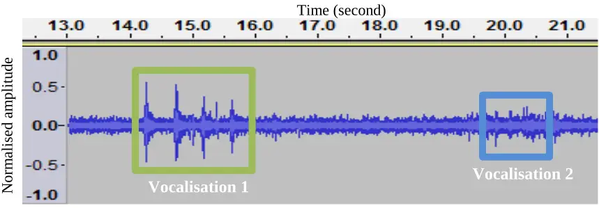

Figure 2.2 The spectrogram of the corresponding audio clip in Figure 2.1

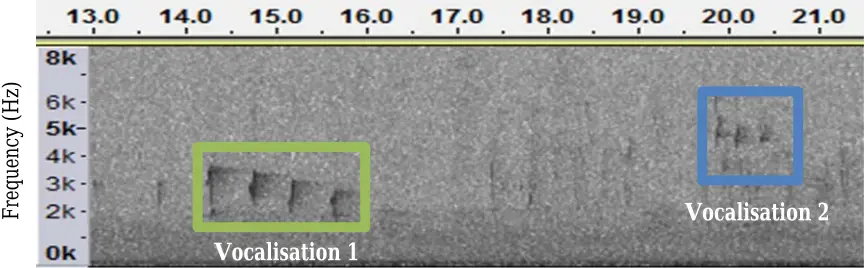

Some popular for bioacoustics data management and analysis are briefly introduced here:

- Raven (Charif, Waack and Strickman 2010): a free software package created by the Bioacoustics Research Program at The Cornell Lab of Ornithology. This package provides typical sound editing, playing, spectrogram generation, and simple automated acoustic event detection. However, it can only process a single sound file at a time.
- Audacity (Team 2011): open source software which is applicable to measure, visualise and analyse audio recordings. It is cross-platform software and supports several different audio formats.
- Song scope (Wildlife 2014): acoustic analysis software designed by the Wildlife Acoustics. Apart from its high-speed review of recordings, it offers a wide range of complex automated techniques for acoustic event detection.

However, even with the use of spectrograms, it takes on average twice as much time as the length of an audio recording to manually identify individual species (Wimmer et al. 2013). This is due to the fact that people have no visual cues of specific bird species and they frequently replay recordings in order to confirm the vocalisations they hear. What is worse, a long enough audio recording is physically limited by the size of the computer screen to demonstrate the spectrogram. Dividing a long recording into small segments causes frequent updates of rendering spectrograms and hence slows down the analysis process.

## 2.2 Citizen science for bird species investigations

Citizen science can be considered as extended manual surveys for bird species investigation. The idea is to engage the general public working in collaboration with the professional scientists on data collection and analysis. The Cornell Lab of Ornithology is a pioneer in this research area using audio recordings for the conservation of biodiversity. The recordings can date back to 1965, ranging from the local to the globe and monitoring a broad range of taxa (Dickinson, Zuckerberg and Bonter 2010). Today, the Internet offers a new opportunity for skilled persons to access a citizen science project on bird species recognition (Cottman-Fields, Brereton and Roe 2013), as well as for the public. An early concern regarding citizen science data is the error and bias due to variations between experts and non-experts (See et al. 2013). Citizen scientists vary in capability and experience. Training may narrow the gap between experts and non-experts However, there are multiple ways to train volunteers such as self-training in Internet-based projects or personalised training by professionals. It is not yet clear which types of training lead to the efficacy of these volunteer-based projects. There is a pressing need for wider assessment of data quality in citizen science research. Using a reputation model to predict the accuracy of users with unidentified skill levels may be a potential solution (Yang, Zhang and Roe 2013). Such a model utilises quantitative metrics to rank potential participants based on their performance and initial trust. By adding weightings to the data quality, a reputation model aims to ensure that large-scale participatory data analysis is reliable. Citizen science on ecological data analysis is a developing field. There are other issues need to be addressed including cyber-infrastructure and real-time synthesis with environmental metadata. Time is still needed to overcome the challenges before reliable results can be delivered.

- 2.3 Automated bird species recognition

Traditional studies of bird species by their vocalisations rely largely on listening to recordings with visual inspection of the corresponding spectrograms (Baker 1974; Mundinger 1975; Payne 1985). Such analysis can be a reliable means to categorise different vocalisations, but it is based on unspecified evidence and skilled persons' intuition, making the analysis difficult to standardise. Furthermore, continuous recognition of long-duration recordings is laborious. All these issues necessitate the use of more efficient techniques for bird vocalisation recognition. Thanks to the developments in pattern recognition, automated techniques are being developed to meet this challenge (Acevedo et al. 2009). Figure 2.3 demonstrates the general workflow of an automated classification system for bird species recognition. Typically for automated bird species recognition, an automated classification system has four processes. Inconsistency and noise are common in real-world data. The pre-processing step aims to deal with inconsistent audio clips, remove noise, and improve quality by data integration, transformation, and reduction for subsequent analysis. This is an important step because the accuracy of the classification system is largely dependent on the quality of its input. Particularly, in-field recordings are plagued by various types of background noise, necessitating an effective noise removal algorithm (Lamel et al. 1981) to mitigate such effects. The pre-processed input recordings normally consist of a sequential bird vocalisations separated by the intermittent silence. If the classification task is to identify single bird vocalisations, a short duration audio segment that only contains targeted vocalisations should be isolated from the rest of the recording. Such a process is called segmentation. Although segmentation sometimes is incorporated into the preprocessing or feature extraction step, it is highlighted here since its accuracy has significant effects on classification output. In feature extraction step, a discriminating value or vector is derived from the previous vocalisation segment to represent vocalisations. Finally, whether vocalisations being similar or not is determined by using different criteria in the classification process.

Figure 2.3 A general workflow of a classification system

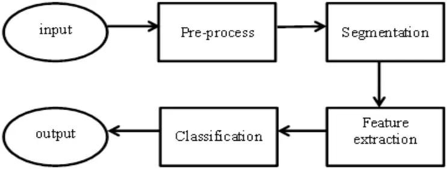

## 2.3.1 Structure of bird vocalisations

The spectrogram has become a conventional way to analyse bird vocalisations in environmental audio recordings. People can easily identify distinct structures of bird vocalisations in a spectrogram, even if they are not experts on bioacoustics. However, for computer-based sound analysis, it is crucial to abstract representative values to represent bird vocalisations for further quantitative analysis. Such abstraction of bird vocalisations should be stable and descriptive. Prior to moving towards the abstraction of bird vocalisations, the basic elements of bird vocalisations should be clarified.

Bird vocalisations displayed in a spectrogram are complex, comprising discrete components that cover a wide frequency band or last for a long time. A prevalent categorisation method divides bird vocalisations into four hierarchical levels: elements, syllables, phrases, and songs (Catchpole and Slater 2003). Elements are the smallest units of bird vocalisation in a spectrogram; syllables are composed of one or more elements, phrases consist of several syllables, and songs are long duration combination of phrases. Figure 2.4 illustrates these four levels of bird vocalisations in a spectrogram. Brandes et al. also defined five fundamental shapes that compose bird vocalisations, including segments with a constant frequency, frequency modulated whistles, broadband pulses, broadband with varying dominant frequency, and harmonics (Brandes 2008). These shapes are also at an element or syllable level. There was an argument on segmenting bird vocalisations at an element or syllable level since they are relatively stable under various conditions (Anderson, Dave and Margoliash 1996).

Figure 2.4 Four hierarchical levels of bird vocalisations shown in a spectrogram.

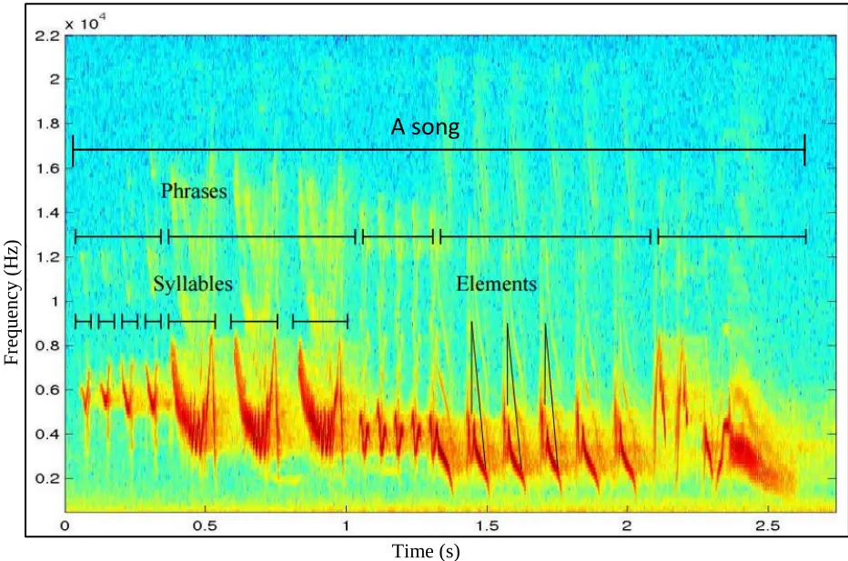

## 2.3.2 Segmentation of bird vocalisations

Traditional segmentation methods are largely based on manual inspections (Marler and Peters 1982; Margoliash, Cynthia and Sue 1994). This usually leads to subjective and unrepeatable segmentation results. When the dataset is large, manual methods are laborious. An alternative is to use computational techniques for bird vocalisations segmentation. Early studies have used dynamic time warping and template matching to isolate vocalisations in spectrograms (Buck and Tyack 1993; Anderson, Dave and Margoliash 1996). Lakshminarayanan et al. calculated the Kullback-Liebler divergence of the power spectral density to determine the boundaries of bird vocalisation segment (Lakshminarayanan, Raich and Fern 2009). Graciarena et al. used a vocal activity detection system to segment recordings (Graciarena et al. 2010). These methods work well when recordings consist of single-species vocalisations with minimal noise, but may not be able to work in noisy recordings. Recently, an automated supervised machine learning technique - random forest, has been proposed to segment bird vocalisation from noisy recordings (Neal et al. 2011). One limitation of supervised techniques is it requires a large set of training samples and cannot recognise vocalisations that are not in the training data.

- 2.3.3 Acoustic features

Acoustic features are single values or feature vectors that are utilised to characterise targeted vocalisations from the segmentation. The process of obtaining representative values or vectors is called feature extraction, which is a crucial step for successful automated recognition. Feature extraction aims to capture discriminating characteristics of vocalisations so that computers can identify them. A variety of features have been proposed to characterise bird vocalisations such as linear predictive coding and Mel-frequency cepstral coefficients (Kogan and Margoliash 1998), sinusoidal pulses with time-varying amplitude and frequency (Harma 2003), spectral peak tracks (Chen and Maher 2006), syllable pair histograms (Somervuo and Harma 2004), and direct measurements of temporal and spectral characteristics (Schrama et al. 2007). Since the Fourier or wavelet transforms of signals have a trade-off in temporal and spectral resolutions, matching pursuit is used to classify environmental sounds (Chu, Narayanan and Kuo 2009). Matching pursuit generates a large set of basis functions and then decomposes a waveform signal into a subset of these functions by minimising the residuals of the original signal (Mallat and Zhang 1993). Several applications have used different methods to generate the basis functions including Gabor dictionary (Mallat and Zhang 1993), waveform dictionary which is a combination of Fourier transforms and wavelets (Ramsey and Zhang 1997), multiscale Gabor dictionary (Gribonval 2001), and harmonic dictionary(Gribonval and Bacry 2003). Amongst them, a Gabor dictionary - a set of Gaussian modulated sinusoids, has preferable characteristics to capture varying time-frequency information of environmental acoustics. Recently, ridge features have been developed for bird vocalisation retrieval (Dong et al. 2013). Unlike aforementioned acoustic features that measure energy dispersion or information entropy, ridges are derived directly from spectrograms using image processing techniques. One issue concerns the complexity of species vocalisations in environmental recordings rather than that of species in captivity. For in-field recordings, inter-specific vocalisations vary significantly in time and frequency to avoid competing; on the other hand, intra-specific vocalisations may also vary because of temperature or vegetation changes. Therefore, creating a generic classification approach from labelled data is sometimes prohibitive, especially for non-targeted multiple species inventories. Rather than designing new acoustic features to represent targeted vocalisations, automatic feature learning is considered to be an effective method to enhance the performance of classification tasks. The general aim is to develop a feature set inherent in the data from a statistical signal processing perspective (Jafari and Plumbley 2011; Coates and Ng 2012). An example of unsupervised feature learning is principal component analysis, which forms a linear combination of decorrelated variables to represent the original data (Bengio, Courville and Vincent 2013). The advantage of such methods is it does not require any labelled data other than acoustic contents, making it applicable to any classification workflow (Stowell and Plumbley 2014).

- 2.3.4 Classification applications

Algorithms that utilise aforementioned acoustic features to classify bird vocalisations have also flourished. Multivariate analysis (Martindale 1980) and cross-correlation (Clark, Marler and Beeman 1987) were first reported for matching similar bird vocalisation in spectrograms. A significant body of advanced methods has also been applied for bird species detection in audio recordings. These methods include artificial neural network (McIlraith and Card 1997), hidden Markov models (Kogan and Margoliash 1998), decision tree (Vilches et al. 2006), and support vector machine (Fagerlund 2007). Automated recognitions are promising alternatives for bird species recognition, but the accuracy is still far from perfect, especially for in-field recordings with a low signal-to-noise ratio.

Traditional classification is a supervised machine learning technique that associates a single label with each instance, which is called single-label classification. It has been applied to detect several different vocal species, including marine mammals (Briggs, Raich and Fern 2009), birds (Shamir et al. 2014; Bardeli et al. 2010; de Oliveira et al. 2015), and insects (Chen et al. 2014). High classification accuracy has been achieved in these studies. Simultaneous vocalisations pose another challenge that makes the recognition of species vocalisations difficult. Typically, an audio clip may contain multiple vocal bird species or multiple acoustic patterns such as rain, wind, and bird vocalisations, but traditional classifiers can only associate one instance with a single label. Multi-label problems are common in our daily life. For instance, genres of a film can be labelled as 'action', 'adventure', and 'fantasy'. To resolve these problems, multi-label classification has been applied to a wide range of applications, including text classification (Nam et al. 2014), audio and video classification (Markatopoulou, Mezaris and Kompatsiaris 2014; Cakir et al. 2015), and bioinformatics (Fabris and Freitas 2014). Unlike the single-label classification, a multi-label approach enables to associate an audio clip with multiple labels, providing a potential solution to address co-occurring classes in an audio recording. A common procedure for dealing with a multi-label classification problem is to transform it into single-label problems. After the transformation, any single-label classifier can be applied. Individual predictions are later integrated into multi-label predictions. The most common and straightforward transformation method is binary relevance (Read et al. 2011). It decomposes a multi-label problem into multiple binary problems. For each label, a binary classifier is trained and used to predict the present or absent of that label. Previous work includes using knearest neighbour (Spyromitros, Tsoumakas and Vlahavas 2008) and perceptron (Fürnkranz et al. 2008). One argument against binary relevance methods is it assumes label independence. In other words, binary relevance methods ignore the correlations between labels and may cause information loss. A subsequent paper (Oscar et al. 2012) showed that binary relevance methods are not only computationally efficient but also effective in practical applications. There exist some other methods that take into account label correlations during the multilabel classification process and are accurate on small datasets (Read, Pfahringer and Holmes 2008; Cheng, Hüllermeier and Dembczynski 2010), but these methods are slow or even intractable on large datasets.

Recently, a multi-instance multi-label classification approach has been used to predict a set of species within a single audio clip (Briggs et al. 2012). To clarify, the multi-instance in this paper denotes multiple bird vocalisations in an audio clip; the objects to be classified are audio clips, and the labels are the species present. In this work, 96.1% accuracy has been achieved on classifying 548 10-second audio clips, each of which may contain one to five bird species labels. The major disadvantage of multi-label classification, as well as of single-label classification, is that they can only predict pre-defined bird vocalisations. Consequently, unexpected vocalisations are difficult to handle using these methods. It is also not clear how distant bird calls to the microphones and weather conditions would affect the classification accuracy of bird vocalisations.

## 2.4 Acoustic scene classification

Acoustic scene classification is another closely related area that associates an audio stream with a semantic label for identification of the environment in which the sound emanates. Differing from acoustic event recognition which aims at identifying single events, acoustic scene classification deals with complex environments containing multiple events. A major problem concerning acoustic scene classification is to define a semantic label associated with a specific acoustic scene. There is no consensus to categorise all kinds of environments. Even within pre-defined categories, it is difficult to identify acoustic scenes due to the complex events in a certain environment. Nevertheless, acoustic scene classification can be employed as a pre-processing step to enhance the performance of other applications by providing prior information about the probability of certain events, such as filtering audio clips that are likely to contain bird species. The first acoustic scene classification problem discriminated pre-defined environmental sound classes including 'people', 'voices', 'subways', 'traffic', and 'others' (Sawhney and Maes 1997). It extracted features from power spectral density and frequency filter banks based on human ear and utilised recurrent neural network and nearest neighbour for the classification, yielding an overall classification accuracy of 68%. Research in acoustic scene classification has evolved in parallel with the understanding of perceptual processes of human ability to categorise different soundscapes (Ballas 1993; Dubois, Guastavino and Raimbault 2006). For example, some researchers also employed Mel-frequency cepstral coefficients to describe local spectral envelopes and trained a hidden Markov model to classify different soundscapes (Eronen et al. 2006). Several categories of features have been used in acoustic scene classification. Likewise automated species recognition in section 2.2, these features are low-level descriptors computed from the acoustic signal either from a waveform or its short-time Fourier transform (Malkin and Waibel 2005), auditory filterbanks (such as MFCCs), parametric approximation features (such as matching pursuit). Additionally, matrix factorisation methods (Cauchi 2011; Benetos, Lagrange and Dixon 2012) are also implemented to provide unsupervised learning features for a joint estimation of local and global features of an audio stream.

- 2.5 Soundscape ecology and acoustic indices

Soundscape ecology is an emerging research field that studies the relationship between landscapes and sounds emanated from them from an ecological perspective (Pijanowski, Farina, et al. 2011) (Pijanowski, Villanueva-Rivera, et al. 2011). These sounds consist of biophony, geophony, and anthropophony that collectively create unique acoustic patterns at a wide range of spatial and temporal scales. Here, biophony is the sound produced by all organisms in a specific landscape; geophony is a collection of sounds generated from atmosphere circulations such as running water and sporadic wind; and anthropophony is referred to man-made sounds emitted out of automobiles and constructions. Soundscape ecology focuses on dynamics of this acoustic energy at a community level, making it different from the studies of acoustic ecology (Truax 2001) or bioacoustics (Fletcher 2014). One of the most challenging in ecology is biodiversity assessment (Pavoine and Bonsall 2011). Various indices are used to quantify richness, evenness, and abundance of animal and plant communities (Magurran and McGill 2011). Typically, these indices are derived from species inventory where lists of species are written down. With the collection of acoustic data, indices have been adapted to estimate species biodiversity using objective acoustic parameters (Rychtáriková and Vermeir 2013). Acoustic indices are summarised sound energy of a landscape community recorded in recordings. Generally, they can be categorised into two groups: within-group and between-group indices (Sueur et al. 2014), likewise the distinction in traditional indices (Whittaker 1972). Within-group indices can be exemplified by acoustic entropy index (Sueur et al. 2008) and acoustic complexity index (Pieretti, Farina and Morri 2011), which measure acoustic diversity of a single community; by contrast, between-group indices are used to assess the differences between two acoustic communities, such as Kolmogorov-Smirnov distance and Kullback-Leibler distance (Gasc et al. 2013).

Different indices emphasise different aspects of acoustic information. Figure 2.5 illustrates the values of two representative indices calculated from 150 one-minute audio clips, grouped by five categories (Zhang et al. 2016). Take TemporalEntropy for example. It can separate Insects from other four acoustic patterns (p &lt; 0.001). This is mainly because Insects have flat waveforms while others have rapid waveform changes. AcousticComplexity captures rapid changes of spectral energy, but it fails to differentiate narrow band acoustic energy (bird vocalisations) from wide band energy (rain) (p &gt; 0.1). This also confirms that AcousticComplexity is preferably used in high signal-to-noise ratio situations. Therefore, using a single index is hardly sufficient to describe the complexity of natural acoustics. It is recommended that combinations of several indices can complement each other and provide more efficient representations of audio clips for biodiversity assessment (Towsey, Wimmer, et al. 2014).

Figure 2.5 Summary acoustic indices of 150 one-minute training audio clips

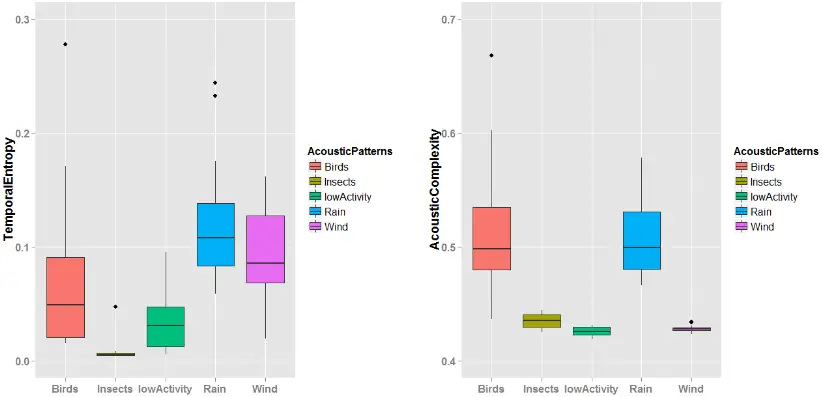

The aforementioned acoustic indices enable to scale up the analysis of species-specific acoustics towards acoustic dynamics of ecological communities. In this study, they are called summary acoustic indices since they convert the whole recording into a single value by averaging both time and frequency. A later research attempts to extend the usage of acoustic complexity index for long-term environmental monitoring (Farina, Pieretti and Piccioli 2011). They averaged the amplitude differences across time frames while maintaining all the frequency information. Such indices are called spectral acoustic indices in the current study.

Traditional spectrograms cannot display long duration recordings effectively. As shown in Figure 2.6, active bird vocalisations during the day are squeezed in a traditional 24-hour spectrogram and only limited patterns can be seen during the night due to the size of the computer screen. There is a necessity to develop effective methods to visualise long duration recordings.

Figure 2.6 A traditional spectrogram of a 24-hour recording

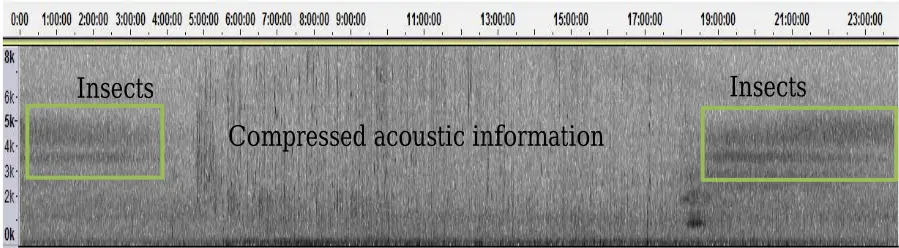

A combination of acoustic indices has also been utilised to visualise long-term acoustic information changes over time (Towsey, Zhang, et al. 2014). His work proposes a falsecolour spectrogram to depict a one-day, one-month, and even one-year acoustic data. Here, the false-colour is referred to a colour rendering scheme that uses RGB values to visualise a maximum of three acoustic indices that representing different facets of the acoustic energy. It offers a richer amount of acoustic information than a traditional spectrogram and may facilitate navigation through long-duration recordings.

Extended Acoustic SummarY (EASY) image is a false-colour spectrogram that displays months' and years' audio recordings. The generation of EASY image is described as follows. Three acoustic indices are calculated from a one-minute spectrogram, each of which has a single summary value. These values are then aligned in an order so that x-axis denotes the minutes of one day and the y-axis denotes different days. Finally, three acoustic indices are normalised and assigned to RGB values to construct a false-colour image.

Figure 2.7 is an example of EASY image by using acoustic complexity index, temporal entropy index, and FrequencyCover. From the diagram, it can be seen that the morning and the evening chorus coincide with the timing of sunrise and sunset (the left and right curves in white). The nocturnal acoustic activities (outside both white curves) are strong during warm months (from March to June). Although the diurnal acoustic activities in warm days (upper half of the graph) are assumed to be at least as strong as in cool days (bottom half of the graph), the graph shows faint acoustic activities in warm days. Notice that in May the acoustic sensor broke down for a period of time and when it was restored, some configurations were changed. These are the artefacts which make the diurnal acoustic activities after May stronger than those before May.

A recent research utilised acoustic indices for rain detection using different lengths of audio recordings (Ferroudj et al. 2014). This experiment has achieved a promising accuracy (93%) for rain detection, implying that acoustic indices can be used to acoustic scene classification for ecological purposes. However, one should note that acoustic indices have a trade-off between summarised (such as a change of acoustic intensity) and detailed (such as a specific bird vocalisation) information in a long-duration recording. They are not designed for the analysis of discrete acoustic events, but rather for characterising the general acoustic patterns as a whole. Therefore, people should be cautious of using indices for species related analysis.

Figure 2.7 Extended Acoustic SummarY (EASY) image with civil twilights

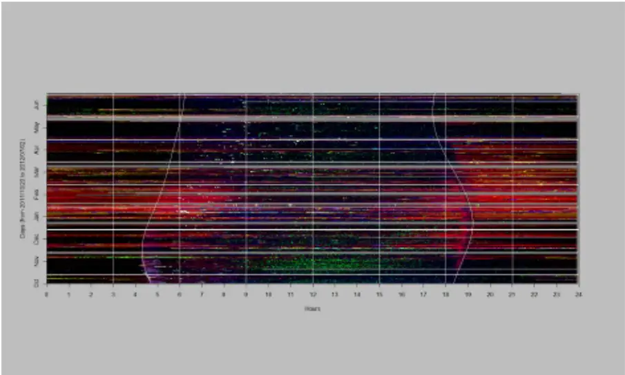

## 2.6 Semi-automated techniques to assist bird species surveys

Wimmer et al. (2013) first introduced acoustic sampling methods to assist bird species surveys when analysing large volumes of acoustic data. They compared five temporal sampling strategies over a five-day recording from the same site, concluding that the most efficient method to find bird species is dawn sampling, which investigates audio recordings that are 3 hours after dawn. However, there are no further instructions on how to effectively investigate these 3-hour acoustic data, and weather conditions such as heavy rain or strong wind could also interrupt acoustic activities of bird species. Dawn sampling is an intuitive method for bird species surveys; nevertheless, they realised that combinations of manual analysis and automated techniques may provide more feasible approaches for monitoring biodiversity at large spatiotemporal scales. They defined such combinations as semiautomated techniques. A computer assisted sampling method has been proposed for determining bird species richness in long duration recordings (Towsey, Wimmer, et al. 2014). This work utilised acoustic indices as proxies for the number of bird species per recording to sample one-day recordings. The experimental results showed that a linear combination of acoustic indices outperforms the use of single indices for directing bird species surveys in audio recordings. They also argued that this method has a higher efficiency than in-field surveys or random sampling of one-day recordings. However, no direct comparisons have been made between this method and dawn sampling. A recent paper applied a semi-automated approach to assist people with manual annotations of bird species (Truskinger, Towsey and Roe 2015). The authors developed two algorithms that can recommend potential species to an unknown bird vocalisation, minimising the need for people to memorise a large vocalisation dictionary. Despite the use of simple features, the best algorithm in his study improved the efficiency and effectiveness of annotating species vocalisations.

- 2.7 Summary

This chapter reviews a wide range of manual tools and automated techniques used for the analysis of environmental recordings. As for bird species surveys, either manual or automated approach has its own strengths and weaknesses. Humans can do well in matching patterns or discerning differences in an audio or its spectrogram counterpart. However, humans are also susceptible to fatigue and their expertise on bird species is normally constrained within a specific spatiotemporal scale. Automated techniques are evolving rapidly and have advantages over manual bird species analysis with a large number of environmental recordings. Acoustic indices offer a new insight into the analysis of a large number of environmental recordings. The use of acoustic indices has shown the potential to direct the bird species

22

surveys by sampling audio recordings. It is still not clear which combinations of acoustic indices have the optimal performance. Most importantly, the current method has limited performance on assisting bird species surveys from environmental recordings. The number of audio recordings required to be listened is large. There is a need for a more efficient approach to assist acoustic bird species surveys. This thesis aims to fill in this research gap by investigating various acoustic indices and advanced automated techniques to assist bird species surveys from massive audio recordings. Specifically, a classification and ranking procedure will be proposed to enhance the efficiency of acoustic bird species surveys in stages.

## 3 Methodology

This chapter describes the audio recordings and the methodology used to build automated techniques to facilitate efficient acoustic bird species surveys. Section 3.1 describes a subtropical ecosystem where the recordings are collected and some pre-processing procedures on the raw data which merit further analysis. Section 3.2 introduces a variety of acoustic indices that can be used to characterise audio clips and their calculation methods. These indices are crucial features for visualisation, classification and ranking audio clips. Section 3.3 depicts spectrograms and false-colour spectrograms which are used in this thesis as an exploratory analysis of the acoustic data. Single- and multi-label classifiers, their implementations, and evaluation of classification performance are detailed in section 3.4. A ranking method is proposed in section 3.5 with the classified audio clips that are likely to contain bird species, aiming to further improve the efficiency of determination of bird species. Section 3.6 introduces the benchmark species accumulation curves for examination of the efficiency of different approaches in bird species richness surveys.

## 3.1 Study sites and acoustic data

The audio recordings were collected from the Samford Ecological Research Facility (SERF), Brisbane, Australia (27.39˚S, 152.88˚E). The main vegetation in the study sites consists of inland open forest and woodland comprised of Eucalyptus tereticornis, Eucalyptus crebra and Melaleuca quinquenervia in moist drainage. The Samford Creek flows to the west of the study area. There are small areas of gallery rainforest and areas of open pasture along the southern boundary. A frog pond is in the southern open pasture (near site 4). Figure 3.1 shows the research area.

All recordings were made with a constant amplification gain and a sampling rate of 22050 Hz in stereo, 16 bits. They are down-sampled to 17640 Hz and cut into one-minute audio clips for the computational convenience. The one-minute audio clip has been widely used for acoustic data analysis (Pieretti, Farina and Morri 2011; Gage and Axel 2013). Stereo signals are later aggregated into a mono signal for further analysis.

Table 3.1 describes the basic information of the audio recordings. The recordings are partitioned into two separate groups. The training set is collected from two sites in the Samford Ecological Research Facility over six days. They are used for developing statistical models. The test set is a one-day recording collected from site 4 on 15th October 2010. They are used to evaluate the performance of statistical models in terms of assisting acoustic bird species surveys. Additionally, bird species have been annotated as presence or absence at a one-minute resolution by two experienced bird observers on four sites from 13th or 17th October 2010.

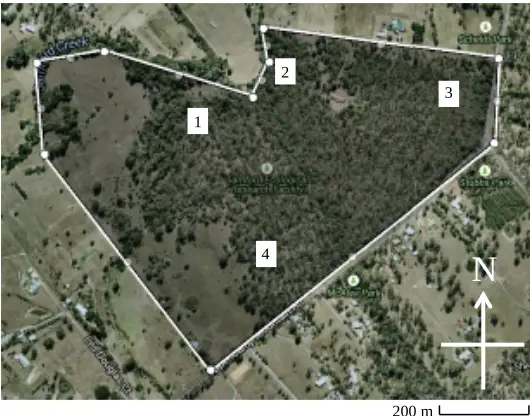

200 m

Figure 3.1 Four study sites in the Samford Ecological Research Facilities, Brisbane, Australia.

Table 3.1 Basic information of audio recordings used in this study

| Data     | Site | Dates                      | Formats |
| -------- | ---- | -------------------------- | ------- |
| Training | 3    | 13th and 14th October 2010 | MP3     |
|          | 3    | 16th and 17th October 2010 | MP3     |
|          | 3    | 13th April 2013            | WAV     |
|          | 3    | 16th October 2010          | MP3     |
| Test     | 4    | 15th October 2010          | MP3     |

## 3.2 Acoustic indices

As with most pattern recognition problems, selecting proper features is crucial for successful classification. Here our study objects are one-minute audio clips. For an audio clip, acoustic features can be derived from its waveform envelope or spectrogram amplitude. In this paper, a waveform envelope is a smoothed waveform by using a 512-point rectangular window with

50% overlap. A spectrogram is calculated by applying a Fourier transform to small segments of an audio clip. To obtain a comparable temporal resolution as the waveform envelope, the small audio segments are cut by a 512-point hamming window. To characterise audio clips, acoustic indices (features) can be derived from either waveform envelopes or spectrograms. Since environmental recordings contain strong background noise, a noise removal algorithm is applied to remove constant acoustic energy from the original recordings (Towsey 2013). Depending on how acoustic information is averaged from an audio clip, indices can also be categorised into two types: summary indices and spectral indices. Summary indices are single values that average all acoustic information of an audio clip; whereas spectral indices are vectors that only average temporal information but keep the spectral components. In this study, indices derived from waveform envelopes are summary indices; indices derived from spectrograms have both summary indices and spectral indices.

## 3.2.1 Indices derived from waveform envelopes

Given a time series x(n), 1≤ n ≤ N. Here, N denotes the length of the signal. Indices derived from waveform signals are calculated as follows:

1. Average signal amplitude (Towsey, Wimmer, et al. 2014): It is the average amplitude of the waveform envelope. The values are in decibels.
2. BackgroundNoise (bgNoise) (Towsey 2013): It measures constant acoustic energy estimated from the waveform. The values are in decibels.
3. Signal-to-noise ratio: It is the decibel differences between maximum amplitudes of the waveform envelope and the corresponding background noise features.
4. Temporal entropy index (H[t]) (Sueur et al. 2008): It is a Shannon index (Buddle et al. 2005) calculated from a waveform envelope, providing information on acoustic dispersion. Temporal entropy index ranges from 0 to 1 inclusive. If it is a signal with constant amplitude, the entropy value will be 0; an impulse will lead to entropy value to be 1.
5. 5-11. Matching pursuit indices (MP) (Mallat and Zhang 1993): matching pursuit maps a complex waveform signal to a small feature space, giving a sparse time-frequency representation. The advantages of this representation are that it is invariant to background noise and can capture the inherent structures of a waveform (Chu, Narayanan and Kuo 2009). In this paper, a Gabor dictionary in Matching Pursuit Toolkit (MPTK) (Krstulovic and

Gribonval 2006) is used for matching the basis functions. The signal-to-residual ratio (MP_SRR), the mean and standard deviation of chirp, frequency, and time scale are calculated individually, leading to seven matching pursuit features. The signal-to-residual ratio measures the complexity of a waveform signal. Given a certain number of iterations, the higher the signal-to-residual ratio, the more complex a waveform signal is; in other words, a waveform signal contains more diverse acoustic energy. In each basis function, parameter 'chirp' is referred to the changing rate of frequency and 'frequency' is referred to the fundamental frequency. Finally, 'time scale' is referred to the temporal position of each matched basis function.

The algorithm can be described as follows:

- 1. Generate an over-complete set of basis functions;
- 2. Compute the correlations between the targeted signal and all basis functions respectively by using inner product and find the basis function that has the highest correlation;
- 3. Subtract the most correlated basis function from the signal at corresponding time position with a weighting, resulting in a residual. The weighting is the inner product of the basis function and the signal;
- 4. Start a new iteration by computing the correlations between the residual and basis functions again, until a certain number of iterations or a pre-defined signal-to-residual energy ratio has been reached.

Figure 3.2 Various single-length basis functions for matching pursuit algorithm

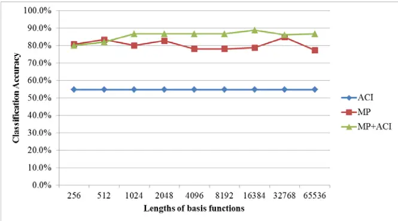

Figure 3.3 Various number of iterations for matching pursuit algorithm

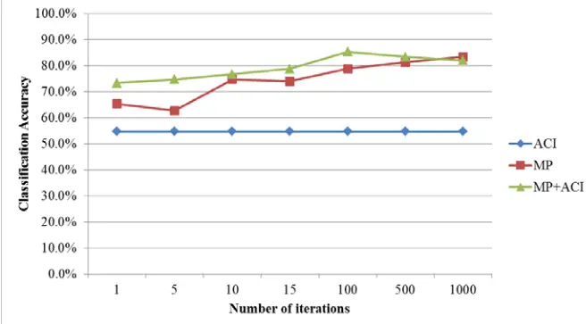

To determine a proper length for basis functions, the single-label classification accuracy of the training data is plotted as a function of the lengths of basis functions in Figure 3.2. The acoustic index ACI serves as a baseline in this graph. The classifier is decision tree. Note that the length of the basis function should be 2 n , where n is an integer from 0 to infinity. The length ranges from 256 to 65536 because they cover most common bird vocalisations. Figure 3.3 shows little fluctuations of accuracy when only matching pursuit features are used. Therefore, a 512-point Gaussian window with 50% overlap and a 512-point Fourier transform is used, which conforms to the resolution of other acoustic features. The stopping criterion is evaluated by comparing classification performance under different numbers of iterations (Figure 3.3). With the increase of the number of iterations, the classification accuracy increases. However, the increase rate drops when the number of iterations is over 100 while the performance of combined features also decreases. Considering the trade-off between computational costs and classification accuracy gain, the number of iterations is set to 500.

## 3.2.2 Indices derived from spectrograms

Acoustic indices can also be calculated from a spectrogram. Here, a spectrogram is the shorttime Fourier transform of a waveform signal with a non-overlapping 512-point hamming window. After the short-time Fourier transform, the result is a spectrogram which can be described by a matrix S of N time frames and M frequency bins. By averaging acoustic information on both time frames and frequency bins of a spectrogram, a summary index can be obtained; while averaging acoustic information only on time frames, a spectral index can be acquired.

Summary indices derived from spectrograms are described as follows:

12. Acoustic Complexity Index (ACI) (Pieretti, Farina and Morri 2011): It is a measure of spectral changes over time. If spectral amplitudes are changing rapidly from frame to frame in a spectrogram, ACI will have a relatively large value; by contrast, if spectral amplitudes have small changes, ACI will be small.
13. 13-15. FrequencyCover (Towsey, Zhang, et al. 2014): It is referred to the count of values that are greater than a threshold divided by the total time frames of a spectrogram. The threshold is 3dB in this paper selected by trial and error. Frequency cover is divided and summarised as a single value from three frequency ranges (0-482 Hz, 482-3500 Hz, and 3500-8820 Hz), which are defined as low, mid, and high-frequency cover respectively.
14. Spectral entropy (H[s]) (Towsey, Wimmer, et al. 2014): It is an entropy index of average amplitude calculated within frequency bins from 482 Hz to 8820 Hz. The low-frequency components are removed to reduce background noise from planes or vehicle engines.
15. Entropy of spectral maxima (H[m]) (Towsey, Wimmer, et al. 2014): It is an entropy index of amplitude that has maximum counts within frequency bin from 482 Hz to 8820 Hz. This is the same frequency range as that of spectral entropy index.
16. 18-19. Ridge features (verRidge and horRidge) (Dong et al. 2013): Ridge features are derived from spectrograms using image processing techniques. For a two-dimensional spectrogram image, there are at least two directions for calculating ridge features: horizontal ridge (temporal domain) and vertical ridge (spectral domain). The calculation of ridge features is by convoluting a mask matrix with the spectrogram matrix, where the mask matrix reflects the direction of the ridge. In this work, only two mask matrices are used to calculate ridge features. These two matrices aim to capture horizontal (maskh) and vertical (maskv) features respectively:

$$\ m a s k _ { \mathbf h } = \begin{bmatrix} - 0 . 1 & - 0 . 1 & - 0 . 1 & - 0 . 1 & - 0 . 1 \\ - 0 . 1 & - 0 . 1 & - 0 . 1 & - 0 . 1 & - 0 . 1 \\ + 0 . 4 & + 0 . 4 & + 0 . 4 & + 0 . 4 & + 0 . 4 \\ - 0 . 1 & - 0 . 1 & - 0 . 1 & - 0 . 1 & - 0 . 1 \\ - 0 . 1 & - 0 . 1 & - 0 . 1 & - 0 . 1 & - 0 . 1 \end{bmatrix}$$

$$\ m a s k _ { v } = \begin{bmatrix} - 0 . 1 & - 0 . 1 & + 0 . 4 & - 0 . 1 & - 0 . 1 \\ - 0 . 1 & - 0 . 1 & + 0 . 4 & - 0 . 1 & - 0 . 1 \\ - 0 . 1 & - 0 . 1 & + 0 . 4 & - 0 . 1 & - 0 . 1 \\ - 0 . 1 & - 0 . 1 & + 0 . 4 & - 0 . 1 & - 0 . 1 \end{bmatrix}$$

For the convoluted matrix, an empirical value of 5.5 has been used to remove background noise. Finally, the summarised ridge features are the average count of vertical and horizontal ridges in the spectrogram image.

20. Mel-frequency cepstral coefficients (MFCCs) (Molau et al. 2001): It is calculated by applying a short-time Fourier transform to an audio signal, mapping the powers of the spectra to Mel-frequency banks, and converting Mel-frequency banks in a logarithmic scale. Here the Mel-scale relates physical frequency to perceived frequency by humans. The equation for converting physical frequency to Mel-frequency is:

$$M e l { - f r e q u e n c y } = 1 1 2 5 \times \log _ { e } ( 1 + f r e q u e n c y / 7 0 0 )$$

Typically 12 Mel-frequency cepstral coefficients are obtained by using discrete cosine transform on the logarithmic Mel-frequency. MFCCs have a higher resolution on lowfrequency information of a signal. Since traditional MFCCs have detailed frequency information, to compare with other features which average the frequency components, the aveMFCCs is a summarised value obtained by averaging 12 Mel-frequency cepstral coefficients.

Note that aforementioned features are summary indices that are mainly used for classifying five acoustic patterns (Birds, Insects, Low activity, Rain, and Wind) of one-minute audio clips. Spectral indices are obtained by only averaging temporal information while retaining spectral information at frequency bins. Spectral indices are later used as a proxy to rank audio clips in chapter 5.

## 3.3 Analysis tools

Software used to calculate the acoustic indices are described as follows. The matching pursuit features are calculated by the MPTK 0.7.0 package and MFCCs are calculated by the signal processing toolbox in MATLAB 2014b. The software used to generate the rest of the indices was a proprietary C# application developed by the QUT Ecoacoustics Research Group (Truskinger et al. 2014). The program, named AnalysisPrograms.exe, was compiled on August 15th, 2014 with the version number 14.08.0.0.

R (Team 2013) is open source software designed for statistical computing. It has good graphic functionality as well. Users are able to create their own functions for a specific process. Its capacity of data analysis is increasing because of its growing number of extensive packages. Due to its flexible and powerful analysis packages, R 3.0.2 and RStudio 0.98.994 are used as major tools for acoustic data analysis. Weka (Waikato Environment for Knowledge Analysis) is open source software which is written by University of Waikato, New Zealand in Java (Hall et al. 2009). It provides a broad range of implementations of machine learning algorithms. In this research, the feature selection and classification tasks are conducted with version 3.7.11.

## 3.4 Visualisation for exploratory analysis

The eco-acoustic research group at the Queensland University of Technology proposes a new method --- the false-colour spectrogram --- to display general information in long duration recordings (Towsey &amp; Zhang, 2014; Towsey et al., 2014). The false colour is referred to a group of colour rendering methods used to display images. In a false-colour spectrogram, three acoustic indices are assigned to the RGB values as a rendering scheme, demonstrating three aspects of summarised acoustic information in a single spectrogram. In an exploratory experiment, ACI, H[t] and FrequencyCover are selected to construct a false-colour spectrogram. For each one-minute recording, the spectrogram matrix is p × q, where p is referred to time frames, which is determined by the length of the window used in short-time Fourier transform; and q is referred to frequency bins. Each of the indices is averaged by the time frames, resulting in a vector of q frequency bins for the one-minute audio clip. For each day, there is a total of l minutes, which produces a matrix of l×q. Consequently, three indices produce three matrices, and they will be allocated to RGB values respectively to generate a false-colour spectrogram. Figure 3.4 is a false-colour spectrogram of a one-day audio recording collected from Sunshine Coast, Brisbane, Australia. The x-axis represents the time at a one-minute resolution and the y-axis stands for frequency ranging from 0 Hz to 8820 Hz equally divided into 256 bins. Normalised acoustic indices such as acoustic complexity index, temporal entropy index, and frequency cover are assigned to RGB values respectively. Each pixel denotes the strength of acoustic energy for a specific frequency bin per minute. Various acoustic patterns are annotated by listening to the raw recordings. In the graph, birds are found to be active from around minute 300 to 1080 (5 a.m. to 6 p.m.). Their vocalisations can be interrupted because of heavy rain (yellow region). During the midnight, acoustic energy is relatively low (white region) which means there are fewer vocal species. The horizontal band rises after dusk is insect chirping. Acoustic patterns (such as morning chorus, crow's calls, rain and insect's chirpings) within a fixed period of time explicitly appear in a 24-hour falsecolour spectrogram. It is also convenient for ecologists to quickly pinpoint the acoustic patterns of interest.

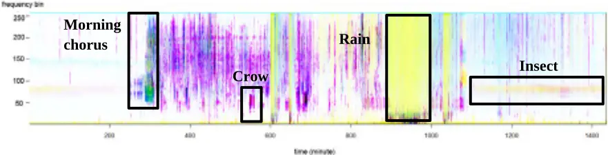

tine (ninute)

Figure 3.4 A false-colour spectrogram of a one day's recording

## 3.5 Classifying one-minute audio clips

To remove audio clips that are unlikely to contain bird species, single- and multi-label classifiers are investigated. The classification accuracy and how they effectively remove irrelevant audio clips can be found in chapter 4. This section elaborates the settings of different classifiers and their evaluation metrics.

## 3.5.1 Single-label classifiers

For the single-label classifiers, three classic algorithms: k-nearest neighbour, decision tree, and multilayer perceptron (Duda, Hart and Stork 2012) are examined. These algorithms are supervised machine learning that implements different ideas for classification.

The k-nearest neighbour (kNN) associates an unlabelled instance with the label of most similar instances. The parameter k implies the number of nearest neighbours that will be used to determine the label. For an unlabelled instance, its label will be determined by the k instances that have the most common label. Despite the simplicity of the algorithm, kNN is a powerful method and has been widely used. It makes no assumptions about the data distribution. It does not require creating a statistical model, making the training process fast.

Decision tree generates a sequence of splitting nodes that divide a training dataset into groups of homogeneous instances and associate any of the nodes that have no further splitting with a label. Typically, each splitting node aims at maximising the information gain; in other words, after splitting, instances in the same group should be more alike than those before the split.

Normally, the information gain can be measured by the changes of Shannon index or Gini index. Decision tree performs well and its model is interpretable on most problems. Additionally, it excludes unimportant features and is scalable to large datasets. Multilayer perceptron is an artificial neural network algorithm that maps input features onto output labels. The input data are sent to input nodes without processing. Each input node is used to deal with a single feature in the dataset. The output nodes are the labels. The input and output nodes are organised as two groups known as layers. The next layer nodes are weighted combinations of nodes from the previous layer. Multilayer perceptron is a feedforward neural network which has no feedbacks during the process and has intermediate layers in the middle. Particularly, a single-layer perceptron has only one set of connection weights from the input data to the output labels. In a supervised machine learning paradigm, there are always two steps: one for training a classification model and the other for testing the performance of the model. These two steps

should be conducted with two exclusive datasets.

## 3.5.2 Multi-label classifiers

A multi-label classifier can be considered as a single-label classifier with a 'wrapper' that converts a multi-label problem into a single-label problem. Although there exist several approaches for such a problem transformation (Tsoumakas, Katakis and Vlahavas 2010), binary relevance is a powerful one because of its scalability and flexibility. The idea of binary relevance is it considers a multi-label classification problem as multiple binary classification problems assuming that there are no correlations between different classes. After the problem transformation, a single-label classifier is used to classify each of the class. The single-label classifiers are the same with those used in single-label classification so that their performance on assisting bird species surveys can be compared.

## 3.5.3 Parameter setting

To optimise overall accuracy, a stepwise search on the parameters of three classifiers is implemented. These parameters can be applied to both multi-label and single-label classification because they use the same classifiers. The Weka 3.7.11 (Hall et al. 2009) and its extension MEKA (Read 2015) is used for the single-label and multi-label classification problems respectively.

For kNN, the number of nearest neighbours is evaluated increasing incrementally from 1 to 10. It is found that 5 nearest neighbours provide the highest accuracy in the training dataset. For decision tree, the minimum number of instances per leaf from 2 to 6 is tested, and the default setting of 2 is found to provide the highest accuracy. For multilayer perceptron, the number of nodes from 1 to 10 is examined with one hidden layer, and the default number of 6 nodes offers the highest accuracy.

A ten-fold cross-validation is implemented to evaluate the classification models. In a ten-fold cross-validation, all audio clips are divided into ten groups at random. For each fold, nine groups are used for training and the remaining group is used for testing. The final performance of any classifier is estimated by the average values over ten folds and the model that has the best performance is selected as the final model.

## 3.5.4 Evaluation metrics

In single-label classification, the prediction of a class (one of the five acoustic patterns in this study) is binary: either correct or incorrect. Evaluations of a specific class are formulated in a 2-by-2 contingency table (Table 3.2), including accuracy, precision, and recall. They measure different aspects of the performance. Accuracy measures the proportion of correct predictions amongst the total number of instances. Precision is referred to the possibility of making a correct prediction when the classifier predicts a particular class. Recall is referred to the possibility of making a correct prediction amongst a particular class. The definitions are given as below:

$$A c c u r a c y = \frac { T r u e \, \text {Positive} + T r u e \, \text {Negative} } { T r u e \, \text {Positive} + T r u e \, \text {Negative} + \text {False Positive} + \text {False Negative} } \\ P r e c i s i o n = \frac { T r u e \, \text {Positive} } { T r u e \, \text {Positive} + \text {False Positive} }$$

$$R e c a l l = \frac { T r u e \, P o s i t i v e } { T r u e \, P o s i t i v e + F a l s e \, N e g a t i v e }$$

Table 3.2 A 2-by-2 contingency table of the single-label classification results

|              |          | Prediction - Positive | Prediction - Negative |
| ------------ | -------- | --------------------- | --------------------- |
| Ground Truth | Positive | True Positive         | False Negative        |
| Ground Truth | Negative | False Positive        | True Negative         |

In multi-label classification, predictions are a set of labels where predictions can be partially correct. It is obvious that none of the aforementioned evaluation metrics reflects this notion in their original forms. To measure partially correct, one strategy is to average the differences between the predicted labels and the actual labels for all labels and instances. In this research, three of these measures are selected to evaluate the performance of multi-label classification. They are ranked by the strength from weak to strong: hamming loss, accuracyM, and exact match. A subscript letter 'M' is used to distinguish the accuracy of multi-label classification from that of single-label classification. In the following definitions of evaluation metrics, xi and yi denote the prediction and the ground truth respectively; |I| is the number of instances (audio clips) and |L| is the number of possible labels.

Hamming loss accounts for the prediction error and the missing error, normalised over the total number of labels and instances. It measures the average times that an instance is associated with an incorrect label. Here 'xor' denotes exclusive or.

$$H a m m i n g L o s s ( x _ { i } , y _ { i } ) = \frac { 1 } { | I | } \sum _ { i = 1 } ^ { | I | } \frac { x o r ( x _ { i } , y _ { i } ) } { | L | }$$

Here, accuracyM is defined as the proportion of the correctly predicted labels to the total number of labels; this proportion is later averaged across all instances. Note that it is possible to calculate individual accuracy for each label.

$$A c c u r a c y _ { M } ( x _ { i } , y _ { i } ) = \frac { 1 } { | I | } \sum _ { i = 1 } ^ { | I | } \frac { | x _ { i } \cap y _ { i } | } { | x _ { i } \cup y _ { i } | }$$

Exact match is a measure of precise match between predictions and actual labels. It extends the accuracy metric in single-label classification for the multi-label problem, where partially correct predictions are considered as incorrect ones.

$$E x a c t M a t c h ( x _ { i } , y _ { i } ) = \frac { 1 } { | I | } \sum _ { i = 1 } ^ { | I | } ( x _ { i } \equiv y _ { i } )$$

The values of hamming loss, accuracy, and exact match range from 0 to 1 inclusive. For hamming loss, 0 corresponds to perfect prediction and 1 corresponds to wrong predictions for all labels of each instance; whereas for accuracy and exact match, higher values mean better classification performance.

## 3.6 Ranking one-minute audio clips

## 3.6.1 Using acoustic indices as a proxy for the number of bird species

Some one-minute audio clips naturally contain more bird species than others. Consider, for example, the dawn and dusk choruses. Listening to audio clips which contain more birds has a high probability of finding new bird species. Although the exact number of bird species in an audio clip is difficult to identify by their vocalisations, one that contains more species normally can be characterised due to its high acoustic activity. Acoustic indices are summary information that can reflect the general acoustic complexity of an audio clip. Based on the assumption that a high diversity of bird species in an audio clip has a high level of acoustic complexity, acoustic indices can be used as a proxy for the number of bird species in an audio clip. Therefore, a higher efficiency of determining bird species richness can be achieved by listening to audio clips that are ranked by the acoustic indices.

Correlation coefficients between acoustic indices and the number of bird species are used to select an index which best indicates the acoustic activity of audio clips. Spearman's, instead of Pearson's, correlation coefficient is used to select such a proxy. The reason for selecting Spearman's correlation coefficient is it measures the monotonic relationships without any assumption about the statistical distribution of either variable; whereas Pearson's correlation coefficient measures the linear relationships between two variables that have normal distributions. Since correlations between acoustic features and the number of bird species do not have to be linear in this case, Spearman's correlation coefficient is more appropriate than Pearson's. The acoustic index that best correlated with the number of bird species in individual audio clips is utilised to rank audio clips, giving each of them a priority to listen to.

## 3.6.2 Detecting shared bird species amongst audio clips

Acoustic indices reflect the general complexity of an audio clip but ignore the detailed information of individual bird species; therefore, they cannot identify shared species amongst audio clips, which might impede bird species richness surveys. An ideal strategy for bird species richness surveys should be each sampled audio clip provides the maximum number of unique bird species. However, prior knowledge of present bird species in an audio clip is unavailable in most cases. Indeed, it is the purpose of this study to develop computer-assisted techniques to facilitate manual bird surveying. A practical alternative is to use distinct bird vocalisation to represent unique bird species under the assumptions that no species share similar vocalisations and any species has a low diversity of vocalisations. Therefore, the problem of sampling audio clips with the most bird species is formulated as sampling audio clips with the most distinct bird vocalisations. A nonnegative matrix factorisation technique is implemented to extract spectral profiles from an audio clip to represent distinct bird vocalisations. By measuring the similarity of these spectral profiles, it is possible to create a codebook of distinct spectral profiles for all target audio clips and identify present ones in each audio clip. Given the present and absent information of spectral profiles and hence bird vocalisations, a greedy algorithm is designed to sample audio clips so that each audio clip can provide the maximum number of unique spectral profiles. Such an algorithm enables to discriminate shared bird vocalisations amongst audio clip and the sampled audio clips can enhance the efficiency of manual bird species richness surveys.

- 3.7 Species accumulation curves

This thesis aims to develop automated techniques to improve the efficiency of surveying birds. To evaluate the performance of different methods, species accumulation curves are plotted. Figure 3.5 demonstrates two benchmarks of species accumulation curves. One (black triangles) is the theoretical best which maximises the bird species found at each sampled audio clip using the bird annotations; the other (green circles) serves as the baseline which is the mean of sampling 1435 one-minute audio clips (equivalent to a one-day recording) 1000 times at random. These two curves constitute the upper and lower boundaries of species accumulation curves, any useful method should generate a species accumulation curve residing between these two benchmarks.

37

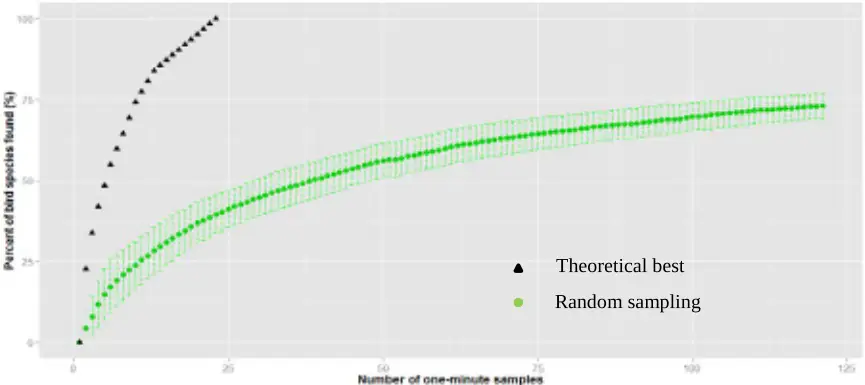

Number of one-minute samples

Figure 3.5 Two benchmarks of species accumulation curves

## 4 Classification of audio clips to assist bird species surveys

This chapter aims to remove audio clips that are unlikely to contain bird species for efficient species surveys. As with any other data analysis procedure, it starts with visual exploration because visualisation is a common onset of gaining insights into a large number of data. In section 4.1 a false-colour spectrogram is illustrated to explore a one-day audio recording. By removing these non-bird recordings, it is possible to improve the efficiency of bird species surveys. Despite the complexity of environmental audio clips, section 4.2 assumes that each audio clip can be described by a dominant acoustic pattern and uses a classifier for irrelevant data removal. In section 4.3, simultaneous acoustic patterns are taken into consideration by using multi-label classifiers and the performance of both classification tasks is compared. Section 4.4 discusses the efficiency of using classification approaches to assist bird species richness surveys with species accumulation curves. Finally, this chapter concludes with section 4.5 and raises other issues when using acoustics to study bird species.

## 4.1 Visualisation of a one-day audio recording

To get a glimpse of what could happen in an environmental recording, Figure 4.1 visualises 1435 continuous one-minute audio clips using the false-colour spectrogram technique (Towsey, Zhang, et al. 2014). It is a false-colour spectrogram of a one-day recording on 13th October 2010. Normalised acoustic indices such as acoustic complexity index, H[t] and FrequencyCover are assigned to the RGB values respectively to construct this figure. Each pixel stands for a single frequency bin of a particular minute. It can be seen that the majority of bird vocalisations are active from around 5:00 to 18:00 of the day. There might be irrelevant recordings that are less likely to contain bird species.

Based on these observations, five acoustic patterns that may dominate one-minute audio recordings are pre-defined. They are 'Birds', 'Insects', 'Low activity', 'Rain', and 'Wind'. Although 'Birds' is of particular interest in the current study, other four acoustic patterns are defined to see if they will be misclassified as 'Birds'. Geophysical processes (e.g. rain and wind) often correlate with species activity. For instance, heavy rain and strong winds suppress bird vocalisations and indicate the absence of bird species. Although rain and wind can be measured by weather stations, the measurement can be inaccurate if these stations are located far away from acoustic sensors. Insects chirping and silence (low activity) are two common acoustic patterns that may occur exclusively in one-minute recordings at night. These five acoustic patterns reveal the distribution of general environmental sounds. Figure 4.2 depicts the five acoustic patterns in waveforms (left) and their corresponding spectrograms (right), each of which displays distinct spatiotemporal distributions of acoustic energy.

Figure 4.1 An example of active bird vocalisations during the day

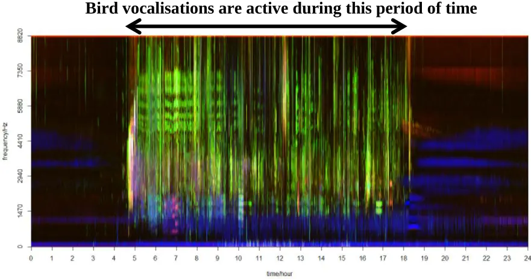

Figure 4.2 The waveforms (left) and spectrograms (right) of five pre-defined acoustic patterns

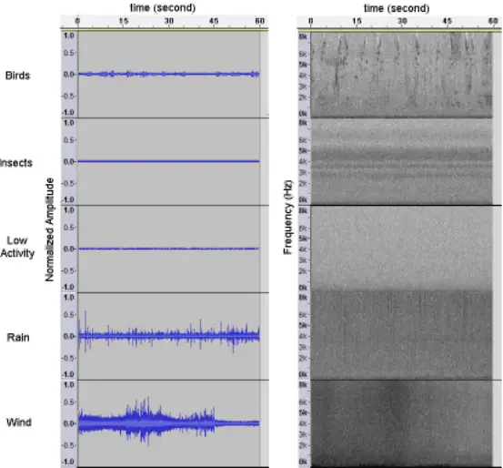

## 4.2 Single-label classification

The visualisations in the previous section show that irrelevant audio clips that are unlikely to contain bird species in a one-day recording and they have distinct acoustic characteristics. This also makes it possible to use classification techniques to remove the redundancy and improve the efficiency of bird surveying.

A typical single-label classification process consists of two steps (Figure 4.3 and Figure 4.4):

1. A statistical model is generated based on some labelled audio clips. These audio clips should be manually labelled as one of the five pre-defined acoustic patterns and their acoustic characteristics can be described by calculating the acoustic indices introduced in section 3.2. A statistical model is generated by using criteria that can discriminate acoustic patterns with acoustic indices.
2. The statistical model is used to identify new unlabelled audio clips. This can be achieved by calculating the acoustic indices for the unlabelled audio clips and using the statistical model to map the acoustic indices to a specific acoustic pattern.

Figure 4.3 The generation of a statistical model

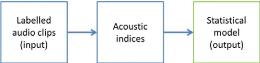

Figure 4.4 Using the statistical model to identify unlabelled audio clips

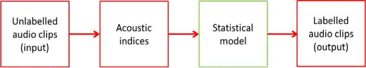

A training dataset has been collected to generate single-label classification models. Table 4.1 shows that there are 150 one-minute audio clips for the five acoustic patterns, each of which has 30 audio clips. The 1435 one-minute audio clips on 15 th October 2010 have also been labelled by the author for testing purpose. The labels are 661 of 'Birds', 194 of 'Insects', 319 of 'LowActivity', 212 of 'Rain', and 49 of 'Wind'.

Table 4.1 Labelled one-minute audio clips for training single-label classification models

| Acoustic pattern | Number of one-minute audio clips |
| ---------------- | -------------------------------- |
| Birds            | 30                               |
| Insects          | 30                               |
| Low Activity     | 30                               |
| Rain             | 30                               |
| Wind             | 30                               |
| Total            | 150                              |

## 4.2.1 A pilot study

The decision tree algorithm, as an example of classification techniques, is attested for the feasibility of classifying aforementioned five acoustic patterns and removing audio clips that are unlikely to contain birds. The decision tree is used rather than other classification algorithms mainly because its result is easily interpretable.

Figure 4.5 illustrates the decision tree model. The oval nodes represent the features (acoustic indices) to split the training instances. Rectangular boxes represent the five classes: the number on the left is the total instances in that class and the number on the right is the misclassified instances. A single number means that they are all correctly classified. Three acoustic indices - horRidge, ACI, and BgNoise - are determined by the algorithm as the most important features for classifying one-minute audio-clips. The horRidge enables to capture acoustic energy that lasts a few time frames of a spectrogram, which is commonly found in sounds of 'Insects' and 'Birds'. The ACI describes acoustic intensity differences between adjacent time frames of a spectrogram. Therefore, broadband acoustic energy occupying an entire audio clip leads to high ACI values. 'Rain' and 'Birds' (collective bird vocalisations) of a one-minute audio clip normally have such acoustic characteristics. 'Wind' and 'Low activity' do not have standout features in spectrograms but have different levels of energy in waveforms. This could be the main reason why BgNoise was chosen to discriminate these two classes since BgNoise is derived from the waveform envelope.

Table 4.2 is the confusion matrix for the 150 training one-minute samples collected from site 3, the SERF. The diagonal values (in bold) represent the correctly classified instances of the training data. The overall classification accuracy is 89.3%. Particularly, the class 'Insects' has the highest classification accuracy (100%) and the classification accuracy for 'Birds' is

92.9%. Notice that 'Low activity' and 'Wind' have the most misclassified instances; this is due to the fact that 'Wind' is sporadic acoustic energy, acoustic indices averaged across oneminute audio are not able to summarise enough acoustic information to discriminate them.

Figure 4.5 A decision tree model trained by Weka 3.7.11

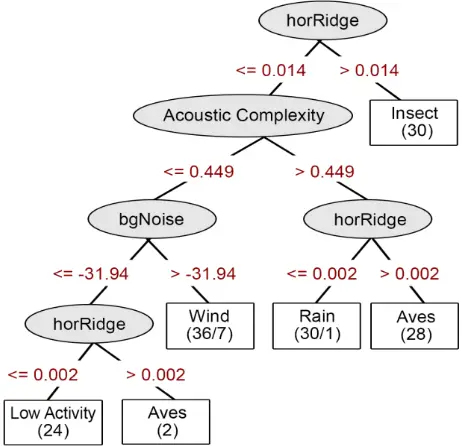

Table 4.2 Confusion matrix of training data using decision tree

| Classified as → | Birds | Insects | Low activity | Rain | Wind |
| --------------- | ----- | ------- | ------------ | ---- | ---- |
| Birds           | 28    | 0       | 2            | 0    | 0    |
| Insects         | 0     | 30      | 0            | 0    | 0    |
| Low activity    | 1     | 0       | 21           | 1    | 7    |
| Rain            | 1     | 0       | 0            | 28   | 1    |
| Wind            | 0     | 0       | 2            | 1    | 27   |

The results for the test dataset on 15th October 2010 are shown in Table 4.3. The overall classification accuracy is 82.6% with a total of 1440 minutes. The classification precision for the class 'Birds' is 87.7%. According to the bird annotations, 93.6% (58/62) of the total bird species remain within 44.0% (634/1440) of a one-day recording. Note that the majority of misclassifications for the test dataset occurred between the 'Birds' and 'Rain'. This is mainly because some bird vocalisations have similar features as rain and, the acoustic indices used in this study fail to distinguish them. Table 4.4 illustrates that more than half of the total amount of acoustic data can be removed without losing many species. Particularly on 16th October, there is a huge data reduction because of strong wind gusts suppressed other biophonic activities.

Table 4.3 Confusion matrix of test data using decision tree

| Classified as → | Birds | Insects | Low activity | Rain | Wind |
| --------------- | ----- | ------- | ------------ | ---- | ---- |
| Birds           | 556   | 67      | 3            | 31   | 4    |
| Insects         | 7     | 141     | 27           | 9    | 0    |
| Low activity    | 3     | 72      | 231          | 1    | 13   |
| Rain            | 7     | 33      | 3            | 162  | 8    |
| Wind            | 1     | 5       | 9            | 4    | 26   |

Table 4.4 Results before and after classification for 5 days on site 4, the SERF

|                                         | October 2010 - 13 th | October 2010 - 14 th | October 2010 - 15 th | October 2010 - 16 th | October 2010 - 17 th |
| --------------------------------------- | -------------------- | -------------------- | -------------------- | -------------------- | -------------------- |
| Number of species before classification | 62                   | 58                   | 62                   | 45                   | 62                   |
| Number of species after classification  | 60                   | 57                   | 59                   | 39                   | 58                   |
| Data reduction                          | 51.5%                | 44.6%                | 56.0%                | 87.3%                | 49.0%                |

Figure 4.6 and Figure 4.7 shows the bird species accumulation curves of two days separately. The decision tree approach is compared with two benchmarks. The triangles are the theoretical best results that can be obtained from bird annotations. The baseline is sampling 1435 minutes at random of the same day. The audio clips classified as 'Birds' are also randomly sampled, providing another species accumulation curve (squares) in the graph. Error bars indicate the one standard deviation at each one-minute sample.

Generally, these two days have seen a distinct increase in terms of the number of bird species found at each sampled one-minute audio clip. On 15th October 2010, the differences of bird species survey efficiency between the classification methods and random sampling on 1435 audio clips are much smaller than that of 16th. This is mainly because strong wind gusted throughout the 16th and bird species vocalised less actively. The proposed classifier successfully removed windy audio clips that are unlikely to contain birds. Such results imply that the classification methods are preferable for acoustic bird species surveys in the cases of bad weather conditions.

Figure 4.6 Species accumulation curves of 15th October 2010, site 4, the SERF

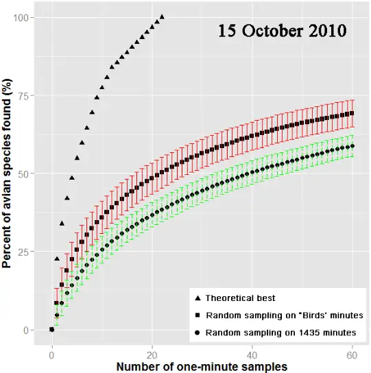

Figure 4.7 Species accumulation curves of 16th October 2010, site 4, the SERF

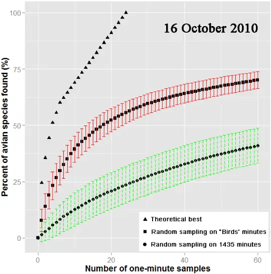

The missing bird species are also investigated. Take 15th October 2010 for example. Red junglefowl (Gallus.gallus) and Willie wagtail (Rhipidura.leucophrys) vocalised before dawn and their vocalisations are not strong enough for acoustic indices to summarise ample acoustic information, so these minutes are misclassified as 'Low activity'. Rainbow bee-eater (Merops.ornatus) vocalises at the 977th minute, but the vocalisations are masked by rain. These species should be taken special care of since they vocalise rarer than other species. Statistical tests have been conducted to see whether the decision tree model is effective in improving the efficiency of determining bird species richness. Since the distribution of percent of bird species found at each minute sample is not normal (tested by Shapiro-Wilk's test, p &lt; 0.001), the paired t-test is not suitable for the current experiment. Instead, a twosample paired Wilcoxon (also known as Mann-Whitney) tests was used. The Wilcoxon test (p &lt; 0.001) shows that the percent of bird species found per minute by random sampling on 'Birds' minutes is different from that of random sampling a one-day recording. When the species accumulation curves are taken into consideration (Figure 4.6), the classification methods have the potential to improve the efficiency for determining bird species richness, especially for those days with rainy and windy data.

## 4.2.2 Feature selection

As reported in other research (Chu, Narayanan and Kuo 2009), using all features for classification does not necessarily provide the best performance due to the inter-correlation between the features. Note that a total of 20 acoustic indices are used in this thesis (described in section 3.2). A forward stepwise method (Hall 1999) is utilised to determine acoustic indices that are correlated with the five acoustic patterns but have low inter-correlations, leading to a set of 7 acoustic indices: AveSignalAmplitude, AcousticComplexity, TemporalEntropy, AveEntropyPeaks, verRidge, horRidge, and MP_SRR. The overall classification accuracy are compared in Figure 4.8 using different combinations of feature sets and classifiers. The 'feature selection' column is derived from the abovementioned method. The 'All features' column contains 20 acoustic indices described in section 3.2. For different feature sets, the use of multiple indices (7 feature sets on the right, from 'ridge features' to 'feature selection') always outperforms that of a single index (7 single features on the left, from 'SNR' to 'aveMFCC'), implying that different acoustic indices complement each other on characterising one-minute acoustic patterns. Acoustic

indices selected by the forward stepwise method yields comparable classification accuracy with all indices, but the former simplifies the classification model. Therefore, it is preferable to perform feature selection prior to the generation of the classification model. For the classifiers, the classification accuracy of kNN is unstable when compared with the decision tree and the multilayer perceptron; moreover, the multilayer perceptron has higher classification accuracy than decision tree in most cases.

Based on these comparisons, the multilayer perceptron and the acoustic indices selected by a forward stepwise method are used to generate a classification model with a consistent and optimal performance for the rest of the study.

Figure 4.8 Classification accuracy of three classifiers using different feature sets

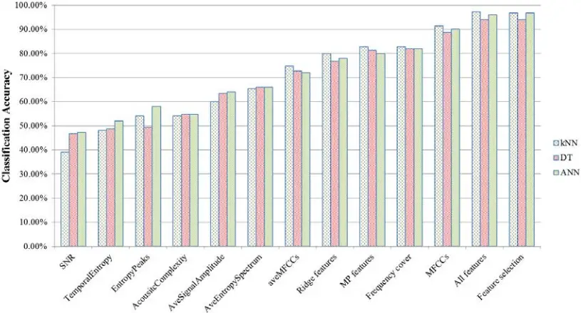

## 4.2.3 Classification accuracy

To validate the reliability of the classification model, the multilayer perceptron model with selected features is applied to the test dataset with 1435 one-minute audio clips (Table 3.1). The overall accuracy of test data is 82.4%. Particularly, Table 4.5 shows that the class 'Birds' have the highest classification precision (96.7%) and recall (88.4%) amongst the five acoustic patterns. To reveal more subtle details, the classification accuracy for each of the five acoustic patterns is investigated by using a confusion matrix. Table 4.6 shows that Birds is the most common class in the test data and the number of instances is more than twice as many as the second largest class Low Activity. The results also point out that Birds, Low Activity and Rain are often misclassified as Insects, but not vice versa.

Table 4.5 Classification evaluations of the test dataset

|               | Birds | Insects | Low Activity | Rain | Wind |
| ------------- | ----- | ------- | ------------ | ---- | ---- |
| Precision (%) | 96.7  | 49.9    | 91.9         | 90.9 | 56.1 |
| Recall (%)    | 88.4  | 87.1    | 78.0         | 70.3 | 65.3 |

Table 4.6 Confusion matrix of test dataset using the feature selection

| Classified as →  | Birds | Insects | Low Activity | Rain | Wind | Actual Total |
| ---------------- | ----- | ------- | ------------ | ---- | ---- | ------------ |
| Birds            | 585   | 67      | 3            | 2    | 5    | 662          |
| Insects          | 7     | 169     | 9            | 9    | 0    | 194          |
| Low Activity     | 4     | 53      | 248          | 2    | 11   | 318          |
| Rain             | 6     | 46      | 2            | 149  | 9    | 212          |
| Wind             | 3     | 4       | 8            | 2    | 32   | 49           |
| Classified Total | 605   | 339     | 270          | 164  | 57   | 1435         |

## 4.3 Multi-label classification

For multi-label classification, 1435 one-minute audio clips on 15th October 2010 are labelled with one to five classes by the author. Table 4.7 shows the number of audio clips with a different combination of labels. Over 56% of audio clips contain multiple labels. The average number of labels per audio clip (the cardinality of the labels) is 1.66. A ten-fold crossvalidation has been run on this dataset.

Table 4.7 The number of audio clips associated with different combinations of labels

| Row | Number of labels | Labels                 | Number of audio clips |
| --- | ---------------- | ---------------------- | --------------------- |
| 1   | 1                | Birds                  | 556                   |
| 2   | 1                | Insects                | 1                     |
| 3   | 1                | Low activity           | 1                     |
| 4   | 1                | Rain                   | 63                    |
| 5   | 1                | Wind                   | 3                     |
| 6   | 2                | Birds & Insects        | 19                    |
| 7   | 2                | Birds & Low activity   | 50                    |
| 8   | 2                | Birds & Rain           | 133                   |
| 9   | 2                | Birds & Wind           | 49                    |
| 10  | 2                | Insects & Low activity | 251                   |

| 11  | 2     | Insects & Rain                 | 127  |
| --- | ----- | ------------------------------ | ---- |
| 12  | 2     | Insects & Wind                 | 25   |
| 13  | 2     | Low activity & Wind            | 1    |
| 14  | 2     | Rain & Wind                    | 21   |
| 15  | 3     | Birds & Insects & Low activity | 61   |
| 16  | 3     | Birds & Insects & Wind         | 6    |
| 17  | 3     | Birds & Insects & Rain         | 17   |
| 18  | 3     | Birds & Low activity & Wind    | 1    |
| 19  | 3     | Birds & Rain & Wind            | 15   |
| 20  | 3     | Insects & Low activity & Wind  | 6    |
| 21  | 3     | Insects & Rain & Wind          | 25   |
| 22  | 4     | Birds & Insects & Rain & Wind  | 4    |
| 23  | Total |                                | 1435 |

## 4.3.1 Performance

There are three metrics used to evaluate multi-label classification algorithms. A baseline method is provided in order to interpret the performance of the classifier. The baseline method is the use of the minimum-error feature for classifier training and prediction (The 'OneR' method suggested in (Witten et al. 2016)). Note that a small hamming loss means good classification performance; by contrast, a large value of accuracyM or exact match indicates good classification performance.

It can be seen from Table 4.8 that multi-layer perceptron outperforms other two classifiers over three different evaluation metrics in the multi-label classification task. MLMultilayerPerceptron has the best performance over three evaluation metrics (values in bold). Here, an up-arrow implies that the higher the values, the better the classification performance; whereas a down-arrow implies that the smaller the values, the better the classification performance. This result is consistent with that of single-label classification, indicating that multi-layer perceptron could be a better choice for classifying acoustic patterns in one-minute audio clips. According to the hamming loss, it can be inferred that multi-label classifiers perform more than 10 times better than the baseline classifier. Particularly, the multi-layer perceptron is 11 times better than the baseline based on the hamming loss metric.

Current multi-label classification is motivated by Briggs' paper (Briggs et al. 2012). However, it may not be appropriate to make direct comparisons between these two experiments. In their work, there are 13 bird species in ten-second audio clips and local acoustic features are calculated for the classification tasks. By contrast, this experiment deals with 5 acoustic patterns of one-minute audio clips and acoustic indices are global acoustic features. The differences between the numbers of labels may affect the evaluation metrics. Apparently, multi-label classification task with a larger number of possible labels is more difficult to cope with and may result in lower values for the evaluation metrics. Additionally, depending on the levels of detailed predictions to be measured, it is essential to use different evaluation metrics to demonstrate the performance of multi-label classification.

Table 4.8 The performance of three different multi-label classifiers

|                         | Hamming loss ↓ | AccuracyM ↑ | Exact match ↑ |
| ----------------------- | -------------- | ----------- | ------------- |
| ML-kNN                  | 0.099±0.008    | 0.827±0.014 | 0.622±0.030   |
| ML-DecisionTree         | 0.090±0.010    | 0.833±0.020 | 0.661±0.028   |
| ML-MultilayerPerceptron | 0.079±0.007    | 0.853±0.014 | 0.696±0.039   |
| Baseline                | 0.852±0.018    | 0.729±0.028 | 0.545±0.042   |

## 4.3.2 Comparisons between multi-label and single-label classification

The aforementioned evaluation metrics provides a convenient way to understand the performance of different classifiers. These measures are inappropriate when more subtle details are required. The precision and recall on each of the five acoustic patterns are calculated to determine where misclassification actually occurs. The single-label classification is also investigated using the same dataset. The experimental settings of singlelabel classification such as classifiers, parameters, and cross-validation are identical to those in multi-label classification. The label of each instance is determined by selecting a dominant acoustic pattern from the five possible labels. Note that, for each instance, the label in singlelabel classification is one of those in multi-label classification.

Figure 4.9 and Figure 4.10 show the precision and recall for both single-label (SL) and multilabel (ML) classifiers respectively. Generally, all classifiers provide good performance on detecting Birds and Low activity, which are the major acoustic patterns in the dataset. Amongst the five acoustic patterns, precision and recall of Birds, Rain, Insects, and Low activity are higher than 0.7 except for Wind, which has the poorest classification performance. For Wind, the standard deviations of both metrics are about 0.1; for the rest four acoustic patterns, their standard deviations are less than 0.05. These standard deviations are not shown in the figures for clarity purposes. The reasons for poor classification accuracy of Wind might be insufficient training instances and inappropriate features for this particular acoustic pattern. However, current dataset is the only available one and the feature set used in this study is optimised to provide the best overall classification accuracy.

Figure 4.9 Precisions of single- and multi-label classifiers

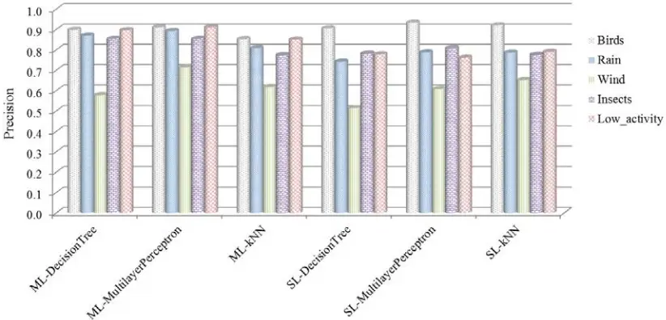

Figure 4.10 Recalls of single- and multi-label classifiers

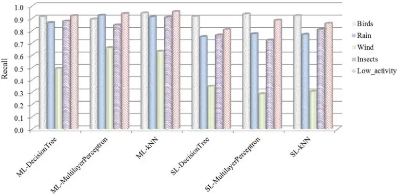

In multi-label classification, multilayer perceptron and k-nearest neighbour provide better performance than decision tree, but there are no apparent performance differences between single-label classifiers. Therefore, multi-layer perceptron classifier in multi-label classification is preferable for classifying concomitant classes in long-duration recordings. Although multi-label classifiers seem to have higher precisions and recalls than the corresponding single-label classifiers in most cases, a direct comparison between these two approaches is inappropriate because they deal with different classification problems and a different number of labels for each acoustic pattern.

## 4.4 Investigation of bird species richness

Birds are important indicators of environmental health. The detection and analysis of bird species have attracted continuous attention over the years. The classification of acoustic patterns provides a potential way to remove irrelevant audio clips and improve the efficiency in such ecological studies, especially when the volume of audio recordings is huge. Figure 4.11 shows the number of bird species per minute in the minutes classified as Birds by using single- and multi-label classifiers (The core classification algorithm is multilayer perceptron). In the original 24-hour recording, there are about 600 minutes that do not contain any bird species. Obviously, single-label classification enables to recognise the majority of non-bird minutes. However, a large portion of minutes containing birds is misclassified as one of the other four acoustic patterns. Multi-label classification captures the minutes which contain one to seven bird species but are misclassified by the single-label method, increasing the number of true positives. Also, note that the number of misclassified bird minutes (false positives) grows to 200 in the case of multi-label classification. Further analysis has been done on bird species loss and the efficiency in bird species surveys based on the bird annotations. Compared to the multi-label classification, where there is no species loss, the single-label classification retains 59 out of 62 (95.2%) bird species within the 605 of 1435 (42.2%) one-minute audio clips classified as Birds; that is, 57.8% of oneminute audio clips that are unlikely to contain bird species have been removed. Figure 4.12 shows the species accumulation curves using five different methods. Each point in the curves represents the average percent of bird species found given a specific number of one-minute samples. It can be seen that classification approaches (red and blue) achieve higher efficiency in bird species surveys than randomly selecting minutes without any process (green) (t-test, p

&lt; 0.001). Take the line parallel to the x-axis at value 50 on the y-axis in Figure 4.12 for example. Using classification methods, one needs to inspect 25 one-minute audio clips to find 50 percent of species on that day. However, without classification methods, 37 one-minute audio clips are required to achieve the same performance. Therefore, one can earn the time of inspecting 12 one-minute audio clips using classification methods. Most importantly, the earned time increases exponentially if more bird species are required to be found. Although multi-label classification increases the false positives (Figure 4.11), a pairwise t-test (p &gt; 0.1) shows that there is no difference between the species accumulation curves derived from both classification tasks.

Figure 4.11 Distributions of the number of bird species per minute

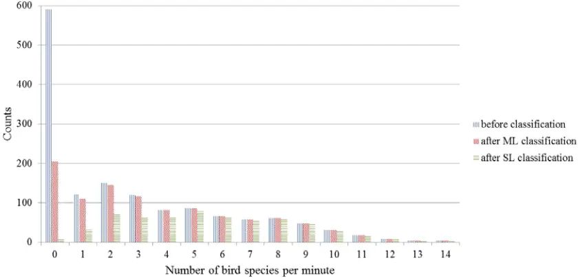

In Figure 4.12 the performance of the classification methods are compared with Wimmer's dawn sampling. He suggested that sampling audio clips at random from 3 hours after dawn is an efficient strategy for bird species surveys (Wimmer et al. 2013). By implementing the dawn sampling method, another species accumulative curve (orange) is obtained. This method has a higher efficiency of finding bird species than our classification methods for the first 30 one-minute audio clips, but its performance decreases when more audio clips are inspected. Dawn sampling is based on the prior knowledge that most bird species vocalise during morning chorus. It is susceptible to two factors: weather conditions and the time that bird species appear. For example, rain can interrupt the morning chorus and no further instructions are given for species surveys during the rest of the day. Dawn sampling also excludes species that are absent from the morning chorus. Therefore, our classification methods provide comparable efficiency in bird species surveys but are more resilient than dawn sampling in these two aspects.

Figure 4.12 Five species accumulative curves derived from different sampling methods

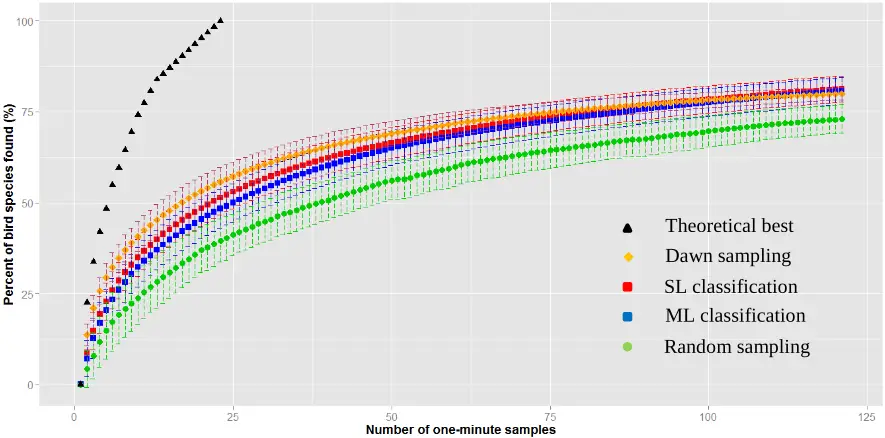

## 4.5 Summary

This chapter discusses the use of the assistive classification for bird species richness surveys in one-day acoustic data. The experimental results show that the applied classification approaches have achieved higher efficiency than the dawn sampling, which, to the best of our knowledge, is currently the best-published approach for assisting bird species surveys using environmental recordings. The classification approaches have advantages over the dawn sampling because they are adaptive to various weather conditions such as the rain and the wind.

A novel set of acoustic indices is suggested to build classification models. Apart from the traditional acoustic indices, two new sets of acoustic indices including matching pursuit indices and ridge indices are introduced. Amongst them, MP_SRR, horRidge, and verRidge play an important role in this classification task together with other four traditional acoustic indices. From the results of classification, it can be inferred that acoustic indices are proper indicators of general ecological processes. Since acoustic indices are summary information of audio clips and barely contain detailed frequency information of an acoustic event, they are more appropriate for classifying long-term audio clips instead of discrete acoustic events.

Two classification paradigms, single-label and multi-label classification, have been investigated in filtering one-minute audio clips that are likely to contain birds. Multi-label classification ameliorates the problem of simultaneous acoustic patterns in one-minute audio clips such as birds singing in the rain, but introduces a large volume of audio clips that do not contain birds, hindering rapid determination of diverse bird species in one-day recordings. By contrast, single-label classification causes several species loss, but it removes the majority of non-bird minutes and improves the efficiency of bird species surveys. This chapter builds a simple but efficient single-label multilayer perceptron classification model to reduce acoustic data for bird species surveys. The experimental results show that classification approaches successfully weed out a large number of irrelevant audio recordings while retaining the majority of bird species (59 out of 62). This is an initial step of developing computer-assisted techniques to assist bird species surveys. For audio clips classified as Birds, there are no further instructions on how to effectively sample them. The next two chapters will be devoted to various ranking approaches that aim to tackle this problem.

## 5 Ranking audio clips for more efficient bird species surveys

This chapter focuses on sampling 605 one-minute audio clips that have been classified as Birds for bird species surveys in the previous chapter. Amongst these audio clips, some could contain more bird species than others. The method that maximises the number of bird species at each sampled audio clip is defined as the maximum sampling. Given the ground truth annotation, the species accumulation curve of this new sampling method can be drawn in Figure 5.1. Obviously, the maximum sampling outperforms random sampling with a one-day recording within 120 samples. In this case, the red curve is derived from the prior knowledge of the number of unique bird species in each audio clip, showing a higher efficiency than the dawn sampling (the orange curve). However, such prior knowledge is not available in most cases of acoustic bird species richness surveys. Instead, only acoustic information is available for the computer-assisted analysis. This chapter aims to find a proxy for the number of bird species in each audio clip. Audio clips ranked by this proxy should improve the efficiency of bird species surveys.

Figure 5.1 Species accumulation curves of the maximum sampling

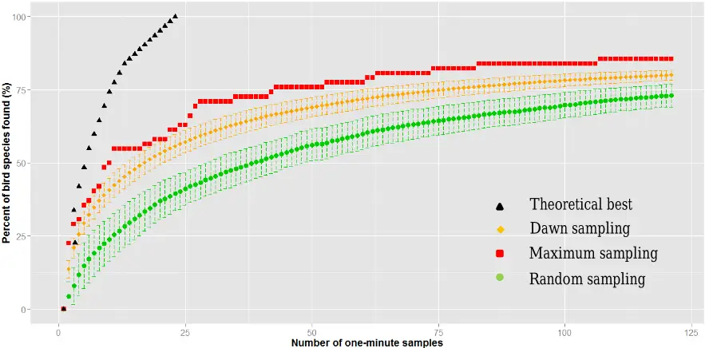

The remainder of this chapter focuses on the finding of such a proxy. Section 5.1 reviews the work on relations between some acoustic indices and information of bird species in the recordings. Section 5.2 attempts to find the best proxy for the number of bird species in oneminute audio clips using variants of acoustic indices and examine the efficiency of directing bird species richness surveys. These acoustic indices include summary indices, a two-second index, and a spectral index derived from environmental recordings. Section 5.3 takes into consideration the temporal and acoustic redundancy, aiming to remove them from the sampled audio clips in order to further improve the efficiency of bird species richness surveys. Finally, section 5.4 summarises the performance of the proposed acoustic indices in ranking audio clips, discusses the limitations of removing temporal and acoustic redundancy, and bring forward the idea of detecting more detailed bird vocalisations to assist bird species richness surveys.

## 5.1 Ranking audio clips to direct bird species richness surveys

The ideal model for rapid determination of bird species should rank audio clips in an order so that each investigated audio clip provides the maximum species gain. Such a model requires detailed information such as different types of bird vocalisations, and above all, different bird species in an audio clip. Obviously, this information is inaccessible to most of the environmental recordings except for those annotated by experts with domain knowledge. Contrarily, it is our purpose of developing an automated technique to assist people in quickly determining different bird species in audio clips. In practice, acoustic information extracted from environmental recordings is possible to be mapped to the intensity of bird vocalisations, which can further be used to infer the number of different types of vocalisations and possibly reflect the number of bird species in an audio clip. Acoustic indices are developed for biodiversity appraisal from a landscape perspective in long duration recordings. Prior work has shown that acoustic richness index has a logarithmic relation with the number of bird species in a chorus recorded in coastal forests (Sueur et al. 2008). Acoustic complexity index has been demonstrated to be highly correlated with the number of bird vocalisations (r = 0.94, p &lt; 0.01) and the vocal intensities (r = 0.73, p &lt; 0.01) when the recordings are collected from forests (Pieretti, Farina and Morri 2011). Various acoustic indices have also been investigated for determining bird species richness in environmental recordings (Towsey, Wimmer, et al. 2014). In that paper, either single indices or their weighted combinations have been examined to re-order audio clips for directing bird species surveys. The experimental results illustrate that combinations of acoustic indices outweigh single indices in terms of ranking audio clips for bird species surveys. However, the use of acoustic indices is determined empirically and the corresponding weights are obtained

57

by an exhaustive search, resulting in an 'overfitting' for a specific dataset. Such an overfitting occurs because this combination of acoustic indices is optimised for the best performance on a specific dataset but has poor performance on others. Nevertheless, this work shows that acoustic indices have the potential to direct bird species richness surveys.

## 5.2 Ranking audio clips by acoustic indices

Given a set of audio clips that are likely to contain bird species, it might not be able to provide satisfactory efficiency of determining bird species richness by listening to them in a chronological order or just at random. To resolve this issue, this section aims to find an appropriate acoustic index to re-order such a set of audio clips so that those containing more complex acoustic activities will have higher priority to be listened to. An acoustic index is a statistical summarisation of the distribution of acoustic energy in an audio clip. It captures a specific aspect of the overall acoustic complexity of an audio clip from temporal and/or spectral domain such as the acoustic energy dispersion (e.g. entropy-based indices) or the change rate of spectral energy (e.g. ACI). An underlying assumption on using acoustic indices to rank audio clips is the more complex acoustic contents of an audio clip, the more species might be found in it. The results of such an assumption can be exemplified by a benchmark species accumulation curve, which is derived from sampling audio clips with prior knowledge of unique species counts without knowing what those species are(Towsey, Wimmer, et al. 2014). Here the percent of bird species found in first 60 one-minute audio clip samples is used to estimate the efficiency of different methods. To find which acoustic index can best act as a proxy for the number of bird species and rank audio clips, the Spearman's correlation coefficients are calculated.

## 5.2.1 Summary acoustic indices

Summary acoustic indices are first investigated in this section. Table 5.1 shows that the summary acoustic index horRidge has the highest correlation coefficient with the number of bird species than any other acoustic index. One-minute audio clips are ranked by the summary acoustic index horRidge in a descending order to direct bird species richness surveys on 15th October 2010. This method leads to 71% of 62 bird species found in that day (Table 5.1). This is also the highest percent of bird species found in all the summary acoustic indices used to direct bird species richness surveys. Consequently, the horRidge can be considered as a good proxy for the number of bird species.

58

Compared with the method used in (Towsey, Wimmer, et al. 2014), the current ranking method is performed on the same dataset but with audio clips that are classified as birds. Table 5.1 also shows that audio clips ranked by the ACI offer 64.5% percent of bird species in first 60 audio clip samples, which is almost the same as the results in Towsey's work. This is mainly because the prior classification method (proposed in chapter 3) removes most audio clips that rarely contain bird species, and the ACI enables to capture the complexity of bird vocalisations (Pieretti, Farina and Morri 2011). When the ACI is used to rank audio clips, it makes no difference between both studies since the ranked audio clips start from those with most bird vocalisations that the ACI can represent.

Table 5.1 Using correlation relations to direct bird species surveys

|                                                                         | verRidge | MP_SRR | ACI  | EntropyPeaks | horRidge |
| ----------------------------------------------------------------------- | -------- | ------ | ---- | ------------ | -------- |
| Correlation coefficients with the number of bird species per audio clip | 0.14     | 0.16   | 0.36 | 0.47         | 0.62     |
| Percent of bird species found in first 60 one-minute audio clips (%)    | 58.1     | 48.4   | 64.5 | 66.1         | 71.0     |

The horRidge outperforms the best combination of indices (Towsey, Wimmer, et al. 2014) in first 60 audio clip samples, although it is not as good as the dawn sampling (Wimmer et al. 2013), which enables to find 72.6% ± 3.1% of bird species. Such a result also indicates that the horRidge might be the best acoustic index to characterise the bird vocalisations and direct bird species richness surveys amongst the existing acoustic indices. Based on this result, the rest of this chapter uses the horRidge as a representative index to discuss variants of their calculation on improving the efficiency of bird species richness surveys.

## 5.2.2 Increasing the temporal resolution

Summary acoustic indices have severe acoustic information loss since they are averaged from acoustic contents of one-minute audio clips. Early ecological studies (Cody and Brown 1969; Ficken, Ficken and Hailman 1974; Brumm 2006) have suggested that different bird species tend to avoid communication competition in the same habitat. They will mitigate the conflicts of simultaneous vocalisations by varying the spectra, which could lead to more vocalisations given a specific duration of the audio clip. One may wonder if an acoustic index derived from an audio clip with a higher temporal resolution could capture such acoustic complexity and hence reflect the number of bird species.

A case study of the horRidge with a finer temporal resolution is conducted to test this hypothesis. Note that the median duration of bird vocalisations is about 1 second. To incorporate most of the bird vocalisations, this study utilises a two-second duration, leading to 30 two-second segments in a one-minute audio clip. Consequently, the horRidge is recalculated at these two-second audio segments, providing a vector of 30 values per audio clip. Due to the fact that bird annotations are provided at a one-minute resolution, the vector of horRidge needs to be scaled up to represent one-minute audio clips for further evaluation. In this case, the maximum value in the two-second vector is used as an indicator of the acoustic complexity in each one-minute audio clip. After obtaining the maximum two-second horRidge values for one-minute audio clips, they are further used to rank audio clips in a descending order, prioritising audio clips that should be audited. The experimental result shows that 75.8% of bird species found at first 60 oneminute audio clips samples, which is better than that of using the summary acoustic index.

## 5.2.3 Spectral acoustic indices

It has also been reported that spectral information is important for bird species to avoid interspecific acoustic competition (Farina 2014), but all acoustic features used in the last two sections (5.2.1 and 5.2.2) are spectrally summarised; that is, the spectral information has been averaged. To demonstrate if the spectral information is helpful to direct bird species richness surveys, this section aims to increase the spectral resolution of acoustic indices. Likewise the summary acoustic indices, spectral acoustic indices can be calculated by only averaging the time frames of a spectrogram. Again the horRidge is selected as the representative acoustic index. Figure 5.2 shows the examples of horRidge spectra from four one-minute audio clips. It can be observed that the more bird species in an audio clip, the larger the number of local maxima in the corresponding horRidge spectrum. Although the mapping between them is not perfect in a low signal-to-noise ratio case (bottom plot in Figure 5.2: there are two species in that audio clip but no apparent peaks can be found), the local maxima of horRidge spectrum could possibly serve as a proxy for the number of bird species in each one-minute audio clip.

Figure 5.2 Four examples of horizontal ridge (horRidge) spectra

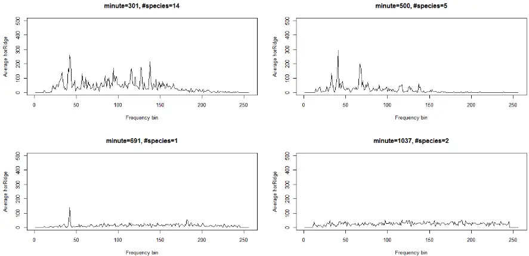

To test this hypothesis, the number of local maxima is derived from the horRidge spectrum of each one-minute audio clip. First, the horRidge spectrum is subtracted by its mean and set all negative values to zeros for noise removal. Then a rectangular window of size 20 is used to smooth the horRidge spectrum. Finally, the number of local maxima is obtained by calculating the second derivative of the smoothed horRidge spectrum. By ranking the number of local maxima of one-minute audio clips, a sampled sequence of audio clips is provided to direct bird species richness surveys.

Species accumulation curves are plotted to examine the efficiency of determining bird species richness by different methods. The result of the current study is compared with three benchmark curves in Figure 5.3. The top curve denotes the theoretical best which maximises the bird species found at each sampled audio clip using the bird annotations; whereas the curve of green circles at the bottom is derived from the baseline method which is the mean of sampling 1435 one-minute audio clips 1000 times at random. Note that any useful species accumulation curve should reside between these two curves. For example, the curve of orange diamonds is the dawn sampling (Wimmer et al. 2013). This method assumes that there are more bird species in the morning chorus; therefore, it recommends to inspecting audio clips during 180 minutes after dawn. The dawn sampling is simulated in this study by averaging 1000 times of randomly selecting 180 one-minute audio clips after dawn. The curve with red squares is obtained by using the proposed method - ranked by the local maxima of spectral horRidge index.

Figure 5.3 Species accumulation curve of ranking by spectral horRidge index

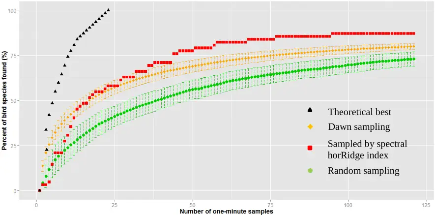

A pairwise t-test has been taken between the proposed method and dawn sampling after 40 one-minute audio clips samples. The experiment (p &lt; 0.001) shows that the ranking audio clips by the number of local maxima of horRdige spectra (squares in Figure 5.3) outperform dawn sampling (triangles) after 40 one-minute samples in terms of bird species richness surveys. Specifically, at first 60 one-minute audio clip samples, the proposed method can find 82.2% of bird species in that day, which is 10 percentage points higher than the mean of dawn sampling (72.6%).

## 5.3 Redundancy removal

There are some limitations in the previous ranking methods. The ranking of one-minute audio clips only considers the acoustic complexity to reflect the number of bird species. Although audio clips with more bird species are enabled to have a high priority to be listened to, it is possible that some of them might share the same species, which could slow down the efficiency of bird species richness surveys. Solving this problem could narrow the gap of species accumulation curves between the proposed method and the theoretical best in Figure 5.3.

The idea of solving this problem is to give low priority to audio clips that may contain the same bird species as in the audited ones. Here two potential approaches are implemented to achieve this goal. The first one is to consider removing temporal redundancy. The assumption is once an audio clip is inspected, its temporal adjacent samples should be given low priority since the same species are more likely to appear in consecutive audio clips. The other approach is to remove acoustic redundancy. Audio clips that have similar acoustic contents to those audited ones should be discarded. The following two sections investigate these approaches respectively.

## 5.3.1 Removing temporal redundancy

If consecutive minutes are more likely to share the same bird species, inspecting these minutes could lower the efficiency of determining bird species richness surveys. To deal with such temporal redundancy, a threshold can be used by removing t-nearest neighbours of audited one-minute audio clip samples. For example, if a one-minute audio clip m is audited, any one-minute audio clip that falls between m - t and m + t of the same day could be ignored even though it is sampled by the proposed method.

Figure 5.4 shows the effects of removing temporal redundancy on the amount of one-minute audio clips and the number of bird species. The 'ref' on the x-axis is the reference point that contains 1435 one-minute audio clips and 62 species in a one-day recording. '0' denotes the case of filtering audio clips that are likely to contain bird species (Classification method proposed in chapter 4).

Figure 5.4 Removing n-nearest temporal neighbours of one-minute audio clips

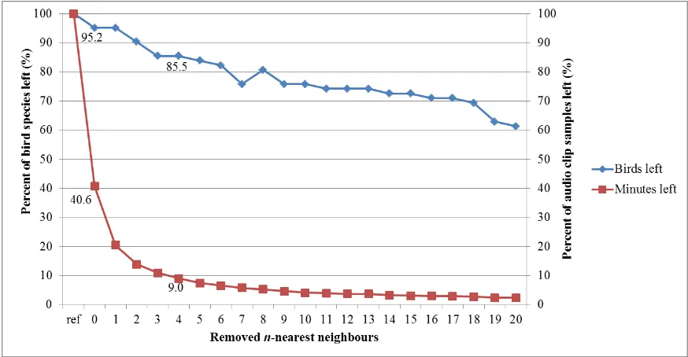

The number of one-minute audio clips drops dramatically after using classification method (t = 0), leading to 40.6% of audio clips left while retaining 95.2% of bird species. When t = 4, the number of audio clips left reaches 9% but the number of bird species also decreases to 85.5%. There is a trade-off between the number of audio clips and the number of bird species.

When the temporal threshold t continuous to grow, it is favourable to obtain a decreasing number of audio clips but is hostile to get a decreasing number of bird species. A stepwise search of t-nearest neighbours has been conducted at 2, 4, and 7, aiming to optimise the highest efficiency of determining bird species richness. The temporal threshold t is adjusted in conjunction with the threshold of k when k aims to remove acoustic redundancy. The percent of bird species found in first 60 one-minute audio clip samples is presented in Table 5.2.

## 5.3.2 Removing acoustic redundancy

Acoustic redundancy is defined in this study as audio clips that contain similar acoustic complexity with the one that has been audited. The seven acoustic indices selected by forward feature selection algorithm are used to measure the acoustic complexity of oneminute audio clips because they accord with the characteristics of bird vocalisations. All acoustic indices are normalised using the z-score. The similarity is evaluated by calculating the Euclidean distance. Given two audio clips with the corresponding vectors of seven acoustic indices p and q:

$$p = ( p _ { 1 } , p _ { 2 } , \cdots , p _ { 7 } )$$

$$q = ( q _ { 1 } , q _ { 2 } , \cdots , q _ { 7 } )$$

The calculation of the Euclidean distance is expressed as:

$$d ( p , q ) = \sqrt { ( p _ { 1 } - q _ { 1 } ) ^ { 2 } + ( p _ { 2 } - q _ { 2 } ) ^ { 2 } + \cdots + ( p _ { 7 } - q _ { 7 } ) ^ { 2 } }$$

The redundant audio clips can be determined when the Euclidean distance falls below a threshold or when a certain number of one-minute audio clips that have the smallest distances have been reached. Since it is difficult to find a proper threshold in advance, this study chooses to use the number of audio clips that have the smallest distances as the acoustic threshold for redundancy removal. A stepwise search is also performed at 5, 10, and 15 to select the number of audio clips that need to be removed.

## 5.3.3 Discussions on removing redundancy

The removal of temporal and acoustic redundancy is performed on audio clips that have been ranked by the summary horRidge index. Table 5.2 illustrates different combinations of temporal and acoustic thresholds resulting in the percent of bird species found in first 60 oneminute audio clip samples. The temporal threshold of 2 offers higher efficiency than it being 4 or 7 in terms of percent of bird species found in first 60 one-minute audio clips. The change of acoustic thresholds has little effect on improving the efficiency of bird species richness surveys when the temporal threshold holds. For example, the percent of bird species found in first 60 one-minute audio clips are the same (75.8%) when the temporal threshold is 2. Note that when the temporal threshold is 7 and the acoustic threshold is 15, there are less than 60 one-minute audio clips left; this explains why the third row of the last column is empty.

Table 5.2 Different combinations of temporal and acoustic thresholds

| Temporal threshold (t)                                                | 2    | 2    | 2    | 4    | 4    | 4    | 7    | 7    | 7   |
| --------------------------------------------------------------------- | ---- | ---- | ---- | ---- | ---- | ---- | ---- | ---- | --- |
| Acoustic threshold                                                    | 5    | 10   | 15   | 5    | 10   | 15   | 5    | 10   | 15  |
| Percent of bird species found in first 60 one- minute audio clips (%) | 75.8 | 75.8 | 75.8 | 71.0 | 71.0 | 69.3 | 71.0 | 72.6 | /   |

The removal of temporal redundancy increases the percent of bird species found in first 60 one-minute audio clips from 71.0% (ranked by summary horRidge index) to 75.8% (removing temporally adjacent audio clip samples before and after the previously selected ones). However, this improvement is the same as that of ranking audio clip samples by twosecond horRidge index in section 5.2.2. Therefore, removing temporal redundancy can improve the efficiency of bird species surveys to a certain extent, but it is not better than the use of spectral information, such as the spectral horRidge index (section 5.2.3).

## 5.4 Summary

This chapter attempts to find a proxy for the number of bird species in one-minute audio clips for rapid determination of bird species richness in a one-day recording. Variants of acoustic indices have been studied to find the best proxy, including summary acoustic indices, a twosecond acoustic index, and a spectral acoustic index. The experimental results show that amongst the summary acoustic indices, the horRidge index is best correlated with the number of bird species in individual audio clips but has limited ability to direct bird species richness surveys due to the lossy compression on one-minute audio clips. Based on this result, the horRidge is used as a representative acoustic index and re-calculated at a two-second resolution. Such an increase of temporal resolution slightly improves the efficiency of bird species richness surveys when compared to dawn sampling. Finally, the increase of spectral resolution of acoustic indices has also been investigated. A spectral acoustic index - the number of local maxima of a horRidge spectrum, serves as a better proxy for the number of bird species in one-minute audio clips than other indices. According to the experiment conducted on a one-day recording, inspecting audio clips ranked by spectral horRidge index can find 82.2% of unique bird species at the first 60 one-minute samples. The use of acoustic indices takes into consideration the number of bird species for ranking but ignores overlapping vocalisations within one-minute audio clips. These overlapping vocalisations could lower the efficiency of bird species richness surveys. The removal of temporal and acoustic redundancy aims to counter this effect. The experiments show that removing temporally adjacent audio clips can improve the efficiency of bird species surveys but the determination of the threshold for temporal redundancy removal is subjective. The use of acoustic indices cannot reflect the detailed vocalisation variances in the audio clips. However, the idea of removing acoustic redundancy is objective since the calculations are based on the acoustic contents of the recordings. The next chapter will focus on extracting distinct bird vocalisations from one-minute audio clips. Given this information, it is possible to detect overlapping bird vocalisations and sample audio clips in a sequence that maximises the number of new vocalisations for efficient bird species surveys.

## 6 Using non-negative matrix factorisation to detect overlapping bird vocalisations amongst audio clips

This study aims to find the maximum number of unique bird species while listening to the minimum number of one-minute audio clips. An ideal solution to such a problem is to rank audio clips in an order that the maximum number of new bird species can be found at each audited instance. To achieve this goal, one should know specific species that appear in these audio clips. In practice, actual annotations of bird species remain unknown to peoples in most of the environmental recordings. Indeed it is the purpose of this study to develop assistive automated techniques to maximise the efficiency of determining unique bird species.

Supervised machine learning is a widely used automated recognition technique for bird species recognition (Kwan et al. 2004; Chen and Maher 2006; Briggs, Raich and Fern 2009). This technique relies heavily on a labelled training dataset, which is time-consuming, laborious, and sometimes prohibitive to obtain. As for bird species recognition, a labelled dataset is referred to bird vocalisation segments in audio recordings that are associated with specific species names. A ubiquitous characteristic of bird vocalisations is their diversity. Competition for the acoustic space and environmental constraints such as temperature and vegetation compositions may lead to significant variations within and between species

vocalisations (Farina 2014). negative matrix factorisation and explains why it is applicable to the current problem. Section

This chapter formulates the problem of searching for the maximum number of unique bird species in each sampled audio clip in a manner of finding the most new bird vocalisations. The rest of this chapter is structured as follows. Section 6.1 introduces the concept of non6.2 describes the detailed algorithm for bird vocalisation extraction and how it can be utilised to sample audio clips for bird species richness surveys. The performance of non-negative matrix factorisation and its efficiency of assisting bird species richness surveys are demonstrated in section 6.3. Section 6.4 discusses the advantages and limitations of the current method. Finally, section 6.5 concludes and describes the future work.

## 6.1 Non-negative matrix factorisation

To address the problem of lacking information on various types of bird vocalisations, it is essential to develop an approach that can automatically capture representative acoustic features to learn a codebook of spectral profiles from the spectrograms and use them to represent bird vocalisations in an audio clip. Several techniques have been used to generate compact representations of spectrogram data, such as principal component analysis (Baker and Logue 2003) and self-organising maps (Vallejo, Cody and Taylor 2007). The weaknesses of these techniques lie in the fact that either global features of an audio clip are extracted or the applications are constrained to similar types of vocalisation. It, therefore, requires a general approach to extract local structures in audio clips.

Non-negative matrix factorisation (Lee and Seung 1999) can decompose a matrix into a product of two matrices. The felicity of such decomposition is it enables to generate a partsbased representation, enabling to characterise distinct bird vocalisations of a spectrogram. Since its inception, non-negative matrix factorisation has seen a broad range of applications, including multiple sound sources separation (Smaragdis 2004; Zhang et al. 2008), music transcription (Bertin, Badeau and Richard 2007), and gene data expression (Frigyesi and Höglund 2008; Hutchins et al. 2008). One advantage of using non-negative matrix factorisation is that its decompositions are additive parts of the original matrix, making the data interpretable (Brunet et al. 2004). Recently, probabilistic latent component analysis (PLCA) - a probabilistic variant of non-negative matrix factorisation has been proposed for the analysis of soundscape ecology (Eldridge A. C. 2016). This study suggests that PLCA enables separation of distinct acoustic events from background noise.

Non-negative matrix factorisation can be described as follows. Given a matrix S of size n × m, the goal of non-negative matrix factorisation is to approximate to the matrix S by the multiplication of two non-negative matrices W and H:

$$S \approx W \cdot H$$

where the basis matrix W has a size of n × r and the coefficient matrix H has a size of r × m. Here, r is called the factorisation rank.

The approximation is achieved by minimising a cost function which measures the reconstruction error. One such cost function is:

$$D = \frac { \| S - W \cdot H \| _ { F } } { \sqrt { n \times m } }$$

where D is the root-mean-squared residual (RMSS)(Berry et al. 2007). The subscript 'F' denotes the Frobenius norm. Let aij be an element of matrix (S - W H), the Frobenius norm is calculated as:

$$\| S - W \cdot H \| _ { F } \equiv \sqrt { \sum _ { i = 1 } ^ { n } \sum _ { j = 1 } ^ { m } | a _ { i j } | ^ { 2 } }$$

The algorithm is iterative starting with random initial values for W and H. The update rules for W and H are:

$$W _ { i q } \leftarrow W _ { i q } \cdot \frac { ( S \cdot H ^ { T } ) _ { i q } } { \left ( W \cdot ( H \cdot H ^ { T } ) \right ) _ { i q } } \quad f o r \, 1 \leq i \leq n \, a n d \, 1 \leq q \leq r$$

$$H _ { q j } \leftarrow H _ { q j } \cdot \frac { ( W ^ { T } \cdot S ) _ { q j } } { \left ( ( W ^ { T } \cdot W ) \cdot H \right ) _ { q j } } \quad f o r \, 1 \leq q \leq r \, a n d \, 1 \leq j \leq m$$

Variants of non-negative matrix factorisation algorithm differ in the non-negativity constraints on the bases (W), the coefficients (H), or both (Feng et al. 2002; Patrik 2004; Pascual-Montano et al. 2006).

A simple example of non-negative matrix factorisation on a spectrogram can be found in this paper (Smaragdis, 2004). It is illustrated in Figure 6.1. Generally, the columns of the matrix W denote the distinct spectral profiles and the rows of the matrix H denote the corresponding temporal coefficients of each spectral profile. The distinct spectral profiles are considered unique bird vocalisations in this study. With this information, audio recordings are later ranked in an order that maximise the number of unique bird vocalisations for efficient bird species surveys.

Figure 6.1 An example of non-negative matrix factorisation.

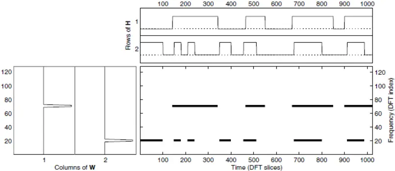

## 6.2 Representation of distinct bird vocalisations

The non-negative matrix factorisation algorithm requires a pre-defined r to operate. Controversially, determining an appropriate r for an audio recording is a preliminary step to obtain distinct bird vocalisations. A small r leads to a combination of multiple distinct spectra; whereas a large r ends up with non-informative spectra or a distinct spectrum divided into multiple small spectra. This section introduces an approach to automatically determine a factorisation rank r for an audio recording.

## 6.2.1 Pre-processing spectrogram data

Low-frequency components of environmental recordings usually contain all kinds of noise rather than bird vocalisations. To increase the effectiveness of non-negative matrix factorisation, a high-pass filter is applied first to remove the frequency component below 1000 Hz. Note that the following procedures are performed on spectrograms of one-minute audio clips that have been classified as Birds on 15th October 2010 from site 4, the SERF.

## 6.2.2 Estimation of the factorisation rank

The most crucial issue in this study is to determine a proper factorisation rank r for the nonnegative matrix factorisation. There is no uniform r for the non-negative matrix factorisation due to the inherent complexity of environmental recordings. A common solution is to optimise the factorisation performance by increasing r. For example, the first r where the cophenetic correlation coefficient begins to fall can be selected as the optimal value (Brunet et al. 2004). Here cophenetic correlation coefficient measures the similarity of pairwise distances of spectrogram matrices before and after the non-negative matrix factorisation. Its value ranges from 0 to 1, where 1 denotes similar and 0 denotes dissimilar. A decrease of the coefficient means the increase of r cannot provide a better approximation. Another research uses the sum squared residuals (Hutchins et al. 2008). Conversely, the increase of the sum squared residual indicates that a further increase of r is not capturing useful information. Therefore, the first r that increases the residual will be selected as the proper factorisation rank.

This work follows an adaptive method proposed by Frigyesi and Hӧglund (Frigyesi and Höglund 2008) to determine the factorisation rank r based on the acoustic complexity of each recording. For two consecutive factorisation rank r - 1 and r, the decreases of RMSS for the original spectrogram (∆Do) and its randomised counterpart (∆Drandom) are calculated. If ∆Do &gt;

∆Drandom , then there is additional information yet to be captured and a larger r is required; if ∆Do ≤ ∆Drandom , then any increase of r will only capture noise. The last r that has the ∆Do &gt; ∆Drandom is considered as a proper factorisation rank for a specific spectrogram. In Frigyesi and Hӧglund's work, the spectrogram is randomised across the rows of each column, which might be appropriate for gene analysis. By contrast, both the rows (frequencies) and columns (time frames) of a spectrogram are randomised since bird vocalisations could be broadband and last for several time frames. Since the RMSS may converge to local minima, the non-negative matrix factorisation is repeated 30 times with random initial values for each spectrogram and the ones with the smallest residual are selected as the results. The NMF package in R is used to implement the

non-negative matrix factorisation in this study.

## 6.2.3 Extracting distinct spectra of bird vocalisations

After applying non-negative matrix factorisation algorithm to a spectrogram, a spectral matrix W and a temporal matrix H are obtained. Ideally, a column of W represents a specific type of bird vocalisation and its corresponding row of H represents the temporal position; when multiplied, they constitute a unique acoustic pattern in a spectrogram (Smaragdis and Brown 2003). Note that non-negative matrix factorisation may not capture the exact bird vocalisation, but unique spectra that appear repeatedly. In an environmental audio clip, a bird vocalisation consisting of different spectral components might be partitioned into separate spectral profiles due to the acoustic complexity of in-field recordings. It is necessary to integrate these partitioned spectral profiles into one spectrum. Figure 6.2 illustrates the problem of a vocalisation being partitioned into two small spectral profiles Wa and Wb. In this case, their temporal coefficients (Ha and Hb) should be similar if these small spectral profiles belong to the same vocalisation. Therefore, the spectral profiles can be integrated into the same spectrum by finding similar temporal coefficients. To deal with this problem, a hierarchical clustering technique is applied to find similar temporal coefficients. This procedure aims to accommodate the corresponding spectral the 'stats' package of R is used for the clustering (using the 'hclust' function). The assumption is spectral profiles of the same vocalisation may occur at adjacent time frames

profiles as distinct bird vocalisations. The Ward's minimum variance method implemented in and it is unlikely that two or more species vocalise simultaneously throughout a one-minute audio clip. In other words, similar temporal coefficients (rows) of matrix H reflect that their spectral counterparts (columns) of matrix W belong to the same vocalisation. Using the clusters of temporal coefficients, the corresponding spectral profiles of matrix W are averaged. These clustered spectral profiles are later considered as the distinct bird vocalisations in an audio clip.

Figure 6.2 Spectral profiles partitioned by the non-negative matrix factorisation

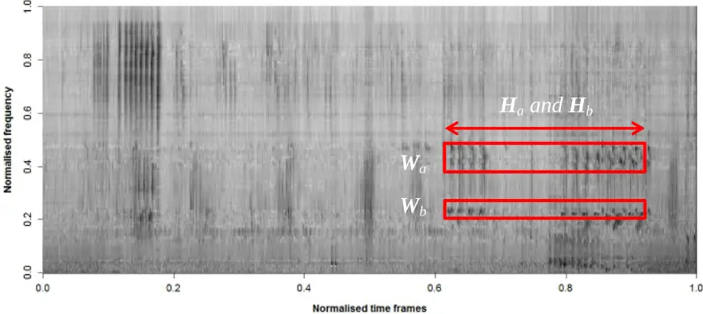

A critical issue in the hierarchical clustering is tree pruning. In this study, acoustic contents of one-minute audio clips are complex and no single constant threshold can identify desirable clusters for different audio clips. To address this issue, a dynamic tree cut algorithm implemented as an R package is used to prune the cluster tree of temporal coefficients (Langfelder, Zhang and Horvath 2008). In this experiment, the dynamic hybrid method is used to prune the cluster tree with two parameters. The parameter minClusterSize is referred to the minimum number of instances (in this case, spectral profiles) in each cluster. The parameter deepSplit is referred to a simple control of the number of the clusters. A large deepSplit value will produce a large number of small clusters. In this experiment, the minClusterSize is set to 1 since it is possible that a single spectral profile represents a unique type of bird vocalisation; the deepSplit is set to the highest value of 3 due to the maximum number of spectral profiles of an audio clip is relatively low (r = 28). It is plausible to generate small clusters of spectral profiles as distinct bird vocalisations.

## 6.2.4 Sampling audio clips

A codebook of distinct spectra of bird vocalisations is created using the clustered spectral profiles. This codebook reflects all unique types of bird vocalisations within the target 605 one-minute audio clips. The process of creating such a codebook is described as follows. The initial codebook is empty and the clustered spectral profiles of any single audio clip can be added into the codebook. The algorithm then traverses the rest of audio clips and calculates the similarity between clustered spectral profiles in the audio clip candidates and those in the codebook. A clustered spectral profile that is not similar to any of those in the codebook will be added into the codebook as a new bird vocalisation. When the exhaustive search is completed, the codebook incorporates all unique clustered spectral profiles/bird vocalisations in the recordings. Pearson's correlation coefficients are used to measure the similarity between two clustered spectral profiles. A stepwise search has been conducted on selecting the similarity threshold based on the classification accuracy. The search starts from 0.1 to 0.9 at a 0.1 step, using the number of species found to decide the similarity threshold while holding other parameters constant. Finally, the similarity threshold is set to 0.7. Consequently, any clustered spectral profile that has a correlation coefficient smaller than 0.7 with spectral profiles in the codebook will be considered as a new bird vocalisation and added to the codebook. Given this codebook, the bird vocalisation present in an audio clip can be associated with a specific identity based on the spectral profiles. These spectral profiles are further used to indicate distinct bird species in the recordings under the assumptions that no species share similar vocalisations and any species has a low diversity of vocalisations. A greedy algorithm is then developed to sample audio clips so that each audio clip can provide the maximum number of new spectral profiles, which might reflect new bird species. The algorithm is described as follows:

1. Identify present/absent information of spectral profiles in an audio clip using the codebook;
2. Find the audio clip that contains the most spectral profiles. If there is a tie, select an arbitrary one;
3. Search through the remaining audio clips and select the audio clip that provides the maximum new spectral profiles based on the selected audio clips. If there is a tie, select an arbitrary one;

73

## 4. Go back to step 3 until no new spectral profile can be found.

By listening to these sampled audio clips, one is expected to identify the maximum number of bird species while listening to the minimum number of one-minute audio clips.

## 6.3 Results

## 6.3.1 The evaluation of factorisation rank

The reconstruction performance of non-negative matrix factorisation is examined with an example that has the maximum factorisation rank (r = 28). Figure 6.3 compares the original spectrogram and its reconstruction. This is the 398th minute on 15th October 2010. The xand y-axes have been normalised between 0 and 1. The frequency ranges from 1000 - 8820 Hz and the time frame ranges from 0 to 2064. One vocalisation (No. 3) is absent in the reconstructed spectrogram.

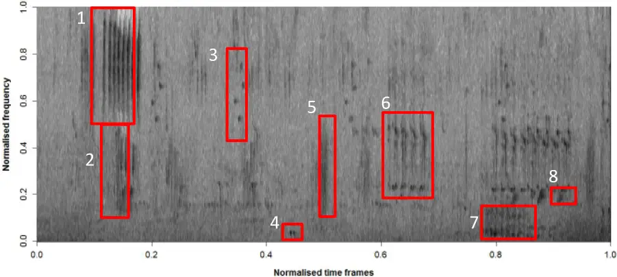

Figure 6.3 Original spectrogram (top) and its reconstruction from non-negative matrix factorisation (bottom).

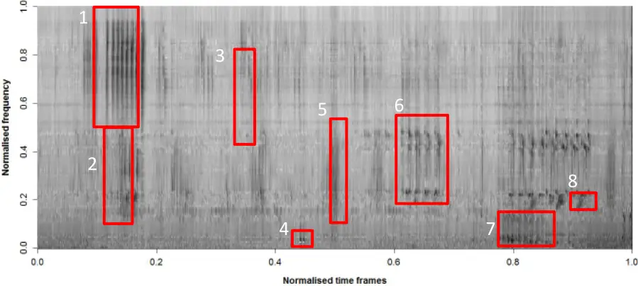

Based on the presence/absence annotations of birds, there are eight species in this audio clip, each of which has their unique vocalisation labelled in the original spectrogram (Figure 6.3: top). One vocalisation (No. 3) is lost in the reconstructed spectrogram (dot box, Figure 6.3: bottom). Low signal-to-noise ratio could be the main cause of the lost vocalisation in the reconstructed spectrogram.

## 6.3.2 Clustered spectral profiles and spectrogram reconstruction

The reconstruction performance of clustered spectral profiles is examined in this section. Figure 6.4 displays a reconstructed spectrogram of the 398th minute using the proposed clustering method. Compared to the reconstructed spectrogram with a rank of 28 (The bottom plot in Figure 6.3), salient bird vocalisations can be found in Figure 6.4. It is not surprising to find that vocalisation No. 3 is absent because the initial factorisation does not capture this acoustic information. However, due to the clustering on both spectral and temporal matrices, some artefacts have also been introduced, leading to blurring effects on the vocalisations in the reconstructed spectrogram (Figure 6.4). Since this reconstructed spectrogram is obtained by multiplying clustered spectral matrix W _ with clustered temporal matrix H _ , it is difficult to observe more subtle details on how each cluster behaves. Particularly, spectral profiles (columns) of clustered matrix W\* will later be considered as distinct bird vocalisations.

Figure 6.4 A reconstructed spectrogram using the clustered temporal coefficients

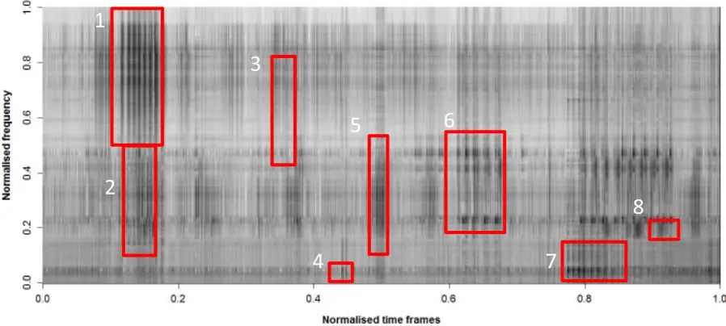

To further understand the clustered spectral profiles, the columns of matrix W\* are plotted in Figure 6.5. Note that the normalised frequency (x-axis) in Figure 6.5 is the y-axis in Figure 6.4 and the amplitudes of spectral profiles (y-axis) in Figure 6.5 contribute to the grey colour in Figure 6.4. Therefore, which clustered spectral profile contributes to which vocalisation type can be verified by comparing the spectral profiles between Figure 6.4 and Figure 6.5. For example, there are nine spectral profiles in Figure 6.5. W1 and W2 register vocalisation No. 1; W3 covers the high-frequency component of vocalisation No.2; W4 contributes to vocalisation No. 4; W5 is a combination of vocalisations No. 2 and No. 5 because both types of vocalisations spread similar frequency ranges; W6 and W7 divide vocalisation No. 6 into high and low-frequency components; W8 and W9 furnish us with vocalisations No. 7 and No. 8 respectively. Although the spectral profiles and the actual bird vocalisations are not perfectly matched, a bird vocalisation is able to be registered by a spectral profile.

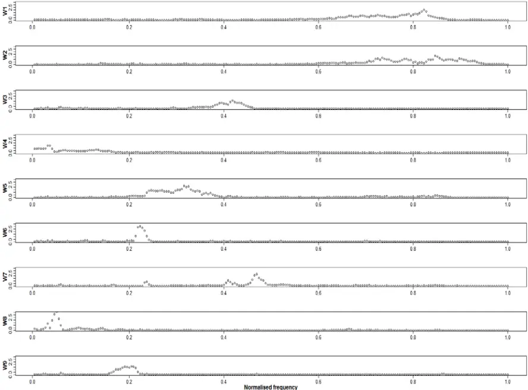

Normalised frequency

Figure 6.5 Nine clustered spectral profiles of an one-minute audio clip

## 6.3.3 Sampling audio clips to assist bird species surveys

The clustering and dynamic tree prune are applied to all 605 one-minute audio clips that are classified as Birds in chapter 4, resulting in a list of clustered spectral profiles per audio clip. Using the Pearson's correlation coefficient, a codebook of distinct spectral profiles representing unique bird vocalisations is created and later used to identify present bird species in audio clips. The greedy algorithm described in section 6.2.4 is implemented to sample audio clips so that each audited audio clip provides the maximum number of new spectral profiles.

Species accumulation curves are plotted in Figure 6.6, which demonstrate the efficiency of using different strategies to find new bird species in a one-day recording. The figure can be interpreted as the percent of bird species found (y-axis) in the given number of one-minute audio clips (x-axis). Two benchmarks have been shown in the diagram. The triangular curve denotes the highest efficiency of determining unique bird species with ground-truth annotations; whereas the curve with green circles serves as a non-informative strategy that sample 1000 times at random from all 1435 one-minute audio clips. Any other strategy will reside between these two curves. The diamond curve is the currently best-published strategy called dawn sampling, which selects audio clips during three hours after dawn. Here, audio clips sampled from these three hours are randomised and averaged over 1000 times. After applying the greedy algorithm, 232 audio clips are sampled in a sequence that maximises the number of new spectral profiles at each sample. The first 120 one-minute audio clips are selected so that the species accumulation curve is comparable to the results generated by other sampling methods. It can be seen from Figure 6.6 that the efficiency of surveying birds using non-negative matrix factorisation method does not exceed that of dawn sampling until 75 one-minute audio clip samples. Particularly in the first 60 one-minute audio clip sample, the non-negative matrix factorisation method (71.0%) finds a comparable percent of bird species as the dawn sampling (72.6%). Note that the species accumulation curve of dawn sampling increases rapidly but also exhausts quickly because of the species that do not vocalise at dawn. By contrast, the curve generated by the non-negative matrix factorisation method (Figure 6.6: red squares) is subject to low efficiency in the beginning but rises quickly after 75 samples. The reason for these differences lies in the total number of audio clip candidates being sampled. The dawn sampling method will miss species that vocalise outside the dawn period (3 hours after dawn). The proposed method does not have such time constraints and can search exhaustively from audio clip samples that are likely to contain bird species. Consequently, the proposed method enables to find 56 out of 62 (90.3%) bird species in 120 one-minute audio clip samples. To capitalise on both methods, the first 120 one-minute audio clips sampled by the proposed method are selected and those during the dawn are moved to the beginning of the sampled sequence while keeping their relative order. The species accumulation curve (Figure 6.6: blue squares) demonstrates that dawn sampling compensates the proposed method for the inefficiency in the beginning. The combination of the non-negative matrix factorisation-based method and the dawn sampling outperforms either method used alone.

Figure 6.6 Five species accumulation curves generated by different sampling strategies

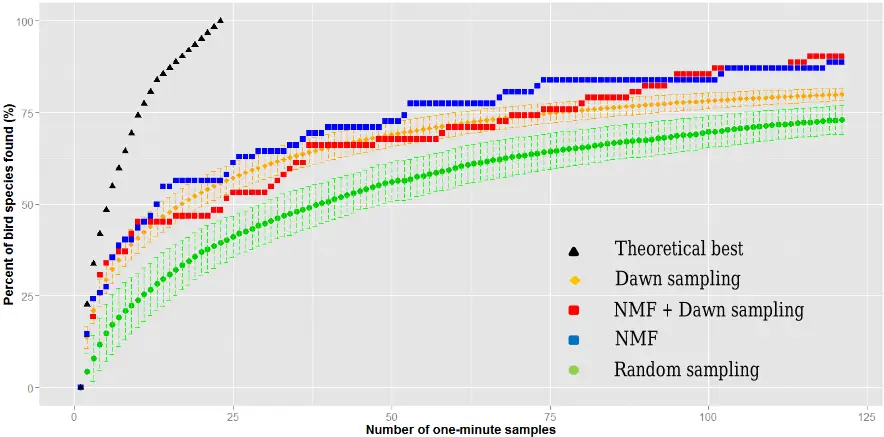

## 6.4 Discussions

The use of non-negative matrix factorisation has two niceties of decomposing a spectrogram into a spectral profile matrix and a temporal coefficient matrix. One attraction is the spectral profiles can be considered as indicators of distinct bird vocalisations and utilised to sample audio clips. This method assists people in conducting efficient bird species richness surveys. The other felicity is the temporal coefficients indicate the occurrences of the corresponding spectral profiles, which might merit further investigation of the abundance of vocalisations.

A randomisation method is used to estimate the appropriate number of factorisation rank of environmental audio clips. Although audio clips used in this study are at a one-minute resolution, this randomisation method is applicable to recordings of any arbitrary length. One may notice that non-negative matrix factorisation reduces the data dimensions of a spectrogram. The effectiveness of such data reduction is based on the acoustic complexity of an audio clip. For example, a spectrogram in this study has about 2000 × (256 - 30) = 452000 data points (The lowest 30 frequency bins, ranging from 0 to 1000 Hz, have been removed to avoid low-frequency noise). The maximum number of factorisation rank of a spectrogram is 28; therefore it has (2000 × 28) + (28 × 226) = 62328 data points. That is, for the most complex spectrogram in the dataset, the decomposed data are approximately 1/7 size of the original spectrogram. The trade-off is an increase in computational time, which is mainly dependent on different non-negative matrix factorisation algorithms.

One advantage of using the proposed method to assist bird species surveys is that it is not temporally-dependent. In contrast to the dawn sampling, the proposed method can search through all audio clips for species, including those that may not vocalise at dawn. This can be exemplified by the 141st one-minute audio clip of the original one-day recording (It is recorded from 2:21 a.m. to 2:22 a.m.). It can be learned from the bird annotations that there is only one species in this audio clip and it vocalises at night. Apparently, any species that vocalise outside of dawn chorus cannot be found by dawn sampling. However, the proposed method successfully captures distinct bird vocalisations within 120 one-minute samples. The limitations of this technique are two-fold. First, the non-negative matrix factorisation only captures the repetitive spectra in an audio clip. Frequency-modulated vocalisations (syllables with multiple discrete dominant frequencies such as Vocalisation No. 3) will be missed due to a low signal-to-noise ratio by using this technique. However, since this vocalisation occurs in most of the audio clips, it is picked up with other bird vocalisations. Second, the proposed method is only implemented on a one-day in-field recording collected from a sub-tropical area. Future work is needed to test the proposed algorithm with a large

number of audio recordings.

## 6.5 Summary

This chapter utilises the non-negative matrix factorisation to extract spectral profiles from environmental recordings to represent distinct bird vocalisations and direct bird species richness surveys. A novel randomisation method is proposed to determine the factorisation rank based on the acoustic complexity of an audio clip. The spectral profiles derived from non-negative matrix factorisation are later clustered and used to generate a codebook of spectral profiles. Given such a codebook, a greedy algorithm is developed to sample audio clips in an order that maximises the number of unique bird vocalisations at each audited audio clip sample. Although the percent of bird species found in the first 60 one-minute audio clip samples using the non-negative matrix factorisation method (71.0%) is close to that of dawn sampling (72.6%), the former method offers the currently best result in the first 120 samples by finding 90.3% of total species. This result implies that the non-negative matrix factorisation method has the potential to further reduce the redundancy of acoustic data for rapid determination of

bird species. The use of dawn sampling compensates the non-negative matrix factorisation method for the early inefficiency of the sampling, providing higher efficiency for assisting bird species surveys than either method used alone. The non-negative matrix factorisation offers an effective way to exact spectral profiles for the representation of distinct bird vocalisations in the case of non-targeted multiple species inventories. However, there are weaknesses in the proposed method for generating the codebook of spectral profiles. First, clustering the spectral profiles based on their corresponding temporal coefficients is under the assumption that different vocalisations are well partitioned and the same vocalisations are adjacent in the time domain. This assumption holds in most cases and relies on the signal-to-noise ratio of bird vocalisations. Second, the use of Pearson's correlation coefficients to measure the similarity between two spectral profiles may be simplistic because such a method is subject to outliers. Further work is needed to improve this similarity measure. The non-negative matrix factorisation method has a promising application in analysis of environmental recordings with non-targeted multiple species inventories. Although this study focuses on birds, the proposed method should be applicable to the analysis of other vocal species such as crickets and frogs. This work also broadens the scope of non-negative matrix factorisation from gene expression and image representation to include faunal detection in environmental recordings.

## 7 Conclusions and future work

Advances in acoustic sensor technology enable the preservation of data for environmental monitoring and biodiversity assessment. These data remain opaque unless effective and efficient methods are used to interrogate them. Traditional in-field manual observation and analysis has become a big data problem. Although a growing number of automated techniques have been devised for vocal species detection such as insects and frogs (Brandes, Naskrecki and Figueroa 2006), birds (Acevedo et al. 2009), and bats (Russo and Voigt 2016), they are limited to various aspects such as well-labelled datasets and high signal-to-noise ratio recordings. There is a pressing need to develop automated techniques that can enhance the efficiency during data analysis process. The objective of the current research is to investigate automated techniques in assisting manual surveys of bird species in a one-day recording. The proposed methods enable to sample audio clips in a way that the maximum number of unique bird species can be manually identified while the minimum number of audio clips is required to be listened to.

## 7.1 Summary of achievements

This thesis poses the research question "How can automated techniques assist efficient bird surveying in environmental recordings?" To address this question, a series of computerassisted techniques have been investigated, improving the efficiency of surveying birds with acoustic data. These techniques consist of the main contributions of this thesis and answer the sub-questions proposed in section 1.2:

1. How can irrelevant audio recordings be removed to assist bird species surveys?
2. How can audio recordings be ranked to increase the efficiency of bird species surveys?

The mapping between achievements, sub-questions, and chapters is summarised in Table 7.1.

Table 7.1 The mapping of achievements, research questions, and chapters

| Automated techniques | Research questions | Chapters |
| -------------------- | ------------------ | -------- |
| Classification       | 1                  | 4        |
| Ranking              | 2                  | 5 6      |

The main contributions of this thesis are:

- 1. Applied a single-label classification model to remove irrelevant audio clips which are unlikely to contain bird species

The first automated technique proposed in this thesis is classification, which aims at filtering acoustic data that are likely to contain bird species so that species richness surveys can be conducted more efficiently based on these post-classified data. It answers sub-question 1. Chapter 4 compares various single- and multi-label classifiers in terms of their classification accuracy and the performance of filtering acoustic data for bird species at a one-minute resolution. Consequently, an optimal classifier that can retain 95.2% of bird species is selected to remove irrelevant acoustic data. The classification method has the advantages of being resilient to weather conditions such as heavy rain and strong wind, albeit having a comparable efficiency of determining bird species richness to dawn sampling.

- 2. Proposed two techniques to rank audio clips for efficient acoustic bird species surveys

Two ranking techniques are proposed to sample audio clips based on the audio recordings classified as 'Birds'. They answer sub-questions 2. Chapter 5 aims to find a proxy for the number of unique bird species from variants of acoustic indices. The experimental results show that the summary horizontal ridge (horRidge) index is best correlated with the number of unique bird species in targeted one-minute audio clips. The sampled sequence of audio clips directed by the horRidge offers higher efficiency for bird species richness surveys than that of dawn sampling. It has also been shown that the increase of temporal or spectral resolutions of acoustic indices can improve the efficiency of bird species richness surveys. Since the ranking by acoustic indices method ignores the same species at audited audio clips, a redundancy removal method is introduced to eliminate temporally adjacent and acoustically similar audio clips. However, this post-redundancy removal method has limited ability to improve the efficiency of bird species richness surveys and the use of such a method is subject to empirical parameter settings. Chapter 6 develops a non-negative matrix factorisation based algorithm to detect overlapping bird vocalisations amongst audio clips for more efficient bird species surveys. This technique takes into consideration overlapping bird vocalisations and provides a method to maximise the number of new vocalisations at each audited audio clip. A new randomisation technique is proposed to determine the factorisation rank of different audio clips, each of which is

83

dependent on the complexity of acoustic content. The temporally adjacent spectral profiles of audio clips are clustered and considered as a distinct bird vocalisation. A codebook of distinct spectral profiles is created by using a similarity measure. Finally, a greedy algorithm is proposed to sample audio clips by maximising the number of unique spectral profiles in each sampled audio clip. This technique outperforms other techniques by finding 90.3% of bird species within 120 one-minute audio clip samples. Table 7.2 summarises the main results of different chapters experiments in comparison with two benchmarks in the first 60 and 120 one-minute audio clip samples. The best performance is highlighted in bold.

Table 7.2 The progressive results of the main

|                                                                                  | Random sampling | Dawn sampling | Classification Chapter 4 | Ranked by acoustic indices Chapter 5 | Non-negative matrix factorisation Chapter 6 |
| -------------------------------------------------------------------------------- | --------------- | ------------- | ------------------------ | ------------------------------------ | ------------------------------------------- |
| Percent of bird species found in the first 60 one- minute audio clip samples (%) | 60.4 ± 5.2      | 72.0 ± 3.1    | 70.2 ± 4.0               | 82.3                                 | 77.4                                        |
| Percent of bird species found in the first 120 one-minute audio clip samples (%) | 73.0 ± 3.9      | 80.0 ± 1.7    | 81.4 ± 3.7               | 87.1                                 | 90.3                                        |

The proposed automated techniques are beneficial to the study of soundscape ecology which deals with a number of audio recordings that cover a large spatiotemporal scale. They enable to remove irrelevant acoustic data such as the rain and the wind so that laborious manual surveys can be alleviated for species analysis.

The time that a skilled person can spend on listening to recordings for species study is rigorously restricted. The proposed methods ameliorate the efforts of bird species richness surveys in a one-day recording from 1435 one-minute audio clips to 120 of them while retaining 90% of the species. Such an improvement also outweighs other published strategies for assisting bird species richness surveys.

Acoustic indices were developed to assess biodiversity and investigate landscape under the framework of soundscape ecology; whereas bird species richness surveys are closely related to bioacoustics which mainly focuses on studying individual species. This thesis utilises acoustic indices to assist bird species surveys, signifying the linkage between soundscape ecology and bioacoustics. Although the current study focuses on bird species, the idea of classifying and ranking audio clips for species richness surveys should be applicable to other vocal species.

## 7.2 Limitations

This study assumes that no species share the same vocalisations and any species has a low diversity of vocalisations. A mapping between multiple types of vocalisations and multiple species is not uncommon in the natural environment. When confronted with recordings containing multiple bird species with multiple types of vocalisations, the current approach could be less efficient. However, based on the current experimental results, it can be inferred that the proposed automated techniques can efficiently assist bird species richness surveys using acoustic data collected from a sub-tropical area. There is a constraint on the scope of available data from two aspects. First, environmental recordings used in this thesis are collected from a single location, which could bias the accuracy of the classification model for a sub-tropical ecosystem. Therefore, it is essential to test the robustness of the proposed classifier with recordings collected from other regions. Additionally, annotations of bird species are limited to a small group of skilled persons. One might also wonder if various levels of bird species richness could affect the efficiency of the proposed approach. The number of unique bird species in the recordings is not under any control during the development of automated techniques; instead, it is the vocal activities of birds that could make a difference. Provided that different vocalisations partition well in both temporal and spectral domains, the current approach is able to detect the existence of different species and efficiently direct the sampling of audio clips, regardless of high or low species richness. The classification methods have no classes related to amphibians such as frogs. This is mainly because the environmental recordings used in this thesis rarely contain amphibians and the main study object is bird species. For the classifier proposed in this thesis, audio clips that do contain amphibians could be classified into any of the five pre-defined classes, depending on the time-frequency structures of their vocalisations. An additional dataset (labelled with the targeted amphibian classes) is required to generate a new classifier. The study of acoustic indices for soundscape ecology analysis is still in its infancy. There is

no single index that can reliably estimate all biodiversity facets of an ecosystem. However, several complementary indices can be used for biodiversity assessment. Extra care needs to be taken when acoustic indices are used for species analysis especially when they are summarised from an audio recording. They might be more suitable for analysing general acoustic complexity or species abundance at a community level than specific species identification, where detailed acoustic characteristics are important.

## 7.3 Future work

This work can be seen as a first step towards using automated techniques to assist biodiversity assessment and environmental monitoring with acoustics. There remains much work to be done in this field. Two particularly interesting areas for further research are

The classifiers proposed in chapter 4 are useful for filtering massive environmental recordings for ecological studies, but they are yet available to the public. A web-based system (https://www.ecosounds.org/) is being built by the eco-acoustic group of Queensland University of Technology to archive, manage, and process environmental recordings; therefore integrating the classification techniques into this system will have a great practical

described as follows. use.

The non-negative matrix factorisation-based algorithm in chapter 6 has shown promising results for distinct bird vocalisation detection. It provides a new solution to the problem of acoustic species detection in the case of non-targeted multiple species inventories. The similarity measure used to construct the codebook of spectral profiles is subject to outliers. Using other outlier-resistant similarity measures should create a more accurate codebook and hence enhance the efficiency of determining bird species richness.

## Appendix - Names of bird species

| name                                                                                                                                                                                                                                                                                                                                                                                                                                                          | Scientific                                                                                                                                                                                                                                                                                                                                                                                                                                                                                                                               |
| ------------------------------------------------------------------------------------------------------------------------------------------------------------------------------------------------------------------------------------------------------------------------------------------------------------------------------------------------------------------------------------------------------------------------------------------------------------- | ---------------------------------------------------------------------------------------------------------------------------------------------------------------------------------------------------------------------------------------------------------------------------------------------------------------------------------------------------------------------------------------------------------------------------------------------------------------------------------------------------------------------------------------- |
| English Eastern Koel Eastern Yellow Robin Eastern Whipbird Grey Fantail Grey Shrike-thrush Leaden Flycatcher Lewin's Honeyeater Magpie-lark New Guinea Babbler Olive-backed Oriole Pied Butcherbird Rainbow Lorikeet Rufous Fantail Rufous Whistler Sacred Kingfisher Scarlet Honeyeater Shining Bronze-cuckoo Silvereye Spangled Drongo Striated Pardalote Superb Fairy-wren Torresian Crow White-throated Honeyeater Willie Wagtail Yellow-faced Honeyeater | name Eudynamys orientalis Eopsaltria australis Psophodes olivaceus Rhipidura albiscapa Colluricincla harmonica Myiagra rubecula Meliphaga lewinii Grallina cyanoleuca Pomatostomus isidorei Oriolus sagittatus Cracticus nigrogularis Trichoglossus moluccanus Rhipidura rufifrons Pachycephala rufiventris Todiramphus sanctus Myzomela sanguinolenta Chrysococcyx lucidus Zosterops lateralis Dicrurus bracteatus Pardalotus striatus Malurus cyaneus Corvus orru Melithreptus albogularis Rhipidura leucophrys Lichenostomus chrysops |

## Bibliography

- Acevedo, M. A., Corrada-Bravo, C. J., Corrada-Bravo, H., Villanueva-Rivera, L. J. and Aide, T. M. 2009. "Automated classification of bird and amphibian calls using machine learning: A comparison of methods." Ecological Informatics 4 (4): 206-214.
- Acevedo, M. A. and Villanueva-Rivera, L. J. 2006. "Using Automated Digital Recording Systems as Effective Tools for the Monitoring of Birds and Amphibians." Wildlife Society Bulletin 34 (1): 211-214.
- Aide, T. M., Corrada-Bravo, C. J., Campos-Cerqueira, M., Milan, C., Vega, G. and Alvarez, R. 2013. "Real-time bioacoustics monitoring and automated species identification." PeerJ 1: e103.
- Anderson, S. E., Dave, A. S. and Margoliash, D. 1996. "Template-based automatic recognition of birdsong syllables from continuous recordings." The Journal of the Acoustical Society of America 100 (2): 1209-1219.
- Baker, M. C. 1974. "Genetic Structure of Two Populations of White-Crowned Sparrows with Different Song Dialects." The Condor 76 (3): 351-356.
- Baker, M. C. and Logue, D. M. 2003. "Population Differentiation in a Complex Bird Sound: A Comparison of Three Bioacoustical Analysis Procedures." Ethology 109 (3): 223242.
- Ballas, J. A. 1993. "Common factors in the identification of an assortment of brief everyday sounds." Journal of experimental psychology: human perception and performance 19 (2): 250.
- Bardeli, R., Wolff, D., Kurth, F., Koch, M., Tauchert, K. H. and Frommolt, K. H. 2010. "Detecting bird sounds in a complex acoustic environment and application to bioacoustic monitoring." Pattern Recognition Letters 31 (12): 1524-1534.
- Benetos, E., Lagrange, M. and Dixon, S. 2012. "Characterisation of Acoustic Scenes using a Temporally Constrained Shit-Invariant Model." Paper presented at the DAFx, York, United Kingdom, 2012-09-17.
- Bengio, Y., Courville, A. and Vincent, P. 2013. "Representation Learning: A Review and New Perspectives." IEEE Transactions on Pattern Analysis and Machine Intelligence 35 (8): 1798-1828.
- Berry, M. W., Browne, M., Langville, A. N., Pauca, V. P. and Plemmons, R. J. 2007. "Algorithms and applications for approximate nonnegative matrix factorization." Computational Statistics &amp; Data Analysis 52 (1): 155-173.
- Bertin, N., Badeau, R. and Richard, G. 2007. "Blind Signal Decompositions for Automatic Transcription of Polyphonic Music: NMF and K-SVD on the Benchmark." In 2007 IEEE International Conference on Acoustics, Speech and Signal Processing, 15-20 April 2007, edited, I65-I68.
- Brandes, T. S. 2008. "Automated sound recording and analysis techniques for bird surveys and conservation." Bird Conservation International 18 (S1): 163-173.
- Brandes, T. S., Naskrecki, Piotr and Figueroa, Harold K. 2006. "Using image processing to detect and classify narrow-band cricket and frog calls." The Journal of the Acoustical Society of America 120: 2950.
- Briggs, F., Lakshminarayanan, B., Neal, L., Fern, X. Z., Raich, R., Hadley, S. J. K., Hadley, A. S. and Betts, M. G. 2012. "Acoustic classification of multiple simultaneous bird species: A multi-instance multi-label approach." The Journal of the Acoustical Society of America 131 (6): 4640-4650.

Briggs, F., Raich, R. and Fern, X. 2009. "Audio classification of bird species: a statistical manifold approach." Paper presented at the Ninth IEEE International Conference on Data Mining. Brumm, H. 2006. "Signalling through acoustic windows: nightingales avoid interspecific competition by short-term adjustment of song timing." Journal of Comparative Physiology A 192 (12): 1279-1285. Brunet, J., Tamayo, P., Golub, T. R. and Mesirov, J. P. 2004. "Metagenes and molecular pattern discovery using matrix factorization." Proceedings of the national academy of sciences 101 (12): 4164-4169. Buck, J. R. and Tyack, P. L. 1993. "A quantitative measure of similarity for tursiopstruncatus signature whistles." The Journal of the Acoustical Society of America 94 (5): 24972506. Buddle, C. M., Beguin, J., Bolduc, E., Mercado, A., Sackett, T. E., Selby, R. D., VaradySzabo, H. and Zeran, R. M. 2005. "The importance and use of taxon sampling curves for comparative biodiversity research with forest arthropod assemblages." The Canadian Entomologist 137 (01): 120-127. Cakir, E., Heittola, T., Huttunen, H. and Virtanen, T. 2015. "Polyphonic sound event detection using multi label deep neural networks." Paper presented at the 2015 International Joint Conference onNeural Networks (IJCNN), 12-17 July 2015. Catchpole, C. K. and Slater, P. 2003. Bird song: biological themes and variations: Cambridge University Press. Cauchi, B. 2011. "Non-negative matrix factorisation applied to auditory scenes classification." Master, Université Pierre et Marie Curie. Charif, R, Waack, A and Strickman, L. 2010. Raven Pro 1.4 User's Manual. The Cornell Lab of Ornighology, Ithaca, NY. Chen, Yanping, Why, Adena, Batista, Gustavo, Mafra-Neto, Agenor and Keogh, Eamonn. 2014. "Flying Insect Classification with Inexpensive Sensors." Journal of Insect Behavior 27 (5): 657-677. doi: 10.1007/s10905-014-9454-4. Chen, Z. and Maher, R. C. 2006. "Semi-automatic classification of bird vocalizations using spectral peak tracks." The Journal of the Acoustical Society of America 120 (5): 29742984. Cheng, W., Hüllermeier, E. and Dembczynski, K. J. 2010. "Bayes optimal multilabel classification via probabilistic classifier chains." Paper presented at the The 27th international conference on machine learning. Chu, S., Narayanan, S. and Kuo, C. C. J. 2009. "Environmental Sound Recognition With Time-Frequency Audio Features." IEEE Transactions on Audio, Speech, and Language Processing 17 (6): 1142-1158. Clark, C. W., Marler, P. and Beeman, K. 1987. "Quantitative Analysis of Animal Vocal Phonology: an Application to Swamp Sparrow Song." Ethology 76 (2): 101-115. Coates, A. and Ng, A. Y. 2012. "Learning Feature Representations with K-Means." In Neural Networks: Tricks of the Trade: Second Edition, 561-580: Springer Berlin Heidelberg. Cody, Martin L and Brown, James H. 1969. "Song asynchrony in neighbouring bird species." Nature 222: 778-780. Cotgreave, P. and Harvey, P. H. 1994. "Associations among Biogeography, Phylogeny and Bird Species Diversity." Biodiversity Letters 2 (2): 46-55. Cottman-Fields, M., Brereton, M. and Roe, P. 2013. "Virtual birding : extending an environmental pastime into the virtual world for citizen science." Paper presented at the SIGCHI Conference on Human Factors in Computing Systems, Paris, France.

de Oliveira, A. G., Ventura, T. M., Ganchev, T. D., de Figueiredo, J. M., Jahn, O., Marques, M. I. and Schuchmann, K. L. 2015. "Bird acoustic activity detection based on morphological filtering of the spectrogram." Applied Acoustics 98: 34-42. Dickinson, Janis L, Zuckerberg, Benjamin and Bonter, David N. 2010. "Citizen science as an ecological research tool: challenges and benefits." Annual review of ecology, evolution, and systematics 41: 149-172. Dong, X., Towsey, M., Zhang, J., Banks, J. and Roe, P. 2013. "A Novel Representation of Bioacoustic Events for Content-Based Search in Field Audio Data." Paper presented at the Digital Image Computing: Techniques and Applications (DICTA). Dubois, D., Guastavino, C. and Raimbault, M. 2006. "A Cognitive Approach to Urban Soundscapes: Using Verbal Data to Access Everyday Life Auditory Categories." Acta Acustica united with Acustica 92 (6): 865-874. Duda, Richard O, Hart, Peter E and Stork, David G. 2012. Pattern classification: John Wiley &amp; Sons. Ehrlich, P.R. and Roughgarden, J. 1987. The Science of Ecology: Macmillan. Eldridge A. C., Casey M., Moscoso P., Peck M. 2016. "A New Method for Ecoacoustics? Toward the Extraction and Evaluation of Ecologically-Meaningful Sound Objects using Sparse Coding Methods." PeerJ 4:e2108. Eronen, A. J., Peltonen, V. T., Tuomi, J. T., Klapuri, A. P., Fagerlund, S., Sorsa, Timo, Lorho, G. and Huopaniemi, Jyri. 2006. "Audio-based context recognition." Audio, Speech, and Language Processing, IEEE Transactions on 14 (1): 321-329. Fabris, F. and Freitas, A. A. 2014. "Dependency network methods for Hierarchical Multilabel Classification of gene functions." Paper presented at the 2014 IEEE Symposium on Computational Intelligence and Data Mining (CIDM). Fagerlund, S. 2007. "Bird species recognition using support vector machines." EURASIP Journal on Advances in Signal Processing 2007. Farina, A. 2014. Soundscape Ecology: Principles, Patterns, Methods and Applications: Springer. Farina, A., Pieretti, N. and Piccioli, L. 2011. "The soundscape methodology for long-term bird monitoring: A Mediterranean Europe case-study." Ecological Informatics 6 (6): 354-363. Feng, T., Li, S. Z., Shum, H. and Zhang, H. 2002. "Local non-negative matrix factorization as a visual representation." In The 2nd International Conference on Development and Learning, 2002, edited, 178-183. Ferroudj, M., Truskinger, A., Towsey, M., Zhang, L., Zhang, J. and Roe, P. 2014. "Detection of Rain in Acoustic Recordings of the Environment." Paper presented at the Trends in Artificial Intelligence: 13th Pacific Rim International Conference on Artificial Intelligence, Gold Coast, QLD, Australia. Ficken, R. W., Ficken, M. S. and Hailman, J. P. 1974. "Temporal Pattern Shifts to Avoid Acoustic Interference in Singing Birds." Science 183 (4126): 762-763. Fletcher, N. H. 2014. "Animal Bioacoustics." In Springer Handbook of Acoustics, 821-841. New York, NY: Springer New York. Forrest, T. G. 1994. "From Sender to Receiver: Propagation and Environmental Effects on Acoustic Signals." American Zoologist 34 (6): 644-654. Frigyesi, A. and Höglund, M. 2008. "Non-Negative Matrix Factorization for the Analysis of Complex Gene Expression Data: Identification of Clinically Relevant Tumor Subtypes." Cancer Informatics 6: 275-292. Fürnkranz, J., Hüllermeier, E., Mencía, E. L. and Brinker, K. 2008. "Multilabel classification via calibrated label ranking." Machine Learning 73 (2): 133-153.

Gage, S. H. and Axel, A. C. 2013. "Visualization of temporal change in soundscape power of a Michigan lake habitat over a 4-year period." Ecological Informatics 21: 100-109. Gasc, A., Sueur, J., Jiguet, F., Devictor, V., Grandcolas, P., Burrow, C., Depraetere, M. and Pavoine, S. 2013. "Assessing biodiversity with sound: Do acoustic diversity indices reflect phylogenetic and functional diversities of bird communities?" Ecological Indicators 25: 279-287. Graciarena, M., Delplanche, M., Shriberg, E., Stolcke, A. and Ferrer, L. 2010. "Acoustic front-end optimization for bird species recognition." Paper presented at the 2010 IEEE International Conference on Acoustics, Speech and Signal Processing. Gribonval, R. 2001. "Fast matching pursuit with a multiscale dictionary of Gaussian chirps." IEEE Transactions on Signal Processing 49 (5): 994-1001. Gribonval, R. and Bacry, E. 2003. "Harmonic decomposition of audio signals with matching pursuit." IEEE Transactions on Signal Processing 51 (1): 101-111. Hall, M. A. 1999. "Correlation-based feature selection for machine learning." Doctoral Dissertation, The University of Waikato. Hall, M. A., Frank, E., Holmes, G., Pfahringer, B., Reutemann, P. and Witten, I. H. 2009. "The WEKA data mining software: an update." SIGKDD Explor. Newsl. 11 (1): 10-18. Harma, A. 2003. "Automatic identification of bird species based on sinusoidal modeling of syllables." Paper presented at the IEEE International Conference on Acoustics, Speech, and Signal Processing. Haselmayer, J. and Quinn, J. S. 2000. "A COMPARISON OF POINT COUNTS AND SOUND RECORDING AS BIRD SURVEY METHODS IN AMAZONIAN SOUTHEAST PERU." The Condor 102 (4): 887-893. Hobson, Keith A., Rempel, Robert S., Hamilton, Greenwood, Turnbull, Brian and Wilgenburg, Steven L. Van. 2002. "Acoustic Surveys of Birds Using Electronic Recordings: New Potential from an Omnidirectional Microphone System." Wildlife Society Bulletin 30 (3): 709-720. Honnay, O., Endels, P., Vereecken, H. and Hermy, M. 1999. "The role of patch area and habitat diversity in explaining native plant species richness in disturbed suburban forest patches in northern Belgium." Diversity and Distributions 5 (4): 129-141. Hutchins, L. N., Murphy, S. M., Singh, P. and Graber, J. H. 2008. "Position-dependent motif characterization using non-negative matrix factorization." Bioinformatics 24 (23): 2684-2690. Hutto, R. L., Pletschet, S. M. and Hendricks, P. 1986. "A Fixed-Radius Point Count Method for Nonbreeding and Breeding Season Use." The Auk 103 (3): 593-602. Jafari, M. G. and Plumbley, M. D. 2011. "Fast Dictionary Learning for Sparse Representations of Speech Signals." IEEE Journal of Selected Topics in Signal Processing 5 (5): 1025-1031. Johnson, R. R., Brown, B. T., Haight, L. T. and Simpson, J. M. 1981. "Playback recordings as a special avian censusing technique." Studies in Avian Biology 6: 68-75. Kogan, J. A. and Margoliash, D. 1998. "Automated recognition of bird song elements from continuous recordings using dynamic time warping and hidden Markov models: A comparative study." The Journal of the Acoustical Society of America 103 (4): 21852196. Kroosdma, D.E., Vielliard, J. M. E. and Stiles, F. G. 1996. "Study of bird sounds in the Neotropics: urgency and opportunity." Ecology and Evolution of Acoustic Communication in Birds: 269-281. Krstulovic, S. and Gribonval, R. 2006. "MPTK: Matching pursuit made tractable." Paper presented at the IEEE International Conference on Acoustics, Speech and Signal Processing.

Kwan, C., Mei, G., Zhao, X., Ren, Z., Xu, R., Stanford, V., Rochet, C., Aube, J. and Ho, K. C. 2004. "Bird classification algorithms: Theory and experimental results." Paper presented at the IEEE International Conference on Acoustics, Speech, and Signal Processing. Lakshminarayanan, B., Raich, R. and Fern, X. Z. 2009. "A Syllable-Level Probabilistic Framework for Bird Species Identification." Paper presented at the International Conference on Machine Learning and Applications. Lamel, L., Rabiner, L., Rosenberg, A. E. and Wilpon, J. G. 1981. "An improved endpoint detector for isolated word recognition." Acoustics, Speech and Signal Processing on IEEE Transactions 29 (4): 777-785. Langfelder, P., Zhang, B. and Horvath, S. 2008. "Defining clusters from a hierarchical cluster tree: the Dynamic Tree Cut package for R." Bioinformatics 24 (5): 719-720. Lee, D. D. and Seung, H. S. 1999. "Learning the parts of objects by non-negative matrix factorization." Nature 401 (6755): 788-791. Magurran, A. E. and McGill, B. J. 2011. Biological diversity: frontiers in measurement and assessment. Vol. 12: Oxford University Press. Malkin, R. G. and Waibel, A. 2005. "Classifying user environment for mobile applications using linear autoencoding of ambient audio." Paper presented at the IEEE International Conference on Acoustics, Speech, and Signal Processing. Mallat, S. G. and Zhang, Z. 1993. "Matching pursuits with time-frequency dictionaries." IEEE Transactions on Signal Processing 41 (12): 3397-3415. Margoliash, D., Cynthia, S. and Sue, A. I. 1994. "The Process of Syllable Acquisition in Adult Indigo Buntings (Passerina cyanea)." Behaviour 131 (1/2): 39-64. Markatopoulou, F., Mezaris, V. and Kompatsiaris, I. 2014. "A Comparative Study on the Use of Multi-label Classification Techniques for Concept-Based Video Indexing and Annotation." In MultiMedia Modeling, 1-12. Marler, P. and Peters, S. 1982. "Developmental overproduction and selective attrition: New processes in the epigenesis of birdsong." Developmental Psychobiology 15 (4): 369378. Martindale, S. 1980. "A Numerical Approach to the Analysis of Solitary Vireo Songs." The Condor 82 (2): 199-211. Mason, R., Roe, P., Towsey, M., Zhang, J., Gibson, J. and Gage, S. 2008. "Towards an Acoustic Environmental Observatory." Paper presented at the IEEE Fourth International Conference on eScience. McIlraith, A. L. and Card, H. C. 1997. "Bird song identification using artificial neural networks and statistical analysis." Paper presented at the IEEE Canadian Conference on Engineering Innovation: Voyage of Discovery. McMichael, A. J., Butler, C. D. and Folke, Carl. 2003. "New Visions for Addressing Sustainability." Science 302 (5652): 1919-1920. Molau, S., Pitz, M., Schluter, R. and Ney, H. 2001. "Computing Mel-frequency cepstral coefficients on the power spectrum." Paper presented at the IEEE International Conference on Acoustics, Speech, and Signal Processing, 2001. Proceedings. Mundinger, P. 1975. "Song Dialects and Colonization in the House Finch, Carpodacus mexicanus, on the East Coast." The Condor 77 (4): 407-422. Nam, J., Kim, J., Mencía, E. L., Gurevych, I. and Fürnkranz, J. 2014. "Large-Scale Multilabel Text Classification - Revisiting Neural Networks." In Machine Learning and Knowledge Discovery in Databases, 437-452: Springer Berlin Heidelberg. Neal, L., Briggs, F., Raich, R. and Fern, X. Z. 2011. "Time-frequency segmentation of bird song in noisy acoustic environments." Paper presented at the IEEE International Conference on Acoustics, Speech and Signal Processing (ICASSP).

Oppenheim, Alan V, Schafer, Ronald W and Buck, John R. 1989. Discrete-time signal processing. Vol. 2: Prentice hall Englewood Cliffs, NJ. Oscar, L., Jorge, D., José, B., Juan, J. del C. and Antonio, B. 2012. "Binary relevance efficacy for multilabel classification." Progress in Artificial Intelligence 1 (4): 303313. Parker, Theodore A. 1991. "On the use of tape recorders in avifaunal surveys." Auk 108: 443444. Pascual-Montano, A., Carazo, J. M., Kochi, K., Lehmann, D. and Pascual-Marqui, R. D. 2006. "Nonsmooth nonnegative matrix factorization (nsNMF)." IEEE Transactions on Pattern Analysis and Machine Intelligence 28 (3): 403-415. Patrik, O. H. 2004. "Non-negative Matrix Factorization with Sparseness Constraints." J. Mach. Learn. Res. 5: 1457-1469. Pavoine, S. and Bonsall, M. B. 2011. "Measuring biodiversity to explain community assembly: a unified approach." Biological Reviews 86 (4): 792-812. Payne, R. B. 1985. "Behavioral Continuity and Change in Local Song Populations of Village Indigobirds Vidua chalybeate." Zeitschrift für Tierpsychologie 70 (1): 1-44. Pieretti, N., Farina, A. and Morri, D. 2011. "A new methodology to infer the singing activity of an avian community: The Acoustic Complexity Index (ACI)." Ecological Indicators 11 (3): 868-873. Pijanowski, B. C., Farina, A., Gage, S. H., Dumyahn, S. L. and Krause, B. L. 2011. "What is soundscape ecology? An introduction and overview of an emerging new science." Landscape Ecology 26 (9): 1213-1232. Pijanowski, B. C., Villanueva-Rivera, L. J., Dumyahn, S. L., Farina, A., Krause, B. L., Napoletano, B. M., Gage, S. H. and Pieretti, N. 2011. "Soundscape Ecology: The Science of Sound in the Landscape." BioScience 61 (3): 203-216. Ralph, C. J., Geupel, G. R., Pyle, P., Martin, T. E. and DeSante, D. F. 1993. Handbook of field methods for monitoring landbirds: USDA Forest Service/UNL Faculty Publications. Ramsey, J. B. and Zhang, Z. 1997. "The analysis of foreign exchange data using waveform dictionaries." Journal of Empirical Finance 4 (4): 341-372. Read, J. 2015. "MEKA 1.7.7." http://meka.sourceforge.net/. Read, J., Pfahringer, B. and Holmes, G. 2008. "Multi-label Classification Using Ensembles of Pruned Sets." In Eighth IEEE International Conference on Data Mining, edited, 9951000. Read, J., Pfahringer, B., Holmes, G. and Frank, E. 2011. "Classifier chains for multi-label classification." Machine Learning 85 (3): 333-359. Rempel, R. S., Hobson, K. A., Holborn, G., Wilgenburg, S. L. van and Elliott, J. 2005. "Bioacoustic Monitoring of Forest Songbirds: Interpreter Variability and Effects of Configuration and Digital Processing Methods in the Laboratory." Journal of Field Ornithology 76 (1): 1-11. Russo, D. and Voigt, C. C. 2016. "The use of automated identification of bat echolocation calls in acoustic monitoring: A cautionary note for a sound analysis." Ecological Indicators 66: 598-602. Rychtáriková, M. and Vermeir, G. 2013. "Soundscape categorization on the basis of objective acoustical parameters." Applied Acoustics 74 (2): 240-247. Sawhney, N. and Maes, P. 1997. Situational awareness from environmental sounds, Technical report: Massachusetts Institute of Technology. Schrama, T., Poot, M., Robb, M. and Slabbekoorn, H. 2007. "Automated monitoring of avian flight calls during nocturnal migration." In Proceedings of the International Expert meeting on IT-based detection of bioacoustical patterns, edited, 131-134.

See, L., Comber, A., Salk, C., Fritz, S., van der Velde, M., Perger, C., Schill, C., McCallum, I., Kraxner, F. and Obersteiner, M. 2013. "Comparing the quality of crowdsourced data contributed by expert and non-experts." PloS one 8 (7): e69958. Shamir, L., Yerby, C., Simpson, R., von Benda-Beckmann, A. M., Tyack, P. L., Samarra, F., Miller, P. and Wallin, J. 2014. "Classification of large acoustic datasets using machine learning and crowdsourcing: Application to whale calls." The Journal of the Acoustical Society of America 135 (2): 953-962. Smaragdis, P. 2004. "Non-negative Matrix Factor Deconvolution; Extraction of Multiple Sound Sources from Monophonic Inputs." In Fifth International Conference on Independent Component Analysis and Blind Signal Separation, Granada, Spain,, 494499: Springer Berlin Heidelberg. Smaragdis, P. and Brown, J. C. 2003. "Non-negative matrix factorization for polyphonic music transcription." In IEEE Workshop on Applications of Signal Processing to Audio and Acoustics, edited, 177-180. Somervuo, P. and Harma, A. 2004. "Bird song recognition based on syllable pair histograms." In IEEE International Conference on Acoustics, Speech, and Signal Processing, edited, 825-828. Spellerberg, I. F. and Fedor, P. J. 2003. "A tribute to Claude Shannon (1916-2001) and a plea for more rigorous use of species richness, species diversity and the 'Shannon-Wiener' Index." Global Ecology and Biogeography 12 (3): 177-179. Spyromitros, E., Tsoumakas, G. and Vlahavas, I. 2008. "An Empirical Study of Lazy Multilabel Classification Algorithms." In Artificial Intelligence: Theories, Models and Applications, 401-406: Springer Berlin Heidelberg. Stowell, D. and Plumbley, M. D. 2014. "Automatic large-scale classification of bird sounds is strongly improved by unsupervised feature learning." PeerJ 2: e488. Sueur, J., Farina, A., Gasc, A., Pieretti, N. and Pavoine, S. 2014. "Acoustic Indices for Biodiversity Assessment and Landscape Investigation." Acta Acustica united with Acustica 100 (4): 772-781. Sueur, J., Pavoine, S., Hamerlynck, O. and Duvail, S. 2008. "Rapid Acoustic Survey for Biodiversity Appraisal." PLoS ONE 3 (12): e4065. Team, Audacity. 2011. Audacity 1.3.13 beta. Team, R Core. 2013. "R: A language and environment for statistical computing. Thorpe, W. H. 1954. "The Process of Song-Learning in the Chaffinch as Studied by Means of the Sound Spectrograph." Nature 173 (4402): 465-469. Towsey, M. 2013. Noise removal from wave-forms and spectrograms derived from natural recordings of the environment. QUT ePrints, Brisbane, Australia. http://eprints.qut.edu.au/61399. Towsey, M., Wimmer, J., Williamson, I. and Roe, P. 2014. "The use of acoustic indices to determine avian species richness in audio-recordings of the environment." Ecological Informatics 21: 110-119. Towsey, M., Zhang, L., Cottman-Fields, M., Wimmer, J., Zhang, J. and Roe, P. 2014. "Visualization of Long-duration Acoustic Recordings of the Environment." Procedia Computer Science 29: 703-712. Truax, B. 2001. Handbook of acoustic ecology (CD-ROM version). Vol. 25, Computer Music Journal. Truskinger, A., Cottman-Fields, M., Eichinski, P., Towsey, M. and Roe, P. 2014. "Practical Analysis of Big Acoustic Sensor Data for Environmental Monitoring." In 2014 IEEE Fourth International Conference on Big Data and Cloud Computing (BdCloud), 3-5 Dec. 2014, edited, 91-98.

Truskinger, A., Towsey, M. and Roe, P. 2015. "Decision support for the efficient annotation of bioacoustic events." Ecological Informatics 25: 14-21. Tsoumakas, G., Katakis, I. and Vlahavas, I. 2010. "Mining Multi-label Data." In Data Mining and Knowledge Discovery Handbook, 667-685. Boston, MA: Springer US. Vallejo, E. E., Cody, M. L. and Taylor, C. E. 2007. "Unsupervised Acoustic Classification of Bird Species Using Hierarchical Self-organizing Maps." In Third Australian Conference on Progress in Artificial Life, Gold Coast, Australia, edited, 212-221. Vilches, E., Escobar, I. A., Vallejo, E. E. and Taylor, C. E. 2006. "Data Mining Applied to Acoustic Bird Species Recognition." Paper presented at the 18th International Conference on Pattern Recognition, 2006. Whittaker, R. H. 1972. "Evolution and Measurement of Species Diversity." Taxon 21 (2/3): 213-251. Whittaker, R. J., Willis, K. J. and Field, R. 2001. "Scale and species richness: towards a general, hierarchical theory of species diversity." Journal of Biogeography 28 (4): 453-470. Wildlife, Acoustics. 2014. "Bioacoustics Software and Field Recording Equipment." http://www.wildlifeacoustics.com. Wimmer, J., Towsey, M., Roe, P. and Williamson, I. 2013. "Sampling environmental acoustic recordings to determine bird species richness." Ecological Applications 23 (6): 1419-1428. Witten, Ian H, Frank, Eibe, Hall, Mark A and Pal, Christopher J. 2016. Data Mining: Practical machine learning tools and techniques: Morgan Kaufmann. Yang, H., Zhang, J. and Roe, P. 2013. "Reputation modelling in Citizen Science for environmental acoustic data analysis." Social Network Analysis and Mining 3 (3): 419-435. Zhang, J., Wei, L., Feng, X., Ma, Z. and Wang, Y. 2008. "Pattern Expression Nonnegative Matrix Factorization: Algorithm and Applications to Blind Source Separation." Computational Intelligence and Neuroscience 2008: 10. Zhang, L., Towsey, M., Zhang, J. and Roe, P. 2016. "Classifying and ranking audio clips to support bird species richness surveys." Ecological Informatics 34: 108-116.
