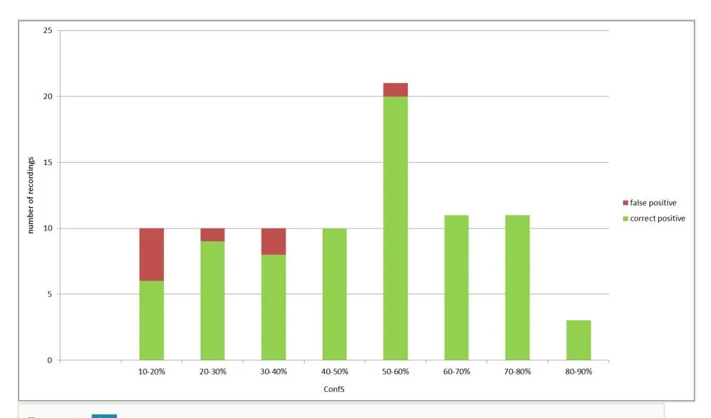
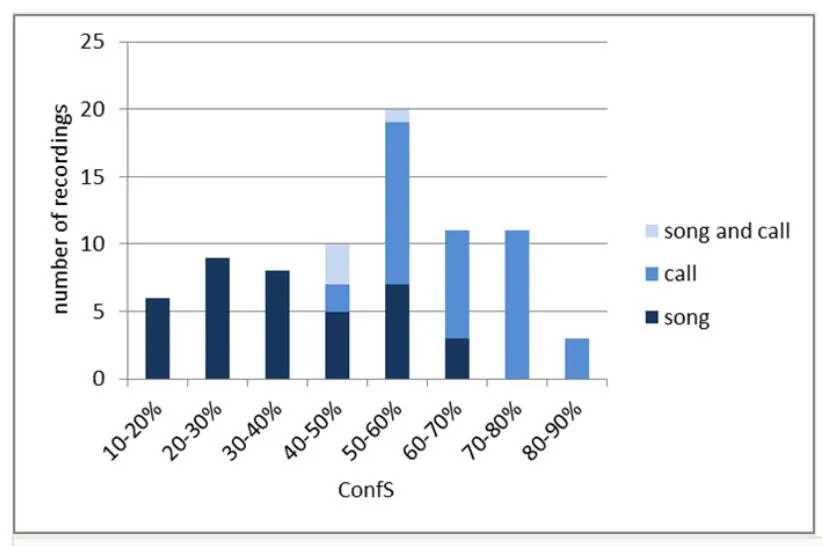

#### Case Study

# **Evaluation of acoustic pattern recognition of nightingale (\***Luscinia megarhynchos**\*) recordings by citizens**

Marcel Stehle , Mario Lasseck , Omid Khorramshahi , Ulrike Sturm ‡,§ ‡ ‡ ‡

- ‡ Museum für Naturkunde Berlin Leibniz Institute for Evolution and Biodiversity Science, Berlin, Germany
- § Eberswalde University for Sustainable Development, Eberswalde, Germany

Corresponding author: Ulrike Sturm [\(ulrike.sturm@mfn-berlin.de](mailto:ulrike.sturm@mfn-berlin.de))

Reviewed v1

Received: 17 Jan 2020 | Published: 24 Feb 2020

Citation: Stehle M, Lasseck M, Khorramshahi O, Sturm U (2020) Evaluation of acoustic pattern recognition of nightingale (_Luscinia megarhynchos_) recordings by citizens. Research Ideas and Outcomes 6: e50233.

<https://doi.org/10.3897/rio.6.e50233>

## **Abstract**

Acoustic pattern recognition methods introduce new perspectives for species identification, biodiversity monitoring and data validation in citizen science but are rarely evaluated in real world scenarios. In this case study we analysed the performance of a machine learning algorithm for automated bird identification to reliably identify common nightingales (_Luscinia megarhynchos_) in field recordings taken by users of the smartphone app _Naturblick_. We found that the performance of the automated identification tool was overall robust in our selected recordings. Although most of the recordings had a relatively low confidence score, a large proportion of the recordings were identified correctly.

## **Keywords**

pattern recognition, sound recognition, species identification, mobile app, citizen science

## **Background**

Acoustic pattern recognition methods provide new perspectives for species identification and biodiversity monitoring (Frommolt et al. 2008, Briggs et al. 2012, Bardeli et al. 2010, Potamitis 2014, Stowell and Plumbley 2014, Frommolt 2017). In addition, Wiggins et al. (2011) outlined the potential of automatic recognition techniques and filtering of outliers as a mechanism for data validation in citizen science. In the last decade bird species identification based on acoustic signals have reached correct classification rates up to 99.7% (Lopes et al. 2011). Though, Lopes et al. (2011) showed that correct classification rate decrease from 95.1% to 78.2% when the number of bird species increase. In the LifeCLEF Bird classification challenge 2018 a mean average precision of 82.6% was obtained identifying foreground species in a data set of 1500 species (Goëau et al. 2018).

However, to be able to assess the performance of such automated classifiers sufficient testing in the field is indispensable (Russo and Voigt 2016, Rydell et al. 2017). Moreover, the implementation of an acoustic pattern recognition algorithm in a smartphone app introduces additional challenges like traffic noise in the background, low quality smartphone microphones and operator errors (Priyadarshani et al. 2018). Therefore, reported accuracies for relativly clean datasets are not applicable for practical use for data from field recordings (Priyadarshani et al. 2018).

The smartphone app _[Naturblick](http://naturblick.naturkundemuseum.berlin/)_ (_nature view_) was developed with the initial focus to encourage species identification for young adults (age 18 to 30) and combines several tools that allow users to identify animals and plants. In the second step the app was developed further as an integrative tool for environmental education and biodiversity monitoring in citizen science (Sturm and Tscholl 2019). _Naturblick_ enables users to record bird sounds, identify these recordings with an acoustic pattern recognition algorithm (Lasseck 2016) and share their recordings with citizen science projects, such as _[Forschun](https://forschungsfallnachtigall.de/) [gsfall Nachtigall](https://forschungsfallnachtigall.de/)_ (_nightingale research case_).

## **Objectives**

Priyadarshani et al. (2018) conducted a review on automated birdsong recognition. They showed that two thirds of studies are based on small datasets and are limited to carefully selected recordings. To our knowledge, acoustic pattern recognition methods are rarely evaluated in real world scenarios, examples of exceptions are Aide et al. (2013), Jahn et al. (2017). In this case study we provide a first insight into the practical application of an acoustic pattern recognition tool to identify nightingale sounds based on field recordings taken by citizens.

We analysed the performance of our classifier to reliably identify nightingales (_Luscinia megarhynchos_) in field recordings taken by _Naturblick_ users. First, the correctness of the classification was checked by manually validating the recordings. Secondly, the robustness of the classification was analysed more closely by subclassifying the validated nightingale sounds into two communicative signals: song and call.

## **Methodology**

The smartphone app _Naturblick_ has been released at an early stage in June 2016 and improved continuously based on the user feedback (see Sturm and Tscholl 2019). The first project phase had its focus on the identification of animals and plants, so there were no specific Citizen Science activities in the period from June 2016 to March 2018. User recorded bird sounds individually with the aim to identify them. These recordings were collected under the licence CC-BY SA 4.0 to serve as training material and as a general source for biodiversity research. Naturblick has been downloaded 45477 times and overall 55904 sound files have been recorded during the investigation period from June 2016 to October 2017.

The applied machine learning algorithm for automated bird identification is mainly based on template matching of spectrogram segments and a random forest ensemble learning method. First, individual bird song and call elements are extracted from the training data. For this the grayscale spectrogram of each audio file is treated as an image and sound elements are extracted by applying median clipping for noise reduction and various morphological operations for segmentation (Lasseck 2013). Features are created for each audio file by determining the cross-correlation of all extracted elements via template matching. During training features are weighted and reduced step by step with a random forest classifier to find the best call or song elements to represent and identify a species (Lasseck 2014, Lasseck 2015). The algorithm was trained as a regression task using the extra-tree regressor (Geurts et al. 2006) of the scikit-learn machine learning library (Pedregosa et al. 2011). A value between zero (species not detected) and one (species detected) indicates the probability of a species present in an audio file. This probability value can be interpreted as a confidence score (ConfS) ranging from zero to hundred percent. Audio material of 83 bird species from the Animal Sound Archive of the _Museum für Naturkunde Berlin_ and the collaborative online database Xeno-Canto was utilized for feature engineering and classifier training. A single classification run produces a ConfS for each of the 83 species. The algorithm yielded the best results in the NIPS4B Multi-label Bird Species Classification Challenge (Lasseck 2013), and in previous LifeCLEF evaluation campaigns (Lasseck 2014, Lasseck 2015).

The common nightingale (_Luscinia megarhynchos_), a common migratory bird in Berlin, was chosen as object of investigation. In Europe _Luscinia megarhynchos_ sings after arrival around mid April until late June (Kipper et al. 2016). Recordings, which met the following criteria were categorised as correctly identified as _Luscinia megarhynchos_ and validated manually:

- 1. _Luscinia megarhynchos_ was listed as the most probable species,
- 2. the ConfS was higher than 10%.

The seasonality of _L. megarhynchos_ was not included as a criterion in order to detect more false positive results. Based on their confidence scores these recordings were divided into two groups: <50%, >50%. Recordings with a ConfS > 50% were validated in its entirety. Recordings with a ConfS < 50% were divided into four groups (10-20%, 20-30%, 30-40%,

40-50%) and samples of ten recordings per group were randomly selected and validated. The sample recordings were validated manually and labelled as song, song and call, or call. One person listened to all recordings and compared them with verified recordings of songs and calls from the Animal Sound Archive of the _Museum für Naturkunde Berlin_. Additionally, a spectrogram analysis using Raven 1.4 was conducted for recordings with high similarity to other species. For each recording a spectrogram (visual representations of the audio recording) was produced and compared to verified spectrograms from the Animal Sound Archive of the _Museum für Naturkunde Berlin_. Variables measured included maximum and minimum frequencies, and delta frequency. Audio recordings, which were particularly difficult to distinguish, were cross-checked by a second researcher.

#### **Results**

In total, 468 field recordings met the defined criteria (Table 1). All recordings were made between September 2016 and October 2017. The duration varied from 1.9 seconds to 40.7 seconds. Most samples contained metadata on geographic coordinates, date and time of the recording. Only 10% of the recordings (46 recordings) had a ConfS higher than 50%. Most recordings had a confidence score between 10% and 20% (N=224).

#### Table 1. Recordings with conditions:

- 1. _L. megarhynchos_ listed as the most probable species;
- 2. confidence score > 10%, N=468.

| Month          | Total number of recordings | Number of recordings with ConfS <50% | Number of recordings with ConfS >50% |
| -------------- | -------------------------- | --------------------------------------- | --------------------------------------- |
| June 2016      | 0                          | 0                                       | 0                                       |
| July 2016      | 0                          | 0                                       | 0                                       |
| August 2016    | 0                          | 0                                       | 0                                       |
| September 2016 | 2                          | 2                                       | 0                                       |
| October 2016   | 0                          | 0                                       | 0                                       |
| November 2016  | 0                          | 0                                       | 0                                       |
| December 2016  | 1                          | 1                                       | 0                                       |
| January 2017   | 5                          | 5                                       | 0                                       |
| February 2017  | 3                          | 0                                       | 0                                       |
| March 2017     | 17                         | 16                                      | 1                                       |
| April 2017     | 53                         | 49                                      | 4                                       |
| May 2017       | 208                        | 199                                     | 9                                       |

| Month          | Total number of recordings | Number of recordings with ConfS <50% | Number of recordings with ConfS >50% |
| -------------- | -------------------------- | --------------------------------------- | --------------------------------------- |
| June 2017      | 125                        | 101                                     | 24                                      |
| July 2017      | 36                         | 28                                      | 8                                       |
| August 2017    | 11                         | 11                                      | 0                                       |
| September 2017 | 5                          | 5                                       | 0                                       |
| October 2017   | 2                          | 2                                       | 0                                       |

33 recordings of the 40 samples with a ConfS < 50% were validated as correctly classified (Fig. 1). One of the false identified recordings had the same ConfS (24.5%) both for the common nightingale and the common chaffinch (_Fringilla coelebs_) and was verified as a common chaffinch call. Also, nearly all the recordings with a ConfS >50% have been confirmed as correctly classified. Only one out of these 46 recordings was misidentified. Two of the false positive classified recordings were human imitations (ConfS 15% and 18.3%).

Figure 1. Verified _L. megarhynchos_ recordings in groups based on the ConfS (10-20%, N=10; 20-30%, N=10; 30-40%, N=10; 40-50%, N=10; 50-60%, N=21; 60-70%, N=11; 70-80%, N=11; 80-90%, N=3).

Twelve of the correctly identified recordings were found to be audio playbacks of files, CDs or similar sources (Table 2).

Table 2. Number of verified _L. megarhynchos_ recordings per indicators for audio playbacks of audio files or similar sources. Recordings with more than one indicator are marked with an asterisk (\*).

| Indicator        | Description                                                                                                                    | Number of recordings (ConfS)                                                               |
| ---------------- | ------------------------------------------------------------------------------------------------------------------------------ | ------------------------------------------------------------------------------------------ |
| Place and        | Species-specific plausibility of timestamp in combination                                                                      | 5 (22.8%_, 36.7%_, 37.4%_, 46.6%_,                                                         |
| time             | with geographical coordinates                                                                                                  | 47.4%\*)                                                                                   |
| High             | A high recording level indicates that a user has been                                                                          | 10 (17.4%_, 22.8%_, 28%_, 36.7%_,                                                          |
| recording        | holding his/her smartphone to a speaker, that plays                                                                            | 37.4%_, 46.6%_, 46.9%, 47.4%\*, 51.5%,                                                     |
| level            | back a recording.                                                                                                              | 52%\*)                                                                                     |
| Unusual noise | Absence of natural background noise or noise, which does not fit to an outdoor recording, e.g. mouse and keyboard sounds | 11 (17.4%_, 18%, 22.8%_, 28%_, 36.7%_, 37.4%_, 42.9%, 46.6%_, 46.9%_, 47.4%_, 52%\*) |

The majority of the verified recordings with a ConfS <50% were identified as nightingale song (Fig. 2). Most of the recordings with a ConfS >50% were classified as nightingal calls. All recordings classified as song and call were found to be audio playbacks of files, CDs or similar sources.

Figure 2. Vocalization types in verified nightingale recordings, N=78.

# **Discussion and relevance to ongoing research**

Our case study highlights the usefulness of acoustic pattern recognition to identify animal sounds recorded with smartphones. Regarding the classification of nightingales the performance of the automated identification tool was overall robust in our selected recordings. A large proportion of the verified recordings were classified correctly. This is remarkable, taking into account the origin of the source audio material used in this study. We expected large variations in audio qualities due to different microphones, various mobile phone vendors, general problems with urban field recordings because of background noise, and operator errors.

Interestingly, nightingale calls had a higher frequency of high confidence ranks in comparison to song recordings. One reason for this could be that nightingale calls have a smaller variability than songs and therefore are better recognized. Kipper et al. (2015) found only three distinct call types and measured 27 different acoustic variables per call in their study on male song responses to either male or female call playbacks in nightingales. In contrast, male nightingale song comprises of a large song type repertoire (e.g. Kipper et al. 2004). Also the underlying training material for the classifier could explain most of the discovered bias for calls. Hence, further investigation is necessary.

We discovered that the audio recognition tool of the app _Naturblick_ was tested commonly by playing playbacks of audio files or similar sources. We assume that users were curious to test the effectiveness of the audio pattern recognition. This interaction was not anticipated and the classifier was not trained to bias noisy field recordings versus high quality audio material. However, none of these playback recordings received confidence scores above 60%.

We believe, besides its value as species identification tool in general, automated pattern recognition should be recognized more as a mechanism to assess data quality of citizen science audio recordings via smartphones. Data quality may even be improved quite simply by applying indicators to identify outliers, e.g. audio playbacks of audio files or similar sources (Wiggins et al. 2011).

We only evaluated the precision of the nightingale classification and not its recall rate or sensitivity. Therefore, it would be interesting to examine the nightingale recordings that were excluded from our selection. Furthermore, the study was limited due to its small sample size of validated recordings. To address this, we plan to evaluate the identification performance of the recognition tool with an increased sample size of nightingale recordings.

# **Acknowledgements**

We thank Silke Voigt-Heucke for her valuable suggestions and for cross-checking individual recordings. We thank Dr. Karl-Heinz Frommolt for his support.

## **Funding program**

This publication was written as part of the project 'Stadtnatur entdecken', funded by the Federal Ministry of the Environment, Nature Conservation and Nuclear Safety (BMU).

## **References**

• Aide TM, Corrada-Bravo C, Campos-Cerqueira M, Milan C, Vega G, Alvarez R (2013) Real-time bioacoustics monitoring and automated species identification. PeerJ 1: e103. <https://doi.org/10.7717/peerj.103>

- Bardeli R, Wolff D, Kurth F, Koch M, Tauchert K-H, Frommolt K-H (2010) Detecting bird sounds in a complex acoustic environment and application to bioacoustic monitoring. Pattern Recognition Letters 31 (12): 1524‑1534. [https://doi.org/10.1016/j.patrec.](https://doi.org/10.1016/j.patrec.2009.09.014) [2009.09.014](https://doi.org/10.1016/j.patrec.2009.09.014)
- Briggs F, Lakshminarayanan B, Neal L, Fern X, Raich R, Hadley SK, Hadley A, Betts M (2012) Acoustic classification of multiple simultaneous bird species: A multi-instance multi-label approach. The Journal of the Acoustical Society of America 131 (6): 4640‑4650.<https://doi.org/10.1121/1.4707424>
- Frommolt K (2017) Information obtained from long-term acoustic recordings: applying bioacoustic techniques for monitoring wetland birds during breeding season. Journal of Ornithology 158 (3): 659‑668. <https://doi.org/10.1007/s10336-016-1426-3>
- Frommolt K-H, Bardeli R, Clausen M (2008) Computational bioacoustics for assessing biodiversity. International Expert meeting on IT-based detection of bioacoustical patterns, International Academy for Nature Conservation (INA) Isle of Vilm, 7-10 December 2007.
- Geurts P, Ernst D, Wehenkel L (2006) Extremely randomized trees. Machine Learning 63: 3‑42. <https://doi.org/10.1007/s10994-006-6226-1>
- Goëau H, Kahl S, Glotin H, Planque B, Vellinga W, Joly A (2018) Overview of BirdCLEF 2018: monospecies vs. soundscape bird identification. CLEF 2018 - Conference and Labs of the Evaluation Forum, Avignon, France. URL: [http://ceur-ws.org/Vol-2125/](http://ceur-ws.org/Vol-2125/invited_paper_9.pdf) [invited\\\_paper\\\_9.pdf](http://ceur-ws.org/Vol-2125/invited_paper_9.pdf)
- Jahn O, Ganchev TD, Marques MI, Schuchmann K-L (2017) Automated sound recognition provides insights into the behavioral ecology of a tropical bird. PLOS One 12 (1): e0169041.<https://doi.org/10.1371/journal.pone.0169041>
- Kipper S, Hultsch H, Mundry R, Todt D (2004) Long-term persistence of song performance rules in nightingales (_Luscinia megarhynchos_): a longitudinal field study on repertoire size and composition. Behaviour 141 (3): 371‑390. [https://doi.org/](https://doi.org/10.1163/156853904322981914) [10.1163/156853904322981914](https://doi.org/10.1163/156853904322981914)
- Kipper S, Kiefer S, Bartsch C, Weiss M (2015) Female calling? Song responses to conspecific call playbacks in nightingales, _Luscinia megarhynchos_ . Animal Behaviour 100: 60‑66.<https://doi.org/10.1016/j.anbehav.2014.11.011>
- Kipper S, Sellar P, Barlow C (2016) A comparison of the diurnal song of the Common Nightingale (Luscinia megarhynchos) between the non-breeding season in The Gambia, West Africa and the breeding season in Europe. Journal of Ornithology 158 (1): 223‑231. <https://doi.org/10.1007/s10336-016-1364-0>
- Lasseck M (2013) Bird song classification in field recordings: winning solution for nips4b 2013 competition. Proceedings of Neural Information Scaled for Bioacoustics, sabiod.org/nips4b, joint to NIPS, Nevada, December.
- Lasseck M (2014) Large-scale identification of birds in audio recordings. Working Notes of CLEF 2014 Conference[. https://doi.org/10.1007/978-3-319-24027-5\\\_39](https://doi.org/10.1007/978-3-319-24027-5_39)

- Lasseck M (2015) Towards automatic large-scale identification of birds in audio recordings. In: Mothe J, et al. (Eds) Experimental IR Meets Multilinguality, Multimodality, and Interaction. CLEF 2015. Lecture Notes in Computer Science. Vol. 9283. Springer, Cham. [https://doi.org/10.1007/978-3-319-24027-5\\\_39](https://doi.org/10.1007/978-3-319-24027-5_39)
- Lasseck M (2016) Improving bird identification using multiresolution template matching and feature selection during training. In: Working Notes of CLEF 2016 - Conference and Labs of the Evaluation forum, Evora, Portugal, 5-8 September.
- Lopes M, Gioppo L, Higushi T, Kaestner CA, Silla Jr. C, Koerich A (2011) Automatic Bird Species Identification for Large Number of Species. 2011 IEEE International Symposium on Multimedia[. https://doi.org/10.1109/ism.2011.27](https://doi.org/10.1109/ism.2011.27)
- Lopes MT, Silla Junior CN, Koerich AL, Alves Kaestner CA (2011) Feature Set Comparison for Automatic Bird Species Identification. 2011 IEEE International Conference on Systems, Man, and Cybernetics, Anchorage, Alaska. [https://doi.org/](https://doi.org/10.1109/icsmc.2011.6083794) [10.1109/icsmc.2011.6083794](https://doi.org/10.1109/icsmc.2011.6083794)
- Pedregosa F, Varoquaux G, Gramfort A, Michel V, Thirion B, Grisel O, Blondel M, Prettenhofer P, Weiss R, Dubourg V, Vanderplas J, Passos A, Cournapeau D, Brucher M, Perrot M, Duchesney E (2011) Scikit-learn: Machine learning in Python. Journal of Machine Learning Research 12: 2825‑2830.
- Potamitis I (2014) Automatic Classification of a taxon-rich community recorded in the wild. PLOS One 9 (5): e96936.<https://doi.org/10.1371/journal.pone.0096936>
- Priyadarshani N, Marsland S, Castro I (2018) Automated birdsong recognition in complex acoustic environments: a review. Journal of Avian Biology 49: e01447. [https://](https://doi.org/10.1111/jav.01447) [doi.org/10.1111/jav.01447](https://doi.org/10.1111/jav.01447)
- Russo D, Voigt C (2016) The use of automated identification of bat echolocation calls in acoustic monitoring: A cautionary note for a sound analysis. Ecological Indicators 66: 598‑602. <https://doi.org/10.1016/j.ecolind.2016.02.036>
- Rydell J, Nyman S, Eklöf J, Jones G, Russo D (2017) Testing the performances of automated identification of bat echolocation calls: A request for prudence. Ecological Indicators 78: 416‑420.<https://doi.org/10.1016/j.ecolind.2017.03.023>
- Stowell D, Plumbley M (2014) Automatic large-scale classification of bird sounds is strongly improved by unsupervised feature learning. PeerJ 2: e488. [https://doi.org/](https://doi.org/10.7717/peerj.488) [10.7717/peerj.488](https://doi.org/10.7717/peerj.488)
- Sturm U, Tscholl M (2019) The role of digital user feedback in a user-centred development process in citizen science. Journal of Science Communication 18 (1). <https://doi.org/10.22323/2.18010203>
- Wiggins A, Newman G, Stevenson R, Crowston K (2011) Mechanisms for data quality and validation in citizen science. 2011 IEEE Seventh International Conference on e-Science Workshops[. https://doi.org/10.1109/esciencew.2011.27](https://doi.org/10.1109/esciencew.2011.27)
