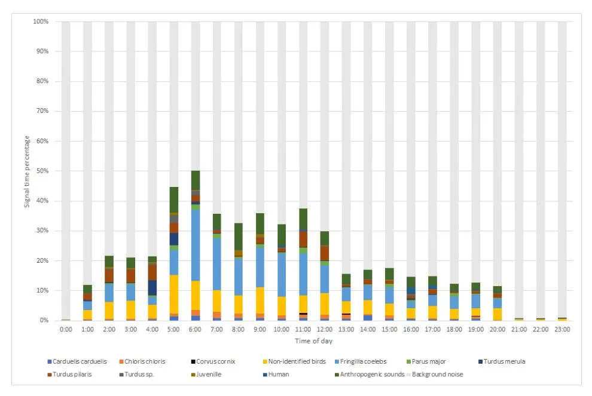
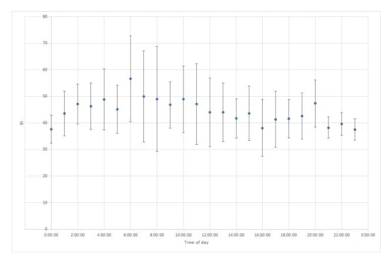
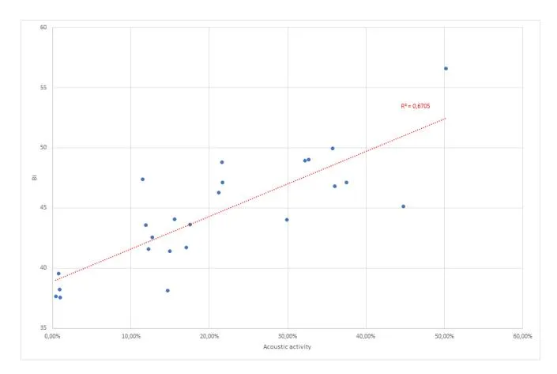
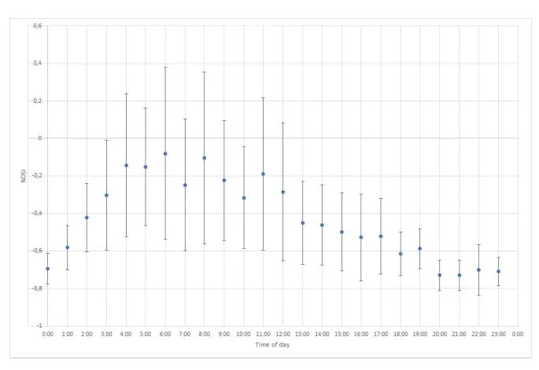
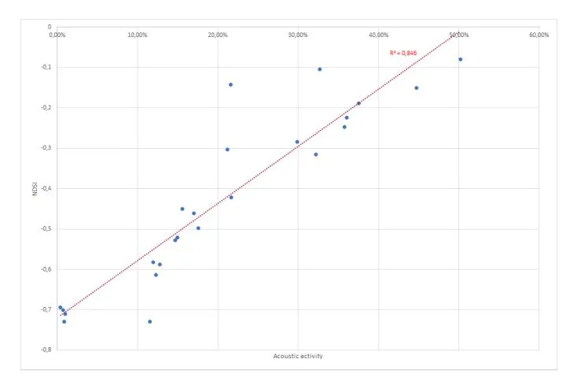

# **Passive acoustic monitoring as a way to assess daily dynamics of animal activity in urban green areas**

_Aleksandr_ Levik\*\** , *Ivan* Dobromyslov, and *Victor\* Matasov

RUDN University (Patrice Lumumba Peoples' Friendship University of Russia), 6 Miklukho-Maklaya, Moscow, 117198, Russia

> **Abstract.** Fast process of urbanization makes it crucial to include cities in assessment of all global processes. Urban areas on the one hand are subjects to the high levels of anthropogenic influence. On the other hand, urban green areas could provide shelter for some species, inhabiting highly disturbed rural landscapes. The data on daily dynamics of activity is required to assess the impact of noise and light pollution on biodiversity. In this study we have checked the efficiency of passive acoustic monitoring (PAM) in assessing the daily dynamics of animal acoustic activity in city parks. We have identified the acoustic signals of birds on the records and calculated the time of each species acoustic activity. Moreover, we have conducted the classical birds' survey to assess the efficiency of PAM. In order to evaluate the possibility of using acoustic indices to assess daily dynamics of acoustic activity, we have calculated NDSI, BI, ACI and ADI indices for each hour a day. We managed to acoustically detect 70% of species, found by route census by single recorder. NDSI (Normal Difference Soundscape Index) correlates well with total acoustic activity of animals and could be used as indicator for this parameter.

### **1 Introduction**

According to WWF estimations, the wildlife populations have decreased by almost 70% during last 50 years [1]. Destruction of natural habitats, pollution and climate change are among the factors, contributing to this dangerous trend. [2]. Despite the attempts to slow this process, such as expanding the area of natural reserves [3-4] or developing international arrangements, aiming to stop the biodiversity losses, [5] the decline is still much higher, than the background level of extinction. [6].

Cities could play a significant role in supporting high biodiversity [7] creating the habitats for many species from different taxa. Global agriculture growth and land cover changes [8] make cities the last shelter for some species inhabited highly disturbed rural areas [9]. Cities represent the ecosystems, consisting of fragmented landscapes with different level of disturbance [10]. These heterogenous landscapes could play a significant role in conservation of biodiversity, and, thus, support the efforts to stop the future losses.

© The Authors, published by EDP Sciences. This is an open access article distributed under the terms of the Creative Commons Attribution License 4.0 (https://creativecommons.org/licenses/by/4.0/).

\* Corresponding author: levik-ayu@rudn.ru

Urban green areas could be used for tackling multiple environmental problems [11], [12], including noise pollution and biodiversity support. Different types of green spaces and also specific solutions, such as green walls and roofs could play a significant role in reducing noise pollution in urban areas by absorbing the acoustic waves. Green spaces are also providing opportunities to sustain biodiversity.

There are many approaches to study biodiversity in cities. At present, one of the most promising techniques is a passive acoustic monitoring (PAM). This method has proved its efficiency in detecting and identifying species, including cryptic animals and remote locations' inhabitants [13], [14].

Despite some problems (e.g., noise pollution), PAM is commonly used to study urban biodiversity [14], [15]. However, some important aspects such as time and frequency shifts in acoustic activity of animals due to noise pollution remain insufficiently studied. Moreover, PAM method is poorly implemented in Russia and has been used by only few researchers in the country (e.g., [16]).

This study aims to explore acoustic indices capability to assess dynamics of birds' acoustic activity in urban green areas.

# **2 Materials and methods**

The data was collected on RUDN campus territory (Moscow, Russia) in April of 2023. Moscow population is estimated at 13 million residents, making it the biggest city in Russia. The climate of Moscow is moderately continental with well-defined seasonality. The winter, with temperatures ranging from −25 °C to above 5 °C, on average lasts for 4 months from the middle of November to the middle of March. During summer the temperature varies from 10 to 35 °C. Average annual temperature is about 6 °C, annual precipitation is 600 – 800 mm.

RUDN is one of the few universities with campus infrastructure in Russia. Total area of the campus is about 1,44 km2 . This territory is landscaped and the condition of green spaces, occupying a large part of the area, is supported by gardening service. On the other side, a number of objects near the campus (e.g., highways, gas stations, research institutions) create a significant anthropogenic pressure.

April is a nesting season for many species of birds in Moscow, furthermore it is a time of birds' migrations peak in the region (April and May for most migrating species in Moscow).

AudioMoth v1.2.0 acoustic recorder (Open Acoustic Devices) has been installed in small green area a remote 110 m from the highway. Recorder had been working for 5 minutes each hour. Furthermore, as a control, classical birds' census had been conducted on 5-6th of April.

Kaleidoscope Pro software (Wildlife Acoustics) was used for cluster analysis of sound. This program algorithms are able to automatically detect the signals of vocalizing animals and sort them into groups of similar sounds (so called "clusters.") In addition, standard acoustic indices (NDSI, BI, ACI and ADI) were calculated using the same software. NDSI and BI indices are of the greatest interest to us. NDSI (Normalized Difference Soundscape Index) is calculated as a ratio between difference of biophony (acoustic signals of animals) and anthropophony (anthropogenic sounds) to their sum. Negative values of NDSI are indicating predominance of anthropophony, while positive are associated with biophonies [17]. This index is widely used for assessing the level of ecosystems disturbance (e.g., [18]). The Bioacoustic Index is calculated as the area under the curve including all frequency ranges associated with the volume greater than the minimum volume for each curve. Thus, BI is a function of the sound level and the number of the frequency ranges used by vocalizing animals (primarily birds) [19]. This index is often used to assess species richness [20]

In total 414 sound recordings with overall duration of 34,5 hours were received during monitoring. Species identification for animal vocalizations have been conducted manually using the results of cluster analysis. Furthermore, the daily and monthly acoustic indices dynamics have been investigated.

# **3 Results and discussion**

#### **3.1 Species detection and identification**

We identified 27 different sound types as a result of cluster analysis, 3 of them are anthrophonic and 24 are biophonic. 23 of 24 biological origin clusters turned out to be birds' vocalizations. Among these signals 17 were identified to genus and 16 to the species level. Another type of sound has been defined as a nestlings' calls. 6 biological origin clusters were not reliably identified. Moreover, we managed to divide 5 from 7 identified species vocalizations into different signal types (alarm calls, calls, songs). List of detected species and recordings quantity are shown in the Table 1.

| Species             | Vocalization type         | Number of recordings |
| ------------------- | ------------------------- | -------------------- |
| Carduelis carduelis | Calls and songs           | 929                  |
| Chloris chloris     | Calls (trill)             | 918                  |
| Chloris chloris     | Songs                     | 369                  |
| Corvus cornix       | Calls                     | 103                  |
| Fringilla coelebs   | Calls                     | 423                  |
| Fringilla coelebs   | Songs                     | 8815                 |
| Parus major         | Calls                     | 189                  |
| Parus major         | Alarm calls               | 158                  |
| Parus major         | Songs                     | 180                  |
| Turdus merula       | Calls                     | 333                  |
| Turdus merula       | Songs                     | 407                  |
| Turdus pilaris      | Alarm calls               | 1495                 |
| Turdus pilaris      | Calls                     | 894                  |
| Turdus pilaris      | Songs                     | 411                  |
| Turdus sp.          | Songs, calls, alarm calls | 430                  |

**Table 1.** Results of PAM. Identified birds' vocalizations.

As a control, we have conducted classical birds' census on 5-6th April of 2023. 12 species including 10 acoustically active have been noted. List of detected species is presented in Table 2.

| Species            | Acoustic activity | Detected during PAM monitoring |
| ------------------ | ----------------- | --------------------------------- |
| Chloris chloris    | Yes               | Yes                               |
| Corvus corax       | No                | No                                |
| Corvus cornix      | Yes               | Yes                               |
| Erithacus rubecula | Yes               | No                                |
| Fringilla coelebs  | Yes               | Yes                               |
| Motacilla alba     | No                | No                                |
| Parus major        | Yes               | Yes                               |
| Passer domesticus  | Yes               | No                                |
| Passer montanus    | Yes               | No                                |
| Sturnus vulgaris   | Yes               | No                                |
| Turdus merula      | Yes               | Yes                               |
| Turdus pilaris     | Yes               | Yes                               |

**Table 2.** Results of birds' census. List of detected species.

The PAM shows good efficiency for species detection in urban green area, considering that only one recorder with effective radius about 50 m had been used. Nevertheless, it must be noted, that good recorder coverage is needed to detect some species with small personal territory. In this case, PAM has missed sparrows, nesting at the distance from the point of the recording.

#### **3.2 Soundscape and species acoustic activity dynamics**

We assessed the daily dynamics of soundscape based on the collected acoustic data (Figure 1). The graph expresses the percentage ratio of different sounds for every hour of a day. Birds' acoustic peak activity occurs during early morning (5:00 a.m.-6:00 a.m.), which matches up with the time of sunrise in Moscow during April (4:30 a.m.-5:00 a.m.). On the other hand, there is no activity peak, during the sunset time (8:00 p.m.-8:30 p.m.). From 9 p.m. to 1 a.m. the soundscape almost entirely consists of background noises (monotonous anthrophony and geophony).

**Fig. 1.** RUDN campus soundscape daily dynamics.

The daily dynamics of birds in urban areas is of great interest for the research since it could be affected by light and noise pollution in cities. The level of illumination is known to be important for regulating daily activities of the birds [21]. In the same time, noise pollution could force birds to change time of their acoustic activity [22].

PAM proves itself an effective tool to assess the daily dynamics of birds.

#### **3.3 Acoustic indices**

BI (Bioacoustic Index) and NDSI (Normalized Difference Soundscape Index) are widely used to assess biophonic component of the soundscapes. We have calculated mean values of these indices for each hour of the day. In this case, both indices correlate with animal acoustic activity, however BI vary to a great degree (Figures 2-3).

**Fig. 2.** Daily dynamics of Bioacoustic Index.

**Fig. 3.** Correlation of BI with acoustic activity.

NDSI was more stable and the value during minimum acoustic activity significantly differs from the peak activity (Figures 4-5).

**Fig. 4.** Daily dynamics of Normalized Difference Soundscape Index.

**Fig. 5.** Correlation of NDSI with acoustic activity.

NDSI is well correlated with acoustic activity of birds and could be used as a good indicator for this factor. This approach is time-saving and easy to implement.

On the other side, it is necessary to identify acoustic signals and manually calculate the activity of particular species.

## **4 Conclusion**

Concluding, our results suggest that passive acoustic monitoring is an effective tool to assess biodiversity in urban green areas. Moreover, acoustic recordings provide information on daily dynamics of animal acoustic activity. This information is crucial to maintain biodiversity in cities, as the noise and light pollution greatly affect on species, inhabiting urban green areas.

The NDSI introduced as an indicator of noise pollution is suitable for assessing daily dynamics of acoustic activity at least at some distance from intensive noise sources (e.g. roads, construction sites).

The research was supported by Russian Science Foundation, project no. 19-77-300-12

## **References**

- 1. R.E.A. Almond, M. Grooten, D. Juffe Bignoli, T. Petersen, _WWF Living Planet Report 2022 – Building a nature-positive society._ (Eds., WWF, Gland, Switzerland, 2022)
- 2. F. Mancini, R. Cooke, B.A. Woodcock, A. Greenop, A.C. Johnson, N.J. Isaac, Proc. R. Soc. B: Biol. Sci. **290(2000)** (2023)
- 3. G.G. Gurney, V.M. Adams, J.G. Álvarez-Romero, J. Claudet, One Earth. **6(2)** (2023)
- 4. T. Starnes, A.E. Beresford, G.M. Buchanan, M. Lewis, A. Hughes, R.D. Gregory, Glob. Ecol. Conserv. **30** (2021)
- 5. Convention on Biological Diversity. Aichi Biodiversity Targets (2015). [Online] Available: https://www.cbd.int/sp/targets/default.shtml
- 6. S.L. Pimm, C.N. Jenkins, R. Abell, T.M. Brooks, J.L. Gittleman, L.N. Joppa, P.H. Raven, C.M. Roberts, J.O. Sexton, Science **344**(**6187**) (2014)
- 7. G. Asha, K. Manoj, T.P. Rajesh, S. Varma, U.P. Ballullaya, P.A. Sinu, Sci. Rep **12(1)** (2022)

- 8. T. Newbold, Nature, **520**(**7545**) (2015)
- 9. A. da Silva Santos, I. de Souza, J. M. T. de Souza, V. R. Schaffrath, F. Galvão, R. Bohn Reckziegel, Sustain. **15(2)** (2023)
- 10. M.P. Perring, P. Manning, R.J. Hobbs, A.E. Lugo, C.E. Ramalho, R.J. Standish, _Novel Ecosystems_ (John Wiley & Sons, Ltd, Oxford, Great Britain, 2013)
- 11. E. Cristiano, S. Urru, S. Farris, D. Ruggiu, R. Deidda, F. Viola, Build Environ **183** (2020)
- 12. F. Marando, M.P. Heris, G. Zulian, A. Udías, L. Mentaschi, N. Chrysoulakis, D. Parastatidis, J. Maes, Sustain. Cities Soc **77** (2022)
- 13. I.B. Campos, R. Fewster, A. Truskinger, M. Towsey, P. Roe, D. Vasques Filho, W. Lee, A. Gaskett, Ecol. Indic **120** (2021)
- 14. E. Znidersic, M. Towsey, W.K. Roy, S. E. Darling, A. Truskinger, P. Roe, D. M. Watson, Ecol. Inform **55** (2020)
- 15. A.J. Fairbrass, _Automated acoustic biodiversity assessment in cities_. In _PQDT,_ UK & Ireland (2018)
- 16. M.Y. Goretskaia, S.V. Ogurtsov, M.A. Syomina, P.A. Kozlova, V.D. Salova, P.O. Kalitina, D.B. Burygin, I.R. Beme, Dokl. biol. Sci **497**(**1**) (2021)
- 17. E.P. Kasten, S.H. Gage, J. Fox, W. Joo, Ecol. inform, **12**, (2012)
- 18. J.W. Doser, A.O. Finley, E.P. Kasten, S.H. Gage, Ecol. Indic **113** (2020)
- 19. N.T. Boelman, G.P. Asner, P.J. Hart, R.E. Martin, Ecol. Appl **17,** 2137-2144 (2007)
- 20. H. Shamon, Z. Paraskevopoulou, J. Kitzes, E. Card, J.L. Deichmann, A.J. Boyce, W.J. McShea, Ecol. Indic **120** (2021)
- 21. E.V. Diatropov, M.E. Diatropov (in Russian). Rus. Ornith. **26**(**1512**) (2017)
- 22. D. Dominoni, J.A.H. Smit, M.E. Visser, W. Halfwerk, Environ. Pollut **256** (2020)
