### ORIGINAL PAPER

# **Can urban forests provide acoustic refuges for birds? Investigating the infuence of vegetation structure and anthropogenic noise on bird sound diversity**

**Zezhou Hao1 · Chengyun Zhang2 · Le Li1 · Bing Sun1 · Shuixing Luo1 · Juyang Liao3 · Qingfei Wang1 · Ruichen Wu1 · Xinhui Xu4 · Christopher A. Lepczyk5 · Nancai Pei1**

Received: 17 July 2023 / Accepted: 8 October 2023 / Published online: 9 January 2024 © The Author(s) 2023

**Abstract** As a crucial component of terrestrial ecosystems, urban forests play a pivotal role in protecting urban biodiversity by providing suitable habitats for acoustic spaces. Previous studies note that vegetation structure is a key factor infuencing bird sounds in urban forests; hence, adjusting the frequency composition may be a strategy for birds to avoid anthropogenic noise to mask their songs. However, it is unknown whether the response mechanisms of bird vocalizations to vegetation structure remain consistent despite being impacted by anthropogenic noise. It was hypothesized that anthropogenic noise in urban forests occupies the low-frequency space of bird songs, leading to a possible reshaping of the acoustic niches of forests, and the vegetation structure of urban forests is the critical factor that shapes the

Project funding: This study was supported by the National Natural Science Foundation of China (32201338), Science Technology Program from the Forestry Administration of Guangdong Province (2021KJCX017), Guangzhou Municipal Science and Technology Bureau Program (2023A04J0086), and Shenzhen Key Laboratory of Southern Subtropical Plant Diversity.

The online version is available at [http://link.springer.com.](http://link.springer.com)

Corresponding editor: Tao Xu.

**Supplementary Information** The online version contains supplementary material available at [https://doi.org/10.1007/](https://doi.org/10.1007/s11676-023-01689-0) [s11676-023-01689-0](https://doi.org/10.1007/s11676-023-01689-0).

- \* Nancai Pei nancai.pei@gmail.com
- 1 Research Institute of Tropical Forestry, Chinese Academy of Forestry, Guangzhou 510520, People's Republic of China
- 2 School of Electronics and Communication Engineering, Guangzhou University, Guangzhou 510006, People's Republic of China

acoustic space for bird vocalization. Passive acoustic monitoring in various urban forests was used to monitor natural and anthropogenic noises, and sounds were classifed into three acoustic scenes (bird sounds, human sounds, and bird-human sounds) to determine interconnections between bird sounds, anthropogenic noise, and vegetation structure. Anthropogenic noise altered the acoustic niche of urban forests by intruding into the low-frequency space used by birds, and vegetation structures related to volume (trunk volume and branch volume) and density (number of branches and leaf area index) signifcantly impact the diversity of bird sounds. Our fndings indicate that the response to low and high frequency signals to vegetation structure is distinct. By clarifying this relationship, our results contribute to understanding of how vegetation structure infuences bird sounds in urban forests impacted by anthropogenic noise.

**Keywords** Anthropogenic noise · Bird sounds · Urban forests · Vegetation structure

## **Introduction**

Urban forests provide crucial habitats for birds to live and breed (Kontsiotis et al. [2019](#page-11-0)). The presence of a more complex vegetation structure in urban areas is associated positively with an increased avian species richness

- 3 Hunan Botanical Barden, Changsha 410116, People's Republic of China
- 4 Guangdong Eco-Engineering Polytechnic, Guangzhou 510520, People's Republic of China
- 5 College of Forestry, Wildlife and Environment, Auburn University, Auburn, AL 36849, USA

within the local community (Kang et al. [2015\)](#page-11-1). However, many forests can also be noisy places that receive various amounts of anthropogenic noise (Slabbekoorn [2013\)](#page-12-0) which has the potential to alter habitat quality and degrade natural acoustic conditions. Since birds rely on vocal communication for territory defense and mating (Slabbekoorn and Ripmeester [2008\)](#page-12-1), predator avoidance (Damsky and Gall [2017](#page-11-2)) and migratory fight (Damsky and Gall [2017](#page-11-2)), they are particularly sensitive to human-generated noise (Antze and Koper [2018\)](#page-11-3). As a result, understanding how birds react is critical for developing a better understanding of the role urban forests play in maintaining bird diversity.

Low-frequency, high-energy anthropogenic noise encroaches on the spectrum of bioacoustic resources and, as a result, birds are not only subject to competition for acoustic niches among vocal species, but also humangenerated noise encroachment (Shannon et al. [2016\)](#page-12-2), one of the causes of urban biodiversity loss (Kociolek et al. [2011](#page-11-4)). The acoustic niche hypothesis (ANH; Krause [1993\)](#page-11-5) contends that competitive exclusion among species in natural environments leads to a temporal and frequency diferentiation of sounds emitted by diferent species, enabling efcient utilization of acoustic space. Acoustic spatial partitioning is widespread in bird and insect communities (Henry and Wells [2010](#page-11-6)), where bioacoustic signals are spatially segregated in both the time and frequency domains (Mullet et al. [2017;](#page-12-3) Gomes et al. [2021\)](#page-11-7), ensuring efective intraspecifc communication. However, urban forests are spaces where people and nature co-exist. Noise from human activities is a constant source of interference in bird habitats (Des Aunay et al. [2014](#page-11-8)).

The vertical and horizontal structure of vegetation is a fundamental component that can infuence bird sound transmission in natural environments (Chen et al. [2021\)](#page-11-9). Based on the acoustic adaptation hypothesis AAH (Morton [1975](#page-12-4)), the environment flters and retains acoustic signals that travel long distances with little loss of fdelity, so that the sounds produced by birds are adapted to their environment. Previous research has shown that forest structure, such as canopy height variation (Mitchell et al. [2020\)](#page-12-5) and foliage height diversity (Hao et al. [2021](#page-11-10)), are key factors that positively infuences the diversity of bird sounds (Farina et al. [2015\)](#page-11-11). In a study of horizontal structure, canopy opening had a signifcant efect on bird sounds (Pekin et al. [2012\)](#page-12-6). Scattered branches, trunks, and leaves in the forest can have negative efects in terms of reverberation, absorption, and refection. Based on the AAH, birds in natural environments use redundant chant repertoires (Forstmeier et al. [2009\)](#page-11-12) or variable syllable lengths (Nemeth et al. [2006](#page-12-7)) to deal with the efects of vegetation space on their sounds. However, it remains to be tested whether bird sounds are adapted to the vegetation structure of urban forests that are afected by anthropogenic noise.

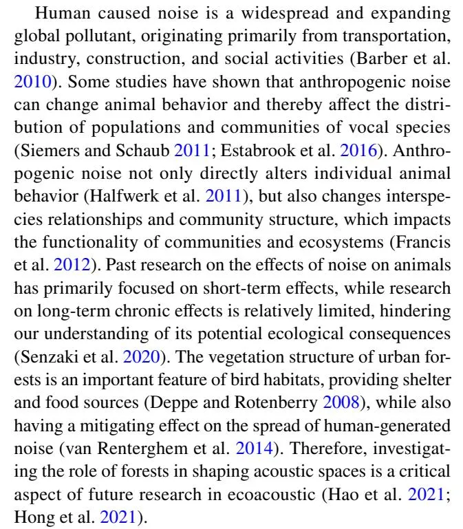

The impact of urbanization on biodiversity is a prominent concern within the realm of urban sustainable development. Given the lack of knowledge about how anthropogenic noise may afect biodiversity in urban forests, our objective was to evaluate the impact of vegetation structure on bird sounds under the interference of anthropogenic noise. In natural environments, bird songs have adapted to the surrounding environment, but the intrusion of human-generated noise into bird habitats may lead to changes in bird song ecological niches. The dynamics of bird calls in diverse noise environments ofer a unique perspective for understanding the relationship between human activities and biodiversity (Sethi et al. [2020\)](#page-12-11). We hypothesized that: (1) anthropogenic noise occupies the low-frequency space of bird songs and could reshape acoustic ecological niches within urban forests; and (2) vegetation structure still exerts an infuence on bird sounds in the presence of anthropogenic noise. Adopting an acoustic perspective to examine the interplay between human activities, vegetation structures, and birds provides a novel analytical framework for further exploring the mechanisms responsible for biodiversity maintenance.

# **Materials and methods**

#### **Study area**

The study was carried out in Guangzhou city (7434 km2 ), the capital of Guangdong province and one of the four core cities in the Guangdong-Hong Kong-Macao Greater Bay

Area in south China. Subtropical evergreen broad-leaved forests are the main type of vegetation, with secondary forests and plantations covering the hills and mountains. Within the region, there are a few urban areas that have rapidly exspanded over the past several decades. Shimen national forest park in the outer suburbs, Mafengshan forest park in the suburbs, and Dafushan forest park in the city were chosen as case study areas. Mature, stable evergreen broadleaved forest communities composed of native tree species were selected in each forest park. Based on vegetation community composition and environmental sound composition (Table S1), three recording points were strategically selected within each urban forest park (Fig. [1](#page-2-0)) to acquire comprehensive and objective acoustic scenes and vegetation structure data. Three principles were followed: (1) monitoring points were spaced at a distance of not less than 200 m to ensure the independence of the data; (2) each point was on approximately the same slope to control for errors caused by topographical diferences; and (3) each point was about 20 m from the forest edge to control the infuence of the plant community on noise attenuation.

#### **Analyses of sound and schedule of recording**

Nine song meter SM4 recorders were used for passive acoustic monitoring (Fig. [1](#page-2-0)a) and set to record ambient sounds for one minute every ten minutes in each forest (Fig. [1](#page-2-0)c) over a one-year period (October 19, 2021–October 9, 2022), obtaining 1,296 samples per day. To ensure that the complete natural (biophony) and anthropogenic (anthrophony) sound spectrum was recorded, a stereo set up at 16-bit audio with a 32 kHz sampling rate was used. To avoid ground reverberation on the audio recording equipment, the equipment was fxed to a healthy tree that was≥10 cm DBH. Based on meteorological data, sound observations containing rain and wind sounds were excluded. As a result, 388,368 min of valid data were obtained.

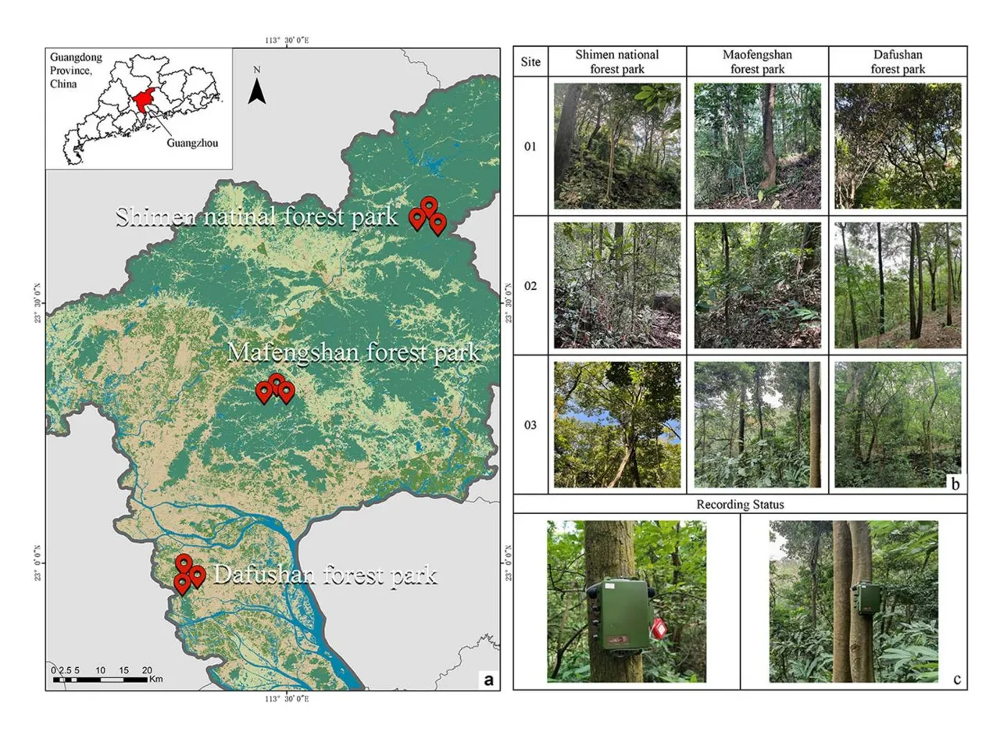

**Fig. 1** Study area and distribution of recording sites. **a** Nine urban forests were selected as recording sites and are indicated by red dots; **b** nine recording sites consisted of broad-leaf evergreen forests in the southern subtropics; **c** the Song Meter SM4 recording box in recording plots

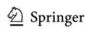

**33** Page 4 of 13 Z. Hao et al.

## **Acoustic scene classifcation model**

To evaluate the bioacoustic data, we constructed an acoustic scene classifcation model using a convolutional neural network (CNN; Hao et al. [2022\)](#page-11-19). An original acoustic scene classifcation model includes seven types of acoustic scenes: bird, insect, bird-insect, bird-human, insect-human, and human sounds, and silence. Overall, the F1 score (the summed average of precision and recall, with a maximum of 1 and a minimum of 0) of the model was 0.97, the precision was 0.96, and the recall was 0.97. To avoid interference from redundant noise and other biological taxa sounds, bird sounds, bird-human sounds, and human sounds were selected from the classifcation model's output. For these, the classifcation accuracy was>95% (Table [1](#page-3-0)). The four other sound scenes were not included in this study.

#### **Quantifcation of sounds**

In acoustic scene classifcation models, the scene types of ambient sound fragments are obtained, but it is still difcult to quantify the intensity of target sounds like biophony and anthrophony. Hence, a method for calculating target sound area ratios (TSAR) was devised, in which the decibel mean values are calculated for each frequency point of the spectrogram (Fig. [2](#page-6-0)). The scale factor is determined to extract the target sound, and its intensity quantifed by the ratio of the target sound spectrogram area to the total spectrogram area (Hao et al. [2022](#page-11-19)). Calculating the TSAR for diferent frequency bands can help to determine (or help to quantify) how energy is distributed in diferent acoustic scenes.

Acoustic indices enable a rapid assessment of the dynamic characteristics of acoustic communities. The normalized difference soundscape index (NDSI) is the ratio between biophony (the sounds produced by animals) and anthrophony (sounds produced by machinery such as vehicles). The NDSI index is calculated according to the following: (biophony−anthrophony)/(biophony+anthrophony), where biophony represents the biophony power spectral density (1–11 kHz) and anthrophony the anthrophony power spectral density (0–1 kHz). NDSI has been found to be closely related to bird diversity in forest environments (Kasten et al. [2012\)](#page-11-20) and can be used to determine the relative importance of biophony and anthrophony within a forest (Fuller et al. [2015](#page-11-21)). NDSI indices were calculated from the "maad.features.soundscape_index" in the alpha acoustic indices module (Ulloa et al. [2021\)](#page-12-12), ported from the seewave (Sueur et al. [2008](#page-12-13)) and soundecology R packages (Villanueva-Rivera et al. [2018\)](#page-12-14).

Sound pressure level (SPL) is a measure of efective sound pressure compared to a standard value on a logarithmic scale and is typically expressed in decibels (dB). Previous research has shown that attenuation curves for sound in diferent frequency bands vary signifcantly (Huisman and Attenborough [1991\)](#page-11-22). Hence, using SPL, it is possible to quantify the frequency-varying energy distribution in biophony and anthrophony, with implications for understanding the relationship between complex acoustic signals such as those of birds and their environment. A frequency interval of 1 kHz divided sound fragments into 11 frequency bands (0–1 kHz, 1–2 kHz, and on up to 11 kHz), and the SPL for each frequency band was calculated separately using the Python soundscape analysis toolkit maad (Ulloa et al. [2021](#page-12-12)).

#### **Vegetation structure parameters**

_Terrestrial laser scanning (TLS) measurements_

Vegetation was measured using a RIEGL VZ-400i terrestrial laser scanner (RIEGL Laser Measurement Systems GmbH, Austria) mounted on a tripod. The VZ-400i operates at a wavelength of 1550 nm with a laser pulse repetition rate

**Table 1** Quantity of learning samples used to train an acoustic scene classifcation model and the performance of the model after training

| Acoustic scenes  | Description                                                                                                                                   | Learning samples |                            | Model performance |        |          |
| ---------------- | --------------------------------------------------------------------------------------------------------------------------------------------- | ---------------- | -------------------------- | ----------------- | ------ | -------- |
|                  |                                                                                                                                               | Quantity         | Total duration (min) | Precision         | Recall | F1 score |
| Bird sound       | A sound segment exclusively featuring vocalizations produced by vari ous bird species, encompassing chirps or songs emitted by these birds | 1,271            | 105.92                     | 0.96              | 0.95   | 0.96     |
| Human sound      | A sound segment exclusively consisting of anthrophony, encompassing sounds like car sirens, conversations, music, and construction noises  | 473              | 39.42                      | 0.98              | 0.99   | 0.99     |
| Bird-human sound | A sound segment with bird sounds and human sounds occurred simul taneously                                                                 | 519              | 43.25                      | 0.96              | 0.98   | 0.98     |

The learning samples are composed of four-second audio segments with quantity representing the number of learning samples and total duration the total duration of the sample data set for the given acoustic environment, which is calculated in minutes. Precision is the fraction of relevant instances among the retrieved instances, recall the fraction of relevant instances retrieved, and F1 score the harmonic mean of precision and recall. These metrics are used to evaluate the performance of the classifcation model

set to 1200 kHz and records four returns per outgoing pulse with a range up to 250 m. For each plot, one central scanning position and 'four' other scanning positions were used (Fig. [3](#page-7-0)). Each recording plot obtained up to 1,200 m2 of high-resolution point cloud data. The point cloud data from each scan were pre-processed by the automatic registration module in the RiSCAN Pro software (RIEGL Horn, Austria). Pre-processing of the point cloud data by LiDAR 360 software (Green Valley Company, China) included subsampling (minimum points spacing set to 0.001), removing outliers (the number of neighbor points is 10; the multiples of standard deviations is 5), and classifying ground points. We used the TLS seed point editor function in the TLS forest module of LiDAR 360 to manually complete the segmentation of the forest point clouds into individual trees (Fig. [3](#page-7-0)).

#### _TLS derived parameters_

Individual tree structures based on quantitative structure models (QSM) (Calders et al. [2015](#page-11-23)) were measured to determine a non-destructive estimation of above-ground biomass, with a high agreement with the reference values from destructive sampling. The individual trees within the nine recording plots were segmented using LiDAR 360, followed by calculating the single-number tree attributes (Table [2\)](#page-7-1) from the quantitative structure models using TreeQSM software in MATLAB (Raumonen et al. [2013](#page-12-15)).

Using a voxel approach, a data frame of 3D voxel information (xyz) with leaf area density (LAD) values from the fle described the vertical diversity and density of forest structure at diferent horizontal heights (resolution=0.5 m). The voxel dimension allows a fne description of the horizontal component of forest layers. Based on LAD, the leaf area index (LAI) was calculated for six height ranges (<2 m, 2–5 m, 5–10 m, 10–15 m, 15–20 m,>20 m). Point cloud data were pixelized, and vegetation structure parameters calculated using the leaf R package (Almeida et al. [2019](#page-11-24)) in R.

#### **Statistical analysis**

To clarify the relationship between anthropogenic noise and bird sounds in terms of frequency distribution and to reveal the acoustic niche pattern of forested ecosystems, we compared the diferences in dominance of target sounds across diferent urban forests using a two-way mixed ANOVA. TSAR in bird sounds, bird-human, and human acoustic scenes was set as the dependent variable, and the recording sites and frequency bands were set as between-subjects (fxed efects) and within-subjects (random efects), respectively, and the interaction efect tested between recording sites and frequency bands on TSAR. For each combination of factor levels, values of the Shapiro–Wilk test were computed. The Levene's and Box's M-tests were used to evaluate the homogeneity of variance and covariance. All analyses were conducted in R using the rstatix package.

To assess the infuence on each acoustic scene and NDSI, we constructed a random forest regression model to screen vegetation factors afecting acoustic indices and to evaluate the explanatory power of various vegetation and structural factors on acoustic indices. In the random forest regression model, NDSI was the dependent variable, while individual tree parameters and forest structural parameters were independent variables. A substitution test (N =99) was used to calculate the explanatory power (R2 ) and signifcance (_p_-value) of vegetation factors on the NDSI model. NDSI was calculated by ranking increase in MSE (%IncMSE) as the importance ranking for the independent variables. The relative importance and signifcance of vegetation factors were calculated based on the IncMSE index. The optimal number of attempts (ntry) for ftting the diferent models was determined by a recurrent function based on iterative calculations of out-of-bag (OOB) data. The analytical analysis was implemented using the randomForest, rfUtilities, and rfPermute packages in R.

Redundancy analysis (RDA) was employed to test the potential diferences in bird sound responses to vegetation structure among diferent frequency intervals. The environmental data were transformed with the Hellinger transformation. According to the results of the RDA, the short gradient along the frst axis was<3, which meant that RDA was a better ft for our data than canonical correlation analysis. SPL in each frequency band (N=11) were treated as species variables and used to determine the distribution of target sounds in diferent frequency bands. Model performance was determined by adjusted R2, and the model, axes, and explanatory variables were evaluated by Monte Carlo (MC) permutations (N=99). RDA were conducted using the vegan and rdacca.hp (Lai et al. [2022](#page-12-16)) packages in R.

## **Results**

# **Acoustic scene dominance**

The three acoustic scenes (bird, bird-human, and human) exhibited diferent TSAR distributions. The frequency distribution in the human sound scene showed that anthrophony was predominantly located at lower frequencies (1–2 kHz). In comparison, the TSAR peaks at 3–4 kHz for bird and bird-human scenes had higher values in the 2–4 kHz range for the bird scene but lower ones in the 4–7 kHz range compared to bird-human scene (Fig. [4](#page-8-0)). This indicates that anthropogenic noises afect the acoustic niche of birds.

The TSARs in the bird-human scene were significantly diferent between frequency bands (F10, 60=56.85, _p_ < 0.001), but the interaction between recording sites

33 Page 6 of 13 Z. Hao et al.

Step 1: Sound recording & pre-processing

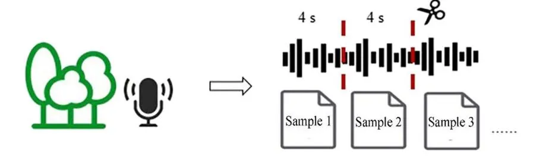

Bird Bird-human Human 10000 Step 2: Acoustic Frequency (Hz) scene 6000 classification 4000 model -180 2000 -200 1.0 1.5 2.0 2.5 3.0 3.5 1.0 1.5 2.0 2.5 3.0 3.5 0.5 1.0 1.5 2.0 2.5 3.0 3.5 Time (s) Time (s) Time (s)

(1) Target sound area ratio (TSAR)

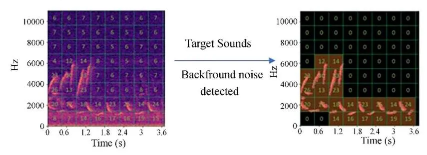

(2) Normalized difference soundscape index (NDSI)

Step 3: Sound analysis

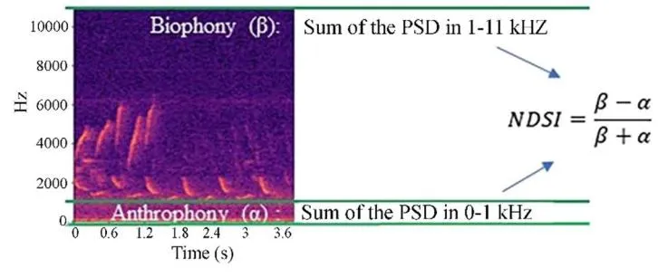

#### (3) Sound pressure level (SPL) in each band

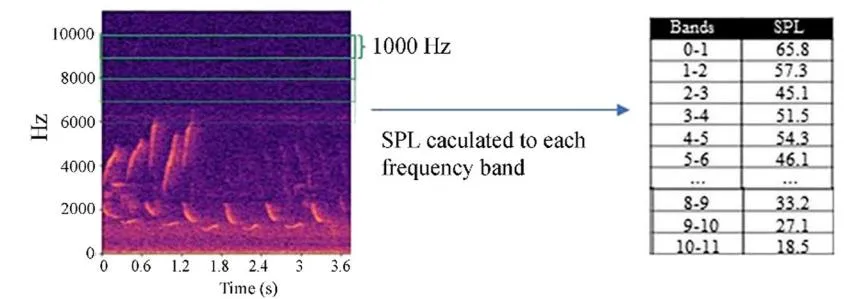

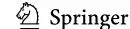

**Fig. 2** Workfow steps used to assess the soundscape information in diferent acoustic scenes. In step 1, each original sound fle recorded is cut into 4 s segments. In step 2, each segment is subjected to an acoustic scene classifcation model. The acoustic scenes of bird, bird-human, and human were selected from the results of all sound classifcations for this study. In step 3, TSAR, NDSI, and SPL quantifed the characteristics of sound signals in the frequency domain and energy for the three acoustic scenes ◂

and frequency bands was not signifcant. The frequency bands in the bird-human and human scenes (bird-human: F10, 60 = 213.78, _p_ < 0.001; human: F10, 60 = 3004.07, _p_<0.001) were signifcantly diferent, and the interaction between recording sites and frequency bands were also signifcant (bird-human: F20, 60=4.19, _p_<0.001; human: F20, 60=9.54, _p_<0.001).

#### **Efects of vegetation structure on bird sounds**

From the perspective of model interpretation in random forests (R-squared values), the infuence of vegetation on NDSI in the three acoustic scenes was>0.50 and ranked in the following order: bird-human (0.59), bird (0.57), and human (0.53). Trunk volume, number of branches, and LAI1115 (height range 11–15 m) had the greatest impact on NDSI for bird and bird-human sound scenes (Fig. [5](#page-8-1)). The NDSI of the human scene was infuenced by three primary vegetation factors: trunk volume, crown base height, and number of branches. Branch volume, trunk area, tree height, LAI, and DBH were secondary factors.

The normalized diferences soundscape index (NDSI) is primarily infuenced by trunk volume and number of branches in various acoustic scenes (Fig. [6](#page-9-0)). The biophony power spectral density increased with trunk volume in all three scenes but decreased with number of branches, which were shown to have a negative impact on high-frequency sounds (e.g., bird song), whereas trunk volume had a positive impact.

## **Response of sound frequency and pressure to vegetation factors**

Redundancy analysis detected relationships between the sound pressure level (SPL) in diferent frequency bands and vegetation factors (Table [3,](#page-9-1) Fig. [7](#page-10-0)). Vegetation factors had high explanatory power for the SPL in diferent frequency bands of acoustic scenes, including explaining more than 40% of the variation in bird, bird-human, and human scenes. The vegetation factor had the highest R2 at 0.48 for explaining bird sounds in diferent frequency bands by permutation test.

The SPL in different frequency bands across acoustic scenes was obviously correlated with vegetation factors, but patterns varied slightly (Fig. [7\)](#page-10-0). In the bird sound scene, the SPL distribution in the 1–3 kHz frequency range showed a signifcant negative correlation with LAI1115, LAI1620, LAI2135, branch length, total length, and number of branches. In the bird-human sound scene, the SPL in the 2–4 kHz frequency range showed signifcant correlation with LAI1115, LAI1620, and LAI2135 and positive correlation with branch volume, and the SPL in the human sound scene was signifcantly correlated with branch volume in the 0–1 kHz frequency range. Combined with the relationship between SPL and vegetation factors at 0–1 kHz in diferent sound scenes, the LAI-related parameters and height-related parameters showed positive correlations, while there was a negative correlation with volume. Accordingly, the results of the RDA and random forest models on the vegetation factors at low and high frequencies are consistent, indicating that the vegetation structure afect the sound in diferent frequency bands and have signifcant diferences at the same time.

# **Discussion**

Acoustic methods reveal the encroachment of urban noise on low-frequency space, as direct evidence of the negative impact of anthropogenic noises on urban biodiversity. The soundscapes of diferent acoustic scenes are an important component of urban forests, providing proof of how bird songs change over space and time and respond to human activities. Our fndings indicate that the TSAR distribution of bird sounds in the 1–3 kHz range is higher in pure bird sound scenes compared to scenes with both bird and human sounds, regardless of low or high-energy anthropogenic noise. This fnding is consistent with previous studies that showed that birds adjust to noise caused by human activities by changing the frequency distribution of song energy (Cooke et al. [2020\)](#page-11-25). Further, our fndings suggest that bird vocalizations exhibit diferent frequency distributions under anthropogenic noise compared to undisturbed conditions, indicating a possible adaptation strategy (Nemeth and Brumm [2010\)](#page-12-17). Our research found that birds adjust the energy in low frequency ranges to reduce overlap with anthropogenic noise, but such adjustments may impact the efciency of vocalizations in complex environments (Tarrero et al. [2008](#page-12-18)). As a result, bird species that are susceptible to alterations in the acoustic environment may decrease in number or leave green spaces (Halfwerk et al. [2011](#page-11-15)). Future studies should integrate species-specifc song recognition models to further clarify how diferent bird species adapt to human noise. City managers should develop appropriate noise control policies or establish quiet areas to protect wild animals in urban forests.

Urban forests are an important habitat for urban wildlife. Further, our study shows that vegetation structure is a key

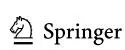

**33** Page 8 of 13 Z. Hao et al.

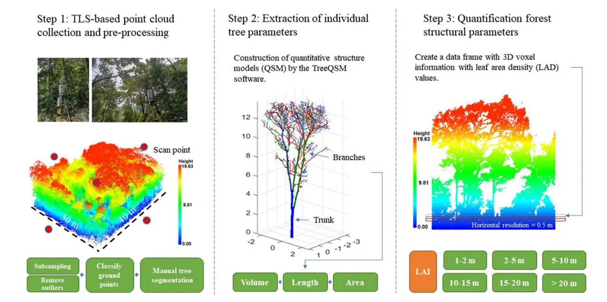

**Fig. 3** Process of collecting, processing, and estimating the metrics of individual trees and forest structures with the TLS-based point clouds

**Table 2** Glossary of the vegetation structural variables

| Type    | Variables          | Description                                                                                                                                         |     |     |
| ------- | ------------------ | --------------------------------------------------------------------------------------------------------------------------------------------------- | --- | --- |
| Volumes | Trunk Volume       | Volume (L) of the stem                                                                                                                              |     |     |
|         | Branch Volume      | Volume (L) of all branches                                                                                                                          |     |     |
| Length  | Tree Height        | Height (m) of the tree                                                                                                                              |     |     |
|         | Total Length       | Total length (m) of all branches and stem                                                                                                           |     |     |
|         | Trunk Length       | Length (m) of the stem                                                                                                                              |     |     |
|         | Branch Length      | Total length (m) of all branches                                                                                                                    |     |     |
|         | Crown Base Height  | Crown's base height (m) from the ground                                                                                                             |     |     |
|         | DBH                | DBH (m), the diameter of the cylinder in the QSM                                                                                                    |     |     |
| Area    | Trunk Area         | Total surface area (m2 ) of the stem                                                                                                             |     |     |
|         | Branch Area        | Total surface area (m2 ) of the branches                                                                                                         |     |     |
| Density | LAI                | LAIs calculated from the LAD within the six height ranges (LAI12: 1–2 m, LAI35: 3–5 m, LAI610: 6–10 m, LAI1115: 11–15 m, LAI1620: 16–20 m, |     |     |
|         |                    | LAI2135:>20 m)                                                                                                                                      |     |     |
|         | Number of Branches | Number of branches                                                                                                                                  |     |     |

Considering that sound transmission in forests may be afected by factors such as trunks, branches, and leaves (Tarrero et al. [2008;](#page-12-18) Slabbekoorn et al. [2007\)](#page-12-22), twelve structural variables were selected based on the calculations of the TreeQSM model. These variables were derived from TLS, and the metrics were estimated for each scan and then averaged across all scans

factor afecting song adaptation of birds. Volume-related (trunk and branch volumes) and density-related metrics (number of branches and LAI) both had signifcant infuence on bird sounds. The structural components of plants such as leaves, trunks, and branches can impede the transmission range of bird vocalizations and impair individual recognition capabilities, thereby impeding efective interbird communication (Richards and Wiley [1980](#page-12-19); Slabbekoorn et al. [2002\)](#page-12-20). Vegetation structure is a crucial factor in shaping the vocal environment of birds in habitats with interference from anthropogenic noise (Velez et al. [2015](#page-12-21)). In comparison to the acoustic scenes that contain a mixture of

**Fig. 4** Distribution of TSAR in diferent frequency bands for bird, bird-human, and human scenes; box plots show the distribution of TSAR only in the 1–7 kHz range

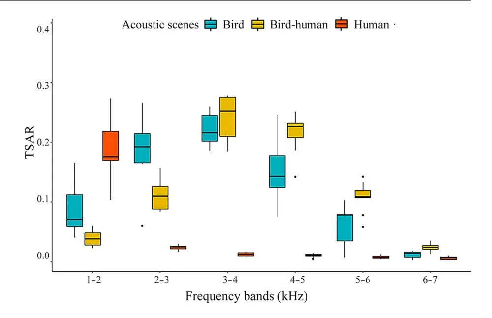

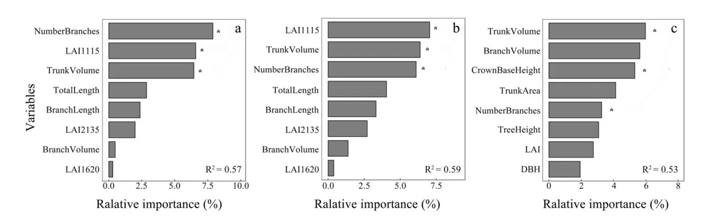

**Fig. 5** Relative importance of vegetation factors in **a** bird, **b** bird-human, and **c** human acoustic scenes. The asterisks indicate the vegetation structure variables that were statistically signifcant in the models

bird and human-made sounds (bird-human acoustic scenes) and acoustic scenes that only contain a single sound source (either bird or human), the results show that acoustic scenes with bird signals exhibit a signifcant correlation with trunk volume, number of branches, and LAI for various height ranges. Among them, volume-related vegetation factors, such as trunk volume, had a positive efect on biophony, whereas the number of branches and LAI had a negative efect across various height layers. However, an acoustic scene containing both human and bird sounds had a higher frequency band of energy distribution compared to one with only bird sounds. Previous studies have shown that leaf and branch absorption and scattering of acoustic signals increase with frequency (Francomano et al. [2021](#page-11-26)). Even though birds can adjust the way they distribute their sound energy in response to anthropogenic noise, the modifed frequency of their sounds may still be negatively impacted by the vegetation structure (Velez et al. [2015](#page-12-21)). Bird vocalizations in noisy environments shift towards mid- to high-frequency communication, with weaker transmission efciency compared to low-frequency sounds (To et al. [2021\)](#page-12-23). Our fndings suggest correlations between tree trunks, branches, and bird sounds, indicating that habitats with open understory spaces and large trees are ideal for vocalization. When managing urban forests, it is important to consider protecting and creating diverse vegetation structures to support biodiversity and improve acoustic environments.

The efect of vegetation structure on diferent frequency ranges of sounds is inconsistent, with anthropogenic noise having a contrasting relationship compared to bird sounds in terms of trunk volume, number of branches, and LAI for various heights. Highly dense vegetation has limited impact on the attenuation of low-frequency and highenergy anthropogenic noise (Ow and Ghosh [2017\)](#page-12-24), and

**33** Page 10 of 13 Z. Hao et al.

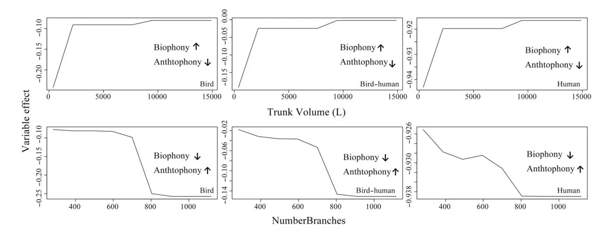

**Fig. 6** Partial dependence plots of NDSI for trunk volume and number of branches. An increase in trunk volume resulted in an increase in biophony and a decrease in anthrophony for bird, bird-human, and human scenarios, while an increase in number of branches resulted in

a decrease in biophony and an increase in anthrophony. Note: biophony represents the sum of power spectral densities in the 1–11 kHz interval, and anthrophony the sum of power spectral densities in the 0–1 kHz interval

having a higher crown base height actually facilitates the transmission of noise through the vegetation structure. The fndings of this study support previous research that suggests that green spaces composed of a mixture of tree, shrub, and grass components efectively reduce noise compared to pure tree or shrub structures (Martinez-Sala et al. [2006\)](#page-12-25). However, the results of this study revealed a negative growth in the normalized diference soundscape index with an increase in branch density, potentially attributed to the attenuation of bioacoustic intensity within highdensity vegetation environments. It is worth noting that anthrophony energy exhibited an opposite trend compared to previous research fndings, highlighting the need for further investigation into the infuence of branches on anthropogenic noise mechanisms. While such habitats may be conducive to sound propagation, they may be suboptimal for many bird species due to limitations in foraging and nesting opportunities. Anthropogenic noise, characterized by low frequencies ranging from 0 to 2 kHz, and bird sounds, characterized by high frequencies ranging from 2 to 5 kHz, difer in terms of their frequency-time domain composition and their response to vegetation structure. The dominant form of anthropogenic noise in this study

**Table 3** Permutation tests of variance explained by vegetation factors in RDAs

| Acoustic scenes | Df  | F-value | p value | Adjusted R2 |
| --------------- | --- | ------- | ------- | ----------- |
| Bird            | 8   | 3.89    | 0.001   | 0.48        |
| Bird-human      | 8   | 3.07    | 0.001   | 0.44        |
| Human           | 8   | 4.82    | 0.001   | 0.42        |

was low-frequency trafc sounds, the most prevalent type of anthropogenic noise (Proppe et al. [2013\)](#page-12-26). The trafc sound energy of the signal is mainly concentrated in the frequency of 500–2000 Hz, and it exhibits low frequency and extended duration characteristics (Kern and Radford [2016\)](#page-11-27). According to previous research, bird calls react differently to diferent types of anthropogenic noise (Shannon et al. [2016](#page-12-2)), suggesting that the relationship between anthropogenic noise and bird calls should not be solely studied in the context of trafc noise (Nemeth et al. [2013](#page-12-27)).

Sensing and protecting urban biodiversity through the perspective of sound may become a new research topic in the future. Some countries have established national acoustic observation networks and collected acoustic resource data using automatic recording sensors (Roe et al. [2021](#page-12-28)). Passive acoustic monitoring technology and artificial intelligence-based sound analysis have become a focus of numerous laboratories and companies (Lahoz-Monfort and Magrath [2021\)](#page-12-29). By integrating smart city technologies with sound-related monitoring data (Du et al. [2019](#page-11-28)) or developing mobile sound collection applications (Green and Murphy [2020](#page-11-29)), it may be possible to discover and utilize more environmental sound data. By accumulating these data, we can gain a more comprehensive understanding of noise sources, propagation mechanisms, and environmental impacts in forest ecosystems. Laser scanning platforms, such as satellites, aircraft, drones, and ground mobile platforms, can provide multi-temporal and spatial monitoring and facilitate the analysis of forest structure (Newnham et al. [2015](#page-12-30)). Further monitoring and evaluation of environmental data on sound and plants can be useful in better understanding the

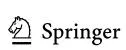

**Fig. 7** RDA and the relationship between vegetation factors and SPL in diferent frequency bands; asterisks indicate the signifcance of the vegetation structure variable in the RDA

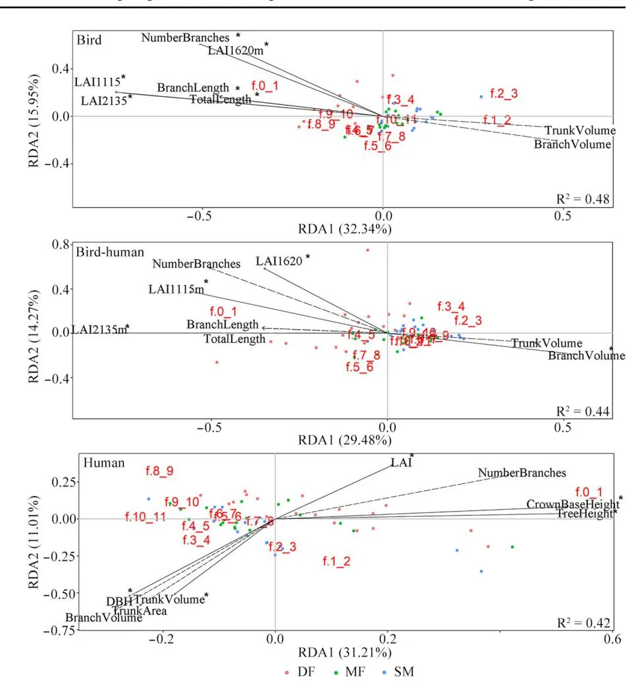

impacts of human activities on wildlife and ecosystems and the potential of forests in creating healthy, safe, and comfortable acoustic spaces.

The results of this study have provided evidence of the impact of vegetation structure and anthropogenic noise on bird vocalizations in urban forests, but we acknowledge that there are some limitations in this study. The investigation of the urbanization gradient in this study still presents certain deficiencies. Future research should aim to examine vocalization responses across additional passive acoustic monitoring sites, encompassing a wider range of urbanization gradients and extending over longer periods. This may be more conducive to understanding the complex effects of chronic noise on urban wildlife during urbanization. Additionally, future research might also consist of playback experiments of bird sounds or anthropogenic noise to verify the distance of sound propagation in different urban forests, which may allow further elaboration of the role of vegetation structure in constructing the acoustic space of urban forests.

# **Conclusions**

Urban forests play a crucial role in maintaining ecological balance and promoting biodiversity within cities. However, the presence of anthropogenic noise and often inadequate vegetation structure in these forests may result in adverse efects on urban biodiversity. Therefore, it is important to determine how designed vegetation structures can efectively mitigate the impacts of noise pollution while providing suitable habitats for urban wildlife. In this study, we found that vegetation structure played a signifcant role in shaping bird sounds and that the response to low frequency signals, such as anthropogenic noise, and high frequency signals, such as bird calls, to vegetation structure is distinct. By reducing the impact of anthropogenic noise and creating suitable habitats for birds, vegetation structure in green spaces can be strategically designed to efectively conserve urban biodiversity. The acoustic vision provides a valuable addition to traditional visually based analyses of urban forests. An acoustic-based approach can provide urban planners and

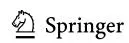

municipal administrators with the key indicators necessary to create better green spaces that engage multiple senses, and to evaluate the efectiveness of bird habitat restoration eforts in urban forests worldwide.

**Acknowledgements** We appreciate Haisong Zhan, Youtian Liang and Wenjuan Yang for support on data analysis and feld work. We would like to thank Dr. Joseph Elliot at the University of Kansas for his assistance with English and grammatical editing of the manuscript, as well as the Scientifc Collaborative Innovation Center of Ecological Conservation and Restoration for the Guangdong-Hong Kong-Macao Greater Bay Area and the National Urban Forest Innovation Alliance in China for research and intellectual support.

**Open Access** This article is licensed under a Creative Commons Attribution 4.0 International License, which permits use, sharing, adaptation, distribution and reproduction in any medium or format, as long as you give appropriate credit to the original author(s) and the source, provide a link to the Creative Commons licence, and indicate if changes were made. The images or other third party material in this article are included in the article's Creative Commons licence, unless indicated otherwise in a credit line to the material. If material is not included in the article's Creative Commons licence and your intended use is not permitted by statutory regulation or exceeds the permitted use, you will need to obtain permission directly from the copyright holder. To view a copy of this licence, visit <http://creativecommons.org/licenses/by/4.0/>.

# **References**

- Almeida DRA, Stark SC, Shao G, Schietti J, Nelson BW, Silva CA, Gorgens EB, Valbuena R, Papa DdA, Brancalion PHS (2019) Optimizing the remote detection of tropical rainforest structure with airborne lidar: leaf area profle sensitivity to pulse density and spatial sampling. Remote Sens 11:92
- Antze B, Koper N (2018) Noisy anthropogenic infrastructure interferes with alarm responses in Savannah sparrows (_Passerculus sandwichensis_). R Soc Open Sci 5:172168
- Barber JR, Crooks KR, Fristrup KM (2010) The costs of chronic noise exposure for terrestrial organisms. Trends Ecol Evol 25:180–189
- Calders K, Newnham G, Burt A, Murphy S, Raumonen P, Herold M, Culvenor D, Avitabile V, Disney M, Armston J (2015) Nondestructive estimates of above-ground biomass using terrestrial laser scanning. Methods Ecol Evol 6:198–208
- Chen YF, Luo Y, Mammides C, Cao KF, Zhu S, Goodale E (2021) The relationship between acoustic indices, elevation, and vegetation, in a forest plot network of southern China. Ecol Indic 129:107942
- Cooke SC, Balmford A, Donald PF, Newson SE, Johnston A (2020) Roads as a contributor to landscape-scale variation in bird communities. Nat Commun 11:1–10
- Damsky J, Gall MD (2017) Anthropogenic noise reduces approach of Black-capped Chickadee (_Poecile atricapillus_) and Tufted Titmouse (_Baeolophus bicolor_) to Tufted Titmouse mobbing calls. Condor 119:26–33
- Deppe JL, Rotenberry JT (2008) Scale-dependent habitat use by fall migratory birds: vegetation structure, foristics, and geography. Ecol Monogr 78:461–487
- des Aunay GH, Slabbekoorn H, Nagle L, Passas F, Nicolas P, Draganoiu TI (2014) Urban noise undermines female sexual preferences for low-frequency songs in domestic canaries. Anim Behav 87:67–75

- Du R, Santi P, Xiao M, Vasilakos AV, Fischione C (2019) The sensable city: a survey on the deployment and management for smart city monitoring. IEEE Commun Surv Tutor 21:1533–1560
- Estabrook BJ, Ponirakis DW, Clark CW, Rice AN (2016) Widespread spatial and temporal extent of anthropogenic noise across the northeastern Gulf of Mexico shelf ecosystem. Endanger Species Res 30:267–282
- Farina A, Ceraulo M, Bobryk C, Pieretti N, Quinci E, Lattanzi E (2015) Spatial and temporal variation of bird dawn chorus and successive acoustic morning activity in a Mediterranean landscape. Bioacoustics 24:269–288
- Forstmeier W, Burger C, Temnow K, Derégnaucourt S (2009) The genetic basis of zebra finch vocalizations. Evolution 63:2114–2130
- Francis CD, Kleist NJ, Ortega CP, Cruz A (2012) Noise pollution alters ecological services: enhanced pollination and disrupted seed dispersal. Proc R Soc B 279:2727–2735
- Francomano D, Gottesman BL, Pijanowski BC (2021) Biogeographical and analytical implications of temporal variability in geographically diverse soundscapes. Ecol Indic 121:106794
- Fuller S, Axel AC, Tucker D, Gage SH (2015) Connecting soundscape to landscape: which acoustic index best describes landscape confguration? Ecol Indic 58:207–215
- Gomes DGE, Toth CA, Cole HJ, Francis CD, Barber JR (2021) Phantom rivers flter birds and bats by acoustic niche. Nat Commun 12:1–8
- Green M, Murphy D (2020) Environmental sound monitoring using machine learning on mobile devices. Appl Acoust 159:107041
- Halfwerk W, Bot S, Buikx J, van der Velde M, Komdeur J, ten Cate C, Slabbekoorn H (2011) Low-frequency songs lose their potency in noisy urban conditions. Proc Natl Acad Sci USA 108:14549–14554
- Hao ZZ, Wang C, Sun ZK, Zhao DX, Sun BQ, Wang HJ, van den Bosch CK (2021) Vegetation structure and temporality infuence the dominance, diversity, and composition of forest acoustic communities. For Ecol Manag 482:118871
- Hao ZZ, Zhan HS, Zhang CY, Pei NC, Sun B, He JH, Wu RC, Xu XH, Wang C (2022) Assessing the efect of human activities on biophony in urban forests using an automated acoustic scene classifcation model. Ecol Indic 144:109437
- Henry CS, Wells MM (2010) Acoustic niche partitioning in two cryptic sibling species of Chrysoperla green lacewings that must duet before mating. Anim Behav 80:991–1003
- Hong XC, Wang GY, Liu J, Song L, Wu ETY (2021) Modeling the impact of soundscape drivers on perceived birdsongs in urban forests. J Clean Prod 292:125315
- Huisman WHT, Attenborough K (1991) Reverberation and attenuation in a pine forest. J Acoust Soc Am 90:2664–2677
- Kang W, Minor ES, Park CR, Lee D (2015) Efects of habitat structure, human disturbance, and habitat connectivity on urban forest bird communities. Urban Ecosyst 18:857–870
- Kasten EP, Gage SH, Fox J, Joo W (2012) The remote environmental assessment laboratory's acoustic library: an archive for studying soundscape ecology. Ecol Inform 12:50–67
- Kern JM, Radford AN (2016) Anthropogenic noise disrupts use of vocal information about predation risk. Environ Pollut 218:988–995
- Kociolek A, Clevenger A, St Clair C, Proppe D (2011) Efects of road networks on bird populations. Conserv Biol 25:241–249
- Kontsiotis VJ, Valsamidis E, Liordos V (2019) Organization and diferentiation of breeding bird communities across a forested to urban landscape. Urban For Urban Gree 38:242–250
- Krause BL (1993) The niche hypothesis: a virtual symphony of animal sounds, the origins of musical expression and the health of habitats. Soundsc Newsl 6:6–10

- Lahoz-Monfort JJ, Magrath MJL (2021) A comprehensive overview of technologies for species and habitat monitoring and conservation. BioScience 71:1038–1062
- Lai JS, Zou Y, Zhang JL, Peres-Neto PR (2022) Generalizing hierarchical and variation partitioning in multiple regression and canonical analyses using the rdacca.hp R package. Methods Ecol Evol 13:782–788
- Martinez-Sala R, Rubio C, Garcia-Raf LM, Sanchez-Perez JV, Sanchez-Perez EA, Llinares J (2006) Control of noise by trees arranged like sonic crystals. J Sound Vib 291:100–106
- Mitchell SL, Bicknell JE, Edwards DP, Deere NJ, Bernard H, Davies ZG, Struebig MJ (2020) Spatial replication and habitat context matters for assessments of tropical biodiversity using acoustic indices. Ecol Indic 119:106717
- Morton ES (1975) Ecological sources of selection on avian sounds. Am Nat 109:17–34
- Mullet TC, Farina A, Gage SH (2017) The acoustic habitat hypothesis: an ecoacoustics perspective on species habitat selection. Biosemiotics 10:319–336
- Nemeth E, Brumm H (2010) Birds and anthropogenic noise: Are urban songs adaptive? Am Nat 176:465–475
- Nemeth E, Dabelsteen T, Pedersen SB, Winkler H (2006) Rainforests as concert halls for birds: are reverberations improving sound transmission of long song elements? J Acoust Soc Am 119:620–626
- Nemeth E, Pieretti N, Zollinger SA, Geberzahn N, Partecke J, Miranda AC, Brumm H (2013) Bird song and anthropogenic noise: Vocal constraints may explain why birds sing higher-frequency songs in cities. Proc R Soc Lond B Biol Sci 280:20122798
- Newnham GJ, Armston JD, Calders K, Disney MI, Lovell JL, Schaaf CB, Strahler AH, Danson FM (2015) Terrestrial laser scanning for plot-scale forest measurement. Curr For Rep 1:239–251
- Ow LF, Ghosh S (2017) Urban cities and road trafc noise: Reduction through vegetation. Appl Acoust 120:15–20
- Pekin BK, Jung J, Villanueva-Rivera LJ, Pijanowski BC, Ahumada JA (2012) Modeling acoustic diversity using soundscape recordings and LIDAR-derived metrics of vertical forest structure in a neotropical rainforest. Landsc Ecol 27:1513–1522
- Proppe DS, Sturdy CB, St Clair CC (2013) Anthropogenic noise decreases urban songbird diversity and may contribute to homogenization. Glob Change Biol 19:1075–1084
- Raumonen P, Kaasalainen M, Åkerblom M, Kaasalainen S, Kaartinen H, Vastaranta M, Holopainen M, Disney M, Lewis P (2013) Fast automatic precision tree models from terrestrial laser scanner data. Remote Sens 5:491–520
- Richards DG, Wiley RH (1980) Reverberations and amplitude fuctuations in the propagation of sound in a forest: implications for animal communication. Am Nat 115:381–399
- Roe P, Eichinski P, Fuller RA, McDonald PG, Schwarzkopf L, Towsey M, Truskinger A, Tucker D, Watson DM (2021) The australian acoustic observatory. Methods Ecol Evol 12:1802–1808

- Senzaki M, Barber JR, Phillips JN, Carter NH, Cooper CB, Ditmer MA, Fristrup KM, McClure CJW, Mennitt DJ, Tyrrell LP, Vukomanovic J, Wilson AA, Francis CD (2020) Sensory pollutants alter bird phenology and ftness across a continent. Nature 587:605–609
- Sethi SS, Jones NS, Fulcher B, Picinali L, Clink DJ, Klinck H, Orme CDL, Wrege PH, Ewers RM (2020) Characterizing soundscapes across diverse ecosystems using a universal acoustic feature set. Proc Natl Acad Sci USA 117:17049–17055
- Shannon G, McKenna MF, Angeloni LM, Crooks KR, Fristrup KM, Brown E, Warner KA, Nelson MD, White C, Briggs J (2016) A synthesis of two decades of research documenting the efects of noise on wildlife. Biol Rev 91:982–1005
- Siemers BM, Schaub A (2011) Hunting at the highway: trafc noise reduces foraging efciency in acoustic predators. Proc R Soc B Biol Sci 278:1646–1652
- Slabbekoorn H (2013) Songs of the city: noise-dependent spectral plasticity in the acoustic phenotype of urban birds. Anim Behav 85:1089–1099
- Slabbekoorn H, Ellers J, Smith TB (2002) Birdsong and sound transmission: The benefts of reverberations. Condor 104:564–573
- Slabbekoorn H, Ripmeester EAP (2008) Birdsong and anthropogenic noise: Implications and applications for conservation. Mol Ecol 17:72–83
- Slabbekoorn H, Yeh P, Hunt K (2007) Sound transmission and song divergence: a comparison of urban and forest acoustics. Condor 109:67–78
- Sueur J, Aubin T, Simonis C (2008) Seewave, a free modular tool for sound analysis and synthesis. Bioacoustics 18:213–226
- Tarrero AI, Martin MA, Gonzalez J, Machimbarrena M, Jacobsen F (2008) Sound propagation in forests: A comparison of experimental results and values predicted by the Nord 2000 model. Appl Acoust 69:662–671
- To AWY, Dingle C, Collins SA (2021) Multiple constraints on urban bird communication: Both abiotic and biotic noise shape songs in cities. Behav Ecol 32:1042–1053
- Ulloa JS, Haupert S, Latorre JF, Aubin T, Sueur J (2021) scikit-maad: an open-source and modular toolbox for quantitative soundscape analysis in Python. Methods Ecol Evol 12:2334–2340
- van Renterghem T, Attenborough K, Maennel M, Defrance J, Horoshenkov K, Kang J, Bashir I, Taherzadeh S, Altreuther B, Khan A, Smyrnova Y, Yang HS (2014) Measured light vehicle noise reduction by hedges. Appl Acoust 78:19–27
- Velez A, Gall MD, Fu JN, Lucas JR (2015) Song structure, not highfrequency song content, determines high-frequency auditory sensitivity in nine species of New World sparrows (_Passeriformes_: _Emberizidae_). Funct Ecol 29:487–497
- Villanueva-Rivera LJ, Pijanowski BC, Villanueva-Rivera MLJ (2018) Package 'soundecology'. R package version 1:3

**Publisher's Note** Springer Nature remains neutral with regard to jurisdictional claims in published maps and institutional afliations.

