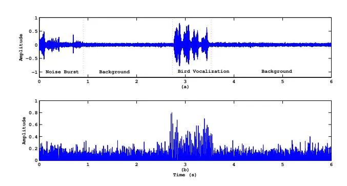
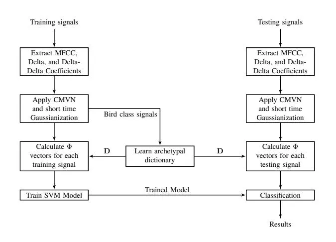

# Archetypal Analysis Based Sparse Convex Sequence Kernel for Bird Activity Detection

V. Abrol, P. Sharma, A. Thakur, P. Rajan, A. D. Dileep, Anil K. Sao School of Computing and Electrical Engineering, Indian Institute of Technology, Mandi Email: {vinayak_abrol, pulkit_s, anshul_thakur}@students.iitmandi.ac.in, {padman,addileep,anil}@iitmandi.ac.in.

Abstract—This paper proposes a novel method based on the archetypal analysis (AA) for bird activity detection (BAD) task. The proposed method extracts a convex representation (frame-wise) by projecting a given audio signal on to a learned dictionary. The AA based dictionary is trained only on bird class signals, which makes the method robust to background noise. Further, it is shown that due to the inherent sparsity property of convex representations, non-bird class signals will have a denser representation as compared to the bird counterpart, which helps in effective discrimination. In order to detect presence/absence of bird vocalization, a fixed length representation is obtained by averaging the obtained frame wise representations of an audio signal. Classification of these fixed length representations is performed using support vector machines (SVM) with a dynamic kernel. In this work, we propose a variant of probabilistic sequence kernel called sparse convex sequence kernel (SCSK) for the BAD task. Experimental results show that the proposed method can efficiently discriminate bird from non-bird class signals.

Index Terms—Archetypal analysis, dictionary learning, kernel methods, bird activity detection.

#### I. INTRODUCTION

Bird audio detection (BAD) problem deals with identifying the presence or absence of bird vocalization in a given audio signal [1]. It serves as an important preliminary step in the automatic monitoring of biodiversity patterns such as habitats and landscapes changes, population trends etc [2], [3]. The challenge in BAD is to distinguish between informative acoustic events and background activity which may arise due to multiple factors e.g., humans, machines, natural phenomena (such as wind and rain) [2], [4]. For instance, there is a high probability to miss-classify a signal with low amplitude bird vocalization as non-bird class signal or a signal containing bursts of background noise as bird class signal [5], [6]. Hence, there is a need to develop a BAD method which is robust to background noise.

In this work, we propose a robust method for BAD task. The proposed method is based on the idea that, given a suitable dictionary, the representations estimated for frames corresponding to the bird and non-bird audio (background) are sparse and dense, respectively. Here, the dictionary $\mathbf{D}$ is learned by factorizing the training signal matrix $\mathbf{X}$ (consisting of short-term frame wise feature vectors from multiple recordings of only bird class) using archetypal analysis (AA) [7]. In the next step, a convex representation is obtained using this dictionary for both bird and non-bird class signal frames as $\mathbf{x}_i = \mathbf{D}\mathbf{a}_i$ . The entries in the weight vector $\mathbf{a}_i$ represent

the contribution dictionary atoms in the signal. Due to the inherent sparsity property of convex representations [8], the obtained weight vector for bird and non-bird class signals is significantly different. Since archetypes are learned from only bird class, non-bird class signals will have a denser representation compared to the bird counterpart, which helps in effective discrimination. Thus, the proposed method makes no assumption on the type of non-bird sounds (also referred as background noise) in the signal, neither requires any kind of background adaptation. In addition, the proposed method require very less amount of data to learn the dictionary, which is advantageous in BAD task where the labeled training data is limited.

In order to address the variability in duration of audio signals, the proposed method extracts a fixed length representation from a given signal to detect presence/absence of bird vocalizations. This is done by averaging the obtained frame wise representations of a audio signal. Classification of these fixed length representations is performed using support vector machines (SVM) with a dynamic kernel [9]. To this aim, we propose archetypal analysis (AA) [7] based sparse convex sequence kernel (SCSK) for the BAD task. Further, to mitigate channel and environment variations, the extracted short-time features are preprocessed with cepstral mean and variance normalization (CMVN) [10], and short-time feature warping (Gaussianization) techniques [11], which are widely used in context of automatic speaker recognition.

The key idea of the proposed method is that given a suitable dictionary, the representations obtained for bird and non-bird audio signals are sparse and non-sparse, respectively. In this work, we propose a novel sparse convex sequence kernel based on archetypal analysis for bird activity detection. It is also demonstrated that the proposed method is effective, even with less amount of training data.

The rest of the paper is organized as follows: A briefly overview of dynamic kernels is presented in Section II. We then introduce the proposed SCSK framework for BAD in Section III. Section IV demonstrates the experimental results, and finally the summary of the paper is given in Section V.

## II. DYNAMIC KERNELS FOR VARYING LENGTH PATTERN CLASSIFICATION

As a general practice, an audio signal is processed on a short-time frame basis, and is represented as a sequential pattern i.e., a set of local feature/representation for each frame

[12]. However, depending on duration of the audio signal, the resultant sequential pattern is of varying length. SVM classifier with dynamic kernels is one of the widely used approaches for classification of such varying length patterns [12]. These kernels are used for feature sets with different cardinalities by either finding the similarity between two sets or by mapping a feature set to a fixed length representation [12]. Some of the state-of-the-art dynamic kernels include Probabilistic sequence kernel (PSK) [13], GMM supervector kernel [14], GMM-based intermediate matching kernel [12] and GMM-based pyramid match kernel [15].

Recently, work in [16] have shown the application of PSK for bird species identification. Here, a set of local feature vectors is mapped to a fixed length representation, known as the probabilistic alignment vector. This probabilistic alignment vector is a concatenation of responsibility terms calculated by aligning the feature vector with 2Q mixtures, Q from a universal background model (UBM)-GMM, and Q from class-specific GMM [9] [17]. The final fixed length feature consists of the mean vector of all probabilistic alignment vectors of the sequential pattern. In this work we propose a variant of PSK based on AA, which exploits the sparsity of bird vocalization in a learned dictionary, and is discussed in the next section.

## III. PROPOSED SPARSE CONVEX SEQUENCE KERNEL FOR BAD

In contrast to the UBM-GMM based dynamic kernels, we propose archetypal analysis (AA) based sparse convex sequence kernel (SCSK) for the task of bird activity detection. AA is a form of matrix factorization technique which decompose the data as convex combinations of extremal points, which in turn lie on the convex hull of the data and are themselves restricted to being a convex combinations of individual observations [7]. In contrast to centroids (as in the GMM), archetypes characterize extremal rather than average properties of the given data, and therefore leads to a more compact representation [18], [19]. Further, compared to the GMM, AA require less amount of data to effectively model all the variations [18]. This is advantageous in BAD task, where labeled training data corresponding to bird class is limited.

Consider matrix $\mathbf{X} = [\mathbf{X}^1 \dots \mathbf{X}^U] = \{\mathbf{x}_i\}_{i=1}^l$ consisting of l feature vectors $\mathbf{x}_i \in \mathbb{R}^n$ from U training audio signals. The corresponding weight vectors $\mathbf{a}_i \in \mathbb{R}^d$ are computed via AA by solving the following non-convex optimization problem with simplex constraints:

$$\underset{\mathbf{b}_{j} \in \Delta_{l}, \mathbf{a}_{i} \in \Delta_{d}}{\operatorname{argmin}} \|\mathbf{X} - \mathbf{D}\mathbf{A}\|_{F}^{2} = \|\mathbf{X} - \mathbf{X}\mathbf{B}\mathbf{A}\|_{F}^{2},$$

$$\mathbf{b}_{j} \in \Delta_{l}, \mathbf{a}_{i} \in \Delta_{d}$$

$$\Delta_{l} \triangleq [\mathbf{b} \succeq 0, \|\mathbf{b}\|_{1} = 1], \Delta_{d} \triangleq [\mathbf{a} \succeq 0, \|\mathbf{a}\|_{1} = 1]$$
(1)

Here, the columns of $\mathbf{D} = \mathbf{X}\mathbf{B} \in \mathbb{R}^{n \times d}$ are the inferred archetypes. Problem (1) is solved via alternating minimization for $\mathbf{B}$ and $\mathbf{A}$ using quadratic programming (QP) solvers. Note that representation obtained via AA is convex i.e., its entries are positive and sum to one. Hence, $\mathbf{a}_i$ can also be considered as a probabilistic alignment vectors, in which each

Fig. 1. (a) Bird class audio signal, and (b) its convex representation in the learned archetypal dictionary with 128 atoms (see Section IV for more experimental details on dictionary learning).

element represents the contribution of the learned archetype in representation of a feature vector $\mathbf{x}_i$ . Once the archetypes are learned, a given audio signal (in matrix form $\mathbf{X}^U = \{\mathbf{x}_t\}_{t=1}^T$ , where $\{\mathbf{x}_t\}$ is the $t^{th}$ frame) can be represented as a fixed length representation as

$$\Phi(\mathbf{X}^U) = \frac{1}{T} \sum_{t=1}^{T} \hat{\mathbf{a}}_t.$$
(2)

Here, the probabilistic alignment vector $\hat{\mathbf{a}}_t$ corresponding to a audio frame $\mathbf{x}_t$ , is computed as

$$\hat{\mathbf{a}}_t = \underset{\mathbf{a}_t \in \Delta_d}{\operatorname{argmin}} \|\mathbf{x}_t - \mathbf{D}\mathbf{a}_t\|_F^2, \Delta_d \triangleq [\mathbf{a} \succeq 0, \|\mathbf{a}\|_1 = 1]. \quad (3)$$

The simplex constraints inherently enforces sparseness i.e., only a few of the archetypes in $\mathbf{D}$ will contribute to $\mathbf{a}_t$ [8]. In order to achieve better discrimination among bird and nonbird classes, AA is done using only audio signals from the bird class. Due to the inherent sparsity property of AA, the resultant weight vector for bird class is sparse as compared to non-bird signals, resulting in effective discrimination between $\Phi$ representations of both the classes. As an illustration, Fig. 1 shows the convex representation (obtained by concatenating frame-wise representation) of an example audio signal in the learned archetypal dictionary. It can be observed that there is a distinct jump in the weight vector coefficients corresponds to the bird vocalization. The same is not true for burst of background noise or non-bird segments of the signal.

After obtaining the fixed length representation, the SCSK between two audio signals $\mathbf{X}^U$ and $\mathbf{X}^V$ is computed as

$$K_{\text{SCSK}}(\mathbf{X}^{U}, \mathbf{X}^{V}) = \Phi(\mathbf{X}^{U})^{T} \mathbf{S}^{-1} \Phi(\mathbf{X}^{V}),$$

$$\mathbf{S} = \frac{1}{l} \mathbf{R}^{T} \mathbf{R},$$
(4)

where S denotes the correlation matrix, and rows of matrix R are the probabilistic alignment vectors of the feature vectors of the training set [13]. Note that this approach ignores any sequence order information, i.e., the result for a given audio and its reverse version will be the same. Fig. 2 illustrates the proposed framework based on SCSK for the task of bird activity detection.

Fig. 2. Proposed SCSK based framework for BAD

## _A. Building optimal SCSK from training data_

It is important to note that the complexity of dynamic kernels based approaches increases exponentially with the number of training examples. Hence, the use of SCSK is inefficient, as testing phase will be very slow and computationally expensive, prohibiting real-time application. To address this, we propose to use a subset of training data to build the kernel. However, manually selecting a subset of the training data to seed the dictionary is not only tedious but also sub-optimal since there is no guarantee that such selection form the best kernel. In order to select a suitable subset, we used the Fast Exemplar Selection (FES) algorithm as proposed in [20]. FES extracts a linearly independent subset of signals which captures the full range of the dataset. In the BAD task, signals from the bird class lie in a union of subspaces (corresponding to bird vocalizations and background activity). If at least t linearly independent columns that span each t-dimensional subspace exist in X, it has been shown in [20] that FES extracts an optimal subset.

#### _B. Advantages of the proposed method_

- The inherent sparsity of convex representation helps in increasing the classification accuracy.
- SCSK can be trained from less amount of training data.
- The proposed method has the advantage of reduced computational cost during testing, since computing a convex representation or projecting onto the simplex is much more faster than computing a sparse representation (as in dictionary learning) or probability vector for GMM.
- The proposed method works effectively even with less amount of training data.

### IV. EXPERIMENTAL RESULTS

In this section, we evaluate the performance of proposed AA based kernel for the BAD task. Initially, various datasets used in this work are explained, along with the details about various experimental setting. The performance of proposed method is evaluated on two datasets.

#### _A. Datasets Used_

In this subsection, we provide a detailed explanation about the two datasets used for BAD task. The proposed framework is evaluated on data that was released as a part of BAD challenge [1]. The data is divided into two sets: development data and testing data. Since labels for testing data are not available, we have used development data for both training and testing purposes. This data is further divided into two sets based on the sources: Freefield and Warblr. Freefield recordings are collected by Freesound project [21] around the world in different environments. It consists of 1, 935 and 5, 755 recordings labeled under bird and non-bird classes, respectively. Warblr [22] is UK based bird sound crowd sourcing research project. A small subset of Warblr having 6, 045 birdactivity and 1, 955 non-bird recordings was provided. This data is collected in various environments and also exhibits different background sounds.

### _B. Experimental Setup_

Audio signal is processed on a short time frame basis, where framing is achieved by applying a 20 ms long non-overlapping Hamming window. No frame overlap is considered so as to minimize the number of frames for processing. For each frame, we extracted 39 Mel frequency cepstral coefficients (MFCCs) along with delta and delta-delta coefficients (using VOICE-BOX [23]), which are further preprocessed with CMVN and feature warping techniques. In order to select a suitable subset, we used the Fast Exemplar Selection (FES) algorithm as proposed in [20], which extracts a linearly independent subset of signals which captures the full range of the training dataset. AA is performed using fast implementations provided by SPAMS toolbox [8], where the tolerance of 10−3 is used as the stopping criteria. For SVM training, Libsvm toolbox [24] is used. Further, to show the generalization ability of the proposed method in different recording conditions, training and testing is done on different datasets.

The main emphasis of this work is to use minimum possible training data without suffering in classification accuracy. This is also necessary as the complexity of working with the kernel matrix is a function of the number of training signals, instead of the dimensionality of the input signal. Hence, archetypes are learned using 100 audio signals from the bird class. The optimal number of archetypes is chosen by performing testing on validation data. SVM is trained with SCSK matrix build using only 200 audio signals each from both bird and non-bird classes. Hence, in total approximately 6.25% of data is used for training.

#### _C. Results_

In this subsection, we evaluate the performance of the proposed method for the BAD task on two datasets. In addition, the performance of the proposed method is also compared with existing classification methods. Initially, the efficiency of the proposed framework is evaluated, where either Warblr or Freefield dataset is used for training/testing and vice versa. Firstly, the experimentation is done on a small validation

TABLE I Comparison of classification accuracies for different training and testing datasets averaged over 10 trials. $SCSK_{FES} \ \text{refers to SCSK with FES}.$

| Method       | Training         | Testing         | Accuracy |
| ------------ | ---------------- | --------------- | -------- |
| SCSK         | Warblr           | Freefield       | 83.5     |
|              | Freefield        | Warblr          | 75.4     |
| $SCSK_{FES}$ | Warblr           | arblr Freefield | 85.2     |
| BOSKFES      | Freefield Warblr | Warblr          | 77.3     |

TABLE II COMPARISON OF CLASSIFICATION ACCURACIES FOR DIFFERENT METHODS AVERAGED OVER 10 TRIALS. SCSK $_{\rm FES}$ refers to SCSK with FES.

| Classifier                              | Training | Testing   | Accuracy |
| --------------------------------------- | -------- | --------- | -------- |
| SVM with $\mathrm{SCSK}_{\mathrm{FES}}$ |          | Freefield | 85.2     |
| Linear SVM                              | Warblr   |           | 82.13    |
| GMM                                     | waibh    |           | 75.3     |
| RandomForest                            |          |           | 79.35    |

dataset containing 2000 audio signals from testing dataset. The best accuracy was obtained for 128 archetypes. Following this, experiments are performed on the whole testing dataset. The classification accuracy (% of correctly classified signals) over 10 trials is reported in Table I. The results support the claim that the proposed framework is capable of distinguishing between audio signals having bird and non-bird activity. As discussed earlier, this distinction is due to the difference in weight vector of archetypes (as a result of the underlying sparseness property of AA), computed for both the classes. We observed that higher accuracy is obtained when dictionary is trained from Warblr dataset, which is due to the fact that Warblr dataset is recorded in more cleaner environment as compared to Freefield dataset.

The classification performance of the proposed method is compared with three other methods: (a) a random forest classifier with 128 trees, (b) a GMM classifier with 8 mixtures, and (c) a SVM using a linear kernel. All the classifiers are trained on fixed length $\Phi$ representations. The number of trees and number of mixtures in the random forest classifier and the GMM classifier, respectively are obtained empirically. For a fair comparison, all the classifiers are trained with same training signals as in case of previous experiment, and the results are reported in Table II. It can be observed that the proposed kernel with SVM classifier has much better performance than other classifiers, which are unable to generalize well on small amount of training data.

#### V. SUMMARY

In this work, we proposed an archetypal analysis (AA) based sparse convex sequence kernel (SCSK) for the bird activity detection (BAD) task. AA decompose the data as convex combinations of extremal point lying on the convex hull of the data. Hence it characterizes the extremal of the data.

and leads to a compact representation. AA results in convex representations, and hence coefficients of the weight vector represent contribution of each learned archetypes. In this work, AA is performed using audio signals corresponding to bird class only. Hence the weight vector obtained with respect to these archetypes is sparse and dense for bird class and non-bird class, respectively. These weight vectors are used to create a kernel matrix, which is further used in SVM for classification. In order to reduce the computational complexity while building kernel matrix, a subset of training data is selected using fast exemplar selection method. The experimental results on two datasets show that the proposed framework is effective in bird activity detection tasks.

#### REFERENCES

- [1] "BAD challenge," http://machine-listening.eecs.qmul.ac.uk/bird-audio-detection-challenge/, Accessed: 2017-2-1.
- [2] Mario Lasseck, "Towards automatic large-scale identification of birds in audio recordings," in Experimental IR Meets Multilinguality, Multimodality, and Interaction: 6th International Conference of the CLEF Association, CLEF'15, Toulouse, France, September 8-11, 2015, Proceedings, Cham, 2015, pp. 364–375, Springer International Publishing.
- [3] Karl-Heinz Frommolt and Klaus-Henry Tauchert, "Applying bioacoustic methods for long-term monitoring of a nocturnal wetland bird," _Ecological Informatics_, vol. 21, pp. 4 – 12, 2014, Ecological Acoustics.
- [4] Iosif Mporas, Todor Ganchev, Otilia Kocsis, Nikos Fakotakis, Olaf Jahn, and Klaus Riede, "Integration of temporal contextual information for robust acoustic recognition of bird species from real-field data," _IJISA_, vol. 5, no. 7, pp. 9–15, 2013.
- [5] D. Stowell and M. D. Plumbley, "Automatic large-scale classification of bird sounds is strongly improved by unsupervised feature learning," _PeerJ_ 2:e488, 2014.
- [6] Miguel A. Acevedo, Carlos J. Corrada-Bravo, Hctor Corrada-Bravo, Luis J. Villanueva-Rivera, and T. Mitchell Aide, "Automated classification of bird and amphibian calls using machine learning: A comparison of methods," _Ecological Informatics_, vol. 4, no. 4, pp. 206 – 214, 2009.
- [7] Morten Mrup and Lars Kai Hansen, "Archetypal analysis for machine learning and data mining," _Neurocomputing_, vol. 80, pp. 54 – 63, March 2012, Special Issue on Machine Learning for Signal Processing 2010.
- [8] Yuansi Chen, Julien Mairal, and Zaid Harchaoui, "Fast and robust archetypal analysis for representation learning," in _IEEE Conference_ on Computer Vision and Pattern Recognition (CVPR), Washington, DC, USA, June 2014, pp. 1478–1485, IEEE Computer Society.
- [9] D. Chakraborty, P. Mukker, P. Rajan, and A. D. Dileep, "Bird call identification using dynamic kernel based support vector machines and deep neural networks," in _IEEE International Conference on Machine Learning and Applications (ICMLA)_, December 2016, pp. 280–285.
- [10] N. V. Prasad and S. Umesh, "Improved cepstral mean and variance normalization using bayesian framework," in _IEEE Workshop on Automatic Speech Recognition and Understanding_, December 2013, pp. 156–161.
- [11] B. Xiang, U. V. Chaudhari, J. Navrátil, G. N. Ramaswamy, and R. A. Gopinath, "Short-time gaussianization for robust speaker verification," in _IEEE International Conference on Acoustics, Speech, and Signal Processing (ICASSP)_, May 2002, vol. 1, pp. I–681–I–684.
- [12] A. D. Dileep and C. C. Sekhar, "Gmm-based intermediate matching kernel for classification of varying length patterns of long duration speech using support vector machines," _IEEE Transactions on Neural Networks and Learning Systems_, vol. 25, no. 8, pp. 1421–1432, August 2014.
- [13] Kong-Aik Lee, Changhuai You, Haizhou Li, and Tomi Kinnunen, "A gmm-based probabilistic sequence kernel for speaker verification," in INTERSPEECH, August 2007, pp. 294–297.
- [14] C. H. You, K. A. Lee, and H. Li, "An svm kernel with gmm-supervector based on the bhattacharyya distance for speaker recognition," _IEEE Signal Processing Letters_, vol. 16, no. 1, pp. 49–52, January 2009.
- [15] A. D. Dileep and C. Chandra Sekhar, "Speaker recognition using pyramid match kernel based support vector machines," _International Journal Speech Technology_, vol. 15, no. 3, pp. 365–379, September 2012.

- [16] D. Chakraborty, P. Mukker, P. Rajan, and A. D. Dileep, "Bird call identification using dynamic kernel based support vector machines and deep neural networks," in _2016 15th IEEE International Conference on Machine Learning and Applications (ICMLA)_, December 2016, pp. 280–285.
- [17] Kong-Aik Lee, Changhuai You, Haizhou Li, and Tomi Kinnunen, "A gmm-based probabilistic sequence kernel for speaker verification.," in _8th INTERSPEECH_, 2007.
- [18] S. Seth and M. J. A. Eugster, "Archetypal analysis for nominal observations," _IEEE Transactions on Pattern Analysis and Machine Intelligence_, vol. 38, no. 5, pp. 849–861, May 2016.
- [19] V. Abrol, P. Sharma, and A. K. Sao, "Identifying archetypes by exploiting sparsity of convex representations," in _Workshop on The Signal Processing with Adaptive Sparse Structured Representations (SPARS)_, June 2017.
- [20] V. Abrol, P. Sharma, and A. K. Sao, "Fast exemplar selection algorithm for matrix approximation and representation: A variant oasis algorithm," in _IEEE International Conference on Acoustics, Speech, and Signal Processing (ICASSP)_, March 2017.
- [21] "Freesound," http://freesound.org/.
- [22] "Warblr," https://warblr.net/, Accessed: 2017-2-1.
- [23] "Voicebox," http://www.ee.ic.ac.uk/hp/staff/dmb/voicebox/voicebox.html, Accessed: 2017-2-1.
- [24] "Libsvm," https://www.csie.ntu.edu.tw/cjlin/libsvm/, Accessed: 2017-2- 1.
