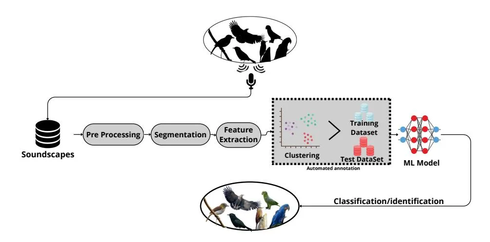
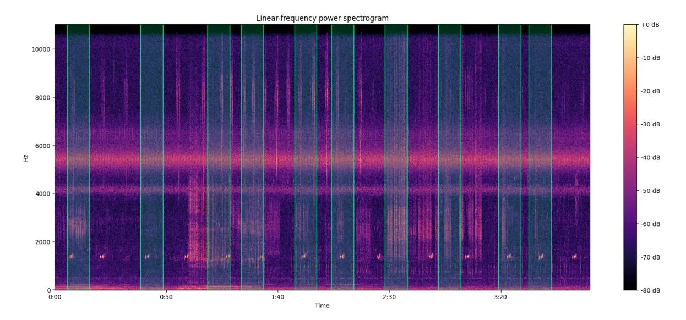
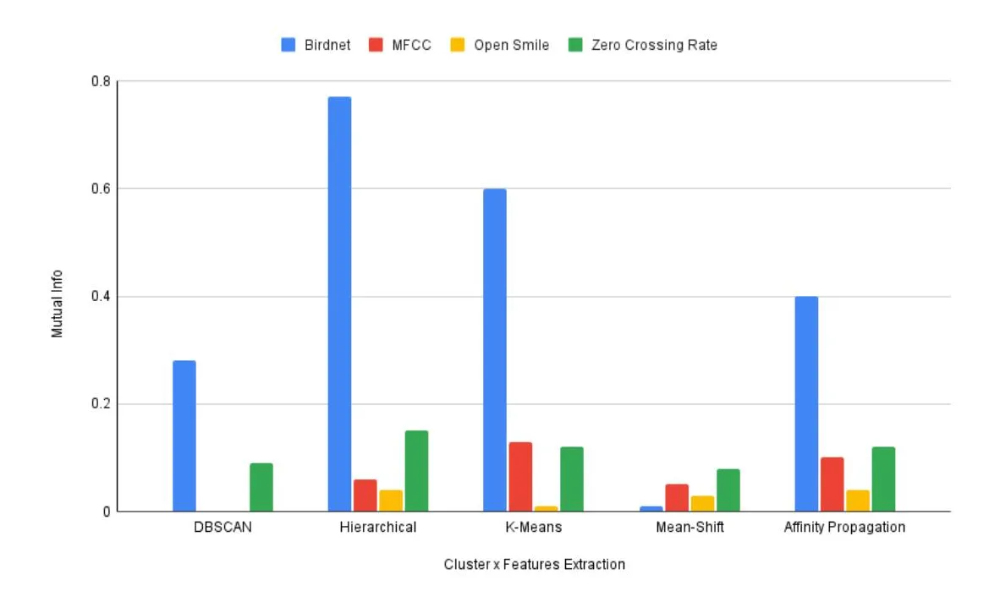
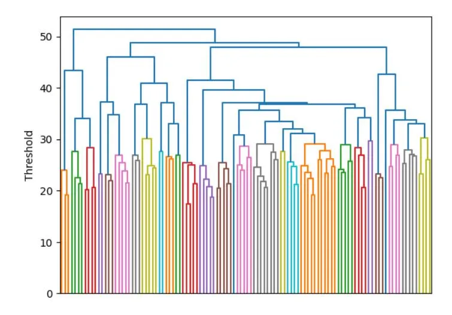

# A Comparative Analysis of Clustering and Feature Extraction Methods for the Automated Construction of Bird Species Classification Datasets

Virgínia A. Santos, Diego T. Terasaka, Luiz E. Martins, Allan G. de Oliveira, Thiago M. Ventura

Universidade Federal de Mato Grosso, Brazil virginia.santos@sou.ufmt.br, diego.terasaka@sou.ufmt.br, luiz.martins@sou.ufmt.br, allan@ic.ufmt.br, thiago@ic.ufmt.br

Abstract. The identification of bird species enables the creation of machine learning models that can be employed for the non-invasive monitoring of bird populations. In this study, we present an advancement in the assisted automated creation of a training set for the classification of bird species, with a specific focus on species present in the Pantanal. Typically, this process is conducted manually, which is a highly time-consuming approach. In this phase, we propose comprehensive comparative testing to ascertain the optimal methodologies for feature extraction and clustering. Five clustering methods and four feature extraction models were subjected to testing. The results of our experiments demonstrate that the optimal method for the purpose of this work was hierarchical clustering, using BirdNET for feature extraction. This combination provided superior performance in classifying bird species for the assisted construction of training sets.

CCS Concepts: • Computing methodologies → Data Mining Aplications.

Keywords: Audio analysis, Bird vocalization, Clustering methods, Feature extraction

### 1. INTRODUCTION

Biodiversity monitoring is used as the main tool for environmental conservation, being essential to determine the effect of measures designed to maintain or improve the state of the environment [Dalton et al. 2023]. According to [Stupariu et al. 2022], despite the high cost of performing it manually, bioacoustic analysis using bird vocalizations as bioindicators has proven to be an effective tool for this purpose. To address this challenge, machine learning has emerged as a major method for automating these processes, offering improved efficiency and accuracy [Wu et al. 2023].

Currently, the construction of training datasets for species classification is conducted manually, a process that can span years as it requires human analysis of hours of audio files containing bird vocalizations. These datasets are then employed in the training of the machine learning model that is capable of classifying bird species.

Fig. 1 illustrates the steps of this process, which is conducted in an automated manner. Initially, an initial recording of the soundscape is pre-processed and segmented automatically. This is followed by the identification of occurrences of bird vocalisations and the exclusion of unwanted sections. Subsequently, the characteristics of these are extracted. The audio is transformed into an image and subsequently into a matrix. The latter is then subjected to analysis to identify patterns. Vocalisation

The authors would like to express their gratitude to the National Council for Scientific and Technological Development of Brazil (CNPq) and to Instituto Nacional de Ciência e Tecnologia em Áreas Úmidas (INAU) for their support of this project. This study is part of the Biodiversity Monitoring Project Sounds of the Pantanal – The Pantanal Automated Acoustic Biodiversity Monitoring of INAU/CO.BRA, Cuiabá, Mato Grosso, Brazil.

Copyright©2024 Permission to copy without fee all or part of the material printed in KDMiLe is granted provided that the copies are not made or distributed for commercial advantage, and that notice is given that copying is by permission of the Sociedade Brasileira de Computação.

# 2 · V. A. Santos et al.

segments are grouped into clusters and divided into training and test sets. These are then fed into a machine learning model capable of identifying bird species.

Fig. 1. Process of creating a training set to classify bird species

The objective of this study is to identify the optimal methodology to assist in the automated construction of training bases for avian species native to the Pantanal region, in Brazil.

#### 2. METHODOLOGY

Initially it was necessary to study the main methods used for automated classification of birds in recent years, the following works were considered Like [van Osta et al. 2023], which discusses approaches to improving the automated identification of rare bird vocalizations, addressing challenges such as the scarcity of labeled data and the uncertainty surrounding ambiguous vocalizations, using a recordingtrained convolutional neural network (CNN) model field. And the techniques developed in the work of [Liang et al. 2024] were used during the first stage of the project also since the main objective was to detect sound events in a learning environment with few samples, for animal vocalizations. And also [Kvsn et al. 2020] offers a comprehensive review of current methods and challenges in the analysis of bioacoustic data, covering everything from the main concepts in the area to its most relevant applications, such as biodiversity monitoring and species identification. The article also explores the technologies used to collect bioacoustic data, in addition to pre-processing methods, which proved useful throughout the research.

To achieve the general objective of automatic create the training set for classifying Pantanal bird species, we have to find the best method of extracting features and grouping them to later use to train machine learning models. To achieve this, an initial dataset is selected, along with the feature extraction and clustering methods to be tested. All possible combinations are then tested and the results evaluated to identify the optimal approach.

### 2.1 Initial datasets

In order to facilitate a comparative analysis, labeled recordings of bird vocalizations from Xeno-Canto1 , a collaborative database that shares recordings of bird calls and songs from around the world, were utilized. A set of 22 bird species was selected in accordance with the studies conducted by [Kumar

Symposium on Knowledge Discovery, Mining and Learning, KDMiLe 2024.

1Xeno-Canto: https://xeno-canto.org

et al. 2022] and [Amjad et al. 2024], which used a comparable similar number of species in their analyses. Each species has an exact identification, with 5 6-second recordings per species, totaling 110 files. These files were organized in alphabetical order to facilitate segmentation and subsequent analysis.

The following species were included in our study: Amazona farinosa, Anodorhynchus hyacinthinus, Attila spadiceus, Buteogallus coronatus, Cyanocorax cyanomelas, Cercomacra melanaria, Crypturellus parvirostris, Chrysuronia versicolor, Dendroplex picus, Laretallus exilis, Myiopsitta monachus, Mulleripicus pulverulentus, Machetornis rixosa, Ortalis canicollis, Phaetornis nattereri, Phacellodomus ruber, Ramphastos dicolorus, Synallaxis albilora, Sporophila digiacomoi, Trogon rufus, Turdus subalaris, and Vanellus chilensis.

This study's resulting classification will eventually be applied to bird vocalization segments extracted from long-form audio files through the method selected in [Terasaka et al. 2024]. That work entailed the extraction of ten-second segments from longer soundscape recordings, as illustrated in Fig. 2.

Fig. 2. Highlighted in green, ten-second segments are selected out of a four-minute soundscape recording.

In order to achieve our overarching objective of creating the training set in an automated manner, our research focused on the extraction of the characteristics of these audio segments and the following grouping of species based on their similarity. This data will subsequently be employed in the training of models, which will be capable of distinguishing between species of birds native to the Pantanal region.

# 2.2 Method selection

We conducted a comprehensive analysis of feature extraction and clustering methods with the objective of determining the most effective combination for an accurate clustering of bird species. For the classification of the 6 second labeled recordings, each file had features extracted through the following four distinct feature extraction approaches selected for comparison: 2048 features through BirdNET, 259 features through Mel-Frequency Cepstral Coefficients (MFCCs), 6373 features through OpenSMILE, and 260 features through Zero Crossing Rate (ZCR), along with five clustering methods: Density-Based Spatial Clustering of Applications with Noise (DBSCAN), Hierarchical Clustering, Kmeans, Mean Shift, and Affinity Propagation. To identify the most efficient and accurate approach to

# 4 · V. A. Santos et al.

grouping bird species using the initial dataset, we have evaluated each feature extraction-clustering method permutation.

Regarding feature extraction approaches, MFCCs [Pulatov et al. 2023], along with OpenSMILE [Liu and Yuan 2023] and ZCR [Choi et al. 2022; Onishi et al. 2022] have been studied as prominent features for speech emotion recognition, while BirdNET has been widely employed for the purpose of discerning animal sounds, particularly those of birds [Kahl et al. 2021; Cole et al. 2022].

For data clustering, different approaches have been explored in the literature. [Mirzal 2022], [Jin-HuaXu and HongLiu 2010] use the K-Means algorithm, which is known for its simplicity of implementation. K-Means partitions data into k given groups by repeatedly reassigning and recalculating the centroids of each cluster.

DBSCAN identifies clusters in a dataset based on point density. A cluster is formed when points are linked together if the core points are within a given distance threshold [Deng 2020]. This method was used by [Chen et al. 2021].

[Krilašević et al. 2024] adopts a more comprehensive approach by applying, besides K-Means and DBSCAN, Affinity Propagation on a music streaming platform, demonstrating the diversity of techniques employed in specific contexts. Affinity Propagation applies max-sum (max-product) belief propagation over the factor graph to optimize the sum of distances from each point to its respective centroid and two added constraints designed to make the clustering result valid [Zhou et al. 2024].

Hierarchical clustering builds a cluster structure to merge nearby clusters successively until all points are part of a single cluster. The resulting dendrogram provides a hierarchical representation of the data, allowing cut-off points to be identified in the generated tree [Michaud et al. 2023], as used in [Liu et al. 2021].

Mean Shift iteratively assigns data points to clusters by shifting the points towards the cluster with the highest density of points in each region [Cheng 1995]. It was used with image segmentation by [Wu and Yang 2007].

## 2.3 Evaluation metrics

A comparative analysis of the quality of the generated clusters was conducted using the Mutual Information (MI) metric. The MI metric is a measure of the dependence between two random variables, whereby the amount of information that one variable contains about another is quantified [Latham and Roudi 2009]. Mutual information I(X; Y ) between two random variables X e Y is defined as:

$$I(X;Y) = \sum_{x \in X} \sum_{y \in Y} P(x,y) \log \left( \frac{P(x,y)}{P(x)P(y)} \right)$$

where P(x, y) is the joint distribution of the variables, and P(x) and P(y) are the marginal distributions.

In the study by [Kraskov et al. 2005] the authors put forth a conceptually straightforward approach to hierarchical clustering of data. This methodology employs MI as a measure of similarity and leverages its inherent clustering properties. In our study, we employ MI to quantify the quality of clusters in relation to the original species distribution. The mutual information metric was used to evaluate whether the groupings of audio files correctly corresponded to the species identified in the ground truth. Since the files were previously organized in order, we verified whether the positions of the files in the generated clusters matched the species groups, allowing us to validate the effectiveness of the proposed methodology. This allows us to evaluate the effectiveness of each method in terms of performance and relevance to the objective of our research.

#### 3. RESULTS AND DISCUSSIONS

In order to assess the efficacy of combinations between different feature extraction and data clustering methods, we conducted experiments utilising Grid Search algorithm. This algorithmic approach strives to resolve local issues at each stage with the objective of identifying an optimal global match by exhaustively exploring all potential combinations. The most favorable outcomes were presented in Table I.

| Clustering           | Feature Extraction | Mutual Info | Time (s) | Average Time (s) |
| -------------------- | ------------------ | ----------- | -------- | ---------------- |
| Affinity Propagation | Birdnet            | 0.40        | 103      | 103.5            |
| Affinity Propagation | MFCCs              | 0.10        | 104      |                  |
| Affinity Propagation | Open Smile         | 0.04        | 158      |                  |
| Affinity Propagation | Zero Crossing Rate | 0.12        | 78       |                  |
| DBSCAN               | Birdnet            | 0.28        | 40560    | 46680            |
| DBSCAN               | MFCCs              | 0,00        | 52800    |                  |
| DBSCAN               | Open Smile         | 0.00        | 88920    |                  |
| DBSCAN               | Zero Crossing Rate | 0.09        | 11520    |                  |
| Hierarchical         | Birdnet            | 0.77        | 60       | 43.5             |
| Hierarchical         | MFCCs              | 0.06        | 27       |                  |
| Hierarchical         | Open Smile         | 0.04        | 240      |                  |
| Hierarchical         | Zero Crossing Rate | 0.15        | 24       |                  |
| K-Means              | Birdnet            | 0.60        | 8        | 6.5              |
| K-Means              | MFCCs              | 0.13        | 5        |                  |
| K-Means              | Open Smile         | 0.01        | 19       |                  |
| K-Means              | Zero Crossing Rate | 0.12        | 5        |                  |
| MeanShift            | Birdnet            | 0.01        | 600      | 279              |
| MeanShift            | MFCCs              | 0.05        | 18       |                  |
| MeanShift            | Open Smile         | 0.03        | 540      |                  |
| MeanShift            | Zero Crossing Rate | 0.08        | 18       |                  |

Table I. Results of feature extraction combined with clustering method.

In order to perform the tests in an optimized manner, Grid Search was configured in accordance with the parameters and search space described below.

Hierarchical clustering uses the "method" parameter to define the distance between clusters and the "criterion" parameter to determine how the hierarchical tree is cut. The specific value for the cut is determined by the "threshold" parameter, which has a choice of range between 0 and 100. The K-means clustering took 47 minutes using the "init" parameter, which indicates how the centroids are initialized, and the "algorithm" parameter specifies the algorithm used for optimization.

The Affinity Propagation algorithm includes several key parameters that influence its behavior and performance. The "damping" parameter controls the update of responsibilities and availability to avoid numerical oscillations, with a typical range from 0.5 to 0.99. The "preference" parameter determines the preference for a data point to be an exemplar (a cluster center), where higher values increase the number of clusters. The "affinity" parameter specifies the similarity measure used between data points. Finally, the "convergence_iter" parameter defines the number of consecutive iterations with no change in the set of examples before the algorithm is considered converged, in our case ranging from 1 to 100.

In Mean Shift, the parameters used were "bandwidth", "bin_seeding", "min_bin_freq", and "cluster_all". The "bin_seeding" and "cluster_all" parameters are boolean values, where "bin_seeding" accelerates clustering by initializing seed points through discretization, and "cluster_all" determines

# 6 · V. A. Santos et al.

whether all data points are assigned to clusters. The "bandwidth" parameter, which is a real value, controls the radius of the search window for density estimation, and "min_bin_freq", also a real value, sets the minimum number of points required in a bin to be considered a seed point. These last two had a limit between 0.1, 1 and 1, 10, respectively.

In DBSCAN, the parameters used were "eps", "min_samples", "metric", "algorithm", and "leaf_size". The "eps" parameter is a real value that defines the maximum distance between two samples for one to be considered as in the neighborhood of the other. The "min_samples" parameter, also a real value, sets the minimum number of samples required to form a dense region. The metric parameter specifies the distance metric to use when calculating distances between samples. The "algorithm" parameter determines the algorithm used to compute the nearest neighbors, and "leaf_size" is an integer value that affects the speed of the tree-based algorithms used in "algorithm". Some methods required more time due to the greater number of arguments involved in these combinations.

To facilitate the comparison of results, they are also presented in Fig. 3, where it illustrates that "BirdNET" exhibited superior performance in feature extraction, demonstrating dominance across all cluster method combinations. When the "BirdNET" is combined with "Hierarchical" method, they achieved a mutual information score of 0.77.

Fig. 3. Relationship between the clustering method and feature extraction.

The combination of the Hierarchical method with Birdnet for feature extraction allows us to processing soundscapes in order to search for and group together bird vocalizations. We tested this combination in two hours of audio recordings on Pantanal. The result is shown with a dendrogram in Fig. 4. Once the clusters have been created, the audio files within them can be used to create training bases. However, a specialist is still required to evaluate the audio files from the clusters in order to verify the predominant species in each group and validate that the audio files are from the same species. Nevertheless, the entire segmentation and grouping process is automated.

Fig. 4. Resulting dendrogram of the best-scoring hierarchical clustering processing two hours of continuous audio recorded in the Pantanal region.

#### 4. CONCLUSIONS

This study demonstrates significant advancements in the automated construction of training sets for the classification of bird species, specifically focusing on those native to the Pantanal region. By investigating a range of combinations of feature extraction and clustering methods, we were able to identify the most effective approach for processing soundscapes in order to efficiently classify bird species.

The experimental results indicate that the combination of BirdNET for feature extraction and Hierarchical clustering yielded the highest performance, achieving a mutual information score of 0.77. This combination proved to be the most effective in grouping bird vocalizations, demonstrating its potential for automating the process of creating training sets for machine learning models. The application of this methodology allows for substantial reductions in the time and effort required compared to manual dataset construction, which traditionally involved extensive human analysis of audio recordings.

It is important to note that, despite the success of the automated process, expert validation is still necessary to verify the species in the created clusters. Nevertheless, the involvement of a specialist remains necessary to confirm that the audio files within each cluster represent the same species. However, the automation of the segmentation and clustering stages marks a significant step toward more efficient and scalable biodiversity monitoring. Moreover, future work should include the validation of the proposed model with an additional dataset. This would guarantee the robustness and reliability of the results, thereby enhancing confidence in the model's generalizability.

Overall, this study provides a valuable framework for future research in bioacoustic monitoring, particularly for large and diverse ecosystems like the Pantanal. The findings can be applied to other regions and species, thereby contributing to more effective environmental conservation efforts through the application of advanced machine learning techniques.

### REFERENCES

Amjad, S., Shahid, D., Mahmood, I., Ali, W., and Ghaffar, A. Birds sound classification using acoustic signals. Technical Journal 29 (02): 53–60, 2024.

Chen, Y., Zhou, L., Bouguila, N., Wang, C., Chen, Y., and Du, J. Block-dbscan: Fast clustering for large scale data. Pattern Recognition vol. 109, pp. 107624, 2021.

- Cheng, Y. Mean shift, mode seeking, and clustering. IEEE Transactions on Pattern Analysis and Machine Intelligence 17 (8): 790–799, 1995.
- Choi, S., Baek, J., and Kim, D. Early diagnosis of combustion instability using statistical methods. Journal of the Korean Society of Combustion 27 (3): 1–7, 2022.
- Cole, J. S., Michel, N. L., Emerson, S. A., and Siegel, R. B. Automated bird sound classifications of longduration recordings produce occupancy model outputs similar to manually annotated data. Ornithological Applications 124 (2): duac003, 2022.
- Dalton, D. T., Berger, V., Adams, V., Botha, J., Halloy, S., Kirchmeir, H., Sovinc, A., Steinbauer, K., Švara, V., and Jungmeier, M. A conceptual framework for biodiversity monitoring programs in conservation areas. Sustainability 15 (8): 6779, 2023.
- Deng, D. Dbscan clustering algorithm based on density. In 2020 7th international forum on electrical engineering and automation (IFEEA). IEEE, Hefei, China, pp. 949–953, 2020.
- JinHuaXu and HongLiu. Web user clustering analysis based on kmeans algorithm. In 2010 international conference on information, networking and automation (ICINA). Vol. 2. IEEE, Wuhan, China, pp. V2–6, 2010.
- Kahl, S., Wood, C. M., Eibl, M., and Klinck, H. Birdnet: A deep learning solution for avian diversity monitoring. Ecological Informatics vol. 61, pp. 101236, 2021.
- Kraskov, A., Stögbauer, H., Andrzejak, R. G., and Grassberger, P. Hierarchical clustering using mutual information. Europhysics Letters 70 (2): 278–284, 2005.
- Krilašević, A., Mašetić, Z., and Kečo, D. Spotify playlist organization-mood-based cluster analysis. In 2024 23rd International Symposium INFOTEH-JAHORINA (INFOTEH). IEEE, Bosnia and Herzegovina, pp. 1–6, 2024.
- Kumar, Y., Gupta, S., and Singh, W. A novel deep transfer learning models for recognition of birds sounds in different environment. Soft Computing 26 (3): 1003–1023, 2022.
- Kvsn, R. R., Montgomery, J., Garg, S., and Charleston, M. Bioacoustics data analysis a taxonomy, survey and open challenges. IEEE Access vol. 8, pp. 57684–57708, 2020.
- Latham, P. E. and Roudi, Y. Mutual information. Scholarpedia 4 (1): 1658, 2009.
- Liang, J., Nolasco, I., Ghani, B., Phan, H., Benetos, E., and Stowell, D. Mind the Domain Gap: a Systematic Analysis on Bioacoustic Sound Event Detection, 2024.
- Liu, N., Xu, Z., Zeng, X.-J., and Ren, P. An agglomerative hierarchical clustering algorithm for linear ordinal rankings. Information Sciences vol. 557, pp. 170–193, 2021.
- Liu, T. and Yuan, X. Paralinguistic and spectral feature extraction for speech emotion classification using machine learning techniques. EURASIP Journal on Audio, Speech, and Music Processing 2023 (1): 23, 2023.
- Michaud, F., Sueur, J., Le Cesne, M., and Haupert, S. Unsupervised classification to improve the quality of a bird song recording dataset. Ecological Informatics vol. 74, pp. 101952, 2023.
- Mirzal, A. Statistical analysis of microarray data clustering using nmf, spectral clustering, kmeans, and gmm. IEEE/ACM Transactions on Computational Biology and Bioinformatics 19 (2): 1173–1192, 2022.
- Onishi, T., Yamauchi, A., Ogushi, A., Ishii, R., Fukayama, A., Nakamura, T., and Miyata, A. Modeling japanese praising behavior by analyzing audio and visual behaviors. Frontiers in Computer Science vol. 4, pp. 815128, 2022.
- Pulatov, I., Oteniyazov, R., Makhmudov, F., and Cho, Y.-I. Enhancing speech emotion recognition using dual feature extraction encoders. Sensors 23 (14): 6640, 2023.
- Stupariu, M.-S., Cushman, S. A., Pleşoianu, A.-I., Pătru-Stupariu, I., and Fuerst, C. Machine learning in landscape ecological analysis: a review of recent approaches. Landscape Ecology 37 (5): 1227–1250, 2022.
- Terasaka, D., Martins, L., Santos, V., Ventura, T., Oliveira, A., and Pedroso, G. Audio segmentation to build bird training datasets. In Anais do XV Workshop de Computação Aplicada à Gestão do Meio Ambiente e Recursos Naturais. SBC, Porto Alegre, RS, Brasil, pp. 199–202, 2024.
- van Osta, J. M., Dreis, B., Meyer, E., Grogan, L. F., and Castley, J. G. An active learning framework and assessment of inter-annotator agreement facilitate automated recogniser development for vocalisations of a rare species, the southern black-throated finch (poephila cincta cincta). Ecological Informatics vol. 77, pp. 102233, 2023.
- Wu, K.-L. and Yang, M.-S. Mean shift-based clustering. Pattern Recognition 40 (11): 3035–3052, 2007.
- Wu, S.-H., Ko, J. C.-J., Lin, R.-S., Chang-Yang, C.-H., and Chang, H.-W. Evaluating community-wide temporal sampling in passive acoustic monitoring: A comprehensive study of avian vocal patterns in subtropical montane forests. F1000Research vol. 12, pp. n.p, 2023.
- Zhou, S., Chen, Z., Duan, R., and Song, W. Multi-exemplar affinity propagation clustering based on local density peak. Applied Intelligence 54 (3): 2915–2939, 2024.
