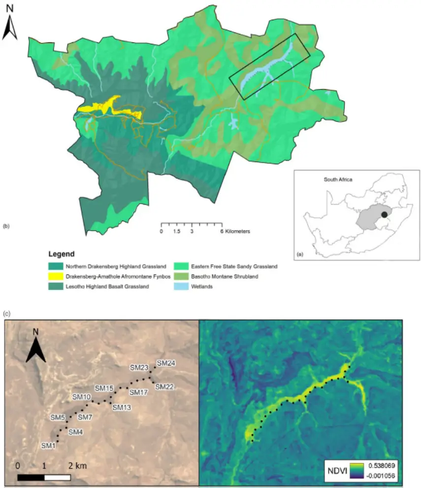
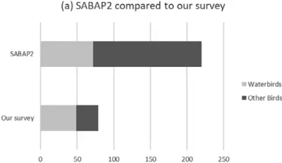

## Bird Conservation International

www.cambridge.org/bci

## Research Article

Cite this article: Mosikidi T, Le Maitre N, Steenhuisen S-L, Clark VR, Lloyd KS, Le Roux A (2023). Passive acoustic monitoring detects new records of globally threatened birds in a high-elevation wetland (Free State, South Africa). Bird Conservation International, 33, e80, 1-8

[https://doi.org/10.1017/S0959270923000345](https://doi.org/10.1017/S0959270923000345)

Received: 01 June 2023 Accepted: 22 October 2023

## Keywords:

Bioacoustics; Conservation; 2018 National Biodiversity Assessment of South Africa; Southern African Bird Atlas Project 2; Species inventory; Survey techniques

## Corresponding author:

Toka Mosikidi;

[Emails: tokamosikidi@gmail.com;](mailto:tokamosikidi@gmail.com)

[2015150341@ufs4life.ac.za](mailto:2015150341@ufs4life.ac.za)

© The Author(s), 2023. Published by Cambridge University Press on behalf of BirdLife International. This is an Open Access article, distributed under the terms of the Creative Commons Attribution licence (http:// creativecommons.org/licenses/by/4.0), which permits unrestricted re-use, distribution and reproduction, provided the original article is properly cited.

## Passive acoustic monitoring detects new records of globally threatened birds in a highelevation wetland (Free State, South Africa)

Toka Mosikidi 1,2,8 , Nicholas Le Maitre 2,7 , Sandy-Lynn Steenhuisen 2,3 , Vincent Ralph Clark 2,4 , Kyle Smith Lloyd 1,5,6 and Aliza Le Roux 1,2

1 Department of Zoology and Entomology, University of the Free State: Qwaqwa Campus, Phuthaditjhaba, South Africa; 2 Afromontane Research Unit, University of the Free State: Qwaqwa Campus, Phuthaditjhaba, South Africa; 3 Department of Plant Sciences, University of the Free State: Qwaqwa Campus, Phuthaditjhaba, South Africa; 4 Department of Geography, University of the Free State: Qwaqwa Campus, Phuthaditjhaba, South Africa; 5 Landscape Conservation Programme, BirdLife South Africa, Johannesburg, South Africa; 6 Centre for Statistics in Ecology, the Environment and Conservation, Department of Statistical Sciences, University of Cape Town, Cape Town, South Africa; 7 Plant Breeding Laboratory, Stellenbosch University, South Africa and 8 South African Environmental Observation Network (SAEON), Pretoria, South Africa

## Summary

Wetlands act as islands of high biodiversity within the ecological landscape and provide crucial ecosystem services to society. Anthropogenic activities are driving wetland degradation and it has become increasingly rare to find wetlands that do not show signs of biodiversity loss or alteration. The exacerbated loss of biodiversity in wetlands has a negative impact on the local economy and ecosystem services provided by these systems. We responded to the South African National Biodiversity Assessment (NBA) call to document wetland biodiversity against the backdrop of sustained wetland degradation in southern Africa. We monitored the soundscape of a high-elevation wetland in the Golden Gate Highlands National Park (GGHNP) from June 2019 to December 2020 across 24 localities using a rolling grid layout. We detected 35.9% of the avian species previously recorded from ad hoc sightings in the GGHNP of which 68.1% are wetland obligate species. We contributed an additional 10.2% new species records to the avian diversity of the GGHNP, including 24 species that are considered threatened by the International Union for Conservation of Nature (IUCN). Our remote monitoring technique enabled the first ever continuous monitoring using remote acoustic equipment for a high-elevation wetland in South Africa, thus providing a valuable contribution to the NBA call.

## Introduction

Wetlands are dynamic habitats that supply and store water for local and downstream ecosystems (Brandis et al. 2021), while serving as transition zones between terrestrial and aquatic ecosystems (Zedler and Kercher 2005; Erwin 2009). Healthy wetlands with limited degradation provide ecosystem services, including water purification, carbon storage, and flood attenuation (Finlayson and Rea 1999). Additionally, undisturbed wetlands generally support high biodiversity (Hu et al. 2017; Wamiti et al. 2020). Due to land-use changes and other anthropogenic disturbances, many wetland systems are losing the ability to perform basic functions, resulting in biodiversity loss that mirrors global declines in species diversity (Sharma and Rawat 2009; Sun et al. 2016).

The health and functionality of inland wetlands are major conservation concerns in the arid country of South Africa, with 88% of the country's wetlands considered threatened and only 2% formally protected (Skowno et al. 2019). Recognising this, the South African National Biodiversity Assessment (NBA) highlighted the urgent need to document wetland biodiversity, with an emphasis on high-elevation inland wetlands (Skowno et al. 2019). Birds are amongst the most dominant vertebrate species in wetlands (Schummer et al. 2012) and can be used as bio-indicators of wetland health (Mistry et al. 2008). Furthermore, monitoring avian biodiversity is one of the main priorities of global nature conservation, due to what has been labelled the sixth mass extinction (Triviño et al. 2018; Wilson et al. 2019; Allen et al. 2019).

South Africa is known for its high avian species diversity, with over 870 bird species, of which 68 are endemic or near-endemic. More than 130 of these species are globally threatened (Dowsett and Dowsett-Lemaire 2001; Kopij 2015; Taylor and Peacock 2018). Across South Africa populations of numerous species have decreased and distribution patterns have altered over the past two decades (Underhill and Brooks 2014; Amar et al. 2016). Wetland-dependent species such as the Eurasian Bittern Botaurus stellaris, Wattled Crane Grus carunculata, and White-winged Flufftail Sarothrura ayresi have suffered catastrophic population declines during the twentieth century, now ranking amongst the most endangered species in the region (Frommolt 2017; Allen et al. 2019). Such high-elevation wetland species are dependent on large, undisturbed wetland systems in the wetland-grassland mosaic that is characteristic of the eastern Great Escarpment of South Africa (Frommolt 2017; Colyn et al. 2019).

South Africa's Drakensberg mountains, part of the grassland biome, contrast sharply with those of the Global North, which tend to be dominated by coniferous forests that are frequently denuded due to human activities and climate change (Bian et al. 2020; Shevtsova et al. 2020; Roebroek et al. 2020). These forests are adapted to cold temperatures and have a relatively low diversity of plant species (Desyatkin et al. 2022). In contrast, the vegetation of mountains in the Global South tends to be more diverse, with a greater variety of plant species and ecosystems (Chatanga et al. 2019). Some of these high-altitude grasslands are centres of plant endemism classified as biodiversity hotspots, yet detailed descriptions of biodiversity in high-altitude wetlands within this biome remain inadequate (Brand et al. 2019; Carbutt 2019; Ayambire et al. 2021). Large-scale land-use transformation through agriculture, mining, plantation forestry, alien invasive plant species, replacement of indigenous antelope with livestock, and inadequate fire management along the Great Escarpment have resulted in major wetland habitat loss, as well as intensified disturbances during the breeding season of most bird species (Zuckerberg et al. 2018; ArayaLópez et al. 2018; Allen et al. 2019; Thomas et al. 2020). Coupled with climate change - best represented through intensifying El Niño-Southern Oscillation (ENSO) extremes - this "global change" cocktail could be fatal to remaining bird populations (Simmons et al. 2004). The effects of climate change, habitat loss, and other anthropogenic activities can be seen in the differences found when comparing the Southern African Bird Atlas Project 1 (SABAP1) (1987-1991) to the second version of the same project (SABAP2) (2007-present) (Amar et al. 2016; Hugo and Altwegg 2017; Little and Navarro 2019). These differences include range expansions, contractions, distribution shifts, and altered migratory patterns (Hugo and Altwegg 2017; Underhill and Brooks 2014). Increasing anthropogenic disturbances may drive more species to healthy wetlands, since these habitats provide refuge for disturbancesensitive species (Belle et al. 2018). Surveying avian biodiversity in healthy wetlands and disturbed systems is thus paramount to determine empirically changes in community composition and species distribution patterns (Finlayson and Rea 1999; Colyn et al. 2017; Araya-López et al. 2018).

Monitoring bird species' absence/presence and collecting statistically defensible data on population trends is a challenging task, especially in remote mountainous areas (Frommolt 2017; ArayaLópez et al. 2018). Traditional methods, such as timed species counts, transect counts, and bird watching (Pomeroy and Dranzoa 1997) are not always easy to implement in wetlands, as they are invasive, time-consuming, and influenced by observer bias (Klingbeil and Willig 2015). Cryptic species are also difficult to detect using direct observational techniques (La Sorte and Jetz 2010; Vu and Tran 2020). However, passive monitoring techniques are less invasive and have become much more readily available to record the presence of species in any given area (Calvo and Blake 1998; Marsden et al. 2001; Gasc et al. 2013). These methods generally include motion-triggered camera traps (Colyn et al. 2020) and passive acoustic monitoring (PAM) (Colyn et al. 2017).

PAM is one of the newer techniques that allows for recording acoustically active species with limited disturbance to a species' activity and breeding behaviour (Aide et al. 2013; Ospina et al. 2013;

Alvarez-Berríos et al. 2016; Browning et al. 2017). While PAM has not been intensively used to study bird communities in the wetlands of South Africa, it has been implemented in other ecosystems around the world and proven to yield rich data sets over a relatively short period compared with traditional methods (Stowell et al. 2019). For example, PAM has been used to study the migration patterns (Koleček et al. 2020), vocal activity (Frommolt 2017), population abundance, and basic presence/absence of several bird species (Pamula et al. 2019; Duchac et al. 2020; Bota et al. 2020). This technique has also proved effective in monitoring ecosystem health using bio-indicator species (Stowell et al. 2019) and species richness/diversity indices (Klingbeil and Willig 2015).

The aim of this study was to respond to the NBA call to document the biodiversity of South African inland wetlands (Skowno et al. 2019) by surveying the avian diversity of the Kleinspruit Wetland, a previously unsurveyed 200-ha, healthy, peatbased wetland in the Golden Gate Highlands National Park (GGHNP) in Free State Province in the eastern Great Escarpment region. We specifically used PAM in this relatively isolated wetland system to monitor non-invasively the area continuously over two wet and dry seasons potentially to detect elusive species that direct observation is unlikely to discover.

## Methods

## Study site

We conducted the study at the GGHNP (28°27'S 28°44'E) in the mountainous eastern Free State Province of South Africa (Figure 1). This region experiences dynamic climatic conditions including heavy rainfall events and thunderstorms during the wet season (austral summer) and harsh cold conditions during the dry season (austral winter) (Koleček et al. 2020). The GGHNP covers an area of 340 km 2 within the fire-driven grassland biome (Mucina and Rutherford 2006). It forms part of the South African National Parks (SANParks) system and is a Key Biodiversity Area, as it supports rare and endemic grassland, wetland, and mountain bird species.

We selected the Kleinspruit Wetland, a relatively undisturbed wetland that is part of the Wilge catchment within the GGHNP. The 200-ha Kleinspruit Wetland is roughly linear, 6 km in length, ranging from 100 m to 300 m in width. The wetland is dominated by Common Reeds (Phragmites australis), while in the upper reaches and side tributaries Carex-sedge beds and occasional bulrushes (Typha capensis) are more abundant. Wetland margins are grassy, and there is an abrupt transition from the wetland to the adjacent dryland grasslands, i.e. eastern Free State sandy grassland and Basotho montane shrubland (Mucina and Rutherford 2006). There is a steep hill on the northern side and flatter, rocky terrain on the southern side. Situated in a grassland, the wetland is prone to burning (VRC observation). Numerous paths maintained by large mammals such as Black Wildebeest (Connochaetes gnou) traverse the wetland. Water levels exhibit strong seasonality, with low dry season levels and high wet season levels, with an estimated difference of 1 m between seasons.

## Passive acoustic equipment

We initially deployed four acoustic devices, Song Meter 4 (Wildlife Acoustics, Maynard, MA, USA) in a rolling grid layout, with 250 m (equivalent to 1.7 times the range of the recorders) between successive placements along the wetland's south-western margin (Figure 1c). Every two weeks we replaced batteries, downloaded data, and redeployed equipment at the next four locations in the grid. We attached each Song Meter to a 2.5 m metal pole sunk at the edge of the wetland to protect equipment from potential flooding. The Song Meters recorded from 04h00 to 06h00 Central African Time on both channels at a sampling rate of 44,000 Hz in 16-bit mode, during peak dawn bird vocal activity (Pérez-Granados et al. 2018a, 2021). We collected data from June 2019 to December 2020, losing data and equipment between 21 October 2019 and 11 November 2019, when a fire swept through the study site in an El Niño summer. In November 2019, the Song Meters were replaced with Audio Moths (AudioMoth v1.2.0, Open Acoustic Devices, LabMaker, Berlin, Germany), recording on similar settings. The COVID-19 pandemic lockdown restrictions did not allow access to the wetland from March 2020 to June 2020, which resulted in a data gap for this period.

Figure 1. (a, b) Location of the Kleinspruit Wetland in South Africa and vegetation types of the wetland peripherals (Mucina and Rutherford 2006). (c) The Normalized Difference Vegetation Index (NDVI) across the sampling period ranging from -0.001056 to 0.538068. The black dots represent the location of the Song Meters.

## Acoustic analysis

We analysed the acoustic data using Kaleidoscope Pro software from Wildlife Acoustics. Kaleidoscope Pro converts all recorded vocalisations to .wav format and creates clusters that are easy to view as spectrograms. The provision of spectrograms allows fast identification of species based on their calls by creating clusters of similar calls that are matched to training calls, which we obtained from Xeno-Canto (https://www.xeno-canto.org/). According to the

(b) Detected species conservation status

EndangeredVulnerableLeast Concern

Figure 2. (a). Comparison between the acoustic survey's results and the Southern African Bird Atlas Project 2 (SABAP2), which used traditional survey techniques to document birdlife in the Golden Gate Highlands National Park (GGHNP). (b) The global International Union for Conservation of Nature (IUCN) conservation status of birds detected at the Kleinspruit Wetland in the GGHNP in our survey.

SABAP2 accessed in 2020, the GGHNP has 220 different bird species identified over the past 15 years (2007-2021), based on both visual identification and bird calls/songs. These formed the basis of the initial set of training calls for the classifier. We identified the vocalisations in unnamed clusters through expert consultation.

We set Kaleidoscope to the non-bat analysis mode, frequency range between 250 Hz and 10,000 Hz, call length detection between 2 s and 7.5 s, inter-syllable gap of 0.2 s, and Fast Fourier Transformation (FFT) at 5.33 ms (128 @ 0-12 kHz, 256 @ 13-24 kHz, 512 @ 25-48 kHz, 1,024 @ 49-96 kHz) to accommodate a range of species with low and high frequency calls. The maximum distance from the cluster centre was 0.5 and maximum clusters' parameter at 1,000 (Pérez-Granados et al. 2018b).

We manually verified all automatically detected species by visual and auditory inspection and compared spectrograms from the training calls with those generated from the acoustic data set. Bird experts (Steven Segang, Bonginkosi Ndaba and David Weaver) listened to the automatically detected species for confirmation. We sent the clusters that these experts could not identify to BirdLife South Africa for further identification. We used the 2015 Eskom Red Data Book of Birds of South Africa, Lesotho and Swaziland (Taylor et al. 2015) and the International Union for Conservation of Nature (IUCN) to assign a regional conservation to each identified bird species.

## Results

Through PAM, we detected 79 bird species at the Kleinspruit Wetland, constituting 35.9% of all GGHNP bird species recorded by SABAP2. Of the 79 detected species, three species are regionally listed as "Vulnerable" and one species as "Endangered" (IUCN 2020). Of the 220 species recorded in the GGHNP by SABAP2, 72 are considered obligate wetland species. However, we identified only 49 of these 72 obligate wetland species (68.1%) in the Kleinspruit Wetland. Of these species-presence detections only one, Grey Crowned Crane Balearica regulorum, is listed as "Endangered" (Figure 2).

In addition, we detected 25 species outside their expected range. SABAP2 has noted most of these species within 100 km of the GGHNP, although not within the GGHNP, suggesting that they were not entirely unexpected in this locality (Figure 2). We noted three species amongst these 25 detections that have never been recorded within a 100-km radius of the GGHNP; three of these species are of conservation concern (Table 1).

## Discussion

The aim of this study was to respond to the NBA call to document the biodiversity of South African inland wetlands (Skowno et al. 2019) by surveying the avian diversity of the Kleinspruit Wetland, a previously unsurveyed 200 ha, healthy, peat-based wetland in the eastern Great Escarpment region. Using PAM, we were able to add valuable novel avifaunal data to the current species records for the GGHNP, complementing the data in SABAP2 that is based on direct human observations in different pentads of the park, with more data collected from easily accessible areas such as camp sites and road sides. Through this study, we have shed a light on species distribution in a poorly known, large wetland system that is difficult to access in an area of the park not frequented by tourists, and enhanced the overall conservation value of this protected area.

Among the new species recorded were secretive species such as the African Swamphen Porphyrio madagascariensis (which is usually a locally common resident if there is thick cover, even in degraded wetlands in urban areas), and Great Reed Warbler Acrocephalus arundinaceus (recorded in the GGHNP in SABAP2, but only up to 2.5% of SABAP2 record for the two park pentads); both are common wetland species. Baillon's Crake Zapornia pusilla is generally uncommon (Lee and Hammer 2022; Brooks et al. 2022), and its presence is a potential indicator of the value of this wetland for such secretive residents; it was recorded in nearby Bethlehem and Memel in SABAP2, so our record is a valuable additional record for the eastern Free State.

Surprise new records included species more associated with forest (African Wood Owl Strix woodfordii). However, the proximity of an Afrotemperate forest patch only 3.6 km due west of the study site may help to explain the presence of an African Wood Owl. This is a common species in the scattered temperate forests of the eastern Great Escarpment (Gunawan et al. 2021; Mikkola et al. 2022), although not well represented in SABAP2 records for the Free State-KwaZulu-Natal border. The Yellow-Bellied Greenbul is almost certainly a vagrant, but there have been small irruptions of the species recently into the Free State, with one record for the Welkom area in SABAP2, so its presence is not improbable.

For 14 species, the novel records in GGHNP likely represent prior under-sampling, rather than true range expansions, as they have been recorded in surrounding localities such as Phuthaditjhaba, Bethlehem, Harrismith, and Clarens. Previously, species such as Common Sandpiper (Actitis hypoleucos), Corncrake (Crex crex), Great Reed Warbler, and Pallid Harrier (Circus macrourus) were thought of as just incidental records during the summer migration period, but according to our data these species are likely regular visitors or seasonal residents in the austral summer months (Lee and Hammer 2022). It is worth noting that two species with strongholds in the eastern Free State, i.e. Eurasian Bittern and White-winged Flufftail (Colyn et al. 2020), were not detected in the Kleinspruit Wetland during this study, despite being expected in this habitat.

Table 1. Bird species identified at the Kleinspruit Wetland that are not part of the historical Golden Gate Highlands National Park bird list. The regional IUCN status of detected species is "Least Concern", except where indicated as \* "Vulnerable" or \*\* "Endangered". Bold font highlights the species detected outside their known ranges.

| Species name               | Common name                 | Distance from known range |
| -------------------------- | --------------------------- | ------------------------- |
| Acrocephalus arundinaceus  | Great Reed Warbler          | >100 km                   |
| Actitis hypoleucos         | Common Sandpiper            | >100 km                   |
| Actophilornis africanus    | African Jacana              | <100 km                   |
| Ardeola ralloides          | Squacco Heron               | <100 km                   |
| Bugeranus carunculatus     | Wattled Crane\*             | <100 km                   |
| Burhinus vermiculatus      | Spotted Thick-knee          | <100 km                   |
| Cercotrichas leucophrys    | White-browed Scrub Robin    | <100 km                   |
| Ceryle rudis               | Pied Kingfisher             | <100 km                   |
| Circus macrourus           | Pallid Harrier\*\*          | <100 km                   |
| Crex crex                  | Corncrake                   | >100 km                   |
| Cuculus canorus            | Black Cuckoo                | <100 km                   |
| Fulica cristata            | Red-knobbed Coot            | <100 km                   |
| Hieraaetus pennatus        | Booted Eagle                | <100 km                   |
| Ixobrychus minutus         | Little Bittern              | <100 km                   |
| Lophaetus occipitalis      | Long-crested Eagle          | <100 km                   |
| Porphyrio madagascariensis | African Swamphen            | <100 km                   |
| Sarothrura rufa            | Red-chested Flufftail       | <100 km                   |
| Sporaeginthus subflavus    | Orange-breasted Waxbill     | <100 km                   |
| Strix woodfordii           | African Wood Owl            | <100 km                   |
| Telophorus zeylonus        | Bokmakierie                 | <100 km                   |
| Terpisphone viridis        | African Paradise Flycatcher | <100 km                   |
| Tringa glareola            | Wood Sandpiper              | <100 km                   |
| Uraeginthus angolensis     | Blue Waxbill                | <100 km                   |
| Zapornia pusilla           | Baillon's Crake             | <100 km                   |

Although this study was primarily focused on wetland species, the linear nature of the wetland coupled with the broad radius of detectability by the Song Meters resulted in a large component of the data set being non-wetland birds, i.e. those occurring on the adjacent hill-slope and dryland grasslands, or facultative species (those using both the wetland and the adjacent drylands). While this may seem distracting from the wetland focus, it does in fact provide cross-over perspective on avifauna in a grassland-wetland mosaic, which is typical of the eastern Great Escarpment, where wetlands of various dimensions and shapes are embedded in a grassland landscape (Mucina snd Rutherford 2006). Field observations at the wetland by TM and VRC suggest that there is a closely connected wetland-dryland ecology at the site, with dryland birds using the wetland, and vice versa. The most obvious cross-over is aerial feeders such as Swifts and Swallows, but also Chats (which were noted to forage along the wetland edges), Widowbirds (that breed in the wetland but forage deep into the adjacent grasslands), parasitic species (e.g. the Diederik Cuckoo Chrysococcyx caprius parasitising weavers that breed in the wetland), and birds of prey targeting wetland species.

It is worth noting that, surprisingly, the audio data set did not include some abundant, vocal species that have been noted visually, such as Southern Red Bishop Euplectes orix. Reasons for this are unclear, but it does raise the question as to which other species have not been recorded through PAM and suggests that a true diversity assessment still needs direct observations in the field to corroborate and augment PAM data (Towsey et al. 2014; Fujioka et al. 2014; Gibb et al. 2019).

Our results underscore the importance of protecting this highelevation wetland as a safe habitat for at-risk species utilising grassland-wetland mosaics. We confirmed the presence of species of conservation concern, the Grey Crowned Crane, which forages in the surrounding grasslands in the GGHNP and farmlands beyond (Wamiti et al. 2020; Amulike et al. 2020), and likely relies on the Kleinspruit Wetland for breeding. We recorded Wattled Crane for the first time in the GGHNP, at the wetland; it is amongst the most "Vulnerable" eastern Escarpment species. The unpredictable and unmanaged burns in this eastern part of the park in the winterspring months have a major impact on the wetland; these times are critical for Wattled Crane breeding success, and fire management around the wetland should become a park priority as soon as possible (Wamiti et al. 2020). Increasing El Niño intensity also leaves the wetland vulnerable to fire for a much longer period (May-November/December, compared with the usual MaySeptember/October fire season), potentially filtering out the White-winged Flufftail, which is believed to breed in early summer (Maphisa et al. 2016; Prowse et al. 2017; Smith et al. 2017; Matteson et al. 2020; Brandis et al. 2021).

## Conclusions

This study has confirmed PAM as useful for augmenting direct records for remote habitats such as wetlands, and for detecting species that would be difficult to identify through direct observations, whether those are visual or auditory. The use of PAM is suitable for monitoring remote areas that have been understudied; however, PAM on its own is not sufficient. The technique requires human verification, especially with data analysis. This is not unexpected, as most machine-learning approaches require a certain degree of human input. We advise future studies to incorporate both machine learning and human verification when using PAM, especially when monitoring rare and elusive species.

Acknowledgements. Funding was provided by the Afromontane Research Unit and National Research Foundation (Integrated Biodiversity Information Programme grant number 128337). Wildlife Acoustics generously sponsored us with Song Meters and Kaleidoscope software. We thank Hanneline SmitRobinson (Head of Conservation, BirdLife South Africa) for supporting the ARU-BirdLife South Africa partnership. We thank Robyn Colyn and Dave Weaver for assisting with identifications of unknown birdsong, and valuable logistical advice. We thank South African National Parks and the Golden Gate Highlands National Park for permits and permission to undertake the project. We are deeply grateful to Anthony Mapaura for extensive fieldwork, data collection, and processing support. Author's contributions: T. M.: methodology, data collection, data analysis, drafting the paper, editing, and reviewing; A. le R.: conceptualisation of study, funding, data validation, and editing; N. le M.: data collection, methodology, editing, and reviewing; V. R. C.: conceptualisation of study, funding, data validation, editing, and reviewing; S.-L. S.: project management, funding, data collection, methodology, editing, and reviewing; K. J. L.: data processing, reviewing, and editing. Data used in this paper is readily available on request and all data from the Southern African Bird Atlas Project 2 is available online (SABAP 2).

## References

- Aide T.M., Corrada-Bravo C., Campos-Cerqueira M., Milan C., Vega G. and Alvarez R. (2013). Real-time bioacoustics monitoring and automated species identification. PeerJ e103. https://doi.org/10.7717/peerj.103.
- Allen M.C., Burger J. and Lockwood J.L. (2019). Evaluation of unharvested refugia for grassland bird conservation within active hayfields. Avian Conservation and Ecology 14, 15.
- Alvarez-Berríos N., Campos-Cerqueira M., Hernández-Serna A., Amanda Delgado C.J., Román-Dañobeytia F. and Aide T. M. (2016). Impacts of small-scale gold mining on birds and anurans near the Tambopata Natural Reserve, Peru, assessed using passive acoustic monitoring. Tropical Conservation Science 9, 832-851.
- Amar A., Cloete D. and Whittington M. (2016). Using independent nest survey data to validate changes in reporting rates of Martial Eagles between the Southern African Bird Atlas Project 1 and 2. Ostrich 87, 1-5.
- Amulike B.B., Fuller T.K., Houlihan P.W. and Griffin C.R. (2020). Seasonal variation in grey crowned crane (Balearica regulorum) abundance in the Ngorongoro Crater, Tanzania. African Journal of Ecology 58, 685-691.
- Araya-López R.A., Lopatin J., Fassnacht F.E. and Hernández H.J. (2018). Monitoring Andean high altitude wetlands in central Chile with seasonal
- optical data: A comparison between Worldview-2 and Sentinel-2 imagery. ISPRS Journal of Photogrammetry and Remote Sensing 145, 213-224.
- Ayambire R.A., Pittman J. and Olive A. (2021). Incentivizing stewardship in a biodiversity hot spot: land managers in the grasslands. FACETS 6, 1307-1322. doi:10.1139/facets-2020-0071.
- Belle J.A., Collins N. and Jordaan A. (2018). Managing wetlands for disaster risk reduction: A case study of the eastern Free State, South Africa. Jamba: Journal of Disaster Risk Studies 10, 400.
- Bian J., Li A., Lei G., Zhang Z. and Nan X. (2020). Global high-resolution mountain green cover index mapping based on Landsat images and Google Earth Engine. ISPRS Journal of Photogrammetry and Remote Sensing 162, 63-76.
- Bota G., Traba J., Sardà-Palomera F., Giralt D. and Pérez-Granados C. (2020). Acoustic monitoring of diurnally migrating European Bee-eaters agrees with data derived from citizen science. Ardea 108, 139-149.
- Brand R.F., Scott-Shaw C.R. and O'Connor T.G. (2019). The alpine flora on inselberg summits in the Maloti-Drakensberg Park, KwaZulu-Natal, South Africa. Bothalia 49. doi:10.4102/abc.v49i1.2386.
- Brandis K.J., Mazumder D., Gadd P., Ji B., Kingsford R.T. and Ramp D. (2021). Using feathers to map continental-scale movements of waterbirds and wetland importance. Conservation Letters 14, e12798.
- Brooks M., Rose S., Altwegg R., Lee A.T., Nel H., Ottosson U. et al. (2022). The African Bird Atlas Project: a description of the project and BirdMap datacollection protocol. Ostrich 93, 223-232.
- Browning E., Gib R., Glover-Kapfer P. and Jones K.E. (2017). Passive acoustic monitoring in ecology and conservation. WWF Conservation Technology Series 1. Woking, UK, WWF-UK. doi: https://doi.org/10.25607/OBP-876.
- Calvo L. and Blake J. (1998). Bird diversity and abundance on two different shade coffee plantations in Guatemala. Bird Conservation International 8, 297-308.
- Carbutt C. (2019). The Drakensberg Mountain Centre: A necessary revision of southern Africa's high-elevation centre of plant endemism. South African Journal of Botany 124, 508-529.
- Chatanga P., Kotze D.C., Janks M. and Sieben E.J.J. (2019). Classification, description and environmental factors of montane wetland vegetation of the Maloti-Drakensberg region and the surrounding areas. South African Journal of Botany 125, 221-233.
- Colyn R.B., Campbell A.M. and Smit-Robinson H.A. (2017). The application of camera trapping to assess Rallidae species richness within palustrine wetland habitat in South Africa. Ostrich 88, 235-245.
- Colyn R.B., Campbell A. and Smit-Robinson H.A. (2019). Camera-trapping successfully and non-invasively reveals the presence, activity and habitat choice of the Critically Endangered White-winged Flufftail Sarothrura ayresi in a South African high-altitude wetland. Bird Conservation International 29, 463-478.
- Colyn R.B., Campbell A. and Smit-Robinson H.A. (2020). The use of a camera trap and acoustic survey design to ascertain the vocalization and breeding status of the highly elusive White-winged Flufftail, Sarothrura ayresi. Avian Conservation and Ecology 15, 12.
- Desyatkin R., Okoneshnikova M., Ivanova A., Nikolaeva M., Filippov N. and Desyatkin A. (2022). Dynamics of vegetation and soil cover of pyrogenically disturbed areas of the Northern Taiga under conditions of thermokarst development and climate warming. Land 11, 1594.
- Dowsett R.J. and Dowsett-Lemaire F. (2001). The atlas of southern African birds. Ostrich 72, 62-108.

Duchac L.S., Lesmeister D.B., Dugger K.M., Ruff Z.J. and Davis R.J. (2020).

- Passive acoustic monitoring effectively detects Northern Spotted Owls and Barred Owls over a range of forest conditions. The Condor 122, 1-22.
- Erwin K.L. (2009). Wetlands and global climate change: The role of wetland restoration in a changing world. Wetlands Ecology and Management 17, 71-84.
- Finlayson C.M. and Rea N. (1999). Reasons for the loss and degradation of Australian wetlands. Wetlands Ecology and Management 7, 1-11.
- Frommolt K.H. (2017). Information obtained from long-term acoustic recordings: applying bioacoustic techniques for monitoring wetland birds during breeding season. Journal of Ornithology 158, 659-668.
- Fujioka E., Soldevilla M.S., Read A.J. and Halpin P.N. (2014). Integration of passive acoustic monitoring data into OBIS-SEAMAP, a global

- biogeographic database, to advance spatially-explicit ecological assessments. Ecological Informatics 21, 59-73.
- Gasc A., Sueur J., Jiguet F., Devictor V., Grandcolas P., Burrow C. et al. (2013). Assessing biodiversity with sound: Do acoustic diversity indices reflect phylogenetic and functional diversities of bird communities? Ecological Indicators 25, 279-287.
- Gibb R., Browning E., Glover-Kapfer P. and Jones K.E. (2019). Emerging opportunities and challenges for passive acoustics in ecological assessment and monitoring. Methods in Ecology and Evolution 10, 169-185.
- Gunawan K.W., Hidayat A.A., Cenggoro T.W. and Pardamean B. (2021). A transfer learning strategy for owl sound classification by using image classification model with audio spectrogram. International Journal on Electrical Engineering and Informatics 13, 546-553.
- Hu S., Niu Z., Chen Y., Li L. and Zhang H. (2017). Global wetlands: Potential distribution, wetland loss, and status. Science of the Total Environment 586, 319-327.
- Hugo S. and Altwegg R. (2017). The second Southern African Bird Atlas Project: Causes and consequences of geographical sampling bias. Ecology and Evolution 7, 6839-6849.
- IUCN (2020). Red List of Threatened Species. Gland: International Union for Conservation of Nature.
- Klingbeil B.T. and Willig M.R. (2015). Bird biodiversity assessments in temperate forest: The value of point count versus acoustic monitoring protocols. PeerJ e973. https://doi.org/10.7717/peerj.973.
- Koleček J., Adamík P. and Reif J. (2020). Shifts in migration phenology under climate change: temperature vs. abundance effects in birds. Climatic Change 159, 177-194.
- Kopij G. (2015). Avian diversity in an urbanized South African grassland. Zoology and Ecology 25, 87-100.
- La Sorte F.A. and Jetz W. (2010). Projected range contractions of montane biodiversity under global warming. Proceedings of the Royal Society B 277, 3401-3410.
- Lee A.T. and Hammer S.A.J. (2022). A comparison of migrant and resident bird population changes in South Africa using citizen science data: Trends in relation to Northern Hemisphere distribution. Ostrich 93, 160-170.
- Little R.M. and Navarro R.A. (2019). Implications of geographical range changes and resultant sympatry for three Accipiter hawks on the Cape Peninsula, South Africa. Ostrich 90, 139-143.
- Maphisa D.H., Smit-Robinson H., Underhill L.G. and Altwegg R. (2016). Drivers of bird species richness within moist high-altitude grasslands in eastern South Africa. PLOS ONE 11, e0162609.
- Marsden S.J., Whiffin M. and Galetti M. (2001). Bird diversity and abundance in forest fragments and Eucalyptus plantations around an Atlantic forest reserve, Brazil. Biodiversity and Conservation 10, 737-751.
- Matteson C.T., Jackson C.R., Batzer D.P., Wilde S.B. and Jeffers J.B. (2020). Nitrogen and phosphorus gradients from a working farm through wetlands to streams in the Georgia Piedmont, USA. Wetlands 40, 2139-2149.
- Mikkola H. and Mikkola A. (2022). The vocal activity of twelve African qwl species. In Mikkola H. (ed.), Owls: Clever Survivors. London: IntechOpen, pp.1-19.
- Mistry J., Berardi A. and Simpson M. (2008). Birds as indicators of wetland status and change in the North Rupununi, Guyana. Biodiversity and Conservation 17, 2383-2409.
- Mucina L. and Rutherford M.C. (eds) (2006). The Vegetation of South Africa, Lesotho and Swaziland. Pretoria: South African National Biodiversity Institute.
- Ospina O.E., Villanueva-Rivera L.J., Corrada-Bravo C.J. and Aide T.M. (2013). Variable response of anuran calling activity to daily precipitation and temperature: implications for climate change. Ecosphere 4, art47.
- Pamula H., Pocha A. and Klaczynski M. (2019). Towards the acoustic monitoring of birds migrating at night. Biodiversity Information Science and Standards 3, 2018-2020.
- Pérez-Granados C., Bota G., Giralt D. and Traba J. (2018a). A cost-effective protocol for monitoring birds using autonomous recording units: A case study with a night-time singing passerine. Bird Study 65, 338-345.
- Pérez-Granados, C., Osiejuk, T.S. and López-Iborra, G.M. (2018b). Dawn chorus interpretation differs when using songs or calls: The Dupont's Lark Chersophilus duponti case. PeerJ 6, e5241.
- Pérez-Granados, C., Schuchmann, K.L. and Marques M.I. (2021). Vocal activity of the Ferruginous pygmy-owl (Glaucidium brasilianum) is strongly correlated with moon phase and nocturnal temperature. Ethology Ecology and Evolution 33, 62-72.
- Pomeroy D. and Dranzoa C. (1997). Methods of studying the distribution, diversity and abundance of birds in East Africa - some quantitative approaches. African Journal of Ecology 35, 110-123.
- Prowse T.A.A., Collard S.J., Blackwood A., O'Connor P.J., Delean S., Barnes M. et al. (2017). Prescribed burning impacts avian diversity and disadvantages woodland-specialist birds unless long-unburnt habitat is retained. Biological Conservation 215, 268-276.
- Roebroek C.T.J., Melsen L.A., van Dijke A.J.H., Fan Y. and Teuling A.J. (2020). Global distribution of hydrologic controls on forest growth. Hydrology and Earth System Sciences 24, 4625-4639.
- Schummer M.L., Palframan J., McNaughton E., Barney T. and Petrie S.A. (2012). Comparisons of bird, aquatic macroinvertebrate, and plant communities among dredged ponds and natural wetland habitats at Long Point, Lake Erie, Ontario. Wetlands 32, 945-953.
- Sharma R.C. and Rawat J.S. (2009). Monitoring of aquatic macroinvertebrates as bioindicator for assessing the health of wetlands: A case study in the Central Himalayas, India. Ecological Indicators 9, 118-128.
- Shevtsova I., Heim B., Kruse S., Schröder J., Troeva E.I., Pestryakova L.A. et al. (2020). Strong shrub expansion in tundra-taiga, tree infilling in taiga and stable tundra in central Chukotka (north-eastern Siberia) between 2000 and 2017. Environmental Research Letters 15, 085006.
- Simmons R.E., Barnard P., Dean W.R.J., Midgley G.F., Thuiller W. and Hughes G. (2004). Climate change and birds: Perspectives and prospects from southern Africa. Ostrich 75, 295-308.
- Skowno A., Poole C., Raimondo D., Sink K.K., Deventer H., Niekerk L.V. et al. (2019). National Biodiversity Assessment 2018: The Status of South Africa's Ecosystems and Biodiversity. Synthesis Report. Pretoria: South African National Biodiversity Institute.
- Smith D.A.E., Smith Y.C.E. and Downs C.T. (2017). Seasonal habitat requirements of Lemon Dove (Aplopelia larvata) in coastal forest: Camera-trap surveys of a reclusive species. African Zoology 52, 199-207.
- Stowell D., Wood M.D., Pamuła H., Stylianou Y. and Glotin H. (2019). Automatic acoustic detection of birds through deep learning: The first Bird Audio Detection challenge. Methods in Ecology and Evolution 10, 368-380.
- Sun T., Lin W., Chen G., Guo P. and Zeng Y. (2016). Wetland ecosystem health assessment through integrating remote sensing and inventory data with an assessment model for the Hangzhou Bay, China. Science of the Total Environment 566-567, 627-640. doi:10.1016/j.scitotenv.2016.05.028.
- Taylor M.R. and Peacock F. (2018). The State of South Africa's Birds 2018. Johannesburg: BirdLife South Africa.
- Taylor M.R., Peacock F. and Wanless R.M. (2015) 2015 Eskom Red Data Book of Birds of South Africa, Lesotho and Swaziland. Johannesburg: BirdLife South Africa.
- Thomas A., Speldewinde P., Roberts, J.D., Burbidge A.H. and Comer, S. (2020). If a bird calls, will we detect it? Factors that can influence the detectability of calls on automated recording units in field conditions. Emu -Austral Ornithology 120, 239-248.
- Towsey M., Wimmer J., Williamson I. and Roe P. (2014). The use of acoustic indices to determine avian species richness in audio-recordings of the environment. Ecological Informatics 21, 110-119.
- Triviño M., Kujala H., Araújo M.B. and Cabeza M. (2018). Planning for the future: identifying conservation priority areas for Iberian birds under climate change. Landscape Ecology 33, 659-673.
- Underhill L. and Brooks M. (2014). Preliminary summary of changes in bird distributions between the first and second southern African Bird Atlas projects (SABAP1 and SABAP2). Ornithological Observations 5, 258-293.
- Vu T.T. and Tran D. van (2020). Using autonomous recorders and bioacoustics to monitor the globally endangered wildlife in the Annamite mountain landscape: A case study with crested argus in Song Thanh Nature Reserve. Journal for Nature Conservation 56. doi:10.1016/j.jnc.2020.125843.
- Wamiti W., Gichuki N., Sigana D., Njoroge P., Morrison K., Ndung'u G. et al. (2020). Water depth, vegetation height, and offshore distance are critical

factors in nest-site selection for Grey Crowned Crane at Lake Ol' Bolossat, Kenya. Authorea. doi:10.22541/au.160193341.14910098/v1.

- Wilson S., Schuster R., Rodewald A.D., Bennett J.R., Smith A.C., La Sorte F.A. et al. (2019). Prioritize diversity or declining species? Trade-offs and synergies in spatial planning for the conservation of migratory birds in the face of land cover change. Biological Conservation 239, 108285.
- Zedler J.B. and Kercher S. (2005). Wetland resources: Status, trends, ecosystem services, and restorability. Annual Review of Environment and Resources 30, 39-74.
- Zuckerberg B., Ribic C.A. and McCauley L.A. (2018). Effects of temperature and precipitation on grassland bird nesting success as mediated by patch size. Conservation Biology 32, 872-882.
