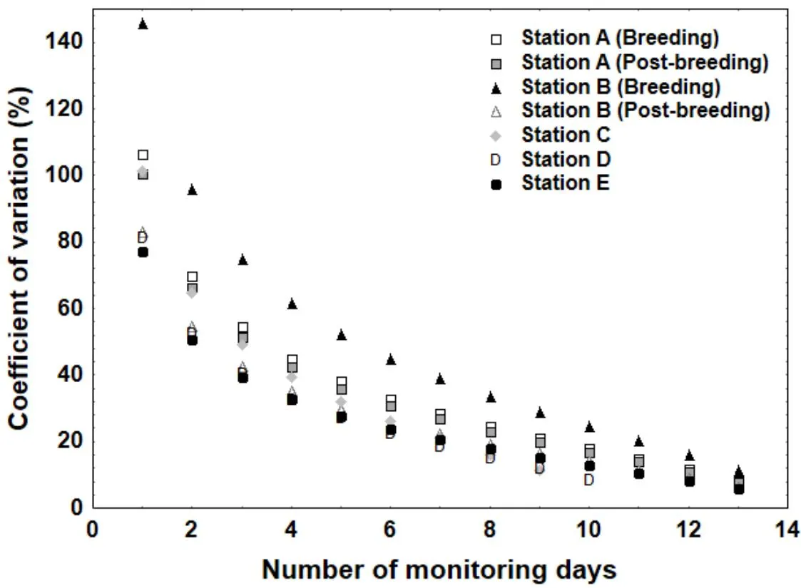
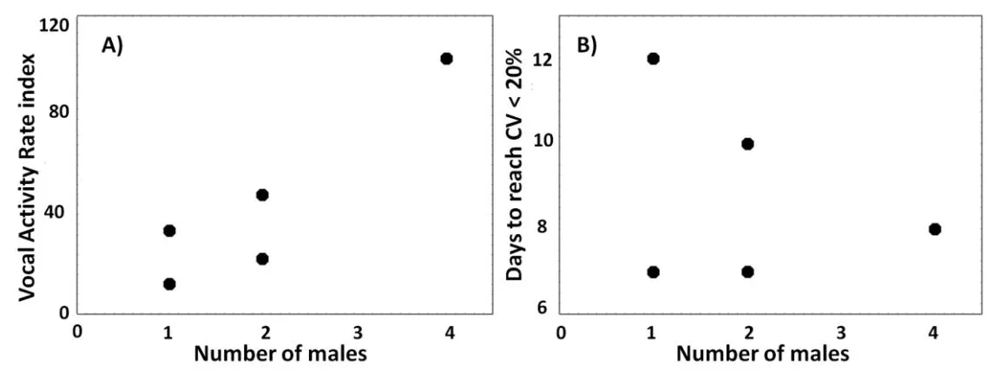
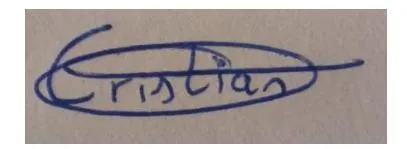
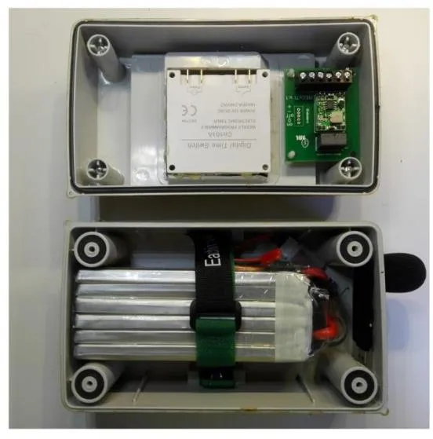
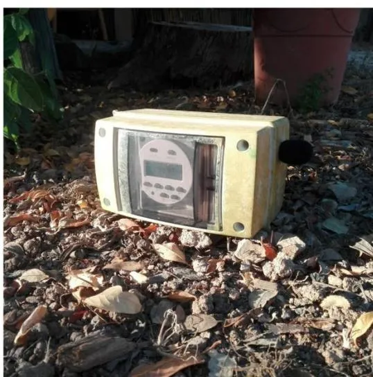
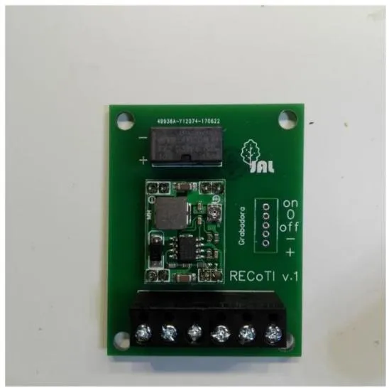
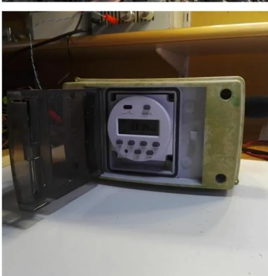
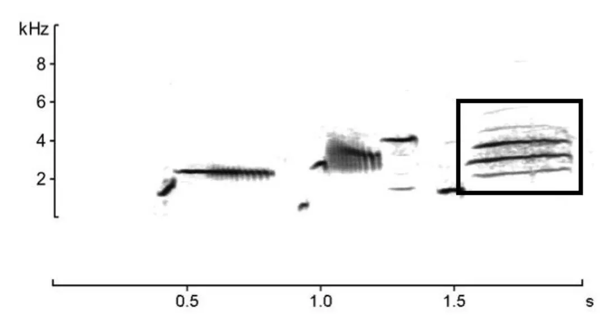

# **Repositorio Institucional de la Universidad Autónoma de Madrid** <https://repositorio.uam.es>

Esta es la **versión de autor** del artículo publicado en: This is an **author produced version** of a paper published in:

[Ecological Indicators](<javascript:void(0)>) 107 (2019): 105608

**DOI:** [h](https://dauam-my.sharepoint.com/personal/susana_torres_uam_es/Documents/Escritorio/REPO/sexenios%202023/5783147/%20https:/doi.org/10.1016/j.scitotenv.2021.148640%0d)[ttps://doi.org/10.1016/j.ecolind.2019.105608](https://doi.org/10.1016/j.ecolind.2019.105608)

**Copyright:** © 2019 Elsevier Ltd. This manuscript version is made available under the CC-BY- NC-ND 4.0 licence<http://creativecommons.org/licenses/by-nc-nd/4.0>[/](http://creativecommons.org/licenses/by-nc-nd/4.0/)

El acceso a la versión del editor puede requerir la suscripción del recurso Access to the published version may require subscription

- Effort needed to accurately estimate Vocal Activity Rate index using acoustic
- monitoring: a case study with a dawn-time singing passerine.

- Cristian Pérez-Granados1,2\* , Julia Gómez-Catasús1,3, Daniel Bustillo-de la Rosa1,3,
- Adrián Barrero1,3, Margarita Reverter1,3, Juan Traba1,3.

- <sup>1</sup> Terrestrial Ecology Group (TEG-UAM), Department of Ecology, Universidad
- Autónoma de Madrid, Madrid, Spain.
- <sup>2</sup> National Institute for Science and Technology in Wetlands (INAU), Federal
- University of Mato Grosso (UFMT), Computational Bioacoustics Research Unit
- (CO.BRA), Cuiabá, Mato Grosso, Brazil.
- <sup>3</sup> Centro de Investigación en Biodiversidad y Cambio Global (CIBC-UAM).
- Universidad Autónoma de Madrid, Madrid, Spain.

- Corresponding author: E-mail address: [cristian.perez@ua.es](mailto:cristian.perez@ua.es). Tel: +34 (914978271).
- Fax: +34 (914978001).
- Declarations of interest: none

#### **Abstract:**

30

31

32

33

34

35

36

37

38

39

40

41

42

43

44

45

46

47

48

49

Indices based on singing activity have often been used in wildlife surveys conducted with passive acoustic monitoring. For instance, the Vocal Activity Rate index (VAR) has been employed to estimate animal populations and detect changes in abundance between years or sites. VAR may differ greatly between days due to environmental and biological factors, therefore leading to inadequate population size estimations and recommendations. However, there is still little information about the minimum number of monitoring days required for estimating a reliable VAR to assess changes over time or sites. We describe, for first time for a terrestrial bird species, the pattern of variation of VAR as a function of the number of monitoring days. Coefficient of variation sharply decreased with the number of monitoring days, and this pattern was similar during the breeding and post-breeding period. Coefficient of variation was close to 100% when a single monitoring day was surveyed, but decreased up to 30% and 20% after six or seven and nine monitoring days, depending on the monitoring period. Mean VAR was significantly related to bird abundance, but no relationship was found between bird abundance and number of days needed to reach a CV lower than 20 %. Our results highlight that prior assessment of effort needed to estimate a reliable VAR should be a prerequisite for future monitoring programmes using singing activity indices. We found large differences in the number of monitoring days needed to obtain a reliable VAR in comparison to prior research on seabirds, suggesting that further research should be developed in different taxa and situations.

50 51

52

53

**Keywords:** Autonomous recording unit, _Chersophilus duponti_, cue rate, Dupont's lark, population estimates, signal recognition.

54 55

56

57

58

59

60

61

62

### **Introduction**

64

65

66

67

68

69

70

71

72

73

74

75

76

77

78

79

80

81

82

83

84

85

86

87

88

89

90

91

92

93

94

95

96

97

The recent development of open source and low-cost Autonomous Recording Units (ARUs hereinafter; Hill et al. 2018) along with advances in automated signal recognition programs, including machine learning processes, have led to an increasing trend in the use of acoustic monitoring for wildlife surveys (see review in Sugai et al. 2019). This technique has served as an alternative to traditional field surveys for describing animal communities, detecting species' presence, or in behavioural studies (Darras et al. 2018). The use of ARUs has a large number of advantages over traditional survey methodologies, since it can be a standardized no-invasive technique able to operate in remote locations or areas with low visual detection. Automated recorders also allow researchers to increase the spatial and temporal scale of studies. However, there are also some disadvantages that cannot be overlooked, among which are the large amount of expert time needed for interpretation of the recordings (Yip et al. 2019) and the difficulty in estimating population densities from sound recordings (but see Hedley et al. 2017, Sebastián-González et al. 2018, Yip et al. 2019). ARUs usually have one, two in best cases, omnidirectional microphone that provides little or no ability to locate the direction of the sound, which makes it difficult to discriminate number of individuals around ARUs (but see Drake et al. 2016 and Hedley et al. 2017).

Vocal Activity Rate index (VAR, hereinafter) is among the few indices used to estimate wildlife population size or assess population changes over time and space with acoustic monitoring. This index, defined as the number of songs detected per unit time (Oppel et al. 2014, Zwart et al. 2014), is expected to increase with increasing population density (density-dependent; Farnsworth et al. 2004). VAR has been used for estimating wildlife abundance in a wide range of taxa, such as anurans (Nelson and Graves 2004), mammals (Barlow and Taylor 2005) or birds (Pérez-Granados et al. 2019a), but also to evaluate wildlife recovery after habitat restoration actions (Buxton and Jones 2012, Buxton et al. 2013). In birds, many studies have described a positive and significant relationship between VAR and bird abundance in different situations, such as nocturnal migration activity (Larkin et al. 2002, Farnsworth et al. 2004), seabirds' colony size (Oppel et al. 2014), and terrestrial bird species (Abrahams 2019, Pérez-Granados et al. 2019a, but see Zwart et al. 2014).

Bird vocal activity differs daily due to weather conditions, mating status and breeding seasonality, among others (Catchpole and Slater 2008). For example, bird singing activity can be affected by raining, mist, temperature, cloud cover (O'Connor and Hicks 1980), moon phase (York et al. 2014), seasonality (O'Connor and Hicks 1980, Pérez-Granados et al. 2018a), mating status (Kunc et al. 2007) and number of neighbouring males (Olinkiewicz and Osiejuk 2003). Likewise, the effectiveness of ARUs may also differ between days according to environmental conditions (wind speed, rain, etc.) or bird movements. A recent study, using playbacks to simulate a bird calling towards and against different type of recorders showed that tests performed against the recorders detected 50% less calls than those carried out towards the recorder (Pérez-Granados et al. 2019b). Therefore, the influence of all these factors may compromise the use of VAR to estimate bird abundance or assess population changes from sound recordings. Indeed, Abrahams (2019) found a strong and significant relationship between Capercaillie (_Tetrao urogallus_) abundance and VAR when monitoring over an extended survey period (one month), but no relationship was detected over shorter time frames (daily scale) due to considerable daily variation in call activity related to seasonality, adverse impact of weather conditions and large mobility of the Capercaillie around the lek site while displaying (Abrahams 2019).

98

99

100

101

102

103

104

105

106

107

108

109

110

111

112

113

114

115

116

117

118

119

120

121

122

123

124

125

126

127

128

129

130

131

Programming ARUs to record during a number of monitoring days, as well as using an averaged value of VAR over this period, should decrease the influence of unknown factors. The only known study that assessed number of days needed to estimate a reliable VAR was carried out using seabirds as model species, and concluded that a minimum of 75 monitoring days was needed to reach a stabilised VAR value during the breeding season (Buxton and Jones 2012). However, the authors noted that nocturnal seabird activity is extremely variable from day to day and that seabirds usually leave the colonies for long periods (Buxton and Jones 2012). Therefore, the pattern described in that study may not be representative for terrestrial bird species, for which there is no information available. Moreover, the pattern found by Buxton and Jones (2012) was estimated only during the breeding period, but no information is available about whether the sampling effort should be the same outside the breeding season.

The main goal of this paper is to describe the decreasing pattern of variation (Coefficient of Variation, CV) for measuring VAR of a terrestrial bird as a function of the number of monitoring days. We hypothesised that CV is strongly affected by the number of monitoring days. Thus, we expected that CV would decrease as the number of monitoring days increases. We also aimed to explore whether the sampling effort (i.e. the number of monitoring days) needed to estimate a reliable VAR differs between the

breeding and the post-breeding period. We expect that VAR will be lower during the post-breeding period, due to singing relaxation after breeding. On the contrary, a similar number of monitoring days would be needed if the species had a constant singing activity during this period. We believe that our results may encourage researchers to estimate the deployment duration time required to estimate a reliable VAR in further research. Calculate minimum number of monitoring days is desirable for long-term monitoring programmes based on acoustic monitoring, for which the development of effective and standardised monitoring protocols could lead to greater time and economic efficiency.

# **Methods**

132

133

134

135

136

137

138

139

140

141

142

143

144

145

146

147

148

149

150

151

152

153

154

155

156

157

158

159

160

161

162

163

164

### **Study species**

We selected the Dupont's lark (_Chersophilus duponti_) as a study model because it is a threatened passerine (Gómez-Catasús et al. 2018a) for which acoustic monitoring has proven to be an effective tool (Pérez-Granados et al. 2018b, 2018c). It is a highly territorial species that typically sings at high rates from the same location during dawn choruses (Pérez-Granados et al. 2018a). The vocal activity of the species is maximum during the breeding period (March-June, Herranz et al. 1994, Pérez-Granados et al. 2017), when males engage in countersinging disputes (Laiolo et al. 2008). There is also a second peak of vocal activity during the post-breeding period (September-November, Laiolo and Tella 2008, Laiolo et al. 2008).

#### **Study area**

The study area was located within the Important Bird Area "_Altos de Barahona_" (Soria province, central Spain, 41º20´ N 2º41´ W), which harbours one of the largest Dupont's lark populations in Spain (594 males, Gómez-Catasús et al. 2018b). In this area we located five acoustic monitoring stations aiming to conduct a long-term monitoring of the presence and abundance of the Dupont's lark during the following years. Four of the acoustic monitoring stations (Stations A-D) were located in potential areas for the species were habitat reforestation actions were carried out. The remaining station (Station E) was placed within a high-quality habitat and known to have a basis of the vocal behaviour of the species. All sites were flat areas dominated by small and sparse shrub communities (_Thymus_ spp. and _Genista_ spp.) and a high proportion of bare ground cover.

### **Acoustic monitoring**

In each acoustic monitoring station, we placed one ARU. ARUs consisted of a USB Voice Recorder SK-001 with one integrated and single-channel microphone. Recorders were powered by a 12V/8.0 mAh battery (> 300 hour-autonomy), connected to a digital timer to record at selected times. Devices were protected from weather by small and cryptic plastic boxes (see Appendix Figure A1). Stations A-D were monitored during 14 consecutive working days throughout the breeding season in 2018 (20 March - 30 April) while station E was monitored during the same number of days between 4 April – 17 April 2019. Additionally, two of the stations located in the managed area were also monitored 14 days during the post-breeding period in 2018 (18 September – 2 October).

In all sites recorders were programmed to record from one hour before sunrise to sunrise following the protocol described for monitoring the species (Pérez-Granados et al. 2018b). We selected this recording time to reduce variation in VAR (Oppel et al. 2014), as it coincides with the maximum daily singing activity period of the species (Pérez-Granados et al. 2018b, 2018c). Acoustic stations were separated by more than 500 m to avoid recording the same individual from two adjacent acoustic monitoring stations, since the recorder used have proven to be efficient at detecting Dupont's lark presence at distances up to 256 m (Pérez-Granados et al. 2019b).

## **Bird data**

165

166

167

168

169

170

171

172

173

174

175

176

177

178

179

180

181

182

183

184

185

186

187

188

189

190

191

192

193

194

195

196

197

198

We carried out Dupont's lark censuses during the breeding period to estimate the number of males within a 200 m buffer around each ARU. Although the recorder is able to detect the species at a distance of 256 m we used the 200 m buffer since the probability of detecting the species beyond that distance, under favourable singing conditions, is always lower than 15% (Pérez-Granados et al. 2019b). Censuses were carried out on dry and windless days within the two following days after recorders were retrieved in order to avoid modifying the natural singing behaviour of the species during acoustic monitoring period. We performed a line transect crossing the location of the stations and using a 500-m maximum detection band on each side of the observer, within which we assumed a detection probability equal to 1 for singing males (Pérez-Granados and López-Iborra 2017). Censuses were carried out during the last hour before sunrise and locations of all singing males detected was estimated acoustically and recorded by GPS. Finally, we estimated the number of males detected within the 200-m buffer around ARUs as an index of abundance.

#### **Audio analyses**

Audio recordings were automatically scanned using Song Scope 4.1.5 (Wildlife Acoustics 2011). This software creates a target signal from the feature characteristics of the example songs used for training, which can then be used as a recognizer to determine if a sound within a recording matches these characteristics (Wildlife Acoustics 2011). We built the recognizer by using songs of the species recorded in different populations and considering only the final sequence of the song as a target signal, since it is quite constant and should be easily detected by Song Scope (see Appendix Figure A2 to see the final sequence of the song of the species and Appendix Table A1 for settings employed to built the recognizer). Recordings were always scanned using the algorithm 2.0 and selecting these results with a score > 40% and quality above 20 (Pérez-Granados et al. 2019a, 2019b). All possible events identified by Song Scope were visual and/or acoustically checked by the same observer (CPG) in order to remove false positives from further analyses. A prior assessment using Dupont's lark recordings collected in the same area demonstrated that the recognizer used in this study is able to detect 63.0% of the Dupont's lark songs within a recording (Pérez-Granados et al. 2019a). We estimated VAR per each recording by dividing the total number of true positives automatically detected by Song Scope by recording length (Oppel et al. 2014, Pérez-Granados et al. 2019). We also estimated mean VAR for each site as the mean value obtained throughout the study period (14 days).

# **Statistical analyses**

199

200

201

202

203

204

205

206

207

208

209

210

211

212

213

214

215

216

217

218

219

220

221

222

223

224

225

226

227

228

229

230

231

232

To assess the minimum number of monitoring days needed to obtain a reliable VAR we created curves of CV (%) as a function of accumulated monitoring days. First, we quantified the mean and standard deviation (SD) of VAR estimated for all possible combinations from one to 13 monitoring days and then calculated CV by dividing SD by the mean VAR estimated for each combination of monitoring days (Reed et al. 2002). For each site, we excluded the combination for 14 monitoring days because it reports a unique value with no SD, and therefore CV cannot be computed (see Appendix Table A2). In two of the seven acoustic monitoring stations we did not analyse recordings for three or four monitoring days due to strong raining, and in these cases we excluded the combination for eleven and ten monitoring days, respectively (see Appendix Table A2). Although raining activity could fit within the natural variation of bird singing activity due to environmental predictors (O'Connor and Hicks 1980) we opted for not including these days in posterior analyses since we consider that this factor can be easily controlled for researchers (e.g. when selecting sampling dates

or analyzing the recordings). Therefore, hereinafter we will use the term monitoring days referring to "effective monitoring days" (with no rain). Finally, we also assessed the relationship between the number of breeding territorial males around ARUs and number of days required per site to reach a CV lower than 20% in order to evaluate whether the effort needed depends on bird abundance. Additionally we also tested the relationship between VAR and number of breeding males around ARUs. Data collected during the post-breeding period was excluded from these analyses since no field censuses were performed during this period. Data analyses were conducted in R 3.4.1 (R Core Team 2016). We used the _combinations_ function in the R '_gtools_' Package (Warnes et al. 2018) to obtain the possible combinations from one to ten, 11 or 13 monitoring days (see script used in Appendix script A1).

# **Results**

233

234

235

236

237

238

239

240

241

242

243

244

264

245 246 247 248 249 250 251 252 253 254 255 256 257 258 259 260 261 262 263 Bird abundance around ARUs varied between one and four males and mean VAR per acoustic monitoring station ranged between 12.4 and 102.8 (see Appendix Table A3). In all stations CV sharply decreased with the number of monitoring days (Figure 1). We found slight differences in the CV between sites, but the pattern of decrease was relatively similar between sites (Figure 1) and between periods (Table 1). However, during the post-breeding this pattern was even clearer and a lower number of days were needed to reach a similar CV (Table 1). When considering only one day for estimating VAR in all data together, the CV was very high and showed a mean value higher than 99% (Table 1 and see Appendix Table A3 for results per site). We estimated that a mean number of seven and nine monitoring days were needed during the breeding period to obtain a VAR with a CV lower than 30% and 20%, respectively (Table 1), while these values decreased to six and nine monitoring days during the post-breeding period (Table 1). We found a positive and significant relationship between VAR and Dupont's lark abundance around ARU (R<sup>2</sup> = 0.84, p = 0.028, Figure 2), but no relationship was found between bird abundance and number of days needed to reach a CV lower than 20 % (R<sup>2</sup> = 0.08, p = 0.645, Figure 2). When comparing data collected at the same location, VAR obtained after 14 monitoring days during the post-breeding period was between 26-29% higher than during the breeding period (Appendix Table A3).



Figure 1. Coefficient of variation (%) of the Vocal Activity Rate index of the Dupont's lark estimated as a function of monitoring days. Coefficient of variation was calculated by dividing standard deviation by mean of the vocal activity rate obtained for each possible combination from one to thirteen monitoring days. Values obtained for each monitored site are expressed with different markers.

Table 1. Mean ( $\pm$ SE) coefficient of variation (CV, %) of the Vocal Activity Rate index of the Dupont's lark as a function of monitoring days. Mean values are expressed for the breeding period (5 stations monitored), post-breeding period (2 stations) and all data together.

| Number of monitoring days | Breeding period  | Post-breeding period | TOTAL          |     |
| ------------------------- | ---------------- | -------------------- | -------------- | --- |
| 1                         | $102.4 \pm 12.2$ | $91.7 \pm 8.7$       | $99.3 \pm 8.9$ |     |
| 2                         | $66.8 \pm 8.1$   | $60.3 \pm 5.7$       | $64.9 \pm 5.9$ |     |
| 3                         | $51.6 \pm 6.4$   | $46.9 \pm 4.4$       | $50.2 \pm 4.6$ |     |
| 4                         | $42.2\pm5.4$     | $38.7 \pm 3.7$       | $41.2\pm3.8$   |     |
| 5                         | $35.4 \pm 4.6$   | $32.8 \pm 3.1$       | $34.7\pm3.3$   |     |
| 6                         | $30.0 \pm 4.1$   | $28.3\pm2.7$         | $29.5\pm2.9$   |     |
| 7                         | $25.5\pm3.7$     | $24.5\pm2.3$         | $25.2\pm2.6$   |     |
| 8                         | $21.5\pm3.4$     | $21.2\pm2.0$         | $21.4 \pm 2.4$ |     |
| 9                         | $17.7\pm3.3$     | $18.2\pm1.7$         | $17.8\pm2.3$   |     |
| 10                        | $15.9\pm3.5$     | $15.5\pm1.4$         | $15.8\pm2.2$   |     |
| 11                        | $15.3 \pm 2.7$   | $12.8\pm1.2$         | $14.3\pm1.6$   |     |
| 12                        | $12.0 \pm 2.1$   | $10.0 \pm 0.9$       | $11.2\pm1.3$   |     |
| 13                        | $8.4 \pm 1.5$    | $7.0\pm0.6$          | $7.8 \pm 0.9$  |     |



Figure 2. Relationship between breeding Dupont's lark abundance around recorders

and: A) Vocal Activity Rate index, and B) Number of days required to reach a CV

288 lower than 20%.

## **Discussion**

290

291

292

293

294

295

296

297

298

299

300

301

302

303

304

305

306

307

308

309

310

311

312

313

314

315

316

317

318

319

320

321

322

323

In this work we describe, for first time for a terrestrial bird species, the pattern between CV and VAR as a function of accumulated monitoring days. According to our prediction, CV decreased when a larger number of monitoring days was surveyed and highlight the need to extend the monitoring period to more than one week to obtain a reliable VAR. VAR index has been used to evaluate the response of birds to habitat management actions (Buxton and Jones 2012, Buxton et al. 2013), as well as to estimate wildlife populations of a wide range of taxa e.g. Nelson and Graves 2004, Barlow and Taylor 2005). The annual change in calling activity is also the most important conservation information for practitioners for some monitoring programmes (Digby et al. 2013). In all these cases, scientists and managers require low-error estimates, with statistical power, to infer population abundances and to detect changes in abundance between years or sites. Otherwise, incorrect results may arise and inadequate recommendations may be proposed.

Surprisingly, we found a higher VAR during the post-breeding period than during the breeding one, even though we would have expected a lower vocal output outside the breeding season. This result could be related to a greater number of individuals around recorders during the post-breeding period due to the presence of both resident males and a large number of singing juveniles looking for territory (Laiolo and Tella 2008, Laiolo et al. 2008). However, as we did not perform field censuses during the post-breeding period we cannot conclude whether or not the higher VAR detected during the post-breeding period was related to larger bird abundance. We also found that number of days needed to reach a similar CV value was slightly lower during the post-breeding period than during the breeding one. Although that difference was very low, and regardless we have no bird data during the post-breeding period, it highlights that vocal activity of the species was more constant during the post-breeding period than during the breeding season.

We found a strong and significant relationship between VAR and Dupont's lark abundance, which is in agreement with prior results found in a large number of bird species (Borker et al. 2014, Oppel et al. 2014, Abrahams 2019, Pérez-Granados et al. 2019a). Surprisingly, the same R<sup>2</sup> was found when analyzing the relationship between VAR and Dupont's lark abundance at a larger spatial scale (N = 27 sites, Pérez-Granados et al. 2019a). However, we did not find any relationship between bird abundance and number of days required to reach a CV lower than 20%, which could be

explained by the fact that bird vocal activity changes accordingly to bird abundance, and therefore no relationship might be found. However, we cannot rule out the possibility of finding a concrete pattern between bird abundance and days needed to reach a low CV due to reduced number of sites monitored in our study.

324

325

326

327

328

329

330

331

332

333

334

335

336

337

338

339

340

341

342

343

344

345

346

347

348

349

350

351

352

353

354

355

356

357

Little is known about how CV differs between species and sites due to the low number of studies that has evaluated this topic. A common feature, however, is that large differences arise between studies. Buxton and Jones (2012) stated that a minimum number between 75 and 200 monitoring days were needed to reach a stabilising value of the VAR uttered by different seabird species during the breeding period. However, according to our results, the number of monitoring days needed to reliably monitor the singing activity of the Dupont's lark, both during the breeding and the post-breeding period, were much lower. We estimated that nine monitoring days was the minimum effort needed to obtain a VAR with a CV smaller than 20%, though this value could be lowered by up to 10% after 13 monitoring days. It is important to keep in mind that our results are based on "effective monitoring days" (after excluding days with raining activity), and therefore ARUs should be left at the field during a larger number of days in order to ensure that minimum number of effective monitoring days is reached. Afterwards those days with raining presence could be easily excluded from posterior analyses. On the other hand, differences between studies seem to be mainly related to different behaviour of monitored species. Buxton and Jones (2012) monitored nocturnal singing activity of different seabirds, which are known to greatly differ in their singing activity between days, sometimes disappearing from their colonies during long periods. In this study we monitored the nocturnal singing activity of a resident and territorial passerine that performs long dawn choruses (Pérez-Granados et al. 2018a) and with very limited displacement movements (100 m between years, Laiolo et al. 2007), which may explain why the VAR showed constant values and therefore the less number of days required to reach a low CV.

CV must be estimated for each case using appropriate validation studies (Reed et al. 2002), since there is no consensus on the optimal value of CV as it depends on the context (Reed et al. 2002). Different authors consider CVs smaller than 20% to be acceptable, while values higher than 30% should be discarded due to high variability (Patel et al. 2001, Gordón-Mendoza and Camargo-Buitrago 2015). Future studies should evaluate which threshold of the CV should be considered as adequate to detect significant changes over years and sites, since up to date the selection of a CV (e.g. 20

as we did) is arbitrary. In any case, we encourage researchers developing monitoring programmes based on acoustic monitoring to estimate the number of days needed to reach a mean VAR, with a reduced CV. This consideration should be useful in current and future monitoring programmes using acoustic monitoring to evaluate long-term changes in biodiversity (e.g. Ecoregion Biodiversity Monitoring project, Furnas and Callas 2015). For that, we provide an R-code in order to follow our approach (Appendix script A1).

358

359

360

361

362

363

364

365

366

367

368

369

370

371

372

373

374

375

376

377

378

379

380

381

382

383

384

385

386

387

388

389

390

Relationship found between VAR and bird abundance in our study and the one carried out by Oppel et al. (2014) using the averaged VAR of the Cory's shearwater (_Calonectris borealis_) obtained over the breeding season (three months) were almost identical. Concretely, Oppel et al. (2014) found a R2 of 0.86 while ours was of 0.84, despite different vocal behaviour between the Dupont's lark (constant vocal behaviour) and the Cory's shearwater (high daily variations in vocal behaviour, Oppel et al. 2014). Similarly, Borker et al. (2014) found, after a mean number of 86 monitoring days per year, that mean active nests abundance of Forster's terns (_Sterna forsteri_) were highly correlated (R2 = 0.88) with the variation of VAR between years. Therefore, similar relationship among these studies besides large different species' behaviour might be related to the use of a VAR with low CV in all cases, which highlights the importance of estimating low-error VAR to get accurate results. However, prior studies have also found strong and significant relationships between VAR and bird abundance even when recording only one monitoring day (Pérez-Granados et al. 2019a), which suggests that relationship between VAR and bird abundance would greatly differ between monitored species.

Acoustic monitoring and the use of vocal activity rates have proven to be robust tools for monitoring changes in wildlife over time and space. Our results suggest that more attention should be paid to estimating the minimum number of monitoring days for effective monitoring protocols. It is even more important to be evaluated in those long-term monitoring programmes aimed to detect change over time. If not, incorrect findings could lead to misguided decisions. We are aware that our study focussed on a single bird species inhabiting in low densities and that number of monitoring days required to reach a low CV probably is species-specific. Therefore, further research should evaluate the variation of VAR as a function of accumulated monitoring days in a large number of species and taxa, but also at different population densities, since it is

391 392 393 394 395 396 397 398 399 400 401 402 403 404 405 406 expected that a species' singing behaviour may differ in different contexts and situations. **Ethics Statement** The study was performed under proper legislation of the Spanish law. **Acknowledgements** We wish to thank Javier Seoane for his valuable comments at the beginning of the study, to Josep Albarracín for technical advice and support in the design and use of ARUs, and Gerard Bota and David Giralt for their close collaboration in conception and development. We thank Sarah Young for help with the written English. We are also grateful to two anonymous reviewers whose comments helped to improve the manuscript. **Funding**

- This is a contribution to the LIFE Ricoti (LIFE15-NAT-ES-000802), supported by the
- 407 European Commission, the "BBVA-Dron Ricoti", funded by the BBVA Foundation and
- 408 the Excellence Network Remedinal 3CM (S2013/MAE2719), supported by Comunidad
- 409 de Madrid.

410

411

#### **References**

- 412 Abrahams, C. (2019). Comparison between lek counts and bioacoustic recording for
- 413 monitoring Western Capercaillie (Tetrao urogallus L.). Journal of Ornithology.
- 414 [doi.org/10.1007/s10336-019-01649-8.](https://doi.org/10.1007/s10336-019-01649-8)
- 415 Barlow, J., & Taylor, B. L. (2005). Estimates of sperm whale abundance in the
- 416 northeastern temperate Pacific from a combined acoustic and visual survey. Marine
- 417 Mammal Science, 21(3): 429-445.
- 418 Borker, A. L., Mckown, M. W., Ackerman, J. T., Eagles-Smith, C. A., Tershy, B. R., &
- 419 Croll, D. A. (2014). Vocal activity as a low cost and scalable index of seabird colony
- 420 size. Conservation biology, 28(4): 1100-1108.
- 421 Buxton, R. T., & Jones, I. L. (2012). Measuring nocturnal seabird activity and status
- 422 using acoustic recording devices: applications for island restoration. Journal of Field
- 423 Ornithology, 83(1): 47-60.

- 424 Buxton, R.T., Major, H.L., Jones, I.L. & Williams, J.C. (2013). Examining patterns in
- 425 nocturnal seabird activity and recovery across the Western Aleutian Islands, Alaska,
- 426 using automated acoustic recording. Auk; 130: 331–341.
- 427 Catchpole, C.K. & Slater, P.J. (2008). Bird song: biological themes and variations. 2nd
- 428 edition. Cambridge: Cambridge University Press.
- 429 Darras, K., Batáry, P., Furnas, B., Celis‐Murillo, A., Van Wilgenburg, S. L., Mulyani,
- 430 Y. A., & Tscharntke, T. (2018). Comparing the sampling performance of sound
- 431 recorders versus point counts in bird surveys: A meta‐analysis. Journal of Applied
- 432 Ecology, 55(6): 2575-2586.
- 433 Digby, A., Towsey, M., Bell, B. D. & Teal, P. D. (2013). A practical comparison of
- 434 manual and autonomous methods for acoustic monitoring. Methods in Ecology and
- 435 Evolution, 4(7): 675-683.
- 436 Drake, K. L., Frey, M., Hogan, D., Hedley, R. (2016). Using digital recordings and
- 437 sonogram analysis to obtain counts of Yellow Rails. Wildlife Society Bulletin, 40: 346-
- 438 354.
- 439 Farnsworth, A., Gauthreaux Jr, S. A., & Blaricom, D. V. (2004). A comparison of
- 440 nocturnal call counts of migrating birds and reflectivity measurements on Doppler radar.
- 441 Journal of Avian Biology, 35(4): 365-369.
- 442 Furnas, B. J., & Callas, R. L. (2015). Using automated recorders and occupancy models
- 443 to monitor common forest birds across a large geographic region. The Journal of
- 444 Wildlife Management, 79(2): 325-337.
- 445 Gómez-Catasús, J., Pérez-Granados, C., Barrero, A., Bota, G., Giralt, D., López-Iborra,
- 446 G. M., Serrano, D & Traba, J. (2018a). European population trends and current
- 447 conservation status of an endangered steppe-bird species: the Dupont's lark
- 448 Chersophilus duponti. PeerJ, 6: e5627.
- 449 Gómez-Catasús, J., Barrero, A., Pérez-Granados, C., Bustillo, D., Hervás, I., Oñate, J.,
- 450 Morales, M.B., López, C., Novoa, J.A.G., Traba, J. 2018b. Casi 800 machos son
- 451 censados en dos núcleos de alondra ricotí. Quercus, 386: 38-39.
- 452 Gordón-Mendoza, R. & Camargo-Buitrago, I. (2015). Selección de estadísticos para la
- 453 estimación de la precisión experimental en ensayos de maíz. Agronomía
- 454 Mesoamericana, 26(1): 55-63.
- 455 Hedley, R., Huang, Y., & Yao, K. (2017). Direction-of-arrival estimation of animal
- 456 vocalizations for monitoring animal behavior and improving estimates of abundance.
- 457 Avian Conservation and Ecology, 12(1).

- 458 Herranz, J., Manrique, J., Yanes, M., Suárez, F. (1994). The breeding biology of
- 459 Dupont's lark, Chersophilus duponti, in Europe. Avocetta, 18(2): 141-146.
- 460 Hill, A. P., Prince, P., Piña Covarrubias, E., Doncaster, C. P., Snaddon, J. L., & Rogers,
- 461 A. (2018). AudioMoth: Evaluation of a smart open acoustic device for monitoring
- 462 biodiversity and the environment. Methods in Ecology and Evolution, 9(5): 1199-1211.
- 463 Kunc, H. P., Amrhein, V., Naguib, M. (2007). Vocal interactions in common
- 464 nightingales (Luscinia megarhynchos): males take it easy after pairing. Behavioral
- 465 Ecology and Sociobiology, 61(4): 557-563.
- 466 Laiolo, P., & Tella, J. L. (2008). Social determinants of songbird vocal activity and
- 467 implications for the persistence of small populations. Animal Conservation, 11(5): 433-
- 468 441.
- 469 Laiolo, P., Vögeli, M., Serrano, D. & Tella, J. L. (2007). Testing acoustic versus
- 470 physical marking: two complementary methods for individual‐based monitoring of
- 471 elusive species. Journal of Avian Biology, 38(6): 672-681.
- 472 Laiolo, P., Vögeli, M., Serrano, D., & Tella, J. L. (2008). Song diversity predicts the
- 473 viability of fragmented bird populations. PLoS One, 3(3): e1822.
- 474 Larkin, R. P., Evans, W. R., & Diehl, R. H. (2002). Nocturnal flight calls of Dickcissels
- 475 and Doppler radar echoes over south Texas in spring. Journal of Field Ornithology,
- 476 73(1): 2-8.
- 477 Nelson,G. L., & Graves, M.B. (2004). Anuran population monitoring: comparison of
- 478 the North American Amphibian Monitoring Program's calling index with mark-
- 479 recapture estimates for Rana clamitans. Journal of Herpetology. 38: 355–359.
- 480 O'Connor, R. J., Hicks, R. K. (1980). The influence of weather conditions on the
- 481 detection of birds during Common Birds Census fieldwork. Bird Study, 27(3): 137-151.
- 482 Olinkiewicz, A., Osiejuk, T. S. (2003). Effect of time of season and neighbours on
- 483 singing activity in the Corn Bunting Miliaria calandra. Acta Ornithologica, 38(2): 117-
- 484 123.
- 485 Patel, J.K., Patel, N.M. & Shiyani, R.L. (2001). Coefficient of variation in field
- 486 experiments and yardstick thereof-an empirical study. Current Science, 81(9): 1163-
- 487 1164.
- 488 Pérez-Granados, C., López-Iborra, G. M. (2016). Assessment of counting methods used
- 489 for estimating the number of territorial males in the endangered Dupont's Lark. Ardeola,
- 490 64(1): 75-85.

- 491 Pérez-Granados, C., López-Iborra, G. M., Garza, V., Traba, J. (2017). Breeding biology
- 492 of the endangered Dupont's Lark Chersophilus duponti in two separate Spanish shrub-
- 493 steppes. Bird Study, 64(3): 328-338.
- 494 Pérez-Granados, C., Osiejuk, T. S., & López-Iborra, G. M. (2018a). Dawn chorus
- 495 interpretation differs when using songs or calls: the Dupont's Lark Chersophilus
- 496 duponti case. PeerJ, 6: e5241.
- 497 Pérez-Granados, C., Bota, G., Giralt, D., & Traba, J. (2018b). A cost-effective protocol
- 498 for monitoring birds using Autonomous Recording Units: a case study with a night-time
- 499 singing passerine. Bird Study, 65(3): 338-345.
- 500 Pérez-Granados, C., Bustillo-de la Rosa, D., Gómez-Catasús, J., Barrero, A., Abril-
- 501 Colón, I., Traba, J. (2018c). Autonomous Recording Units as Effective Tool for
- 502 Monitoring of the Rare and Patchily Distributed Dupont's Lark Chersophilus duponti.
- 503 Ardea, 106(2): 139-146.
- 504 Pérez-Granados, C., Bota, G., Giralt, D., Barrero, A., Gómez-Catasús, J., Bustillo-de la
- 505 Rosa, D., Traba, J. (2019a). Vocal Activity Rate (VAR) index: a useful method to infer
- 506 terrestrial bird abundance with acoustic monitoring. Ibis.
- 507 <https://doi.org/10.1111/ibi.12728>
- 508 Pérez-Granados, C., Bota, G., Giralt, D., Albarracín, J., Traba, J. (2019b). Cost-
- 509 effective assessment of five audio recording systems for wildlife monitoring:
- 510 differences between recording distances and singing direction. Ardeola. In press.
- 511 R DevelopmentCoreTeam. (2014). R: a language and environment for statistical
- 512 computing. Vienna: R Foundation for Statistical Computing. Available at
- 513 [https://www.R-](https://www.R-project.org) project.org.
- 514 Reed, G. F., Lynn, F., & Meade, B. D. (2002). Use of coefficient of variation in
- 515 assessing variability of quantitative assays. Clinical and diagnostic laboratory
- 516 immunology, 9(6): 1235-1239.
- 517 Sebastián-González, E., Camp, R. J., Tanimoto, A. M., de Oliveira, P. M., Lima, B. B.,
- 518 Marques, T. A., & Hart, P. J. (2018). Density estimation of sound-producing terrestrial
- 519 animals using single automatic acoustic recorders and distance sampling. Avian
- 520 Conservation and Ecology, 13: 7.
- 521 Oppel, S., Hervías, S., Oliveira, N., Pipa, T., Silva, C., Geraldes, P., Goh, M., Immler,
- 522 E., & McKown, M. (2014) Estimating population size of a nocturnal burrow-nesting
- 523 seabird using acoustic monitoring and habitat mapping. Nature Conservation. 7: 1–13

- Sugai, L. S. M., Silva, T. S. F., Ribeiro Jr, J. W., Llusia, D. (2019). Terrestrial Passive
- Acoustic Monitoring: Review and Perspectives. BioScience, 69(1): 15-25.
- Warnes, G. R., Bolker, B., Lumley, T., Warnes, M. G. R. (2018). Package 'gtools'. R
- Package version 3.8.1: 1-47.
- Wildlife Acoustics. (2011). Song Scope User Manual: bioacoustics software (Version
- 4.0). Documentation. Wildlife Acoustics, Inc., Maynard, MA.
- Yip, D. A., Knight, E. C., Haave‐Audet, E., Wilson, S. J., Charchuk, C., Scott, C. D.,
- Sólymos, P., Bayne, E. M. (2019). Sound level measurements from audio recordings
- provide objective distance estimates for distance sampling wildlife populations. Remote
- Sensing in Ecology and Conservation. [doi.org/10.1002/rse2.118](https://doi.org/10.1002/rse2.118)
- York, J. E., Young, A. J., Radford, A. N. (2014). Singing in the moonlight: dawn song
- performance of a diurnal bird varies with lunar phase. Biology letters, 10(1): 20130970.
- Zwart, M. C., Baker, A., McGowan, P. J., Whittingham, M. J. (2014). The use of
- automated bioacoustic recorders to replace human wildlife surveys: an example using
- nightjars. PloS one, 9(7): e102770.

### **AUTHOR DECLARATION TEMPLATE**

We wish to confirm that there are no known conflicts of interest associated with this publication and there has been no significant financial support for this work that could have influenced its outcome. We confirm that the manuscript has been read and approved by all named authors and that there are no other persons who satisfied the criteria for authorship but are not listed. We further confirm that the order of authors listed in the manuscript has been approved by all of us. We confirm that we have given due consideration to the protection of intellectual property associated with this work and that there are no impediments to publication, including the timing of publication, with respect to intellectual property. In so doing we confirm that we have followed the regulations of our institutions concerning intellectual property. We further confirm that any aspect of the work covered in this manuscript that has involved either experimental animals or human patients has been conducted with the ethical approval of all relevant bodies and that such approvals are acknowledged within the manuscript.

We understand that the Corresponding Author is the sole contact for the editorial process (including Editorial Manager and direct communications with the office). He is responsible for communicating with the other authors about progress, submissions of revisions and final approval of proofs. We confirm that we have provided a current, correct email address which is accessible by the Corresponding Author and which has been configured to accept email from ([cristian.perez@ua.es](mailto:cristian.perez@ua.es)).

I, Dr. Cristian Pérez-Granados sign this document on behalf of all authors.



Madrid, June, 2019.

- Appendix Table A1: Settings used for recognizer creation in Song Scope.
- **Display**
- Brightness: 0
- Contrast: 0
- Inverse video: No
- Hue: 0
- Saturation: 255
- Luminosity: 128
- **Mixer**
- Sample rate: 10.000 Hz
- Playback speed: Normal
- Max sample delay: 64
- First channel Gain (dB): 0
- First channel delay (1/32,000 s): 0
- **Spectrogram**
- FFT Size: 256
- FFT Overlap: ½
- Frequency minimum: 46 (1,796 Hz)
- Frequency range: 75 (4,726 Hz)
- Amplitude Gain (Db): 0
- Background filter: 1 s
- **Detector**
- Max syllable (ms): 600
- Max syllable gap (ms): 600
- Max song (ms): 500
- Dinamic range: 20

Algorithm: 2.0

**Recognizers**

Minimum quality: 20

Minimum score: 50

Show top: 1 match

Appendix Table A2: Total number of possible combination of monitoring days per acoustic monitoring station. Number of days monitored in each station are not the same since some days were excluded from audio analyses due to strong raining activity (see statistical analyses section). \*Stations A and B were monitored during the same number of days during the breeding and post-breeding period.

|                       | Stations<br>A*, B*<br>and E | Station C | Station D |
| --------------------- | --------------------------- | --------- | --------- |
| Nº monitoring days    | 14                          | 10        | 11        |
| Possible combinations |                             |           |           |
| One day               | 14                          | 10        | 11        |
| Two days              | 91                          | 45        | 55        |
| Three days            | 364                         | 120       | 165       |
| Four days             | 1001                        | 210       | 330       |
| Five days             | 2002                        | 252       | 462       |
| Six days              | 3003                        | 210       | 462       |
| Seven days            | 3432                        | 120       | 330       |
| Eight days            | 3003                        | 45        | 165       |
| Nine days             | 2002                        | 10        | 55        |
| Ten days              | 1001                        | 1         | 11        |
| Eleven days           | 364                         | -         | 1         |
| Twelve days           | 91                          | -         | -         |
| Thirteen days         | 14                          | -         | -         |
| Fourteen days         | 1                           | -         | -         |
| TOTAL                 | 16383                       | 1023      | 2047      |

644

645

646

647

648

649

651 Appendix Table A3: Coefficient of variation (CV, %) of the Vocal Activity Rate index of the Dupont's Lark obtained by using acoustic 652 monitoring during a successive number of days. Results are shown separately for each acoustic monitoring station. Number of males detected 653 within the 256-m buffer around each station and the mean Vocal Activity Rate (VAR) registered, is shown.

| Number of<br>monitoring days | Station A<br>(Breeding) | Station A<br>(Post-breeding) | Station B<br>(Breeding) | Station B<br>(Post-breeding) | Station C | Station D | Station E |
| ---------------------------- | ----------------------- | ---------------------------- | ----------------------- | ---------------------------- | --------- | --------- | --------- |
| 1                            | 106.3                   | 100.4                        | 145.9                   | 82.9                         | 101.5     | 81.1      | 77.1      |
| 2                            | 69.9                    | 66.1                         | 96.0                    | 54.5                         | 64.9      | 52.3      | 50.7      |
| 3                            | 54.4                    | 51.4                         | 74.8                    | 42.4                         | 49.2      | 40.0      | 39.5      |
| 4                            | 44.9                    | 42.4                         | 61.7                    | 35.0                         | 39.4      | 32.4      | 32.6      |
| 5                            | 38.1                    | 36.0                         | 52.3                    | 29.7                         | 32.1      | 26.8      | 27.6      |
| 6                            | 32.8                    | 31.0                         | 45.0                    | 25.5                         | 26.2      | 22.3      | 23.8      |
| 7                            | 28.4                    | 26.8                         | 39.0                    | 22.1                         | 21.1      | 18.5      | 20.6      |
| 8                            | 24.6                    | 23.2                         | 33.7                    | 19.1                         | 16.2      | 15.0      | 17.8      |
| 9                            | 21.1                    | 20.0                         | 29.0                    | 16.5                         | 11.2      | 11.6      | 15.3      |
| 10                           | 17.9                    | 16.9                         | 24.6                    | 14.0                         | -         | 8.1       | 13.0      |
| 11                           | 14.8                    | 14.0                         | 20.4                    | 11.5                         | -         | -         | 10.7      |
| 12                           | 11.6                    | 11.0                         | 16.0                    | 9.0                          | -         | -         | 8.4       |
| 13                           | 8.1                     | 7.7                          | 11.2                    | 6.3                          | -         | -         | 5.9       |
| Number of males              | 2                       |                              | 1                       |                              | 2         | 1         | 4         |
| Mean VAR                     | 48.1                    | 64.8                         | 12.4                    | 17.4                         | 22.5      | 33.7      | 102.8     |

Appendix Figure A1: Series of pictures showing the Autonomous Recorder Unit used in this study (RECoti). The recorder (black USB) and the long-lived battery can be seen at top left picture. The weatherproof box with the microphone outdoors can be seen at top right picture. All items are connected into an internal circuit while digital timer (with up to 16 different programmes) is accessible from the exterior panel.









Appendix Figure A2: Sonogram of a typical Dupont's Lark song. Rectangle shows the final song of the species, which was used for building the recognizer, due to its very particular, recognizable and consistent characteristics.



```
693
694
695
696
697
698
699
700
701
702
703
704
705
706
707
708
709
710
711
712
713
714
715
716
717
718
719
720
721
722
723
724
725
726
       Appendix script A1:
       # The present Script can be used to:
        # 1. Create all possible combinations of VAR from 1 up to I monitoring days
        # 2. Estimate the Coefficient of Variation in the VAR index for each set of monitoring
       days
        # 3. Estimate the number of monitoring days required to reach a Coefficient of
       Variation lower than a specific threshold (e.g. 20%)
       ########## INDEX ##########
       # *1* Load the Data
       # *2* Estimate the Coefficient of Variation
       # *3* Understanding the output
       # *4* Export your Results
       # *5* Plotting results
       # *6* Estimate the minimum number of monitoring days to reach a Coefficient of
       Variation lower than a specific threshold
       # *7* Presenting results in tables
       # Load the needed libraries:
       library (readxl) # to load the excel file with the data
       library (gtools) # to generate all possible combinations of VAR values
       ######################################################################
       #####################################
       ### *1* LOAD THE DATA
       # Use example: Excel File named 'Recordings.xlsx' available at:
       https://figshare.com/articles/Database_for_estimating_CV_of_VAR/8118290/1
       # This file must contain the same structure than our excel file named "Recordings.xlsx":
       ######## Columns: Monitoring Days
       ######## Rows: Recordings
       ######## First Row: Monitoring days (i.e. Day1, Day2, Day3)
```

```
727
728
729
730
731
732
733
734
735
736
737
738
739
740
741
742
743
744
745
746
747
748
749
750
751
752
753
754
755
756
757
758
759
      ######## First column: Recording Identifier (i.e. Recording1, Recording2)
      DATA <- read_excel("Recordings.xlsx")
      Data <- DATA [, 2:dim(DATA)[2]] # Remove the first column for the Recording
      Identifier ID
      # Convert the Data to a matrix wihtout column names
      Data <- data.matrix (Data)
      colnames(Data) <- NULL
      NRecordings <- dim(Data)[1] # Number of recordings
      Max_MonitoringDays <- dim(Data)[2] # Maximum Number of Monitoring Days for all
      Recordings
      MonitoringDays <- lapply (1:NRecordings, function(x) length(Data[x,][!is.na
      (Data[x,])])) # Number of Monitoring days per recording
      MonitoringDays[[6]] # Number of Monitoring Days for Recording 6
      ######################################################################
      ######################################################
      ### *2* ESTIMATE THE COEFFICIENT OF VARIATION
      # Create the needed objects:
      Results_combinations <- array(list(NULL), dim = NRecordings) # Store Results: all
      possible combinations from 1 up to I Monitoring Days, for each Recording
      Results_mean <- matrix (nrow= NRecordings, ncol= Max_MonitoringDays) # Store
      Results: mean of the VAR estimated for all possible combinations from 1 up to I
      Monitoring Days, for each Recording
      Results_sd <- matrix (nrow= NRecordings, ncol= Max_MonitoringDays) # Store
      Results: standard deviation of the VAR estimated for all possible combinations from 1
      up to I Monitoring Days, for each Recording
      Results_CV <- matrix (nrow= NRecordings, ncol= Max_MonitoringDays) # Store
      Results: Coefficient of Variation for each set of Monitoring Days and each Recording
```

# Create all possible combinations of monitoring days (from 1 up to i Monitoring Days)

```
761
762
763
764
765
766
767
768
769
770
771
772
773
774
775
776
777
778
779
780
781
782
783
784
785
786
787
788
789
790
791
792
793
794
       # Estimate the mean and sd
       # Estimate the Coefficient of Variation
       for (n in 1:NRecordings){
        combinations <- array(list (NULL), dim= Max_MonitoringDays) # Array of lists to
       store all possible combinations for each set of Monitoring days
        mean_combinations <- array(list (NULL), dim= Max_MonitoringDays) # Array of
       lists to store the mean VAR value for each combination
        for (i in 1:MonitoringDays[[n]]){
         combinations[[i]] <- combinations (MonitoringDays[[n]], i, Data[n,], set = FALSE)
         for (j in 1:dim(combinations[[i]])[1]){
          mean_combinations [[i]][j] <- sum
       (combinations[[i]][j,])/length(combinations[[i]][j,])
         }
         Results_combinations[[n]][i] <- combinations[i]
         Results_mean[n,i] <- sum(mean_combinations[[i]])/length(mean_combinations[[i]])
         Results_sd[n,i] <- sd(mean_combinations[[i]])
         Results_CV[n,i] <- (Results_sd[n,i]/Results_mean[n,i])*100
        }
       }
       ######################################################################
       #################################################
       ### *3* UNDERSTANDING THE OUTPUT
       # Results_combinations[[n]][i] output for all possible combinations from i=1 to i=I
       Monitoring Days in Recording n
       # Some examples below:
       Results_combinations[[1]][1] # Combinations for [1] monitoring day in Recording [[1]]
       Results_combinations[[2]][3] # Combinations for [3] monitoring days in Recording
       [[2]]
       Results_combinations[[3]][5] # Combinations for [5] monitoring days in Recording
       [[3]]
```

- 795 Results_combinations[[4]][7] # Combinations for [7] monitoring days in Recording
- 796 [[4]]
- 797 Results_combinations[[5]][10] # Combinations for [10] monitoring days in Recording
- 798 [[5]]
- 799 Results_combinations[[6]][11] # Combinations for [11] monitoring days in Recording
- 800 [[6]]
- 801 Results_combinations[[7]][13] # Combinations for [13] monitoring days in Recording
- 802 [[7]]

803

- 804 # Results_mean[n,i]: overall mean of the VAR value for all possible combinations of i
- 805 Monitoring Days in recording n
- 806 # Some examples below:
- 807 Results_mean[1,1] # Overall mean for all possible combinations of 1 Monitoring Day in
- 808 Recording 1
- 809 Results_mean[3,2] # Overall mean for all possible combinations of 2 Monitoring Days
- 810 in Recording 3
- 811 Results_mean[6,5] # Overall mean for all possible combinations of 5 Monitoring Days
- 812 in Recording 6
- 813 Results_mean[7,6] # Overall mean for all possible combinations of 6 Monitoring Days
- 814 in Recording 7

815

- 816 # Results_sd[n,i]: standard deviation of the VAR value for all possible combinations of
- 817 i Monitoring Days in recording n
- 818 # Some examples below:
- 819 Results_sd[1,1] # Standard deviation for all possible combinations of 1 Monitoring Day
- 820 in Recording 1
- 821 Results_sd[3,2] # Standard deviation for all possible combinations of 2 Monitoring
- 822 Days in Recording 3
- 823 Results_sd[6,5] # Standard deviation for all possible combinations of 5 Monitoring
- 824 Days in Recording 6
- 825 Results_sd[7,6] # Standard deviation for all possible combinations of 6 Monitoring
- 826 Days in Recording 7

827

828 # Results_CV[n,i]: Coefficient of variation for i Monitoring Days in Recording n

```
829
830
831
832
833
834
835
836
837
838
839
840
841
842
843
844
845
846
847
848
849
850
851
852
853
854
855
856
857
858
859
860
861
862
      # Some examples below:
      Results_CV[1,3] # Coefficient of Variation for 3 Monitoring Days in Recording 1
      Results_CV[3,2] # Coefficient of Variation for 2 Monitoring Days in Recording 3
      Results_CV[6,5] # Coefficient of Variation for 5 Monitoring Days in Recording 6
      Results_CV[7,6] # Coefficient of Variation for 6 Monitoring Days in Recording 7
      ######################################################################
      #################################################
      ### *4* EXPORT YOUR RESULTS
      # Create the data.farme
      Coefficients_Variation <- as.data.frame(Results_CV)
      Coefficients_Variation <- data.frame (DATA$Recording, Coefficients_Variation) #
      Incorporate the Recording identifier
      colnames(Coefficients_Variation) <- colnames(DATA) # Give names to the columns
      #Save the Coefficient of Variation in your working directory:
      write.csv(x= Coefficients_Variation, file= "Coefficients_Variation")
      ######################################################################
      #################################################
      ### *5* PLOTTING THE RESULTS
      Results_CV [!is.finite(Results_CV)] <- -100 # Replace NAs with -100 values to avoid
      Error messages
      MaxCV <- max(Results_CV)
      Recordings <- DATA$Recording
      par(mgp=c(2.75,0.75,0), # mgp distance between the axis titles and the axis labels
         mar=c(5,4,2,2)) # margins
      plot(1,type='n',
         xlim=c(1,Max_MonitoringDays+1),
         ylim=c(0,MaxCV+20),
         xlab='Number of monitoring days', ylab='Coefficient of variation (%)',
         font = 2, font.lab = 2, # font= 2 bold
```

```
863
864
865
866
867
868
869
870
871
872
873
874
875
876
877
878
879
880
881
882
883
884
885
886
887
888
889
890
891
892
893
894
895
896
         cex.axis = 1,
         cex.lab = 1.5)
      # Coefficient of Variation for each Recording and each set of Monitoring Days
      for (n in 1:NRecordings){
        points (1:Max_MonitoringDays, Results_CV[n,], pch = n, cex = 1.5) # pch: symbols;
      cex: size
      }
      # Incorporate the legend: Recording Identifier
      legend(Max_MonitoringDays-4, MaxCV-4, # places a legend at the appropriate place
           Recordings, # puts text in the legend
           pch = 1:NRecordings, # gives the legend appropriate symbols (lines)
           cex = 1, # Size
           box.lty = 0, # No border for the box
           text.font = 2,
           y.intersp= 0.5, # Distance between elements of the legend (vertical)
           x.intersp = 0.5, # Distance between the symbol and the text (horizontal)
           bg = "transparent") # Background
      ######################################################################
      #################################################
      ### *6* ESTIMATE THE MINIMUM NUMBER OF MONITORING DAYS TO
      REACH A CV LOWER THAN 20%
      Min_Monitoring_Days <- data.frame (Recording= DATA$Recording,
      Min_Monitoring_Days= NA)
      # Number of Monitoring days when the Coefficient of Variation is lower than 20%
      for (n in 1:NRecordings){
        Min_Monitoring_Days$Min_Monitoring_Days[n] <- which (Results_CV[n,]<20)[1]
      }
      # Mean Number of Monitoring Days for all Recordings
```

```
897
898
899
900
901
902
903
904
905
906
907
908
909
910
911
912
913
914
915
916
917
918
919
920
921
922
923
924
925
926
927
928
929
930
      mean(Min_Monitoring_Days$Min_Monitoring_Days)
      # Export your results
      write.csv(x= Min_Monitoring_Days, file= "Min_Monitoring_Days")
      ######################################################################
      #######################################
      ### *7* PRESENTING RESULTS IN TABLES
      Breeding <- Coefficients_Variation[c(1,3,5:7), 2:15]
      Breeding_days <- lapply (1:Max_MonitoringDays, function(x)
      length(Breeding[,x][!is.na (Breeding[,x])])) # Number of Monitoring days per recording
      Mean_Breeding <- lapply (1:Max_MonitoringDays, function (x)
      sum(Breeding[,x][!is.na (Breeding[,x])])/Breeding_days[[x]])
      SE_Breeding <- lapply (1:Max_MonitoringDays, function (x) sd(Breeding[,x][!is.na
      (Breeding[,x])])/sqrt(length(Breeding[,x][!is.na (Breeding[,x])])))
      Post_Breeding <- Coefficients_Variation[c(2,4), 2:15]
      Post_Breeding_days <- lapply (1:Max_MonitoringDays, function(x)
      length(Post_Breeding[,x][!is.na (Post_Breeding[,x])])) # Number of Monitoring days
      per recording
      Mean_Post_Breeding <- lapply (1:Max_MonitoringDays, function (x)
      sum(Post_Breeding[,x][!is.na (Post_Breeding[,x])])/Post_Breeding_days[[x]])
      SE_Post_Breeding <- lapply (1:Max_MonitoringDays, function (x)
      sd(Post_Breeding[,x][!is.na (Post_Breeding[,x])])/sqrt(length(Post_Breeding[,x][!is.na
      (Post_Breeding[,x])])))
      TOTAL <- Coefficients_Variation[, 2:15]
      TOTAL_days <- lapply (1:Max_MonitoringDays, function(x) length(TOTAL[,x][!is.na
      (TOTAL[,x])])) # Number of Monitoring days per recording
      Mean_TOTAL <- lapply (1:Max_MonitoringDays, function (x) sum(TOTAL[,x][!is.na
      (TOTAL[,x])])/TOTAL_days[[x]])
      SE_TOTAL <- lapply (1:Max_MonitoringDays, function (x) sd(TOTAL[,x][!is.na
      (TOTAL[,x])])/sqrt(length(TOTAL[,x][!is.na (TOTAL[,x])])))
```

```
931
932
933
934
935
936
937
938
939
940
941
942
943
944
945
946
947
948
949
950
951
952
953
954
955
956
957
      Table1 <- matrix (nrow= Max_MonitoringDays-1, ncol= 6)
      for (i in 1:(Max_MonitoringDays-1)){
        Table1[i,1] = Mean_Breeding [[i]]
        Table1[i,2] = SE_Breeding [[i]]
        Table1[i,3] = Mean_Post_Breeding [[i]]
        Table1[i,4] = SE_Post_Breeding [[i]]
        Table1[i,5] = Mean_TOTAL [[i]]
        Table1[i,6] = SE_TOTAL [[i]]
      }
      Table1 <- as.data.frame(Table1)
      colnames(Table1) <- c("Mean_Breeding", "SE_Breeding", "Mean_Post_Breeding",
      "SE_Post_Breeding", "Mean_TOTAL", "SE_TOTAL")
      Table1
      ## APPENDIX TABLE A3
      Coefficients_Variation
      TableA3 <- t(Coefficients_Variation)
      Names <- TableA3[1,]
      TableA3 <- data.frame(TableA3[2:14,])
      colnames (TableA3) <- Names
      TableA3
```
