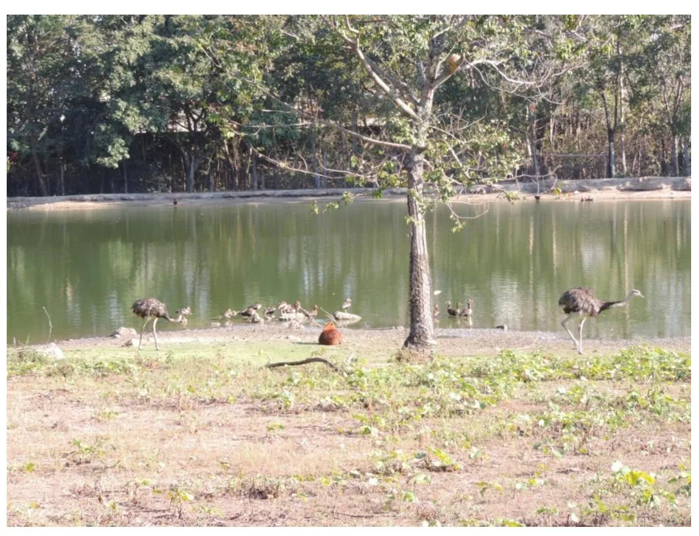
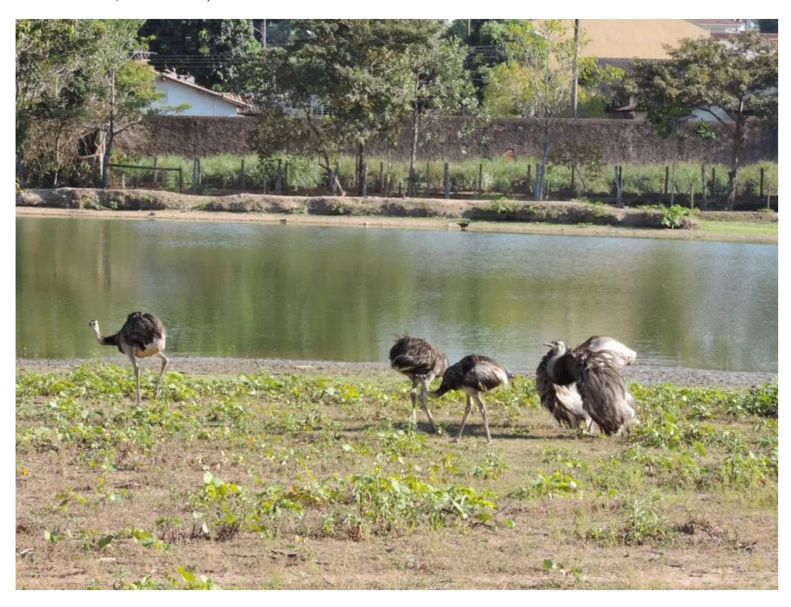
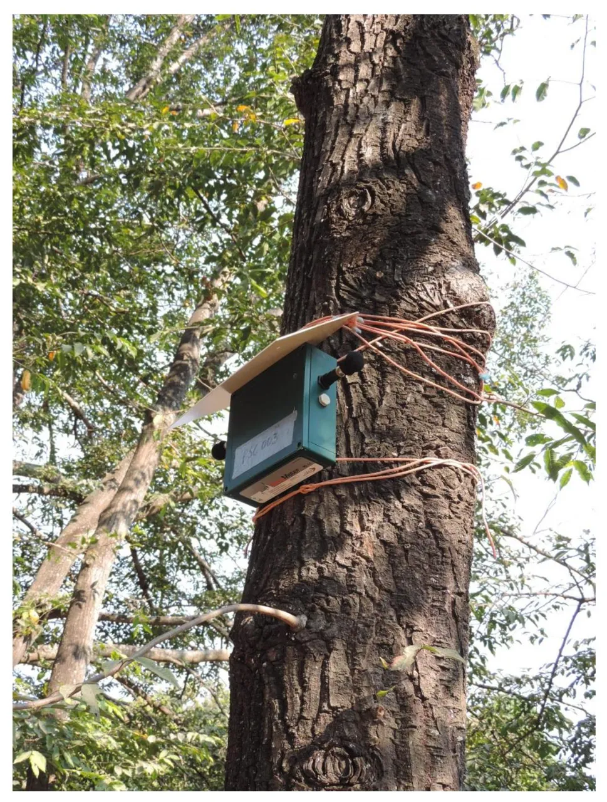

Supplemental Material S1.

Photo 1: A couple of Greater Rheas at UFMT Zoo (Photo: GPG, 27/07/2019, 7:26 a.m.)

Photo 2: A Greater Rhea male displaying near two females at UFMT Zoo (Photo: GPG, 27/07/2019, 7:29 a.m.)

Supplemental Material S2.

Location of the Song Meter SM2 recorder used to monitor the vocal behavior of the Greater Rhea at UFMT Zoo (Photo: GPG, 26/07/2019, 10:34 a.m.)

