content may change prior to final publication. Citation information: DOI 10.1109/ACCESS.2023.3341925

Date of publication xxxx 00, 0000, date of current version xxxx 00, 0000.

Digital Object Identifier 10.1109/ACCESS.2017.Doi Number

## Data-driven Strategy Decision Integrating Convolution Neural Network with Threat Assessment and Motion Prediction for Automatic Evasive Steering

## Jimin Lee 1 , AND Bongsob Song 1

- 1 Department of Mechanical Engineering, Ajou University, Suwon 16499, South Korea

Corresponding author: Bongsob Song (e-mail: bsong@ajou.ac.kr).

This work is supported by the Korean Agency for Infrastructure Technology Advancement grant funded by the Ministry of Land, Infrastructure and Transport (Grant RS-2022-00142565).

ABSTRACT In this paper, the strategy decision algorithm for automatic evasive steering (AES) integrating a convolution neural network (CNN) with a physics-based threat assessment is proposed. Five collision avoidance or mitigation strategies, including evasive steering, lane change, and steering to shoulder stop are considered for the strategy decision. Although there are many model-based or data-driven approaches for collision avoidance in the literature, a new decision method integrating data-driven classification based on CNN with both threat assessment and prediction techniques is proposed to improve reliability as well as accuracy. First, a set of abstracted images in a bird eye's view including the threat assessment and trajectory prediction information are generated. More specifically, a few collision indexes and interaction multiple model-unscented Kalman filter are used respectively for threat assessment and prediction. Once a stack of the images so called predicted semantic map corresponding to each collision avoidance strategy are generated, the decision classification based on CNN follows to choose an appropriate strategy for AES. Finally, the proposed decision algorithm is trained and validated through typical safe scenario data coming from field operation tests and safety-critical scenario data via simulations.

INDEX TERMS Automatic emergency steering (AES), collision avoidance, threat assessment, motion prediction, strategy classification

## I. INTRODUCTION

Active safety systems, such as automatic emergency braking (AEB), forward collision warning, and blind spot detection systems have been successfully introduced in the automotive market [1], [2]. Moreover, the advanced active safety systems, e.g., collision evasive lateral maneuvre systems (CELM), automatic emergency steering (AES) and minimal risk maneuver (MRM), have been developed and standardized [3]- [5]. At the same time, it is recently reported that there were fatal accidents of automated vehicles (AV) mainly due to sensor-related faults, i.e., malfunction in detection and classification [6], [7]. It is thus inevitable to consider collision avoidance and mitigation strategy in the system design stage for advanced active safety systems and AV [8].

There are numerous studies about collision avoidance and decision-making in the literature and they can be classified into twofold: model-based and data driven approaches. Since the physical model-based methods have been developed over three decades, it includes single-behavior threat metrics, optimization methods, formal methods, and probabilistic methods [9], [10]. Threat metrics such as Time-to-Collision (TTC), Time-to-Brake (TTB), Time-to-Line Crossing (TLC) are widely used for threat assessment. In addition, the minimum safety spacing (MSS) calculation has been used to determine collision-free lane changing [11]-[13]. However, it is also noted that most of threat assessment algorithms were validated in the specific scenarios and hazardous situations.

Also, some research studied the emergency steering system for with threat assessment methods [14]-[17]. However, not only does the literature focus on control or lateral stability rather than decision for emergency steering, but also the validation scenarios are limited to situations where the vehicle in front is either avoided or maintains a constant speed.

In data-driven approaches, reinforcement learning (RL) is recently applied for decision-making of lane changing and overtaking [18]-[20]. Since RL-based approaches are typically trained and tested in virtual simulation environments, it is limited to consider validation and performance improvement via real driving data. Another data-driven application is the prediction of the driving intention and/or vehicle trajectory with the Convolutional Neural Network (CNN). The vehicle prediction methods can be classified by input representation criterion: track history of the surrounding vehicles (SV) and ego vehicle, raw sensor data, and Simplified images in the Bird's Eye View (SBEV) [21]. The SBEV contextualize objects and the environment as lines and polygons while driving. This method is also referred to as rasterized or vectorized High-Definition (HD) maps [22, 23]. While the first and second approaches are in general sensitive to characteristics and performance of the environmental sensors, the SBEV approach may be more robust due to sensor fusion integrating the data coming from different sensors (e.g., radar, lidar, and camera) [22], [24]. With the advantage of the SBEV, a stacked set of current and past SBEV including lane mark and position of SVs are used as the network input to classify lane change intention [25]. Similarly, an extended version of the SBEV including both SVs and road infrastructure (e.g., route, crosswalk, lane) is adapted to predict the vehicle motion in the intersection [26], [27]. Furthermore, another version of the SBEV with occupancy, past trajectory and velocity was proposed to classify different scenarios such as overtaking, vehicle crossing, and leading vehicle ahead [22], [23].

Nevertheless, the information presented in the above studies is not sufficient to determine whether a vehicle is in a collision. Moreover, there are few data-driven threat assessment methods with applications of collision avoidance or automatic emergency steering. While crash risk of an ego vehicle and collision prediction is proposed in the literature, it is still limited to consider various scenarios and validate the algorithm via field operation test (FOT) dataset [28], [29].

In this paper, we propose the decision-making framework for the AES strategy integrating the SBEV and CNN approach with the physics-based approach including threat assessment and motion prediction. Furthermore, its validation and evaluation method are proposed to enhance diversity and complexity of scenario and/or dataset. The main contribution of this work are as follows:

- The integrated decision architecture for collision avoidance that combines deep learning (DL) networks with physics-based algorithms.
- A multi-layered SBEV, serving as a set of abstracted inputs from physics-based approaches, is employed as an input for a deep learning network to predict collision avoidance strategies.
- Our proposed decision-making algorithm was evaluated through safety-critical scenarios. The safety-critical

scenarios based on real accident statistics. The reliability of the algorithm is verified using real-driving data.

This paper is organized as follows: Section II gives the description of problem for previous collision avoidance algorithms. Section 3 introduces the integrated collision avoidance algorithm with the CNN, and Section IV presents performance of proposed algorithm via simulation and realroad data. Section V concludes this paper. The acronyms used in the paper are provided in Table 1.

## II. PROBLEM STATEMENT

It is necessary to consider both kinematics of SV and geometry of road to develop a decision-making algorithm of AES for collision avoidance and mitigation. It is shown in Fig. 1 that the ego vehicle drives in first lane and an adjacent heavy-duty vehicle follows the second lane. The ego vehicle is equipped with radar and vision sensors. Commercial radar and camera may have sensor noise or wrong measurement. For example, two tracks are detected on the adjacent truck. The wrong measurement may happen due to the larger size of the heavyduty vehicle compared to other vehicles as shown in Fig. 1. Longitudinal and lateral positions of the left track are 19 m and -1.74 m, respectively. Typically, the half of lane width on a highway is 1.8 m, which is close enough in the lateral direction. In addition, the relative speed is about -10 m/s, which can cause an accident in the longitudinal direction. This problem has the potential to trigger a false alarm in the collision avoidance algorithm.

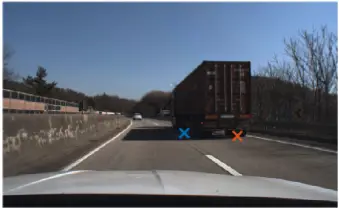

Figure 1. Defining the problem of decision for collision avoidance algorithm in real driving condition.

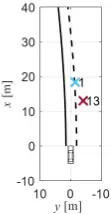

Table 1 Summary of acronyms

| Acronyms | Full Form                          |
| -------- | ---------------------------------- |
| AEB      | Automatic Emergency Braking        |
| AES      | Automatic Emergency Steering       |
| BEV      | Bird's Eyes View                   |
| CELM     | Collision Evasive Lateral Maneuvre |
| FOT      | Field Operation Test               |
| MSS      | Minimum Safety Space               |
| PSM      | Predictive Semantic Map            |
| TLC      | Time-to-Line Crossing              |
| TTB      | Time-to-Braking                    |
| TTC      | Time-to-Collision                  |

Fig. 2 illustrates two distinct scenarios: in Fig.2 (a), a vehicle abruptly cuts in from the left lane, leading to an accident, while in Fig. 2 (b), despite a similar cut-in action, no accident ensues. In both instances, the Automatic Emergency Braking (AEB) of the ego vehicle is engaged. As can be seen in the upper part of each of the Fig. 2 (a) and (b), in the preaccident situation, it is difficult to distinguish which scenario is the accident. However, due to the difference in relative speeds, the accident occurs in the lower part of Fig. 2 (a) and does not occur in Fig. 2 (b). In other words, it is difficult to determine the presence of an accident using SBEV including position and road geometry. It is essential to include additional information on the BEV to determine the potential for collision.

To solve these problems, we propose an integrated decision-making algorithm with physic-based method and convolution neural network. Furthermore, proposed algorithm that avoids an accident by selecting six avoidance strategies when it is determined that an accident is about to occur. That is, we define six collision avoidance or mitigation strategies as follows:

- Decelerating (DEC): decelerating of ego vehicle or activation of AEB.
- Evasive Steering to Left/Right Lane (ESL/ESR): evasive steering with allowable lateral deviation in in-lane.
- Emergency Lane Change to Left/Right Lane (ELCL/ ELCR): lane changing steering to the next left or right lane.
- Emergency Steering to Shoulder (ESS): lane changing to the shoulder if there is a shoulder on the road.

It is assumed that ego vehicle equips the AEB system, and it activated automatically regardless of the decision algorithm. Therefore, the decelerating strategy is not considered by the decision-making algorithm.

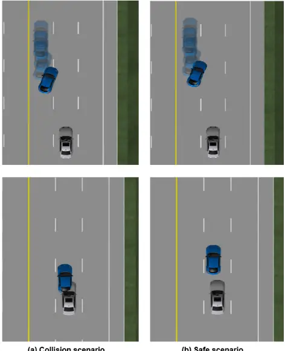

(a) Collision scenario

(b) Safe scenario

FIGURE 2. Defining the problem of Decision for collision avoidance in cutting-in scenarios.

## III. STARATEGY DECISION FOR AUTOMATIC EMERGENCY STEERING (AES)

The overall architecture of the decision-making algorithm is organized as shown in Fig. 3. This proposed algorithm is a combination of abstraction and classification. The abstraction consists of a static layer (e.g., road geometry and guard-rail), a dynamic layer (e.g., trajectory of ego and surrounding vehicles), and a meta layer (e.g., threat metrics and motion prediction). The abstraction module is divided into Semantic Map and stacked PSM (Predicted Semantic Map) components. For the Semantic Map component, an image is generated for each physics-based input, which is defined as a "layer." Subsequently, these individual layers are combined to generate the Semantic Map. In the stacked PSM component, individual PSMs are generated for each strategy based on avoidance strategies of ego vehicle. In Fig. 3, the first PSM combines layers to represent the current driving situation, and the empty red box, which represents the predicted position of the surrounding vehicle, contacts the black box (position of ego vehicle). In other words, if the current situation continues, a collision will occur. The subsequent figure illustrates a PSM that represents the ego vehicle's ELCR avoidance strategy. In this depiction, the ego vehicle's avoidance trajectory is shown the surrounding vehicle's relative position and does not contact. Additionally, the generated PSMs are termed as "Stacked PSM" and applied as input for the CNN. Finally, the deep learning-based decision algorithm determines collision avoidance strategies when there is a risk of collision.

FIGURE 3. Illustrative architecture of collision avoidance algorithm.

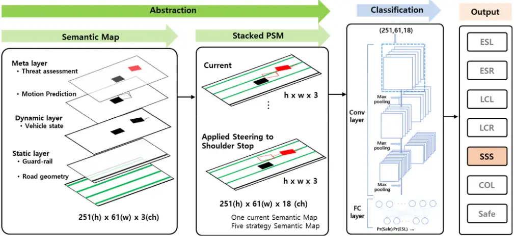

## A. ABSTRACTION FOR INTEGRATED DECISION

## 1) THREAT ASSESSMENT

One of the most used and straightforward longitudinal behavior threat metrics is the time-to-collision (TTC), which calculated with relative longitudinal distance x and velocity vx and can be expressed as TTC=x/vx. Similarly, based on correlation of relative lateral distance y and velocity vy, the time-to-line crossing (TLC), representing a lateral threat metric, is given by as TLC=y/vy. To consider for both longitudinal and lateral behaviors, a collision index is employed, which is calculated as follows [30]:

$$I _ { l o n g } = & \max \left ( \frac { x _ { \max } - x _ { p } } { x _ { \max } - x _ { t h } } , \frac { T T C } { T T C _ { t h } } \right ) \\ & + ( 1 ) ^ { ( 1 / 2 ) ( 1 / 2 ) } ( 1 ) ^ { ( 1 / 2 ) ( 1 / 2 ) }$$

$$I _ { l a t } = & \min ( I _ { l o n g } , 1 ) \cdot \min \left ( \frac { T L C _ { l h } } { t _ { T L C } } , 1 \right ) \\ \intertext { w h o r a } & \quad ( 2 )$$

$$\text {where} , & & R - d _ { b r } , \\ & x _ { p } = \frac { R - d _ { b r } } { d _ { w } - d _ { b r } } , \, d _ { w } = - \dot { R } \cdot t _ { d } + d _ { b r } , \\ & d _ { b r } = - \dot { R } \cdot t _ { b r } + \frac { v _ { A } ^ { 2 } - v _ { B } ^ { 2 } } { 2 a _ { x , \max } } \\$$

where,

where xmax, xth, TTCth and TLCth are design parameters and the mor detailed description may be referred to the reference and The collision index of surrounding vehicle is normalized to the [0; 255] and reflected in red channels of PSM.

## 2) MOTION PREDICTION

Many researchers have studied prediction for target vehicles, and various methods have been proposed [31,32]. Especially, vehicle prediction algorithms based on LSTM or HMM

become reliable for long term prediction. The proposed algorithm focuses on accident scenarios, which are sufficient for short term prediction. Furthermore, as can be seen in the literature, most algorithms perform similarly when the horizon time is two seconds or less. Therefore, we used a physicsbased algorithm as the Interaction Multiple Model Unscented Kalman Filter (IMM-UKF) that has similar performance and less computation. [33], [34]. This method utilizes a combination of multiple models to estimate the state of the target vehicle, which helps to improve the accuracy of the predictions. Two kinematic models, the constant velocity (CV) model and the constant turn rate and velocity (CTRV) model, are employed for motion prediction. The CV model is used for lane-keeping, and the CTRV model is suited for lane-changing maneuvers. The equation of the CV model is shown below:

$$f _ { 2 } = \underset { \Delta } { \text {maneuvers. The equation of the CV model is shown below:} } \\ \Gamma _ { \Delta } = x ^ { h , 1 } ( \ k + 1 ) = & f ( x ^ { h , 1 } ( \ k + 1 ) ) + w ^ { 1 } \\ \intertext { t . c . } f ( x ^ { h , 1 } ( \ k ) ) = & \left ( p _ { x } ( \ k ) + v ( \ k ) \cos ( \theta ( \ k ) ) \, T \right ) \\ f ( x ^ { h , 1 } ( \ k ) ) = & \left ( v ( \ k ) & & ( 4 )$$

Also, the equation of the CTRV model is represented as follows:

$$\text {which} \quad & \text {follows} \colon \\ \text {city } \nu _ { x } & \quad \\ \text {ed } \text { on } & \quad x ^ { h , 2 } ( k + 1 ) = f ( x ^ { h , 2 } ( k + 1 ) ) + w ^ { 2 } \\ \nu _ { y } , \text { the } & \quad f ( x ^ { h , 2 } ( k ) ) = \\ \text {threat} & \quad \left ( P _ { x } ( k ) + \frac { \nu ( k ) } { \omega ( k ) } ( - \cos ( \theta ( k ) + \omega ( k ) T ) ) + \cos ( \theta ( k ) ) \right ) \\ \text {dex } \text { is } & \quad \\ & \quad P _ { y } ( k ) + \frac { \nu ( k ) } { \omega ( k ) } ( \sin ( \theta ( k ) + \omega ( k ) T ) ) - \sin ( \theta ( k ) ) \\ & \quad v ( k ) \\ & \quad \theta ( k ) + \omega ( k ) T \\ ( 2 ) & \quad w ^ { 2 } \sim \mathcal { N } ( 0 , Q ) \\ & \quad w ^ { 2 } \sim \mathcal { N } ( 0 , Q ) \\ & \quad \left ( 5 \right ) \\ \text {where } x ^ { h } ( k ) , \, i = 1 , 2 \, \text { denote the elements of the surrounding } \\ \text {vehicle motion} \colon & \text {n} _ { p } , \, \nu _ { y } , \, \theta _ { \omega } , \, n _ { p } , \, \text {and } n _ { p } \, \text { represent the relative }$$

where x h (k), i =1,2 denote the elements of the surrounding vehicle motion: px, py, v, q, w. px and py represent the relative longitudinal and lateral position of the vehicle, respectively. v represents velocity and q, w correspond to the relative heading angle and yaw rate, respectively. w i , i=1,2 represents the process noise. The prediction horizon for the motion of surrounding vehicle s is chosen as 2 second and additional specifications and parameters related to the UKF can be found in [35], [36].

The strategies for collision avoidance are defined in Section II. The generated trajectories are based on lateral motion for lane change [24]. To avoid the high acceleration jerk, refer [24] suggests lane change motion with limited acceleration based on hyperbolic tangent path. However, this method is not considered roads with curvature. To compensate for limit, define the modified lane change trajectory as follows:

$$y _ { _ { d e s } } ( t ) = & C _ { 1 } \tanh ( \, C _ { _ { 2 } } t + C _ { _ { 3 } } ) + y _ { _ { 0 } } + y _ { _ { c } } ( t ) & & ( 6 )$$

where,

$$w h e r e , & & \text {where,} \\ & C \ C _ { 1 } = & \frac { M _ { t } - y _ { 0 } } { 2 } , C _ { 2 } - \sqrt { \frac { a _ { y , \text {lin} } } { a _ { y , 0 } C _ { 1 } } } , C _ { 3 } = & \frac { t _ { L C } } { 2 } \\ & t _ { L C } = & \frac { 2 } { C _ { 2 } } \tanh ^ { - 1 } \left ( \frac { M _ { t } - C _ { 1 } - y _ { 0 } } { C _ { 1 } } \right ) \\ & y _ { c } ( t ) = & a _ { 3 } x ( t ) \, ^ { 3 } + a _ { 2 } x ( t ) \, ^ { 2 } + a _ { 1 } x ( t ) \, , \quad M _ { t } = W - W _ { \nu } - \varepsilon \\ & \text {where,} \ M _ { t } \text { is  maximum allowable lateral movement, } y _ { c } \text { is}$$

where, Mt is maximum allowable lateral movement, yc is lateral movement by curvature, respectively and ay,lim and ay,0 limited lateral acceleration of lane change and lateral acceleration of ego vehicle, respectively.

Fig. 4 shows how to generate trajectories based on the road environment. The trajectories of the different strategies are applied to the trajectories of the surrounding vehicles on the PSM to check for collisions. As shown in Fig. 5, it is difficult to intuitively determine if avoidance is possible when the predicted trajectory of surrounding vehicle and the ego vehicle are concurrently presented on the BEV. For this purpose, the predicted trajectory of the surrounding vehicle is modified by converting its relative coordinates of the ego trajectory:

$$y p _ { r e l , i } = y p _ { t a r , i } - y p _ { e g o , i }$$

where subscript i=1, …, 10 represents the predictive time horizon, xprel and yprel are modified trajectory of the surrounding vehicles and subscript tar and ego denote the predicted trajectory of surrounding and ego vehicle, respectively.

As depicted in Fig. 5, with the modified trajectory, the BEV confirms that a collision does not occur.

Figure 4. Trajectory Generation for Evasive Steering Strategy.

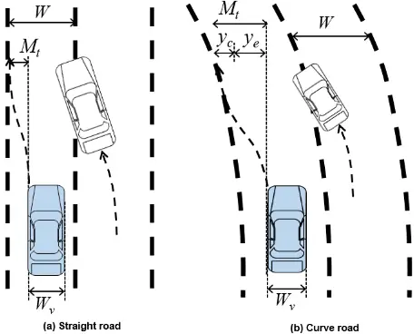

Figure 5. Coordinate transformation for predicted trajectory.

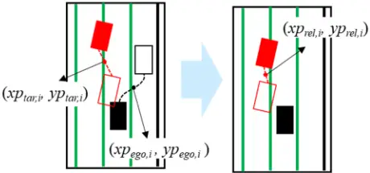

(a) Current driving situation

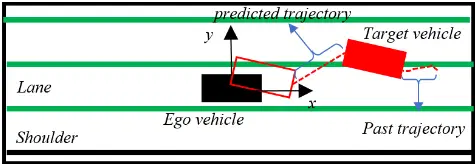

(b) Driving situation with ESR

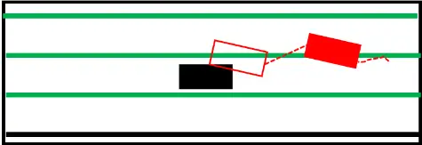

(c) Driving situation with ESS

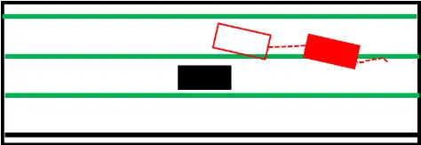

FIGURE 6. Example of stacked PSM.

## 4) STACKED PSM

To represent the vehicles and environment, we generate the PSM image with h x w x 3. In the PSM, h and w denote the height and width, which are 251 pixels and 61 pixels, respectively. When translated to physical dimensions, these values correspond to 50 meters and 12 meters, with a conversion rate of 0.2 meters per pixel. The road geometry, such as lanes and guardrails, are represented by green and black lines, respectively, forming the static layer in Fig. 6. For the dynamic layer, the positions of ego and surrounding vehicles are marked as black box corresponding to the size of each vehicle. The past trajectories of surrounding vehicles are illustrated using the black dash lines. The predicted motion of surrounding vehicles and their finite positions are shown with dot lines and boxes. Also, the risk of surrounding vehicles is represented by the R channel, with the intensity of luminance indicates the level of risk, as determined by the threat assessment algorithm. Subsequently, the predicted trajectory is modified by each strategy of the ego vehicle, and the PSMs generated for each strategy are applied as an input into the CNN. Therefore, Six PSMs are stacked, which includes five PSMs for each individual strategy and one PSM representing the current situation. Fig. 6 presents a representative case of stacked PSMs corresponding to each strategy. This example illustrates a scenario where a surrounding vehicle cuts in from the left lane into the lane of ego vehicle. Fig. 6 (a) displays the current driving situation in the absence of any avoidance strategy. In contrast, Fig. 6 (b) and (c) illustrate driving situations where the target vehicle's trajectory reflects the ESR and ESS avoidance strategies of the ego vehicle, respectively. In Fig. 6 (a) and (b), the ego vehicle and predicted trajectories of surrounding vehicle overlap in PSM, which indicates a collision. On the other hand, as shown in Fig. 6 (c), the collision can be avoided by selecting the ELCR strategy.

## C. CLASSIFICATION FOR DECISION-MAKING

Fig. 7 illustrates the structure of the CNN architecture for the classification used in this study. As depicted in the figure, our network has 3 convolutional layers followed by 1 fully connected layer. The convolutional layers perform each 3 x 3 filters and have rectified linear unit (ReLU) activation. each convolutional layer has 8, 16, and 32 filters, respectively. Before the fully connected layer, dropout layer is inserted to avoid the overfitting. The fully connected layer uses the softmax function to select the strategy with probability distribution for the seven classes. The classes are denoted as:

$$d i s t u n b o l \, & \text {for the seven classes.} \ \text {the classes are denoted as.} \\ y _ { t } ^ { h } = & f \left ( x _ { t } | W \right ) \\ & x _ { t } \in \{ 0 , 1 \} ^ { h \times w \times c } , \, y _ { t } ^ { h } \in \left [ 0 , 1 \right ] ^ { 7 } , \, \sum _ { j = 1 } ^ { 7 } y _ { t } ^ { h , j } = 1 \\ & \quad ; \quad y _ { t } ^ { h } \colon =$$

where xt is the input image with dimensions h x w x c. h(height), w(width), and c(channel) are 251, 61, and 18, respectively. y h is the probability distribution of strategies: safe, ESL, ESR, ELCL, ELCR, ESS, collision.

We used a cross-entropy loss function to obtain the weights and included an L2 regulation term to avoid over-fitting. The loss function defined as follows:

$$\sqrt { \ t } = 1 \ j = 1$$

where y and y h are ground-truth and predicted strategy at time t, respectively. l is a weight for regulation and K is the number of strategies.

The predicted strategy st corresponds to the index of y h with the maximum probability as follows:

$$s _ { t } = \arg \max _ { j } \, y _ { t } ^ { h , j }$$

The proposed CNN-based model is trained using a stochastic gradient method with a learning rate of 0.01 every

10 thousand iterations. The batch size of 100 and trained with 150 epochs.

FIGURE 7. Network architecture.

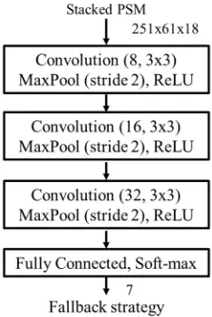

FIGURE 8. Test vehicle.

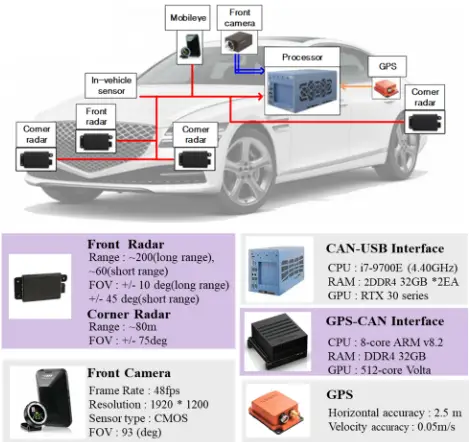

FIGURE 9. Test site and high-definition map.

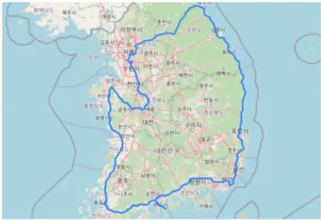

## IV. VALIDATION AND EVALUATION

In this section, the proposed algorithm was evaluated by simulation based on driving scenarios and field data. Safetycritical concrete scenarios were reconstructed by CarMaker. The concrete scenario comprises 5,750 collision scenarios and 10,680 safe scenarios. Furthermore, the robustness to sensor noise and wrong measurement is verified by experimental data collected from highway driving scenarios. in Section IV. C.

## A. DATA SET

## 1) FIELD OPERATION TEST (FOT)

The data for evaluation of the proposed algorithm were acquired by test vehicle with environmental sensors (in Fig. 8). We used front and corner radar sensors to detect surrounding vehicles. To collect the data about lane and global position, front vision system and low-cost GPS (horizontal accuracy: 1.0m) were equipped on the test vehicle. All sensor data were synchronized and acquired on an industrial PC with Intel i7 CPU@2.6GHz and RAM@64GB. The data for this study were collected about 948 km, 9.5 hours of real traffic from a test vehicle driving on eight highways in South Korea. The driving route for the data acquisition is highlighted in blue color on a satellite map in Fig. 9.

## 2) SIMULATION OF SAFETY-CRITICAL SCENARIOS

Imminent collision (or Safety-critical) scenarios are seldom encountered in real test driving. Choosing relevant scenarios from numerous cases is challenging. Furthermore, because the performance of automatic evasive steering systems can vary based on test scenarios, it's crucial to define a specific set of scenarios, termed a "scenario catalog," for the development and evaluation of AES [24].

In this study, four unsafe logical scenarios based on the fatal accident analysis on Korean road are chosen as the scenario catalog and their schematics are shown in the form of IGLAD in Table 2 [37], [38]. Assuming the ego vehicle maintains lane-keeping, the behaviors of the target vehicle (TV) include lane-following, stopping (or remaining stationary), cut-in, and cut-out. It is also necessary to consider both road environments and dynamics of surrounding vehicles (SV). Among many elements of the road environment, road geometry such as straight, curved, and existence of shoulders are considered as shown in Table 2. Consequently, eight logical scenarios are generated by combination of the three safety-critical scenarios and two road environments. Furthermore, 16,430 concrete scenarios are considered for development and validation of AES in this study. For the given concrete scenarios, the ground-truth is essential for the training and validation of datadriven based collision avoidance algorithm. The annotation process is based on worst-case analysis. Fig. 10 illustrates the hierarchical assignment of annotation based on the prioritization of strategies. The priority of the strategy is determined according to the sequence shown in Fig. 10 with the aim of reducing the incidence of secondary accidents. First, it checks the lateral position (yrel) of the target vehicle to determine the direction. A positive value denotes a position to the left of the ego vehicle, and this value subsequently determines the avoidance strategies opposite the position. Afterwards, the apply the ESX and ELCX sequentially to determine if an avoidance strategy exists. If the lateral position of target vehicle is on the left side of the ego vehicle and the ESR strategy is unable to avoid the target, it checks whether the shoulder is detected. If shoulder is detected, it then verifies whether the ESS strategy avoids the accident. Finally, if it is impossible to avoid a collision using any of the strategies, the concrete scenario is labeled as a collision.

Fig. 11 (a) and (b) show the result of the annotation for scenarios with straight road and road geometries like curves and the presence of guardrails. The annotation of scenarios involving cut-in and stopped vehicles exhibits a similar distribution concerning straight roads and road geometry. The lane-following scenario with road geometry has a smaller safety ratio, as shown in Fig. 11 (b), which shows the groundtruth variations of the scenario with road geometry.

Table 2. Scenario catalog and road geometry

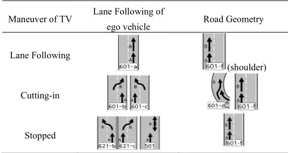

FIGURE 10. Flowchart for annotation.

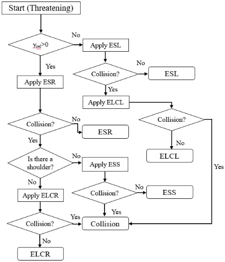

(a) Straight Road

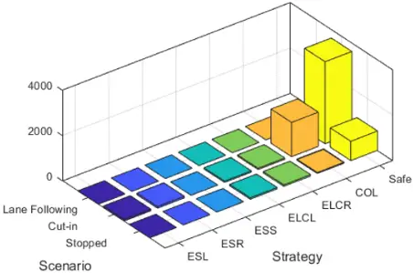

FIGURE 11. Distribution of scenarios and annotation.

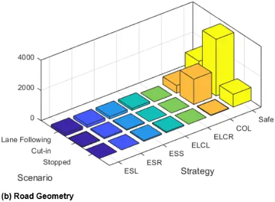

## B. PERFORMANCE ANALYSIS

## 1) SIMULATION DATA

The proposed collision avoidance algorithm is compared with results from two physic-based algorithms and CNN-based inference algorithms [12],[25],[30]. First, emergency avoidance decision making algorithm is based on minimum safety spacing (MSS) for quick lane changing and braking. The calculation of MSS is well-known method for both mandatory lane change (MLC) and discretionary lane change (DLC) [9-11]. Also, we additionally conducted a comparison with a collision avoidance algorithm that utilizes a collision index-based method as input for the meta-layer within the semantic map. The CNN with simplified bird's eyes views (SBEV) method, which is proposed for intention prediction of surrounding vehicles and modify into a collision avoidance algorithm. To classify the ESS, traffic infrastructure in static layer adds on original SBV [25]. Additionally, the output of the classification has been modified for collision avoidance strategies as outlined in equation (7). Also, we omitted the comparison of performance with and without motion prediction because only a single semantic map is generated when motion prediction is not included.

The collision scenarios are labeled with avoidance strategies or collision for each concrete scenario using the method mentioned in Section IV. A. For training and testing, we randomly divide 80% and 20% of the concrete scenarios. In Section IV. B, we use the 16,430 of the safety-critical concrete scenarios to evaluate the decision-making algorithm. The metric for performance evaluation of decision-making use prediction time, accuracy, false positive rate and weighted F1 score. First, the prediction time tp serves as a metric to evaluate the performance of the decision-making prediction capability as follows [39]:

$$t _ { p } = t _ { c } - t _ { d }$$

where tc represents the moment when a collision occurs between the target vehicle and the ego vehicle and td is represents the moment of decision regarding the collision within the algorithm.

The metrics for the evaluation are as follows:

- True positive (TP): the label for the scenario is not " safe," and the algorithm predicts a strategy as same the label within 0.6 seconds prior the tim.
- True Negative (TN): the scenario is labeled as "safe," and the algorithm does not decide the any strategy.
- False positive (FP): the label assigned to the scenario is not "safe,"
- 1. The result of algorithm is not a strategy as same the assigned label of the scenario.
- 2. The result of the algorithm is a strategy with the same label as the following but does not satisfy the following conditions.

$$t _ { l o w e r } < t _ { p } < t _ { u p p e r }$$

where tupper and tlower respectively, denote the upper and lower limit of prediction time. For this study, tupper of 1.5s and tlower of 0.6s are used.

- False Negative (FN): The label assigned to the scenario is "safe," and the algorithm always predicts the safe in concrete scenario.

For a fair evaluation, in Table 3, we present the accuracy (ACU), false positive rate (FPR), weighted F1 score (wF) and prediction time (tp) with confusion matrix. the ACU, FPR and wF are define as

$$e \text { as } & & & & & T P + T N \\ & A C U = \frac { T P + T N } { T P + T N + F P + F N } \\ & F P R = \frac { F P } { F P + T N } \\ & w F = \frac { 2 T N } { 2 T N + F P + F N }$$

and reader can refer to [20], [34] for the detail of the performance metrics.

Table 3 performance evaluation for simulation data

| Algorithm                         | ACU (%) | FPR (%) | wF (%) | td (s) |
| --------------------------------- | ------- | ------- | ------ | ------ |
| Collision index-based method [30] | 72.1    | 26.5    | 80.4   | 0.75   |
| MSS-based method [12]             | 72.3    | 37.5    | 72.0   | 0.91   |
| CNN with SBEV [25]                | 84.7    | 18.6    | 81.0   | 1.14   |
| CNN with stacked PSM              | 94.4    | 14.7    | 92     | 1.03   |

(a) Safe scenario (t= 10.66s)

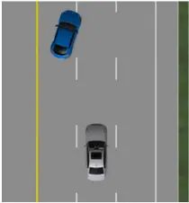

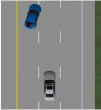

(b) Safe scenario (t= 12.30s)

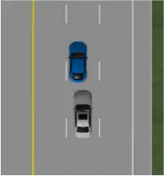

(c) Collision scenario (t= 8.06s)

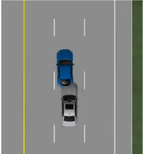

(d) Collision scenario (t= 8.73s)

FIGURE 12. Snapshot for cut-in from the left lane scenarios.

Safe Table 3 provides the performance evaluation results of different approaches. In comparison to the collision indexbased method, MSS-based method and the SBEV method, the accuracy of the proposed method has improved by 23%, 22% and 10%, respectively. The False Positive Rate (FPR), indicating the rate of false alarms, exhibited the lowest results when compared to other methods. Regarding prediction time, there is an approximate difference of 0.1 seconds between the proposed method and the MSS method, with the SBEV method being the earliest.

FIGURE 13. Comparision of decision results for safe scenario.

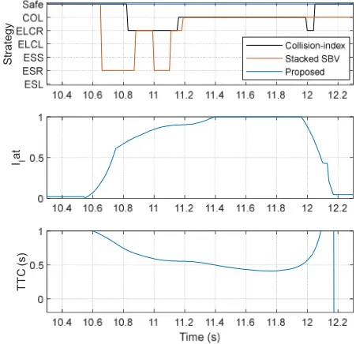

Table 4 shows the quantitative results of the algorithm for each safety-critical scenario. The performance of the proposed algorithm demonstrates the highest accuracy across all scenarios. The accuracy of CNN-based methods is better than that of physics-based methods in cut-in and stopped scenarios, while the SBV-based method has the lowest accuracy in lanekeeping scenarios.

Fig. 12 (a) to (d) illustrate safety-critical scenarios. The first scenario depicts a target vehicle cuts in without causing a collision in Fig. 12 (a) and (b), while the second scenario shows a collision occurrence in Fig. 12 (c) and (d). Fig. 13 shows the results for the decision-making with the proposed algorithm, SBEV-based algorithm, and collision index-based algorithm. As shown in the figure, the proposed method consistently determines it as safe, whereas the SBEV-based method and collision index-based method indicate the decision result as either an avoidance strategy or a collision. In this case, the proposed algorithm is improved comparing to the other methods.

Fig. 14 (a) illustrates that an instance where the stacked SBV algorithm triggers a false alarm due to the cut-in actions of the target vehicle, and Fig. 14 (b) depicts the situation where the distance between the ego vehicle and the target vehicle is at its minimum. When the target vehicle crosses the left lane at t = 10.66s, the results of stacked PSM based algorithm select the ESR (Evasive Steering to Right) as shown in Fig. 14 (a).

Also, when two vehicles are closest in distance at t = 12.3s, the decision results in a misjudgment. Fig. 14 (b) shows the SBEV image at the same time. In contrast, Fig. 14 (c) depicts the PSM in the current situation, where the decision results are safe because the ego vehicle does not make contact with the trajectory of the target vehicle. As the distance to the target vehicle decreases, the risk level increases. In Fig. 14 (d) on the PSM, the color of the target vehicle has changed to red. However, the predicted trajectory of the target vehicle does not encroach on the ego vehicle.

Other results of the target vehicle cutting-in from the left lane scenario with a collision are shown in Fig. 12 (c) and (d). As shown in the Fig. 15 (a), Both SBEV-based and proposed algorithms select the ESR strategy at approximately 8.03 seconds, just 0.7 seconds before the collision occurs. The collision index-based algorithm selects a strategy slightly later than the other two algorithms and the decision of an accident is unavoidable is selected relatively quickly.

Table 4 performance evaluation for simulation data

| Safety-critical scenario | ACU (%) - Physic-based method - Collision index-based method [30] | ACU (%) - Physic-based method - MSS-based method [12] | ACU (%) - CNN-based method - CNN with SBEV [25] | ACU (%) - CNN-based method - CNN with stacked PSM |
| ------------------------ | ----------------------------------------------------------------- | ----------------------------------------------------- | ----------------------------------------------- | ------------------------------------------------- |
| Lane Following           | 82.4                                                              | 80.6                                                  | 77.3                                            | 90.5                                              |
| Cutting-in               | 64.8                                                              | 76.0                                                  | 92.8                                            | 96.5                                              |
| Stopped                  | 91.3                                                              | 92.4                                                  | 96.2                                            | 97.6                                              |

FIGURE 14. Comparison of abstraction results for safe scenario.

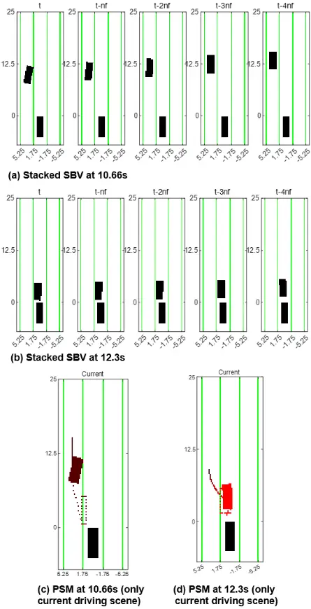

As shown in the Fig. 15 (b), the predicted trajectories of the target vehicle and the ego vehicle are in contact, and it is determined that avoidance is necessary. The strategies that do not contact the predicted trajectory are ESR and ELCR. The ESR strategy is selected according to the predefined priority among the two strategies. In this scenario, the collision time is 8.73 seconds. Both the SBEV-based and proposed algorithms determine that they cannot avoid the accident, with 0.19 seconds and 0.48 seconds remaining, respectively. As shown in Fig. 15 (c), in this case, none of the strategies in the PSM can be avoided. Also, The SBEV-based algorithm alternately selects ESR and ELCR until the collision, whereas the proposed algorithm maintains a consistent decision throughout the scenario.

FIGURE 15. Comparison of collision avoidance results in safety-critical scenario with collision.

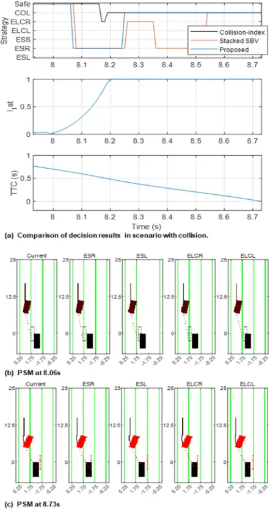

## 2) REAL ROAD DATA

We also validated the proposed algorithm via test vehicle were collected by driving in highway in real-world. The performance evaluation of the proposed algorithm and other algorithms is summarized in Table 5. The proposed algorithm performs better than other methods in ACC, FPR and wF.

IEEEAcceSS

In Fig. 16, the ego vehicle follows the first lane and adjacent heavy-duty truck drives in second lane. The longitudinal and lateral positions of the left track are recorded at 19 meters and -1.74 meters, respectively. Given that the typical half-width of a highway lane is approximately 1.8 meters, these measurements suggest proximity in the lateral aspect. Furthermore, a relative speed of approximately -10 m/s indicates a potential hazard for an accident longitudinally. The ego vehicle detects a new track on the left side of the adjacent heavy-duty truck at 85s. The decision results of proposed and MSS based method are shows in Fig. 17. As illustrated in the figure, the proposed method decides it as safe, while the MSSbased method select the ELCL strategy. Also, the minimum safe space can be calculated as:

$$M S S = \frac { ( \ v _ { e g o } - v _ { t \arg e t } ) ^ { 2 } } { 2 a _ { x , \max } } + v _ { e g o } \cdot \tau _ { b r k } \quad ( 1 1 )$$

where ax,max and tbrk are the maximum deceleration of ego vehicle and the dynamic response time of brake system.

The MSS is determined to be approximately 20 meters based on the relative velocity of the track and the velocity of the ego vehicle at 85.6s. The magnitude of the relative longitudinal position (about 20m) is less than the minimum safety space as depicted in Fig. 17. In contrast to proposed algorithm, the MSS-based algorithm results in a false alarm. The proposed algorithm also compares the collision with the predicted trajectory of all surrounding vehicles in the PSM. Therefore, it can operate without target selection. As shown on the right side in Fig. 16, despite the new track is recognized, predicted trajectory of new track (blue track of frontal vehicle) does not contact the ego vehicle. It also does not conflict with the predicted trajectory of the maintained track (red track of frontal vehicle) and the decision result is safe.

FIGURE 16. Snapshot and PSM image at 85.6s

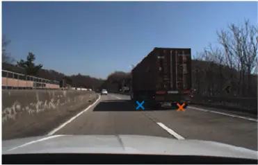

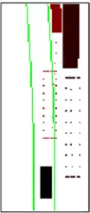

Table 5 performance evaluation for simulation data

| Algorithm                         | ACU (%) | FPR (%) | wF (%) |
| --------------------------------- | ------- | ------- | ------ |
| Collision index-based method [30] | 77.8    | 26.5    | 87.5   |
| MSS-based method [12]             | 86.3    | 13.7    | 92.6   |
| CNN with SBEV [25]                | 73.8    | 26.1    | 84.9   |
| CNN with stacked PSM              | 92.7    | 7.3     | 96.2   |

FIGURE 17. Comparison of collision avoidance results in highway data

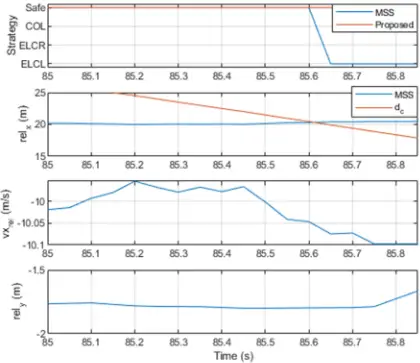

## V. CONCLUSIONS

In this paper, we have presented the integration of data-driven decision-making with convolutional neural networks and threat assessment for the development of automatic evasive steering systems. The proposed methodology involves data collection, motion prediction, threat assessment, abstraction, and data-driven decision-making. The CNN-based decisionmaking algorithm is integrated with a physics-based method, which handles motion prediction and threat assessment through abstraction. The results showed precise decision accuracy and the moment of decision, which confirmed that the performance of the proposed algorithm is higher than other algorithms. Furthermore, by evaluating it with simulation and real-world data, the proposed algorithm was able to verify not only its performance in collision scenarios, but also its applicability in real-time. Future work for the decision-making algorithm improves the classifier using the Recurrent Neural Networks (RNN) such as LSTM or RL-based architecture. Also, the exploration of combinations of physics-based inputs will advance the abstraction.

## REFERENCES

- [1] S.G. Shin, D.R. Ahn, Y.S. Baek, and H.-K. Lee, "Adaptive AEB Control Strategy for Collision Avoidance Including Rear Vehicles," in 2019 IEEE Intelligent Transportation Systems Conference (ITSC), Auckland, New Zealand: IEEE, Oct. 2019, pp. 2872-2878.
- [2] S. Yoon, H. Jeon, and D. Kum, "Predictive Cruise Control Using Radial Basis Function Network-Based Vehicle Motion Prediction and Chance Constrained Model Predictive Control," IEEE Trans. Intell. Transport. Syst., vol. 20, no. 10, pp. 3832-3843, Oct. 2019.
- [3] Intelligent transport systems - Collision evasive lateral manoeuvre systems (CELM) - Performance requirements and test procedures, Standard ISO/CD23375, International Organization for Standardization, 2023.
- [4] Euro NCAP 2025 Roadmap; Available online: https://cdn.euroncap.com/media/30700/euroncaproadmap2025v4.pdf
- [5] Euro NCAP vision 2030: A Safer Future for Mobility. Available online: https://cdn.euroncap.com/media/74468/euro-ncap-roadmapvision-2030.pdf
- [6] "Rear-End Collision Between a Car Operating with Advanced Driver Assistance Systems and a Stationary Fire Truck, Culver City, California, January 22, 2018," 2018.

- [7] Taxonomy and Definitions for Terms Related to Driving Automation Systems for on-Road Motor Vehicles, Standard SAE j3016, SAE, Geneva, CH, Apr. 2021.
- [8] J. Dahl, G. R. De Campos, C. Olsson, and J. Fredriksson, "Collision Avoidance: A Literature Review on Threat-Assessment Techniques," IEEE Trans. Intell. Veh., vol. 4, no. 1, pp. 101-113, Mar. 2019.
- [9] G. Li et al., "Risk assessment based collision avoidance decisionmaking for autonomous vehicles in multi-scenarios," Transportation Research Part C: Emerging Technologies, vol. 122, p. 102820, Jan. 2021
- [10] H. Jula, E. B. Kosmatopoulos, and P. A. Ioannou, "Collision avoidance analysis for lane changing and merging," IEEE Trans. Veh. Technol., vol. 49, no. 6, pp. 2295-2308, Nov. 2000.
- [11] R. Dang, J. Wang, S. E. Li, and K. Li, "Coordinated Adaptive Cruise Control System With Lane-Change Assistance," IEEE Trans. Intell. Transport. Syst., vol. 16, no. 5, pp. 2373-2383, Oct. 2015.
- [12] Zhang, L. Zhang, C. Wang, M. Wang, D. Cao, and Z. Wang, "Integrated Decision Making and Motion Control for Autonomous Emergency Avoidance Based on Driving Primitives Transition," IEEE Trans. Veh. Technol., vol. 72, no. 4, pp. 4207-4221, Apr. 2023.
- [13] X. Xu, L. Zuo, X. Li, L. Qian, J. Ren, and Z. Sun, "A Reinforcement Learning Approach to Autonomous Decision Making of Intelligent Vehicles on Highways," IEEE Trans. Syst. Man Cybern, Syst., pp. 114, 2019.
- [14] M. Ammour, R. Orjuela, and M. Basset, "A MPC Combined Decision Making and Trajectory Planning for Autonomous Vehicle Collision Avoidance," IEEE Trans. Intell. Transport. Syst., vol. 23, no. 12, pp. 24805-24817, Dec. 2022.
- [15] S. Cheng, L. Li, H.-Q. Guo, Z.-G. Chen, and P. Song, "Longitudinal Collision Avoidance and Lateral Stability Adaptive Control System Based on MPC of Autonomous Vehicles," IEEE Trans. Intell. Transport. Syst., vol. 21, no. 6, pp. 2376-2385, Jun. 2020.
- [16] J. Ji, A. Khajepour, W. W. Melek, and Y. Huang, "Path Planning and Tracking for Vehicle Collision Avoidance Based on Model Predictive Control With Multi-constraints," IEEE Trans. Veh. Technol., vol. 66, no. 2, pp. 952-964, Feb. 2017.
- [17] Y. Chen, S. Chen, H. Ren, Z. Gao, and Z. Liu, "Path Tracking and Handling Stability Control Strategy With Collision Avoidance for the Autonomous Vehicle Under Extreme Conditions," IEEE Trans. Veh. Technol., vol. 69, no. 12, pp. 14602-14617, Dec. 2020.
- [18] J. Liao, T. Liu, X. Tang, X. Mu, B. Huang, and D. Cao, "DecisionMaking Strategy on Highway for Autonomous Vehicles Using Deep Reinforcement Learning," IEEE Access, vol. 8, pp. 177804-177814, 2020.
- [19] J. Wang, Q. Zhang, D. Zhao, and Y. Chen, "Lane Change Decisionmaking through Deep Reinforcement Learning with Rule-based Constraints." arXiv, Apr. 01, 2019. Accessed: Aug. 24, 2023.
- [20] B. R. Kiran et al., "Deep Reinforcement Learning for Autonomous Driving: A Survey." arXiv, Jan. 23, 2021. Accessed: Aug. 24, 2023.
- [21] S. Mozaffari, O. Y. Al-Jarrah, M. Dianati, P. Jennings, and A. Mouzakitis, "Deep Learning-Based Vehicle Behavior Prediction for Autonomous Driving Applications: A Review," IEEE Trans. Intell. Transport. Syst., vol. 23, no. 1, pp. 33-47, Jan. 2022.
- [22] H. Cui et al., "Multimodal Trajectory Predictions for Autonomous Driving using Deep Convolutional Networks," in 2019 International Conference on Robotics and Automation (ICRA), Montreal, QC, Canada: IEEE, May 2019, pp. 2090-2096.
- [23] N. Djuric et al., "Uncertainty-aware Short-term Motion Prediction of Traffic Actors for Autonomous Driving," in 2020 IEEE Winter Conference on Applications of Computer Vision (WACV), Snowmass Village, CO, USA: IEEE, Mar. 2020, pp. 2084-2093.
- [24] K. Yi and B. Song, "Automated Driving Vehicles," in Vehicle Dynamics: Fundamentals and Ultimate Trends, B. Lenzo, Ed., Cham: Springer International Publishing, 2022, pp. 289-387
- [25] D. Lee, Y. P. Kwon, S. McMains, and J. K. Hedrick, "Convolution neural network-based lane change intention prediction of surrounding vehicles for ACC," in 2017 IEEE 20th International Conference on Intelligent Transportation Systems (ITSC), Yokohama: IEEE, Oct. 2017, pp. 1-6.
- [26] R. Gruner, P. Henzler, G. Hinz, C. Eckstein, and A. Knoll, "Spatiotemporal representation of driving scenarios and classification

21. using neural networks," in 2017 IEEE Intelligent Vehicles Symposium (IV), Los Angeles, CA, USA: IEEE, Jun. 2017, pp. 1782-1788.

- [27] N. Harmening, M. Biloš, and S. Günnemann, "Deep Representation Learning and Clustering of Traffic Scenarios." arXiv, Jul. 15, 2020. Accessed: Aug. 24, 2023.
- [28] X. Wang, J. Liu, T. Qiu, C. Mu, C. Chen, and P. Zhou, "A Real-Time Collision Prediction Mechanism with Deep Learning for Intelligent Transportation System," IEEE Trans. Veh. Technol., vol. 69, no. 9, pp. 9497-9508, Sep. 2020.
- [29] S. Cheng, B. Yang, Z. Wang, and K. Nakano, "Spatio-Temporal Image Representation and Deep-Learning-Based Decision Framework for Automated Vehicles," IEEE Trans. Intell. Transport. Syst., vol. 23, no. 12, pp. 24866-24875, Dec. 2022
- [30] K. Kim, "Predicted Potential Risk-Based Vehicle Motion Control of Automated Vehicles for Integrated Risk Management," Ph. D. dissertation, Seoul National University: Seoul, Korea, 2016.
- [31] N. Deo, A. Rangesh, and M. M. Trivedi, "How would surround vehicles move? A Unified Framework for Maneuver Classification and Motion Prediction," IEEE Trans. Intell. Veh., vol. 3, no. 2, pp. 129-140, Jun. 2018.
- [32] S. Mukherjee, S. Wang, and A. Wallace, "Interacting Vehicle Trajectory Prediction with Convolutional Recurrent Neural Networks," in 2020 IEEE International Conference on Robotics and Automation (ICRA), Paris, France: IEEE, May 2020, pp. 4336-4342.
- [33] R. Toledo-Moreo and M. A. Zamora-Izquierdo, "IMM-Based LaneChange Prediction in Highways With Low-Cost GPS/INS," IEEE Trans. Intell. Transport. Syst., vol. 10, no. 1, pp. 180-185, Mar. 2009.
- [34] K. Jo, K. Chu, K. Lee, and M. Sunwoo, "Integration of multiple vehicle models with an IMM filter for vehicle localization," in 2010 IEEE Intelligent Vehicles Symposium, La Jolla, CA, USA: IEEE, Jun. 2010, pp. 746-751.
- [35] D. Lee, C. Liu, and J. K. Hedrick, "Interacting multiple model-based human motion prediction for motion planning of companion robots," in 2015 IEEE International Symposium on Safety, Security, and Rescue Robotics (SSRR), West Lafayette, IN, USA: IEEE, Oct. 2015, pp. 1-7.
- [36] Q. Xu, X. Li, and C.-Y. Chan, "A cost-effective vehicle localization solution using an interacting multiple model- unscented Kalman filters (IMM-UKF) algorithm and grey neural network," Sensors, vol. 17, no. 6, p. 1431, 2017.
- [37] Korea Road Traffic Authority, Traffic Accident Analysis System, 2016, http://taas.koroad.or.kr/.
- [38] IGLAD, IGLAD codebook, 2019, http://www.iglad.net.
- [39] R. Song and B. Li, "Surrounding Vehicles' Lane Change Maneuver Prediction and Detection for Intelligent Vehicles: A Comprehensive Review," IEEE Trans. Intell. Transport. Syst., vol. 23, no. 7, pp. 60466062, Jul. 2022.

Jimin Lee received the B.S. and M.S. degree in mechanical engineering from Ajou University, Suwon, South Korea, in 2013, 2015, respectively, where he is currently pursuing the Ph.D. degree in mechanical engineering.

His research interests include decision-making, threat assessment, automated vehicle control, and collision avoidance systems.

Bongsob Song received the B.S. degree in mechanical engineering from Hanyang University, Seoul, South Korea, in 1996 and the M.S. and Ph. D degrees in mechanical engineering from University of California, Berkeley, CA, USA, in 1999 and 2002, respectively.

He was a Research Engineer with the California Partners for Advanced Transit and Highways Program, UC Berkeley, until 2003. He is a professor at the Department of Mechanical

Engineering, Ajou University, Suwon, Korea. His research interests include sensor fusion, convex optimization, collision avoidance, and threat assessment with applications to intelligent vehicles.
