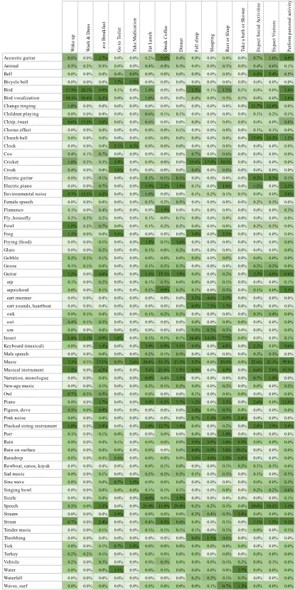
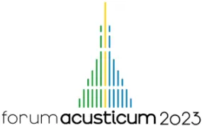
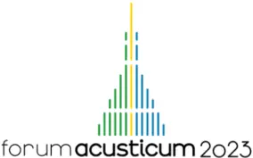
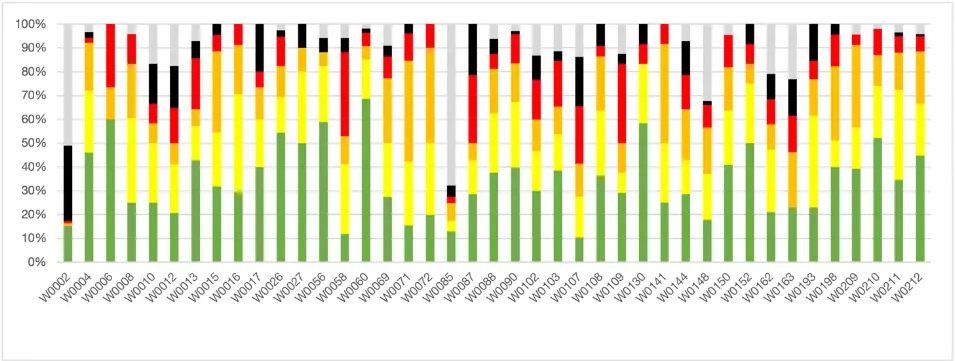
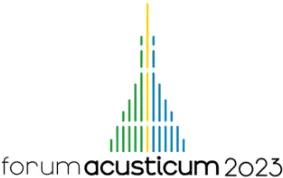

## SOUNDSCAPE AUGMENTATION FOR PEOPLE WITH DEMENTIA

Arezoo Talebzadeh 1\* Timothy Van Renterghem 1 Pieter thomas 1 Paul Devos 1 Dick Botteldooren 1

1 Department of Information Technology, WAVE-iGent, Ghent University, Belgium

## ABSTRACT \*

The effect of soundscape on people with dementia has been studied, and the relation between soundscape and Behavioural and Psychological Syndrome of Dementia is well known. As researchers increasingly look at designed soundscapes to reduce BPSD, finding methods to select the sound for the soundscape becomes challenging. This study examines a sound selection methodology to augment soundscape for people with dementia, using sound characteristics and recognition methods. To uncover the underlying characteristics of sounds that trigger a positive response in persons with dementia, designed soundscapes previously used in the nursing homes in Flanders were analyzed using a wide range of acoustic and psychoacoustic indices. Results showed that sharpness and high pitch, such as animal localization or crickets, create a higher chance of a positive response, as high-pitched sounds have a higher chance of standing out of the existing nursing home soundscape and being noticed. Sounds recognized as music had a lower chance of positive response and need more study. Surprisingly, bird vocalization also had a small effect on the chance of a positive response. Yet bird songs have been used often in soundscape research. The results indicate the importance of further study in understanding suitable sounds for people with dementia.

Keywords: soundscape, dementia, sound augmentation, behavioural and psychological symptoms of dementia, BPSD, sonic environment.

---

- Corresponding author: Arezoo.talebzadeh@ugent.be Copyright: ©2023 Talebzadeh et al. This is an open-access article distributed under the terms of the Creative Commons Attribution 3.0 Unported License, which permits unrestricted use, distribution, and reproduction in any medium, provided the original author and source are credited.

## 1. INTRODUCTION

Soundscape, as coined by Canadian composer R. Murray Schafer [1] and later defined under ISO-12913-1, is an acoustic environment as perceived or experienced and/or understood by a person or people in context [2]. A welldesigned soundscape is considered a valuable environmental factor that enhances people's health and well-being, improving their quality of life and creating positive health effects [3]. Sound is an essential sensory stimulus that gives people a sense of time and place [4], [5]. An unfamiliar and chaotic sonic environment can increase the anxiety and stress of those perceiving it, making the experience annoying and unpleasant. At the same time, a well-designed soundscape can make the experience pleasant and improve the mood.

Research also shows the positive effect of natural and nonnatural soundscapes on people with severe intellectual disabilities [6] by generating a feeling of safety [7] and by influencing mood and triggering a specific action [8].

Dementia is a neurodegenerative disorder that reduces memory and cognitive abilities, mobility and balance, mood and sleep quality. Behavioural and psychological symptoms in dementia (BPSD) refer to a group of noncognitive behaviours associated with dementia [9] that affect the prediction and control of dementia. People with severe dementia usually live in nursing homes, long-term care facilities or memory care units, where sensory perception is unfamiliar to residents. The strange sensory stimuli add to the anxiety and distress of residents as care facilities are often not customized based on individual needs. Recently, an increased interest has been in adapting the sonic environment to support people with cognitive difficulties.

The effect of soundscape on people with dementia has been studied. Aletta et al. conducted an extensive survey on soundscape awareness in nursing homes in Belgium, along with a case study in nursing homes, to monitor soundscape quality. [10] [11]. De Pessemier et al. looked at the positive

AIA

impact of personalized soundscape in lowering BPSD in people with dementia. Janus, Kosters and colleagues [12], [13] obtained promising results in improving soundscape in nursing homes using apps that raise awareness among staff and caregivers. Devos et al. studied how a healthy and supportive sonic environment can benefit the quality of life in nursing homes [14]. The research team also investigated sound as an environmental factor in lowering challenging behaviour in nursing homes [15].

Incorporating pleasant sounds into the environment positively impacts behaviour and reduces BPSD [16]. Introducing sound into the acoustic environment creates an enhanced auditory experience, known as an 'augmented soundscape,' resulting in an improved overall perception of the environment, such as an urban park [17].

Sound augmentation is challenging for people with memory loss, as sounds may trigger specific reactions. Therefore, proper selection plays an essential role in augmenting a soundscape. There is no study on sound selection and augmentation for people with dementia; as part of a large research project, this paper focuses on the sound selection method and the evaluation of sounds based on caregivers' feedback.

## 2. METHODS

The implementation of sound augmentation for individuals with dementia represents a pioneering approach; therefore, the research team was required to develop their methodology for selecting optimal sound segments.

## 2.1 Sound selection

Through previous ethnographic research [15] and co-design sessions with nursing home residents and their caregivers in multiple nursing homes in Flanders, Belgium [18], the team understood the type of sounds that positively affect residents. Based on this prior knowledge, the team collected 280 sounds from open-source databases and on-location recordings. All selected sounds had either non-compressed (wav) or compressed formats (mp3) and were converted into two-channel MPEG-1 layer three files "mp3 "joint "stereo") at a sample rate of 44.1 kHz with a constant bit rate (CBR) of 192 kbps using Adobe Audition software.

Six researchers reviewed and rated each sound for each activity to choose suitable sounds for the personalized soundscape [19]. Based on the previous co-design session, 17 activities were selected as typical day activities in a nursing home. For example, wake up, wash and dress, have breakfast, shower, and get ready for sleep (Table 1 shows some of these activities).

Table 1. Probability of appropriateness of a sound fragment for an activity. The colour scale from the 5th (light green) to the 95th percentile (dark green).

The team shared the knowledge of soundscape research with a diverse professional background, including electrical engineers with acoustic and signal processing expertise, gerontologists with a specialty in Dementia, health care

AIA

management, and architecture. The team evaluated the suitability of each sound for 17 different activities by rating them 0, 1, or 2 (Not suitable '0', maybe '1', and suitable '2'). The team was aware of their biases during the rating process. None of the team members were diagnosed with dementia, and all listened to sounds in their comfort place, mainly through headsets. However, the diversity of their age, gender, ethnicity, professional background, knowledge of soundscape and dementia, and years of studying the effect of soundscape on people and their perception of the sonic environment gave credit to their evaluation. The activities were defined based on a typical day in nursing homes.

The list of activities originated from previous research in Flanders nursing homes [8] and was then tailored to be used in the personalized soundscape.

To choose a suitable sound, the team used 40% and 60% as benchmarks for the impact of each sound. Although these numbers may seem arbitrary, they gave the researchers a starting point to design the soundscape as they refer to a moderate level of selection between six researchers.

The average rating for sounds per activity was then calculated. Sounds with an average of &gt;1.2 were selected for level 2, and those with an average rating of &gt;0.8 (and below 1.2) were chosen for level 1. Any sounds with &lt; 0.8 were noted as not suitable for the particular activity. Level 2 sounds would be a priority to play for a specific activity and were used when the experiment started. Based on the caregivers' responses, alternative sounds were occasionally selected automatically for use the next day. These alternatives can be chosen from both 1 and 2 categories.

## 2.2 Sound recognition

An automatic sound labelling system based on PANN [20] and trained on AudioSet [21] [22] was used to identify the recognizable sound present in each segment. The labelling resulted in 527 classes of sounds. The probability of identifying a sound belonging to each class was obtained every second. Then, these probabilities were aggregated over the entire duration of the sound fragment. For this, two strategies were followed:

1. the probabilities that were higher than 10% were averaged; this can be interpreted as the percentage of the time that the sound event was prominent

mean (max (0, label_probability - 0.1)/ (1.0-0.1))

2. the logarithm of the probabilities per second was averaged; this can be interpreted as an indication that the sound was always there (the background sound)

mean(log(1+label_probability)/log (2))

## 2.3 Push button evaluation by caregivers

The soundscape system had a feedback system along with a sound player. During the experiment in nursing homes, caregivers were asked to evaluate the effect of specific sounds on the participants' behaviour and mood using a feedback system that utilized a five-point colour scale (green, yellow, orange, red, and black) and a white button for muting. The five-point feedback system shows green for the most desirable sound, then yellow, orange, red, and black for the least desirable (disturbing) sound. The algorithm adjusts based on the feedback system; if the feedback is negative, the system chooses another sound. The system removes the sounds with multiple negative feedbacks but keeps the sound when the feedback is positive [5].

The feedback buttons were used several times throughout the day to evaluate sounds as part of the soundscape system and provide feedback on their impact on the overall state of the person with dementia. While the primary purpose of this information is to modify the playlist automatically, it can also be used to classify the sounds used for augmentation based on their effect on the person with dementia. Caregivers who are close to the residents and aware of their reactions are well suited to understand residents' responses to the environment, including agitation and stress. The caregivers were reminded throughout the research that the assessment should be based on the residents' reactions, not their own, although their cognitive biases may affect the evaluation.

The feedback data was used to evaluate the sound selection based on the residents' reactions, monitor the best-received sounds, and identify any adverse effects of the sounds. This paper used the feedback data to compare the sound selection based on the residents' reactions with the researchers' selection.

## 3. RESULTS

## 3.1 Team selection

For each fragment selected by the research team as appropriate for a specific activity, automatic sound recognition was used to identify the type of sounds present in that fragment (background aggregation). For this

AIA

purpose, probabilities for a particular sound to occur for an activity were averaged over all fragments selected for that activity. Table 1 shows the probability of segments per activity using a percentile colour scale for the labels which occur for more than three activities.

Based on this analysis, "music" has the most significant probability of being selected by the research team for most of the activities, followed by "bird," "bird vocalization" for morning activities and "cricket" for resting and sleeping activities. Looking at the table, for example, the bird's sound received the highest probability for both "wake up" and "wash and dress." Cricket sound has the highest probability for "falling asleep" and "sleeping". However, music has the highest probability for "resting." Rain sounds were often recognized in fragments selected for resting and sleeping, but trivially, it is also associated with taking a bath or a shower. Some particular and recognizable sounds such as "bells", "church bells", and "telephone ringing" were present only in fragments that were related to "take medication," "expect social activities," or "expect a visitor". Hence, the research team's selection was predicated on the inherent correlation between natural sounds and their temporal occurrence in nature. Furthermore, it was grounded in the rational comprehension that music aids relaxation and facilitates sleep preparation. Notably, most of the musical compositions utilized in this study drew inspiration from Western classical music but were improvised for this study.

## 3.2 Pushbutton

The result of the five-button feedback system is demonstrated in Figure 1. Each column refers to a particular sound fragment. Colours are based on a feedback system, with off-white representing the mute action. The W0xxx number refers to the individual sound fragments used in this study. This data is the result of 19 participants from 6 nursing homes (for more detail and information, refer to the De Pessemier et al. paper [23]).

The list of fragments is shown in Table 2 (the label refers to the most dominant sound heard when listening to the fragment).

The sounds that were initially played are those that the experts selected as level 2 sounds. If, however, a sound was rated negatively very often, it was replaced by a level 1 sound matching that activity. Also, the system adapts to the resident's preferences and therefore sounds which remained in the system received more positive ratings. These system characteristics explain why sounds are mostly rated green or yellow, except for sounds W0002 (beep) and W00085 (solo acoustic guitar player). Nevertheless, the fact that sounds remained in the soundscape system and played for the experiment period emphasizes the augmented soundscape's positive impact on residents.

Figure 1. Feedback is based on five colour buttons and the mute button (grey).

AIN

Table 2. List of the sound fragments and the most dominant sound heard during each segment

W0017 Kids playing in a park W0102 Heartbeat

| W0002 | Beep                   |
| ----- | ---------------------- |
| W0004 | Café- people talking   |
| W0006 | Cricket                |
| W0008 | Birds and bees         |
| W0010 | Waves and wind         |
| W0012 | Piano                  |
| W0013 | Piano                  |
| W0015 | Piano                  |
| W0016 | Birds                  |
| W0017 | Kids playing in a park |
| W0026 | Rain                   |
| W0027 | Birds                  |
| W0056 | Birds                  |
| W0058 | Birds                  |

| W0060 | Rain               |
| ----- | ------------------ |
| W0061 | Music              |
| W0069 | Restaurant and     |
| W0071 | Heavy rain         |
| W0072 | Birds              |
| W0085 | Acoustic guitar    |
| W0087 | Water stream       |
| W0088 | Water stream       |
| W0090 | Cricket            |
| W0102 | Heartbeat          |
| W0103 | Heartbeat          |
| W0107 | Cricket            |
| W0108 | Cricket, wind, and |
| W0109 | Cricket            |

| W0130 | Brewing coffee        |
| ----- | --------------------- |
| W0141 | Rooster               |
| W0144 | Music                 |
| W0148 | Music                 |
| W0150 | Cafe                  |
| W0152 | Birds                 |
| W0162 | Violin                |
| W0163 | Violin                |
| W0193 | Paragon               |
| W0198 | Café and conversation |
| W0209 | Birds                 |
| W0210 | Birds                 |
| W0211 | Birds                 |
| W0212 | Birds                 |

## 4. DISCUSSION

This study evaluated the selection of sounds for use in augmenting soundscapes during various activities based on sound recognition labelling and caregiver feedback data. The research team selected sound fragments that they believed could be used effectively during different activities.

Music was the primary choice due to its ability to influence mood and behaviour. However, a push button evaluation revealed that continuously playing music did not work well. For morning activities, fragments containing bird sounds were preferred, likely intended to provide clear and dynamic sounds for activation. For activities related to sleep and rest, white noise-like fragments containing crickets or rain were chosen, probably aimed at masking distant sounds and reducing arousal. Sounds of animals had some positive results; this is not a surprise as the positive effect of animal sounds was shown before in various research [24]; Ratcliffe's study of soundscape in a restorative natural environment shows how natural sounds are frequently linked to pleasure and relaxation and how wind, water and wild animal sounds present pleasantness [25]; based on attention restoration theory [26], animals sound as part of natural sounds helps in stress reduction and recovery [27] [28].

While music-based interventions have been shown to affect people with dementia positively and have become a standard non-pharmacological treatment [29] [30], the present study found that music received negative feedback. Further research is needed to improve the effectiveness of music-based interventions and to determine the type of music or genre that works best. Some studies have explored creating preferred playlists for individuals with dementia [31] or playing music that aligns with their cultural identity and background [32]. In this study, the music used for sound augmentation was improvised by a musician and recorded for the research to avoid copyright issues. The improvisation may have contributed to the absence of positive feedback due to residents' lack of familiarity with the music.

## 5. CONCLUSION

Studies have investigated the potential benefits of augmenting the soundscape to reduce the behavioural and psychological symptoms of dementia. Selecting appropriate sound fragments to enhance a soundscape for people with dementia poses challenges, primarily due to the difficulty people with dementia have in communicating their interests and achieving unbiased human selection. In this paper, we looked at sound selection by the research team for typical activities in nursing homes and the probability of each segment per activity using sound recognition software. We then looked at caregivers' feedback results on a five-colour feedback system that shows an overview of preference segments.

AIA

The result shows how the research team chose the sound fragments per activity compared to how caregivers evaluated those fragments based on participants' behaviour. And how, in some cases, the sound selected by the research team received poor feedback from the participants (music and cricket).

In summary, these analyses of results from a previous study give us some good guidelines for selecting sound fragments. In the next step, we will look at the button press and the acoustic indicators to better understand the meaning behind the participants' preferences. Further investigation based on this finding can increase the positive response and, hence, better outcomes in reducing behavioural and psychological syndromes in people with dementia.

## 6. ACKNOWLEDGMENTS

The research team acknowledges the support of HEADGenuit-Stiftung, P-19/04-W. This research was performed in the context of the AcustiCare IOF project (https://www.acusticare.be/) funded by Ghent University, Belgium.

## 7. REFERENCES

- [1] Schafer R. M., The Tuning of the World. New York: Alfred A. Knopf, 1977.
- [2] ISO12913-1, "Acoustics-Soundscape-Part 1: Definition and conceptual framework AcoustiquePaysage sonore-Partie 1: Définition et cadre conceptuel," 2014. [Online]. Available: www.iso.org
- [3] B. Schulte-Fortkamp, "Soundscape and its contribution to health in the city," Cities Health, vol. 5, no. 1-2, pp. 71-73, May 2021, doi: 10.1080/23748834.2019.1585692.
- [4] K. A. van den Bosch, T. C. Andringa, D. Başkent, and C. Vlaskamp, "The Role of Sound in Residential Facilities for People With Profound Intellectual and Multiple Disabilities," J Policy Pract Intellect Disabil, vol. 13, no. 1, pp. 61-68, Mar. 2016, doi: 10.1111/jppi.12147.
- [5] A. Talebzadeh and D. Botteldooren, "Designing personalized soundscape for care facilities," in Proceedings of Meetings on Acoustics, 2022. doi: 10.1121/2.0001618.
- [6] T. C. Andringa and K. A. Van Den Bosch, "Core affect and soundscape assessment: fore-and

7. background soundscape design for quality of life," 2013.

- [7] K. A. Van Den Bosch and T. C. Andringa, "The effect of sound sources on soundscape appraisal," 2014. [Online]. Available: https://www.researchgate.net/publication/26301350 8
- [8] P. Devos et al., "Designing supportive soundscapes for nursing home residents with dementia," Int J Environ Res Public Health, vol. 16, no. 24, Dec. 2019, doi: 10.3390/ijerph16244904.
- [9] M. Petrovic et al., "Clustering of behavioural and psychological symptoms in dementia (BPSD): A european alzheimer's disease consortium (EADC) study," Acta Clin Belg, vol. 62, no. 6, pp. 426-432, 2007, doi: 10.1179/acb.2007.062.
- [10] F. Aletta et al., "Monitoring sound levels and soundscape quality in the living rooms of nursing homes: A case study in Flanders (Belgium)," Applied Sciences (Switzerland), vol. 7, no. 9, Aug. 2017, doi: 10.3390/app7090874.
- [11] F. Aletta et al., "Awareness of 'sound' in nursing homes: A large-scale soundscape survey in Flanders (Belgium)," Building Acoustics, vol. 25, no. 1, pp. 43-59, Mar. 2018, doi: 10.1177/1351010X17748113.
- [12] J. Kosters, S. I. M. Janus, K. A. Van Den Bosch, S. Zuidema, H. J. Luijendijk, and T. C. Andringa, "Soundscape Optimization in Nursing Homes Through Raising Awareness in Nursing Staff With MoSART+," Front Psychol, vol. 13, Jun. 2022, doi: 10.3389/fpsyg.2022.871647.
- [13] S. I. M. Janus, J. Kosters, K. A. Van Den Bosch, T. C. Andringa, S. U. Zuidema, and H. J. Luijendijk, "Sounds in nursing homes and their effect on health in dementia: A systematic review," International Psychogeriatrics, vol. 33, no. 6. Cambridge University Press, pp. 627-644, Jun. 01, 2021. doi: 10.1017/S1041610220000952.
- [14] P. Devos et al., "Towards Understanding Healthy and Supportive Acoustic Environments: the case of a nursing home," in 23rd International Congress on Acoustic, Sep. 2019.
- [15] A. Talebzadeh et al., "The Influence of Everyday Acoustic Environments on the Challenging Behavior in Dementia: A Participatory Observation Study in Nursing Homes," Int. J. Environ. Res. Public Health, vol. 20, p. 4191, 2023, doi: 10.3390/ijerph20054191.
- [16] K. A. van den Bosch, T. C. Andringa, W. J. Post, W. A. J. J. M. Ruijssenaars, and C. Vlaskamp, "The

AIA

- relationship between soundscapes and challenging behavior: A small-scale intervention study in a healthcare organization for individuals with severe or profound intellectual disabilities," Building Acoustics, vol. 25, no. 2, pp. 123-135, Jun. 2018, doi: 10.1177/1351010X18775022.
- [17] T. Van Renterghem et al., "Interactive soundscape augmentation by natural sounds in a noise polluted urban park," Landsc Urban Plan, vol. 194, Feb. 2020, doi: 10.1016/j.landurbplan.2019.103705.
- [18] P. Devos et al., "Soundscape design for management of behavioral disorders: a pilot study among nursing home residents with dementia," 2018.
- [19] A. Talebzadeh, T. Van Renterghem, P. Thomas, P. Devos, and D. Botteldooren, "Using psychoacoustic parameters to select suitable sounds to augment soundscapes for people with dementia," in Internoise 2022 - 51st International Congress and Exposition on Noise Control Engineering, 2022.
- [20] Q. Kong, Y. Cao, T. Iqbal, Y. Wang, W. Wang, and M. D. Plumbley, "PANNs: Large-Scale Pretrained Audio Neural Networks for Audio Pattern Recognition," Dec. 2019, [Online]. Available: http://arxiv.org/abs/1912.10211
- [21] J. F. Gemmeke et al., "Audio Set: An ontology and human-labeled dataset for audio events," in 2017 IEEE International Conference on Acoustics, Speech and Signal Processing (ICASSP), IEEE, Mar. 2017, pp. 776-780. doi: 10.1109/ICASSP.2017.7952261.
- [22] Y. Hou, B. Kang, W. Van Hauwermeiren, and D. Botteldooren, "Relation-guided acoustic scene classification aided with event embeddings," May 2022, [Online]. Available: http://arxiv.org/abs/2205.00499
- [23] T. De Pessemier et al., "Personalising augmented soundscapes for supporting persons with dementia," Multimed Tools Appl, 2022, doi: 10.1007/s11042022-13839-3.
- [24] H. G. Kariel, "Mountaineers and the general public: A comparison of their evaluation of sounds in a recreational environment," Leis Sci, vol. 3, no. 2, pp. 155-167, Jan. 1980, doi: 10.1080/01490408009512932.
- [25] E. Ratcliffe, "Toward a better understanding of pleasant sounds and soundscapes in urban settings," Cities Health, vol. 5, no. 1-2, pp. 82-85, May 2021, doi: 10.1080/23748834.2019.1693776.
- [26] S. Kaplan, "THE RESTORATIVE BENEFITS OF NATURE: TOWARD AN INTEGRATIVE FRAMEWORK," 1995.
- [27] A. Kjellgren and H. Buhrkall, "A comparison of the restorative effect of a natural environment with that of a simulated natural environment," J Environ Psychol, vol. 30, no. 4, pp. 464-472, Dec. 2010, doi: 10.1016/j.jenvp.2010.01.011.
- [28] R. S. Ulrich, R. F. Simons, B. D. Losito, E. Fiorito, M. A. Miles, and M. Zelson, "Stress recovery during exposure to natural and urban environments," J Environ Psychol, vol. 11, no. 3, pp. 201-230, 1991, doi: 10.1016/S02724944(05)80184-7.
- [29] O. McDermott, N. Crellin, H. M. Ridder, and M. Orrell, "Music therapy in dementia: A narrative synthesis systematic review," International Journal of Geriatric Psychiatry, vol. 28, no. 8. pp. 781-794, Aug. 2013. doi: 10.1002/gps.3895.
- [30] A. C. Vink, M. S. Bruinsma, and R. J. Scholten, "Music therapy for people with dementia," in Cochrane Database of Systematic Reviews, John Wiley &amp; Sons, Ltd, 2003. doi: 10.1002/14651858.cd003477.pub2.
- [31] L. Weise, E. Jakob, N. F. Töpfer, and G. Wilz, "Study protocol: Individualized music for people with dementia - Improvement of quality of life and social participation for people with dementia in institutional care," BMC Geriatr, vol. 18, no. 1, Dec. 2018, doi: 10.1186/s12877-018-1000-3.
- [32] O. McDermott, M. Orrell, and H. M. Ridder, "The importance of music for people with dementia: The perspectives of people with dementia, family carers, staff and music therapists," Aging and Mental Health, vol. 18, no. 6. Routledge, pp. 706-716, Aug. 18, 2014. doi: 10.1080/13607863.2013.875124.

AIA

