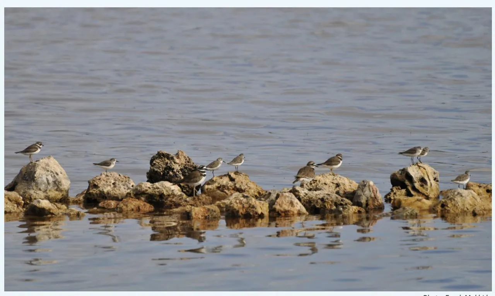
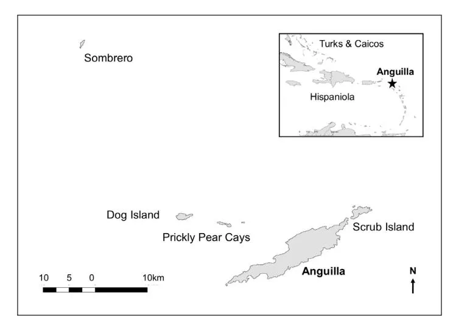
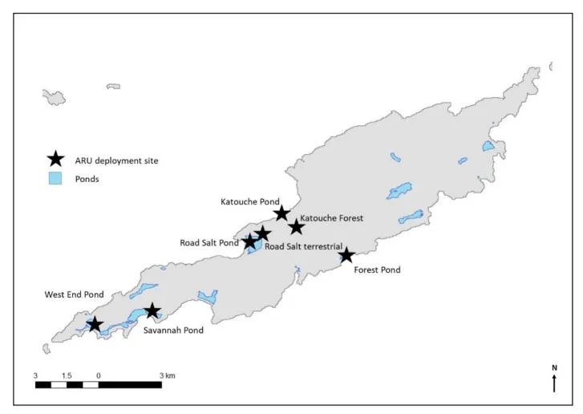
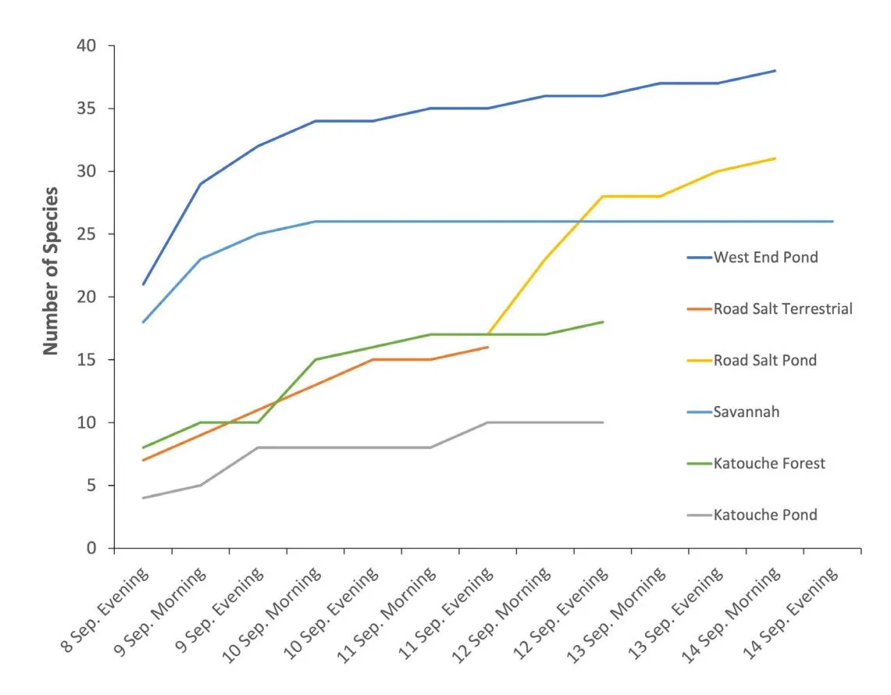
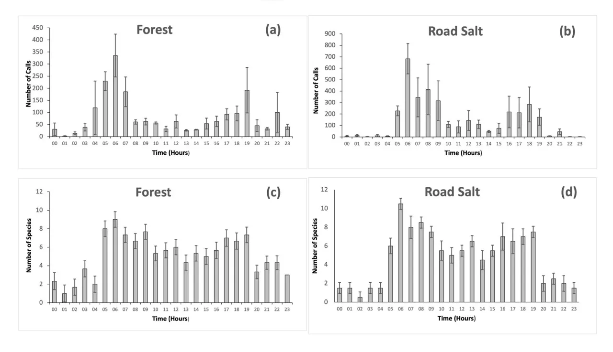
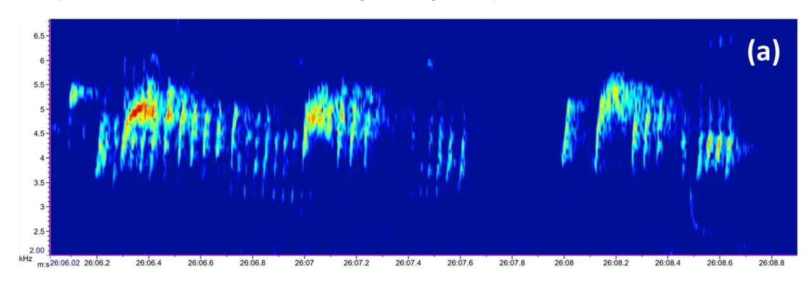
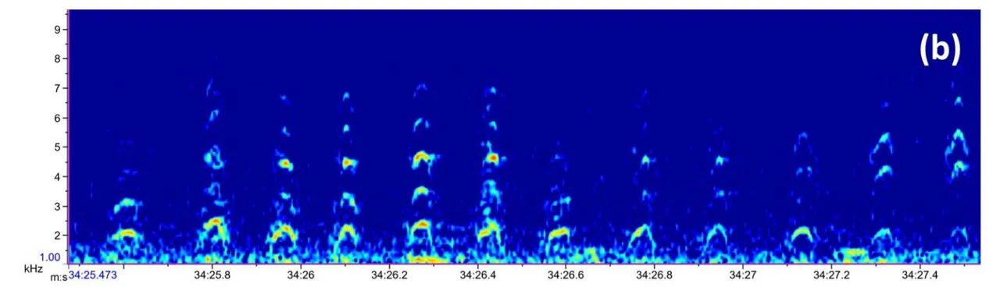

# **Journal of Caribbean Ornithology**

**RESEARCH ARTICLE Vol. 36:62–74. 2023**

Passive acoustic monitoring of birds in the Lesser Antilles—a useful tool for monitoring remote sites?

> Louise M. Soanes Devon Carter Laurel Braden Symes Jennifer C. Daltry Holger Klinck Clarissa Lloyd Farah Mukhida

_Photo: Farah Mukhida_

## **Journal of Caribbean Ornithology**

**Research Article Vol. 36:62–74. 2023**

[jco.birdscaribbean.org](http://jco.birdscaribbean.org) ISSN 1544-4953 https:/[/doi.org/10.55431/jco.2023.36.](http://)62-74

### **Passive acoustic monitoring of birds in the Lesser Antilles a useful tool for monitoring remote sites?**

Louise M. Soanes\*1,2, Devon Carter1,3, Laurel Braden Symes4,5, Jennifer C. Daltry6,7, Holger Klinck4,8, Clarissa Lloyd1,9, and Farah Mukhida1,10

Associate Editor: Paige Byerly

Cover Page: Shorebirds at Road Salt Pond, Anguilla, 2021. Photograph by Farah Mukhida.

Published: 22 August 2023

\*Corresponding author: 1 Anguilla National Trust, North Side, Anguilla, British West Indies;

e-mail: [ls.axatrust@gmail.com](mailto:ls.axatrust%40gmail.com?subject=) e-mail: [dc.axatrust@gmail.com](mailto:dc.axatrust%40gmail.com?subject=)

4 K. Lisa Yang Center for Conservation Bioacoustics, Cornell Lab of Ornithology, Cornell University, NY 14850, USA

5 e-mail: [symes@cornell.edu](mailto:symes%40cornell.edu?subject=)

6 Fauna and Flora, David Attenborough Building,

Cambridge, UK;

Re:Wild, Austin,TX; e-mail: [jdaltry@rewild.org](mailto:jdaltry%40rewild.org?subject=)

8 e-mail: [holger.klinck@cornell.edu](mailto:holger.klinck%40cornell.edu?subject=) 9 e-mail: [cl.axatrust@gmail.com](mailto:cl.axatrust%40gmail.com?subject=)

10e-mail: [fmukhida@axanationaltrust.com](mailto:fmukhida%40axanationaltrust.com?subject=)

#### **Abstract**

The monitoring of bird species across their geographic ranges is essential in order to assess population status and trends and to inform conservation action. However, undertaking monitoring, particularly in the long-term, is often resource-intensive and costly. In recent years, the use of passive acoustic monitoring (PAM) has emerged as a useful monitoring tool. Birds are especially appropriate for bioacoustic monitoring because they regularly produce species-specific vocalizations. Here we report on pilot deployments of autonomous recording units (ARUs) on the island of Anguilla. ARUs were deployed for up to 7 days and the recorded data was subject to analysis by BirdNET, an automated bird recognition software. BirdNET identified 43,655 vocalizations from 75 species, of which 48 species were confirmed manually (27 were identified as false positives). The cumulative number of species recorded plateaued after approximately 3 days of recording and the highest level of activity (peak number of vocalizations) were found between 0400–0900 and 1800–1900. When compared to point counts, PAM identified more species at each site but did not record any species that had not been previously recorded in Anguilla. We conclude that PAM can serve as a useful tool for monitoring the presence of birds, particularly at remote sites where access may be difficult, and could prove to be valuable in the establishment of long-term monitoring programs.

#### **Keywords**

ARU, bioacoustics, BirdNET, Caribbean, Lesser Antilles, migratory birds, PAM

#### **Resumen**

**Monitoreo acústico pasivo de aves en las Antillas Menores: ¿una herramienta útil para el monitoreo de sitios remotos?** • El monitoreo de las especies de aves en toda su área de distribución geográfica es esencial para evaluar el estado y las tendencias poblacionales, y para fundamentar las acciones de conservación. Sin embargo, llevar a cabo el monitoreo, particularmente a largo plazo, a menudo requiere muchos recursos y es costoso. En los últimos años, el uso del monitoreo acústico pasivo (PAM) se ha revelado como una herramienta útil para el monitoreo. Las aves son especialmente apropiadas para el monitoreo bioacústico, porque producen regularmente vocalizaciones especie-específicas. Aquí presentamos un informe sobre la implementación piloto de unidades de grabación autónomas (ARU) en la isla de Anguila. Las ARU se utilizaron durante un máximo de 7 días y los datos registrados se analizaron con BirdNET, un software de reconocimiento automático de aves. BirdNET identificó 43.655 vocalizaciones de 75 especies, de las cuales 48 especies se confirmaron manualmente (27 se identificaron como falsos positivos). El número acumulado de especies registradas se estabilizó después de aproximadamente 3 días de grabación, y el nivel más alto de actividad (número máximo de vocalizaciones) se encontró entre las 0400–0900 y las 1800–1900. En comparación con los puntos de conteo, el PAM permitió identificar más especies en cada sitio, pero no se encontró ninguna que no se hubiera registrado previamente en Anguila. Concluimos que el PAM puede servir como una herramienta útil para monitorear la presencia de aves, particularmente en sitios remotos donde el acceso puede ser difícil, y que podría resultar valioso en el establecimiento de programas de monitoreo a largo plazo.

#### **Palabras clave**

Antillas Menores, ARU, aves migratorias, bioacústica, BirdNET, Caribe, PAM

#### **Cite this article as:**

Soanes, L.M., D. Carter, L.B. Symes, J.C. Daltry, H. Klinck, C. Lloyd, and F. Mukhida. 2023. Passive acoustic monitoring of birds in the Lesser Antilles—a useful tool for monitoring remote sites? Journal of Caribbean Ornithology 36:62– 74. https:/[/doi.org/10.55431/jco.2023.36](http://).62-74

#### **Résumé**

**Suivi acoustique passif des oiseaux dans les Petites Antilles – Un outil utile pour le suivi de sites éloignés ?** • Le suivi des espèces d'oiseaux sur l'ensemble de leur aire de répartition géographique est essentiel pour évaluer l'état et les tendances des populations et pour orienter les mesures de conservation. Toutefois, la mise en œuvre d'un suivi, en particulier à long terme, est coûteuse et nécessite souvent des ressources importantes. Ces dernières années, le suivi acoustique passif (PAM – passive acoustic monitoring) est apparu comme un outil de suivi utile. Les oiseaux se prêtent particulièrement bien au suivi bioacoustique, car ils émettent régulièrement des vocalisations propres à leur espèce. Nous présentons ici le déploiement pilote d'unités d'enregistrement autonomes (ARU – autonomous recording units) sur l'île d'Anguilla. Les unités ont été déployées pendant 7 jours et les données enregistrées ont été analysées par BirdNET, un logiciel de reconnaissance automatique des oiseaux. BirdNET a identifié 43655 vocalisations de 75 espèces, dont 48 espèces confirmées manuellement (27 ont été identifiées comme faux positifs). Le nombre cumulé d'espèces enregistrées a atteint un plateau après environ 3 jours d'enregistrement et le niveau d'activité le plus élevé (nombre maximal de vocalisations) a été observé de 04h00 à 09h00 et de 18h00 à 19h00. En comparaison avec les points d'écoute, le suivi acoustique passif a identifié plus d'espèces sur chaque site, mais n'a pas enregistré d'espèces qui n'avaient pas été contactées auparavant à Anguilla. Nous concluons que le suivi acoustique passif peut être un outil utile pour suivre la présence d'oiseaux, en particulier sur les sites éloignés où l'accès peut être difficile, et qu'il pourrait s'avérer précieux pour la mise en place de programmes de suivi à long terme.

#### **Mots clés**

ARU, bioacoustique, BirdNET, Caraïbes, oiseaux migrateurs, PAM, Petites Antilles, suivi acoustique passif, unités d'enregistrement autonomes

Understanding the response of biodiversity to management, land use, and climate change is a major global challenge but is essential to halt the decline of biodiversity (Bretagnolle _et al._ 2018). Monitoring the status and trends in animal diversity and population levels of indicator species is critical in assessing ecosystem health, identifying conservation priorities, and guiding decision making (McComb _et al._ 2010, Fitzpatrick and Rodewald 2016). Birds are widely used as monitoring targets because they live in most environments and occupy almost every niche within those environments. They are also generally more conspicuous relative to other taxa that could be sensitive to similar ecological factors (Uliczka and Angelstam 2000, Solomou and Sfougaris 2015, Zingg _et al._ 2018, Plaza and Lambertucci 2019, Kahl _et al._ 2021). Systematic monitoring of bird species across their geographic ranges, including breeding and wintering sites and migration routes, is a critical part of conservation, but it is often resource-intensive, costly, and difficult to organize and maintain in the long-term (Neate-Clegg _et al._ 2020). However, without baseline data and systematic annual and long-term monitoring, species can relatively easily slip away unnoticed or decline so rapidly that it is hard to re-establish or conserve populations. Unfortunately, this was the case for the Bahama Nuthatch (_Sitta insularis_) which experienced a large decline that likely commenced sometime after the late 1960s but was only detected in 2007, when extensive surveys on Grand Bahama resulted in very few sightings (Lloyd and Slater 2011). A concerted search effort on Grand Bahama in 2018 resulted in only 1–2 individuals being recorded (BirdLife 2023).

There are many examples from the Caribbean where longterm monitoring has been established and the data collected has proved to be invaluable for conservation management purposes. One example is the impressive 20+ year monitoring program that focuses on the Critically Endangered Grenada Dove (_Leptotila wellsi_). This long-term monitoring program revealed a severe population decline primarily caused by the occurrence of severe storms, habitat loss, small scale agriculture, and fire (Rusk 2017). There are also regional initiatives, such as BirdsCaribbean's annual Caribbean Waterbird Census (CWC). Since the beginning of the CWC in 2010, over 200 people from 21 countries in the region have surveyed more than 700 areas. Data collected by the CWC has been used to identify important shorebird areas and support their protection (Cañizares and Reed 2020).

Most bird monitoring is undertaken in the field using techniques such as point and transect counts (Bibby _et al._ 2000) and distance sampling (Buckland _et al._ 2005). These methods have been used regionally in long-term monitoring programs such as those that focused on the Grenada Dove (Rusk 2017) and Montserrat Oriole (_Icterus oberi_; Oppel _et al._ 2014). Capture-mark-recapture surveys are also of value (White and Burnham 1999) and include the work conducted by Lloyd _et al._ (2016) who analyzed temporal trends in mist-net capture rates of resident and overwintering Nearctic-Neotropical migrants in the Dominican Republic. Recent publications have also highlighted the value of data collected by citizen scientists. For example, in the Bahamas, 10 years of data submitted to eBird (eBird 2021) was analyzed to predict the occurrence of Bahamian bird species. During this analysis, 56 island populations were identified as having been unreported in recent years, thus flagging these populations as either potentially declining or extinct and meriting follow-up searches (Bagwyn _et al._ 2020). In addition to these more conventional survey methods, technological advances have made the use of electronic bioacoustic methods which utilize autonomous sound recording devices, an increasingly popular tool for monitoring birds (Acevedo and Villanueva-Rivera 2006, Bardeli _et al._ 2010, Shonfield and Bayne 2017).

Birds are especially appropriate for bioacoustic monitoring because they regularly emit species-specific vocalizations (Obrist _et al._ 2010). Passive acoustic monitoring (PAM) provides a powerful approach to collecting species data noninvasively, continuously, and simultaneously across multiple sites for extended periods (Sugai _et al._ 2019). Moreover, because acoustic data provide a permanent record of the survey period, they offer detailed information that can be used to address a variety of objectives, from studying rare, inconspicuous species to monitoring behavior to assessing phenological and temporal trends (Acevedo and Villanueva-Rivera 2006, Brandes 2008, Blumstein _et al._ 2011, Celis-Murillo _et al._ 2012, Lellouch _et al._ 2014, Sidie-Slettedahl _et al._ 2015, Thompson _et al._ 2017, Darras _et al._ 2018). While globally PAM has become a relatively widely used tool for the monitoring of birds, there are only a few examples of its application within the Caribbean region. Most bird-related bioacoustic work in the region has focused on single species or single sites over short periods of time. For example, in Grenada, PAM was used to investigate song plasticity in Grenada's House Wren population (_Troglodytes aedon grenadensis_; Cyr _et al._ 2020) while Campos-Cerqueira and Aide's (2017) study utilized PAM to evaluate the effect that elevational gradients have on the distribution and composition of birds and frogs in Puerto Rico.

The island of Anguilla, a UK Overseas Territory located in the northern Lesser Antilles (Fig. 1), boasts one of the most comprehensive and longest-running wetland bird monitoring programs in the region (Lloyd and Mukhida 2021). The Anguilla bird monitoring program was established in 2005 and records birds present at 26 wetland sites on a monthly basis. To date, 112 species have been recorded during monthly counts and data have been used to inform the designation of Important Bird and Biodiversity Areas (BirdLife International 2021) as well as to inform planning and development proposals. While there has been a great deal of effort placed on the monitoring of wetland and terrestrial birds on Anguilla's mainland, the offshore cays have been less intensively studied. This is, in part, due to logistical difficulties in accessing the islets, particularly during the winter months when sea conditions are not favorable and the cost of boat transportation to the cays is relatively high.

In recent years, the Anguilla National Trust has led on several initiatives with the aim of restoring Anguilla's offshore cays. Island restorations have included a rat eradication on Dog Island (Bell and Daltry 2014) and Prickly Pear Cays, and a mouse eradication and subsequent habitat revegetation initiative on Sombrero Island with the hope that biodiversity will flourish and become more resilient. As part of these restoration projects, data have been collected on breeding seabirds and turtles, and area and point counts of wetland and terrestrial birds, respectively, have been undertaken on an annual basis. However, there is still a lack of data on the presence and abundance of terrestrial and wetland bird species within and between years on the offshore cays. To improve our understanding of wetland and terrestrial bird populations, the use of PAM was suggested as an economical method that could be used to establish long-term bird monitoring at these relatively inaccessible sites.

Before embarking on the use of PAM for long-term monitoring of Anguilla's offshore cays, we piloted the use of this approach on mainland Anguilla with the following objectives: (1) to ascertain if avian species richness recorded on autonomous recording units (ARUs) was comparable to that recorded during point counts; (2) to determine the optimum number of recording days required to represent the species present; and (3) to determine the optimum times of day to record data. Here we present the results of pilot field tests of ARUs on mainland Anguilla.

#### **Methods**

**Comparing Bird Species Recorded by Passive Acoustic Monitoring and Fixed-Point Counts**

*Field Deployment.—*During the fall migration period between 8–14 September 2020, we deployed five ARUs (SwiftOne, Cornell Lab of Ornithology, Ithaca, NY, USA) at six sites for up to 7 days on mainland Anguilla (Fig. 2, Table 1). Two of the deployment sites were located within dry forest while the others were

**Fig. 1.** Location of Anguilla and its offshore cays within the wider Caribbean.

**Fig. 2.** Deployment sites of autonomous recording units (ARUs) in Anguilla. ARUs were placed at each site for up to 7 days between 8–14 September 2020. Point counts were also undertaken at these sites. The site at Forest Pond was only used for determining optimum deployment times.

deployed in wetland habitats. ARUs were set to record at 48 kHz sampling rate and 16-bit resolution (WAV format) between 0400–0800 and 1600–2000. The microphone had a sensitivity of -25 dB re 1V/Pa and a flat frequency response (± 3dB) in the frequency range 100 Hz 10 kHz. The amplification was set to 35 dB and the clipping level of the analog-to-digital converter was ± 0.9 V. ARUs were strapped to a tree trunk ~1 m from ground level.

Point counts were undertaken by one to two trained observers accompanied by a data recorder between 0600–0800 on 20 August 2020 and 20 September 2020 at six sites (West End Pond, Road Salt Pond, Road Salt Terrestrial, Katouche Forest, Katouche Pond, and Savannah Pond). These were the same sites at which the ARUs were deployed (Fig. 2). Within each site, count stations were located within 10 m of a deployed ARU. Counts

**Table 1.** Site characteristics and survey efforts across sites in Anguilla. Autonomous recording units (ARUs) were generally deployed to record between 0400–0800 and 1600–2000 for up to 7 days. Point counts were performed on two dates (20 August 2020 and 20 September 2020) per site.

| Site                  | Latitude, Longitude        |                          | Dates of ARU Recording | Hoursa | Dates of Point Count Recordings  | Durationb      |     |
| --------------------- | ----------------------------- | ------------------------ | ------------------------- | ------ | ----------------------------------- | -------------- | --- |
| West End Pond         | 18° 9'55.3"N, 63°9'26.6"W  | 4-ha brackish pond       | 8–14 September 2020       | 48     | 20 August 2020 20 September 2020 | 00:27 00:30 |     |
| Road Salt Pond        | 18°12'11.5"N, 63°05'1.0"W  | 41-ha salt pond          | 11–14 September 2020      | 24     | 20 August 2020 20 September 2020 | 00:54 01:03 |     |
| Road Salt Terrestrial | 18°12'12.8"N, 63°05'1.0"W  | Coastal scrub/dry forest | 11–14 September 2020      | 28     | 20 August 2020 20 September 2020 | 00:05 00:07 |     |
| Katouche Forest       | 18°12'42.1"N, 63°04'26.2"W | Dry forest               | 08–12 September 2020      | 36     | 20 August 2020 20 September 2020 | 00:11 00:13 |     |
| Katouche Pond         | 18°12'42.1"N, 63°04'26.2"W | 0.2-ha brackish pond     | 08–12 September 2020      | 36     | 20 August 2020 20 September 2020 | 00:11 00:03 |     |
| Savannah Pond         | 18°10'31.5"N, 63°07'24.8"W | 3-ha brackish pond       | 08–14 September 2020      | 56     | 20 August 2020 20 September 2020 | 00:26 00:19 |     |
| Forest Pond           | 18°11'45.4"N, 63°02'54.3"W | 2.7-ha brackish pond     | 20–23 May 2021c           | 72     | N/A                                 | N/A            |     |
| Road Salt Pond        | 18°12'11.5"N, 63°05'1.0"W  | 41-ha salt pond          | 20–23 May 2021c           | 72     | N/A                                 | N/A            |     |

a Total number of recorded hours

were conducted according to the methods of Lloyd and Mukhida (2021). At each point, the observer used binoculars to scan the total area of visible habitat. All birds seen, heard, and flying over were recorded during each survey period that lasted up to 1 hr (Table 1). If two observers recorded data, the highest count was used.

*Data Analysis.—*Following the retrieval of the ARUs, data were downloaded and compressed to FLAC format using the audio file management software Sox-o-matic (www.birds.cornell.edu/ccb/sox-o-matic/). Data were then subjected to analysis using the BirdNET algorithm, software that can identify more than 3,000 of the world's most common bird species by sound, including all of the most common resident and migratory birds previously reported from Anguilla (Kahl _et al._ 2021). The resulting output file identified bird vocalizations and assigned them to a species from the BirdNET database with a corresponding confidence score (Kahl _et al._ 2021). Data were filtered manually to only show vocalizations that had a confidence score > 50% and were then sorted by the date and time of the recording. For the first record of any new species, the identified sound file was opened in Raven Pro 1.6 (K. Lisa Yang Center for Conservation Bioacoustics 2019) to view the spectrogram of the vocalizations and listen to the recording. Both the spectrogram and sound were compared with spectrograms and sound recordings archived in the Macaulay Library (macaulaylibrary.org; Appendix 1 for example). For those vocalizations that were not easily identifiable audibly or by their spectrograms (e.g., when there may have been overlap with other bird vocalizations), we moved to the next date and time that that species was identified by Bird-NET and again viewed the spectrogram and listened to the vocalizations until we could confirm that the species was present.

We assessed the results of PAM against point count surveys by comparing the suite of species detected and calculating species richness.

#### **Determining Optimum Deployment Periods**

While the collection of acoustic data is not time-intensive, the time required for manual review of detections will ultimately limit the amount of data that can be reviewed, even if sound recognition software such as BirdNET is used. A balance should be achieved between the accuracy and representativeness of the data and the amount of time required for analysis.

*Optimum Number of Days for ARU deployment.—*To determine how much sampling time would be required to capture most species present at the six study sites (Fig. 2), we plotted the cumulative number of species (species richness) recorded during each day of deployment at the six sites and plotted cumulative totals for the 7 deployment days.

b Length of Time spent conducting point count (hh:mm)

ARUs deployed continuously for 72 hr

*Optimum Time of Day for ARU deployment.—*In temperate regions, it is widely reported that birds are most vocal in the hours following sunrise and again prior to sunset (Robbins 1981, Berg _et al._ 2006). Thus, to determine the optimum times of day or night that would capture the highest levels of vocal activity at our study sites, we deployed ARUs at two wetland sites, namely the Forest Pond and Road Salt Pond between 20–23 May 2021 (Fig. 2, Table 1). Devices were set to record for the first 10 min of every hr for a 72-hr period. The number of vocalizations in each 10-min recording period were counted manually by listening to and viewing the recordings in RavenPro 1.6.

#### **Results**

#### **Comparing Bird Species Recorded by PAM and Fixed-Point Counts**

Across six sites representing 228 hr of recordings, BirdNET detected 43,655 bird vocalizations and identified 75 species. We confirmed the presence of 48 of these species by visual assessment of spectrograms, meaning that 27 species were misidentified by BirdNET. No sites contained all 48 species, and the number of species present at each site ranged from 8 to 38 (Appendix 2). We detected a total of 35 species during a total of 4 hr 29 min of point count surveys at the six sites. No sites contained all 35 species, and the number of species at each site ranged from 1 to 20 (Appendix 2). Nine species were only recorded during point counts while 22 species were only recorded by the ARUs (Appendix 2).

#### **Optimum Deployment Periods**

*Optimum Number of Days.—*The ARUs were set to record for up to 7 days between the hours of 0400–0800 and 1600–2000. The cumulative number of species recorded at each site appeared to plateau after 2–4 days, with the steepest rise in the cumulative number of species occurring within the first 3 days of deployment (Fig. 3).

*Optimum Time of Day.—*Peak number of vocalizations were recorded between 0400–0700 for the Forest Pond site (Fig. 4a) and between 0500–0900 for Road Salt Pond (Fig. 4b). The greatest number of species was recorded between 0500–0900 at the Forest Pond site (Fig. 4c) and between 0600–0900 at Road Salt Pond (Fig. 4d), with a second smaller peak in activity between 1700–1900 at both sites. There was almost no activity between 2000–0400 at the Road Salt Pond site, whereas there were low levels of activity recorded throughout the night at the Forest Pond site. All species recorded were identified as being present both during the dawn and dusk recording sessions.

#### **Discussion**

This study set out to ascertain if avian species richness recorded on autonomous recording units was comparable to that recorded during point counts, and to determine the optimum number of recording days required to represent the species present and the optimum times of day to record data. ARUs in this study recorded more than 43,000 bird vocalizations

**Fig. 3.** Cumulative number of species recorded by passive acoustic monitoring devices at six sites in Anguilla. Data were recorded during the morning (0400–0800) and evening (1600–2000) between 8–14 September 2020.

**Fig. 4.** Avian activity at two sites in Anguilla (Forest Pond and Road Salt Pond) between 20–23 May 2021 represented by the number of (a, b) vocalizations and (c, d) species detected by autonomous recording units. Each bar represents the mean (± SE) number of vocalizations or species recorded during a 10-min period at the start of each hour for 3 consecutive days.

representing 48 species, while point counts recorded 35 species. Neither monitoring method performed perfectly. Notably, several small wading species were detected by ARUs but not by point counts, including Wilson's Plover (_Charadrius wilsonia_), Wilson's Snipe (_Gallinago delicata_), Solitary Sandpiper (_Tringa solitaria_), and White-rumped Sandpiper (_Calidris fuscicollis_). These species have only been recorded occasionally in Anguilla in low numbers or as solitary birds, so it is feasible to assume they were simply not visible during point counts. Similarly, several terrestrial species including the Mangrove Cuckoo (_Coccyzus minor_), Black-faced Grassquit (_Tiaris bicolor_), Caribbean Elaenia (_Elaenia martinica_), Gray Kingbird (_Tyrannus dominicensis_), Yellow Warbler (_Setophaga petechia_), and Belted Kingfisher (_Megaceryle alcyon_), while commonly sighted in Anguilla, were only recorded by ARUs and not by point counts. The short duration of the point counts could feasibly account for the lack of detections of these species. In contrast, point counts recorded several species that ARUs missed, including the American Flamingo (_Phoenicopterus ruber_) and Pied-billed Grebe (_Podilymbus podiceps_) (both detected as solitary individuals), Brown Pelican (_Pelecanus occidentalis_), Caribbean Martin (_Progne dominicensis_), and Magnificent Frigatebird (_Fregata magnificens_) (all flying over the study site). It is feasible that these species were either not particularly vocal during the surveys given their low numbers or, as they are fairly conspicuous, could be observed from a greater distance during point counts but were too far from the ARUs for a vocalization to be detected. As seen in previous studies (Sedláček _et al._ 2015, Darras _et al._ 2018), the number of bird species and bird diversity recorded by PAM was higher but comparable to that recorded during fixed point visual counts.

The number of species recorded by ARUs appeared to plateau towards day 3 of deployment and there were no new species recorded outside of dawn and dusk periods. These results suggest that ARU deployment periods of up to 5 days with recording occurring during times of peak activity (dawn and dusk) would capture the majority of species present at our sites. However, our data were collected over the course of up to 7 days during fall and spring migration and may not reflect conditions during other seasons, either in Anguilla or other parts of the Caribbean. The optimal time of day for monitoring and optimal length of the monitoring period needed to capture species diversity could vary due to many factors, including season and habitat type. For example, using ARUs, Ehnes _et al._ (2018) found that species richness of breeding Canadian woodland birds was greater in May (early breeding season) compared to June (late breeding season). Thus, longer-term deployments could also be advantageous, and practical to conduct given the long battery life of most ARUs, to monitor changes in species composition within and between years. To this point, Frommolt (2017) deployed ARUs over a three-month period at a wetland restoration site in northeastern Germany to determine the presence of migratory, breeding, and rare vagrant bird species.

There are benefits and constraints to all types of monitoring (Tompkins 2012). Fixed point counts are useful because they provide an estimate of species' relative abundance, which can help to determine the importance of sites and makes it possible to identify trends over time (Latta _et al._ 2017). However, fixed point monitoring is usually undertaken over a short time period; in the case of the Anguilla National Trust's wetland bird monitoring program, counts are conducted monthly for up to 60 min at each site. Thus, each count only provides a snapshot of bird activity. In contrast, ARUs can record for much longer periods but only record the species present that can be detected aurally and not the number of individual birds, although the number of detected vocalizations may still be an indicator of abundance (Towsey _et al._ 2014). It can therefore be difficult to gauge, through ARUs, whether a site is being used by a few birds or a few hundred birds. PAM, however, may provide data to support the development of more in-depth field data collection. For example, if a rare species is recorded by an ARU at any given site, then more in-depth field studies are warranted to gather more information on that species (Zhong _et al._ 2021).

One of the major advantages of PAM is its potential to collect data over longer time periods. For example, Campos-Cerqueira _et al._ (2021) reported on the use of PAM for the long-term monitoring of bird occupancy in a neotropical forest over a 17-yr period. However, this can also become a disadvantage with the volume of data collected often presenting challenges for storage, documentation, and analysis (Gaunt _et al._ 2005, Darras _et al._ 2018). Some studies overcome this by randomly selecting shorter segments of data from hours of recordings for further analysis (Wimmer _et al._ 2013), while others focus efforts on just one or a few species that can be easily detected by scrolling through spectrograms. In our study, the ARUs were set to record for 8 hr per day for up to 7 days and resulted in 228 hr of data recording, and more than 43,000 vocalizations identified by the BirdNET software. Full manual analysis of these vocalizations would represent a huge challenge, and, for most projects, the amount of time required for manual analysis and the level of experience required to allow for rapid bird vocalization identification is not available. The use of automated sound analysis software such as BirdNET has revolutionized the analysis of acoustic data and has decreased time for analysis dramatically (Kahl _et al._ 2021). While no sound recognition software is perfect and will always include some degree of misidentification of vocalizations—meaning that it should not be used without additional manual analysis programs such as BirdNET make the use of PAM for long-term monitoring much more achievable (Wood _et al._ 2020). BirdNET does not yet include sounds from every bird species, particularly when considering Caribbean endemics. In addition, even if the BirdNET software did hold vocalizations for all bird species occurring in the Caribbean region, it may not yet hold adequate records (examples) of local dialects to enable accurate automatic detection of these species. While ARUs recorded more species than point count observations during this pilot study, they did not capture any species that we would not expect to find on Anguilla and that had not previously been recorded in Anguilla by the Anguilla National Trust during point counts at other sites or at other times of the year. This indicates that the chances of an ARU completely missing a species through misidentification may not be a major concern in this study. Along with the misinterpretation of anthropogenic noise (such as dogs barking and

car horns), the primary cause of misidentification in this study was due to segments of song from birds with relatively diverse or similar vocal ranges being misidentified as a closely related North American-occurring species rather than a Caribbean regional endemic. For example, while being positively identified several thousand times by BirdNET, short segments of the song of the Pearly-eyed Thrasher (_Margarops fuscatus_) were also occasionally misidentified as a Carib Grackle (_Quiscalus lugubris_), which has not been recorded on Anguilla. The effectiveness and accuracy of sound recognition software such as BirdNET will ultimately improve over time as additional studies provide more acoustic data representing Caribbean endemics as well as Caribbean dialects that can be incorporated into the software to increase the accuracy of species detections.

Bioacoustic monitoring has been used in the Caribbean region for studies of marine mammals (Swartz _et al._ 2003, Risch _et al._ 2014, Heenehan _et al._ 2019), amphibians (Ospina _et al._ 2013), fish (Rowell _et al._ 2015, Ibrahim _et al._ 2018), and even coral reefs (Staaterman _et al._ 2013, Lillis _et al._ 2018). The use of PAM in avian monitoring appears to be limited to several species-specific studies (Campos-Cerqueira and Aide 2017, Cyr _et al._ 2020) and its use in long-term monitoring programs has not yet been fully explored. While this study was conducted over a limited time period, it highlights PAM as a useful tool for monitoring both wetland and terrestrial bird species in Anguilla. Our findings support those reported in Sugai _et al._ (2019) in that PAM is becoming an increasingly useful tool for biodiversity monitoring in a range of environments, particularly in remote or relatively inaccessible areas where there is potential for more data to be collected with far fewer site visits.

Based on the data collected here, our next steps are to deploy ARUs on Anguilla's offshore cays during the next migratory bird season and, based on the data collected from these further studies, to establish long-term PAM sites on both Anguilla and its offshore cays.

#### **Acknowledgments**

This project was undertaken with funding from U.S. Fish and Wildlife Service's Neotropical Migratory Bird Conservation Act grants program. We are extremely grateful for the support provided by the K. Lisa Yang Center for Conservation Bioacoustics for providing training in deployment and data analysis and to the Anguilla National Trust staff for assisting with deployment of devices. FM, LS, JD, LBS and HK conceived the idea, LBS, HK,FM, LS, DC, and CL designed methods, FM supervised the research, LS, DC and CL conducted the fieldwork and analysis, LS wrote the paper, all authors edited versions of the manuscript, JD sought funding for the acoustic monitoring devices.

#### **Literature Cited**

Acevedo, M.A., and L.J. Villanueva-Rivera. 2006. Using automated digital recording systems as effective tools for the monitoring of birds and amphibians. [Wildlife Society Bulletin](<https://doi.org/10.2193/0091-7648(2006)34[211:UADRSA]2.0.CO;2>) [34:211–214.](<https://doi.org/10.2193/0091-7648(2006)34[211:UADRSA]2.0.CO;2>)

Bagwyn, R., K. Bao, Z. Burivalova, and D.S. Wilcove. 2020. Using citizen-science to identify declining or recently extinct populations of Bahamian birds. [Journal of Caribbean Ornithology](https://doi.org/10.55431/jco.2020.33.104-110) [33:104–110.](https://doi.org/10.55431/jco.2020.33.104-110)

- Bardeli, R., D. Wolff, F. Kurth, M. Kock, H. Tauchet, and K.H. Frommolt. 2010. Detecting bird sounds in a complex acoustic environment and application to bioacoustic monitoring. [Pat](https://doi.org/10.1016/j.patrec.2009.09.014)[tern Recognition Letters 31:1524–1534.](https://doi.org/10.1016/j.patrec.2009.09.014)
- Bell, E.A., and J.D. Daltry. 2014. Dog Island Restoration Project: two-year assessment following the eradication of black rats (_Rattus rattus_) from Dog Island, Anguilla. [Report to Wildlife](https://doi.org/10.13140/RG.2.1.2743.5042) [Management International Ltd and Fauna & Flora Internation](https://doi.org/10.13140/RG.2.1.2743.5042)[al, New Zealand and UK.](https://doi.org/10.13140/RG.2.1.2743.5042)
- Berg, K.S., R.T. Brumfield, and V. Apanius. 2006. Phylogenetic and ecological determinants of the neotropical dawn chorus. [Proceedings of the Royal Society B 273:999–1005.](https://doi.org/10.1098/rspb.2005.3410)
- Bibby, C.J., N.D. Burgess, D.A. Hill, and S.H. Mustoe. 2000. Bird Census Techniques. 2nd edn. Academic Press, London.
- BirdLife International. 2021. Country profile: Anguilla (to UK). http://datazone.birdlife.org/country/anguilla.
- BirdLife International. 2023. Species factsheet: _Sitta insularis_. http://datazone.birdlife.org/species/factsheet/bahama-nuthatch-sitta-insularis.
- Blumstein, D.T., D.J. Mennill, P. Clemins, L. Girod, K. Yao, G. Patricelli, J.L. Deppe, A.H. Krakauer, C. Clark, K.A. Cortopassi, S.F. Hanser, B. McCowan, A.M. Ali, and A.N.G. Kirschel. 2011. Acoustic monitoring in terrestrial environments using microphone arrays: applications, technological considerations, and prospectus. [Journal of Applied Ecology 48:758–767.](https://doi.org/10.1111/j.1365-2664.2011.01993.x)
- Brandes, T.S. 2008. Automated sound recording and analysis techniques for bird surveys and conservation. [Bird Conserva](https://doi.org/10.1017/S0959270908000415)[tion International 18:163–173.](https://doi.org/10.1017/S0959270908000415)
- Bretagnolle, V., E. Berthet, N. Gross, B. Gauffre, C. Plumejeaud, S. Houte, I. Badenhausser, K. Monceau, F. Allier, P. Monestiez, and S. Gaba. 2018. Description of long-term monitoring of farmland biodiversity in a LTSER. [Data in Brief 19:1310–1313](https://doi.org/10.1016/j.dib.2018.05.028).
- Buckland, S.T., E.A. Rexstad, T.A. Marques, and C.S. Oedekoven. 2015. Distance Sampling: Methods and Applications. [Methods](https://doi.org/10.1007/978-3-319-19219-2) [in Statistical Ecology. Springer Cham, Switzerland.](https://doi.org/10.1007/978-3-319-19219-2)
- Campos-Cerqueira, M., and T.M. Aide. 2017. Changes in the acoustic structure and composition along a tropical elevational gradient. [Journal of Ecoacoustics 1:](https://doi.org/10.22261/JEA.PNCO7I)1-13.
- Campos-Cerqueira, M., W.D. Robinson, G.A. Leite, and T.M. Aide. 2021. Bird occupancy of a neotropical forest fragment is mostly stable over 17 years but influenced by forest age. [Di](https://doi.org/10.3390/d13020050)[versity 13:50](https://doi.org/10.3390/d13020050).
- Cañizares, J.R., and J.M. Reed. 2020. Identification of priority shorebird conservation areas in the Caribbean. [PeerJ. 8:e9831](https://doi.org/10.7717/peerj.9831).
- Celis-Murillo, A., J.L. Deppe, and M.P. Ward. 2012. Effectiveness and utility of acoustic recordings for surveying tropical birds. [Journal of Field Ornithology 83:166–179.](https://doi.org/10.1111/j.1557-9263.2012.00366.x)
- Chesser, R.T., S.M. Billerman, K.J. Burns, C. Cicero, J.L. Dunn, B.E. Hernández-Baños, R.A. Jiménez, A.W. Kratter, N.A. Mason, P.C. Rasmussen, J.V. Remsen, Jr., D.F. Stotz, and K. Winker. 2022. Check-list of North American Birds (online). American Ornithological Society, Chicago, IL. checklist.americanornithology.org/taxa/.
- Cyr, M., K. Wetten, M.H. Warrington, and N. Koper. 2021. Variation in song structure of house wrens living in urban and rural areas in a Caribbean small island developing state. [Bioacous](https://doi.org/10.1080/09524622.2020.1835538)[tics 30: 594–607.](https://doi.org/10.1080/09524622.2020.1835538)
- Darras, K., B. Furnas, I. Fitriawan, Y. Mulyani, and T. Tscharntke.

- 2018. Estimating bird detection distances in sound recordings for standardizing detection ranges and distance sampling. [Methods in Ecology and Evolution 9:1928–1938.](https://doi.org/10.1111/2041-210X.13031)
- eBird. 2021. eBird: an Online Database of Bird Distribution and Abundance. eBird, Ithaca, NY. ebird.org.
- Ehnes, M., J.P. Dech, and J.R Foote. 2018. Seasonal changes in acoustic detection of forest birds. [Journal of Ecoacoustics 2:](https://doi.org/10.22261/jea.qvdzo7) [#QVDZO7.](https://doi.org/10.22261/jea.qvdzo7)
- Fitzpatrick, J.W., and A.D. Rodewald. 2016. Bird Conservation. _In_ Handbook of Bird Biology. 3rd edn. (I.J. Lovette and J.W. Fitzpatrick, eds.). Cornell Lab of Ornithology, West Sussex, UK.
- Frommolt, K.H. 2017. Information obtained from long-term acoustic recordings: applying bioacoustic techniques for monitoring wetland birds during breeding season. [Journal of Orni](https://doi.org/10.1007/s10336-016-1426-3)[thology 158:659–668](https://doi.org/10.1007/s10336-016-1426-3).
- Gaunt, S.L.L., D.A. Nelson, M.S. Dantzsker, G.F. Budney, and J.W. Bradbury. 2005. New directions for bioacoustic collections. [Auk 122:984–987](https://doi.org/10.1093/auk/122.3.984).
- Heenehan, H., J.E. Stanistreet, P.J. Corkeron, L. Bouveret, J. Chalifour, G.E. Davies, A. Henriquez, J.J. Kiska, L. Kline, C. Reed, O. Shamir-Reynoso, F. Védie, W. De Wolf, P. Hoetjes, and S.M. Van Parijs. 2019. Caribbean Sea soundscapes: monitoring humpback whales, biological sounds, geological events, and anthropogenic impacts of vessel noise. [Frontiers in Ma](https://doi.org/10.3389/fmars.2019.00347)[rine Science 6:347.](https://doi.org/10.3389/fmars.2019.00347)
- Ibrahim, A.K., L.M. Chérubin, H. Zhuang, M.T. Schärer Umpierre, F. Dalgleish, N. Erdol, B. Ouyang, and A. Dalgleish. 2018. An approach for automatic classification of grouper vocalizations with passive acoustic monitoring. [Journal of the Acoustical](https://doi.org/10.1121/1.5022281) [Society of America 143:666–676.](https://doi.org/10.1121/1.5022281)
- Kahl, S., C.M. Wood, M. Eibl, and H. Klinck. 2021. BirdNET: a deep learning solution for avian diversity monitoring. [Eco](https://doi.org/10.1016/j.ecoinf.2021.101236)[logical Informatics 61: 101236](https://doi.org/10.1016/j.ecoinf.2021.101236).
- K. Lisa Yang Center for Conservation Bioacoustics. 2019. Raven Pro: Interactive Sound Analysis Software (Version 1.6.1). Cornell Lab of Ornithology, Ithaca, NY.
- Latta, S.C., N.L. Brouwer, A. Olivieri, J. Girard-Woolley, and J.F. Richardson. 2017. Long-term monitoring reveals an avian species credit in secondary forest patches of Costa Rica. [PeerJ](https://doi.org/10.7717/peerj.3539) [5:e3539](https://doi.org/10.7717/peerj.3539).
- Lellouch, L., S. Pavoine, F. Jiguet, H. Glotin, and J. Sueur. 2014. Monitoring temporal change of bird communities with dissimilarity acoustic indices. [Methods in Ecology and Evolution](https://doi.org/10.1111/2041-210X.12178) [5:495–505.](https://doi.org/10.1111/2041-210X.12178)
- Lillis, A., and T.A. Mooney. 2018. Snapping shrimp sound production patterns on Caribbean coral reefs: relationships with celestial cycles and environmental variables. [Coral Reefs 37:](https://doi.org/10.1007/s00338-018-1684-z) [597–607](https://doi.org/10.1007/s00338-018-1684-z).
- Lloyd, C., and F. Mukhida. 2021. State of Anguilla's wetland birds. Report to the Anguilla National Trust, Anguilla.
- Lloyd, J.D., and G.L. Slater. 2011. Abundance and distribution of breeding birds in the pine forests of Grand Bahamas, Bahamas. [Journal of Caribbean Ornithology 24:1–9.](https://doi.org/10.55431/jco.2011.24.1-9)
- Lloyd, J.D., C.C. Rimmer, and K.P. McFarland. 2016. Assessing conservation status of resident and migrant birds on Hispaniola with mist-netting. [PeerJ 3:e1541.](https://doi.org/10.7717/peerj.1541)
- McComb, B., B. Zuckerberg, D. Vesely, and C. Jordan. 2010. Monitoring Animal Populations and Their Habitats: a Practi-

- tioner's Guide. [CRC Press, Boca Raton, FL, USA](https://doi.org/10.1201/9781420070583).
- Neate-Clegg, M.H.C., J.J. Horns, F.R. Adler, M.C.K. Aytekin, and C.H. Şekercioğlu. 2020. Monitoring the world's bird populations with community science data. [Biological Conservation](https://doi.org/10.1016/j.biocon.2020.108653) [248:108653.](https://doi.org/10.1016/j.biocon.2020.108653)
- Obrist, M.K., G. Pavan, J. Sueur, K. Riede, D. Llusia, and R. Márquez. 2010. Bioacoustics approaches in biodiversity inventories. Pp. 68–99 _in_ Manual on Field Recording Techniques and Protocols for All Taxa Biodiversity Inventories (J. Eymann, J. Degreef, C. Häuser, J.C. Monje, Y. Samyn, and D. Vanden-Spiegel eds.). Abc Taxa, Belgium.
- Oppel, S., A. Cassini, C. Fenton, J. Daley, and G. Gray. 2014. Population status and trend of the Critically Endangered Montserrat Oriole. [Bird Conservation International 24:252–261](https://doi.org/10.1017/S0959270913000373).
- Ospina, O.E., L.J. Villanueva-Rivera, C.J. Corrada-Bravo, and T.M. Aide. 2013. Variable response of anuran calling activity to daily precipitation and temperature: implications for climate change. [Ecosphere 4:1–12](https://doi.org/10.1890/ES12-00258.1).
- Plaza, P.I., and S.A. Lambertucci. 2019. What do we know about lead contamination in wild vultures and condors? A review of decades of research. [Science of the Total Environment](https://doi.org/10.1016/j.scitotenv.2018.11.099) [654:409–417](https://doi.org/10.1016/j.scitotenv.2018.11.099).
- Risch, D., M. Castellote, and C.W. Clark. 2014. Seasonal migrations of North Atlantic minke whales: novel insights from large-scale passive acoustic monitoring networks. [Movement](https://doi.org/10.1186/s40462-014-0024-3) [Ecology 2:24.](https://doi.org/10.1186/s40462-014-0024-3)
- Robbins, C.S. 1981. Effect of time of day on bird activity. Studies in Avian Biology 6:275–286.
- Rowell, T.J., R.S. Nemeth, M.T. Schärer, R.S. Appeldoorn. 2015. Fish sound production and acoustic telemetry reveal behaviors and spatial patterns associated with spawning aggregations of two Caribbean groupers. Marine Ecology Progress Series 518:239–254.
- Rusk, B.L. 2017. Long-term population monitoring of the Critically Endangered Grenada dove (_Leptotila wellsi_) on Grenada, West Indies. Journal of Caribbean Ornithology 30:49–56.
- Sedláček, O., J. Vokurková, M. Ferenc, E.N. Djomo, T. Albrecht, and D. Hořák. 2015. A comparison of point counts with a new acoustic sampling method: a case study of a bird community from the montane forests of Mount Cameroon. Journal of African Ornithology 86:213–220.
- Shonfield, J., and E.M. Bayne. 2017. Autonomous recording units in avian ecological research: current use and future applications. Avian Conservation and Ecology. doi.org/10.5751/ ACE-00974-120114.
- Sidie-Slettedahl, A.M., C.J. Kent., R.R. Johnson., T.W. Arnould, J.E. Austin, and J.D. Stafford. 2015. Evaluation of autonomous recording units for detecting 3 species of secretive marsh

- birds. Wildlife Society Bulletin 39:626–634.
- Solomou, A.D., and A.I. Sfougaris. 2015. Bird community characteristics as indicators of sustainable management in olive grove ecosystems of Central Greece. Journal of Natural History 49:301–325.
- Staaterman, E., A.N. Rice, S.A. Mann, and C.B. Paris. 2013. Soundscapes from a Tropical Eastern Pacific reef and a Caribbean Sea reef. Coral Reefs 32:553–557.
- Sugai, L.S.M., T.S.F. Silva, J.W. Ribeiro Jr., and D. Llusia. 2019. Terrestrial passive acoustic monitoring: review and perspectives. BioScience 69:15–25.
- Swartz, S.L., T.V. Cole, M.A. Mcdonald, J.A. Hildebrand, E.M. Oleson, A. Martines, P.J. Clapham, J. Barlow, and M.L. Jones. 2003. Acoustic and visual survey of humpback whale (_Megaptera novaeangliae_) distribution in the eastern and southeastern Caribbean Sea. Caribbean Journal of Science 39:195–208.
- Thompson, S.J., C.M. Handel, and L.B. McNew. 2017. Autonomous acoustic recorders reveal complex patterns in avian detection probability. Journal of Wildlife Management 81:1228– 1241.
- Tompkins, D. 2012. Introduction to the special issue on advances in tools for bird monitoring in New Zealand. New Zealand Journal of Ecology 36:267–267.
- Towsey, M., J. Wimmer, I. Williamson, and P. Roe. 2014. The use of acoustic indices to determine avian species richness in audio-recordings of the environment. Ecological Informatics 21:110–119.
- Uliczka, H., and P. Angelstam. 2000. Assessing conservation values of forest stands based on specialised lichens and birds. Biological Conservation 95:343–351.
- White, G.C., and K.P. Burnham. 1999. Program MARK: Survival estimation from populations of marked animals. Bird Study 46:S120–S139.
- Wimmer, J., M. Towsey, P. Roe, and I. Williamson. 2013. Sampling environmental acoustic recordings to determine bird species richness. Ecological Applications 23:1419–1428.
- Wood, C.M., H. Klinck, M. Gustafson, J.J. Keane, S.C. Sawyer, R.J. Gutiérrez, and M.Z. Peery. 2020. Using the ecological significance of animal vocalizations to improve inference in acoustic monitoring programs. Conservation Biology 35:336–345.
- Zhong, M., R. Taylor, N. Bates, D. Christey, H. Basnet, J. Flippin, S. Palkovitz, R. Dodhia, and J. Lavista Ferres. 2021. Acosutic detection of regionally rare bird soecies through convolutional neural networks. Ecological Informatics doi.org/10.1016/j. ecoinf.2021.101333.
- Zingg, S., J. Grenz, and J.Y. Humbert. 2018. Landscape-scale effects of land use intensity on birds and butterflies. Agriculture, Ecosystems & Environment 267:119–128.

**Appendix 1**. Example spectrograms created in RavenPro 1.6 of (a) Gray Kingbird (_Tyrannus dominicensis_) and (b) Black-necked Stilt (_Himantopus mexicanus_) recorded from Road Salt Pond, Anguilla, during this study.

**Appendix 2.** Species recorded during point counts and passive acoustic monitoring (PAM) at six sites in Anguilla. Surveys occurred 8–14 September 2020 during fall migration. X denotes that the species was recorded. Taxonomy follows the AOS Checklist of North and Middle American Birds (Chesser _et al._ 2022).

| Species                                            | West End Pond |     | Road Salt Pond |     | Road Salt Katouche Terrestrial Forest |     | Katouche Pond |     | Savannah Pond |     |                |     |
| -------------------------------------------------- | ---------------- | --- | ----------------- | --- | ---------------------------------------------- | --- | ---------------- | --- | ---------------- | --- | -------------- | --- |
| Common Name (Scientific Name)                   | Point count   | PAM | Point count    | PAM | Point count                                 | PAM | Point count   | PAM | Point count   | PAM | Point count | PAM |
| Green-winged Teal (Anas crecca)                 |                  | X   |                   |     |                                                |     |                  |     |                  |     |                |     |
| White-cheeked Pintail (Anas bahamensis)         | X                |     | X                 | X   |                                                |     |                  |     |                  |     | X              |     |
| American Flamingo (Phoenicopterus ruber)        |                  |     | X                 |     |                                                |     |                  |     |                  |     |                |     |
| Pied-billed Grebe (Podilymbus podiceps)         |                  |     |                   |     |                                                |     |                  |     |                  |     | X              |     |
| Common Ground Dove (Columbina passerina)        |                  |     |                   | X   |                                                | X   |                  |     |                  |     |                |     |
| Eurasian Collared-Dove (Streptopelia decaocto)  |                  |     |                   | X   |                                                |     |                  |     |                  |     |                |     |
| White-crowned Pigeon (Patagioenas leucocephala) |                  |     |                   |     | X                                              |     |                  |     |                  |     |                |     |
| White-winged Dove (Zenaida asiatica)            |                  | X   |                   | X   | X                                              | X   |                  | X   |                  |     |                |     |
| Zenaida Dove (Zenaida aurita)                   |                  |     |                   |     | X                                              |     |                  | X   |                  |     |                |     |
| Mangrove Cuckoo (Coccyzus minor)                |                  |     |                   | X   |                                                |     |                  |     |                  |     |                |     |
| American Coot (Fulica americana)                |                  | X   |                   |     |                                                |     |                  |     |                  |     |                | X   |
| Common Moorhen (Gallinula chloropus)            |                  | X   | X                 | X   |                                                |     |                  |     |                  |     | X              | X   |
| Sora (Porzana carolina)                         |                  | X   | X                 |     |                                                |     |                  |     |                  |     |                |     |
| Black-necked Stilt (Himantopus mexicanus)       | X                | X   | X                 | X   |                                                |     |                  |     |                  |     |                | X   |
| American Oystercatcher (Haematopus palliatus)   |                  | X   |                   |     |                                                |     |                  |     |                  |     |                |     |
| Black-bellied Plover (Pluvialis squatarola)     |                  | X   |                   | X   |                                                |     |                  |     |                  |     | X              | X   |
| Killdeer (Charadrius vociferus)                 | X                | X   | X                 | X   |                                                | X   |                  |     |                  |     | X              | X   |
| Semipalmated Plover (Charadrius semipalmatus)   | X                | X   | X                 | X   |                                                |     |                  |     |                  |     |                | X   |
| Wilson's Plover( Charadrius wilsonia)           |                  | X   |                   |     |                                                |     |                  |     |                  |     |                |     |
| Whimbrel (Numenius phaeopus)                    |                  | X   |                   | X   |                                                |     |                  |     |                  |     |                | X   |
| Greater Yellowlegs (Tringa melanoleuca)         | X                | X   | X                 | X   |                                                |     |                  |     |                  |     | X              | X   |

| Appendix 2. cont.                                | West End       |     | Road Salt      |     |                | Road Salt | Katouche       |     | Katouche       |     | Savannah       |     |
| ------------------------------------------------ | -------------- | --- | -------------- | --- | -------------- | --------- | -------------- | --- | -------------- | --- | -------------- | --- |
| Species                                          | Pond           |     | Pond           |     | Terrestrial    |           | Forest         |     | Pond           |     | Pond           |     |
| Common Name (Scientific Name)                 | Point count | PAM | Point count | PAM | Point count | PAM       | Point count | PAM | Point count | PAM | Point count | PAM |
| Lesser Yellowlegs (Tringa flavipes)           | X              | X   | X              | X   |                |           | X              |     | X              |     | X              | X   |
| Baird's Sandpiper (Calidris bairdii)          | X              |     | X              |     |                |           |                |     |                |     | X              |     |
| Least Sandpiper (Calidris minutilla)          | X              | X   | X              | X   |                |           |                |     |                |     |                | X   |
| Pectoral Sandpiper (Calidris melanotos)       |                | X   | X              | X   |                |           |                |     |                |     |                |     |
| Ruddy Turnstone (Arenaria interpres)          | X              | X   |                | X   |                |           |                |     |                |     |                |     |
| Sanderling (Calidris alba)                    |                | X   | X              | X   |                |           |                | X   |                |     |                |     |
| Semipalmated Sandpiper (Calidris pusilla)     | X              | X   | X              | X   |                |           |                |     |                |     | X              |     |
| Solitary Sandpiper (Tringa solitaria)         |                | X   |                | X   |                | X         |                |     |                |     |                |     |
| Spotted Sandpiper (Actitis macularius)        | X              | X   | X              | X   |                |           |                |     |                |     | X              | X   |
| Stilt Sandpiper (Calidris himantopus)         |                |     |                |     |                |           |                |     |                |     | X              |     |
| Wilson's Snipe (Gallinago delicata)           |                |     |                |     |                |           |                | X   |                |     |                |     |
| White-rumped Sandpiper (Calidris fuscicollis) |                | X   |                | X   |                |           |                |     |                |     |                | X   |
| Short-billed Dowitcher (Limnodromus griseus)  | X              | X   |                | X   |                |           |                |     |                |     |                |     |
| Laughing Gull (Leucophaeus atricilla)         | X              | X   |                | X   |                | X         |                |     |                | X   | X              |     |
| Least Tern (Sternula antillarum)              | X              | X   |                |     |                |           |                | X   |                |     |                |     |
| Royal Tern (Thalasseus maximus)               | X              | X   | X              | X   |                |           |                |     |                | X   | X              | X   |
| Sandwich Tern (Thalasseus sandvicensis)       | X              | X   | X              |     |                |           |                |     |                |     |                | X   |
| Magnificent Frigatebird (Fregata magnificens) |                |     |                |     |                |           |                |     |                |     | X              |     |
| Brown Pelican (Pelecanus occidentalis)        |                |     |                |     |                |           |                |     |                |     | X              |     |
| Cattle Egret (Bubulcus ibis)                  |                |     |                | X   |                | X         |                |     |                | X   |                |     |
| Great Egret (Ardea alba)                      |                |     |                |     |                |           |                |     |                |     | X              |     |
| Green Heron (Butorides virescens)             |                |     |                | X   |                | X         |                | X   |                | X   | X              |     |

| Appendix 2. cont.                                   |                  |     |                   |     |                          |     |                    |     |                  |     |                  |     |
| --------------------------------------------------- | ---------------- | --- | ----------------- | --- | ------------------------ | --- | ------------------ | --- | ---------------- | --- | ---------------- | --- |
| Species                                             | West End Pond |     | Road Salt Pond |     | Road Salt Terrestrial |     | Katouche Forest |     | Katouche Pond |     | Savannah Pond |     |
| Common Name (Scientific Name)                    | Point count   | PAM | Point count    | PAM | Point count           | PAM | Point count     | PAM | Point count   | PAM | Point count   | PAM |
| Snowy Egret (Egretta thula)                      |                  |     | X                 | X   |                          |     |                    |     |                  |     | X                |     |
| Yellow-crowned Night-Heron (Nyctanassa violacea) |                  | X   |                   | X   |                          | X   |                    |     |                  | X   |                  | X   |
| Osprey (Pandion haliaetus)                       |                  | X   |                   | X   |                          |     |                    |     |                  |     |                  | X   |
| Belted Kingfisher (Megaceryle alcyon)            |                  | X   |                   | X   |                          | X   |                    | X   |                  |     |                  | X   |
| American Kestrel (Falco sparverius)              |                  | X   |                   | X   |                          | X   |                    |     |                  |     |                  |     |
| Peregrine Falcon (Falco peregrinus)              |                  | X   |                   |     |                          |     |                    |     |                  |     |                  |     |
| Caribbean Martin (Progne dominicensis)           |                  |     |                   |     |                          |     |                    |     |                  |     | X                |     |
| Pearly-eyed Thrasher (Margarops fuscatus)        |                  | X   |                   | X   | X                        | X   | X                  | X   |                  |     | X                | X   |
| Caribbean Elaenia (Elaenia martinica)            |                  | X   |                   | X   |                          | X   |                    | X   |                  |     |                  | X   |
| Gray Kingbird (Tyrannus dominicensis)            |                  | X   |                   | X   |                          | X   |                    |     |                  |     |                  | X   |
| Blackpoll Warbler (Setophaga striata)            |                  |     |                   |     |                          |     |                    |     |                  | X   |                  |     |
| Yellow Warbler (Setophaga petechia)              |                  | X   |                   |     |                          |     |                    | X   |                  |     |                  |     |
| Bananaquit (Coereba flaveola)                    |                  | X   | X                 | X   | X                        | X   | X                  | X   |                  | X   |                  |     |
| Black-faced Grassquit (Tiaris bicolor)           |                  | X   |                   | X   |                          | X   |                    | X   |                  | X   |                  | X   |
| Total number of species recorded                 | 16               | 38  | 19                | 36  | 5                        | 15  | 3                  | 12  | 1                | 8   | 20               | 21  |
