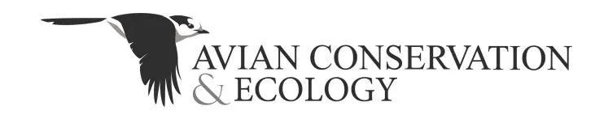
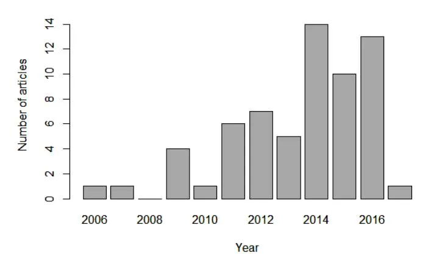
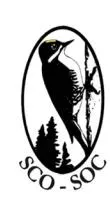
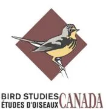

## **VOLUME 12, ISSUE 1, ARTICLE 14**

Shonfield, J., and E. M. Bayne. 2017. Autonomous recording units in avian ecological research: current use and future applications. _Avian Conservation and Ecology_ 12(1):14. https://doi.org/10.5751/ACE-00974-120114 Copyright © 2017 by the author(s). Published here under license by the Resilience Alliance.

_Essay_, part of a Special Feature on [Advancing bird population monitoring with acoustic recording technologies](http://www.ace-eco.org/viewissue.php?sf=5)

# **Autonomous recording units in avian ecological research: current use and future applications**

_[Julia Shonfield](mailto:julia.shonfield@gmail.com)1 and [Erin M. Bayne](mailto:bayne@ualberta.ca)1_ 1University of Alberta

ABSTRACT. Acoustic surveys are a widely used sampling tool in ecological research and monitoring. They are used to monitor populations and ecosystems and to study various aspects of animal behavior. Autonomous recording units (ARUs) can record sound in most environments and are increasingly used by researchers to conduct acoustic surveys for birds. In this review, we summarize the use of ARUs in avian ecological research and synthesize current knowledge of the benefits and drawbacks of this technology. ARUs enable researchers to do more repeat visits with less time spent in the field, with the added benefits of a permanent record of the data collected and reduced observer bias. They are useful in remote locations and for targeting rare species. ARUs are mostly comparable to human observers in terms of species richness, but in some cases, they detect fewer species and at shorter distances. Drawbacks of ARUs include the cost of equipment, storage of recordings, loss of data if units fail, and potential sampling trade-offs in spatial vs. temporal coverage. ARUs generate large data sets of audio recordings, but advances in automated species recognition and acoustic processing techniques are contributing to make the processing time manageable. Future applications of ARUs include biodiversity monitoring and studying habitat use, animal movement, and various behavioral ecology questions based on vocalization activity. ARUs have the potential to make significant advances in avian ecological research and to be used in more innovative ways than simply as a substitute for a human observer in the field.

## **Unités d'enregistrement autonomes en écologie aviaire : utilisations actuelles et futures**

RÉSUMÉ. Les relevés acoustiques sont largement employés comme outil d'échantillonnage pour la recherche et les suivis écologiques. Ils sont utilisés pour suivre les populations et les écosystèmes et étudier le comportement animal sous divers angles. Les unités d'enregistrement autonomes (ARU, pour _autonomus recording units_) peuvent enregistrer les sons dans la plupart des environnements et sont utilisés de plus en plus souvent par les chercheurs pour effectuer des relevés acoustiques d'oiseaux. Dans la présente revue, nous résumons l'utilisation d'ARU en écologie aviaire et synthétisons les avantages et désavantages connus de cette technologie. Les ARU permettent aux chercheurs de faire plus de visites répétées tout en passant moins de temps sur le terrain, avec l'avantage d'avoir un enregistrement permanent des données récoltées et de réduire le biais associé à l'observateur. Ils sont utiles en milieu éloigné et dans les cas où on cible des espèces rares. Les ARU sont comparables aux observateurs humains pour ce qui est de la richesse spécifique, mais dans certains cas, ils détectent moins d'espèces et à des distances plus courtes. Les désavantages des ARU comprennent le coût de l'équipement, la sauvegarde des enregistrements, la perte de données en cas de défaillance des unités, et le compromis possible à devoir faire sur le plan de la couverture d'échantillonnage (spatiale ou temporelle). Les ARU génèrent une grande quantité d'enregistrements sonores, mais les avancées quant à la reconnaissance automatisée des espèces et aux techniques de traitement acoustique contribuent à réduire le temps de traitement. Les utilisations éventuelles d'ARU comprennent le suivi de la biodiversité, l'étude de l'utilisation de l'habitat, les déplacements animaux et diverses questions en écologie comportementale fondées sur l'activité vocale. Les ARU ont le potentiel de permettre des avancées importantes en écologie aviaire et pourraient être utilisées de façon plus novatrice qu'en tant que simples substituts d'observateurs sur le terrain.

Key Words: _acoustic surveys; biodiversity monitoring; noninvasive sampling; passive acoustic monitoring; point counts; vocal communication_

#### **INTRODUCTION**

Acoustic surveys are widely used to sample avian communities or target species for ecological research, conservation, and monitoring. Many bird species vocalize reliably, and thus, acoustic surveys can be used to estimate abundance, density, or occupancy (Dawson and Efford 2009, Marques et al. 2013, Lambert and McDonald 2014, Sovern et al. 2014, Drake et al. 2016). Surveys repeated on an annual basis are useful for longterm monitoring (e.g., Furnas and Callas 2015). Acoustic surveys can employ playbacks by broadcasting vocalizations from a speaker to provoke a response (e.g., for owl surveys: Hayward et al. 1993, Laidig and Dobkin 1995), or they can be completely passive, simply listening for vocalizing species. Avian point counts are a commonly used type of passive acoustic survey whereby a human observer identifies birds in the field from vocalizations and potentially some visual detections (Rosenstock et al. 2002). Point counts have long been used to survey birds because many species are easier to detect from vocalizations, and apart from an experienced observer, they require no specialized equipment and are easy to implement across a range of conditions. This situation is changing, however. Relatively new technology is becoming increasingly available to record sound in the field autonomously using units programmed to turn on and record on a set schedule unattended in the field. We refer to these as autonomous recordings units (ARUs) and we encourage future studies to maintain consistency and use this same terminology.

Although the idea and ability to record animal vocalizations is not new, the prevalence of autonomous recording technology has increased in recent years in avian ecological research. We conducted a literature search to document the rate of increase of this technology in avian research. We conducted a search of peerreviewed literature in the Web of Science database in January 2017 using the following search terms: acoustic recording, autonomous recording unit, autonomous recorder, autonomous recording, automated digital recording system, bioacoustic monitoring, and passive acoustic monitoring. We retained only primary research articles on avian species that used recording units that could function autonomously. We identified 61 articles in 32 peerreviewed journals from 2006 to 2017 (Table A1.1 in Appendix 1). There was a noticeable increase in the number of articles published using ARUs for avian research from 2014 to 2016 (Fig. 1), and we expect this trend to continue in 2017. ARUs are being lauded as a useful tool for monitoring species that are elusive, rare, or otherwise difficult to detect using point counts (Blumstein et al. 2011, Holmes et al. 2015), although there are drawbacks. In this review, we summarize the current use of ARUs in avian ecological research and synthesize the current knowledge of the benefits and drawbacks of using ARUs. We also discuss techniques for processing and analyzing recordings and highlight future research applications. ARUs have a lot of potential but are underused in avian research. With our review, we aim to stimulate future avian research to use ARUs in innovative ways.

**Fig. 1.** Number of original research articles that used autonomous recording units for avian research that were published in peer-reviewed journals over time. See Table A1.1 in Appendix 1 for a list of all articles included in this figure.

## **ADVANTAGES AND DISADVANTAGES OF AUTONOMOUS RECORDING UNITS IN THE FIELD**

A primary consideration for using ARUs for avian research and monitoring is how their performance compares to surveys with human observers in terms of species detections. We identified 21 studies in the peer-reviewed literature that compared field surveys with human observers to recordings from either nonautonomous or autonomous recording units and summarized the results (Table 1). The majority of the studies that we identified surveyed for birds using traditional point counts in which a human observer records all birds heard and seen at a fixed location within either a specified or an unlimited radius. Other methods used to survey birds included using a recording playback for a target species (McGuire et al. 2011, Sidie-Slettedahl et al. 2015), walking a survey route (Zwart et al. 2014), and a timed area search (Wimmer et al. 2013). Five studies, including some of the earliest, used portable nonautonomous recorders (Haselmayer and Quinn 2000, Hobson et al. 2002, Celis-Murillo et al. 2009, 2012, Campbell and Francis 2011), whereas the remainder used ARUs (Table 1). The majority of studies used species richness as the metric for comparison, although other metrics for comparison included species composition, abundance, presence or absence, call counts, and detection probabilities (Table 1). Four studies had unequal sampling effort between methods, with longer sampling periods for ARUs (Acevedo and Villanueva-Rivera 2006, McGuire et al. 2011, Wimmer et al. 2013, Holmes et al. 2014), and two of these studies found that ARUs performed better than human observers (Table 1). Of the remaining 17 studies that had equal sampling effort, ARUs performed better than humans in 3 studies, equally in 8 studies, and less well than humans in 6 studies (Table 1).

Several studies that found better performance of humans than ARUs acknowledged the advantages of ARUs over point counts and reported that ARUs could be an effective method for certain objectives or target species (Borker et al. 2015, Klingbeil and Willig 2015, Sidie-Slettedahl et al. 2015, Leach et al. 2016). Several studies also suggested that using both methods in combination could be more effective than either method alone (Celis-Murillo et al. 2009, 2012, Tegeler et al. 2012, Digby et al. 2013, Holmes et al. 2014, Alquezar and Machado 2015, Van Wilgenburg et al. 2017). Only one study in which humans performed better than ARUs reported that ARUs were not cost effective compared to point counts, but acknowledged the utility of a permanent record and recommended the use of portable recorders when conducting point counts (Hutto and Stutzman 2009). In several cases in which ARUs detected fewer species or fewer individual birds than humans, this was attributed to humans being able to detect birds at greater distances (Hutto and Stutzman 2009, Venier et al. 2012, Sedláček et al. 2015, Sidie-Slettedahl et al. 2015). Two papers in this special issue demonstrate methods to correct for differential detectability of birds between ARUs and human point counts using paired sampling (Van Wilgenburg et al. 2017) and playback experiments (Yip et al. 2017*b*). Some studies attributed fewer species detections by ARUs to visual detections of birds in the field (Hutto and Stutzman 2009, Klingbeil and Willig 2015, Leach et al. 2016); however, in other studies, humans detected few species

**Table 1.** Summary of studies that evaluated the performance of autonomous and nonautonomous acoustic recorders compared to traditional avian point counts by a human observer in the field. Studies were considered to have equal effort between the two methods if each method sampled for the same cumulative amount of time.

| Study                                | Recorder type | Effort  | Metric                                                                                | Performance      |
| ------------------------------------ | ------------- | ------- | ------------------------------------------------------------------------------------- | ---------------- |
| Acevedo and Villanueva-Rivera (2006) | Autonomous    | Unequal | Species richness                                                                      | Recorder better  |
| Alquezar and Machado (2015)          | Autonomous    | Equal   | Species richness, species composition                                              | Equal            |
| Borker et al. (2015)                 | Autonomous    | Equal   | Single-species call counts                                                            | Humans better    |
| Campbell and Francis (2011)          | Nonautonomous | Equal   | Species richness                                                                      | Equal            |
| Celis-Murillo et al. (2009)          | Nonautonomous | Equal   | Species abundance, species richness, species composition, detection probability | Recorder better† |
| Celis-Murillo et al. (2012)          | Nonautonomous | Equal   | Species richness, species composition, detection probability                       | Equal            |
| Digby et al. (2013)                  | Autonomous    | Equal   | Single-species call counts                                                            | Equal‡           |
| Haselmayer and Quinn (2000)          | Nonautonomous | Equal   | Species richness                                                                      | Equal            |
| Hobson et al. (2002)                 | Nonautonomous | Equal   | Species richness, species abundance, species composition                           | Equal§           |
| Holmes et al. (2014)                 | Autonomous    | Unequal | Presence or absence of three target species                                        | Equal            |
| Hutto and Stutzman (2009)            | Autonomous    | Equal   | Species richness                                                                      | Humans better    |
| Klingbeil and Willig (2015)          | Autonomous    | Equal   | Species richness, species composition                                              | Humans better    |
| Leach et al. (2016)                  | Autonomous    | Equal   | Species richness, species composition                                              | Humans better    |
| McGuire et al. (2011)                | Autonomous    | Unequal | Presence or absence of a target species                                            | Equal            |
| Sedlácek et al. 2015                 | Autonomous    | Equal   | Species richness, species abundance, species composition                           | Equal¶           |
| Sidie-Slettedahl et al. (2015)       | Autonomous    | Equal   | Abundance of three target species, detection probability                           | Humans better    |
| Tegeler et al. (2012)                | Autonomous    | Equal   | Species richness                                                                      | Equal            |
| Van Wilgenburg et al. (2017)         | Autonomous    | Equal   | Detection probability                                                                 | Equal#           |
| Venier et al. (2012)                 | Autonomous    | Equal   | Species richness, species abundance Humans better††                                   |                  |
| Wimmer et al. (2013)                 | Autonomous    | Unequal | Species richness                                                                      | Recorder better  |
| Zwart et al. (2014)                  | Autonomous    | Equal   | Presence or absence of a target species                                            | Recorder better  |

† Similar numbers of species were detected for both methods, but there were differences in species composition between methods. The probability of detecting birds was higher when listening to recordings, and the data from recordings yielded more reliable estimates of detection probability and abundance than human point count data.

by visual cues only during point counts (Tegeler et al. 2012, Alquezar and Machado 2015). ARUs may not always be able to "hear" as far as humans can, but this will depend on the sensitivity of the ARU model and microphones (Rempel et al. 2013, Turgeon et al. 2017). Differences in the numbers of species detected could also be because of how recordings are processed in the lab, for example, the quality of headphones used when listening (Campbell and Francis 2011), the volume at which the recordings are played back, or variability among observers processing the recordings (Rempel et al. 2005). We argue that the evidence to date indicates that ARUs are generally comparable to avian point counts with human observers, offer a number of advantages over human observers in the field, and can be effective for surveying birds.

Acoustic recordings provide a permanent record, and this advantage was recognized by researchers before recording equipment became autonomous. Recordings can be reviewed by multiple observers, reducing observer bias and enabling researchers to assess detection probability and analyze factors that could affect detection (Campbell and Francis 2011). Recordings are preferable when species richness is high (Hobson

‡Human observers detected more calls, but both methods produced the same results for the most important conservation information from the survey: the annual change in calling activity of Little Spotted Kiwi (_Apteryx owenii_).

§Human observers detected a few more species, but the species composition was very similar and species abundance estimates did not differ between methods. |Using an automated recognition approach to detect target species on recordings worked as well as point counts with human observers for Acadian Flycatcher (_Empidonax virescens_) and Cerulean Warbler (_Setophaga cerulea_), but point counts outperformed recordings for Prothonotary Warbler (_Protonotaria citrea_).

¶ Species richness was not significantly different between methods, and species composition was similar. Although there was a strong correlation between species abundance for the two methods, the recorders underestimated abundance for several bird species.

#Most species did not show a bias in detection probability between the methods, and raw counts were relatively comparable between methods, although a few species did show substantial bias.

††Humans performed better compared to an autonomous recording unit (Song Meter SM1; Wildlife Acoustics, Maynard, Massachusetts, USA), and this comparison was the primary objective of the study. However, a nonautonomous recorder (E3A; River Forks Research, Hope, British Columbia, Canada) also included in the study performed similarly to humans.

et al. 2002, Campbell and Francis 2011), particularly during the dawn chorus (Haselmayer and Quinn 2000), because of the ability to listen multiple times. A downside to this is the increased amount of time spent listening to recordings. However, a permanent record can be important for verifying species identification of uncommon or rare species (Jones et al. 2007, Swiston and Mennill 2009). In addition, a permanent record enables comparisons of contemporary to historical vocalizations. For example, using archived audio recordings, Luther and Derryberry (2012) found that the songs of White-Crowned Sparrow (_Zonotrichia leucophrys_) increased in minimum frequency over a 37-year period in San Francisco, USA, concurrent with rising levels of traffic noise. A disadvantage of audio recordings is that storage requirements for recordings can rapidly become overwhelming and require considerable planning and expense to maintain. Nevertheless, permanent audio records are likely to be an important data source for tracking changes in species distributions and animal vocalizations over time, including documenting biodiversity changes in areas with increasing anthropogenic disturbance.

Fully autonomous recording units have some distinct advantages in the field over avian point counts and nonautonomous recording equipment. ARUs can be set up or taken down in a matter of minutes and, although they require a minimum of two visits by field personnel, they require less field time in total compared with point counts in some cases (e.g., Holmes et al. 2014). ARUs can be programmed to record for a similar duration as point counts (e.g., 3–10 min), but can make several recordings per day and multiple surveys can be done over several days or months (e.g., Goyette et al. 2011, Tegeler et al. 2012). The increased temporal effort makes ARUs a useful tool for studying rare or elusive species that vocalize infrequently (Rognan et al. 2012, Holmes et al. 2014, 2015, Zwart et al. 2014, Cerqueira and Aide 2016). A downside is that if an ARU fails to record, the loss of data could go unnoticed for a long time, making it imperative to check units before deployment. Another disadvantage of ARUs is that there can be a trade-off between temporal coverage and spatial coverage. Initial purchase costs of ARUs are high, and there are ongoing maintenance costs for replacing batteries and damaged microphones. Achieving similar spatial coverage as point counts would require either a large number of ARUs (a considerable cost) or moving them to new locations often.

ARUs can be deployed at a time that is convenient and can be programmed to record at a suitable time for target species. This flexibility could be advantageous for surveying returning migratory birds, some of which have begun migrating earlier because of climate change (Cotton 2003), because ARUs can be deployed before the birds arrive. This flexibility also makes ARUs an attractive option for surveying remote locations and conducting nocturnal surveys (e.g., Goyette et al. 2011, Digby et al. 2013, Sidie-Slettedahl et al. 2015). A pilot project by Environment and Climate Change Canada used ARUs to survey northern boreal bird species near the northern limit of their breeding range in the Northwest Territories, a region largely inaccessible because of few all-season roads. By taking advantage of winter roads to communities and diamond mines, they deployed ARUs in the winter, programmed them to turn on and record migratory birds in the spring, and retrieved the data in the following winter when the roads were open again (S. Haché, _personal communication_). ARUs will likely prove useful in other cases where accessibility for conducting surveys is a limiting factor.

Observers conducting point counts may introduce bias to the data collected if their presence affects a bird's behavior or if the observer cannot reliably detect all species. An observer's ability to detect vocalizations can vary with experience, but with ARUs, less experienced observers with access to reference recordings can obtain similar accuracy to more experienced personnel while listening to audio recordings in the lab (Goyette et al. 2011). Acoustic detections from both point counts and ARU-based surveys are subject to the observer's hearing ability, but with ARUs it is possible to reduce this bias to some extent by being able to adjust the volume and having multiple observers listen to recordings. A disadvantage is that multiple-observer modeling approaches may overestimate the number of species because of identification errors (Campbell and Francis 2011). Observers conducting point counts in the field may disturb and influence the behavior of birds. Birds may flush upon the arrival of an observer, and the approach distance can be influenced by clothing color of the observer for some species (Gutzwiller and Marcum 1997). Another study in a different bird community, however, found no effect of observer presence on bird behavior (Campbell and Francis 2012). Field personnel setting up an ARU may influence the behavior of birds while they are present, but this disturbance is temporary, and the recordings will occur without the observer present, so it is less likely that timid or shy birds are negatively affected.

## **TECHNIQUES FOR PROCESSING RECORDINGS**

ARUs can reduce field time but significantly increase processing time in the lab by generating large data sets that can present challenges. Listening to recordings is a common processing approach and is probably still the best option for studies of avian community composition. Several factors can influence species detection during listening such as headphone quality, multiple listeners, and repeated listening to a recording. Projects should establish a standardized listening protocol before processing acoustic data to minimize potential bias from these factors. Spectrograms are frequently used during listening to enhance species detection and identification. For studies targeting one or a few species of interest, manual scanning of spectrograms without listening can be an efficient processing method if the vocalizations are visually distinctive and recognizable (Swiston and Mennill 2009). Software for generating spectrograms and sound editing is readily available as freeware (e.g., Audacity) or commercial software (e.g., Adobe Audition). In addition, Obrist et al. (2010) identify a number of programs dedicated to bioacoustic use, some of which are equipped with tools for sound analysis and automated species recognition to facilitate processing recordings.

Recent advances in automated species recognition is likely to increase the efficiency of processing large volumes of acoustic recordings for avian research and monitoring. In general, the process involves matching recording segments to a template (often termed a "recognizer") derived from training data and registering a hit when a similarity threshold is reached. A few different approaches have been developed, including band-limited energy detectors (Mills 2000), binary point matching (Katz et al. 2016),

decision trees (Acevedo et al. 2009, Digby et al. 2013), random forests (Ross and Allen 2014), spectrogram cross-correlation (Katz et al. 2016), hidden Markov models (Wildlife Acoustics 2011), and, most recently, deep learning through convolutional neural networks (Salamon and Bello 2017). Only a few of these approaches are incorporated into commercial or open-source software, including Song Scope (Wildlife Acoustics, Maynard, Massachusetts, USA), Raven Pro (Cornell Laboratory of Ornithology, Ithaca, New York, USA), and R package "monitoR" (Hafner and Katz 2017), making them more easily accessible to avian researchers. It is important to note that species recognition is rarely completely automated for any of these approaches or programs; it is usually necessary to have human observers check automated output results to filter out false positives (Buxton and Jones 2012, Zwart et al. 2014, Colbert et al. 2015, Sidie-Slettedahl et al. 2015). False negatives are also a concern with recognizers, and their detection usually involves listening or manual scanning of recordings to identify vocalizations that the computer missed (Buxton and Jones 2012, Zwart et al. 2014, Holmes et al. 2015). Nevertheless, a recognizer can be useful in detecting rare or elusive species and can make data processing more efficient and manageable.

Processing recordings using a recognizer can be effective and efficient, but it is not always a straightforward process. There are examples in the literature of successful (Buxton and Jones 2012, Taff et al. 2014, Zwart et al. 2014, Holmes et al. 2015) and less successful attempts (Colbert et al. 2015, Sidie-Slettedahl et al. 2015) to build recognizers to identify species calls on recordings. One issue is that abiotic noise on the recordings, e.g., from heavy wind or rain, can cause high numbers of false positives (Buxton and Jones 2012, Zwart et al. 2014) and can also increase the rate of false negatives (Buxton and Jones 2012, Willacy et al. 2015). Another issue is that overlapping calls from other species on recordings can result in failure to detect the target species calls (Buxton and Jones 2012). Ultimately, the effectiveness of a recognizer will depend on the research question. If the goal is to determine if a species is present, then a recognizer is useful as long as it reliably detects a species when it is present. To study calling behavior, a large majority of the vocalizations on recordings need to be detected. One of the problems with comparing performance of recognizers is that there are no established standard assessment metrics or detection thresholds, and thus, there are few comparisons of performance across approaches or software programs (but see Acevedo et al. 2009). The need for a common framework in the development and assessment of recognizers for automated species recognition has been identified (Blumstein et al. 2011), and some progress has been made toward this goal (Potamitis et al. 2014), but more collaborative work is still needed in this area.

Automated species recognition is not the only recent advance in tools for processing acoustic recordings. There are now several packages available in R (R Core Team 2016) that can import sound files and offer various sound analysis functions. The R package "seewave," for example, has functions for time, amplitude, and frequency analyses, as well as generating sounds for playback experiments (Sueur et al. 2008). The "soundecology" package has functions to implement acoustic indices to characterize animal acoustic communities and soundscapes from the physical attributes of sound on recordings (Villanueva-Rivera and Pijanowski 2016). In addition to automated species recognition, the "monitoR" package has functions to rename recordings and isolate shorter segments in long recordings, which can be useful if using an ARU with limited scheduling capabilities (Katz et al. 2016). The recently developed "warbleR" package builds upon "seewave" and "monitoR" functions to streamline analyses of acoustic signal structure by measuring signal parameters (frequency, time, and amplitude) and pairwise acoustic dissimilarity and performing pairwise spectrogram cross-correlations (Araya-Salas and Smith-Vidaurre 2017). Another type of advance in bioacoustic processing is the development of an automated monitoring network that combines hardware and software to record sound in the field and send the recordings to a data server in real time for processing, and it includes tools for data management and automated species recognition (Aide et al. 2013). Advances in bioacoustic processing will no doubt continue to improve the efficiency of processing large volumes of acoustic recordings.

## **STATISTICAL APPROACHES TO ANALYZING AUTONOMOUS RECORDING UNIT DATA**

Statistical analysis of acoustic data collected with ARUs presents a number of possibilities and challenges. Estimating species density or abundance per unit area is important for conservation research, monitoring programs, and wildlife management planning. ARUs are basically unlimited distance point counts, making it problematic to estimate density because the detection radius and consequently the area surveyed can change across species, habitats, and ARU models (Yip et al. 2017*a,b*). One approach is to estimate a detection radius for each species by broadcasting calls at varying distances from the ARU and calculating a radius based on what observers can hear from a set of sounds known to have occurred at set distances (Yip et al. 2017*a*). Another similar approach is to use theoretical sound transmission and playback trials to determine a threshold volume of the calls within a certain radius. Lambert and McDonald (2014) determined that Australian Bell Miner (_Manorina melanophrys_) within a 50-m radius of the ARU would be louder than 70 dB and were able to calculate density within this radius. A problem with these approaches is that the output volume of bird vocalizations has rarely been measured, making it difficult to determine an appropriate volume for the playback. An inappropriate playback volume could either underestimate or overestimate the detection radius, and there remains considerably more work to do in this area.

Distance sampling has been lauded as a useful tool to estimate density from point counts (Rosenstock et al. 2002). Distance sampling estimates the rate of missed detections based on the distance between observers and detected animals by fitting a detection function that corrects for individuals missed during a species count (Buckland et al. 2001). If it were possible to estimate reliably the distance of species heard on ARU recordings (e.g., using amplitude or a measure of signal strength), distance sampling to estimate density could be feasible, but more work is still needed in this area. A more promising approach is to use arrays of passive detectors and spatially explicit capture-recapture methods to estimate density from locations of individuals (Efford et al. 2009). This approach has been extended to estimate bird densities from an array of acoustic recorders and was found to be more precise than mist-netting (Dawson and Efford 2009). The key with this approach is that individuals must be able to be identified from vocalizations, although individuals do not need to be localized; the models estimate call density from the spatial pattern of detections (Efford et al. 2009). This approach holds promise for estimating bird densities using ARUs. However, implementation of this approach will require considerable investment in equipment and time spent in analyzing acoustic data.

Estimating occupancy from acoustic surveys may be a more feasible alternative to estimating density. Occupancy modeling uses repeat observations at sites to estimate detectability and account for imperfect detection when estimating the probability of a species occupying a site or patch (Mackenzie et al. 2002). Acoustic data collected with ARUs are well suited for this approach because of the ease of increasing the number of observations, or visits, with no additional field time required. Increasing the number of visits and sampling sites improves the accuracy and precision of occupancy estimates (Mackenzie et al. 2002). Automated species recognition from ARUs can be an efficient method to obtain data from acoustic recordings for occupancy modeling (Cerqueira and Aide 2016). An issue with estimating occupancy is that interpreting the biological meaning of the results requires some knowledge of species movement and home range size. For example, if a species' movement rate is fairly low and it has a small home range size, then a single ARU is appropriate to determine occupancy of that species because it is unlikely to move in and out of the area surveyed and thus meets the assumption of closure. Violations of the assumption of closure can lead to overestimates of the probability of occupancy (Rota et al. 2009). For species with larger home ranges than the area surveyed by a single ARU, an occupancy modelling approach may still be used, but must be interpreted as the probability of the species using an area during the sampling season as opposed to occupancy. Assessing occupancy in such a context and using it to provide an index of abundance may require multiple ARUs to define a sampling unit.

The occupancy modeling approach is quite flexible and has been adapted to deal with a variety of different sampling scenarios. The original model estimates occupancy of a single species during a single season (Mackenzie et al. 2002). Multiseason or dynamic models estimate colonization and local extinction of sites or patches by a single species over multiple seasons (Mackenzie et al. 2003). Co-occurrence models account for interactions between species on occupancy and detection (Mackenzie et al. 2004) and have been used to investigate competitive exclusion between Northern Spotted Owl (_Strix occidentalis caurina_) and Barred Owl (_Strix varia_) in Oregon (Bailey et al. 2009). It is possible to allow for both false negative and false positive error rates when modeling site occupancy (Royle and Link 2006). Occupancy models developed to use data from multiple detection methods could prove useful for surveys that use human observers and ARUs in combination to be able to make inferences about method-specific detection probabilities (Nichols et al. 2008). There are also Bayesian approaches to occupancy modeling (Royle and Kéry 2007, Kéry and Royle 2008). Many of the occupancy models mentioned can be implemented using the R package "unmarked" (Fiske and Chandler 2011) and are an important statistical tool for analyzing and interpreting acoustic data collected with ARUs.

A future challenge of analyzing acoustic data from ARUs is integrating data that were collected differently and over different lengths of time. This will be a challenge for biodiversity monitoring programs that may change recording technology as new models of ARUs become available. A practical solution is for monitoring programs to have a period of overlap between older and newer ARU models to be able to make direct comparisons between units (Rempel et al. 2013). Recording schedules within a monitoring program may also change from year to year as methods become more refined or as different species become important targets for conservation. One of the main challenges with analyzing ARU data is determining the unit of replication, and this can be particularly problematic if the sampling effort at a point is inconsistent between years. In addition to changes in sampling effort (i.e., recording schedule), the microphones can degrade and lose sensitivity with field use (Turgeon et al. 2017), and the settings used for the audio recordings can differ, all of which can affect the number of species that are detected. Occupancy modeling can provide some solutions to these issues because differences in detection probability between methods can be estimated (e.g., different models of ARUs) and the models can handle missing data if some visits are missed, which may occur if the ARU fails to record at a particular point in time. Nevertheless, research and monitoring programs using ARUs will need to consider these issues and should have a system of quality control to ensure that microphones and ARUs are meeting a set standard each time they are deployed.

## **CURRENT AND FUTURE APPLICATIONS**

ARUs have the potential to be used in innovative ways in avian ecological research beyond simply being a substitute for a human observer. We highlight some examples of applications of ARUs that fall into three general research categories: biological monitoring, animal movement, and communication behavior. ARUs can be an effective method for tracking presence or absence of multiple taxa for monitoring and conservation. ARUs can monitor the success of conservation programs (e.g., activity at seabird colonies after invasive predator eradication; Buxton and Jones 2012). Monitoring can continue uninterrupted as long as ARUs are serviced and batteries and data storage are replenished. ARUs can be deployed at the same location for several weeks to record at the optimal time for multiple taxa. ARUs deployed in temperate regions, for example, can detect owls calling in early spring, followed by amphibians and songbirds as the season progresses. The timing of biological surveys for monitoring is important to determine whether a species is present with some certainty, and the ability of ARUs to record over an extended period can facilitate getting the timing right.

Bioacoustic monitoring may extend beyond species counts to acoustic habitat mapping and soundscape monitoring in the future. Dumyahn and Pijanowski (2011) argue that soundscapes have value worthy of conservation. Data processing methods have recently been established to characterize sounds from different sources (e.g., biotic, abiotic, and anthropogenic) for acoustic habitat monitoring to detect changes in soundscapes (Merchant et al. 2015). In addition, various acoustic indices have recently been developed to characterize animal acoustic communities and soundscapes from the physical attributes of sound (Sueur et al. 2014). The acoustic complexity index (Pieretti et al. 2011), for example, was tested to detect shifts in songbird phenology and was an effective, though coarse metric to detect the arrival of migrating songbirds (Buxton et al. 2016). Although these acoustic indices do not provide information about which species are present, studies have suggested that some indices may be useful in estimating diversity (Depraetere et al. 2012), calling activity (Farina et al. 2011, Buxton et al. 2016), and directing the selection of recordings to process (Towsey et al. 2014). More rigorous testing and research on acoustic indices and their interpretation is needed, and avian studies can benefit and make important contributions to this research (Gasc et al. 2017). Newly developed tools in bioacoustics such as acoustic habitat mapping and acoustic indices may prove useful for bioacoustic monitoring as well as habitat and biodiversity assessments.

Recording animal vocalizations using ARUs is a noninvasive method to collect data on animal movement patterns and habitat use on both large and small scales. At a large scale, ARUs can be used to study migration pathways and time of arrival of migratory birds (Farnsworth and Russell 2007, Sanders and Mennill 2014, Buxton et al. 2016). At a small scale, time-synced ARUs arranged in an array can allow for localization of individuals within their home range using the time difference of arrival of acoustic signals (Mennill et al. 2006, 2012, Campbell and Francis 2012, Frommolt and Tauchert 2014). In addition to studying habitat use, localization can be used to estimate density (Lambert and McDonald 2014) using standard distance sampling methods (Buckland et al. 2001) and to study behavioral patterns associated with vocalizations (e.g., function of songbird duets; Mennill and Vehrencamp 2008). For some species, it is possible to identify individuals using song discrimination techniques (Ehnes and Foote 2015, Petrusková et al. 2016), which could be useful for estimating return rates between breeding seasons and for behavioral studies tracking individuals throughout the breeding season. Localization can be used on any vocalizing species regardless of its size (unlike VHF tags) without capturing and handling it. A disadvantage of localization is that it increases data processing time substantially. Even with recently developed software (Wilson et al. 2014), this method is still very time consuming because each sound needs to be processed manually to calculate the time difference of arrival. Localization will only be effective for species that vocalize regularly and for species with individually unique vocal characteristics that persist over time (Mennill 2011), but it can provide movement data for species that may be difficult to capture or too small for any other type of tracking technology.

ARUs have the ability to collect detailed data on vocalizing behavior. Data on daily or seasonal vocalization patterns (e.g., Goyette et al. 2011, Sosa-López and Mennill 2014) can enable researchers to study communication and the effects of neighborhood social context on vocal behavior (e.g., Taff et al. 2014). New ARUs that can be attached to an animal (referred to as on-animal devices or acoustic tags) can address different behavioral ecology questions than ARUs deployed in the environment. Acoustic tags have primarily been used in studies of marine mammals (Mellinger et al. 2007, Johnson et al. 2009) but were recently attached to Common Nighthawk (_Chordeiles minor_) in a study in northern Alberta, Canada (E. Knight, _personal communication_). Acoustic tags have the benefit that they can record both intentional and unintentional vocalizations. Feeding noise is an example of an unintentional vocalization and has been used to quantify daily time budgeting of mule deer (_Odocoileus hemionus;_ Lynch et al. 2013). Acoustic tags could prove useful for a wider variety of avian studies assuming the size of the technology decreases in coming years. Recording animal vocalizations from an ARU in the environment or attached to an animal provides an opportunity to address questions about vocalization characteristics, calling behavior, foraging, movement, and effects of sound in the environment (including from anthropogenic sources) on animal behavior.

## **CONCLUSION**

ARUs have a number of benefits for avian ecological research, including the ease of repeat sampling across spatial and temporal scales, reduced observer bias, reduced field time, and a permanent record of the survey. ARUs have comparable species detection rates to avian point counts using human observers, although there are some cases with lower detection rates for ARUs. Understanding the sampling distance of ARUs and how this varies relative to that for humans, other ARU types, and in different environments is a crucial area of research that is required to maximize the benefits of ARUs. Other drawbacks to be aware of include difficulty processing large amounts of data, storage capacity for the audio files, differences in recording schedules and settings between years, and potential recording problems as equipment ages. The drawbacks are not necessarily an issue if the equipment is properly maintained, the ecological question is appropriate for the use of ARUs, and careful thought goes into the study design. Much of the avian research using ARUs to date has focused on comparing species detection data from ARUs to that from human observers. Although this is an important test for any new technology before using it more extensively, the results have demonstrated that ARUs are comparable. ARUs have the potential to be used in more innovative ways than simply as a substitute for a human observer in the field, and we are excited to see how this new technology will provide fundamental insights into the ecology of vocalizing birds.

_Responses to this article can be read online at:_ <http://www.ace-eco.org/issues/responses.php/974>

#### **Acknowledgments:**

_We thank members of the Bayne lab, Steve Van Wilgenburg, and two anonymous reviewers for helpful and insightful comments on earlier drafts of this manuscript. We would like to acknowledge the financial support of the Alberta Biodiversity Monitoring Institute, Alberta Conservation Association, Northern Scientific Training Program, Canadian Circumpolar Institute, Ecological Monitoring Committee for the Lower Athabasca, Joint Oil Sands Monitoring Program, and Canada's Oil Sands Innovation Alliance. Julia Shonfield was supported by funding from the National Science and Engineering Research Council and by Nexen Energy._

### **LITERATURE CITED**

- Acevedo, M. A., C. J. Corrada-Bravo, H. Corrada-Bravo, L. J. Villanueva-Rivera, and T. M. Aide. 2009. Automated classification of bird and amphibian calls using machine learning: a comparison of methods. _Ecological Informatics_ 4:206-214. <http://dx.doi.org/10.1016/j.ecoinf.2009.06.005>
- Acevedo, M. A., and L. J. Villanueva-Rivera. 2006. Using automated digital recording systems as effective tools for the monitoring of birds and amphibians. _Wildlife Society Bulletin_ 34:211-214. [http://dx.doi.org/10.2193/0091-7648\(2006\)34\[211:UADRSA\]](http://dx.doi.org/10.2193/0091-7648%282006%2934%5B211%3AUADRSA%5D2.0.CO%3B2) [2.0.CO;2](http://dx.doi.org/10.2193/0091-7648%282006%2934%5B211%3AUADRSA%5D2.0.CO%3B2)
- Aide, T. M., C. Corrada-Bravo, M. Campos-Cerqueira, C. Milan, G. Vega, and R. Alvarez. 2013. Real-time bioacoustics monitoring and automated species identification. _PeerJ_ 1:e103. [http://dx.doi.](http://dx.doi.org/10.7717/peerj.103) [org/10.7717/peerj.103](http://dx.doi.org/10.7717/peerj.103)
- Alquezar, R. D., and R. B. Machado. 2015. Comparisons between autonomous acoustic recordings and avian point counts in open woodland savanna. _Wilson Journal of Ornithology_ 127:712-723. <http://dx.doi.org/10.1676/14-104.1>
- Araya-Salas, M., and G. Smith-Vidaurre. 2017. WarbleR: an R package to streamline analysis of animal acoustic signals. _Methods in Ecology and Evolution_ 8:184-191. [http://dx.doi.](http://dx.doi.org/10.1111/2041-210X.12624) [org/10.1111/2041-210X.12624](http://dx.doi.org/10.1111/2041-210X.12624)
- Bailey, L. L., J. A. Reid, E. D. Forsman, and J. D. Nichols. 2009. Modeling co-occurrence of northern spotted and barred owls: accounting for detection probability differences. _Biological Conservation_ 142:2983-2989. [http://dx.doi.org/10.1016/j.](http://dx.doi.org/10.1016/j.biocon.2009.07.028) [biocon.2009.07.028](http://dx.doi.org/10.1016/j.biocon.2009.07.028)
- Blumstein, D. T., D. J. Mennill, P. Clemins, L. Girod, K. Yao, G. L. Patricelli, J. L. Deppe, A. H. Krakauer, C. Clark, K. A. Cortopassi, S. F. Hanser, B. McCowan, A. M. Ali, and A. N. G. Kirschel. 2011. Acoustic monitoring in terrestrial environments using microphone arrays: applications, technological considerations and prospectus. _Journal of Applied Ecology_ 48:758-767. [http://dx.](http://dx.doi.org/10.1111/j.1365-2664.2011.01993.x) [doi.org/10.1111/j.1365-2664.2011.01993.x](http://dx.doi.org/10.1111/j.1365-2664.2011.01993.x)
- Borker, A. L., P. Halbert, M. W. McKown, B. R. Tershy, and D. A. Croll. 2015. A comparison of automated and traditional monitoring techniques for marbled murrelets using passive acoustic sensors. _Wildlife Society Bulletin_ 39:813-818. [http://dx.](http://dx.doi.org/10.1002/wsb.608) [doi.org/10.1002/wsb.608](http://dx.doi.org/10.1002/wsb.608)
- Buckland, S. T., D. R. Anderson, K. P. Burnham, J. L. Laake, D. L. Borchers, and L. Thomas. 2001. _Introduction to distance sampling: estimating abundance of biological populations._ Oxford University Press, Oxford, UK.
- Buxton, R. T., E. Brown, L. Sharman, C. M. Gabriele, and M. F. McKenna. 2016. Using bioacoustics to examine shifts in songbird phenology. _Ecology and Evolution_ 6:4697-4710. [http://dx.doi.](http://dx.doi.org/10.1002/ece3.2242) [org/10.1002/ece3.2242](http://dx.doi.org/10.1002/ece3.2242)
- Buxton, R. T., and I. L. Jones. 2012. Measuring nocturnal seabird activity and status using acoustic recording devices: applications for island restoration. _Journal of Field Ornithology_ 83:47-60. <http://dx.doi.org/10.1111/j.1557-9263.2011.00355.x>
- Campbell, M., and C. M. Francis. 2011. Using stereomicrophones to evaluate observer variation in North American

- Breeding Bird Survey point counts. _Auk_ 128:303-312. [http://dx.](http://dx.doi.org/10.1525/auk.2011.10005) [doi.org/10.1525/auk.2011.10005](http://dx.doi.org/10.1525/auk.2011.10005)
- Campbell, M., and C. M. Francis. 2012. Using microphone arrays to examine effects of observers on birds during point count surveys. _Journal of Field Ornithology_ 83:391-402. [http://dx.doi.](http://dx.doi.org/10.1111/j.1557-9263.2012.00389.x) [org/10.1111/j.1557-9263.2012.00389.x](http://dx.doi.org/10.1111/j.1557-9263.2012.00389.x)
- Celis-Murillo, A., J. L. Deppe, and M. F. Allen. 2009. Using soundscape recordings to estimate bird species abundance, richness, and composition. _Journal of Field Ornithology_ 80:64-78. <http://dx.doi.org/10.1111/j.1557-9263.2009.00206x>
- Celis-Murillo, A., J. L. Deppe, and M. P. Ward. 2012. Effectiveness and utility of acoustic recordings for surveying tropical birds. _Journal of Field Ornithology_ 83:166-179. [http://dx.doi.](http://dx.doi.org/10.1111/j.1557-9263.2012.00366.x) [org/10.1111/j.1557-9263.2012.00366.x](http://dx.doi.org/10.1111/j.1557-9263.2012.00366.x)
- Cerqueira, M. C., and M. T. Aide. 2016. Improving distribution data of threatened species by combining acoustic monitoring and occupancy modeling. _Methods in Ecology and Evolution_ 7 (11):1340-1348.<http://dx.doi.org/10.1111/2041-210X.12599>
- Colbert, D. S., J. A. Ruttinger, M. Streich, M. Chamberlain, L. M. Conner, and R. J. Warren. 2015. Application of autonomous recording units to monitor gobbling activity by wild turkey. _Wildlife Society Bulletin_ 39:757-763. [http://dx.doi.org/10.1002/](http://dx.doi.org/10.1002/wsb.577) [wsb.577](http://dx.doi.org/10.1002/wsb.577)
- Cotton, P. A. 2003. Avian migration phenology and global climate change. _Proceedings of the National Academy of Sciences_ 100:12219-12222. <http://dx.doi.org/10.1073/pnas.1930548100>
- Dawson, D. K., and M. G. Efford. 2009. Bird population density estimated from acoustic signals. _Journal of Applied Ecology_ 46:1201-1209. [http://dx.doi.org/10.1111/j.1365-2664.2009.01731.](http://dx.doi.org/10.1111/j.1365-2664.2009.01731.x) [x](http://dx.doi.org/10.1111/j.1365-2664.2009.01731.x)
- Depraetere, M., S. Pavoine, F. Jiguet, A. Gasc, S. Duvail, and J. Sueur. 2012. Monitoring animal diversity using acoustic indices: implementation in a temperate woodland. _Ecological Indicators_ 13:46-54.<http://dx.doi.org/10.1016/j.ecolind.2011.05.006>
- Digby, A., M. Towsey, B. D. Bell, and P. D. Teal. 2013. A practical comparison of manual and autonomous methods of acoustic monitoring. _Methods in Ecology and Evolution_ 4:675-683. [http://](http://dx.doi.org/10.1111/2041-210X.12060) [dx.doi.org/10.1111/2041-210X.12060](http://dx.doi.org/10.1111/2041-210X.12060)
- Drake, K. L., M. Frey, D. Hogan, and R. Hedley. 2016. Using digital recordings and sonogram analysis to obtain counts of yellow rails. _Wildlife Society Bulletin_ 40(2):346-354. [http://dx.doi.](http://dx.doi.org/10.1002/wsb.658) [org/10.1002/wsb.658](http://dx.doi.org/10.1002/wsb.658)
- Dumyahn, S. L., and B. C. Pijanowski. 2011. Soundscape conservation. _Landscape Ecology_ 26:1327-1344. [http://dx.doi.](http://dx.doi.org/10.1007/s10980-011-9635-x) [org/10.1007/s10980-011-9635-x](http://dx.doi.org/10.1007/s10980-011-9635-x)
- Efford, M. G., D. K. Dawson, and D. L. Borchers. 2009. Population density estimated from locations of individuals on a passive detector array. _Ecology_ 90:2676-2682. [http://dx.doi.](http://dx.doi.org/10.1890/08-1735.1) [org/10.1890/08-1735.1](http://dx.doi.org/10.1890/08-1735.1)
- Ehnes, M., and J. R. Foote. 2015. Comparison of autonomous and manual recording methods for discrimination of individually distinctive Ovenbird songs. _Bioacoustics_ 24:111-121. [http://dx.](http://dx.doi.org/10.1080/09524622.2014.994228) [doi.org/10.1080/09524622.2014.994228](http://dx.doi.org/10.1080/09524622.2014.994228)

- Farina, A., N. Pieretti, and L. Piccioli. 2011. The soundscape methodology for long-term bird monitoring: a Mediterranean Europe case-study. _Ecological Informatics_ 6:354-363. [http://dx.](http://dx.doi.org/10.1016/j.ecoinf.2011.07.004) [doi.org/10.1016/j.ecoinf.2011.07.004](http://dx.doi.org/10.1016/j.ecoinf.2011.07.004)
- Farnsworth, A., and R. W. Russell. 2007. Monitoring flight calls of migrating birds from an oil platform in the northern Gulf of Mexico. _Journal of Field Ornithology_ 78:279-289. [http://dx.doi.](http://dx.doi.org/10.1111/j.1557-9263.2007.00115.x) [org/10.1111/j.1557-9263.2007.00115.x](http://dx.doi.org/10.1111/j.1557-9263.2007.00115.x)
- Fiske, I. J., and R. B. Chandler. 2011. Unmarked: an R package for fitting hierarchical models of wildlife occurrence and abundance. _Journal of Statistical Software_ 43:1-23. [http://dx.doi.](http://dx.doi.org/10.1002/wics.10) [org/10.1002/wics.10](http://dx.doi.org/10.1002/wics.10)
- Frommolt, K. H., and K. H. Tauchert. 2014. Applying bioacoustic methods for long-term monitoring of a nocturnal wetland bird. _Ecological Informatics_ 21:4-12. [http://dx.doi.](http://dx.doi.org/10.1016/j.ecoinf.2013.12.009) [org/10.1016/j.ecoinf.2013.12.009](http://dx.doi.org/10.1016/j.ecoinf.2013.12.009)
- Furnas, B. J., and R. L. Callas. 2015. Using automated recorders and occupancy models to monitor common forest birds across a large geographic region. _Journal of Wildlife Management_ 79:325-337.<http://dx.doi.org/10.1002/jwmg.821>
- Gasc, A., D. Francomano, J. B. Dunning, and B. C. Pijanowski. 2017. Future directions for soundscape ecology: the importance of ornithological contributions. _Auk_ 134:215-228. [http://dx.doi.](http://dx.doi.org/10.1642/AUK-16-124.1) [org/10.1642/AUK-16-124.1](http://dx.doi.org/10.1642/AUK-16-124.1)
- Goyette, J. L., R. W. Howe, A. T. Wolf, and W. D. Robinson. 2011. Detecting tropical nocturnal birds using automated audio recordings. _Journal of Field Ornithology_ 82:279-287. [http://dx.doi.](http://dx.doi.org/10.1111/j.1557-9263.2011.00331.x) [org/10.1111/j.1557-9263.2011.00331.x](http://dx.doi.org/10.1111/j.1557-9263.2011.00331.x)
- Gutzwiller, K. J., and H. A. Marcum. 1997. Bird reactions to observer clothing color: implications for distance-sampling techniques. _Journal of Wildlife Management_ 61:935-947. [http://](http://dx.doi.org/10.2307/3802203) [dx.doi.org/10.2307/3802203](http://dx.doi.org/10.2307/3802203)
- Hafner, S., and J. Katz. 2017. _MonitoR: acoustic template detection in R._ R package version 1.0.5. [online] URL: [http://www.](http://www.uvm.edu.rsenr/vtcfwru/r/?Page=monitoR/monitoR.htm) [uvm.edu.rsenr/vtcfwru/r/?Page=monitoR/monitoR.htm](http://www.uvm.edu.rsenr/vtcfwru/r/?Page=monitoR/monitoR.htm)
- Haselmayer, J., and J. S. Quinn. 2000. A comparison of point counts and sound recording as bird survey methods in Amazonian Southeast Peru. _Condor_ 102:887-893. [http://dx.doi.org/10.1650/0010-5422](http://dx.doi.org/10.1650/0010-5422%282000%29102%5B0887%3AACOPCA%5D2.0.CO%3B2) [\(2000\)102\[0887:ACOPCA\]2.0.CO;2](http://dx.doi.org/10.1650/0010-5422%282000%29102%5B0887%3AACOPCA%5D2.0.CO%3B2)
- Hayward, G. D., P. H. Hayward, and E. O. Garton. 1993. Ecology of boreal owls in northern Rocky Mountains, U.S.A. _Wildlife Monographs_ 124:3-59.
- Hobson, K. A., R. S. Rempel, H. Greenwood, B. Turnbull, and S. L. Van Wilgenburg. 2002. Acoustic surveys of birds using electronic recordings: new potential from an omnidirectional microphone system. _Wildlife Society Bulletin_ 30:709-720.
- Holmes, S. B., K. A. McIlwrick, and L. A. Venier. 2014. Using automated sound recording and analysis to detect bird speciesat-risk in southwestern Ontario woodlands. _Wildlife Society Bulletin_ 38:591-598. <http://dx.doi.org/10.1002/wsb.421>
- Holmes, S. B., K. Tuininga, K. A. McIlwrick, M. Carruthers, and E. Cobb. 2015. Using an integrated recording and sound analysis system to search for Kirtland's warbler (_Setophaga kirtlandii_) in

- Ontario. _Canadian Field-Naturalist_ 129:115-120. [http://dx.doi.](http://dx.doi.org/10.22621/cfn.v129i2.1688) [org/10.22621/cfn.v129i2.1688](http://dx.doi.org/10.22621/cfn.v129i2.1688)
- Hutto, R. L., and R. J. Stutzman. 2009. Humans versus autonomous recording units: a comparison of point-count results. _Journal of Field Ornithology_ 80:387-398. [http://dx.doi.](http://dx.doi.org/10.1111/j.l557-9263.2009.00245.x) [org/10.1111/j.l557-9263.2009.00245.x](http://dx.doi.org/10.1111/j.l557-9263.2009.00245.x)
- Johnson, M., N. Aguilar de Soto, and P. T. Madsen. 2009. Studying the behaviour and sensory ecology of marine mammals using acoustic recording tags: a review. _Marine Ecology Progress Series_ 395:55-73. <http://dx.doi.org/10.3354/meps08255>
- Jones, C. D., J. R. Troy, and L. Y. Pomara. 2007. Similarities between _Campephilus_ woodpecker double raps and mechanical sounds produced by duck flocks. _Wilson Journal of Ornithology_ 119:259-262. <http://dx.doi.org/10.1016/j.wpi.2007.04.006>
- Katz, J., S. D. Hafner, and T. Donovan. 2016. Tools for automated acoustic monitoring within the R package monitoR. _Bioacoustics_ 25:197-210.<http://dx.doi.org/10.1080/09524622.2016.1138415>
- Kéry, M., and J. A. Royle. 2008. Hierarchical Bayes estimation of species richness and occupancy in spatially replicated surveys. _Journal of Applied Ecology_ 45:589-598. [http://dx.doi.org/10.1111/](http://dx.doi.org/10.1111/j.1365-2664.2007.01441.x) [j.1365-2664.2007.01441.x](http://dx.doi.org/10.1111/j.1365-2664.2007.01441.x)
- Klingbeil, B. T., and M. R. Willig. 2015. Bird biodiversity assessments in temperate forest: the value of point count versus acoustic monitoring protocols. _PeerJ_ 3:e973. [http://dx.doi.](http://dx.doi.org/10.7717/peerj.973) [org/10.7717/peerj.973](http://dx.doi.org/10.7717/peerj.973)
- Laidig, K. J., and D. S. Dobkin. 1995. Spatial overlap and habitat associations of barred owls and great horned owls in southern New Jersey. _Journal of Raptor Research_ 29:151-157.
- Lambert, K. T. A., and P. G. McDonald. 2014. A low-cost, yet simple and highly repeatable system for acoustically surveying cryptic species. _Austral Ecology_ 39:779-785. [http://dx.doi.](http://dx.doi.org/10.1111/aec.12143) [org/10.1111/aec.12143](http://dx.doi.org/10.1111/aec.12143)
- Leach, E. C., C. J. Burwell, L. A. Ashton, D. N. Jones, and R. L. Kitching. 2016. Comparison of point counts and automated acoustic monitoring: detecting birds in a rainforest biodiversity survey. _Emu_ 116:305-309. <http://dx.doi.org/10.1071/MU15097>
- Luther, D. A., and E. P. Derryberry. 2012. Birdsongs keep pace with city life: changes in song over time in an urban songbird affects communication. _Animal Behaviour_ 83:1059-1066. [http://](http://dx.doi.org/10.1016/j.anbehav.2012.01.034) [dx.doi.org/10.1016/j.anbehav.2012.01.034](http://dx.doi.org/10.1016/j.anbehav.2012.01.034)
- Lynch, E., L. Angeloni, K. M. Fristrup, D. Joyce, and G. Wittemyer. 2013. The use of on-animal acoustical recording devices for studying animal behavior. _Ecology and Evolution_ 3:2030-2037. <http://dx.doi.org/10.1002/ece3.608>
- Mackenzie, D. I., L. L. Bailey, and J. D. Nichols. 2004. Investigating species co-occurrence patterns when species are detected imperfectly. _Journal of Animal Ecology_ 73:546-555. <http://dx.doi.org/10.1111/j.0021-8790.2004.00828.x>
- Mackenzie, D. I., J. D. Nichols, J. E. Hines, M. G. Knutson, and A. B. Franklin. 2003. Estimating site occupancy, colonization, and local extinction when a species is detected imperfectly. _Ecology_ 84:2200-2207. <http://dx.doi.org/10.1890/02-3090>

- Mackenzie, D. I., J. D. Nichols, G. B. Lachman, S. Droege, J. A. Royle, and C. A. Langtimm. 2002. Estimating site occupancy rates when detection probabilities are less than one. _Ecology_ 83:2248-2255. [http://dx.doi.org/10.1890/0012-9658\(2002\)083\[2248:](http://dx.doi.org/10.1890/0012-9658%282002%29083%5B2248%3AESORWD%5D2.0.CO%3B2) [ESORWD\]2.0.CO;2](http://dx.doi.org/10.1890/0012-9658%282002%29083%5B2248%3AESORWD%5D2.0.CO%3B2)
- Marques, T. A., L. Thomas, S. W. Martin, D. K. Mellinger, J. A. Ward, D. J. Moretti, D. Harris, and P. L. Tyack. 2013. Estimating animal population density using passive acoustics. _Biological Reviews_ 88:287-309.<http://dx.doi.org/10.1111/brv.12001>
- McGuire, A., G. Johnston, J. Robertson, and S. Kleindorfer. 2011. Comparison of survey methods for detection of the elusive Western Whipbird _Psophodes nigrogularis_ with notes on its distribution. _South Australian Ornithologist_ 37:49-59.
- Mellinger, D. K., K. M. Stafford, S. E. Moore, R. P. Dziak, and H. Matsumoto. 2007. An overview of fixed passive acoustic observation methods for cetaceans. _Oceanography_ 20:36-45. <http://dx.doi.org/10.5670/oceanog.2007.03>
- Mennill, D. J. 2011. Individual distinctiveness in avian vocalizations and the spatial monitoring of behaviour. _Ibis_ 153:235-238. [http://dx.doi.org/10.1111/j.1474-919X.2011.01119.](http://dx.doi.org/10.1111/j.1474-919X.2011.01119.x) [x](http://dx.doi.org/10.1111/j.1474-919X.2011.01119.x)
- Mennill, D. J., M. Battiston, D. R. Wilson, J. R. Foote, and S. M. Doucet. 2012. Field test of an affordable, portable, wireless microphone array for spatial monitoring of animal ecology and behaviour. _Methods in Ecology and Evolution_ 3:704-712. [http://](http://dx.doi.org/10.1111/j.2041-210X.2012.00209.x) [dx.doi.org/10.1111/j.2041-210X.2012.00209.x](http://dx.doi.org/10.1111/j.2041-210X.2012.00209.x)
- Mennill, D. J., J. M. Burt, K. M. Fristrup, and S. L. Vehrencamp. 2006. Accuracy of an acoustic location system for monitoring the position of duetting songbirds in tropical forest. _Journal of the Acoustical Society of America_ 119:2832-2839. [http://dx.doi.](http://dx.doi.org/10.1121/1.2184988) [org/10.1121/1.2184988](http://dx.doi.org/10.1121/1.2184988)
- Mennill, D. J., and S. L. Vehrencamp. 2008. Context-dependent functions of avian duets revealed by microphone-array recordings and multispeaker playback. _Current Biology_ 18:1314-1319. [http://](http://dx.doi.org/10.1016/j.cub.2008.07.073) [dx.doi.org/10.1016/j.cub.2008.07.073](http://dx.doi.org/10.1016/j.cub.2008.07.073)
- Merchant, N. D., K. M. Fristrup, M. P. Johnson, P. L. Tyack, M. J. Witt, P. Blondel, and S. E. Parks. 2015. Measuring acoustic habitats. _Methods in Ecology and Evolution_ 6:257-265. [http://dx.](http://dx.doi.org/10.1111/2041-210X.12330) [doi.org/10.1111/2041-210X.12330](http://dx.doi.org/10.1111/2041-210X.12330)
- Mills, H. 2000. Geographically distributed acoustical monitoring of migrating birds. _Journal of the Acoustical Society of America_ 108:2582. <http://dx.doi.org/10.1121/1.4743594>
- Nichols, J. D., L. L. Bailey, A. F. O'Connell Jr., N. W. Talancy, E. H. C. Grant, A. T. Gilbert, E. M. Annand, T. P. Husband, and J. E. Hines. 2008. Multi-scale occupancy estimation and modeling using multiple detection methods. _Journal of Applied Ecology_ 45:1321-1329. [http://dx.doi.org/10.1111/j.1365-2664.2008.01509.](http://dx.doi.org/10.1111/j.1365-2664.2008.01509.x) [x](http://dx.doi.org/10.1111/j.1365-2664.2008.01509.x)
- Obrist, M. K., G. Pavan, J. Sueur, K. Riede, D. Llusia, and R. Márquez. 2010. Bioacoustics approaches in biodiversity inventories. Pages 68-99 _in_ J. Eymann, J. Degreef, C. Hauser, J. C. Monje, Y. Samyn, and D. Van den Spiegel, editors. _Manual on field recording techniques and protocols for all taxa biodiversity inventories._ ABC Taxa, Brussels, Belgium.

- Petrusková, T., I. Pišvejcová, A. Kinštová, T. Brinke, and A. Petrusek. 2016. Repertoire-based individual acoustic monitoring of a migratory passerine bird with complex song as an efficient tool for tracking territorial dynamics and annual return rates. _Methods in Ecology and Evolution_ 7:274-284. [http://dx.doi.](http://dx.doi.org/10.1111/2041-210X.12496) [org/10.1111/2041-210X.12496](http://dx.doi.org/10.1111/2041-210X.12496)
- Pieretti, N., A. Farina, and D. Morri. 2011. A new methodology to infer the singing activity of an avian community: the acoustic complexity index (ACI). _Ecological Indicators_ 11:868-873. [http://](http://dx.doi.org/10.1016/j.ecolind.2010.11.005) [dx.doi.org/10.1016/j.ecolind.2010.11.005](http://dx.doi.org/10.1016/j.ecolind.2010.11.005)
- Potamitis, I., S. Ntalampiras, O. Jahn, and K. Riede. 2014. Automatic bird sound detection in long real-field recordings: applications and tools. _Applied Acoustics_ 80:1-9. [http://dx.doi.](http://dx.doi.org/10.1016/j.apacoust.2014.01.001) [org/10.1016/j.apacoust.2014.01.001](http://dx.doi.org/10.1016/j.apacoust.2014.01.001)
- R Core Team. 2016. _R: a language and environment for statistical computing._ R Foundation for Statistical Computing, Vienna, Austria. [online] URL: <https://www.R-project.org/>
- Rempel, R. S., C. M. Francis, J. N. Robinson, and M. Campbell. 2013. Comparison of audio recording system performance for detecting and monitoring songbirds. _Journal of Field Ornithology_ 84:86-97.<http://dx.doi.org/10.1111/jofo.12008>
- Rempel, R. S., K. A. Hobson, G. Holborn, S. L. Van Wilgenburg, and J. Elliott. 2005. Bioacoustic monitoring of forest songbirds: interpreter variability and effects of configuration and digital processing methods in the laboratory. _Journal of Field Ornithology_ 76:1-11. <http://dx.doi.org/10.1648/0273-8570-76.1.1>
- Rognan, C. B., J. M. Szewczak, and M. L. Morrison. 2012. Autonomous recording of Great Gray owls in the Sierra Nevada. _Northwestern Naturalist_ 93:138-144. [http://dx.doi.org/10.1898/](http://dx.doi.org/10.1898/nwn11-02.1) [nwn11-02.1](http://dx.doi.org/10.1898/nwn11-02.1)
- Rosenstock, S. S., D. R. Anderson, K. M. Giesen, T. Leukering, and M. F. Carter. 2002. Landbird counting techniques: current practices and an alternative. _Auk_ 119:46-53. [http://dx.doi.](http://dx.doi.org/10.1642/0004-8038%282002%29119%5B0046%3ALCTCPA%5D2.0.CO%3B2) [org/10.1642/0004-8038\(2002\)119\[0046:LCTCPA\]2.0.CO;2](http://dx.doi.org/10.1642/0004-8038%282002%29119%5B0046%3ALCTCPA%5D2.0.CO%3B2)
- Ross, J. C., and P. E. Allen. 2014. Random forest for improved analysis efficiency in passive acoustic monitoring. _Ecological Informatics_ 21:34-39.<http://dx.doi.org/10.1016/j.ecoinf.2013.12.002>
- Rota, C. T., R. J. Fletcher Jr., R. M. Dorazio, M. G. Betts, R. J. Fletcher, R. M. Dorazio, and M. G. Betts. 2009. Occupancy estimation and the closure assumption. _Journal of Applied Ecology_ 46:1173-1181. [http://dx.doi.org/10.1111/j.1365-2664.2009.01734.](http://dx.doi.org/10.1111/j.1365-2664.2009.01734.x) [x](http://dx.doi.org/10.1111/j.1365-2664.2009.01734.x)
- Royle, J. A., and M. Kéry. 2007. A Bayesian state-space formulation of dynamic occupancy models. _Ecology_ 88:1813-1823.<http://dx.doi.org/10.1890/06-0669.1>
- Royle, J. A., and W. A. Link. 2006. Generalized site occupancy models allowing for false positive and false negative errors. _Ecology_ 87:835-841. [http://dx.doi.org/10.1890/0012-9658\(2006\)](http://dx.doi.org/10.1890/0012-9658%282006%2987%5B835%3AGSOMAF%5D2.0.CO%3B2) [87\[835:GSOMAF\]2.0.CO;2](http://dx.doi.org/10.1890/0012-9658%282006%2987%5B835%3AGSOMAF%5D2.0.CO%3B2)
- Salamon, J., and J. P. Bello. 2017. Deep convolutional neural networks and data augmentation for acoustic event detection. _IEEE Signal Processing Letters_ 24(3):279-283. [http://dx.doi.](http://dx.doi.org/10.1109/LSP.2017.2657381) [org/10.1109/LSP.2017.2657381](http://dx.doi.org/10.1109/LSP.2017.2657381)

- Sanders, C. E., and D. J. Mennill. 2014. Acoustic monitoring of migratory birds over western Lake Erie: avian responses to barriers and the importance of islands. _Canadian Field-Naturalist_ 128:135-144. <http://dx.doi.org/10.22621/cfn.v128i2.1577>
- Sedláček, O., J. Vokurková, M. Ferenc, E. N. Djomo, T. Albrecht, and D. Hořák. 2015. A comparison of point counts with a new acoustic sampling method: a case study of a bird community from the montane forests of Mount Cameroon. _Ostrich_ 86:213-220. <http://dx.doi.org/10.2989/00306525.2015.1049669>
- Sidie-Slettedahl, A. M., K. C. Jensen, R. R. Johnson, T. W. Arnold, J. E. Austin, and J. D. Stafford. 2015. Evaluation of autonomous recording units for detecting 3 species of secretive marsh birds. _Wildlife Society Bulletin_ 39:626-634. [http://dx.doi.](http://dx.doi.org/10.1002/wsb.569) [org/10.1002/wsb.569](http://dx.doi.org/10.1002/wsb.569)
- Sosa-López, J. R., and D. J. Mennill. 2014. The vocal behavior of the Brown-throated Wren (_Troglodytes brunneicollis_): song structure, repertoires, sharing, syntax, and diel variation. _Journal of Ornithology_ 155:435-446. <http://dx.doi.org/10.1007/s10336-013-1024-6>
- Sovern, S. G., E. D. Forsman, G. S. Olson, B. L. Biswell, M. Taylor, and R. G. Anthony. 2014. Barred owls and landscape attributes influence territory occupancy of northern spotted owls. _Journal of Wildlife Management_ 78:1436-1443. [http://dx.doi.org/10.1002/](http://dx.doi.org/10.1002/jwmg.793) [jwmg.793](http://dx.doi.org/10.1002/jwmg.793)
- Sueur, J., T. Aubin, and C. Simonis. 2008. Seewave, a free modular tool for sound analysis and synthesis. _Bioacoustics_ 18:213-226. <http://dx.doi.org/10.1080/09524622.2008.9753600>
- Sueur, J., A. Farina, A. Gasc, N. Pieretti, and S. Pavoine. 2014. Acoustic indices for biodiversity assessment and landscape investigation. _Acta Acustica united with Acustica_ 100:772-781. <http://dx.doi.org/10.3813/AAA.918757>
- Swiston, K. A., and D. J. Mennill. 2009. Comparison of manual and automated methods for identifying target sounds in audio recordings of Pileated, Pale-Billed, and putative Ivory-Billed Woodpeckers. _Journal of Field Ornithology_ 80:42-50. [http://dx.](http://dx.doi.org/10.1111/j.1557-9263.2009.00204.x) [doi.org/10.1111/j.1557-9263.2009.00204.x](http://dx.doi.org/10.1111/j.1557-9263.2009.00204.x)
- Taff, C. C., G. L. Patricelli, and C. R. Freeman-Gallant. 2014. Fluctuations in neighbourhood fertility generate variable signalling effort. _Proceedings of the Royal Society B_ 281:20141974. <http://dx.doi.org/10.1098/rspb.2014.1974>
- Tegeler, A. K., M. L. Morrison, and J. M. Szewczak. 2012. Using extended-duration audio recordings to survey avian species. _Wildlife Society Bulletin_ 36:21-29. [http://dx.doi.org/10.1002/](http://dx.doi.org/10.1002/wsb.112) [wsb.112](http://dx.doi.org/10.1002/wsb.112)
- Towsey, M., J. Wimmer, I. Williamson, and P. Roe. 2014. The use of acoustic indices to determine avian species richness in audiorecordings of the environment. _Ecological Informatics_ 21:110-119.<http://dx.doi.org/10.1016/j.ecoinf.2013.11.007>

- Turgeon, P. J., S. L. Van Wilgenburg, and K. L. Drake. 2017. Microphone variability and degradation: implications for monitoring programs employing autonomous recording units. _Avian Conservation and Ecology_ 12:9. [http://dx.doi.org/10.5751/](http://dx.doi.org/10.5751/ACE-00958-120109) [ACE-00958-120109](http://dx.doi.org/10.5751/ACE-00958-120109)
- Van Wilgenburg, S. L., P. Sólymos, K. J. Kardynal, and M. D. Frey. 2017. Paired sampling standardizes point count data from humans and acoustic recorders. _Avian Conservation and Ecology_ 12(1):13. <https://doi.org/10.5751/ACE-00975-120113>
- Venier, L. A., S. B. Holmes, G. W. Holborn, K. A. McIlwrick, and G. Brown. 2012. Evaluation of an automated recording device for monitoring forest birds. _Wildlife Society Bulletin_ 36:30-39. <http://dx.doi.org/10.1002/wsb.88>
- Villanueva-Rivera, L. J., and B. C. Pijanowski. 2016. _Soundecology: soundscape ecology._ R package version 1.3.2. [online] URL:<https://CRAN.R-project.org/package=soundecology>
- Wildlife Acoustics. 2011. _Song scope software 4.0 user's manual._ Wildlife Acoustics, Maynard, Massachusetts, USA.
- Willacy, R. J., M. Mahony, and D. A. Newell. 2015. If a frog calls in the forest: Bioacoustic monitoring reveals the breeding phenology of the endangered Richmond Range mountain frog (_Philoria richmondensis_). _Austral Ecology_ 40:625-633. [http://dx.](http://dx.doi.org/10.1111/aec.12228) [doi.org/10.1111/aec.12228](http://dx.doi.org/10.1111/aec.12228)
- Wilson, D. R., M. Battiston, J. Brzustowski, and D. J. Mennill. 2014. Sound Finder: a new software approach for localizing animals recorded with a microphone array. _Bioacoustics_ 23:99-112. <http://dx.doi.org/10.1080/09524622.2013.827588>
- Wimmer, J., M. Towsey, P. Roe, and I. Williamson. 2013. Sampling environmental acoustic recordings to determine bird species richness. _Ecological Applications_ 23:1419-1428. [http://dx.doi.](http://dx.doi.org/10.1890/12-2088.1) [org/10.1890/12-2088.1](http://dx.doi.org/10.1890/12-2088.1)
- Yip, D. A., E. M. Bayne, P. Sólymos, J. Campbell, and D. Proppe. 2017*a.* Sound attenuation in forested and roadside environments: implications for avian point count surveys. _Condor_ 119:73-84. <http://dx.doi.org/10.1650/CONDOR-16-93.1>
- Yip, D. A., L. Leston, E. M. Bayne, P. Sólymos, and A. Grover. 2017. Experimentally derived detection distances from audio recordings and human observers enable integrated analysis of point count data. _Avian Conservation and Ecology_ 12(1):11. <https://doi.org/10.5751/ACE-00997-120111>
- Zwart, M. C., A. Baker, P. J. K. McGowan, and M. J. Whittingham. 2014. The use of automated bioacoustic recorders to replace human wildlife surveys: an example using nightjars. _Plos One_ 9(7):e102770. [http://dx.doi.org/10.1371/journal.](http://dx.doi.org/10.1371/journal.pone.0102770) [pone.0102770](http://dx.doi.org/10.1371/journal.pone.0102770)

Editor-in-Chief: Keith A.Hobson Subject Editor: Brian Klingbeil

**Appendix 1.** Summary of peer-reviewed primary research articles that used autonomous recording units for avian research.

Table A1.1. Primary research articles published in peer-reviewed journals included in Figure 1 that used autonomous recording units (ARUs) for avian research, sorted by year published. To locate articles we searched the Web of Science database in January 2017 using the following search terms: acoustic recording, autonomous recording unit, autonomous recorder, autonomous recording, automated digital recording system, bioacoustic monitoring, and passive acoustic monitoring. Only articles on avian species that used recording units that could function autonomously were retained.

| Authors Year Journal Acevedo et al. 2006 Wildlife Society Bulletin Jones et al. 2007 The Wilson Journal of Ornithology Acevedo et al. 2009 Ecological Informatics Hutto & Stutzman 2009 Journal of Field Ornithology Rognan et al. 2009 The Journal of Wildlife Management Swiston & Mennill 2009 Journal of Field Ornithology Odom & Mennill 2010 The Condor Baldo & Mennill 2011 Journal of Field Ornithology Farina et al. 2011 Ecological Informatics Goyette et al. 2011 Journal of Field Ornithology McGuire et al. 2011 South Australian Ornithologist Osmun & Mennill 2011 Ethology Buxton & Jones 2012 Journal of Field Ornithology Campbell & Francis 2012 Journal of Field Ornithology Depraetere et al. 2012 Ecological Indicators Mennill et al. 2012 Methods in Ecology and Evolution Rognan et al. 2012 Northwestern Naturalist Tegeler et al. 2012 Wildlife Society Bulletin Venier et al. 2012 Wildlife Society Bulletin Buxton et al. 2013 The Auk Cerqueira et al. 2013 Diversity and Distributions Digby et al. 2013 Methods in Ecology and Evolution Rempel et al. 2013 Journal of Field Ornithology |               |      |                         |
| ---------------------------------------------------------------------------------------------------------------------------------------------------------------------------------------------------------------------------------------------------------------------------------------------------------------------------------------------------------------------------------------------------------------------------------------------------------------------------------------------------------------------------------------------------------------------------------------------------------------------------------------------------------------------------------------------------------------------------------------------------------------------------------------------------------------------------------------------------------------------------------------------------------------------------------------------------------------------------------------------------------------------------------------------------------------------------------------------------------------------------------------------------------------------------------------------------------------------------------------------------------------------------------------------------------------------------------------------- | ------------- | ---- | ----------------------- |
|                                                                                                                                                                                                                                                                                                                                                                                                                                                                                                                                                                                                                                                                                                                                                                                                                                                                                                                                                                                                                                                                                                                                                                                                                                                                                                                                                |               |      |                         |
|                                                                                                                                                                                                                                                                                                                                                                                                                                                                                                                                                                                                                                                                                                                                                                                                                                                                                                                                                                                                                                                                                                                                                                                                                                                                                                                                                |               |      |                         |
|                                                                                                                                                                                                                                                                                                                                                                                                                                                                                                                                                                                                                                                                                                                                                                                                                                                                                                                                                                                                                                                                                                                                                                                                                                                                                                                                                |               |      |                         |
|                                                                                                                                                                                                                                                                                                                                                                                                                                                                                                                                                                                                                                                                                                                                                                                                                                                                                                                                                                                                                                                                                                                                                                                                                                                                                                                                                |               |      |                         |
|                                                                                                                                                                                                                                                                                                                                                                                                                                                                                                                                                                                                                                                                                                                                                                                                                                                                                                                                                                                                                                                                                                                                                                                                                                                                                                                                                |               |      |                         |
|                                                                                                                                                                                                                                                                                                                                                                                                                                                                                                                                                                                                                                                                                                                                                                                                                                                                                                                                                                                                                                                                                                                                                                                                                                                                                                                                                |               |      |                         |
|                                                                                                                                                                                                                                                                                                                                                                                                                                                                                                                                                                                                                                                                                                                                                                                                                                                                                                                                                                                                                                                                                                                                                                                                                                                                                                                                                |               |      |                         |
|                                                                                                                                                                                                                                                                                                                                                                                                                                                                                                                                                                                                                                                                                                                                                                                                                                                                                                                                                                                                                                                                                                                                                                                                                                                                                                                                                |               |      |                         |
|                                                                                                                                                                                                                                                                                                                                                                                                                                                                                                                                                                                                                                                                                                                                                                                                                                                                                                                                                                                                                                                                                                                                                                                                                                                                                                                                                |               |      |                         |
|                                                                                                                                                                                                                                                                                                                                                                                                                                                                                                                                                                                                                                                                                                                                                                                                                                                                                                                                                                                                                                                                                                                                                                                                                                                                                                                                                |               |      |                         |
|                                                                                                                                                                                                                                                                                                                                                                                                                                                                                                                                                                                                                                                                                                                                                                                                                                                                                                                                                                                                                                                                                                                                                                                                                                                                                                                                                |               |      |                         |
|                                                                                                                                                                                                                                                                                                                                                                                                                                                                                                                                                                                                                                                                                                                                                                                                                                                                                                                                                                                                                                                                                                                                                                                                                                                                                                                                                |               |      |                         |
|                                                                                                                                                                                                                                                                                                                                                                                                                                                                                                                                                                                                                                                                                                                                                                                                                                                                                                                                                                                                                                                                                                                                                                                                                                                                                                                                                |               |      |                         |
|                                                                                                                                                                                                                                                                                                                                                                                                                                                                                                                                                                                                                                                                                                                                                                                                                                                                                                                                                                                                                                                                                                                                                                                                                                                                                                                                                |               |      |                         |
|                                                                                                                                                                                                                                                                                                                                                                                                                                                                                                                                                                                                                                                                                                                                                                                                                                                                                                                                                                                                                                                                                                                                                                                                                                                                                                                                                |               |      |                         |
|                                                                                                                                                                                                                                                                                                                                                                                                                                                                                                                                                                                                                                                                                                                                                                                                                                                                                                                                                                                                                                                                                                                                                                                                                                                                                                                                                |               |      |                         |
|                                                                                                                                                                                                                                                                                                                                                                                                                                                                                                                                                                                                                                                                                                                                                                                                                                                                                                                                                                                                                                                                                                                                                                                                                                                                                                                                                |               |      |                         |
|                                                                                                                                                                                                                                                                                                                                                                                                                                                                                                                                                                                                                                                                                                                                                                                                                                                                                                                                                                                                                                                                                                                                                                                                                                                                                                                                                |               |      |                         |
|                                                                                                                                                                                                                                                                                                                                                                                                                                                                                                                                                                                                                                                                                                                                                                                                                                                                                                                                                                                                                                                                                                                                                                                                                                                                                                                                                |               |      |                         |
|                                                                                                                                                                                                                                                                                                                                                                                                                                                                                                                                                                                                                                                                                                                                                                                                                                                                                                                                                                                                                                                                                                                                                                                                                                                                                                                                                |               |      |                         |
|                                                                                                                                                                                                                                                                                                                                                                                                                                                                                                                                                                                                                                                                                                                                                                                                                                                                                                                                                                                                                                                                                                                                                                                                                                                                                                                                                |               |      |                         |
|                                                                                                                                                                                                                                                                                                                                                                                                                                                                                                                                                                                                                                                                                                                                                                                                                                                                                                                                                                                                                                                                                                                                                                                                                                                                                                                                                |               |      |                         |
|                                                                                                                                                                                                                                                                                                                                                                                                                                                                                                                                                                                                                                                                                                                                                                                                                                                                                                                                                                                                                                                                                                                                                                                                                                                                                                                                                |               |      |                         |
|                                                                                                                                                                                                                                                                                                                                                                                                                                                                                                                                                                                                                                                                                                                                                                                                                                                                                                                                                                                                                                                                                                                                                                                                                                                                                                                                                |               |      |                         |
|                                                                                                                                                                                                                                                                                                                                                                                                                                                                                                                                                                                                                                                                                                                                                                                                                                                                                                                                                                                                                                                                                                                                                                                                                                                                                                                                                | Wimmer et al. | 2013 | Ecological Applications |
| Borker et al. 2014 Conservation Biology                                                                                                                                                                                                                                                                                                                                                                                                                                                                                                                                                                                                                                                                                                                                                                                                                                                                                                                                                                                                                                                                                                                                                                                                                                                                                                  |               |      |                         |
| Frommolt & Tauchert 2014 Ecological Informatics                                                                                                                                                                                                                                                                                                                                                                                                                                                                                                                                                                                                                                                                                                                                                                                                                                                                                                                                                                                                                                                                                                                                                                                                                                                                                          |               |      |                         |
| Holmes et al. 2014 Wildlife Society Bulletin                                                                                                                                                                                                                                                                                                                                                                                                                                                                                                                                                                                                                                                                                                                                                                                                                                                                                                                                                                                                                                                                                                                                                                                                                                                                                             |               |      |                         |
| Oppel et al. 2014 Nature Conservation                                                                                                                                                                                                                                                                                                                                                                                                                                                                                                                                                                                                                                                                                                                                                                                                                                                                                                                                                                                                                                                                                                                                                                                                                                                                                                    |               |      |                         |
| Perrault et al. 2014 Ornithology                                                                                                                                                                                                                                                                                                                                                                                                                                                                                                                                                                                                                                                                                                                                                                                                                                                                                                                                                                                                                                                                                                                                                                                                                                                                                                         |               |      |                         |
| Potamitis et al. 2014 Applied Acoustics                                                                                                                                                                                                                                                                                                                                                                                                                                                                                                                                                                                                                                                                                                                                                                                                                                                                                                                                                                                                                                                                                                                                                                                                                                                                                                  |               |      |                         |

| Ross & Allen            | 2014 | Ecological Informatics              |
| ----------------------- | ---- | ----------------------------------- |
| Sanders & Mennill       | 2014 | Canadian Field Naturalist           |
| Smith et al.            | 2014 | PLoS One                            |
| Sosa-Lopez & Mennill    | 2014 | Journal of Ornithology              |
| Taff et al.             | 2014 | Proceedings of the Royal Society B  |
| Towsey et al.           | 2014 | Ecological Informatics              |
| Wilson et al.           | 2014 | Bioacoustics                        |
| Zwart et al.            | 2014 | PLoS One                            |
| Alquezar & Machado      | 2015 | The Wilson Journal of Ornithology   |
| Borker et al.           | 2015 | Wildlife Society Bulletin           |
| Colbert at al.          | 2015 | Wildlife Society Bulletin           |
| Ehnes & Foote           | 2015 | Bioacoustics                        |
| Figueira et al.         | 2015 | Biological Conservation             |
| Furnas & Callas         | 2015 | The Journal of Wildlife Management  |
| Holmes et al.           | 2015 | Canadian Field Naturalist           |
| Klingbeil & Willig      | 2015 | PeerJ                               |
| Sedlácek et al.         | 2015 | Ostrich                             |
| Sidie-Slettedahl et al. | 2015 | Wildlife Society Bulletin           |
| Alvarez-Berríos et al.  | 2016 | Tropical Conservation Science       |
| Celis-Murillo et al.    | 2016 | Journal of Ornithology              |
| Celis-Murillo et al.    | 2016 | Animal Behaviour                    |
| Cerqueira et al.        | 2016 | Methods in Ecology and Evolution |
| Cragg et al.            | 2016 | Wildlife Society Bulletin           |
| Drake et al.            | 2016 | Wildlife Society Bulletin           |
| Dufour et al.           | 2016 | Ecological Informatics              |
| La & Nudds              | 2016 | Ecosphere                           |
| Leach et al.            | 2016 | Emu                                 |
| Pryde & Greene          | 2016 | New Zealand Journal of Ecology      |
| Rempel et al.           | 2016 | Ecological Indicators               |
| Sandoval et al.         | 2016 | Journal of Ornithology              |
| Zhang et al.            | 2016 | Bioacoustics                        |
| Yip et al.              | 2017 | Condor                              |
|                         |      |                                     |
