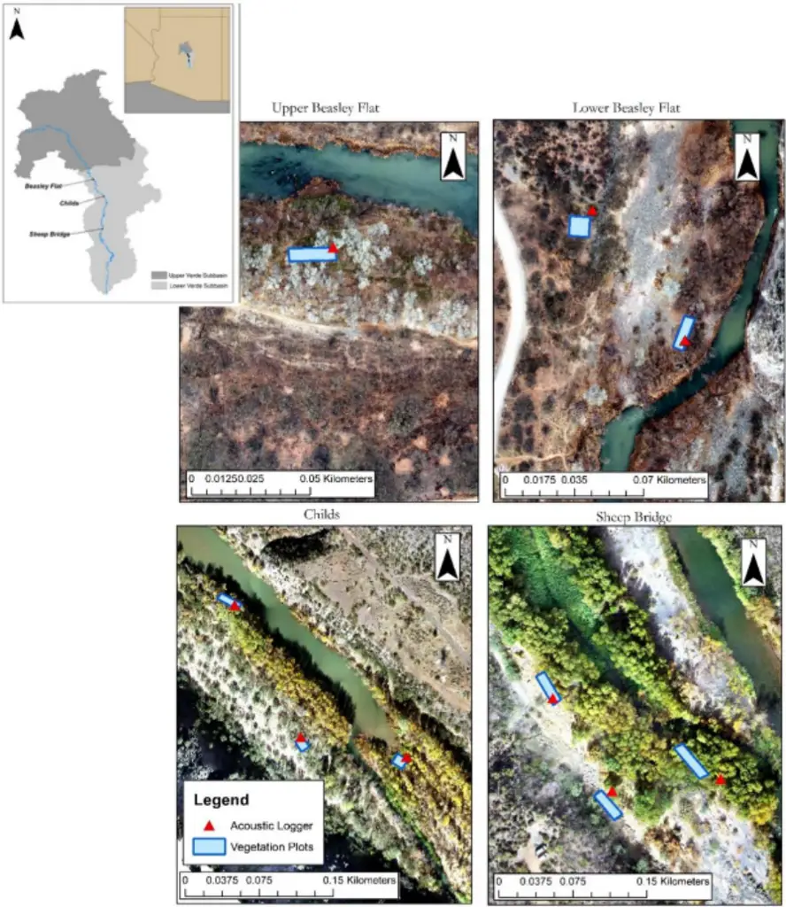
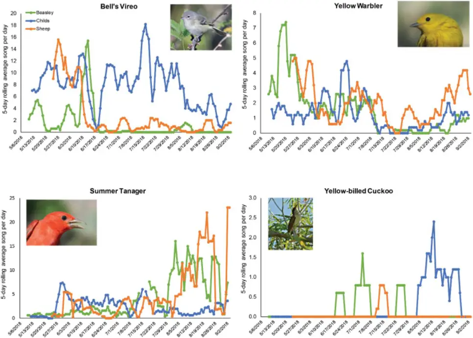
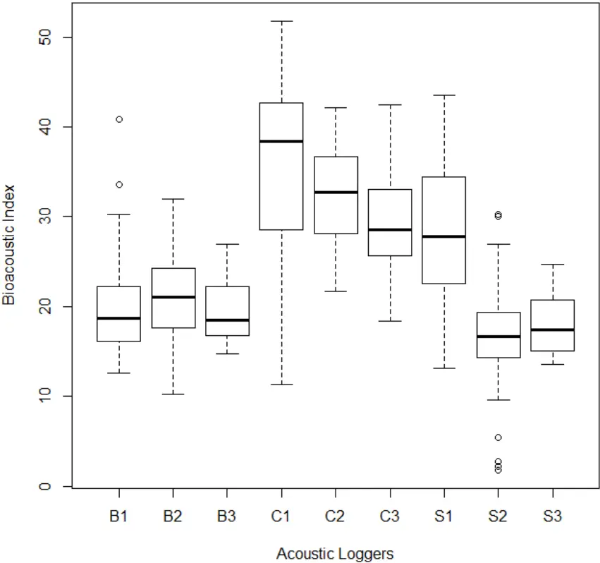

Article

## Using Bioacoustics to Examine Vocal Phenology of Neotropical Migratory Birds on a Wild and Scenic River in Arizona

Citation: Bateman, H.L.; Riddle, S.B.; Cubley, E.S. Using Bioacoustics to Examine Vocal Phenology of Neotropical Migratory Birds on a Wild and Scenic River in Arizona. Birds 2021, 2, 261-274. https:// doi.org/10.3390/birds2030019

Academic Editor: Jukka Jokimäki

Received: 2 July 2021

Accepted: 29 July 2021

Published: 2 August 2021

Publisher's Note: MDPI stays neutral with regard to jurisdictional claims in published maps and institutional affiliations.

Copyright: © 2021 by the authors. Licensee MDPI, Basel, Switzerland. This article is an open access article distributed under the terms and conditions of the Creative Commons Attribution (CC BY) license (https:// creativecommons.org/licenses/by/ 4.0/).

Heather L. Bateman 1, \* , Sidney B. Riddle 1,2 and Erin S. Cubley 3

- 1 College of Integrative Sciences and Arts, Arizona State University, Mesa, AZ 85212, USA; sidney.b.riddle@gmail.com
- 2 Arizona Game and Fish Department, Mesa, AZ 85207, USA
- 3 Graduate Degree Program in Ecology, Department of Forest and Rangeland Stewardship, Colorado State University, Fort Collins, CO 80523, USA; Erin.Cubley@colostate.edu

* Correspondence: Heather.L.Bateman@asu.edu

Simple Summary: Rivers can support forests of trees that mostly rely on water provided by the river. This area between the land and river is called riparian. In arid regions, that do not receive much rainfall, these riparian forests are very rare and support many unique bird species. Some songbirds migrate between North American and Central and South America and only nest in riparian forests. We used acoustic recorders which are instruments fitted with a microphone to record sound. We measured how many days during the summer four migratory birds were detected by their vocalizations in the riparian forest. We found that using acoustic recorders can be an effective way to document bird vocalization over time and in remote areas. Forests along rivers need water and are important to support a diversity of migratory birds.

Abstract: Passive acoustic recorders have been used successfully as automated survey tools to detect terrestrial wildlife. However, few studies have monitored Neotropical migratory bird use of riparian forest habitat using this technology. Within dryland ecosystems, the forests along rivers support high bird diversity. Many bird species of conservation concern require these floodplain forest habitats for foraging, migration stop-overs, and breeding. Few studies have explored the use of acoustic records in riverine systems designated for conservation for their natural resource value via the Wild and Scenic Rivers Act in the USA. Using acoustic recorders, we document vocal activity of four riparianobligate species (Bell's Vireo, Vireo bellii; Summer Tanager, Piranga rubra; YellowWarbler, Setophaga petechial; and Yellow-billed Cuckoo, Coccyzus americanus) to determine species occurrence along a Wild and Scenic River. We established three study reaches along the perennial Lower Verde River, in the Sonoran Desert of central Arizona, USA. Nine acoustic recorders were used over the period of 80-120 days during the summer of 2018. We measured vegetation composition and structure in 100 m 2 plots paired with acoustic recorders. Visualizing vocal activity showed that three species were calling and singing at each reach; whereas, one species, the cuckoo, had fewer recordings and occurred later in the summer. We demonstrate the utility of acoustic monitoring even when applied to rare birds in complex riparian habitats. This information is important for land management and conservation efforts concerning these species of interest and identifying important habitat features in Southwestern US riparian woodlands.

Keywords: acoustic monitoring; bioacoustics; ecoacoustics; Neotropical migrants; protected areas; riparian-obligate birds; Wild and Scenic Rivers Act

## 1. Introduction

Monitoring biodiversity is paramount to documenting the conservation value of ecosystems. Biodiversity can be measured using active field techniques, such as counting or capturing organisms [1], or via passive methods, such as camera trapping or remote sensing [2]. Monitoring temporal and spatial patterns in bird species abundance and distribution are often based on active methods, such as bird point-counts, where similar sampling effort is applied at different locations or times. Active methods include the need for a human observer, who may incorrectly identify bird species and potentially miss detecting birds when present [3]. Passive acoustic sensors have been deployed to quantify presence, abundance, and richness for a variety of animal taxa, including insects, amphibians, birds, and mammals [4-6]. Bioacoustics offer a path for automated data collection in remote areas and can reduce field costs over the duration of a project [7,8]. Because of these practical advantages, bioacoustic monitoring techniques for vocal taxa, such as birds, have grown more popular in recent years [9,10]. Although bioacoustics have been used for a variety of research objectives, few studies have evaluated its use in monitoring bird species of conservation concern in temperate riparian forests (but see [11] from European forests).

Rivers support riparian ecosystems that are highly complex and productive habitats and among the most threatened systems globally [12,13]. Free-flowing rivers are threatened by reduced flows from human water demand coupled with drying climate conditions [14,15]. The National Wild and Scenic Rivers System was created by the US Congress in 1968 to conserve free-flowing rivers for their natural and cultural values [16]. These rivers can support wooded floodplains and provide unique microclimate and habitat conditions for many plant and animal species [17,18]. Aridland rivers and their floodplain forests support some of the most productive bird habitats in North America [19]. Over 50% of land bird species use riparian forests at some point in their lifecycle, and river corridors are used for foraging and breeding by Neotropical migrants [20,21]. Riparian ecosystems in the southwestern United States (hereafter, Southwest) are rare and imperiled, occupying less than 2% of total land area [22,23]. In the Southwest, both Neotropical migratory birds and their riparian habitats are of conservation concern [24,25]. Few rivers in North America have been designated as a Wild and Scenic River, but among these is the Verde River in central Arizona. The Verde River was designated, in part, to protect Neotropical migratory songbirds tied to riparian vegetation [26]. Despite its conservation importance, no published studies have used bioacoustics to relate riparian-obligate bird species to forest traits along a Wild and Scenic River.

Based on previous literature, it is clear there is a connection between habitat alteration and changes in bird populations and communities [27]. Neotropical migrant and resident birds using riparian areas for nesting (riparian-obligate species) have declined in abundance. For example, Summer Tanagers (Piranga rubra; tanager) were once common breeders along the lower Colorado River [28,29] but their numbers and distribution started declining in the 1970s as a result of habitat loss [30]. The western population of the Yellow-billed Cuckoo (Coccyzus americanus; cuckoo) has been listed as threated under the Endangered Species Act [31]. This Neotropical migratory bird breeds in areas with multi-layered riparian trees [32] and needs patches of habitat with trees of different heights and ages, which are often produced from episodic floods [33]. In the absence of flooding, native riparian forests have matured without replacing tree recruitment, further degrading habitat for the cuckoo [34]. The tanager and cuckoo are just two examples of birds experiencing declines from loss of habitat. North America has lost nearly 30% of bird populations over the past several decades [35]. Riparian birds are indicators of ecosystem health and integrity [36].

The phenology of breeding in Neotropical birds (nesting and rearing young) is well documented in the Southwest [32], with migrants arriving during spring (March-April) and some later in summer (May-June). Some species could have peak calling activity early in the season or later, and other species might be detected as they migrate through habitat patches. However, some species, such as the Yellow-billed Cuckoo, are not as well studied because they are difficult to detect due to their rarity or absence in some parts of their range. For the long-term persistence of these species, documenting where and when species of conservation concern use habitat is important for managing forests faced with multiple uses, such as public lands [37].

We focused this study on four riparian obligate birds that are designated as species of conservation concern by state and federal agencies. Our primary goal was to show how passive acoustic recorders could be used to assess vocal seasonality of select bird species and the ability of recorders to detect uncommon species of conservation concern along the Verde River, a Wild and Scenic River. A secondary goal was to consider a subset of the acoustic recordings to derive a bioacoustics index to determine the suitability of computing the variability in the avian soundscape as a way to monitor biodiversity from remote reaches of rivers.

## 2. Materials and Methods

## 2.1. Study Area

We established three study reaches along the perennial Lower Verde River (watershed HUC 15060203) in Arizona (USA) (Figure 1) on land managed by the Coconino, Prescott, and Tonto National Forests. The two upstream reaches, Beasley Flat (425500E, 3815635N; WGS84; 905 m elev.) and Childs (435625E, 3801102N; WGS84; 820 m elev.), are located in federally designated Scenic reaches of the river, and a third site, Sheep Bridge (434697E, 3771403N; WGS84; 635 m elev.), is located downstream of the designated Wild reach. The Wild and Scenic portions of the river are geographically remote and rugged, and they serve as an important corridor for migratory birds [26]. The area is dominated by mesic riparian forests composed mostly of Freemont's cottonwood (Populus fremontii), Gooding's willow (Salix goodingii), and xeric riparian shrublands of predominately mesquite (Prosopis spp.).

The Verde River drains over 17,000 km 2 of Arizona and flows from the Big Chino Wash to its confluence with the Salt River, north of Phoenix. The Verde River is undammed for most of its length until Horseshoe dam located downstream from our lowest study reach, Sheep Bridge. Perennial flows are reduced in the summer by agricultural diversions and groundwater pumping upstream from the study reaches in the Verde Valley [37]. The climate within the Verde River basin is characterized as arid to semiarid, with a bimodal precipitation regime composed of a cool, wet winter season and a warm summer monsoon season [38]. Based on long-term climatic data (1980-2018) mean annual precipitation was approximately 398.4 mm at Beasley Flat (CV = 0.29), 443.6 mm (CV = 0.26) at Childs, and 362.0 mm at Sheep Bridge (CV = 0.33). Mean annual air temperature was 17.5 ◦C (CV = 0.03) at Beasley Flat, 18.1 ◦C at Childs (CV = 0.03), and 20.0 ◦C at Sheep Bridge (CV = 0.03). We sampled bird vocal activity in 2018 and mean temperature was near average at 18.2 ◦C and annual precipitation was below average at 393.5 mm in the middle reach of Childs.

## 2.2. Acoustic Monitoring of Focal Riparian Species

We evaluated the vocal activity (as songs and calls) of four Neotropical migratory bird species that prefer to nest in riparian forests in the Southwest. Focal species were chosen because they represent obligate riparian breeders from different families of avifauna and are listed as species of special conservation concern in the state of Arizona and by the USDA Forest Service. Bell's Vireo (Vireo bellii; vireo) is a bird of conservation concern in the Sonoran Desert [39] and is a management indicator species of the Verde River for high-quality riparian habitat along with Summer Tanager [26]. YellowWarbler (Setophaga petechial; warbler) is a riparian obligate species and previous work at these river reaches documented it as the most common [40]. This species includes a subspecies (S. p. sonorana) found in this study which is considered a bird of conservation concern in the Sonoran Desert [39]. Western Yellow-billed Cuckoo is a federally listed threatened species and requires large patches of dense foliage in riparian stands for nesting [31].

We deployed three Songmeter SM4 (Wildlife Acoustics, Inc., Maynard, MA, USA, passive acoustic recorders at each study reach for a total of nine loggers. Recorders were affixed approximately 3-4 m high in riparian trees and operated daily from 6 May to 2 September 2018 at Beasley Flat and Childs and from 20 May to 2 September 2018 at Sheep Bridge. We programmed acoustic monitors to record for 2 h daily around sunrise, from 0430 to 0630. These times were chosen to coincide with the peak vocalization period of

264 many migrating and breeding birds that use riparian habitat along the river [32]. Similar survey timing has been widely used in bird studies employing count surveys [41]. The location of recorders (Figure 1) was established to represent a gradient of bird habitat quality and vegetation complexity described by Cubley et al. [40]. Placement of recorders were constrained to the width of the riparian forest and within the area of vegetation measurement plots, described below (Figure 1). We deployed three Songmeter SM4 (Wildlife Acoustics, Inc., Maynard, MA, USA, passive acoustic recorders at each study reach for a total of nine loggers. Recorders were affixed approximately 3-4 m high in riparian trees and operated daily from 6 May to 2 September 2018 at Beasley Flat and Childs and from 20 May to 2 September 2018 at Sheep Bridge. We programmed acoustic monitors to record for 2 h daily around sunrise, from 0430 to 0630. These times were chosen to coincide with the peak vocalization period of many migrating and breeding birds that use riparian habitat along the river [32]. Similar survey timing has been widely used in bird studies employing count surveys [41]. The location of recorders (Figure 1) was established to represent a gradient of bird habitat quality and vegetation complexity described by Cubley et al. [40]. Placement of recorders were constrained to the width of the riparian forest and within the area of vegetation measurement plots, described below (Figure 1).

Figure 1. Study reaches (Beasley Flat, Childs, Sheep Bridge) along the Lower Verde River, Arizona (USA). Passive acoustic recorders stratified across a range of habitat complexities defined in Cubley et al. [42]. Habitat measured in 100 m 2 plots and from UAV images. Figure 1. Study reaches (Beasley Flat, Childs, Sheep Bridge) along the Lower Verde River, Arizona (USA). Passive acoustic recorders stratified across a range of habitat complexities defined in Cubley et al. [42]. Habitat measured in 100 m 2 plots and from UAV images.

At each reach, three recorders were located along the stream and spaced apart based on travel constrains and access logistics and were at least 60 m apart. From upstream to downstream, at Beasley Flat recorders 1 and 2 were 1077 m apart and recorders 2 and 3 were 88 m apart; at Childs recorders 1 and 2 were 150 m apart and recorders 2 and 3 were 109 m apart; and at Sheep Bridge recorders 1 and 2 were 62 m apart and recorders 2 and 3 were 60 m apart. The distance acoustic recorders are able to detect bird vocalizations differs among species and frequencies of calls, and detectability is considerably less in dense forest compared to open habitats [10]. As part of a study that related riparian vegetation and habitat complexity to bird diversity and guild abundance [40,42], we established 21 point-count stations (Beasley Flat n = 7, Childs n = 8, Sheep Bridge n = 6) that were visited twice over two days during May 2018. A human observer recorded all birds heard (89% of observations) or seen (11% of observations) for 10 min within a 20-m fixed radius point. We used the greater value of the two counts as the abundance estimator. The distance between recorder at each study reach was greater than the mean human-observed distances from point-counts (Table S1). It is unlikely that the same individual was recorded by the two closest acoustic recorders because the distance between recorders exceeded the average distance estimated by observer during point-count surveys (Table S1). In addition, we combined acoustic activity for the three recorders at each reach.

## Acoustic Data Analyses

To determine acoustic activity of the four focal bird species, we used a combination of automated recognition and manual validation of vocalizations from soundscapes collected at the nine acoustic recorders. We used the program Kaleidoscope Pro [43] to sort similar vocalizations into sound classifier tools. We obtained known vocalizations of our four target species from sound libraries Macaulay and XenoCanto (Table S2) to create sound classifier tools that accurately represent the vocalizations of each species. We attempted to use only training data from the same watershed as our study, and no training data were used from outside of Arizona. For Bell's Vireo, Yellow Warbler, and Summer Tanager we used the default signal parameters and cluster analysis parameters in the Non-Bat Analysis mode of Kaleidoscope Pro Version 5 [43] when processing acoustic recordings. For Yellow-billed Cuckoo, we used classifiers developed by Beauregard (unpublished data) with acoustic recordings from Arizona using methods similar to those for Bell's Vireo, Yellow Warbler, and Summer Tanager. When processing Yellow-billed Cuckoo, we used customized signal parameters previously used for the species in other studies in Arizona (unpublished data). These signal parameters included a frequency range of 750 to 2500 Hz, a vocalization length of 1.25 to 8 s, and a maximum syllable gap of 0.5 s.

We used the cluster analysis function in Kaleidoscope Pro to sort soundscape data from nine acoustic recorders using the species-specific classifiers we developed. Bird species were analyzed separately to increase the likelihood of detecting target species calls when present, because acoustic classifier accuracy tends to decline when many vocalization types are analyzed at once. One two-hour recording was analyzed for each day per recorder. Acoustic classifiers tend to produce more false-positives in speciose tropical environments where multiple vocalizing taxa are present [44]. To account for this, a trained technician visually and auditorily checked the first 100 vocalizations detected by each species-specific classifier for each day of recording. This was done to remove all false-positive vocalizations, resulting in a final data set composed entirely verified calls for each species for each day of the study.

## 2.3. Bioacoustic Index

We measured the Bioacoustic Index for each recorder. The Bioacoustic Index defined by [45] is calculated by measuring amplitude and frequency within 2-8 kHz frequency range and has been positively correlated with both avian richness and abundance [45,46]. The index measures the area under the amplitude-frequency curve and excludes the range of anthropogenic sounds (0-2 kHz). We computed the index using the package

'soundecology' [47] in R statistical computing environment [48]. We used 5 min sound recording periods (0528 to 0532), daily from 20 May to 8 July 2018. This range of dates was chosen because data were complete for each of the nine recorders and corresponded with high bird song activity along the Verde River.

## 2.4. Vegetation

We measured vegetation composition and structure in 100 m 2 plots (Figure 1) which were systematically placed across the floodplain established during previous studies on this river system [42]. Percent canopy cover was estimated for each vascular species and nomenclature followed [49,50]. Structure variables measured at plots included percent canopy cover using a spherical convex densiometer, basal area, and distance from center of plot to river. Percent cover of plant species was estimated with four height classes (0-1.5, 1.6-4.0, 4.1-9.0, and &gt;9 m), as described by [51].

## 2.5. Data Analyses

Vocal activity was calculated as a rolling average per species and summarized at the reach level. Rolling average can be useful for smoothing out short-term (daily) fluctuations to see longer-term (season) trends. We summed the total number of calls/songs detected on three recorders per day per reach. That summed value was the sample for each day per reach. The rolling average was calculated as the mean of 5 days. The number of recording days varied from 80 to 120 days among acoustic recorders because some failed to record or audio files were corrupted or unusable (Table S3). We handled missing data by removing an average, if more than one day was missing. If only one day was missing, then the rolling average was the average for 4 of those 5 days.

We used chi-square analysis to compare the proportion of days with calls detected (i.e., number of days calls detected/number of recording days) for each species per reach. We visually compared boxplots of the bioacoustics index at each recorder to see if stream reaches had similar indices.

We compared if the quantification of birds differed between passive recorders versus point-count surveys using a non-parametric Wilcoxon sign-rank test. The rank was specific to each method, such that the three sites and four species were ranked by number of individuals counted per reach using point-count surveys (within a 20 m fixed radius) and ranked by number of days species were recorded on acoustic loggers (for 80-120 days).

## 3. Results

We evaluated 1880 h of soundscape data using the automated sound recognition software Kaleidoscope Pro [43]. A total of 3276 events matched signal parameters of the focal species classifiers and were visually and/or auditorily validated as positive identifications of one of the four target species. All four species were detected at each study reach and a summary of calling activity for each reach is reported in Table 1. All species, except Yellow-billed Cuckoo, were common and detected during the entire sampling period. Cuckoo calls were less frequent compared to other species and occurred during late summer (Table 1).

The method of using passive acoustic recorders was similar to using point-count surveys when comparing the relative quantification of birds by species and reach. Although the methods are not directly comparable, they are similar in how each method ranks the sites and species from high or low amounts (Wilcoxon signed-rank test: V = 29.5, P = 0.878; Table S4 and Figure S1).

Table 1. Summary of vocal activity of four species of riparian birds fromMay to September 2018, Lower Verde River, Arizona (USA). Each reach had three recorders. Dates represent when songs were detected on any of the recorders. Number of days from recorders varied from 80 to 120 days (see Table S3).

| Species              | Reach                            | First Song               | Last Song                           | Most Active Day                 | Days Detected |
| -------------------- | -------------------------------- | ------------------------ | ----------------------------------- | ------------------------------- | ------------- |
| Bell's Vireo         | Beasley Flat Childs Sheep Bridge | 6 May 8 May 20 May       | 8 August 1 September 2 September    | 9 June 14 July 5 June           | 35 108 57     |
| Summer Tanager       | Beasley Flat Childs Sheep Bridge | 6 May 10 May 22 May      | 2 September 1 September 2 September | 24 August 26 August 2 September | 72 80 57      |
| Yellow Warbler       | Beasley Flat Childs Sheep Bridge | 7 May 8 May 20 May       | 1 September 1 September 1 September | 16 May 21 June 31 May           | 68 64 76      |
| Yellow-billed Cuckoo | Beasley Flat Childs Sheep Bridge | 18 June 4 August 11 July | 23 July 24 August 13 July           | 29 June 9 August 13 July        | 4 10 2        |

## 3.1. Summary of Vegetation

All three reaches were dominated by native riparian trees, with varying composition and dominant canopy species at each reach. Salix gooddingii had the most foliar cover at Beasley Flat and Sheep Bridge and Populus fremontii was the most common at Childs (Table 2). All sites had shrub cover &lt; 10% and tree canopy &gt; 50% (Table 2).

Table 2. Mean and SE of riparian vegetation traits measured at nine plots at three reaches paired with loggers to measure avian acoustic activity at Lower Verde River, Arizona (USA).

| Variable                | Beasley Flat    | Childs          | Sheep Bridge    |
| ----------------------- | --------------- | --------------- | --------------- |
| Salix gooddingii (%)    | 37.5 ± 25.0     | 15.0 ± 11.2     | 35.0 ± 12.5     |
| Populus fremontii (%)   | 5.8 ± 5.8       | 34.1 ± 28.3     | 1.0 ± 28.3      |
| Prosopis velutina (%)   | 0.6 ± 0.6       | 28.3 ± 0.6      | 5.8 ± 28.3      |
| Shrub cover (%)         | 9.0 ± 4.4       | 10.2 ± 2.9      | 2.2 ± 3.5       |
| Canopy cover (%)        | 52.0 ± 27.0     | 64.7 ± 26.8     | 59.6 ± 28.8     |
| Basal Area (cm 2 /plot) | 2723.0 ± 1894.7 | 2773.8 ± 2210.8 | 2914.4 ± 2313.6 |

## 3.2. Vocal Phenology

The proportion of days that calls were detected, for YellowWarbler, Summer Tanager, and Yellow-billed Cuckoo was similar across the three study reaches (χ 2 = 1.7, 12.6, 14.1, respectively, df = 2, p &gt; 0.05). Bell's Vireo activity was greater at Childs compared to Beasley Flat and Sheep Bridge reaches (χ 2 = 130.5, df = 2, p &lt; 0.05,). Bell's Vireo vocal activity was similar across each reach in May and then peaked mostly at the Childs reach starting mid-June to the end of recording in September (Figure 2). YellowWarbler vocalizations were detected across all reaches, during most of the recording duration with a lull in activity from mid-July to mid-August (Figure 2). Summer Tanager had low vocal activity at the beginning of the season and started to peak toward the end of summer in August at Beasley and Sheep Bridge reaches (Figure 2). Yellow-billed Cuckoos are the rarest of the four species and were not detected during May point-count sampling (Table S1) but were detected on recorders later in the summer (Figure 2). We detected cuckoos at the most upstream and northerly reach, Beasley Flat, in June, and detected cuckoos later in the summer at the downstream reaches (Table 1).

Birds 2021, 2

268 the most upstream and northerly reach, Beasley Flat, in June, and detected cuckoos later

## in the summer at the downstream reaches (Table 1).

Figure 2. Vocal activity of four species of riparian birds plotted as a 5-day rolling average across three passive acoustic recorders per reach along the Lower Verde River, central Arizona (USA). Reaches listed in order from north to south (Beasley to Sheep). Photo credits: YEWA, SUTA by Kristan Godbeer, YBCU by Steve Prager, BEVI James Hully/Macaulay Library at the Cornell Lab (ML48451521). Figure 2. Vocal activity of four species of riparian birds plotted as a 5-day rolling average across three passive acoustic recorders per reach along the Lower Verde River, central Arizona (USA). Reaches listed in order from north to south (Beasley to Sheep). Photo credits: YEWA, SUTA by Kristan Godbeer, YBCU by Steve Prager, BEVI James Hully/Macaulay Library at the Cornell Lab (ML48451521).

## 3.3. Bioacoustic Index 3.3. Bioacoustic Index

We calculated the mean Bioacoustic Index for each of the nine recorders (Figure 3). The number of days per recorders varied because of malfunction. The number of days from Beasley was 50, 50, and 20 days, from Childs was 50 days for all three recorders, and from Sheep Bridge was 49, 49, and 28 days. Generally, the Bioacoustics Index was highest at recorders from the Childs reach and from one recorder at Sheep Bridge (Figure 3). We calculated the mean Bioacoustic Index for each of the nine recorders (Figure 3). The number of days per recorders varied because of malfunction. The number of days from Beasley was 50, 50, and 20 days, from Childs was 50 days for all three recorders, and from Sheep Bridge was 49, 49, and 28 days. Generally, the Bioacoustics Index was highest at recorders from the Childs reach and from one recorder at Sheep Bridge (Figure 3).

. Figure 3. Boxplots (showing quartiles, circles are outliers) of the Bioacoustic Index generated from passive acoustic recorders deployed at three study reaches (B1-B3, Beasley Flat; C1-C3, Childs; and S1-S3, Sheep Bridge) along the Lower Verde River, Arizona (USA). Index was calculated using 5 min daily recordings per logger from 20 May to 8 July 2018. Figure 3. Boxplots (showing quartiles, circles are outliers) of the Bioacoustic Index generated from passive acoustic recorders deployed at three study reaches (B1-B3, Beasley Flat; C1-C3, Childs; and S1-S3, Sheep Bridge) along the Lower Verde River, Arizona (USA). Index was calculated using 5 min daily recordings per logger from 20 May to 8 July 2018.

4. Discussion

5. Discussion Overall, we documented that passive bioacoustic recorders are an effective metho to detect species of conservation concern along remote reaches of a Wild and Scenic Rive Using automated survey technology, such as acoustic recording equipment, can allow r searchers to collect data in remote areas over extended periods of time. Thus, the likeli hood of detection of rare species increases. One of the detected focal species, Yellow-bille Cuckoo, has decreased in abundance along the Verde River, with fewer nesting pairs de tected at historical sites [52]. Acoustic monitoring documented the presence of this rar bird, while traditional point-count surveys used in a joint study did not because of th limited access to conduct repeated surveys [40]. In this study, daily repeated measure over the span of a breeding season were made possible by acoustic monitoring and wer especially useful to document vocal activity. Species had different song phenologies, wit Yellow Warbler and Bell's Vireo singing in May and across the breeding season. Summe Tanager and Yellow-billed Cuckoo were recorded later, with peak activity near the end summer. One major conclusion is that vocal activity can be used to determine occurrenc of species in remote riparian habitat. This information could allow managers to guid monitoring activities for species of concern and in remote areas. Overall, we documented that passive bioacoustic recorders are an effective method to detect species of conservation concern along remote reaches of a Wild and Scenic River. Using automated survey technology, such as acoustic recording equipment, can allow researchers to collect data in remote areas over extended periods of time. Thus, the likelihood of detection of rare species increases. One of the detected focal species, Yellowbilled Cuckoo, has decreased in abundance along the Verde River, with fewer nesting pairs detected at historical sites [52]. Acoustic monitoring documented the presence of this rare bird, while traditional point-count surveys used in a joint study did not because of the limited access to conduct repeated surveys [40]. In this study, daily repeated measures over the span of a breeding season were made possible by acoustic monitoring and were especially useful to document vocal activity. Species had different song phenologies, with Yellow Warbler and Bell's Vireo singing in May and across the breeding season. Summer Tanager and Yellow-billed Cuckoo were recorded later, with peak activity near the end of summer. One major conclusion is that vocal activity can be used to determine occurrence of species in remote riparian habitat. This information could allow managers to guide monitoring activities for species of concern and in remote areas.

The complexity of acoustic sounds in a riparian forest can be quantified using th The complexity of acoustic sounds in a riparian forest can be quantified using the Bioacoustic Index. We found that the index varied across reaches and could be effective in characterizing the soundscape of biodiversity in remote areas. Although the Bioacoustics Index is specific to frequency bands, and can record insects and anurans, research has shown it can be implemented as an ecological monitoring tool for bird richness [53,54]. Passive acoustic recorders can also be a way to monitor changes in the soundscape over time, especially in remote locations, and have applications to evaluating changes in avian acoustic richness in space and time [55].

All avian species chosen for this study are important indicators of riparian health in the Southwest. However, the Yellow-billed Cuckoo has declined in abundance throughout its western range. In 2014, it was listed as threatened under the Endangered Species Act [31]. Calling activity for Yellow-billed Cuckoo was the least frequent of the other focal species. It is unknown if calling individuals are breeding in the habitat or migrating. Cuckoo nests in Arizona have been recorded mostly during the end of June through early August [32,56]. Since we detected most calls late in the summer, it is possible that these were migrating individuals. However, one study in Texas considered Yellow-billed Cuckoos to be summer residents and they captured birds from June to August [57], similar to the timing in our study. The habitat on the Lower Verde River offers complex habitats with multiple canopy layers and trees and shrubs [42] which are places cuckoos can be detected during late summer. This is consistent with findings showing that dwindling cuckoo populations are associated with forests of substantial canopy cover provided by native riparian trees, such as cottonwood and willow [33,56,58]. In California, cuckoos were associated with cottonwood forests having recruitment of trees with differing heights and fewer cuckoos were associated with the tallest, most mature trees [34]. The Lower Verde supports riparian trees which are important to maintain cuckoo habitat.

In the Southwest, Yellow Warblers have historically and currently been restricted to areas with mature cottonwood near streams or water [59,60] and are generally not found farther out toward the margins of floodplains in more drought-tolerant forests, such as mesquite woodlands [61,62]. In this study, we detected the species across all three reaches. Of the four species analyzed, YellowWarbler have the greatest degree of frequency overlap with other common songbirds (e.g., Wilson's Warbler, Cardellina pusilla) in this system. It is possible that this vocalization led to lower rates of automatic detection by the Yellow Warbler vocalization classifier. Summer Tanagers are Neotropical migratory birds that breed in areas with dense overstory cover of riparian trees near streams [63]. We found that Summer Tanager activity was high near the end of summer at Beasley Flat and Sheep Bridge reaches. Activity was low at Childs, which had the lowest willow cover compared to the other two reaches. Bell's Vireo are associated with floodplain habitat. However, unlike the other three bird species closely associated with cottonwood and willow, vireos are associated with dense shrubs, hackberry and sycamore trees, and also areas with high canopy cover [63-65].

Riparian trees and shrubs are supported by shallow alluvial groundwater that is solely maintained by surface flows at the study reaches [42]. Decreases in summer low flows may lower groundwater levels below thresholds of riparian plant species. This could result in reduced canopy cover, less vertical complexity, and shifts in species composition [42,66]. Contraction of riparian forests and shrublands will drastically reduce the proportion of suitable habitat for migrant and resident birds along the Verde River. The rate of contraction may not affect all vegetation equally and likely trees requiring shallow groundwater, such as cottonwood and willow, would be reduced before mesquite [25]. This difference would likely affect riparian-obligate birds that rely on cottonwood and willow, like warblers, tanagers, and cuckoos before species that use shrubs and mesquite woodlands, like Bell's vireo.

## References

1. Turner, W. Sensing biodiversity. Science 2014, 346, 301-302. [CrossRef] [PubMed]
2. Turner, W.; Spector, S.; Gardiner, N.; Fladeland, M.; Sterling, E.; Steininger, M. Remote sensing for biodiversity science and conservation. Trends Ecol. Evol. 2003, 18, 306-314. [CrossRef]
3. Pacifici, K.; Simons, T.R.; Pollock, K.H. Effects of vegetation and background noise on the detection process in auditory avian point-count surveys. Auk 2008, 125, 600-607. [CrossRef]
4. Sueur, J.; Pavoine, S.; Hamerlynck, O.; Duvail, S. Rapid acoustic survey for biodiversity appraisal. PLoS ONE 2008, 3, e4065. [CrossRef]
5. Towsey, M.; Wimmer, J.; Williamson, I.; Roe, P. The use of acoustic indices to determine avian species richness in audio-recordings of the environment. Ecol. Inform. 2014, 21, 110-119. [CrossRef]
6. Hill, A.P.; Prince, P.; Covarrubias, E.P.; Doncaster, C.P.; Snaddon, J.L.; Rogers, A. AudioMoth: Evaluation of a smart open acoustic device for monitoring biodiversity and the environment. Methods Ecol. Evol. 2018, 9, 1199-1211. [CrossRef]
7. Farina, A.; James, P.; Bobryk, C.; Pieretti, N.; Lattanzi, E.; McWilliam, J. Low cost (audio) recording (LCR) for advancing soundscape ecology towards the conservation of sonic complexity and biodiversity in natural and urban landscapes. Urban Ecosyst. 2014, 17, 923-944. [CrossRef]

## 5. Conclusions

Application to Riparian Ecosystem Management

Implications of the study with respect to four Neotropical species of conservation concern in riparian forests were based on vocal activities for one season and with a limited number of recorders. These results may not extend for all species needing riparian habitat in the Southwest. Nevertheless, because future changes in temperature and precipitation suggest an overall decline in runoff and decrease in annual streamflow on rivers within the Colorado River basin [67], it is expected that riparian habitats will shrink, affecting many species. In many Southwestern rivers, perennial flow has already significantly declined and may experience further de-watering, if groundwater supplies continue to be depleted at current or elevated rates [68]. Riparian restoration would benefit birds by maintaining streams that are hydrologically connected to floodplains and support growth of riparian trees [34]. Heightened demand for water resources will force land managers to address how increased water development and climate change will alter flow regimes, riparian vegetation, and habitat for sensitive bird species.

Supplementary Materials: The following are available online at https://www.mdpi.com/article/10 .3390/birds2030019/s1, Table S1: Summary of distance estimates (meters) from traditional human observer collected point-count data of four species of riparian birds, Lower Verde River, Arizona (USA), Table S2: Recording data used in acoustic classifier training, Table S3: Day per recorder of malfunction, Table S4: rank of bird quantification by point-count methods versus passive acoustic recorders, Figure S1: graph of rank comparison

Author Contributions: Conceptualization, H.L.B. and S.B.R.; methodology, H.L.B., S.B.R., E.S.C.; software, S.B.R., E.S.C.; validation, S.B.R.; formal analysis, H.L.B., S.B.R., E.S.C.; investigation, H.L.B., S.B.R., E.S.C.; data curation, H.L.B., S.B.R., E.S.C.; writing-original draft preparation, H.L.B.; writing-review and editing, S.B.R., E.S.C.; visualization, H.L.B., S.B.R.; supervision, H.L.B.; funding acquisition, H.L.B. All authors have read and agreed to the published version of the manuscript.

Funding: This research was funded by USDA Forest Service grant #17-CR-1103160-013 to H.L.B.

Institutional Review Board Statement: Not applicable. No animals were handled in this study.

Informed Consent Statement: Not applicable.

Data Availability Statement: High resolution aerial imagery analyzed are available through ScienceBase: doi.org/10.5066/P9JZYT2J. Publication date 23 March 2020.

Acknowledgments: Land access granted by U.S. Forest Service. We thank David Merritt for logistical support. Taylor O'Rourke helped with processing acoustic data, and the Yellow-billed Cuckoo key was provided by Nick Beauregaurd.

Conflicts of Interest: The authors declare no conflict of interest.

8. Dixon, A.P.; Baker, M.E.; Ellis, E.C. Agricultural landscape composition linkedwith acoustic measures of avian diversity. Land 2020, 9, 145. [CrossRef]
9. Shonfield, J.; Bayne, E.M. Autonomous recording units in avian ecological research: Current use and future applications. Avian Conserv. Ecol. 2017, 12, 14. [CrossRef]
10. Yip, D.; Leston, L.; Bayne, E.; Sólymos, P.; Grover, A. Experimentally derived detection distances from audio recordings and human observers enable integrated analysis of point count data. Avian Conserv. Ecol. 2017, 12, 11. [CrossRef]
11. Bota, G.; Traba, J.; Sardà-Palomera, F.; Giralt, D.; Pérez-Granados, C. Acoustic monitoring of diurnally migrating European Bee-Eaters agrees with data derived from citizen science. Ardea 2020, 108, 1-11. [CrossRef]
12. Helfield, J.M.; Capon, S.J.; Nilsson, C.; Jansson, R.; Palm, D. Restoration of rivers used for timber floating: Effects on riparian plant diversity. Ecol. Appl. 2007, 17, 840-851. [CrossRef]
13. Krosby, M.; Theobald, D.M.; Norheim, R.; McRae, B.H. Identifying riparian climate corridors to inform climate adaptation planning. PLoS ONE 2018, 13, e0205156. [CrossRef] [PubMed]
14. Wang, X.J.; Zhang, J.Y.; Shahid, S.; Guan, E.H.; Wu, Y.X.; Gao, J.; He, R.M. Adaptation to climate change impacts onwater demand. Mitig. Adapt. Strateg. Glob. Chang. 2014, 21, 81-99. [CrossRef]
15. Grill, G.; Lehner, B.; Thieme, M.; Geenen, B.; Tickner, D.; Antonelli, F.; Babu, S.; Borrelli, P.; Cheng, L.; Crochetiere, H.; et al. Mapping the world's freeflowing rivers. Nature 2019, 569, 215-221. [CrossRef]
16. River Conservation Fund. Flowing Free: A Citizen's Guide for Protecting Wild and Scenic Rivers; River Conservation Fund: Washington, DC, USA, 1977.
17. Naiman, R.J.; Decamps, H. The ecology of interfaces: Riparian zones. Annu. Rev. Ecol. Syst. 1997, 28, 621-658. [CrossRef]
18. Ramey, T.L.; Richardson, J.S. Terrestrial invertebrates in the riparian zone: Mechanisms underlying their unique diversity. Bioscience 2017, 67, 808-819. [CrossRef]
19. Folliott, P.F.; Baker, M.B., Jr.; DeBano, L.F.; Neary, D.G. Introduction. In Riparian Areas of the Southwestern United States-Hydrology, Ecology, Management; Baker, M.B., Jr., Folliott, P.F., DeBano, L.F., Neary, D.G., Eds.; CRC Press: Boca Raton, FL, USA, 2004; pp. 1-10.
20. Donovan, T.M.; Beardmore, C.J.; Bonter, D.N.; Brawn, J.D.; Cooper, R.J.; Fitzgerald, J.A.; Ford, R.; Gauthreaux, S.A.; George, T.L.; Hunter, W.C.; et al. Priority research needs for the conservation of Neotropical migrant land birds: The Partners in Flight ResearchWorking Group. J. Field Ornithol. 2002, 73, 329-339. [CrossRef]
21. Rich, T.D. Using breeding land birds in the assessment of western riparian systems. Wildl. Soc. Bull. 2002, 30, 1128-1139.
22. Stevens, L.E.; Brown, B.T.; Simpson, J.M.; Johnson, R.R. The Importance of RiparianHabitat toMigrating Birds. Importance, Preservation and Management of Riparian Habitat: A Symposium; General Technical Report RM-43; USDA Forest Service: Tucson, AZ, USA, 1977; pp. 156-164.
23. Knopf, F.L.; Johnson, R.R.; Rich, T.; Samson, F.B.; Szaro, R.C. Conservation of riparian ecosystems in the United States. Wilson Bull. 1988, 100, 272-284.
24. Heglund, P.J.; Skagen, S.K. Ecology and physiology of en route Nearctic-Neotropical migratory birds: A call for collaboration. Condor 2005, 107, 193-196. [CrossRef]
25. Merritt, D.M.; Bateman, H.L. Linking streamflow and groundwater to avian habitat in a desert riparian system. Ecol. Appl. 2012, 22, 1973-1988. [CrossRef]
26. US Department of Agriculture (USDA). Verde Wild and Scenic River Comprehensive River Management Plan Final Environmental Assessment, Coconino, Prescott and Tonto National Forests; US Department of Agriculture, Forest Service, Prescott and Tonto National Forests: AZ, USA, 2004; p. 201.
27. Lussier, S.M.; Enser, R.W.; Dasilva, S.N.; Charpentier, M. Effects of habitat disturbance from residential development on breeding bird communities in riparian corridors. Environ. Manag. 2006, 38, 504-521. [CrossRef] [PubMed]
28. Cooper, J.G. NewCalifornia animals. Proc. Calif. Acad. Sci. 1861, 2, 118-123.
29. Grinnell, J. An Account of the Mammals and Birds of the Lower Colorado Valley: With Especial Reference to the Distributional Problems Presented; University of California Press: Berkeley, CA, USA, 1914.
30. Rosenberg, K.V.; Ohmart, R.D.; Hunter, W.C. Birds of the Lower Colorado River Valley; University of Arizona Press: Tucson, AZ, USA, 1991.
31. U.S. Fish andWildlife Service (USFWS). Determination of threatened status for theWestern Distinct Population Segment of the Yellow-billed Cuckoo (Coccyzus americanus). Fed. Regist. 2014, 79, 59992-60038.
32. Corman, T.E.; Wise-Gervais, C. The Arizona Breeding Bird Atlas; UNMPress: Albuquerque, NM, USA, 2005.
33. Johnson, M.J.; Hatten, J.R.; Holmes, J.A.; Shafroth, P.B. Identifying western yellow-billed cuckoo breeding habitat with a dual modelling approach. Ecol. Model. 2017, 347, 50-62. [CrossRef]
34. Wohner, P.J.; Laymon, S.A.; Stanek, J.E.; King, S.L.; Cooper, R.J. Challenging our understanding of western Yellow-billed Cuckoo habitat needs and acceptedmanagement practices. Restor. Ecol. 2020, 29, e13331. [CrossRef]
35. Rosenberg, K.V.; Dokter, A.M.; Blancher, P.J.; Sauer, J.R.; Smith, A.C.; Smith, P.A.; Stanton, J.C.; Panjabi, A.; Helft, L.; Parr, M.; et al. Decline of the North American avifauna. Science 2019, 366, 120-124. [CrossRef]
36. Morrison, M.L. Bird Populations as Indicators of Environmental Change. In Current Ornithology; Johnston, R.F., Ed.; Springer: Boston, MA, USA, 1986; Volume 3. [CrossRef]

37. Garner, B.D.; Pool, D.R.; Tillman, F.D.; Forbes, B.T. Human Effects on the Hydrologic System of the Verde Valley, Central Arizona, 1910-2005 and 2005-2110, Using a Regional Groundwater Flow Model; U.S. Geological Survey Scientific Investigations Report 2013-5029; U.S. Geological Survey: Reston, VA, USA, 2013.
38. Blasch, K.W.; Hoffmann, J.P.; Graser, L.F.; Bryson, J.R.; Flint, A.L. Hydrogeology of the Upper and Middle Verde River Watersheds, Central Arizona; U.S. Geological Survey Scientific Investigation Report 2005-5198; U.S. Geological Survey: Reston, VA, USA, 2006; p. 102.
39. U.S. Fish andWildlife Service (USFWS). Birds of Conservation Concern 2002; Division of Migratory BirdManagement: Arlington, VA, USA, 2002; p. 99.
40. Cubley, E.S.; Bateman, H.L.; Riddle, S.B.; Holmquist-Johnson, C.; Merritt, D.M. Merritt. Predicting bird guilds using vegetation composition and structure on a Wild and Scenic River in Arizona. Wetlands 2020, 40, 1829-1842. [CrossRef]
41. Skagen, S.K.; Melcher, C.P.; Howe, W.H.; Knopf, F.L. Comparative use of riparian corridors and oases by migrating birds in southeast Arizona. Conserv. Biol. 1998, 12, 896-909. [CrossRef]
42. Cubley, E.S.; Bateman, H.L.; Merritt, D.M.; Cooper, D.J. Using vegetation guilds to predict bird habitat characteristics in riparian areas. Wetlands 2020, 40, 1843-1862. [CrossRef]
43. Wildlife Acoustics. Kaleidoscope Pro 3 Analysis Software. Available online: www.wildlifeacoustics.com/products/kaleidoscopesoftware (accessed on 1 September 2015).
44. Eldridge, A.; Guyot, P.; Moscoso, P.; Johnston, A.; Eyre-Walker, Y.; Peck, M. Sounding out ecoacoustic metrics: Avian species richness is predicted by acoustic indices in temperate but not tropical habitats. Ecol. Indic. 2018, 95, 939-952. [CrossRef]
45. Boelman, N.T.; Asner, G.P.; Hart, P.J.; Martin, R.E. Multi-trophic invasion resistance in Hawaii: Bioacoustics, field surveys, airborne remote sensing. Ecol. Appl. 2007, 2007, 2137-2144. [CrossRef]
46. Shamon, H.; Paraskevopoulou, Z.; Kitzes, J.; Card, E.; Deichmann, J.L.; Boyce, A.J.; McShea, W.J. Using ecoacoustics metrices to track grassland bird richness across landscape gradients. Ecol. Indic. 2021, 120, 106928. [CrossRef]
47. Villanueva-Rivera, L.J.; Pijanowski, B.C.; Doucette, J.; Pekin, B. A primer of acoustics for landscape ecologists. Landsc. Ecol. 2011, 26, 1233. [CrossRef]
48. R Core Team. R: A Language and Environment for Statistical Computing; R Foundation for Statistical Computing: Vienna, Austria, 2019. Available online: http://www.R-project.org/ (accessed on 28 July 2021).
49. Kearney, T.H.; Peebles, R.H. Arizona Flora (With Supplement); University of California Press: Berkeley, CA, USA, 1960.
50. ITIS. Integrated Taxonomic Information System. Available online: www.itis.gov (accessed on 15 September 2019).
51. Carothers, S.W.; Roy Johnson, R.; Aitchison, S.W. Population structure and social organization of southwestern riparian birds. Am. Zool. 1974, 14, 97-108. [CrossRef]
52. Holmes, J.A.; Calvo, C.; Johnson, M.J. Yellow-Billed Cuckoo Distribution, Abundance, Habitat Use, Breeding Ecology in the Verde River Watershed of Arizona, 2004-2005. In Final Report to Arizona Game and Fish Department; Heritage Department; Arizona Game and Fish Dept.: Phoenix, AZ, USA, 2008; p. 34.
53. Pieretti, N.; Farina, A.; Morri, D. A new methodology to infer the singing activity of an avian community: The Acoustic Complexity Index (ACI). Ecol. Indic. 2011, 11, 868-873. [CrossRef]
54. Fuller, S.; Axel, A.C.; Tucker, D.; Gage, S.H. Connecting soundscape to landscape: Which acoustic index best describes landscape configuration? Ecol. Indic. 2015, 58, 207-215. [CrossRef]
55. Gasc, A.; Francomano, D.; Dunning, J.B.; Pijanowski, B.C. Future directions for soundscape ecology: The importance of ornithological contributions. Auk Ornithol. Adv. 2017, 134, 215-228. [CrossRef]
56. Wallace, C.S.; Villarreal, M.L.; van Riper, C., III. Influence of monsoon-related riparian phenology on yellow-billed cuckoo habitat selection in Arizona. J. Biogeogr. 2013, 40, 2094-2107. [CrossRef]
57. Vega, J.H.; Rappole, J.J. Composition and phenology of an avian community in the Rio Grande plain of Texas. Wilson Bull. 1994, 106, 366-380.
58. Greco, S.E. Patch change and the shiftingmosaic of an endangered bird's habitat on a large meandering river. River Res. Appl. 2013, 29, 707-717. [CrossRef]
59. Stamp, N.E. Breeding birds of riparian woodland in south-central Arizona. Condor 1978, 80, 64-71. [CrossRef]
60. Strong, T.R.; Bock, C.E. Bird species distribution patterns in riparian habitats in southeastern Arizona. Condor 1990, 92, 866-885. [CrossRef]
61. Gavin, T.A.; Sowls, L.K. Avian fauna of a San Pedro Valleymesquite forest. J. Ariz. Acad. Sci. 1975, 10, 33-41. [CrossRef]
62. Cain, J.W., III; Morrison, M.L.; Bombay, H.L. Predator activity and nest success of willow flycatchers and yellowwarblers. J. Wildl. Manag. 2003, 67, 600-610.
63. Powell, B.F.; Steidl, R.J. Nesting habitat and reproductive success of southwestern riparian birds. Condor 2000, 102, 823-831. [CrossRef]
64. Brown, B.T.; Trosset, M.W. Nesting-habitat relationships of riparian birds along the Colorado River in Grand Canyon, Arizona. Southwest. Nat. 1989, 34, 260-270. [CrossRef]
65. Powell, B.F.; Steidl, R.J. Habitat selection by riparian songbirds breeding in southern Arizona. J. Wildl. Manag. 2002, 66, 1096-1103. [CrossRef]
66. Stromberg, J.C.; Lite, S.L.; Dixon, M.D. Effects of streamflow patterns on riparian vegetation of a semiarid river: Implications for a changing climate. River Res. Appl. 2010, 26, 712-729. [CrossRef]

67. Udall, B.; Overpeck, J. The twenty-first century Colorado River hot drought and implications for the future. Water Resour. Res. 2017, 53, 2404-2418. [CrossRef]
68. Marshall, R.M.; Robles, M.D.; Majka, D.R.; Haney, J.A. Sustainable water management in the southwestern United States: Reality or rhetoric? PLoS ONE 2010, 5, e11687. [CrossRef] [PubMed]
