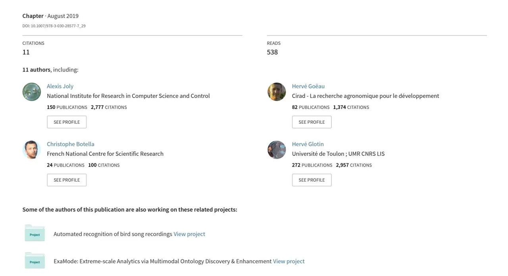
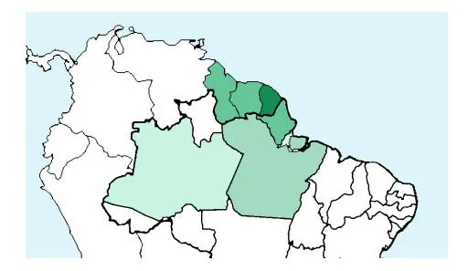
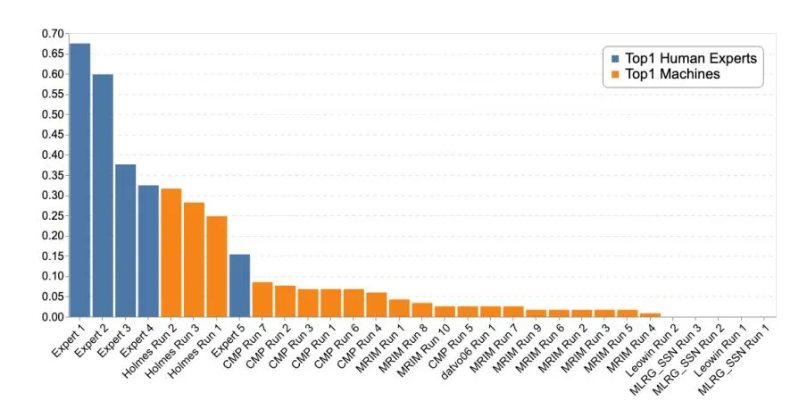
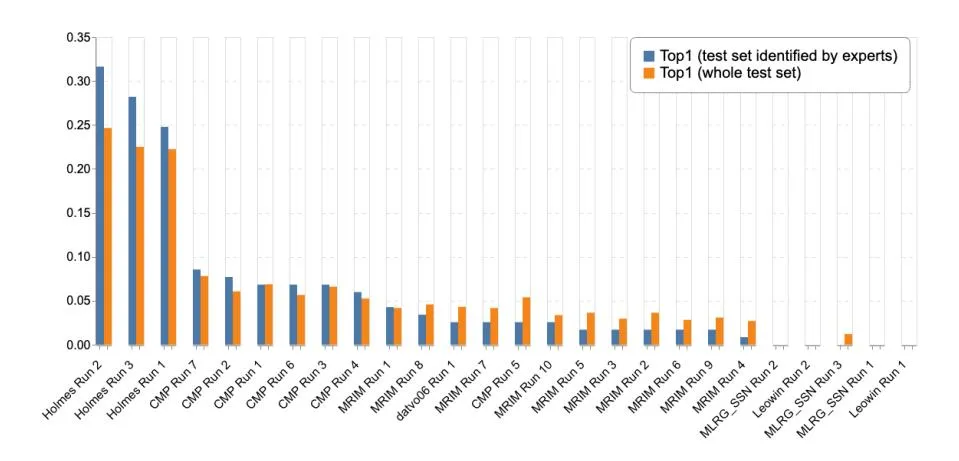
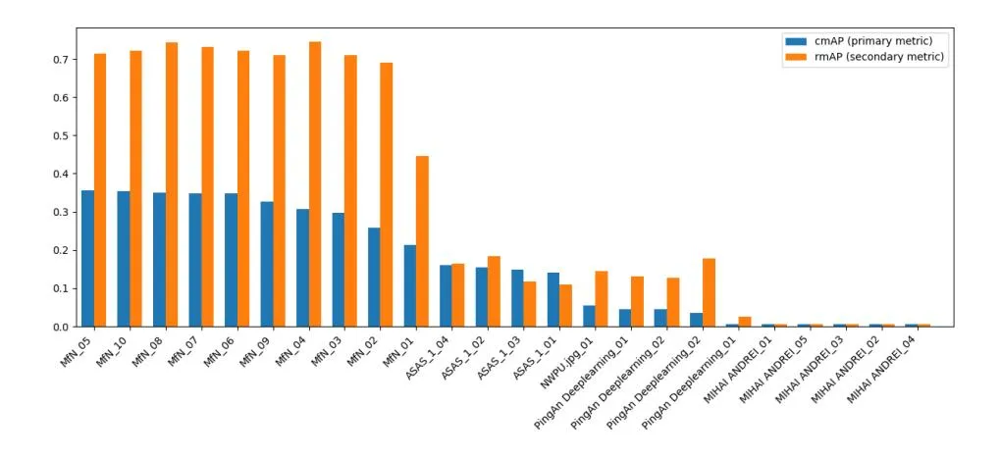
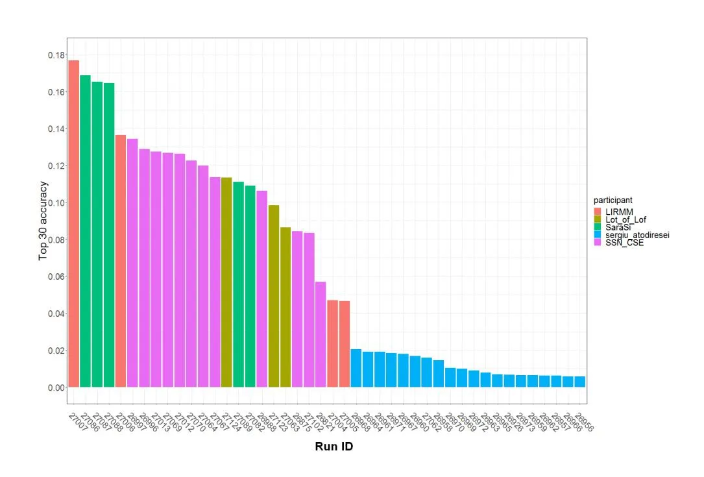

# [Overview of LifeCLEF 2019: Identification of Amazonian Plants, South & North](https://www.researchgate.net/publication/335551324_Overview_of_LifeCLEF_2019_Identification_of_Amazonian_Plants_South_North_American_Birds_and_Niche_Prediction?enrichId=rgreq-15a3bf4274fe3825b487082decc2fdd2-XXX&enrichSource=Y292ZXJQYWdlOzMzNTU1MTMyNDtBUzo4MDE1NTY2NTE4Mzk0ODhAMTU2ODExNzQwNjQyNg%3D%3D&el=1_x_3&_esc=publicationCoverPdf) American Birds, and Niche Prediction



## Overview of LifeCLEF 2019: Identification of Amazonian Plants, South & North American Birds, and Niche Prediction

Alexis Joly<sup>1</sup> , Herv´e Go¨eau<sup>2</sup> , Christophe Botella1,<sup>3</sup> , Stefan Kahl<sup>7</sup> , Maximillien Servajean<sup>8</sup> , Herv´e Glotin<sup>4</sup> , Pierre Bonnet<sup>2</sup> , Robert Planqu´e<sup>5</sup> , Fabian Robert-St¨oter, Willem-Pier Vellinga<sup>5</sup> , Henning M¨uller<sup>6</sup>

```
1
                        Inria, LIRMM, Montpellier, France
                        2 CIRAD, UMR AMAP, France
                         3
                           INRA, UMR AMAP, France
4 Univ. Toulon, Aix Marseille Univ., CNRS, LIS, DYNI SABIOD, Marseille, France
                   5 Xeno-canto foundation, The Netherlands
                         6 HES-SO, Sierre, Switzerland
                 7 Chemnitz University of Technology, Germany
 8 LIRMM, Universit´e Paul Val´ery, University of Montpellier, CNRS, Montpellier,
                                    France
```

Abstract. Building accurate knowledge of the identity, the geographic distribution and the evolution of living species is essential for a sustainable development of humanity, as well as for biodiversity conservation. Unfortunately, such basic information is often only partially available for professional stakeholders, teachers, scientists and citizens, and often incomplete for ecosystems that possess the highest diversity. In this context, an ultimate ambition is to set up innovative information systems relying on the automated identification and understanding of living organisms as a means to engage massive crowds of observers and boost the production of biodiversity and agro-biodiversity data. The LifeCLEF 2019 initiative proposes three data-oriented challenges related to this vision, in the continuity of the previous editions but with several consistent novelties intended to push the boundaries of the state-of-the-art in several research directions. This paper describes the methodology of the conducted evaluations as well as the synthesis of the main results and lessons learned.

## 1 LifeCLEF Lab Overview

Identifying organisms is a key for accessing information related to the uses and ecology of species. This is an essential step in recording any specimen on earth to be used in ecological studies. Unfortunately, this is difficult to achieve due to the level of expertise necessary to correctly record and identify living organisms (for instance plants are one of the most difficult groups to identify with an estimated number of 400,000 species). This taxonomic gap has been recognized since the Rio Conference of 1992, as one of the major obstacles to the global implementation of the Convention on Biological Diversity. Among the diversity of methods used for species identification, Gaston and O'Neill [\[10\]](#page-14-0) discussed in 2004 the potential of automated approaches typically based on machine learning and multimedia data analysis. They suggested that, if the scientific community is able to (i) overcome the production of large training datasets, (ii) more precisely identify and evaluate the error rates, (iii) scale up automated approaches, and (iv) detect novel species, it will then be possible to initiate the development of a generic automated species identification system that could open up vistas of new opportunities for theoretical and applied work in biological and related fields.

Since the question raised by Gaston and O'Neill[\[10\]](#page-14-0), automated species identification: why not?, a lot of work has been done on the topic (e.g. [\[27,](#page-15-0)[5](#page-14-1)[,35,](#page-16-0)[34,](#page-16-1)[12,](#page-14-2)[31](#page-15-1)[,22\]](#page-15-2)) and it is still attracting much research today, in particular in deep learning [\[11](#page-14-3)[,13](#page-14-4)[,28\]](#page-15-3). In order to measure the progress made in a sustainable and repeatable way, the LifeCLEF[9](#page-2-0) research platform was created in 2014 as a continuation of the plant identification task [\[20\]](#page-15-4) that was run within the ImageCLEF lab [10](#page-2-1) the three years before [\[18](#page-15-5)[,19,](#page-15-6)[17\]](#page-15-7). LifeCLEF enlarged the evaluated challenge by considering animals in addition to plants, and audio and video contents in addition to images. In 2018, a new challenge dedicated to the location-based prediction of species was finally introduced (GeoLifeCLEF). The main novelties of the 2019 edition of LifeCLEF compared to the previous year are the following:

- 1. PlantCLEF focus on tropical flora: The main novelty of the 2019 edition of PlantCLEF is to focus the challenge on the flora of data deficient tropical regions, i.e. regions having the richest biodiversity but for which data availability is much lower than northern countries.
- 2. Big soundscape data for BirdCLEF: The main novelty of the 2019 edition of BirdCLEF is the introduction of a very large dataset of 350 hours of manually annotated soundscape recordings in addition to the historical mono-species recordings provided by the Xeno-canto community.
- 3. New data and evaluation metric for GeoLifeCLEF: The 2019 edition of the GeoLifeCLEF challenge tackles some of the methodological weaknesses that were revealed by the pilot 2018 edition and introduces a new big dataset fixing some issues of the previous one.

About 250 researchers or students registered to at least one of the three challenges of the lab and 16 of them finally crossed the finish line by completing runs and participating in the collaborative evaluation. In the following sections, we provide a synthesis of the methodology and main results of each of the three challenges of LifeCLEF2019. More details can be found in the overview reports of each challenge and the individual reports of the participants (references provided below).

<span id="page-2-0"></span><sup>9</sup> <http://www.lifeclef.org/>

<span id="page-2-1"></span><sup>10</sup> <http://www.imageclef.org/>

## 2 Task1: PlantCLEF

A detailed description of the task and a more complete discussion of the results can be found in the dedicated working note [\[16\]](#page-15-8).

#### 2.1 Methodology

The PlantCLEF challenge considers the problem of classifying plant observations based on several images of the same individual plant rather than considering a classical single-image classification task. Indeed, it is usually required to observe several organs of a plant to identify it accurately (e.g. the flower, the leaf, the fruit, the stem, etc.). As a consequence, the same individual plant is often photographed several times by the same observer resulting in contextually similar pictures and/or near-duplicates. To avoid bias, it is crucial to consider such image sets as a single plant observation that should not be split across the training and the test set. In addition to the raw pictures, plant observations are usually associated with contextual and social data. This includes geo-tags or location names, time information, author names, collaborative ratings, vernacular names (common names), picture type tags, etc. Within all PlantCLEF challenges, the use of this additional information was considered as part of the problem because it was judged as potentially useful for a real-world usage scenario.

In 2018, a novelty of the challenge was to involve expert botanists in the evaluation in order to evaluate how fare automated systems are from their expertise. In particular, 9 of the best expert botanists of the French flora accepted to compete with AI algorithms on a difficult subset of the whole test set. The results confirmed that identifying plants from images is a difficult task, even for some of the highly skilled specialists who accepted to participate in the experiment. The results showed that there is still a margin of progression but that it is becoming tighter and tighter. The best system was able to correctly classify 84% of the test samples, better than 5 of the 9 experts. The main novelty of the 2019 edition of PlantCLEF is to transpose this methodology to the flora of tropical regions, that is expected to be much more challenging because of the much lower amount of available training data for that species. Indeed, tropical regions are the richest in terms of biodiversity but unfortunately also the poorest in terms of data.

#### 2.2 Dataset and Evaluation Protocol

We provided a new training data set of 10K species mainly focused on the Guiana shield and the Amazon rain forest, known to be the largest collection of living plants and animal species in the world (see figur[e1\)](#page-4-0). As for the previous two years, this training data was mainly aggregated by querying popular image search engines with the binomial Latin name of the targeted species. We actually did show in previous editions of LifeCLEF that training deep learning models on such noisy big data is as effective as training models on cleaner but smaller expert data[\[14\]](#page-15-9), [\[15\]](#page-15-10). The average number of images per species in that new data set is much lower than the data set used in the previous editions of PlantCLEF (about 1 vs. 3). Many species contain only a few images and some of them might even contain only 1 image, making a much more challenging task. Moreover, in this context of lack of data, image search engines very often return the same image several times for different species. This typically happens when an image is displayed in a web page that contains a text list of several species, for example a web page of a genus in Wikipedia: if the species in the list are quite rare and poorly illustrated on the web, an image search engine will return the same image for most species on the list. The training data were organized into sub-directories (one for each species), but each image was named according to its content with an MD5 like hash technique, in order to facilitate the detection of "duplicated" images.

For the test set, on the other hand, we relied on highly trusted expert data (with a presumably very low error rate). The test set contains 742 plant observations that all had to be classified by the participating systems. However, only a small part was used for the comparison with the 5 human experts who participated to the evaluation (actually 117 observations).

Participants were allowed to use complementary training data (e.g. for pretraining purposes) but at the condition that (i) the experiment is entirely reproducible, i.e. that the used external resource is clearly referenced and accessible to any other research group in the world, (ii) the use of external training data or not is mentioned for each run, and (iii) the additional resource does not contain any of the test observations. The main evaluation measure for the challenge was the top-1 accuracy in order to be comparable with the latter's task concerning flora in temperate regions. Mean Reciprocal Rank and and the top-3 accuracy have also been used as complementary measures to allow a fair comparison with the human experts since they have been allowed to make up to three species proposals.

<span id="page-4-0"></span>

Fig. 1. Regions of origin of the 10k species selected for PlantCLEF 2019: French Guiana, Suriname, Guyana, Brazil (states of Amapa, Para, Amazonas)

#### 2.3 Participants and Results

167 participants registered for the PlantCLEF challenge 2019 and downloaded the data set, but only 6 research groups succeeded in submitting runs, i.e. files containing the predictions of the system(s) they ran. Details of the methods and systems used in the runs are synthesized in the overview working note paper of the task[\[16\]](#page-15-8) and further developed in the individual working notes of most of the participants (Holmes [\[7\]](#page-14-5), CMP [\[32\]](#page-16-2), MRIM-LIG [\[9\]](#page-14-6)). We report in Figure [2](#page-5-0) the performance achieved by the 26 collected runs and the 5 participating human experts, while Figur[e3](#page-7-0) reports the results on the whole test data set.



<span id="page-5-0"></span>Fig. 2. Scores between Experts and Machine

The tropical flora is much more difficult to identify. Results are significantly lower than last year both for machines and human experts with an equivalent number of species of 10k, confirming the assumption that a tropical flora is inherently more difficult than the more generalist flora. The best of the experts, actually recognized by peers as the most expert in the world of the Guyanese flora, reached a top1 of 0.675 (against 0.96 for the best expert during ExpertCLEF 2018[\[15\]](#page-15-10)). Comparison of medians (0.376 vs 0.8 ) and minimums (0.154 vs 0.613) over the two years further highlights theses difficulties.

Deep learning algorithms were defeated from far by the best experts. The best automated system is half as good as the best expert with a gap of 0.365, whereas last year the gap was only 0.12. Moreover, there is a strong disparity in results between participants despite the use of popular and recent Convolutional Neural Networks (DensetNet, ResNet, Inception-ResNet-V2, Inception-V4), while during the last four PlantCLEF editions a homogenization of high results forming a "skyline" has often been observed. These differences in accuracy can be explained in part by the way participants managed the training set. Although previous investigations have shown the unreasonable effectiveness of noisy data for fine-grained recognition [\[24\]](#page-15-11), [\[14\]](#page-15-9), several teams considered that the training dataset was too noisy and too imbalanced. They made consistent efforts for removing duplicates pictures (Holmes), for removing non plant pictures (Holmes, CMP), for adding new pictures (CMP), or for reducing the classes imbalance with smoothed re-sampling and other data sampling schemes (MRIM). Removing duplicate images seems to be effective. Even if it reduces dramatically the training dataset to 230k pictures and from 8,263 species, and even if it may remove images for valuable for poorly illustrated species, the Holmes team reported in their preliminary tests that removing all the duplicate pictures allowed to significantly increase the top1 from 43,7% to 47,97% on a validation set of 20k images extracted from the training set [\[7\]](#page-14-5).

Removing non plant images would not really be useful. The Holmes team reported that if 29k non-plant images are automatically removed in addition to duplicates, it actually slightly decrease the top1 from 47.97% to 47.76%. It is as if most of the non-plant noise is finally carried by the duplicate images. Extending the training data set improve the performances. The CMP team did not remove duplicate images but automatically eliminated about 20k non-plant images. Above all, they considerably extended the training set by adding more than 238k images from the GBIF, exploiting finally more than 666k images. At first glance, their best method obtained a top1 of 8.5%, far behind the Holmes team which reached 31.6% with considerably fewer images (250k vs 666k) and a system based on same architectures (InceptionV4 and Inception-ResNet-V2). However, the CMP team reported a bug in their submission files, and the real best top-1 accuracy that they should have achieved was actually at best 41%, 10 points more than the winning Holmes run file. It is worth noting that this outof-competition run could made better predictions than the third human expert. Open questions. Could the CMP team have obtained even better accuracy if they had massively eliminated duplicate images like the Holmes team? To what extent the 238k additional images from GBIF are noisy? If the GBIF website showed that there are few non plant pictures like faces and drawings, there is actually a high proportion of herbarium images for rare species, and it is difficult to evaluate how much pictures are duplicated in several species or/and incorrectly identified. Therefore, the management of different types of noise (duplicates, identification errors, non-plants, different domains like herbariums, ...) in a data deficient context require further investigations.

## 3 Task2: BirdCLEF

A detailed description of the task and a more complete discussion of the results can be found in the dedicated overview paper [\[23\]](#page-15-12).



<span id="page-7-0"></span>Fig. 3. Scores achieved by all systems evaluated within the plant identification task of LifeCLEF 2019

#### 3.1 Methodology

The bird identification challenge of LifeCLEF, initiated in 2014 in collaboration with Xeno-Canto, considerably increased the scale of the seminal challenges. The first bird challenge ICML4B [\[12\]](#page-14-2) initiated in 2012 by DYNI/SABIOD, contained only 35 species, but received 400 runs. The next at MLSP only included 15 species, the third (NIPS4B [\[31\]](#page-15-1) in 2013 by SABIOD) had 80 species. The community platform Xeno-canto launched in 2005 and hosts bird sounds from all continents and daily receives new recordings from some of the remotest places on Earth. The Xeno-canto archive currently consists of more than 460,000 recordings covering over 10,000 species of birds, making it one of the most comprehensive collections of bird sound recordings worldwide, and certainly the most comprehensive collection shared under Creative Commons licenses. The first BirdCLEF challenge in 2014 however, solely focused on recordings originating from the Amazonian rain forest. This region can be considered one of the richest in the world in terms of biodiversity, but also one of the most endangered. The geographical extent and the number of species were progressively increased over the years and reached 1,000 species in 2015/2016, and 1,500 in 2017/2018. One of the signature characteristics of the Xeno-Canto data—and therefore the BirdCLEF subset—are the weakly labeled samples with varying recording quality and (most notably) a massive class imbalance. For instance, the 2017/2018 dataset contained 48,843 recordings in total, with a minimum of four recordings for Laniocera rufescens and a maximum of 160 recordings for Henicorhina leucophrys.

In 2016, the BirdCLEF challenge was extended and also featured complex soundscape recordings in addition to the classical mono-species Xeno-Canto recordings. This enables research for more passive monitoring scenarios such as setting up a network of mobile recorders that would continuously capture the surrounding sound environment. One of the limitations of this new content, however, was that the vocalizing birds were not localized in the recordings. Thus, to allow a more accurate evaluation, new time-coded soundscapes were introduced within the BirdCLEF 2017 and 2018 challenges. In total, 6.5 hours of recordings were collected in the Amazonian forests and were manually annotated by two experts including a native of the Amazon forest, in the form of time-coded segments with associated species name. Unfortunately, past editions of BirdCLEF showed no significant improvements in that domain, despite excellent scores for mono-species recordings. Therefore, the 2019 edition of the BirdCLEF challenge mainly focused on this soundscape scenario but extended it to North American bird species for which the available data is considerably bigger.

#### 3.2 Dataset and Evaluation Protocol

The new data includes about 350 hours of manually annotated soundscapes from past editions and soundscapes that were recorded using 30 field recorders between January and June of 2017 in Ithaca, NY, USA. This dataset was split into a validation set with labels provided to the participants (about 10%) and a test set to be processed by the evaluated systems. As for training data, we provided an newly composed Xeno-Canto subset covering 659 species from South and North America. Additionally, eBird.org frequency lists were provided to enable participants to decide which species are plausible for a given time, date and location.

The goal of the task was to localize and identify all audible birds within the provided soundscape test set. Each soundscape was divided into segments of 5 seconds, and a list of species associated to probability scores had to be returned for each segment. The used evaluation metric was the classification mean Average Precision (cmAP), considering each class c of the ground truth as a query. This means that for each class c, all predictions with ClassId = c are extracted from the run file and ranked by decreasing probability in order to compute the average precision for that class. The mean across all classes is computed as the main evaluation metric. More formally:

$$cmAP = \frac{\sum_{c=1}^{C} AveP(c)}{C}$$

where C is the number of classes (species) in the ground truth and AveP(c) is the average precision for a given species c computed as:

$$AveP(c) = \frac{\sum_{k=1}^{n_c} P(k) \times rel(k)}{n_{rel}(c)}.$$

where k is the rank of an item in the list of the predicted segments containing c, n<sup>c</sup> is the total number of predicted segments containing c, P(k) is the precision at cut-off k in the list, rel(k) is an indicator function equaling 1 if the segment at rank k is a relevant one (i.e. is labeled as containing c in the ground truth) and nrel(c) is the total number of relevant segments for class c.



<span id="page-9-0"></span>Fig. 4. Scores achieved by all systems evaluated within the bird identification task of LifeCLEF 2019

#### 3.3 Participants and Results

103 participants registered for the BirdCLEF 2019 challenge and downloaded the dataset. Five of them succeeded in submitting runs. Details of the methods and systems used in the runs are synthesized in the overview working notes paper of the task [\[23\]](#page-15-12) and further developed in the individual working notes of the participants (MfN [\[26\]](#page-15-13), ASAS [\[6\]](#page-14-7), NWPU [\[21\]](#page-15-14), MIHAI [\[8\]](#page-14-8)). In Figure [4](#page-9-0) we report the performance achieved by the 25 collected runs.

In this edition, participants built on established systems from previous years, all submitted runs featured a CNN classifier trained on spectrograms—very deep networks once again performed best. Participants were able to significantly improve the detection performance. In fact, we saw an increase of more than 180% for the best performing runs (2018: 0.193 - 2019: 0.356). This result is probably largely due to the high number of North American soundscapes that are less complex than their South American counterparts. However, the recognition performance for South American soundscapes also increased significantly compared to 2018 with a cmAP of 0.293 in 2019 over 0.222 from last year. Participants were allowed to use any publicly available metadata and even the provided validation data to improve the performance of their systems. Although expert annotations are not an adequate (or even easy-to-acquire) addition for the training of a recognition system for unseen habitats, the increase in overall performance is considerable. The highest scoring run submitted by MfN achieved a sample-wise mean average precision (our secondary metric) of 0.446 without the use of validation samples and 0.745 when validation data was used for training. These scores imply that domain adaption to new acoustic environments (and recorder characteristics) plays a crucial role and should be subject of investigation in future editions.

## 4 Task3: GeoLifeCLEF

A detailed description of the task and a more complete discussion of the results can be found in the dedicated working note [\[4\]](#page-14-9).

#### 4.1 Methodology

Predicting the shortlist of species that are likely to be observed at a given geographical location should significantly help to reduce the candidate set of species to be identified. However, none of the attempt to do so within previous Life-CLEF editions successfully used this information. The GeoLifeCLEF challenge was specifically created in 2018 to tackle this problem through a standalone task. More generally, automatically predicting the list of species that are likely to be observed at a given location might be useful for many other scenarios in biodiversity informatics. It could facilitate biodiversity inventories through the development of location-based recommendation services (typically on mobile phones) as well as the involvement of non-expert nature observers. It might also serve educational purposes thanks to biodiversity discovery applications providing functionalities such as contextualized educational pathways.

The aim of the challenge is to predict the list of species that are the most likely to be observed at a given location. Therefore, we provide a large training set of species occurrences, each occurrence being associated to a multi-channel image characterizing the local environment. Indeed, it is usually not possible to learn a species distribution model directly from spatial positions because of the limited number of occurrences and the sampling bias. What is usually done in ecology is to predict the distribution on the basis of a representation in the environmental space, typically a feature vector composed of climatic variables (average temperature at that location, precipitation, etc.) and other variables such as soil type, land cover, distance to water, etc. The originality of GeoLifeCLEF is to generalize such niche modeling approach to the use of an image-based environmental representation space. Instead of learning a model from environmental feature vectors, the goal of the task will be to learn a model from k-dimensional image patches, each patch representing the value of an environmental variable in the neighborhood of the occurrence. As last year, the task consists of predicting plant species from location, but we added a very large and newly published dataset of plant occurrences from a citizen science project. We also proposed to participants to use an even bigger dataset of non-plant species that might interact with plants.

#### 4.2 Data Set and Evaluation Protocol

Training set - The training data provided for the task included three distinct occurrences data sets:

– Pl@ntNetFranceRaw: 2,367,145 occurrences of plants that were collected via the Pl@ntNet application and automatically identified (using a convolutional neural network). These original data is described and permanently hosted in [\[3\]](#page-14-10).

- Pl@ntNetFranceTrusted: a subset of Pl@ntNetFranceRaw including only the occurrences for which the prediction score (softmax output of the CNN) was higher than a threshold equal to 0.98.
- GBIFPlantFrance: 291,392 occurrences of 3,336 plant species collected by experts on the French territory between 1835 and 2017 (coming from the GBIF database[11](#page-11-0) .
- GBIFAllFrance: 10,618,839 occurrences of species from other kingdoms than plants including mammals, birds, amphibians, insects and fungus (also coming from the GBIF database).

Environmental data - We provided 33 geographic rasters of various spatial resolutions containing containing bioclimatic, pedologic, topologic, hydrographic and land cover variables suited for modeling plant species distributions. The original data compilation is freely downloadable and described in details at [\[2\]](#page-14-11). We also provided a python tool allowing to extract the automatically environmental patches: A 3 dimensions array where each layer is the is a window matrix cropped into one raster, and centered at the specified location.

Test set - We used 25,000 plant occurrences of high location accuracy (inferior to 50 meters) and identification certainty collected by the Mediterranean National Botanical Conservatory (CBNmed) and their partners over the French Mediterranean region. They have been selected to insure that spatial coverage is uniform and that locally each present species have an equivalent number of occurrences.

Evaluation - Several tens of plant species coexist in some square meters. Thus, we have chosen to evaluate the ability of algorithms to predict the true species label of an occurrence among the predicted 30 highest ranked species. We thus used the top30 accuracy as primary metric:

Top30(
$$L_1, ..., L_{\text{n-occ}}$$
) = $\frac{\sum_{i=1}^{\text{n-occ}} \mathbb{1}_{\{s_i \in L_i\}}}{\text{n-occ}}$

Where s<sup>i</sup> is the species label of occurrence i and L<sup>i</sup> is the list of the 30 species labels predicted with highest probability for occurrence i by the algorithm.

#### 4.3 Participants and Results

61 participants registered for the GeoLifeCLEF 2019 challenge and downloaded the dataset. Five of them succeeded in submitting 44 runs in total. Details of the methods and systems used in the runs are synthesized in the overview working note paper of the task [\[4\]](#page-14-9) and further developed in the individual working notes of

<span id="page-11-0"></span><sup>11</sup> <www.gbif.org>

the participants (LIRMM [\[30\]](#page-15-15), SaraSi [\[33\]](#page-16-3), SSN CSE [\[25\]](#page-15-16), sergiu atodiresei [\[1\]](#page-14-12) and Lot of Lof [\[29\]](#page-15-17)). In Figure [5](#page-13-0) we report the performance achieved by the 44 collected runs.

The 5 best runs of this challenge all used Convolutional Neural Network models applied to environmental patches, which confirms results of last year edition. This performance gap might be also due to the fact that those models training included both Pl@ntNetFranceRaw and GBIFPlantFrance plant occurrences, whereas non-CNN methods only used Pl@ntNet occurrences. The best run included non plant occurrences (corresponding species labels were added to the model output) along with plants occurrences. It had sharp performance improvement compared to the similar architecture learnt without including this data by the same participant (see run 27006). This strongly suggests that the model takes advantages of the correlations existing between plant species and other groups to reconstruct a more faithful biotic context that helps the prediction of plants species.

There may be significant room for improvement for the implementation of the best run. Indeed, the architecture or learning process employed by LIRMM for the CNN may be limitating as we can see the same method learnt on plants only (run 27006) achieved lower performance than SaraSi CNN implementations (runs 27086, 27087, 27088). More generally, further investigations should build on this approach of using a wide range of species in learning models. Also it would be important to compare Pl@ntNetFranceRaw and GBIFPlant-France data sets and their fusion, to deal for example with observers preferences bias towards species.

## 5 Conclusions and Perspectives

The main outcome of this collaborative evaluation is a new snapshot of the performance of state-of-the-art computer vision, bio-acoustic and machine learning techniques towards building real-world biodiversity monitoring systems. This study shows that recent deep learning techniques still allow some consistent progress for most of the evaluated tasks. The results of GeoLifeCLEF, in particular, revealed for the first time that deep neural networks are able to transfer knowledge from a kingdom to another one in a very effective way. However, our study also shows that data availability is a major issue to be resolved if we want to transpose the best results obtained to any habitat on earth. The results of BirdCLEF have once again shown significant progress on a difficult task based on soundscapes even if the newly introduced North American soundscapes seems to be less complex than their South American counterparts. Domain adaption to new acoustic environments (and recorder characteristics) played a crucial role and should be subject of investigation in future editions. The results of Plant-CLEF, in particular, reveal that the identification performance on Amazonian plants is considerably lower than the one obtained on temperate plants of Europe and North America. The analysis of the results showed that the management of different types of noise (duplicates, errors, non-plants), of different type of



<span id="page-13-0"></span>Fig. 5. Top30 metric per run and participant on GeoLifeCLEF 2019 task

domains (in the field vs herbarium), and of different data sampling schema (for reducing the imbalance) in a such data deficient context require further investigations.

Acknowledgements We would like to thank very warmly Julien Engel, R´emi Girault, Jean-Fran¸cois Molino and the two other expert botanists who agreed to participate in the task on plant identification. We also we would like to thank the University of Montpellier and the Floris'Tic project (ANRU) who contributed to the funding of the 2019-th edition of LifeCLEF.

## References

- <span id="page-14-12"></span>1. Atodiresei, C.S., Iftene, A.: Location-based species recommendation - geolifeclef 2019 challenge. CLEF working notes 2019 (2019)
- <span id="page-14-11"></span>2. Botella, C.: A compilation of environmental geographic rasters for sdm covering france (version 1) [data set]. Zenodo (2019), [http://doi.org/10.5281/zenodo.](http://doi.org/10.5281/zenodo.2635501) [2635501](http://doi.org/10.5281/zenodo.2635501)
- <span id="page-14-10"></span>3. Botella, C., Bonnet, P., Joly, A., Lombardo, J.C., Affouard, A.: Pl@ntnet queries 2017-2018 in france. Zenodo (2019), <http://doi.org/10.5281/zenodo.2634137>
- <span id="page-14-9"></span>4. Botella, C., Servajean, M., Bonnet, P., Joly, A.: Overview of geolifeclef 2019: plant species prediction using environment and animal occurrences. In: CLEF working notes 2019 (2019)
- <span id="page-14-1"></span>5. Cai, J., Ee, D., Pham, B., Roe, P., Zhang, J.: Sensor network for the monitoring of ecosystem: Bird species recognition. In: Intelligent Sensors, Sensor Networks and Information, 2007. ISSNIP 2007. 3rd International Conference on (2007)
- <span id="page-14-7"></span>6. Chih-Yuan Koh, Jaw-Yuan Chang, C.L.T.D.Y.H., Hsieh, H.H.: Bird sound classification using convolutional neural networks. In: CLEF working notes 2019 (2019)
- <span id="page-14-5"></span>7. Chulif, S., Jing Heng, K., Wei Chan, T., Al Monnaf, M.A., Chang, Y.L.: Plant identification on amazonian and guiana shield flora: Neuon submission to lifeclef 2019 plant. In: CLEF (Working Notes) (2019)
- <span id="page-14-8"></span>8. Costandache, M.A.: Bird species identification using neural networks. In: CLEF working notes 2019 (2019)
- <span id="page-14-6"></span>9. Dat Nguyen Thanh, G.Q., Goeuriot, L.: Non-local densenet for plant clef 2019 contest. In: CLEF (Working Notes) (2019)
- <span id="page-14-0"></span>10. Gaston, K.J., O'Neill, M.A.: Automated species identification: why not? Philosophical Transactions of the Royal Society of London B: Biological Sciences 359(1444), 655–667 (2004)
- <span id="page-14-3"></span>11. Ghazi, M.M., Yanikoglu, B., Aptoula, E.: Plant identification using deep neural networks via optimization of transfer learning parameters. Neurocomputing 235, 228–235 (2017)
- <span id="page-14-2"></span>12. Glotin, H., Clark, C., LeCun, Y., Dugan, P., Halkias, X., Sueur, J.: Proc. 1st workshop on Machine Learning for Bioacoustics - ICML4B. ICML, Atlanta USA (2013), [http://sabiod.org/ICML4B2013\\\_book.pdf](http://sabiod.org/ICML4B2013_book.pdf)
- <span id="page-14-4"></span>13. Go¨eau, H., Bonnet, P., Joly, A.: Plant identification based on noisy web data: the amazing performance of deep learning (lifeclef 2017). In: CLEF 2017-Conference and Labs of the Evaluation Forum. pp. 1–13 (2017)

- <span id="page-15-9"></span>14. Go¨eau, H., Bonnet, P., Joly, A.: Plant identification based on noisy web data: the amazing performance of deep learning (lifeclef 2017). In: Working Notes of CLEF 2017 (Cross Language Evaluation Forum) (2017)
- <span id="page-15-10"></span>15. Go¨eau, H., Bonnet, P., Joly, A.: Overview of expertlifeclef 2018: how far automated identification systems are from the best experts ? In: CLEF working notes 2018 (2018)
- <span id="page-15-8"></span>16. Go¨eau, H., Bonnet, P., Joly, A.: Overview of lifeclef plant identification task 2019: diving into data deficient tropical countries. In: Working Notes of CLEF 2019 (Cross Language Evaluation Forum) (2019)
- <span id="page-15-7"></span>17. Go¨eau, H., Bonnet, P., Joly, A., Bakic, V., Barth´el´emy, D., Boujemaa, N., Molino, J.F.: The imageclef 2013 plant identification task. In: CLEF 2013. Valencia (2013)
- <span id="page-15-5"></span>18. Go¨eau, H., Bonnet, P., Joly, A., Boujemaa, N., Barth´el´emy, D., Molino, J.F., Birnbaum, P., Mouysset, E., Picard, M.: The imageclef 2011 plant images classification task. In: CLEF 2011 (2011)
- <span id="page-15-6"></span>19. Go¨eau, H., Bonnet, P., Joly, A., Yahiaoui, I., Barth´el´emy, D., Boujemaa, N., Molino, J.F.: Imageclef2012 plant images identification task. In: CLEF 2012. Rome (2012)
- <span id="page-15-4"></span>20. Go¨eau, H., Joly, A., Bonnet, P., Bakic, V., Barth´el´emy, D., Boujemaa, N., Molino, J.F.: The imageclef plant identification task 2013. In: Proceedings of the 2nd ACM international workshop on Multimedia analysis for ecological data. pp. 23–28. ACM (2013)
- <span id="page-15-14"></span>21. Jisheng Bai, Bolun Wang, C.C.Z.F., Chen, J.: Inception-v3 based method of lifeclef 2019 bird recognition. In: CLEF working notes 2019 (2019)
- <span id="page-15-2"></span>22. Joly, A., Go¨eau, H., Bonnet, P., Baki´c, V., Barbe, J., Selmi, S., Yahiaoui, I., Carr´e, J., Mouysset, E., Molino, J.F., et al.: Interactive plant identification based on social image data. Ecological Informatics 23, 22–34 (2014)
- <span id="page-15-12"></span>23. Kahl, S., St¨oter, F.R., Glotin, H., Planqu´e, R., Vellinga, W.P., Joly, A.: Overview of birdclef 2019: Large-scale bird recognition in soundscapes. In: CLEF (Working Notes) (2019)
- <span id="page-15-11"></span>24. Krause, J., Sapp, B., Howard, A., Zhou, H., Toshev, A., Duerig, T., Philbin, J., Fei-Fei, L.: The unreasonable effectiveness of noisy data for fine-grained recognition. In: European Conference on Computer Vision. pp. 301–320. Springer (2016)
- <span id="page-15-16"></span>25. Krishna, N., Kumar, P., Kaushik, R.R., Mirunalini, P., Chandrabose, A., Jaisakthi, S.M.: Species recommendation using machine learning - geolifeclef 2019. CLEF working notes 2019 (2019)
- <span id="page-15-13"></span>26. Lasseck, M.: Bird species identification in soundscapes. In: CLEF working notes 2019 (2019)
- <span id="page-15-0"></span>27. Lee, D.J., Schoenberger, R.B., Shiozawa, D., Xu, X., Zhan, P.: Contour matching for a fish recognition and migration-monitoring system. In: Optics East. pp. 37–48. International Society for Optics and Photonics (2004)
- <span id="page-15-3"></span>28. Lee, S.H., Chan, C.S., Remagnino, P.: Multi-organ plant classification based on convolutional and recurrent neural networks. IEEE Transactions on Image Processing 27(9), 4287–4301 (2018)
- <span id="page-15-17"></span>29. Monestiez, P., Botella, C.: Species recommendation using intensity models and sampling bias correction (geolifeclef 2019: Lof of lof team). CLEF working notes 2019 (2019)
- <span id="page-15-15"></span>30. Negri, M., Servajean, M., Joly, A.: Plant prediction from cnn model trained with other kingdom species (geolifeclef 2019: Lirmm team). CLEF working notes 2019 (2019)
- <span id="page-15-1"></span>31. NIPS Int. Conf.: Proc. Neural Information Processing Scaled for Bioacoustics, from Neurons to Big Data (2013), <http://sabiod.org/nips4b>

- <span id="page-16-2"></span>32. Picek, L., Sulc, M., Matas, J.: Recognition of the amazonian flora by inception ˇ networks with test-time class prior estimation. In: CLEF (Working Notes) (2019)
- <span id="page-16-3"></span>33. Si-Moussi, S., Hedde, M., Daufresne, T.: Species recommendation using environment and biotic associations. CLEF working notes 2019 (2019)
- <span id="page-16-1"></span>34. Towsey, M., Planitz, B., Nantes, A., Wimmer, J., Roe, P.: A toolbox for animal call recognition. Bioacoustics 21(2), 107–125 (2012)
- <span id="page-16-0"></span>35. Trifa, V.M., Kirschel, A.N., Taylor, C.E., Vallejo, E.E.: Automated species recognition of antbirds in a mexican rainforest using hidden markov models. The Journal of the Acoustical Society of America 123, 2424 (2008)
