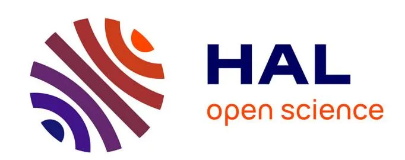
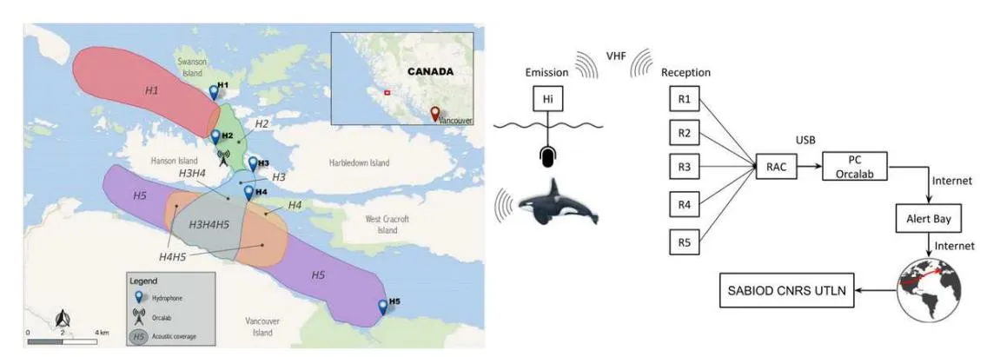
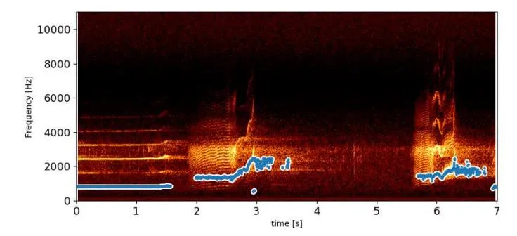
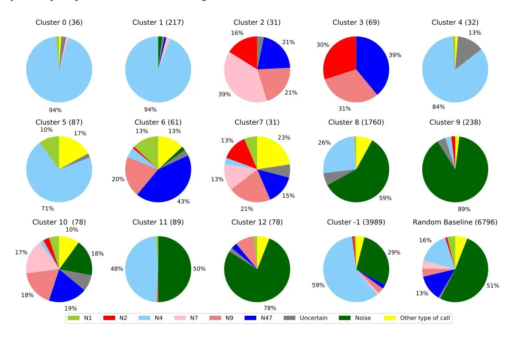
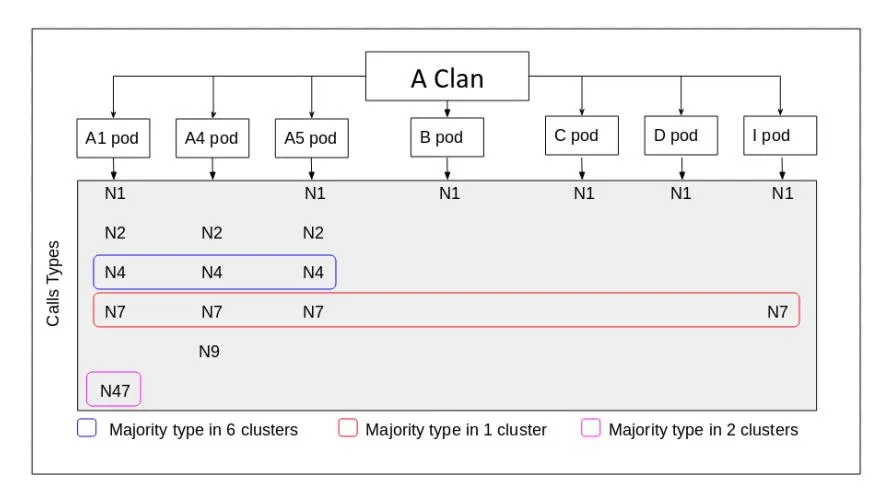

# **Large-scale unsupervised clustering of Orca vocalizations: a model for describing Orca communication systems**

Marion Poupard, Paul Best, Jan Schlüter, Helena Symonds, Paul Spong, Thierry Lengagne, Thierry Soriano, Hervé Glotin

## **To cite this version:**

Marion Poupard, Paul Best, Jan Schlüter, Helena Symonds, Paul Spong, et al.. Large-scale unsupervised clustering of Orca vocalizations: a model for describing Orca communication systems. 2nd International Workshop on Vocal Interactivity in-and-between Humans, Animals and Robots, Aug 2019, Londres, United Kingdom. ⟨10.7287/peerj.preprints.27979v1⟩. ⟨hal-02965872⟩

## **HAL Id: hal-02965872 <https://hal.science/hal-02965872v1>**

Submitted on 13 Oct 2020

**HAL** is a multi-disciplinary open access archive for the deposit and dissemination of scientific research documents, whether they are published or not. The documents may come from teaching and research institutions in France or abroad, or from public or private research centers.

L'archive ouverte pluridisciplinaire **HAL**, est destinée au dépôt et à la diffusion de documents scientifiques de niveau recherche, publiés ou non, émanant des établissements d'enseignement et de recherche français ou étrangers, des laboratoires publics ou privés.

[HAL Authorization](https://about.hal.science/hal-authorisation-v1/)

# **Large-scale unsupervised clustering of Orca vocalizations: a model for describing Orca communication systems**

**Marion Poupard**1,5**, Paul Best**1 **, Jan Schl¨uter**1 **, Helena Symonds**2 **, Paul Spong**2 **, Thierry Lengagne**3 **, Thierry Soriano**4 **, and Herve Glotin ´** 1

1**Univ. Toulon, Aix Marseille Univ., CNRS, LIS, DYNI, Marseille, France**

Corresponding author: Marion Poupard, Herve Glotin ´

Email address: marion.poupard@univ-tln.fr, glotin@univ-tln.fr

## **ABSTRACT**

Killer whales (_Orcinus orca_) can produce 3 types of signals: clicks, whistles and vocalizations. This study focuses on Orca vocalizations from northern Vancouver Island (Hanson Island) where the NGO Orcalab developed a multi-hydrophone recording station to study Orcas. The acoustic station is composed of 5 hydrophones and extends over 50 km2 of ocean. Since 2015 we are continuously streaming the hydrophone signals to our laboratory in Toulon, France, yielding nearly 50 TB of synchronous multichannel recordings. In previous work, we trained a Convolutional Neural Network (CNN) to detect Orca vocalizations, using transfer learning from a bird activity dataset. Here, for each detected vocalization, we estimate the pitch contour (fundamental frequency). Finally, we cluster vocalizations by features describing the pitch contour. While preliminary, our results demonstrate a possible route towards automatic Orca call type classification. Furthermore, they can be linked to the presence of particular Orca pods in the area according to the classification of their call types. A large-scale call type classification would allow new insights on phonotactics and ethoacoustics of endangered Orca populations in the face of increasing anthropic pressure.

## **1 INTRODUCTION**

The Orca (_Orcinus orca)_ is a top-predator of the marine food chain (Jefferson et al., 1991). The Northern Resident Orcas community is composed of several "pods" composed of matrilines (Bigg et al., 1990). This cetacean can produce 3 different types of signals: clicks, whistles and pulsed calls (Ford, 1989). This study focuses only on vocalizations (pulsed calls). Some biological studies describe the communication of Orcas (Ford et al., 1987; Tyson et al., 2007; Weiß et al., 2007; Filatova et al., 2012), based on manual methods. Related work by Deecke et al. (1999) compared dialects of Orcas using artificial neural networks and showed that acoustic similarities are significantly correlated with the group association patterns. In order to analyze the animal's communication in different spacial and temporal contexts, automated analysis for captured sound is crucial. For that purpose, the field of bioacoustics offers numerous approaches using neural networks and deep learning (Glotin et al., 2013). The latter methods were explored to automatically detect orca calls emitted throughout 3 years of continuous recordings from 2015 to 2017 (Poupard et al., 2019a). In this study we build on these detections, and compute each vocalisation's pitch over time. This pitch analysis serves to differentiate vocalisations. In particular, we extract pitch features and cluster the vocalizations, partly recovering different call types as annotated by human experts.

2**Orcalab Alert Bay, Canada**

3**LENHA, Univ. Lyon 1, CNRS, France**

4**Univ. Toulon, COSMER EA 9378, Toulon, France**

5**Biosong SARL, France**

## **2 MATERIAL**

For 20 years, the NGO Orcalab developed and has maintained a unique multi-hydrophone recording station around Hanson Island (Northern Vancouver Island, Canada) to study Orcas. This acoustic station is composed of 5 hydrophones and extends over 50 km2 of ocean (Fig. 1). In 2015, we have set up a continuous recording of all the hydrophones of this station (Fig. 1). The aim is to allow observation and modelling of bioacoustic activities for various species, at large spacial and temporal scales, including all details of their ecoacoustic niche, under various geophysical and anthropophonic conditions, more particularly in order to build new knowledge about Orcas.

**Figure 1.** Left: Map of the area and the listening range of the 5 hydrophones H1 to H5. Detection zones indicate which hydrophones can record Orca calls in a given area, w.r.t. thirty years of observations by Orcalab. Right: Representation of the data acquisition, from recording until storage at Toulon.

## **3 DATA ANALYSIS**

#### **3.1 Vocalization Detector**

We first designed an automatic acoustic event extractor (presented in (Poupard et al., 2019c)). Its output helped us build a dataset composed of 872 Orca vocalization samples and 6801 noise samples (boats, rain, void. . . ), which we split randomly with 20% for the test set, 60% for the training set and 20% for the validation set.1 With that in hand, we trained a CNN (originally designed for a bird detection task (Grill and Schluter, 2017) to distinguish Orca vocalizations (not clicks) from boats and background noise ¨ (Poupard et al., 2019a). The model was trained with weakly annoted data (one label per file), originally using global max pooling to aggregate local predictions for comparison against the global label. After training, the global pooling was removed to obtain local probabilities for pitch and vocalization analysis. Max pooling lead to spiky local predictions (high precision, but low recall), which were unsuitable for our purposes. We found that training the model with global mean pooling instead gave much higher recall, covering the full length of each vocalization without sacrificing precision. The resulting Area Under the receiver operating characteristic Curve (AUC) of this detector is 89% (Poupard et al., 2019a).

Running this model on the summers of 2015, 2016 and 2017 results in 421,879 detected vocalizations across all five hydrophones.

#### **3.2 Pitch Analysis**

In order to describe call characteristics, the pitch (fundamental frequency) is often used (Berthommier and Glotin, 1999). The pitch is a property that describes the fundamental frequency of the speech wave (Houtsma, 1997; Babacan et al., 2013). Like humans, Orcas produce vocalizations that have several harmonic frequencies, combining into a multi-layered wave (Ford, 1989). Foote and Nystuen (2008) used pitch to differentiate different ecotypes of killer whales and Shapiro and Wang (2009) developed their own pitch tracker algorithm (PDA) based on human voice.

In this study, the Parselmouth Python library (Jadoul et al., 2018) was chosen as pitch estimator. It relies on the autocorrelation (AC) (Boersma, 1993; Berthommier and Glotin, 1999). It is illustrated

1A random split may sample train and test segments from nearby locations, giving an overly optimistic test error. We did not have enough annotated data for a chronological split avoiding this.

on a recording of Orca calls in Fig. 2. Computing all the pitches for one day of vocalizations on the 5 hydrophones took half an hour in average on GPU.

**Figure 2.** Example of a pitch extraction (pitch floor=300, pitch ceiling=2500, voicing threshold=0.2).

The AC only outputs a pitch point if it has a certain confidence in it (using a threshold on the strength of the unvoiced candidate relative to the maximum possible AC). Thus, with some detected vocalizations, fewer points were output. This property allowed us to filter out false positives and too low Signal to Noise Ratio vocalization detections. Keeping only vocalizations with more than 200 points filtered out 284,791 noisy vocalizations and false detections.

We thus extracted the pitch of 137,088 vocalizations.

#### **3.3 Unsupervised Clustering**

Unsupervised clustering is often the solution to solve classification tasks for unannotated data. Our intuition was that the Orcas' call types (Ford et al., 1987; Root-Gutteridge et al., 2014) could be automatically clustered by similarity in their pitch shape. A first step was thus to define the input to our unsupervised clustering algorithm. Thus features of the previously extracted pitch were selected to best describe the shape of the vocalizations with a minimum dimensionality.

The following features were chosen (Ford, 1984): argminFreq, argmaxFreq, minVel, maxVel, meanVel, startVel, endVel, minAccel, maxAccel, argminAccel, argmaxAccel, deltaFreq. Here argmin/max stand for the position in time of the maximum/minimum relative to the total duration. Min/max stand for minimum/maximum values. Mean stands for the average value. Start/end stand for the mean of the first/last 5% of the call. Delta stands for the minimum value substracted from the maximum value. Freq stands for frequency values (the estimated pitch), Vel stands for velocity (the derivative of the pitch), and Accel stands for acceleration (the derivative of the velocity).

Having extracted those features, they were used as an input for the HDBSCAN algorithm (McInnes et al., 2017), which is a hierarchical implementation of the Density Based Spatial Clustering of Applications with Noise (DBSCAN) (Ester et al., 1996). Several minimum cluster sizes and minimum sample sizes were explored, to optimize the number of output clusters, and the strictness of the clustering. Eventually 30 and 3 were chosen for the latter parameters respectively.

## **4 RESULT**

The clustering algorithm hardly works when applied to all the collected vocalisations together (coming from the 5 different hydrophones with different depth and sensitivity), whereas it works decently when applied to each hydrophone separately. Here we present the results for the H1 hydrophone (see map in Fig. 1), which represents 6796 vocalizations. Further work will focus on generalizing the clustering method to any hydrophone after some normalization.

The HDBSCAN found 13 clusters (0 to 12; Fig. 4). The '-1' cluster is the algorithm's output of classifying what it considers as noise. To measure the clustering's relevance, 2 trained persons annotated 50 samples (picked randomly) from each cluster, according to the Oca call types as defined in the literature (Ford et al., 1987). We selected a subset of 6 call types (N1,N2,N4,N7,N9,N47): the ones most commonly found in our dataset (Fig. 3).

The distributions of call types among clusters (Fig. 4) show that our model was able in some clusters to isolate some type (N4 in clusters 0, 1, 4, and 5), to group calls with roughly similar upward types (N2,

**Figure 3.** Selected subset of call types as defined in the literature (Ford et al., 1987).

N7, N9, N47 in clusters 2 and 3), and to classify boat noise (clusters 9 and 12). Those results demonstrate a promising approach to classifying orca vocalizations, in approximately 20 days of computation for 3 years of pentaphonic continuous recording.

**Figure 4.** Distribution of call types among clusters found by the HDBSCAN algorithm. The numbers next to the cluster name show the amount of cluterized samples. The % are from the annotated subset.

## **5 CONCLUSION AND DISCUSSION**

Our primary results can be linked with the presence of particular pods in the area. In fact, British Columbia (BC) is composed of different "acoustic clans". An acoustic clan is a group of Orcas that share particular types of calls known as discrete calls (Ford and Fisher, 1982). In the Northern and coastal BC, there are 4 main acoustic clans: the J, R, G and A Clan. For now, we will focus on the A Clan (Fig. 5), composed of several pods, themselves composed of groups of lineages called matrilines.

As shown in Fig. 5, there are 7 different pods in the A clan, having different call types (Ford, 1984). For example the A4 pods can produce N2, N4, N7 and N9 call types. Some types of calls are shared among multiple pods within the clan. For example, the N7 call extends to all pods, however each pod produces an unique N7 call. By recognizing pods and recording the different calls, we can establish a link between the pods and our clusters. In fact clusters 0, 1, 4, 5, and -1 have a high proportion of the N4 call

type (Fig. 4), we can thus expect that the A1, A4, and A5 pod vocalizations are present in these 5 clusters. The N47 call type is produced only by the A1 pods and this type is very present in 2 clusters (3 and 6), so we can state the hypothesis that these 2 clusters correspond to the A1 pod.

With such reasoning, these clusters represent a first approach to acoustically classify pods in BC, and in the future, matrilines (Weiß et al., 2006) and individual vocal signatures (Weiß et al., 2007).

**Figure 5.** Selection of the 6 Call types produced by pods of the A clan inspired from (Ford, 1984).

Future work will improve the model at each of the 3 main steps: the learned vocalization detection, the pitch estimation that could be trained specifically to detect Orcas' pitch (Kim et al., 2018), and the unsupervised clustering of calls. An obvious improvement would consist in annotating more data for training. Parameter optimization is another possible enhancement, especially for the pitch estimation and the unsupervised clustering. For this purpose, relevant objective functions and accurate metrics need to be found. One could consider a global objective cost function to maximise the normalised mutual information of the bivariate distribution (Type, Cluster).

Once such an improved system is at hands, having a fully autonomous reliable Orca type call detector and classifier will open doors to many studies on Orca's communication and phonotactic regularities and divergence like in Malige et al. (2019). It would also allow behavioural studies (ethoacoustics), within various environments, including increasing anthropophony or whale watching pressure like in Poupard et al. (2019b).

## **ACKNOWLEDGMENTS**

We thank first the Orcalab direction and collaborators for their incredible inspired work. We thank Biosong SA for the PhD funding of M. Poupard. This research is partly funded by FUI 22 Abyssound, ANR-18-CE40-0014 SMILES, ANR-17-MRS5-0023 NanoSpike and MARITTIMO EUR GIAS projects on advanced studies on cetaceans. We thank MI CNRS MASTODONS SABIOD.org and EADM MADICS CNRS scaled bioacoustic research groups, IUF for Glotin's chair 2011-16 during which he installed the remote recording at Orcalab to UTLN DYNI, and SEAMED PACA project and CNRS platform support for J. Schluter's Post doc grant. ¨

## **REFERENCES**

Babacan, O., Drugman, T., d'Alessandro, N., Henrich, N., and Dutoit, T. (2013). A comparative study of pitch extraction algorithms on a large variety of singing sounds. In _IEEE ICASSP_, pages 7815–7819. Berthommier, F. and Glotin, H. (1999). A measure of speech and pitch reliability from voicing. In _Proc. Int. Joint Conf. on Artificial Intelligence (IJCAI)_, pages 61–70.

Bigg, M., Olesiuk, P., Ellis, G., Ford, J., and Balcomb, K. (1990). Social organization and genealogy of resident killer whales (orcinus orca) in the coastal waters of british columbia and washington state. _Report of the International Whaling Commission_, 12:383–405.

Boersma, P. (1993). Accurate short-term analysis of the fundamental frequency and the harmonics-to-noise ratio of a sampled sound. _Proceedings of the Institute of Phonetic Sciences_, 17:97–110.

- Deecke, V., Ford, J., and Spong, P. (1999). Quantifying complex patterns of bioacoustic variation: Use of a neural network to compare killer whale dialects. _J. ASA_, 105(4):2499–2507.
- Ester, M., Kriegel, H.-P., Sander, J., and Xu, X. (1996). A density-based algorithm for discovering clusters in large spatial databases with noise. In _Knowledge Discovery and Data Mining_, KDD, pages 226–231.
- Filatova, O., Deecke, V., Ford, J. K., Matkin, C., Barrett-Lennard, L., Guzeev, M., Burdin, A., and Hoyt, E. (2012). Call diversity in the north pacific killer whale populations: implications for dialect evolution and population history. _Animal Behaviour_, 83(3):595–603.
- Foote, A. D. and Nystuen, J. A. (2008). Variation in call pitch among killer whale ecotypes. _The Journal of the Acoustical Society of America_, 123(3):1747–1752.
- Ford, J. (1989). Acoustic behaviour of resident killer whales (orcinus orca) off vancouver island, british columbia. _Canadian Journal of Zoology_, 67(3):727–745.
- Ford, J. et al. (1987). _A catalogue of underwater calls produced by killer whales (Orcinus orca) in British Columbia_. Department of Fisheries and Oceans, Fisheries Research Branch, Pacific . . . .
- Ford, J. K. and Fisher, H. D. (1982). Killer whale (orcinus orca) dialects as an indicator of stocks in british columbia. _Rep. Int. Whal. Commn_, 32:671–679.
- Ford, J. K. B. (1984). _Call traditions and dialects of killer whales (Orcinus orca) in British Columbia_. PhD thesis, University of British Columbia.
- Glotin, H., LeCun, Y., Artieres T. Mallat, S., Tchernichovski, O., and Halkias, X. (2013). Proc. nips4b : ` Neural information processing scaled for bioacoustics, from neurons to big data, joint to int. _Conference on Neural Information Processing Systems (NIPS)_. http://sabiod.org/nips4b.
- Grill, T. and Schluter, J. (2017). Two convolutional neural networks for bird detection in audio signals. In ¨ _2017 25th European Signal Processing Conference (EUSIPCO)_, pages 1764–1768. IEEE.
- Houtsma, A. J. (1997). Pitch and timbre: Definition, meaning and use. _Journal of New Music Research_, 26(2):104–115.
- Jadoul, Y., Thompson, B., and De Boer, B. (2018). Introducing parselmouth: A python interface to praat. _Journal of Phonetics_, 71:1–15.
- Jefferson, T., Stacey, P., and Baird, R. (1991). A review of killer whale interactions with other marine mammals: Predation to co-existence. _Mammal review_, 21(4):151–180.
- Kim, J. W., Salamon, J., Li, P., and Bello, J. P. (2018). Crepe: A convolutional representation for pitch estimation. In _IEEE Int. conf. Acoustics, Speech Sig. Proc. (ICASSP)_, pages 161–165.
- Malige, F., Djokic, D., Patris, J., Sousa-Lima, R., and Glotin, H. (2019). Use of recurrence plots to automatically extract songs in humpback whale recordings. _Submitted to Bioacoustics_.
- McInnes, L., Healy, J., and Astels, S. (2017). hdbscan: Hierarchical density based clustering. _The Journal of Open Source Software_, 2(11):205.
- Poupard, M., Best, P., Schluter, J., Prevot, J., Spong, P., Symonds, H., and Glotin, H. (2019a). Deep ¨ learning for ethoacoustics of orcas on three years pentaphonic continuous recording at orcalab revealing tide, moon and diel effects. In _IEEE OCEANS_.
- Poupard, M., DeMongolfier, B., and Glotin, H. (2019b). Ethoacoustic by bayesian non parametric and stochastic neighbor embedding to forecast anthropicpressure on dolphins. In _IEEE OCEANS_.
- Poupard, M., Ferrari, M., Schluter, J., Astruch, P., Schohn, B., Rouanet, B., Goujard, A., Lyonnet, A., Giraudet, P., Barchasz, V., Gies, V., Best, P., Dominici, D., Lengagne, T., Soriano, T., and Glotin, H. (2019c). Passive acoustics to monitor flagship species near boat traffic in the UNESCO world heritage natural reserve of scandola. In _Input Academy : Conf. Innovation in Urban & Regional Planning_.
- Root-Gutteridge, H., Bencsik, M., Chebli, M., Gentle, L. K., Terrell-Nield, C., Bourit, A., and Yarnell, R. W. (2014). Improving individual identification in captive eastern grey wolves (canis lupus lycaon) using the time course of howl amplitudes. _Bioacoustics_, 23(1):39–53.
- Shapiro, A. D. and Wang, C. (2009). A versatile pitch tracking algorithm: From human speech to killer whale vocalizations. _The Journal of the Acoustical Society of America_, 126(1):451–459.
- Tyson, R., Nowacek, D., and Miller, P. (2007). Nonlinear phenomena in the vocalizations of north atlantic right whales and killer whales. _J. Acoustical Soc. America_, 122(3):1365–1373.
- Weiß, B. M., Ladich, F., Spong, P., and Symonds, H. (2006). Vocal behavior of resident killer whale matrilines with newborn calves: The role of family signatures. _J. ASA_, 119(1):627–635.
- Weiß, B. M., Symonds, H., Spong, P., and Ladich, F. (2007). Intra-and intergroup vocal behavior in resident killer whales, orcinus orca. _J. Acoustical Soc. America_, 122(6):3710–3716.
