ORIGINAL ARTICLE

# **Impacts of a large hydroelectric dam on the Madeira River (Brazil) on floodplain avifauna**

Tomaz Nascimendo de MELO1,2\* , Marconi Campos CERQUEIRA2 , Fernando Mendonça D'HORTA3 , Hanna TUOMISTO4 , Jasper Van DONINCK4,5, Camila Cherem RIBAS6

- 1 Universidade Federal do Amazonas, Programa de Pós-Graduação em Zoologia, Manaus, Amazonas, Brazil
- 2 Rainforest Connection, Science Department, San Juan, Puerto Rico
- 3 Instituto Nacional de Pesquisas da Amazônia, Programa de Pós-Graduação em Genética, Conservação e Biologia Evolutiva, Manaus, Amazonas, Brazil
- 4 University of Turku, Department of Biology, Turku, Finland
- 5 University of Turku, Department of Geography and Geology, Turku, Finland
- 6 Instituto Nacional de Pesquisas da Amazônia, Coordenação de Biodiversidade, Manaus, Amazonas, Brazil
- \*Corresponding author: tomazramphotrigon@gmail.com; https://orcid.org/0000-0003-1525-5957

#### **ABSTRACT**

Hydroelectric dams represent an important threat to seasonally flooded environments in the Amazon basin. We aimed to evaluate how a dam in the Madeira River, one of the largest tributaries of the Amazonas River, affected floodplain avifauna. Bird occurrence was recorded through simultaneous passive acoustic monitoring in early successional vegetation and floodplain forest downstream from the dam and upstream in sites impacted by permanent flooding after dam reservoir filling. Species were identified through manual inspection and semi-automated classification of the recordings. To assess the similarity in vegetation between downstream and upstream sites, we used Landsat TM/ETM+ composite images from before (2009-2011) and after (2016-2018) reservoir filling. Downstream and upstream floodplain forest sites were similar before, but not after dam construction. Early successional vegetation sites were already different before dam construction. We recorded 195 bird species. While species richness did not differ between upstream and downstream sites, species composition differed significantly. Ten species were indicators of early successional vegetation upstream, and four downstream. Ten species were indicators of floodplain forest upstream, and 31 downstream. Seven of 24 floodplain specialist species were detected by the semi-automated classification only upstream. While we found some bird species characteristic of early successional vegetation in the upstream sites, we did not find most species characteristic of tall floodplain forest. Predominantly carnivorous, insectivorous, and nectarivorous species appear to have been replaced by generalist and widely distributed species.

**KEYWORDS:** Amazon; ecoacoustics; indicator species; passive acoustic monitoring

# **Impacto de uma grande usina hidroelétrica sobre a avifauna de várzea do Rio Madeira (Brasil)**

### **RESUMO**

Barragens hidroelétricas representam uma importante ameaça a ambientes sazonalmente alagados na Amazônia. Avaliamos como uma barragem no Rio Madeira, um dos maiores tributários do Rio Amazonas, afetou a comunidade de aves de várzea. A ocorrência de aves foi registrada através de monitoramento acústico passivo simultâneo em vegetação em estágio sucessional inicial e floresta de várzea a jusante e em áreas a montante alagadas permanentemente após a formação do reservatório. Espécies foram identificadas por inspeção manual e classificação semi-automática das gravações. Para acessar a similaridade entre a vegetação a jusante e montante, utilizamos composições de imagens Landsat TM/ETM+ de antes (2009-2011) e após (2016-2018) a formação do reservatório. Sítios de floresta de várzea foram similares antes, mas não após o reservatório. Sítios de vegetação sucessional inicial já diferiam antes do reservatório. Registramos 195 espécies de aves. A riqueza de espécies não diferiu entre os sítios a jusante e montante, mas a composição de espécies diferiu significativamente. Dez espécies foram indicadoras de vegetação sucessional inicial a montante e quatro a jusante. Dez espécies foram indicadoras de floresta de várzea a montante e 31 a jusante. Sete de 24 espécies especialistas de várzea foram detectadas apenas a montante pelas classificações semi-automáticas. Encontramos algumas espécies típicas de vegetação sucessional inicial a montante, porém não encontramos a maioria de espécies típicas the floresta alta de várzea. Predominantemente, aves carnívoras, insetívoras e nectarívoras aparentam ter sido substituídas por espécies generalistas e amplamente distribuídas.

**PALAVRAS-CHAVE:** Amazônia; ecoacústica; espécies indicadoras; monitoramento acústico passivo

**CITE AS:** Melo, T.N.d.; Cerqueira, M.C.; D'Horta, F.M.; Tuomisto, H.; Doninck, J.V.; Ribas, C.C. 2021. Impacts of a large hydroelectric dam on the Madeira River (Brazil) on floodplain avifauna. _Acta Amazonica_ 51: 298-310.

### **INTRODUCTION**

The growing human demand for electricity has led to an unprecedented increase in both construction and planning of new hydroelectric dams in emerging economies (Zarfl _et al_. 2015), with the Amazon basin being considered a hotspot for future projects (Winemiller _et al_. 2016; Forsberg _et al_. 2017; Latrubesse _et al_. 2017; Almeida _et al_. 2019). Currently, 158 dams already exist in Amazonia (68 in Brazil), and 351 more are planned, most of them (213) in Brazil (Almeida _et al_. 2019).

The immediate and most evident impact upstream of dams is the loss of natural floodplain habitats due to permanent flooding, which causes the death of the vegetation adapted to the Amazonian flood pulse cycle (Assahira _et al_. 2017) and eliminates specific microhabitats, such as rock outcrops, rapids and sand beaches (Lees _et al_. 2016; Cochrane _et al_. 2017; Forsberg _et al_. 2017). Impacts downstream of the dams are characterized by a reduction in the concentration of fine suspended sediments and nutrients (Forsberg _et al_. 2017; Rivera _et al_. 2019) and these effects are cumulative along drainages (Latrubesse _et al_. 2017; 2020).

Amazonian seasonally flooded environments harbor unique bird communities (Remsen and Parker III 1983). Many bird species are restricted to these habitats, but little is known about their ecology and genetic and phenotypic variation along the basin (Remsen and Parker III 1983; Laranjeiras _et al_. 2019). Recent studies suggest that many unrecognized independent evolutionary lineages are present at different interfluves (Thom _et al_. 2018; 2020). The distribution limits and population sizes of these floodplain specialist species have never been estimated, which means that many species have not received an adequate threat status from IUCN and regional Red Lists (Vale _et al_. 2008; Bird _et al_. 2012). Dam construction and operation decrease habitat availability and ecological connectivity for floodplain species, and therefore can be a significant driver of local extinction and population fragmentation (Vale _et al_. 2008; Latrubesse _et al_. 2020).

We evaluated the effect of the Santo Antonio dam on the Madeira River (one of the largest tributaries of the Amazonas River) on bird communities associated with two contrasting types of floodplain habitats. To achieve this objective, we: (a) used Landsat imagery to determine similarities in vegetation between sampling sites upstream and downstream from the dam both before and after dam reservoir filling; (b) characterized bird species richness and composition at each site; and (c) identified which bird species and guilds were most impacted by permanent flooding. This study provides the first assessment of which floodplain habitat-specific bird fauna is most affected by dams in the southwestern Amazon.

### **MATERIAL AND METHODS**

#### **Study area**

The Madeira River is the longest tributary of the Amazon River, with a total length of 3,600 km, contributing to 15% of

the discharge and approximately 50% of the sediment load to the Amazon River (Goulding _et al_. 2003). The Madeira River basin covers 1,400,000 km2 , which corresponds to 23% of the Amazon basin (Rivera _et al_. 2019). Average rainfall throughout the basin ranges from 2,000 to 2,500 mm, with a rainy season between December and April and the downstream flood peak between March and April (Rivera _et al_. 2021). The amplitude of the flood pulse in this region varies, on average, from 10.8 to 12.4 m between the lowest and the highest water levels (Goulding _et al_. 2003).

During the low water season, the exposed river banks are colonized by early successional vegetation composed of grasses, such as _Echinochloa_ spp. and patches of _Gynerium sagittatum_. In the higher intermediate zone, trees and shrubs adapted to prolonged flooding predominate, such as _Tessaria integrifolia_, _Cecropia_ sp., _Inga_ sp., and _Muntingia calabura_. In the highest areas, which are flooded for a shorter period, the vegetation is tall floodplain forest that has a higher diversity of plant species, a well-developed understory and a canopy height of ca. 15-20 m, including emergent trees of up to 25- 30 m (Perigolo _et al_. 2017).

Two large hydroelectric dams, Santo Antônio and Jirau, have been in operation on the Madeira River since 2012. These run-of-the-river dams employ a horizontal bulb turbine system that causes permanent flooding, mostly of previously seasonally flooded habitats along a large stretch of the river upstream of the dams but maintain water flow downstream (Li _et al_. 2020). The Santo Antonio dam permanently inundated an area of 271 km2 in which most of the floodplain forest trees died (Fearnside 2015; Cochrane _et al_. 2017; Li _et al_. 2020). The newly flooded areas between the Santo Antonio and Jirau dams increased by 47.2% after dam construction (Li _et al_. 2020).

#### **Sampling design**

The selection of sampling sites occurred in 2017, based on inspection of satellite images in Google Earth and subsequent inspection in the field. Selection criteria were the presence of key vegetation elements (e.g. _Cecropia_ trees in early successional vegetation or presence of mature floodplain forest prior to the reservoir) and ease of access.

We sampled 19 sites, nine located upstream (90 to 105 km from the Santo Antonio dam) in the area that has been permanently flooded by the reservoir, and ten sites downstream (50 to 57 km from the dam) (Figure 1). We treated the downstream sites as control sites, as the flooding regime and vegetation cover have not changed significantly since reservoir filling (Li _et al_. 2020). We chose five upstream sampling sites in floodplain forest area on the left bank of the river where the rise of the groundwater table caused the death of most trees of species that are not adapted to the increased flooding, while still keeping more resistant vegetation, mainly shrubs, palms, and grasses (Figure 1c,e; Supplementary Material, sites

U1-U5 in Table S1, Figure S1c,d). Four upstream sites were located on a river island (Figure 1c,e), covered by vegetation that appears resistant to prolonged flooding, of which two were dominated by _Cecropia_ trees (Urticaceae), and two by _Tessaria_ shrubs (Asteraceae), with the understory dominated by grasses (Supplementary Material, sites U6-U9 in Table S1, Figure S1a,b). Six downstream sites were located on the left bank of the river in tall floodplain forest areas, with a well developed and diverse understory (Figure 1d,f; Supplementary Material, sites D5-D10 in Table S1, Figure S1f). Four downstream sites were also located on a river island dominated by _Cecropia_ trees and mostly herbaceous plants in the understorey (Figure 1d,f; Supplementary Material, sites D1-D4 in Table S1, Figure S1e).

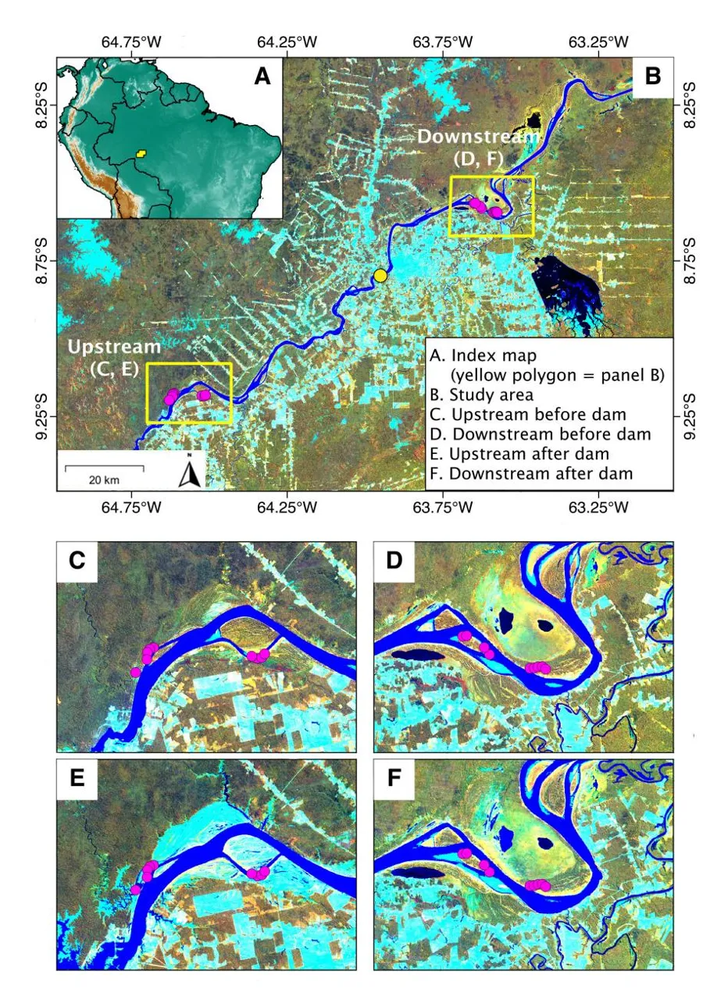

**Figure 1.** A – Location of the study area (yellow spot); B – Location of the Santo Antônio dam (yellow circle) and upsteam and downstream bird sampling sites (pink circles) along the upper Madeira River, Rondônia state, Brazil; B-F – Landsat TM/ETM+ composite images in background false color with bands 4, 5, and 3 assigned to the red, green, and blue color channels, respectively. Distinctions in the composite imagens before and after the dam construction and downstream and upstream of the dam are shown (C, D, E, F). Light blue color represents non-forest vegetation, including young successional vegetation along the rivers and deforested areas now under cultivation or pasture. C – Upstream sampling sites before reservoir filling; D – Downstream sampling sites before reservoir filling; E – Upstream sites after reservoir filling; F – Downstream sites after reservoir filling. This figure is in color in the electronic version.

The upstream river island is larger than the downstream island, and the latter had a taller vegetation, with a more developed understory than former (as corroborated by the presence of forest species such as _Monasa nigrifrons_ and _Myrmotherula assimilis_ as indicator species). Despite the heterogeneity of Amazonian river islands (Rosenberg 1990), which makes them difficult to compare, we chose sampling sites on islands because Amazonian river islands are known to harbour specialist bird species (Borges _et al_. 2019).

#### **Habitat characterization**

As standardized samplings before dam construction were not available, we used a space-for-time substitution approach to assess changes in bird communities associated with the dam construction (Blois _et al_. 2013). An essential prerequisite for this approach is that the sites representing the conditions before and after the impact are otherwise similar enough, so that current differences in bird communities can be assumed to be effects of the dam. After the bird samplings (see below), we used Landsat satellite images to assess habitat differences between the areas upstream and downstream from the dam, both before and after reservoir filling, as surface reflectance are good predictors of floristic and environmental variation in Amazonia (Higgins _et al_. 2011; Tuomisto _et al_. 2003; 2019; Van Doninck and Tuomisto 2018). We assumed that, if surface reflectance of the sites were similar before reservoir filling, the environments and their associated bird communities were also similar, as the occurrence of bird species is related to vegetation characteristics (Parker III _et al_. 1996).

We generated Landsat TM/ETM+ image composites for two 3-year periods: 2009-2011, for vegetation before dam reservoir filling, and 2016-2018, for vegetation after the start of the Santo Antônio dam operations. Each composite used all Landsat 5 and Landsat 7 images that were available for the relevant years and had less than 60% cloud cover. Directional effects were normalized following the methods described in Van Doninck and Tuomisto (2017a). Each pixel's reflectance value was selected from the available observations using the medoid method (Van Doninck and Tuomisto 2017b).

An unsupervised k-means clustering with visual assessment of the clusters was used to classify the pixels into forest, nonforest, and water classes. For numerical analyses, spectral values were extracted for a window of 15 x 15 pixels (450 m x 450 m) centered on each sampling site. For each sampling site window, the number of pixels in each of the three ground cover classes was registered together with the median reflectance value, for each ground cover class separately, of Landsat bands 2 (green), 3 (red), 4 (near-infrared), 5 (shortwave infrared 1) and 7 (shortwave infrared 2).

To estimate the spectral similarity among sites before and after reservoir filling, we summarized the reflectance data using principal component analysis (PCA; based on a correlation matrix) separately for each time period. Three separate PCA runs were done: one only with the pixels classified as forest, one only with the pixels classified as non-forest vegetation, and one with both classes combined. Pixels classified as water were excluded from all PCAs, and the differences were estimated by visual inspection of the PCA ordination. The _princomp_ function of the _stats_ package in R version 3.6.1 (R Core Team 2019) was used.

#### **Bird sampling**

Bird communities at all sites were sampled by autonomous recorders in four periods of 20 days each, for a total of 80 days per sampling site. The sampling periods were distributed over the four phases of the Madeira River flood pulse: September 2017 (low water level), December 2017 (rising water level), March 2018 (maximum water level), and June/July 2018 (decreasing water level). We used one recorder per site, totalizing 19 recorders. An advantage of using autonomous recorders is the standardization of sampling effort in different habitat types, avoiding the bias of easier visual detection in more open habitats (Kulaga and Budka 2019).

Each recorder consisted of a LG smartphone protected by a water-resistant case, connected to a Monoprice external condenser microphone. The recorders were programmed to record 1 minute every 10 minutes, totalizing 144 minutes of recording per day, at a sampling rate of 44.1 kHz, during the same days in all sites. Microphones had a flat response between 50 Hz to 20 kHz and a sensitivity of -45 dB ± 2 dB. The recorders were separated by a minimum distance of 400 m and placed in trees at an average height of 1.80 m above either the ground or the water surface, depending on the water level during the sampling period. A previous test using the same recorder model found that most bird species are detected up to a distance of ~100 m, so the minimum distance between sites was sufficient to guarantee sample independence (Campos-Cerqueira _et al_. 2019).

To build species lists for each site, we randomly selected three sampling days from each site and sampling period for acoustic inspection. We listened to all morning chorus recordings made between 05h40 and 09h00 and to ten randomly selected recordings from the time interval between 10h00 and 23h50, totaling 31 1-minute recordings per site and day and 93 1-minute recordings per site and sampling period, totaling 7,068 recordings. A matrix was generated containing the species recorded by minute, site, and sampling period. All species identifications were made by TNM. Congeneric species with very similar vocalizations were identified only to genus level (_Ardea_ sp., _Ara_ sp., _Brotogeris_ sp., and _Psarocolius_ sp.) and were not included in the statistical analyses. Species nomenclature followed the taxonomy by the Handbook of the Birds of the World and BirdLife International (2020). All recordings are permanently archived

on the RFCx-ARBIMON platform (https://arbimon.rfcx. org/project/birds-of-madeira-flooded-habitats/dashboard).

#### **Analysis of bird communities**

We compared bird species richness between habitat type (early successional vegetation and floodplain forest) and between upstream (flooded) and downstream (control) sites with the non-parametric Wilcoxon-Mann-Whitney test. We also used the first order Jackknife estimator to estimate total species richness. Non-parametric multidimensional scaling (NMDS) ordination was used to visualize similarity patterns in bird species composition based on presence-absence data (Jaccard index). We used the permutational analysis of variance (PERMANOVA) to test the significance of the dissimilarity in species composition, as determined by the Jaccard index, comparing sites within habitat downstream and upstream. The tests were carried out using the _vegan_ package in R (Oksanen _et al_. 2019).

We considered species that occur primarily or exclusively in seasonally flooded Amazonian habitats as floodplain specialists (Remsen and Parker III 1983; Parker III _et al_. 1996; Billerman _et al_. 2020). To identify which functional groups appear to be most affected by the dam, we classified species into guilds adapted from Wilman _et al_. (2014). We classified species on the basis of their degree of sensitivity to environmental disturbance (low, medium, and high) following Parker III _et al_. (1996).

To better characterize habitat use by the birds, we performed an indicator species analysis to identify which species are characteristic of each of the two habitat types (early successional vegetation and floodplain forest) upstream and downstream of the dam. This analysis calculates for each species an indicator value that varies between 0 and 1, where 0 indicates no association with a habitat and 1 indicates that the species occurs only in that habitat, in all sampled sites (Dufrêne and Legendre 1997). Species were considered statistically significant indicators when the probability of finding as high an indicator value in 10,000 random permutations was < 0.05. We used the _indval_ function of the R package _labdsv_ (Roberts 2019).

To analyze the occurrence of floodplain specialist species in the upstream sites, we used automated classification algorithms in the RFCx-ARBIMON platform to determine the presence or absence of 24 floodplain specialists (diurnal birds) in 93,435 audio recordings (between 05h00 to 18h00). Species-specific identification models allow the detection and analysis of target species in a large dataset and have been successfully used in several groups of organisms (Corrada-Bravo _et al_. 2017; LeBien _et al_. 2020).

All recording classifications were based on a templatematching procedure (one model per species, using the territorial song as a template). This procedure searches through audio data for acoustic signals and detects regions with a high correlation with a user's template. Regions of interest (ROIs) with values above a correlation threshold are presented as potential detections (see LeBien _et al_. 2020 for more details).

Template choice was based on a previous analysis of the most common type of vocalization present in the recordings and based on the best available recording (high signal-to-noise ratio). We selected the threshold of 0.1, which increases the number of false positives, and may capture variations in the call type. We used the score filter on all matches resulting from the automated classification to validate the results, marking only the true positives as present. The score filter groups the highest-scoring matches in descending order, optimizing the time to find true positives with manual inspection. This procedure ensured that the final dataset only included expertverified detections, without false positives.

#### **RESULTS**

#### **Vegetation cover before and after reservoir filling**

Surface reflectance values of the Landsat data (Supplementary Material, Table S2) showed that many of the upstream sites, that were mostly or entirely forested before reservoir filling, had lost forest cover in 2016-2018 and consisted mostly of non-forest vegetation (Figure 2), as great part of the trees died and only more resistant vegetation persistted, such as palm trees, shrubs, and grasses (Supplementary Material, Figure S1). The corresponding PCA ordinations confirmed that the forests in the upstream sites were spectrally similar to the forests in the downstream sites before reservoir filling, but that spectral characteristics changed in upstream sites after filling and became clearly different from the downstream sites (Figure 2). The PCA indicated that early successional vegetation sites differed between the islands before reservoir filling, and become slightly more similar after filling (Figure 2).

#### **Impacts on bird communities**

The final data set included 16,780 detections of 195 species, and the first order Jackknife richness estimate was 220 species (Figure 3; Supplementary Material, Table S1). The number of detections at each site ranged from 456 to 1145 (mean = 883, _SD_ = 178) (Supplementary Material, Table S3). Among all species, 66 (33.8%) were detected only downstream, 35 (17.9%) only upstream, and 30 (15.4%) were specialists that are restricted to or primarily associated with Amazonian seasonally flooded habitats (Supplementary Material, Table S1).

Species richness per site ranged from 44 to 92 (Supplementary Material, Table S3), and did not differ significantly between upstream and downstream sites for early successional vegetation (Wilcoxon's W = 4.5, _p_ = 0.38) nor forest (Wilcoxon's W = 6.5, _p_ = 0.14) (Figure 4a). Considering only floodplain specialists, however, species richness differed significantly for both habitat types. There were more specialist species in early successional sites upstream (Wilcoxon's W = 1, _p_ = 0.05) and forest sites downstream (Wilcoxon's W = 29.5, _p_ = 0.01) (Figure 4b).

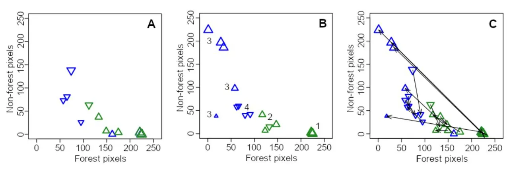

**Figure 2.** Scatterplots of the sampling sites downstream and upstream from the Santo Antônio dam on the Madeira River resulting from PCA showing how many pixels in a 15 by 15 pixel window centered over the sampling site in a Landsat TM/ETM+ composite image were classified as forest and how many as non-forest vegetation. A – before reservoir filling (based on surface reflectances from 2009-2011); B – after reservoir filling (2016-2018). Numbers indicate: 1- sites in floodplain forest downstream, 2 - successional vegetation downstream, 3 - drowned floodplain forest upstream, 4 - successional vegetation upstream; C – combined data (arrows indicate how individual sites have changed). Sites with > 50% forest pixels before reservoir filling are shown with upward-pointing triangles and other sites with downward-pointing triangles. Upstream sites are shown in blue, downstream sites in green. Symbol size increases according to the percentage of land pixels in the window. This figure is in color in the electronic version.

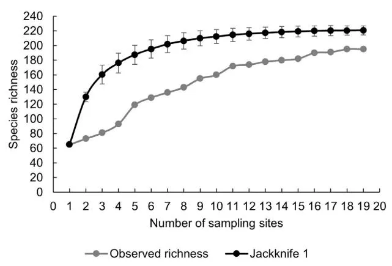

**Figure 3.** Species accumulation curves of observed and estimated (first order Jackknife estimator) species richness for floodplain avifauna sampled at 19 sites along the upper Madeira River.

Early successional sites did not differ significantly in the proportion of species per trophic guild, except for invertebrate generalists, which contained more upstream species (Wilcoxon's W = 1, _p_ = 0.05) (Figure 5g). Downstream forest sites had about twice as many carnivore (Wilcoxon's W = 26, _p_ = 0.05) and nectarivore (Wilcoxon's W = 29.5, _p_ < 0.01) species than upstream forest sites (Figure 5a and f). In turn, upstream forest sites had more open habitat species, such as piscivores (Wilcoxon's W = 0, _p_ < 0.01), invertebrate generalists (Wilcoxon's W = 1.5, _p_ = 0.01), and granivores (Wilcoxon's W = 6, _p_ = 0.05) (Figure 5e, g,h; Supplementary Material, Table S4).

More than 60 species, mostly insectivore passerine birds with medium and high sensitivity to habitat disturbance, were only detected downstream. In contrast, more than half of all species detected upstream have low sensitivity (Supplementary Material,

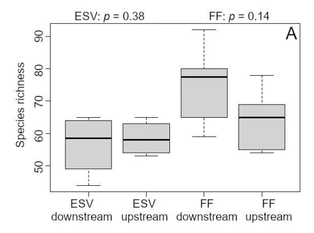

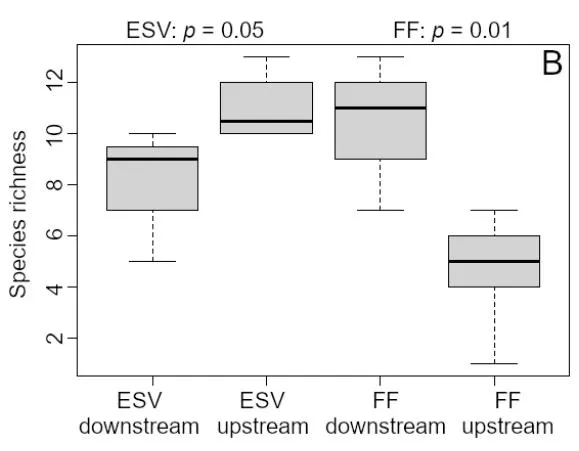

**Figure 4.** Species richness for all bird species (A), and floodplain specialists (B) in floodplain forest (FF) and early successional vegetation (ESV) sampling sites upstream and downstream from Santo Antônio dam on the Madeira River. The significance level of the Wilcoxon-Mann-Whitney test is shown. Lines are the average, boxes the standard deviation and bars the range.

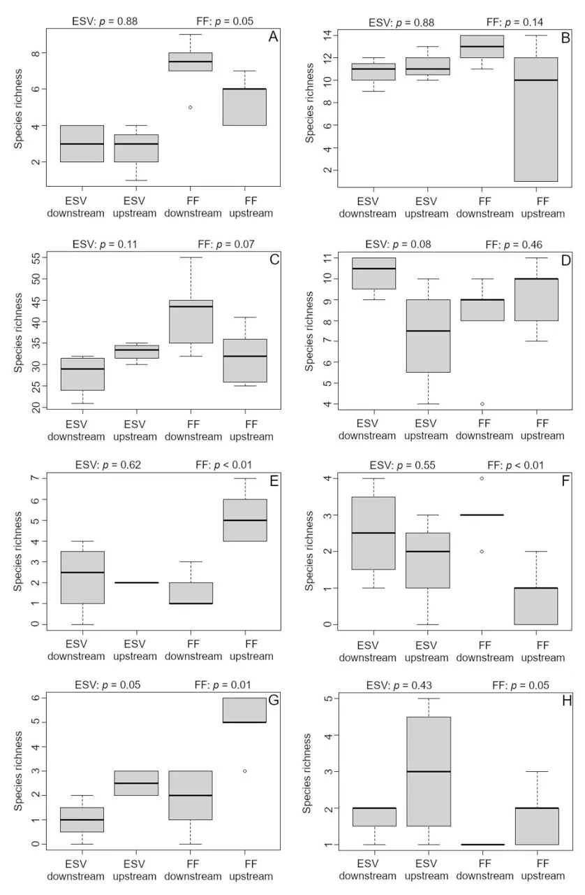

**Figure 5.** Species richness of different bird trophic guilds in floodplain forest (FF) and early successional vegetation (ESV) sampling sites upstream and downstream from Santo Antônio dam on the Madeira River. A – carnivores; B – frugivores; C – insectivores; D – omnivores; E – piscivores; F – nectarivores; G – invertebrate generalists; H – gramnivores. The significance level of the Wilcoxon-Mann-Whitney test is shown. Lines are the average, boxes the standard deviation and bars the range.

Table S3). Downstream forest sites had significantly more species with high (Wilcoxon's W = 30, _p_ < 0.01) and medium sensitivity to impacts (Wilcoxon's W = 30, _p_ < 0.01) (Figure 6b,c) than upstream forest sites, which had more species with low sensitivity (Wilcoxon's W = 0, _p_ < 0.01) (Figure 6a). In addition, the downstream early successional sites also had more species with high sensitivity than the upstream sites (Wilcoxon's W = 16, _p_ < 0.05).

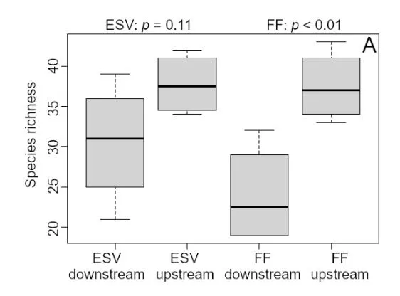

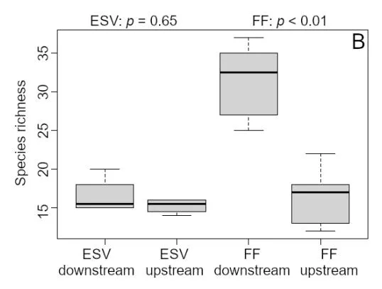

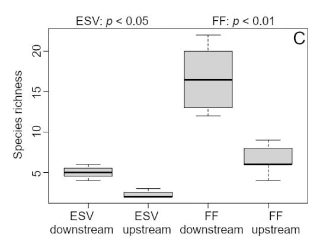

**Figure 6.** Species richness of birds in different levels of sensitivity to environmental disturbance in floodplain forest (FF) and early successional vegetation (ESV) sampling sites upstream and downstream from Santo Antônio dam on the Madeira River. A – low; B – medium; C – high sensitivity. The significance level of the Wilcoxon-Mann-Whitney test is shown. Lines are the average, boxes the standard deviation and bars the range.

Species composition differed significantly between upstream and downstream forest sites (PERMANOVA, pseudo-F = 5.05, *r*2 = 0.45, _p_ < 0.05) (Figure 7a), and between upstream and downstream early successional sites (PERMANOVA, pseudo-F = 5.05, *r*2 = 0.35, _p_ < 0.01) (Figure 7b). The differences between upstream and downstream sites in composition were also significant when considering only specialist species in forest (PERMANOVA, pseudo-F = 5.25, *r*2 = 0.37, _p_ < 0.01) and early successional vegetation (PERMANOVA, pseudo-F = 8.54, *r*2 = 0.59, _p_ < 0.05) (Figure 7d). The avifauna in the dead floodplain forest was composed of widely distributed open area generalist and aquatic species with low sensitivity to habitat disturbance such as _Volatinia jacarina_, _Donacobius atricapilla_, and _Jacana jacana_. More tolerant floodplain specialists, such as _Synallaxis gujanensis_ and _Cantorchilus leucotis_, were also recorded in these sites, although they had more detections in upstream early successional sites (Figure 5; Table 1).

The indicator species analysis identified 54 species, of which 11 were floodplain specialists. Thirty-one species were indicators of floodplain forest downstream, 10 of floodplain forest upstream, four of early successional vegetation downstream, and 10 of early successional vegetation upstream (Table 1).

Semi-automated classification models for 24 floodplain specialist birds yielded 7,414 positive detections (Supplementary Material, Table S5) after approximately 34 h of manual validation. Five species had considerably more detections, and 11 were detected on more sites on manual inspection. Seven floodplain specialists were detected only in upstream sites, ten only in downstream sites, and eight in both. _Myrmochanes hemileucus_, _Mazaria propinqua_, _Cranioleuca vulpecula_, _Elaenia pelzelni_, _Furnarius minor_, _Stigmatura napensis_, and _Cantorchilus leucotis_ were detected only upstream. However, in the manual inspection, _C. leucotis_ was also detected downstream.

### **DISCUSSION**

As the Landsat data suggested that vegetation cover of all forest sites was similar before dam filling, similar bird communities would be expected in all sites. Accordingly, all forest species that we recorded downstream, except _Sakesphorus luctuosus_, were recorded upstream of the dam before the reservoir filling (Sábato _et al_. 2014; Supplementary Material, Table S2). The early successional sites, however, already differed downstream and upstream before reservoir filling. Thus, the differences observed in the bird communities on the island sites can also be related to other factors than the dam impact, such as the differences in size, successional stage of the vegetation or the formation history of the islands (Borges _et al_. 2019). These results reinforce that the occurrence of bird species in floodplains can be conditioned by differences among islands or vegetation size (Rosenberg 1990).

**Table 1.** Indicator value (IndVal) for each indicator species by habitat type in the upper Madeira River floodplain in southwestern Amazonia. FS = Species restricted or that occur primarily in Amazonian floodplain habitats (Remsen and Parker 1983; Parker III _et al_. 1996; Billerman _et al_. 2020). \*\* P < 0.01, \* P < 0.05. Numbers in parentheses are the number of detections.

|                  |                             |                | Early successional vegetation | Floodplain forest      |                |     |
| ---------------- | --------------------------- | -------------- | ----------------------------- | ---------------------- | -------------- | --- |
| Family           | Species                     | Upstream       | Downstream                    | Upstream Downstream |                |     |
| Galbulidae       | Galbula ruficauda           | 1.0\*\* (32)   |                               |                        |                |     |
| Furnariidae      | Mazaria propingua (FS)      | 1.0\*\* (384)  |                               |                        |                |     |
| Furnariidae      | Xenops minutus              |                |                               |                        | 1.0\*\* (14)   |     |
| Thamnophilidae   | Myrmochanes hemileucus (FS) | 1.0\*\* (297)  |                               |                        |                |     |
| Thamnophilidae   | Isleria hauxwelii           |                |                               |                        | 1.0\*\* (81)   |     |
| Thamnophilidae   | Thamnophilus schistaceus    |                |                               |                        | 1.0\*\* (114)  |     |
| Tyrannidae       | Knipolegus orenocensis (FS) | 1.0\*\* (57)   |                               |                        |                |     |
| Tyrannidae       | Elaenia pelzelni (FS)       | 1.0\*\* (22)   |                               |                        |                |     |
| Tyrannidae       | Lathrotriccus euleri        |                |                               |                        | 1.0\*\* (174)  |     |
| Trochilidae      | Amazilia cyanus             |                |                               |                        | 0.83\*\* (20)  |     |
| Dendrocolaptidae | Dendrocincla fuliginosa     |                |                               |                        | 0.83\*\* (61)  |     |
| Dendrocolaptidae | Dendrocolaptes certhia      |                |                               |                        | 0.83\*\* (37)  |     |
| Dendrocolaptidae | Dendrocolaptes picumnus     |                |                               |                        | 0.83\*\* (14)  |     |
| Thamnophilidae   | Hypocnemis peruviana        |                |                               | (11)                   | 0.83\*\* (517) |     |
| Thamnophilidae   | Epinecrophylla amazonica    |                |                               |                        | 0.83\*\* (26)  |     |
| Tyrannidae       | Attila spadiceus            |                |                               |                        | 0.83\*\* (44)  |     |
| Polioptilidae    | Ramphocaenus melanurus      |                |                               |                        | 0.83\*\* (48)  |     |
| Trogonidae       | Trogon viridis              |                | (4)                           |                        | 0.80\*\* (20)  |     |
| Thamnophilidae   | Myrmoborus leucophrys (FS)  |                | (3)                           |                        | 0.80\*\* (184) |     |
| Eurypygidae      | Eurypyga helias             |                |                               | 0.80\*\* (18)          |                |     |
| Jacanidae        | Jacana jacana               | (3)            |                               | 0.80\*\* (240)         |                |     |
| Alcedinidae      | Chloroceryle amazona        | (1)            |                               | 0.80\*\* (35)          |                |     |
| Donacobiidae     | Donacobius atricapilla      |                |                               | 0.80\*\* (75)          |                |     |
|                  |                             |                |                               |                        |                |     |
| Thraupidae       | Volatinia jacarina          |                |                               | 0.80\*\* (62)          |                |     |
| Furnariidae      | Cranioleuca vulpecula (FS)  | 0.75\*\* (97)  |                               |                        |                |     |
| Tyrannidae       | Stigmatura napensis (FS)    | 0.75\*\* (45)  |                               |                        |                |     |
| Tyrannidae       | Myiozetetes similis         | 0.71\*\* (218) |                               | (3)                    |                |     |
| Tinamidae        | Tinamus major               |                |                               |                        | 0.66\*\* (13)  |     |
| Caprimulgidae    | Nyctidromus albicollis      | (3)            |                               | 0.66\*\* (14)          |                |     |
| Accipitridae     | Spizaetus tyrannus          |                |                               |                        | 0.66\*\* (9)   |     |
| Tyrannidae       | Tyrannulus elatus           |                |                               | 0.66\*\* (6)           | (2)            |     |
| Rhynchocyclidae  | Todirostrum chrysocrotaphum |                |                               |                        | 0.66\*\* (43)  |     |
| Thraupidae       | Eucometis penicillata       |                |                               |                        | 0.66\*\* (9)   |     |
| Trogonidae       | Trogon melanurus            |                |                               |                        | 0.64\* (23)    |     |
| Rhynchocyclidae  | Hemitriccus minor (FS)      |                |                               |                        | 0.64\*\* (90)  |     |
| Dendrocolaptidae | Sittasomus griseicapillus   |                |                               |                        | 0.62\*\* (41)  |     |
| Ardeidae         | Butorides striata           |                |                               | 0.60\* (16)            |                |     |
| Rallidae         | Porphyrio flavirostris      |                |                               | 0.60\* (5)             |                |     |
| Ramphastidae     | Ramphastos vitellinus       |                |                               |                        | 0.60\*\* (85)  |     |
| Picidae          | Celeus flavus (FS)          |                |                               |                        | 0.58\*\* (30)  |     |
| Trochilidae      | Glaucis hirsutus            |                |                               |                        | 0.57\*\* (88)  |     |
| Thraupidae       | Nemosia pileata             |                | 0.56\* (24)                   |                        |                |     |
| Rallidae         | Laterallus exilis           | 0.55\* (41)    |                               |                        |                |     |
| Dendrocolaptidae | Xiphorhynchus guttatoides   |                |                               |                        | 0.55\*\* (215) |     |
| Cuculidae        | Piaya cayana                |                |                               |                        | 0.52\* (22)    |     |
| Thamnophilidae   | Phlegopsis nigromaculata    |                |                               |                        | 0.50\* (3)     |     |
| Thamnophilidae   | Myrmotherula axillaris      |                |                               |                        | 0.50\* (7)     |     |
| Tyrannidae       | Philohydor lictor           | 0.50\* (20)    |                               | 0.50\* (23)            |                |     |
| Pipridae         | Pipra fasciicauda (FS)      |                |                               |                        | 0.50\* (158)   |     |

**Table 1.** Continued

|                 |                          |          | Early successional vegetation | Floodplain forest |             |     |
| --------------- | ------------------------ | -------- | ----------------------------- | ----------------- | ----------- | --- |
| Family          | Species                  | Upstream | Downstream                    | Upstream          | Downstream  |     |
| Rhynchocyclidae | Myiornis ecaudatus       |          |                               |                   | 0.46\* (62) |     |
| Thamnophilidae  | Myrmotherula brachyura   |          | 0.45\* (20)                   |                   |             |     |
| Bucconidae      | Monasa nigrifrons (FS)   |          | 0.44\* (36)                   |                   |             |     |
| Ramphastidae    | Pteroglossus castanotis  |          | 0.41\*\* (37)                 |                   |             |     |
| Picidae         | Campephilus melanoleucus |          |                               |                   | 0.35\* (22) |     |

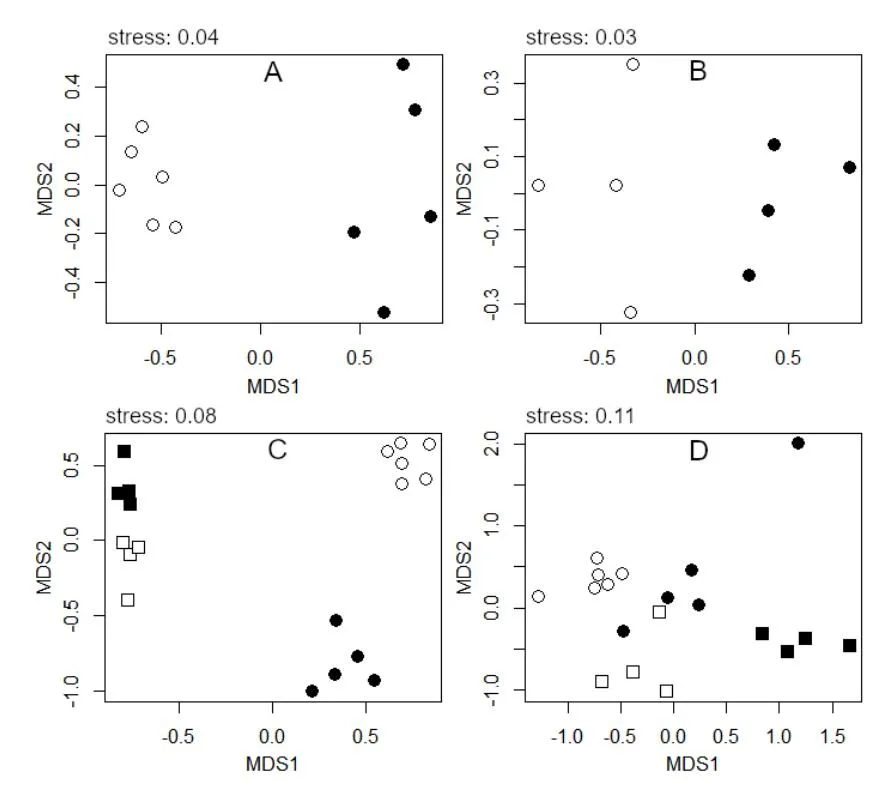

**Figure 7.** NMDS ordination of bird species composition based on presence/absence data for floodplain forest (A), early successional vegetation (B), all sites combined (C), and only floodplain specialist species (D) upstream and downstream from Santo Antônio dam on the Madeira River. White symbols = downstream sites, black symbols = upstream sites, circles = floodplain forest, squares = early successional vegetation.

A significant result from a conservation perspective was the presence of several specialist species at the early successional vegetation sites on the upstream island. Considering the generally small area of river islands across the Amazon basin, species restricted to these habitats are potentially the most threatened by dam impacts (Borges _et al_. 2019). Even five years after Santo Antonio began operations, these highly specialized species continued to occur upstream of the dam, probably because the key plant species of this habitat type (_Tessaria integrifolia_), which is important for some floodplain bird species (Rosenberg 1990), is highly tolerant to flooding and persisted in these sites (Wittmann _et al_. 2002; 2004). Therefore, these upstream river-island habitats should be monitored in the long term to assess whether their vegetation

and its associated fauna withstand the flooding regime of the dam reservoir in the future.

The impact associated with dam construction is significant for floodplain forest specialists that do not occur in the adjacent upland forest or in other kinds of floodplain habitats, such as _Myrmoborus leucophrys_, _Cranioleuca gutturata_, _Hemitriccus minor_, and _Pipra fasciicauda_ (all with detections only in the downstream floodplain forest) or species that occur in forest and other advanced stage succession vegetation, like _Myrmotherula assimilis_ (Billerman _et al_. 2020). Although these species were recorded in surveys after the reservoir filling (Sábato _et al_. 2014), possibly most of their suitable habitat was lost. Forest species may have ecological and behavioral limitations that prevent them from crossing large areas of open habitats (Less and Peres

2009). Also, floodplain forest species seem to avoid upland forests, maybe due to competition with related upland species (Rowedder _et al_. 2021). However, these limitations vary among species. Therefore the loss of seasonally flooded forests associated with dams can cause gaps in the distribution of these species, affecting connectivity among populations and consequently their genetic diversity (Thom _et al_. 2020).

As expected, changes in the floodplain forest also altered the functional attributes of the bird community. Models that simulate habitat loss and degradation in tropical forests suggest that the most significant loss of bird diversity is likely to affect frugivores, insectivores, and nectarivores (Newbold _et al_. 2014). We did not observe a loss in frugivorous bird diversity in dead floodplain forests, probably due to that the numerous dead trees provide nesting sites that attract parrots, macaws, and toucans to use these area as resting and breeding sites. Many studies, mostly in upland forests, show that most Amazonian insectivorous birds are dependent on forested areas and are sensitive to environmental impacts (Canaday 1996; Parker III _et al_. 1996; Stratford and Stouffer 1999; Ferraz _et al_. 2003; Haugaasen _et al_. 2003; Laurance _et al_. 2004; Stouffer _et al_. 2009; 2011). Our study showed similar results in floodplain forest.

### **CONCLUSIONS**

The presence of several floodplain specialists at the upstream sites in early successional vegetation, but not in the forest, indicates that the impact of the dam on the bird community depends on the habitat affinity of each species. The most significant concern is the loss and degradation of floodplain forests and the local extinction of forest specialists. During the licensing process of the Santo Antônio dam, surveying and monitoring efforts usually were more concentrated on upland forests and aquatic habitats (Sábato _et al_. 2014). Since floodplain forests are distributed linearly along the river margins, these habitats are disproportionately affected by river damming, even with run-of-the-river reservoirs, as is the case with the Madeira River dams, inevitably causing degradation and loss of these biological communities, in addition to connectivity loss between upstream and downstream populations. Therefore, we recommend special attention be given in future studies to the environmental impact of Amazonian dams to these habitats. A more careful and intensive survey of the occurrence of bird species restricted to floodplain forests is necessary, as well as the long-term monitoring of species with restricted distribution, especially those considered specialists in river islands.

### **ACKNOWLEDGMENTS**

This study was funded by project "History and Diversification of floodplain forest bird communities in Amazonia: towards an integrated conservation plan", PEER Program of the United States Agency for International Development – USAID (AID-

OAA-A-11-00012). TNM received a PhD fellowship from Coordenação de Aperfeiçoamento de Pessoal e Nível Superior (CAPES) and Fundação de Amparo à Pesquisa do Estado do Amazonas (FAPEAM), as well as CAPES (Financial code - 001) support through the Graduate Program in Zoology at Universidade Federal do Amazonas. TNM thanks Marison Pinto Prestes, Erivelton Faustino Dias and Aurimar Costa Sarmento for their fieldwork assistance. We also thank the reviewers and editors for their important contributions to the improvement of the manuscript.

#### **REFERENCES**

- Almeida, R.M.; Shi, Q.; Gomes-Selmas, J.; Wu, X.; Xue, Y.; Angarita, H.; Flecker A.S. 2019. Reducing greenhouse gas emissions of Amazon hydropower with strategic dam planning. _Nature Communications_, 10: 4281.
- Assahira, C.; Piedade, M.T.F.; Trumbore, S.E.; Wittmann, F.; Cintra, B.B.L.; Batista, E.S.; _et al_. 2017. Tree mortality of a floodadapted species in response of hydrographic changes caused by an Amazonian river dam. _Forest Ecology and Management_, 396: 113-123.
- Billerman, S.M.; Keeney, B.K.; Rodewald, P.G.; Schulenberg, T.S. (Ed.). 2020. Birds of the World. Ithaca, USA: Cornell Lab of Ornithology. (www.birdsoftheworld.org/bow/home). Accessed on 20 Nov 2021.
- Bird, J.P.; Buchanan, G.M.; Lees, A.C.; Clay, R.P.; Develey, P.F.; Yépez, I.; Butchart, S.H.M. 2012. Integrating spatially explicit habitat projections into extinction risk assessments: a reassessment of Amazonian avifauna incorporating projected deforestation. _Diversity and Distributions_, 18: 273-281.
- Blois, J.L.; Willians, J.W.; Fitzpatrick, M.C.; Jackson, S.T.; Ferrier, S. 2013. Space can substitute for time in predicting climate-change effects on biodiversity. _Proceedings of the National Academy of Sciences_, 110: 9374-9379.
- Borges, S.H.; Baccaro, F.; Moreira, M.; Choueri, E.L. 2019. Bird assemblages on Amazonian river islands: Patterns of species diversity and composition. _Biotropica_, 51: 903-912.
- Canaday, C. 1996. Loss of insectivorous birds along a gradient of human impact in Amazonia. _Biological Conservation_, 77: 63-77.
- Cochrane, S.M.V.; Matricardi, E.A.T.; Numata, I.; Lefebvre, P.A. 2017. Landsat-based analisys of mega dam flooding impacts in the Amazon compared to associated environmental impact assessments: upper Madeira River example 2006-2015. _Remote Sensing Applications: Society and Environment_, 7: 1-8.
- Campos-Cerqueira, M.; Mena, J.L.; Tejeda-Gómez, V.; Aguilar-Amuchastegui, N.; Gutierrez, N.; Aide, T.M. 2019. How does FSC forest certification affect the acoustically active fauna in Madre de Dios, Peru? _Remote Sensing in Ecology and Conservation_, 6: 274-295.
- Corrada-Bravo, C.J.; Berríos, R.A.; Aide, T.M. 2017. Species-specific audio detection: a comparison of three template-based detection algorithms using random forests. _PeerJ Computer Science_, 3:e113.
- Dufrêne, M.; Legendre, P. 1997. Species assemblages and indicator species: The need for a flexible asymmetrical approach. _Ecological Monographs_, 67: 345-366.

- Fearnside, P. 2015. _Hidrelétricas na Amazônia: Impactos Ambientais e Sociais na Tomada de Decisões Sobre Grandes Obras_. Editora INPA, Manaus, 296p.
- Ferraz, G.; Russel, G.J.; Stouffer, P.C.; Bierregard, R.O.; Pimm, S.L. 2003. Rapid species loss from forest fragments. _Proceedings of the National Academy of Sciences_, 100: 14069-14073.
- Forsberg, B.R.; Melack, J.M.; Dunne, T.; Barthem, R.B.; Goulding, M.; Paiva, R.C.D.; _et al_. 2017. The potential impact of new Andean dams on Amazonian fluvial ecosystems. _PLos ONE_, 12: e0182254.
- Goulding, M.; Barthem, R.; Ferreira, E. 2003. _The Smithsonian Atlas of the Amazon_. Smithsonian Institution, Washington, 253p.
- Handbook of the Birds of the World; BirdLife International. 2020. Handbook of the Birds of the World and BirdLife International digital checklist of the birds of the world. Version 5. (www. datazone.birdlife.org/userfiles/file/Species/Taxonomy/HBW-BirdLife_Checklist_v5_Dec20.zip.). Accessed on 08 Aug 2020.
- Haugaasen, T.; Barlow, J.; Peres, C.A. 2003. Effects of Surface fires on understorey insectivorous birds and terrestrial arthropods in Central Brazilian Amazonia. _Animal Conservation_, 6: 299-306.
- Higgins, M.A.; Ruokolainen, K.; Tuomisto, H.; Llerena, N.; Cardenas, G.; Phillips, O.L.; _et al_. 2011. Geological control of floristic composition in Amazonian forests. _Journal of Biogeography_, 38: 2136-2149.
- Kulaga, K.; Budka, M. 2019. Bird species detection by an observer and an autonomous sound recorder in two different environments: Forest and farmland. _PLoS ONE_, 14: e0211970.
- Laranjeiras, T.O.; Naka, L.N.; Cohn-Haft, M. 2019. Using river color to predict Amazonian floodplain forest avifaunas in the world's largest backwater river basin. _Biotropica_, 51: 330-341.
- Latrubesse, E.M.; Arima, E.Y.; Dunne, T.; Park, E.; Baker, V.R.; d'Horta, F.M.; _et al_. 2017. Damming the rivers of the Amazon basin. _Nature_, 546: 363-369.
- Latrubesse, E.M.; d'Horta, F.M.; Ribas, C.C.; Wittmann, F.; Zuanon, J.; Park, E.; _et al_. 2020. Vulnerability of the biota in riverine and seasonally flooded habitats to damming of Amazonian rivers. _Aquatic Conservation: Marine and Freshwater Ecosystems_, 31: 1136-1149.
- Laurance, S.G.W.; Stouffer, P.C.; Laurance, W.F. 2004. Effects of road clearings on movement patterns of understory rainforest birds in Central Amazonia. _Conservation Biology_, 18: 1099-1109.
- LeBien, J.; Zhong, M.; Campos-Cerqueira, M.; Velev, J. P.; Dodhia, R.; Ferres, J. L.; Aide, T.M. 2020. A pipeline for identification of bird and frog species in tropical soundscape recordings using a convolutional neural network. _Ecological Informatics,_ 59: 101113.
- Lees, A.C.; Peres, C.A. 2009. Gap-crossing movements predict species occupancy in Amazonian forest fragments. _Oikos_, 118: 280-290.
- Lees, A.C.; Peres, C.C.; Fearnside, P.M.; Schneider, M.; Zuanon, J.A.S. 2016. Hydropower and the future of Amazonian biodiversity. _Biodiversity and Conservation_, 25: 451-466.
- Li, D.; Lu, D.; Moran, E.; Silva, R.F.B. 2020. Examining water area changes accompanying dam construction in the Madeira River in the Brazilian Amazon. _Water_, 12: 1921. doi.org/10.3390/w12071921

- Newbold, T.; Scharlesmann, J.P.W.; Butchart, S.H.M.; Sekercioglu, C.H.; Joppa, L.; Alkemade, R.; Purves, D. 2014. Functional traits, land-use change and the structure of present and future bird communities in tropical forests. _Global Ecology and Biogeography_, 23: 1073-1084.
- Oksanen, J.M.; Blanchet, F.G.; Friendly, M.; Kindty, R.; Legendre, P.; McGlinn, D.; _et al_. 2019. _Vegan: Community Ecology Package_. R package version 2.5.5.
- Parker III, T.A.; Stotz, D.F.; Fitzpatrick, J.W. 1996. Ecological and distributional databases. In: Stotz, D.F.; Fitzpatrick, J.W.; Parker III, T.A.; Moskovits, D.K. (Ed.). _Neotropical Birds: Ecology and Conservation._ University of Chicago Press, Chicago, p.113-437.
- Perigolo, N.A.; Medeiros, M.B.; Simon, M.F. 2017. Vegetation types of the upper Madeira River in Rondônia, Brazil. _Brittonia_, 69: 423-446.
- R Core Team, 2019. _R: A language and environment for statistical computing_. (https://r-project.org/).
- Remsen Jr., J.V.; Parker III, T.A. 1983. Contribution of river-created habitats to bird species richness in Amazonia. _Biotropica_, 15: 223-231.
- Rivera, I.A.; Cadenas, E.A.; Espinoza-Villar, R.; Espinoza, J.C.; Molina-Carpio, J.; Ayala, J.M.; _et al_. 2019. Decline of fine suspended sediments in the Madeira River Basin (2003-2017). _Water_, 11: 514. doi.org/10.3390/w11030514
- Rivera, I.A.; Molina-Carpio, J.; Espinoza, J.C.; Gutierrez-Cori, O.; Cerón, W. L.; Frappart, F.; _et al_. 2021. The role of the rainfall variability in the decline of the surface suspended sediment in the upper Madeira Basin (2003-2017). _Frontiers in Water_, 3: 728527. doi:10.3389/frwa.2021.738527
- Roberts, D.W. 2019. _Labdsv: Ordination and multivariate Analisys for Ecology_. R Package version 2.0.1.
- Rosenberg G.H. 1990. Habitat specialization and foraging behavior by birds of Amazonian river islands in northeastern Peru. _The Condor_, 92: 427-443.
- Rowedder, A.R.P.; Laranjeiras, T. O.; Haugaasen, T.; Gilmore, B.; Cohn-Haft, M. 2021. Response of understory avifauna to annual flooding of Amazonian floodplain forests. _Forest,_ 12: 1004. doi. org/10.3390/f12081004
- Sábato, E.L.; Vasconcelos, M.F.; Fernandes, L.G.M.P. 2014. _Relatório consolidado da fase de pós-enchimento do Sub-programa de Monitoramento de Avifauna Terrestre e Aquática da UHE Santo Antônio_. Final technical report for SETE Soluções e Tecnologia Ambiental/Santo Antônio Energia S.A. of the first stage of post-flooding monitoring program of birds for the Santo Antônio hydropower plant, 148p. (http://licenciamento. ibama.gov.br/Hidreletricas/) [from this link access: Santo Antonio (Rio Madeira) > Relatorios/ > POS LO/ > Relatorios consolidados – monitoramento de fauna > Relatorioconsolidado\_ MonitoramentoAvifauna.pdf]. Accessed on 15 Oct 2021.
- Stouffer P.C.; Strong, C.; Naka, L.N. 2009. Twenty years of understorey bird extinctions from Amazonian rain forest fragments: consistent trends and landscape-mediated dynamics. _Diverssity and Distributions_, 15: 88-97.
- Stouffer, P.C.; Johnson, E.I.; Bierregard, R.O.; Lovejoy, T.E. 2011. Long-term landscape change and bird abundance in Amazonian rainforest fragments. _Conservation Biology_, 20: 1212-1223.

- Stratford, J.A.; Stouffer, P.C. 1999. Local extinctions of terrestrial insectivorous birds in a fragmented landscape near Manaus, Brazil. _Conservation Biology_, 13: 1416-14-23.
- Thom, G.; Amaral, F.R.; Hickerson, M.J.; Aleixo, A.; Araujo-Silva, L.E.; Ribas, C.C.; Choueri, E.; Miyaki, C.Y. 2018. Phenotypic and genetic structure support gene flow generating gene tree discordances in an Amazonian floodplain endemic species. _Systematic Biology_, 67: 700-718.
- Thom, G.; Xue, A.T.; Sawakushi, A.O.; Ribas, C.C.; Hickerson, M.J.; Aleixo, A.; Miyaki, C.Y. 2020. Quaternary climate changes as speciation drivers in the Amazon floodplains. _Science Advances_, 6: eaax4718.
- Tuomisto, H.; Poulsen, A.D.; Ruokolainen, K.; Moran, R.C.; Quintana, C.; Celi, J.; Cañas, G. 2003. Linking floristic patterns with soil heterogeneity and sattelite imagery in Ecuadorian Amazonia. _Ecological Applications_, 13: 352-371.
- Tuomisto, H.; Van Doninck, J.; Ruokolainen, K.; Moulatlet, G.M.; Figueiredo, F.O.G.; Sirén, A.; _et al_. 2019. Discovering floristic and geoecological gradients across Amazonia. _Journal of Biogeography_, 46: 1734-1748.
- Vale, M.M.; Cohn-Haft, M.; Bergen, S.; Pimm, S.L. 2008. Effects of future infrastructure development on threat status and occurrence of Amazonian birds. _Conservation Biology_, 22: 1006-1015.
- Van Doninck, J.; Tuomisto, H. 2017a. Evaluation of directional normalization methods for Landsat TM/ETM+ over primary Amazonian lowlands. _International Journal of Applied Earth Observation and Geoinformation_, 58: 249-263.
- Van Doninck, J.; Tuomisto, H. 2017b. Influence of compositing criterion and data availability on pixel-based Landsat TM/ETM+

- Image compositing over Amazonian forests. _IEEE Journal of Selected Topics in Applied Earth Observations and Remote Sensing_, 10: 857-867.
- Van Doninck, J.; Tuomisto, H. 2018. A Landsat composite covering all Amazonia for applications in ecology and conservation. _Remote Sensing in Ecology and Conservation_, 4: 197-210.
- Wilman, H.; Belmaker, J.; Simpson, J.; de la Rosa, C.; Rivanedeira, M.M.; Jetz, W. 2014. Data from: EltonTraits 1.0: Species-level foraging attributes of the world's birds and mammals. _Ecology_, 95: 2027 (data paper E095-178-D1).
- Winemiller, K.O.; McIntyre, P.B.; Castello, L.; Fluet-Chouinard, E.; Giarrizzo, T.; Nam, S.; _et al_. 2016. Balancing hydropower and biodiversity in the Amazon, Congo, and Mekong. _Science_, 351: 128-129.
- Wittmann, F.; Anhuf, D.; Junk, W.J. 2002. Tree species distribution and community structure of central Amazonian várzea forests by remote-sensing techniques. _Journal of Tropical Ecology_, 18: 805-820.
- Wittmann, F.; Junk, W.J.; Piedade, M.T.F. 2004. The várzea forests in Amazonia: flooding and the highly dynamic geomorphology interact with natural forest succession. _Forest Ecology and Management_, 196: 199-212.
- Zarfl, C.; Lumsdon, A.E.; Berlekamp, J.; Tydecks, L.; Tockner, K. 2015. A global boom in hydropower dam construction. _Aquatic Science_, 77: 161-170.

**RECEIVED:** 20/03/2021 **ACCEPTED:** 08/10/2021

**ASSOCIATE EDITOR:** Sérgio H. Borges

### **SUPPLEMENTARY MATERIAL** (only available in the electronic version)

Melo _et al_. Impacts of a large hydroelectric dam on the Madeira River (Brazil) on floodplain avifauna

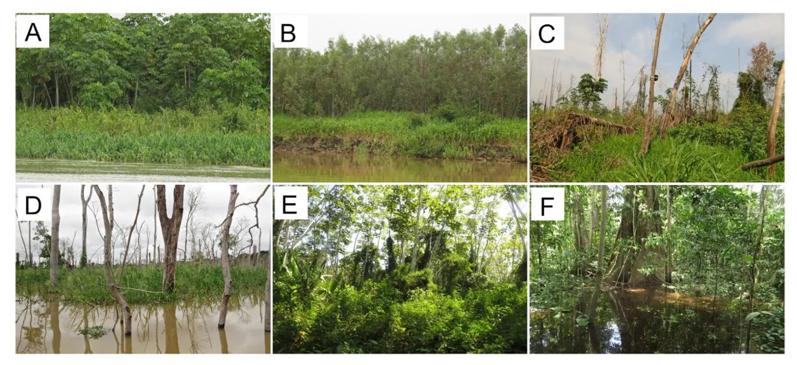

**Figure S1.** Sampling habitats in the upper Madeira River. Upstream (after the Santo Antônio dam reservoir filling): A – early successional vegetation dominated by _Cecropia_ trees; B – early successional vegetation dominated by _Tessaria integrifolia_; C – dead floodplain forest in the dry season (September); D – dead floodplain forest in the rainy season (March). Downstream: E – early successional vegetation dominated by _Cecropia_ trees; F – floodplain forest in the rainy season (March). This figure is in color in the electronic version.

**Table S1.** Habitat type at 19 sampling sites before reservoir filling (2009-2011) of the Santo Antônio dam on the upper Madeira River in the southwestern Brazilian Amazon, as predicted by Landsat TM/ETM+ images, and after reservoir formation (2016-2018). The number of bird species and number of detections are also shown for each site. _C. membranacea = Cecropia membranacea_ (Urticaceae); _T. integrifolia = Tessaria integrifolia_ (Asteraceae).

| Site | Habitat prior to reservoir    | Current habitat                                            | Location   | Species richness | Detections |
| ---- | ----------------------------- | ---------------------------------------------------------- | ---------- | ------------------- | ---------- |
| U1   | floodplain forest             | dead floodplain forest                                     | upstream   | 69                  | 992        |
| U2   | floodplain forest             | dead floodplain forest                                     | upstream   | 54                  | 620        |
| U3   | floodplain forest             | dead floodplain forest                                     | upstream   | 78                  | 989        |
| U4   | floodplain forest             | dead floodplain forest                                     | upstream   | 55                  | 934        |
| U5   | floodplain forest             | dead floodplain forest                                     | upstream   | 65                  | 864        |
| U6   | early successional vegetation | early successional vegetation dominated by C. membranacea  | upstream   | 55                  | 975        |
| U7   | early successional vegetation | early successional vegetation dominated by C. membranacea  | upstream   | 61                  | 814        |
| U8   | early successional vegetation | early successional vegetation dominated by T. integrifolia | upstream   | 63                  | 1075       |
| U9   | early successional vegetation | early successional vegetation dominated by T. integrifolia | upstream   | 53                  | 1145       |
| D1   | early successional vegetation | early successional vegetation dominated by C. membranacea  | downstream | 65                  | 1076       |
| D2   | early successional vegetation | early successional vegetation dominated by C. membranacea  | downstream | 44                  | 456        |
| D3   | early successional vegetation | early successional vegetation dominated by C. membranacea  | downstream | 54                  | 1072       |
| D4   | early successional vegetation | early successional vegetation dominated by C. membranacea  | downstream | 63                  | 947        |
| D5   | floodplain forest             | floodplain forest                                          | downstream | 80                  | 963        |
| D6   | floodplain forest             | floodplain forest                                          | downstream | 59                  | 795        |
| D7   | floodplain forest             | floodplain forest                                          | downstream | 65                  | 676        |
| D8   | floodplain forest             | floodplain forest                                          | downstream | 75                  | 730        |
| D9   | floodplain forest             | floodplain forest                                          | downstream | 92                  | 912        |
| D10  | floodplain forest             | floodplain forest                                          | downstream | 80                  | 744        |

**Table S2.** Number of pixels in each class (forest, non-forest and water) and canopy reflectance values (Bands 2, 3, 4, 5, 7) for each sampling site before (2009-2011) and after (2016-2018) reservoir filling of the Santo Antônio dam on the upper Madeira River in the southwestern Brazilian Amazon based on Landsat TM/ETM + composite images. U1-U9 = Upstream sites; D1-D9 = Downstream sites.

|                                |        |                |       |                 | 200                     | )9-2011 coı     | mposite im              | iage            |                         |                 |                         |                 |                         |
| ------------------------------ | ------ | -------------- | ----- | --------------- | ----------------------- | --------------- | ----------------------- | --------------- | ----------------------- | --------------- | ----------------------- | --------------- | ----------------------- |
| Pixel class Reflectance values |        |                |       |                 |                         |                 |                         |                 |                         |                 |                         |                 |                         |
| Site                           | Forest | Non- forest | Water | Band2 forest | Band2 non- forest | Band3 forest | Band3 non- forest | Band4 forest | Band4 non- forest | Band5 forest | Band5 non- forest | Band7 forest | Band7 non- forest |
| U1                             | 224    | 0              | 1     | 428             | -                       | 278.5           | -                       | 3028            | -                       | 1388            | -                       | 490             | -                       |
| U2                             | 225    | 0              | 0     | 429             | -                       | 278             | -                       | 2963            | -                       | 1381            | -                       | 492             | -                       |
| U3                             | 225    | 0              | 0     | 445             | -                       | 296             | -                       | 2921            | -                       | 1386            | -                       | 504             | -                       |
| U4                             | 162    | 0              | 63    | 457.5           | -                       | 308             | -                       | 3087.5          | -                       | 1427.5          | -                       | 516             | -                       |
| U5                             | 221    | 4              | 0     | 438             | 688.5                   | 303             | 581.5                   | 3081            | 3319.5                  | 1427            | 2235                    | 501             | 1081.                   |
| U6                             | 65     | 81             | 79    | 546             | 1262                    | 388             | 1395                    | 3657            | 2602                    | 1760            | 2079                    | 736             | 1599                    |
| U7                             | 74     | 138            | 13    | 615.5           | 1104                    | 456.5           | 1234                    | 3460            | 2475.5                  | 1723.5          | 2006.5                  | 768             | 1402                    |
| U8                             | 57     | 73             | 95    | 612             | 1348                    | 420             | 1461                    | 3047            | 2423                    | 1518            | 2090                    | 620             | 1699                    |
| U9                             | 95     | 26             | 104   | 537             | 896                     | 330             | 812.5                   | 3684            | 2481                    | 1653            | 1785                    | 628             | 1019.                   |
| D1                             | 133    | 37             | 55    | 552             | 871                     | 361             | 815                     | 3640            | 2668                    | 1680            | 1965                    | 673             | 989                     |
| D2                             | 112    | 63             | 50    | 491             | 1013                    | 324.5           | 974                     | 3520.5          | 2448                    | 1558.5          | 1850                    | 560.5           | 1203                    |
| D3                             | 175    | 4              | 46    | 489             | 779.5                   | 316             | 643                     | 3483            | 3252                    | 1527            | 2077                    | 580             | 1034                    |
| D4                             | 149    | 7              | 69    | 476             | 721                     | 319             | 603                     | 3429            | 3296                    | 1471            | 1889                    | 546             | 852                     |
| D5                             | 221    | 4              | 0     | 463             | 660                     | 307             | 496.5                   | 3186            | 3684                    | 1451            | 2330.5                  | 540             | 1136                    |
| D6                             | 225    | 0              | 0     | 458             | -                       | 306             | -                       | 3210            | -                       | 1465            | -                       | 532             | -                       |
| D7                             | 225    | 0              | 0     | 463             | -                       | 301             | -                       | 3243            | -                       | 1489            | -                       | 543             | -                       |
| D8                             | 225    | 0              | 0     | 454             | -                       | 294             | -                       | 3188            | -                       | 1472            | -                       | 539             | -                       |
| D9                             | 225    | 0              | 0     | 441             | -                       | 291             | -                       | 3130            | -                       | 1435            | -                       | 531             | -                       |
|                                |        |                |       |                 | 201                     |                 | mposite im              | age             |                         |                 |                         |                 |                         |
| U1                             | 34     | 186            | 5     | 541             | 638                     | 403             | 586                     | 1591.5          | 2352.5                  | 1400.5          | 2165                    | 764.5           | 1226.                   |
| U2                             | 28     | 197            | 0     | 524             | 643                     | 472.5           | 587                     | 1679.5          | 2511                    | 1305.5          | 2159                    | 746             | 1172                    |
| U3                             | 1      | 224            | 0     | 546             | 631                     | 438             | 542                     | 2663            | 2745                    | 1803            | 2100                    | 873             | 1099.                   |
| U4                             | 58     | 98             | 69    | 636.5           | 656.5                   | 537.5           | 567.5                   | 2226            | 2544.5                  | 1392.5          | 2038                    | 672             | 1074                    |
| U5                             | 18     | 38             | 169   | 561             | 612                     | 496.5           | 529.5                   | 1383.5          | 2210.5                  | 1247            | 2055                    | 725.5           | 1089.                   |
| U6                             | 66     | 60             | 99    | 585.5           | 679                     | 444             | 528                     | 3190.5          | 3305.5                  | 1699            | 2194.5                  | 708             | 1049                    |
| U7                             | 91     | 42             | 92    | 608             | 627                     | 404             | 459                     | 3745            | 3538                    | 1941            | 2115.5                  | 806             | 937.5                   |
| U8                             | 80     | 40             | 105   | 710             | 708.5                   | 562.5           | 522                     | 3099            | 3422                    | 1639            | 2084.5                  | 739             | 929                     |
| U9                             | 62     | 58             | 105   | 716.5           | 705.5                   | 558             | 546                     | 2879.5          | 3246                    | 1635            | 2016.5                  | 742             | 944.5                   |
| D1                             | 147    | 20             | 58    | 555             | 724.5                   | 356             | 604.5                   | 3649            | 3015                    | 1690            | 1948                    | 661             | 895                     |
| D2                             | 132    | 15             | 78    | 483             | 729                     | 317             | 602                     | 3475.5          | 3159                    | 1536            | 1926                    | 566             | 851                     |
| D3                             | 117    | 41             | 67    | 558             | 1195                    | 381             | 1310                    | 3814            | 2545                    | 1936            | 2122                    | 790             | 1331                    |
| D4                             | 123    | 7              | 95    | 551             | 692                     | 375             | 545                     | 3535            | 3489                    | 1801            | 1959                    | 737             | 891                     |
| D5                             | 225    | 0              | 0     | 503             | -                       | 331             | -                       | 3433            | -                       | 1683            | -                       | 654             | -                       |
| D6                             | 222    | 3              | 0     | 494.5           | 551                     | 335             | 422                     | 3253            | 3174                    | 1543            | 1922                    | 586             | 812                     |
| D7                             | 225    | 0              | 0     | 494.5           | -                       | 319             | -                       | 3217            | -                       | 1343            | -                       | 548             | - 012                   |
|                                |        |                |       |                 |                         |                 |                         |                 |                         |                 |                         |                 |                         |
| D8                             | 223    | 2              | 0     | 463             | 559.5                   | 303             | 413.5                   | 3160            | 3077.5                  | 1502            | 1883                    | 564             | 828                     |
| D9                             | 225    | 0              | 0     | 458             | -                       | 301             | -                       | 3116            | -                       | 1514            | -                       | 571             | -                       |

**Table S3.** Number of detections (and number of sampling sites where the species was detected) of all bird species recorded in the manual inspection of the recordings by habitat type upstream and downstream of the Santo Antônio dam on the upper Madeira River, Rondônia, Brazil. Values after the vegetation type indicate number of sampling sites. FS = species restricted or that occurs primarily in floodplain habitats in Amazonia according to Remsen and Parker III (1983), Parker III _et al._ (1996) and Billerman _et al._ (2020). Asterisks (\*) indicate species that were previously recorded upstream from the Santo Antônio dam (Sábato _et al._ 2014). Sensitivity to habitat disturbance follows Parker III _et al._ (1996). Trophic guild adapted from Wilman _et al._ (2014): CAR = carnivore, FRU = frugivore, INS = insectivore, INV = invertebrate generalist, NEC = nectarivore, OMN = omnivore, PIS = piscivore. Species nomenclature follows the BirdLife International's taxonomy (Handbook of the Birds of the World and BirdLife International 2020).

|                                |             |       |                          | Downstream sites                        | Upstream sites                     |                                         |     |
| ------------------------------ | ----------- | ----- | ------------------------ | --------------------------------------- | ---------------------------------- | --------------------------------------- | --- |
| Species                        | Sensitivity | Guild | Floodplain forest (6) | Early successional vegetation (4) | (Dead) floodplain forest (5) | Early successional vegetation (4) |     |
| Tinamidae                      |             |       |                          |                                         |                                    |                                         |     |
| Tinamus major\*                | Medium      | OMN   | 13 (4)                   | 0                                       | 0                                  | 0                                       |     |
| Crypturellus cinereus\*        | Low         | FRU   | 2 (2)                    | 0                                       | 0                                  | 0                                       |     |
| Crypturellus undulatus\*       | Low         | FRU   | 307 (6)                  | 7 (2)                                   | 0                                  | 36 (4)                                  |     |
| Crypturellus parvirostris\*    | Low         | GRA   | 0                        | 0                                       | 0                                  | 1                                       |     |
| Anatidae                       |             |       |                          |                                         |                                    |                                         |     |
| Dendrocygna autumnalis\*       | Low         | GRA   | 0                        | 0                                       | 0                                  | 35 (4)                                  |     |
| Cracidae                       |             |       |                          |                                         |                                    |                                         |     |
| Aburria cumanensis\*           | High        | FRU   | 0                        | 0                                       | 1 (1)                              | 2 (1)                                   |     |
| Ortalis guttata\*              | Low         | FRU   | 31 (5)                   | 0                                       | 1 (1)                              | 2 (2)                                   |     |
| Ardeidae                       |             |       |                          |                                         |                                    |                                         |     |
| Tigrisoma lineatum\*           | Medium      | PIS   | 0                        | 2 (1)                                   | 0                                  | 0                                       |     |
| Butorides striata\*            | Low         | PIS   | 0                        | 0                                       | 16 (3)                             | 0                                       |     |
| Ardea sp.\*                    | Low         | PIS   | 0                        | 2 (1)                                   | 69 (5)                             | 0                                       |     |
| Egretta thula\*                | Low         | PIS   | 0                        | 0                                       | 8 (1)                              | 1 (1)                                   |     |
| Threskiornithidae              |             |       |                          |                                         |                                    |                                         |     |
| Mesembrinibis cayennensis\*    | Medium      | INV   | 3 (3)                    | 3 (1)                                   | 1 (1)                              | 0                                       |     |
| Pandionidae                    |             |       |                          |                                         |                                    |                                         |     |
| Pandion haliaetus\*            | Medium      | PIS   | 0                        | 1 (1)                                   | 4 (3)                              | 0                                       |     |
| Accipitridae                   |             |       |                          |                                         |                                    |                                         |     |
| Leptodon cayanensis\*          | Medium      | CAR   | 5 (3)                    | 0                                       | 1 (1)                              | 1 (1)                                   |     |
| Elanoides forficatus\*         | Medium      | INS   | 0                        | 1 (1)                                   | 0                                  | 0                                       |     |
| Harpagus bidentatus\*          | Medium      | CAR   | 1 (1)                    | 0                                       | 0                                  | 0                                       |     |
| Ictinia plumbea\*              | Medium      | INS   | 1 (1)                    | 0                                       | 0                                  | 0                                       |     |
| Busarellus nigricollis\*       | Low         | PIS   | 0                        | 0                                       | 1 (1)                              | 1 (1)                                   |     |
| Helicolestes hamatus (FS)\*    | Medium      | INV   | 4 (4)                    | 4 (2)                                   | 4 (2)                              | 1 (1)                                   |     |
| Buteogallus schistaceus (FS)\* | High        | CAR   | 6 (1)                    | 1 (1)                                   | 0                                  | 0                                       |     |
| Buteogallus urubitinga\*       | Medium      | CAR   | 2 (2)                    | 0                                       | 1 (1)                              | 0                                       |     |
| Rupornis magnirostris\*        | Low         | CAR   | 5 (4)                    | 43 (3)                                  | 48 (5)                             | 18 (4)                                  |     |
| Leucopternis kuhli\*           | High        | CAR   | 3 (1)                    | 0                                       | 0                                  | 0                                       |     |
| Buteo nitidus\*                | Medium      | CAR   | 1 (1)                    | 0                                       | 8 (2)                              | 0                                       |     |
| Buteo brachyurus\*             | Medium      | CAR   | 5 (1)                    | 1 (1)                                   | 0                                  | 0                                       |     |
| Spizaetus tyrannus\*           | Medium      | CAR   | 9 (4)                    | 0                                       | 0                                  | 0                                       |     |
| Eurypygidae                    |             |       |                          |                                         |                                    |                                         |     |
| Eurypyga helias\*              | Medium      | INV   | 0                        | 0                                       | 18 (2)                             | 0                                       |     |
| Aramidae                       |             |       |                          |                                         |                                    |                                         |     |
| Aramus guarauna\*              | Medium      | INV   | 2 (2)                    | 1 (1)                                   | 0                                  | 1 (1)                                   |     |
| Rallidae                       |             |       |                          |                                         |                                    |                                         |     |
| Aramides cajanea\*             | High        | OMN   | 1 (1)                    | 0                                       | 0                                  | 1 (1)                                   |     |
| Laterallus exilis\*            | Low         | INV   | 0                        | 0                                       | 53 (4)                             | 41 (4)                                  |     |
| Porzana albicollis\*           | Medium      | INV   | 0                        | 0                                       | 2 (1)                              | 0                                       |     |
| Porphyrio flavirostris         | Medium      | OMN   | 0                        | 0                                       | 5 (3)                              | 0                                       |     |
| Charadriidae                   |             |       |                          |                                         |                                    |                                         |     |
|                                | Low         | INV   | 0                        | 1 (1)                                   | 18 (4)                             | 40 (4)                                  |     |
| Vanellus chilensis\*           |             |       |                          |                                         |                                    |                                         |     |

**Table S3.** Continued

|                             |             |       |                          | Downstream sites                        | Upstream sites                     |                                         |     |
| --------------------------- | ----------- | ----- | ------------------------ | --------------------------------------- | ---------------------------------- | --------------------------------------- | --- |
| Species                     | Sensitivity | Guild | Floodplain forest (6) | Early successional vegetation (4) | (Dead) floodplain forest (5) | Early successional vegetation (4) |     |
| Jacanidae                   |             |       |                          |                                         |                                    |                                         |     |
| Jacana jacana\*             | Low         | INV   | 0                        | 0                                       | 240 (5)                            | 3 (1)                                   |     |
| Sternidae                   |             |       |                          |                                         |                                    |                                         |     |
| Phaetusa simplex\*          | High        | PIS   | 0                        | 19 (3)                                  | 42 (4)                             | 7 (2)                                   |     |
| Columbidae                  |             |       |                          |                                         |                                    |                                         |     |
| Patagioenas cayennensis\*   | Medium      | FRU   | 1 (1)                    | 1 (1)                                   | 0                                  | 0                                       |     |
| Leptotila rufaxilla\*       | Medium      | GRA   | 63 (6)                   | 52 (4)                                  | 2 (1)                              | 29 (3)                                  |     |
| Cuculidae                   |             |       |                          |                                         |                                    |                                         |     |
| Coccycua minuta\*           | Low         | INS   | 15 (3)                   | 19 (4)                                  | 13 (2)                             | 8 (3)                                   |     |
| Piaya cayana\*              | Low         | INS   | 22 (5)                   | 1 (1)                                   | 0                                  | 1 (1)                                   |     |
| Crotophaga major\*          | Medium      | INS   | 13 (5)                   | 32 (4)                                  | 12 (3)                             | 24 (4)                                  |     |
| Crotophaga ani\*            | Low         | INS   | 0                        | 1 (1)                                   | 157 (5)                            | 29 (4)                                  |     |
| Strigidae                   |             |       |                          |                                         |                                    |                                         |     |
| Megascops choliba\*         | Low         | INS   | 0                        | 0                                       | 7 (1)                              | 2 (2)                                   |     |
| Megascops watsonii\*        | High        | INS   | 2 (1)                    | 0                                       | 0                                  | 0                                       |     |
| Lophostrix cristata\*       | High        | CAR   | 6 (2)                    | 0                                       | 0                                  | 0                                       |     |
| Pulsatrix perspicillata\*   | Medium      | CAR   | 6 (1)                    | 0                                       | 0                                  | 0                                       |     |
| Strixsp.\*                  | -           | CAR   | 27 (3)                   | 0                                       | 0                                  | 0                                       |     |
| Glaucidium hardyi\*         | High        | CAR   | 5 (2)                    | 0                                       | 0                                  | 0                                       |     |
| Glaucidium brasilianum\*    | Low         | CAR   | 13 (4)                   | 2 (2)                                   | 0                                  | 0                                       |     |
| Nyctibiidae                 |             |       |                          |                                         |                                    |                                         |     |
| Nyctibius grandis\*         | Medium      | INS   | 9 (4)                    | 4 (1)                                   | 3 (2)                              | 0                                       |     |
| Nyctibius griseus\*         | Low         | INS   | 0                        | 0                                       | 0                                  | 3 (1)                                   |     |
| Caprimulgidae               |             |       |                          |                                         |                                    |                                         |     |
| Nyctidromus albicollis\*    | Low         | INS   | 0                        | 0                                       | 14 (5)                             | 3 (2)                                   |     |
| Caprimulgus parvulus\*      | Low         | INS   | 0                        | 0                                       | 2 (2)                              | 1 (1)                                   |     |
| Apodidae                    |             |       |                          |                                         |                                    |                                         |     |
| Chaetura viridipennis\*     | Medium      | INS   | 1 (1)                    | 0                                       | 15 (3)                             | 0                                       |     |
| Chaetura brachyura\*        | Low         | INS   | 4 (2)                    | 2 (1)                                   | 44 (3)                             | 1 (1)                                   |     |
| Trochilidae                 |             |       |                          |                                         |                                    |                                         |     |
| Glaucis hirsutus\*          | Low         | NEC   | 88 (6)                   | 4 (3)                                   | 0                                  | 0                                       |     |
| Phaethornis hispidus (FS)\* | Medium      | NEC   | 175 (6)                  | 36 (4)                                  | 10 (2)                             | 24 (3)                                  |     |
| Polytmus theresiae          | Low         | NEC   | 1 (1)                    | 0                                       | 2 (1)                              | 3 (2)                                   |     |
| Amazilia cyanus\*           | Medium      | NEC   | 20 (5)                   | 0                                       | 0                                  | 0                                       |     |
| Amazilia fimbriata\*        | Low         | NEC   | 0                        | 1 (1)                                   | 1 (1)                              | 6 (2)                                   |     |
| Trogonidae                  |             |       |                          |                                         |                                    |                                         |     |
| Trogon melanurus\*          | Medium      | OMN   | 23 (5)                   | 1 (1)                                   | 0                                  | 0                                       |     |
| Trogon viridis\*            | Medium      | OMN   | 20 (6)                   | 4 (1)                                   | 0                                  | 0                                       |     |
| Alcedinidae                 |             |       |                          |                                         |                                    |                                         |     |
|                             |             |       |                          |                                         |                                    |                                         |     |
| Megaceryle torquata\*       | Low         | PIS   | 18 (6)                   | 66 (3)                                  | 25 (5)                             | 15 (4)                                  |     |
| Chloroceryle amazona\*      | Low         | PIS   | 0                        | 0                                       | 35 (5)                             | 1 (1)                                   |     |
| Chloroceryle aenea\*        | Medium      | PIS   | 5 (2)                    | 0                                       | 0                                  | 0                                       |     |
| Chlorceryle inda\*          | Medium      | PIS   | 1 (1)                    | 0                                       | 0                                  | 0                                       |     |
| Galbulidae                  |             |       |                          |                                         |                                    |                                         |     |
| Galbula ruficauda\*         | Low         | INS   | 0                        | 0                                       | 0                                  | 32 (4)                                  |     |
| Galbula cyanescens\*        | Low         | INS   | 7 (1)                    | 0                                       | 13 (2)                             | 0                                       |     |
| Galbula dea\*               | Medium      | INS   | 6 (2)                    | 0                                       | 0                                  | 0                                       |     |
| Jacamerops aureus\*         | High        | INS   | 1 (1)                    | 0                                       | 0                                  | 0                                       |     |

**Table S3.** Continued

|                               |             |       |                          | Downstream sites                        | Upstream sites                     |                                         |
| ----------------------------- | ----------- | ----- | ------------------------ | --------------------------------------- | ---------------------------------- | --------------------------------------- |
| Species                       | Sensitivity | Guild | Floodplain forest (6) | Early successional vegetation (4) | (Dead) floodplain forest (5) | Early successional vegetation (4) |
| Bucconidae                    |             |       |                          |                                         |                                    |                                         |
| Bucco tamatia (FS)\*          | Medium      | INS   | 5 (3)                    | 0                                       | 1 (1)                              | 0                                       |
| Monasa nigrifrons (FS)\*      | Medium      | INS   | 10 (4)                   | 36 (4)                                  | 3 (3)                              | 0                                       |
| Capitonidae                   |             |       |                          |                                         |                                    |                                         |
| Capito auratus\*              | Medium      | OMN   | 2 (1)                    | 0                                       | 0                                  | 0                                       |
| Ramphastidae                  |             |       |                          |                                         |                                    |                                         |
| Ramphastos tucanus\*          | High        | OMN   | 197 (6)                  | 6 (3)                                   | 20 (4)                             | 0                                       |
| Ramphastos vitellinus\*       | High        | OMN   | 85 (6)                   | 1 (1)                                   | 2 (2)                              | 0                                       |
| Pteroglossus castanotis\*     | High        | OMN   | 43 (5)                   | 37 (4)                                  | 6 (3)                              | 0                                       |
| Picidae                       |             |       |                          |                                         |                                    |                                         |
| Picumnus aurifrons\*          | Medium      | INS   | 1 (1)                    | 1 (1)                                   | 0                                  | 8 (3)                                   |
| Melanerpes cruentatus\*       | Low         | OMN   | 91 (5)                   | 6 (2)                                   | 4 (2)                              | 0                                       |
| Venilionis passerinus\*       | Low         | INS   | 0                        | 4 (2)                                   | 3 (1)                              | 1 (1)                                   |
| Colaptes punctigula\*         | Low         | INS   | 4 (2)                    | 18 (3)                                  | 47 (5)                             | 7 (3)                                   |
| Celeus grammicus\*            | High        | OMN   | 1 (1)                    | 0                                       | 0                                  | 0                                       |
| Celeus flavus (FS)\*          | Medium      | OMN   | 30 (6)                   | 4 (2)                                   | 0                                  | 0                                       |
| Dryocopus lineatus\*          | Low         | INS   | 6 (4)                    | 2 (2)                                   | 54 (5)                             | 7 (3)                                   |
| Campephilus melanoleucus\*    | Medium      | INS   | 22 (6)                   | 8 (3)                                   | 8 (4)                              | 5 (2)                                   |
|                               |             |       |                          |                                         |                                    |                                         |
| Falconidae                    |             |       |                          |                                         |                                    |                                         |
| Daptrius ater\*               | Low         | CAR   | 1 (1)                    | 0                                       | 0                                  | 0                                       |
| Ibycter americanus\*          | High        | INV   | 8 (4)                    | 1 (1)                                   | 10 (4)                             | 0                                       |
| Milvago chimachima\*          | Low         | CAR   | 0                        | 5 (3)                                   | 2 (2)                              | 1 (1)                                   |
| Herpetotheres cachinnans\*    | Low         | CAR   | 8 (4)                    | 0                                       | 9 (4)                              | 0                                       |
| Falco rufigularis\*           | Low         | CAR   | 7 (3)                    | 0                                       | 21 (4)                             | 2 (2)                                   |
| Psittacidae                   |             |       |                          |                                         |                                    |                                         |
| Ara sp.\*                     | Medium/High | FRU   | 46 (6)                   | 39 (4)                                  | 69 (5)                             | 22 (4)                                  |
| Ara severus\*                 | Medium      | FRU   | 72 (6)                   | 106 (4)                                 | 57 (5)                             | 75 (4)                                  |
| Orthopsittaca manilatus\*     | Medium      | FRU   | 0                        | 1 (1)                                   | 43 (4)                             | 13 (2)                                  |
| Psittacara leucophthamus\*    | Low         | FRU   | 4 (2)                    | 2 (1)                                   | 6 (2)                              | 2 (2)                                   |
| Aratinga weddellii\*          | Low         | FRU   | 26 (6)                   | 146 (4)                                 | 136 (5)                            | 59 (4)                                  |
| Pyrrhura snethlaegae\*        | High        | FRU   | 4 (2)                    | 0                                       | 0                                  | 0                                       |
| Brotogeris sp.\*              | -           | FRU   | 3 (2)                    | 123 (4)                                 | 67 (5)                             | 2 (2)                                   |
| Pionites leucogaster\*        | High        | FRU   | 0                        | 1 (1)                                   | 21 (3)                             | 1 (1)                                   |
| Pionus mestruus\*             | Low         | FRU   | 22 (6)                   | 29 (4)                                  | 6 (3)                              | 1 (1)                                   |
| Amazona farinosa\*            | Medium      | FRU   | 93 (6)                   | 15 (3)                                  | 139 (5)                            | 14 (4)                                  |
| Amazona ochrocephala\*        | Medium      | FRU   | 21 (5)                   | 128 (4)                                 | 18 (4)                             | 1 (1)                                   |
| Thamnophilidae                |             |       |                          |                                         |                                    |                                         |
| Pygiptila stellaris\*         | High        | INS   | 2 (1)                    | 0                                       | 0                                  | 0                                       |
| Epinecrophylla amazonica\*    | High        | INS   | 26 (5)                   | 0                                       | 0                                  | 0                                       |
| Myrmochanes hemileucus (FS)\* | Medium      | INS   | 0                        | 0                                       | 0                                  | 297 (4)                                 |
| Myrmotherula brachyura\*      | Low         | INS   | 23 (3)                   | 20 (3)                                  | 0                                  | 0                                       |
| Myrmotherula axillaris\*      | Medium      | INS   | 7 (3)                    | 0                                       | 0                                  | 0                                       |
| Myrmotherula assimilis (FS)\* | Medium      | INS   | 0                        | 9 (2)                                   | 0                                  | 0                                       |
| Isleria hauxwelli\*           | High        | INS   | 81 (6)                   | 0                                       | 0                                  | 0                                       |
| Thamnomanes satuninus\*       | High        | INS   | 5 (2)                    | 0                                       | 0                                  | 0                                       |
| Thamnomanes caesius\*         | High        | INS   | 21 (2)                   | 0                                       | 0                                  | 0                                       |
| Sakesphorus luctuosus (FS)    | Medium      | INS   | 1 (1)                    | 0                                       | 0                                  | 0                                       |
| Thamnophilus doliatus\*       | Low         | INS   | 2 (1)                    | 1 (1)                                   | 20 (3)                             | 60 (4)                                  |
| Thamnophilus schistaceus\*    | High        | INS   | 114 (6)                  | 0                                       | 0                                  | 0                                       |
| Thamnophilus aethiops\*       | High        | INS   | 3 (2)                    | 0                                       | 0                                  | 0                                       |

**Table S3.** Continued

| Species                      |             | Guild | Downstream sites         |                                         | Upstream sites                     |                                         |
| ---------------------------- | ----------- | ----- | ------------------------ | --------------------------------------- | ---------------------------------- | --------------------------------------- |
|                              | Sensitivity |       | Floodplain forest (6) | Early successional vegetation (4) | (Dead) floodplain forest (5) | Early successional vegetation (4) |
| Cymbilaimus linatus\*        | Medium      | INS   | 1 (1)                    | 0                                       | 0                                  | 0                                       |
| Taraba major\*               | Low         | INS   | 1 (1)                    | 0                                       | 0                                  | 6 (1)                                   |
| Sclateria naevia\*           | Medium      | INS   | 77 (2)                   | 0                                       | 19 (2)                             | 0                                       |
| Myrmoborus leucophrys (FS)\* | Medium      | INS   | 184 (6)                  | 3 (1)                                   | 0                                  | 0                                       |
| Hypocnemis peruviana\*       | Medium      | INS   | 517 (6)                  | 0                                       | 11 (1)                             | 0                                       |
| Phlegopsis nigromaculata\*   | Medium      | INS   | 3 (3)                    | 0                                       | 0                                  | 0                                       |
| Oneillornis salvini\*        | High        | INS   | 1 (1)                    | 0                                       | 0                                  | 0                                       |
| Dendrocolaptidae             |             |       |                          |                                         |                                    |                                         |
| Dendrocincla fuliginosa\*    | High        | INS   | 61 (5)                   | 0                                       | 0                                  | 0                                       |
| Sittasomus griseicapillus\*  | Medium      | INS   | 41 (6)                   | 0                                       | 8 (3)                              | 0                                       |
| Xiphorhynchus obsoletus\*    | Medium      | INS   | 0                        | 0                                       | 3 (2)                              | 0                                       |
| Xiphorhynchus guttatoides\*  | Low         | INS   | 215 (6)                  | 0                                       | 47 (4)                             | 0                                       |
| Dendroplex picus\*           | Low         | INS   | 9 (3)                    | 116 (4)                                 | 131 (5)                            | 55 (4)                                  |
|                              |             |       |                          |                                         |                                    |                                         |
| Dendroplex kienerii (FS)\*   | High        | INS   | 1 (1)                    | 0                                       | 0                                  | 0                                       |
| Nasica longirostris (FS)\*   | High        | INS   | 42 (5)                   | 5 (1)                                   | 48 (4)                             | 0                                       |
| Dendrexetastes rufigula\*    | High        | INS   | 42 (5)                   | 0                                       | 44 (4)                             | 0                                       |
| Dendrocolaptes certhia\*     | High        | INS   | 37 (5)                   | 0                                       | 0                                  | 0                                       |
| Dendrocolaptes picumnus\*    | High        | INS   | 14 (5)                   | 0                                       | 0                                  | 0                                       |
| Furnariidae                  |             |       |                          |                                         |                                    |                                         |
| Xenops minutus\*             | Medium      | INS   | 14 (6)                   | 0                                       | 0                                  | 0                                       |
| Berlepschia rikeri\*         | Medium      | INS   | 0                        | 0                                       | 1 (1)                              | 0                                       |
| Furnarius minor (FS)\*       | Medium      | INS   | 0                        | 0                                       | 0                                  | 9 (2)                                   |
| Philydor pyrrhodes\*         | High        | INS   | 2 (2)                    | 0                                       | 0                                  | 0                                       |
| Mazaria propinqua (FS)\*     | Medium      | INS   | 0                        | 0                                       | 0                                  | 384 (4)                                 |
| Synallaxis gujanensis (FS)\* | Low         | INS   | 0                        | 60 (4)                                  | 44 (2)                             | 202 (4)                                 |
| Cranioleuca vulpecula (FS)\* | Medium      | INS   | 0                        | 0                                       | 0                                  | 97 (3)                                  |
| Thripophaga gutturata (FS)\* | High        | INS   | 11 (2)                   | 0                                       | 0                                  | 0                                       |
| Pipridae                     |             |       |                          |                                         |                                    |                                         |
| Pipra fasciicauda (FS)\*     | Medium      | FRU   | 158 (3)                  | 0                                       | 0                                  | 0                                       |
| Tityridae                    |             |       |                          |                                         |                                    |                                         |
| Pachyramphus castaneus\*     | Medium      | INS   | 0                        | 2 (1)                                   | 1 (1)                              | 1 (1)                                   |
| Pachyramphus polychopterus\* | Low         | INS   | 33 (4)                   | 50 (4)                                  | 0                                  | 18 (4)                                  |
| Rhynchocyclidae              |             |       |                          |                                         |                                    |                                         |
| Tolmomyias sulphurescens\*   | Medium      | INS   | 117 (6)                  | 113 (4)                                 | 5 (2)                              | 6 (2)                                   |
| Tolmomyias poliocephalus\*   | Medium      | INS   | 34 (6)                   | 27 (3)                                  | 2 (1)                              | 4 (2)                                   |
| Tolmomyias flaviventris\*    | Low         | INS   | 6 (3)                    | 0                                       | 4 (1)                              | 0                                       |
| Todirostrum maculatum\*      | Low         | INS   | 0                        | 679 (4)                                 | 44 (2)                             | 525 (4)                                 |
|                              |             |       |                          |                                         |                                    |                                         |
| Todirostrum chysocrotaphum\* | Medium      | INS   | 43 (4)                   | 0                                       | 0                                  | 0                                       |
| Myiornis ecaudatus\*         | Medium      | INS   | 62 (5)                   | 1(1)                                    | 14 (2)                             | 0                                       |
| Hemitriccus minor (FS)\*     | High        | INS   | 90 (5)                   | 2 (1)                                   | 0                                  | 0                                       |
| Stigmatura napensis (FS)\*   | Medium      | INS   | 0                        | 0                                       | 0                                  | 45 (3)                                  |
| Tyrannidae                   |             |       |                          |                                         |                                    |                                         |
| Camptostoma obsoletum\*      | Low         | INS   | 2 (1)                    | 120 (4)                                 | 66 (5)                             | 75 (4)                                  |
| Elaenia pelzelni (FS)\*      | Medium      | INS   | 0                        | 0                                       | 0                                  | 22 (3)                                  |
| Myiopagis gaimardii\*        | Medium      | INS   | 38 (5)                   | 34 (4)                                  | 32 (2)                             | 12 (2)                                  |
| Tyrannulus elatus\*          | Low         | INS   | 2 (1)                    | 0                                       | 6 (4)                              | 0                                       |
| Attila cinnamomeus (FS)\*    | High        | INS   | 74 (5)                   | 33 (4)                                  | 9 (3)                              | 9 (4)                                   |
| Attila spadiceus\*           | Medium      | INS   | 44 (5)                   | 0                                       | 0                                  | 0                                       |
| Legatus leucophaius\*        | Low         | INS   | 25 (3)                   | 5 (1)                                   | 0                                  | 0                                       |

**Table S3.** Continued

| Species                       |             |       | Downstream sites         |                                         | Upstream sites                     |                                         |
| ----------------------------- | ----------- | ----- | ------------------------ | --------------------------------------- | ---------------------------------- | --------------------------------------- |
|                               | Sensitivity | Guild | Floodplain forest (6) | Early successional vegetation (4) | (Dead) floodplain forest (5) | Early successional vegetation (4) |
| Myiarchus tuberculifer\*      | Low         | INS   | 3 (2)                    | 0                                       | 2 (1)                              | 0                                       |
| Myiarchus ferox\*             | Low         | INS   | 1 (1)                    | 19 (4)                                  | 7 (2)                              | 15 (3)                                  |
| Pitangus sulphuratus\*        | Low         | OMN   | 29 (5)                   | 48 (4)                                  | 105 (5)                            | 375 (4)                                 |
| Philohydor lictor\*           | Low         | INS   | 0                        | 0                                       | 23 (5)                             | 20 (4)                                  |
| Myiodynastes maculatus\*      | Low         | OMN   | 1 (1)                    | 0                                       | 0                                  | 0                                       |
| Megarynchus pitangua\*        | Low         | OMN   | 0                        | 0                                       | 2 (1)                              | 0                                       |
| Myiozetetes similis\*         | Low         | OMN   | 0                        | 0                                       | 3 (2)                              | 218 (4)                                 |
| Tyrannus albogularis\*        | Low         | INS   | 0                        | 0                                       | 2 (1)                              | 0                                       |
| Tyrannus melancholicus\*      | Low         | INS   | 0                        | 68 (4)                                  | 47 (5)                             | 5 (3)                                   |
| Cnemotriccus fuscatus\*       | Low         | INS   | 4 (2)                    | 32 (3)                                  | 0                                  | 15 (3)                                  |
|                               |             |       |                          |                                         |                                    |                                         |
| Lathrotriccus euleri\*        | Medium      | INS   | 174 (6)                  | 0                                       | 0                                  | 0                                       |
| Knipolegus orenocensis (FS)\* | Medium      | INS   | 0                        | 0                                       | 0                                  | 57 (4)                                  |
| Hirundinidae                  |             |       |                          |                                         |                                    |                                         |
| Prognesp.\*                   | -           | INS   | 0                        | 81 (3)                                  | 105 (5)                            | 9 (3)                                   |
| Tachycineta albiventer (FS)\* | Low         | INS   | 0                        | 1 (1)                                   | 6 (3)                              | 3 (2)                                   |
| Troglodytidae                 |             |       |                          |                                         |                                    |                                         |
| Troglodytes musculus\*        | Low         | INS   | 2 (1)                    | 174 (4)                                 | 964 (5)                            | 19 (3)                                  |
| Campylorhynchus turdinus\*    | Low         | INS   | 11 (4)                   | 23 (3)                                  | 26 (2)                             | 0                                       |
| Cantorchilus leucotis (FS)\*  | Low         | INS   | 79 (5)                   | 7 (1)                                   | 51 (4)                             | 309 (4)                                 |
| Donacobiidae                  |             |       |                          |                                         |                                    |                                         |
| Donacobius atricapilla\*      | Medium      | INS   | 0                        | 0                                       | 75 (4)                             | 0                                       |
| Polioptilidae                 |             |       |                          |                                         |                                    |                                         |
| Ramphocaenus melanurus\*      | Low         | INS   | 48 (5)                   | 0                                       | 0                                  | 0                                       |
| Turdidae                      |             |       |                          |                                         |                                    |                                         |
| Turdus hauxwelli\*            | High        | OMN   | 20 (4)                   | 0                                       | 25 (1)                             | 0                                       |
| Turdus sanchezorum (FS)       | -           | OMN   | 0                        | 2 (2)                                   | 0                                  | 0                                       |
| Turdus ignobilis (FS)\*       | Low         | OMN   | 0                        | 0                                       | 0                                  | 14 (2)                                  |
| Passerellidae                 |             |       |                          |                                         |                                    |                                         |
| Ammodramus aurifrons\*        | Low         | GRA   | 0                        | 107 (3)                                 | 39 (3)                             | 149 (4)                                 |
| Icteridae                     |             |       |                          |                                         |                                    |                                         |
| Psarocolius sp.\*             | -           | OMN   | 32 (5)                   | 39 (4)                                  | 5 (3)                              | 2 (2)                                   |
| Cacicus cela\*                | Low         | OMN   | 92 (6)                   | 39 (4)                                  | 21 (3)                             | 82 (3)                                  |
| Thraupidae                    |             |       |                          |                                         |                                    |                                         |
|                               |             |       |                          |                                         |                                    |                                         |
| Paroaria gularis (FS)\*       | Low         | INS   | 0                        | 1 (1)                                   | 0                                  | 1 (1)                                   |
| Tangara mexicana\*            | Medium      | OMN   | 0                        | 6 (3)                                   | 5 (1)                              | 2 (1)                                   |
| Tangara episcopus\*           | Low         | OMN   | 0                        | 41 (4)                                  | 57 (5)                             | 12 (4)                                  |
| Tangara palmarum\*            | Low         | OMN   | 0                        | 41 (4)                                  | 57 (5)                             | 12 (4)                                  |
| Nemosia pileata               | Low         | INS   | 0                        | 24 (3)                                  | 0                                  | 1 (1)                                   |
| Conirostrum margaritae (FS)\* | Medium      | INS   | 0                        | 11 (2)                                  | 0                                  | 0                                       |
| Volatinia jacarina\*          | Low         | GRA   | 0                        | 0                                       | 62 (4)                             | 0                                       |
| Eucometis penicillata\*       | Medium      | INS   | 9 (4)                    | 0                                       | 0                                  | 0                                       |
| Ramphocelus carbo\*           | Low         | OMN   | 32 (4)                   | 374 (4)                                 | 213 (5)                            | 70 (3)                                  |
| Coereba flaveola\*            | Low         | FRU   | 0                        | 2 (2)                                   | 0                                  | 0                                       |
| Sporophila castaneiventris\*  | Low         | GRA   | 0                        | 0                                       | 0                                  | 7 (2)                                   |
| Sporophila angolensis\*       | Low         | GRA   | 0                        | 0                                       | 24 (1)                             | 0                                       |
| Saltator coerulescens\*       | Low         | OMN   | 0                        | 46 (2)                                  | 38 (2)                             | 86 (4)                                  |
| Fringillidae                  |             |       |                          |                                         |                                    |                                         |
| Euphonia laniirostris\*       | Low         | FRU   | 10 (4)                   | 36 (3)                                  | 17 (4)                             | 10 (1)                                  |
| Euphonia chrysopasta\*        | Medium      | OMN   | 2 (2)                    | 0                                       | 5 (2)                              | 0                                       |

**Table S4.** Number and percentage (in parentheses) of bird species per guild and sensitivity category recorded in sampling sites upstream and downstream from the Santo Antônio dam on the upper Madeira River in the southwestern Brazilian Amazon. Values are presented overall and per habitat type.

|                         | Location relative to dam |            |                                 | Habitat                       |                                                |                                           |     |
| ----------------------- | ------------------------ | ---------- | ------------------------------- | ----------------------------- | ---------------------------------------------- | ----------------------------------------- | --- |
|                         | Downstream               | Upstream   | Floodplain forest downstream | Floodplain forest upstream | Early successional vegetation downstream | Early successional vegetation upstream |     |
| Ecological guild        |                          |            |                                 |                               |                                                |                                           |     |
| Carnivore               | 21 (13%)                 | 10 (7.6%)  | 19 (14.4%)                      | 10 (9.2%)                     | 8 (8.6%)                                       | 5 (5.5%)                                  |     |
| Frugivore               | 22 (13.6%)               | 16 (12.1%) | 19 (14.4%)                      | 15 (13.7%)                    | 14 (15%)                                       | 15 (16.5%)                                |     |
| Insectivore             | 86 (53.1%)               | 67 (50.8%) | 74 (56%)                        | 52 (47.7%)                    | 43 (46.2%)                                     | 45 (49.4%)                                |     |
| Invertebrate generalist | 2 (1.2%)                 | 4 (3%)     | 1 (0.8%)                        | 4 (3.7%)                      | 2 (2.2%)                                       | 3 (3.3%)                                  |     |
| Nectarivore             | 6 (3.7%)                 | 3 (2.3%)   | 4 (3%)                          | 3 (2.8%)                      | 4 (4.3%)                                       | 3 (3.3%)                                  |     |
| Omnivore                | 17 (10.5%)               | 18 (13.6%) | 11 (8.3%)                       | 14 (12.8%)                    | 16 (17.2%)                                     | 11 (12.1%)                                |     |
| Piscivore               | 7 (4.3%)                 | 8 (6.1%)   | 3 (2.3%)                        | 8 (7.3%)                      | 5 (5.4%)                                       | 5 (5.5%)                                  |     |
| Granivore               | 1 (0.6%)                 | 6 (4.5%)   | 1 (0.8%)                        | 3 (2.8%)                      | 1 (1.1%)                                       | 4 (4.4%)                                  |     |
| Sensitivity             |                          |            |                                 |                               |                                                |                                           |     |
| Low                     | 61 (37.6%)               | 73 (53.8%) | 42 (31.8%)                      | 58 (53.2%)                    | 48 (51.6%)                                     | 58 (63.7%)                                |     |
| Medium                  | 66 (40.8%)               | 49 (37.1%) | 58 (44%)                        | 40 (36.8%)                    | 34 (36.5%)                                     | 28 (30.8%)                                |     |
| High                    | 35 (21.6%)               | 12 (9.1%)  | 32 (24.2%)                      | 11 (10%)                      | 11 (11.9%)                                     | 5 (5.5%)                                  |     |

**Table S5.** Total number of detections resulting from semi-automated classification models (total number of sampling sites where the species was detected) of floodplain specialist bird species per habitat and location relative to the Santo Antônio dam on the upper Madeira River in the southwestern Brazilian Amazon. Values after the vegetation type indicate number of sampling sites.

|                               |                          | Downstream sites                        | Upstream sites           |                                         |     |
| ----------------------------- | ------------------------ | --------------------------------------- | ------------------------ | --------------------------------------- | --- |
| Floodplain specialist species | Floodplain forest (6) | Early successional vegetation (4) | Floodplain forest (5) | Early successional vegetation (4) |     |
| Myrmoborus leucophrys         | 366 (4)                  | 0                                       | 0                        | 0                                       |     |
| Thripophaga gutturata         | 9 (2)                    | 0                                       | 0                        | 0                                       |     |
| Pipra fasciicauda             | 1361 (4)                 | 0                                       | 0                        | 0                                       |     |
| Hemitriccus minor             | 19 (2)                   | 0                                       | 0                        | 0                                       |     |
| Sclateria naevia              | 328 (2)                  | 0                                       | 50 (1)                   | 0                                       |     |
| Nasica longirostris           | 45 (6)                   | 0                                       | 22 (4)                   | 0                                       |     |
| Attila cinnamomeus            | 100 (5)                  | 19 (3)                                  | 15 (3)                   | 32 (2)                                  |     |
| Myrmotherula assimilis        | 0                        | 32 (2)                                  | 0                        | 0                                       |     |
| Conirostrum margaritae        | 0                        | 8 (1)                                   | 0                        | 0                                       |     |
| Synallaxis gujanensis         | 0                        | 139 (4)                                 | 211 (3)                  | 383 (4)                                 |     |
| Cantorchilus leucotis         | 0                        | 0                                       | 106 (1)                  | 679 (3)                                 |     |
| Myrmochanes hemileucus        | 0                        | 0                                       | 0                        | 1332 (4)                                |     |
| Furnarius minor               | 0                        | 0                                       | 0                        | 10 (2)                                  |     |
| Mazaria propinqua             | 0                        | 0                                       | 0                        | 1511 (4)                                |     |
| Cranioleuca vulpecula         | 0                        | 0                                       | 0                        | 373 (4)                                 |     |
| Stigmatura napensis           | 0                        | 0                                       | 0                        | 17 (1)                                  |     |
| Elaenia pelzelni              | 0                        | 0                                       | 0                        | 16 (3)                                  |     |
| Sakesphorus luctuosus         | 2 (2)                    | 0                                       | 0                        | 0                                       |     |
| Celeus flavus                 | 47 (6)                   | 5 (4)                                   | 0                        | 0                                       |     |
| Phaethornis hispidus          | 48 (5)                   | 7 (1)                                   | 0                        | 8 (2)                                   |     |
| Monasa nigrifrons             | 17 (4)                   | 36 (4)                                  | 10 (3)                   | 0                                       |     |
| Helicolestes hamatus          | 0                        | 10 (2)                                  | 11 (1)                   | 3 (2)                                   |     |
| Buteogallus schistaceus       | 8 (1)                    | 0                                       | 0                        | 0                                       |     |
| Dendroplex kienerii           | 2 (2)                    | 0                                       | 0                        | 0                                       |     |

**Table S6.** Number of detections (and total number of sampling sites where the species was detected) of 17 floodplain specialist bird species resulting from manual inspection of recordings and from semi-automated classification models. Data for 19 sampling sites upstream and downstream from the the Santo Antônio dam on the upper Madeira River in the southwestern Brazilian Amazon. N false positives = number of false positives from the semi-automated classification.

| Species                 | Manual detections | Semi-automated classification | N false positives |
| ----------------------- | ----------------- | -------------------------------- | ----------------- |
| Mazaria propinqua       | 384 (4)           | 1511 (4)                         | 38,796            |
| Pipra fasciicauda       | 158 (3)           | 1361 (4)                         | 71,167            |
| Myrmochanes hemileucus  | 297 (4)           | 1332 (4)                         | 53,486            |
| Cantorchilus leucotis   | 446 (14)          | 785 (4)                          | 69,257            |
| Synallaxis gujanensis   | 306 (10)          | 733 (11)                         | 52,246            |
| Sclateria naevia        | 100 (4)           | 378 (3)                          | 24,817            |
| Cranioleuca vulpecula   | 97 (3)            | 373 (4)                          | 78,956            |
| Myrmoborus leucophrys   | 187 (8)           | 366 (4)                          | 18,036            |
| Attila cinnamomeus      | 125 (16)          | 166 (13)                         | 38.974            |
| Nasica longirostris     | 95 (10)           | 67 (8)                           | 8,547             |
| Myrmotherula assimilis  | 9 (2)             | 32 (2)                           | 17,495            |
| Hemitriccus minor       | 92 (7)            | 19 (2)                           | 87,834            |
| Stigmatura napensis     | 45 (3)            | 17 (1)                           | 69,461            |
| Elaenia pelzelni        | 22 (3)            | 16 (3)                           | 68,270            |
| Furnarius minor         | 9 (2)             | 10 (2)                           | 42,766            |
| Thripophaga gutturata   | 11 (3)            | 9 (2)                            | 45,094            |
| Conirostrum margaritae  | 11 (2)            | 8 (1)                            | 7,913             |
| Sakesphorus luctuosus   | 1 (1)             | 2 (2)                            | 6,113             |
| Celeus flavus           | 35 (8)            | 52 (10)                          | 26,836            |
| Phaethornis hispidus    | 245 (15)          | 63 (8)                           | 64,456            |
| Monasa nigrifrons       | 49 (11)           | 63 (11)                          | 23,142            |
| Helicolestes hamatus    | 13 (9)            | 24 (5)                           | 31,977            |
| Buteogallus schistaceus | 7 (2)             | 8 (1)                            | 14,633            |
| Dendroplex kienerii     | 1 (1)             | 2 (2)                            | 16,517            |
