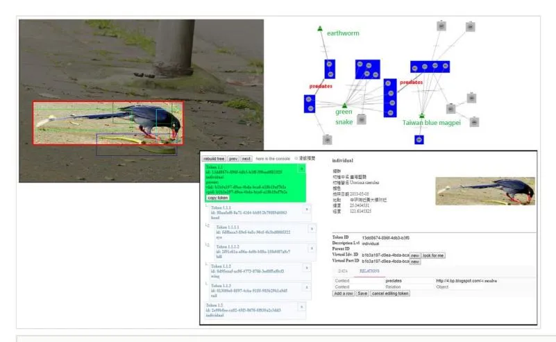

#### Conference Abstract

# **Annotating out the Way to the Linked Biodiversity Data Web**

Guan Shuo Mai , Fu Chun Yang , Mao-Ning Tuanmu ‡ ‡ ‡

‡ Academia Sinica, Taipei, Taiwan

Corresponding author: Mao-Ning Tuanmu ([mntuanmu@gmail.com\)](mailto:mntuanmu@gmail.com)

Received: 14 Aug 2017 | Published: 14 Aug 2017

Citation: Mai G, Yang F, Tuanmu M (2017) Annotating out the Way to the Linked Biodiversity Data Web.

Proceedings of TDWG 1: e20270.<https://doi.org/10.3897/tdwgproceedings.1.20270>

### **Abstract**

Image annotation is a common approach for biodiversity detection by labeling features of interest from images. However, annotation tools and data structures are usually developed and combined as platform for specific purposes. It makes tools hard to be adopted by different domains and hinders the interoperability of potentially related data from multiple sources. Following linked data principles and ontology design patterns, we proposed a platform-independent framework, and implemented a web-based prototype for semantic annotating images with persistent HTTP Uniform Resource Identifier (URI). Our framework is designed for breaking down data silos, i.e. scattered information annotated from active or legacy biodiversity databases, personal observation blogs, or albums can be queried and interoperated together. The prototype can be used without installation and easily integrated into other platforms. It pulls image links from a page and let people select features of interest (e.g. flowers, birds, or patterns) as tokens with bounding boxes from an image. Tokens can then be populated with properties or traits (e.g. colors, behaviors) derived from domain ontologies which are treated as choosable profiles. Meanwhile tokens can be described with measurement data in certain dimensions such as body weight or wing length. Relations can be created between any two tokens from arbitrary hosts. Tokens, properties, measurements and relations are assembled through framework ontologies such as Extensible Observation Ontology (OBOE). Each token is given a hash URI composed of an image URI and a Universally Unique Identifier (UUID). With URIs, relations can be explicitly kept as structured data instead of literal descriptions, and the data location can be 2 Mai G et al

easily resolved. Annotation data are modeled as graph, shared and aggregated by URIs, and thus the meta-information can be extended as much as possible exactly like linked data does. We made a simple visualization to show the interlinking data graph (Fig. 1). In general, audios can also be annotated on spectrogram with simple translation from x, y bounding box coordinates to time and frequency domain to get aligned with the real annotated target. Due to the difficulties for non-expert to describe contents with precise words, an ontology bridging amateurs to professionals should be introduced. Data quality is controlled not only by expert validation but also by peer reviews from experienced observers with revisions. Diverse applications, such as voucher-based biota, trait database, species recognition, visualized dynamic identification keys, phenology monitoring and species interaction data building (e.g. food web, parasitism) can be run in crowdsourcing approach by communities of different domains, while all their efforts for ground truth developing are integrated, ready for further discovery and reuse under our framework.

Figure 1. An annotation example and the visualization of aggregated food chain data

# **Keywords**

image annotation, linked data, crowdsourcing

# **Presenting author**

Guan Shuo Mai
