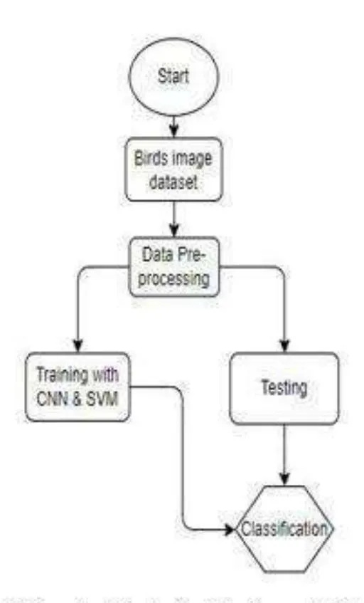

E-ISSN: 2582-2160 ● Website: [www.ijfmr.com](https://www.ijfmr.com/) ● Email: editor@ijfmr.com

# **Endangered Birds Species Classification using Machine Learning Techniques**

#### **Sudhakar Dwivedi1 , Samina Hashmi2 , Raj Singh Parihar3 , Ritik Rawat4 , Om Prakash Kushwaha5 , Pushpendra Singh6**

1,2,3,4,5,6Computer Science & Engineering Department, IMS Engineering College, Ghaziabad, India

#### **Abstract**

The conservation of endangered bird species is a crucial aspect of maintaining biodiversity. This study investigates how machine learning approaches, specifically convolutional neural networks (CNNs), decision trees, and random forests, can be applied to identify and classify endangered bird species. Using a dataset composed of images of endangered bird species, various machine learning models were evaluated for their effectiveness in distinguishing between different species. This paper reviews the technological methods and tools employed in past research and outlines the methodology applied in this study to identify endangered bird species through automated processes, potentially aiding conservation efforts. The goal is to find efficient, accurate, and scalable solutions for species classification to support bird conservation.

**Keywords:** Bird species, Machine Learning, Convolutional Neural Networks, Ornithology.

#### **INTRODUCTION**

Birds are remarkable creatures that captivate people with their diverse plumage, unique behaviors, and ecological roles. Yet, many bird species are threatened with extinction due to human-induced factors such as deforestation, climate change, and pollution. To address these threats, conservation efforts are essential. Machine learning, with its ability to process large datasets and identify complex patterns, is a promising approach to aid in these efforts by automating the classification and identification of bird species. By using machine learning models, conservationists can efficiently monitor bird populations and evaluate the success of conservation strategies.

This study presents a framework for automatically classifying endangered bird species. The process involves pre-processing images to extract relevant features, then using machine learning models to classify the species. The study evaluates different machine learning algorithms, including deep CNNs, to determine which is most effective for classifying bird species. The goal is to create an accurate system that can support conservation by aiding in the identification of endangered birds.

#### **NATURAL LANGUAGE PROCESSING**

Natural Language Processing (NLP) represents the fusion of Artificial Intelligence and Linguistics, empowering computers to comprehend and engage with human languages seamlessly. Its overarching goal is to bridge the chasm between machine-specific languages and human language, rendering technology more accessible to those not fluent in programming languages. Within NLP, the realms of

E-ISSN: 2582-2160 ● Website: [www.ijfmr.com](https://www.ijfmr.com/) ● Email: editor@ijfmr.com

Natural Language Understanding (NLU) and Natural Language Generation (NLG) reign supreme, governed by intricate rules and symbolic representations. This multidisciplinary field boasts real-world applications spanning machine translation, named entity recognition, and optical character recognition, among others. NLP confronts the intricacies and ambiguities inherent in human language through a repertoire of techniques including minimization, preservation, interactive clarification, and ambiguity weighting, drawing upon expertise from computer science, linguistics, psychology, and philosophy to deepen our comprehension of human language [4].

The dual pillars of NLP, Natural Language Understanding (NLU) and Natural Language Generation (NLG), are instrumental in extracting and comprehending ideas, sentiments, keywords, and more from human language, thereby enabling machines to decipher and deconstruct textual inputs. This capability holds particular significance in domains like customer support, where effective communication is paramount. Conversely, Natural Language Generation (NLG) is tasked with crafting coherent and readable language from structured data or information, mirroring human speech and writing patterns. NLG finds wide-ranging applications in chatbots, automated report generation, summarization of information, and content creation, contributing to enhanced user experiences and operational efficiencies [5]. NLP systems strive to integrate these linguistic components seamlessly, enabling algorithms to both interpret and generate human language fluently. The discourse further delves into the intricate challenges posed by linguistic uncertainty, manifesting across various linguistic levels and necessitating diversemitigation strategies. .

### **MACHINE LEARNING TECHNIQUES**

Machine learning methods encompass a suite of computational techniques and algorithms enabling machines to autonomously learn from data and make informed predictions or decisions without explicit instructions. In the realm of fake news detection, these methods serve as indispensable tools, adept at discerning patterns indicative of false information. By analyzing vast datasets, machine learning empowers us to identify fake news articles or content with unprecedented accuracy, thereby curtailing the dissemination of misinformation and upholding the integrity of trustworthy news sources. This is particularly crucial in today's information age, where the spread of false information can have farreaching consequences.

**Random Forest:** A versatile algorithm that leverages an ensemble of decision trees to enhance prediction accuracy. Renowned for its effectiveness in both classification and regression tasks, Random Forest mitigates overfitting by aggregating results from numerous individual trees. Widely employed in data analysis and predictive modeling, Random Forest remains a cornerstone of modern machine learning [6]. Linear Regression: A fundamental supervised learning technique that establishes a linear relationship between a target variable and one or more predictor variables.

**Decision Tree:** An intuitive algorithm capable of handling both classification and regression tasks. Decision trees recursively partition the data based on the most significant features, culminating in a treelike structure that elucidates the decision-making process. Valued for its interpretability and ease of use, decision trees are instrumental in making accurate predictions across various domains [6].

**K-Nearest Neighbors (KNN):** A straightforward and robust algorithm employed in classification and regression tasks. KNN determines the class or value of a data point by examining its closest neighbors in the feature space, making it particularly effective in supervised learning scenarios [7].

E-ISSN: 2582-2160 ● Website: [www.ijfmr.com](https://www.ijfmr.com/) ● Email: editor@ijfmr.com

**Support Vector Machine (SVM):** A powerful supervised learning technique proficient in both classification and regression tasks. SVM constructs a hyperplane to separate data points into distinct classes while maximizing the margin between them. Renowned for its efficacy in high-dimensional spaces and its ability to handle linear and non-linear problems, SVM stands as a stalwart in modern machine learning [7].

**Naïve Bayes:** A probabilistic algorithm widely utilized for classification tasks, Naïve Bayes relies on Bayes' theorem and the assumption of feature independence to compute the likelihood of an instance belonging to a particular class. Esteemed for its simplicity and efficiency, Naïve Bayes finds applications in diverse domains, including text classification, spam detection, and recommendation systems [8]. By harnessing the capabilities of these diverse machine learning methods, our research endeavors aim to advance the frontier of fake news detection, promoting the dissemination of accurate and reliable information in the digital landscape.

**LSTM Model:** The Long Short-Term Memory (LSTM) model, a type of recurrent neural network (RNN) entrenched in deep learning, excels in analyzing and forecasting sequential data. Its architecture effectively mitigates the vanishing gradient problem and preserves long-term dependencies within data sequences. These attributes render LSTMs invaluable for tasks such as natural language processing and temporal data analysis, where capturing intricate temporal relationships is paramount [10].

**XGBoost:** XGBoost, an abbreviation denoting Extreme Gradient Boosting, emerges as a standout machine learning algorithm celebrated for its exceptional speed and precise predictions. Employing an ensemble approach, XGBoost amalgamates multiple decision tree models to augment predictive accuracy, finding widespread application across classification and regression tasks.

#### **BACKGROUND STUDY**

Exploring the realm of safeguarding biodiversity through machine learning, the endeavor to classify endangered avian species stands as a pivotal pursuit. Several scholarly works have delved into employing diverse algorithms to delineate bird species based on both their visual and acoustic signatures. Among these endeavors, Fagerlund embarked on employing support vector machines (SVM) and convolutional neural networks (CNN) to discern bird species based on visual attributes. Leveraging two comprehensive datasets, UCSD and Caltech, housing a collective assemblage of 11,788 images spanning 200 bird species, the author embarked on a meticulous journey. Employing online tools for bird identification post-image curation, the study accentuated the challenges intertwined with categorizing avian species visually, given the nuances of background noise, irregular angles, and size discrepancies. To surmount these hurdles, a color-based attribute extraction methodology was proffered, manifesting in a robust precision of 97.14% for training data and 98.33% for test data, thus underscoring its efficacy in avian classification.

A different stride in the realm of avian classification was proposed by [3], advocating for a novel SVM decision tree approach. This method yielded a commendable correct classification rate of approximately 84%, with accuracy oscillating contingent upon distinctive beak features. Of noteworthy significance was the identification of the RERWB feature's pronounced efficacy in avian classification, surpassing its counterpart RHBWB by a substantial margin. Moreover, integrating decision tree methods manifested a notable enhancement in classification accuracy, exemplifying the latent potential inherent in employing SVM decision trees and accentuating the salience of the R-ERWB feature in avian taxonomy.

E-ISSN: 2582-2160 ● Website: [www.ijfmr.com](https://www.ijfmr.com/) ● Email: editor@ijfmr.com

In a distinct study by Branson [4] in 2014, a pioneering deep convolutional neural network was proposed for the categorization of bird species, emphasizing pose normalization. This innovative approach yielded an impressive accuracy of 85.4%, marking a significant stride in avian classification methodologies. In a parallel exploration, [5] scrutinized leading deep learning methodologies for the detection of lowresolution small objects in bird identification, leveraging the novel LBAI dataset. Testing an array of architectures including YOLOv2, SSH, Tiny Face, U-Net, and Mask R-CNN, the study revealed SSH's supremacy for straightforward instances and Tiny Face's efficacy in challenging circumstances..

Diverging from conventional paradigms, certain researchers pursued an alternative avenue, harnessing deep learning methodologies to categorize and delineate avian species across more than 60 diverse sets. Employing convolutional neural network (CNN) algorithms trained on a dataset gleaned from Bing searches, these endeavors culminated in notable success in the recognition and clustering of various bird species, underscoring the versatility of deep learning in avian taxonomy. Drawing parallels to our own research, M. Lasseck's [6] exploration into utilizing deep convolutional neural networks to distinguish between different plant species from images offers valuable insights. This alignment in methodologies underscores the cross-disciplinary applicability of deep learning techniques in species identification and classification, illuminating novel pathways for our ongoing investigations.

In an innovative proposition by B. Juha T Tanttu et al (2018), a convolutional neural network (CNN) trained in conjunction with John Martinsson et al's (2017) deep residual neural networks presented a formidable alliance in image classification. Introducing a novel data augmentation technique, images underwent conversion and rotation to align with desired color schemes, enriching the training dataset's diversity. The culmination of this approach lay in a fusion of radar parameters and image classifier predictions, offering a holistic framework for enhanced identification accuracy. Contrastingly, D. Madhuri A. Tayal, Atharva Magrulkar et al (2018) engineered a user-friendly software application poised to streamline bird identification processes. Leveraging transfer learning methodologies and MATLAB, this software ingests images as input and furnishes precise bird species identification as output, marking a significant leap in accessibility and efficiency within the ornithological domain.

In a seminal work by Sidhart Krishnan et al. (2022), the prowess of Long Short-Term Memory (LSTM) networks in capturing long-range dependencies across temporal sequences was underscored. While traditionally heralded for their efficacy in Natural Language Processing (NLP) tasks like text generation, the researchers posited a novel application of LSTM networks in the domain of bird species classification. Departing from conventional paradigms, they proposed framing the classification task as a sequence prediction conundrum akin to taxonomy, where each hierarchical rank is sequentially forecasted. This innovative approach imbues the model with a structured understanding of the taxonomy, facilitating more nuanced and accurate species classification. By harnessing the inherent capabilities of LSTM networks to discern intricate patterns across temporal sequences, Krishnan et al. pave the way for a paradigm shift in avian classification methodologies.

In an intriguing departure, the researchers employed convolutional neural network (CNN) algorithms to train their model on a dataset meticulously sourced from Bing searches, yielding commendable success in recognizing and categorizing various bird species. Parallelly, M. Lasseck's [6] exploration into utilizing deep convolutional neural networks for identifying distinct species.

While akin in methodology, our research diverges in focus, concentrating on identifying endangered bird species—a more specific and critical task within conservation efforts. While sharing common ground with the aforementioned studies in addressing the challenge of species identification based on visual

E-ISSN: 2582-2160 ● Website: [www.ijfmr.com](https://www.ijfmr.com/) ● Email: editor@ijfmr.com

features, our study zooms in on the imperative task of safeguarding endangered avian populations.

In contrast to prior works such as Fagerlund [1] and PakhiChini [7], our research carves a distinctive path by synergistically combining CNN and SVM algorithms for classification, thus offering a novel approach to addressing the unique challenges of identifying endangered bird species. By prioritizing the preservation of vulnerable avian populations, our study stands at the intersection of conservation science and advanced machine learning methodologies, underlining the paramount importance of tailored approaches in safeguarding biodiversity.

Collectively, these endeavors underscore the multifaceted nature of employing diverse machine learning techniques, preprocessing methodologies, and feature engineering to develop robust solutions for species classification—a theme that resonates across disparate domains, from ornithology to botany and beyond.

### **GENERAL FRAMEWORK**

The Convolutional Neural Network (CNN) stands as a cornerstone in deep learning, adept at discerning intricate features within images and distinguishing between them. Unlike traditional classification algorithms, CNNs require minimal preprocessing, as they possess the remarkable capability to autonomously learn and adapt filters through extensive training iterations. Inspired by the interconnectedness of neurons in the human brain, CNNs mirror the receptive field pattern, wherein individual neurons respond selectively to specific features, collectively covering the entire visual domain.

At the heart of our project lies the ambition to identify and classify images of avian species, leveraging the power of Convolutional Neural Networks (CNNs). Developed atop Python3 within the Atom Editor and deployed using the Django web framework, our system embodies state-of-the-art deep learning methodologies to achieve precise species classification.

To curate our extensive image dataset, we harnessed the Microsoft Bing Image Search API v7, a robust member of Microsoft's Cognitive Services family. Encompassing predominantly avian species from the Asian subcontinent, our dataset comprises a diverse array of 60 bird species, housing a total of 8218 meticulously curated images.

Through the fusion of cutting-edge deep learning techniques, meticulous dataset curation, and seamless integration within a robust web framework, our project endeavors to advance the frontier of avian species identification and classification, contributing to the broader landscape of biodiversity conservation and research. .

The proposed framework adopts Convolutional Neural Networks (CNNs) for processing, featuring an input layer dedicated to image data and subsequent layers tasked with both feature extraction and classification. CNNs excel in image-centric tasks, leveraging their capacity for automatic feature extraction and minimizing the reliance on manual filter engineering.

Following the successful deployment of the CNN Model, the network underwent training utilizing Keras with the Adam Optimizer. Essential packages were imported into the training script to facilitate smooth execution. Matplotlib backend was employed for background figure saving. To enhance dataset diversity and mitigate overfitting, data augmentation techniques were employed using the Image Data Generator class. This augmentation strategy significantly enriches the training dataset without necessitating the collection of additional data, thereby fortifying the model's robustness.

E-ISSN: 2582-2160 ● Website: [www.ijfmr.com](https://www.ijfmr.com/) ● Email: editor@ijfmr.com

#### **ANALYSIS**

In our investigation, we observed a notable variance in the quantity of available Xeno-Canto training data across different bird species. Figure 4 a+b showcases the relationship between the volume of training data and the unweighted model performance among top competitors. While there's a discernible correlation between the quantity of training data and model quality, there are also substantial per-species effects on model performance. The competition metric, a weighted F1 score, was strategically chosen to equalize the importance of the 21 target species and balance positive and negative labels within each species. This weighting mechanism, prioritizing recall over precision, addresses the inherent class imbalance between positive and negative labels in the test data.

Numerous studies have delved into the application of machine learning for bird species identification, leveraging various modalities such as images or audio recordings. Each study offers unique insights, showcasing the diverse array of approaches in bird species classification. To combat overfitting and enhance dataset diversity, we employed data augmentation techniques. Our dataset was meticulously split into training and testing sets, maintaining an 80:20 ratio to ensure the robustness of our model. Following training, the model was serialized to disk for seamless integration into a web-based framework, facilitating real-time bird species identification.

Through meticulous experimentation and adherence to best practices, our research endeavors to advance the frontier of bird species classification, contributing to the broader landscape of biodiversity conservation and research.

In a recent exploration of Hawaiian honeycreepers, researchers unveiled a phenomenon dubbed 'cultural convergence' in birdsong amidst population decline [21]. This study unveiled intriguing dynamics: over a span of 40 years, three honeycreeper species exhibited diminished intra-species song variability.

This study unveiled intriguing dynamics: over a span of 40 years, three honeycreeper species exhibited diminished intra-species song variability. However, concurrently, there was a noticeable decline in interspecies variation among the trio of species under scrutiny. This juxtaposition holds profound implications for the task of acoustic identification. On one hand, the reduced intra-species variation theoretically simplifies identification processes by homogenizing the acoustic signatures within species. Conversely, the dwindling inter-species variation complicates the task, heightening the challenge of distinguishing between closely related species sharing increasingly similar vocalizations. This intricate interplay between intra- and inter-species variation underscores the dynamic nature of avian communication systems and highlights the evolving challenges faced in acoustic species identification amidst ecological transformations.

E-ISSN: 2582-2160 ● Website: [www.ijfmr.com](https://www.ijfmr.com/) ● Email: editor@ijfmr.com

#### **CONCLUSION**

This study proposes a framework for classifying bird species using Convolutional Neural Networks, aiming to assist in the conservation of endangered birds. The model can help build applications that allow users to identify bird species by uploading an image. Future work could focus on increasing the number of images per class to improve accuracy and further develop applications that promote awareness of endangered bird species. By automating the identification process, this approach has the potential to support conservation efforts and raise public awareness about the importance of protecting bird biodiversity.

Presenting a novel framework for classifying bird species via Convolutional Neural Networks (CNNs), this study sets out to bolster conservation initiatives targeting endangered avian populations. The envisioned model holds promise in empowering the creation of user-friendly applications facilitating bird species identification through image uploads. Future endeavors may center on augmenting the quantity of images per class to enhance classification accuracy, alongside advancing applications geared towards fostering awareness surrounding endangered bird species.

- 1. Qiao, Baowen, Zuofeng Zhou, Hongtao Yang, and Jianzhong Cao. "Bird species recognition based on SVM classifier and decision tree.
- 2. " First International Conference on Electronics Instrumentation & Information Systems (EIIS), pp. 1- 4, 2017.
- 3. Branson, Steve, Grant Van Horn, Serge Belongie, and Pietro Perona. "Bird species categorization using pose normalized deep convolutional nets." arXiv preprint arXiv: 1406.2952 (2014).
- 4. Madhuri A. Tayal, Atharva Mangrulkar, Purvashree Waldey and Chitra Dangra. "Bird Identification by Image Recognition." Helix Vol. 8(6): 4349- 4352

E-ISSN: 2582-2160 ● Website: [www.ijfmr.com](https://www.ijfmr.com/) ● Email: editor@ijfmr.com

- 5. Atanbori, John, Wenting Duan, John Murray, Kofi Appiah, and Patrick Dickinson. "Automatic classification of flying bird species using computer vision techniques." Pattern Recognition Letters (2016): 53-62.
- 6. Sprengel, Elias, Martin Jaggi, Yannic Kilcher, Thomas Hofmann. "Audio Based Bird Species Identification using Deep Learning Technique." CLEF (2016).
- 7. Simonyan, Karen, and Andrew Zisserman. "Very deep convolutional networks for large-scale image recognition." arXiv preprint arXiv: 1409.1556 (2014)
- 8. Marini, Andréia, Jacques Facon, and Alessandro L. Koerich. "Bird species classification based on color features." In 2013 IEEE International Conference on Systems, Man, and Cybernetics, pp. 4336- 4341.IEEE, 2013.
- 9. Barar, Andrei Petru, Victor Neagoe and Nicu Sebe. "Image Recognition with Deep Learning Techniques. " Recent Advances in Image, Audio and Signal Processing: Budapest, Hungary, December 10-2 (2013).
- 10. Fagerlund, Seppo. "Bird species recognition using support vector machines." EURASIP Journal on Advances in Signal Processing 2007, no. 1 ( 2007): 038637.
- 11. B.P. Toth and B. Czeba, "Convolutional Neural Networks for Large-Scale Bird Song Classification in Noisy Environment", _CLEF (Working Notes)_, pp. 560-568, 2016, September.
- 12. CoCoNet: A Collaborative Convolutional Network applied to fine-grained bird species classification by Tapabrata Chakraborti, et al., published in IEEE Xplore in 2020.
- 13. Comparing Recurrent Convolutional Neural Networks for Large-Scale Bird Species Classification by Gaurav Gupta, et al., published in Scientific Reports in 2021.
- 14. Bird Species Classification Using Deep Learning" by Jie Zhang, et al., published in IEEE Xplore in 2022.

#### **References**

- 1. here is a summary of the paper "Bird Species Classification: One Step at a Time" by S. Subrahmanya, et al., published in the Conference and Labs of the Evaluation Forum (CLEF) 2022
- 2. B. Pradelle, B. Meister, M. Baskaran, J. Springer and R. Lethin, "Polyhedral Optimization of TensorFlow Computation Graphs", _6th Workshop on Extreme- scale Programming Tools (ESPT-2017) at The International Conference for High Performance Computing Networking Storage and Analysis (SC17)_, 2017
