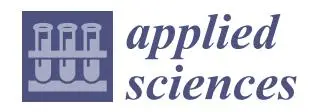

_Article_

# **Automated Wildlife Bird Detection from Drone Footage Using Computer Vision Techniques**

**Dimitrios Mpouziotas 1 [,](https://orcid.org/0009-0005-1628-767X) Petros Karvelis 1 [,](https://orcid.org/0000-0002-0483-4868) Ioannis Tsoulos 1,\* and Chrysostomos Stylios [2](https://orcid.org/0000-0002-2888-6515)**

- 1 Department of Informatics and Telecommunications, University of Ioannina, 451 10 Ioannina, Greece; mpouziotasd@gmail.com (D.M.); pkarvelis@uoi.gr (P.K.)
- Industrial Systems Institute, Athena RC, 263 31 Patra, Greece; stylios@uoi.gr
- **\*** Correspondence: itsoulos@uoi.gr or stylios@isi.gr

**Featured Application: Our methodology can be used for efficient and precise monitoring of bird populations in natural environments. By automating the detection and tracking process using the YOLOv4 model, wildlife conservationists can gather data on bird species without the timeconsuming nature of manual identification.**

**Abstract:** Wildlife conservationists have traditionally relied on manual identification and tracking of bird species to monitor populations and identify potential threats. However, many of these techniques may prove to be time-consuming. With the advancement of computer vision techniques, automated bird detection and recognition have become possible. In this manuscript, we present an application of an object-detection model for identifying and tracking wild bird species in natural environments. We used a dataset of bird images captured in the wild and trained the YOLOv4 model to detect bird species with high accuracy. We evaluated the model's performance on a separate set of test images and achieved an average precision of 91.28%. Our method surpassed the time-consuming nature of manual identification and tracking, allowing for efficient and precise monitoring of bird populations. Through extensive evaluation on a separate set of test images, we demonstrated the performance of our model. Furthermore, our results demonstrated the potential of using YOLOv4 for automated bird detection and monitoring in the wild, which could help conservationists better understand bird populations and identify potential threats.

**Keywords:** bird detection; computer vision; YOLO Darknet; DarkSuite

**Citation:** Mpouziotas, D.; Karvelis, P.; Tsoulos, I.; Stylios, C. Automated Wildlife Bird Detection from Drone Footage Using Computer Vision Techniques. _Appl. Sci._ **2023**, _13_, 7787. [https://doi.org/10.3390/](https://doi.org/10.3390/app13137787) [app13137787](https://doi.org/10.3390/app13137787)

Academic Editors: Junchi Yan and Minghao Guo

Received: 6 June 2023 Revised: 26 June 2023 Accepted: 28 June 2023 Published: 30 June 2023

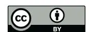

**Copyright:** © 2023 by the authors. Licensee MDPI, Basel, Switzerland. This article is an open access article distributed under the terms and conditions of the Creative Commons Attribution (CC BY) license [\(https://](https://creativecommons.org/licenses/by/4.0/) [creativecommons.org/licenses/by/](https://creativecommons.org/licenses/by/4.0/) 4.0/).

# **1. Introduction**

Drone technology's development has significantly advanced many industries, including animal monitoring and conservation [\[1\]](#page-16-0). Drones can be considered a valuable tool for studying and monitoring bird populations [\[2\]](#page-16-1). Drones offer unique capabilities for capturing high-resolution imagery, enabling researchers to conduct non-invasive surveys and observe bird species in their natural habitats [\[3\]](#page-16-2). Computer vision with the aid of machine learning techniques can help these drone-captured videos and images in order to be further analysed to detect and identify birds with high accuracy and efficiency.

Accurate detection and identification of bird species from aerial imagery are crucial for understanding population dynamics, assessing habitat quality, and informing conservation strategies [\[4\]](#page-16-3). However, it poses numerous challenges due to the small size of birds, their ability to move quickly and unpredictably, and the vast amount of data generated by drone footage. Traditional manual approaches to bird detection and identification are timeconsuming, labour-intensive, and prone to human error. To overcome these limitations, computer vision methods have emerged as powerful tools to automate and enhance the process of wildlife bird detection from drone footage.

Furthermore, drones can provide high-resolution and high-precision data, which can improve wildlife bird detection and monitoring. Utilizing drones enables wildlife _Appl. Sci._ **2023**, _13_, 7787 2 of 18

surveillance in challenging and hard-to-access environments, as depicted in Figure [1.](#page-1-0) For example, drones equipped with thermal or multispectral sensors can detect subtle changes in temperature or vegetation that are indicative of animal presence or habitat changes. This can provide valuable insights for wildlife management and conservation, as it allows for targeted interventions and informed decision-making.

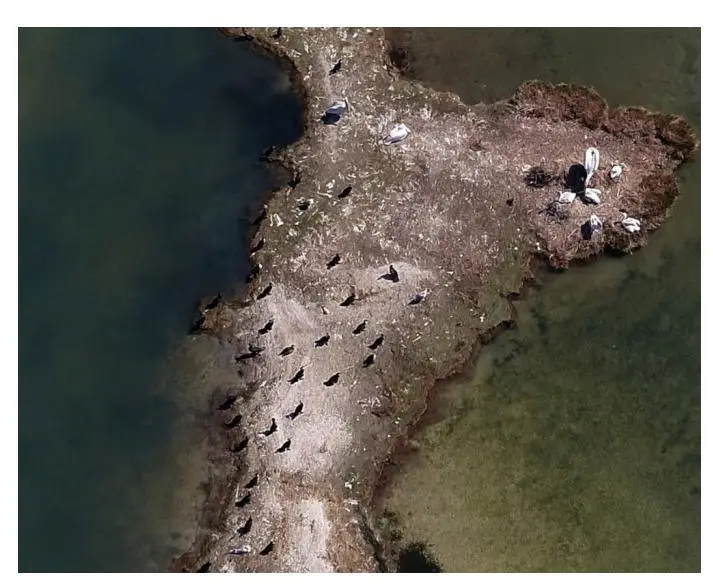

**Figure 1.** Image example of a bird's eye view of wildlife and flocks of birds retrieved using drone footage. Image frame location at Koronisia, Nisida Kamakia (location at Koronisia, Nisida Kamakia [\(GPS Pin\)](https://www.google.com/maps/search/?api=1&query=39.03683115510044,20.917212459180476)), received on 23 March 2023.

Computer vision [\[5\]](#page-16-4) encompasses a broad range of techniques that aim to enable machines to interpret and understand visual information. Within the field of wildlife monitoring, computer vision algorithms can be applied to analyse drone footage and automatically detect, track, and classify bird species based on their visual characteristics. These algorithms leverage deep learning [\[6](#page-16-5)[,7\]](#page-16-6) methods, which have shown remarkable performance in various image recognition tasks.

One popular computer vision method for object detection is the family of convolutional neural networks (CNNs) [\[6\]](#page-16-5). CNNs are deep learning architectures specifically designed to extract and learn meaningful features from images. They have been successfully employed in numerous domains, including object recognition, face detection, and scene understanding. Recent advances in CNN-based methods such as the You Only Look Once (YOLO) algorithm [\[8\]](#page-16-7) have shown promising results in bird detection tasks.

Applying computer vision methods to wildlife bird detection from drone footage offers several advantages. Firstly, it allows for rapid and automated analysis of large-scale datasets, enabling researchers to process and extract valuable information more efficiently. Secondly, computer vision algorithms can handle the challenges posed by the small size and swift movements of birds, making them well suited for accurately detecting and identifying bird species. Additionally, the integration of computer vision techniques with drone technology provides an opportunity for real-time monitoring and decision-making, facilitating timely conservation interventions and adaptive management strategies.

Overall, convolutional neural network algorithms, including YOLO, have shown great promise for bird detection and identification in drone footage. These algorithms have the potential to greatly improve our understanding of bird populations and their behaviour and contribute to conservation efforts and ecological studies [\[9\]](#page-16-8).

In this manuscript, we present a comprehensive study of the application of computer vision methods for wildlife bird detection from drone footage. Our aim was to assess the performance and effectiveness of various computer vision algorithms, such as the YOLO method, for the accurate detection of bird species. We evaluated the algorithms _Appl. Sci._ **2023**, _13_, 7787 3 of 18

using a diverse dataset of drone-captured imagery, encompassing different environments, lighting conditions, and bird species. Through this research, we aimed to contribute to the development of efficient and reliable tools for wildlife bird monitoring, which can enhance our understanding of avian populations, support conservation efforts, and inform management decisions.

The utilisation of computer vision methods for wildlife bird detection from drone footage has significant implications for ecological research and conservation. Firstly, it enables researchers to conduct large-scale bird surveys in a cost-effective and non-invasive manner. Drones can cover vast areas of land, allowing for the monitoring of bird populations in remote and inaccessible regions, as well as areas with challenging terrain. This expanded spatial coverage provides valuable insights into bird distributions, habitat preferences, and migratory patterns, which were previously difficult to obtain.

Moreover, the automated and standardised nature of computer vision algorithms ensures consistency in data processing and analysis. Manual bird surveys often suffer from inter-observer variability and subjectivity, leading to inconsistencies in data collection and interpretation. By employing computer vision methods, we can reduce these biases and increase the reliability and reproducibility of bird-monitoring efforts. Consistent and standardised data collection is crucial for accurate trend analysis, population assessments, and the identification of critical conservation areas.

Finally, we highlight the advantages of our method in improving the efficiency, accuracy, non-invasiveness, replicability, and potential real-time monitoring capabilities for bird detection and conservation efforts. By leveraging deep learning techniques, the proposed methodology significantly improves the efficiency of bird detection compared to traditional manual methods. It eliminates the need for labour-intensive and time-consuming manual identification and tracking processes, allowing for rapid and automated analysis of bird populations. Next, the automatic-bird-detection approach enables non-intrusive monitoring of bird populations in their natural habitats. This non-invasive method minimises disturbance to the birds and reduces the potential of altering their behaviours, providing more reliable and ecologically meaningful data for conservation efforts. Finally, using lighter versions of the YOLO method (tinyYOLO [\[10\]](#page-16-9)), we proved that our methodology has the potential for real-time bird detection and monitoring. This capability enables a timely response to emerging threats, early detection of population changes, and informed decision-making for effective conservation strategies.

The choice of the tinyYOLO method instead of other popular methods, e.g., MobileSSD [\[11\]](#page-17-0), which is generally more lightweight and compact compared to tinyYOLO, is that it is suitable for resource-constrained environments or devices with limited computational power. MobileNetSSD and tinyYOLO differ in their underlying network architectures. MobileNetSSD employs depthwise separable convolutions, which enable more efficient use of parameters and reduce computation. In contrast, tinyYOLO utilises a smaller network architecture with multiple detection layers to achieve good accuracy.

#### **2. Materials and Methods**

Figure [2](#page-3-0) displays the workflow of the materials and methods that were used in this research, to develop the results starting from recording drone footage and leading to training and previewing the image results using Darknet (Originally, written by Joseph Redmon 2013-2016. Forked by Alexey Bochkovskiy since 2016 until 2021 and as of now sponsored by Hank.ai and maintained by Stephane Charette) [\[12\]](#page-17-1), DarkMark [\[13\]](#page-17-2), and DarkHelp [\[14\]](#page-17-3) (Two valuable additions to Darknet, developed by Stehane Charette and forked by Hank.ai).

_Appl. Sci._ **2023**, _13_, 7787 4 of 18

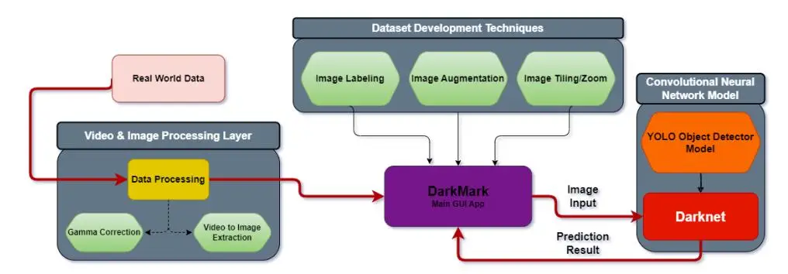

**Figure 2.** Workflow of steps followed to solve the computer vision problem starting from the realworld data, processing them, creating the dataset, and training the YOLO models using DarkMark.

The procedures we followed were similar to the workflow in Figure [2.](#page-3-0) Our initial objective was to retrieve real-world data. Subsequently, we transformed the data into processable data for Darknet's models and applied gamma correction. The next procedure was a long-term task that required us to label every image and image enhancement (gamma correction [\[15\]](#page-17-4) and image tiling/zooming [\[16\]](#page-17-5)). Our next procedure was to review the dataset and make appropriate changes. Finally, using DarkMark, we built our model's configuration files, as well as split the dataset into training and validation and began the training.

#### _2.1. Frameworks and Tools_

Several tools in the development of this research were used to develop the dataset, as well as the object-detection system. DarkSuite is a newly created suite of tools consisting of three tools, Darknet, DarkMark, and DarkHelp. These tools are reliable for creating datasets, labelling images, training, and evaluating models.

#### 2.1.1. Darknet Framework

Darknet is a framework that is capable of training and evaluating the YOLO models. It operates as the main communicator of the YOLO models using a Command Line Interface (CLI). Darknet provides various configuration files with each config file consisting of a different YOLO model. Using Darknet, the user can run shell commands and evaluate the YOLO models, as well as train any model to perform several object-detection tasks.

#### 2.1.2. DarkHelp C++ API/CLI Tool

DarkHelp is a C++ and Command Line Interface (CLI) API wrapper, serving as an Application Programming Interface (API) that offers expanded tool capabilities for interacting with Darknet. An API wrapper is an application that provides various functionalities and programming capabilities with great ease of use. DarkHelp allows customising and programming the YOLO models during evaluation.

The C++ API version of DarkHelp allows users to build their own applications in the C/C++ programming language. The CLI version of DarkHelp allows users to load the neural network with the help of several annotations that are not included in Darknet and predict multiple images, videos, or cameras.

Various applications can be developed in the C++ programming language using DarkHelp [\[14\]](#page-17-3) and OpenCV [\[17\]](#page-17-6). With DarkHelp, we developed a user-friendly program, which can be executed with the use of flags, which determine the output of the program. A demonstration of this program is displayed in subsequent sections, specifically Section [4.2.](#page-9-0)

#### 2.1.3. DarkMark GUI Application

DarkMark is a brilliant GUI application that communicates with and provides direct support for the Darknet framework. DarkMark is user-friendly for data analysts and computer vision experts. It allows for monitoring and labelling the image dataset, as well _Appl. Sci._ **2023**, _13_, 7787 5 of 18

as a visual evaluation of the trained models on the images. DarkMark also contains image augmentation [\[18\]](#page-17-7) and tiling/zooming options for the overall enhancement of the trained model. This application provides all the necessary tools for a data analyst in order to develop his/her own dataset.

Most model versions for Darknet are defined based on several configuration files. DarkMark allows the user to build the Darknet files and choose which model to build the files with; it also provides the user a list of various model/configuration files to choose from, as well as to modify them.

In addition to DarkMark, this allows automating various tasks such as image labelling and data augmentation, Figure [3.](#page-4-0) Without the use of DarkMark, both tasks can be very time-consuming and difficult to finalize. DarkMark is also capable of generating shell script files that enable users to promptly initiate the training of the model.

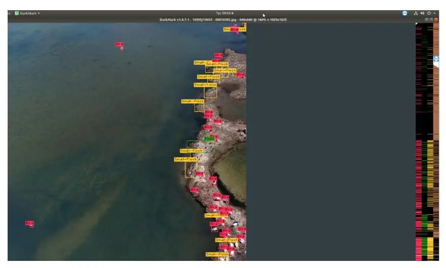

**Figure 3.** DarkMark GUI application —visual presentation of DarkMark, during the annotation process of objects in images. Image frame location at Koronisia, Nisida Kamakia (location at Koronisia, Nisida Kamakia [\(GPS Pin\)](https://www.google.com/maps/search/?api=1&query=39.03683115510044,20.917212459180476)), received on 23 March 2023.

#### 2.1.4. Image Tiling

Each convolutional neural network will process an image based on a set network size. The network size we used in our training sessions was 640 × 640. Any image that is parsed into the network that is above the network size will be scaled down to the network's size [\[16\]](#page-17-5). This results in a great loss of information, resulting in much less accuracy and visibility. Image tiling is a technique that is regularly used by many convolutional neural networks to fight this problem and allow the model to perform at its best potential.

Image tiling works by tiling each image into multiple smaller pieces that match the network's size. In the later figures, it is proven that it substantially increased the precision of the model. This technique can dramatically increase the complexity of the problem, whilst the model, instead of processing one image, processes multiple images, which are subsets of one. The implication of obtaining this much accuracy using image tiling is a dramatic loss in the computational performance of the model during evaluation.

We applied image tiling in our dataset, as well as during the evaluation of the model, to maximise the potential of the model. This technique became especially effective and increased the overall mAP of our model when we attempted to detect objects that are small and difficult to detect.

Applying image tiling to our dataset increased the total number of samples, based on the total count and resolution of our images, Figure [4.](#page-5-0) This technique was achieved using DarkMark after the image has been labeled. It is a common practice to apply image tiling when we are engaging with small object detection.

_Appl. Sci._ **2023**, _13_, 7787 6 of 18

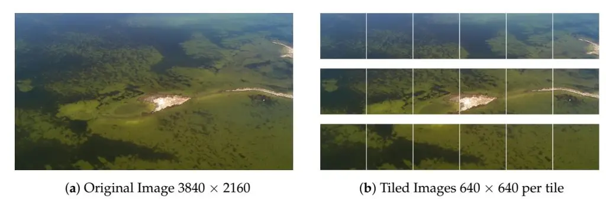

**Figure 4.** A comparison of an image tiled onto 17 different images to match the network size. Frame location at Koronisia, Nisida Balla (location at Koronisia, Nisida Balla [\(GPS Pin\)](https://www.google.com/maps/search/?api=1&query=39.05285415470534,20.854573719986032)), received on 23 March 2023.

In the subsequent sections, specifically Section [4.4,](#page-11-0) we demonstrated the computational performance required by the trained models YOLOv4-tiny [\[10\]](#page-16-9) and YOLOv4 [\[19\]](#page-17-8). The aim of these comparisons was to highlight the improvements achieved by applying image tiling, as well as the computational performance given by our results. By comparing the results with and without image tiling, we will be able to assess the impact of this technique on the overall accuracy of the model's predictions.

## _2.2. Image Enhancement_

This section describes the method we used to enhance the samples in our dataset, in order to improve the overall mean Average Precision (mAP) of our model's results [\[20](#page-17-9)[,21\]](#page-17-10). To address the degradation and lack of visibility in certain regions of the image caused by the Sun, we applied gamma correction [\[22\]](#page-17-11) to enhance our dataset. Gamma correction works by non-linearly scaling the intensity values of the image based on a _γ_ value defined by the user; see Equation [\(1\)](#page-5-1). In our case, we developed a Python [\[23\]](#page-17-12) program using OpenCV [\[17\]](#page-17-6) that applies gamma correction to each frame of the captured footage. The defined gamma value was set to 0.6. Any value higher than 1 will increase the brightness of the image, and any value less than 1 will decrease the brightness of the image.

$$Gamma = i^{\frac{1}{\gamma}} \tag{1}$$

Figure [5](#page-5-2) is a depiction of one of our samples in our dataset, which effectively conveys the difference using gamma correction. This method was specifically used to reduce the degradation caused by the Sun. The figure showcases an improvement in image quality after applying gamma correction.

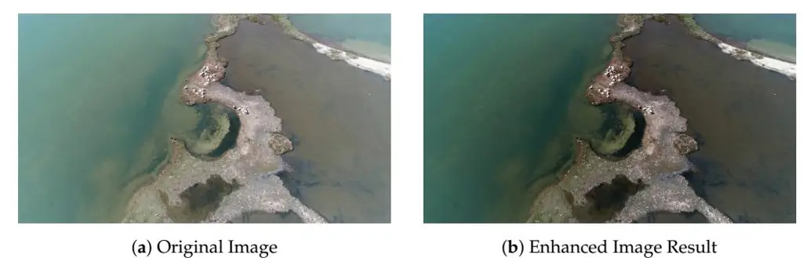

**Figure 5.** Comparison of a degraded image caused by the light of the Sun and the enhanced image using gamma correction. Frame location at Koronisia, Nisida Kamakia (location at Koronisia, Nisida Kamakia [\(GPS Pin\)](https://www.google.com/maps/search/?api=1&query=39.03683115510044,20.917212459180476)), received on 23 March 2023.

## _2.3. Object Detection Models and Configurations_

YOLOv4 [\[19\]](#page-17-8) and YOLOv4-tiny [\[10\]](#page-16-9) were the primary models for the development of this research. YOLOv4 was trained for its accuracy, whilst YOLOv4-tiny for its high _Appl. Sci._ **2023**, _13_, 7787 7 of 18

performance compared to YOLOv4. The trained models can be efficiently evaluated utilising the Darknet framework to obtain class-specific outcomes, including average precision measures.

Figure [6](#page-6-0) compares the Average Precision (AP) over the Frames Per Second (FPS) for various models including YOLOv4 and YOLOv4-tiny. The evaluation results of this graph were implemented on the MS COCO Dataset [\[24\]](#page-17-13). The graph describes how YOLOv4 outperformed YOLOv4-tiny in terms of precision, although it highly underperformed in terms of computational performance. YOLOv4-tiny was originally developed to perform well for low-cost embedded systems, to perform basic computer vision tasks.

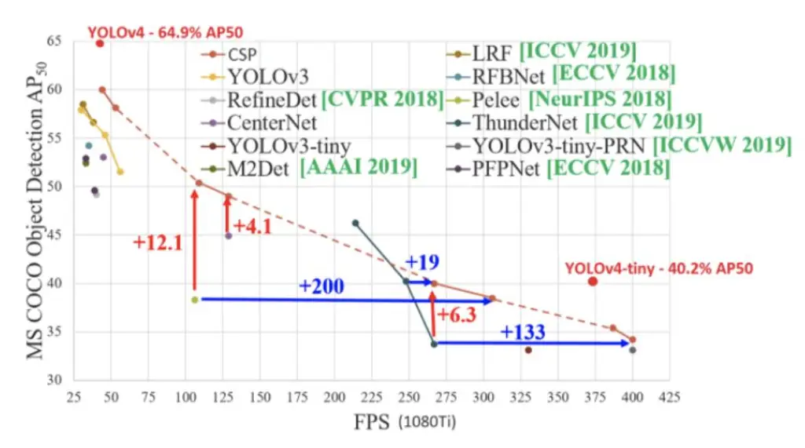

**Figure 6.** Performance comparison of various object detection models, including YOLOv4 and YOLOv4-tiny.

During training and evaluation, both models used the same parameters to closely evaluate the differences between the two models. Both models had a 640 × 640 network size, which determined the resolution of the images parsed into the network. The training session parameters we used for both models are displayed in Table [1.](#page-6-1)

| Hyperparameters           |                | Description                                                                                            |     |     |
| ------------------------- | -------------- | ------------------------------------------------------------------------------------------------------ | --- | --- |
| Batches                   | 64             | Number of samples processed in one batch                                                               |     |     |
| Subdivisions              | 16             | Number of batches the GPU will process at once                                                         |     |     |
| Max Batches               | 30,000         | Total batches until training finishes                                                                  |     |     |
| Learning Rate             | 0.002          | The rate at which the network adjusts the weights                                                      |     |     |
| Steps                     | 24,000, 27,000 | The batch milestones when the learning rate is scaled                                                  |     |     |
| 640 × 640 Network Size |                | The (WidthxHeight) resolution of the network; the images were scaled down to fit the network's size |     |     |

**Table 1.** The hyperparameters used during the training session of our model.

#### 2.3.1. YOLOv4 Architecture

YOLOv4 is a advanced convolutional neural network model, based on CSPDarknet53 as the backbone Figure [7.](#page-7-0) Darknet-53 is also known as YOLOv3 [\[25\]](#page-17-14).

_Appl. Sci._ **2023**, _13_, 7787 8 of 18

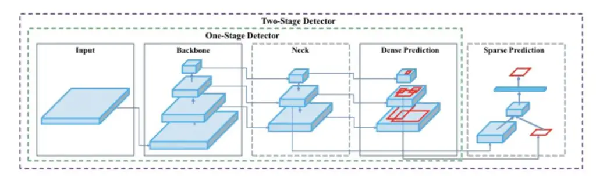

**Figure 7.** YOLOv4 model architecture [\[19\]](#page-17-8).

YOLOv4 comprises various layers, the input layer, the backbone, the neck, and finally, the classification layer. The input layer is simply where the network is fed images. YOLOv4's backbone layer extracts valuable information out of the image, into a feature map. The backbone layer also applies various data augmentation techniques in order to improve the model's overall mAP. YOLOv4's neck layer is similar to the backbone; it extracts valuable information from the feature map. Finally, the classification layer, also known as the head layer, is decomposed and is similar to the YOLOv3 model. This layer is responsible for detecting any objects within the images and calculating the confidence value of each detection. If any object is detected by the model, it will create several detections for each class. The detections of the same object and the highest confidence value will be displayed by the model in the output.

#### 2.3.2. YOLOv4-Tiny Architecture

YOLOv4-tiny is based on the CSPDarknet53-tiny backbone Figure [8,](#page-7-1) an optimised version of the YOLOv4 architecture. YOLOv4-tiny is a lightweight version of YOLOv4's architecture, which provides satisfactory performance for object detection for low-cost systems, as well as problems that demand more performance over precision.

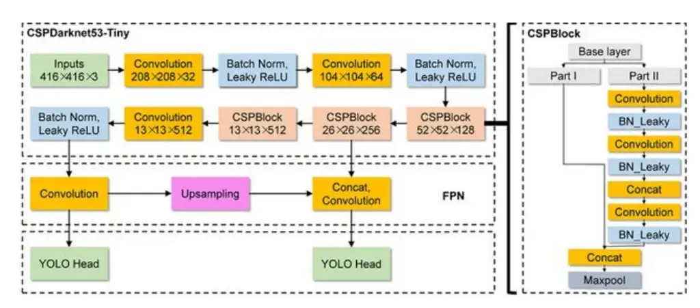

**Figure 8.** YOLOv4-tiny model architecture [\[10\]](#page-16-9).

YOLOv4-tiny is one of the primary models used in high-performance detection systems and primarily real-time footage detection, such as CCTV cameras.

## **3. Dataset**

Drone footage detection of wildlife in suburban and protected environments is a challenging task due to multiple factors that need to be taken into consideration during the development of our dataset. Conservationists advised that a minimum of 30 to 40 m altitude is the appropriate safety measure for the animals to feel safe in their habitats without disturbing the wildlife during the nesting cycle [\[26\]](#page-17-15). Building a reliable detection system in drone footage requires a well-developed dataset for the model to be accurate. _Appl. Sci._ **2023**, _13_, 7787 9 of 18

Due to the problem in question not containing enough data online, the dataset was created using drone footage recorded from suburban and protected environments.

In our dataset, we recorded three videos. Two videos were used to build our dataset, which summed up to 10 min of footage. The 3rd video was used to visually evaluate our model. Each frame extracted from the footage had a one-second interval. The resulting number of images was 769, but with the help of image tiling/zooming, the samples increased to 10,653.

During the development of our dataset, we began by retrieving real-world data; this was achieved by recording footage of suburban environments with several bird species at certain altitudes. The footage we gathered suffered from high light level conditions, which aggravated the resulting predictions of the model. Applying an enhancement algorithm to balance the light condition of the dataset images increased the visibility of the images.

Once the footage was retrieved, the next phase was to convert the data into images and begin labelling using DarkMark. Once labelling was complete, we could apply various transformations to our dataset to increase the number of samples, as well as the resulting average precision of our model. Image tiling was one of the more-important techniques that was applied to our image dataset to increase the performance of our model. Image tiling largely affected the outcome of our results, dramatically increasing our model's overall precision, especially because of the task at hand containing small object detections.

The challenge of this computer vision task was the scale of the objects we attempted to detect. Some objects within the footage might appear to be too small for the model to detect. Several techniques and steps needed to be applied to the dataset in order to effectively detect small objects within the dataset at an estimated altitude of 30 to 40 m. Based on the altitude of the drone and the distance between each bird, we classified clusters of birds as small-flock or flock this reduced the complexity of the problem in certain scenarios where there was a very large cluster of birds and the altitude was very high. This method is likely to reduce the overall evaluated performance of the model including the average Intersection over Union (IoU) [\[27\]](#page-17-16).

In order to develop a large and well-structured dataset, techniques such as image enhancement [\[15\]](#page-17-4), image tiling/cropping/zooming [\[28\]](#page-17-17), and automatic image labelling using DarkMark were used. We applied gamma correction to each piece of footage to reduce the degradation caused by the sunlight within the footage, and an example of this was presented in Figure [5.](#page-5-2)

Another technique that was originally not introduced into our dataset would be to include flip data augmentation. This would better assist the model to minimize any margin of error of any possible missing detections. This parameter works best if the objects are mirrored on both sides, left and right. As mentioned in earlier sections, we retrieved data in suburban environments located at Koronisia, Nisida Kamakia [\(GPS Pin\)](https://www.google.com/maps/search/?api=1&query=39.03683115510044,20.917212459180476), and Balla [\(GPS Pin\)](https://www.google.com/maps/search/?api=1&query=39.05285415470534,20.854573719986032) in the wetlands of Amvrakikos in the Logarou and Tsoukaliou Lagoons. During the surveillance of the wildlife, the drone's approach to the Pelecanus crispus colonies [\[29,](#page-17-18)[30\]](#page-17-19) was carefully planned by highly qualified personnel of the management unit of Acheloos Valley and Amvrakikos Gulf Protected area to minimise the disturbance of the birds, following the methodology outlined below: (a) The drone maintained an altitude of 70 m above the surface of the lagoon during the flight from the starting point to the breeding islands. (b) As the drone approached the colony, it gradually descended from 70 m to a height of 50 m, ensuring continuous telescopic surveillance of the bird colonies and avoiding disturbance. (c) At a minimum height of 30 m above the colony, the drone conducted horizontal runs to capture visual material, ensuring no disturbance was observed in the colony. (d) Upon completing the data collection above the colony, the drone began a gradual climb, slowly ascending to a height of 70 m. At this point, it was ready to follow its flight plan back to its operator. This approach prioritised the well-being of the Pelecanus crispus colonies, ensuring minimal disruption while obtaining valuable visual material for the study.

_Appl. Sci._ **2023**, _13_, 7787 10 of 18

#### **4. Results**

In this section, we present a comprehensive analysis of the outcomes achieved by the models we trained, along with a thorough explanation of the problem at hand. There are a diverse number of metrics such as visualisations and statistical analyses that offer a detailed understanding of the effectiveness of our model. Additionally, we evaluated the impact of using image tiling on the overall performance and accuracy of our model, as well as the difficulties the model faces in certain situations. Finally, we provide a visualisation and description of the training session of the models we trained.

#### _4.1. Terminology & Definitions_

Below, we define various terms [\[31\]](#page-17-20) that are usually used in computer vision methods:

Confidence is a value that is determined by the model when it detects an object. The model has X amount of confidence that object Y is exactly that prediction. The confidence is irrelevant to the accuracy of the model's prediction; it only represents the similarity of the predicted class, from the training dataset.

A True Positive (TP) is when the model's results contain a prediction of an object and it is correct, based on the ground truth information. True positives are also detections of the correct class.

A False Positive (FP) is when the model's results contain a prediction of an object and it is incorrect, based on the ground truth information. False positives are also detections of the wrong class.

A True Negative (TN) is when the model's results contain no predictions and this is correct based on the ground truth information.

A False Negative (FN) is when the model's results contain no prediction and it is incorrect based on the ground truth information. False negatives are detections not given by the model.

The mean Average Precision (mAP) is calculated using the true positive/negative and false positive/negative values. The mAP determines the performance of the model in a class.

Precision is the ratio between the correct predictions of the model and the incorrect classifications of the model, limited to the ground truth information:

$$Precision = \frac{True\ Positives}{True\ Positives + False\ Positives}$$
(2)

The average Intersection over Union (IoU), is a statistical comparison between the bounding boxes of the model's prediction and the ground truth's bounding box. The average IoU value represents the difference between the prediction and the ground truth's bounding box of multiple objects. The higher the value, the better the prediction is.

As outlined above, the average IoU is calculated using the ground truth and the prediction bounding box coordinates. In the case of Darknet and the YOLO models, we used DarkHelp to extract the coordinates of each prediction of our model and compared those predictions to the ground truth boxes that we labelled.

In order to calculate the IoU probability, the intersection's box coordinates need to be defined. Using the intersection area, we can also calculate the union's bounding box area. The ratio of the intersection divided by the union is equal to the IoU value.

Intersection over Union (IoU) =
$$\frac{\text{Intersection box Coordinates}}{\text{Union box Coordinates}}$$
(3)

#### _4.2. Training Session Results_

Both training sessions reached high mean Average Precision (mAP) and low average loss (a higher mAP is better, and a lower average loss is better) values. Figure [9](#page-10-0) contains two charts of the resulting training sessions of the YOLOv4-tiny and YOLOv4 models [\[10,](#page-16-9)[19\]](#page-17-8). _Appl. Sci._ **2023**, _13_, 7787 11 of 18

(a) YOLOv4-tiny's training session lasted 7 h at 30,000 batches. The highest mean average precision achieved was 85.64%, whilst the average IoU was 47.90%. (b) YOLOv4's training session lasted 64 h at 30,000 batches. During training, the highest mean average precision of the model based on the test dataset was 91.28%, whilst the average IoU was 65.10.

We developed an application capable of calculating the Intersection over Union (IoU) and accuracy metrics of our trained models using a validation dataset, Figure [10.](#page-10-1) Additionally, the application provides visual overlays of the groundtruth information on top of the detected objects.

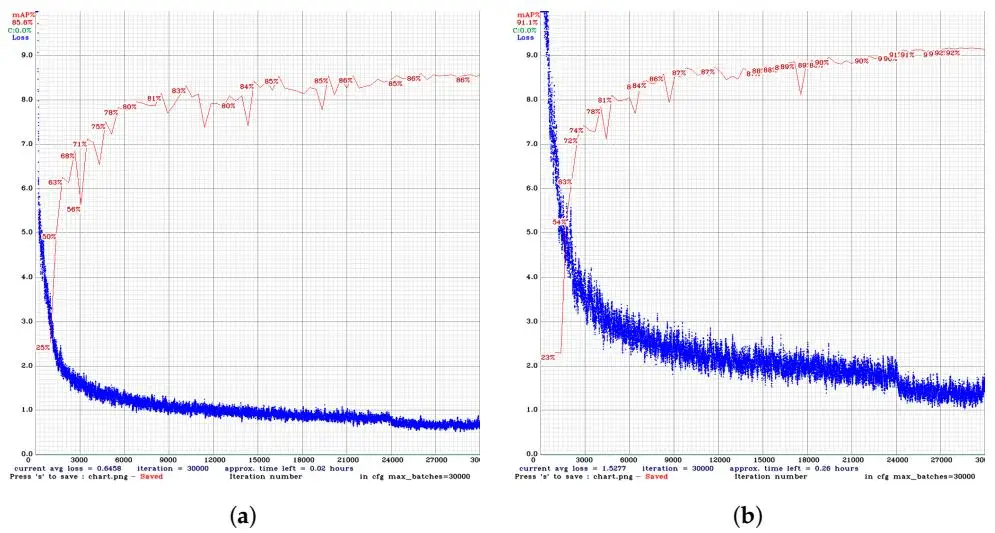

**Figure 9.** Training session charts of **YOLOv4** and **YOLOv4-tiny**. Training session on 6 April 2023. (**a**) Training session of YOLOv4-tiny model; (**b**) training session of YOLOv4 model.

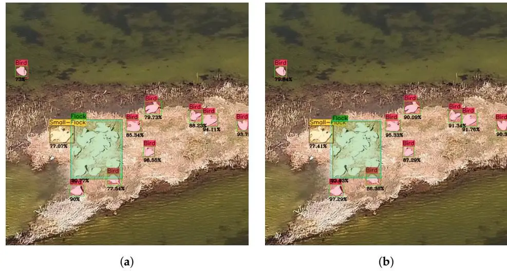

**Figure 10.** Intersection over union examples using YOLOv4-tiny and YOLOv4. Comparison of a model's prediction bounding box with the ground truth's bounding box. The percentage represents the IoU calculated using DarkHelp and OpenCV. Frame location at Koronisia, Nisida Balla (location at Koronisia, Nisida Kamakia [\(GPS Pin\)](https://www.google.com/maps/search/?api=1&query=39.03683115510044,20.917212459180476)), received on 23 March 2023. (**a**) IoU comparison results using the **YOLOv4-tiny** model. Average IoU: 86.93%. (**b**) IoU comparison results using the **YOLOv4** model. Average IoU: 90.22%.

The training charts of YOLOv4-tiny and YOLOv4 in Figure [9a](#page-10-0),b provide a valuable visual understanding of the effectiveness of our dataset for both models, based on the rate at which the average precision and average loss changed. Both models were trained with a total of 30,000 max batches.

_Appl. Sci._ **2023**, _13_, 7787 12 of 18

During the initial phase of the training session, we can observe a significant decrease in the average loss. That was due to a scaling factor given by the configuration files of the model. In the first few batches, the learning rate was gradually scaled up, accelerating the rate at which the model learned.

These steps were also an important milestone for the model, to change its learning behaviour and find the best-possible result. Similar to the initial phase of the training session, it scaled the learning rate based on the number of batches [\[12\]](#page-17-1). Throughout the entirety of both training sessions, the mAP showed a gradual increase, depicting a progressive improvement in accurately detecting objects until it converged to a stable state.

Further advancing into the training session, beyond 30,000 batches increased the risk of the model encountering the overfitting problem [\[32\]](#page-17-21).

## _4.3. Model Performance Evaluation_

The evaluation performance results of the models **YOLOv4** and **YOLOv4-tiny** were by no means different. The main purpose of training the two models was to have a lightweight and a high-precision model. Both models demonstrated high evaluation performance results, although it can be observed that the average IoU was low for both models. This issue will be explored even further in the next sections. During the evaluation, we extracted the mAP and the average IoU. The relationship between the average IoU and the mAP in Table [2](#page-11-1) is an average estimation of the overall performance of the model.

**Table 2. YOLOv4** and **YOLOv4-tiny** evaluation results (mAP calculated at a 50% IoU threshold).

| YOLO Model  | mAP    | Average IoU |
| ----------- | ------ | ----------- |
| YOLOv4      | 91.28% | 65.10%      |
| YOLOv4-tiny | 85.64% | 47.90%      |

The evaluation results in Table [2](#page-11-1) were adequate, although the average IoU was unusually low. This problem was due to the classes small-flock and flock since there was no exact determined distance between two birds that would be classified as a small-flock or bird. This is a major flaw in the model and is due for a change. An example of this issue will be displayed even further in later sections. The effect of reducing or increasing the average IoU threshold will vary based on the problem in question [\[33\]](#page-17-22).

The model's performance results at a confidence threshold of 0.25 are also displayed in Table [3.](#page-11-2) YOLOv4 performed very well considering the number of TPs and FPs. YOLOv4 tiny had a significant increase of the FP values, which can result in an unsatisfactory performance. With these values, we can obtain a better understanding of the performance of our trained models.

**Table 3. YOLOv4** and **YOLOv4-tiny** evaluation results (at a 0.25 confidence threshold).

| YOLO Model  | Precision | Recall | TP   | FP   | FN  |
| ----------- | --------- | ------ | ---- | ---- | --- |
| YOLOv4      | 78%       | 88%    | 1664 | 468  | 229 |
| YOLOv4-tiny | 60%       | 89%    | 1893 | 1250 | 232 |

Table [3](#page-11-2) demonstrates the overall accuracy of the model, with lower confidence thresholds of 0.25. By decreasing the confidence threshold, the model was more sensitive to detections and provided even more information. This may increase the total count of false negatives, which may further decrease or increase the precision of the model based on the task at hand.

## _4.4. Evaluation Result Analysis on Image Tiling_

To evaluate the highest-possible mAP of our trained model, we enabled image tiling to the model in 4k images, in order to achieve the model's maximum potential.

_Appl. Sci._ **2023**, _13_, 7787 13 of 18

Other studies have highlighted the advantages of using image tiling during the evaluation and training of various computer vision problems. The effectiveness of image tiling becomes especially more evident when dealing with small objects, resulting in an overall increase in the mean Average Precision (mAP) [\[28\]](#page-17-17). Figure [11](#page-12-0) effectively conveys this issue with our results and displays the significant increase in model precision, by tiling the images.

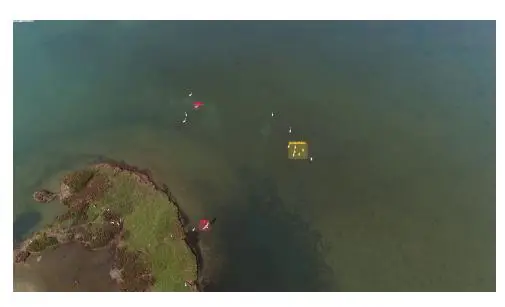

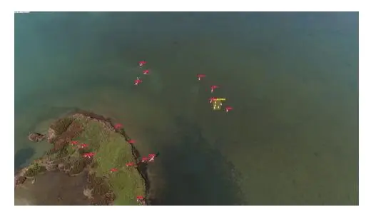

(**a**) YOLOv4-tiny Prediction Results (13 ms) (**b**) YOLOv4-tiny Prediction Results (142 ms)

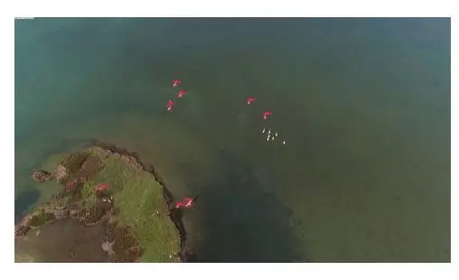

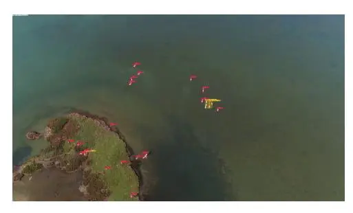

(**c**) YOLOv4 Prediction Results (512 ms) (**d**) YOLOv4 Prediction Results (1043 ms)

**Figure 11.** YOLOv4 and YOLOv4-tiny prediction results. This image contains 23 visible birds at an estimated altitude of 40 m. The images on the left represent the prediction results without the use of image tiling; the images on the right are all tiled, resulting in more-accurate predictions. Image frame location at Koronisia, Nisida Kamakia (location at Koronisia, Nisida Kamakia [\(GPS Pin\)](https://www.google.com/maps/search/?api=1&query=39.03683115510044,20.917212459180476)), received on 23 March 2023.

A clear observation can be made from Figure [11,](#page-12-0) as well as the effect of image tiling. It increased the precision of the model at the cost of computational performance. Table [4](#page-12-1) represents the evaluation results of the images in Figure [11](#page-12-0) and demonstrates the difference with or without image tiling.

**Table 4. YOLOv4** and **YOLOv4-tiny** evaluation results of Figure [11.](#page-12-0)

| YOLO Model  | mAP with Image Tiling | TP  | FN  | mAP without Image Tiling | TP  | FN  |
| ----------- | --------------------- | --- | --- | ------------------------ | --- | --- |
| YOLOv4      | 100%                  | 23  | 0   | 34.78%                   | 8   | 15  |
| YOLOv4-tiny | 86.95%                | 20  | 3   | 34.78%                   | 8   | 15  |

## _4.5. Model Prediction Errors_

This section demonstrates the issues of the model for footage that the model has never been trained on. On several occasions, the drone's camera faced upwards, and more objects could be observed, although there was more information to process, while the visibility was much lower at further distances, resulting in less-accurate predictions. In terms of real-time footage, the model's detections regularly fluctuated, appearing to be inaccurate on a fully rendered video with the model's predictions. A presentation of this issue can be observed in Figure [12,](#page-13-0) although this figure might present excellent results in areas closest to the drone, and the further the distance, the less accurate the model was.

_Appl. Sci._ **2023**, _13_, 7787 14 of 18

Even though this error was apparent, we can also observe that several birds were easier to detect if they were on the water, due to the reduction of the noise resulting from the environmental differences around the birds/flocks.

This issue may suggest a potential bias towards our dataset in our training sessions. In order to mitigate this problem, we can increase the complexity and diversity, while reducing any inherent similarities. As discussed in Section [3,](#page-7-2) the one-second interval between each frame resulted in a significant number of similar images, further indicating the possibility of dataset bias.

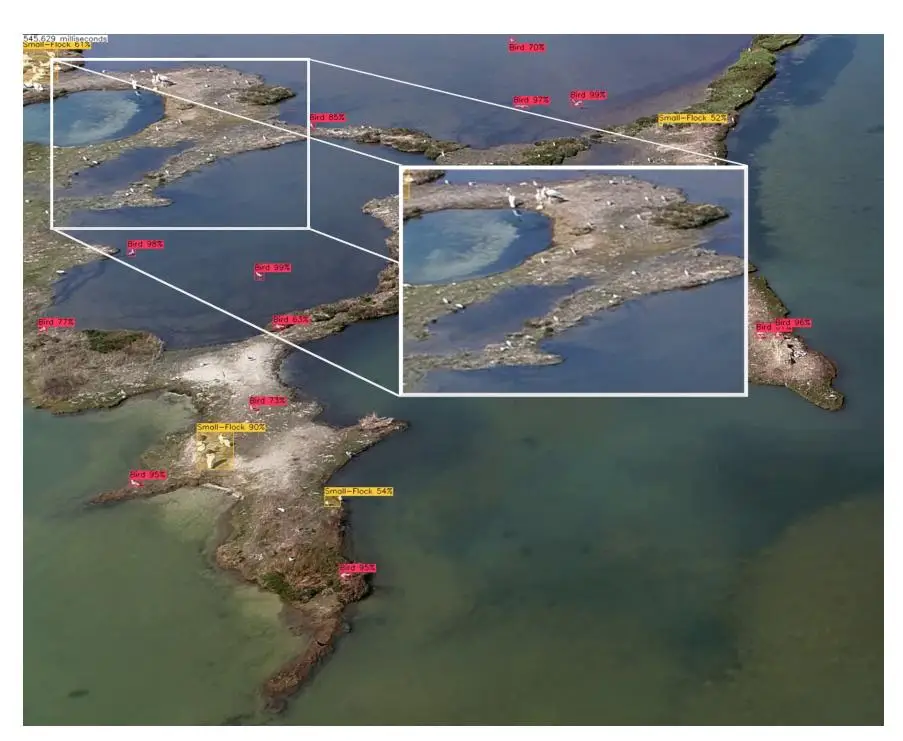

**Figure 12.** YOLOv4 model, long-range detection of small objects using image tiling. Image example frame extracted from footage recorded at Koronisia, Nisida Kamakia (location at Koronisia, Nisida Kamakia [\(GPS Pin\)](https://www.google.com/maps/search/?api=1&query=39.03683115510044,20.917212459180476)), received on 23 March 2023.

#### _4.6. YOLOv4 and YOLOv4-Tiny Image Results_

On paper, YOLOv4 performed best and excelled YOLOv4-tiny in terms of precision. YOLOv4-tiny performed worse in terms of precision, but we benefited from it, with 10x the computational performance during the evaluation compared to using YOLOv4.

## _4.7. Observation_

Although YOLOv4-tiny may exhibit an increased count of false positives, as shown in Table [3,](#page-11-2) it still maintained a satisfactory level of accuracy, as demonstrated in Table [2.](#page-11-1) Figures [13](#page-14-0) and [14](#page-14-1) are the results received from both trained models. YOLOv4 predicted all objects in the images with nearly 100% accuracy, whilst YOLOv4-tiny was not as accurate. The models can be highly inaccurate at longer distances and higher altitudes, as shown in Figure [12.](#page-13-0) One of the major flaws in our training sessions was that including both the small-flock and flock classes, which can create conflict between them and the bird class.

_Appl. Sci._ **2023**, _13_, 7787 15 of 18

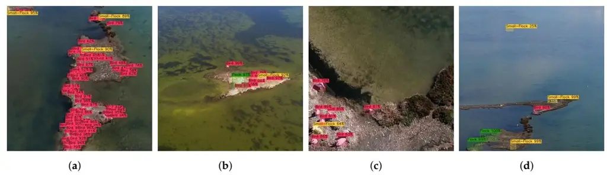

**Figure 13.** YOLOv4-tiny prediction results. Image frames' location at Koronisia, Nisida Kamakia (location at Koronisia, Nisida Kamakia [\(GPS Pin\)](https://www.google.com/maps/search/?api=1&query=39.03683115510044,20.917212459180476)) and Balla (location at Koronisia, Nisida Balla [\(GPS](https://www.google.com/maps/search/?api=1&query=39.05285415470534,20.854573719986032) [Pin\)](https://www.google.com/maps/search/?api=1&query=39.05285415470534,20.854573719986032)), received on 23 March 2023. (**a**) Avg IoU: 70.37%; Avg precision: 71.01%; TP: 49; FP: 20; FN: 19; (**b**) Avg IoU: 73.95%; Avg precision: 100%; TP: 4; FP: 0; FN: 6; (**c**) Avg IoU: 76.34%; Avg precision: 88.88%; TP: 8; FP: 1; FN: 0; (**d**) Avg IoU: 81.72%; Avg precision: 83.33%; TP: 5; FP: 1; FN: 1.

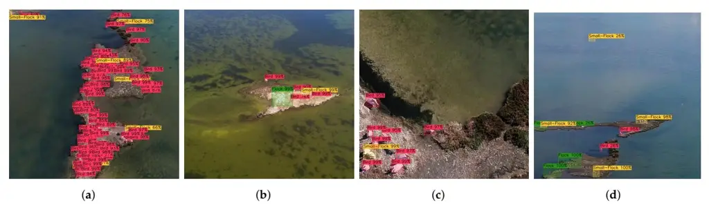

**Figure 14.** YOLOv4 prediction results. Image frames' location at Koronisia, Nisida Kamakia (location at Koronisia, Nisida Kamakia [\(GPS Pin\)](https://www.google.com/maps/search/?api=1&query=39.03683115510044,20.917212459180476)) and Balla (location at Koronisia, Nisida Balla [\(GPS Pin\)](https://www.google.com/maps/search/?api=1&query=39.05285415470534,20.854573719986032)), received on 23 March 2023. (**a**) Avg IoU: 70.69%; Avg precision: 93.05%; TP: 67; FP: 5; FN: 18; (**b**) Avg IoU: 79.33%; Avg precision: 100%; TP: 4; FP: 0; FN: 2; (**c**) Avg IoU: 87.73%; Avg precision: 100%; TP: 9; FP: 0; FN: 0; (**d**) Avg IoU: 81.57%; Avg precision:100%; TP: 6; FP: 0; FN: 3.

The contents of Table [5](#page-14-2) represent an overall understanding of the results extracted from the images with the help of our trained models YOLOv4-tiny [\[10\]](#page-16-9) and YOLOv4 [\[19\]](#page-17-8), and the C++ library, DarkHelp [\[14\]](#page-17-3), Figures [13](#page-14-0) and [14.](#page-14-1)

**Table 5. YOLOv4** and **YOLOv4-tiny** evaluation results of Figures [13](#page-14-0) and [14,](#page-14-1) at a confidence threshold of 0.25.

| YOLO Model | mAP    | IoU    | TP  | FP  | FN  |
| ------------- | ------ | ------ | --- | --- | --- |
| YOLOv4        | 98.26% | 79.83% | 86  | 5   | 23  |
| YOLOv4-tiny   | 85.8%  | 75.6%  | 66  | 22  | 26  |

Further evaluations at different confidence thresholds were also produced, to further identify what threshold values fit best for the problem in question; see Figure [15.](#page-15-0)

_Appl. Sci._ **2023**, _13_, 7787 16 of 18

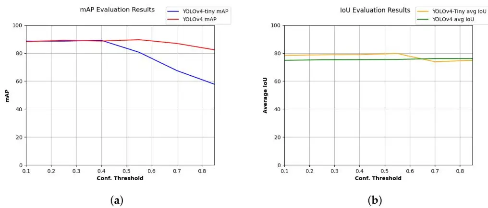

**Figure 15.** Graphs displaying the difference between the mAP or IoU of the evaluated results and several confidence threshold values. Graphs generated on 30 May 2023. (**a**) mAP results in various Confidence Thresholds; (**b**) average IoU results in various Confidence Thresholds.

#### **5. Conclusions**

In this research, we trained a model capable of detecting birds and flocks in drone footage. The models we used were YOLOv4 and YOLOv4-tiny. The footage was recorded in suburban environments at an altitude of 30–50 m. Using this footage, we developed a dataset and applied various techniques in order to increase the quantity and quality of our dataset.

During the development of our dataset, we applied image enhancement, labelled each image, and applied various techniques to increase the overall mAP of our model. The highest mAP we reached for our testing dataset was 91.28% with an average IoU of 65.10%. One crucial technique we evaluated our models with and applied to our dataset was image tiling [\[16\]](#page-17-5), in order to detect small objects and maximise our model's potential. Image tiling played an important role in improving the overall mAP, as proven in Figure [11,](#page-12-0) and dramatically increased the overall mAP of the model. Additionally, we enhanced our dataset using gamma correction to further improve the mAP of our model, as well as the prediction results. Both models performed superbly, in the detection of small objects such as flocks and birds in drone footage.

Despite YOLOv4-tiny's results containing less precision, we benefited from its overall increase in performance and how lightweight the model is. During the evaluation, the model was able to detect objects in images by up to 10× faster than YOLOv4. Whilst YOLOv4's evaluation results were high, at 91.28% mAP and 65.10% avg IoU (Table [2\)](#page-11-1), YOLOv4's drawback for its high accuracy was its overall performance in terms of its computational speed. Each frame took up to a second for the model to detect whilst using image tiling [\[16\]](#page-17-5).

The results produced from our dataset proved to perform excellently in terms of accuracy. This high accuracy was likely to be due to bias toward the dataset, which may result in false or missing detections in the footage the model was not trained on. It is essential to consider that different methods often utilise different datasets, making direct comparisons challenging. The goal of our presented methodology was to test deep learning methods such as the state-of-the-art YOLO detection algorithm (and the tinyYOLO model) from drone footage. We must point out that the detection of birds was a challenging problem since the drone video was captured at a relatively high altitude (30–50m above sea level) avoiding sea disturbance. Overall, we can conclude that, with the current dataset, the models performed excellently, and they effectively accomplished the task of object detection based on the given dataset.

## **6. Future Work**

In order to improve the model's overall precision and ensure more acceptable results for this object-detection problem, additional improvements to our dataset are necessary. _Appl. Sci._ **2023**, _13_, 7787 17 of 18

More footage with different environments and altitudes needs to be considered, to further increase the complexity and diversity of our dataset.

YOLOv4 has demonstrated exceptional performance and has been widely adopted for various computer vision tasks, including object detection. It offers a good balance between accuracy and performance, making it suitable for real-time or near-real-time applications. The decision to use YOLOv4 was based on its proven track record and its ability to provide reliable and efficient bird-detection results. While newer versions of YOLO may offer additional advancements, our research concentrated on YOLOv4 to establish a solid foundation for automatic bird detection. Future work could certainly explore the benefits of newer versions, such as YOLOv7 [\[34\]](#page-17-23) and YOLOv7-tiny [\[35\]](#page-17-24), considering their specific improvements, but our current focus was to demonstrate the effectiveness of YOLOv4 and YOLOv4-tiny in the context of bird-detection tasks.

This publication is our first milestone in the surveillance of wildlife. As of the time of writing, we are working on the next milestone and are starting to implement and apply tracking techniques using computer vision methods with our trained object detector. While the article may primarily address individual bird detection, it would be valuable to consider incorporating nest counts and nesting success assessments in future research to provide a more comprehensive understanding and surveillance of bird populations [\[36\]](#page-17-25).

**Author Contributions:** Conceptualization, P.K.; methodology, P.K., I.T., D.M. and C.S.; software, D.M. and P.K.; validation, P.K. and I.T.; data collection, D.M.; writing—original draft preparation, D.M., I.T., C.S. and P.K.; writing—review and editing, D.M. and P.K.; supervision, P.K., I.T. and C.S.; project administration, C.S. and P.K.; funding acquisition, C.S. and P.K. All authors have read and agreed to the published version of the manuscript.

**Funding:** This research received funding from the project "Research and development advanced computational techniques for remote monitoring of wild poultry to prevent the spread of avian influenza using drones and other devices" submitted in Priority Axis 3 "Research and Implementation" of the financing program "Physical Environment & Innovative actions 2022" of the Green Fund. Throughout the development of this project, we worked really hard to achieve our goals.

**Institutional Review Board Statement:** Not applicable.

**Informed Consent Statement:** Not applicable.

**Data Availability Statement:** Data not available for this study.

**Conflicts of Interest:** The authors declare no conflict of interest.

# **References**

- 1. Hodgson, J.C.; Mott, R.; Baylis, S.M.; Pham, T.T.; Wotherspoon, S.; Kilpatrick, A.D.; Raja Segaran, R.; Reid, I.; Terauds, A.; Koh, L.P. Drones count wildlife more accurately and precisely than humans. _Methods Ecol. Evol._ **2018**, _9_, 1160–1167. [\[CrossRef\]](http://doi.org/10.1111/2041-210X.12974)
- 2. Hodgson, J.C.; Baylis, S.M.; Mott, R.; Herrod, A.; Clarke, R.H. Precision wildlife monitoring using unmanned aerial vehicles. _Sci. Rep._ **2016**, _6_, 22574. [\[CrossRef\]](http://dx.doi.org/10.1038/srep22574) [\[PubMed\]](http://www.ncbi.nlm.nih.gov/pubmed/26986721)
- 3. Jiménez López, J.; Mulero-Pázmány, M. Drones for Conservation in Protected Areas: Present and Future. _Drones_ **2019**, _3_, 10. [\[CrossRef\]](http://dx.doi.org/10.3390/drones3010010)
- 4. Marsh, D.M.; Trenham, P.C. Current Trends in Plant and Animal Population Monitoring. _Conserv. Biol._ **2008**, _22_, 647–655. [\[CrossRef\]](http://dx.doi.org/10.1111/j.1523-1739.2008.00927.x) [\[PubMed\]](http://www.ncbi.nlm.nih.gov/pubmed/18445076)
- 5. Szeliski, R. _Computer Vision: Algorithms and Applications_; Springer: Berlin/Heidelberg, Germany, 2010.
- 6. Krizhevsky, A.; Sutskever, I.; Hinton, G.E. ImageNet Classification with Deep Convolutional Neural Networks. In _Proceedings of the Advances in Neural Information Processing Systems_; Pereira, F., Burges, C., Bottou, L., Weinberger, K., Eds.; Curran Associates, Inc.: Toronto, ON, Canada, 2012; Volume 25.
- 7. Simonyan, K.; Zisserman, A. Very Deep Convolutional Networks for Large-Scale Image Recognition. _arXiv_ **2014**, arXiv:1409.1556.
- 8. Redmon, J.; Divvala, S.; Girshick, R.; Farhadi, A. You Only Look Once: Unified, Real-Time Object Detection. In Proceedings of the IEEE Conference on Computer Vision and Pattern Recognition, Las Vegas, NV, USA, 27–30 June 2016; pp. 779–788.
- 9. Coluccia, A.; Fascista, A.; Schumann, A.; Sommer, L.; Dimou, A.; Zarpalas, D.; Méndez, M.; de la Iglesia, D.; González, I.; Mercier, J.P.; et al. Drone vs. Bird Detection: Deep Learning Algorithms and Results from a Grand Challenge. _Sensors_ **2021**, _21_, 2824. [\[CrossRef\]](http://dx.doi.org/10.3390/s21082824) [\[PubMed\]](http://www.ncbi.nlm.nih.gov/pubmed/33923829)
- 10. Saponara, S.; Elhanashi, A.; Qinghe, Z. Developing a real-time social distancing detection system based on YOLOv4-tiny and bird-eye view for COVID-19. _J. Real-Time Image Process._ **2022**, _19_, 551–563. [\[CrossRef\]](http://dx.doi.org/10.1007/s11554-022-01203-5) [\[PubMed\]](http://www.ncbi.nlm.nih.gov/pubmed/35222727)

_Appl. Sci._ **2023**, _13_, 7787 18 of 18

11. Howard, A.G.; Zhu, M.; Chen, B.; Kalenichenko, D.; Wang, W.; Weyand, T.; Andreetto, M.; Adam, H. MobileNets: Efficient Convolutional Neural Networks for Mobile Vision Applications. _arXiv_ **2017**, arXiv:1704.04861.

- 12. Charette, S. YOLO v4, v3 and v2 for Windows and Linux. 2021. Available online: <https://github.com/AlexeyAB/darknet> (accessed on 28 June 2023).
- 13. Charette, S. DarkMark C++ GUI Tool for Darknet-Code Run. DarkMark is a C++ GUI Application Used to Mark Up Images, Which Then May Be Used with Darknet to Train a Neural Network, 2019–2023. Available online: <https://www.ccoderun.ca/darkmark/> (accessed on 28 June 2023).
- 14. Charette, S. DarkHelp, C++ wrapper Library for Darknet. 2022. Available online: [https://github.com/stephanecharette/](https://github.com/stephanecharette/DarkHelp) [DarkHelp](https://github.com/stephanecharette/DarkHelp) (accessed on 28 June 2023).
- 15. Li, Z.; Li, Y. Gamma-distorted fringe image modeling and accurate gamma correction for fast phase measuring profilometry. _Opt. Lett._ **2011**, _36_, 154–156. [\[CrossRef\]](http://dx.doi.org/10.1364/OL.36.000154) [\[PubMed\]](http://www.ncbi.nlm.nih.gov/pubmed/21263484)
- 16. Reina, G.; Panchumarthy, R.; Thakur, S.; Bastidas, A.; Bakas, S. Systematic Evaluation of Image Tiling Adverse Effects on Deep Learning Semantic Segmentation. _Front. Neurosci._ **2020**, _14_, 65. [\[CrossRef\]](http://dx.doi.org/10.3389/fnins.2020.00065) [\[PubMed\]](http://www.ncbi.nlm.nih.gov/pubmed/32116512)
- 17. Marengoni, M.; Stringhini, D. High Level Computer Vision Using OpenCV. In Proceedings of the 2011 24th SIBGRAPI Conference on Graphics, Patterns, and Images Tutorials, Alagoas, Brazil, 28–30 August 2011; pp. 11–24. [\[CrossRef\]](http://dx.doi.org/10.1109/SIBGRAPI-T.2011.11)
- 18. Yang, S.; Xiao, W.; Zhang, M.; Guo, S.; Zhao, J.; Shen, F. Image Data Augmentation for Deep Learning: A Survey. _arXiv_ **2022**, arXiv:2204.08610.
- 19. Bochkovskiy, A.; Wang, C.Y.; Liao, H.Y.M. YOLOv4: Optimal Speed and Accuracy of Object Detection. _arXiv_ **2020**, arXiv:2004.10934.
- 20. Mpouziotas, D.; Mastrapas, E.; Dimokas, N.; Karvelis, P.; Glavas, E. Object Detection for Low Light Images. In Proceedings of the 2022 7th South-East Europe Design Automation, Computer Engineering, Computer Networks and Social Media Conference (SEEDA-CECNSM), Ioannina, Greece, 23–25 September 2022; pp. 1–6. [\[CrossRef\]](http://dx.doi.org/10.1109/SEEDA-CECNSM57760.2022.9932921)
- 21. Mansouri, S.S.; Kanellakis, C.; Karvelis, P.; Kominiak, D.; Nikolakopoulos, G. MAV Navigation in Unknown Dark Underground Mines Using Deep Learning. In Proceedings of the 2020 European Control Conference (ECC), Saint Petersburg, Russia, 12–15 May 2020; pp. 1943–1948. [\[CrossRef\]](http://dx.doi.org/10.23919/ECC51009.2020.9143842)
- 22. Gonzalez, R.C.; Woods, R.E. _Digital Image Processing_; Prentice Hall: Upper Saddle River, NJ, USA, 2008.
- 23. Van Rossum, G.; Drake, F.L. _Python 3 Reference Manual_; CreateSpace: Scotts Valley, CA, USA, 2009.
- 24. Lin, T.Y.; Maire, M.; Belongie, S.; Hays, J.; Perona, P.; Ramanan, D.; Dollár, P.; Zitnick, C.L. Microsoft coco: Common objects in context. In _Computer Vision–ECCV 2014, Proceedings of the 13th European Conference, Zurich, Switzerland, 6–12 September 2014, Proceedings, Part V 13_; Springer: Berlin/Heidelberg, Germany, 2014; pp. 740–755.
- 25. Redmon, J.; Farhadi, A. YOLOv3: An Incremental Improvement. _arXiv_ **2018**, arXiv:1804.02767.
- 26. Fair, J.; Paul, E.; Jones, J. (Eds.). _Guidelines to the Use of Wild Birds in Research_; Ornithological Council: Washington, DC, USA, 2010.
- 27. He, K.; Gkioxari, G.; Dollár, P.; Girshick, R. Mask R-CNN. In Proceedings of the 2017 IEEE International Conference on Computer Vision (ICCV), Venice, Italy, 22–29 October 2017; pp. 2980–2988. [\[CrossRef\]](http://dx.doi.org/10.1109/ICCV.2017.322)
- 28. Ünel, F.O.; Özkalayci, B.O.; Çi ˘gla, C. The Power of Tiling for Small Object Detection. In Proceedings of the 2019 IEEE/CVF Conference on Computer Vision and Pattern Recognition Workshops (CVPRW), Long Beach, CA, USA, 16–17 June 2019; pp. 582–591. [\[CrossRef\]](http://dx.doi.org/10.1109/CVPRW.2019.00084)
- 29. Logarou Lagoun. 2023. Available online: <https://ebird.org/hotspot/L6989733> (accessed on 21 June 2023).
- 30. Tsoukaliou Lagoun. 2023. Available online: <https://ebird.org/hotspot/L968614> (accessed on 21 June 2023).
- 31. Ahmed, F.G. Evaluating Object Detection Models Using Mean Average Precision (mAP). 2020. Available online: [https://blog.](https://blog.paperspace.com/mean-average-precision/) [paperspace.com/mean-average-precision/](https://blog.paperspace.com/mean-average-precision/) (accessed on 28 June 2023).
- 32. Goodfellow, I.; Bengio, Y.; Courville, A. _Deep Learning_; MIT Press: Cambridge, MA, USA, 2016.
- 33. Chen, J.; Xie, M.; Xing, Z.; Chen, C.; Xu, X.; Zhu, L.; Li, G. Object Detection for Graphical User Interface: Old Fashioned or Deep Learning or a Combination? In _Proceedings of the 28th ACM Joint Meeting on European Software Engineering Conference and Symposium on the Foundations of Software Engineering_; ESEC/FSE 2020; Association for Computing Machinery: New York, NY, USA, 2020; pp. 1202–1214. [\[CrossRef\]](http://dx.doi.org/10.1145/3368089.3409691)
- 34. Wang, C.Y.; Bochkovskiy, A.; Liao, H.Y.M. YOLOv7: Trainable Bag-of-Freebies Sets New State-of-the-Art for Real-Time Object Detectors. 2022. Available online: <http://xxx.lanl.gov/abs/2207.02696> (accessed on 28 June 2023).
- 35. Hu, S.; Zhao, F.; Lu, H.; Deng, Y.; Du, J.; Shen, X. Improving YOLOv7-Tiny for Infrared and Visible Light Image Object Detection on Drones. _Remote. Sens._ **2023**, _15_, 3214. [\[CrossRef\]](http://dx.doi.org/10.3390/rs15133214)
- 36. Fudala, K.; Bialik, R.J. The use of drone-based aerial photogrammetry in population monitoring of Southern Giant Petrels in ASMA 1, King George Island, maritime Antarctica. _Glob. Ecol. Conserv._ **2022**, _33_, e01990. [\[CrossRef\]](http://dx.doi.org/10.1016/j.gecco.2021.e01990)

**Disclaimer/Publisher's Note:** The statements, opinions and data contained in all publications are solely those of the individual author(s) and contributor(s) and not of MDPI and/or the editor(s). MDPI and/or the editor(s) disclaim responsibility for any injury to people or property resulting from any ideas, methods, instructions or products referred to in the content.
