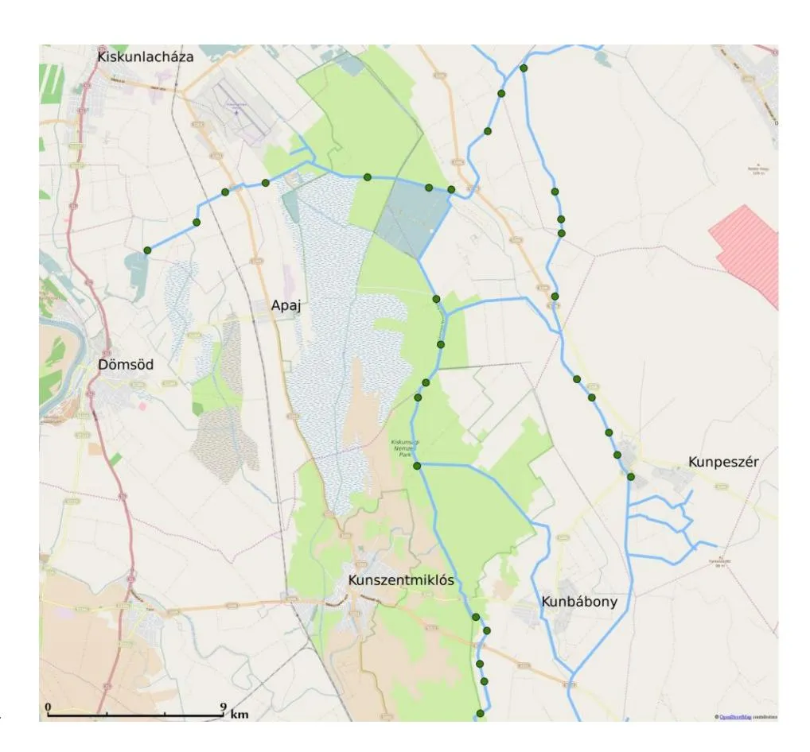
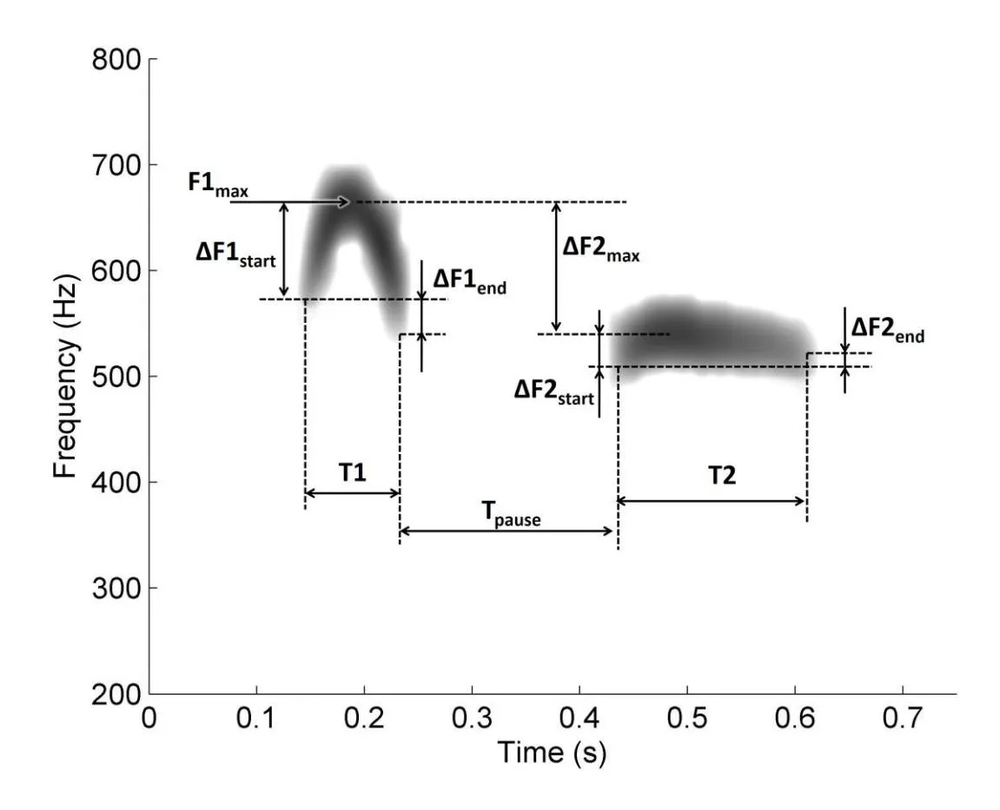
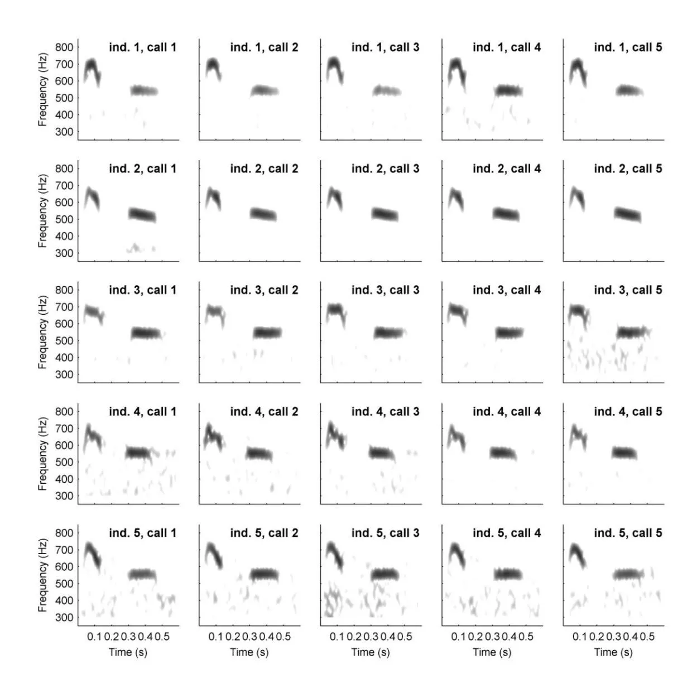
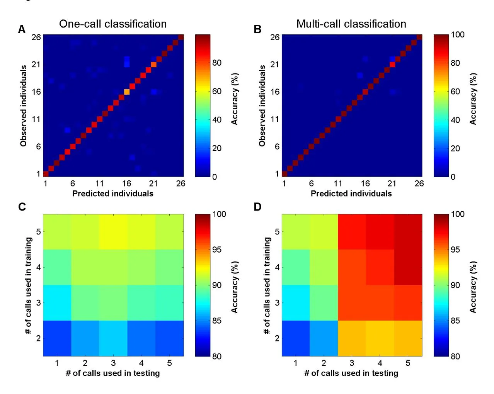
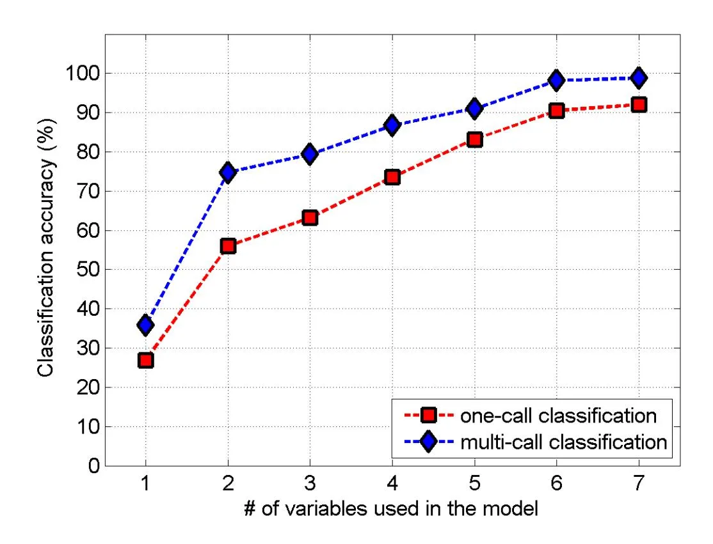

# **Individually distinctive vocalization in Common Cuckoos**

**(\***Cuculus canorus**\*)**

> **Sándor Zsebők1 , Csaba Moskát2 , Miklós Bán3**\*

- Behavioural Ecology Group, Department of Systematic Zoology and Ecology, Eötvös
- University, H-1117 Budapest, Pázmány P. sétány 1/C., Budapest, Hungary
- MTA-ELTE-MTM Ecology Research Group, Hungarian Academy of Sciences, a joint
- research group of the Biological Institute of Eötvös Loránd University, Budapest, Pázmány
- Péter sétány 1/C., H-1117 Budapest, Hungary and the Hungarian Natural History Museum,
- Baross u. 13., Budapest, H-1088, Hungary
- MTA-DE "Lendület" Behavioural Ecology Research Group, Department of Evolutionary
- Zoology, University of Debrecen, Debrecen, H-4010, Hungary

\* Corresponding Author: Miklós Bán, banm@vocs.unideb.hu

- _Keywords:_ Common Cuckoo, _Cuculus canorus_, sound analysis, individual discrimination,
- classification accuracy, acoustic signatures

Word count: 5,932

# **ABSTRACT**

Distinctive individual vocalizations are advantageous in several social contexts. Both genetic and environmental effects are responsible for this phenomenon resulting in different frequencies and time domains of sounds in birds. This individuality can be utilized in breeding bird censuses and abundance estimates. In this study we explored the individuality of the advertisement calls of male Common Cuckoos (_Cuculus canorus_) with the aims of describing the acoustic ways in which individuals differ from each other, and characterizing the practical requirements for using statistical learning methods for individual recognition. We collected calls from a Hungarian cuckoo population and conducted discriminant function analysis on acoustic parameters to distinguish individuals. We show that individuals differ in both the frequency and time of their calls, most importantly in maximum frequency of the first syllable. Our discrimination of the male calls of 26 individuals was almost 100% accurate, and even when the number of samples was reduced to five calls per individual, and the number of acoustic parameters was decreased to five variables, accuracy still exceeds 90%. Thus, because our acoustic individual discriminaton technique is easy to perform and can be readily automated, it will be applicable to a wide range of ecological and behavioural studies.

# **INTRODUCTION**

sequences (Knudsen and Gentner 2010).

| 1   | 7   |
| --- | --- |
| 4   | /   |

Individuality in call characteristics can be adaptive in several communication contexts (Lambrechts and Dhondt 1995; Tibbetts and Dale 2007), including parent-offspring recognition in species with dense colonies (e.g., King Penguin _Aptenodytes patagonicus_; Lengagne et al. 2001), or re-establishing pair-bonds in species with large colonies (e.g., Kittiwake _Rissa tridactyla_; Aubin et al. 2007; Blue-footed Booby _Sula nebouxii_; Dentressangle et al. 2012). Unique calls are also advantageous for territorial species to enable the recognition of neighbours (the 'dear enemy theory'; Fisher 1954); this has been shown to occur, for example, in Black Redstarts _Phoenicurus ochruros_ (Draganoiu et al. 2014) and Willow Warblers _Phylloscopus trochilus_ (Jaska et al. 2015). Indeed, vocal individuality may be especially advantageous in contexts where visual signals are unuseable, like in rainforests (e.g., White-browed Warbler _Basileuterus leucoblepharus_; Aubin et al. 2004; Screaming Piha _Lipaugus vociferans_; Fitzsimmons et al. 2008), in meadows where there is tall grass (e.g., Corncrake _Crex crex_; Rek and Osiejuk 2011), or birds that are active at night (e.g., Great Horned Owl _Bubo virginianus_; Odom et al. 2013). Individually distinctive vocalization is likely essential for long distance communication, as in the boom call of the Grey Crowned Crane _Balearica regulorum gibbericeps_ (Budde 2001) or the European Bittern _Botaurus stellaris_ (McGregor and Byle 1992). Individual recognition in birds, however, depends on two conditions: (i) inter-individual variation of the signaller's vocalization has to be larger than the intra-individual variation, and (ii) receivers must possess the ability to discriminate individuals (Tibbetts and Dale 2007). The factors responsible for individually distinct vocalization include differences in anatomical structures of the vocal organs and control of sound production (Ballintijn et al. 1995; Goller and Riede 2013). Additionally, in some bird taxa (passerines, hummingbirds and parrots) vocal individuality can also be developed, or modified, via learning, that has two main sources: (i) social modification, and; (ii) learned acquisition (Boughman and Moss 2003). Therefore individuals may differ both in time and frequency parameters (e.g., Aubin et al. 2004; Volodin et al. 2005), and in the composition of their signals (e.g., Kiefer et al. 2014). From the viewpoint of the receiver, birds in general can perceive a change of less than 1% pure tone frequency, and 10-20% difference in signal duration (Dooling 1982), while species of oscine passerines possess elaborate cognitive capabilities even to discriminate syllable

In this paper, we focus on the individual acoustic signals of the Common Cuckoo (_Cuculus canorus_; hereafter "cuckoo"), a brood parasitic species distributed across the Palearctic region and subdivided into several subspecies (Payne 2005). Cuckoos specialize on different host species, so they are classified into 'host-specific races', or 'gentes'. These gentes show differences in egg phenotypes, as these are adapted to resemble those of their hosts (i.e., egg mimicry; Dawkins and Krebs 1979; Davies 2000). The advertising call of male cuckoos also shows a highly stereotypical acoustic structure with two notes ("cu-coo") across their whole distribution area (Lei et al. 2005; Wei et al. 2015), although quantitative features may vary by health condition of individuals (Mller et al. 2016), between subspecies (Wei et al. 2015), gentes, and populations (Fuisz and de Kort 2007), with increasing variation with geographic distance (Wei et al. 2015). Regarding the taxonomic status of cuckoos we expect that cuckoos do not learn their advertising calls (c.f. Catchpole and Slater 2008), but genetic and environmental effects might generate individually distinctive call characteristics. Our interest in studying cuckoo calls is two-fold: (i) to explore the biological aspect of acoustic individuality, and; (ii) to apply this phenomenon to research and nature conservation. The breeding behaviour of the Common Cuckoo suggests that individual discrimination plays important role in intra-specific sexual selection. It is believed that male cuckoos are

territorial (Payne 2005), therefore it seems advantageous for them to discriminate between their neighbours and intruders (the 'dear-enemy' theory, see above). Indeed, Lei et al. (2005) worked with a much smaller sample (ten individuals) and suggested that male cuckoo advertising calls show consistent inter-individual differences. Jung et al. (2014) later examined nine individuals and also found that inter-individual variance in call parameters is higher than within individuals and might thus be important for discrimination. However, these previous hypotheses were not tested quantitatively using learning algorithms to see if individual cuckoos really can be discriminated on the basis of their calls and how to do it in practice.

More generally, there is emerging interest in the use of acoustic methods in conservation (Laiolo 2010). Discrimination (distinguish individuals at a time) and identification (recognize individuals on a longer time scale) based on acoustic features can provide a non-invasive approach useful to different investigations (Terry et al. 2005). There are examples of the use of such approaches for abundance estimates in Ortolan Buntings _Emberiza hortulana_ (Adi et al. 2010), censuses of European Bitterns and Black-throated Divers _Gavia arctica_ (Gilbert et al. 1994), Corncrakes (Peake and McGregor 2001; Budka

and Kokocinski 2015), and Woodcock _Scolopax rusticola_ (Hoodless et al. 2008). These methods are especially important in species where visual inspection is impaired like in dense habitat or in animals active at night. Cuckoos are quite drab and timid birds, so the use of color-tagged individuals for individual identification is challenging. Other techniques such as ringing, individual tagging, and radio telemetry may cause disturbances (Sutherland et al. 2004). If a male advertising call can be heard from a distance, as for instance in cuckoos, it offers a potential solution for acoustic identification of individuals that might help in studies where we want to follow the individuals without any disturbance in observing their natural behaviour.

In this study, we investigated acoustic individuality in the advertising calls of male Common Cuckoos. Our main objectives were: (1) to describe the individually distinctive parameters of these calls; (2) to test whether individuals can be discriminated by these parameters; (3) to determine how sample size and number of measured acoustic parameters affects the feasibility of using this method for a range of applications. To achieve these aims, we recorded and analysed calls from a cuckoo population, applied Discriminant Function Analysis (DFA) in a cross-validation framework, and interpreted the results from theoretical and practical viewpoints.

# **METHODS**

# **Study area and sound recording**

This study was conducted in the surroundings of Apaj (47°07N; 19°060E), ca. 50 km south of Budapest, Hungary, where the density of breeding Common Cuckoos is high and there is a ca. 50% parasitism rate (i.e. 50% of host nests contain at least one cuckoo egg; Zölei et al. 2015). In this area, cuckoos are mainly distributed along linearly-structured irrigation channels where trees are available for perching, and where these birds parasitize Great Reed Warbler _Acrocephalus arundinaceus_ clutches (Moskát and Honza 2000) (Fig. 1).

We recorded cuckoo sounds for five days between May 15th and 22nd, 2013, in the mornings (6-11 h CET), and late afternoons (16-20 h CET), using a Telinga parabola dish with a Sennheiser ME62 microphone and K6 preamplifier on a Tascam DR1 handheld digital recorder (48 kHz sampling rate, 16 bit quality). We then later transferred recorded calls to a PC for sound analysis (see below). Each cuckoo call was recorded from about a 20-30 m

distance, reasonable for this species and as done by Fuisz and de Kort (2007), and Wei et al. (2015).

During the recording process we tried to record individual cuckoos just once by sampling the whole area along channels, walking the banks in one direction only over a short time (2-3 hours), while visually following the movement of birds. This meant that we met and recorded just new cuckoos, but to avoid doubt we did not record when uncertain to avoid duplicating data points. As we sampled each channel section just once within the study period, and radio telemetry revealed that cuckoos stayed in relatively short sections along the channels (typically < 1 km; our unpublished results; our unpublished results), we have a high probability of confidence that we recorded each individual just once. The spatial distribution of recorded individuals used for analyses is shown on the survey map of the area (Fig. 1).

# **Sound analysis**

Although a total of 29 individuals (3-11 individuals per day) were recorded, we present recordings of just 26 birds with a minimum of 10 good quality calls (i.e., with low background noise).

We then manually segmented the two syllables of each cuckoo calls (as done by Lei et al. 2005; Fuisz and de Kort 2007; Jung et al. 2014; Wei et al. 2015), and measured each syllable automatically in the following way: first, we searched for maximum syllable intensity in the spectrogram, and then the start and end points each syllable were determined at a 20 dB level lower than the maximum. Accordingly, we got comparable syllable parameters independently of the absolute intensity of the calls and the background noise level (Zollinger et al. 2012). The 20 dB limit was chosen, because at this level the characteristics of all syllable shapes were explicit and at the same time they were above the actual background level on all recordings.

In the next step, we measured several parameters of calls that characterize frequency structure and time domain in a similar manner to previous studies (Lei et al. 2005; Fuisz and de Kort 2007; Jung et al. 2014; Wei et al. 2015). Syllable frequencies were measured at the starting point (i.e., F1start in the first syllable, and F2start in the second syllable), at the end (i.e., F1end and F2end) of each syllable, and at maximum frequency (F1max and F2max). The length of both syllables (T1 and T2), and the pause (Tpause) between the two syllables in the call, were also measured. We found four highly correlating (r > 0.7) such pairs of parameters.

Based on these nine basic measurements, we derived a series of new variables based on their differences (Fig. 2); because we expect lower correlations between these new variables than when absolute frequencies are used, our approach is more effective in characterizing the shape of syllables. Although a similar approach was used by Fuisz and de Kort (2007), we derived five new parameters in this study, retaining four basic variables from the earlier study (Fuisz and de Kort 2007). Relative starting frequency of syllables was calculated as the difference between maximum frequency and starting frequency (i.e., ΔF1start = F1start - F1max for the first syllable, and ΔF2start = F2start - F2max for the second syllable). The relative ending frequency (ΔF1end and ΔF2end) was taken as the difference between the ending frequency and starting frequency (ΔF1end = F1end - F1start and ΔF2end = F2end - F2start). We used the absolute frequency measurement for the first syllable (F1max) and a relative measurement for the second syllable (ΔF2max = F2max - F1max) to characterize the maximum frequency in each syllable. Beside of these six frequency parameters we used the T1, T2 and Tpause time parameters to describe the characteristics of cuckoo calls, altogether resulting in nine parameters used in subsequent analyses (Fig. 2), where we found no highly correlating pairs of parameters.

All measurements were taken using 2048 point-length FFT and Hann window with 98% overlap while syllable segmenting and all acoustic analyses were conducted with the help of self-written scripts in the Matlab 2013 (The MathWorks Inc.) environment using the Signal Processing Toolbox (Version 6.19).

# **Statistical analyses**

In order to choose the most appropriate variables for sound classification, we calculated the intra-individual and between-individual coefficients of variations in each parameter using the formula CV = 100 \* (1 + 1 / (4 \* n)) \* SD / mean, where n is sample size and SD is standard deviation (Sherrer 1984; Sokal and Rohlf 1995). For the intra-individual coefficient of variation (CVi), we computed CV for each individual based on all calls belonging to an individual and then calculated the mean of all CVs; for the between-individual coefficient of variation (CVb), we used the mean parameter value from all individuals. The ratio of CVb/CVi is the measure of Potential Individual Coding ("PIC", Charrier et al. 2001; Mathevon et al. 2003; Favaro et al. 2015), which shows the importance of a given parameter. We decided to involve a parameter in the classification procedure if its PIC value was greater than 1. This

means that the inter-individual variation is higher than the intra-individual variation expressed by this parameter, suggesting that the actual parameter can be used for detecting individuality (Charrier et al. 2001). Based on this criterion, just ΔF1end and ΔF2start were excluded, so therefore we used seven out of the nine variables for classification. To evaluate these seven variables, we conducted a linear Discriminant Function Analysis (DFA) for 10 randomly chosen calls for each individual, and then calculated the Bartlett's approximate chi-squared statistic to test the canonical correlation coefficients.

For classification of calls in the first step, 10 calls were randomly chosen for each individual, and then two different classification procedures were used: a one-call classification, and a multi-call classification.

For the one-call classification, following a 10-fold cross-validation procedure (Stone 1974), we divided data into a training dataset with nine calls and test dataset with one call from each individual in each round. We used DFA on the training dataset to classify calls, and then the DFA model was applied to the test dataset. After 10 cycles of the 10-fold cross- validation, we repeated the whole process using a randomly sampled set of 10 calls from the pool of calls for each individual. After 100 repetitions of cross-validation, we summarized the results in a contingency table (called a confusion matrix) representing the class predictions with respect to the actual outcome, and calculated the mean percent of true positive cases.

In the multi-call classification we divided the 10 calls of an individual into five training and five test calls. Then, similarly to the one-call classification, we taught and then tested the DFA model, repeating these steps 10 times. In each cycle, we assigned calls to the individual bird that had more classified calls, and repeated the whole cross-validation process 100 times, using randomly sampled 10 calls from the pool of calls of each individual. We calculated the results in the same way to the one-call classification.

In the next step we studied how the sizes of the training and testing datasets influence our classification results both in the one-call and multi-call cases. In each round we chose randomly two to five calls from the training dataset from each individual to train the DFA model, and one to five calls from the testing dataset to validate the model. We repeated the whole process 100 times, and calculated the accuracy for all possible pairwise combinations of the training and testing samples.

We also computed the accuracy of one-call and multi-call classifications, based on the different number of variables. These were ordered increasingly, based on their PIC value, and in each step we increased the number of variables by one in the DFA model. This means that

in the one-variable model only the variable with the highest PIC value was included, but in the seven-variable model all seven original variables were used. We plotted the classification accuracy against the increasing number of variables.

All statistical analyses were carried out in MATLAB 2013, using the Statistical Toolbox (Version 8.2) and the RAFISHER2CDA Canonical Discriminant Analysis Toolbox (Trujillo-Ortiz et al 2004).

#### **RESULTS**

We analysed 1489 calls related to 26 individuals (57.3 ± 39.9 in mean ± SD calls per individual) for subsequent analyses. In general, the first syllable of the call has a reversed U- shape frequency contour between 600 and 750 Hz, while the second syllable has a quasi- constant frequency in the range 500-600 Hz. These two syllables, including a short pause between them, covers an about 0.17 second period (Table 1). The calls were repeated regularly (1.34 ± 0.17 calls/min in mean ± SD).

By visual inspection of spectrograms, the intra-individual variability of call structure appears to be less than inter-individual variability, but both the shape and peak frequencies show considerable differences (Fig. 3). For seven variables (F1max, ΔF2max, ΔF2end, Tpause, T2, T1, ΔF1start) the PIC was higher than 1 (Table 1). The parameter with the highest PIC value was F1max, suggesting that this parameter contributes most to individually distinctive vocalization, and thus may play a key role in the classification of individuals. In the DFA, all seven canonical variables proved to be significant, therefore we retained them in the model (χ2 -test, p<0.001 for all canonical roots).

Our cross-validation procedure of one-call classification had a 92% accuracy using the seven chosen variables (Fig. 4A), while our multi-call classification was 98% accurate (Fig. 4B). We also reveal the role of sample size in the training and testing procedure: In the one- call classification, we found that by using two calls as a minimum to train, and one call to test the model was adequate to 82% accuracy; and with at least four calls to train and two calls to test the model we achieved over 90% accuracy (Fig. 4C). The multi-call classification gave better results than one-call classification with minimum accuracy of 96% when using a minimum of three calls both to train and test the model (Fig. 4D).

We also investigated the importance of the number of variables used in the classification procedure: Accuracy of classification increased with increasing number of variables, higher in the multi-call classification than in the one-call classification (Fig. 5) across all variables. We found the largest jump in saturation curves between the cases when one and two variables were used in the models; using just five variables, the one-call classification yields more than 80% accuracy on average (CI: 76.9-87.3 %), while the multi- call classification model reaches 95% accuracy on average (CI: 80.8-100%). When we randomly allocate calls to individuals, accuracy is just 3.85% and demonstrates the effectiveness of the use of DFA for classification.

# **DISCUSSION**

In general, we found that male cuckoos use individually distinct advertisement calls that can be unambiguously discriminated by DFA classification. Overall frequency and time parameters show a large degree of agreement with previous studies, supporting the idea that the male's advertisement call in this species is highly consistent throughout its distribution area (Lei et al. 2005; Jung et al. 2014; Wei et al. 2015).

We found that individuality is encoded in both frequency and time domain. In this cuckoo species, in accordance with our study, both Lei et al. (2005) and Jung et al. (2014) found that the frequency and time parameters of advertisement calls are individually distinctive. This multi-parametric individual coding is generally found in acoustic bird studies resulting in diverse solutions for conveying safe signal transfer in the acoustic space. Individuality might be coded by frequency modulation and signal duration as in the King Penguin (Lengagne et al. 2001), or by frequency gaps between the signal components and their positions as in the White-browed Warbler (Aubin et al. 2004). However, in the Corncrake (Budka and Osiejuk 2013) individuality seems to be encoded by pulse-to-pulse duration, while in the Blue-footed Booby*,* males are mainly time-coded, but females are frequency coded individually, two different solutions for acoustic individual recognition in large and noisy breeding colonies (Dentressangle et al. 2012).

The highest frequency (F1max) of the first syllable is the most important parameter we found in the individual discrimination (i.e. with the highest PIC value). Interestingly, this parameter seems to have less importance in causing habitat and population differences: Fuisz and de Kort (2007) suggested that cuckoos from different habitats and/or different gentes mostly differ in the absolute frequency parameters of the second syllable. Wei et al (2015) found differences in the bandwidth of the second syllable that can be attributed to habitat, while population differences are best explained by the lowest frequency of the first syllable, the frequency band of the second syllable, and time parameters (Fuisz and de Kort 2007). Our results suggest that individual differences are mainly coded in the highest frequency parts of the first syllable, and so generate high inter-individual variation in a population. Consequently, inter-population and inter-gens differences are not expressed in the highest frequency of the first syllable of the "cu-coo" calls.

We found that the seven acoustic parameters allowed nearly perfect individual discrimination of cuckoos, especially when several calls from a calling sequence were used. Indeed, even using less variables this method might be feasible, as with five variables the classification accuracy still reached 90%. From a practical point of view, five out of seven variables (F1max, ΔF2max, Tpause, T2, T1) are reasonably easy to extract using automatic segmenting and measuring (e.g. with the programs Avisoft SASLab Pro or Raven Pro). Consequently, the whole discrimination process can readily be automated which may help the use of this simple method for the discrimination of cuckoo individuals in a population. We show that three calls from a male could be adequate both to teach the statistical model and test it later to reach a 90% level of accuracy; this seems an attainable amount of sound samples from individual cuckoos in the field.

Theoretically, we cannot exclude the case when a high number of cuckoos are presented in a small area, making individual discrimination more difficult. However, the density of cuckoos in the breeding season cannot reach extremely high values because of their need for host nests for reproduction, and the availability of suitable nests limits brood parasites' density. This statement is also valid for our site where parasitism rate of Common Cuckoos seems to be permanently the highest in the world. About 50-64% of Great Reed Warbler clutches are parasitized here (Zölei et al. 2015), where the Great Reed Warbler was found to be the only host species currently parasitized. We believe that if our method of cuckoos' discrimination by sound works here, this method should also work at lower cuckoo densities.

Cuckoo males frequently use their advertising calls in the breeding season (Payne 2005), therefore in this period it seems feasible to apply the acoustic method for census and abundance estimation similarly to studies used in other species (Gilbert et al. 1994; Peake and McGregor 2001; Hoodless et al. 2008; Adi et al. 2010; Budka and Kokocinski 2015). To use an acoustic method for individual tracking over a longer period, however, additional examination is needed to reveal how a given signal changes with time (Mennill 2011). In this case, the task is not only to discriminate the individuals, but also to identify them. Several studies have already focused on this question, for example in Corncrakes (Budka et al. 2015), European Eagle Owls _Bubo bubo_ (Grava et al. 2008), European Bitterns, Black-throated Divers (Gilbert et al. 1994), and Mexican Ant-thrushes _Formicarius moniliger_ (Kirschel et al. 2011). Individually distinct vocalization can also be used for the estimation of survival and population responses (Pollard et al. 2010). The fundamental frequency of acoustic signals depends not only on the anatomical structures of the syrinx, but also on the operation of the syringeal muscles and air sac pressure (Goller and Riede 2013) under neural control. For this reason, the general physiological state of the individual, hormonal status, and social context may influence advertisement call characteristics, as in the song of the Zebra Finch _Taeniopygia guttata_, where fundamental frequency is influenced by the food availability (Ritschard and Brumm 2012). We argue that further studies could clarify how intra-individual acoustic signals change over time, as well as how the social structure of cuckoos may affect the acoustic parameters of individuals. Also, further experimental studies are needed to test if cuckoos are able to discriminate each other by sound and use this information in their decision making regarding territoriality and in their social behaviour.

# **ACKNOWLEDGMENTS**

We thank Gareth Dyke for editing the manuscript. All work complied with the Hungarian laws, and was approved by the Middle-Danube-Valley Inspectorate for Environmental Protection, Nature Conservation and Water Management, Budapest. SZ was supported by the National Research, Development and Innovation Office (NKFIH, PD-115730). The study was also supported by the National Research, Development and Innovation Office, Hungary to CM (grant No. NN118194).

#### **LITERATURE CITED**

Adi K, Johnson MT, Osiejuk TS (2010) Acoustic censusing using automatic vocalization

| 375 | classification and identity recognition. J Acoust Soc Am 127:874–883                          |
| --- | --------------------------------------------------------------------------------------------- |
| 376 | Aubin T, Mathevon N, Silva ML da, Vielliard JME, Sebe F (2004) How a simple and               |
| 377 | stereotyped acoustic signal transmits individual information: the song of the White           |
| 378 | browed Warbler Basileuterus leucoblepharus. An Acad Bras Cienc 76:335–344                     |
| 379 | Aubin T, Mathevon N, Staszewski V, Boulinier T (2007) Acoustic communication in the           |
| 380 | Kittiwake Rissa tridactyla: potential cues for sexual and individual signatures in long       |
| 381 | calls. Polar Biol 30:1027–1033                                                                |
| 382 | Ballintijn MR, ten Cate C, Nuijens FW, Berkhoudt H (1995) The syrinx of the collared dove  |
| 383 | (Streptopelia decaocto): Structure, inter-individual variation and development.               |
| 384 | Netherlands J Zool 45:455–479                                                                 |
| 385 | Boughman JW, Moss CF (2003) Social sounds: vocal learning and development of mammal           |
| 386 | and bird calls. In: Simmons A, Fay R, Popper A (eds) Acoustic communication.                  |
| 387 | Springer, New York, pp. 138–224                                                               |
| 388 | Budde C (2001) Individual features in the calls of the Grey Crowned Crane, Balearica          |
| 389 | regulorum gibbericeps. Ostrich 72:134–139                                                     |
| 390 | Budka M, Kokocinski P (2015) The efficiency of territory mapping, point-based censusing,      |
| 391 | and point-counting methods in censusing and monitoring a bird species with long-range         |
| 392 | acoustic communication - the Corncrake Crex crex. Bird Study 62:153–160                    |
| 393 | Budka M, Osiejuk TS (2013) Neighbour-stranger call discrimination in a nocturnal rail         |
| 394 | species, the Corncrake Crex crex. J Ornithol 154:685–694                                      |
| 395 | Budka M, Wojas L, Osiejuk TS (2015) Is it possible to acoustically identify individuals       |
| 396 | within a population? J Ornithol 156:481–488                                                   |
| 397 | Catchpole CK, Slater PJB (2008) Bird songs. Biological themes and variations. 2nd edition. |
| 398 | Cambridge University Press, Cambridge, U.K.                                                   |
| 399 | Charrier I, Mathevon N, Jouventin P (2001) Individual identity coding depends on call type in |
| 400 | the South Polar Skua Catharacta maccormicki, Polar Biol. 24; 378–382                          |
| 401 | Davies NB (2000) Cuckoos, cowbirds and other cheats. T & AD Poyser, London                    |
| 402 | Dawkins R, Krebs JR (1979) Arms races between and within species. Proc R Soc London, Ser      |
| 403 | B 205:489–511                                                                                 |
| 404 | Dentressangle F, Aubin T, Mathevon N (2012) Males use time whereas females prefer             |
| 405 | harmony: individual call recognition in the dimorphic blue-footed booby. Anim Behav           |
| 406 | 84:413–420                                                                                    |
| 407 | Dooling RJ (1982) Auditory perception in birds. In: Kroodsma DE, Miller EH, Ouellet H         |

| 408 | (eds) Acoustic communication in birds. Academic Press, pp. 95–130.                             |
| --- | ---------------------------------------------------------------------------------------------- |
| 409 | Draganoiu TI, Moreau A, Ravaux L, Bonckaert W, Mathevon N (2014) Song stability and            |
| 410 | neighbour recognition in a migratory songbird, the Black Redstart. Behaviour 151:435–          |
| 411 | 453                                                                                            |
| 412 | Favaro L, Gamba M, Alfieri C, Pessani D, McElligott AG (2015) Vocal individuality cues in   |
| 413 | the African Penguin (Spheniscus demersus): a source-filter theory approach. Sci Rep 5:         |
| 414 | 17255                                                                                          |
| 415 | Fisher J. 1954. Evolution and bird sociality. pp. 71–83. In: Huxley J, Hardy AC, Ford EB,      |
| 416 | editors. Evolution as a process. Allen & Unwin, London, U.K.                                   |
| 417 | Fitzsimmons LP, Barker NK, Mennill DJ (2008) Individual variation and lek-based vocal          |
| 418 | distinctiveness in songs of the Screaming Piha (Lipaugus vociferans), a suboscine              |
| 419 | songbird. Auk 125:908–914                                                                      |
| 420 | Fuisz TI, de Kort SR (2007) Habitat-dependent call divergence in the common cuckoo: is it a |
| 421 | potential signal for assortative mating? Proc R Soc B-Biological Sci 274:2093–2097             |
| 422 | Gilbert G, McGregor PK, Tyler G (1994) Vocal individuality as a census tool - practical     |
| 423 | considerations illustrated by a study of 2 rare species. J Field Ornithol 65:335–348           |
| 424 | Goller F, Riede T (2013) Integrative physiology of fundamental frequency control in birds. J   |
| 425 | Physiol - Paris 107:230–242                                                                 |
| 426 | Grava T, Mathevon N, Place E, Balluet P (2008) Individual acoustic monitoring of the           |
| 427 | European Eagle Owl Bubo bubo. Ibis 150:279–287                                                 |
| 428 | Hoodless AN, Inglis JG, Doucet JP, Aebischer NJ (2008) Vocal individuality in the roding       |
| 429 | calls of Woodcock Scolopax rusticola and their use to validate a survey method. Ibis        |
| 430 | 150:80–89                                                                                      |
| 431 | Jaska P, Linhart P, Fuchs R (2015) Neighbour recognition in two sister songbird species with   |
| 432 | a simple and complex repertoire - a playback study. J Avian Biol 46:151–158                 |
| 433 | Jung WJ, Lee JW, Yoo JC (2014) "cu-coo": Can you recognize my stepparents? - A study of     |
| 434 | host-specific male call divergence in the Common Cuckoo. PLoS one. 9(3): e90468                |
| 435 | Kiefer S, Scharff C, Hultsch H, Kipper S (2014) Learn it now, sing it later? Field and         |
| 436 | laboratory studies on song repertoire acquisition and song use in nightingales. Naturwiss      |
| 437 | 101:955–963                                                                                    |
| 438 | Kirschel ANG, Cody ML, Harlow ZT, Promponas VJ, Vallejo EE, Taylor CE (2011)                   |
| 439 | Territorial dynamics of Mexican Ant-thrushes Formicarius moniliger revealed by              |
| 440 | individual recognition of their songs. Ibis 153:255–268                                        |

| 441 | Knudsen DP, Gentner TQ (2010) Mechanisms of song perception in oscine birds. Brain Lang        |
| --- | ---------------------------------------------------------------------------------------------- |
| 442 | 115:59–68                                                                                      |
| 443 | Laiolo P (2010) The emerging significance of bioacoustics in animal species conservation.      |
| 444 | Biol Conserv 143:1635–1645                                                                     |
| 445 | Lambrechts M, Dhondt A (1995) Individual voice discrimination in birds. In: Power D (ed)       |
| 446 | Current Ornithology. Springer US, pp. 115–139                                                  |
| 447 | Lei F-M, Zhao H-F, Wang A-Z, Yin Z-H, Payne RB (2005) Vocalizations of the common           |
| 448 | cuckoo Cuculus canorus in China. Acta Zool Sinica 51:31–37                               |
| 449 | Lengagne T, Lauga J, Aubin T (2001) Intra-syllabic acoustic signatures used by the king        |
| 450 | penguin in parent-chick recognition: An experimental approach. J Exp Biol 204:663–672          |
| 451 | Mathevon N, Charrier I, Jouventin P (2003) Potential for individual recognition in acoustic    |
| 452 | signals: a comparative study of two gulls with different nesting patterns. Comptes             |
| 453 | Rendus Biologies 326:329–337                                                                   |
| 454 | McGregor PK, Byle P (1992) Individually distinctive bittern booms: potential as a census       |
| 455 | tool. Bioacoustics 4:93–109                                                                    |
| 456 | Mennill DJ (2011) Individual distinctiveness in avian vocalizations and the spatial monitoring |
| 457 | of behaviour. Ibis 153:235–238                                                                 |
| 458 | Mller AP, Morelli F, Mousseau TA, Tryjanowski P (2016) The number of syllables in          |
| 459 | Chernobyl cuckoo calls reliably indicate habitat, soil and radiation levels. Ecol Indic        |
| 460 | 66:592–597                                                                                     |
| 461 | Moskát C, Honza M (2000) Effect of nest and nest site characteristics on the risk of cuckoo    |
| 462 | Cuculus canorus parasitism in the Great Reed Warbler Acrocephalus arundinaceus.             |
| 463 | Ecography 23:335–341                                                                           |
| 464 | Odom KJ, Slaght JC, Gutierrez RJ (2013) Distinctiveness in the territorial calls of Great      |
| 465 | Horned Owls within and among years. J Raptor Res 47:21–30                                      |
| 466 | Payne RB (2005) The cuckoos. Oxford University Press, Oxford                                   |
| 467 | Peake TM, McGregor PK (2001) Corncrake Crex crex census estimates: A conservation           |
| 468 | application of vocal individuality. Anim Biodivers Conserv 24:81–90                            |
| 469 | Pollard KA, Blumstein DT, Griffin SC (2010) Pre-screening acoustic and other natural           |
| 470 | signatures for use in noninvasive individual identification. J Appl Ecol 47:1103–1109          |
| 471 | Rek P, Osiejuk TS (2011) No male identity information loss during call propagation through     |
| 472 | dense vegetation: The case of the Corncrake. Behav Processes 86:323–328                     |
| 473 | Ritschard M, Brumm H (2012) Zebra Finch song reflects current food availability. Evol Ecol     |

| 474 | 26:801–812                                                                                      |
| --- | ----------------------------------------------------------------------------------------------- |
| 475 | Sherrer B (1984) Biostatistique. Gaetan Morin, Chicoutimi, Quebec, Canada                       |
| 476 | Sokal RR, Rohlf FJ (1995) Biometry, 3rd ed. Freeman, New York                                   |
| 477 | Stone M (1974) Cross-Validatory Choice and Assessment of Statistical Predictions. J R Stat      |
| 478 | Soc. Series B (Methodological) 36:111–147                                                    |
| 479 | Sutherland W, Newton I, Green R (2004) Bird ecology and conservation: A handbook of             |
| 480 | techniques. Oxford University Press, Oxford, U.K.                                            |
| 481 | Terry AMR, Peake TM, McGregor PK (2005) The role of vocal individuality in conservation.        |
| 482 | Front Zool 2:10                                                                                 |
| 483 | Tibbetts EA, Dale J (2007) Individual recognition: it is good to be different. Trends Ecol Evol |
| 484 | 22:529–537                                                                                      |
| 485 | Trujillo-Ortiz A, Hernandez-Walls R, Perez-Osuna S (2004) RAFisher2cda: canonical               |
| 486 | discriminant analysis. A Matlab file (available at                                           |
| 487 | http://www.mathworks.com/matlabcentral/fileexchange/4836-rafisher2cda)                          |
| 488 | Volodin IA, Volodina EV, Klenova AV, Filatova OA (2005) Individual and sexual                   |
| 489 | differences in the calls of the monomorphic White-faced Whistling Duck Dendrocygna              |
| 490 | viduata. Acta Ethol 40:43–52                                                                    |
| 491 | Wei C, Jia C, Dong L, Wang D, Xia C, Zhang Y, Liang W (2015) Geographic variation in the        |
| 492 | calls of the Common Cuckoo (Cuculus canorus): isolation by distance and divergence              |
| 493 | among subspecies. J Ornithol 156:533–542                                                        |
| 494 | Zollinger SA, Podos J, Nemeth E, Goller F, Brumm H (2012) On the relationship between,          |
| 495 | and measurement of, amplitude and frequency in birdsong. Anim Behav 84:e1-e9                    |
| 496 | Zölei A, Bán M, Moskát C (2015) No change in Common Cuckoo Cuculus canorus                      |
| 497 | parasitism and Great Reed Warblers' Acrocephalus arundinaceus egg rejection after            |
|     |                                                                                                 |

seven decades. J Avian Biol 46:570–576

499 Table 1. Statistical summary of acoustic variables of Common Cuckoo calls. The parameters 500 are ordered in decreasing importance, according to their decreasing PIC value. "Mean" is the 501 average of individuals' mean values; "SD" is the standard deviation of individuals' mean 502 values, "min ; max" are the minimum and maximum of individuals' mean values, "CVi" is 503 the intra-individual coefficient of variation, "CVb" is the between-individual coefficient of 504 variation.

|               | mean  | SD    | min ; max     | CVi   | CVb   | PIC  |
| ------------- | ----- | ----- | ------------- | ----- | ----- | ---- |
| F1max (Hz) | 676   | 28    | 617 ; 748     | 1.4   | 4.2   | 2.97 |
| ΔF2max (Hz)   | -136  | 16    | -164 ; -114   | 6.3   | 12.2  | 1.94 |
| ΔF2end (Hz)   | 4     | 10    | -20 ; 19      | 150.6 | 277.3 | 1.84 |
| Tpause (s) | 0.179 | 0.015 | 0.152 ; 0.204 | 5     | 8.5   | 1.69 |
| T1 (s)        | 0.097 | 0.009 | 0.078 ; 0.129 | 5.8   | 9.6   | 1.67 |
| T2 (s)        | 0.160 | 0.016 | 0.128 ; 0.197 | 6.2   | 10    | 1.62 |
| ΔF1start (Hz) | -112  | 24    | -183 ; -61    | 20.1  | 21.4  | 1.07 |
| ΔF2start (Hz) | -23   | 8     | -38 ; -4      | 48.3  | 34.3  | 0.71 |
| ΔF1end (Hz)   | -9    | 18    | -49 ; 29      | 562.7 | 208.2 | 0.37 |

| 507        | Legend to figures                                                                               |
| ---------- | ----------------------------------------------------------------------------------------------- |
| 508        |                                                                                                 |
| 509 510 | FIGURE 1. Map of the sampling area. The localities of the 29 recordings are marked with      |
| 511        | dots on the map.                                                                                |
| 512        |                                                                                                 |
| 513        | FIGURE 2. Measured and derived call parameters used in the analyses                             |
| 514        |                                                                                                 |
| 515        | FIGURE 3. Sample sonograms of the "cu-coo" calls from 5 individuals with 5 samples each.        |
| 516        |                                                                                                 |
| 517        | FIGURE 4. The results of DFA classification. (A) Confusion matrix of one-call classification,   |
| 518        | (B) confusion matrix of multi-call classification. The hitmaps of the confusion matrices show   |
| 519        | the percentages of the correct classification in the main diagonal. (C) and (D) DFA             |
| 520        | classification using different number of train and test calls in the model. The hitmaps show    |
| 521        | sample size dependency of the classification accuracy in one-call classification (C) and multi  |
| 522        | call classification (D).                                                                        |
| 523        |                                                                                                 |
| 524        | FIGURE 5. The result of the DFA classification using different number of variables. The plot |
| 525        | shows the effect of the number of variables used in DFA. The variables were put into the        |
| 526        | models with their decreasing PIC values.                                                        |
| 527        |                                                                                                 |
| 528        |                                                                                                 |
| 529        |                                                                                                 |
| 530        |                                                                                                 |
| 531        |                                                                                                 |
|            |                                                                                                 |

### Figure 1

# Figure 2

#### Figure 3

Figure 4

Figure 5

