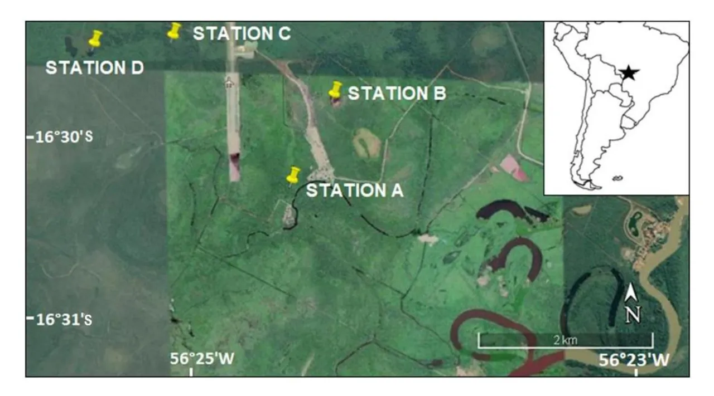
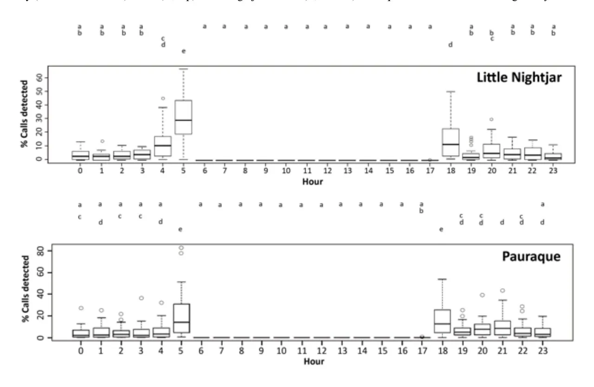
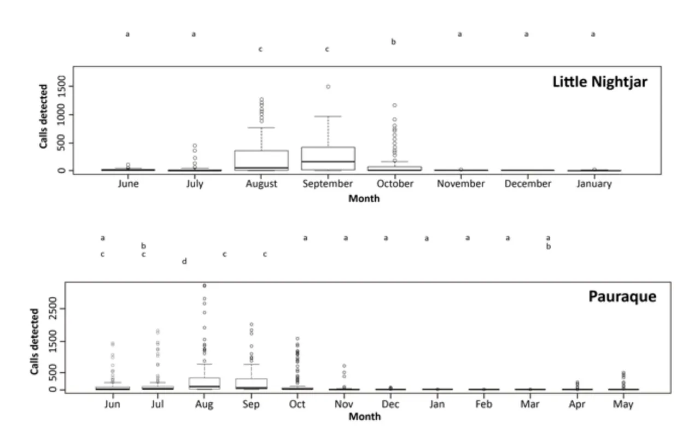

Supplemental Figure S1. Locations of the four acoustic monitoring stations in the Pantanal Matogrossense (Poconé municipality, Mato Grosso, Brazil). The inset shows the location of the study area (star) in Brazil. The Cuiabá River is shown in the lower-right corner of the image. The image was extracted from Google Earth on 31 March 2016. Scale bar: 2 km.

Supplemental Figure S2. Plot showing the results of Tukey's post hoc test for the factor Hour. Different letters mean significant differences in the calling activity (% of calls detected) of the (A, top) Little Nightjar and the (B, bottom) Pauraque between hours following Tukey's test.

Supplemental Figure S3. Plot showing the results of Tukey´s post hoc test for the factor Month. Different letters mean significant differences in the daily calling activity (number of calls) of the (A, top) Little Nightjar and the (B, bottom) Pauraque between months following Tukey's test.

Supplemental Table S1. Mean ± SD (and range) of the acoustic parameters of the call of the Little Nightjar and the Pauraque in the Pantanal Matogrossense (Brazil). A total of 50 and 58 calls of the Little Nightjar and the Pauraque, respectively, from eight different recordings were measured. Recordings were collected using a Song Meter SM2 recorder, and call measurements were made using Raven Pro 1.5.

| Species         | Duration (s) | Minimum        | Maximum        | Dominant       |     |
| --------------- | ------------ | -------------- | -------------- | -------------- | --- |
|                 |              | Frequency (Hz) | Frequency (Hz) | Frequency (Hz) |     |
| Little Nightjar | 1.34 ± 0.22  | 777.7 ± 137.6  | 3016.0 ± 211.0 | 2235.5 ± 243.5 |     |
|                 | (0.93 –      | (601.0 –       | (2737.6 –      | (1550 –        |     |
|                 | 1.65)        | 1238.1)        | 3598.3)        | 2670)          |     |
| Pauraque        | 0.46 ± 0.11  | 790.8 ± 172.1  | 2516.3 ± 173.3 | 2156.8 ± 188.2 |     |
|                 | (0.26 –      | (566.1 –       | (2240.3 –      | (1687.5 –      |     |
|                 | 0.66)        | 1217.7)        | 2717.3)        | 2437.5)        |     |

Supplemental Table S2. Number of Little Nightjar calls detected per hour at four monitoring stations in the Pantanal Matogrossense (Brazil). The total number and percentage of calls detected per month, with respect to the total number of calls, are also shown. Calling activity was monitored by acoustic monitoring from 8 June 2015 to 31 May 2016 at four acoustic recording stations, but the species was not detected at Station A.

| Hour | Station B | Station C | Station D | Total  | %    |
| ---- | --------- | --------- | --------- | ------ | ---- |
| 0    | 644       | 3,190     | 1,078     | 4,912  | 7.6  |
| 1    | 841       | 2,088     | 1,388     | 4,317  | 6.7  |
| 2    | 918       | 2,573     | 1,068     | 4,559  | 7.1  |
| 3    | 831       | 2,623     | 1,555     | 5,009  | 7.8  |
| 4    | 1,316     | 3,598     | 1,867     | 6,781  | 10.5 |
| 5    | 4,863     | 4,148     | 4,822     | 13,833 | 21.5 |
| 6    | 0         | 0         | 0         | 0      | 0    |
| 7    | 0         | 0         | 0         | 0      | 0    |
| 8    | 0         | 0         | 0         | 0      | 0    |
| 9    | 0         | 0         | 0         | 0      | 0    |
| 10   | 0         | 0         | 0         | 0      | 0    |
| 11   | 0         | 0         | 0         | 0      | 0    |
| 12   | 0         | 0         | 0         | 0      | 0    |
| 13   | 0         | 0         | 0         | 0      | 0    |
| 14   | 0         | 0         | 0         | 0      | 0    |
| 15   | 0         | 0         | 0         | 0      | 0    |
| 16   | 0         | 0         | 0         | 0      | 0    |
| 17   | 1         | 0         | 1         | 2      | 0.0  |
| 18   | 561       | 1,146     | 1,157     | 2,864  | 4.4  |
| 19   | 262       | 904       | 788       | 1,954  | 3.0  |
| 20   | 1,278     | 1,942     | 1,650     | 4,870  | 7.6  |
| 21   | 390       | 2,689     | 2,175     | 5,254  | 8.2  |
| 22   | 1,383     | 2,931     | 1,262     | 5,576  | 8.7  |
| 23   | 675       | 2,866     | 895       | 4,436  | 6.9  |

Supplemental Table S3. Number of Pauraque calls detected per hour at four monitoring stations in the Pantanal Matogrossense (Brazil). The total number and percentage of calls detected per month, with respect to the total number of calls, are also shown. Calling activity was monitored by acoustic monitoring from 8 June 2015 to 31 May 2016 at four acoustic recording stations.

| Hour | Station A | Station B | Station C | Station D | Total  | %    |
| ---- | --------- | --------- | --------- | --------- | ------ | ---- |
| 0    | 202       | 332       | 1,811     | 7,919     | 10,264 | 7.7  |
| 1    | 319       | 352       | 1,716     | 5,980     | 8,367  | 6.2  |
| 2    | 78        | 429       | 2,135     | 8,154     | 10,796 | 8.1  |
| 3    | 23        | 247       | 984       | 7,584     | 8,838  | 6.6  |
| 4    | 62        | 336       | 1,134     | 6,940     | 8,472  | 6.3  |
| 5    | 390       | 635       | 1,328     | 8,089     | 10,442 | 7.8  |
| 6    | 0         | 0         | 0         | 0         | 0      | 0    |
| 7    | 0         | 0         | 0         | 0         | 0      | 0    |
| 8    | 0         | 0         | 0         | 0         | 0      | 0    |
| 9    | 0         | 0         | 0         | 0         | 0      | 0    |
| 10   | 0         | 0         | 0         | 0         | 0      | 0    |
| 11   | 0         | 0         | 0         | 0         | 0      | 0    |
| 12   | 0         | 0         | 0         | 0         | 0      | 0    |
| 13   | 0         | 0         | 0         | 0         | 0      | 0    |
| 14   | 0         | 0         | 0         | 0         | 0      | 0    |
| 15   | 0         | 0         | 0         | 0         | 0      | 0    |
| 16   | 0         | 0         | 0         | 0         | 0      | 0    |
| 17   | 53        | 43        | 26        | 104       | 226    | 0.2  |
| 18   | 553       | 943       | 268       | 13,023    | 14,787 | 11.0 |
| 19   | 66        | 216       | 550       | 5,988     | 6,820  | 5.1  |
| 20   | 141       | 591       | 2,094     | 10,945    | 13,771 | 10.3 |
| 21   | 529       | 953       | 2,181     | 12,524    | 16,187 | 12.1 |
| 22   | 227       | 416       | 1,974     | 9,522     | 12,139 | 9.1  |
| 23   | 12        | 774       | 2,897     | 9,147     | 12,830 | 9.6  |

Supplemental Table S4. Number of Little Nightjar calls detected per month and station in the Pantanal Matogrossense (Brazil). The monthly percentage of calls detected per month, with respect to the total number of calls, is also shown. Calling activity was monitored by acoustic monitoring from 8 June 2015 to 31 May 2016 at four acoustic monitoring stations, but the species was not detected at Station A.

| Month          | Station B | Station C | Station D | Total  | %    |
| -------------- | --------- | --------- | --------- | ------ | ---- |
| June 2015      | 40        | 108       | 942       | 1090   | 1.7  |
| July 2015      | 1,550     | 121       | 628       | 2,299  | 3.6  |
| August 2015    | 7,111     | 10,359    | 7,560     | 25,030 | 39.0 |
| September 2015 | 4,552     | 10,062    | 9,631     | 24,245 | 37.7 |
| October 2015   | 171       | 9,762     | 576       | 10,509 | 16.4 |
| November 2015  | 214       | 111       | 116       | 441    | 0.7  |
| December 2015  | 191       | 84        | 85        | 360    | 0.6  |
| January 2016   | 134       | 91        | 34        | 259    | 0.4  |
| February 2016  | 0         | 0         | 0         | 0      | 0    |
| March 2016     | 0         | 0         | 0         | 0      | 0    |
| April 2016     | 0         | 0         | 0         | 0      | 0    |
| May 2016       | 0         | 0         | 0         | 0      | 0    |
| TOTAL          | 13,963    | 30,698    | 19,572    | 64,233 | 100  |

Supplemental Table S5. Number of Pauraque calls detected per month and station in the Pantanal Matogrossense (Brazil). The monthly percentage of calls detected per month, with respect to the total number of calls, is also shown. Calling activity was monitored by acoustic monitoring from 8 June 2015 to 31 May 2016 at four acoustic monitoring stations.

| Month          | Station A | Station B | Station C | Station D | Total   | %    |
| -------------- | --------- | --------- | --------- | --------- | ------- | ---- |
| June 2015      | 14        | 169       | 1343      | 9,673     | 11,199  | 8.4  |
| July 2015      | 181       | 662       | 691       | 16,280    | 17,814  | 13.3 |
| August 2015    | 1,587     | 1,884     | 10,727    | 31,270    | 45,468  | 33.9 |
| September 2015 | 458       | 3,342     | 4,415     | 20,981    | 29,196  | 21.8 |
| October 2015   | 415       | 123       | 485       | 20,475    | 21,498  | 16.1 |
| November 2015  | 0         | 39        | 88        | 2,375     | 2,502   | 1.9  |
| December 2015  | 0         | 35        | 27        | 815       | 877     | 0.7  |
| January 2016   | 0         | 13        | 29        | 377       | 419     | 0.3  |
| February 2016  | 0         | 0         | 35        | 81        | 116     | 0.1  |
| March 2016     | 0         | 0         | 127       | 149       | 276     | 0.2  |
| April 2016     | 0         | 0         | 564       | 431       | 995     | 0.7  |
| May 2016       | 0         | 0         | 567       | 3,012     | 3,579   | 2.7  |
| TOTAL          | 2,655     | 6,267     | 19,098    | 105,919   | 133,939 | 100  |

Supplemental Table S6. Mean coefficients of variation of the calling activity of the Little Nightjar and the Pauraque obtained by using acoustic monitoring during the last fortnight of August in the Pantanal Matogrossense (Brazil). Calling activity was monitored by acoustic monitoring at three (Little Nightjar) and four (Pauraque) acoustic recording stations.

| Number of monitoring days | Little Nightjar | Common Pauraque |
| ---------------------------- | --------------- | --------------- |
| 1                            | 82.53           | 92.88           |
| 2                            | 54.59           | 61.43           |
| 3                            | 42.67           | 48.01           |
| 4                            | 35.35           | 39.78           |
| 5                            | 30.14           | 33.92           |
| 6                            | 26.10           | 29.37           |
| 7                            | 22.78           | 25.64           |
| 8                            | 19.94           | 22.43           |
| 9                            | 17.40           | 19.58           |
| 10                           | 15.07           | 16.96           |
| 11                           | 12.85           | 14.47           |
| 12                           | 10.67           | 12.00           |
| 13                           | 8.40            | 9.45            |
| 14                           | 5.90            | 6.63            |
