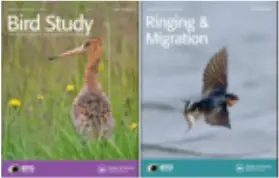
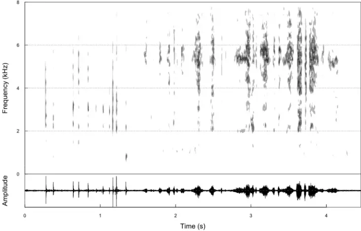
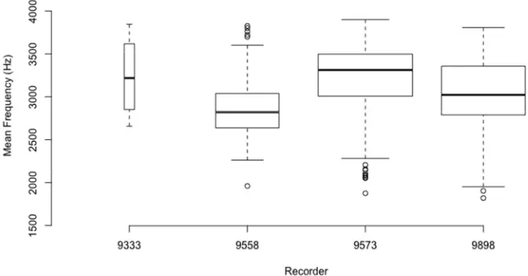
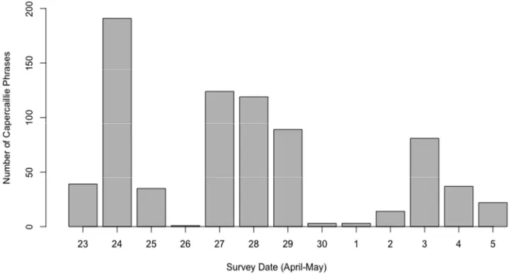
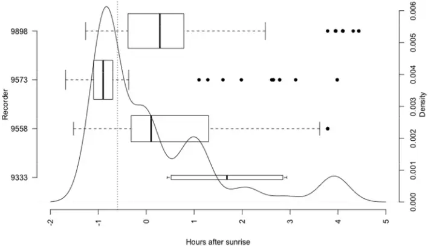
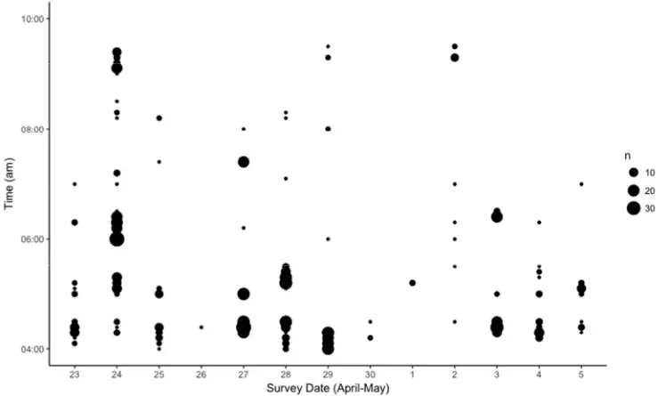
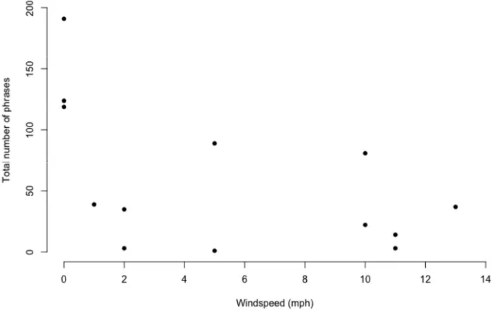

## A first test of unattended, acoustic recorders for monitoring capercaillie (Tetrao urogallus L.) lekking activity

| Journal:                      | Bird Study/Ringing & Migration                                                                                           |
| ----------------------------- | ------------------------------------------------------------------------------------------------------------------------ |
| Manuscript ID                 | BS-2017-066.R2                                                                                                           |
| Manuscript Type:              | Original Article                                                                                                         |
| Date Submitted by the Author: | 03-Nov-2017                                                                                                              |
| Complete List of Authors:     | Peer Abrahams, Carlos; Baker Consultants, ; Nottingham Trent University - Clifton Campus, Denny, Matthew; Denny Ecology, |
| Keywords:                     | bioacoustics, capercaillie, automated recording, bird display, lek, monitoring                                           |

For Peer Review

```
For Peer Review A first test of unattended, acoustic recorders for monitoring capercaillie 1 (Tetrao urogallus L.) lekking activity. 2 3 Carlos Abrahams 1,2 & Matthew J. H. Denny 3 4 1. Corresponding Author: Baker Consultants, West Platform, Cromford Station, 5 Cromford Bridge, Matlock, Derbyshire, DE4 5JJ, c.abrahams@bakerconsultants.co.uk 6 01629 593958 7 2. Corresponding Author: Nottingham Trent University, Clifton Campus, Nottingham, 8 Nottingham Trent University, Clifton Campus, NG11 8NS 9 3. Denny Ecology, 17D Sturton Street, The Courtyard, Cambridge, CB1 2SN. 01223 10 316407 11 12 Carlos Abrahams ORCID id: 0000-0003-0301-5585 13 14 Short title: Acoustic monitoring of capercaillie Keywords: Bioacoustics, capercaillie, automated recording, bird display, lek monitoring
```

15 16 17 18

19

20

21

22

23

24

25

26

27

28

29

30

31

32

33

34

35

36

37

38

39

40

41

42

43

## Summary

## Capsule

Automated acoustic recording can be used as a valuable survey technique for capercaillie leks, improving the quality and quantity of field data for this endangered bird species. However, more development work and testing against traditional methods is needed to establish optimal working practices.

For Peer Review Aims The use of bioacoustics is a rapidly developing tool for ecological research, but still requires testing across a variety of taxa and recording environments. This study aims to determine whether capercaillie vocalizations can be recognized in lek recordings, whether this can be automated using readily available software, and whether the number of calls resulting varies with location, weather conditions, date and time of day. Methods Unattended recording devices and semi-automated call classification software were used to record and analyse the display calls of capercaillie at three known lek sites in Scotland over a two week period. Results

Capercaillie calls were successfully and rapidly identified within a dataset that included the vocalizations of other bird species and environmental noise. This demonstrates that calls can be readily recognized to species level using a combination of unsupervised software and manual analysis, and the number of such calls counted to gain an index of lek activity. The number of calls varied by time and date, and by recorder/microphone location at the lek site, and was related to weather conditions. This information can be used to better target future acoustic monitoring and improve the quality of existing traditional lek surveys.

## Conclusion

- This study is a contribution to the development of bioacoustics as a practical and cost44
- effective method for determining habitat occupancy and activity levels by a vocally 45
- distinctive bird species. Following further testing alongside traditional counting methods, it 46
- could offer a significant new approach towards more effective monitoring of local population 47
- levels for capercaillie and other species of conservation concern. 48

49

For Peer Review

50

51

52

53

54

55

56

57

58

59

60

61

62

63

64

65

66

67

68

69

70

71

72

73

74

## Text

## Introduction

For Peer Review Western capercaillie (Tetrao urogallus L.) is a bird of high conservation concern in the UK, and elsewhere in Europe, on account of its low population size and historical decline (Storch 2000; Eaton et al. 2015). Thought to have become extinct in Scotland in the mid to late 18 th century, it was successfully reintroduced, but has declined again in the 20 th century. Whilst the reasons for this decline are complex and not fully understood, research has shown that low breeding success associated with climate change, and mortality resulting from adult birds flying into forest fences, have contributed to the decline (Moss 2001; Ewing et al. 2012). The Scottish capercaillie population has been subject to concerted conservation management efforts over the past few decades, which appear to have stabilised the population at a critically low level , but not increased it (Wilkinson 2017), rendering it susceptible to extinction again in Britain (Moss 2001).

A range of methods have been used for capercaillie monitoring, including counts of displaying males at leks (Picozzi et al. 1992; Summers et al. 2010) and genetic capturerecapture techniques (Jacob et al. 2010) to assess population status. For national status surveys in Scotland, line transects are conducted in winter (Ewing et al. 2012). However, the species currently has a low population density and variable detectability relating to habitat type, sex and temperature (Ewing et al. 2012). As a result, the 2009-10 national transect survey only recorded an average of one capercaillie encounter per 22.2 km of transect. Whilst there are good reasons for applying a winter transect count method for the national survey (Ewing et al. 2012), the low encounter rates hinder the ability of this survey method to sensitively track changes in the population at smaller temporal and spatial scales.

75

76

77

78

79

80

81

82

83

84

85

86

87

88

89

90

91

92

93

94

95

96

97

98

99

For Peer Review Capercaillies have a polygonous mating system with an 'exploded' lek breeding system, where males display over a dispersed area to indicate their breeding condition and quality (Wegge et al. 2013). The leks occur in forest habitat, centre on a display ground covering an area of c.0.30 hectares, and have mean numbers of male birds of between 0.5 and 20+ per lek, dependent on the quality and amount of the surrounding old forest habitat (Hjorth 1970; Picozzi et al. 1992; Angelstam 2004; Laiolo et al. 2011). Since 2002, capercaillies in Scotland have been counted at lek sites each April, with a subset of 69 leks subject to consistent monitoring effort. Between 2004 and 2010, the number of male birds at regularly counted leks declined from 215 to 152 birds, a fall of 29.3% (Ewing et al. 2012). This may have been due to an overall population decline, or abandonment of traditional lek sites in favour of new sites, or a combination of these processes. One of the advantages of acoustic monitoring is the potential for wider spatial and temporal systematic sampling, facilitating the identification of newly occupied lek sites.

The quality of data from traditional lek counts may be affected by differences in detection probabilities between habitats or survey events (e.g. in ambient background noise), or measurement and identification errors. Biases may occur in traditional bird count data, with large inter- and intra-observer errors (Celis-Murillo et al. 2009; Simons et al. 2009) - sometimes due to existing knowledge about the survey area (Hancock et al. 1999). For capercaillie, the surveyed lek sites are often remote, experienced surveyors are few in number, and the necessary timing and seasonal constraints on field survey methods raise difficulties. As a result, the spatial and temporal coverage of capercaillie sites is currently limited, leading to low confidence in the results from point counts. In addition, capercaillies are known to be susceptible to human disturbance (Ewing et al. 2012), and regular disturbance due to traditional counts has the potential to negatively affect populations. There

100

101

102

103

104

105

106

107

108

109

110

111

112

113

114

115

116

117

118

119

120

121

122

123

is a clear need for improved monitoring techniques, especially at important sites, or locations where management actions have been implemented, to determine site occupancy and finer scale temporal and spatial trends. In this way, significant short-term population changes could be identified more readily to alert conservationists to both acute problems and management intervention success. The use of automated acoustic detection, alongside existing survey methods, could reduce the recognised biases and act as a complementary method to enable more accurate population estimates, but there are always going to be logistical and cost implications undertaking both methods in parallel.

For Peer Review As an alternative or complement to existing techniques, we test here the use of unattended sound recorders (often called 'passive' or 'autonomous' recorders) for monitoring capercaillie leks. Recording of vocalizations has previously been used to monitor other bird species, such as bitterns (Gilbert et al. 2002), corncrakes (Peake &amp; McGregor 2001) and nightjars (Zwart et al. 2014). Unattended sound recording is especially applicable in situations where populations are remote, sensitive to disturbance, or the species is cryptic, as recorders can be deployed in the field for long periods of time with minimal surveyor influence at the monitoring site. Hence, this method is potentially highly applicable for capercaillie.

The displays of capercaillie males at lek sites commonly entail a sequence starting with vocalizations from a tree perch, before moving to the ground to commute to the lek centre and later adding visual signals to their continuing display songs (Wegge et al., 2013). The typical full capercaillie display song (Figure 1) consists of a low frequency broadband rattle between 1 and 5 kHz , then a deep pop, followed by a repeated scratchy sound between 2.5

124

125

126

127

128

129

130

131

132

133

134

135

136

137

138

139

140

141

142

143

144

145

146

147

148

and 6.5 kHz. This sequence is described as "drum roll - cork pop - whetting" by Liaolo et al. (2011).

For Peer Review As part of a monitoring programme, effective recording and recognition of capercaillie vocalizations within large audio datasets could allow the occupancy of a site to be determined, and an index of relative use to be developed (e.g. Briggs et al. 2012). It may also be possible to assess the number of male birds at a lek from sound recordings. Laiolo et al. (2011) found that capercaillie song rate (the number of songs per minute from an individual bird) is significantly associated with the number of displaying males. This is likely to be as a signal of intimidation, as the birds attending the lek stimulate each other by increasing their vocal display. Therefore, song rate, recorded using automated bioacoustic techniques, could be used as a proxy for lek counts undertaken by traditional methods. This study sets out to determine whether capercaillie vocalizations can be recognized in recordings to species level, and whether this recognition can be automated and calls counted using readily available software. The results are then used to determine how the number of calls varies according to location, weather conditions, date and time of day. Materials and methods

Four Wildlife Acoustics (www.wildlifeacoustics.com) SM2 acoustic recorders were placed at known capercaillie lek sites near Aviemore, Scotland (57.19° N, 3.82° W) in April 2016. Each recorder was programmed to record in stereo, with one Wildlife Acoustics SMX-II omnidirectional microphone (left channel, 0) mounted on the recording unit, and another (right channel, 1) at the end of a 50m extension cable. The recorder and cabled microphones were both attached to trees at approximately 1.5m off the ground, and oriented horizontally in

149

150

151

152

153

154

155

156

157

158

159

160

161

162

163

164

165

166

167

168

169

170

171

172

173

opposite directions N-S or E-W. The microphone and recorder were both placed in the vicinity of the lek centre as indicated by a surveyor familiar with the sites and the normal lek count hide locations. GPS coordinates were taken for all recorder and microphone locations. The four recording devices were placed at three lek sites, each separated by a distance of kilometres. At one lek site, two recorders (9333 and 9898) were placed together, with the four microphones mounted on the recorders and associated cables forming the corners of an approximate 50x50 m square. The reason for doing this was the fact that previous count surveys and checks for field signs had been unable to accurately define the location of the lek at the site.

For Peer Review The recorders were programmed to record between 04:00-10:00 every day, starting at 04:00 23 April 2016 and ending at 10:00 on 6 May 2016. Recording was limited to these times based on standard lek count practice and surveyor advice (Haysom 2013; S. West pers. comm.), whilst saving the limited battery life and data storage capacity. Sunrise time at the start of the survey period was at 05:46, getting earlier to 05:14 at the end of the survey. During each survey day, the recorders created a series of 10 minute duration full-spectrum data files in Waveform Audio File (.wav) format, recording at a sampling rate of 24,000 Hz and 16 bits per sample (see Technical Appendix).

The survey provided a data set covering 14 days (84 hours) at each of the four recorders, with the data from each recorder comprising 505 stereo files (total 2,020). The final day of recording (04:00-10:00 6 May) was used to produce a set of training data for developing an automated call recognizer in the software. The remaining 13 days were retained for analysis purposes.

174

175

176

177

178

179

180

181

182

183

184

185

186

187

188

189

190

191

192

193

194

195

196

197

198

For Peer Review Data were analysed using Kaleidoscope Pro 4.0.0 software (Wildlife Acoustics 2016), using its 'cluster analysis' method. This process searches for repeated phrases in the recordings (e.g. the song of a particular bird species) and groups these into a number of clusters based on their similarity. It provides a numerical score to quantify the 'distance' of each individual vocalization phrase from the centre of the cluster (low scores being better matches with this average). According to the software protocol, a preliminary analysis was conducted on the training data to scan and cluster recordings. The clustering process identified individual 'phrase segments' within the training data, each of these being a mono recording (from either the right or left channel), &gt;2 and &lt;7 seconds in duration (the typical song length of capercaillie), comprising a sequence of 'syllables' occurring close enough together in time such that the defined 'maximum inter-syllable gap' of 1 second is not exceeded. All the phrase segments from the training data were individually reviewed and manually identified as either capercaillie calls or other sounds, by viewing the sonogram and listening to playback. In addition, the performance of the clustering process was assessed by comparing clustered data to a stratified sample of the original recordings. Each phrase segment selected by clustering could include vocalizations by more than one bird species, if these were singing simultaneously within the frequency band, but they were assigned as capercaillie if calls from this species were included. From this manual review, the cluster with the highest proportion of capercaillie phrases from the training data was identified, and this cluster was then used as a recognizer to identify matching capercaillie phrases within the 13 day sequence of analysis data, using the same analysis parameters as used for the training data.

To assess the effectiveness of the classification process, all the phrase segments identified in the analysis data as 'capercaillie' matches were manually checked by viewing the sonogram and listening to playback. This allowed the proportion of false positive matches to be

199

200

201

202

203

204

205

206

207

208

209

210

211

212

213

214

215

216

217

218

219

220

221

222

223

assessed. To identify the proportion of false negatives, a random selection of 500 (4%) 'noncapercaillie' phrase segments from the analysis data was also manually checked.

As environmental context for the acoustic data, weather data for the Met Office MIDAS station at Aviemore was accessed through BADC (badc.nerc.ac.uk/cgi-bin/midas_stations/ station_details.cgi.py?id=113&amp;db=midas_stations), and DATA.GOV.UK (using the Aviemore weather station codes DCNN 0585 and RAIN 817692). Daily rain data for Northern Scotland was also accessed from Hadley UKP (www.metoffice.gov.uk/hadobs/ hadukp/data/download.html).

For Peer Review Statistical tests were carried out using R and R Studio software (R Core Team 2015; RStudio Team 2015). Results The first stage of analysis used clustering to identify and group similar vocalizations within the single day of training data. This identified 5401 individual phrase segments, produced by a variety of bird species, grouped into 10 clusters. The total duration of these phrase segments amounted to 4.88 hours, out of a total recording time of 48 hours (4 recorders x 6 hours x 2 channels). All 5401 training data phrase segments were manually reviewed (taking less than eight hours), with 258 segments (5%) identified as having capercaillie calls, and 5143 segments without capercaillie (Table 1). Of the 5401 phrase segments, 80 were assigned to Cluster 09, in which 52 (65%) were manually confirmed to contain capercaillie calls (the highest proportion of capercaillie calls of any cluster). The remaining 206 phrase segments that included capercaillie vocalizations (often overlapping calls from other species) were spread through the remaining clusters. Most of these were in Cluster 08, which had

224

225

226

227

228

229

230

231

232

233

234

235

236

237

238

239

240

241

242

243

244

245

246

247

248

capercaillie vocalizations in 20.1% of its phrase segments, while all remaining clusters had less than 5% of phrase segments being positive for capercaillie. Hence, clustering of the training data at this initial stage provided a single main capercaillie cluster which picked out 52 (20%) of 258 capercaillie phrase segments manually identified from the dataset. The check back of clustered data against the original recordings showed that the clustering performed well according to the set parameters. The clustering correctly identified the presence or absence of capercaillie in the 10-minute .wav files 75% of the time, with false positives (calls incorrectly assigned to Cluster 9) in 8% of cases, and false negatives (calls missed or assigned to another cluster) in 17% of cases. This manual review also indicated that there were a number of short capercaillie sequences or individual spaced calls present, that were outside the parameters of the clustering process due to their limited duration (often being less than 1 second).

For Peer Review Using Cluster 09 to identify similar capercaillie recordings, the remaining 13 day sequence of analysis data was processed to determine whether capercaillie phrases could be effectively identified within the recorded dataset. A total of 13,626 phrase segments were produced from the analysis data (Table 1), of which 907 (6.7%) were assigned as a match to the Cluster 09 capercaillie data. These were all manually checked and 758 of the 907 (83.6%) were confirmed as capercaillie, with 149 (16.4%) false positive matches. To identify the proportion of false negatives, a random selection of 500 phrase segments (4%) out of the remaining 12,719 were manually checked. Of these, 55 phrases (11%) were confirmed as including capercaillie vocalizations and hence being false negatives. The greatest proportion of these were in Cluster 08, which had 29% false negatives, and Cluster 01, which had 13%. The remaining clusters 02-07 all had a false negative proportion of &lt;10%. Hence, overall there were estimated to be 1399 (0.11 x 12,719) phrase segments containing capercaillie calls in

249

250

251

252

253

254

255

256

257

258

259

260

261

262

263

264

265

266

267

268

269

270

271

272

273

the analysis dataset which were not discovered. This equates to the supervised clustering successfully identifying 83.6% of capercaillie vocalizations in Cluster 09, and correctly extracting 35% of all capercaillie phrase segments. These findings mean that the limited number of false positives in Cluster 09 could be manually screened quickly, with a low rate of false negatives scattered through the other clusters - these often being low 'quality' phrase segments with single calls or poorly recorded, and therefore difficult and time-consuming to identify manually.

The differences in the total number of recorded phrase segments (from all species), and those of capercaillie, were investigated across different recorder locations and between left and right stereo channels. The numbers of all of these varied widely between recorder locations, with almost no vocal activity recorded at 9333, moderate levels at 9558 and highest activity at 9898 and 9573 (Table 2). As context, the number of males recorded during lek counts at these sites in the same season (but not concurrently with recording), were three birds at 9333/9898, five at 9573 and 7 at 9558 (S. West, pers. comm.). A great deal of variation was found between the two stereo channels on each recorder, with all locations recording many

For Peer Review The dataset of 758 capercaillie phrase segments identified by the cluster process and manual confirmation was used for further analysis. The spectrograms were first analysed to ascertain the characteristics of the recorded calls. Within the dataset, the vocalizations had a mean frequency of 3083 Hz, within a general range of 2000-4000 Hz (Figure 2). Some variation was found between the data from different locations, with means between 2874 Hz at recorder 9558 and 3234 Hz at 9333. A median duration of 4.512 seconds was found for the identified phrase segments, with a minimum of 2 seconds and a maximum of 6.94 seconds (as constrained by the software settings).

274

275

276

277

278

279

280

281

282

283

284

285

286

287

288

289

290

291

292

293

294

295

296

297

298

more calls on one channel than the other. Review of the capercaillie call data revealed very few instances (n=8, c.1%) where near-simultaneous calls were recorded on both left and right channels, i.e. from the same bird being recorded simultaneously on both channels. Hence large differences were found between data from microphones located 50 metres apart. In addition, recorders 9333 and 9898 were both placed in the vicinity of a single lek site and recorded widely differing numbers of vocalizations. A possible reason for this is discussed below.

Prior to the study, an early morning peak in vocal activity was expected, with units set to record between 04:00-10:00. This assumption was found to be correct, with our data clearly indicating that the highest levels of call activity were recorded in the 2 hour period around sunrise (Figure 4), with a median time for all calls of 36 minutes before sunrise. There are significant differences between the recorder locations though (Kruskal-Wallis chi-squared = 289.13, df = 3, p-value &lt; 0.01), with unit 9573 being significantly earlier than the other three locations.

For Peer Review The number of calls recorded per day was investigated to determine whether there was any trend across the survey (and lekking) period. The overall levels of capercaillie vocal activity, pooled across all recorder locations, varied day-to-day between 1-191 phrase segments, but were highest at the start (23 rd April) of the survey and declined (with daily variations) throughout the rest of the period (Figure 3). This is likely to reflect a true decline in lekking activity, as the survey was undertaken at the tail end of the main lekking season. The highest daily total of phrase segments at a single recorder was a maximum of 146 at recorder 9898 - this being more than half of all segments recorded at that location, recorded in a single day.

299

300

301

302

303

304

305

306

307

308

309

310

311

312

313

314

315

316

317

318

319

320

321

322

323

If the morning peak in activity is related to sunrise time (i.e. light levels), then we would expect this to get earlier through the survey period as day length changes. This relationship between peak vocalization time and sunrise appears to be demonstrated in Figure 5, where in addition, the high level of calls around 04:00 am, the start of the recording session, are indicated.

For Peer Review Relationships between the total number of vocalizations per day with three weather parameters were tested using Spearman's rank correlation (Table 3). A significant negative correlation (p&lt;0.05) was found with windspeed (Figure 6), but there was no clear relationship with temperature or amounts of rainfall. Discussion Our results confirm that automated passive acoustic recorders can effectively be used to detect and record capercaillie vocalization activity in the field. This study has also shown that semi-automated call analysis can rapidly identify individual vocalization phrases for a target species, with call classification having an accuracy of &gt;80% accuracy and correctly extracting 35% of all capercaillie calls (most of those not extracted being of poor-quality) - and only producing 16% false positives. The clustering process applied here is a different approach to the use of pre-constructed species-specific recognisers used in many other studies (Brandes 2008; Bardeli et al. 2010; Oppel et al. 2014). It is primarily intended to be a human-supervised process which organises sound data into call-type groups to allow rapid manual review and labelling. With the appropriate manual checks, including identification of false negative and positive classifications, it was very successful in correctly identifying capercaillie vocalizations in the analysis dataset, even when based on a small single set of training data - albeit with a relatively high omission error (64.9%). Although the clustering

324

325

326

327

328

329

330

331

332

333

334

335

336

337

338

339

340

341

342

343

344

345

346

347

348

For Peer Review process used here, based on a limited number of individuals, was suitable for identifying birds at the study sites, it is expected that improved rates of detection, with fewer false positives and negatives, could be achieved in future studies with a larger training dataset (Digby et al. 2013). In addition, it is worth noting that our method did not attempt to exhaustively identify every capercaillie vocalization in the recorded dataset. The clustering approach allowed a user-determined set of search parameters to be applied to the data, with vocalizations that matched the settings being selected as phrase segments. As a result, it is accepted that vocalizations not matching these criteria (e.g. short individual calls) would not have been identified, and the capercaillie phrase segments used in our analysis are a reduced subset of the overall recorded activity. However, the defined criteria used in the clustering ensures that vocalizations of the same type and quality are being compared between different days and detector locations, allowing a coherent analysis of the call data. This rapid analysis method, with low levels of false positives, is particularly suited to ascertaining the presence of capercaillies at a site, which could be a very useful tool for a species with low densities and fluctuating lek site occupancy.

The numbers of calls recorded varied widely between recorder locations and also between left and right channels on the same recorder. The former could indicate differences in the levels of vocal activity between different lek sites, while the latter indicates that capercaillie calls do not travel well over distance, i.e. detectability is limited at distances =&gt; 50 metres. This is similar to detection ranges found in other bioacoustic studies of forest birds, e.g. Venier et al. (2012) and Sedláček et al. (2015). Using the same type of recorders and microphones, Turgeon et al. (2017) found bird call detection radii of between 13-203 metres, dependent on the species, background noise levels and microphone condition. For comparison, the spacing between individual capercaillies at leks has been recorded as 64-212

349

350

351

352

353

354

355

356

357

358

359

360

361

362

363

364

365

366

367

368

369

370

371

372

373

For Peer Review metres (with interactions between males sometimes occurring at less than 10 metres), and calls from this species can generally be heard at a distance up to approximately 200 metres by the human ear (Hjorth 1970; Wegge et al. 2013). This relationship between detection distances and bird density clearly raises the issue of detectability during surveys, for both human point counts and automated recording equipment (Yip et al., 2017). This indicates that, for bioacoustics methods, careful thought needs to be given to the number, layout, and response of recorders and microphones, as well as the characteristics of the recording environment. In addition, when recording and analyzing sound files, the appropriate audio settings, such as gain, sample rate, and the use of high and low pass filters should be considered. The development of good practice guidance for this should be prioritized to ensure repeatable results from any future monitoring programme (Eyre et al. 2014; Pocock et al. 2015), and further research should focus on elucidating the optimum number of microphones, and distance between them, at a lek site.

In this study, the pair of recorders 9333 and 9898 were located either side of a wide electricity pylon wayleave through the forest, with the lek site thought possibly to be present within the open wayleave habitat between. However, the recorder on the northern side of the wayleave (9898) recorded 265 capercaillie phrases, compared to only 4 on the south side (9333). This is likely to indicate that the lek site was actually present within the forest to the north of both recorders, and audible sound data was only picked up at the closest set of equipment.

Differences were found in median call timings between locations, with recorder location 9573 being significantly earlier in the day compared to other locations. This could perhaps be due to habitat differences, such as forest structure, aspect or altitude. For example, 9573 was

374

375

376

377

378

379

380

381

382

383

384

385

386

387

388

389

390

391

392

393

394

395

396

397

the lowest of all four sites at 255 m altitude and in relatively open forest habitat, while the rest were at 325-375 m in denser plantations. Further exploration of how the environment might affect capercaillie lekking behaviour in this way would be worthwhile (Angelstam 2004; Laiolo et al. 2011).

For Peer Review Lek monitoring at the local scale, rather than winter transect counts which are subject to low encounter rates (Ewing et al. 2012), should be seen as an important method of monitoring the effects of management and alert practitioners to local population changes. As discussed already, there are significant limitations to traditional manual lek counts, and this automated acoustic approach provides a promising alternative or complement. Within our study, large differences were found between the number of capercaillie vocalizations recorded at each of the three locations. This may partly be due to the precise location of the recorders in relation to the lekking birds, given the range detectability issue discussed above (which is also likely to affect human observers), but could also be a true reflection of bird numbers and activity levels at each site. We anticipate that the level of call data recorded using our methods should be indicative of population size and lekking activity, but comparison with human observer counts has not been attempted in this study, due to the limited number of leks covered and the lack of synchronous count data. Further work is clearly required in this area, but studies have shown that recorded calling rates are positively relate to lek size in white-bearded manakin Manacus manacus (Cestari et al. 2016) and white-bellied emerald Amaziliu candida (Atwood et al. 1991); and to nest density at Cory's shearwater Calonectris borealis breeding sites (Oppel et al. 2014). These findings indicate that acoustic monitoring may be useful to document relative changes in local bird populations over time. In particular, the day-to-day variation we recorded in call activity at each site over the survey period (summarised in

398

399

400

401

402

403

404

405

406

407

408

409

410

411

412

413

414

415

416

417

418

419

420

421

422

Figure 3) must sound a note of caution to reliance on capercaillie population data from single visit lek counts.

Haysom (2013) recommends that capercaillie lek surveys in Scotland should take place during the peak period of mid-April to early May (with variation according to spring temperatures). The call activity we recorded was highest at the start of the survey period (23 April) and declined through the survey period. Hence, this indicates that earlier activity might have been missed in this study, Further unattended acoustic research of capercaillie leks should aim to test whether there is activity prior to mid-April, to understand whether the recommended seasonal parameters of traditional lek surveys need to be adjusted.

The number of recorded vocalizations decreased with increasing wind speed. This could be due to: (i) reduced calling (and lekking) activity in adverse weather conditions, (ii) reduced detectability of calls in high winds, or (iii) increased masking by background noise in high winds (Digby et al. 2013). There is anecdotal recognition of the effects of environmental parameters - weather and altitude -on call activity from human observers at lek counts. The impacts of this on results could do with further investigation to allow the quality of count data to be assessed against weather conditions, with weather factors (if recorded) being modelled into data analysis and therefore removing this source of variation. It would be more

For Peer Review The peak of highest levels of call activity, across all recorders, occurred at 36 minutes before sunrise. The standard guidance by Haysom (2013) recommends that leks should ideally be counted from 04:00 to 06:00 hours. However, relatively high levels of call activity were recorded at the start of our daily survey period (4-10 am), so for future studies, an earlier start to survey is recommended, e.g. 2-3 hours before sunrise (c. 2:30-3:30am).

423

424

425

426

427

428

429

430

431

432

433

434

435

436

437

438

439

440

441

442

443

444

445

446

447

practicable to achieve this with the long datasets possible from automated recording, than those provided by the limited resource of human surveyors (Oppel et al. 2014).

For Peer Review In conclusion, this study has shown that capercaillie can be effectively recorded in the field using automated passive acoustic methods. The equipment necessary to do this is simple and readily available, and enormous progress in signal processing and pattern recognition in recent years has made it possible to incorporate automated methods into the detection of vocalisations (Bardeli et al. 2010). As a result, there is a clear opportunity for acoustic monitoring of this species over extended periods, with rapid analysis of the recorded vocalizations. The time and cost savings of this approach over manually reviewing all of the sound data are significant. In this study, a total of 56 'days' of recording was completed with two days of fieldwork, and one-two days of call analysis. This is not uncommon - Digby et al. (2013) assessed that autonomous recorder methods required &lt;3% of the time needed for a comparable traditional field survey.

The continuing vulnerability of the Scottish population of capercaillie makes regular and consistent monitoring a priority. The use of acoustic techniques could eliminate or minimize observer biases, reduce disturbance caused by surveyors, and provide standardized field data that can be permanently archived. It could also help resolve problems associated with surveying in pre-dawn darkness, hard to access survey sites and with the limited availability of expert field observers (Hobson et al. 2002; Celis-Murillo et al. 2009; Zwart et al. 2014). Acoustic recording methods could allow for cost-effective lek occupancy checks of suitable, but previously unmonitored or unoccupied, areas, which would be unfeasible using manual lek surveys. Acoustic data may also be useful in testing when (in terms of weather conditions, season and time of day) manual monitoring would be most effective, and could help gauge

448

449

450

451

452

453

454

455

456

457

458

459

460

461

462

the accuracy of point counts. As a result, it is a developing tool that could potentially have great application and significance, offering to fill a methodological gap especially for the census of cryptic taxa such as capercaillie (Dawson &amp; Efford 2009; Bardeli et al. 2010; Laiolo 2010; Zwart et al. 2014).

For Peer Review The next step in the development of bioacoustics for birds should be in the establishment of recognized survey protocols and statistical approaches to be employed by practitioners such as conservation professionals and ecological consultants (Marques et al. 2013), to set out good practice and allow greater comparability between studies of different species and at different locations. This will require testing and work to compare traditional versus acoustic methods -probably developing an improved approach which combines the two into an integrated system. For capercaillie, the obvious first step is to correlate lek count numbers against the numbers of calls recorded during the same survey event, or better, over a longer survey period surrounding a number of repeated counts at each lek.

463

464

465

466

467

468

469

470

471

472

473

474

475

476

477

478

479

480

481

482

## Acknowledgements

Many thanks to RSPB staff, Sarah West and Gareth Marshall, for enabling this study and assisting with deployment of recording equipment, and to the landowners who allowed access to their sites.

## Technical Appendix - Recording and Analysis Settings

For Peer Review Wildlife Acoustics Songmeter SM2 recorders were used. Recording was constant during the set times, without triggers being set. No high or low pass filters were used, and a gain setting of +48dB was applied. The SMX-II microphones used have a typical sensitivity of -40 to -43 dBV/pa and frequency response of 20-20000 Hz (Ehnes &amp; Foote, 2015; Turgeon et al., 2017). For call analysis with Kaleidoscope Pro the following analysis parameters were used: Daily subdirectories created; Files split to 60s max duration; Split channels; Signal of interest 15004000 Hz; Duration 2-6s; Maximum inter-syllable gap 1s; Max distance from cluster center to include outputs in cluster.csv = 1.0; FFT window = 5.33ms; Max states = 12; Max distance to cluster centre for building clusters = 0.5; Max clusters = 500.

483

484

485

486

487

488

489

490

491

492

493

494

495

496

497

498

499

500

501

502

503

504

505

506

507

508

509

## References

Angelstam, P. (2004) Habitat thresholds and effects of forest landscape change on the distribution and abundance of black grouse and capercaillie. Ecological Bulletins 51: 173-187.

Atwood J., Fitz, V.L. &amp; Bamesberger, J.E. (1991) Temporal patterns of singing activity at leks of the white-bellied emerald. The Wilson Bulletin 103(3): 373-386.

Bardeli, R., Wolff, D., Kurth, F., Koch, M., Tauchert, K.-H. &amp; Frommolt, K.-H. (2010) Detecting bird sounds in a complex acoustic environment and application to bioacoustic monitoring. Pattern Recognition Letters. 31(12): 1524-1534.

Brandes, T.S. (2008). Automated sound recording and analysis techniques for bird surveys and conservation. Bird Conservation International, 18(S1), S163-S173

Briggs, F., Lakshminarayanan, B., Neal, L., Fern, X.Z., Raich, R., Hadley, S.J.K., Hadley, A.S. &amp; Betts, M.G. (2012). Acoustic classification of multiple simultaneous bird species: a multi-instance multi-label approach. Journal of the Acoustical Society of America 131:4640-4650.

Celis-Murillo, A., Deppe, J.L. &amp; Allen, M.F. (2009) Using soundscape recordings to estimate bird species abundance, richness, and composition. Journal of Field Ornithology, 80: 64-78.

For Peer Review

Cestari, C., Loiselle, B.A., &amp; Pizo, M.A. (2016) Trade-Offs in Male Display Activity with Lek Size. PLoS ONE, 11(9).

Cornec, C., Hingrat, Y. &amp; Rybak, F. (2014) Individual Signature in a Lekking Species: Visual and Acoustic Courtship Parameters May Help Discriminating Conspecifics in the Houbara Bustard. Ethology, 120: 726-737.

510

511

512

513

514

515

516

517

518

519

520

521

522

523

524

525

526

527

528

529

530

531

532

533

534

535

536

537

Dawson, D.K. &amp; Efford, M.G. (2009) Bird population density estimated from acoustic signals. Journal of Applied Ecology, 46: 1201-1209.

Digby, A., Towsey, M., Bell, B. D. and Teal, P. D. (2013), A practical comparison of manual and autonomous methods for acoustic monitoring. Methods in Ecology and Evolution 4: 675-683.

Eaton, M.A., Aebischer, N.J., Brown, A.F., Hearn, R.D., Lock, L., Musgrove, A.J., Noble, D.G., Stroud, D.A. &amp; Gregory, R.D. (2015) Birds of Conservation Concern 4: the population status of birds in the United Kingdom, Channel Islands and Isle of Man. British Birds 108: 708-746.

Ehnes, M. &amp; Foote, J.R. (2015) Comparison of autonomous and manual recording methods for discrimination of individually distinctive Ovenbird songs. Bioacoustics 24(2): 111:121.

Ewing, S.R., Eaton, M.A, Poole, T.F, Davies, M. &amp; Haysom, S. (2012) The size of the Scottish population of Capercaillie Tetrao urogallus: results of the fourth national survey. Bird Study 59(2):126-138.

Eyre, T.J., Ferguson, D.J., Hourigan, C.L., Smith, G.C., Mathieson, M.T., Kelly, A.L., Venz, M.F., Hogan, L.D. &amp; Rowland, J. (2014) Terrestrial Vertebrate Fauna Survey Assessment Guidelines for Queensland. Department of Science, Information Technology, Innovation and the Arts, Queensland Government, Brisbane.

For Peer Review

Gilbert, G., Tyler, G.A. &amp; Smith, K.W. (2002) Local annual survival of booming male great bittern Botaurus stellaris in Britain, in the period 1990-1999. Ibis 144: 51-61.

Hancock, M., Baines, D., Gibbons, D., Etheridge, B., &amp; Shepherd, M. (1999) Status of male Black Grouse Tetrao tetrix in Britain in 1995-96. Bird Study, 46(1): 1-15

538

539

540

541

542

543

544

545

546

547

548

549

550

551

552

553

554

555

556

557

558

559

560

561

562

563

564

565

Hobson, K.A., Rempel, R.S., Greenwood, H., Turnbull, B. &amp; Van Wilgenburg, S.L. (2002) Acoustic Surveys of Birds Using Electronic Recordings: New Potential from an Omnidirectional Microphone System Wildlife Society Bulletin (1973-2006) 30(3): 709-720.

Haysom, S. (2013) Capercaillie Survey Methods. Scottish Natural Heritage.

Hjorth, I. (1970) Reproductive behaviour in Tetraonidae, with special reference to males. Viltrevy 7: 184-596

Jacob, G., Debrunner, R., Gugerli, F., Schmid B. &amp; Bollmann, K. (2010) Field surveys of capercaillie (Tetrao urogallus) in the Swiss Alps underestimated local abundance of the species as revealed by genetic analyses of non-invasive samples. Conservation Genetics 11(1): 33-44.

Laiolo, P. (2010) The emerging significance of bioacoustics in animal species conservation. Biological Conservation, 143(7):1635-1645.

Laiolo, P., Bañuelos, M.J., Blanco-Fontao, B., García, M. &amp; Gutiérrez, G. (2011) Mechanisms underlying the bioindicator notion: Spatial association between individual sexual performance and community diversity. PLoS ONE 6(7): e22724.

For Peer Review

Marques, T. A., Thomas, L., Martin, S.W., Mellinger, D.K., Ward, J.A., Moretti, D.J. &amp; Tyack, P.L. (2013). Estimating animal population density using passive acoustics. Biological Reviews of the Cambridge Philosophical Society, 88(2): 287-309.

Moss, R. (2001) Second extinction of capercaillie (Tetrao urogallus) in Scotland? Biological Conservation 101(2): 255-257.

Moss, R. &amp; Lockie, I. (1979) Infrasonic components in the song of the Capercaillie Tetrao urogallus. 566 Ibis 121: 95-97. 567

568

569

570

571

572

573

574

575

576

577

578

579

580

581

582

583

584

585

586

587

588

589

590

591

592

Oppel, S., Hervias, S., Oliveira, N., Pipa, T., Silva, C., Geraldes, P., Goh, M., Immler, E. &amp; McKown,

M. (2014) Estimating population size of a nocturnal burrow-nesting seabird using acoustic monitoring and habitat mapping. Nature Conservation 7: 1-13.

For Peer Review Peake, T.M. &amp; McGregor, P.K. (2001) Corncrake Crex crex census estimates: a conservation application of vocal individuality. Animal Biodiversity &amp; Conservation 24: 81-90. Picozzi, N., Catt D.C. &amp; Moss, R. (1992) Evaluation of Capercaillie Habitat. Journal of Applied Ecology, 29(3): 751-762. Pocock, M. J. O., Newson, S. E., Henderson, I. G., Peyton, J., Sutherland, W. J., Noble, D. G., Ball, S. G., Beckmann, B. C., Biggs, J., Brereton, T., Bullock, D. J., Buckland, S. T., Edwards, M., Eaton, M. A., Harvey, M. C., Hill, M. O., Horlock, M., Hubble, D. S., Julian, A. M., Mackey, E. C., Mann, D. J., Marshall, M. J., Medlock, J. M., O'Mahony, E. M., Pacheco, M., Porter, K., Prentice, S., Procter, D. A., Roy, H. E., Southway, S. E., Shortall, C. R., Stewart, A. J. A., Wembridge, D. E., Wright, M. A. and Roy, D. B. (2015) Developing and enhancing biodiversity monitoring programmes: a collaborative assessment of priorities. Journal of Applied Ecology 52: 686-695.

R Core Team (2013). R: A language and environment for statistical computing. R Foundation for Statistical Computing, Vienna, Austria. URL http://www.R-project.org/.

RStudio Team (2015). RStudio: Integrated Development for R. RStudio, Inc., Boston, MA

URL http://www.rstudio.com/.

593

594

595

596

597

598

599

600

601

602

603

604

605

606

607

608

609

610

611

612

613

614

615

616

617

618

619

620

Sedláček, O., Vokurková, J., Ferenc, M., Djomo, E.N., Albrecht, T., Hořák, D. (2015). A comparison of point counts with a new acoustic sampling method: a case study of a bird community from the montane forests of Mount Cameroon. Ostrich 86: 213-220

Simons, T.R., Pollock, K.H., Wettroth, J.M., Alldredge, M.W., Pacifici, K. &amp; Brewster, J. (2009) 'Sources of Measurement Error, Misclassification Error, and Bias in Auditory Avian Point Count Data' in David L Thomson, Evan G. Cooch, Michael J. Conroy (eds) Modeling Demographic Processes In Marked Populations Springer

Storch, I. (1995) Annual home ranges and spacing patterns of Capercaillie in central Europe. Journal of Wildlife Management 59: 392-400.

Storch, I. (2000) Conservation status and threats to grouse worldwide: an overview. Wildlife Biology 6(4): 195-204.

Summers, R.W., Dugan, D. &amp; Proctor, R. (2010) Numbers and breeding success of Capercaillies Tetrao urogallus and Black Grouse T. tetrix at Abernethy Forest, Scotland. Bird Study 57(4): 437446.

Summers, R.W., Proctor, R., Thorton, M. &amp; Avey, G. (2004) Habitat selection and diet of the Capercaillie Tetrao urogallus in Abernethy Forest, Strathspey, Scotland. Bird Study 51(1): 58-68.

For Peer Review

Turgeon, P. J., S. L. Van Wilgenburg, and K. L. Drake. (2017) Microphone variability and degradation: implications for monitoring programs employing autonomous recording units. Avian Conservation and Ecology 12(1):9.

Venier, L.A., Holmes, S.B., Holborn, G.W., Mcilwrick, K.A., Brown, G., 2012. Evaluation of an automated recording device for monitoring forest birds. Wildlife Society Bulletin 36: 30-39.

621

622

623

624

625

626

627

628

629

630

631

632

633

634

635

636

637

638

639

Wegge, P., Rolstad, J. &amp; Storaunet, K.O (2013) On the spatial relationship of males on "exploded" leks: the case of Capercaillie grouse Tetrao urogallus examined by GPS satellite telemetry. Ornis Fennica 90:222-235.

Wildlife Acoustics (2016) Kaleidoscope 4.0.0 Pro Software.

Wilkinson, N. (26 July 2017). National capercaillie survey 2015-16. http://www.rspb.org.uk/community/ourwork/b/biodiversity/archive/2017/07/26/national-capercailliesurvey-2015-16.aspx. Accessed 24 October 2017

Yip, D. A., L. Leston, E. M. Bayne, P. Sólymos, and A. Grover (2017). Experimentally derived detection distances from audio recordings and human observers enable integrated analysis of point count data. Avian Conservation and Ecology 12(1):11.

Zwart, M.C., Baker, A., McGowan, P.J.K. &amp; Whittingham, M.J. (2014) The Use of Automated Bioacoustic Recorders to Replace Human Wildlife Surveys: An Example Using Nightjars. PLoS ONE 9(7): e102770.

For Peer Review

640

641

642

643

644

645

646

647

648

649

## (b) Analysis dataset 650

|                       |                    | Software classifier - Capercaillie | Software classifier - Other | TOTAL  | False negative (%) |
| --------------------- | ------------------ | ---------------------------------- | --------------------------- | ------ | ------------------ |
| Manual identification | Capercaillie       | 758                                | 1,399 (estimate)            | 2,157  | 64.9               |
|                       | Other              | 149                                | 11,320 (estimate)           | 11,469 | 1.3                |
|                       | TOTAL              | 907                                | 12,719                      | 13,626 |                    |
|                       | False positive (%) | 16.4                               | 11.0                        |        |                    |

651

652

## Tables

Table 1. The error matrix produced from: (a) the clustering process which produced the classifier from the single-day training dataset, and (b) applying this classifier to the 13 day analysis dataset. False negatives are where the species was present but not detected by the software (read along the rows less the diagonal cell). False positives are where the software identified the species to be present when it was not (read down the columns less the diagonal cell).

## (a) Training dataset

|                       |                    | Software classifier - Capercaillie | Software classifier - Other | TOTAL | False negative (%) |
| --------------------- | ------------------ | ---------------------------------- | --------------------------- | ----- | ------------------ |
| Manual identification | Capercaillie       | 52                                 | 206                         | 258   | 79.8               |
| Manual identification | Other              | 28                                 | 5,115                       | 5,143 | 0.58               |
|                       | TOTAL              | 80                                 | 5,321                       | 5,401 |                    |
|                       | False positive (%) | 35.0                               | 3.87                        |       |                    |

For Peer Review

653

654

655

656

657

658

659

660

661

Table 2. Total numbers of phrase segments at each recorder location.

| Recorder            |                               | 9333      | 9898          | 9558         | 9573          |
| ------------------- | ----------------------------- | --------- | ------------- | ------------ | ------------- |
| Lek site            |                               | A         | A             | B            | C             |
| Lek count (males)   |                               | 3         | 3             | 7            | 5             |
| All phrase segments | Microphone 1/2 Left/Right     | 449/75    | 1445/743      | 186/1750     | 5599/3379     |
| All phrase segments | Total                         | 524       | 2188          | 1936         | 8978          |
| Capercaillie phrase | For Microphone 1/2 Left/Right | 4/0       | 206/59        | 0/152        | 272/65        |
| segments            | Total (% of all phrases)      | 4 (0.76%) | 265 (12.11%)  | 152 (7.85%)  | 337 (3.75%)   |
| segments            | Mean(range)/day               | 0.31(0-2) | 20.38 (0-146) | 11.69 (0-40) | 25.92 (0-101) |

For Peer Review

662

663

664

665

666

Table 3. Spearman's rank correlation of weather conditions with total number of calls per day.

| Variable    | S      | p     | rho    |
| ----------- | ------ | ----- | ------ |
| Wind        | 576.64 | 0.036 | -0.584 |
| Temperature | 523.22 | 0.135 | -0.437 |
| Rain        | 532.46 | 0.111 | -0.463 |

For Peer Review

## Figures 667

668

669

670

671

672

673

674

675

676

677

678

679

680

681

682

683

684

685

686

687

688

689

690

Figure 1. Typical spectrogram of capercaillie call, showing frequency spectrum in upper window and amplitude in lower window.

Figure 2. Box plot of mean frequency of capercaillie phrase segments at each recorder location. The centreline of each box indicates the median value for all phrase segments at each recorder location. Boxes represent the data between lower and upper quartiles, and the whiskers extend to the most extreme data point which is no more than 1.5 times the interquartile range. Outliers in each population are represented by dots.

For Peer Review Figure 3. Total number of capercaillie phrase segments recorded per day, across all detectors. Figure 4. Capercaillie vocalizations in relation to sunrise time. Box plots indicate median times, quartiles and ranges for capercaillie phrase segments at each recorder location, in realtion to sunrise. Box plot width indicates relative sample size. The median time for all capercaillie phrase segments recorded is indicated by the dotted vertical line at 36 minutes before sunrise. The kernel density of capercaillie phrase segments over time is shown by the solid line.

Figure 5. Timing of vocalizations in relation to date, for all recorder locations combined. The size of circles indicates the number of phrase segments recorded within each 10 minute recording period.

Figure 6. Inverse relationship between number of phrase segments recorded per day and wind 691 speed. Spearman's rank correlation coefficient (S = 576.64, p-value = 0.03604, rho =- 692 0.5841723). 693 694 695

For Peer Review For Peer Review 456x302mm (72 x 72 DPI)

Figure 1. Typical spectrogram of capercaillie call, showing frequency spectrum in upper window and amplitude in lower window.



Figure 2. Box plot of mean frequency of capercaillie phrase segments at each recorder location. The centreline of each box indicates the median value for all phrase segments at each recorder location. Boxes represent the data between lower and upper quartiles, and the whiskers extend to the most extreme data point which is no more than 1.5 times the interquartile range. Outliers in each population are represented by dots. Box plot width indicates relative sample size.



For Peer Review 315x191mm (72 x 72 DPI)

Figure 3. Total number of capercaillie phrase segments recorded per day, across all detectors.



For Peer Review 318x193mm (72 x 72 DPI)

Figure 4. Capercaillie vocalizations in relation to sunrise time. Box plots indicate median times, quartiles and ranges for capercaillie phrase segments at each recorder location, in relation to sunrise. Box plot width indicates relative sample size. The median time for all capercaillie phrase segments recorded is indicated by the dotted vertical line at 36 minutes before sunrise. The kernel density of capercaillie phrase segments over time is shown by the solid line.



For Peer Review 336x204mm (72 x 72 DPI)

Figure 5. Timing of vocalizations in relation to date, for all recorder locations combined. The size of circles indicates the number of phrase segments recorded within each 10 minute recording period.



For Peer Review 299x181mm (72 x 72 DPI)

Figure 6. Inverse relationship between number of phrase segments recorded per day and wind speed. Spearman's rank correlation coefficient (S = 576.64, p-value = 0.036, rho =-     0.584).



For Peer Review 304x214mm (72 x 72 DPI)

Table 1. The error matrix produced from: (a) the clustering process which produced the classifier from the single-day training dataset, and (b) applying this classifier to the 13 day analysis dataset. False negatives are where the species was present but not detected by the software (read along the rows less the diagonal cell). False positives are where the software identified the species to be present when it was not (read down the columns less the diagonal cell).

## (a) Training dataset

|                       |                    | Software classifier - Capercaillie | Software classifier - Other | TOTAL | False negative (%) |
| --------------------- | ------------------ | ---------------------------------- | --------------------------- | ----- | ------------------ |
| Manual identification | Capercaillie       | 52                                 | 206                         | 258   | 79.8               |
| Manual identification | Other              | 28                                 | 5,115                       | 5,143 | 0.58               |
|                       | TOTAL              | 80                                 | 5,321                       | 5,401 |                    |
|                       | False positive (%) | 35.0                               | 3.87                        |       |                    |

## (b) Analysis dataset

|                       |                    | Software classifier - Capercaillie | Software classifier - Other | TOTAL  | False negative (%) |
| --------------------- | ------------------ | ---------------------------------- | --------------------------- | ------ | ------------------ |
| Manual identification | Capercaillie       | 758                                | 1,399 (estimate)            | 2,157  | 64.9               |
|                       | Other              | 149                                | 11,320 (estimate)           | 11,469 | 1.3                |
|                       | TOTAL              | 907                                | 12,719                      | 13,626 |                    |
|                       | False positive (%) | 16.4                               | 11.0                        |        |                    |

For Peer Review For Peer Review Table 3. Spearman's rank correlation of weather conditions with total number of calls per day.

Table 2. Total numbers of phrase segments at each recorder location.

| Recorder            |                           | 9333      | 9898          | 9558     |         | 9573          |
| ------------------- | ------------------------- | --------- | ------------- | -------- | ------- | ------------- |
| Lek site            |                           | A A       |               | B        | C       |               |
| Lek count (males)   |                           | 3         | 3             | 7        | 5       |               |
| All phrase segments | Microphone 1/2 Left/Right | 449/75    | 1445/743      | 186/1750 |         | 5599/3379     |
|                     | Total                     | 524       | 2188          | 1936     |         | 8978 272/65   |
| Capercaillie phrase | Microphone 1/2 Left/Right | 4/0       | 206/59        | 0/152    |         | (3.75%)       |
| segments            | Total (% of all phrases)  | 4 (0.76%) | 265 (12.11%)  | 152      | (7.85%) | 337           |
| segments            | Mean(range)/day           | 0.31(0-2) | 20.38 (0-146) | 11.69    | (0-40)  | 25.92 (0-101) |


| Variable    | S      | p     | rho    |
| ----------- | ------ | ----- | ------ |
| Wind        | 576.64 | 0.036 | -0.584 |
| Temperature | 523.22 | 0.135 | -0.437 |
| Rain        | 532.46 | 0.111 | -0.463 |

For Peer Review
