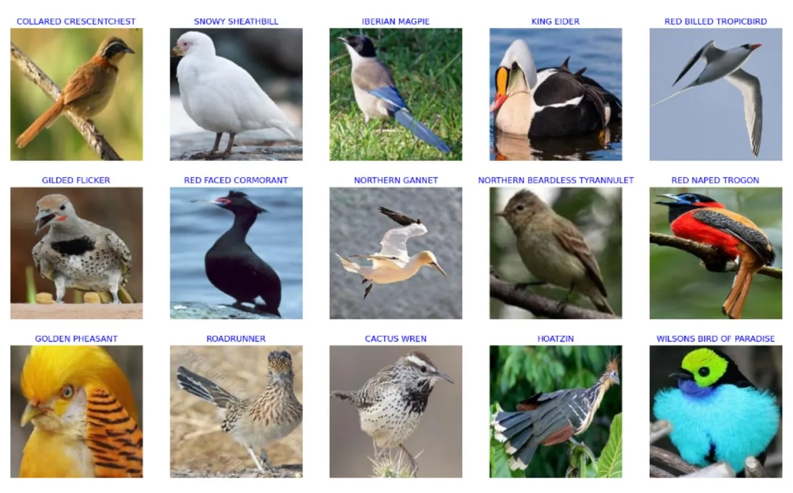
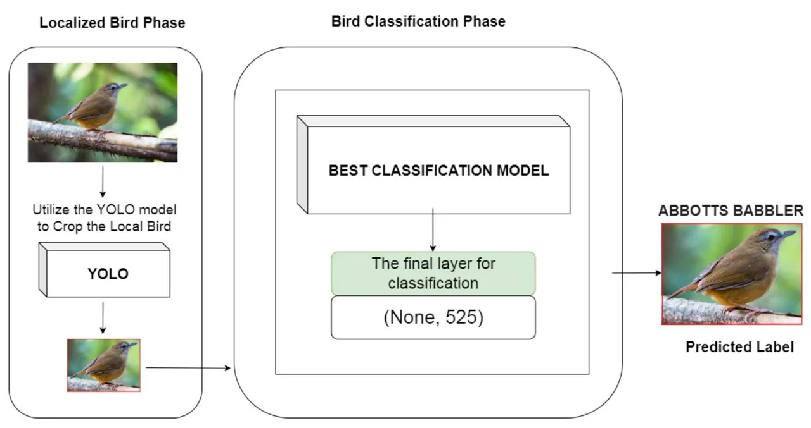
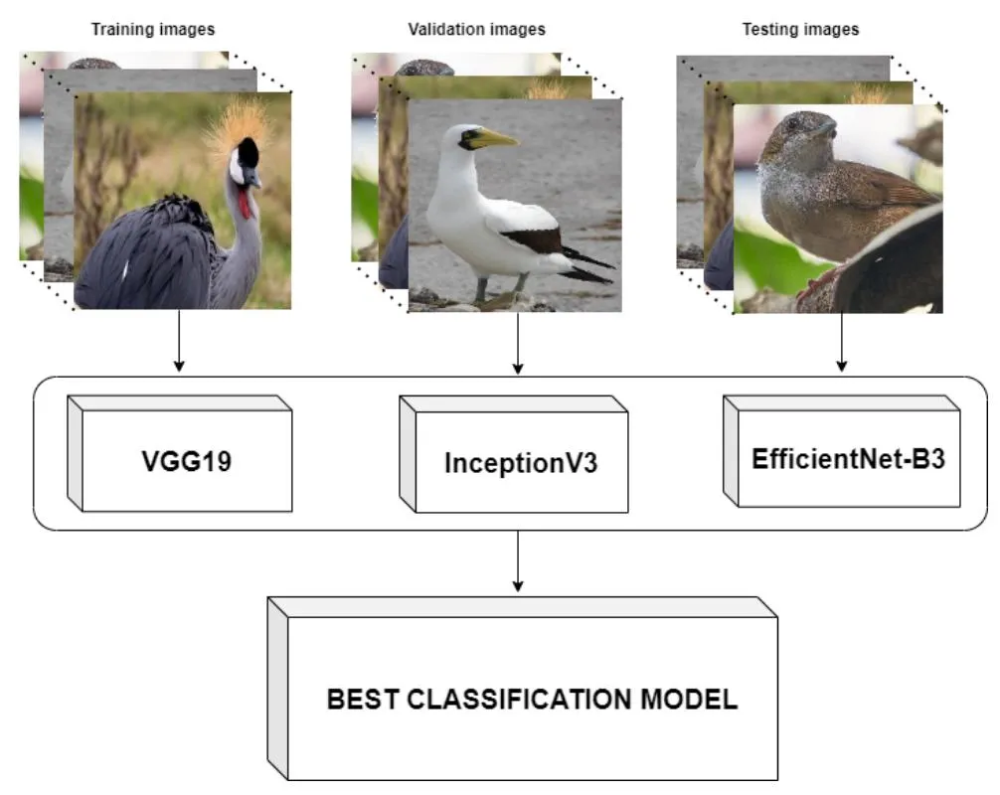
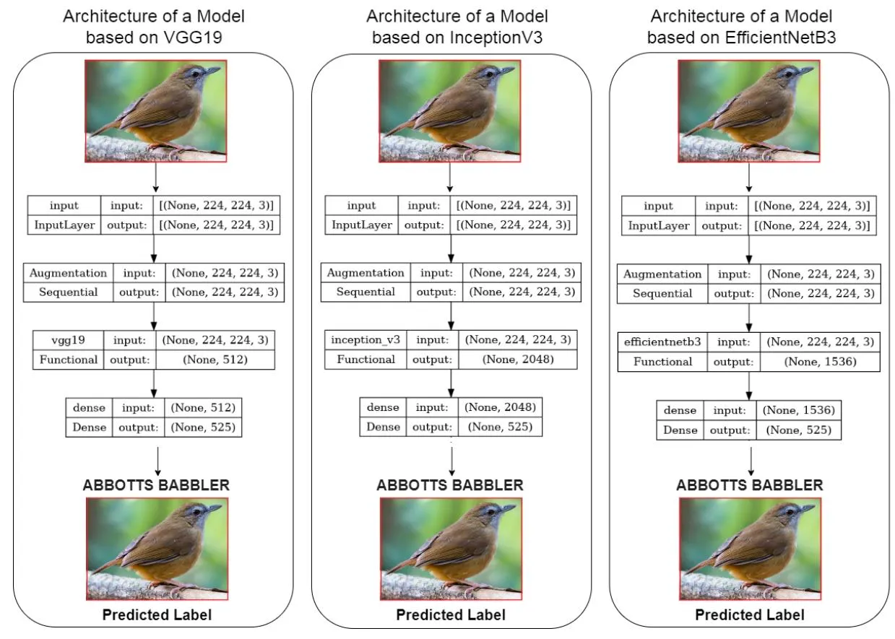
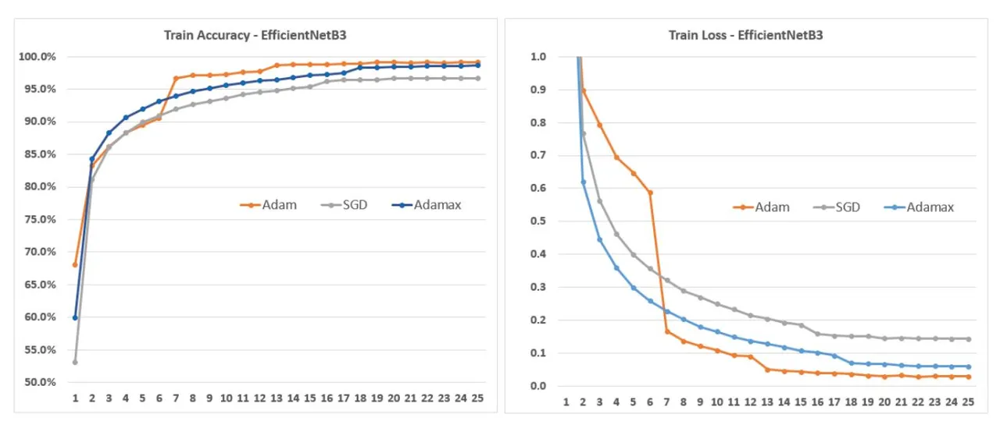
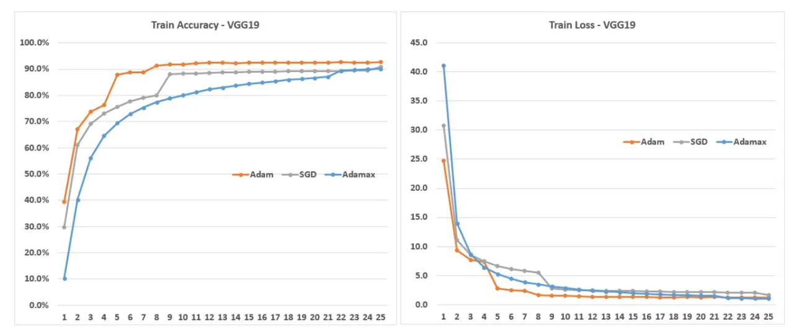
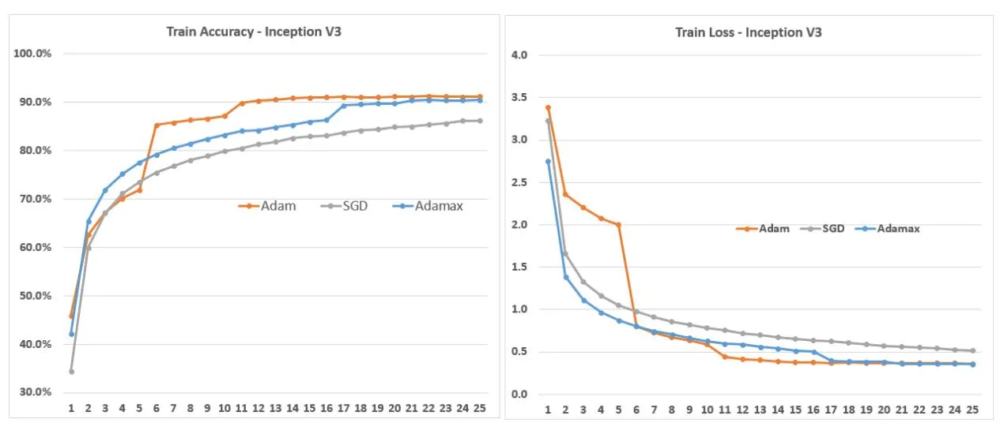
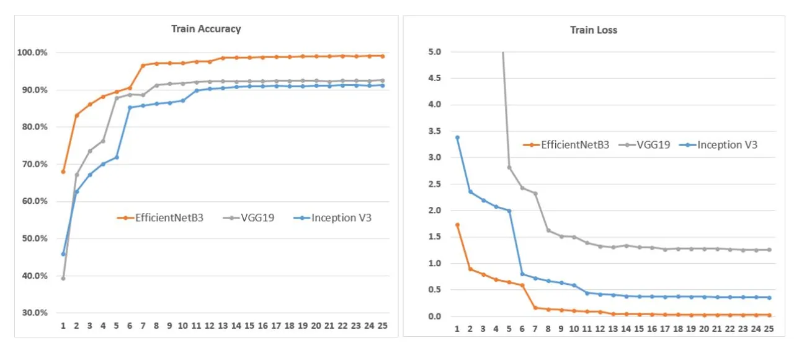
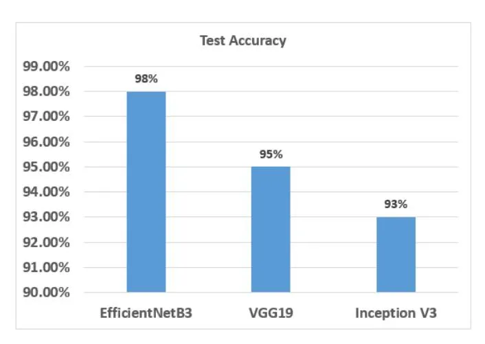
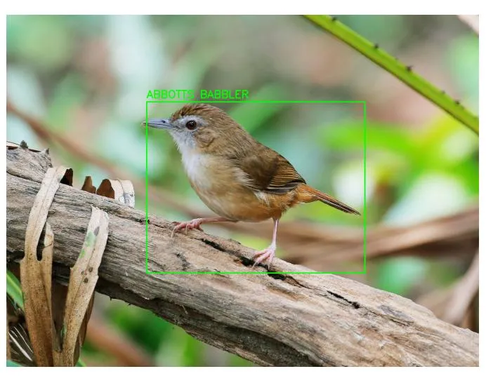

# Bird Detection and Species Classification: Using YOLOv5 and Deep Transfer Learning Models

Hoang-Tu Vo, Nhon Nguyen Thien, Kheo Chau Mui Software Engineering Department, FPT University, Cantho city, Vietnam

_Abstract_—Bird detection and species classification are important tasks in ecological research and bird conservation efforts. The study aims to address the challenges of accurately identifying bird species in images, which plays a crucial role in various fields such as environmental monitoring, and wildlife conservation. This article presents a comprehensive study on bird detection and species classification using the YOLOv5 object detection algorithm and deep transfer learning models. The objective is to develop an efficient and accurate system for identifying bird species in images. The YOLOv5 model is utilized for robust bird detection, enabling the localization of birds within images. Deep transfer learning (TL) models, including VGG19, Inception V3, and EfficientNetB3, are employed for species classification, leveraging their pre-trained weights and learned features. The experimental findings show that the proposed approach is effective, with excellent accuracy in both bird detection and tasks for species classification. The study showcases the potential of combining YOLOv5 with deep transfer learning models for comprehensive bird analysis, opening avenues for automated bird monitoring, ecological research, and conservation efforts. Furthermore, the study investigated the effects of optimization algorithms, including SGD, Adam, and Adamax, on the performance of the models. The findings contribute to the advancement of bird recognition systems and provide insights into the performance and suitability of various deep transfer learning architectures for avian image analysis.

_Keywords_—_Bird detection; species classification; YOLOv5; deep transfer learning models; automated bird monitoring_

#### I. INTRODUCTION

Birds play a crucial role in maintaining ecological balance. Conducting research on bird species enables us to enhance our understanding of the surrounding world, and the Earth's ecosystem, and acquire valuable insights into nature. Birds exhibit diverse characteristics, including varying sizes, shapes, and colors, and can be found in different locations. Identifying birds holds immense significance for ornithologists. Environmental scientists frequently rely on birds to gain insights into ecosystems due to their sensitivity to environmental fluctuations. Accurate identification of bird species provides crucial data on environmental conditions.

However, the process of manually collecting and data processing for bird species identification poses a significant challenge for researchers. To mitigate this challenge, the development of automated bird identification systems that collect, process, and classify bird species based on relevant information has emerged as a potential solution. The classification of bird species holds importance in diverse practical applications, including environmental pollution monitoring [1]. The presence of different bird species within an ecosystem serves various environmental purposes. Presently, image classification has emerged as a prominent domain of study in machine learning (ML) and deep learning (DL) [2]. However, accurately identifying bird species from images presents a complex undertaking due to challenges such as distinguishing between different bird species based on their unique shapes and appearances, accounting for background variations, managing varying lighting conditions in images, and accounting for the birds' dynamic postures.

The study employed yolov5, an object detection algorithm, to identify bird regions within images. Furthermore, three distinct models, namely VGG19, EfficientNetB3, and InceptionV3, were trained to classify a total of 525 bird species. By leveraging yolov5's capabilities, the researchers successfully detected the presence of birds in the images. Additionally, the classification task was accomplished using the trained models, which enabled accurate identification of the specific bird species among the 525 possibilities. This comprehensive approach allowed for both detection and classification of birds in the study.

The purpose of this article is to explore the application of YOLOv5 [3] (You Only Look Once) in detecting specific image areas that contain birds. Additionally, the article aims to compare the results achieved by various deep learning models such as VGG19, InceptionV3, and EfficientNetB3 in classifying different types of birds. To create a comprehensive model, the article proposes combining both bird detection and classification techniques. By leveraging the strengths of YOLO and deep learning models, this research aims to contribute to the development of robust systems for bird detection and classification in images. Moreover, the study examined how the performance of the models was influenced by optimization algorithms such as SGD, Adam, and Adamax.

The paper's structure is organized as follows: In Section II, a thorough literature review is presented, covering the relevant background. Section III elaborates on the method employed for bird detection in image, as well as the implementation of three proposed transfer learning models for the task of bird classification. This section discusses various aspects, including Data Set and Data Preparation, Optimizers, and Model Evaluation Metrics. The experimental system and results are then detailed in Section IV. Section V offers conclusive remarks to wrap up the paper.

#### II. RELATED WORKS

In today's era, CNN (Convolutional Neural Network) models have emerged as powerful tools for addressing classification problems across various fields. With their ability to automatically learn hierarchical representations from raw data, CNN models have revolutionized the field of computer vision and beyond. These models excel in extracting meaningful features and patterns from images, making them particularly well-suited for tasks like object recognition, image classification, and segmentation. By leveraging deep learning techniques, CNN models have achieved remarkable success in domains such as healthcare, autonomous vehicles, natural language processing, and more. Their versatility, scalability, and robustness make them widely adopted in academia and industry alike, as they continue to push the boundaries of what is possible in the realm of classification problems. Several studies have been conducted focusing on TL techniques for the purpose of classification; in the medical field [4], [5], [6], [7], [8]; in the field of agriculture [9], [10], [11] and many other fields. In the problem of bird classification, Shazzadul Islam et al. [12] propose a ML approach for identifying the species of Bangladeshi birds. To extract image features from bird pictures, the researchers utilized the VGG-16 network. Among the various classification methods employed, Support Vector Machine (SVM) attained the highest accuracy, reaching an impressive 89%. Samparthi V S Kumar et al. [13] compares the performance of MobileNet, AlexNet, InceptionResNet V2, Inception V3, and EfficientNet for bird species recognition using a dataset of 11,488 images (increased to 40,000 through data augmentation). The results indicate that MobileNet and EfficientNet are the fastest to train, and EfficientNet achieves the highest test accuracy of 87.13%. The study [14] utilized traditional ML algorithms, DL algorithms, and transfer learning-based deep learning algorithms to classify the Kaggle-180-birds dataset, with the transfer learning-based classifier achieving the highest classification accuracy of 98%. The paper [15] compares and evaluates DL models (SSD, YOLOv4, and YOLOv5) for the classification and identification of bird species using the CUB-200-2011 dataset, with the YOLOv4 model achieving superior performance, including 95.43% accuracy, 93.94% precision, 94.34% recall, 94.27% F-1 score for 20 classes, and 96.99% mAP score. Ichsan Budiman et al. [16] utilized the K-Nearest Neighbor (KNN) algorithm to classify bird species based on a dataset of 58,388 images belonging to 400 species, achieving an accuracy of 95.5%. This paper [17] introduces a dual TL method for enhanced seabird image classification with spatial pyramid pooling, concatenating outputs from InceptionV3 and DenseNet201 backbones, and applying global average-pooling and global max-pooling. The proposed method achieved high accuracy, precision, recall, and F1-score of 95.11%, 95.33%, 95.11%, and 95.13%, respectively, on a 10-class seabird image dataset. Apart from the image-based classification of birds, extensive research has also been conducted on classifying birds using sound signals. This research [18] focuses on utilizing convolutional neural networks (CNNs) to develop an automated system for bird species identification based on spectrogram images. By analyzing the challenges of bird species detection, segmentation, and classification using a publicly available dataset of 8000 audio examples, the study concludes that a CNN-based approach with fully convolutional learning achieves efficient and accurate results. Through a 9 step implementation, the system demonstrates high accuracy (0.9895), precision (0.9), and a minimal loss (less than 0.0063) after training and validation with 50 epochs. Kumar et al. [19] explores the use of deep neural networks (DNN) and TL for automatic voice recognition and species identification of 22 bird species using various feature extraction techniques. The results indicate that models like ResNet50, DenseNet201, InceptionV3, Xception, and EfficientNet achieve high prediction accuracy, with DenseNet201 and ResNet50 attaining the best classification accuracy of 97.43% on the validation set. The study [20] focuses on identifying the most suitable cepstral features for the accurate classification of 15 endemic Bornean bird sounds. By comparing different feature types, the model utilizing gamma tone frequency cepstral coefficients (GTCC) achieves superior performance with 93.3% accuracy. The most advanced CNN models currently utilize pre-trained networks and can classify bird species from various angles and positions. These methods have the potential to significantly enhance the accuracy. This article investigates YOLOv5 (You Only Look Once) for detecting bird-specific image areas and compares the classification performance of DL models like VGG19, Inception V3, and EfficientNetB3. By leveraging YOLO and deep learning, the research aims to enhance the development of robust systems for accurately detecting and classifying birds in images. Furthermore, the study delved into the influence of optimization algorithms, namely SGD, Adam, and Adamax, on the performance of the models.

### III. METHODOLOGY

## _A. Dataset and Data Preparation_

The dataset utilized in the article consists of a vast collection of 89,885 images. It encompasses a diverse range of 525 bird species, with 84,635 images allocated for training purposes. Additionally, the dataset includes 2,625 images each for testing and validation. All the images possess a resolution of 224x224 pixels and are in JPG format with RGB channels. The dataset was sourced from https://www.kaggle.com/datasets/gpiosenka/100 bird-species [21]. Significantly, a meticulously chosen set of five images per species was incorporated for testing and validation purposes. Fig. 1 provides additional information regarding the dataset.

#### _B. Transfer Deep Learning Models, Proposed Model_

The objective of this study is to employ the yolov5 algorithm for bird region detection in images, followed by utilizing a transfer learning model for bird classification. To assess the effectiveness of this approach, we compare the efficiency of bird classification using multiple proposed models based on transfer learning techniques, namely VGG19 [22], InceptionV3 [23], and EfficientNetB3 [24]. The architecture of the classification models proposed in this study is depicted in Fig. 2. Through this comparative analysis, we aim to evaluate the performance and efficacy of our solution in accurately classifying birds. In Fig. 3, the study conducted training on 03 bird classification models based on the EfficientNetB3, InceptionV3, and VGG19 network architectures, and selected the model with the highest accuracy. Fig. 4 presents the architecture and layers of the proposed models for bird classification based on the EfficientNetB3, InceptionV3, and VGG19 network architectures. The architecture and layers of the proposed model with the best results for the bird classification problem are built based on the EfficientNetB3 network architecture shown in Fig. 5.

Fig. 1. Sample bird species in the dataset.

Fig. 2. Proposed model for bird detection and species classification.

Fig. 3. The training process involves three bird species classification models based on EfficientNetB3, InceptionV3, and VGG19.

#### _C. Optimizers_

An optimizer is a key element in machine learning and deep learning that facilitates the training of models. Its primary purpose is to iteratively adjust the parameters of a model with the objective of minimizing a specific loss function. By finding optimal parameter values, the optimizer helps enhance the model's performance on various tasks like classification, regression, or generative modeling. Different optimizers employ distinct algorithms and techniques to update the model's parameters based on gradients computed from the training data.

The choice of optimizer greatly influences convergence speed, generalization ability, and overall model performance. Overall, an optimizer is a vital tool that guides the optimization process in machine learning by iteratively refining model parameters to achieve better results. In this paper, we assess the performance of transfer learning models by employing three highly effective algorithms: Stochastic Gradient Descent (SGD) [25], Adam [26], and Adamax [27]. These optimizers have demonstrated remarkable capabilities in various machine learning tasks and are widely recognized for their ability to optimize model parameters efficiently. By leveraging SGD, Adam, and Adamax, we aim to evaluate the accuracy and effectiveness of transfer learning models and explore their potential for enhancing performance in diverse domains.

## _D. Evaluation Metrics_

In this investigation, the efficacy of DL models was evaluated using a diverse set of metrics, including Precision, Recall, F1-score, and Accuracy. The overall performance of the models in predicting the target variable was assessed using Accuracy. Precision was utilized to measure the ratio of correctly predicted positive outcomes to all positive predictions, while recall quantified the proportion of accurately predicted instances of positive outcomes to all instances of positivity in the dataset. To provide a balanced perspective on the model's effectiveness, particularly in cases of imbalanced classes, the F1-score, which combines precision and recall, was employed. By employing multiple evaluation metrics, we obtained a comprehensive understanding of the model's effectiveness and were able to make informed judgments regarding its effectiveness.

$$Accuracy = \frac{TP + TN}{TP + TN + FP + FN} \tag{1}$$

$$Precision = \frac{TP}{TP + FP} \tag{2}$$

$$Recall = \frac{TP}{TP + FN} \tag{3}$$

$$F_1 - Score = \frac{Precision * Recall}{Precision + Recall}$$
(4)

In which, TP: True Positive, TN: True Negative, FP: False Positive, FN: False Negative.

Fig. 4. The architecture of the species bird classification model is constructed using EfficientNetB3, InceptionV3, and VGG19.

| Layer (type)                | Output Shape          | Param #  |
| --------------------------- | --------------------- | -------- |
| input (InputLayer)          | [(None, 224, 224, 3)] | 0        |
| Augmentation (Sequential)   | (None, 224, 224, 3)   | 0        |
| efficientnetb3 (Functional) | (None, 1536)          | 10783535 |
| dense (Dense)               | (None, 525)           | 806925   |
|                             |                       |          |

Fig. 5. The architecture of the species bird classification model is constructed using EfficientNetB3.

#### IV. RESULTS

In this section, we present the training and test results obtained for three models based on: EfficientNetB3, VGG19, and Inception V3. These models are based on their respective architectures and were trained using different optimizers, namely Adam, Adamax, and SGD. The purpose of these experiments was to evaluate the performance of the models under varying optimization algorithms. By utilizing different optimizers, we aimed to explore the impact on training and test outcomes, thereby gaining insights into the models' effectiveness.

EfficientNetB3: Among the three models, EfficientNetB3

consistently demonstrates the highest test accuracy of 98% across all optimizers (SGD, Adam, and Adamax). This indicates that EfficientNetB3 performs exceptionally well in correctly classifying unseen data. In addition to test accuracy, EfficientNetB3 also achieves high train accuracy, with values ranging from 0.967 to 0.9915 across all optimizers (SGD, Adam, and Adamax), indicating its ability to effectively learn from the training data. Furthermore, EfficientNetB3 exhibits low loss values during training, with the lowest recorded value of 0.0288 using the Adam optimizer. This suggests that the model effectively minimizes the discrepancy between predicted and actual values, resulting in improved performance. Detailed results are presented in Fig. 6.

VGG19: VGG19 performs slightly lower than Efficient-NetB3 but still delivers respectable results. Among the optimizers used, VGG19 achieves the highest test accuracy of 95% when trained with the Adam optimizer. This indicates its ability to classify unseen data with a relatively high level of accuracy. VGG19 also demonstrates reasonably good train accuracy, ranging from 0.9088 to 0.9264. However, compared to EfficientNetB3, VGG19 exhibits higher loss values during training, indicating a relatively higher error rate in the predicted outputs. Detailed results are presented in Fig. 7.

Inception V3: Inception V3 achieves test accuracies of 92% to 93% across all optimizers. While it performs slightly lower than EfficientNetB3 and VGG19, Inception V3 still demonstrates a reasonable ability to classify unseen data

Fig. 6. Comparing the training accuracy and loss values of the EfficientNetB3 model using Adam, Adamax, and SGD.

Fig. 7. Comparing the training accuracy and loss values of the VGG19 model using Adam, Adamax, and SGD.

accurately. In terms of train accuracy, Inception V3 achieves values ranging from 0.8624 to 0.913, which are slightly lower than the other two models. However, it shows relatively lower loss values during training compared to VGG19, indicating better convergence toward the desired outputs. Detailed results are presented in Fig. 8.

In summary, EfficientNetB3 consistently achieves the highest test accuracy across all optimizers, indicating its superior performance in classifying unseen data. VGG19 performs slightly lower but still achieves respectable results, with the best test accuracy attained using the Adam optimizer. Inception V3 also demonstrates good performance, although slightly lower than the other two models, with the best test accuracy achieved using the Adam optimizer. Detailed results comparing the testing accuracy and loss values of the EfficientNetB3, VGG19, and InceptionV3 models using Adam Optimizer are presented in Fig. 9.

Based on the information given in Table I, it appears that EfficientNetB3 consistently achieves high precision, recall, and F1 scores across all optimizers. It consistently achieves a score of 0.98 for precision, recall, and F1 score, indicating its effectiveness in correctly identifying positive instances and achieving a balance between precision and recall. While VGG19 and Inception V3 also show relatively strong performance, EfficientNetB3 consistently demonstrates higher scores in all metrics.

Fig. 10 shows comparisons of test accuracy value between EfficientNetB3, VGG19 and Inception V3. Fig. 11 shows the results obtained by using YOLOv5 to detect birds in the image (https://ebird.org/species/abbbab1) will be further classified into bird species using an EfficientNetB3-based model.

Fig. 8. Comparing the training accuracy and loss values of the InceptionV3 model using Adam, Adamax, and SGD.

Fig. 9. Comparing the testing accuracy and loss values of the EfficientNetB3, VGG19 and InceptionV3 model using Adam Optimizer.

TABLE I. MODEL COMPARISON - PRECISION, RECALL, F1 SCORE

| Models         | Optimizer | Precision | Recall | F1 Score |
| -------------- | --------- | --------- | ------ | -------- |
| EfficientNetB3 | SGD       | 0.98      | 0.98   | 0.98     |
| EfficientNetB3 | Adam      | 0.98      | 0.98   | 0.98     |
| EfficientNetB3 | Adamax    | 0.98      | 0.98   | 0.98     |
| VGG19          | SGD       | 0.95      | 0.94   | 0.94     |
| VGG19          | Adam      | 0.96      | 0.95   | 0.95     |
| VGG19          | Adamax    | 0.94      | 0.92   | 0.92     |
| Inception V3   | SGD       | 0.93      | 0.92   | 0.91     |
| Inception V3   | Adam      | 0.94      | 0.93   | 0.93     |
| Inception V3   | Adamax    | 0.94      | 0.93   | 0.93     |

## V. CONCLUSION

In conclusion, this study has successfully addressed the challenges associated with accurately identifying bird species in images, a task of great significance in ecological research and bird conservation efforts. By employing the YOLOv5 object detection algorithm for bird localization and leveraging deep transfer learning models like VGG19, Inception V3, and EfficientNetB3 for species classification, the researchers have developed an efficient and accurate system for bird detection and classification. The experimental results demonstrate the effectiveness of this approach, achieving high levels of accuracy in both bird detection and species classification tasks. The combination of YOLOv5 with deep transfer learning models has shown great potential for comprehensive bird analysis, paving the way for automated bird monitoring, ecological research, and conservation efforts. Moreover, the study also investigated the impact of optimization algorithms, including SGD, Adam, and Adamax, on the model's performance, providing valuable insights into the suitability of different deep transfer learning architectures for avian image analysis. Overall, these findings contribute to the advancement of bird recognition systems and offer valuable knowledge for improving the field of avian image analysis.

Fig. 10. Comparisons of test accuracy value between EfficientNetB3, VGG19 and Inception V3.

Fig. 11. Detect bird using YOLOv5, classify using EfficientNetB3-based model.

## REFERENCES

- [1] Birds as environmental indicators environmental science.org, available online: https://www.environmentalscience.org/birdsenvironmentalindicators. Accessed: 04-Jun-2019. [Online]. Available: https://www.environmentalscience.org/birds-environmentalindicators
- [2] A. L. Alter and K. M. Wang, "An exploration of computer vision techniques for bird species classification," 2017.
- [3] G. Jocher, A. Chaurasia, A. Stoken, J. Borovec, Y. Kwon, K. Michael, J. Fang, Z. Yifu, C. Wong, D. Montes _et al._, "ultralytics/yolov5: V7. 0-yolov5 sota realtime instance segmentation," _Zenodo_, 2022.
- [4] N. Kumar, M. Gupta, D. Gupta, and S. Tiwari, "Novel deep transfer learning model for covid-19 patient detection using x-ray chest images," _Journal of ambient intelligence and humanized computing_, vol. 14, no. 1, pp. 469–478, 2023.
- [5] Y. Kumar and S. Gupta, "Deep transfer learning approaches to predict glaucoma, cataract, choroidal neovascularization, diabetic macular edema, drusen and healthy eyes: an experimental review," _Archives of Computational Methods in Engineering_, vol. 30, no. 1, pp. 521–541, 2023.
- [6] M. Humayun, R. Sujatha, S. N. Almuayqil, and N. Jhanjhi, "A transfer learning approach with a convolutional neural network for the classification of lung carcinoma," in _Healthcare_, vol. 10, no. 6. MDPI, 2022, p. 1058.

- [7] N. A. Baghdadi, A. Malki, S. F. Abdelaliem, H. M. Balaha, M. Badawy, and M. Elhosseini, "An automated diagnosis and classification of covid-19 from chest ct images using a transfer learning-based convolutional neural network," _Computers in biology and medicine_, vol. 144, p. 105383, 2022.
- [8] D. Chowdhury, A. Das, A. Dey, S. Sarkar, A. D. Dwivedi, R. Rao Mukkamala, and L. Murmu, "Abcandroid: a cloud integrated android app for noninvasive early breast cancer detection using transfer learning," _Sensors_, vol. 22, no. 3, p. 832, 2022.
- [9] X. Zhao, K. Li, Y. Li, J. Ma, and L. Zhang, "Identification method of vegetable diseases based on transfer learning and attention mechanism," _Computers and Electronics in Agriculture_, vol. 193, p. 106703, 2022.
- [10] J. Kang and J. Gwak, "Ensemble of multi-task deep convolutional neural networks using transfer learning for fruit freshness classification," _Multimedia Tools and Applications_, vol. 81, no. 16, pp. 22 355–22 377, 2022.
- [11] H.-T. Vo, L.-D. Quach, and H. T. Ngoc, "Ensemble of deep learning models for multi-plant disease classification in smart farming," _International Journal of Advanced Computer Science and Applications_, vol. 14, no. 5, 2023. [Online]. Available: http://dx.doi.org/10.14569/IJACSA.2023.01405108
- [12] S. Islam, S. I. A. Khan, M. M. Abedin, K. M. Habibullah, and A. K. Das, "Bird species classification from an image using vgg-16 network," in _Proceedings of the 7th International Conference on Computer and Communications Management_, 2019, pp. 38–42.
- [13] S. V. Kumar and H. K. Kondaveerti, "A comparative study on deep learning techniques for bird species recognition," in _2023 3rd International Conference on Intelligent Communication and Computational Techniques (ICCT)_. IEEE, 2023, pp. 1–6.
- [14] M. Alswaitti, L. Zihao, W. Alomoush, A. Alrosan, and K. Alissa, "Effective classification of birds' species based on transfer learning," _International Journal of Electrical and Computer Engineering (IJECE)_, vol. 12, no. 4, pp. 4172–4184, 2022.
- [15] M. Kumar, A. K. Yadav, M. Kumar, and D. Yadav, "Bird species classification from images using deep learning," in _International Conference on Computer Vision and Image Processing_. Springer, 2022, pp. 388– 401.
- [16] I. Budiman, D. R. Ramdania, Y. A. Gerhana, A. R. P. Putra, N. N. Faizah, and M. Harika, "Classification of bird species using k-nearest neighbor algorithm," in _2022 10th International Conference on Cyber and IT Service Management (CITSM)_. IEEE, 2022, pp. 1–5.
- [17] J. Xie, M. Zhu, and K. Hu, "Improved seabird image classification based on dual transfer learning framework and spatial pyramid pooling," _Ecological Informatics_, vol. 72, p. 101832, 2022.
- [18] H. A. Jasim, S. R. Ahmed, A. A. Ibrahim, and A. D. Duru, "Classify bird species audio by augment convolutional neural network," in _2022 International Congress on Human-Computer Interaction, Optimization and Robotic Applications (HORA)_. IEEE, 2022, pp. 1–6.
- [19] Y. Kumar, S. Gupta, and W. Singh, "A novel deep transfer learning models for recognition of birds sounds in different environment," _Soft Computing_, pp. 1–21, 2022.
- [20] M. Ramashini, P. E. Abas, K. Mohanchandra, and L. C. De Silva, "Robust cepstral feature for bird sound classification," _International Journal of Electrical and Computer Engineering_, vol. 12, no. 2, p. 1477, 2022.
- [21] Birds 525 species, available online: https://www.kaggle.com/datasets/gpiosenka/100-bird-species. [Online]. Available: https://www.kaggle.com/datasets/gpiosenka/100-bird-species
- [22] L. Wen, X. Li, X. Li, and L. Gao, "A new transfer learning based on vgg-19 network for fault diagnosis," in _2019 IEEE 23rd international conference on computer supported cooperative work in design (CSCWD)_. IEEE, 2019, pp. 205–209.
- [23] J. M. Ahn, S. Kim, K.-S. Ahn, S.-H. Cho, K. B. Lee, and U. S. Kim, "A deep learning model for the detection of both advanced and early glaucoma using fundus photography," _PloS one_, vol. 13, no. 11, p. e0207982, 2018.
- [24] M. Tan and Q. Le, "Efficientnet: Rethinking model scaling for convolutional neural networks," in _International conference on machine learning_. PMLR, 2019, pp. 6105–6114.

- [25] L. Bottou, "Stochastic gradient descent tricks," _Neural Networks: Tricks of the Trade: Second Edition_, pp. 421–436, 2012.
- [26] D. P. Kingma and J. Ba, "Adam: A method for stochastic optimization," _arXiv preprint arXiv:1412.6980_, 2014.
- [27] R. Llugsi, S. El Yacoubi, A. Fontaine, and P. Lupera, "Comparison between adam, adamax and adam w optimizers to implement a weather forecast based on neural networks for the andean city of quito," in _2021 IEEE Fifth Ecuador Technical Chapters Meeting (ETCM)_. IEEE, 2021, pp. 1–6.
