#### **ORIGINAL PAPER**

# **Climate change is creating a mismatch between protected areas and suitable habitats for frogs and birds in Puerto Rico**

**Marconi Campos‑Cerqueira1 [·](http://orcid.org/0000-0001-6561-5864) Adam J. Terando2,3 · Brent A. Murray4,5 · Jaime A. Collazo6 · T. Mitchell Aide7**

Received: 3 December 2020 / Revised: 13 July 2021 / Accepted: 20 July 2021 / Published online: 27 July 2021 © The Author(s) 2021

#### **Abstract**

Climate change is altering the spatial distribution of many species around the world. In response, we need to identify and protect suitable areas for a large proportion of the fauna so that they persist through time. This exercise must also evaluate the ability of existing protected areas to provide safe havens for species in the context of climate change. Here, we combined passive acoustic monitoring, semi-automatic species identifcation models, and species distribution models of 21 bird and frog species based on past (1980–1989), present (2005–2014), and future (2040–2060) climate scenarios to determine how species distributions relate to the current distribution of protected areas in Puerto Rico. Species detection/non-detection data were acquired across~700 sampling sites. We developed always-suitable maps that characterized suitable habitats in all three time periods for each species and overlaid these maps to identify regions with high species co-occurrence. These distributions were then compared with the distribution of existing protected areas. We show that Puerto Rico is projected to become dryer by 2040–2060, and precipitation in the warmest quarter was among the most important variables afecting bird and frog distributions. A large portion of always-suitable areas (ASA) is outside of protected areas (>80%), and the percent of protected areas that overlaps with always-suitable areas is larger for bird (75%) than frog (39%) species. Our results indicate that present protected areas will not sufce to safeguard bird and frog species under climate change; however, the establishment of larger protected areas, bufer zones, and connectivity between protected areas may allow species to fnd suitable niches to withstand environmental changes.

**Keywords** Species of greatest conservation need · Passive acoustic monitoring · Climate change · Niche modeling · Species distribution models · Protected areas

Communicated by Dirk Sven Schmeller.

This article belongs to the Topical Collection: Biodiversity protection and reserves.

\* Marconi Campos-Cerqueira marconi@rfcx.org

Extended author information available on the last page of the article

# **Introduction**

Changes in species distributions are one of the most evident fngerprints of climate change. Species range shifts towards higher elevations and latitudes have been documented for a variety of functional and taxonomic groups in diferent regions of the world (Parmesan and Yohe [2003](#page-18-0); Chen et al. [2011](#page-16-0), [2012](#page-16-1)). Changes in species distribution due to climate change have been linked to population declines (Rosenberg et al. [2019](#page-18-1); Sánchez-Bayo and Wyckhuys [2019\)](#page-18-2), local extirpation (Wiens [2016](#page-19-0); Campos-Cerqueira and Aide [2017\)](#page-16-2) and extinctions (Monzón et al. [2011](#page-18-3)). In addition, projections based on meta-analyses indicate that this trend will continue in the future, threatening the conservation of fauna worldwide (Nunez et al. [2019](#page-18-4)). Refecting the global nature of climate change, population declines have been documented even in pristine and protected areas (Blake and Loiselle [2015\)](#page-16-3). As climate changes, species that presently occur in protected areas may also shift their ranges outside the boundaries of the protected areas, increasing their vulnerability to other human impacts (Monzón et al. [2011\)](#page-18-3). There is thus an urgent need to understand how climate change is altering species distributions relative to distributions of protected areas.

While protected areas are still our primary strategy to conserve species, communities, and ecosystems (Rodrigues et al. [2004](#page-18-5); Saout et al. [2013](#page-17-0)), the recognition that our current network of protected areas may not efciently protect some species under climate change scenarios dates back to the late 1980s (Hannah [2008](#page-17-1)). Despite an increase in studies testing and quantifying the role and efectiveness of protected areas in conserving species under future scenarios (e.g., Araújo et al. [2004,](#page-16-4) [2011;](#page-16-5) Welch [2005](#page-19-1); Hannah et al. [2007](#page-17-2); Mackey et al. [2008](#page-18-6); Hole et al. [2011;](#page-17-3) Alagador et al. [2014](#page-16-6); Gaüzère et al. [2016\)](#page-17-4), much debate still exists regarding the ability of protected areas to mitigate the efect of climate change on species distributions. Some studies have shown that existing protected areas will be able to mitigate the efects of climate change on bird species distributions in France (Gaüzère et al. [2016\)](#page-17-4), to ofer native species refuge from invasive species under climate change worldwide (Gallardo et al. [2017\)](#page-17-5), to facilitate adjustments by bird species to rapid climate conditions in Finland (Lehikoinen et al. [2019\)](#page-18-7), to highly overlap (>45%) with high diversity of endangered anuran species in Costa Rica (García‐Rodríguez et al. [2012](#page-17-6)), and to slow bird species decline in Finland (Virkkala et al. [2019](#page-18-8)). Nevertheless, species occurrence inside protected areas are expected to change because protected areas worldwide will fail in retaining more than 90% of their available climate (based on mean annual temperature and annual precipitation) at current levels (Elsen et al. [2020\)](#page-16-7). In Europe, an in-depth study encompassing a network of protected areas and 75% of terrestrial vertebrates (n=585) found that current unprotected areas will be more efective in retaining climate suitability for species than existing protected areas (Araújo et al. [2011](#page-16-5)). An assessment of the distribution of 1200 plant species in Europe found that 6–11% of species would be absent in the existing reserves in the future (Araújo et al. [2004\)](#page-16-4). In the tropics, the distribution and suitable habitat of bird and frog species in the Cerrado and Atlantic Forest (Lemes et al. [2014](#page-18-9); Vale et al. [2018;](#page-18-10) Borges et al. [2019;](#page-16-8) Velazco et al. [2019\)](#page-18-11) are projected to decline inside protected areas. Given that the population of many species are expected to decline inside protected areas in the future, studies assessing long-term suitable areas for species occurrence outside the boundaries of protected areas are urgently needed. By identifying these suitable areas that are stable through time for diferent species and taxonomic groups, we can adapt our conservation strategy by creating, expanding, moving, and connecting protected areas to accommodate population range shifts in the landscape.

To assess the role and the efectiveness of protected areas in the future, studies have applied species distributions models (SDM) to evaluate the efect of climate change on species distributions and conservation strategies. Use of SDM is the most common approach used to evaluate the efectiveness of protected areas in conserving species under climate change scenarios (Seo et al. [2009](#page-18-12); Araújo et al. [2011](#page-16-5); Hannah et al. [2020\)](#page-17-7), and the implementations of these models, as well as their uncertainties, have been extensively reviewed (Araújo and Guisan [2006](#page-16-9); Heikkinen et al. [2006](#page-17-8); Elith and Leathwick [2009\)](#page-16-10). One common approach to assess the impact of climate change on species distribution is identifying suitable areas in both present and future scenarios (Araújo et al. [2004;](#page-16-4) Wang et al. [2017;](#page-18-13) Báez et al. [2019;](#page-16-11) Beaumont et al. [2019](#page-16-12)). Nevertheless, the current distribution of a species is only a snapshot of a dynamic process that holds a historical legacy (Maguire et al. [2015\)](#page-18-14). By identifying areas that remained suitable from past climate change, and that will stay suitable in the future, we can prioritize areas for conservation that are more likely to stay stable against climatic fuctuations. Unfortunately, few of these studies have included historical projections to assess habitats that maintain suitable conditions for the persistence of species in the long-term. Moreover, most studies rely on presence-only data (Hao et al. [2019\)](#page-17-9) and often focus on a single species hindering our understanding of community response to climate change. Presence-only data do not provide information about the environmental variables associated with areas where the species are absent, cannot estimate prevalence (proportion of occupied sites) and sufer from sampling bias (Guillera-Arroita et al. [2015\)](#page-17-10). Thus, the dynamic response of species to climate change still poses a challenge for the establishment of successful long-term protected areas networks.

This study focuses on areas that maintain suitable areas for several species of birds and frogs over past, current, and future climate regime periods. These always-suitable areas (ASA) may facilitate species' persistence and should be prioritized for conservation. Given that most protected areas were not established considering climate change or non-static species ranges, we asked the following question: Do the distributions of always-suitable areas for species of birds and frogs overlap with the distribution of existing protected areas? To answer this question, we determined the species distributions of eight frog and 13 bird species based on historical, current, and future climate models and detection/nondetection data from~700 sites and>900,000 1-min audio recordings in Puerto Rico.

### **Methods**

#### **Study area**

Puerto Rico is an archipelago comprising the islands of Puerto Rico, Culebra, Vieques, and several small islands. Puerto Rico is the smallest of the Greater Antilles (~8900 km2 ) and has a rugged topography with an elevational range from sea level to 1300 m. The spatial distribution of rainfall in Puerto Rico is variable, being highest in the Sierra de Luquillo rainforest in the eastern part of Puerto Rico (4305 mm/year), and lowest near Guánica in southwestern Puerto Rico (768 mm/year). Forests covered less than 10% of the main island in the late 1940s when the human population and agriculture (sugarcane, cofee, plantain, cotton, corn, and rice) were widespread in Puerto Rico (Grau et al. [2003\)](#page-17-11). Since then, most agricultural areas were abandoned, the human population is declining (Castro-Prieto et al. [2017\)](#page-16-13), and forests have recovered (Grau et al. [2003\)](#page-17-11). Currently, forests cover more than 54% of the main island (Marcano-Vega [2017\)](#page-18-15).

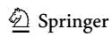

Most of the protected areas in Puerto Rico (~71%) are in the interior mountains coinciding with the location of the original remnants of the 10% of forests that have persisted after the arrival of the Spanish in 1493. In addition, most forest recovery occurred at higher elevations (Grau et al. [2003\)](#page-17-11). Protected areas in Puerto Rico are mostly small (1–115 km2 ), cover 16.1% of the total land surface (1436 km2 ), and include public and privately-owned land (Castro-Prieto et al. [2019](#page-16-14)). We focused our comparison on 150 terrestrial protected areas that are co-managed by the Department of Natural Resources of Puerto Rico, US Fish and Wildlife Services, USDA Forest Service and the Conservation Trust of Puerto Rico.

#### **Data collection**

We used acoustic data stored in the RFCx-ARBIMON platform [\(https://arbimon.rfcx.](https://arbimon.rfcx.org/home) [org/home](https://arbimon.rfcx.org/home)) to acquire detection/non-detection data on 13 bird and eight frog species. We selected audio recordings from 11 ecological projects conducted in and around several protected areas and including~700 sampling sites from 2015 to 2019 (Table [1](#page-3-0), Fig. [1](#page-4-0)). All 11 projects aimed to understand bird and frog distribution patterns in diferent regions of the island. MCC, TMA, JAC, and BAM were directly responsible for the deployment of audio recorders and the execution of 10 of the 11 projects. The selection of sampling sites within each project followed an approximate systematic sampling design to capture the full range of conditions found in each region. The only exception was the El Yunque National Forest project, where sites were deployed in three transects along an elevational gradient (see Campos and Aide 2017 for more details on sampling design). Approximately 50% of the sampling sites were inside protected areas and in high elevation areas (>400 m).

All audio recordings were collected using portable acoustic recorders (L.G. Android and Audiomoth), which were programmed to record at a sampling rate of 48 kHz with 24 kHz bandwidth, using a medium gain (30.6 dB) and following a schedule of 1-min

| Project                             | Birds |         |          | Frogs   |          |              |
| ----------------------------------- | ----- | ------- | -------- | ------- | -------- | ------------ |
|                                     | Year  | # sites | # pixels | # sites | # pixels | # Recordings |
| Casa_La_Selva                       | 2015  | 11      | 10       | 11      | 10       | 7,217        |
| LTER_LUQ_Waide                      | 2019  | 22      | 1        | 22      | 1        | 58,490       |
| Luquillo                            | 2019  | 64      | 18       | 64      | 20       | 100,245      |
| Mangroves_of_Puerto Rico            | 2017  | 20      | 16       | 20      | 16       | 32,329       |
| NCSU coqui monster                  | 2015  | 74      | 11       | 62      | 32       | 184,244      |
| Noise Puerto Rico                   | 2016  | 74      | 40       | 74      | 39       | 88,076       |
| USFS_PR_FIA                         | 2017  | 30      | 25       | 30      | 26       | 12,096       |
| USFWS_Carite_warbler                | 2016  | 57      | 11       | 57      | 11       | 85,309       |
| USFWS_Coqui_dorado                  | 2017  | 82      | 11       | 82      | 11       | 145,982      |
| USFWS_EWWA_Maricao                  | 2018  | 107     | 35       | 107     | 31       | 139,061      |
| USFWS-Puerto Rican Parrot Rio Abajo | 2018  | 133     | 100      | 135     | 101      | 135,411      |
| Total                               |       | 674     | 278      | 664     | 298      | 988,460      |

**Table 1** Summary of acoustic data collection in Puerto Rico

Identifed project is catalogued in the RFCx-ARBIMON (<https://arbimon.rfcx.org>). Number of sampling sites is denoted as # sites and the number of pixels used in the analyses is denoted as # pixels

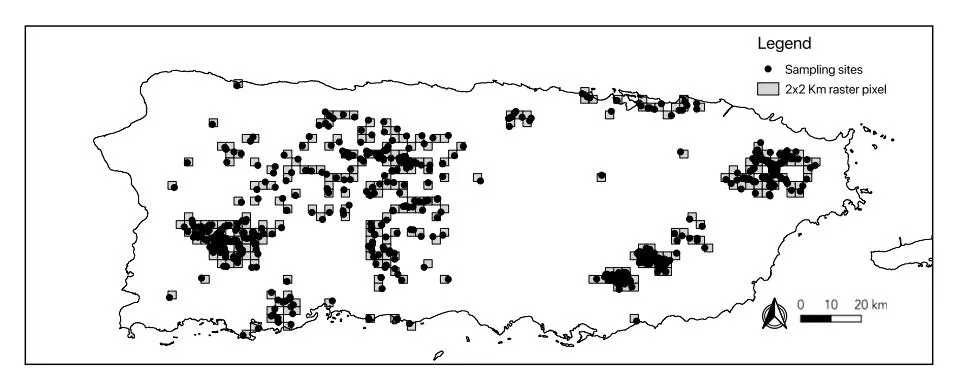

**Fig. 1** Approximate location of the sampling sites and raster pixels in Puerto Rico

audio recording every 10 min (i.e., in total 6 min of audio recordings per hour), 24 h per day for 1–2 weeks per sampling site. All recorders were placed at least 200 m from the nearest recorders on trees at the height of 1.5 m, and~50 m from any road with trafc. Previous feld tests conducted by our team indicate that the recorders can detect vocalizations of all focus species up to~100 m.

Because the historical and future climate data used in the analyses have a spatial resolution of 2×2 km, sampling sites were collapsed at the scale of the grid cell. In this way, we transferred values associated with the sampling points (detection/non-detection) to the spatially overlapping raster cells so that each point is assigned to a grid cell. The value of a grid cell was determined by the maximum values associated with the sampling points*.* In that way, a grid cell with points with detections and non-detections was assigned as occupied.

### **Species of greatest conservation need (SGCN)**

We selected species (Table [2](#page-5-0)) that were listed as SGCN by the most recent Puerto Rico State Wildlife Action Plan (PRSWAP 2019). Most SGCN have low and/or declining populations and are in need of conservation action. Teams composed of species experts used a standardized decision process to evaluate rarity, threats, and trends for each species according to NatureServe Conservation Status Assessment. The main objective of the PRSWAP is to identify and address the greatest conservation needs of Puerto Rico`s fsh and wildlife populations and to prioritize eforts for species with the greatest conservation needs. Due to modeling limitations, we removed species that occurred in less than six sampling sites.

Automated classifcation algorithms were used in the RFCx -ARBIMON II platform to determine the presence and absence of each species in the audio recordings. Classifcations of all recordings were based on a template matching procedure. This procedure searches through the audio data (~900,000 1-min recordings) for acoustic signals and detects regions that have a high correlation with a template that has been selected by the user. All regions of interest (ROIs) with values above the selected correlation threshold (0.1) were presented as potential detections for posterior validations (LeBien et al. [2020](#page-17-12)). The selection of a low threshold resulted in a high number of false positives though the number of false negatives was negligible. MCC and two other experts in Puerto Rico fauna (Noelia Nieves and Nashally F. Mercado) manually reviewed the template matching results. In this step, we annotated the results as either positive or negative, indicating the corresponding

**Table 2** Species selected for the species distribution models

| Common name                 | Scientifc name                  | Category | Range | #pixels |     |
| --------------------------- | ------------------------------- | -------- | ----- | ------- | --- |
| Birds                       |                                 |          |       |         |     |
| Broad-winged Hawk           | Buteo platypterus brunnescens   | CR       | E     | 12      |     |
| Puerto Rican Nightjar       | Antrostomus noctitherus         | EN       | E     | 16      |     |
| Ruddy Quail-Dove            | Geotrygon montana               | DD       | N     | 7       |     |
| Puerto Rican Lizard- Cuckoo | Coccyzus vieilloti              | DD       | E     | 128     |     |
| Elfn Woods warbler          | Setophaga angelae               | EN       | E     | 24      |     |
| Adelaide's Warbler          | Setophaga adelaidae             | LR       | E     | 84      |     |
| Puerto Rican bullfnch       | Loxigilla portoricensis         | LR       | E     | 198     |     |
| Puerto Rican Tanager        | Nesospingus speculiferus        | DD       | E     | 78      |     |
| Puerto Rican Spindalis      | Spindalis portoricensis         | LR       | E     | 128     |     |
| Black-whiskered Vireo       | Vireo altiloquus                | DD       | N     | 216     |     |
| Puerto Rican Vireo          | Vireo latimeri                  | VU       | E     | 102     |     |
| Puerto Rican Oriole         | Icterus portoricensis           | DD       | E     | 60      |     |
| Puerto Rican Woodpecker     | Melanerpes portoricensis        | LR       | E     | 155     |     |
| Frogs                       |                                 |          |       |         |     |
| Warty Coqui                 | Eleutherodactylus locustus      | VU       | E     | 7       |     |
| Richmond's Coqui            | Eleutherodactylus richmondi     | VU       | E     | 12      |     |
| Puerto Rican Mountain Coqui | Eleutherodactylus portoricensis | VU       | E     | 20      |     |
| Grass Coqui                 | Eleutherodactylus brittoni      | DD       | E     | 129     |     |
| Cricket Coqui               | Eleutherodactylus gryllus       | EN       | E     | 6       |     |
| Hedrick's Coqui             | Eleutherodactylus hedricki      | EN       | E     | 20      |     |
| Burrowing Coqui             | Eleutherodactylus unicolor      | VU       | E     | 10      |     |
| Wrinkled Coqui              | Eleutherodactylus wightmanae    | EN       | E     | 56      |     |

Category defnitions following IUCN [\(2020](#page-17-13)): _CR_ Critically endangered, _EN_ Endangered, _VU_ Vulnerable, _LR_ Low risk, _DD_ Data defcient. Range defnitions: _E_ Endemic, _N_ Native. #pixels denote the number of 2×2 km pixels occupied by each species

species presence or absence. This ensured that the fnal data set used in the analyses only included expert verifed detections and the exclusion of all false positive detections.

### **Climatic data and projections**

Monthly precipitation estimates for the period 1980–2018 (39 years) were derived by blending data from radar imagery from the National Oceanic and Atmospheric Administration (NOAA; [https://water.weather.gov/precip/\)](https://water.weather.gov/precip/) and rain gauge measurements from reporting stations obtained from the Global Historical Climatology Network (GHCN; Menne et al. [2012](#page-18-16)). This method attempted to reconcile two shortcomings in these datasets: (1) the radar data have a short period of record (2006–2017) and can sufer from biases compared to physical measurements of rainfall and (2) the rain gauge data are sparsely located and have signifcant observational gaps in the period of record. Given these two constraints, we developed an approach that leveraged aspects of both datasets. The radar data were used to estimate a seamless precipitation climatology, providing remotely-sensed observations in areas where rain gauge measurements are absent. The rain gauge data were used to estimate monthly precipitation anomalies (relative to the short climatological period) over the

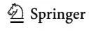

39-year period of interest. We used a 4-step procedure to assimilate data from these two independent sources, resulting in a single harmonized estimate of gridded (2 km×2 km resolution) monthly precipitation. First, monthly climatologies were calculated for both the radar data and the rain gauge network for the overlapping 12-year period (2006–2017) and were then used to calculate diferences between the rain gauges and the co-located radar data grid cells (i.e., the bias). Second, a geostatistical model (ordinary kriging with an elevation co-variate predictor) of the monthly climatological bias was built to predict the level of bias in the radar data at each 2 km×2 km grid cell. Note that in our bias calculations we are assuming that the rain-gauge measurements of precipitation represent 'truth'. We then subtracted the predicted monthly climatological bias from the gridded radar climatology to obtain the 'bias-corrected' precipitation climatology. Third, using the R package 'felds' (Furrer et al. [2017](#page-17-14)), we ft a Thin Plate Spline (TPS) model to interpolate the variancestandardized monthly rain gauge anomalies (see Wilks [2011](#page-19-2)), and included elevation as a covariate to explain spatial variation. Finally, the interpolated rain gauge anomalies were then added to the bias-corrected radar climatology to produce estimated monthly precipitation amounts for the 2 km×2 km resolution grid.

A similar but simpler approach was used to estimate monthly maximum and minimum temperature over the same time period (1980–2018). A 'smart-interpolation' method was used where an assumed lapse rate of−6.8 °C/1000 m was frst applied to the observed temperature dataset (~25 high-quality weather stations from the GHCN dataset) to estimate a monthly climatology of 'sea level' temperatures. We then used a TPS model to interpolate these climatological values to a 240 m resolution grid. We chose to frst interpolate to a higher resolution (240 m) before aggregating to the common 2 km resolution grid to better resolve the fne-scale terrain efects on temperature. Prior work (Daly et al. [2003\)](#page-16-15) has shown that with the available station network density on the island, accurate interpolation could be accomplished at this resolution. This is expected to reduce bias in the fnal estimated 2 km resolution used in the full historical and future climate analysis.

The TPS model included a coastal-distance index to account for a moderating infuence of the ocean on minimum temperatures during cooler months (Daly et al. [2003\)](#page-16-15). Next, an inverse-distance weighting (IDW) model was used to interpolate monthly temperature anomalies from the raw station data. These anomalies were then added to the TPS-modeled climatologies after the lapse rate adjustment was re-applied to obtain estimated temperatures at the DEM-derived elevations. Finally, the monthly gridded temperatures were aggregated to the common 2 km×2 km resolution grid.

Projected precipitation and temperature were obtained from the outputs of two dynamically downscaled GCMs for the period 2040–2060 and compared to 1985–2005, using the Weather Research and Forecasting (or WRF) model (Bowden et al. accepted). These climate model simulations were run under the RCP8.5 scenario, a higher greenhouse gas emissions scenario at the upper range of what is considered the plausible bounds of future emissions trajectories. Dynamically downscaled climate models were used because the high spatial resolution (2 km×2 km) makes it possible to resolve small-scale climatic processes and the infuence of local topography and land surface energy exchanges on the island's climate. In addition, dynamical downscaling was used because the explicit resolution of atmospheric processes improves representation of physical feedback processes, such as cloud formation and moisture fuxes. These processes are difcult to account for in empirical models (Khalyani et al. [2016\)](#page-17-15) that assume stationary relationships between models and observations through time. We note that with only a single climate scenario and two GCMs, there is likely to be a large portion of the plausible future climate space that will not be sampled by the model space. Nevertheless, for the time period under consideration,

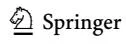

the climate model results are consistent with the majority of climate model projections for the region, which suggest widespread warming and drying in the eastern Caribbean (Chadwick [2017;](#page-16-16) Bhardwaj et al. [2018\)](#page-16-17). From the model outputs, we obtained the absolute temperature change and the relative precipitation change and applied them to our interpolated dataset of historical monthly temperature and precipitation to obtain a bias-corrected estimate of the projected change in these variables. Finally, 19 bioclimatic variables were derived from the temperature and precipitation estimates from 1980–2018 and 2040–2060 using the R package "dismo" (Hijmans et al. [2017\)](#page-17-16). Nevertheless, we further reduced the number of bioclimatic variables after excluding highly collinear variables for the analyses. We have also subdivided the 1980–2018 time period into past (1980–1989) and present (2005–2014) periods. The historical and current periods were selected based on periods that depicted an average representation of past and current climate without large natural disturbances (e.g., droughts and hurricanes). Because elevation is a good proxy for habitat types, intensity of land use, and animal and plant communities we have also included elevation along with the bioclimatic variables as predictors in the species distribution models.

### **Variable selection**

To avoid multicollinearity among the 19 candidate bioclimatic and physical covariates in the species distribution models, we used the VIF function (Variance Infation Factor) from the "usdm" package (Naimi [2015](#page-18-17)) in R version 3.6 (R Core Team [2017](#page-18-18)). This function progressively excludes collinear covariates through a stepwise procedure. VIFs were calculated using two methods: VIFcor (threshold=0.7) and VIFstep (Threshold=10). VIFcor method frst fnd a pair of variables which has the maximum linear correlation (greater than threshold) and exclude the variable with greater VIF. This procedure is repeated until no variable with a high correlation coefcient (greater than threshold) with other variables remains. VIFstep calculates VIF for all variables, then excludes the variable with the highest VIF (greater than threshold). The procedure is repeated until no variables with VIF greater than threshold remains. Only variables that were selected by both the VIFcor and VIFsteps approaches were used in the analyses. The same variables, at the same spatial resolution, were used to project species distributions into past and future climate scenarios (Table [3](#page-7-0)).

#### **Species distribution models**

The detection/non-detection data of the 21 species were used to create species distribution models for the current time period using nine methods commonly used in species

**Table 3** Variables used for modeling past, present, and future distributions of 21 species of birds and frogs in Puerto Rico

| Code  | Variable                                           | Units           |
| ----- | -------------------------------------------------- | --------------- |
| BIO4  | Temperature Seasonality (standard deviation)       | Degrees Celsius |
| BIO8  | Mean Temperature of Wettest Quarter                | Degrees Celsius |
| BIO15 | Precipitation Seasonality (Coefcient of Variation) | Percent         |
| BIO18 | Precipitation of Warmest Quarter                   | Millimeters     |
| Elev  | Elevation                                          | Meters          |

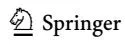

distribution studies (Hao et al. [2019\)](#page-17-9): generalized linear models (GLM), random forest (RF), support vector machine (SVM), boosted regression trees (BRT), classifcation and regression trees (CARS), maximum likelihood (MAXLIKE), multivariate adaptative regression spline (MARS), multi-layer perceptron (MLP) and radial basis function network (RBF). Models were created with default tunings (i.e., default settings for each ftted model). Models were built using ten runs using the subsampling data splitting method (n=10), so for each run, 80% of the data were used for training, and 20% percent for testing. Model performance was evaluated by two metrics (Allouche et al. [2006](#page-16-18)): (a) the area under the curve (AUC) of the receiver operating characteristic (ROC), a threshold-independent statistic that ranges from 0 (model equivalent to a random prediction) to 1 (perfect model discrimination between presence and absence records); and (b) the true skill statistic (TSS), a threshold-dependent statistic that ranges from−1 (model equivalent to a random prediction) to 1 (perfect model ft). Species distribution models with AUC<0.6 or TSS<0.3 were excluded from the ensemble procedure because their predictive powers were similar to random predictions. Predictions were made through ensemble models using the weighted averaging method based on TSS. Despite some recent critics about the use of ensemble models (Hao et al. [2020\)](#page-17-17), this approach is often recommended to address the uncertainty associated with using multiple modeling methods (Araújo and New [2007](#page-16-19); Thuiller et al. [2019](#page-18-19)). The use of multiple modeling methods to assess species distributions is reasonable, considering that no single model will capture the complexity of environmental factors infuencing species occurrence in time and space. By taking advantage of diferent modeling methods, we assume that each modeling method can contribute to assessing the species' distribution. The models created for the current time period (2005–2014) were then used to project species distributions for the historical and future periods using ensemble models and the climatic variables from 1980–1989 and 2040–2060, respectively. The historical and current time periods were selected based on time periods that depicted an average representation of past and current climate without large natural disturbances (e.g., droughts and hurricanes).

The relative importance of each variable was evaluated through a randomization procedure that measures the correlation between the covariates' predicted values and predictions in which the covariate under investigation is randomly permuted. If a variable's contribution to the model is high, then it is expected that the prediction is more afected by a permutation, and therefore the correlation is lower.

We generated binary maps for each species and each time period based on the mean threshold value among the diferent algorithm predictions of the sensitivity–specifcity equality approach (Liu et al. [2005](#page-18-20)). We also overlaid the binary maps for all three climate scenarios (historical, current, and future) to obtain distribution maps for always-suitable areas (i.e., areas with suitable habitats across the three climate scenarios). Contrary to the more common use of the current and future distribution to assess climate refugia, our ASA approach must agree in all three time periods (past, present, and future), and therefore we provide a more conservative approach in identifying potential areas for protection. ASA can be better understood as areas with high habitat stability that can allow the longterm persistence of the species, and therefore, ASA can be interpreted as a habitat refugia (Ashcroft [2010](#page-16-20)). By adding the historical component, we are taking into account possible historical range contractions due to biotic (e.g., diseases) and anthropogenic (e.g., urbanization) constrains that may underestimate species niche and infuence future projections (Nogués-Bravo [2009;](#page-18-21) Maguire et al. [2015](#page-18-14); Faurby and Araújo [2018;](#page-17-18) Santini et al. [2020](#page-18-22)). In that way, ASA focus on areas that consistently provide safe havens for species under changing climate and may provide the best chances for the survival of species under future

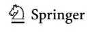

climate change. The identifcation of these suitable habitats can, therefore, help in prioritizing conservation areas, thus providing relevant information to policymakers. In addition, we created maps displaying the overlap of always-suitable areas for (1) birds, (2) frogs, and (3) birds and frogs combined and we calculated the percent and extent (km2 ) of total and accumulative ASA that overlap with protected areas and the percent and extent of total and accumulative ASA that do not overlap with protected areas.

All spatial analyses were carried out using the packages "raster," "usdm," and "sdm" implemented in R 3.6 program language (R Core Team [2017\)](#page-18-18) and QGIS software (Version 3.6).

One limitation of our study is that our modeling approach does not account for species detectability. Therefore, our models may be unrealistic and may underestimate species distributions (Lahoz-Monfort et al. [2014](#page-17-19); Guillera-Arroita et al. [2015\)](#page-17-10). Nevertheless, we have compared outputs from both occupancy models that take into account species detectability and ensemble models using the SDM package, and we have found similar patterns in species distributions (Campos-Cerqueira et al. unpubl). Therefore, we have chosen to use the SDM package because it provides a user-friendly platform that allows quick analyses of multiple species simultaneously using several modeling approaches.

# **Results**

The distributions of 21 bird and frog species were based on detection/non-detection data from>900,000 1-min recordings from~700 sites across Puerto Rico. Model performance assessed by average AUC varied from 0.63 (_Icterus portoricensis_) to 0.94 (_Eleutherodactylus unicolor_) (Fig. [2](#page-9-0), Table S1). Model performance accessed by averaged TSS varied from 0.31 (_Melanerpes portoricensis_) to 0.89 (_E. unicolor_).

Precipitation in the warmest quarter was the most important variable afecting frog distributions whereas temperature seasonality and precipitation in the warmest quarter were the most important variable afecting bird distribution (Table S2). Precipitation in the warmest quarter increased from the historical (1980–1989) to current time period (2005–2014) across the whole island (Fig. S1). The increase was less than 25 mm for most of the island, but there were areas in the northern karst region and the Central Cordillera where the increase was greater. In contrast, there was an overall drying trend

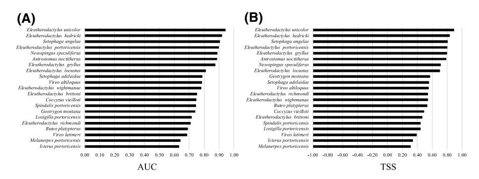

**Fig. 2** Discrimination performance of models as measured by **A** the area under the curve (AUC) and **B** the true skill statistic (TSS) for each species

from current conditions to the future (2040–2060). The models suggest that precipitation in the warmest quarter will decline for much of the island by 150 mm or more, and in parts of western Puerto Rico precipitation could decline by at least 325 mm. An exception to this trend is a portion of the Luquillo Mountains, which is projected to have a slight increase in precipitation (Fig. S1).

The distributions of birds varied greatly (Fig. S2). _Vireo altiloquus_ was the most widespread species in all periods, occurring in ~ 80% of Puerto Rico, followed by _Loxigilla portoricensis_ and _Melanerpes portoricensis_. All other species had limited distributions, occurring in less than 30% of Puerto Rico in any period. Three species (_Geotrygon montana, Nesospingus speculiferus,_ and _Setophaga angelae_) had very limited distributions occurring in less than 10% of Puerto Rico. ASA were very small (less than 10% of Puerto Rico) for seven bird species (_Buteo platypterus_, _Antrostomus noctitherus_, _Geotrygon montana_, _Icterus portoricensis_, _Nesospingus speculiferus_, _Setophaga angelae_, and _Vireo latimeri_). The stable areas of three of these seven species (_Antrostomus noctitherus_, _Vireo latimeri_, _Icterus portoricensis_) occurred mostly in the west portion of Puerto Rico. In contrast, the ASA for the other four species were mainly concentrated in montane rainforest habitats.

Most anuran species had limited distributions occurring in less than 10% of Puerto Rico (Fig. S2). In addition, ASA were extremally small (<2% of Puerto Rico) for the majority of frog species. The grass coqui (_Eleutherodactylus brittoni_) was the most widespread species occurring in over 39% of Puerto Rico. _Eleutherodactylus unicolor_ was detected only in the Luquillo Mountains in both historical and current time, and its distribution in all scenarios is restricted to this region. _Eleutherodactylus gryllus,_ and _E. portoricensis_ are both currently restricted to the Luquillo and Cayey Mountains. Although historically these species occurred in other regions (e.g., Central Cordillera), the Luquillo Mountains are the only ASA for these species. _Eleutherodactylus locustus_ was detected in the Luquillo and Cayey Mountains in both historical and current time periods, and the always-suitable areas encompass both regions and a small portion of the Toro Negro State Forest. _Eleutherodactylus hedricki_ was detected in the Luquillo, Cayey, and Toro Negro Mountains, both in historical and current time periods, but always-suitable areas encompass only the Luquillo Mountains. Although historically _E. richmondi_ occurred in several locations in Puerto Rico, currently, this species is mainly restricted to the Luquillo and Cayey Mountains and Maricao State Forest. The ASA for this species encompasses a small portion of the Cayey Mountains and several small localities along the Central Cordillera.

A large portion of ASA is outside of protected areas in Puerto Rico (≥80%) for birds, frogs, and birds and frogs combined (Table [4\)](#page-10-0). Despite the large extension of ASA outside protected areas, approximately 85% of protected areas overlap within ASA for at least one species (Table [5](#page-11-0)). These results show that the existing protected area network

**Table 4** Comparison of the extent of always-suitable areas (ASA) for at least one species that overlap with protected areas in Puerto Rico

|             | Birds          |          | Frogs          |          | Birds and frogs |          |
| ----------- | -------------- | -------- | -------------- | -------- | --------------- | -------- |
|             | Area (km2 ) | Area (%) | Area (km2 ) | Area (%) | Area (km2 )  | Area (%) |
| Overlap     | 1224           | 18       | 612            | 20       | 1344            | 17       |
| Non-overlap | 5580           | 82       | 2392           | 80       | 6668            | 83       |

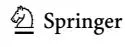

|             | Birds          |          | Frogs          |          | Birds and frogs |          |
| ----------- | -------------- | -------- | -------------- | -------- | --------------- | -------- |
|             | Area (km2 ) | Area (%) | Area (km2 ) | Area (%) | Area (km2 )  | Area (%) |
| Overlap     | 1224           | 78       | 612            | 39       | 1344            | 85       |
| Non-overlap | 348            | 22       | 960            | 61       | 228             | 15       |

**Table 5** Comparison of the extent of protected areas in Puerto Rico that overlap with always-suitable areas (ASA) for at least one species

is located in appropriate areas for species protection, but the extent of these areas captures<20% of the ASA. Furthermore, the protected area network captures a greater percent of the ASA of birds (78%) than for frogs (39%).

In general, the relationship between the accumulative number of overlapping distribution of species ASA and protected areas was the same for birds and frogs (Fig. [3](#page-11-1)). As the number of overlapping ASA species distribution increased there was a dramatic reduction in the extent of the area occupied, meaning that areas with a high number of overlapping species ASA distributions are relatively small compared with areas with just a few

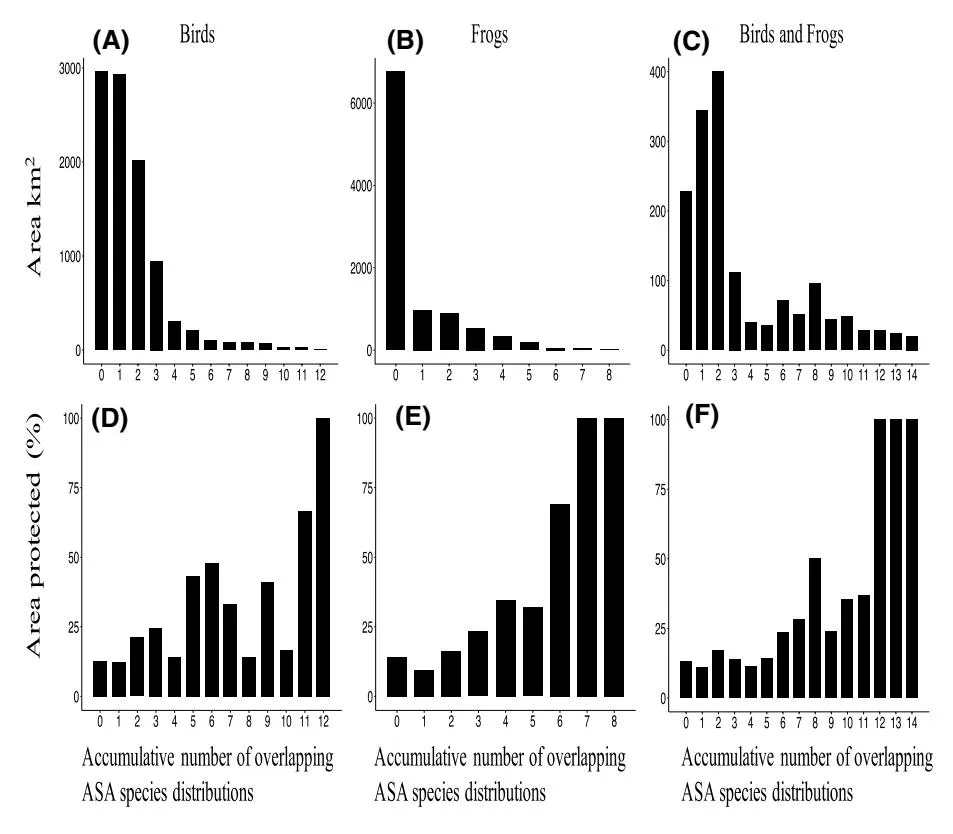

**Fig. 3** The relationship between the accumulative number of overlapping ASA species distributions and **A**– **C** extent (km2 ) of the overlapping area and **D**–**F** percent of the overlapping distribution that occurs within protected areas for **A** and **D** birds, **B** and **E** frogs, and **C** and **F** birds and frogs combined

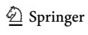

overlapping species ASA distributions. In contrast, the area with the greatest number of overlapping species had the highest level of protection. The area of overlap of ASA for more than six species was~96 km2 for frogs and 388 km2 for birds. Areas with a high number of overlapping ASA for frog species (>6 species) were restricted to few sites in the east (Luquillo Mountains), southeast (Cayey Mountains), and the Central Cordillera (Toro Negro) (Fig. [4\)](#page-12-0). In contrast, areas with a high number of overlapping ASA for bird species were restricted to the west (Maricao State Forest), northwest (Karst Mountains), and to a few sites in the east (Luquillo Mountains) (Fig. [4\)](#page-12-0).

The Maricao State Forest appears as an always-suitable area for the majority of bird species (12 species), followed by the northwest Karst mountains (9 species) and the Luquillo Mountains (7 species) (Fig. [4\)](#page-12-0). In contrast, the Luquillo Mountains appear as an alwayssuitable area for the majority of frog species (8 species), followed by a portion of Toro Negro (6 species) and Cayey Mountains (6 species) (Fig. [4\)](#page-12-0).

# **Discussion**

Our fndings indicate that existing protected areas in Puerto Rico will not sufce to safeguard Species of Greatest Conservation Need in the context of projected climatic changes that could occur by mid-century under a very high greenhouse gas emissions scenario. A larger portion of the always-suitable areas for several species are outside protected areas, which may compromise the long-term survival of these species. In addition, protected areas are relatively small and sparse, and this can hinder species movement and increase

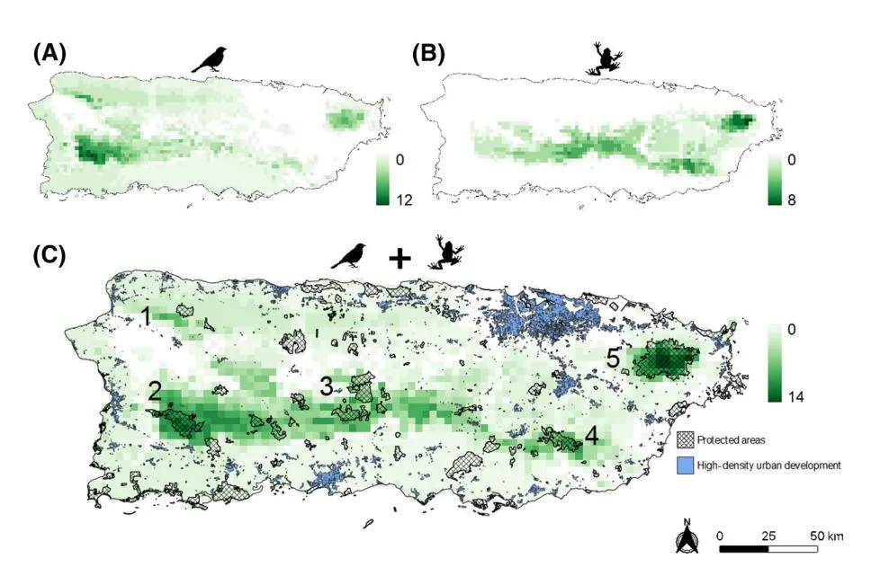

**Fig. 4** Map of overlapping always-suitable areas (ASA) for **A** birds, **B** frogs, and **C** birds and frogs combined. Numbers in the map denote main regions with a high number of overlapping species ASA: (1) Northwest Karst Mountains; (2) Maricao region; (3) Toro Negro region; (4) Cayey Mountains; (5) Luquillo Mountains

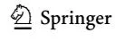

local extinction risk. Therefore, the establishment of new protected areas, bufer zones, and natural corridors can substantially improve the likelihood of species conservation and persistence even in an 'extreme' mid-century climate scenario. By combining species distribution projections from diferent time periods (i.e., historical, current, and future) and identifying the always-suitable area (i.e., ASA) for each species, we can assess habitat stability for species and identify and prioritize areas that are more likely to promote long-term survival of multiple species to mitigate the impacts of climate change.

Despite more than 80% of the always-suitable areas for several species are outside protected areas, three protected areas (El Yunque National Forest, Maricao State Forest and Carite State Forest) had high ASA overlap. Although these areas may play an important role in preserving bird and frog populations, they are currently isolated from other protected areas and land use intensity in the surrounding matrix may not support the wellbeing of remaining bird and frog population inside the protected areas. In addition, the extension of these areas captures<20% of the ASA.

Our study and others focused on the efects of climate change on species distributions (Lemes et al. [2014;](#page-18-9) Noce et al. [2017;](#page-18-23) Vasconcelos et al. [2018](#page-18-24); Báez et al. [2019](#page-16-11); Velazco et al. [2019\)](#page-18-11) are limited by the assumption that the current species distribution is at equilibrium with the environment. In contrast, the current distribution may refect past biotic (e.g., competition, predation, diseases, dispersal) or anthropogenic (e.g., urbanization, habitat degradation) efects, (Nogués-Bravo [2009](#page-18-21); Boulangeat et al. [2012;](#page-16-21) Maguire et al. [2015\)](#page-18-14). In addition, species niches are not static, and current distributions may refect the adaptation of species to past and current climate conditions (Nogués-Bravo [2009](#page-18-21)). There is also much discussion about using binarization to determine suitable and unsuitable areas. Although some studies have advocated against this approach (Guillera-Arroita et al. [2015](#page-17-10); Santini et al. [2020](#page-18-22)), there are few alternative solutions. To address these limitations, we provide a conservative approach that requires suitable areas to agree in the three time periods and include several species from two taxonomic groups.

Another limitation of our study is a sampling gap in part of the Central Mountains (Fig. [1\)](#page-4-0). Nevertheless, our work provides the most comprehensive efort in acquiring detection/non-detection data using a standardized methodology, and current species distribution projections are in agreement with our experience in the feld. Furthermore, there are few species records for this region in other databases (e.g., Global Biodiversity Information Facility—GBIF).

Overall, the distributions of individual frog species were more limited than those of the bird species, and consequently, patterns of occurrence in the protected areas and ASA are diferent for frogs and birds. Frogs had lower representativeness in the protected areas than bird species, a pattern also observed at the global scale (Rodrigues et al. [2004\)](#page-18-5), and unfortunately most of the always-suitable areas for both frogs and bird species occurred outside of protected areas. Always-suitable areas for frogs are mostly concentrated in the eastern and central mountains of the island, which are more humid and receive more precipitation than the western part of the island (Daly et al. [2003\)](#page-16-15). In contrast, always-suitable areas for birds are mainly concentrated in the western part of the island. The limited distribution of the frog species associated with a small overlap with protected areas and poor dispersion abilities may increase frog species vulnerability to extinction due to natural and human disturbances. Given that almost all frog species in Puerto Rico are already under a threat category (IUCN [2020\)](#page-17-13), expansion of protected areas to incorporate the present and future distributions of these species may be necessary to ensure continued persistence.

Although birds have higher dispersal abilities than frogs, increasing connectivity between protected areas may also beneft bird populations. For instance, two endemic and

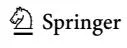

forest specialist bird species (_Nesospingus speculiferus_ and _Setophaga angelae_) currently occur only in a few isolated populations in montane forests suggesting either poor dispersal abilities or specifc habitat requirements. Expanding protected areas and connectivity can also mitigate the efects of natural disturbances such as hurricanes and droughts on fauna (Campos-Cerqueira and Aide [2021](#page-16-22); Wunderle [1995\)](#page-19-3) by providing a better representation of diverse landscapes. Alternatively, and complementary, the development of bufer zones around protected areas may ofer a cheaper solution to increase connectivity. Several studies have shown that an increase in forested coverage around protected areas can increase their capacity to conserve viable populations (DeFries et al. [2005;](#page-16-23) Hull et al. [2011;](#page-17-20) Xu et al. [2016\)](#page-19-4).

Most of the always-suitable areas are in higher elevations (>400 m), with a clear spatial west–east pattern along the central cordillera. It is not a surprise that most of the overlap of always-suitable areas occur in regions at high elevations because these areas coincide with forest refugia during the intense agricultural phase that occurred in Puerto Rico between 1800 and 1940. In addition, many species are moving toward high elevation areas in Puerto Rico (Campos-Cerqueira and Aide [2017;](#page-16-2) Campos-Cerqueira et al. [2017](#page-16-24)) and other regions of the world (Chen et al. [2011\)](#page-16-0) due to climate change. Therefore, given the essential role that high elevation areas play in species distribution any strategic plan to improve the conservation of SCGN will need to focus on the protection of areas around the Central Cordillera.

Secondary forest with diferent ages now covers more than 50% of the island. However, these new forests are still spatially fragmented and mainly concentrated in mountainous regions, whereas high-density urban areas and the few remaining agropastoral activities remain concentrated in the lowlands (Gould et al. [2012](#page-17-21)). Despite having suitable climatic conditions for the occurrence of species in the long-term, the ability of these secondary forest to provide essential resources (e.g., nesting cavities) to long-term species occurrence remain to be tested. Although forest cover has remained stable since 2004, the human population is still declining, and the likelihood that forest cover will increase is high. In this optimistic scenario, always-suitable areas outside protected areas will remain in land cover states less modifed by humans and will be able to provide stable habitats for SGCN, provided that these secondary forests allow long-term species occurrence. Nevertheless, a recent study shows a 90% increase in residential development around protected areas in Puerto Rico between 2000 and 2010 (Castro-Prieto et al. [2017\)](#page-16-13), despite the human population decline, which may compromise the future of always-suitable areas outside protected areas. In this scenario, the establishment of new protected areas in locations with a high number of overlapping ASA from species of great conservation need may be the best conservation strategy. Alternatively, and complementarily, assisted migration, captive breeding, and reintroduction may also be part of future conservation planning (Loss et al. [2011](#page-18-25)), especially with species with low dispersal abilities like frogs.

The approach presented in this study to assess the efectiveness of protected areas to promote species persistence can be easily applied in other parts of the world to identify always-suitable areas for several taxonomic groups and evaluate the role of protected areas in the context of climate change: (1) historical, current and future climate data from around the world are currently available online (e.g., Worldclim; Fick and Hijmans [2017](#page-17-22)), (2) audio recorders are more accessible and afordable (e.g. Audiomoth; Hill et al. [2019](#page-17-23)), and (3) accessible analytical platforms to store, manage and analyses audio recordings and extract data for species distribution models already exist (i.e., RFCx-ARBIMON; LeBien et al. [2020\)](#page-17-12). Furthermore, several user-friendly R packages are available to create species distribution models. Given the speed of projected climatic changes, the variability

in species-level responses, and the fact that only 12% of the Earth's surface (and 16% in Puerto Rico; Castro-Prieto et al. [2019\)](#page-16-14) is currently under some form of legal protection (Jenkins and Joppa [2009](#page-17-24); Joppa and Pfaf [2011](#page-17-25)), efective conservation actions will also likely require eforts to systematically improve the extent, frequency, and duration of longterm monitoring of fauna.

# **Conclusions**

Some protected areas in Puerto Rico provide always-suitable habitats for many bird and frog species, helping to conserve these species in a future, which may include extreme climate change. Nevertheless, long-term protection of these species may not be successful given that (1) regions with a high number of overlapping ASA species are relatively small, (2) protected areas are small and sparse (Castro et al. 2019), and (3) large portion (~80%) of always-suitable areas is currently outside protected areas. Focusing special attention to the large proportion of always suitable areas currently outside protected areas may be efective in planning investments for regional conservation. To our knowledge, no new protected areas have been established in Puerto Rico to address the impact of climate on species distributions; nevertheless, we already have all the tools to identify and prioritize areas that are more likely to safeguard species in a global change scenario.

**Supplementary Information** The online version contains supplementary material available at [https://doi.](https://doi.org/10.1007/s10531-021-02258-9) [org/10.1007/s10531-021-02258-9.](https://doi.org/10.1007/s10531-021-02258-9)

**Acknowledgements** This project was funded jointly through a collaborative agreement between U.S. Fish and Wildlife Service, Science Applications program and the U.S. Forest Service International Institute for Tropical Forestry. The fndings and conclusions in this article are those of the authors and do not necessarily represent the views of the U.S. Fish and Wildlife Service or the USDA Forest Service. Any use of trade, frm, or product names is for descriptive purposes only and does not imply endorsement by the U.S. Government. We thank Nashally F. Mercado, Noelia Nieves and Kristopher Harmon for assistance with data collection.

**Author contributions** Conceptualization: MCC, TMA, BAM. Funding acquisition: MCC, TMA, JAC, BAM. Project administration: TMA, JAC, BAM. Data collection: MCC, JAC, AJT. Data analyses and modelling: MCC, TMA, AJT. Writing—original draft: MCC, TMA, AJT. Writing—review and editing: MCC, TMA, JAC, AJT, BAM.

**Data availability** The acoustic data including recordings, sampling sites coordinates, elevation data, validation data are permanently stored and available at <https://arbimon.rfcx.org>.

#### **Declarations**

**Confict of interest** The authors have no conficts of interest to declare that are relevant to the content of this article.

**Open Access** This article is licensed under a Creative Commons Attribution 4.0 International License, which permits use, sharing, adaptation, distribution and reproduction in any medium or format, as long as you give appropriate credit to the original author(s) and the source, provide a link to the Creative Commons licence, and indicate if changes were made. The images or other third party material in this article are included in the article's Creative Commons licence, unless indicated otherwise in a credit line to the material. If material is not included in the article's Creative Commons licence and your intended use is not permitted by statutory regulation or exceeds the permitted use, you will need to obtain permission directly from the copyright holder. To view a copy of this licence, visit [http://creativecommons.org/licenses/by/4.0/.](http://creativecommons.org/licenses/by/4.0/)

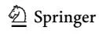

# **References**

- Alagador D, Cerdeira JO, Araújo MB (2014) Shifting protected areas: scheduling spatial priorities under climate change. J Appl Ecol 51:703–713. <https://doi.org/10.1111/1365-2664.12230>
- Allouche O, Tsoar A, Kadmon R (2006) Assessing the accuracy of species distribution models: prevalence, kappa and the true skill statistic (TSS). J Appl Ecol 43:1223–1232. [https://doi.org/10.1111/j.1365-](https://doi.org/10.1111/j.1365-2664.2006.01214.x) [2664.2006.01214.x](https://doi.org/10.1111/j.1365-2664.2006.01214.x)
- Araújo MB, Guisan A (2006) Five (or so) challenges for species distribution modelling. J Biogeogr 33:1677–1688. <https://doi.org/10.1111/j.1365-2699.2006.01584.x>
- Araújo MB, New M (2007) Ensemble forecasting of species distributions. Trends Ecol Evol 22:42–47. <https://doi.org/10.1016/j.tree.2006.09.010>
- Araújo MB, Cabeza M, Thuiller W et al (2004) Would climate change drive species out of reserves? An assessment of existing reserve-selection methods. Glob Change Biol 10:1618–1626. [https://doi.org/](https://doi.org/10.1111/j.1365-2486.2004.00828.x) [10.1111/j.1365-2486.2004.00828.x](https://doi.org/10.1111/j.1365-2486.2004.00828.x)
- Araújo MB, Alagador D, Cabeza M et al (2011) Climate change threatens European conservation areas. Ecol Lett 14:484–492. <https://doi.org/10.1111/j.1461-0248.2011.01610.x>
- Ashcroft MB (2010) Identifying refugia from climate change. J Biogeogr 37:1407–1413. [https://doi.org/](https://doi.org/10.1111/j.1365-2699.2010.02300.x) [10.1111/j.1365-2699.2010.02300.x](https://doi.org/10.1111/j.1365-2699.2010.02300.x)
- Báez JC, Barbosa AM, Pascual P et al (2019) Ensemble modeling of the potential distribution of the whale shark in the Atlantic Ocean. Ecol Evol 10:175–184.<https://doi.org/10.1002/ece3.5884>
- Beaumont LJ, Esperón-Rodríguez M, Nipperess DA et al (2019) Incorporating future climate uncertainty into the identifcation of climate change refugia for threatened species. Biol Cons 237:230– 237.<https://doi.org/10.1016/j.biocon.2019.07.013>
- Bhardwaj A, Misra V, Mishra A et al (2018) Downscaling future climate change projections over Puerto Rico using a non-hydrostatic atmospheric model. Clim Change 147:133–147
- Blake JG, Loiselle BA (2015) Enigmatic declines in bird numbers in lowland forest of eastern Ecuador may be a consequence of climate change. PeerJ 3:e1177. <https://doi.org/10.7717/peerj.1177>
- Borges FJA, Ribeiro BR, Lopes LE, Loyola R (2019) Bird vulnerability to climate and land use changes in the Brazilian Cerrado. Biol Cons 236:347–355. <https://doi.org/10.1016/j.biocon.2019.05.055>
- Boulangeat I, Gravel D, Thuiller W (2012) Accounting for dispersal and biotic interactions to disentangle the drivers of species distributions and their abundances. Ecol Lett 15:584–593. [https://doi.org/](https://doi.org/10.1111/j.1461-0248.2012.01772.x) [10.1111/j.1461-0248.2012.01772.x](https://doi.org/10.1111/j.1461-0248.2012.01772.x)
- Campos-Cerqueira M, Wayne A, Wunderle JM et al (2017) Have bird distributions shifted along an elevational gradient on a tropical mountain? Ecol Evol 7:1–11.<https://doi.org/10.1002/ece3.3520>
- Campos-Cerqueira M, Aide TM (2017) Lowland extirpation of anuran populations on a tropical mountain. PeerJ 5:e4059. <https://doi.org/10.7717/peerj.4059>
- Campos-Cerqueira M, Aide TM (2021) Impacts of a drought and hurricane on tropical bird and frog distributions. Ecosphere 12(1):p.e03352
- Castro-Prieto J, Martinuzzi S, Radelof VC et al (2017) Declining human population but increasing residential development around protected areas in Puerto Rico. Biol Cons 209:473–481. [https://doi.org/](https://doi.org/10.1016/j.biocon.2017.02.037) [10.1016/j.biocon.2017.02.037](https://doi.org/10.1016/j.biocon.2017.02.037)
- Castro-Prieto J, Gould W, Ortiz-Maldonado C, Soto-Bayó S, Llerandi-Román I, Gaztambide-Arandes S, Quinones M, Cañón M, Jacobs KR (2019) A comprehensive inventory of protected areas and other land conservation mechanisms in Puerto Rico. Gen. Tech. Report IITFGTR-50. San Juan, PR: U.S. Department of agriculture forest service, international institute of tropical forestry p 161
- Chadwick R (2017) Sub-tropical drying explained. Nature Clim Change 7:10–11
- Chen I, Hill JK, Ohlemüller R et al (2011) Rapid range shifts of species associated with high levels of climate warming. Science 333:1024–1026
- Chen I, Hill JK, Ohlemüller R et al (2012) Rapid range shifts of species. Science 1024:17–20. [https://](https://doi.org/10.1126/science.1206432) [doi.org/10.1126/science.1206432](https://doi.org/10.1126/science.1206432)
- Daly C, Helmer EH, Quinones M (2003) Mapping the climate of Puerto Rico, Vieques and Culebra. Int J Climatol 23:1359–1381. <https://doi.org/10.1002/joc.937>
- DeFries R, Hansen A, Newton AC, Hansen MC (2005) Increasing isolation of protected areas in tropical forests over the past twenty years. Ecol Appl 15:19–26. <https://doi.org/10.1890/03-5258>
- Elith J, Leathwick JR (2009) Species distribution models: ecological explanation and prediction across space and time. Annu Rev Ecol Evol Syst 40:677–697. [https://doi.org/10.1146/annurev.ecolsys.](https://doi.org/10.1146/annurev.ecolsys.110308.120159) [110308.120159](https://doi.org/10.1146/annurev.ecolsys.110308.120159)
- Elsen PR, Monahan WB, Dougherty ER, Merenlender AM (2020) Keeping pace with climate change in global terrestrial protected areas. Sci Adv 6(25):p.eaay0814. [https://doi.org/10.1126/sciadv.aay08](https://doi.org/10.1126/sciadv.aay0814) [14](https://doi.org/10.1126/sciadv.aay0814)

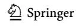

- Faurby S, Araújo MB (2018) Anthropogenic range contractions bias species climate change forecasts. Nat Clim Chang 8:252–256.<https://doi.org/10.1038/s41558-018-0089-x>
- Fick SE, Hijmans RJ (2017) WorldClim 2: new 1-km spatial resolution climate surfaces for global land areas. Int J Climatol 37:4302–4315
- Furrer, R., Nychka, D. & Sain, S. (2017) Tools for spatial data. R pack- age version 6.3. [http://cran.r](http://cran.r-project.org/package=fields.)[project.org/package=felds.](http://cran.r-project.org/package=fields.) Accessed 1 Feb 2017.
- Gallardo B, Aldridge DC, González-Moreno P et al (2017) Protected areas ofer refuge from invasive species spreading under climate change. Glob Change Biol 23:5331–5343. [https://doi.org/10.1111/](https://doi.org/10.1111/gcb.13798) [gcb.13798](https://doi.org/10.1111/gcb.13798)
- García-Rodríguez A, Chaves G, Benavides-Varela C, Puschendorf R (2012) Where are the survivors? Tracking relictual populations of endangered frogs in Costa Rica. Divers Distrib 18(2):204–212
- Gaüzère P, Jiguet F, Devictor V (2016) Can protected areas mitigate the impacts of climate change on bird's species and communities? Divers Distrib 22:625–637.<https://doi.org/10.1111/ddi.12426>
- Gould WA, Martinuzzi S, Parés-Ramos IK (2012) Land use, population dynamics, and land-cover change in eastern Puerto Rico. Professional paper 1789-B Reston. In: Murphy SF, Stallard RF (eds) Chapter B of water quality and landscape processes of four watersheds in eastern Puerto Rico. US Department of the Interior, US Geological Survey
- Grau HR, Aide TM, Zimmerman JK et al (2003) The ecological consequences of socioeconomic and land-use changes in postagriculture Puerto Rico. Bioscience 53:1159–1168
- Guillera-Arroita G, Lahoz-Monfort JJ, Elith J et al (2015) Is my species distribution model ft for purpose? Matching data and models to applications. Glob Ecol Biogeogr 24:276–292. [https://doi.org/10.1111/geb.](https://doi.org/10.1111/geb.12268) [12268](https://doi.org/10.1111/geb.12268)
- Hannah L (2008) Protected areas and climate change. Ann N Y Acad Sci 1134:201–212
- Hannah L, Midgley G, Andelman S et al (2007) Protected area needs in a changing climate. Front Ecol Environ 5:131–138. [https://doi.org/10.1890/1540-9295\(2007\)5\[131:PANIAC\]2.0.CO;2](<https://doi.org/10.1890/1540-9295(2007)5[131:PANIAC]2.0.CO;2>)
- Hannah L, Roehrdanz PR, Marquet PA et al (2020) 30% land conservation and climate action reduces tropical extinction risk by more than 50%. Ecography 43:943–953.<https://doi.org/10.1111/ecog.05166>
- Hao T, Elith J, Guillera-Arroita G, Lahoz-Monfort JJ (2019) A review of evidence about use and performance of species distribution modelling ensembles like BIOMOD. Divers Distrib 25:839–852. [https://doi.org/10.](https://doi.org/10.1111/ddi.12892) [1111/ddi.12892](https://doi.org/10.1111/ddi.12892)
- Hao T, Elith J, Lahoz-Monfort JJ, Guillera-Arroita G (2020) Testing whether ensemble modelling is advantageous for maximising predictive performance of species distribution models. Ecography 43:549–558. <https://doi.org/10.1111/ecog.04890>
- Heikkinen RK, Luoto M, Araújo MB et al (2006) Methods and uncertainties in bioclimatic envelope modelling under climate change. Prog Phys Geogr 30:751–777.<https://doi.org/10.1177/0309133306071957>
- Hijmans RJ, Phillips S, Leathwick J et al (2017) Package 'dismo.' Circles 9:1–68
- Hill AP, Prince P, Snaddon JL et al (2019) AudioMoth: a low-cost acoustic device for monitoring biodiversity and the environment. HardwareX 6:e00073
- Hole DG, Huntley B, Arinaitwe J et al (2011) Toward a management framework for networks of protected areas in the face of climate change. Conserv Biol.<https://doi.org/10.1111/j.1523-1739.2010.01633.x>
- Hull V, Xu W, Liu W et al (2011) Evaluating the efcacy of zoning designations for protected area management. Biol Cons 144:3028–3037. <https://doi.org/10.1016/j.biocon.2011.09.007>
- IUCN 2020. The IUCN red list of threatened species. Version 2020-1. [https://www.iucnredlist.org.](https://www.iucnredlist.org) Accessed 01 Feb 2020.
- Jenkins CN, Joppa L (2009) Expansion of the global terrestrial protected area system. Biol Cons 142:2166– 2174.<https://doi.org/10.1016/j.biocon.2009.04.016>
- Joppa LN, Pfaf A (2011) Global protected area impacts. Proc Royal Soc B 278:1633–1638. [https://doi.org/10.](https://doi.org/10.1098/rspb.2010.1713) [1098/rspb.2010.1713](https://doi.org/10.1098/rspb.2010.1713)
- Khalyani AH, Gould WA, Harmsen E et al (2016) Climate change implications for tropical islands: interpolating and interpreting statistically downscaled GCM projections for management and planning. J Appl Meteorol Climatol 55:265–282
- Lahoz-Monfort JJ, Gurutzeta G-A, Wintle BA (2014) Imperfect detection impacts the performance of species distribution models. Glob Ecol Biogeogr 23:504–515. <https://doi.org/10.1111/geb.12138>
- le Saout S, Hofmann M, Shi Y et al (2013) Protected areas and efective biodiversity conservation. Science 342:803–805
- LeBien J, Zhong M, Campos-Cerqueira M et al (2020) A pipeline for identifcation of bird and frog species in tropical soundscape recordings using a convolutional neural network. Ecol Inform. [https://doi.org/10.](https://doi.org/10.1016/j.ecoinf.2020.101113) [1016/j.ecoinf.2020.101113](https://doi.org/10.1016/j.ecoinf.2020.101113)

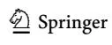

- Lehikoinen P, Santangeli A, Jaatinen K et al (2019) Protected areas act as a bufer against detrimental efects of climate change—evidence from large-scale, long-term abundance data. Glob Change Biol 25:304–313. <https://doi.org/10.1111/gcb.14461>
- Lemes P, Melo AS, Loyola RD (2014) Climate change threatens protected areas of the Atlantic Forest. Biodivers Conserv 23:357–368.<https://doi.org/10.1007/s10531-013-0605-2>
- Liu C, Berry PM, Dawson TP, Pearson RG (2005) Selecting thresholds of occurrence in the prediction of species distributions. Ecography 28:385–393.<https://doi.org/10.1111/j.0906-7590.2005.03957.x>
- Loss SR, Terwilliger LA, Peterson AC (2011) Assisted colonization: integrating conservation strategies in the face of climate change. Biol Cons 144:92–100
- Mackey BG, Watson JEM, Hope G, Gilmore S (2008) Climate change, biodiversity conservation, and the role of protected areas: an Australian perspective. Biodiversity 9:11–18. [https://doi.org/10.1080/14888386.](https://doi.org/10.1080/14888386.2008.9712902) [2008.9712902](https://doi.org/10.1080/14888386.2008.9712902)
- Maguire KC, Nieto-lugilde D, Fitzpatrick MC et al (2015) Modeling species and community responses to past, present, and future episodes of climatic and ecological change. Annu Rev Ecol Evol Syst 46:343–368. <https://doi.org/10.1146/annurev-ecolsys-112414-054441>
- Marcano-Vega H (2017) Forests of Puerto Rico, 2014. Resource Update FS–121. Asheville, NC: U.S. Depart Agric For Ser S Re Sta 4.<https://doi.org/10.2737/FS-RU-121>
- Menne MJ, Durre I, Vose RS et al (2012) An overview of the global historical climatology network-daily database. J Atmos Oceanic Tech 29:897–910
- Monzón J, Moyer-Horner L, Palamar MB (2011) Climate change and species range dynamics in protected areas. Bioscience 61:752–761.<https://doi.org/10.1525/bio.2011.61.10.5>
- Naimi B (2015) usdm: uncertainty analysis for species distribution models. R Documentation [http://www.](http://www.rdocu-mentationorg/packages/usdm) [rdocu-mentationorg/packages/usdm](http://www.rdocu-mentationorg/packages/usdm)
- Noce S, Collalti A, Santini M (2017) Likelihood of changes in forest species suitability, distribution, and diversity under future climate: the case of Southern Europe. Ecol Evol 7:9358–9375. [https://doi.org/10.1002/](https://doi.org/10.1002/ece3.3427) [ece3.3427](https://doi.org/10.1002/ece3.3427)
- Nogués-Bravo D (2009) Predicting the past distribution of species climatic niches. Glob Ecol Biogeogr 18:521– 531.<https://doi.org/10.1111/j.1466-8238.2009.00476.x>
- Nunez S, Arets E, Alkemade R et al (2019) Assessing the impacts of climate change on biodiversity: is below 2 °C enough? Clim Change 154:351–365. <https://doi.org/10.1007/s10584-019-02420-x>
- Parmesan C, Yohe G (2003) A globally coherent fngerprint of climate change impacts across natural systems. Nature 421:37–42. <https://doi.org/10.1038/nature01286>
- R Core Team (2017). R: A language and environment for statistical computing. R Foundation for Statistical Computing, Vienna, Austria. [http://www.R-project.org/.](http://www.R-project.org/)
- Rodrigues ASL, Andelman SJ, Bakan MI et al (2004) Efectiveness of the global protected area network in representing species diversity. Nature 428:640–643. <https://doi.org/10.1038/nature02422>
- Rosenberg KV, Dokter AM, Blancher PJ, Sauer JR, Smith AC, Smith PA, Stanton JC, Panjabi A, Helft L, Parr M, Marra PP (2019) Decline of the North American avifauna. Science 366(6461):120–124
- Sánchez-Bayo F, Wyckhuys KAG (2019) Worldwide decline of the entomofauna: a review of its drivers. Biol Cons 232:8–27. <https://doi.org/10.1016/j.biocon.2019.01.020>
- Santini L, Benítez-López A, Čengić M, et al (2020) Assessing the reliability of species distribution projections in climate change research. BioRxiv
- Seo C, Thorne JH, Hannah L, Thuiller W (2009) Scale efects in species distribution models: implications for conservation planning under climate change. Biol Let 5:39–43.<https://doi.org/10.1098/rsbl.2008.0476>
- Thuiller W, Guéguen M, Renaud J et al (2019) Uncertainty in ensembles of global biodiversity scenarios. Nat Commun 10:1–9.<https://doi.org/10.1038/s41467-019-09519-w>
- Vale MM, Souza Tv, Alves MAS, Crouzeilles R (2018) Planning protected areas network that are relevant today and under future climate change is possible: the case of Atlantic Forest endemic birds. PeerJ 2018:1–20. <https://doi.org/10.7717/peerj.4689>
- Vasconcelos TS, do Nascimento BTM, Prado VHM (2018) Expected impacts of climate change threaten the anuran diversity in the Brazilian hotspots. Ecol Evol 17:7894–7906.<https://doi.org/10.1002/ece3.4357>
- Velazco SJE, Villalobos F, Galvão F, de Marco JP (2019) A dark scenario for Cerrado plant species: efects of future climate, land use and protected areas inefectiveness. Divers Distrib 25:660–673. [https://doi.org/10.](https://doi.org/10.1111/ddi.12886) [1111/ddi.12886](https://doi.org/10.1111/ddi.12886)
- Virkkala R, Heikkinen RK, Kuusela S et al (2019) Signifcance of protected area network in preserving biodiversity in a changing northern european climate. Handbook of climate change and biodiversity. Springer, Cham, pp 377–390
- Wang Q, Yang L, Ranjitkar S et al (2017) Distribution and in situ conservation of a relic chinese oil woody species _Xanthoceras sorbifolium_ (Yellowhorn). Can J Res 47:1450–1456. [https://doi.org/10.1139/](https://doi.org/10.1139/cjfr-2017-0210) [cjfr-2017-0210](https://doi.org/10.1139/cjfr-2017-0210)

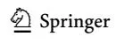

Welch D (2005) What should protected areas managers do in the face of climate change? George Wright Forum 22:75–93

Wiens JJ (2016) Climate-related local extinctions are already widespread among plant and animal species. PLoS Biol 14:e2001104. <https://doi.org/10.1371/journal.pbio.2001104>

Wilks DS (2011) Statistical methods in the atmospheric sciences. Academic press, Cambridge

Wunderle JM (1995) Responses of bird populations in a Puerto Rican forest to hurricane Hugo: the frst 18 months. Condor 97:879–896

Xu W, Li X, Pimm SL et al (2016) The efectiveness of the zoning of China's protected areas. Biol Cons 204:231–236. <https://doi.org/10.1016/j.biocon.2016.10.028>

**Publisher's Note** Springer Nature remains neutral with regard to jurisdictional claims in published maps and institutional afliations.

# **Authors and Afliations**

**Marconi Campos‑Cerqueira1 [·](http://orcid.org/0000-0001-6561-5864) Adam J. Terando2,3 · Brent A. Murray4,5 · Jaime A. Collazo6 · T. Mitchell Aide7**

- 1 Science Department, Rainforest Connection, 77 Van Ness Ave, Suite 101-1717, San Francisco, CA 94102, USA
- 2 US Geological Survey, Southeast Climate Adaptation Science Center, Raleigh, NC 27695, USA
- 3 Department of Applied Ecology, North Carolina State University, Raleigh, NC 27695, USA
- 4 Science Applications, U.S. Fish and Wildlife Service, San Juan, PR 00926, USA
- 5 Davis College of Agriculture, Natural Resources, and Design, West Virginia University, Morgantown, WV 26501, USA
- 6 U.S. Geological Survey, North Carolina Cooperative Fish and Wildlife Research Unit, Department of Applied Ecology, North Carolina State University, Raleigh, NC 27695, USA
- 7 Department of Biology, University of Puerto Rico-Rio Piedras, San Juan 00931-3360, Puerto Rico

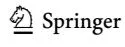
