Roark, E. and W. Gaul. 2021. Monitoring migration timing in remote habitats: assessing the value of extended duration audio recording. Avian Conservation and Ecology 16(1):21. https://doi.org/10.5751/ACE-01885-160121

Copyright © 2021 by the author(s). Published here under license by the Resilience Alliance.

Methodology

## Monitoring migration timing in remote habitats: assessing the value of extended duration audio recording

[Ellie Roark 1](mailto:ellieroark@gmail.com)

[and Willson Gaul 2](mailto:willson.gaul@ucdconnect.ie)

1 Independent Researcher, 2 School of Biology and Environmental Sciences, Earth Institute, University College Dublin

ABSTRACT. Because birds are frequently detected by sound, autonomous audio recorders (called automated recording units or ARUs) are now an established tool in addition to in-person observations for monitoring the status and trends of bird populations. ARUs have been evaluated and applied during breeding seasons, and to monitor the nocturnal flight calls of migrating birds. However, birds behave differently during migration than during the breeding season. Here we present a method for using ARUs to monitor land birds during the migration period in remote habitats. We conducted in-person point counts next to continuously recording ARUs, and compared estimates of the number of species detected and focal species relative abundance from point counts and ARUs. We used a desk-based audio bird survey method for processing audio recordings, which does not require automated species identification algorithms. We tested two methods of using extended duration ARU recording: surveying consecutive minutes and surveying randomly selected minutes. Deskbased surveys using randomly selected minutes from extended duration ARU recordings performed similarly to point counts, and better than desk-based surveys using consecutive minutes from ARU recordings. Surveying randomly selected minutes from ARUs provided estimates of relative abundance that were strongly correlated with estimates from point counts and successfully showed the increase in abundance associated with migration timing. Randomly selected minutes also provided estimates of the number of species present that were comparable to estimates from point counts. Our results suggest that ARUs are an effective way to track migration timing and intensity in remote or seasonally inaccessible habitat during spring migration. Additional testing is needed to determine the efficacy of our methods during fall migration, and at more southerly latitudes. We recommend that desk-based surveys use randomly sampled minutes from extended duration ARU recordings, rather than using consecutive minutes from recordings. Our methods can be immediately applied by researchers with the skills to conduct point counts, with no additional expertise necessary in automated species identification algorithms.

## Surveillance des dates de migration dans les habitats éloignés : évaluation de l'importance des enregistrements audio à durée prolongée

RÉSUMÉ. Les oiseaux sont fréquemment détectables par le son : c'est pourquoi l'utilisation d'enregistreurs audio autonomes (appelés unités d'enregistrement automatisées, ou ARU) est de plus en plus courante, en plus des observations réalisées en personne pour surveiller le statut et les tendances des populations d'oiseaux. Les ARU ont été évaluées et installées au cours des saisons de reproduction et en vue de surveiller les cris nocturnes des oiseaux migrateurs en vol. Toutefois, le comportement des oiseaux est différent pendant la migration et pendant la saison de reproduction. Nous présentons ici une méthode d'utilisation des ARU pour surveiller les oiseaux terrestres au cours de la période de migration dans les habitats éloignés. Nous avons réalisé des comptes ponctuels en personne en plus des ARU qui enregistraient en continu et comparé les estimations du nombre d'espèces détectées et de l'abondance relative des espèces focales effectuées à partir des décomptes en personne et des ARU. Nous avons utilisé une méthode d'enquête audio de bureau pour traiter les enregistrements audio. Cette méthode ne requiert pas d'algorithme d'identification automatique des espèces. Nous avons testé deux méthodes d'utilisation d'enregistrements par ARU à durée prolongée : l'observation pendant plusieurs minutes consécutives et l'observation au cours de minutes sélectionnées de manière aléatoire. Les enquêtes de bureau utilisant des minutes sélectionnées de manière aléatoire à partir des enregistrements d'ARU de longue durée ont donné des résultats similaires aux décomptes et supérieurs aux enquêtes de bureau utilisant des minutes consécutives d'enregistrement des ARU. L'étude de minutes à sélection aléatoire à partir des ARU a fourni des estimations de l'abondance relative qui étaient étroitement corrélées aux estimations produites par les décomptes et a démontré l'augmentation de l'abondance associée aux dates de migration. Les minutes sélectionnées de manière aléatoire ont également fourni des estimations du nombre d'espèces présentes qui étaient comparables à celles obtenues par les décomptes effectués en personne. Nos résultats suggèrent que les ARU sont un moyen efficace de suivre les dates et l'intensité de la migration dans les habitats éloignés ou inaccessibles pendant la migration de printemps. Des tests supplémentaires sont nécessaires pour déterminer l'efficacité de nos méthodes au cours de la prochaine migration d'automne et à des latitudes plus méridionales. Nous recommandons que les études de bureau utilisent des minutes échantillonnées de manière aléatoire extraites des enregistrements des ARU, plutôt que des minutes d'enregistrement consécutives. Nos méthodes peuvent être appliquées immédiatement par les chercheurs qui possèdent les compétences requises pour réaliser des décomptes, sans disposer d'une expertise supplémentaire des algorithmes automatisés d'identification des espèces.

Key Words: autonomous audio recording; bird survey; migration; migration phenology; passive acoustic monitoring; point count; relative abundance

## INTRODUCTION

Conserving bird populations requires knowledge of bird distribution and habitat use at all stages of their life cycle, including during breeding, migration, and non-breeding periods (Sherry and Holmes 1995). Monitoring birds' habitat use during migration is a necessary component of conservation plans for migratory birds. Historically, researchers have primarily relied on in-person observations including mist-netting (Peach et al. 1996) and point counts (Ralph et al. 1995) for migration monitoring, but because birds are frequently detected by sound, audio recording technology offers opportunities to expand monitoring techniques. Here we present a method for using audio recorders to monitor the timing of migration in remote or seasonally inaccessible habitats.

Figuring out how to best monitor bird abundance and diversity in remote habitat is a current challenge. The climatic variation between winter and summer in high latitude continental regions increases the challenges associated with accessing remote areas during spring migration. Significant annual snow accumulation in the winter, followed by rapid melting as temperature increases in spring, makes unpaved roads impassable for a period of weeks in much of northern North America, typically overlapping the time period when migrant bird species begin to arrive in the region in spring. For example, in the State of Michigan, in the United States, many roads are closed to vehicles and unmaintained from November to April (Michigan Transportation Fund Act 1981). Developing survey monitoring protocols that can be implemented despite poor traveling conditions is a way to fill in gaps in knowledge of northern forest birds and birds in similarly remote habitats.

Autonomous recording units (ARUs) are programmable audio recorders that can be deployed in the field for long time periods to efficiently maximize the spatial and temporal extent of monitoring. Passive acoustic monitoring is widely used in ecology to monitor and study vocalizing organisms; ARUs have been deployed to study bats (Tuneu-Corral et al. 2020), whales (Baumgartner et al. 2019), invertebrates (Penone et al. 2013), amphibians (Dutilleux and Curé 2020), and birds (Shonfield and Bayne 2017). ARUs are also used to evaluate the success of conservation programs (Shonfield and Bayne 2017). Current

challenges for implementing passive acoustic monitoring include the availability of reference sound libraries, minimizing errors in species identification, and determining the relationship between acoustic index values and their associated real-world underlying parameters (Gibb et al. 2019), as well as accounting for differences in the sampling detection space when deploying recorders at different sites and in different configurations (Darras et al. 2016). ARU deployments are frequently limited by both battery life and data storage capabilities, but rapid advances are currently being made in deploying fully autonomous systems that are solar powered and can automatically transmit data (Sethi et al. 2018).

Point-count surveys are the most commonly used bird monitoring protocol for long-term study sites (Ralph et al. 1995, Rosenstock et al. 2002), but ARUs are now viewed as a viable supplement to point-counts, especially during the breeding season when birds vocalize frequently (Furnas and Callas 2015, Klingbeil and Willig 2015, Shonfield and Bayne 2017, Darras et al. 2018, Darras et al. 2019). Many researchers have compared ARUs and point counts in terms of their estimates of species richness and relative abundance or occupancy (Haselmayer and Quinn 2000, Campbell and Francis 2011, Tegeler et al. 2012, La and Nudds 2016), including in temperate forest (Klingbeil and Willig 2015). However, none of these studies (including the 23 studies reviewed in Darras et al.'s [2018] meta-analysis) compared point counts and ARUs during migration. Birds behave and vocalize differently during migration than during the breeding season (Rappole and Warner 1976, Morse 1991). Testing and refining migrationspecific monitoring techniques for ARUs is therefore necessary to understand how data from ARUs compare to data from inperson observations.

ARUs are currently used during migration to record the flight calls of nocturnally migrating species. They are deployed to track the abundance of migrants as they move through an area and can provide helpful information about migratory flyway locations, migration phenology, and relative abundance of migrants (Evans and Rosenburg 2000, Farnsworth et al. 2004, Sanders and Mennill 2014). Understanding how migrating birds use remote habitats during the migratory period is a different challenge and requires different methods. Determining how birds are distributed, the relative abundance and species richness, and the timing of arrival and departure from remote areas during migration are all important research questions for applied conservation.

To take advantage of the large volume of data generated by continuously recording ARUs, researchers are actively developing methods for automated identification of vocalizing organisms (Salamon et al. 2016, Gibb et al. 2019, Cramer et al. 2020). Applying automated detection algorithms requires extensive calibration time and expertise in signal processing systems (Priyadarshani et al. 2018b). Even with extensive algorithm training, detection precision can still be low for some species (Ruff et al. 2020). We present a method that can be implemented by anyone with the skills to conduct point counts, that does not rely on machine learning for species identification and data processing. Because applications of ARUs surveying diurnal habitat use during the migratory period have been under-explored in the literature thus far, we demonstrated and assessed an immediately applicable monitoring technique.

We compared data from ARU surveys to in-person point count surveys during spring migration in the northern Great Lakes region of the United States. Our goal was to understand how ARUs could be applied to monitor diurnal habitat use during migration by examining whether ARUs could provide estimates of relative abundance and number of species that are comparable to estimates from in-person surveys. We asked the following questions. 1) What are the differences between the number of species detected using point counts and using ARUs? 2) Can ARUs give estimates of relative abundance for focal species that are correlated with estimates of relative abundance from point counts? 3) Can randomly sampling from extended duration audio recordings provide better estimates of focal species relative abundance or the number of species detected than consecutive minutes of audio recording?

## METHODS

We conducted in-person point counts alongside continuously recording ARUs on the southern shore of Lake Superior during two months at the start of spring migration. We compared both raw data and model-based estimates of the number of species detected and focal species relative abundance from point counts and ARUs. Our sampling scheme targeted diurnal land birds using the peninsular habitat during the migratory period. The sampled community consisted largely of passerine species that breed in forested habitat in North America, including Canada and Northern Michigan.

## Study site

We conducted field work in a 2.7 km² area on the Point Abbaye peninsula in Baraga County, Michigan, USA (Fig. 1). Surveys took place from 2 April to 22 May 2019 and were conducted daily unless prevented by weather conditions. Field work was designed to coincide with the arrival and peak relative abundance of earlyseason migrating birds. Point Abbaye juts into the southern part of Lake Superior and comprises the western border of Keweenaw Bay. Habitat included forested wetland, upland hardwood, and hardwood forest disturbed by recent logging activity. We selected survey sites randomly across the study area using the R programming language and the rgdal, geosphere, rgeos, sp, maptools, and spatstat packages (Pebesma and Bivand 2005, Bivand et al. 2013, Baddeley et al. 2015, Bivand et al. 2018, Bivand and Rundel 2018, Bivand and Lewin-Koh 2019, Hijmans 2019, R Core Team 2020). We conducted a pilot study in 2018 to test our protocols and evaluate the accessibility of our randomly selected survey locations. See Appendix 1 for details about pilot year surveys, and survey site and date selection.

Fig. 1. Study area on the Point Abbaye Peninsula in Baraga County, Michigan, USA. Points denote survey locations visited during April and May of 2019. The survey area covers 2.7 km². White lines on the left panel show unploughed four wheel drive roads which are impassible from early April to early May each year. Map data ©2020 Google.

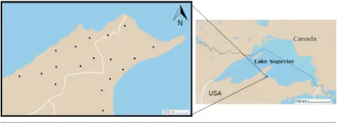

## Automated recording units

Birds were recorded using three SWIFT bioacoustic recorder rugged units (Cornell Lab of Ornithology, Ithaca, NY, USA) and one AudioMoth bioacoustic recorder that was housed in a thin plastic bag for light weather proofing (Hill et al. 2018, Open Acoustic Devices, Southampton, UK). SWIFT units used a builtin PUI Audio brand omni-directional microphone. The AudioMoth unit used an analog microelectro-mechanical systems (MEMS) microphone. We refer to both the SWIFT and AudioMoth units as "automated recording units" (ARUs). ARUs recorded at a sampling rate of 48 kHz and saved recordings as uncompressed .WAV files. The microphone gain was set to "midhigh" for the AudioMoth unit and 35 dB for the SWIFT units. The signal to noise ratio reported by device manufacturers is approximately 58 dB for the SWIFT units and approximately 44 dB for the AudioMoth unit.

## Field survey methods

ARUs recorded continuously for five hours each day, beginning within 10 minutes of local sunrise time (United States Naval Observatory 2016). The field technician manually re-programmed recorders approximately once per week to adjust for changing sunrise times. ARUs were attached to trees less than 0.6 m in diameter, and were placed 1.5-2 m above the ground (Darras et al. 2018). The SWIFT omni-directional microphones were always oriented downward to prevent precipitation landing directly on the microphone. After the five hour recording period ended each day, ARUs were moved to new locations for the next day's samples, thereby rotating the ARU and point count samples through all 18 survey locations approximately every five days. The sampling order for the points was chosen randomly, and ARUs were deployed to the randomly selected point locations each day.

Point counts were conducted daily next to each ARU during the five hour recording period. Point counts involved recording all birds seen and heard at an unlimited distance during a stationary, 10-minute count. The technician noted wind speed, precipitation level, and non-bird noise level, which included both anthropogenic noise like boats and planes, as well as frogs and other taxa. We did not survey in high wind or heavy precipitation. See Appendix 1 for detailed point count protocols.

## Desk-based audio surveys

We conducted desk-based audio bird surveys by listening to ARU recordings played through headphones on a laptop computer in the lab after the end of the field season. We tested three types of desk-based audio surveys: 1) we listened to a recording of the 10 consecutive minutes during which the in-person point count was conducted; 2) we listened to 22 minutes from each recorder, selected randomly from the five hour recording duration; 3) we sampled a subset of 10 of the 22 random minutes (without listening to those minutes again). Our goal was to compare each of these desk-based ARU survey methods to in-person point count observations.

For each audio file, the desk-based survey technician noted the identity of each bird species that vocalized, the type of vocalization, and the 30-second time intervals in which each species vocalized. We discarded randomly sampled minutes that contained a human voice. While listening, we viewed spectrograms of the recording in Audacity (Audacity Team 2019). Detailed protocols for completing desk-based audio surveys can be found in Appendix 1, and a completed data sheet from a deskbased survey is shown in Fig. A1.6.

## Indices for observed number of species and relative abundance

We summed the number of unique species detected (S) separately using each survey type: 10-minute in-person point counts (S p ), 10 consecutive-minute ARU surveys (S 10C ), 10 random-minute ARU surveys (S 10R ), and 22 random-minute ARU surveys (S 22R ) (Table 1). We calculated a value of S for each individual survey on each day, resulting in three or four values of S for each survey type on each day.

Table 1. Indices of relative abundance and species richness for both in-person point count observations, and desk-based listening counts using audio data from Automated Recording Units (ARUs).

| Index Abbreviation | Survey type              | Temporal continuity | Measured Value                                                                                                                                                                                            |
| ------------------ | ------------------------ | ------------------- | --------------------------------------------------------------------------------------------------------------------------------------------------------------------------------------------------------- |
| A p                | Point count              | Consecutive         | Relative abundance measured as the mean number of observed individuals per 10 minute point count per day                                                                                                  |
| A n C              | Automated Recording Unit | Consecutive         | Relative abundance measured as the proportion of 30 second intervals with a vocalization calculated by surveying n minutes in sections of 10 consecutive minutes                                          |
| A n R              | Automated Recording Unit | Random              | Relative abundance measured as the proportion of 30 second intervals with a vocalization calculated by surveying n minutes in sections of 1 minute chosen randomly from the full five hour survey window. |
| S p                | Point count              | Consecutive         | Number of species detected during a 10 minute in person point count                                                                                                                                       |
| S n C              | Automated Recording Unit | Consecutive         | Number of species detected during n consecutive minutes, in sections of 10 consecutive minutes                                                                                                            |
| S n R              | Automated Recording Unit | Random              | Number of species detected during n minutes, chosen randomly from the full five hour survey window                                                                                                        |

We created an index of daily relative abundance (A) for individual species using each survey type (Table 1). Our relative abundance indices were: the mean observed number of individuals per point count (A p ); the proportion of 30-second intervals with a vocalization calculated by surveying n minutes in sections of 10 consecutive minutes (A n C); the proportion of 30-second intervals with a vocalization calculated by surveying n minutes in sections of one minute chosen randomly from the five hour survey window (A n R). To reduce the number of zero relative abundance counts in our data, we calculated indices by grouping all surveys of each type for each day, so there was a single value for each relative abundance index on each day. Abundance index abbreviations (Table 1) indicate the number of minutes surveyed per day. For example, three samples of 10 consecutive minutes per day were aggregated for an index of A 30C , indicating that 30 minutes total were sampled for each day.

Note that while April 16 th and 17 th data appear on plots and in results, ARU malfunctions on those dates made the number of sampled minutes, n, different for those two dates for some of our relative abundance indices. See Appendix 1 for detailed discussion of sample size on these dates. Because these dates coincided with an important arrival period of migrants into the study area, we did not exclude them from our analyses.

## Statistical analysis

## Observed number of species

To determine whether the survey type (S p , S 10C , S 10R , S 22R ) significantly influenced the number of species detected, we modeled the number of species detected using a generalized linear mixed model (GLMM) with a Poisson error distribution and log link function, using the lme4 package in R (Bates et al. 2015, R Core Team 2020). Our fixed effects were survey type, first and second degree terms for day of year, wind, rain, noise, and interactions for the day of year terms and survey type, and for rain and survey type. We also used day of year as a random effect; we expected that the number of species detected by all surveys on each day would be strongly correlated, regardless of survey location or survey type. More information about our GLMM can be found in Appendix 1.

## Relative abundance

We compared relative abundance estimates from A p to each of the three desk-based audio survey types (A 30C , A 30R , A 66R ) for all species that were detected at least twice using each survey type. To illustrate these analyses, we present detailed results for two example species, Regulus satrapa (Golden-crowned Kinglet) and Troglodytes hiemalis (Winter Wren). Winter Wrens were abundant in the survey area, and vocalized frequently and loudly during early spring, representing the "best case" scenario for detectability on ARU recordings. Golden-crowned Kinglets were abundant in the survey area, but vocalized quietly (though regularly) during early spring, and so represent a greater challenge for detection using ARUs.

For each relative abundance model, we fitted boosted regression trees (BRTs) (Friedman 2001, Elith et al. 2008) using 200 iterations of five-fold temporal block cross validation (Fig. A1.3, Roberts et al. 2017). This resulted in a total of 1000 BRT fits per relative abundance model. We generated predicted relative abundances by averaging predictions from the 1000 fits of each model. The predictor variables in our model were day of year (continuous) and wind speed (categorical with three levels representing Beaufort forces of 0-1, 2, or 3 or higher [Beaufort 1805]). We fit BRTs with the gbm package in R (Greenwell et al. 2019, R Core Team 2020). Details of BRTs, including model tuning and control of overfitting are in Appendix 1, and Figs. A1.4 and A1.5.

We assessed whether the observed values from the three deskbased audio survey indices (A 30C , A 30R , A 66R ) were correlated with the observed values from A p , and whether the predicted values from the models trained with desk-based audio survey indices were correlated with the predicted values from models trained with A p for all focal species using Spearman's rank correlation coefficient. To assess whether the correlation coefficients for all species varied based on which abundance index pair was used and on whether coefficients were calculated from observed or predicted values, we fit a linear mixed model. The response variable was correlation coefficient, the fixed effects were index pair (A p and A 30C , A p and A 30R , or A p and A 66R ), value type (observed or predicted), and their interaction (index pair x value type), and the random effect was species. We fit the model using the nlme package in R (Pinheiro et al. 2019, R Core Team 2020).

Table 2. Results of a generalized linear mixed model of the number of species detected as a function of day of year, count type, and environmental condition covariates. Each variable included in the model is shown, along with the coefficient point estimate, 95% confidence interval, and significance level. \*denotes p &lt; 0.05, ** denotes p &lt; 0.01, \*** denotes p &lt; 0.001

| Variable                             | Coefficient estimate | 95% CI lower bound | 95% CI upper bound | P-value |        |
| ------------------------------------ | -------------------- | ------------------ | ------------------ | ------- | ------ |
| Survey type (S 10C )                 | -0.6146              | -0.7824            | -0.4467            | <0.0001 | \*\*\* |
| Survey type (S 10R )                 | -0.065               | -0.213             | 0.0829             | 0.3888  |        |
| Survey type (S 22R )                 | 0.3056               | 0.1702             | 0.441              | <0.0001 | \*\*\* |
| Wind (2)                             | -0.0301              | -0.135             | 0.0748             | 0.574   |        |
| Wind (3+)                            | -0.1007              | -0.2644            | 0.0629             | 0.2277  |        |
| Rain (Wet)                           | -0.1984              | -0.4624            | 0.0657             | 0.1409  |        |
| Noise (1)                            | 0.1552               | 0.0595             | 0.251              | 0.0015  | \*\*   |
| Noise (>2)                           | 0.0544               | -0.147             | 0.2557             | 0.5967  |        |
| Day of year                          | 0.4346               | 0.305              | 0.5641             | <0.0001 | \*\*\* |
| Day of year 2                        | -0.1159              | -0.2496            | 0.0178             | 0.0892  |        |
| Survey type (S 10C ) x Rain (Wet)    | -0.0163              | -0.3944            | 0.3617             | 0.9325  |        |
| Survey type (S 10R ) x Rain (Wet)    | 0.1861               | -0.1374            | 0.5096             | 0.2595  |        |
| Survey type (S 22R ) x Rain (Wet)    | 0.2288               | -0.0677            | 0.5252             | 0.1304  |        |
| Survey type (S 10C ) x Day of Year   | 0.0153               | -0.1191            | 0.1498             | 0.823   |        |
| Survey type (S 10R ) x Day of Year   | 0.0595               | -0.0659            | 0.1849             | 0.3525  |        |
| Survey type (S 22R ) x Day of Year   | -0.0709              | -0.1808            | 0.0389             | 0.2058  |        |
| Survey type (S 10C ) x Day of year 2 | 0.086                | -0.048             | 0.2199             | 0.2083  |        |
| Survey type (S 10R ) x Day of year 2 | -0.0583              | -0.1825            | 0.0659             | 0.3575  |        |
| Survey type (S 22R ) x Day of year 2 | -0.0148              | -0.125             | 0.0953             | 0.7917  |        |

## RESULTS

Between 2 April and 22 May 2019, we were able to survey on 37 days. During that time, we conducted 137 in-person point counts. We recorded 130 simultaneous 10-minute periods with ARUs (when a human observer was also present conducting a point count) and 124 periods of 22 randomly selected minutes from each morning (five hours of recording). All four audio recorders experienced occasional malfunctions; more details about these malfunctions can be found in Appendix 1. A complete list of the species detected by each survey method is in Table A1.1.

## Observed number of species

A Chi-square ANOVA comparing our full model to a null model with survey type removed showed that survey type (the S-index used) had a significant effect on the number of species detected (χ 2 9, 21 =247, p &lt; 0.0001). We detected a similar number of species using S 10R as we did using S p (Fig. 2; Table 2; change in the log of the number of species detected = -0.065, 95% CI [-0.2; 0.08], p = 0.3888). Using S 22R , we detected significantly more species than by using S p (Fig. 2; Table 2; change in the log of the number of species detected = 0.305, 95% CI [0.17; 0.44], p &lt; 0.0001). We detected fewer species using S 10C than using S p (Fig. 2; Table 2; change in the log of the number of species detected = -0.614, 95% CI [-0.78; -0.44], p &lt; 0.0001). Listening to randomly selected rather than consecutive minutes eliminated the gap in number of species detected between 10-minute point counts and 10-minute ARU

surveys (Fig. 2). Day of year had a significant effect on the number of species detected (Table 2), with more species expected later in the migration season (Fig. 2).

Fig. 2. The number of bird species detected by in-person point counts and automated recording units (ARUs) during the spring migration period on the Point Abbaye peninsula, Michigan, USA in 2019. Points show observed number of species detected, lines show predictions from a generalized linear mixed model, holding weather variables constant. See Table 1 for a description of the species richness index abbreviations. Listening to 10 random minutes of data from an ARU (S10R) allowed for detection of the same number of species as a 10 consecutive minute in-person point count (Sp). Increasing survey effort to 22 random minutes of ARU data (S22R) increased the number of species detected to above the number of species detected by in-person point counts.

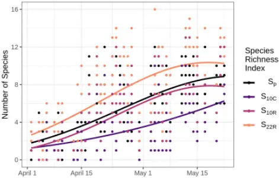

Fig. 3. Predicted and observed relative abundance of (a) through (d) Winter Wren, and (e) through (h) Golden-crowned Kinglet, in April and May of 2019 on the Point Abbaye peninsula. Points show observed values for each abundance index, while lines show the mean predicted values from 200 five-fold cross validated boosted regression tree models. The vertical axes show the daily abundance index value (see Table 1) calculated from: (a) and (e) three 10-minute in person point counts, (b) and (f) three samples of 10 consecutive minutes of audio recordings from automated recording units (ARUs), (c) and (g) three samples of 10 randomly selected minutes of audio recordings from ARUs, (d) and (h) three samples of 22 randomly selected minutes of audio recordings from ARUs.

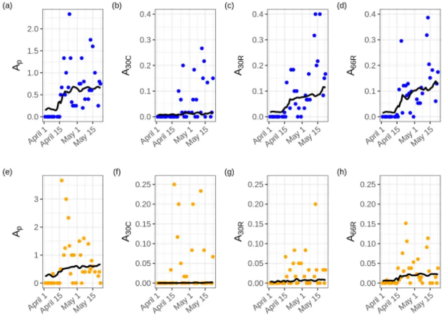

Chi-square ANOVA showed that the overall effect of wind was not significant (χ 2 19, 21 =1.44, p = 0.48) nor was the overall effect of precipitation (χ 2 18, 21 = 3.45, p = 0.32). The overall effect of noise was significant (χ 2 19, 21 = 10.3, p = 0.005). The interaction between survey type and day of year was not significant (Table 2), providing no evidence of a difference in the effect of survey method on the observed number of species over the course of the survey season.

## Relative abundance models

BRT models of relative abundance over time differed in how well they showed the initial period of absence, and the increase in relative abundance corresponding with the arrival of migrant birds in our study area, depending on the survey method used (Fig. 3, Fig. A2.1). The general pattern of initial absence followed by arrival of migrants can be seen in both the raw data and the model predictions of relative abundance for A p , A 30R and A 66R for Winter Wrens (Fig. 3 a, c, and d) and for A p and A 66R for Goldencrowned Kinglets (Fig. 3 e, and h). The same general pattern is visible for A p and A 66R for at least 12 additional species (Fig. A2.1). For most species, including our two example species, the observed relative abundance indices from ARU surveys were positively correlated with the observed relative abundance index from point counts (Fig. 4, Fig. 5, Table A2.1), indicating that the relative abundance proxies we calculated using ARUs are comparable to relative abundance estimates from in-person observations.

For all species, correlations for predicted values of A p and the three desk-based survey methods (A 30C , A 30R , A 66R ) were generally higher than correlations of the observed index values (Fig. 6, Table 3, Table A2.1). For correlations calculated with observed abundance index values, A p appeared to be most strongly correlated with A 30C ; however, correlations calculated with predicted abundance index values were stronger between A p and the two random-minute indices (A 30R and A 66R ) (Fig. 6, Table 3). The strongest median correlation value was between predicted values of A p and A 30R , though predicted values of A p and A 66R

Fig. 4. Correlation between daily observed values of relative abundance indices (Table 1) for Winter Wren. See Table A2.1 for Spearman's correlation coefficients. Abundance indices for ARUs (the proportion of 30second intervals with a vocalization) are correlated with the abundance index from point counts (mean number of individuals observed per count per day). Note that axis scales vary by abundance index; absolute values are less important here than the relationship between observations. Photo: "Winter Wren" by ilouque, used under license CC BY 2.0. Cropped from original.

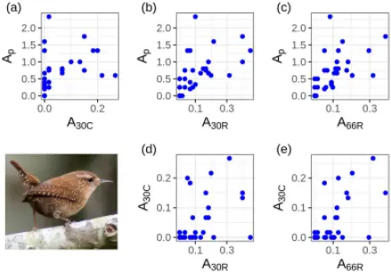

Fig. 5. Correlation between daily observed values of relative abundance indices (Table 1) for Golden-crowned Kinglet. See Table A2.1 for Spearman's correlation coefficients. Abundance indices for ARUs (the proportion of 30-second intervals with a vocalization) are correlated with the abundance index from point counts (mean number of individuals observed per count per day). Note that axis scales vary by abundance index; absolute values are less important here than the relationship between observations. Photo: "Golden-crowned Kinglet" by Laura Gooch, used under license CC BY-NC-SA 2.0. Cropped from original.

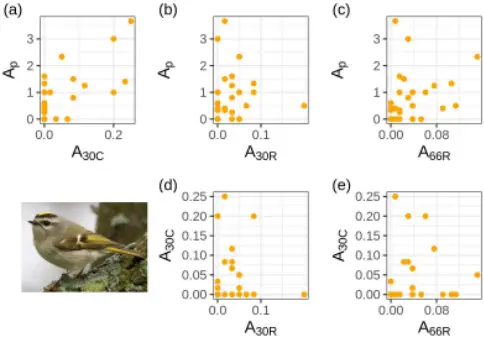

Fig. 6. Correlations between relative abundance index values for all species detected at least twice with both point counts and ARUs (Ap, A30C: n= 25 species; Ap, A30R: n = 28 species; Ap, A66R: n = 30 species; Table A2.1). Boxes show the middle 50% of the data, and the horizontal line shows the median value in each box (Table 3). Correlations between predicted index values (right) were higher than correlations between observed index values (left).

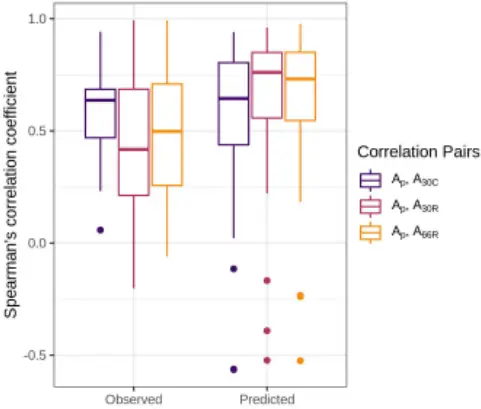

Table 3. Median of Spearman's rank correlation coefficient values for each combination of abundance indices for all species that were detected at least twice by both methods (Ap, A30C: n = 25 species; Ap, A30R; n = 28 species; Ap, A66R: n = 30 species).

| Correlation Pair        | Correlation of Observed Values - Median | Correlation of Observed Values - Median Absolute Deviation | Correlation of Predicted Values - Median | Correlation of Predicted Values - Median Absolute Deviation |
| ----------------------- | --------------------------------------- | ---------------------------------------------------------- | ---------------------------------------- | ----------------------------------------------------------- |
| A p , A 30C A p , A 30R | 0.636                                   | 0.208                                                      | 0.644                                    | 0.27                                                        |
|                         | 0.417                                   | 0.331                                                      | 0.761                                    | 0.178                                                       |
| A p , A 66R             | 0.497                                   | 0.351                                                      | 0.731                                    | 0.235                                                       |

were only slightly less correlated (Fig. 6, Table 3). The strong correlation between predicted values of the relative abundance indices indicates that our models found the same underlying signal regardless of whether training data were from ARUs or point counts.

The interaction between value type (observed or predicted) and index pair (A p and A 30C , A p and A 30R , or A p and A 66R ) was significant according to a likelihood ratio test comparing linear mixed models with and without the interaction term (L = 7.85, df = 1, p = 0.01). This indicates that the correlation values depended on the value type and indices used.

## DISCUSSION

Our results showed that ARUs recording for an extended duration can be as effective as in-person point counts for monitoring vocal migrating land birds in high latitude remote habitats during spring migration. The number of species detected by randomly sampling minutes from ARU recordings was similar to, or higher than, the number of species detected by point counts. Relative abundance models trained with ARU data showed the increase in relative abundance indicating the arrival of migrants at the study site, suggesting that ARUs can be used to track migration phenology in remote habitats for vocal species.

## Sampling random rather than consecutive minutes from ARU recordings

Data from randomly selected minutes of ARU recordings detected more species and produced modeled relative abundance estimates that better showed the expected seasonal pattern of migration timing than data from consecutive minutes of ARU recordings (Fig. 2, Fig. 3, Fig. A2.1). There are two likely explanations for this. First, randomly selected minutes are less temporally auto-correlated than consecutive minutes. For example, during a 10-minute in-person point count, little new information is gained during the seventh minute of the survey compared to what was collected during the sixth minute of the survey; a Winter Wren singing near the end of the sixth minute of a point count survey will likely still be singing in the beginning of the seventh minute. By selecting minutes randomly from across the five-hour survey window, the temporal correlation between each successive minute that is analyzed is minimized. Second, during the migration season, birds may move more within the study area than they would during the breeding season, when they have established a territory. The community of birds within the immediate detection radius of an observer (either a person or a recording ARU) may therefore change over the course of five hours. Wimmer et al. (2013) found that randomly selected minutes from extended duration recording provided better estimates of species richness than consecutive minute in-person surveys during the breeding season. Our findings lend support to the conclusion that using randomly selected minutes provides a more complete sample of the birds using a spatial location over the entire course of the survey window than consecutively sampled minutes.

For in-person point counts, the time taken to travel to a survey site takes up a major portion of the total time invested, so site visits are typically limited to once per day. With ARUs, no such constraints exist; it is possible to do multiple short-duration surveys from many locations over the course of one day without additional travel and field work logistics. We recommend that studies using ARUs on migration should randomly sample recordings of short periods of time (e.g., one-minute recordings) from a defined survey window relevant to the study question (e.g., the five hours following sunrise for passerines in temperate forest or twilight to dawn for crepuscular and nocturnal species). Our study focused on migration, but we recommend that studies using ARUs to monitor birds during wintering or breeding seasons (e.g., Wimmer et al. 2013) also consider using randomly selected minutes.

## Effects of wind, rain, and noise on ARU surveys

We did not detect an effect of either wind or rain in our model of the number of species detected. However, because we controlled for adverse weather conditions during our field surveys by not deploying ARUs on rainy or windy days, the number of high wind values in our data was low, as was the number of rainy survey days. We noted anecdotally that the wind values recorded in person for a survey day did not always correlate with the amount of wind heard while conducting our desk-based audio surveys; we speculate that wind direction in relation to the microphone may make a difference in how much wind is actually picked up by the ARU. Given that wind and rain have an effect on the detectability of birds in the study system (Ralph et al. 1995), they remain important predictors to include, despite not appearing significant in our model.

Interpreting the significance of the noise variable is challenging, because we used the variable to describe all non-avian noise in the environment, which could include waves, airplanes, and frogs. We suspect that the overall significance of the noise variable may be due to frogs. Future studies may want to consider distinguishing between other vocalizing taxa and surrounding environmental noise, as ARUs can be used to simultaneously sample multiple taxa (e.g., crickets and bats; Newson et al. 2017). Background noise in ARU recordings can impede the ability of human listeners or automatic identification algorithms to identify bird calls and songs (Priyadarshani et al. 2018b). We addressed background noise in ARU recordings both in the experimental design and in statistical analysis: we did not deploy ARUs during high winds or during heavy precipitation, and we included wind speed and noise as "nuisance" covariates in statistical models. However, most uses of ARUs will deploy ARUs for much longer periods of time (weeks or months), and will not have the option of avoiding recording during strong wind and precipitation. Most uses of ARUs will therefore require an audio cleaning step to identify and deal with sections of recordings with high amounts of background noise (Priyadarshani et al. 2016, Lostanlen et al. 2019).

## Estimating relative abundance despite imperfect detection of birds

Estimates of abundance are more useful than estimates of occurrence for prioritizing conservation resources at dynamic temporal scales, such as during migration (Johnston et al. 2015). ARUs do not solve the problem of how to estimate true abundance during migration. We accounted for variation in detectability by controlling for observer effort and weather variables, but we recognize that imperfect detection, and the possibility of vocal behavior changing over time, means that the number of individuals detected is not necessarily a good estimate of the number of individuals present (MacKenzie and Kendall 2002). Hierarchical models that account for imperfect detection (MacKenzie et al. 2002, Kéry and Royle 2016) rely on assumptions about population closure that may be badly violated during migration, when birds are only present in stopover habitat for short periods of time. The period in which we can reasonably assume population closure for our study area during migration may be as short as several hours or as long as several days, depending on weather conditions. Therefore disentangling true occupancy or abundance from detectability is difficult, whether using traditional in-person survey methods or ARUs. The current standard in studies that examine abundance during the migration period is to account for detectability by controlling for effort and weather (Johnston et al. 2015).

It is possible that individual birds' vocalizations may increase over the spring migration period, as birds prepare for the breeding season. Changes in vocalization behavior over the migration season could confound our estimates of relative abundance. One possible avenue for dealing with these issues is the method proposed by Metcalf et al. (2019) which used ARU data and dynamic occupancy models that allowed detectability and occupancy to vary over short timescales relevant to migration. We believe increases in relative abundance shown by our models reflect real increases in relative abundance associated with the arrival of these species in the study area, demonstrated by the abrupt arrival of focal species apparent in both raw data and model predictions (Fig. 3, Fig. A2.1) and by the moderate to strong correlations between results using A p (relative abundance from point counts) and results using our ARU relative abundance indices for many focal species. ARUs can therefore provide valuable information about migration phenology, comparable to the information obtained by in-person surveys, even if estimating true abundance remains challenging.

## Desk-based ARU surveys are generalizable to many species

The pattern of absence followed by arrival is visible for both A p and A 66R (and often A 30R ) for many species in addition to our example species (Fig. A2.1). This suggests that our methods are generalizable to many vocal birds in this region. The model predictions from random-minute ARU indices were more strongly correlated with A p than were predictions from the consecutive minute ARU index (Fig. 6, Table 3). In contrast, raw observed values from A 30C were more strongly correlated with observed values from A p than were the random-minute indices (A 30R and A 66R ). However, the goal of the abundance models was to produce similar summary conclusions from the data (i.e., similar out of sample predictions of relative abundance), not to reproduce the raw data values. Therefore, the random-minute ARU indices provided better estimates of relative abundance than did the consecutive minute ARU index.

Using correlation between point count and ARU relative abundance indices is an imperfect measure of ARU index performance. It works well when there is a strong directional trend in relative abundance, as we see with arriving migrant species. However, some vocal resident species (e.g., Common Raven, CORA, Fig. A2.1) showed no directional trend in relative abundance over time. Though the BRT models successfully showed the same overall trends for A p , A 30R , and A 66R , the correlation coefficients were low (Table A2.1). Alternative measures for comparing models might more accurately describe how ARU surveys compare to point counts for all species, not only those that show strong directional trends in relative abundance.

## Adjusting ARU methods for different study systems

Future studies might consider increasing ARU survey effort beyond our maximum of 66 randomly selected minutes per day. We were able to model relative abundance for more species with A 66R (n = 30) than with A 30R (n = 28). The rate at which we detected new species when sampling additional random minutes slowed notably with less than 22 minutes of sampling, suggesting that few new species would be detected by additional sampling, except in early April (Fig. A1.7). The optimum number of minutes to sample will likely depend on the study system and season.

We limited our survey window to the first five hours after sunrise in order to maintain similarity to common point count protocols. We limited our survey effort to 66 random minutes per day because we wanted to keep the technician work load for desk-based audio surveys similar to the time invested for point counts; when researchers do not have to travel between survey locations they may invest a higher percentage of their time listening to recordings. Future studies need not be bound to these constraints. ARUs can be used more flexibly when researchers are not concerned with direct comparison between in-person and ARU survey methods. Similarly, while we placed ARUs at about headheight because we were making direct comparisons to point counts, one could choose an optimal height to mount ARUs based on either behavioral characteristics of focal species or consideration of sound transmission and attenuation (Priyadarshani et al. 2018a). For example, researchers wishing to monitor canopy-dwelling forest birds may wish to place ARUs higher in order to better target those species.

## Are ARUs useful across the entire migration route?

Our study site and survey timing represent the northern end of the spring migratory journey, and therefore may represent a bestcase scenario for ARU use during spring migration. Indeed, more southerly sites and the fall migratory period may present less favorable conditions for monitoring with ARUs, because many species may not vocalize as reliably when they are farther from their breeding grounds or moving away from their breeding grounds. We were unable to differentiate between individual birds using our study site as a stopover location before moving on to more northerly breeding grounds and those that would eventually establish a breeding territory locally. Future studies could evaluate the applicability of ARUs in migration stopover specifically by replicating this study farther south, where many of the species we detected will stopover but not breed. Further research is necessary to determine how far south these methods are applicable during spring, and whether they will work during fall migration.

Future studies using ARUs to monitor bird migration may wish to take advantage of ARUs' unique ability to scale research in ways that may be infeasible or prohibitively expensive for inperson field work. ARUs can increase the amount of data collected without increasing the costs associated with technicianhours in the field (Williams et al. 2018). For example, ARUs could be deployed in dense, small-scale networks to examine microhabitat use in stopover regions. Alternatively, they could be deployed on a latitudinal gradient covering hundreds or thousands of kilometers to examine how vocal behavior changes over the spring migration period as birds approach their breeding grounds.

## Conclusion

Applying the methods described here can facilitate an increase in survey effort in difficult-to-access habitats in high latitude forests during migration. Temporal variation in accessibility in these habitats is dramatic, as unpaved roads typically turn from snow to slush to impassable mud before hardening into reliably dry surfaces in early summer. ARUs can eliminate many of the restrictive logistics and safety concerns for researchers interested in monitoring spring migration. Our method of using desk-based surveys of randomly selected minutes from ARUs can be used by any researcher with the skills to conduct point counts. Researchers can set up ARUs during winter conditions when access to study sites over snow is relatively easy (e.g., using snowmobiles, skis or snowshoes), and revisit to collect the audio data once conditions have stabilized in late spring. Our methods for using ARU data to model relative abundance of focal species and the number of species present during migration can be immediately applied to increase monitoring effort in logistically difficult regions.

Responses to this article can be read online at:

[https://www.ace-eco.org/issues/responses.php/1885](https://www.ace-eco.org/issues/responses.php/1885)

## Acknowledgments:

We are deeply grateful to our local partners in the study region for their contribution to this research. Land access and logistical support was provided by the Keweenaw Land Trust and Pat Toczydlowski. Calvin and Steve Koski, Mark Summersett, and Bob and Nancy Korth provided invaluable support and assistance with transportation to the study site in difficult and unpredictable conditions. Our thanks also to Joseph Youngman, David Flaspohler, Drew Meyer and Dana Neufield for assistance with the pilot year surveys, to Alison Johnston for her insights about abundance modeling during migration, and to Jon Yearsley, Hannah White, and the Ecological Modeling lab at University College Dublin for consultation on modeling methods. This work was funded by grants to ER from the Wilson Ornithological Society and the Copper Country Audubon Society. WG was funded during this work by Science Foundation Ireland grant number 15/IA/2881. Data and code to reproduce analyses can be found at https://doi.org/10.5281/ zenodo.3964500 (ellieroark, 2020). Audio recording files used to produce this analysis are archived at https://doi.org/10.5281/

zenodo.3964574 (Roark &amp; Gaul, 2020).

## LITERATURE CITED

Audacity Team. 2019. Audacity(R): Free Audio Editor and Recorder. [online] URL: https://audacityteam.org/

[Baddeley, A., E. Rubak, and R. Turner. 2015. Spatial Point Patterns: Methodology and Applications with R. [online] URL: http://www.crcpress.com/Spatial-Point-Patterns-Methodology-andApplications-with-R/Baddeley-Rubak-Turner/9781482210200/](http://www.crcpress.com/Spatial-Point-Patterns-Methodology-and-Applications-with-R/Baddeley-Rubak-Turner/9781482210200/)

Bates, D., M. Maechler, B. Bolker, and S. Walker. 2015. Fitting Linear Mixed-Effects Models Using lme4. Journal of Statistical Software 67(1):1-48. https://doi.org/10.18637/jss.v067.i01

Baumgartner, M. F., J. Bonnell, S. M. Van Parijs, P. J. Corkeron, C. Hotchkin, K. Ball, … S. D. Kraus. 2019. Persistent near realtime passive acoustic monitoring for baleen whales from a moored buoy: System description and evaluation. Methods in Ecology and Evolution 10(9):1476-1489. https://doi.org/10.1111/2041-210X.13244

Beaufort, F. 1805. Beaufort Wind Scale. Retrieved July 28, 2020. [online] URL: https://www.spc.noaa.gov/faq/tornado/beaufort. html

Bivand, R., T. Keitt, and B. Rowlingson. 2018. rgdal: Bindings for the "Geospatial" Data Abstraction Library. [online] URL: https:// cran.r-project.org/package=rgdal

Bivand, R., and N. Lewin-Koh. 2019. maptools: Tools for Handling Spatial Objects. [online] URL: https://cran.r-project. org/package=maptools

Bivand, R., and C. Rundel. 2018. rgeos: Interface to Geometry Engine- Open Source ('GEOS'). [online] URL: https://cran.rproject.org/package=rgeos

Bivand, R. S., E. J. Pebesma, and V. Gomez-Rubio. 2013. Applied spatial data analysis with R (2nd ed.). [online] URL: http://www. asdar-book.org/%0A

Campbell, M., and C. M. Francis. 2011. Using StereoMicrophones to Evaluate Observer Variation In North American Breeding Bird Survey Point Counts. The Auk 128(2):303-312. https://doi.org/10.1525/auk.2011.10005

Cramer, J., V. Lostanlen, A. Farnsworth, J. Salamon, and J. P. Bello. 2020. Chirping up the Right Tree: Incorporating Biological Taxonomies into Deep Bioacoustic Classifiers. ICASSP, IEEE International Conference on Acoustics, Speech and Signal Processing - Proceedings, Barcelona, Spain, May 2020, 901-905. https://doi.org/10.1109/ICASSP40776.2020.9052908

Darras, K., P. Pütz, Fahrurrozi, K. Rembold, and T. Tscharntke. 2016. Measuring sound detection spaces for acoustic animal sampling and monitoring. Biological Conservation 201:29-37. https://doi.org/10.1016/j.biocon.2016.06.021

Darras, K., P. Batáry, B. Furnas, A. Celis-Murillo, S. L. Van Wilgenburg, Y. A. Mulyani, and T. Tscharntke. 2018. Comparing the sampling performance of sound recorders versus point counts in bird surveys: A meta-analysis. Journal of Applied Ecology, 55 (6):2575-2586. https://doi.org/10.1111/1365-2664.13229

Darras, K., P. Batáry, B. J. Furnas, I. Grass, Y. A. Mulyani, and T. Tscharntke. 2019. Autonomous sound recording outperforms human observation for sampling birds: a systematic map and user guide. Ecological Applications 29(6). https://doi.org/10.1002/ eap.1954

Dutilleux, G., and C. Curé. 2020. Automated acoustic monitoring of endangered common spadefoot toad populations reveals patterns of vocal activity. Freshwater Biology 65(1):20-36. https:// doi.org/10.1111/fwb.13111

Elith, J., J. R. Leathwick, and T. Hastie. 2008. A working guide to boosted regression trees. Journal of Animal Ecology 77(4):802813. https://doi.org/10.1111/j.1365-2656.2008.01390.x

ellieroark. 2020. ellieroark/StopoverHabitatMonitoring: First release of Stopover Habitat Monitoring project code (Version v1.0.0). Zenodo. http://doi.org/10.5281/zenodo.3964500

Evans, W. R., and K. V. Rosenberg. 2000. Acoustic Monitoring of Night-Migrating Birds : A Progress Report. In: Strategies for bird conservation: creating the Partners in Flight planning process.

Proceedings of the 3rd Partners in Flight Workshop. US Department of Agriculture, Forest Service.

Farnsworth, A., S. A. Gauthreaux, and D. Van Blaricom. 2004. A comparison of nocturnal call counts of migrating birds and reflectivity measurements on Doppler radar. Journal of Avian Biology 35(4):365-369. https://doi.org/10.1111/j.0908-8857.2004.03180. x

Friedman, J. 2001. Greedy Function Approximation : A Gradient Boosting Machine. The Annals of Statistics, 29(5):1189-1232. https://doi.org/10.1214/009053606000000795

Furnas, B. J., and R. L. Callas. 2015. Using automated recorders and occupancy models to monitor common forest birds across a large geographic region. Journal of Wildlife Management 79 (2):325-337. https://doi.org/10.1002/jwmg.821

Gibb, R., E. Browning, P. Glover-Kapfer, and K. E. Jones. 2019. Emerging opportunities and challenges for passive acoustics in ecological assessment and monitoring. Methods in Ecology and Evolution 10:169-185. https://doi.org/10.1111/2041-210X.13101

Greenwell, B., B. Boehmke, J. Cunningham, and GBM Developers. 2019. gbm: Generalized Boosted Regression Models. R package version 2.1.5. R package version 2.1.5.

Haselmayer, J., and J. S. Quinn. 2000. A Comparison of Point Counts and Sound Recording as Bird Survey Methods in Amazonian Southeast Peru. The Condor 102(4):887-893. [online] URL: http://www.jstor.org/stable/1370317

Hijmans, R. J. 2019. geosphere: Spherical Trigonometry. [online] URL: https://cran.r-project.org/package=geosphere

Hill, A. P., P. Prince, E. Piña Covarrubias, C. P. Doncaster, J. L. Snaddon, and A. Rogers. 2018. AudioMoth: Evaluation of a smart open acoustic device for monitoring biodiversity and the environment. Methods in Ecology and Evolution 9(5). https://doi. org/10.1111/2041-210X.12955

Johnston, A., D. Fink, M. D. Reynolds, W. M. Hochachka, B. L. Sullivan, N. E. Bruns, … S. Kelling. 2015. Abundance models improve spatial and temporal prioritization of conservation resources. Ecological Applications 25(7):1749-1756. https://doi. org/10.1890/07-1650.1

Kéry, M., and J. A. Royle. 2016. Applied hierarchical modeling in ecology: analysis of distribution, abundance and species richness in R and BUGS (volume 1 - prelude and static models). London: Academic Press.

Klingbeil, B. T., and M. R. Willig. 2015. Bird biodiversity assessments in temperate forest: the value of point count versus acoustic monitoring protocols. PeerJ 3:e973. https://doi. org/10.7717/peerj.973

La, V. T., and T. D. Nudds. 2016. Estimation of avian species richness: biases in morning surveys and efficient sampling from acoustic recordings. Ecosphere 7(4):e01294. https://doi. org/10.1002/ecs2.1294

Lostanlen, V., J. Salamon, A. Farnsworth, S. Kelling, and J. P. Bello. 2019. Robust sound event detection in bioacoustic sensor networks. PloS One 14(10):e0214168. https://doi.org/10.1371/ journal.pone.0214168

MacKenzie, D. I., and W. C. Kendall. 2002. How should detection probability be incorporated into estimates of relative abundance? Ecology 83(9):2387-2393. https://doi.org/10.1890/0012-9658 (2002)083[2387:HSDPBI]2.0.CO;2

MacKenzie, D. I., J. D. Nichols, G. B. Lachman, S. Droege, A. A. Royle, and C. A. Langtimm. 2002. Estimating site occupancy rates when detection probabilities are less than one. Ecology 83 (8):2248-2255. https://doi.org/10.1890/0012-9658(2002)083[2248: ESORWD]2.0.CO;2

Metcalf, O. C., J. G. Ewen, M. McCready, E. M. Williams, and J. M. Rowcliffe. 2019. A novel method for using ecoacoustics to monitor post-translocation behaviour in an endangered passerine. Methods in Ecology and Evolution 10(5):626-636. https://doi.org/10.1111/2041-210X.13147

Michigan Transportation Fund Act, MCL Act 51, Section 247.655a. 1981. [online] URL: http://tinyurl.com/seasonal-roadlaw

Morse, D. H. 1991. Song Types of Black-Throated Green Warblers on Migration. The Wilson Bulletin 103(1):93-96.

Newson, S. E., Y. Bas, A. Murray, and S. Gillings. 2017. Potential for coupling the monitoring of bush-crickets with established large-scale acoustic monitoring of bats. Methods in Ecology and Evolution 8(9):1051-1062. https://doi.org/10.1111/2041-210X.12720

Peach, W. J., S. T. Buckland, and S. R. Baillie. 1996. The use of constant effort mist-netting to measure between-year changes in the abundance and productivity of common passerines. Bird Study 43(2):142-156. https://doi.org/10.1080/00063659609461007

Pebesma, E. J., and R. Bivand. 2005. Classes and methods for spatial data in R. Retrieved from R News 5 (2) [online] URL: https://cran.r-project.org/doc/Rnews/

Penone, C., I. Le Viol, V. Pellissier, J. F. Julien, Y. Bas, and C. Kerbiriou. 2013. Use of large-scale acoustic monitoring to assess anthropogenic pressures on orthoptera communities. Conservation Biology 27(5):979-987. https://doi.org/10.1111/cobi.12083

Pinheiro, J., D. Bates, S. DebRoy, D. Sarkar, and R Core Team. 2019. nlme: Linear and Nonlinear Mixed Effects Models. [online] URL: https://cran.r-project.org/package=nlme

Priyadarshani, N., I. Castro, and S. Marsland. 2018a. The impact of environmental factors in birdsong acquisition using automated recorders. Ecology and Evolution 8(10):5016-5033. https://doi. org/10.1002/ece3.3889

Priyadarshani, N., S. Marsland, and I. Castro. 2018b. Automated birdsong recognition in complex acoustic environments: a review. Journal of Avian Biology 49(5):1-27. https://doi.org/10.1111/ jav.01447

Priyadarshani, N., S. Marsland, I. Castro, and A. Punchihewa. 2016. Birdsong denoising using wavelets. PLoS ONE 11(1):1-26. https://doi.org/10.1371/journal.pone.0146790

R Core Team. 2020. R: A Language and Environment for Statistical Computing. Retrieved from https://www.r-project.org/

Ralph, C. J., J. R. Sauer, and S. Droege, technical editors. 1995. Monitoring bird populations by point counts. Gen. Tech. Rep. PSWGTR-149. Albany, CA: U.S. Department of Agriculture, Forest Service, Pacific Southwest Research Station: p. 161-168. [online] URL: https://www.fs.usda.gov/treesearch/pubs/31755

Rappole, J. H., and D. W. Warner. 1976. Relationships between Behavior, Physiology and Weather in Avian Transients at a Migration Stopover Site. Oecologia 26:193-212. https://doi. org/10.1007/BF00345289

Roark, E., and W. Gaul. 2020. Point Abbaye Stopover Habitat Monitoring Audio Files [Data set]. Zenodo. http://doi. org/10.5281/zenodo.3964574

Roberts, D. R., V. Bahn, S. Ciuti, M. S. Boyce, J. Elith, G. GuilleraArroita, … C. F. Dormann. 2017. Cross-validation strategies for data with temporal, spatial, hierarchical, or phylogenetic structure. Ecography 40:913-929. https://doi.org/10.1111/ ecog.02881

Rosenstock, S. S., D. R. Anderson, K. M. Giesen, T. Leukering, and M.F. Carter. 2002. Landbird Counting Techniques : Current Practices and an Alternative Published. The Auk 119(1):46-53. [online] URL: https://www.jstor.org/stable/4090011

Ruff, Z. J., D. B. Lesmeister, L. S. Duchac, B. K. Padmaraju, and C. M. Sullivan, C. M. 2020. Automated identification of avian vocalizations with deep convolutional neural networks. Remote Sensing in Ecology and Conservation 6(1):79-92. https://doi. org/10.1002/rse2.125

Salamon, J., J. P. Bello, A. Farnsworth, M. Robbins, S. Keen, H. Klinck, and S. Kelling. 2016. Towards the Automatic Classification of Avian Flight Calls for Bioacoustic Monitoring. PloS ONE 11(11). https://doi.org/10.1371/journal.pone.0166866

Sanders, C. E., and D. J. Mennill. 2014. Acoustic monitoring of nocturnally migrating birds accurately assesses the timing and magnitude of migration through the Great Lakes. The Condor 116(3):371-383. https://doi.org/10.1650/condor-13-098.1

Sethi, S. S., R. M. Ewers, N. S. Jones, C. D. L. Orme, and L. Picinali. 2018. Robust, real-time and autonomous monitoring of ecosystems with an open, low-cost, networked device. Methods in Ecology and Evolution 9(12):2383-2387. https://doi. org/10.1111/2041-210X.13089

Sherry, T. W., and R. T. Holmes. 1995. Summer versus winter limitation of populations: What are the issues and what is the evidence? In T. E. Martin and D. M. Finch, editors, Ecology and management of Neotropical migratory birds: A synthesis and review of critical issues (pp. 85-120).

Shonfield, J., and E. M. Bayne. 2017. Autonomous recording units in avian ecological research: current use and future applications. Avian Conservation and Ecology 12(1):14. https://doi.org/10.5751/ ace-00974-120114

Tegeler, A. K., M. L. Morrison, and J. M. Szewczak. 2012. Using extended-duration audio recordings to survey avian species. Wildlife Society Bulletin 36(1):21-29. https://doi.org/10.1002/ wsb.112

Tuneu-Corral, C., X. Puig-Montserrat, C. Flaquer, M. Mas, I. Budinski, and A. López-Baucells. 2020. Ecological indices in long-term acoustic bat surveys for assessing and monitoring bats' responses to climatic and land-cover changes. Ecological Indicators 110 (October 2019) 105849. https://doi.org/10.1016/j. ecolind.2019.105849

United States Naval Observatory. 2016. Sun or Moon Rise/Set Table for One Year. Retrieved August 30, 2019, [online] URL: https://aa.usno.navy.mil/data/docs/RS\_OneYear.php

Williams, E. M., C. F. J. O'Donnell, and D. P. Armstrong. 2018. Cost-benefit analysis of acoustic recorders as a solution to sampling challenges experienced monitoring cryptic species. Ecology and Evolution 8(13):6839-6848. https://doi.org/10.1002/ ece3.4199

Wimmer, J., M. Towsey, P. Roe, and I. Williamson. 2013. Sampling environmental acoustic recordings to determine bird species richness. Ecological Applications 23(6):1419-1428. https://doi. org/10.1890/12-2088.1

Subject Editor: Nicholas JBayly

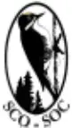

## APPENDIX 1

## Supplementary methods and results

## Pilot year surveys; site selection

We selected survey sites randomly across the study area with the criteria that points were at least 100 m away from the shoreline, and at least 300 m apart, to ensure ARUs recorded non-overlapping areas (Klingbeil and Willig 2015). During the pilot year of surveys in 2018, nineteen points were initially selected and tested (eighteen chosen randomly as previously mentioned, and one point selected by hand near the tip of the peninsula). Three of those initial nineteen points were dropped for the 2019 season, due to difficult access, posted private property signs, and smaller effective survey area (because of proximity to water) relative to the other points. For the 2019 field season, the survey area was expanded from 2.5 km 2 to 2.7 km 2 to include an adjacent Keweenaw Land Trust property, and two additional survey points were added.

## Date selection

We selected survey dates by reviewing historic observations for four early season migrant species: Golden-crowned Kinglet (Regulus satrapa), Northern Flicker (Colaptes auratus), Winter Wren (Troglodytes hiemalis), and Hermit Thrush (Catharus guttatis). For each of these species, we downloaded all Michigan eBird records from 1970 to 2018 (eBird Basic Dataset 2018), and used the number of daily detections (without attempting to correct for variable survey effort or detectability) to select field work dates that would give us a good chance of surveying through the early migration period (i.e. starting before any individuals of the focal species were present and continuing through a period of high focal species abundance).

1

To determine our survey period for the 2019 field season, we subset eBird data for the region to observations made between 1 January and approximately 8 July (day of year 190), in the four counties nearest our survey area (Baraga, Keweenaw, Houghton, Marquette). We plotted day of year by the number of observations per species (as a proxy for abundance) to determine both the day of arrival at the study area and the approximate peak of migration for each species. We selected 1 st April (day of year 91) as the start date for surveys because in eBird records from previous years, 90% of Goldencrowned Kinglet observations and 99% of records for the other three target species occurred after this date. We wanted to balance the benefit of being early enough to catch the first migrants against the cost of potentially spending weeks in a remote field location without our focal species present. Plots of cumulative observations by day of year showed that surveying through day of year 141 (May 22) would allow us to catch the peak in the daily number of observations reported to eBird for each of our target species. This survey period did not encompass the entirety of spring migration for all migrant species in the region, but was designed to capture the peak of abundance during migration for our focal migrant species.

## Point count protocols

The field technician announced aloud the beginning and end of each point count, as well as the date, time, location name, and geographic coordinates, so that this information could be recorded on the ARU, as well as on the technician's data sheet. Each species observed was noted on a data sheet, including the number of individuals seen, the bearing of the first individual or group detected (relative to the direction the observer was facing), the detection method (call, song, woodpecker drum or visual), the distance from the observer (in three distance bands of 0-25 m, 26-50 m, or 50+ m), and the minute of the survey in which the species was first detected (0-9). The observer also noted cloud cover (033%, 34-66%, 67-100%), precipitation (Dry, Fog/Haze, Drizzle, Rain/Snow), Beaufort wind scale rating (0-5) (Beaufort 1805), and non-bird noise level for each point count (0-4). We did not survey if the wind was greater than force 5, or in heavy, continuous precipitation.

## Desk-based survey protocols

No more than five hours of desk-based audio surveys were conducted in a single day, and all audio recordings were listened to at full speed. The technician was allowed a maximum of 15 minutes to listen to each 10 minute recording, during which time they could pause, rewind or replay the audio file, and could look up and play songs or calls from any external resource they felt may be helpful, excluding using any kind of automated identification program. Because of the difficulty of deciding what constitutes a single "vocalization" from species with different songs and calls, we did not attempt to count the number of vocalizations. While conducting desk-based audio surveys, we viewed spectrograms of the recording in Audacity (Audacity Team 2019). Spectrograms were viewed in gray scale, with a minimum frequency of 0 kHz and a maximum frequency of 15 kHz. The gain (brightness) of the spectrogram was 20 dB, while the range (contrast) was 80 dB. Frequency gain was 0 dB/dec. Window size was 256, with window type Hanning and a zero padding factor of 1. To process the data from the 10 consecutive minute counts, we clipped the audio recording of each 10 minute point count from its larger audio file, excluding voice announcements about the location, date and time of recording and including only the "begin point count" and "end point count" announcements from the survey technician. Because the field survey technician also conducted the desk-based audio bird surveys, the second author anonymized the audio recorder file names so that the survey technician could not see or hear the dates and locations of the audio recordings. This reduced the possibility that memories of particular days or locations would influence the data collected during the desk-based audio survey. In the anonymized file names we included an indicator of the two week period in which the point count took place ("early" or "late" in April or May) because information about season is used by bird observers to inform their mental list of "possible" species, and this information would be available to a technician conducting desk-based audio bird surveys in practical applications. In order to ensure that the technician's desk-based audio survey species identifications were reproducible, we duplicated 20% of the 10 consecutive minute recordings, and assigned new anonymous names to the duplicated recordings, so that the technician listened to that data twice. After data entry and de-anonymization, we compared the species detected in each duplicated recording. The desk-based survey process used for listening to 24 random minutes was similar to the process used for 10 consecutive minute recordings. Selection of the 24 random minutes was done in R using the 'warbleR' package and work flow (Araya-Salas and Smith-Vidaurre 2017, R Core Team 2020). We wanted to analyze a minimum of 20 random minutes without anthropogenic disturbance, so we selected and clipped 24 minute-long segments from each day's audio for each recorder. We subsequently discarded any clip that contained a human voice, but did not discard clips containing other possibly anthropogenic noise (e.g. footsteps), because we did not have a clear way to distinguish between human and wild animal sounds. We also did not control for distant anthropogenic noises such as vehicles and planes. We created a new sample of 24 random minutes to select from each ARU on each survey day, so that we did not select the same minutes from each day or ARU. We only selected 24 random minutes from an ARU on days when the unit recorded the full five-hour survey window.

We listened to randomly selected minutes using the procedures outlined above for the 10 consecutive minute desk-based audio surveys, but allowing for a maximum of 50 minutes to listen to each set of 24 random minutes. This allowed for approximately the same effective listening time for the audio files (50% more than the length of the original file), but included extra time for file management (opening and closing the audio files in Audacity). After discarding minutes that contained a human voice, we had a sample of 22 random minutes from each ARU on each survey day.

## Sample size on April 16 th and 17 th

The number of surveys per day over the course of the season varied based on local conditions. We deployed at least three ARUs every day, and deployed a fourth ARU on days when insufficient weatherproofing was not likely to interfere with recording efforts. We considered all survey days with at least three in person point counts, and five hour recording windows from at least three ARUs, a "complete" survey day. On two days (April 16 th and 17 th ) we failed to capture a complete survey day due to ARU SWIFT03 malfunctioning. On April 16 th , we also were unable to conduct three in-person point counts, and conducted only two counts, one alongside the functionally recording SWIFT01, and one next to the malfunctioning SWIFT03. SWIFT02 successfully recorded the full five hour survey window on April 16 th , but no point count was conducted there. Because these dates coincided with an important arrival period of migrants into the study area, we did not drop them from our analyses. Because we modeled species richness per count rather than per day, our species richness models were unaffected by the anomalies described above. However, because we aggregated our abundance indices per day, it is important to note that the abundance indices for April 16 th and 17 th are different than the other survey days (see Box 1 for description of abundance indices). On the 16 th of April, the abundance index for point counts is the mean number of individuals detected per count, but averaged between only two point counts instead of the usual three counts. On that date, the abundance index for consecutive minute ARU counts was A10C , rather than A30C. On April 17 th , the abundance index for consecutive minute ARU counts was A20C, rather than A30C. We opted to leave these dates in our models with reduced survey effort, rather than remove them. To compensate for the malfunctioning third recorder, we selected an additional 11 random minutes from each of the functional recorders so that we do have abundance indices of A66R and A30R for those dates, but they are sampled from only two ARUs instead of three ARUs. For days when four ARUs were deployed, we listened to 22 random minutes from each ARU (88 minutes total), but standardized effort to 66 minutes and 30 minutes per day for the A66R and A30R indices, respectively. To do this, we randomly selected 66 and 30 minutes from the entire survey day, which may include data from all four of the ARUs.

## Generalized Linear Mixed Model methods

We included an interaction between day of year and survey type because we anticipated that the effect of survey type might change over time, for example if increased numbers of species or individuals later in migration made distinguishing identifiable sounds on the audio recordings more difficult. We included an interaction between rain and survey type because we expected that even small amounts of rain hitting the ARUs might impair our ability to detect birds on desk-based audio surveys more than a similar amount of precipitation during point counts. Because the number of observations for some values of the categorical weather variables was small, we pooled levels as follows: wind was binned into categories 0-1, 2, or 3+; rain was binned into "wet" and "dry" conditions; noise was binned as 0, 1, or &gt;2. We centered and scaled all continuous variables. We did not perform model selection but rather included all variables in the final model due to an a priori expectation that all variables were relevant to the study system. We assigned the weather variables noted in person during point counts to all the desk-based audio surveys from the same unit on the same day. While weather conditions may have changed slightly over the course of the survey window, the observed weather conditions from the point count represent our best estimate of the conditions at each survey location on each survey day.

## Differences between individual ARUs

To investigate whether there was a discernible difference between our individual ARUs, we ran a poisson GLM for all 10 consecutive minute ARU surveys that included all the predictor variables as described above and in the main text, and an additional "ARU ID" variable that identified which ARU was used on each survey. Chi-square ANOVA comparing this model to a null model without ARU ID showed no significant difference at the .05 level (χ 2 3, 118 = 6.96, p = 0.07). Based on this result, to conserve degrees of freedom, we did not include ARU ID as a predictor variable in our final GLMM.

## Boosted Regression Tree (BRT) relative abundance models

We fit BRTs with a Laplace distribution, and an absolute loss link function which is more robust than a RMSE loss function to data with long tailed distributions (Hastie et al. 2009). We ran BRTs with an interaction depth of one, a minimum of one observation per node, and a bag fraction of 0.8. To optimize the number of trees and shrinkage parameter for our boosted regression tree models (BRTs), we set the cross validation parameter built into the gbm function to ten, and looked at graphs of the cross-validation test error for ten iterations of our model using the function gbm.perf in the gbm package (Greenwell et al. 2019, R Core Team 2020). We aimed to optimize the shrinkage parameter to grow at least 1000 trees before models started to overfit (indicated by increasing cross-validation test error) (Elith et al. 2008). We tested shrinkage parameter values ranging from 0.01 to 0.0001, and graphed test error when adding up to 10,000 trees (Figs A1.4-A1.5). We chose our final shrinkage parameter and number of trees for each model based on visually assessing plots of cross-validation test error, attempting to avoid over fitting as much as possible for each particular model iteration (Figs A1.4-A1.5). We opted to use a single shrinkage parameter and number of trees for all iterations of each relative abundance model, rather than attempting to automatically tune the shrinkage parameter and number of trees within each iteration. Because our final predictions were the averages from 1000 model iterations, our results should not be unduly impacted even if individual model iterations did not achieve the minimum possible test error. We ultimately chose the following shrinkage parameters and number of trees for each of our models: shrinkage parameter of 0.0005 and 3000 trees for Winter Wren models Ap, A30R, A66R; shrinkage parameter of 0.0001 and 3000 trees for Winter Wren model A30C and Golden-crowned Kinglet models A30C and A30R; shrinkage parameter of 0.0005 and 2000 trees for Golden-crowned Kinglet models Ap and A66R. In some cross-validation folds, the test error increased immediately, after fitting only one tree (Fig. A1.5b). In these cases, we tested the smallest possible shrinkage parameter recommended by Elith, Leathwick &amp; Hastie (2008), which was 0.0001. We believe that the immediate over fitting is likely due to the large number of zeros in the data, and we think it unlikely that we would be able to tune parameters to build good models with these data; the problem is with the data rather than with the tuning of the model parameters (see e.g. the large number of observed zeros in Fig. 3B, F). This supports our overall conclusion that using consecutive minute ARU recordings is less useful for assessing the relative abundance of migrant species than using randomly selected minutes from ARU recordings.

To ensure that our results were not solely based on our choice of modeling method, we also modeled relative abundance using generalized additive models (GAMs) because they allowed specification of a negative binomial error distribution which we suspected might fit our data well. We tested GAMs using two of our four abundance indices: Ap and A30C. GAMs were fit with a thin plate spline, with the number of knots optimized at k = -1. GAMs were fit using the 'gam' function in the 'mgcv' package (Wood 2003, Wood 2011, Wood 2017). As with BRTs, we fit GAMs using 200 iterations of five-fold temporal block cross validation, that used blocks of three consecutive days (Fig. S3). To compare GAMs and BRTs, we calculated a mean Root Mean Square Error (RMSE) of all 1000 model iterations.

## Details about final sample size

One SWIFT unit recorded 36 five-hour survey days, two SWIFT units recorded 35 five-hour survey days, and the AudioMoth unit recorded 24 five-hour survey days, for a total of 650 hours recorded by ARUs. Because of ARU malfunctions, on some days ARUs did not record the full fivehour period (as described for the 16 th and 17 th of April), but we were able to manually turn on the units for the 10-minute period during the in-person point count. Therefore, we recorded 130 10 consecutive minute periods with ARUs (during which a human observer was present conducting a simultaneous point count) on 37 survey days, but only 124 periods of 22 randomly selected minutes on 36 survey days.

9

## Analysis of duplicated recordings

The duplicated recordings had perfect agreement about the occurrence of Winter Wren, indicating that we can have high confidence in Winter Wren identification from ARU surveys. We intended to use Krippendorff's alpha (Krippendorff 2013) to assess agreement about detections of focal species on duplicated desk-based audio surveys of 10 consecutive minute counts. However, we did not have enough detections of Golden-crowned Kinglet in our duplicated recordings to calculate a value for Krippendorff's alpha; we therefore do not have an estimate of the reliability of identification of Kinglets on ARU recordings. We encourage future researchers to give consideration to listener agreement when using ARU data.

## GAM results

GAMs and BRTs performed similarly for estimating relative abundance trends across both survey types on which GAMs were tested based on evaluating Root Mean Square Error (RMSE) (Table S2), and gave qualitatively similar models of the change in bird abundance during the migration season. This indicated that the choice of modeling method and error distribution did not have a large effect on the results of our model, and we ultimately chose BRTs following Johnston et al.'s (2015) methods for modeling abundance.

## LITERATURE CITED

Araya-Salas, M., and G. Smith-Vidaurre. 2017. warbleR: an r package to streamline analysis of animal acoustic signals. Methods in Ecology and Evolution, 8(2). https://doi.org/10.1111/2041210X.12624 Audacity Team. 2019. Audacity(R): Free Audio Editor and Recorder. [online] URL: https://audacityteam.org/ eBird Basic Dataset. 2018. Ithaca, New York: Cornell Lab of Ornithology.

10

Elith, J., J. R. Leathwick, and T. Hastie. 2008. A working guide to boosted regression trees. Journal of Animal Ecology, 77(4), 802-813. https://doi.org/10.1111/j.1365-2656.2008.01390.x Greenwell, B., B. Boehmke, J. Cunningham, and GBM Developers. 2019. gbm: Generalized Boosted Regression Models. R package version 2.1.5. R package version 2.1.5. Hastie, T., R. Tibshirani, and J. Friedman. 2009. The Elements of Statistical Learning (2nd ed.). Springer. Johnston, A., D. Fink, M. D. Reynolds, W. M. Hochachka, B. L. Sullivan, N. E. Bruns, … S. Kelling. 2015. Abundance models improve spatial and temporal prioritization of conservation resources. Ecological Applications, 25(7), 1749-1756. https://doi.org/10.1890/07-1650.1 Klingbeil, B. T., and M. R. Willig. 2015. Bird biodiversity assessments in temperate forest: the value of point count versus acoustic monitoring protocols. PeerJ, 3, e973. https://doi.org/10.7717/peerj.973 Krippendorff, K. 2013. Content analysis: An introduction to its methodology (3rd ed.). Los Angeles: SAGE. R Core Team. 2020. R: A Language and Environment for Statistical Computing. [online] URL: https:// www.r-project.org/ Wood, S. N. 2003. Thin-plate regression splines. Journal of the Royal Statistical Society, 65(1), 95114. Wood, S. N. 2011. Fast stable restricted maximum likelihood and marginal likelihood estimation of semiparametric generalized linear models. Journal of the Royal Statistical Society, 73(1), 3-36. Wood, S. N. 2017. Generalized Additive Models: An Introduction with R. (2nd edition). Chapman and Hall/CRC.

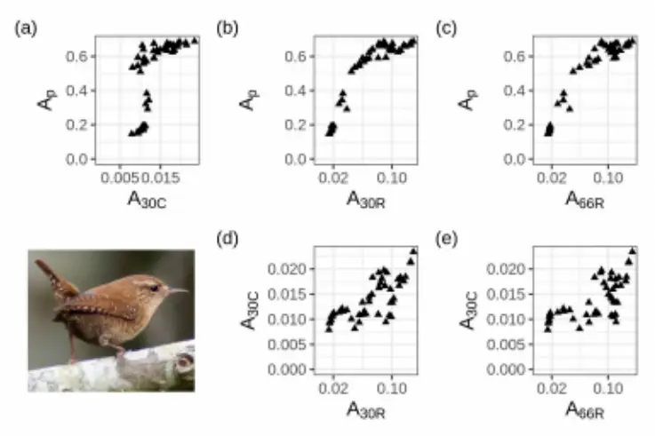

Figure A1.1: Correlation between predicted relative abundance index values for Winter Wren. Predictions are the mean calculated from 1000 iterations of a Boosted Regression Tree model. Spearman's rank correlation coefficients can be found in Table A2.1. Predictions of index values are strongly correlated, indicating that the model is finding the same signal regardless of whether training data are from ARUs or point counts. Note that axis scales vary by abundance index; absolute values are less important here than the relationship between predictions. Photo: "Winter Wren" by ilouque, used under license CC BY 2.0. Cropped from original.

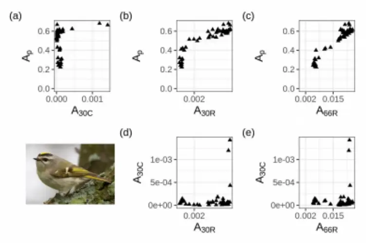

Figure A1.2: Correlation between predicted relative abundance index values for Golden-crowned Kinglet. Predictions are the mean calculated from 1000 iterations of a Boosted Regression Tree model. Spearman's rank correlation coefficients can be found in Table A2.1. Predictions of Ap and the random minute indices (A30R and A66R) are strongly correlated, indicating that the model is finding the same signal regardless of whether training data are from ARUs or point counts. Photo: "Golden-crowned Kinglet" by Laura Gooch, used under license CC BY-NC-SA 2.0. Cropped from original.

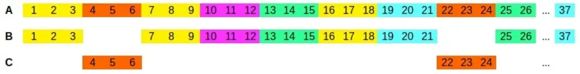

Figure A1.3: Schematic of temporal block cross-validation used for fitting and testing abundance models. Days (1, 2, 3, ..., 37) were grouped into blocks of three consecutive days. Each block of three days was assigned to one of five cross-validation folds (colors, panel A). Abundance models were fitted by withholding data from days in one fold (e.g. the orange fold) and using data from days in the other four folds as training data (B). The performance of the model was evaluated based on how well it predicted data from days in the test fold (C).

Figure A1.4: Test error for 10 cross validation folds for a Boosted Regression Tree model, for each of four abundance indices for Winter Wren relative abundance models. Colored lines show the crossvalidation fold for which the error was calculated, and the black vertical bar shows the number of trees we chose for each abundance index. Plots a, c and d all show test error for a shrinkage rate of 0.0005; plot b shows test error for a shrinkage rate of 0.0001. For models that appeared to overfit immediately (b), we believe the problem was with the data rather than with the tuning parameters (see discussion in Appendix 1).

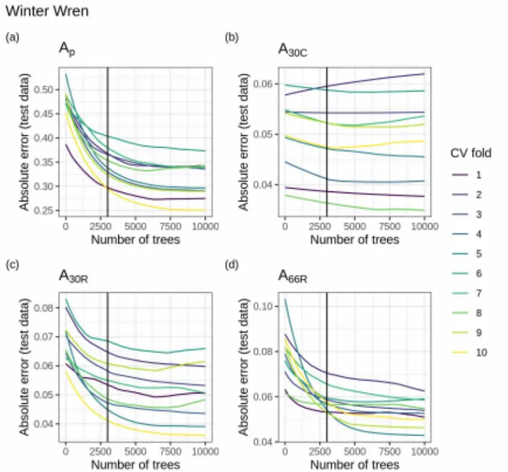

Figure A1.5: Test error for 10 cross validation folds for a Boosted Regression Tree model, for each of four abundance indices for Golden-crowned Kinglet relative abundance models. Colored lines show the cross-validation fold for which the error was calculated, and the black vertical bar shows the number of trees we chose for each abundance index. Plots a and d all show test error for a shrinkage rate of 0.0005; plots b and c show test error for a shrinkage rate of 0.0001. For models that appeared to overfit immediately (b, c), we believe the problem was with the data rather than with the tuning parameters (see discussion in Appendix 1).

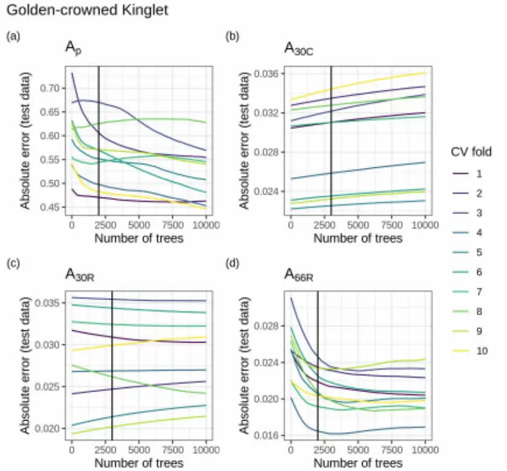

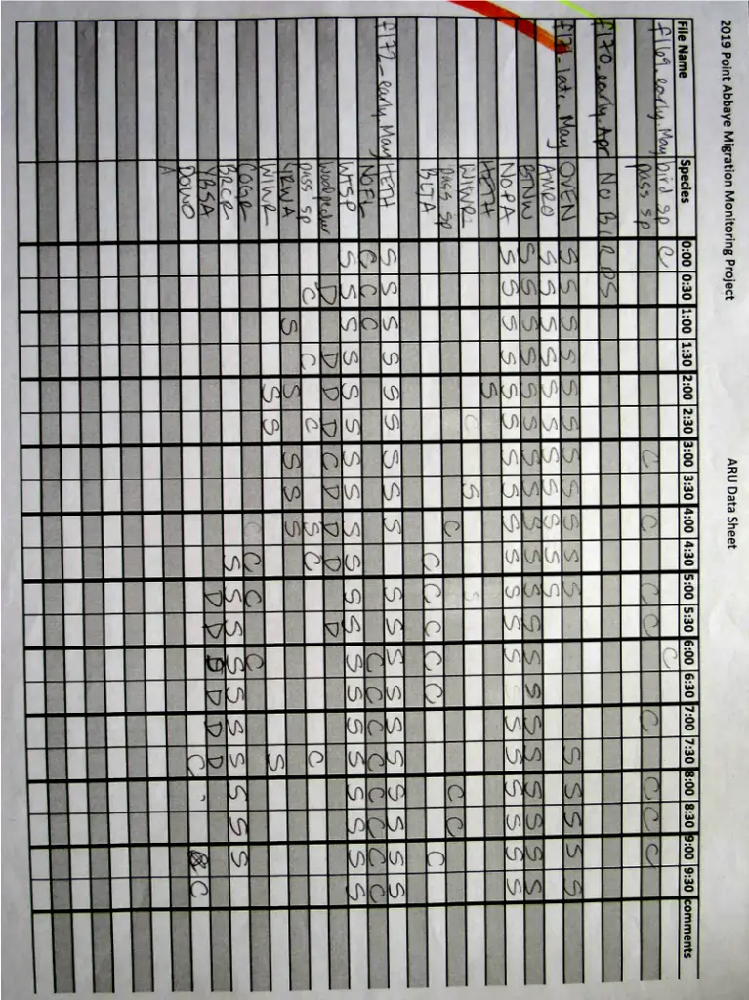

Figure A1.6: Example data sheet for desk-based surveys of 10 consecutive minute ARU recordings. Species codes are 4-letter alpha codes; see Appendix 1, "Desk-based survey protocols" for details about vocalization codes recorded in each 30-second interval.

Fig. A1.7: Species accumulation curves showing the number of species detected as a function of the number of minutes sampled. Minutes were sampled in random order 100 different times from each ARU on each day (thin gray lines). Thick colored lines show smoothed averages of number of species detected per minute. The thin gray lines have been jittered vertically to improve visualization.

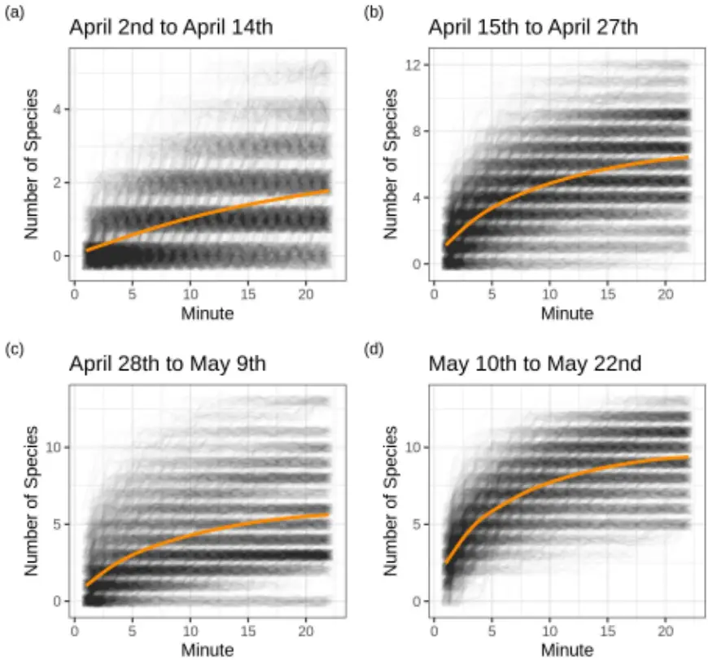

Table A1.1: Species detected during the 2019 field season on the Point Abbaye peninsula, showing the frequency of all detection types for each species, for both point count and ARU observations. Point count detections represent the number of individuals observed, while ARU detections represent the number of 30second intervals in which a species was detected. \*denotes species detected only using ARUs.

| Scientific Name          | Common Name               | Point Count Detections - Visual | Point Count Detections - Call | Point Count Detections - Song | Point Count Detections - Drum | ARU Detections - Call | ARU Detections - Song | ARU Detections - Drum |
| ------------------------ | ------------------------- | ------------------------------- | ----------------------------- | ----------------------------- | ----------------------------- | --------------------- | --------------------- | --------------------- |
| Branta canadensis        | Canada Goose              | 0                               | 5                             | 1                             | 0                             | 54                    | 0                     | 0                     |
| Anas platyrhynchos       | Mallard\*                 | 0                               | 0                             | 0                             | 0                             | 1                     | 0                     | 0                     |
| Meleagris gallopavo      | Wild Turkey\*             | 0                               | 0                             | 0                             | 0                             | 1                     | 0                     | 0                     |
| Antigone canadensis      | Sandhill Crane            | 0                               | 1                             | 0                             | 0                             | 0                     | 0                     | 0                     |
| Gavia immer              | Common Loon               | 0                               | 2                             | 0                             | 0                             | 0                     | 0                     | 0                     |
| Cathartes aura           | Turkey Vulture            | 2                               | 0                             | 0                             | 0                             | 0                     | 0                     | 0                     |
| Haliaeetus leucocephalus | Bald Eagle                | 4                               | 7                             | 0                             | 0                             | 9                     | 0                     | 0                     |
| Sphyrapicus varius       | Yellow-bellied Sapsucker  | 2                               | 14                            | 0                             | 21                            | 52                    | 0                     | 174                   |
| Dryobates pubescens      | Downy Woodpecker          | 6                               | 5                             | 1                             | 4                             | 57                    | 0                     | 30                    |
| Dryobates villosus       | Hairy Woodpecker          | 5                               | 5                             | 0                             | 13                            | 23                    | 0                     | 37                    |
| Colaptes auratus         | Northern Flicker          | 0                               | 25                            | 0                             | 0                             | 111                   | 0                     | 0                     |
| Dryocopus pileatus       | Pileated Woodpecker       | 1                               | 6                             | 0                             | 4                             | 26                    | 0                     | 18                    |
| Falco sparverius         | American Kestrel          | 1                               | 0                             | 0                             | 0                             | 0                     | 0                     | 0                     |
| Falco columbarius        | Merlin                    | 0                               | 2                             | 0                             | 0                             | 4                     | 0                     | 0                     |
| Empidonax flaviventris   | Yellow-bellied Flycatcher | 0                               | 0                             | 1                             | 0                             | 0                     | 0                     | 0                     |
| Empidonax minimus        | Least Flycatcher          | 0                               | 0                             | 4                             | 0                             | 0                     | 101                   | 0                     |
| Sayornis phoebe          | Eastern Phoebe            | 1                               | 0                             | 0                             | 0                             | 0                     | 0                     | 0                     |
| Vireo solitarius         | Blue-headed Vireo         | 0                               | 0                             | 10                            | 0                             | 0                     | 43                    | 0                     |
| Cyanocitta cristata      | Blue Jay                  | 0                               | 19                            | 0                             | 0                             | 60                    | 0                     | 0                     |
| Corvus brachyrhynchos    | American Crow             | 1                               | 12                            | 0                             | 0                             | 23                    | 0                     | 0                     |
| Corvus corax             | Common Raven              | 0                               | 28                            | 0                             | 0                             | 159                   | 0                     | 0                     |
| Poecile atricapillus     | Black-capped Chickadee    | 0                               | 38                            | 23                            | 0                             | 90                    | 92                    | 2                     |
| Sitta canadensis         | Red-breasted Nuthatch     | 0                               | 3                             | 23                            | 0                             | 55                    | 47                    | 0                     |
| Sitta carolinensis       | White-breasted Nuthatch   | 0                               | 3                             | 8                             | 0                             | 3                     | 1                     | 0                     |
| Certhia americana        | Brown Creeper             | 3                               | 18                            | 24                            | 0                             | 197                   | 398                   | 0                     |
| Troglodytes hiemalis     | Winter Wren               | 0                               | 0                             | 62                            | 0                             | 1                     | 748                   | 0                     |
| Regulus satrapa          | Golden-crowned Kinglet    | 1                               | 34                            | 10                            | 0                             | 254                   | 26                    | 0                     |
| Regulus calendula        | Ruby-crowned Kinglet      | 6                               | 0                             | 18                            | 0                             | 5                     | 114                   | 0                     |
| Catharus minimus         | Gray-cheeked Thrush       | 1                               | 0                             | 0                             | 0                             | 0                     | 0                     | 0                     |
| Catharus ustulatus       | Swainson's Thrush         | 2                               | 0                             | 1                             | 0                             | 0                     | 1                     | 0                     |
| Catharus guttatus        | Hermit Thrush             | 6                               | 10                            | 9                             | 0                             | 38                    | 170                   | 0                     |
| Turdus migratorius       | American Robin            | 2                               | 22                            | 14                            | 0                             | 151                   | 253                   | 0                     |

Table A1.1 Continued

| Scientific Name         | Common Name                   | Point Count Detections - Visual | Point Count Detections - Call | Point Count Detections - Song | Point Count Detections - Drum | ARU Detections - Call | ARU Detections - Song | ARU Detections - Drum |
| ----------------------- | ----------------------------- | ------------------------------- | ----------------------------- | ----------------------------- | ----------------------------- | --------------------- | --------------------- | --------------------- |
| Toxostoma rufum         | Brown Thrasher\*              | 0                               | 0                             | 0                             | 0                             | 0                     | 2                     | 0                     |
| Pinicola enucleator     | Pine Grosbeak                 | 0                               | 1                             | 0                             | 0                             | 0                     | 0                     | 0                     |
| Haemorhous purpureus    | Purple Finch                  | 0                               | 0                             | 10                            | 0                             | 1                     | 39                    | 0                     |
| Spinus pinus            | Pine Siskin                   | 0                               | 1                             | 0                             | 0                             | 0                     | 0                     | 0                     |
| Spinus tristis          | American Goldfinch            | 0                               | 13                            | 1                             | 0                             | 11                    | 1                     | 0                     |
| Spizelloides arborea    | American Tree Sparrow         | 1                               | 0                             | 0                             | 0                             | 0                     | 0                     | 0                     |
| Spizella passerina      | Chipping Sparrow              | 1                               | 0                             | 1                             | 0                             | 0                     | 0                     | 0                     |
| Passerella iliaca       | Fox Sparrow                   | 0                               | 0                             | 1                             | 0                             | 0                     | 0                     | 0                     |
| Melospiza melodia       | Song Sparrow                  | 0                               | 0                             | 1                             | 0                             | 0                     | 0                     | 0                     |
| Zonotrichia albicollis  | White-throated Sparrow        | 2                               | 4                             | 26                            | 0                             | 48                    | 583                   | 0                     |
| Junco hyemalis          | Dark-eyed Junco               | 0                               | 6                             | 3                             | 0                             | 6                     | 4                     | 0                     |
| Molothrus ater          | Brown-headed Cowbird          | 0                               | 0                             | 1                             | 0                             | 0                     | 0                     | 0                     |
| Quiscalus quiscula      | Common Grackle                | 1                               | 11                            | 0                             | 0                             | 4                     | 0                     | 0                     |
| Seiurus aurocapilla     | Ovenbird                      | 1                               | 0                             | 11                            | 0                             | 0                     | 270                   | 0                     |
| Parkesia noveboracensis | Northern Waterthrush          | 0                               | 0                             | 1                             | 0                             | 0                     | 10                    | 0                     |
| Mniotilta varia         | Black-and-white Warbler       | 1                               | 1                             | 6                             | 0                             | 0                     | 20                    | 0                     |
| Oreothlypis ruficapilla | Nashville Warbler             | 0                               | 0                             | 1                             | 0                             | 0                     | 5                     | 0                     |
| Setophaga ruticilla     | American Redstart             | 0                               | 0                             | 7                             | 0                             | 1                     | 78                    | 0                     |
| Setophaga tigrina       | Cape May Warbler\*            | 0                               | 0                             | 0                             | 0                             | 0                     | 1                     | 0                     |
| Setophaga americana     | Northern Parula               | 0                               | 0                             | 12                            | 0                             | 0                     | 101                   | 0                     |
| Setophaga fusca         | Blackburnian Warbler\*        | 0                               | 0                             | 0                             | 0                             | 0                     | 5                     | 0                     |
| Setophaga petechia      | Yellow Warbler                | 0                               | 0                             | 2                             | 0                             | 0                     | 0                     | 0                     |
| Setophaga caerulescens  | Black-throated Blue Warbler\* | 0                               | 0                             | 0                             | 0                             | 0                     | 13                    | 0                     |
| Setophaga palmarum      | Palm Warbler                  | 1                               | 0                             | 0                             | 0                             | 0                     | 0                     | 0                     |
| Setophaga pinus         | Pine Warbler                  | 0                               | 0                             | 1                             | 0                             | 0                     | 1                     | 0                     |
| Setophaga coronata      | Yellow-rumped Warbler         | 2                               | 2                             | 47                            | 0                             | 1                     | 659                   | 0                     |
| Setophaga virens        | Black-throated Green Warbler  | 0                               | 0                             | 28                            | 0                             | 0                     | 584                   | 4                     |
| Pheucticus ludovicianus | Rose-breasted Grosbeak\*      | 0                               | 0                             | 0                             | 0                             | 0                     | 4                     | 0                     |
| NA                      | passerine sp.                 | 3                               | 14                            | 7                             | 0                             | 1300                  | 112                   | 0                     |
| NA                      | woodpecker sp.                | 0                               | 3                             | 0                             | 17                            | 34                    | 0                     | 137                   |
| NA                      | bird sp.                      | 0                               | 31                            | 0                             | 0                             | 436                   | 20                    | 2                     |
| NA                      | duck sp.                      | 1                               | 0                             | 0                             | 0                             | 0                     | 0                     | 0                     |
| NA                      | gull sp.                      | 0                               | 1                             | 0                             | 0                             | 0                     | 0                     | 0                     |
| NA                      | warbler sp.                   | 1                               | 1                             | 0                             | 0                             | 0                     | 2                     | 0                     |

Table A1.1 Continued

| Scientific Name | Common Name    | Point Count Detections - Visual | Point Count Detections - Call | Point Count Detections - Song | Point Count Detections - Drum | ARU Detections - Call | ARU Detections - Song | ARU Detections - Drum |
| --------------- | -------------- | ------------------------------- | ----------------------------- | ----------------------------- | ----------------------------- | --------------------- | --------------------- | --------------------- |
| NA              | vireo sp.      | 0                               | 0                             | 1                             | 0                             | 0                     | 0                     | 0                     |
| NA              | flycatcher sp. | 0                               | 0                             | 0                             | 0                             | 0                     | 1                     | 0                     |
| NA              | corvid sp.     | 0                               | 0                             | 0                             | 0                             | 3                     | 0                     | 0                     |

## APPENDIX 2

## Relative abundance model results for all focal species

Table A2.1: Spearman's rank correlation coefficents for each pair of abundance indices for all species that were detected at least twice using both survey methods. Species are listed from highest to lowest predicted correlation values between Ap and A66R. Value type indicates whether the correlation was calculated using observed or predicted abundance index values. NA values indicate that there were too few detections of that species with the ARU survey method to fit a model.

| Species common name          | Alpha code | Value type         | Correlation - Ap,A30C | Correlation - Ap,A30R | Correlation - Ap,A66R |
| ---------------------------- | ---------- | ------------------ | --------------------- | --------------------- | --------------------- |
| White-throated Sparrow       | WTSP       | Predicted          | 0.912                 | 0.96                  | 0.976                 |
|                              | WTSP       | Observed           | 0.777                 | 0.923                 | 0.919                 |
| Yellow-bellied Sapsucker     | YBSA       | Predicted          | 0.941                 | 0.94                  | 0.946                 |
|                              | YBSA       | Observed           | 0.681                 | 0.621                 | 0.679                 |
| Brown Creeper                | BRCR       | Predicted          | 0.659                 | 0.936                 | 0.946                 |
|                              | BRCR       | Observed           | 0.676                 | 0.672                 | 0.642                 |
| Yellow-rumped Warbler        | YRWA       | Predicted          | 0.917                 | 0.928                 | 0.926                 |
|                              | YRWA       | Observed           | 0.827                 | 0.833                 | 0.794                 |
|                              | RCKI       | Predicted          | 0.855                 | 0.85                  | 0.924                 |
| Ruby-crowned Kinglet         | RCKI       | Observed           | 0.636                 | 0.378                 | 0.541                 |
| Blue-headed Vireo            | BHVI       | Predicted          | NA                    | 0.849                 | 0.895                 |
|                              | BHVI       | Observed           | NA                    | 0.26                  | 0.49                  |
| Blue Jay                     | BLJA       | Predicted          | 0.745                 | 0.661                 | 0.886                 |
|                              | BLJA       | Observed           | 0.5                   | 0.473                 | 0.621                 |
| Winter Wren                  | WIWR       | Predicted          | 0.799                 | 0.894                 | 0.853                 |
|                              | WIWR       | Observed           | 0.69                  | 0.798                 | 0.792                 |
| Hermit Thrush                | HETH       | Predicted          | 0.709                 | 0.828                 | 0.843                 |
|                              | HETH       | Observed           | 0.501                 | 0.444                 | 0.368                 |
| Black-throated Green Warbler | BTNW       | Predicted          | 0.821                 | 0.814                 | 0.839                 |
|                              | BTNW       | Observed           | 0.942                 | 0.994                 | 0.993                 |
| Golden-crowned Kinglet       | GCKI       | Predicted          | 0.041                 | 0.876                 | 0.836                 |
|                              | GCKI       | Observed           | 0.495                 | 0.377                 | 0.56                  |
| Northern Flicker             | NOFL       | Predicted          | 0.827                 | 0.811                 | 0.833                 |
|                              | NOFL       | Observed           | 0.657                 | 0.552                 | 0.506                 |
|                              | NOPA       | Predicted          | 0.645                 | 0.772                 | 0.82                  |
| Northern Parula              | NOPA       | Observed           | 0.461                 | 0.752                 | 0.848                 |
|                              | OVEN       | Predicted          | 0.641                 | 0.755                 | 0.783                 |
| Ovenbird                     | OVEN       | Observed           | 0.796                 | 0.611                 | 0.719                 |
| American Redstart            | AMRE       |                    | 0.804                 | 0.767                 | 0.77                  |
|                              | AMRE       | Predicted Observed | 0.674                 | 0.866                 | 0.866                 |
| Red-breasted Nuthatch        | RBNU       | Predicted          | 0.611                 | 0.707                 | 0.693                 |
|                              | RBNU       | Observed           | 0.491                 | 0.391                 | 0.22                  |
| Black-and-white Warbler      | BAWW       | Predicted          | 0.46                  | NA                    | 0.693                 |
|                              | BAWW       | Observed           | 0.66                  | NA                    | 0.386                 |
|                              |            |                    | 0.438                 |                       |                       |
| Least Flycatcher             | LEFL       | Predicted Observed | 0.686                 | 0.82 0.728            | 0.69 0.879            |
| American Crow                | AMCR       | Predicted          | 0.523                 | 0.495                 | 0.658                 |
|                              | AMCR       | Observed           | 0.269                 | 0.141                 | 0.29                  |
| Purple Finch                 | PUFI       | Predicted          | NA                    | 0.694                 | 0.594                 |
|                              | PUFI       | Observed           | NA                    | 0.2                   | 0.437                 |
|                              |            | Predicted          | -0.562                | 0.57                  | 0.588                 |
|                              |            | Observed           | 0.293                 | 0.343                 |                       |
| Black-capped Chickadee       | BCCH       |                    |                       |                       | 0.231                 |

| Species common name |      | Data type      | Correlation | Correlation | Correlation |
| ------------------- | ---- | -------------- | ----------- | ----------- | ----------- |
| Species common name |      | Alpha code     | Ap,A30C     | Ap,A30R     | Ap,A66R     |
| Merlin              | MERL | Predicted      | NA          | 0.635       | 0.559       |
|                     | MERL | Observed       | NA          | -0.059      | -0.059      |
| American Goldfinch  | AMGO | Predicted      | NA          | NA          | 0.542       |
| American Goldfinch  | AMGO | Observed       | NA          | NA          | 0.322       |
| Hairy Woodpecker    | HAWO | Predicted      | 0.575       | 0.249       | 0.385       |
| Hairy Woodpecker    | HAWO | Observed       | 0.232       | 0.188       | 0.204       |
| American Robin      | AMRO | Predicted      | 0.181       | 0.656       | 0.376       |
| American Robin      | AMRO | Observed       | 0.469       | 0.34        | 0.557       |
| Dark-eyed Junco     | DEJU | Predicted      | 0.022       | 0.519       | 0.354       |
| Dark-eyed Junco     | DEJU | Observed       | 0.058       | 0.217       | 0.226       |
| Bald Eagle          | BAEA | Predicted      | NA          | 0.221       | 0.183       |
| Bald Eagle          | BAEA | Observed       | NA          | -0.148      | 0.176       |
| Common              | CORA | Predicted      | -0.115      | -0.167      | -0.233      |
| Common              | CORA | Raven Observed | 0.54        | 0.451       | 0.27        |
| Pileated Woodpecker | PIWO | Predicted      | 0.74        | -0.391      | -0.238      |
| Pileated Woodpecker | PIWO | Observed       | 0.715       | -0.201      | 0.06        |
| Downy Woodpecker    | DOWO | Predicted      | -0.564      | -0.522      | -0.525      |
| Downy Woodpecker    | DOWO | Observed       | 0.301       | 0.098       | 0.253       |

Figure A2.1 Predicted and observed relative abundance of 30 species observed in April and May of 2019 on the Point Abbaye peninsula. Points show observed values for each abundance index, while lines show the mean predicted values from 200 five-fold cross validated boosted regression tree models. The vertical axes show the daily abundance index value (Ap, A30C, A30R or A66R, Table 1). Species are ordered from highest to lowest correlation of predicted values for Ap and A66R (Table A2.1). Four-letter species codes correspond to the species common names found in Table A2.1. Blank plots indicate that there was not enough data from that abundance index to fit a model.

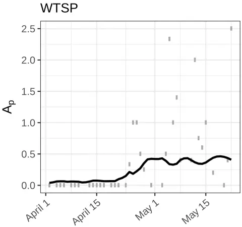

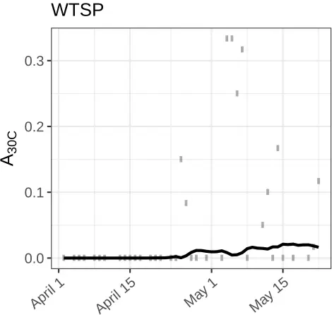

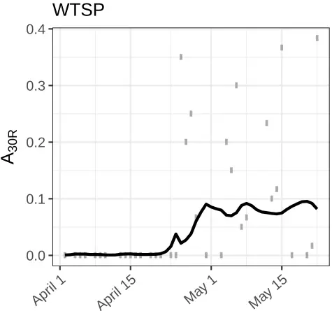

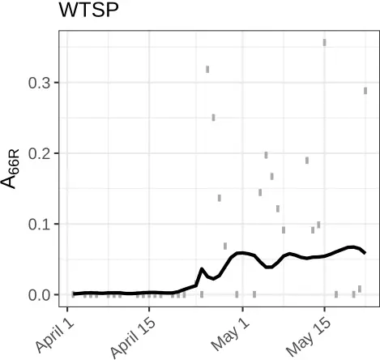

Ap YBSA

l

l

l

l

l

l lll lll llll

l

l

l

l

l

l

l

l

l

l l

l

l

ll

l

l

l

l ll

April 1

April 15

May 1

May 15

A30C

YBSA

l

l

l

l

l

l

l

l

l

l

l

l

l lll lll llll

l

l

l

ll ll l l

l

l

l ll

April 1

April 15

May 1

May 15

A30R

0.10

0.05

0.00

YBSA

l

l

l

l

l

l

l

l

l

l

l lll lll llll ll ll ll l l

l

l

ll l l

l

April 1

April 15

May 1

May 15

A66R

0.09

0.06

0.03

0.00

YBSA

l

l

l

l l

l

l lll lll llll

l

ll

l

l

l l ll l

l

l

l

l

l

l

l

l

April 1

April 15

May 1

May 15

l

2

1

0

0.20

0.15

0.10

0.05

0.00

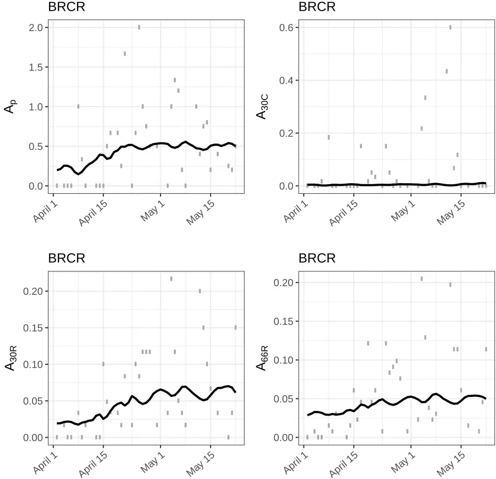

Ap YRWA

l

l

l

l

l

l

l

l

l

l

l l

l

l l

l lll lll lllll lll llllll l

April 1

April 15

May 1

May 15

A30C

YRWA

l

l

l

l

l

l

l

l

l lll lll lllll lll llllll l l l l

l

l

ll

April 1

April 15

May 1

May 15

A30R

0.6

0.4

0.2

0.0

YRWA

l

l

l

l l

l lll lll lllll lll llllll l l l l

l

l

l

l

ll

April 1

April 15

May 1

May 15

A66R

0.4

0.2

0.0

YRWA

l

l

l

l

l l

l lll lll lllll lll lllll l l l

l

l

l

l

l

ll

April 1

April 15

May 1

May 15

2.0

1.5

1.0

0.5

0.0

0.4

0.2

0.0

Ap RCKI

l

l

l

l lll lll lllll ll

l

lll

l

l

l

l

l

l

l

l

l

l

l

l

l

l

April 1

April 15

May 1

May 15

A30C

RCKI

l

l

l

l

l

l

l lll lll lllll lll lllll l ll ll

l

l l lll

April 1

April 15

May 1

May 15

A30R

0.15

0.10

0.05

0.00

RCKI

l

l

l

l

l

l lll lll lllll lll l llll l ll

l

l

l

l

l l ll

April 1

April 15

May 1

May 15

A66R

0.15

0.10

0.05

0.00

RCKI

l

l

l

l

l

l lll lll lllll lll l ll

l

ll

l ll

l

l

l

l l ll

April 1

April 15

May 1

May 15

l

l

2

1

0

0.15

0.10

0.05

0.00

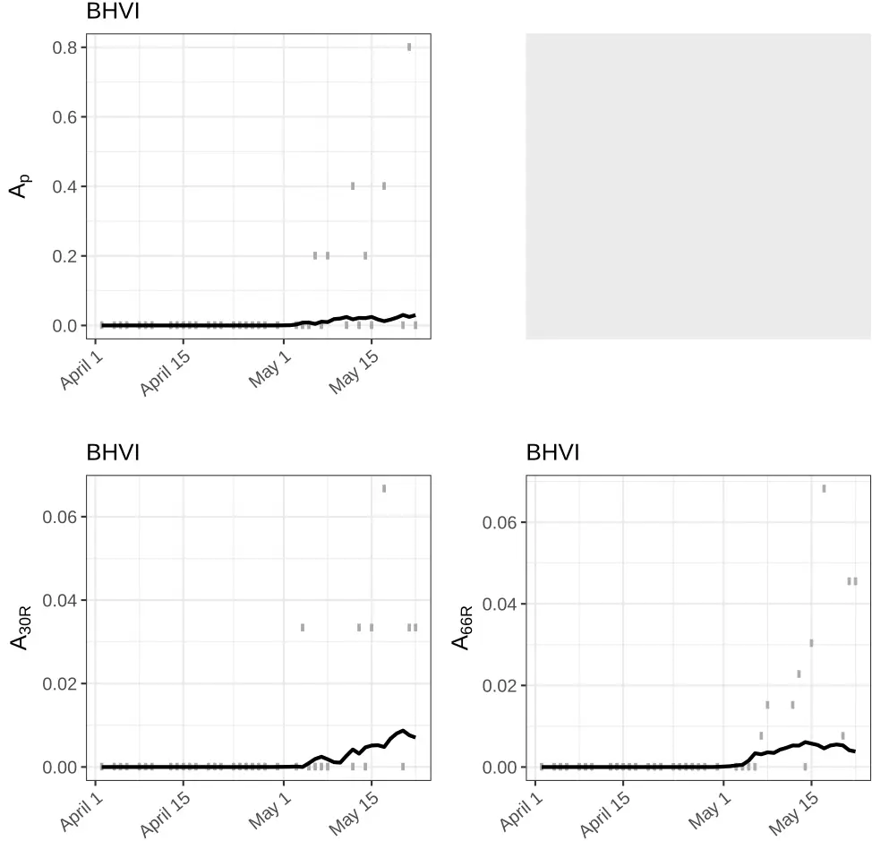

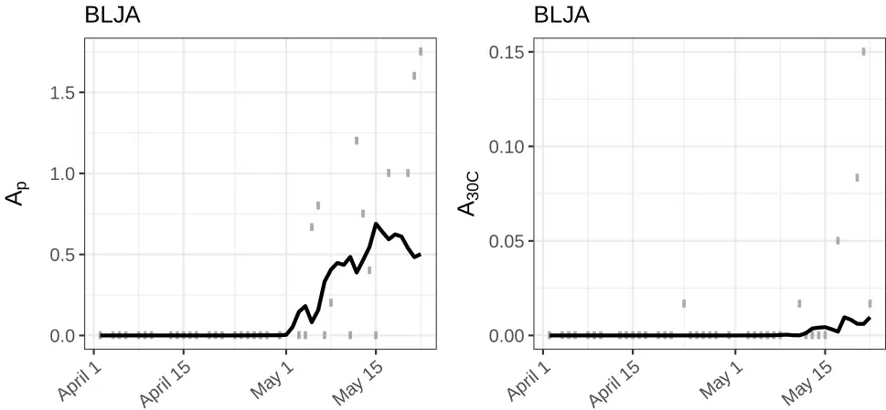

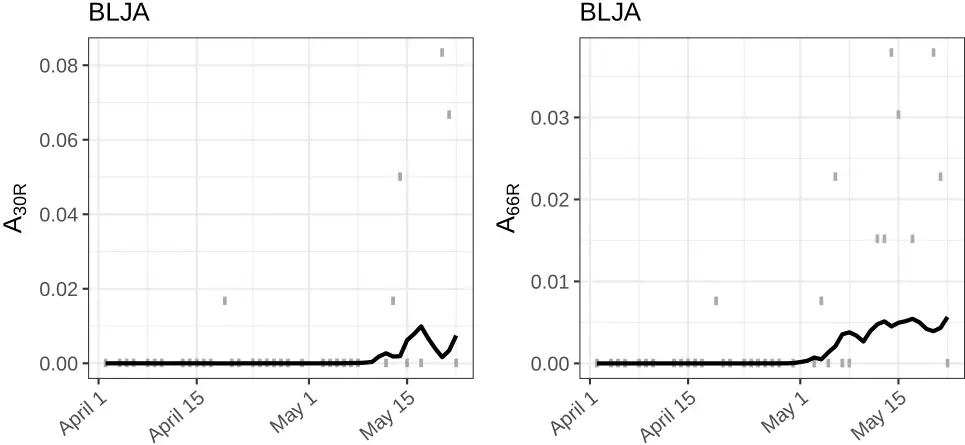

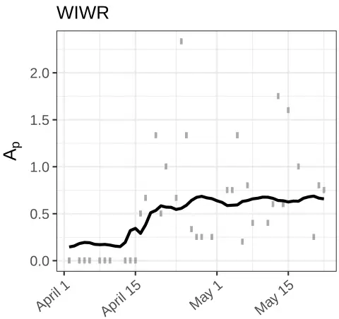

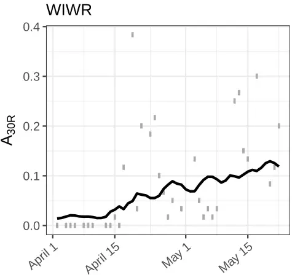

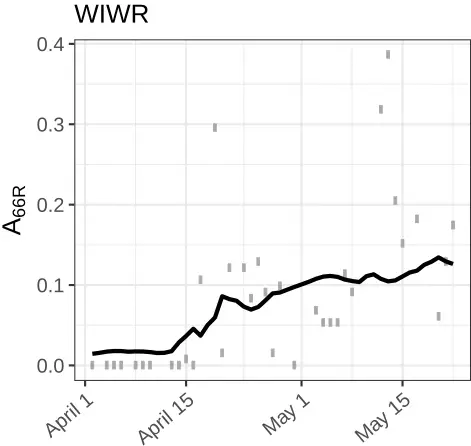

Ap HETH

l

l

l lll lll llll ll

l

l l

l

lll l l

l

l

l

l

l

l

ll

l

l

l

l

April 1

April 15

May 1

May 15

A30C

HETH

l

l

l

l lll lll lllll lll ll lll l llllll lllll

l

l

April 1

April 15

May 1

May 15

HETH

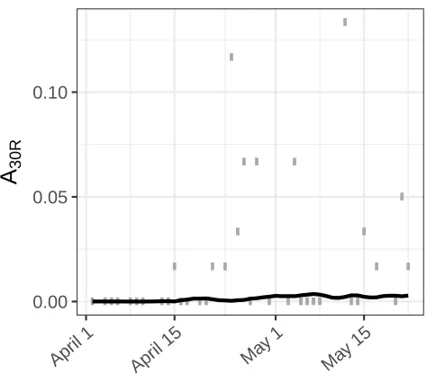

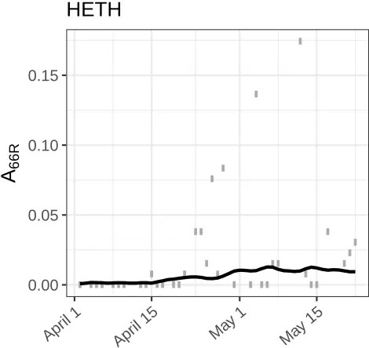

l

1.2

0.8

0.4

0.0

0.4

0.3

0.2

0.1

0.0

Ap BTNW

l

l

l

l

l

l

l

l

l lll lll lllll lll llllll l llllll l

April 1

April 15

May 1

May 15

A30C

BTNW

l

l

l

l

l lll lll lllll lll llllll l llllll ll

l

l

l

April 1

April 15

May 1

May 15

A30R

0.75

0.50

0.25

0.00

BTNW

l

l

l

l

l lll lll lllll lll llllll l llllll

l

ll

l

April 1

April 15

May 1

May 15

A66R

0.75

0.50

0.25

0.00

BTNW

l

l

l

l

l

l

l lll lll lllll lll llllll l llllll

l

l

April 1

April 15

May 1

May 15

2.0

1.5

1.0

0.5

0.0

0.6

0.4

0.2

0.0

Ap GCKI

l

l

l

l

l lll l l lll

l

l

l

l

l

l

l

l

l

l

l

l

l

l

l

l l

l

l

l

l

l

April 1

April 15

May 1

May 15

A30C

GCKI

l

l

l

l

l

l

l

l

l lll lll l ll

l

l

llll

l

lllll llll l ll

April 1

April 15

May 1

May 15

A30R

0.15

0.10

0.05

0.00

GCKI

l

l

l

l

l

l

l

ll

l

l

l lll lll lllll l

l

l

l l

l

l

l l l l ll

April 1

April 15

May 1

May 15

A66R

0.15

0.10

0.05

0.00

GCKI

l

l

l

l

l

l

l

l

l ll

l

l

lll lll

l

l

l

l

l

l

l

l

l

l

l

l

l l

l

l

l

April 1

April 15

May 1

May 15

l

l

3

2

1

0

0.25

0.20

0.15

0.10

0.05

0.00

Ap NOFL

l

l

l

l

l lll lll lllll

l

ll

l

ll

l

l

l

l

l ll

l

lll l

l

ll

April 1

April 15

May 1

May 15

A30C

NOFL

l

l

l

l

l

l lll lll lllll

l

ll ll ll

l

l

lll llll l lll

April 1

April 15

May 1

May 15

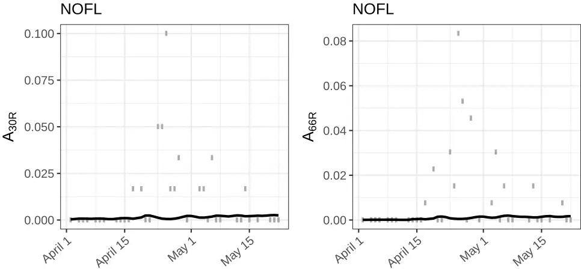

1.2

0.8

0.4

0.0

0.15

0.10

0.05

0.00

Ap NOPA

l

l

l

l

l

ll

l

l lll lll lllll lll llllll l llllll l

April 1

April 15

May 1

May 15

A30C

NOPA

l

l

l lll lll lllll lll llllll l llllll l lll l l

l

April 1

April 15

May 1

May 15

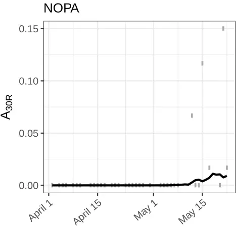

A66R

0.125

0.100

0.075

0.050

0.025

0.000

NOPA

l

l

l

l

l

l lll lll lllll lll llllll l llllll ll

l

April 1

April 15

May 1

May 15

0.6

0.4

0.2

0.0

0.4

0.3

0.2

0.1

0.0

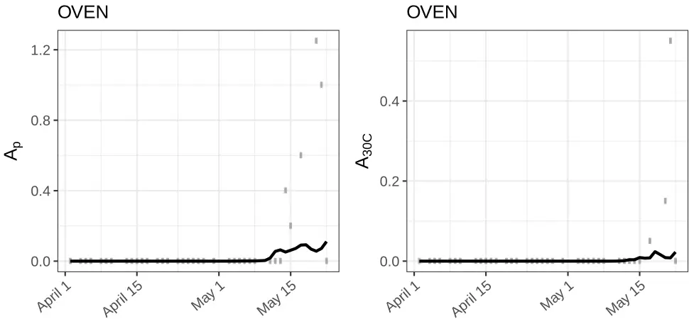

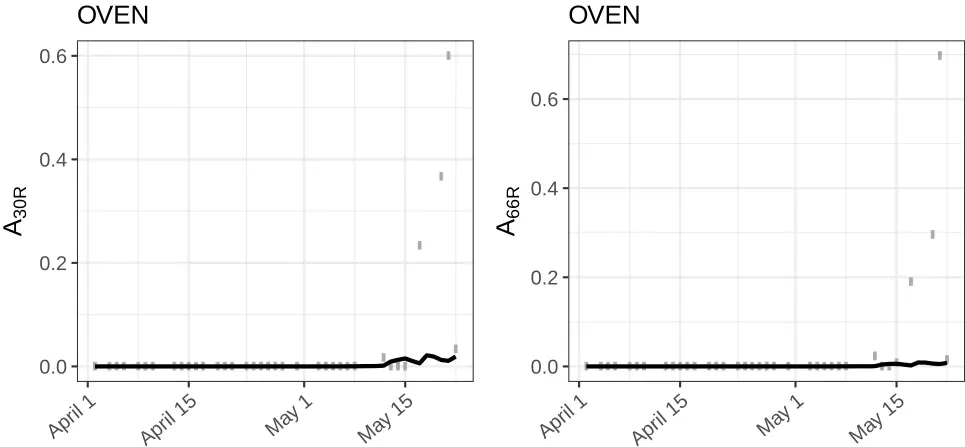

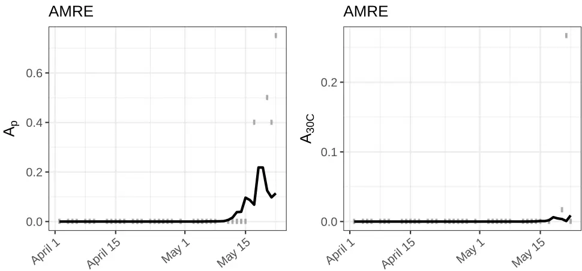

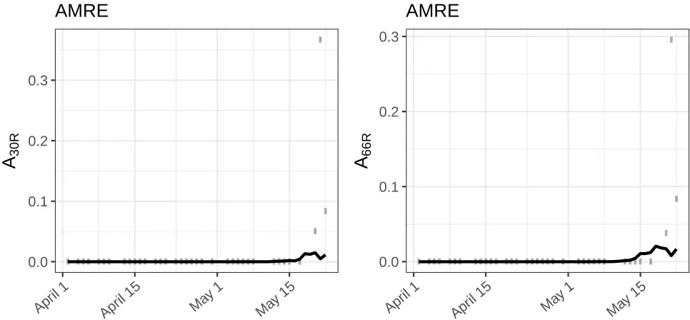

Ap RBNU

l

l

l

l

l

l

l

lll

l

l

l

l

l

l lll lll lllll l

l

lll l

l

l l

l

April 1

April 15

May 1

May 15

A30C

RBNU

l

l

l

l

l

l

l

ll ll lllll lll l

l

lll l

l

lllll

l

l

l lll

April 1

April 15

May 1

May 15

A30R

0.08

0.06

0.04

0.02

0.00

RBNU

l

l

l

ll lll

l

l

l

ll lll lllll ll ll l l llll l l lll

April 1

April 15

May 1

May 15

A66R

0.06

0.04

0.02

0.00

RBNU

l

l

l

l

l l

l

l

l

l

l

l

l

l

ll l l lllll

l

l

ll l l

l

l

l

l l ll

April 1

April 15

May 1

May 15

1.00

0.75

0.50

0.25

0.00

0.10

0.05

0.00

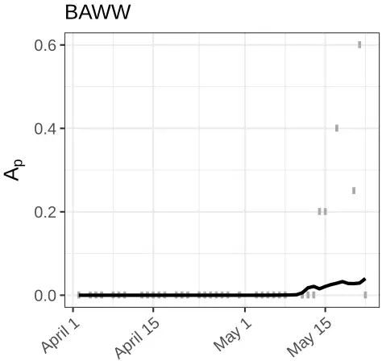

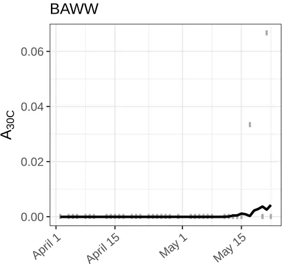

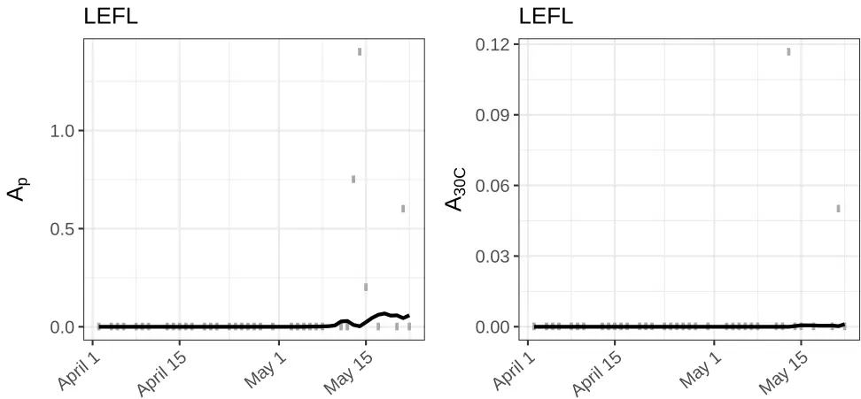

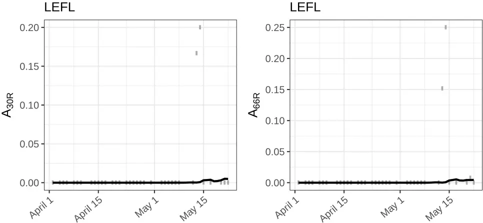

Ap AMCR

l

l

l

l

l

l

ll lll

l

l ll

l

lllll

l

l l

l

l

l

l

llll l lll

April 1

April 15

May 1

May 15

A30C

AMCR

l

l

l

l

ll lll lllll lll llllll l lll ll l lll l lll

April 1

April 15

May 1

May 15

AMCR

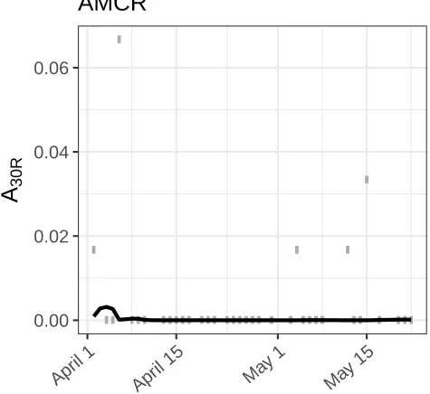

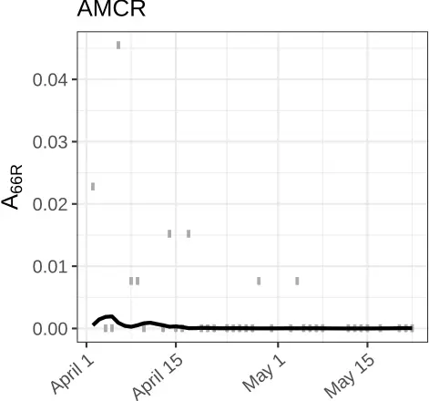

l

1.0

0.5

0.0

0.05

0.04

0.03

0.02

0.01

0.00

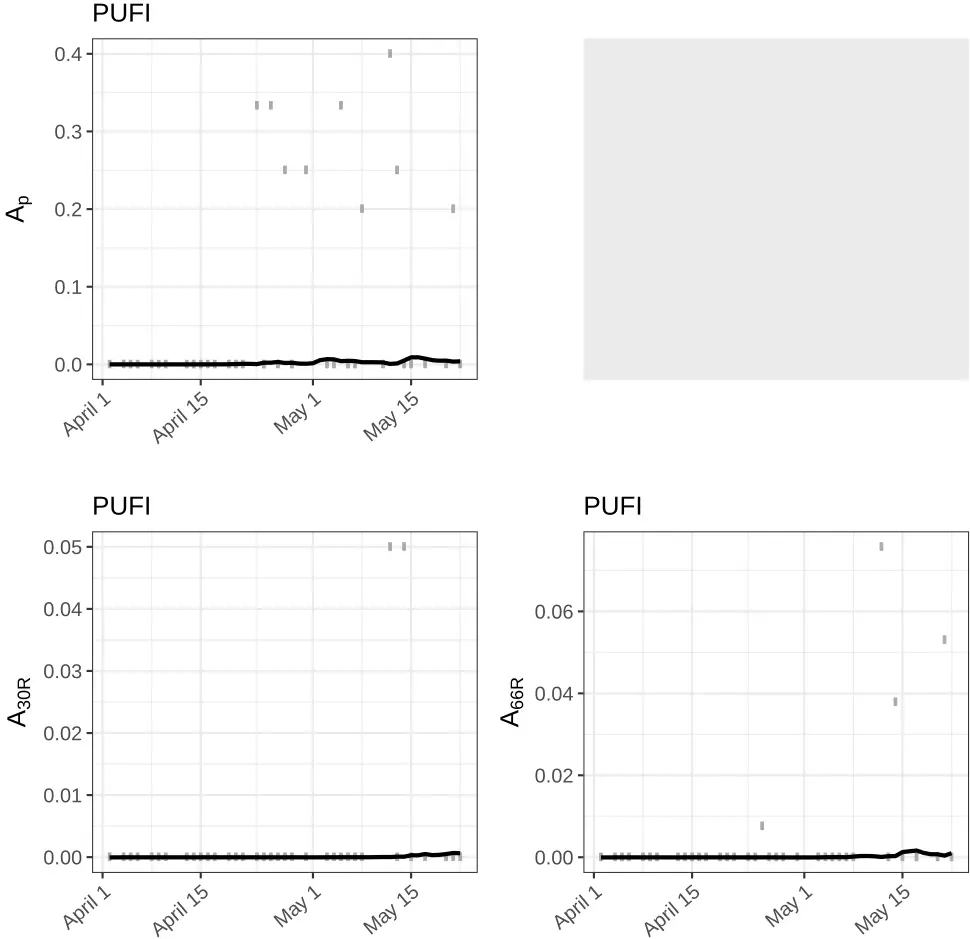

Ap BCCH

l

l

l

l l

l

l

l

l

l l

ll

l

l l l

l

l

l

l

l l

l

lll

l

l

ll

l

l

l

l

l

l

April 1

April 15

May 1

May 15

A30C

BCCH

l

l lll

l

l

ll l ll

l

l

l

l

l

l

l

ll

l

l ll

l

l

l

l

l

l

l

l

ll l l

April 1

April 15

May 1

May 15

A30R

0.12

0.09

0.06

0.03

0.00

BCCH

l

l

l

l

l l

l

l

l

l

l

l

l

ll

l

l

ll lll

l

l

l ll

l

l llll l

l

l

April 1

April 15

May 1

May 15

A66R

0.06

0.04

0.02

0.00

BCCH

l

l

l

l

l

l

l

l

l

l

l

l

l

l

l

l

ll

l

l

l

l

l

l

l

ll

l

l

l ll ll l l

April 1

April 15

May 1

May 15

2

1

0

0.3

0.2

0.1

0.0

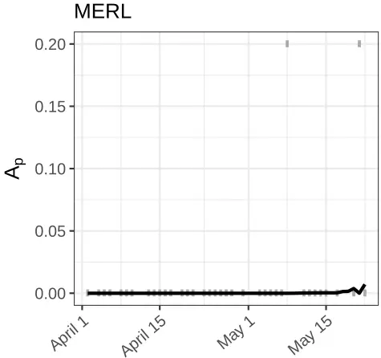

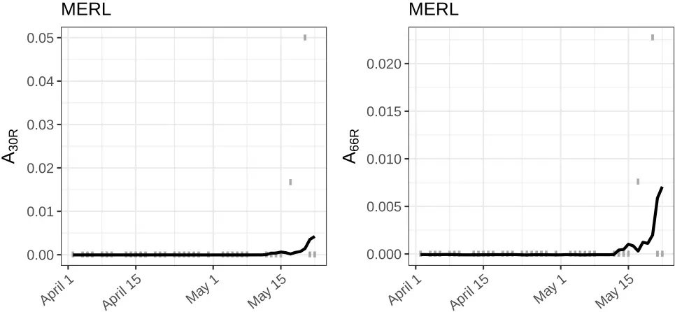

## AMGO

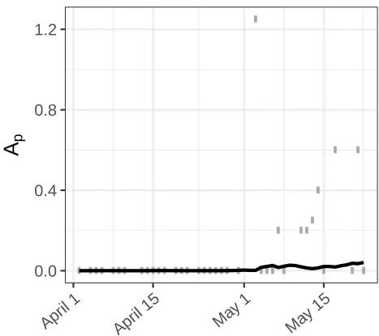

## AMGO

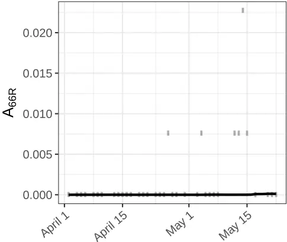

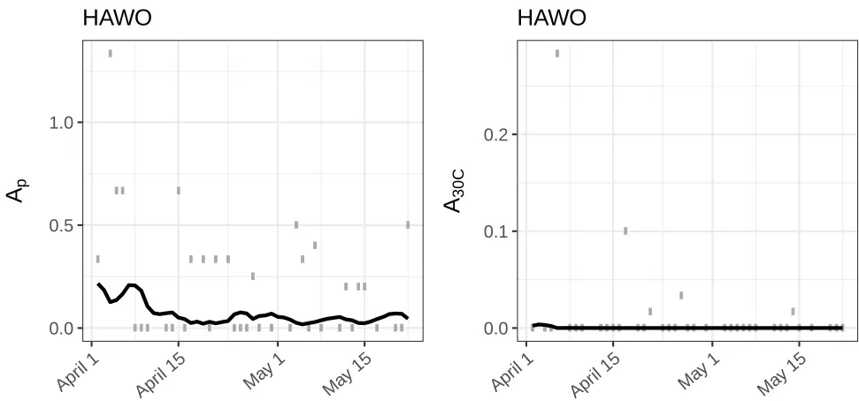

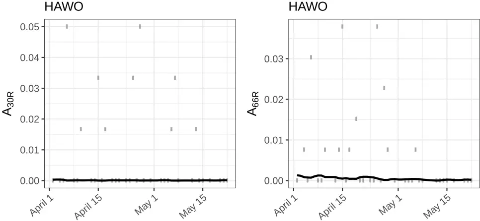

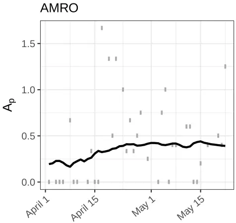

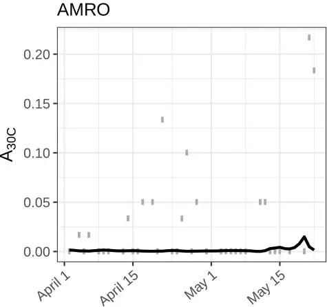

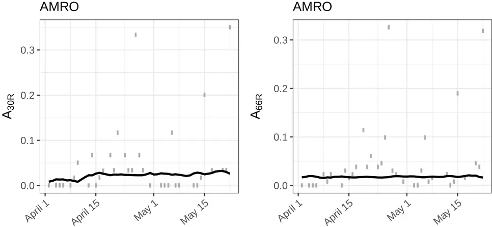

Ap DEJU

l

l lll lll lllll l l

l

l

l l

l

l

l l l llll lllll l l l l

April 1

April 15

May 1

May 15

A30C

DEJU

l

l

l

l lll lll lllll

l

llllll l llllll l lll l lll

April 1

April 15

May 1

May 15

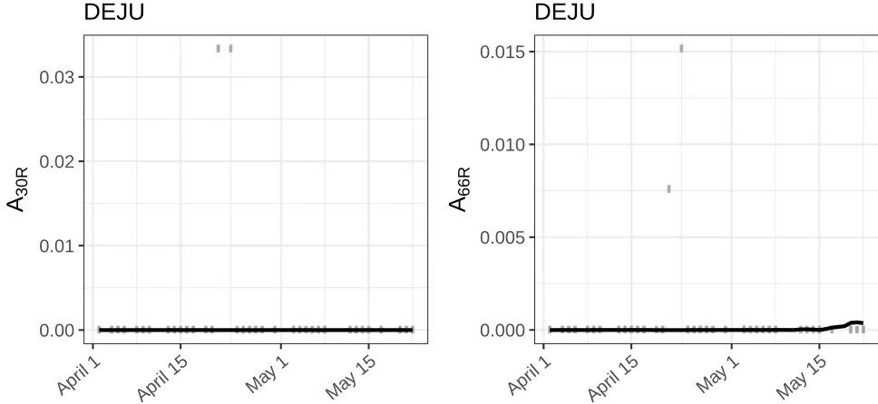

8

6

4

2

0

0.015

0.010

0.005

0.000

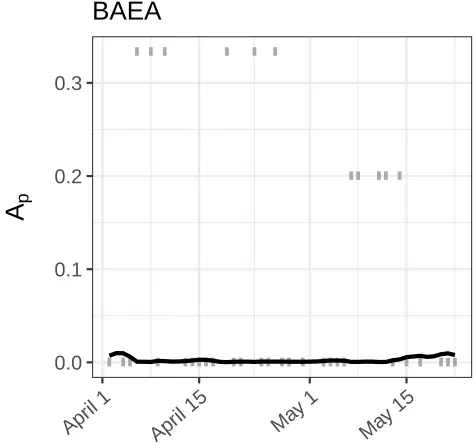

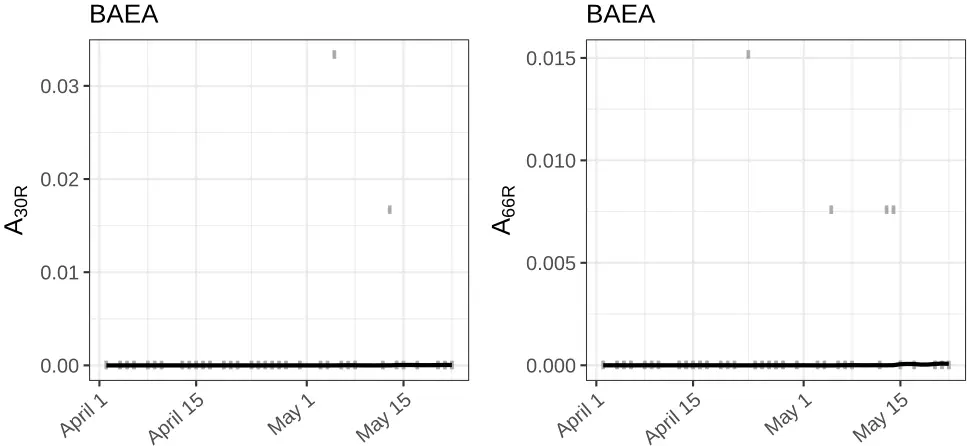

Ap CORA

l

l

l

l

l

l

ll

ll l

l

l

ll

l

l

l

ll

l

l

l

l

ll

l

l

l

l

l

l

l

l

April 1

April 15

May 1

May 15

A30C

CORA

l

l

l

l

l

l

l

l

l

ll ll

l

ll

ll lll llll

l

llll

l

lll l l

l

April 1

April 15

May 1

May 15

A30R

0.15

0.10

0.05

0.00

CORA

l

l

l

l

l l

l

l

l

l

l

l

ll ll

l

l

ll

l

l

ll ll

l

ll

l

l

l

l lll

April 1

April 15

May 1

May 15

A66R

0.09

0.06

0.03

0.00

CORA

l

l

l

l

l

l

l

l

l

l

l

l

l

l

l

l

l

ll

l

l

l

l

l

l

l

l

ll

l

l l

l

l

l

l

April 1

April 15

May 1

May 15

l

l

l

1.2

0.8

0.4

0.0

0.12

0.09

0.06

0.03

0.00

Ap PIWO

l

l

l

l

ll ll

l

l

l lll ll lllll

l

lllll l lll

l

lll l

l

April 1

April 15

May 1

May 15

A30C

PIWO

l

l

l

l

l

l

l

l lll ll lllll

l

lllll l lll ll llll

l

ll

April 1

April 15

May 1

May 15

A30R

0.03

0.02

0.01

0.00

PIWO

l

l

l

l

l lll lll l lll lll ll ll l l llll llll l lll

April 1

April 15

May 1

May 15

A66R

0.03

0.02

0.01

0.00

PIWO

l

l

ll

l

l

l

l

l

l lll lll l lll ll ll l l llll l

l

l lll

April 1

April 15

May 1

May 15

0.6

0.4

0.2

0.0

0.100

0.075

0.050

0.025

0.000

Ap DOWO

l

l

l

l

l

l

l

l l

l

l

l

l lll ll

l

l

lllll l ll

l

l ll ll l ll

April 1

April 15

May 1

May 15

A30C

DOWO

l

l

l lll lll ll

l

l

l

ll lll ll l l

l

l

llll l

l

l l ll

April 1

April 15

May 1

May 15

A30R

0.03

0.02

0.01

0.00

DOWO

l

l

ll

l

l

l

l lll lll ll ll lll ll

l

l l llll l ll l ll

April 1

April 15

May 1

May 15

A66R

0.06

0.04

0.02

0.00

DOWO

l

l

l

ll

l

l

ll

l

l lll ll

l

l

ll ll

l

l

l

l l lll l

l

l l ll

April 1

April 15

May 1

May 15

l

l

1.00

0.75

0.50

0.25

0.00

0.3

0.2

0.1

0.0
