

Received 29 April 2023, accepted 26 May 2023, date of publication 30 May 2023, date of current version 7 June 2023.

_Digital Object Identifier 10.1109/ACCESS.2023.3281361_

# Wild Bird Species Identification Based on a Lightweight Model With Frequency Dynamic Convolution

YOU-PENG SUN [,](https://orcid.org/0009-0003-9836-037X) YING JIANG, ZHENG WANG, YUAN ZHANG, AND LIU-LEI ZHANG

College of Mechanical and Electronic Engineering, Nanjing Forestry University, Nanjing 210037, China

Corresponding author: Ying Jiang (jiangying0510@sina.com)

**ABSTRACT** The sound recognition technology is used to count bird speciespopulation to provide accurate data for population ecology and conservation biology research. Bird species can be identified by spectrogram of bird's sounds. The existing Convolutional Neural Network(CNN) is not good at mining the relationship between features in time-frequency tasks, and the existing CNN has more parameters and complicated calculation, so existing models are not suitable for deployment in an actual field environment. In order to fill this gap, this paper proposes a lightweight model with frequency dynamic convolution for bird species identification. We use frequency dynamic convolution innovatively to better capture features of bird sounds at different frequencies. First of all, we replaced two-dimensional convolution with frequency-dynamic convolution in order to achieve not-shift invariance of the bird sound's spectrogram, so that we can effectively capture the feature differences of spectrogram in different frequency bands. Then, we replaced part of the Squeeze and Excitation(SE) attention mechanism with the Coordinate Attention(CA) attention mechanism in order to get more comprehensive global information. Finally, the feature fusion module was used to fuse the local and global features. In addition, we built a datasets containing 160 bird sounds, improving the generalization ability of the model. The experimental results show that our model has good generalization ability and is superior to the existing Lightweight CNN, and obtained better results in top1 accuracy and top5 accuracy.

**INDEX TERMS** Deep learning, bird species identification, bird sounds recognition, frequency dynamic convolution, attention mechanism.

### **I. INTRODUCTION**

Birds are an important part of the ecosystem, and the change of bird population is an important indicator to measure the ecological environment. Many researchers study ecosystem conservation using animals as observation objects [\[1\], \[2\],](#page-9-1) [\[3\], \[4\], \[5\]. Th](#page-9-4)e ecological quality of the natural environment can be assessed by counting the changes of animals populations [\[6\], \[7\], \[8\], \[9\].](#page-9-8)

It is difficult to monitor birds in the natural environment because birds are widely distributed and fly fast [\[10\],](#page-9-9) [\[11\]. M](#page-9-10)ost scholars observe birds in natural environment through bird sounds [\[12\], \[13\]. C](#page-9-12)ompared with the manual

The associate editor coordinating the review of this manuscript and approving it for publication was Chuan Li.

observation method, infrared camera monitoring method and mark-and-recapture method, the bird sounds recognition method is efficient and stable. With the rapid development of artificial intelligence [\[14\], \[15\], t](#page-9-14)he use of deep learning technology to identify birds has become the mainstream of technology [\[16\], \[17\], \[18\].](#page-9-17)

## A. PRIOR WORK

There is a lot of work in bird sounds feature processing and model building. In the past, researchers divided the bird sounds into phonemes, converted phonemes into feature vector sequences through signal processing, matched the feature vector sequences with the template of bird sound, and calculated the probability of each sound template to

achieve sound recognition. This process is computationally expensive, complex, and low in accuracy. In recent years, deep learning has made great progress in the field of bird sound recognition. Incze [\[19\] a](#page-9-18)pplied convolutional neural network(CNN) to bird sound recognition for the first time, converting bird sounds into various acoustic features and generating spectrograms, and then used convolutional neural network to classify spectrograms. Compared with the machine learning method, the depth learning method achieves higher recognition accuracy. Badi [\[20\] co](#page-9-19)mbined PNCC and robust Mel-log filter bank features to establish a model with strong robustness, and achieved high recognition accuracy in noisy environments.

In the aspect of bird sound feature processing. Permana [\[21\] a](#page-9-20)pplied Constant-Q transform(CQT) to convert bird sounds into spectrograms, and then used CNN to identify bird sounds. Knight [\[22\] pr](#page-9-21)oposed a method to improve bioacoustic classification by preprocessing spectrograms, which improved the classification accuracy of CNN. Xie [\[23\] co](#page-9-22)mpared the performance of different classification models and selectively fused bird sounds features, which proved the feasibility of feature fusion. CNN have good performance in time-frequency conversion of non-stationary signals in noisy environment. Lopec [\[24\] p](#page-9-23)roposed a method for the classification of noisy non-stationary time-series signals based on CNN and cohen time-frequency distribution. Eltrass [\[25\]](#page-9-24) proposed a CQ-NSGT algorithm for automated identification of Congestive Heart Failure (CHF) and Arrhythmia (ARR).

In order to achieve the requirements of low power consumption and low computation in the forest working environment. Solomes [\[26\] pr](#page-10-0)oposed an automatic detection algorithm for embedded devices used in wildlife monitoring. Kojima [\[27\] p](#page-10-1)roposed a cascading method and realized the lightweight application of the system on a single board computer. Chen [\[28\] pr](#page-10-2)oposed dynamic convolution, and applied it to lightweight convolution neural network, which enhanced the representation capacity of the model without increasing the depth or width of the network. Nam [\[29\] p](#page-10-3)roposed frequency dynamic convolution, which is applied to acoustic event detection. The experimental results show that compared with two-dimensional convolution, frequency dynamic convolution is more suitable for spectrograms processing. Some algorithm designs, such as depth separable convolution [\[30\],](#page-10-4) extrusion and excitation [\[31\], a](#page-10-5)symmetric convolution [\[32\],](#page-10-6) architecture search [\[33\], \[34\], a](#page-10-8)re very helpful for improving model recognition rate, reducing model complexity and reducing model calculation.

The above research has made some contributions to bird sounds recognition, but most models use less dataset features, resulting in poor generalization ability of the model. Moreover, some models have large parameters, high computational complexity and require computers with high performance, which can not be applied in the actual forest environment. Although some lightweight models can meet the requirements of low power consumption and low computation, they are not specially designed for bird sound recognition, so the recognition accuracy is low. Therefore, in order to deploy the bird sounds recognition model in the embedded device with low power consumption, and ensure a high recognition accuracy in the complex forest environment. It is necessary to design a new lightweight model with strong generalization ability and high recognition accuracy.

In order to solve the above problems, this paper takes Logarithmic Melspectrum (Log-Mel) as the sounds feature, applies frequency dynamic convolution to bird sounds recognition for the first time, innovatively adds feature fusion module and Coordinate Attention(CA) Blocks module, and designs a new model architecture.

The paper is structured as follows: Section [II](#page-1-0) presents the data set, sound feature processing and the effect of different convolutions on bird sound recognition. Section [III](#page-3-0) presents the model structure of this paper. Section [IV](#page-5-0) presents the experimental comparison results of our model and other models. Section [V](#page-8-0) concludes the study of this paper.

#### B. CONTRIBUTION

The main contributions of this paper are as follows:

- 1) We replace two-dimensional convolution with frequency dynamic convolution. The frequency dynamic convolution is applied to bird sounds recognition for the first time. In order to better extract the feature of spectrogram in different frequency bands and enhance the physical consistency between the model and the time-frequency pattern task.
- 2. This paper proposes a lightweight CNN, which can be applied to embedded devices. The recognition accuracy is guaranteed under the premise of fewer parameters and less computation.
- 3. In order to get more comprehensive global information, we replace part of the Squeeze and Excitation(SE) attention mechanism with the Coordinate Attention(CA) attention mechanism. At the stage of the feature fusion, a feature fusion module with less computation is designed.
- 4) A datasets containing 160 bird sounds was constructed, which greatly improved the generalization ability of the model.

## **II. DATASETS AND METHODS**

In the section, we mainly introduce the datasets in the experiments and the convolution application of bird sound recognition.

# A. DATASETS

Our datasets is collected from Nanjing Baguazhou area, Nanjing Zijin Mountain area and BirdCLEF. To the best of our knowledge, BirdCLEF is the only public bird sound datasets. Our datasets contains 160 species of birds. The Log-Mel Spectrogram of birds in the datasets are shown in Figure [1.](#page-2-0) Table [1](#page-2-1) shows the top5 birds in the datasets.

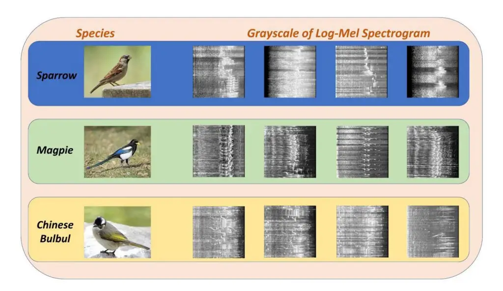

**FIGURE 1.** The Log-Mel Spectrogram of birds in the datasets.

**TABLE 1.** The Top5 birds in the datasets.

| Figure 1                | Data Volume |
| ----------------------- | ----------- |
| Sparrow                 | 150         |
| Black-and-white warbler | 140         |
| Magpie                  | 130         |
| Chinese Bulbul          | 130         |
| Turdus merula           | 100         |

### B. FEATURE PROCESS

Bird sound is a short-time stationary signal with characteristics of non-stationary and short-time stationarity. In order to obtain more feature information, signal processing technology is used to extract the feature of bird sound waveforms and convert it into spectrogram. Take Log-Mel Spectrogram for example, the process of feature extraction is shown in Figure [2.](#page-2-2)

According to different application fields, bird sounds can be converted into different sound features, such as Log-mel, Mel Frequency Cepstrum Coefficient(MFCC) [\[35\], G](#page-10-9)ammatone Frequency Cepstrum Coefficient (GFCC) [\[36\], P](#page-10-10)ower-Normalized Cepstral Coefficients (PNCC) [\[37\].](#page-10-11) Spectrograms of different sound characteristics are shown in Figure [3.](#page-3-1)

There are different features of spectrograms. MFCC is sensitive to low frequency sound and is often used in human speech recognition technology. GFCC is sensitive to high-frequency sound and is often used for urban

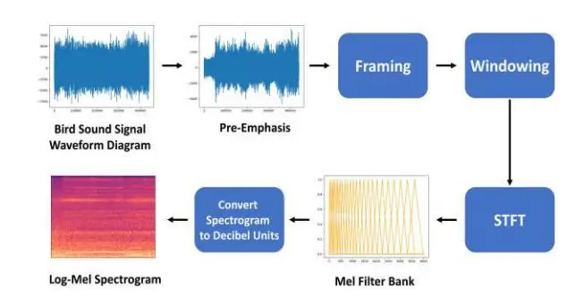

**FIGURE 2.** Feature extraction of bird sound.

environmental sound recognition. PNCC has strong robustness and is often used for sound recognition projects in noisy environments. The vocal frequency range of birds is wide, ranging from 250hz-13000hz, most of them range from 1000hz-8000hz [\[38\],](#page-10-12) [\[39\]. T](#page-10-13)he Log-Mel spectrograms is friendly to all frequencies, it is widely used in the field of bird sound recognition. In a Log-Mel Spectrogram, the brightness of the colors is usually used to represent the magnitude of the energy. Brighter colors represent higher energy values, while darker colors represent lower energy values. Color encoding schemes typically use a heatmap format, such as a gradient from blue to red. In order to verify the impact of different sound features on the final recognition accuracy of the model. This paper has conducted a series of experiments. The MobileNetV3-Small model was used for training the four sound features. The recognition accuracy of the four sound features is shown in Table [2.](#page-3-2) The experimental results show

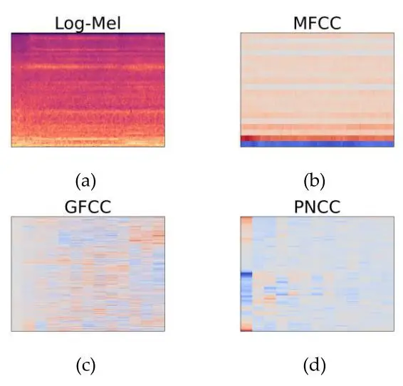

**FIGURE 3.** Spectrograms of different sound feature: (a) Logarithmic Melspectrum(Log-mel); (b) Mel requency Cepstrum Coefficient (MFCC); (c) Gammatone Frequency Cepstrum Coefficient (GFCC); (d) Power-Normalized Cepstral Coefficients (PNCC).

that Log-Mel spectrogram is the most suitable sound feature for bird sound recognition.

**TABLE 2.** The accuracy of different sound features with the same model.

| Feature | Accuracy |
| ------- | -------- |
| Log-Mel | 89.27%   |
| MFCC    | 82.23%   |
| GFCC    | 74.67%   |
| PNCC    | 75.12%   |

# C. CONVOLUTION PROCESSING IN BIRD SOUND RECOGNITION

Chen [\[28\] p](#page-10-2)roposed dynamic convolution, which can adaptively adjust the convolution kernel parameters according to the input image without increasing the network depth. For different inputs, different convolution kernel parameters are calculated. These convolution kernel parameters are regarded as different weights. The basic kernels are weighted and summed according to the weights. The optimal input kernels are obtained by aggregating multiple convolution kernel parameters. Compared with the convolution kernel with the same single parameter in each layer, the dynamic convolution significantly improves the expression ability of the model.

Nam [\[29\] p](#page-10-3)roposed dynamic frequency convolution by applying frequency adaptive kernel to solve the time-shift of frequency axis. As shown in Figure [3,](#page-3-1) in previous studies [\[40\], w](#page-10-14)ithout considering the time-frequency property, Log Mel Spectrogram was directly processed by two-dimensional convolution. But the spectrogram is different from ordinary images. The X axis and Y axis of the spectrogram have practical physical significance. If two-dimensional convolution is

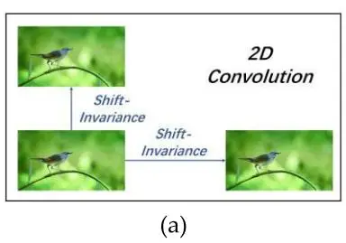

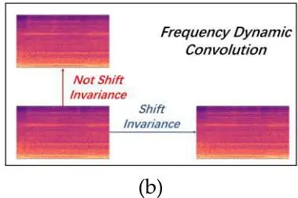

**FIGURE 4.** Different convolution processing pictures: (a) Two-dimensional(2D) convolution; (b) Frequency Dynamic Convolution.

directly used for the spectrogram, the image features will be greatly affected. In the spectrogram, the X axis is the time axis, the Y axis is the frequency axis, and the frequency is the time-shift dimension. Therefore, this paper uses frequency dynamic convolution to process the bird sound spectrogram instead of the translation invariance of the two-dimensional convolution, and retaining the feature information of bird sound to the greatest extent. This is the first time that frequency dynamic convolution is applied to bird sound recognition. Enhance the physical consistency between the model and time-frequency patterns in sound events.

In the natural environment, there are different bird sounds, often accompanied by disturbing sounds, such as the sound of leaves. Therefore, sound samples are usually regarded as non-stationary sound events. With the passage of time, the frequency components of non-stationary events change constantly, and more complex and changeable patterns appear in different frequency ranges on the spectrograms.

From the above discussion, it can be seen that the application of frequency dynamic convolution can enhance the model's perception of non-stationary sound signals, and enhance the recognition of various complex patterns exhibited by non-stationary sound events, thus improving the recognition accuracy of bird sound recognition model.

#### **III. MODEL CONSTRUCTION**

#### A. FREQUENCY DYNAMIC CONVOLUTION

Considering that the spectrogram contains information in frequency domain and time domain. The frequency dynamic convolution uses the frequency adaptive kernel to process spectrogram. Improve the inconsistency of time-frequency mode caused by the translation and equivariant imposed by two-dimensional convolution [\[29\]. T](#page-10-3)he frequency dynamic convolution first uses Attention Block to calculate the frequency adaptive attention weight of the spectrogram, and

first uses average pooling in the time domain. Secondly, in order to consider the adjacent frequency components, onedimensional convolution processing is used. Then apply the batch normalization and activation function ReLU. In order to make the channel dimension equal to the number of basic kernels, one-dimensional convolution is used for compression.

Finally, Softmax adjust the self attention weight, and adjust the range of self attention weight to 0 to 1. As the smaller the temperature coefficient is, the more attention is paid to separating this sample from the most similar other samples. In order to ensure the uniform learning and stable training of the basic kernel and enhance the discriminant ability of the model, the temperature coefficient of Softmax is adjusted to 30 [\[41\], \[42\].](#page-10-16)

Similar to the dynamic perceptron, the dynamic convolution has _N_ convolution cores, which share the same core size and input/output dimensions, and then aggregate through the attention weight.

For traditional sensors:

$$y = g(W^T * x + b) \tag{1}$$

where _W_, _b_, _g_ represents weight, offset, and activation functions, respectively.

Dynamic perceptron:

$$y = g(\tilde{W}^T(x) * x + \tilde{b}(x))$$
(2)

$$\tilde{W} = \sum_{k=1}^{K} \pi_k(x) * \tilde{W}_k \tag{3}$$

$$\tilde{b}(x) = \sum_{k=1}^{K} \pi_k(x) * \tilde{b}_k$$
(4)

where π*k* indicates the frequency adaptive attention weight. Through the processing of Softmax function, 0 < π*k* < 1. Finally, the dynamic frequency attention weight is weighted:

$$\pi = \sum_{k=1}^{K} \pi_k / K \tag{5}$$

The improved frequency dynamic convolution diagram is shown in Figure [5.](#page-5-1) Coordinate Attention

#### B. COORDINATE ATTENTION

The research on Mobilenet shows that Squeeze and Excitation(SE) module has a significant effect on improving the performance of the model, but SE module ignores the location information of the picture, which is important for generating spatial selective attention map [\[42\]. C](#page-10-16)oordinate Attention(CA) adds the location information of the picture to the channel attention to enhance the expression ability of model learning features. Because global pooling is usually used for channel attention to globally encode spatial information, but global spatial information is compressed into channel descriptors, it is difficult to save location information. Different from the channel concern that converts the feature tensor into a single feature vector through two-dimensional global pooling, CA decomposes the channel concern into two one-dimensional feature encoding processes, aggregates features along two spatial directions, and obtains feature maps in width and height directions, as shown in the following formula:

$$z_c^h(h) = \frac{1}{W} \sum_{0 < i < W} x_c(h, i)$$
(6)

$$z_c^w(w) = \frac{1}{H} \sum_{0 \le j < H} x_c(j, w)$$
(7)

As mentioned earlier, the X axis of the spectrogram is the time axis and the Y axis is the frequency axis. The feature processing method of CA is the same as the frequency dynamic convolution in section [III-A,](#page-3-3) which is applicable to the spectrogram. In this way, long-distance correlation can be captured along one spatial direction, while accurate location information can be retained along another spatial direction. Then the feature map is coded into a pair of direction aware and position sensitive attention maps, which can be applied to the input feature map in a complementary way. This method enhances the processing ability of the model for interested information.

#### C. FEATURE FUSION

After frequency dynamic convolution processing, the features are very rich, and a multi-scale feature fusion module is needed to fully extract the features of the original data. In order to extract more feature information, the feature fusion module proposed in this paper has three parallel branches, two of which introduce CA attention mechanism after feature extraction to fully capture effective feature information. 3 × 3 Convolution is used to extract the subtle features of the original sound data, 5 × 5 Convolution is used to extract the overall features of the original sound data. But 5 × 5 convolution calculation is large, and two 3 × 3 are used instead of the 5 × 5 convolution [\[43\], \[44\]. T](#page-10-18)he feature fusion module is shown in Figure [7.](#page-5-2)

## D. ARCHITECTURE

The network backbone model designed in this paper refers to MobileNetV3Large. For the bird sound recognition task, the frequency dynamic convolution module is added. Considering the abundant features in the initial stage, the feature fusion modules are designed and CA attention mechanism is introduced. The model network architecture is shown in Figure [8.](#page-6-0) As shown in Figure [8,](#page-6-0) CA-bnecks consist of Depthwise Convolution, CA attention mechanism, Bnecks consist of H-Swish, SE attention mechanism and Depthwise Convolution. As shown in Table [3,](#page-6-1) not every Bnecks contains H-Swish and SE.

Frequency dynamic convolution module to enhance the model's ability to recognize time-frequency pattern tasks. In the initial stage of the model, the input feature size is large, and features of different scales are fused through the feature fusion module. The CA attention mechanism enhances

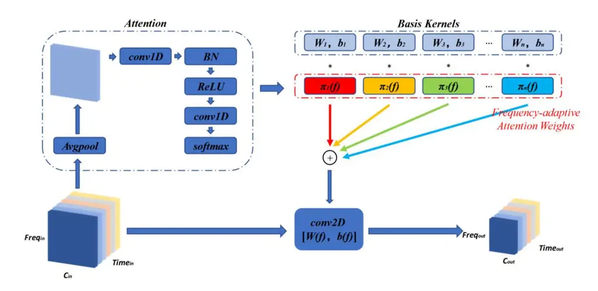

**FIGURE 5.** Schematic diagram of frequency dynamic convolution.

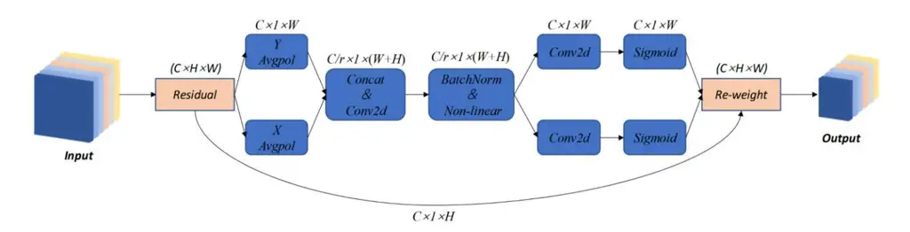

**FIGURE 6.** Coordinate attention diagram.

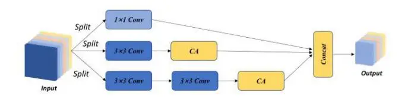

**FIGURE 7.** Feature fusion module diagram.

the model's ability to perceive spatial information features, removes irrelevant information in the global information, retains more effective information, so that the model can most effectively refine the global information, and improves the model's ability to refine global information. The model network architecture is shown in Table [3.](#page-6-1)

The activation function ReLu is used in the beginning stage, while Hard-Swish(HS) is used in the intermediate network because HS can alleviate the gradient disappearance problem, improve the nonlinear modeling capability and accelerate the computation of the network. HS activation has a similar shape to ReLU and has non-zero gradients in certain ranges, which can also help alleviate gradient vanishing to some extent. HS activation is also a nonlinear activation function with similar modeling capability to ReLU, and it exhibits saturation properties similar to the sigmoid function in certain ranges, which can help the network better handle inputs in the saturation region.

#### **IV. RESULTS**

This experiment is based on the Pytorch 1.8 environment. This experiment was conducted under Windows 10 system, with Intel i7-12700K processor, 32 GB DDR4 memory, NVIDIA GeForce3070Ti graphics cards.

In the experiment, the initial setting of the learning rate is 0.001, the dynamic adjustment of the learning rate is used in the training process, the batch size is set to 32, the train epoch is 300, the model optimizer is stochastic gradient

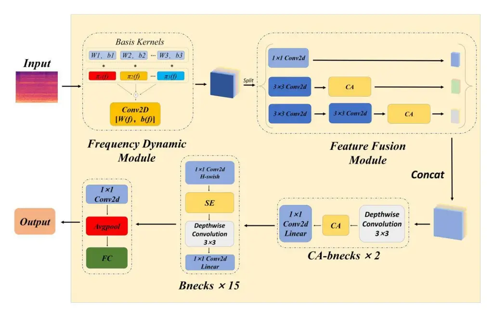

**FIGURE 8.** This paper model network architecture.

**TABLE 3.** Model network architecture. (C represents the output channel, N represents the number of modules, S represents the number of stride, Attention represents the attention mechanism used, and Activate represents the activation function used).

| Operator       | Input               | C    | N   | S   | Attention | Activate |
| -------------- | ------------------- | ---- | --- | --- | --------- | -------- |
| FDC            | 256 2 ×3 | 64   | 1   | I   | -         | ReLU     |
| Feature Fusion | $128^2 \times 64$   | 192  | 1   | 1   | CA        | ReLU     |
| CA-Bneck       | $128^2 \times 192$  | 16   | 2   | 1   | CA        | ReLU     |
| Bneck          | $128^2 \times 16$   | 64   | 1   | 1   | -         | ReLU     |
| Bneck          | $128^2 \times 64$   | 72   | 1   | 2   | -         | ReLU     |
| Bneck          | $64^2 \times 72$    | 120  | 1   | 1   | -         | ReLU     |
| Bneck          | $64^2 \times 120$   | 120  | 1   | 2   | SE        | ReLU     |
| Bneck          | $32^2 \times 120$   | 240  | 2   | 1   | SE        | ReLU     |
| Bneck          | $32^2 \times 240$   | 200  | 1   | 2   | -         | HS       |
| Bneck          | $16^2 \times 200$   | 184  | 1   | 1   | -         | HS       |
| Bneck          | $16^2 \times 184$   | 480  | 2   | 1   | -         | HS       |
| Bneck          | $16^2 \times 480$   | 672  | 1   | 1   | SE        | HS       |
| Bneck          | $16^2 \times 672$   | 672  | 1   | 2   | SE        | HS       |
| Bneck          | $16^2 \times 672$   | 960  | 1   | 1   | SE        | HS       |
| Bneck          | $8^2 \times 960$    | 960  | 2   | 1   | SE        | HS       |
| Conv2d         | $8^2 \times 960$    | 1280 | 1   | 1   | -         | ReLU     |
| Avgpool        | $8^2 \times 960$    | -    | 1   | -   | -         | -        |
| FC             | $1^2 \times 1280$   | 160  | 1   | -   | -         | -        |

descent(SGD), the loss function uses the cross entropy loss function, and the learning rate descent strategy uses cosine annealing.

The model recognition accuracy and loss function are shown in Figure [9.](#page-7-0) The accuracy of the model proposed in this paper reaches 95.21% in the training set. The loss of the model on the training set is close to 0.11. In order to verify the performance of this model, six other models are selected for comparison. The comparison results with other models are shown in Figure [10.](#page-7-1)

As shown in Figure [10\(a\),](#page-7-1) the model proposed in this paper has better recognition in accuracy. At the same time, as shown in Figure [10\(b\),](#page-7-1) the loss decline curve of the model proposed in this paper declines faster and converges, indicating that the model has faster learning ability.

As shown in Figure [11,](#page-7-2) when the training epoch is close to 200, ResNet50 exceeds the model proposed in this paper in terms of recognition accuracy and loss curve decline. However, the parameter quantity and FLOPS of ResNet50 are 5.3 times and 10.9 times of the model in this paper. Table [4](#page-8-1) shows the comparison of model parameter quantity and FLOPS.

The experimental results show that the proposed model has good recognition accuracy compared with other Lightweight CNN. In addition, the parameters and calculation amount are also significantly lower than ResNet50. This shows that the model proposed in this paper is more suitable for embedded devices requiring high energy consumption.

As shown in Table [5,](#page-8-2) this paper is superior to other research methods in terms of the number of species and accuracy. The

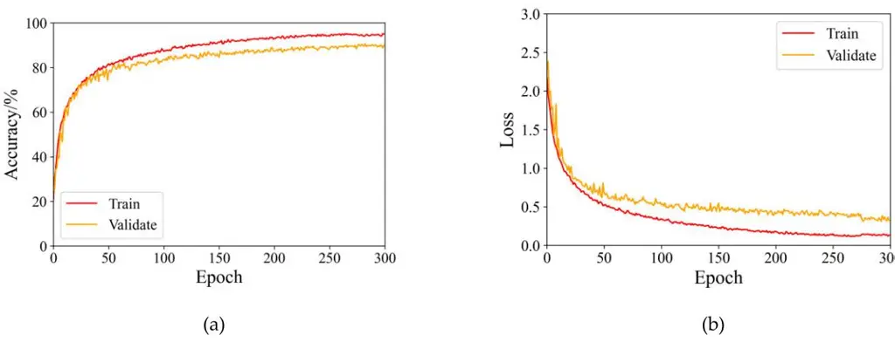

**FIGURE 9.** Diagram of the training results of the model proposed in this paper. (a) The accuracy curve of the train set and validate set; (b) The loss curve in the train set and validate set.

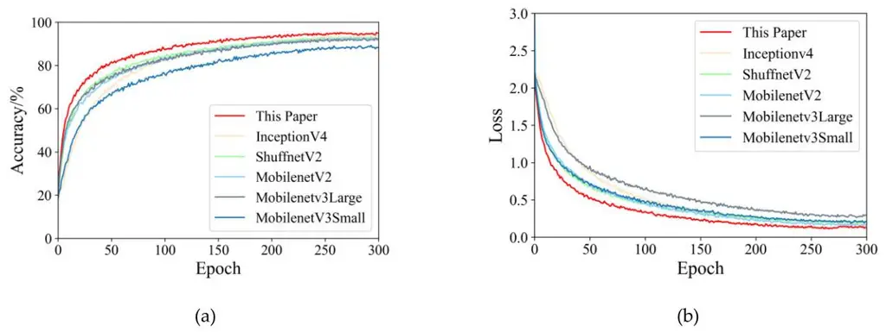

**FIGURE 10.** Comparison results between this paper and other models. (a) Accuracy comparison between this paper model and other models; (b) Loss drop curve comparison between this paper model and other models.

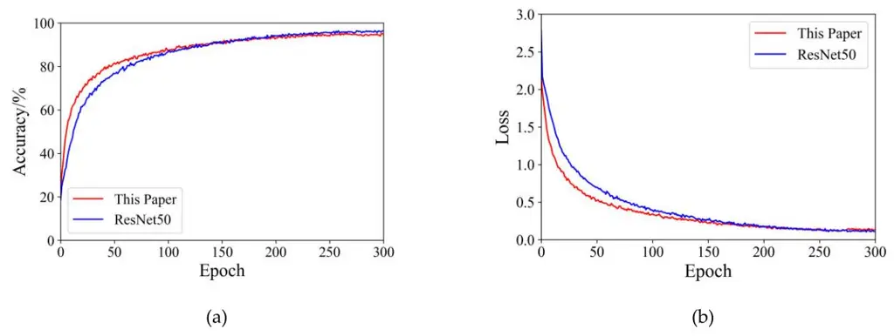

**FIGURE 11.** Comparison results between this paper and Resnet50. (a) Accuracy comparison between the model and Resnet50; (b) Loss drop curve comparison between the model and Resnet50.

most important thing is that the model in this paper has lower computational complexity.

In order to verify that each improvement point of the model improves the performance of the model, this paper carried out ablation experiments on the three improvement points, including whether to use frequency dynamic convolution, whether to perform feature fusion, and whether to use Coordinate Attention attention mechanism. The results of ablation experiment are shown in Table [6.](#page-8-3)

|     | TABLE 4. Comparison of accuracy, parameter quantity and FLPOS of each model.   |     |     |     |     |     |
| --- | ------------------------------------------------------------------------------ | --- | --- | --- | --- | --- |
| --  | ------------------------------------------------------------------------------ | --  | --  | --  | --  | --  |

| Network     | Model                | Top 1 Acc/% | Top 5 Acc/% | Parameter(M) | FLOPS(M) |
| ----------- | -------------------- | ----------- | ----------- | ------------ | -------- |
|             | This Paper           | 95.21%      | 100%        | 4.80M        | 491.99M  |
|             | MobileNet V2         | 92.77%      | 99.16%      | 3.50M        | 427.35M  |
| Lightweight | MobileNet V3 (Small) | 89.27%      | 97.64%      | 2.54M        | 80.97M   |
| CNN         | MobileNet V3 (Large) | 92.60%      | 100%        | 5.48M        | 305.50M  |
|             | Shuffnet V2          | 93.17%      | 100%        | 2.28M        | 199.14M  |
|             | Inception V4         | 94.14%      | 100%        | 4.81M        | 591.99M  |
| CNN         | ResNet 50            | 96.47%      | 100%        | 25.56M       | 5398.55M |

**TABLE 5.** Experimental results of different method.

| Researcher | Methods                                                  | Species Number | Accuracy/% |
| ---------- | -------------------------------------------------------- | ----------------- | ---------- |
| This Paper | The Lightweight Model with Frequency Dynamic Convolution | 160               | 95.21%     |
| Xie[23]    | Xie's Fused CNN Model                                    | 43                | 93.31%     |
| Zhang[45]  | KNN and Decision Tree                                    | 5                 | 85.3%      |
| Xie[46]    | CNN with Fusion Acoustic Features                        | 14                | 95.95%     |
| Saad[47]   | Low-Complexity Convolutional Neural Networks             | 10                | 85.73%     |

**TABLE 6.** Comparison of ablation experimental results.(1 represents whether to use frequency dynamic convolution module, 2 represents whether to use feature fusion module, and 3 represents whether to use CA-Bneck module).

| EXP        | 1         | 2         | 3         | ACC/%  | Para(M) | FLOPS(M) |
| ---------- | --------- | --------- | --------- | ------ | ------- | -------- |
| This paper | √         | √         | √         | 95.21% | 4.80M   | 491.99M  |
| 1          | $\sqrt{}$ | ×         | ×         | 94.62% | 4.22M   | 375.7M   |
| 2          | ×         | $\sqrt{}$ | ×         | 92.79% | 4.69M   | 389.6M   |
| 3          | ×         | ×         | $\sqrt{}$ | 90.44% | 4.32M   | 337.3M   |

**TABLE 7.** Inference speed of our models deployed on different devices.

| Equipment model  | Accuracy/% | Times(ms) | Power(W) |
| ---------------- | ---------- | --------- | -------- |
| Jetson Nano(4GB) | 92.67%     | 88.90ms   | 5-10W    |
| Jetson TX2       | 93.04%     | 25.33ms   | 7.5-15W  |
| Jetson Xavier NX | 93.25%     | 2.35ms    | 10-15W   |

In addition, in order to validate the performance of our lightweight model our models were deployed on the Jetson Nano, Jetson TX2 and Jetson Xavier NX, respectively, and the experimental results are shown in Table [7.](#page-8-4) The Jetson Nano features a 128 CUDA core NVIDIA Maxwell GPU, the Jetson TX2 features a 256 CUDA core NVIDIA Pascal GPU, and the Jetson Xavier NX features a 384 CUDA core NVIDIA Volta GPU. The experimental results are shown in Table [7.](#page-8-4)

# **V. CONCLUSION**

The richness of bird population diversity is an important indicator of ecosystem quality. In this paper, we propose an lightweight model for bird sound recognition. The model can achieve high accuracy while ensuring a relatively fast learning speed. At the same time, the model has fewer parameters and low FLOPS, which can be applied to embedded devices. We find that the sound feature have an effect on the recognition accuracy. Different sound features have different emphases. Experiments on the dataset in this paper also illustrate this point. Most birds still have low vocal frequency, so MFCC performs better than GFCC. MFCC is sensitive to low-frequency sound and GFCC is sensitive to high-frequency sound. Due to the wide range of bird sound frequencies, Log Mel is the best sound feature for bird sound recognition, because it has a good perception of all frequency sounds.We find that frequency dynamic convolution is superior than two-dimensional convolution in processing spectrograms. In the spectrograms, frequency is the time-shift

dimension, so two-dimensional convolution is not suitable for processing the spectrograms. The frequency dynamic convolution processing spectrograms can retain more effective feature information and improve the recognition accuracy of the model. However, our model also has limitations, as shown in Table [7](#page-8-4) in Section [IV,](#page-5-0) where the inference time of our model deployed on low performance embedded devices (e.g. Jetson Nano) is longer and the performance of the model could be improved.

This study draws the following conclusions:

- 1. Frequency dynamic convolution can not only improve the recognition of sound events, but also be used in the field of bird sound recognition. The research results of this paper can provide important reference value and improvement ideas for similar research projects and deep learning models.
- 2. The influence of sound features on bird sound recognitionmodel is significant. In this paper, variable experiments show that Log-Mel is the most suitable sound feature for bird sound recognition.
- 3. By introducing feature fusion module, the recognition accuracy of the model is improved, the parameters of the model are reduced, and the amount of calculation is reduced. The results of this paper can provide reference value for the improvement of similar recognition models. The introduction of CA attention mechanism can improve the spatial perception of the model, enable the model to capture more feature information, and improve the recognition accuracy of the model.
- 4. The accuracy of the model proposed in this paper is 95.21% on the dataset, which is superior to other lightweight CNN. In terms of parameter quantity and calculation quantity, it is far superior to non-lightweight CNN such as ResNet50.

For further improvement, we plan to further expand the datasets, as the training data directly determines the recognition performance. In addition, future research work will explore the feasibility of bird sound separation. In order to separate different bird sound sources from the mixed bird sound signals, we will design a separator module based on Transformer, which can effectively capture long distance dependencies using the self-attention mechanism, so as to better model bird sound signals to obtain population information.

# **REFERENCES**

- [\[1\] Z](#page-0-0). Wang, S. Gao, X. Huang, S. Zhang, and N. Li, ''Functional importance of bird-dispersed habitat for the early recruitment of _Taxus chinensis_ in a fragmented forest,'' _Acta Oecol._, vol. 114, May 2022, Art. no. 103819.
- [\[2\] N](#page-0-1). Li, X. Yang, Y. Ren, and Z. Wang, ''Importance of species traits on individual-based seed dispersal networks and dispersal distance for endangered trees in a fragmented forest,'' _Frontiers Plant Sci._, vol. 13, p. 12, Sep. 2022.
- [\[3\] W](#page-0-2). Hu, T. Chen, Z. Xu, D. Wu, and C. Lu, ''Occurrence dataset of waterbirds in the Tiaozini wetland, a world nature heritage, China,'' _Biodiversity Data J._, vol. 10, p. 12, Oct. 2022.
- [\[4\] Z](#page-0-3). Zheng, Y. Zhao, A. Li, and Q. Yu, ''Wild terrestrial animal reidentification based on an improved locally aware transformer with a crossattention mechanism,'' _Animals_, vol. 12, no. 24, p. 14, Dec. 2022.

- [\[5\] F](#page-0-4). Shuping, R. Yu, H. Chenming, and Y. Fengbo, ''Planning of takeoff/landing site location, dispatch route, and spraying route for a pesticide application helicopter,'' _Eur. J. Agronomy_, vol. 146, May 2023, Art. no. 126814.
- [\[6\] P](#page-0-5). Zhang, Y. Hu, Y. Quan, Q. Xu, D. Liu, S. Tian, and N. Chen, ''Identifying ecological corridors for wetland waterbirds in Northeast China,'' _Ecol. Indicators_, vol. 145, p. 15, Dec. 2022.
- [\[7\] J](#page-0-6). R. Deka, A. Hazarika, A. Boruah, J. P. Das, R. Tanti, and S. A. Hussain, ''The impact of climate change and potential distribution of the endangered white winged wood duck (_Asarcornis scutulata_, 1882) in Indian eastern Himalaya,'' _J. Nature Conservation_, vol. 70, Dec. 2022, Art. no. 126279.
- [\[8\] Y](#page-0-7). Zhao, L. Feng, J. Tang, W. Zhao, Z. Ding, A. Li, and Z. Zheng, ''Automatically recognizing four-legged animal behaviors to enhance welfare using spatial temporal graph convolutional networks,'' _Appl. Animal Behav. Sci._, vol. 249, Apr. 2022, Art. no. 105594.
- [\[9\] Y](#page-0-8).-Q. Guo, G. Chen, Y.-N. Wang, X.-M. Zha, and Z.-D. Xu, ''Wildfire identification based on an improved two-channel convolutional neural network,'' _Forests_, vol. 13, no. 8, p. 1302, Aug. 2022.
- [\[10\]](#page-0-9) H. G. Akçay, B. Kabasakal, D. Aksu, N. Demir, M. Öz, and A. Erdoğan, ''Automated bird counting with deep learning for regional bird distribution mapping,'' _Animals_, vol. 10, no. 7, p. 24, Jul. 2020.
- [\[11\]](#page-0-10) W. Xu, J. Yu, P. Huang, D. Zheng, Y. Lin, Z. Huang, Y. Zhao, J. Dong, Z. Zhu, and W. Fu, ''Relationship between vegetation habitats and bird communities in urban mountain parks,'' _Animals_, vol. 12, no. 18, p. 2470, Sep. 2022.
- [\[12\]](#page-0-11) U. Dagan and I. Izhaki, ''The effect of pine forest structure on birdmobbing behavior: From individual response to community composition,'' _Forests_, vol. 10, no. 9, p. 762, Sep. 2019.
- [\[13\]](#page-0-12) C. Zhang, Y. Chen, Z. Hao, and X. Gao, ''An efficient time-domain endto-end single-channel bird sound separation network,'' _Animals_, vol. 12, no. 22, p. 18, Nov. 2022.
- [\[14\]](#page-0-13) Y. Xu, J. Liu, Z. Wan, D. Zhang, and D. Jiang, ''Rotor fault diagnosis using domain-adversarial neural network with time-frequency analysis,'' _Machines_, vol. 10, no. 8, p. 26, Aug. 2022.
- [\[15\]](#page-0-14) H. Zhou, Y. Liu, Z. Liu, Z. Zhuang, X. Wang, and B. Gou, ''Crack detection method for engineered bamboo based on super-resolution reconstruction and generative adversarial network,'' _Forests_, vol. 13, no. 11, p. 13, Nov. 2022.
- [\[16\]](#page-0-15) T. Cinkler, K. Nagy, C. Simon, R. Vida, and H. Rajab, ''Two-phase sensor decision: Machine-learning for bird sound recognition and vineyard protection,'' _IEEE Sensors J._, vol. 22, no. 12, pp. 11393–11404, Jun. 2022.
- [\[17\]](#page-0-16) K. H. Yang and Z. Y. Song, ''Deep learning-based object detection improvement for fine-grained birds,'' _IEEE Access_, vol. 9, pp. 67901–67915, 2021.
- [\[18\]](#page-0-17) Y. Huang and H. Basanta, ''Recognition of endemic bird species using deep learning models,'' _IEEE Access_, vol. 9, pp. 102975–102984, 2021.
- [\[19\]](#page-1-1) Á. Incze, H. Jancsó, Z. Szilágyi, A. Farkas, and C. Sulyok, ''Bird sound recognition using a convolutional neural network,'' in _Proc. IEEE 16th Int. Symp. Intell. Syst. Informat. (SISY)_, Subotica, Serbia, Sep. 2018, pp. 295–300.
- [\[20\]](#page-1-2) A. Badi, K. Ko, and H. Ko, ''Bird sounds classification by combining PNCC and robust Mel-log filter bank features,'' _J. Acoust. Soc. Korea_, vol. 38, no. 1, pp. 39–46, 2019.
- [\[21\]](#page-1-3) S. D. H. Permana and K. B. Y. Bintoro, ''Implementation of constant-_Q_ transform (CQT) and mel spectrogram to converting bird's sound,'' in _Proc. IEEE Int. Conf. Commun., Netw. Satell. (COMNETSAT)_, Jul. 2021, pp. 52–56.
- [\[22\]](#page-1-4) E. C. Knight, S. P. Hernandez, E. M. Bayne, V. Bulitko, and B. V. Tucker, ''Pre-processing spectrogram parameters improve the accuracy of bioacoustic classification using convolutional neural networks,'' _Bioacoustics_, vol. 29, no. 3, pp. 337–355, May 2020.
- [\[23\]](#page-1-5) J. Xie, K. Hu, M. Zhu, J. Yu, and Q. Zhu, ''Investigation of different CNNbased models for improved bird sound classification,'' _IEEE Access_, vol. 7, pp. 175353–175361, 2019.
- [\[24\]](#page-1-6) N. Lopac, F. Hržic, I. P. Vuksanovic, and J. Lerga, ''Detection of non-stationary GW signals in high noise from Cohen's class of time– frequency representations using deep learning,'' _IEEE Access_, vol. 10, pp. 2408–2428, 2022.
- [\[25\]](#page-1-7) A. S. Eltrass, M. B. Tayel, and A. I. Ammar, ''A new automated CNN deep learning approach for identification of ECG congestive heart failure and arrhythmia using constant-Q non-stationary Gabor transform,'' _Biomed. Signal Process. Control_, vol. 65, Mar. 2021, Art. no. 102326.

- [\[26\]](#page-1-8) A. Solomes and D. Stowell, ''Efficient bird sound detection on the Bela embedded system,'' in _Proc. IEEE Int. Conf. Acoust., Speech Signal Process. (ICASSP)_, Barcelona, Spain, May 2020, pp. 746–750.
- [\[27\]](#page-1-9) R. Kojima, O. Sugiyama, K. Hoshiba, R. Suzuki, and K. Nakadai, ''HARK-Bird-box: A portable real-time bird song scene analysis system,'' in _Proc. IEEE/RSJ Int. Conf. Intell. Robots Syst. (IROS)_, Madrid, Spain, Oct. 2018, pp. 2497–2502.
- [\[28\]](#page-1-10) Y. Chen, X. Dai, M. Liu, D. Chen, L. Yuan, and Z. Liu, ''Dynamic convolution: Attention over convolution kernels,'' in _Proc. IEEE/CVF Conf. Comput. Vis. Pattern Recognit. (CVPR)_, Jun. 2020, pp. 11027–11036.
- [\[29\]](#page-1-11) H. Nam, S.-H. Kim, B.-Y. Ko, and Y.-H. Park, ''Frequency dynamic convolution: Frequency-adaptive pattern recognition for sound event detection,'' 2022, _arXiv:2203.15296_.
- [\[30\]](#page-1-12) A. Howard, M. Sandler, B. Chen, W. Wang, L. Chen, M. Tan, G. Chu, V. Vasudevan, Y. Zhu, R. Pang, H. Adam, and Q. Le, ''Searching for MobileNetV3,'' in _Proc. IEEE/CVF Int. Conf. Comput. Vis. (ICCV)_, Oct. 2019, pp. 1314–1324.
- [\[31\]](#page-1-13) J. Hu, L. Shen, and G. Sun, ''Squeeze-and-excitation networks,'' in _Proc. IEEE/CVF Conf. Comput. Vis. Pattern Recognit._, Jun. 2018, pp. 7132–7141.
- [\[32\]](#page-1-14) X. Ding, Y. Guo, G. Ding, and J. Han, ''ACNet: Strengthening the kernel skeletons for powerful CNN via asymmetric convolution blocks,'' in _Proc. IEEE/CVF Int. Conf. Comput. Vis. (ICCV)_, Oct. 2019, pp. 1911–1920.
- [\[33\]](#page-1-15) H. Cai, L. Zhu, and S. Han, ''ProxylessNAS: Direct neural architecture search on target task and hardware,'' 2018, _arXiv:1812.00332_.
- [\[34\]](#page-1-16) M. Tan, B. Chen, R. Pang, V. Vasudevan, M. Sandler, A. Howard, and Q. V. Le, ''MnasNet: Platform-aware neural architecture search for mobile,'' in _Proc. IEEE/CVF Conf. Comput. Vis. Pattern Recognit. (CVPR)_, Jun. 2019, pp. 2820–2828.
- [\[35\]](#page-2-3) X. Shan-Shan, X. Hai-Feng, L. Jiang, Z. Yan, and L. Dan-Jv, ''Research on bird songs recognition based on MFCC-HMM,'' in _Proc. Int. Conf. Comput., Control Robot. (ICCCR)_, Shanghai, China, Jan. 2021, pp. 262–266.
- [\[36\]](#page-2-4) O. K. Toffa and M. Mignotte, ''Environmental sound classification using local binary pattern and audio features collaboration,'' _IEEE Trans. Multimedia_, vol. 23, pp. 3978–3985, 2021.
- [\[37\]](#page-2-5) M. E. Safi and E. I. Abbas, ''Isolated word recognition based on PNCC with different classifiers in a noisy environment,'' _Appl. Acoust._, vol. 195, p. 11, Jun. 2022.
- [\[38\]](#page-2-6) J. E. Elie, S. Hoffmann, J. L. Dunning, M. J. Coleman, E. S. Fortune, and J. F. Prather, ''From perception to action: The role of auditory input in shaping vocal communication and social behaviors in birds,'' _Brain, Behav. Evol._, vol. 94, nos. 1–4, pp. 51–60, 2019.
- [\[39\]](#page-2-7) B. L. L. Wang, D. Xue, P. Xu, Y. An, and C. Lu, ''The function of a migration corridor for a passerine: A case study based on age and gender of blue-and-white flycatcher (_Cyanoptila cyanomelana_),'' _Pakistan J. Zool._, vol. 53, no. 5, pp. 1695–1701, 2021.
- [\[40\]](#page-3-4) S. Kim, H. Nam, and Y. Park, ''Temporal dynamic convolutional neural network for text-independent speaker verification and phonemic analysis,'' in _Proc. IEEE Int. Conf. Acoust., Speech Signal Process. (ICASSP)_, May 2022, pp. 6742–6746.
- [\[41\]](#page-4-0) F. Wang and H. Liu, ''Understanding the behaviour of contrastive loss,'' in _Proc. IEEE/CVF Conf. Comput. Vis. Pattern Recognit. (CVPR)_, Jun. 2021, pp. 2495–2504.
- [\[42\]](#page-4-1) Q. Hou, D. Zhou, and J. Feng, ''Coordinate attention for efficient mobile network design,'' in _Proc. IEEE/CVF Conf. Comput. Vis. Pattern Recognit._, Jun. 2021, pp. 13713–13722.
- [\[43\]](#page-4-2) C. Szegedy, S. Ioffe, V. Vanhoucke, and A. A. Alemi, ''Inception-v4, inception-ResNet and the impact of residual connections on learning,'' in _Proc. 31st AAAI Conf. Artif. Intell._, 2017, pp. 1–7.
- [\[44\]](#page-4-3) F. Chen, J. Wei, B. Xue, and M. Zhang, ''Feature fusion and kernel selective in inception-V4 network,'' _Appl. Soft Comput._, vol. 119, Apr. 2022, Art. no. 108582.
- [\[45\]](#page-0-18) L. Zhang, M. Towsey, J. Xie, J. Zhang, and P. Roe, ''Using multi-label classification for acoustic pattern detection and assisting bird species surveys,'' _Appl. Acoust._, vol. 110, pp. 91–98, Sep. 2016.
- [\[46\]](#page-0-18) J. Xie and M. Zhu, ''Handcrafted features and late fusion with deep learning for bird sound classification,'' _Ecological Informat._, vol. 52, pp. 74–81, Jul. 2019.
- [\[47\]](#page-0-18) A. Saad, J. Ahmed, and A. Elaraby, ''Classification of bird sound using high-and low-complexity convolutional neural networks,'' _Traitement Signal_, vol. 39, no. 1, pp. 187–193, Feb. 2022.

YOU-PENG SUN was born in Shandong, China, in 1999. He is currently pursuing the master's degree with Nanjing Forestry University, Nanjing, China. His research interests include artificial intelligence, deep learning, sound signal processing, and machine vision.

YING JIANG received the bachelor's degree from the Nanjing University of Science and Technology, in 2001, the master's degree from Hohai University, in 2005, and the Ph.D. degree from the Nanjing University of Aeronautics and Astronautics, in 2014.

She is currently a Master Supervisor of the School of Mechanical and Electronic Engineering, Nanjing Forestry University. Her research interests include artificial intelligence, deep learning, embedded devices, and sensors.

ZHENG WANG was born in Jiangsu, China, in 1997. He is currently pursuing the master's degree with Nanjing Forestry University, Nanjing, China. His research interests include artificial intelligence, defect recognition, and machine vision.

YUAN ZHANG was born in Jiangsu, China, in 1998. He is currently pursuing the master's degree with Nanjing Forestry University, Nanjing, China. His research interests include artificial intelligence, machine vision, vehicle recognition, and embedded devices.

LIU-LEI ZHANG was born in Jiangsu, China, in 2000. He is currently pursuing the master's degree with Nanjing Forestry University, Nanjing, China. His research interests include artificial intelligence, machine vision, and animal recognition.
