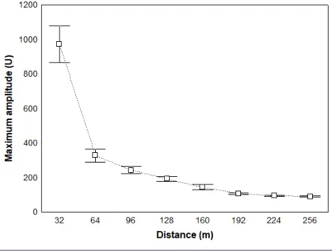
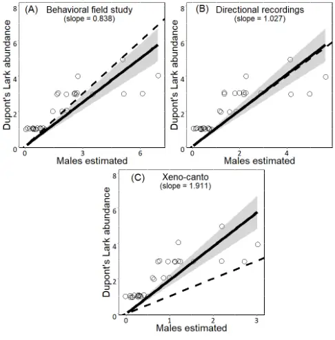
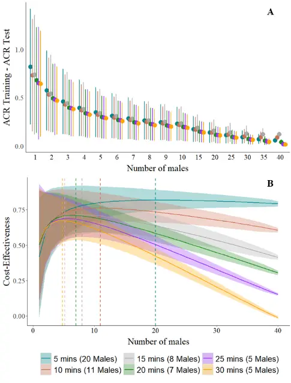
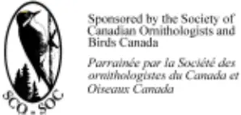
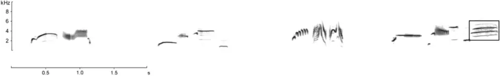
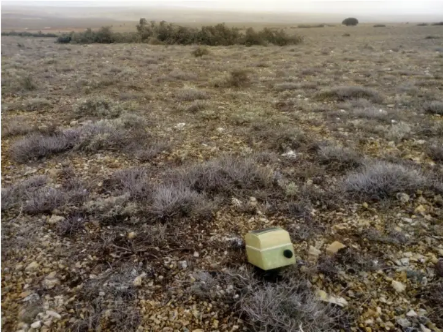

## VOLUME 16, ISSUE 1, ARTICLE 11

Pérez-Granados, C., A. Barrero, J. Traba, D. Bustillo-de la Rosa, M. Reverter, and J. Gómez-Catasús. 2021. Assessment of cue counting for estimating bird density using passive acoustic monitoring: recommendations for estimating a reliable cue rate. Avian Conservation and Ecology 16 (1):11. https://doi.org/10.5751/ACE-01801-160111

Copyright © 2021 by the author(s). Published here under license by the Resilience Alliance.

Methodology

## Assessment of cue counting for estimating bird density using passive acoustic monitoring: recommendations for estimating a reliable cue rate

Cristian Pérez-Granados 1,2 , Adrián Barrero 1,3 , Juan Traba 1,3 , Daniel Bustillo-de la Rosa 1,3 , Margarita Reverter 1,3 and Julia GómezCatasús 1,3

1 Terrestrial Ecology Group (TEG-UAM), Department of Ecology, Universidad Autónoma de Madrid, Madrid, Spain, 2 Ecology Department/IMEM "Ramón Margalef", Universidad de Alicante, Alicante, Spain, 3 Centro de Investigación en Biodiversidad y Cambio Global (CIBC-UAM), Universidad Autónoma de Madrid, Madrid, Spain

ABSTRACT. Cue counting is a method developed for estimating vocally active wildlife density by dividing the density of cues (number of cues per unit area surveyed per unit time) by the average cue rate (ACR) at which individuals vocalize. It has been used successfully to estimate whale density using passive acoustic monitoring, but its efficacy has had limited testing in birds. We tested whether cue counting can be used to infer bird abundance using autonomous recording units and estimated the minimum effort required to obtain a reliable cue rate at individual and population levels. We recorded Dupont's Lark (Chersophilus duponti) vocalizations at 31 sites where traditional field censuses were also performed. We estimated the ACR using three methodologies: directional recordings, recordings from an online database of bird sounds (xeno-canto), and behavioral field studies. The ACRs estimated using directional recordings and behavioral field studies were similar, and bird numbers were over and underestimated by 0.8 and 10%, respectively (74-77% of the sampling sites were well estimated). However, the ACR estimated using xeno-canto recordings was much higher than those estimated using the other two methods, and bird numbers were underestimated by 41%. We also performed a cost-effectiveness assessment of the number of individuals and recording durations needed to optimize the estimation of a reliable ACR. We found that ACR estimates were more efficient if long (25 min) recordings were used when &lt; 4 males were recorded, whereas 5-min recordings were more efficient for ≥ 20 males. We conclude that cue counting can be useful to infer bird density around recorders but requires an accurate measure of the ACR. Further research should evaluate the effectiveness of passive cue counting on a large number of species and under different circumstances.

## Évaluation du comptage des détections pour estimer la densité d'oiseaux à l'aide d'un suivi sonore passif : recommandations pour estimer un taux de détections fiable

RÉSUMÉ. Le comptage des détections est une méthode qui a été élaborée pour estimer la densité de la faune active vocalement en divisant la densité de détections (nombre de détections par unité de surface étudiée par unité de temps) par le taux moyen de détections (TMD) auquel les individus chantent ou crient. Cette méthode a été utilisée avec succès pour calculer la densité des baleines à l'aide d'un suivi sonore passif, mais son efficacité a peu été testée chez les oiseaux. Nous avons testé si le comptage des détections pouvait être utilisé pour déduire l'abondance des oiseaux en utilisant des enregistreurs automatisés et avons calculé l'effort minimum requis pour obtenir un taux de détections fiable au niveau des individus et des populations. Nous avons enregistré les manifestations sonores du Sirli de Dupont (Chersophilus duponti) sur 31 sites où des recensements traditionnels ont également été effectués. Nous avons calculé le TMD de trois façons : à partir d'enregistrements directionnels, d'enregistrements provenant d'une base de données de cris et de chants d'oiseaux accessible en ligne (xeno-canto) et d'études comportementales sur le terrain. Les TMD calculés à l'aide d'enregistrements directionnels et d'études comportementales étaient similaires, et le nombre d'oiseaux était surestimé et sous-estimé de 0,8 et 10 %, respectivement (la mesure de 74-77 % des sites d'échantillonnage était juste). Cependant, le TMD calculé à l'aide d'enregistrements de xeno-canto était beaucoup plus élevé que ceux obtenus au moyen des deux autres méthodes, et le nombre d'oiseaux était sous-estimé de 41 %. Nous avons également réalisé une évaluation coût-efficacité du nombre d'individus et des durées d'enregistrement nécessaires pour optimiser le calcul d'un TMD fiable. Nous avons constaté que la mesure du TMD était meilleure si des enregistrements longs (25 min) étaient utilisés lorsque &lt; 4 mâles étaient enregistrés, tandis que des enregistrements de 5 min étaient plus efficaces pour ≥ 20 mâles. Nous concluons que le comptage des détections peut être utile pour calculer la densité d'oiseaux autour des enregistreurs, mais une mesure précise du TMD doit d'abord être effectuée. D'autres recherches devraient se pencher sur l'évaluation de l'efficacité du comptage passif des détections dans le cas d'un grand nombre d'espèces et dans différentes circonstances.

Key Words: autonomous recording unit; Chersophilus duponti; population estimates; vocal activity; wildlife monitoring; xeno-canto

## INTRODUCTION

The use of autonomous recording units (ARUs) for wildlife monitoring has grown considerably in recent years (Shonfield and Bayne 2017, Sugai et al. 2019). Bird surveys are usually based on auditory cues, and therefore, birds are among the taxa most commonly surveyed using ARUs (Sugai et al. 2019). Although ARUs have been used in many avian research areas, their use during the early years of the technique was mainly restricted to estimating species richness and detecting the presence of target species at specific sites (Shonfield and Bayne 2017). Along with methodological and technical advances, low-cost ARUs have become available recently (e.g., Hill et al. 2018, Wijers et al. 2021), opening new avenues for further progress in the use of ARUs for bird monitoring.

Among the technical advances, it is worth highlighting an increase in computational capabilities and the development of effective and user-friendly automated signal recognition software (Knight et al. 2017, Priyadarshani et al. 2018), enabling researchers to analyze large amounts of data in a timely manner. One of the major challenges for monitoring birds using ARUs is the difficulty in estimating the number of birds vocalizing around recorders. Although many methods and statistical approaches have been described for estimating bird population density around ARUs, their effectiveness has been tested on only a few species (e.g., Oppel et al. 2014, Drake et al. 2016, Van Wilgenburg et al. 2017, Darras et al. 2018, Sebastián-González et al. 2018, Bombaci and Pejchar 2019, Pérez-Granados et al. 2019c, Yip et al. 2020; reviewed by Pérez-Granados and Traba 2021). Some methods that are already used for estimating mammal abundance with ARUs have scarcely been tested on birds, for example, passive acoustic cue counting (hereafter cue counting; Hiby and Ward 1986, Marques et al. 2009, 2011, but see Lambert and McDonald 2014, SebastiánGonzález et al. 2018).

Cue counting relies on the idea that the number of target species vocalizations in a sound recording is related to the number of animals vocalizing around recorders (density dependent, similar to the vocal activity index; see Farnsworth et al. 2004, Oppel et al. 2014). Determining an unbiased average cue rate (ACR) for a target species at the population level (vocalizations per unit time; Buckland 2006) allows researchers to estimate the number of individuals around ARUs (Lambert and McDonald 2014). The ACR can be estimated by averaging the cue rate at which individual birds produce vocalizations (vocalizations per unit time per bird) and must be based on a representative sample of birds (Buckland et al. 2008). Cue counting was originally developed for estimating whale density from recorded whale blows and has proven to be a useful method when it is possible to detect and count some vocal cue, but it is difficult to identify which individual produced which cue (Marques et al. 2013). In the case of whales, density can be estimated by dividing the density of cues (number of whale blows per unit area surveyed per unit time) by an estimate of the average rate at which whales vocalize (number of blows per unit time; Hibby and Ward 1986, Marques et al. 2009, 2011, 2013). The method could be used for estimating bird densities using ARUs if cue rates are well estimated and unbiased (see Sebastián-González et al. 2018); the number of birds vocalizing around ARUs could be estimated by dividing the total number of bird vocalizations detected per recording length by the ACR of the target bird species, when including a measurement of the area efficiently surveyed (e.g., estimating the effective detection radius for passive acoustic monitoring; Buckland et al. 2001). Buckland (2006) used cue counts heard from point counts to estimate the density of four passerine birds and concluded that cue counting might be a workable method for specialist surveys of single species. Later, Buckland et al. (2008) stated that cue counting has potential for estimating bird abundance using acoustic arrays. In the first assessment using the cue rate of a bird species and ARUs, Lambert and McDonald (2014) applied cue counting to estimate Bell Miner (Manorina melanophrys) density within a fixed radius of ARUs and concluded that acoustic surveys could detect more individuals than could traditional field surveys. Subsequently, Sebastián-González et al. (2018) developed a protocol to estimate bird density using the target species' cue rate and including covariates such as environmental conditions and an estimate of the distance of vocalizing individuals to the recorder. They showed that cue rate, when coupled with other covariates, is an effective method to estimate bird density using ARUs (Sebastián-González et al. 2018).

Cue counting is a rapid method that can be applied easily, estimates the number of individuals around ARUs, and is easy to interpret by unskilled bioacousticians (general public, managers, and stakeholders). One of the main advantages of cue counting (active or passive) is that it may be applied without the collection of complementary data while recording to estimate bird abundance, in contrast to other methods such as sound-level measurement (Yip et al. 2020), the vocal activity index (Oppel et al. 2014), and paired acoustic sampling (Van Wilgenburg et al. 2017, Bombaci and Pejchar 2019). Nonetheless, prior knowledge about the sampling radius of the recorder is required to obtain robust estimates when applying cue counting (Lambert and McDonald 2014). Another advantage of cue counting is that it requires little effort and expertise for recording interpretation compared to other methods such as the recognition of individuals through sonogram analyses (Ehnes and Foote 2015). However, an important disadvantage is that cue counting requires a reliable estimation of the target species' ACR to convert number of bird vocalizations detected by ARUs to bird density. ACR estimation may require monitoring the cue rate of several individuals over large temporal scales, which might be difficult for some species (e.g., shy and threatened birds) and may differ among populations. ACR can be estimated using various approaches such as by placing ARUs in areas known to be occupied by a single individual, using archived recordings in private or public sound databases, or performing detailed observational studies. Nonetheless, the effectiveness of estimating ACR using different methods has never been assessed. Similarly, there is limited information about the number of individuals and the minimum period that each individual should be monitored to estimate a reliable ACR.

We had two distinct objectives for our study. First, we aimed to evaluate whether cue counting can reliably infer bird abundance around ARUs, using the Dupont's Lark (Chersophilus duponti) as a model species. To do so, we deployed ARUs in 31 habitat patches (sampling sites) with known population size determined using traditional field surveys and annotated the number of vocalizations recorded at each sampling site per unit time. We applied cue counting to estimate the number of individuals per sampling site by applying the ACR of the species estimated using three approaches: (1) directional recordings previously collected in the study area, (2) existing recordings uploaded to a public sound database, and (3) published behavioral field studies. Second, we aimed to perform a cost-effectiveness assessment of ACR estimation to identify the minimum number of males and minimum recording duration for Dupont's Lark to obtain an accurate ACR while maximizing survey effectiveness. Although our research was focused on a single bird species, some of the lessons learned should apply to other vocally active taxa, including nonavian species.

## METHODS

## Study species

We selected Dupont's Lark as the study species because there are already several studies about its vocal behavior (including measures of ACR) and the use of ARUs for monitoring it, providing a useful background for comparison and deeper analysis (e.g., Laiolo and Tella 2005, Laiolo et al. 2007, 2008, Pérez-Granados et al. 2016). Dupont's Lark is a diurnal passerine with high vocal activity concentrated at dawn, when it utters a large number of songs and territorial calls, its main vocalization types (Laiolo et al. 2018, Pérez- Granados et al. 2018b). Dupont's Lark can sing both from the ground and while flying, as do several other larks (de Juana et al. 2004, Gómez-Catasús et al. 2016). It is assumed that only Dupont's Lark males utter songs and territorial calls (Pérez-Granados et al. 2018c), so we focused on vocalizing males. The Dupont's Lark song usually comprises 45 discrete song types, which are typically shared among neighbors and repeated in the same order (Laiolo et al. 2008, PérezGranados et al. 2016). Calls consist of discrete and short whistles (Laiolo et al. 2007), and each whistle is considered a single vocalization. The call and the last song type of the song follow a common sequence, the so-called "whee-ur-wheeee" (Cramp 1988, see Fig. S1 in Appendix 1). Here, we refer to the whole sequence of song types as a song and use the definite "whee-ur-wheeee" to count the number of songs within a recording. This interpretation means that each train of songs, usually composed of 4-5 song types, was considered to be one cue (Fig. S1 in Appendix 1). We used this approach to be consistent with the methodology proposed by Pérez-Granados et al. (2018c) and to facilitate comparisons with our acoustic data. The same methodology was used to count the number of songs throughout our work.

## Study area

The study area was located in central (40º37' N, 3º09' W, Guadalajara and Soria provinces, 28 sampling sites) and northeastern Spain (41º30' N, 0º37' E, Lleida province, three sampling sites) and comprised 31 sampling sites occupied by the Dupont's Lark. Sampling sites were flat areas dominated by shrubs and scrubs &lt; 40 cm tall such as thyme (Thymus spp.), broom (Genista spp.), and lavender (Lavandula spp.), and a high proportion of bare ground. Detailed information about the typical habitat and climate in the three study areas are provided by Pérez-Granados et al. (2018b, 2019a) for Guadalajara and Catalonia province, respectively, and Gómez-Catasús et al. (2019) for Soria province.

## Acoustic monitoring and recording interpretation

At each sampling site, we placed an ARU created ad-hoc for Dupont's Lark monitoring (Pérez-Granados et al. 2019a). The ARU consisted of a USB Voice Recorder SK-001 equipped with a single-channel microphone and a digital timer. Devices were powered by a 12-V/8.0-mAh battery (&gt; 300 h autonomy) and protected from weather by small and cryptic plastic boxes (see Fig. S2 in Appendix 1). ARUs were programmed to make a unique 30-min recording per sampling site between 60 and 30 min before sunrise (the period of maximum vocal activity of the species; Pérez-Granados et al. 2018a). Recordings always used a sample rate of 20 kHz (range 20 Hz to 20 kHz), 16 bits in mono mode, and the recorder had a signal-to-noise ratio of 80 dB. Audio was recorded in mp3 format using a bitrate of 128 kbps, and recordings were stored on microSD memory cards capable of storing ~ 500 h of continuous data. Recordings were collected during the species' breeding period (mid-April and mid-June) throughout 2017-2019.

The ARU used can record the species present up to 256 m distant (Pérez-Granados et al. 2019a). However, the probability of detecting a bird vocalization is related to the distance of the vocalizing bird from the ARU (Yip et al. 2017, SebastiánGonzález et al. 2018). Therefore, we aimed to identify a threshold volume at which Dupont's Lark whose vocalizations exceeded the threshold were likely to be within the selected radius (see Hedley et al. 2021). To identify this threshold, we performed a playback trial in the species' typical habitat and measured the rate of amplitude decline of broadcast vocalizations under real conditions (for a similar approach see Lambert and McDonald 2014). We broadcasted 26 different Dupont's Lark vocalizations at each of nine definite distances between 1 and 256 m (full details of the playback test can be found in Pérez-Granados et al. 2019a). For each vocalization uttered at each distance, we annotated whether it was visible on the spectrogram (Hamming Window, 512-sample window length and 50% overlap, see Table S1 in Appendix 1) and measured its maximum amplitude (hereafter amplitude) from the waveform (Lambert and McDonald 2014, Hedley et al. 2021) using Raven Pro 1.5 software (Center for Conservation Bioacoustics 2014). Vocalization amplitude was measured within the frequency bin of 2-5 kHz to minimize the influence of background and uninteresting sounds in the measurement while considering the frequency range of the target species (Stowell and Plumbley 2014, Hedley et al. 2021). Our analyses identified that Dupont's Lark vocalizations uttered within 160 m of the recorder would have a mean minimum amplitude of 144.5 units (U), which was distinguishable from calls uttered from further away (Fig. 1). Moreover, the probability of detecting a Dupont's Lark vocalization uttered within the 160 m radius was 0.974 (152 of 156 vocalizations detected, see Table S1 in Appendix 1). We used this threshold amplitude when analyzing the recordings made at sampling sites to restrict detections to this pre-specified radius. Thus, vocalizations with amplitude &gt; 144.5 U were considered to be produced by males within 160 m (Lambert and McDonald 2014), and a probability of detection of 1 was assumed. We did not calibrate our measurements to the sound pressure of the microphone, so the described relationship between vocalization amplitude and distance is only valid for our ARU, habitat surveyed, and species monitored. The spectrograms of the audio recordings collected at sampling sites were also visually inspected using Raven Pro 1.5 (Center for Conservation Bioacoustics 2014) by the same observer (CPG). For each recording, the waveform line was shifted until it reached the threshold 144.5 U, and we counted the number of Dupont's Lark cues (songs and territorial calls) that reached the threshold (see Lambert and McDonald for a similar approach).

Fig. 1. Relationship between maximum amplitude (Units; mean ± standard error) of Dupont's Lark vocalizations and distance to playback location at nine distances. Vocalizations uttered at 1 m are excluded for graphical purposes.

## Average cue rate

We estimated the ACR of the Dupont's Lark using three methods.

Behavioral field study: In this approach, we estimated the species' ACR using published data about its vocal behavior. We used data collected by Pérez-Granados et al. (2018c), which are freely available. Pérez-Granados et al. (2018c) monitored the vocal behaviour of Dupont's Lark males during the breeding season in three populations located in eastern Spain over two years. For each survey (N = 36 dawns), they counted the number of songs and calls emitted by three or four different males located within a 250 m radius from the observer, from 100 to 10 min before sunrise. The authors split the continuous survey into 5-min intervals and annotated the total number of Dupont's Lark vocalizations (songs and territorial calls) for each interval. To facilitate comparisons to our acoustic data, we selected surveys carried out during the same period that we performed acoustic monitoring (mid-April to mid-June, N = 24 surveys, 83 males) and only considered the six 5-min surveys carried out between 60 and 30 min before sunrise, which corresponds to the recording timing at our sampling sites. The probability of detecting a Dupont's Lark vocalization by an observer at distances &lt; 250 m has been considered to be 1 (probability of detection = 1 for birds within a 500 m radius of the observer; Pérez-Granados and López-Iborra 2017). The ACR was estimated by averaging (with 95% confidence interval, 95% CI) the cue rate of each Dupont's Lark male monitored (vocalizations per unit of time per bird).

The two other methods we used estimate ACR from public or private (authors' own data) archival recordings of single males. For each methodology, we estimated the ACR (mean ± 95% CI) by averaging the cue rate of all Dupont's Lark males recorded.

The cue rate of each male was estimated as the total number of vocalizations detected per recording by visually inspecting the spectrograms divided by recording length (in minutes). The specific methods employed for each methodology were as follows.

Directional recordings: We recorded 64 different Dupont's Lark males during April and May of 2016 in the study area. Recordings were made using a digital portable memory recorder (Tascam DR-40 version 2) and a Sennheiser ME67 shotgun microphone with a K6 powering unit and covered with a Gutmann windshield. A single male was recorded per recording at a maximum distance of 50 m to the observer during the dawn period. Because distances to the observer were short and only single-male recordings were collected, we assumed that the probability of detecting a Dupont's Lark vocalization on directional recordings was 1. Recording duration varied between 302 and 489 s (mean ± standard deviation [SD]: 337.1 ± 33.9 s).

Xeno-canto database: We used the xeno-canto online database of sounds (https://www.xeno-canto.org/) and downloaded all available recordings of the Dupont's Lark (on 02 January 2020). Thirty-nine recordings were available. Five of the recordings were removed due to poor quality or because we were unable to monitor the cue rate of a single individual (i.e., several males were vocalizing in the recording). Although we could not evaluate the distance of the recorded bird to the observer, we applied the same reasoning as in the directional recordings and assumed that the probability of detecting a Dupont's Lark vocalization on directional recordings was 1. Recording length varied between 2 and 217 s (mean ± SD: 78.6 ± 57.3 s). Because of low sample size and short recording length, we considered all the recordings uploaded to xeno-canto and not just those performed during the breeding season at dawn.

## Bird data censuses

We performed a traditional field survey at each sampling site to estimate the number of Dupont's Lark males within a 160-m buffer of each ARU, according to the threshold radius considered in our acoustic analyses. At each sampling site, we performed a single line transect crossing the ARU's location and using a 160m maximum detection band on each side of the observer. We selected this width given that Dupont's Lark vocalizations may be heard from long distances (up to 1500 m; Laiolo et al. 2007, Vögeli et al. 2010). According to a previous assessment of counting methods for estimating the number of Dupont's Lark males, we assumed a detection probability of 1 for singing males within the 160-m detection band (Pérez-Granados and LópezIborra 2017). Censuses were designed to cross over the recorder location, began 60 min before sunrise, and lasted for approximately 30 min. The locations of vocalizing males were estimated acoustically and recorded by GPS. The number of males detected per site refers just to the number of vocalizing males detected within the 160 m radius of the recorder. Censuses were performed one or two dawns after the recorders were retrieved to avoid modifying the natural vocal behavior of the Dupont's Lark while recording.

## Statistical analyses

For each of the 31 sampling sites, we estimated the number of Dupont's Lark males within the considered radius (160 m) by dividing the total number of Dupont's Lark cues detected per minute in each recording by the average cue rate of the species estimated for each of the three approaches (Lambert and McDonald 2014). We only considered those cues that reached the amplitude threshold (144.5 U).

We also estimated the minimum and maximum number of males per sampling site (rounded to the nearest whole number) according to the ACR 95% CIs. In all patches where at least one call was detected, we estimated a minimum of one male. We used 95% CIs to evaluate whether there were differences (1) among ACRs estimated using each methodology, and (2) between numbers of males detected using traditional field surveys and those estimated using each cue counting methodology, at each site and at the population level (all patches pooled). Differences in ACRs were considered to occur when 95% CIs did not overlap. Likewise, we considered numbers of males detected by traditional field surveys to differ when they were outside the 95% CIs estimated by cue counting. Additionally, we estimated the slope of a no-intercept linear regression (glm function in R 3.6.2) by regressing the number of males estimated using traditional field surveys (observed values, y-axis) vs. the estimated number of males using each of the three approaches (predicted values, xaxis; Piñeiro et al. 2008). We evaluated the model predictions by comparing the slope obtained for each approach to the 1:1 line (perfect match) and considered the approach with the slope closer to 1 (less bias from the 1:1 line) as the most adequate one (Piñeiro et al. 2008).

To assess the minimum number of males and recording duration necessary to obtain a reliable population cue rate, we created a curve of ACR accuracy. For this purpose, we used data collected by Pérez-Granados et al. (2018c) and curated the data as explained in Methods: Average cue rate. We split the data set in half, each with 41 individual recordings, to form training and test data sets. Each data set comprised males recorded in different years (2013 and 2014), and although all males belonged to the same population, they were recorded at locations separated by &gt; 500 m to increase the probability of monitoring different birds among years. For each data set, we estimated the ACR for 1 to 40 males, using 5 to 30 min of recordings at 5-min intervals. This procedure was done for all possible combinations of males when there were &lt; 10,000 combinations (1, 2, 39, and 40 males), and for 10,000 random combinations when all possible combinations exceeded this threshold for computational optimization purposes. We estimated the difference (in absolute value) in ACR between the training and test data sets (hereafter ACR accuracy), where lower values indicate greater accuracy. This process was repeated 1000 times. We then calculated the mean and SD of ACR accuracy over all combinations independently for each number of recorded males (1 to 40) and recording durations (from 5 to 30 min at 5min intervals). We excluded the combination for 41 males because it reports a unique value with no variance.

Lastly, we carried out a cost-effectiveness assessment to identify the minimum numbers of recordings and timings that are required to obtain a reliable ACR while maximizing survey effectiveness. The "cost," or the sampling effort invested in recording a certain number of males over a specific duration, was estimated as the proportion of time invested with respect to the maximum time invested under all monitoring scenarios (i.e., 1230 min invested in recording 41 males for 30 min each). For instance, the sampling effort invested in recording five males for 15 min each was 0.06 (5 males × 15 min)/(41 males × 30 min). The "effectiveness" was estimated as the proportion improvement in ACR accuracy, which was calculated as the percent reduction in the difference in ACR estimated between the training and test data sets with respect to the maximum distance (i.e., 1.41 ACR difference for 1 male and 5 min of recording). Finally, the cost-effectiveness was calculated as the difference between the cost and the effectiveness values calculated. We used the "RcppAlgos" package (Wood 2020) in R 3.6.2 (R Core Team 2019) to obtain the possible combinations from 1 to 40 males.

## RESULTS

We detected a total of 4534 Dupont's Lark vocalizations in the recordings collected in the 31 sampling patches (min: 5, max: 521, duration: 30 min). The number of males per sampling site detected by traditional field surveys around ARUs varied from 1 to 5 for a total of 65 males counted.

The estimated Dupont's Lark ACR differed among the methodologies, with the exception of the use of directional recordings and behavioral field studies, for which the 95% CI overlapped (Table 1). The lowest ACR was obtained using data collected in field studies of the species' vocal behavior (2.52 vocalizations/min) followed by the use of directional recordings (3.09 vocalizations/min). The highest ACR was obtained when analyzing the recordings uploaded to the xeno-canto database (5.76 vocalizations/min; Table 1).

Table 1. Average cue rate (and 95% CI) of the Dupont's Lark estimated using three methods.

| Method                 | Individual cue rate | Sites (%) † | Total males (%) ‡ |
| ---------------------- | ------------------- | ----------- | ----------------- |
| Behavioral field study | 2.52 (2.29-2.75)    | 24 (77.4%)  | 59-70 (+0.8%)     |
| Directional recordings | 3.09 (2.47-3.71)    | 23 (74.2%)  | 49-68 (-10%)      |
| Xeno-canto database    | 5.76 (4.90-6.62)    | 17 (54.8%)  | 36-41 (-40.8%)    |

† Number of sampling sites (N = 31) in which the number of males detected using traditional field surveys was within the 95% CI of the number of birds estimated by applying cue counting.

‡ Total number of males (minimum-maximum) estimated for the whole area surveyed and, in parentheses, the percentage difference between the mean number of males estimated by applying cue counting and the number of males detected using traditional field surveys (N = 65).

Accordingly, the numbers of males estimated per sampling site and at the population level by cue counting differed by methodology (Table 2). The best results were obtained when ACR was estimated using directional recordings. Using this approach, the number of birds estimated around ARUs was considered well estimated in 23 of the 31 sampling sites (74.2%), and the slope of the linear regression was the one with the least bias from the 1:1 line (slope = 1.03, F 1,30 = 160.5, P &lt; 0.0001, adjusted-R 2 = 0.84; Fig. 2B). Total bird numbers were underestimated by 10% when compared to the number of males counted using traditional field surveys (Table 1). Using the ACR estimated through behavioral field study, the number of birds was well estimated in 24 sampling sites (77.4%), bird numbers were overestimated by 0.8% (Table 1), and the slope of the linear regression was 0.84 (F 1,30 = 159.4, P &lt; 0.0001, adjusted-R 2 = 0.84; Fig. 2A). When using the ACR obtained from recordings uploaded to xeno-canto, the number of sites in which bird numbers were well estimated decreased to 17 (54.8% of cases), and bird densities were underestimated by 41%. The slope of the linear regression was very different from 1:1 (slope = 1.91, F 1,30 = 160.5, P &lt; 0.0001, adjusted-R 2 = 0.84; Fig. 2C).

Table 2. Number of Dupont's Lark vocalizations detected per minute of acoustic monitoring on each sampling site, numbers of males detected using traditional field surveys, and numbers of males estimated using each cue counting method. The number of males estimated using each counting method is shown as mean, 95% confidence interval (between brackets), and the minimum and maximum number of males estimated rounded to the nearest whole number.

| Site                     | Vocalizations (number/min) | Number of males | Number of males estimated by cue counting - Behavioral field study | Number of males estimated by cue counting - Directional recordings | Number of males estimated by cue counting - Xeno-canto recordings |
| ------------------------ | -------------------------- | --------------- | ------------------------------------------------------------------ | ------------------------------------------------------------------ | ----------------------------------------------------------------- |
| Barcones A               | 15.30                      | 3               | 6.1 (5.6-6.7) 6-7                                                  | 5.0 (4.1-6.2) 4-6                                                  | 2.7 (2.3-3.1) 2-3                                                 |
| Barcones B               | 12.90                      | 5               | 5.1 (4.7-5.6) 5-6                                                  | 4.2 (3.5-5.2) 3-5                                                  | 2.2 (1.9-2.6) 2-3                                                 |
| Barcones C               | 12.91                      | 3               | 5.1 (4.7-5.6) 5-6                                                  | 4.2 (3.5-5.2) 3-5                                                  | 2.2 (1.9-2.6) 2-3                                                 |
| Barcones D               | 17.37                      | 4               | 6.9 (6.3-7.6) 6-8                                                  | 5.6 (4.7-7.0) 5-7                                                  | 3.0 (2.6-3.5) 3-4                                                 |
| Alcubilla de las Peñas A | 0.93                       | 1               | 0.4 (0.3-0.4) 1-1                                                  | 0.3 (0.2-0.4) 1-1                                                  | 0.2 (0.1-0.2) 1-1                                                 |
| Alcubilla de las Peñas B | 1.57                       | 1               | 0.6 (0.6-0.7) 1-1                                                  | 0.5 (0.4-0.6) 1-1                                                  | 0.3 (0.2-0.3) 1-1                                                 |
| Alfés A                  | 2.53                       | 1               | 1.0 (0.9-1.1) 1-1                                                  | 0.8 (0.7-1.0) 1-1                                                  | 0.4 (0.4-0.5) 1-1                                                 |
| Alfés B                  | 4.27                       | 3               | 1.7 (1.6-1.9) 2-2                                                  | 1.4 (1.1-1.7) 1-2                                                  | 0.7 (0.6-0.9) 1-1                                                 |
| Alfés C                  | 6.67                       | 3               | 2.6 (2.4-2.9) 2-3                                                  | 2.2 (1.8-2.7) 2-3                                                  | 1.2 (1.0-1.4) 1-1                                                 |
| Atienza                  | 3.47                       | 2               | 1.4 (1.3-1.5) 1-2                                                  | 1.1 (0.9-1.4) 1-1                                                  | 0.6 (0.5-0.7) 1-1                                                 |
| Romanillos de Atienza    | 0.33                       | 1               | 0.1 (0.1-0.1) 1-1                                                  | 0.1 (0.1-0.1) 1-1                                                  | 0.1 (0.1-0.1) 1-1                                                 |
| Bujalcayado              | 8.93                       | 3               | 3.5 (3.2-3.9) 3-4                                                  | 2.9 (2.4-3.6) 2-4                                                  | 1.5 (1.3-1.8) 1-2                                                 |
| La Olmeda de Jadraque    | 7.13                       | 4               | 2.8 (2.6-3.1) 3-3                                                  | 2.3 (1.9-2.9) 2-3                                                  | 1.2 (1.1-1.5) 1-1                                                 |
| Morenilla                | 4.30                       | 3               | 1.7 (1.6-1.9) 2-2                                                  | 1.4 (1.2-1.7) 1-2                                                  | 0.7 (0.6-0.9) 1-1                                                 |
| El Pobo de Dueña         | 0.90                       | 1               | 0.4 (0.3-0.4) 1-1                                                  | 0.3 (0.2-0.4) 1-1                                                  | 0.2 (0.1-0.2) 1-1                                                 |
| Luzón                    | 5.60                       | 2               | 2.2 (2.0-2.4) 2-2                                                  | 1.8 (1.5-2.3) 2-2                                                  | 1.0 (0.8-1.1) 1-1                                                 |
| Retortillo               | 1.07                       | 1               | 0.4 (0.4-0.5) 1-1                                                  | 0.3 (0.3-0.4) 1-1                                                  | 0.2 (0.2-0.2) 1-1                                                 |
| Barahona A               | 3.60                       | 2               | 1.4 (1.3-1.6) 1-2                                                  | 1.2 (1.0-1.5) 1-1                                                  | 0.6 (0.5-0.7) 1-1                                                 |
| Barahona B               | 0.60                       | 1               | 0.2 (0.2-0.3) 1-1                                                  | 0.2 (0.2-0.2) 1-1                                                  | 0.1 (0.1-0.1) 1-1                                                 |
| Barahona C               | 1.60                       | 1               | 0.6 (0.6-0.7) 1-1                                                  | 0.5 (0.4-0.7) 1-1                                                  | 0.3 (0.2-0.3) 1-1                                                 |
| Barahona D               | 2.07                       | 1               | 0.8 (0.8-0.9) 1-1                                                  | 0.7 (0.6-0.8) 1-1                                                  | 0.4 (0.3-0.4) 1-1                                                 |
| Rello A                  | 5.47                       | 3               | 2.2 (2.0-2.4) 2-2                                                  | 1.8 (1.5-2.2) 1-2                                                  | 1.0 (0.8-1.1) 1-1                                                 |
| Rello B                  | 1.47                       | 1               | 0.6 (0.5-0.6) 1-1                                                  | 0.5 (0.4-0.6) 1-1                                                  | 0.3 (0.2-0.3) 1-1                                                 |
| Rello C                  | 6.73                       | 3               | 2.7 (2.4-2.9) 2-3                                                  | 2.2 (1.9-2.8) 2-3                                                  | 1.2 (1.0-1.4) 1-1                                                 |
| Rello D                  | 6.90                       | 3               | 2.7 (2.5-3.0) 3-3                                                  | 2.2 (1.9-2.8) 2-3                                                  | 1.2 (1.0-1.4) 1-1                                                 |
| Carboneras de Guadazaón  | 0.17                       | 1               | 0.1 (0.1-0.1) 1-1                                                  | 0.1 (0.1-0.1) 1-1                                                  | 0.1 (0.1-0.1) 1-1                                                 |
| Olmedillas               | 2.23                       | 1               | 0.9 (0.8-1.0) 1-1                                                  | 0.7 (0.6-0.9) 1-1                                                  | 0.4 (0.3-0.5) 1-1                                                 |
| Moya-Huertos             | 1.27                       | 1               | 0.5 (0.5-0.6) 1-1                                                  | 0.4 (0.3-0.5) 1-1                                                  | 0.2 (0.2-0.3) 1-1                                                 |
| Rayana                   | 4.73                       | 2               | 1.9 (1.7-2.1) 2-2                                                  | 1.5 (1.3-1.9) 1-2                                                  | 0.8 (0.7-1.0) 1-1                                                 |
| Retortillo B             | 1.93                       | 1               | 0.8 (0.7-0.8) 1-1                                                  | 0.6 (0.5-0.8) 1-1                                                  | 0.3 (0.3-0.4) 1-1                                                 |
| Retortillo C             | 6.20                       | 3               | 2.5 (2.3-2.7) 2-3                                                  | 2.0 (1.7-2.5) 2-3                                                  | 1.1 (0.9-1.3) 1-1                                                 |
| Total                    |                            | 65              | 59-70                                                              | 49-68                                                              | 36-41                                                             |

The distance between the ACR calculated for the training and test data sets decreased as the number of males recorded and recording duration increased (Fig. 3A). Recording duration had a greater effect on ACR accuracy when recording a few males (&lt; 3-4 males), and its effect was decreased when recording a greater number of males (Fig. 3A). The cost-effectiveness assessment showed that surveys that aim to estimate a reliable ACR are maximized at different points depending on the number of males and duration monitored (Fig. 3B). For example, the costeffectiveness of making 25-min recordings reaches a maximum at five males, whereas it is maximized at 20 males for 5-min recordings (Fig. 3B). With 1-3 males, long recordings are more cost-efficient, and thus, sampling effort should be invested in longer recordings (Fig. 3B). However, with ≥ 5 males, the costeffectiveness of short recordings (5 min) is greater, and sampling effort should be invested in recording more males over shorter durations (Fig. 3B). Taking everything into consideration, recording more males should be prioritized, rather than longer recordings.

## DISCUSSION

Here, we tested the effectiveness of cue counting for estimating bird abundance using ARUs. We found that cue counting can be useful to infer Dupont's Lark numbers around ARUs, in agreement with prior studies using ARUs to estimate cetacean (e.g., Hiby and Ward 1986, Marques et al. 2009, 2011) and bird abundance (Lambert and McDonald 2014, Sebastián-González et al. 2018). Our results suggest that cue counting could be a reliable and easy solution to provide a concrete number of birds singing around ARUs while avoiding the need to collect additional data during recording, as most other methods require (e.g., Oppel et al. 2014, Van Wilgenburg et al. 2017, Yip et al. 2020). However, our results also show that cue counting requires the estimate of a reliable ACR for the monitored species because population estimates differ greatly with the ACR applied. Therefore, cue counting should be used only after an accurate and reliable estimation of the species' ACR is obtained. We next discuss some potential problems and drawbacks when estimating the Dupont's Lark's ACR. It is beyond our scope to discuss the accuracy of the estimation of the number of males because that was obtained simply by dividing the number of vocalizations per recording (which did not vary among methods) by the ACR estimated using each approach.

Fig. 2. Regression scatterplot showing Dupont's Lark male abundance observed using traditional field surveys vs. estimated using cue counting and behavioral field study (A), directional recordings (B), and xeno-canto recordings (C). Solid line = no-intercept linear regression, grey bands = 95% confidence intervals, dashed line = 1:1 line.

Although the 95% CI of the ACR estimated using directional recordings and behavioral field data overlapped, the ACR estimated using directional recordings showed less bias from the 1:1 line. The ACR estimated through behavioral field study provided more biased predictions and was also a more effortintensive method. A previous study showed that cue rate of Dupont's Lark males may differ by up to 50% between close populations (&lt; 5 km; Pérez-Granados and López-Iborra 2020), suggesting that differences found among approaches might be related to variations in the ACR among Dupont's Lark populations. Directional recordings were collected in the study area, whereas the behavioral field study was performed in a different population located 140 km distant, which suggests that cue counting may perform better when using an ACR estimated for the monitored population.

The actual number of birds was underestimated by approximately 41% when applying the ACR estimated using the xeno-canto database. Many previous studies have demonstrated the utility of xeno-canto data for acoustic research (e.g., Weir and Wheatcroft 2011, Benedetti et al. 2018, Pagani-Núñez et al. 2018). However, it does not appear to be useful for estimating the ACR of the Dupont's Lark. Recordings uploaded to xeno-canto may not represent a random sample of the species' vocal behavior, with quieter birds being underrepresented or not recorded (PaganiNúñez et al. 2018). However, monitoring birds with low vocal activity, and even nonvocalizing birds, may help to provide a more representative estimate of the ACR of a target species (SebastiánGonzález et al. 2018). Likewise, recordists may have uploaded a short fraction of the original recording to provide a good and clear example of the vocal activity of the species, which may explain why a large number of the recordings we analyzed were very short. The short duration of the recordings uploaded to xeno-canto is considered one of the main drawbacks of the database (Vellinga and Planqué 2015). Although we removed recordings with more than one bird vocalizing from the analysis, we cannot rule out the possibility that more than one bird may have been recorded in some of the recordings analyzed. The combination of these factors may contribute to explaining the high ACR estimated using xeno-canto recordings compared to those from directional recordings and behavioral field data. We did not control for time of day or season when selecting recordings from the xeno-canto database. It is possible that future studies working with birds with a greater number of uploaded recordings may remove those obtained during the nonbreeding season or outside the period of interest and therefore will likely obtain a more reliable ACR for the target species (Buckland 2006).

Fig. 3. (A) Average cue rate (ACR) accuracy for combinations of number of males recorded and recording duration. ACR accuracy was calculated as the difference (absolute value) between the ACR for the training and test data sets; lower values indicate greater accuracy. (B) Cost-effectiveness of surveys to estimate the ACR of the Dupont's Lark for combinations of number of males recorded and recording duration. Solid line = mean, colored bands = standard deviation, vertical dashed lines = number of males at which the cost-effectiveness is maximized in each scenario (also provided within parentheses in the legend).

The measurement of a reliable individual cue rate is needed to obtain an unbiased ACR for the target species and might be also useful for other purposes such as predicting male breeding status (Upham-Mills et al. 2020). However, there is very limited information about the number of individuals and duration that each individual needs to be monitored to estimate a reliable ACR. Our cost-effectiveness assessment showed that surveys to estimate the cue rate of the Dupont's Lark are maximized at different points, depending on the number of males and duration of monitoring. In accordance with our results, if surveys are conducted at small populations, sampling effort should be invested in recording over longer durations (up to 30 min; Fig. 3B) because of the positive effect of time on ACR accuracy with ≤ 3 males (Fig. 3A). However, with larger populations, recording more males for shorter durations is preferable. In the latter scenario, the effect of recording duration on ACR accuracy is decreased, so longer recordings are less cost-efficient. In an ideal scenario with unlimited males, time, and budget, the most accurate ACR is obtained when recording 20 males for 5-min durations, while maximizing surveys effectiveness. Thus, recording more males should be prioritized whenever possible, rather than longer recordings. Our results may not be extrapolated directly to other bird species, but we hope that they will be useful for future studies aiming to estimate the cue rate of other bird species, as well as for studies applying cue counting for bird density estimation. The need to monitor the vocal behavior of a representative sample of birds to estimate an unbiased ACR has been described as one of the main disadvantages of cue counting (Buckland et al. 20008).

Our study was carried out at sites with low bird densities, and we expect that the method may be less effective or more biased for high-density populations. For example, the relationship between recorded vocal activity rate and Dupont's Lark abundance around recorders shows a logarithmic curve (Pérez-Granados et al. 2019b), which suggests that the effectiveness of cue counting for estimating Dupont's Lark abundance may be decreased when applied at high densities. Nonetheless, the Dupont's Lark is a threatened species (Gómez-Catasús et al. 2018), listed as "Vulnerable" in Europe by the International Union for the Conservation of Nature (BirdLife International 2015). Therefore, the species is usually distributed at low densities (mean of 0.30 males/10 ha in Spain; Suárez 2010), and cue counting may be a good approach to provide a reliable range of males around recorders because their density usually ranges between one and three (as in the present study). Nonetheless, the method's effectiveness for estimating bird abundance should be evaluated at high density and when studying different groups of birds such as those living in colonies or singing while flying (e.g., Arneill et al. 2020). For example, some passerines (e.g., Corn Bunting Miliaria calandra) can decrease their vocal activity under high density because they dedicate a large proportion of time to territorial defence and listening to rivals (Olinkiewicz and Osiejuk 2003). For these species, the number of birds estimated at high density may be underestimated.

Several factors may alter the cue rate of birds, such as breeding status (Amrhein et al. 2002), weather conditions (Robbins 1981), moon phase (York et al. 2014), and time of day and season (Amrhein et al. 2002, York et al. 2014). For example, the cue rate of the Dupont's Lark increases as the breeding season progresses (Laiolo and Tella 2008, Pérez-Granados et al. 2018c), is lower when the moon is full (Pérez-Granados and López-Iborra 2020), and is reduced when there are few neighboring males (Laiolo et al. 2008). These findings suggest that it might be necessary to monitor a representative number of males vocalizing under different environmental and phenological conditions to obtain a reliable ACR. Among the sample of birds monitored, it is also interesting to include nonvocalizing individuals (SebastiánGonzález et al. 2018). It is important to be sure that the silent or less vocally active behavior of monitored individuals is part of the natural vocal behavior of the target species and not influenced by an observer's presence.

Buckland (2006) suggested that cue counting works best when cues are short and well defined, and that for species with long songbursts, the start of the songburst might be defined as the cue. We used a similar approach in which we used the ending and definite "whee-ur-wheeee" of the Dupont's Lark song, usually composed of 4-5 song types (Laiolo et al. 2008, Pérez-Granados et al. 2016), to count the number of songs within a recording. Our approach also agrees with the recommendation made by Buckland (2006) that for species with a wide range of vocalizations, only those easily detectable might be considered as a cue (Buckland 2006). The estimation of the cue rate should be conducted at the same time and place as the main surveys (Buckland et al. 2008) or substantial bias could appear. For example, previous studies of the Dupont's Lark state that the cue rate may differ by up to 50% among close populations (PérezGranados and López-Iborra 2020). The vocal activity of birds, including the Dupont's Lark (Pérez-Granados et al. 2018c), usually reaches a maximum during dawn (Gil and Llusia 2020). Therefore, for most species, it would be desirable to perform surveys and to estimate the ACR during dawn. The performance of cue counting, when using ARUs, may be higher when working with species that have a constant cue rate among individuals (Lambert and McDonald 2014) and with territorial birds that undertake few movements during the singing period, but further research should evaluate the effect of bird movements on the estimated cue rates. The necessary number of males and duration of monitoring may be adjusted according to population size. In summary, a good strategy to obtain accurate results using cue counting would be as follows: (1) use directional microphones to monitor the cue rate of a representative sample of individuals comprising a minimum of ~10 males, (2) perform subsequent surveys within the same geographic areas where ACR estimation is conducted, (3) monitor individuals for longer periods (25 min) if fewer than 5 males are available or for 5 min if 20 males are available, (4) include nonvocalizing birds, and (5) perform monitoring over several days and under a variety of weather conditions. The same reasoning should be valid for obtaining an accurate number of vocalizations per sampling site through ARUs. Indeed, previous studies with three bird species showed that programming ARUs to record for thirteen consecutive days rather than recording for a single day, as we did in our study, may decrease the coefficient of variation of the vocal activity rate at a population level from 90-100% to 10% (Pérez-Granados et al. 2019c, Pérez-Granados and Schuchmann 2020). Therefore, it is likely that the performance of our method would have been higher if we had recorded over several days.

Our study demonstrates the ability of passive acoustic monitoring, and more specifically of cue counting, to estimate bird abundance reliably around ARUs, which is in agreement with several recent studies that showed the utility of automated recorders to infer bird numbers (e.g., Oppel et al. 2014, Van Wilgenburg et al. 2017, Darras et al. 2018, Sebastián-González et al. 2018, Bombaci and Pejchar 2019, Pérez-Granados et al. 2019c, Yip et al. 2020; reviewed by Pérez-Granados and Traba 2021). Our study also provides valuable data about the numbers of individuals and monitoring durations needed to maximize surveys that aim to estimate a reliable ACR for a target species, which is paramount before applying cue counting to estimate bird abundance. Otherwise, cue counting may lead to inadequate population size estimates. The development of acoustic-derived indices has opened the door to use ARUs to track bird population changes over time (e.g., Buxton and Jones 2012). In this respect, cue counting may be useful for assessing bird population changes using archived recordings because our method can be applied without the collection of additional data during recording, given that we estimated the ACR using previously collected data. Nonetheless, it is necessary to include a measurement of the effective detection radius of the recorder (see Buckland et al. 2011) or use a fixed radius around ARUs (Lambert and McDonald 2014) to obtain density estimates. The ACR may differ over time depending on exogenous (e.g., time of day, weather conditions) and endogenous factors (e.g., breeding status; Amrhein et al. 2002, Upham-Mills et al. 2020); thus, the utility of cue counting for estimating bird densities using archived recordings may be limited and requires further research. Likewise, future studies should assess how the ACR changes over time and among populations, which may provide useful insights about the effectiveness of cue counting for estimating bird abundance at large spatial and temporal scales. Future works using automated signal recognition software for scanning the recordings should estimate and take into account the recall rate of the recognizer (Knight et al. 2017, Sebastián-González et al. 2018) when estimating the number of bird vocalizations in a sound recording. We encourage researchers to evaluate the effectiveness of cue counting for more bird species because the current knowledge about the species and conditions in which this method can be applied is still limited (Lambert and McDonald 2014, SebastiánGonzález et al. 2018).

Responses to this article can be read online at:

[https://www.ace-eco.org/issues/responses.php/1801](https://www.ace-eco.org/issues/responses.php/1801)

## Acknowledgments:

This study was supported by the Programa de Investigación y Conservación del Zoo de Barcelona within the project "Nuevas tecnologías para viejos trabajos: Uso de grabadores automáticos para la detección y censo de especies raras y amenazadas: El caso de la alondra ricotí en Lleida y otras poblaciones pequeñas"; the Education, Youth and Sport Bureau (Madrid Regional Government); and the European Social Fund for the Youth Employment Initiative (PEJ15/AMB/AI-0059 and PEJ1D-2018PRE/AMB-8063). This work is a contribution to the Excellence Network Remedinal 3CM (S2013/MAE2719), supported by Comunidad de Madrid; and to the projects "Census of Dupont's Lark in Guadalajara 2017 (SSCC/046/2017)", supported by Junta de Comunidades de Castilla-La Mancha; LIFE Ricotí (LIFE15NAT-ES-000802), supported by the European Commission, and "BBVA-Dron Ricotí", funded by the BBVA Foundation. We thank Gerard Bota, David Giralt, and Josep Albarracín for their close collaboration and help. We also thank Alexander Bond, Steven Van Wilgenburg, and two anonymous reviewers whose comments helped to improve the manuscript.

## LITERATURE CITED

Amrhein, V., P. Korner, and M. Naguib. 2002. Nocturnal and diurnal singing activity in the nightingale: correlations with mating status and breeding cycle. Animal Behaviour 64 (6):939-944. https://doi.org/10.1006/anbe.2002.1974

Arneill, G. E., E. J. Critchley, S. Wischnewski, M. J. Jessopp, and J. L. Quinn. 2020. Acoustic activity across a seabird colony reflects patterns of within-colony flight rather than nest density. Ibis 162 (2):416-428. https://doi.org/10.1111/ibi.12740

Benedetti, Y., K. Slezak, A. P. Møller, F. Morelli, and P. Tryjanowski. 2018. Number of syllables in cuckoo Cuculus canorus calls: a test using a citizen science project. Scientific Reports 8:12872. https://doi.org/10.1038/s41598-018-31329-1

BirdLife International. 2015. Chersophilus duponti. The IUCN Red List of Threatened Species 2015: e.T22717380A60256867. Birdlife International, Cambridge, UK. [online] URL: https:// www.iucnredlist.org/species/22717380/60256867

Bombaci, S. P., and L. Pejchar. 2019. Using paired acoustic sampling to enhance population monitoring of New Zealand's forest birds. New Zealand Journal of Ecology 43(1):3356. https:// dx.doi.org/10.20417/nzjecol.43.9

Buckland, S. T. 2006. Point-transect surveys for songbirds: robust methodologies. Auk 123(2):345-357. https://doi.org/10.1093/ auk/123.2.345

Buckland, S. T., D. R. Anderson, K. P. Burnham, J. L. Laake, D. L. Borchers, and L. Thomas. 2001. Introduction to distance sampling: estimating abundance of biological populations. Oxford University Press, Oxford, UK.

Buckland, S. T., S. J. Marsden, and R. E. Green. 2008. Estimating bird abundance: making methods work. Bird Conservation International 18(S1):S91-S108. https://doi.org/10.1017/S0959270908000294

Buxton, R. T., and I. L. Jones. 2012. Measuring nocturnal seabird activity and status using acoustic recording devices: applications for island restoration. Journal of Field Ornithology 83(1):47-60. https://doi.org/10.1111/j.1557-9263.2011.00355.x

Center for Conservation Bioacoustics. 2014. Raven Pro: interactive sound analysis software. Version 1.5. [computer software]. Cornell Lab of Ornithology, Ithaca, New York, USA.

Cramp, S., editor. 1988. Handbook of the birds of Europe, the Middle East, and North Africa: the birds of the Western Palearctic. Volume V: tyrant flycatchers to thrushes. Oxford University Press, Oxford, UK.

Darras, K., B. Furnas, I. Fitriawan, Y. Mulyani, and T. Tscharntke. 2018. Estimating bird detection distances in sound recordings for standardizing detection ranges and distance sampling. Methods in Ecology and Evolution 9(9):1928-1938. https://doi.org/10.1111/2041-210X.13031

De Juana, E., F. Suárez, and P. Ryan. 2004. Larks (Alaudidae). Pages 496-541 in J. del Hoyo, A. Elliott, and D. Christie, editors. Handbook of the birds of the world, volume 9: cotingas to pipits and wagtails. Lynx Edicions, Barcelona, Spain.

Drake, K. L., M. Frey, D. Hogan, and R. Hedley. 2016. Using digital recordings and sonogram analysis to obtain counts of yellow rails. Wildlife Society Bulletin 40(2):346-354. https://doi. org/10.1002/wsb.658

Ehnes, M., and J. R. Foote. 2015. Comparison of autonomous and manual recording methods for discrimination of individually distinctive Ovenbird songs. Bioacoustics 24(2):111-121. https:// doi.org/10.1080/09524622.2014.994228

Farnsworth, A., S. A. Gauthreaux Jr., and D. van Blaricom. 2004. A comparison of nocturnal call counts of migrating birds and reflectivity measurements on Doppler radar. Journal of Avian Biology 35(4):365-369. https://doi.org/10.1111/j.0908-8857.2004.03180. x

Gil, D., and D. Llusia. 2020. The bird dawn chorus revisited. Pages 45-90 in T. Aubin and N. Mathevon, editors. Coding strategies in vertebrate acoustic communication. Springer, Cham, Switzerland. https://doi.org/10.1007/978-3-030-39200-0\_3

Gómez-Catasús, J., A. Barrero, V. Garza, and J. Traba. 2016. Alondra ricotí - Chersophilus duponti. In A. Salvador and M. B. Morales, editors. Enciclopedia virtual de los vertebrados Españoles. Museo Nacional de Ciencias Naturales, Madrid, Spain. [online] URL: http://www.vertebradosibericos.org/aves/chedup.html

Gómez-Catasús, J., V. Garza, M. B. Morales, and J. Traba. 2019. Hierarchical habitat-use by an endangered steppe bird in fragmented landscapes is associated with large connected patches and high food availability. Scientific Reports 9:19010. https://doi. org/10.1038/s41598-019-55467-2

Gómez-Catasús, J., C. Pérez-Granados, A. Barrero, G. Bota, D. Giralt, G. M. López-Iborra, D. Serrano, and J. Traba. 2018. European population trends and current conservation status of an endangered steppe-bird species: the Dupont's lark Chersophilus duponti. PeerJ 6:e5627. https://doi.org/10.7717/ peerj.5627

Hedley, R. W, S. J. Wilson, D. A. Yip, K. Li, and E. M. Bayne. 2021. Distance truncation via sound level for bioacoustic surveys in patchy habitat. Bioacoustics, in press. https://doi. org/10.1080/09524622.2020.1730240

Hiby, A. R., and A. J. Ward. 1986. Analysis of cue counting and blow rate estimation experiments carried out during the 1984/85 IDCR minke whale assessment cruise. Reports of the International Whaling Commission 36:473-476.

Hill, A. P., P. Prince, E. Piña Covarrubias, C. P. Doncaster, J. L. Snaddon, and A. Rogers. 2018. AudioMoth: evaluation of a smart open acoustic device for monitoring biodiversity and the environment. Methods in Ecology and Evolution 9(5):1199-1211. https://doi.org/10.1111/2041-210X.12955

Knight, E. C., K. C. Hannah, G. J. Foley, C. D. Scott, R. M. Brigham, and E. Bayne. 2017. Recommendations for acoustic recognizer performance assessment with application to five common automated signal recognition programs. Avian Conservation and Ecology 12(2):14. https://doi.org/10.5751/ ACE-01114-120214

Laiolo, P., and J. L. Tella. 2005. Habitat fragmentation affects culture transmission: patterns of song matching in Dupont's lark. Journal of Applied Ecology 42(6):1183-1193. https://doi. org/10.1111/j.1365-2664.2005.01093.x

Laiolo, P., and J. L. Tella. 2008. Social determinants of songbird vocal activity and implications for the persistence of small populations. Animal Conservation 11(5):433-441. https://doi. org/10.1111/j.1469-1795.2008.00202.x

Laiolo, P., M. Vögeli, D. Serrano, and J. L. Tella. 2007. Testing acoustic versus physical marking: two complementary methods for individual-based monitoring of elusive species. Journal of Avian Biology 38:672-681. https://doi.org/10.1111/j.2007.0908-8857.04006. x

Laiolo, P., M. Vögeli, D. Serrano, and J. L. Tella. 2008. Song diversity predicts the viability of fragmented bird populations. Plos One 3(3):e1822. https://doi.org/10.1371/journal.pone.0001822

Lambert, K. T. A., and P. G. McDonald. 2014. A low-cost, yet simple and highly repeatable system for acoustically surveying cryptic species. Austral Ecology 39(7):779-785. https://doi. org/10.1111/aec.12143

Marques, T. A., L. Munger, L. Thomas, S. Wiggins, and J. A. Hildebrand. 2011. Estimating North Pacific right whale Eubalaena japonica density using passive acoustic cue counting. Endangered Species Research 13:163-172. https://doi.org/10.3354/ esr00325

Marques, T. A., L. Thomas, S. W. Martin, D. K. Mellinger, J. A. Ward, D. J. Moretti, D. Harris, and P. L. Tyack. 2013. Estimating animal population density using passive acoustics. Biological Reviews 88:287-309. https://doi.org/10.1111/brv.12001

Marques, T. A., L. Thomas, J. Ward, N. DiMarzio, and P. L. Tyack. 2009. Estimating cetacean population density using fixed passive acoustic sensors: an example with Blainville's beaked whales. Journal of the Acoustical Society of America 125:1982-1994. https://doi.org/10.1121/1.3089590

Olinkiewicz, A., and T. S. Osiejuk. 2003. Effect of time of season and neighbours on singing activity in the Corn Bunting Miliaria calandra. Acta Ornithologica 38:117-122. https://doi. org/10.3161/068.038.0208

Oppel, S., S. Hervías, N. Oliveira, T. Pipa, C. Silva, P. Geraldes, M. Goh, E. Immler, and M. McKown. 2014. Estimating population size of a nocturnal burrow-nesting seabird using acoustic monitoring and habitat mapping. Nature Conservation 7:1-13. https://doi.org/10.3897/natureconservation.7.6890

Pagani-Núñez, E., X. Xia, G. Beauchamp, R. He, J. H. D. Husson, D. Liang, and E. Goodale. 2018. Are vocal characteristics related to leadership patterns in mixed-species bird flocks? Journal of Avian Biology 49(5):jav-01674. https://doi.org/10.1111/jav.01674

Pérez-Granados, C., and G. M. López-Iborra. 2017. Assessment of counting methods used for estimating the number of territorial males in the endangered Dupont's Lark. Ardeola 64(1):75-84. https://doi.org/10.13157/arla.64.1.2017.sc2

Pérez-Granados, C., and G. M. López-Iborra. 2020. Dupont's Lark males start to sing earlier but reduce song rate on full moon dawns. Journal of Ornithology 161:421-428. https://doi. org/10.1007/s10336-019-01731-1

Pérez-Granados, C., and K.-L. Schuchmann. 2020. Illuminating the nightlife of two Neotropical nightjars: vocal behavior over a year and monitoring recommendations. Ethology, Ecology and Evolution 32(5):466-480. https://doi.org/10.1080/03949370.2020.1753117

Pérez-Granados, C., and J. Traba. 2021. Estimating bird density using passive acoustic monitoring: a review of methods and suggestions for further research. Ibis, in press. https://doi. org/10.1111/ibi.12944

Pérez-Granados, C., G. Bota, D. Giralt, J. Albarracín, and J. Traba. 2019a. Cost-effectiveness assessment of five audio recording systems for wildlife monitoring: differences between recording distances and singing direction. Ardeola 66(2):311-325. https://doi.org/10.13157/arla.66.2.2019.ra4

Pérez-Granados, C., G. Bota, D. Giralt, A. Barrero, J. GómezCatasús, D. Bustillo-de la Rosa, and J. Traba. 2019b. Vocal activity rate index: a useful method to infer terrestrial bird abundance with acoustic monitoring. Ibis 161(4):901-907. https://doi. org/10.1111/ibi.12728

Pérez-Granados, C., G. Bota, D. Giralt, and J. Traba. 2018a. A cost-effective protocol for monitoring birds using autonomous recording units: a case study with a night-time singing passerine. Bird Study 65:338-345. https://doi.org/10.1080/00063657.2018.1511682

Pérez-Granados, C., D. Bustillo-de la Rosa, J. Gómez-Catasús, A. Barrero, I. Abril-Colón, and J. Traba. 2018b. Autonomous recording units as effective tool for monitoring of the rare and patchily distributed Dupont's Lark Chersophilus duponti. Ardea 106(2):139-146. https://doi.org/10.5253/arde.v106i2.a6

Pérez-Granados, C., J. Gómez-Catasús, D. Bustillo-de la Rosa, A. Barrero, M. Reverter, and J. Traba. 2019c. Effort needed to accurately estimate vocal activity rate index using acoustic monitoring: a case study with a dawn-time singing passerine. Ecological Indicators 107:105608. https://doi.org/10.1016/j. ecolind.2019.105608

Pérez-Granados, C., T. Osiejuk, and G. M. López-Iborra. 2016. Habitat fragmentation effects and variations in repertoire size and degree of song sharing among close Dupont's Lark Chersophilus duponti populations. Journal of Ornithology 157:471-482. https:// doi.org/10.1007/s10336-015-1310-6

Pérez-Granados, C., T. S. Osiejuk, and G. M. López-Iborra. 2018c. Dawn chorus interpretation differs when using songs or calls: the Dupont's Lark Chersophilus duponti case. PeerJ 6:e5241. https://doi.org/10.7717/peerj.5241

Piñeiro, G., S. Perelman, J. P. Guerschman, and J. M. Paruelo. 2008. How to evaluate models: observed vs. predicted or predicted vs. observed? Ecological Modelling 216(3-4):316-322. https://doi. org/10.1016/j.ecolmodel.2008.05.006

Priyadarshani, N., S. Marsland, and I. Castro. 2018. Automated birdsong recognition in complex acoustic environments: a review. Journal of Avian Biology 49(5):jav-01447. https://doi.org/10.1111/ jav.01447

R Core Team. 2019. R: a language and environment for statistical computing. R Foundation for Statistical Computing, Vienna, Austria. [online] URL: https://www.R-project.org

Robbins, C. S. 1981. Effect of time and day on bird activity. Studies in Avian Biology 6:275-286.

Sebastián-González, E., R. J. Camp, A. M. Tanimoto, P. M. De Oliveira, B. B. Lima, T. A. Marques, and P. J. Hart. 2018. Density estimation of sound-producing terrestrial animals using single automatic acoustic recorders and distance sampling. Avian Conservation and Ecology 13(2):7. https://doi.org/10.5751/ ACE-01224-130207

Shonfield, J., and E. M. Bayne. 2017. Autonomous recording units in avian ecological research: current use and future applications. Avian Conservation and Ecology 12(1):14. https://doi.org/10.5751/ ACE-00974-120114

Stowell, D., and M. D. Plumbley. 2014. Automatic large-scale classification of bird sounds is strongly improved by unsupervised feature learning. PeerJ 2:e488. https://doi.org/10.7717/peerj.488

Suárez, F., editor. 2010. La alondra ricotí (Chersophilus duponti). Dirección General para la Biodiversidad, Ministerio de Medio Ambiente y Medios Rural y Marino, Madrid, Spain.

Sugai, L. S. M., T. S. F. Silva, J. W. Ribeiro Jr., and D. Llusia. 2019. Terrestrial passive acoustic monitoring: review and perspectives. Bioscience 69(1):15-25. https://doi.org/10.1093/ biosci/biy147

Upham-Mills, E. J., J. R. Reimer, S. Haché, S. R. Lele, and E. M. Bayne. 2020. Can singing rate be used to predict male breeding status of forest songbirds? A comparison of three calibration models. Ecosphere 11(1):e03005. https://doi.org/10.1002/ecs2.3005

Van Wilgenburg, S. L., P. Sólymos, K. J. Kardynal, and M. D. Frey. 2017. Paired sampling standardizes point count data from humans and acoustic recorders. Avian Conservation and Ecology 12(1):13 https://doi.org/10.5751/ACE-00975-120113

Vellinga, W.-P., and R. Planqué. 2015. The Xeno-canto collection and its relation to sound recognition and classification. In L. Cappellato, N. Ferro, G. J. F. Jones, and E. San Juan, editors. CEUR workshop proceedings vol-1391: CLEF2015 working notes.

CLEF Initiative. [online] URL: http://ceur-ws.org/Vol-1391/166CR.pdf

Vögeli, M., D. Serrano, F. Pacios, and J. L. Tella. 2010. The relative importance of patch habitat quality and landscape attributes on a declining steppe-bird metapopulation. Biological Conservation 143(5):1057-1067. https://doi.org/10.1016/j.biocon.2009.12.040

Weir, J. T., and D. Wheatcroft. 2011. A latitudinal gradient in rates of evolution of avian syllable diversity and song length. Proceedings of the Royal Society B 278:1713-1720. https://doi. org/10.1098/rspb.2010.2037

Wijers, M., A. Loveridge, D. W. Macdonald, and A. Markham. 2021. CARACAL: a versatile passive acoustic monitoring tool for wildlife research and conservation. Bioacoustics 30(1):41-57. https://doi.org/10.1080/09524622.2019.1685408 DOI:

Wood, J. 2020. RcppAlgos: high performance tools for combinatorics and computational mathematics. Version 2.4.1. [software]. [online] URL: https://CRAN.R-project.org/package= RcppAlgos

Yip, D. A., E. C. Knight, E. Haave-Audet, S. J. Wilson, C. Charchuk, C. D. Scott, P. Sólymos, and E. M. Bayne. 2020. Sound level measurements from audio recordings provide objective distance estimates for distance sampling wildlife populations. Remote Sensing in Ecology and Conservation 6(3):301-315. https:// doi.org/10.1002/rse2.118

Yip, D. A., L. Leston, E. M. Bayne, P. Sólymos, and A. Grover. 2017. Experimentally derived detection distances from audio recordings and human observers enable integrated analysis of point count data. Avian Conservation and Ecology 12(1):11. https://doi.org/10.5751/ACE-00997-120111

York, J. E., A. J. Young, and A. N. Radford. 2014. Singing in the moonlight: dawn song performance of a diurnal bird varies with lunar phase. Biology Letters 10:20130970. https://doi. org/10.1098/rsbl.2013.0970

Supplemental Figure S1. Sonogram of a typical train of songs of a Dupont's Lark male. The rectangle shows the final song type of the train, which is a common sequence of the species', the so-called 'whee-ur-wheeee'. We annotated the whole sequence of song types as a unique cue and used the definite 'whee-ur-wheeee' for counting the number of songs within a recording.

Supplemental Figure S2. Autonomous Sound Recorder used for monitoring the vocal activity of the Dupont's Larks in an occupied breeding site in Soria. (photo CPG, 4 April 2018, Barahona, Soria, central Spain).

Supplemental Table S1: Number of Dupont's Lark songs detected per distance and singing direction by visual inspection of sonograms. Percentage of songs detected in respect to total number of songs broadcaster by playback (N=13) per distance and signing direction is shown between brackets.

Distance

Singing direction 1m 32m 64m 96m 128m 160 m 192m 224m 256m Favourable 13 (100%) 13 (100%) 13 (100%) 13 (100%) 13 (100%) 12 (92.3%) 11 (84.6%) 5 (38.4%) 2 (15.3%)

Unfavourable 13 (100%) 13 (100%) 13 (100%) 13 (100%) 12 (92.3%) 11 (84.6%) 6 (46.1%) 4 (30.8%) 1 (7.7%)
