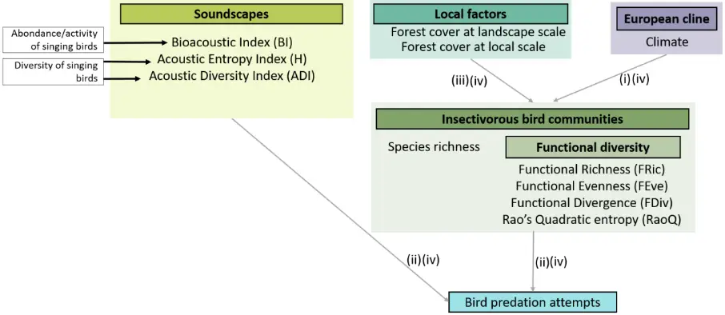
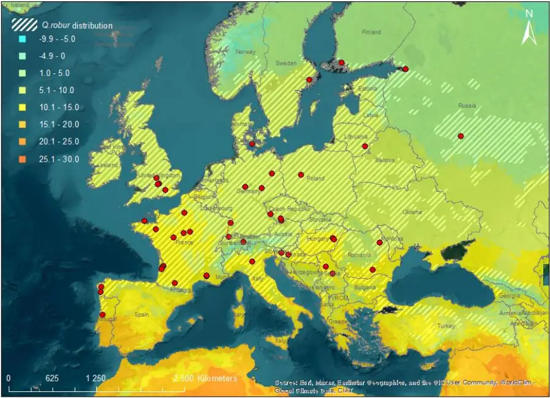
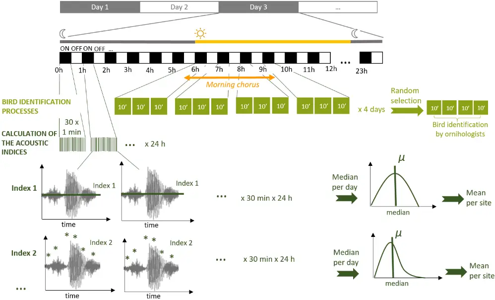
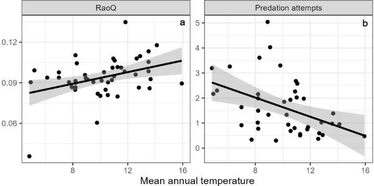
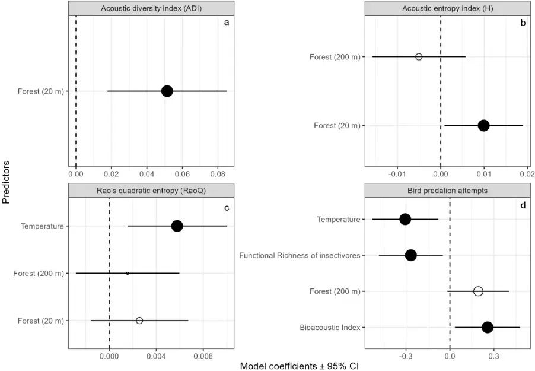

This document is the accepted manuscript version of the following article:

Schillé, L., Valdés-Correcher, E., Archaux, F., Bălăcenoiu, F., Bjørn, M. C., Bogdziewicz, M.,

… Castagneyrol, B. (2024). Decomposing drivers in avian insectivory: Large-scale effects of

climate, habitat and bird diversity. Journal of Biogeography.

https://doi.org/10.1111/jbi.14808

1

2

3

4

5

6

7

8

9

10

11

12

13

14

15

16

17

18

19

20

21

22

## Decomposing drivers in avian insectivory: large-scale effects of climate, habitat and bird diversity

Laura Schillé 1,\* , Elena Valdés-Correcher 1 , Frédéric Archaux 2 , Flavius Bălăcenoiu 3,4 , Mona Chor Bjørn 5 , Michal Bogdziewicz 6 , Thomas Boivin 7 , Manuela Branco 8 , Thomas Damestoy 9 , Maarten de Groot 10 , Jovan Dobrosavljević 11 , Mihai-Leonard Duduman 12 , Anne-Maïmiti Dulaurent 9 , Samantha Green 13 , Jan Grünwald 14 , Csaba Béla Eötvös 15 , Maria Faticov 16 , Pilar Fernandez-Conradi 7 , Elisabeth Flury 17 , David Funosas 18 , Andrea Galmán 19,20 , Martin M. Gossner 21,22 , Sofia Gripenberg 23 , Lucian Grosu 12 , Jonas Hagge 24 , Arndt Hampe 1 , Deborah Harvey 25 , Rick Houston 26 , Rita Isenmann 27 , Andreja Kavčič 10 , Mikhail V. Kozlov 28 , Vojtech Lanta 29 , Bénédicte Le Tilly 30 , Carlos Lopez Vaamonde 31,32 , Soumen Mallick 33 , Elina Mäntylä 28,34,35 , Anders Mårell 2 , Slobodan Milanović 11 , Márton Molnár 36 , Xoaquín Moreira 37 , Valentin Moser 38,39 , Anna Mrazova 34,35 , Dmitrii L. Musolin 40 , Thomas Perot 2 , Andrea Piotti 41 , Anna V. Popova 42 , Andreas Prinzing 33 , Ludmila Pukinskaya 42 , Aurélien Sallé 44 , Katerina Sam 34,35 , Nickolay V. Sedikhin 43,45 , Tanja Shabarova 46 , Ayco J. M. Tack 47 , Rebecca Thomas 25 , Karthik Thrikkadeeri 48 , Dragoș Toma 3,4 , Grete Vaicaityte 49 , Inge van Halder 1 , Zulema Varela 50 , Luc Barbaro 51,52,¤ &amp; Bastien Castagneyrol 1,¤

¤ Luc Barbaro and Bastien Castagneyrol share last co-authorship 1 BIOGECO, INRAE, University Bordeaux, Cestas, France 2 EFNO, INRAE, Nogent-sur-Vernisson, France 3 National Institute for Research and Development in Forestry « Marin Drăcea », Voluntari, Romania 4 Romania Faculty of Silviculture and Forest Engineering, Transilvania University of Brașov, Romania

23

24

25

26

27

28

29

30

31

32

33

34

35

36

37

38

39

40

41

42

43

44

45

46

47

48

5 Department of Geosciences and Natural Resource Management, Section Forest and Landscape Ecology, University of Copenhagen, Denmark 6 Forest Biology Center, Faculty of Biology, Adam Mickiewicz University in Poznan, Poland 7 UR629, INRAE, Centre PACA, Avignon, France 8 Centro de Estudos Florestais, Instituto Superior de Agronomia, Universidade de Lisboa, Lisbon, Portugal 9 UniLaSalle, AGHYLE, UP.2018.C101, Beauvais, France 10 Slovenian Forestry Institute, Ljubljana, Slovenia 11 Department of Forestry and Nature Protection, University of Belgrade Faculty of Forestry, Belgrade, Serbia 12 Forestry Faculty, Applied Ecology Lab, "Ștefan cel Mare" University of Suceava, Romania 13 Centre for Agroecology, Water and Resilience, Coventry University, UK 14 Institute for Environmental Studies, Faculty of Science, Charles University in Prague, Czech Republic 15 University of Sopron, Forest Research Institute, Department of Forest Protection, Mátrafüred, Hungary 16 Université de Sherbrooke, 2500, boul. de l'Université, Sherbrooke, Canada 17 Kinderlab Landquart, Landquart, Switzerland 18 Laboratoire Ecologie Fonctionnelle et Environnement, University of Toulouse, CNRS, France 19 Martin-Luther-Universität Halle-Wittenberg, Halle (Saale), Germany 20 German Centre for Integrative Biodiversity Research (iDiv), Leipzig, Germany 21 Forest Entomology, Swiss Federal Research Institute WSL, Birmensdorf, Switzerland 22 Institute of Terrestrial Ecosystems, Department of Environmental Systems Science, ETH Zürich, Switzerland 23 School of Biological Sciences, University of Reading, UK 24 Forest Nature Conservation, Northwest German Forest Research Institute, Hann. Münden, Germany

49

50

51

52

53

54

55

56

57

58

59

60

61

62

63

64

65

66

67

68

69

70

71

72

73

74

25 Royal Holloway University of London, Egham, UK 26 Beckley School Oxford, UK 27 Grimmelshausenschule, Renchen, Germany 28 Department of Biology, University of Turku, Finland 29 Department of Functional Ecology, Institute of Botany CAS, Průhonice, Czech Republic 30 Collège Saint Joseph, Paimpol, France 31 INRAE Centre Val de Loire, Unité Zoologie Forestière, Orléans, France 32 IRBI, UMR 7261, CNRS-Université de Tours, France 33 Centre National de la Recherche Scientifique, Université de Rennes 1, Research Unit UMR 6553, Ecosystèmes Biodiversité Evolution (ECOBIO), Campus de Beaulieu, 35042, Rennes, France 34 Institute of Entomology, Biology Centre of the Czech Academy of Sciences, Ceske Budejovice, Czech Republic 35 Faculty of Science, University of South Bohemia, Ceske Budejovice, Czech Republic 36 Magyar Madártani és Természetvédelmi Egyesület (Birdlife Hungary), Szuha, Hungary 37 Misión Biológica de Galicia (MBG-CSIC), Apdo. 28, 36080 Pontevedra, Galicia, Spain 38 Community Ecology, Swiss Federal Research Institute WSL, Birmensdorf, Switzerland 39 Aquatic Ecology, Swiss Federal Institute of Aquatic Science and Technology Eawag, Dübendorf, Switzerland 40 European and Mediterranean Plant Protection Organization, Paris, France 41 Institute of Biosciences and BioResources, National Research Council of Italy, Sesto Fiorentino, Italy 42 A.N. Severtsov Institute of Ecology and Evolution, Russian Academy of Sciences, Moscow, Russia 43 Saint Petersburg State Forest Technical University, Lisinsky Forest College, Saint Petersburg, Russia 44 LBLGC, Université d'Orléans, France 45 Zoological institute of Russian Academy of Science, Saint Petersburg, Russia 46 Biology Centre CAS, Institute of Hydrobiology, Ceske Budejovice, Czech Republic 47 Department of Ecology, Environment and Plant Sciences, Stockholm University, Sweden

75

76

77

78

79

80

81

82

83

84

85

86

87

88

89

90

91

92

93

94

95

96

97

98

99

100

48 Nature Conservation Foundation, Bengaluru, India 49 Lithuanian Centre of Non-Formal Youth Education, Vilnius, Lithuania 50 CRETUS,Ecology Unit, Department of Functional Biology, Universidade de Santiago de Compostela, Spain 51 DYNAFOR, University of Toulouse, INRAE, France 52 LTSER ZA Pyrenees Garonne, Auzeville-Tolosane, France \* Correspondance: laura.schille@hotmail.fr

## Acknowledgements

This study was permitted by the financial support of the BNP Paribas Foundation through its Climate &amp; Biodiversity Initiative for the 'Tree bodyguards' citizen science project. FB and DT were supported by the PN 23090102 and 34PFE./30.12.2021 'Increasing the institutional capacity and performance of INCDS "Marin Drăcea" in the activity of RDI - CresPerfInst' funded by the Ministry of Research, Innovation and Digitalization of Romania. MB was supported by the Forest Research Centre (CEF) (UIDB/00239/2020) and the Laboratory for Sustainable Land Use and Ecosystem Services-TERRA (LA/P/0092/2020) funded by FCT, Portugal. MdG and AK were supported by the core research group "Forest biology, ecology and technology" (P4-0107) of the Slovenian Research Agency. MVK was supported by the Academy of Finland (project 316182). VL was funded by the Czech Science Foundation (project 23-07533S) and Academy of Sciences (RVO 67985939). EM and KS were supported by the Grant Agency of the Czech Republic (19-28126X). KS and AM were supported by ERC StG BABE 805189. XM was supported by a grant from the Spanish National Research Council (2021AEP082) and a grant from the Regional Government of Galicia (IN607A 2021/03). ZV was supported by a grant awarded by the Autonomous Government of Galicia (Spain; Modalidade B-2019), and Maria Zambrano program from the Spanish Ministry of Universities. LB was supported by fundings from LTSER ZA Pyrenees Garonne. We thank the personnel of Centro Nazionale Carabinieri Biodiversità "Bosco Fontana" for help in data collection. We thank Tarja Heinonen for help in field work in Berlin, Germany.

101

102

103

104

105

106

107

108

109

110

We thank Roman Hrdlička and Kari Mäntylä for bird voice identification. We thank E. L. Zvereva for help in data collection. No fieldwork permit was required for this study.

## Abstract

## Aim

Climate is a major driver of large scale variability in biodiversity, as a likely result of more intense biotic interactions under warmer conditions. This idea fuelled decades of research on plant-herbivore interactions, but much less is known about higher-level trophic interactions. We addressed this research gap by characterizing both bird diversity and avian predation along a climatic gradient at the European scale.

## Location 111

112

Europe.

## Taxon 113

114

## 115

116

117

118

119

120

Insectivorous birds and pedunculate oaks.

## Methods

We deployed plasticine caterpillars in 138 oak trees in 47 sites along a 19° latitudinal gradient in Europe to quantify bird insectivory through predation attempts. In addition, we used passive acoustic monitoring to (i) characterize the acoustic diversity of surrounding soundscapes; (ii) approximate bird abundance and activity through passive acoustic recordings and (iii) infer both taxonomic and functional diversity of insectivorous birds from recordings.

## Results 121

The functional diversity of insectivorous birds increased with warmer climates. Bird predation 122 increased with forest cover and bird acoustic activity but decreased with mean annual temperature 123 and functional richness of insectivorous birds. Contrary to our predictions, climatic clines in bird 124 predation attempts were not directly mediated by changes in insectivorous bird diversity or acoustic 125 activity, but climate and habitat still had independent effects on predation attempts. 126

## Main conclusions 127

128

129

130

131

132

133

134

135

136

137

138

139

140

141

142

Our study supports the hypothesis of an increase in the diversity of insectivorous birds towards warmer climates, but refutes the idea that an increase in diversity would lead to more predation and advocates for better accounting for activity and abundance of insectivorous birds when studying the large-scale variation in insect-tree interactions.

Keywords: Acoustic diversity, Climatic gradient, Functional diversity, Insectivorous birds, Plasticine caterpillars, Predation function

## Résumé

## Objectif

Le climat est l'un des principaux facteur structurant de la variabilité à grande échelle de la biodiversité, possiblement en raison d'interactions biotiques plus intenses dans des conditions de température plus élevées. Cette idée a alimenté des décennies de recherche sur les interactions plantes-herbivores, mais on en sait beaucoup moins sur les interactions impliquant les niveaux trophiques supérieurs. Nous avons comblé cette lacune en caractérisant à la fois la diversité des oiseaux et leur activité de prédation le long d'un gradient climatique à l'échelle européenne.

## Localisation 143

Europe. 144

## Taxon 145

Oiseaux insectivores et chênes pédonculés. 146

- Méthodes 147

Nous avons déployé des leurres en pâte à modeler mimant des chenilles sur 138 chênes dans 47 sites 148 le long d'un gradient latitudinal de 19° en Europe pour quantifier l'insectivorie avienne par le biais de 149 tentatives de prédation. De plus, nous avons utilisé la surveillance acoustique passive pour (i) 150 caractériser la diversité acoustique des paysages sonores environnants ; (ii) estimer l'abondance et 151 l'activité des oiseaux à travers des enregistrements acoustiques passifs et (iii) déduire à la fois la 152

- diversité taxonomique et fonctionnelle des oiseaux insectivores à partir des enregistrements. 153
- Résultats 154

Nous avons montré une augmentation de la diversité fonctionnelle des oiseaux insectivores avec la 155 température moyenne. La prédation avienne augmentait avec la couverture forestière et l'activité 156 acoustique des oiseaux, mais diminuait avec la température annuelle moyenne et la richesse 157 fonctionnelle des oiseaux insectivores. Contrairement à nos prédictions, la variation de la diversité des 158 oiseaux n'était pas le lien mécaniste entre le climat et la variation des tentatives de prédation sur les 159

- leurres, laquelle était directement influencée par le climat et la couverture forestière. 160
- Conclusions principales 161

Notre étude confirme l'hypothèse d'une augmentation de la diversité des oiseaux insectivores vers des 162 climats plus chauds, mais ne corrobore pas l'idée qu'une augmentation de la diversité conduirait à 163 davantage de predation. Elle plaide en faveur d'une meilleure prise en compte de l'activité et de 164 l'abondance des oiseaux insectivores lors de l'étude de la variation à grande échelle des interactions 165 entre insectes et arbres. 166

167

168

169

170

171

172

173

174

175

176

177

178

179

180

181

182

183

184

185

186

187

188

189

190

191

192

Mots-clés : Diversité acoustique, Gradient climatique, Diversité fonctionnelle, Oiseaux insectivores, Chenilles en pâte à modeler, Fonction de prédation.

## Introduction

Climate is a key driver of biotic interactions (Dobzhansky, 1950). A long held view in ecology posits that warmer and more stable climatic conditions intensify biotic interactions and accelerates speciation (MacArthur, 1984; Schemske, Mittelbach, Cornell, Sobel &amp; Roy, 2009), which should result in large scale positive correlations between biodiversity and biotic interactions. However appealing this idea is, the generality of large-scale climatic clines in biodiversity and biotic interactions as well as the underlying causal links are still widely debated. Yet, insights into the controversy have been dominated by studies on plant-insect interactions (Anstett, Chen &amp; Johnson, 2016; Kozlov, Lanta, Zverev &amp; Zvereva, 2015). Biotic interactions involving higher trophic levels received much less attention. Yet, insectivorous birds are among the predators contributing the most to the control of insect herbivores in terrestrial ecosystems (van Bael et al., 2008; Sam, Jorge, Koane, Amick &amp; Sivault, 2023; Sekercioglu, 2006) and therefore have consequences on both the assembly of ecological communities and the functioning of ecosystems. The omission of predation in theories linking large-scale variability in climate with biodiversity therefore represents a critical gap in knowledge that needs to be addressed.

Bird communities are highly responsive to climate, at both regional and continental scale. There is a large body of literature demonstrating that several dimensions of bird diversity vary with climate, including bird abundance, species richness, phylogenetic or functional diversity (Blackburn &amp; Gaston, 1996; Symonds Christidis &amp; Johnson, 2006; Willig, Kaufman &amp; Stevens, 2003). A well substantiated explanation is that niche opportunities increase with increasing habitat heterogeneity under milder climatic conditions, which increases species coexistence and ultimately species richness through functional complementarity (Hawkins, Diniz-Filho, Jaramillo &amp; Soeller, 2006). The biodiversity and ecosystem relationship theory predicts that both abundance and diversity of birds are crucial

193

194

195

196

197

198

199

200

201

202

203

204

205

206

207

208

209

210

211

212

213

214

215

216

217

218

predictors of the top-down control they exert upon insect prey (Bael et al., 2008; Nell, Abdala-Roberts, Parra-Tabla &amp; Mooney, 2018; Otto, Berlow, Rank, Smiley &amp; Brose, 2008; Sinclair, Mduma &amp; Brashares, 2003). Numerous studies supported this theory and demonstrated that bird functional diversity in particular --- that is the diversity, distribution and complementarity of predator traits involved in predation --- is a good predictor of predation (Barbaro, Giffard, Charbonnier, van Halder &amp; Brockerhoff, 2014; Greenop, Woodcock, Wilby, Cook &amp; Pywell, 2018; Philpott et al., 2009). It follows that variation in bird diversity along climatic gradients should be mirrored by consistent variation in avian predation rates.

Local factors can however alter macroecological patterns (Ikin et al., 2014; Kissling, Sekercioglu &amp; Jetz, 2012), by filtering the regional species pool (De la Mora, García-Ballinas &amp; Philpott, 2015; Kleijn, Rundlöf, Scheper, Smith &amp; Tscharntke, 2011) and by influencing the behavior of organisms. The diversity and composition of bird communities heavily depends on local factors that provide niches and food opportunities (Charbonnier et al., 2016). In this respect, multiscale forest cover proved to be a particularly good predictor of composition of birds communities at different spatial scales, as bird foraging activity is ultimately determined by vertical and horizontal habitat heterogeneity, which influences both where prey can be found and caught, and where foraging birds can breed and hide from predators (Vickery &amp; Arlettaz, 2012). Thus, modeling the response of bird communities to largescale bioclimatic drivers as well as their role as predators would benefit from using a combination of habitat variables and biotic predictors (Barbaro et al., 2019; Speakman et al., 2000). However, crosscontinental studies exploring the relationship between large scale climatic gradients and the strength of biotic interactions generally ignore local factors, which may partly explain inconsistencies in their findings (but see Just, Dale, Long &amp; Frank, 2019).

A major challenge to analyze climatic clines in biotic interactions consists in simultaneously characterizing changes in predator biodiversity and experimentally assessing the strength of predation,

219

220

221

222

223

224

225

226

227

228

229

230

231

232

233

234

235

236

237

238

239

240

241

242

while considering the effect of contrasting habitats. However, the recent development of passive acoustic monitoring provides a standardized, low-cost and non-invasive approach for ecological studies and biodiversity monitoring (Gibb, Browning, Glover-Kapfer, Jones &amp; Börger, 2019). The acoustic monitoring of a given habitat primarily allows the delayed identification of bird species over large gradients with no need for distributed expertise across study sites. The quantification of bird abundance through passive acoustic monitoring remains a technical challenge, but the calculation of certain acoustic indices based on the physical characteristics of the recorded sounds provides relevant proxies to this end (Gasc et al., 2013; Sueur, Farina, Gasc, Pieretti &amp; Pavoine, 2014). Should such indices consistently correlate with macro-scales biotic interactions, ecoacoustics would be a promising complementary approach to existing methods in macroecology and in functional ecology.

Here, we addressed the hypothesis of continental north-south clines on insectivorous bird community diversity and their predation function, while controlling for local factors throughout the European distribution range of the pedunculate oak (Quercus robur L., 1753), a major forest tree species. Specifically, we predict the following (Fig. 1): (i) bird diversity (including bird acoustic diversity, insectivorous bird species richness and functional diversity) and predation attempts increase with warmer climates; (ii) bird predation attempts increase with bird acoustic activity, species richness and greater functional diversity of insectivorous birds; (iii) bird diversity, acoustic activity and bird predation attempts increase with increasing forest cover at both local (neighborhood) and larger spatial scales; (iv) large-scale variability in bird predation attempts is driven by local changes in the diversity and acoustic activity of birds. To test these predictions, we quantified bird predation attempts on plasticine caterpillars and estimated bird species richness, functional diversity and acoustic activity through simultaneous passive acoustic monitoring. We eventually tested the respective responses of these variables and their relationships at the pan-European scale.

243

244

245

246

247

248

249

250

251

252

253

254

255

256

257

258

259

[double column] Figure 1: Conceptual diagram of the predictions of this study and the relationships already established in the literature. Boxed elements written in bold correspond to the main categories of variables tested, they are not variables as such. Variables used in models are shown in regular font. Where several variables described the same category (e.g. BI, ADI, H, all describing acoustic indices), we used multi-model comparisons to identify the best variable. Items framed in black on a white background represent untested variables. Black arrows indicate relationships well supported by the literature (see Gasc et al., 2018; and Fig.2 Sánchez-Giraldo, Correa Ayram &amp; Daza, 2021). Our specific predictions are represented with grey arrows, solid and dashed lines representing positive and negative (predicted) relationships. Numbers refer to predictions as stated in the main text.

## Materials and methods

## Study area

We focused on the pedunculate oak, Quercus robur, which is one of the keystone deciduous tree species in temperate European forests, where it is of high ecological, economic and symbolic importance (Eaton, Caudullo, Oliveira &amp; de Rigo, 2016). The species occurs from central Spain (39°N) to southern Fennoscandia (62°N) and thus experiences a huge gradient of climatic conditions (Petit et al., 2002). A widely diverse community of specialist and generalist herbivorous insects is associated with this species throughout its distributional range (Southwood, Wint, Kennedy &amp; Greenwood, 2005).

260

261

262

263

264

265

267

268

Between May and July 2021, we studied 138 trees in 47 sites across 17 European countries covering most of the pedunculate oak geographic range (Fig. 2). The sites were chosen with the minimal constraint of being located in a wooded area of at least 1 ha (Valdés-Correcher et al., 2021). We randomly selected three mature oaks per site, with the exception of six sites (three sites with one tree, one site with two trees and two sites with five trees, see Table S1.1 in Appendix S1 in Supporting Information).

## Bird predation attempts

We measured bird predation attempts in the field by exposing a total of 40 plasticine caterpillars (20 plasticine caterpillars twice) on each individual oak. We made plasticine caterpillars of green plasticine, mimicking common lepidopteran larvae (3 cm long, 0.5 cm diameter, see Low, Sam, McArthur, Posa &amp; Hochuli, 2014). We secured them on twigs with a 0.3 mm metallic wire. We attached five plasticine

266 [double column] Figure 2: Locations of the 47 sites sampled in spring 2021. Average annual temperature (color scale) according to WorldClim (Hijmans, Cameron, Parra, Jones &amp; Jarvis, 2005) and Quercus robur distribution range are indicated.

269

270

271

272

273

274

275

276

caterpillars to each of four branches facing opposite directions (i.e., 20 caterpillars per tree) at about 2 m from the ground.

We installed the plasticine caterpillars six weeks after budburst in each study area, thus synchronizing 277 the study with local oak phenology. We removed the plasticine caterpillars after 15 days and installed 278 another set of 20 artificial caterpillars per tree for another 15 days. At the end of each exposure period 279 (which varied from 10 to 20 (mean ± SD: 14.5 ± 1.23) days due to weather conditions, we carefully 280 removed the plasticine caterpillars from branches, placed them into plastic vials and shipped them to 281 the project coordinator. Plasticine caterpillars from six sites were either lost or altered during shipping, 282 preventing the extraction of relevant data. 283

284

285

286

287

A single trained observer (EVC) screened the surface of plasticine caterpillars with a magnifying lens to search for the presence of bill marks on clay surface (Low et al., 2014). As we were ultimately interested in linking bird diversity with bird predation attempts, we did not consider marks left by arthropods and mammals.

We defined bird predation attempts index as p / d, where p is the proportion of plasticine caterpillars 288 with at least one sign of attempted predation by birds and d is the number of days plasticine caterpillars 289 were exposed to predators in the field. We only considered as attacked those caterpillars that we 290 retrieved; missing caterpillars were not accounted for in the calculation of p. We calculated bird 291 predation attempts for each tree and survey period separately. Because other variables were defined 292 at site level (see below), we averaged bird predation attempts across trees and surveys in each site 293 (total: n = 41). 294

295

296

297

298

299

To assess the effect of temperature independently of other variables that could vary with latitude, we also calculated a second bird predation attempts index by standardizing the predation attempts by daylight duration in every site. We ran the same statistical models as for the non-standardized bird predation attempts. The outcomes remained qualitatively the same and the results of this analysis are presented in Table S2.2 in Appendix S2.

301

302

303

304

305

306

307

- 308

## Acoustic monitoring and related variables

We used passive acoustic monitoring to characterize the species and functional diversity of bird communities associated with oaks, as well as to serve as a proxy of the abundance and diversity of vocalizing birds (Fig. 2). In each site, we randomly chose one oak among those used to measure bird predation rates in which we installed an AudioMoth device (Hill et al., 2018) to record audible sounds for 30 min every hour. Automated recording started the day we installed the first set of 20 plasticine caterpillars in trees and lasted until batteries stopped providing enough energy. The recording settings were the following: Recording period: 00.00-24.00 (UTC); Sample rate: 48 kHZ; Gain: Medium; Sleep duration: 1800 s, Recording duration: 1800 s.

- In all 47 sites, Audiomoths were active on average (± S.D.) for 9 ± 3 days (range: 1-24), which 309
- corresponded to 5920 h of recordings in total and from 70 to 335 (246 ± 65) 30 min continuous acoustic 310
- samples per site. When Audiomoths ran out of battery, the recordings lasted less than 30 min 311
- (between 1 and 56 recordings per site were affected). 312
- Acoustic diversity indices as proxies of bird diversity and activity 313
- We processed acoustic samples with functions in the "soundecology" v.1.3.3 (Villanueva-Rivera &amp; 314
- Pijanowski, 2018) and "seewave" v. 2.1.8 (Sueur, Aubin &amp; Simonis, 2008) libraries in the R environment 315
- version 4.1.2 (R Core Team, 2020), and a wrap-up function made available by A. Gasc in GitHub 316
- [(https://github.com/agasc/Soundscape-analysis-with-R). We first divided every acoustic sample 317](https://github.com/agasc/Soundscape-analysis-with-R)
- (regardless of its length) into non-overlapping 1 min samples. 318
- Acoustic indices capture various dimensions of the soundscape but are not expected to fully reflect 319
- any bird biodiversity-related variable. However, several studies have shown that some of them are 320
- positively related to the abundance or diversity of vocalizing species (for more details, see Sánchez321
- Giraldo, Correa Ayram &amp; Daza, 2021, Fig.2 and Gasc et al., 2018), although the strength of this 322
- relationships is still poorly understood. We have therefore chosen to consider only those specific 323

324

325

indices and we used multi-model statistical inferences to identify those that were the most strongly linked with the response variables of interest (see below).

We calculated the following three acoustic diversity indices for each 1 min sample: the Acoustic 326 Diversity Index (ADI) and the Total Acoustic Entropy (H) which are both based on Shannon diversity 327 index and are therefore close to a proxy for bird diversity (Sueur, Pavoine, et al., 2008; Villanueva328 Rivera, Pijanowski, Doucette &amp; Pekin, 2011), and the Bioacoustic Index (BI) which is positively related 329 to bird vocal activity and the occupancy of acoustic signal frequency bands (Boelman, Asner, Hart &amp; 330 Martin, 2007; Gasc et al., 2018). We calculated the median of each acoustic index per day and then 331 averaged median values across days for each site separately. We proceeded like this because 24 h 332 cycles summarize the acoustic activity and account for all possible sounds of a given day. Furthermore, 333 other studies have previously shown that median values of acoustic indices for a given day are more 334 representative than mean values of the acoustic activity because they are less sensitive to extreme 335 values (Barbaro et al., 2022; Dröge et al., 2021). This procedure resulted in one single value of each 336 acoustic diversity index per site. 337

338

339

340

341

342

343

344

345

346

347

348

349

## Bird species richness and functional diversity

We used acoustic samples to identify birds based on their vocalizations (songs and calls) at the species level, from which we further computed functional diversity indices (Fig. 3).

Data processing - For each site, we subsampled the 30 min samples corresponding to the songbird morning chorus (i.e., the period of maximum singing activity), which incidentally also corresponds to the time of the day when anthropic sounds were of the lowest intensity. Specifically, we selected sounds recorded within a period running from 30 min before sunrise to 3 h 30 min after sunrise. We then split each 30 min sample into up to three 10 min sequences, from which we only retained those recorded on Tuesday, Thursday, Saturday, and Sunday. We chose these days on purpose to balance the differences in anthropogenic noises between working days and weekends. For each sound sample, we displayed the corresponding spectrogram with the "seewave" library in the R environment (Sueur,

350

351

352

353

354

355

356

357

358

359

360

361

362

363

Aubin &amp; Simonis, 2008). We visually sorted sound samples thanks to spectrograms and discarded samples with noise from anthropogenic sources, rain, or wind, which can be recognized as very low frequency noise on the spectrogram. We also discarded samples with noise of very high frequency corresponding to cicada chirps. We then randomly selected one sound sample per site and per day, with the exception of four sites for which the four samples only covered two to three days. In total, we selected 188 samples of 10 min (i.e., 4 samples per site).

[double column] Figure 3: Methodological pathway used to identify bird species (in light green) and calculate acoustic indices (in dark green) from automated recordings (see text for details)

Bird species identification - We distributed the samples among 21 expert ornithologists. Each expert performed aural bird species identifications from 4 (one site) to 52 samples (13 sites), primarily from her/his region of residence, for auditory acoustic detection of bird species. We established a presence/absence Site × Species matrix, from which we calculated species richness and functional

364

365

366

367

368

369

370

371

372

373

374

375

376

377

378

379

380

381

382

383

384

385

386

387

388

diversity. It is important to note that, there is no possibility to determine the direction and distance at which birds are singing from audio recordings when using a single device for a given site. As a result, there is no standard method for determining whether or not two vocalizations of the same species at two different times come from one single individual or more, which prevents an accurate estimate of bird abundance. However, experienced ornithologists involved in this study consider that, given the territoriality of birds and the range of the recorders, it is unlikely that they recorded the vocalizations of several individuals of the same species. It therefore seems reasonable to assume that among-site differences in bird species richness were also representative of among-site differences in bird abundance.

Functional diversity - We defined 25 bird species as candidate insectivores for attacking plasticine caterpillars (Table S3.3 in Appendix S3) with those bird species meeting the following criteria: be insectivorous during the breeding season or likely to feed their offspring with insects, forage primarily in forested habitats, and are likely to use substrates such as lower branches or lower leaves of trees where caterpillars were attached to find their prey (Barbaro et al., 2021; Brambilla &amp; Gatti, 2022). We calculated the functional diversity of these candidate insectivores by combining morphological, reproductive, behavioral and acoustic traits. With the exception of acoustic traits, we extracted functional traits from different published sources, listed in Table S3.4 in Appendix S4. Specifically, we used three continuous traits: body mass, mean clutch size and bill culmen length (see Fig. 2 in Tobias et al., 2022) combined with four categorical traits: foraging method (predominantly understory gleaner, ground gleaner, canopy gleaner), diet (insectivores or mixed diet), nest type (open in shrub, open on ground, cavity or open in tree) and migration (short migration, long migration or resident). We derived acoustic traits calculations from the work of Krishnan &amp; Tamma (2016). We first extracted five pure recordings without sonic background for each of the 25 candidate insectivore species from

389

390

391

392

393

394

395

396

397

398

399

400

401

402

403

404

the online database Xeno-canto.org (Vellinga &amp; Planque, 2015). We then calculated the number of peaks (i.e., NPIC) in the audio signal (see § Acoustic diversity, above) as well as the frequency of the maximum amplitude peaks for each vocal element using the "seewave" library (Sueur, Aubin &amp; Simonis, 2008) and averaged these frequencies for each species. Being based on song and call frequency and complexity, these indices inform the adaptation of the vocal repertoire of these species to their environment.

We summarized the information conveyed by the 9 traits categories into five indices representing complementary dimensions of the functional diversity (FD) of a community (Mouillot, Graham, Villéger, Mason &amp; Bellwood, 2013): functional richness (FRic, i.e., convex hull volume of the functional trait space summarized by a principal coordinates analysis), functional evenness (FEve, i.e., minimum spanning tree measuring the regularity of trait abundance distribution within the functional space), and functional divergence (FDiv, i.e., trait abundance distribution within the functional trait space volume) (Villéger, Mason &amp; Mouillot, 2008), as well as Rao's quadratic entropy (RaoQ, i.e., species dispersion from the functional centroïd) (Botta-Dukát, 2005). These were calculated for each site with the "dbFD" function of the "FD" library v.1.0.12 (Laliberté, Legendre &amp; Shipley, 2014) in the R environment.

## Environmental data 405

Environmental data refer to local temperature and forest cover. We used the high 10-m resolution GIS 406 layers from the Copernicus open platform (Cover, 2018) to calculate forest cover for all European sites. 407 We manually calculated the percentage of forest cover for the two sites located outside Europe using 408 the "World imagery" layer of Arcgis ver. 10.2.3552. We calculated both the percentage of forest cover 409 in a 20-m (henceforth called local forest cover) and 200-m (landscape forest cover) buffer around the 410 sampled oaks. We chose two nested buffer sizes to better capture the complexity of habitat structure 411 on the diversity and acoustic activity of birds. Local forest cover is particularly important for estimating 412 bird occurrence probability (Melles, Glenn &amp; Martin, 2003), whereas landscape forest cover is an 413

- important predictor of bird community composition in urban areas (Rega-Brodsky &amp; Nilon, 2017). 414
- Moreover, both local and landscape habitat factors shape insect prey distribution (Barr, van Dijk, 415
- Hylander &amp; Tack, 2021). Preliminary analyses revealed that results were qualitatively the same using 416
- 10-, 20- or 50-m buffers as predictors of local forest cover and 200- or 500-m buffers as predictors of 417
- landscape forest cover (see Table S4.5 in Appendix S4). Because other variables were defined at the 418
- site level, we averaged the percentage of forest cover for the sampled trees per site and per buffer 419
- size. 420
- We extracted the mean annual temperature at each site from the WorldClim database (the spatial 421
- resolution is ~86 km 2 , Hijmans et al., 2005). 422

## Statistical analyses 423

We analyzed 14 response variables in separate linear models (LMs) (Table S2.2 in Appendix S2): bird 424 predation attempts, species richness of the entire bird community and that of candidate insectivores, 425 functional diversity (each of the four indices) and acoustic diversity (each of the three indices). For 426 each response variable, we first built a full model including variables reflecting two components of the 427 environment: climate and local habitat. The general model equation was (Eq. 1): 428

- Yi = β0 + β1 × Forest20, i + β2 × Forest200, i + β3 × Climate i + εi (1) 429
- where Y is the response variable, β0 the model intercept, βis model coefficient parameters, Forest20 and 430
- Forest200 the effects of the local and landscape forest cover respectively, Climate the effect of mean 431
- annual temperature and ε the residuals. 432
- When modeling the response of bird predation attempts (Eq. 2), we added two more variables to the 433
- model, being any of the three acoustic diversity indices (Acoustic diversity, Eq. 2) and the species 434
- richness or any of the four indices describing the functional diversity of candidate insectivores (Bird 435
- diversity, Eq. 2): 436

Yi = β0 + β1 × Forest20,i + β2 × Forest200,i + β3 × Climatei + 437 β4 × Bird diversity i + β5 × Acoustic diversity i + εi (2) 438

It has to be noted that the inclusion of the acoustic component in the second set of models does not 439 imply any direct link between avian predation and acoustic diversity. By comparing models including 440 the acoustic diversity or not, we are asking whether residual variance can be explained by this 441 component while controlling for other sources of variation. If so, then acoustic diversity components 442 with non-null coefficients have to be considered as proxies of predation, i.e., relatively easily 443 measurable variables representative of unmeasured (or unknown) variables with a direct effect on 444 predation. 445

We used logarithmic transformations (for bird predation attempts, acoustic entropy (H) and acoustic 446 diversity (ADI) models) or square rooted transformation (for species richness of the complete bird 447 community) of some response variables where appropriate to satisfy model assumptions. We scaled 448 and centered every continuous predictor prior to modeling to facilitate comparisons of their effect 449 sizes, and made sure that none of the explanatory variables were strongly correlated using the variance 450 inflation factor (VIF) (all VIFs &lt; 5, the usual cutoff values used to check for multicollinearity issues 451 (Miles, 2014)). 452

For each response variable, we ran the full model as well as every model nested within the full model 453 and then used Akaike's Information Criterion corrected for small sample size (AICc) to identify the most 454 effective model(s) fitting the data the best. We simultaneously selected the best variable describing 455 the diversity and acoustic component (variable selection) and the best set of variables describing the 456 variability of the response variable (model selection). 457

458

First, we ranked each model according to the difference in AICc between the given model and the 459 model with the lowest AICc (∆AICc). Models within 2 ∆AICc units of the best model (i.e., the model 460 with the lowest AICc) are generally considered as likely (Burnham &amp; Anderson, 2002). We computed 461

AICc weights for each model (wi). wi is interpreted as the probability of a given model being the best 462 model among the set of candidate models. Eventually, we calculated the relative variable importance 463 (RVI) as the sum of wi of every model including this variable, which corresponds to the probability a 464 variable is included in the best model. 465

466

When several models competed with the best model (i.e., when multiple models were such that their 467 ∆AICc &lt; 2), we applied a procedure of multimodel inference, building a consensus model including the 468 variables in the set of best models. We then averaged their effect sizes across all the models in the set 469 of best models, using the variable weight as a weighting parameter (i.e., model averaging). We 470 considered that a given predictor had a statistically significant effect on the response variable when its 471 confidence interval excluded zero. 472

473

474

475

476

477

478

479

We run all analyses in the R language environment (R Core Team, 2020) with libraries "MuMIn" v.1.43.17 (Bartoń, 2020), "lme4" v. 1.1.27.1 (Bates, Mächler, Bolker &amp; Walker, 2015). All R codes are provided in Appendix S5 in Supporting Information.

## Results

## Bird acoustic diversity

Of the three acoustic diversity indices (see Fig. S6.6 in Appendix S6 for correlation between indices), 480 only Acoustic Diversity Index (ADI) and acoustic entropy (H) were significantly associated with any of 481 the predictors tested, i.e., temperature, local forest cover and landscape forest cover (Table S2.2 in 482 Appendix S2). ADI and H both increased with local forest cover (i.e., percentage of forest cover in a 20483 m buffer around recorders). Landscape-scale forest cover (i.e., percentage of forest cover in a 200-m 484 buffer around recorders) was the only other predictor retained in the set of competing models in a 485

486

487

488

489

490

491

492

493

494

495

496

497

498

499

500

501

range of ΔAICc &lt; 2 to explain acoustic entropy variation, but this predictor had little importance (RVI &lt; 0.5) and its effect was not statistically significant (Fig. 5b; Table S2.2 in Appendix S2).

## Bird species richness and functional diversity

We identified a total of 87 bird species, among which 25 were classified as candidate functional insectivores. Bird species richness varied from 8 to 23 species per recording site (mean ± SD: 15.2 ± 3.7, n = 47 sites) and richness of candidate insectivores from 2 to 9 species (5.7 ± 1.5). The null model was among models competing in a range of ΔAICc &lt; 2 for both total species richness and candidate insectivores (Table S2.2 in Appendix S2).

Among the five bird functional diversity and species richness indices, only functional quadratic entropy (Rao's Q) characterizing species dispersion from the functional centroid was significantly influenced by the predictors tested (temperature, local and landscape forest cover, Table S2.2 in Appendix S2). Specifically, Rao's Q increased with increasing temperature (Fig. 4a and Fig. 5c). Other predictors retained in the set of competing models in a range of ΔAICc &lt; 2 had little importance (RVI &lt; 0.5) and were not significant (Fig. 5c; Table S2.2 in Appendix S2).

511

512

513

514

515

516

517

[double column] Figure 4: Scatter diagrams showing changes in (a) Rao's quadratic entropy (Rao's Q) and (b) predation attempts with mean annual temperature. These relationships were identified as significant in the linear models tested. A dot represents a site, the prediction line corresponds to a linear regression between the two variables and the gray bands represent the confidence intervals around this regression.

[double column] Figure 5: Effects of climate (described by the mean annual temperature) and habitat (percentage of forest cover at 20 or 200 m) on Acoustic Diversity Index (ADI) (a), Acoustic Entropy Index (H) (b), Rao's quadratic entropy (RaoQ) (c), bird predation attempts (d) and effects of acoustic (Bioacoustic Index), bird diversity (Functional Richness) on bird predation attempts (d). Circles and error bars represent standardized parameter estimates and corresponding 95% confidence intervals (CI), respectively. The vertical dashed line centered on zero represents the null hypothesis. Full and empty circles represent significant and non-significant effect sizes, respectively. Circle size is proportional to RVI.

518

## Bird predation attempts

Of the 4,860 exposed dummy caterpillars, 22.8% (n = 1,108) had bird bill marks. Model selection 519 retained two models in the set of competing models in a range of ∆AICc &lt; 2 (Table S2.2 in Appendix 520 S2). Bird functional richness (FRic) (RVI = 1.00), bioacoustic index (BI) (RVI = 1.00) and temperature 521 (RVI=1.00) were selected in all models. Landscape forest cover (RVI = 0.62) was also selected in one of 522 the two best models. 523

524

525

526

527

528

529

530

531

532

533

534

535

536

537

538

539

540

541

Bird predation attempts decreased with increasing mean annual temperature. Bird predation attempts further increased with bioacoustic index (BI), but decreased with bird functional richness (FRic) (Fig. 4b and Fig. 5d). This finding suggests that the acoustic component captures some features of the habitat that influence predation attempts independently of bird functional diversity. Likewise, the fact that temperature was selected a significant predictor of bird predation attempts suggests that climate has an effect on predation that is not only mediated by its effect on bird communities. The results were comparable when we incorporated latitudinal changes in diel phenology in the calculation of predation attempts through the standardization with the daylight duration (see Table S2.2 in Appendix S2).

## Discussion

Our study confirms the well documented increase of bird diversity towards warmer regions, a pattern supporting our initial assumption that avian predation would mirror this pattern. Yet, we found the opposite - predation attempts decreased with increasing temperature - which dismissed our prediction that bird diversity and avian predation rate should correlate positively across large geographic gradients. An important result of our study is that even when the functional dimension of bird communities was accounted for, a substantial amount of variability remained to be explained and were only partially accounted for by climate- and habitat-related variables. Altogether, these findings

542

543

544

545

546

547

548

549

550

551

552

553

554

555

556

557

558

559

560

561

562

563

564

565

566

567

suggest that current theory should be re-assessed, which we discuss below speculating on the main causes of deviation from theoretical expectations.

## Functional diversity of insectivorous birds and bird predation attempts are both influenced by climate, in opposite ways

In agreement with our first prediction (i, Fig. 1), we provide evidence for a significant positive relationship between temperature and the functional diversity of insectivorous birds. Despite substantial differences among functional diversity indices, this result suggests that, more functionally diverse assemblages of insectivorous birds are able to coexist locally in oak woods towards the South of Europe (Currie et al., 2004; Hillebrand, 2004; Willig et al., 2003). Of the multiple functional diversity indices commonly used to describe ecological communities, it is noticeable that only the quadratic entropy index responded positively to temperature, for it is a synthetic index that simultaneously takes into account the richness, evenness, and divergence components of functional diversity (Mouillot et al., 2013).

Contrary to our predictions (i, Fig. 1), bird predation attempts decreased with increasing temperature and were therefore inconsistently linked with bird functional diversity. More bird predation attempts at lower temperatures could be due to longer daylight duration in spring northwards, leading insectivorous birds to have more time per day to find their prey and thus allowing high coexistence of predators during a period of high resource availability (Speakman et al., 2000). Alternatively, as birds require more energy to thermoregulate in colder temperatures, they may need to feed more in order to maintain their metabolic activity (Caraco et al., 1990; Kendeigh, 1969; Steen, 1958; Wansink &amp; Tinbergen, 1994). Moreover, temperature remained an important, significant predictor of bird predation attempts when we controlled for the duration of daylight (Table S2.2 in Appendix S2), which further supports this explanation. However, we cannot exclude the possibility that the lower predation rates at higher temperatures was due to lower prey detectability.

568

569

570

571

572

573

574

575

576

577

578

579

580

581

582

583

584

585

586

587

588

589

590

591

592

593

## Bird predation attempts are partly predicted by bird functional diversity and acoustic activity

We predicted that bird predation attempts would increase with bird abundance and functional diversity (ii, Fig. 1). The results only partially match these predictions. The relationship between bird functional diversity and predation attempts conflicted with our predictions. Specifically, we found neutral or negative relationship between these variables, depending on the functional index considered. Only functional insectivore richness was negatively correlated to predation attempts. Negative relationships between predation and predator functional diversity can arise from a combination of both intraguild predation --- predators preying upon predators (Mooney et al., 2010) - -- and intraguild competition (Houska Tahadlova et al., 2022), although we could not tease them apart in the present study. An important step forward would consist in testing whether predation patterns revealed using artificial prey are representative of predation intensity as a whole (Zvereva &amp; Kozlov, 2021). For example, functional richness may be a proxy for dietary specialization in such a way that more functionally diverse predator communities would seek more prey of which they are specialized on and thus predate less on artificial caterpillars. It is also possible that a higher diversity of insectivorous birds in warmer regions was linked to higher diversity and abundance of arthropod prey and foraging niches (Kissling et al., 2012) and therefore to greater prey availability (Charbonnier et al., 2016). If so, then the pattern we observed may merely be representative of the 'dilution' of bird attacks on artificial prey among more abundant and diverse real prey (Zeuss, Brunzel &amp; Brandl, 2017; Zvereva et al., 2019). However, the dynamics between herbivore prey abundance and predation activity are complex. A higher abundance of real herbivore prey could also lead to increased predation activity as demonstrated in studies such as Singer, Farkas, Skorik &amp; Mooney (2011), where the presence of abundant herbivorous prey was found to drive higher predation rates by bird predators. This aligns with the notion that predator populations respond to fluctuations in prey density (Salamolard, Butet, Leroux &amp; Bretagnolle, 2000), adjusting their foraging behavior to capitalize on available food resources. A follow-up of the present study should therefore pay special attention to the real prey density pre-

594

595

596

597

598

599

600

601

602

603

604

605

606

607

608

609

610

611

612

613

614

615

616

617

618

619

existing in each sampling site where artificial prey are to be deployed as a standardized measure of predation rates across sites.

Although passive acoustic monitoring, as most other relative bird sampling methods, does not allow inferring directly bird absolute abundance, our study further brings methodological insights into the usefulness of eco-acoustics into community and functional ecology. We found that among acoustic indices that have been shown to correlate with bird abundance, activity and diversity, the Bioacoustic index was positively correlated with bird predation attempts. Yet, this index was found to be representative of the abundance and activity of singing birds (Boelman et al., 2007; Gasc et al., 2018). It is thus reasonable to infere substantial causality between vocalizing bird abundance, their acoustic activity, and the top-down control they exert upon insect prey. Such an interpretation is in line with previous studies havig reported positive relationships between bird abundance and predation attempts on artificial prey (Roels, Porter &amp; Lindell, 2018; Sam, Koane &amp; Novotny, 2015). It is further substantiated by the fact that if a species is recorded in a given site during the breeding season, it indicates that it is probably feeding on that territory and can potentially affect predation rates. Our study indicates that despite aknowledgeable limitations inherent to the current development of analytical tools, passive acoustic monitoring has the potential to provide acceptable proxies for the characterization of bird biodiversity, the habitat they live in, and, to some extent, the ecosystem services they provide. The present study therefore opens pathways for new research on the link between functional and acoustic ecology.

## Local forest cover predicts bird acoustic diversity, whereas landscape forest cover increases bird predation

Acoustic diversity increased with closeness of canopy cover in the immediate neighborhood (20m radius) of sampled trees (iii, Fig. 1). The most responsive indices were the Acoustic Diversity Index (ADI) and the acoustic entropy (H), both designed to predict bird acoustic diversity across different habitats under various ambient sound conditions (Fuller, Axel, Tucker &amp; Gage, 2015; Machado, Aguiar &amp; Jones, 620 2017). The former is related to a greater regularity of the soundscape and the latter is related to the 621 amplitude between frequency bands and time. They therefore correspond to soundscapes containing 622 multiple vocalizing species (Sueur, Pavoine, et al., 2008; Villanueva-Rivera, Pijanowski, Doucette &amp; 623 Pekin, 2011). Acoustic entropy is also known to respond significantly to local forest habitat (Barbaro et 624 al., 2022), which is generally a good predictor of bird occupancy probability (Morante-Filho, Benchimol 625 &amp; Faria, 2021). 626

627

628

629

630

631

632

633

634

635

636

637

638

639

640

641

642

643

644

645

Bird predation attempts were best predicted by forest cover at the landscape level (Prediction (iii), Fig. 1). Indeed, it is likely that forest cover at the landscape level provides structural complexity with a dense understorey and habitat heterogeneity that is both a source of food and niches for predatory birds to exploit (Poch &amp; Simonetti, 2013). As a result, forest cover at the landscape scale is often a key predictor of avian insectivory in various study areas (Barbaro et al., 2014; González-Gómez, Estades &amp; Simonetti, 2006; Valdés-Correcher et al., 2021). This is also consistent with the results of Rega-Brodsky &amp; Nilon (2017) who found greater abundance of insectivorous birds in mosaic urban or rural landscapes including a significant part of semi-natural wooded habitats, such as those we studied here.

## Large-scale variability in avian predation is not mediated by large-scale changes in bird communities

We found no evidence that the relationship between climate and bird predation attempts was mediated by changes in bird diversity or acoustic activity (iv, Fig. 1). On the contrary, climate and bird diversity and acoustic activity had independent and complementary effects on predation.

At the European scale, climate may directly drive both bird activity and abundance according to available resources (Pennings &amp; Silliman, 2005). Even changes in the abundance of a single, particularly active, predator species along the European climatic gradient could explain the observed pattern (Maas, Tscharntke, Saleh, Dwi Putra, Clough &amp; Siriwardena, 2015; Philpott et al., 2009). For example,

646

647

648

649

650

651

652

653

654

655

656

657

658

659

660

661

662

663

664

665

666

667

668

669

670

671

the blue tit Cyanistes caeruleus and the great tit Parus major are typical and widespread canopy insectivores of European oak forests and are particularly prone to predate herbivorous caterpillars while showing considerable adaptive behavior to prey availability (Mols &amp; Visser, 2002; Naef-Daenzer &amp; Keller, 1999). If the predation attempts on the plasticine caterpillars were to be predominantly due to these species, then it would be their abundance and foraging activity that would play a role in predation attempts rather than the overall diversity of insectivores (Maas et al., 2015). Here, we based our assessment of functional bird composition on candidate insectivore occurrences obtained from standardized acoustic surveys, which on one hand insures that we have no observer, site, or phenological biases on species occurrences, but on the other hand also makes it difficult to precisely account for each species' abundance. Other complementary methods to assess the relative roles of each individual bird species on predation rates should be deployed further to better account for actual predatory bird abundance and activity, including DNA sampling (Garfinkel, Minor &amp; Whelan, 2022), camera traps (Martínez-Núñez et al., 2021) or species-specific bird surveys involving tape calls or capture methods.

## Conclusion

We found a positive association between temperature and bird functional diversity, and at the same time, a negative relationship between temperature and avian predation. Our study therefore provides partial support for the climatic clines in biodiversity hypothesis, but demonstrates that predation does not follow the same pattern. As cross-continental studies exploring the large-scale relationship between climate and the strength of biotic interactions generally ignore local factors, we argue that characterizing the contrasting habitats of the study sites is a good way to circumvent some inconsistencies in the results. We identify pre-existing real prey density and single key bird species abundances as two particularly important variables deserving further attention. Furthermore, predicting ecosystem services - here, potential pest regulation service - on a large scale by standardized proxies such as acoustic ecology for predator diversity and plasticine caterpillars for

672

673

674

675

676

677

678

679

680

681

682

683

684

685

686

687

688

689

690

691

692

693

694

695

696

predation function seem to be good ways to reduce methodological biases and strengthen our understanding of the macro-ecology of biotic interactions.

## Data availability statement

For the moment, there is an embargo on data and codes which will be lifted after open acceptance. Schille et al., 2024, « Data and codes for the article "Decomposing drivers in avian insectivory: largescale effects of climate, habitat and bird diversity" », https://doi.org/10.57745/0E0JEA, Recherche Data Gouv.

## Copyright statement

For the purpose of Open Access, a CC-BY 4.0 public copyright licence (https://creativecommons.org/licenses/by/4.0/) has been applied by the authors to the present document and will be applied to all subsequent versions up to the Author Accepted Manuscript arising from this submission.

## References

Anstett, D. N., Chen, W., &amp; Johnson, M. T. J. (2016). Latitudinal Gradients in Induced and Constitutive Resistance against Herbivores. Journal of Chemical Ecology, 42(8), 772-781. https://doi.org/10.1007/s10886-016-0735-6 Bael, S. A. V., Philpott, S. M., Greenberg, R., Bichier, P., Barber, N. A., Mooney, K. A., &amp; Gruner, D. S. (2008). Birds as predators in tropical agroforestry systems. Ecology, 89(4), 928-934. https://doi.org/10.1890/06-1976.1 Barbaro, L., Allan, E., Ampoorter, E., Castagneyrol, B., Charbonnier, Y., De Wandeler, H., Kerbiriou, C., Milligan, H. T., Vialatte, A., Carnol, M., Deconchat, M., De Smedt, P., Jactel, H., Koricheva, J., Le Viol, I., Muys, B., Scherer-Lorenzen, M., Verheyen, K., &amp; van der Plas, F. (2019). Biotic

697

698

699

700

701

702

703

704

705

706

707

708

709

710

711

712

713

714

715

716

717

718

719

720

predictors complement models of bat and bird responses to climate and tree diversity in European forests. Proceedings of the Royal Society B: Biological Sciences, 286(1894), 20182193. https://doi.org/10.1098/rspb.2018.2193 Barbaro, L., Assandri, G., Brambilla, M., Castagneyrol, B., Froidevaux, J., Giffard, B., Pithon, J., PuigMontserrat, X., Torre, I., Calatayud, F., Gaüzère, P., Guenser, J., Macià-Valverde, F., Mary, S., Raison, L., Sirami, C., &amp; Rusch, A. (2021). Organic management and landscape heterogeneity combine to sustain multifunctional bird communities in European vineyards. Journal of Applied Ecology, 58(6), 1261-1271. https://doi.org/10.1111/1365-2664.13885 Barbaro, L., Giffard, B., Charbonnier, Y., van Halder, I., &amp; Brockerhoff, E. G. (2014). Bird functional diversity enhances insectivory at forest edges : A transcontinental experiment. Diversity and Distributions, 20(2), 149-159. https://doi.org/10.1111/ddi.12132 Barbaro, L., Sourdril, A., Froidevaux, J. S. P., Cauchoix, M., Calatayud, F., Deconchat, M., &amp; Gasc, A. (2022). Linking acoustic diversity to compositional and configurational heterogeneity in mosaic landscapes. Landscape Ecology, 37(4), 1125-1143. https://doi.org/10.1007/s10980021-01391-8 Barr, A. E., van Dijk, L. J. A., Hylander, K., &amp; Tack, A. J. M. (2021). Local habitat factors and spatial connectivity jointly shape an urban insect community. Landscape and Urban Planning, 214, 104177. https://doi.org/10.1016/j.landurbplan.2021.104177 Bartoń, K. (2020). MuMIn : Multi-model inference. (R package version 1.43.17.) [Logiciel]. https://CRAN.Rproj ect.org/packa ge=MuMIn Bates, D., Mächler, M., Bolker, B., &amp; Walker, S. (2015). Fitting Linear Mixed-Effects Models Using lme4. Journal of Statistical Software, 67(1). https://doi.org/10.18637/jss.v067.i01 Blackburn, T. M., &amp; Gaston, K. J. (1996). Spatial patterns in the species richness of birds in the New World. Ecography, 19(4), 369-376.

721

722

723

724

725

726

727

728

729

730

731

732

733

734

735

736

737

738

739

740

741

742

743

744

745

Boelman, N. T., Asner, G. P., Hart, P. J., &amp; Martin, R. E. (2007). Multi-trophic invasion resistance in Hawaii : Bioacoustics, field surveys, and airborne remote sensing. Ecological Applications, 17(8), 2137-2144. Botta-Dukát, Z. (2005). Rao's quadratic entropy as a measure of functional diversity based on multiple traits. Journal of vegetation science, 16(5), 533-540. Brambilla, M., &amp; Gatti, F. (2022). No more silent (and uncoloured) springs in vineyards? Experimental evidence for positive impact of alternate inter-row management on birds and butterflies. Journal of Applied Ecology, 1365-2664.14229. https://doi.org/10.1111/1365-2664.14229 Burnham, K. P., &amp; Anderson, D. R. (2002). Model Selection and Multimodel Inference : A Practical Information Theoretic Approach, 2nd edn. (Springer). Caraco, T., Blanckenhorn, W. U., Gregory, G. M., Newman, J. A., Recer, G. M., &amp; Zwicker, S. M. (1990). Risk-sensitivity : Ambient temperature affects foraging choice. Animal Behaviour, 39(2), 338-345. https://doi.org/10.1016/S0003-3472(05)80879-6 Charbonnier, Y. M., Barbaro, L., Barnagaud, J.-Y., Ampoorter, E., Nezan, J., Verheyen, K., &amp; Jactel, H. (2016). Bat and bird diversity along independent gradients of latitude and tree composition in European forests. Oecologia, 182(2), 529-537. https://doi.org/10.1007/s00442-016-3671-9 Cover, C. L. (2018). European Union, Copernicus Land Monitoring Service. European Environment Agency. Currie, D. J., Mittelbach, G. G., Cornell, H. V., Field, R., Guégan, J.-F., Hawkins, B. A., Kaufman, D. M., Kerr, J. T., Oberdorff, T., &amp; O'Brien, E. (2004). Predictions and tests of climate-based hypotheses of broad-scale variation in taxonomic richness. Ecology letters, 7(12), 1121-1134. De la Mora, A., García-Ballinas, J. A., &amp; Philpott, S. M. (2015). Local, landscape, and diversity drivers of predation services provided by ants in a coffee landscape in Chiapas, Mexico. Agriculture, Ecosystems &amp; Environment, 201, 83-91. https://doi.org/10.1016/j.agee.2014.11.006 Dobzhansky, T. (1950). Evolution in the tropics. American scientist, 38(2), 209-221.

746

747

748

749

750

751

752

753

754

755

756

757

758

759

760

761

762

763

764

765

766

767

768

769

770

771

Dröge, S., Martin, D. A., Andriafanomezantsoa, R., Burivalova, Z., Fulgence, T. R., Osen, K., Rakotomalala, E., Schwab, D., Wurz, A., Richter, T., &amp; Kreft, H. (2021). Listening to a changing landscape : Acoustic indices reflect bird species richness and plot-scale vegetation structure across different land-use types in north-eastern Madagascar. Ecological Indicators, 120, 106929. https://doi.org/10.1016/j.ecolind.2020.106929 Eaton, E., Caudullo, G., Oliveira, S., &amp; de Rigo, D. (2016). Quercus robur and Quercus petraea. 4. Fuller, S., Axel, A. C., Tucker, D., &amp; Gage, S. H. (2015). Connecting soundscape to landscape : Which acoustic index best describes landscape configuration? Ecological Indicators, 58, 207-215. https://doi.org/10.1016/j.ecolind.2015.05.057 Garfinkel, M., Minor, E., &amp; Whelan, C. J. (2022). Using faecal metabarcoding to examine consumption of crop pests and beneficial arthropods in communities of generalist avian insectivores. Ibis, 164(1), 27-43. https://doi.org/10.1111/ibi.12994 Gasc, A., Francomano, D., Dunning, J. B., &amp; Pijanowski, B. C. (2017). Future directions for soundscape ecology : The importance of ornithological contributions. The Auk, 134(1), 215-228. https://doi.org/10.1642/AUK-16-124.1 Gasc, A., Gottesman, B. L., Francomano, D., Jung, J., Durham, M., Mateljak, J., &amp; Pijanowski, B. C. (2018). Soundscapes reveal disturbance impacts : Biophonic response to wildfire in the Sonoran Desert Sky Islands. Landscape Ecology, 33(8), 1399-1415. https://doi.org/10.1007/s10980-018-0675-3 Gasc, A., Sueur, J., Jiguet, F., Devictor, V., Grandcolas, P., Burrow, C., Depraetere, M., &amp; Pavoine, S. (2013). Assessing biodiversity with sound : Do acoustic diversity indices reflect phylogenetic and functional diversities of bird communities? Ecological Indicators, 25, 279-287. https://doi.org/10.1016/j.ecolind.2012.10.009 Gibb, R., Browning, E., Glover-Kapfer, P., &amp; Jones, K. E. (2019). Emerging opportunities and challenges for passive acoustics in ecological assessment and monitoring. Methods in Ecology and Evolution, 10(2), 169-185. https://doi.org/10.1111/2041-210X.13101

772

773

774

775

776

777

778

779

780

781

782

783

784

785

786

787

788

789

790

791

792

793

794

795

796

González-Gómez, P. L., Estades, C. F., &amp; Simonetti, J. A. (2006). Strengthened insectivory in a temperate fragmented forest. Oecologia, 148(1), 137-143. https://doi.org/10.1007/s00442005-0338-3 Greenop, A., Woodcock, B. A., Wilby, A., Cook, S. M., &amp; Pywell, R. F. (2018). Functional diversity positively affects prey suppression by invertebrate predators : A meta-analysis. Ecology, 99(8), 1771-1782. https://doi.org/10.1002/ecy.2378 Hawkins, B. A., Diniz-Filho, J. A. F., Jaramillo, C. A., &amp; Soeller, S. A. (2006). Post-Eocene climate change, niche conservatism, and the latitudinal diversity gradient of New World birds. Journal of Biogeography, 33(5), 770-780. https://doi.org/10.1111/j.1365-2699.2006.01452.x Hijmans, R. J., Cameron, S. E., Parra, J. L., Jones, P. G., &amp; Jarvis, A. (2005). Very high resolution interpolated climate surfaces for global land areas. International Journal of Climatology, 25(15), 1965-1978. https://doi.org/10.1002/joc.1276 Hill, A. P., Prince, P., Piña Covarrubias, E., Doncaster, C. P., Snaddon, J. L., &amp; Rogers, A. (2018). AudioMoth : Evaluation of a smart open acoustic device for monitoring biodiversity and the environment. Methods in Ecology and Evolution, 9(5), 1199-1211. https://doi.org/10.1111/2041-210X.12955 Hillebrand, H. (2004). On the Generality of the Latitudinal Diversity Gradient. The American Naturalist, 163(2), 192-211. https://doi.org/10.1086/381004 Houska Tahadlova, M., Mottl, O., Jorge, L. R., Koane, B., Novotny, V., &amp; Sam, K. (2022). Trophic cascades in tropical rainforests : Effects of vertebrate predator exclusion on arthropods and plants in Papua New Guinea. Biotropica. Ikin, K., Barton, P. S., Stirnemann, I. A., Stein, J. R., Michael, D., Crane, M., Okada, S., &amp; Lindenmayer, D. B. (2014). Multi-Scale Associations between Vegetation Cover and Woodland Bird Communities across a Large Agricultural Region. PLoS ONE, 9(5), e97029. https://doi.org/10.1371/journal.pone.0097029

797

798

799

800

801

802

803

804

805

806

807

808

809

810

811

812

813

814

815

816

817

818

819

820

821

Just, M. G., Dale, A. G., Long, L. C., &amp; Frank, S. D. (2019). Urbanization drives unique latitudinal patterns of insect herbivory and tree condition. Oikos, 128(7), 984-993. https://doi.org/10.1111/oik.05874 Kendeigh, S. C. (1969). Energy Responses of Birds to Their Thermal Environments. 81(4), 10. Kissling, W. D., Sekercioglu, C. H., &amp; Jetz, W. (2012). Bird dietary guild richness across latitudes, environments and biogeographic regions : Guild richness in birds. Global Ecology and Biogeography, 21(3), 328-340. https://doi.org/10.1111/j.1466-8238.2011.00679.x Kleijn, D., Rundlöf, M., Scheper, J., Smith, H. G., &amp; Tscharntke, T. (2011). Does conservation on farmland contribute to halting the biodiversity decline? Trends in Ecology &amp; Evolution, 26(9), 474-481. https://doi.org/10.1016/j.tree.2011.05.009 Kozlov, M. V., Lanta, V., Zverev, V., &amp; Zvereva, E. L. (2015). Global patterns in background losses of woody plant foliage to insects : Latitudinal patterns in insect herbivory. Global Ecology and Biogeography, 24(10), 1126-1135. https://doi.org/10.1111/geb.12347 Krishnan, A., &amp; Tamma, K. (2016). Divergent morphological and acoustic traits in sympatric communities of Asian barbets. Royal Society Open Science, 3(8), 160117. https://doi.org/10.1098/rsos.160117 Laliberté, E., Legendre, P., &amp; Shipley, B. (2014). Measuring Functional Diversity (FD) from Multiple Traits, and Other Tools for Functional Ecology : Package « FD » (1.0-12.1) [Logiciel]. Low, P. A., Sam, K., McArthur, C., Posa, M. R. C., &amp; Hochuli, D. F. (2014). Determining predator identity from attack marks left in model caterpillars : Guidelines for best practice. Entomologia Experimentalis et Applicata, 152(2), 120-126. https://doi.org/10.1111/eea.12207 Maas, B., Tscharntke, T., Saleh, S., Dwi Putra, D., &amp; Clough, Y. (2015). Avian species identity drives predation success in tropical cacao agroforestry. Journal of Applied Ecology, 52(3), 735-743. https://doi.org/10.1111/1365-2664.12409

822

823

824

825

826

827

828

829

830

831

832

833

834

835

836

837

838

839

840

841

842

843

844

845

846

| MacArthur, R. H. (1984). Geographical ecology : Patterns in the distribution of species. Princeton      |
| ------------------------------------------------------------------------------------------------------- |
| University Press.                                                                                       |
| Machado, R. B., Aguiar, L., & Jones, G. (2017). Do acoustic indices reflect the characteristics of bird |
| communities in the savannas of Central Brazil? Landscape and Urban Planning, 162, 36-43.                |
| https://doi.org/10.1016/j.landurbplan.2017.01.014                                                       |
| Martínez-Núñez, C., Rey, P. J., Manzaneda, A. J., García, D., Tarifa, R., & Molina, J. L. (2021).       |
| Insectivorous birds are not effective pest control agents in olive groves. Basic and Applied            |
| Ecology, 56, 270-280. https://doi.org/10.1016/j.baae.2021.08.006                                        |
| Melles, S., Glenn, S. M., & Martin, K. (2003). Urban Bird Diversity and Landscape Complexity :          |
| Species-environment Associations Along a Multiscale Habitat Gradient. Conservation Ecology,             |
| 7(1), art5. https://doi.org/10.5751/ES-00478-070105                                                     |
| Miles, J. (2014). Tolerance and variance inflation factor. Wiley statsref: statistics reference online. |
| Mols, C. M. M., & Visser, M. E. (2002). Great tits can reduce caterpillar damage in apple orchards :    |
| Great tits reduce caterpillar damage. Journal of Applied Ecology, 39(6), 888-899.                       |
| https://doi.org/10.1046/j.1365-2664.2002.00761.x                                                        |
| Mooney, K. A., Gruner, D. S., Barber, N. A., Van Bael, S. A., Philpott, S. M., & Greenberg, R. (2010).  |
| Interactions among predators and the cascading effects of vertebrate insectivores on                    |
| arthropod communities and plants. Proceedings of the National Academy of Sciences,                      |
| 107(16), 7335-7340. https://doi.org/10.1073/pnas.1001934107                                             |
| Morante-Filho, J. C., Benchimol, M., & Faria, D. (2021). Landscape composition is the strongest         |
| determinant of bird occupancy patterns in tropical forest patches. Landscape Ecology, 36(1),            |
| 105-117. https://doi.org/10.1007/s10980-020-01121-6                                                     |
| Mouillot, D., Graham, N. A. J., Villéger, S., Mason, N. W. H., & Bellwood, D. R. (2013). A functional   |
| approach reveals community responses to disturbances. Trends in Ecology & Evolution, 28(3),             |

167-177. https://doi.org/10.1016/j.tree.2012.10.004

847

848

849

850

851

852

853

854

855

856

857

858

859

860

861

862

863

864

865

866

867

868

869

870

871

Naef-Daenzer, B., &amp; Keller, L. F. (1999). The foraging performance of great and blue tits (Parus major and P. caeruleus) in relation to caterpillar development, and its consequences for nestling growth and fledging weight. Journal of Animal Ecology, 68(4), 708-718. Nell, C. S., Abdala-Roberts, L., Parra-Tabla, V., &amp; Mooney, K. A. (2018). Tropical tree diversity mediates foraging and predatory effects of insectivorous birds. Proceedings of the Royal Society B: Biological Sciences, 285(1890), 20181842. https://doi.org/10.1098/rspb.2018.1842 Otto, S. B., Berlow, E. L., Rank, N. E., Smiley, J., &amp; Brose, U. (2008). Predator diversity and identity drive interaction strength and trophic cascades in a food web. Ecology, 89(1), 134-144. https://doi.org/10.1890/07-0066.1 Pennings, S. C., &amp; Silliman, B. R. (2005). Linking biogeography and community ecology : Latitudinal variation in plant-herbivore interaction strength. Ecology, 86(9), 2310-2319. https://doi.org/10.1890/04-1022 Petit, R. J., Brewer, S., Bordács, S., Burg, K., Cheddadi, R., Coart, E., Cottrell, J., Csaikl, U. M., van Dam, B., &amp; Deans, J. D. (2002). Identification of refugia and post-glacial colonisation routes of European white oaks based on chloroplast DNA and fossil pollen evidence. Forest ecology and management, 156(1-3), 49-74. Philpott, S. M., Soong, O., Lowenstein, J. H., Pulido, A. L., Lopez, D. T., Flynn, D. F. B., &amp; DeClerck, F. (2009). Functional richness and ecosystem services : Bird predation on arthropods in tropical agroecosystems. Ecological Applications, 19(7), 1858-1867. https://doi.org/10.1890/081928.1 Poch, T. J., &amp; Simonetti, J. A. (2013). Insectivory in Pinus radiata plantations with different degree of structural complexity. Forest Ecology and Management, 304, 132-136. https://doi.org/10.1016/j.foreco.2013.04.044 R Core Team. (2020). R: A Language and environment for statistical computing. [Logiciel]. R Foundation for Statistical Computing, Vienna, Austria. https://www.r-project.org/

872

873

874

875

876

877

878

879

880

881

882

883

884

885

886

887

888

889

890

891

892

893

894

895

896

Rega-Brodsky, C. C., &amp; Nilon, C. H. (2017). Forest cover is important across multiple scales for bird communities in vacant lots. Urban Ecosystems, 20(3), 561-571. https://doi.org/10.1007/s11252-016-0614-5 Roels, S. M., Porter, J. L., &amp; Lindell, C. A. (2018). Predation pressure by birds and arthropods on herbivorous insects affected by tropical forest restoration strategy. Restoration Ecology, 26(6), 1203-1211. https://doi.org/10.1111/rec.12693 Salamolard, M., Butet, A., Leroux, A., &amp; Bretagnolle, V. (2000). Responses of an avian predator to variations in prey density at a temperate latitude. Ecology, 81(9), 2428-2441. https://doi.org/10.1890/0012-9658(2000)081[2428:ROAAPT]2.0.CO;2 Sam, K., Jorge, L. R., Koane, B., Amick, P. K., &amp; Sivault, E. (2023). Vertebrates, but not ants, protect rainforest from herbivorous insects across elevations in Papua New Guinea. Journal of Biogeography, jbi.14686. https://doi.org/10.1111/jbi.14686 Sam, K., Koane, B., &amp; Novotny, V. (2015). Herbivore damage increases avian and ant predation of caterpillars on trees along a complete elevational forest gradient in Papua New Guinea. Ecography, 38(3), 293-300. Sánchez-Giraldo, C., Correa Ayram, C., &amp; Daza, J. M. (2021). Environmental sound as a mirror of landscape ecological integrity in monitoring programs. Perspectives in Ecology and Conservation, 19(3), 319-328. https://doi.org/10.1016/j.pecon.2021.04.003 Schemske, D. W., Mittelbach, G. G., Cornell, H. V., Sobel, J. M., &amp; Roy, K. (2009). Is There a Latitudinal Gradient in the Importance of Biotic Interactions? Annual Review of Ecology, Evolution, and Systematics, 40(1), 245-269. https://doi.org/10.1146/annurev.ecolsys.39.110707.173430 Sekercioglu, C. (2006). Increasing awareness of avian ecological function. Trends in Ecology &amp; Evolution, 21(8), 464-471. https://doi.org/10.1016/j.tree.2006.05.007 Sinclair, A. R. E., Mduma, S., &amp; Brashares, J. S. (2003). Patterns of predation in a diverse predatorprey system. Nature, 425(6955), 288-290. https://doi.org/10.1038/nature01934

897

898

899

900

901

902

903

904

905

906

907

908

909

910

911

912

913

914

915

916

917

918

919

920

Singer, M. S., Farkas, T. E., Skorik, C. M., &amp; Mooney, K. A. (2011). Tritrophic Interactions at a Community Level : Effects of Host Plant Species Quality on Bird Predation of Caterpillars. Smith, D. G., Truskinger, A., Roe, P., &amp; Watson, D. M. (2020). Do acoustically detectable species reflect overall diversity? A case study from Australia's arid zone. Remote Sensing in Ecology and Conservation, 6(3), 286-300. https://doi.org/10.1002/rse2.173 Southwood, T. R. E., Wint, G. W., Kennedy, C. E., &amp; Greenwood, S. R. (2005). The composition of the arthropod fauna of the canopies of some species of oak (Quercus). European Journal of Entomology, 102(1), 65-72. Speakman, J. R., Rydell, J., Webb, P. I., Hayes, J. P., Hays, G. C., Hulbert, I. A. R., &amp; McDevitt, R. M. (2000). Activity patterns of insectivorous bats and birds in northern Scandinavia (69° N), during continuous midsummer daylight. Oikos, 88(1), 75-86. https://doi.org/10.1034/j.16000706.2000.880109.x Steen, J. (1958). Climatic Adaptation in Some Small Northern Birds. Ecology, 39(4), 625-629. https://doi.org/10.2307/1931602 Sueur, J., Aubin, T., &amp; Simonis, C. (2008). Seewave, a free modular tool for sound analysis and synthesis. Bioacoustics, 18(2), 213-226. https://doi.org/10.1080/09524622.2008.9753600 Sueur, J., Farina, A., Gasc, A., Pieretti, N., &amp; Pavoine, S. (2014). Acoustic Indices for Biodiversity Assessment and Landscape Investigation. Acta Acustica United with Acustica, 100(4), 772-781. https://doi.org/10.3813/AAA.918757 Sueur, J., Pavoine, S., Hamerlynck, O., &amp; Duvail, S. (2008). Rapid Acoustic Survey for Biodiversity Appraisal. PLoS ONE, 3(12), e4065. https://doi.org/10.1371/journal.pone.0004065 Sugai, L. S. M., Silva, T. S. F., Ribeiro, J. W., &amp; Llusia, D. (2019). Terrestrial Passive Acoustic Monitoring : Review and Perspectives. BioScience, 69(1), 15-25. https://doi.org/10.1093/biosci/biy147

921

922

923

924

925

926

927

928

929

930

931

932

933

934

935

936

937

938

939

940

941

942

943

944

| Symonds, M. R. E., Christidis, L., & Johnson, C. N. (2006). Latitudinal gradients in abundance, and the  |
| -------------------------------------------------------------------------------------------------------- |
| causes of rarity in the tropics : A test using Australian honeyeaters (Aves: Meliphagidae).              |
| Oecologia, 149(3), 406-417. https://doi.org/10.1007/s00442-006-0456-6                                    |
| Tobias, J. A., Sheard, C., Pigot, A. L., Devenish, A. J. M., Yang, J., Sayol, F., Neate-Clegg, M. H. C., |
| Alioravainen, N., Weeks, T. L., Barber, R. A., Walkden, P. A., MacGregor, H. E. A., Jones, S. E.         |
| I., Vincent, C., Phillips, A. G., Marples, N. M., Montaño-Centellas, F. A., Leandro-Silva, V.,           |
| Claramunt, S., … Schleuning, M. (2022). AVONET : Morphological, ecological and geographical              |
| data for all birds. Ecology Letters, 25(3), 581-597. https://doi.org/10.1111/ele.13898                   |
| Towsey, M., Wimmer, J., Williamson, I., & Roe, P. (2014). The use of acoustic indices to determine       |
| avian species richness in audio-recordings of the environment. Ecological Informatics, 21,               |
| 110-119. https://doi.org/10.1016/j.ecoinf.2013.11.007                                                    |
| Valdés-Correcher, E., Moreira, X., Augusto, L., Barbaro, L., Bouget, C., Bouriaud, O., Branco, M.,       |
| Centenaro, G., Csóka, G., Damestoy, T., Dobrosavljević, J., Duduman, M., Dulaurent, A.,                  |
| Eötvös, C. B., Faticov, M., Ferrante, M., Fürjes-Mikó, Á., Galmán, A., Gossner, M. M., …                 |
| Castagneyrol, B. (2021). Search for top-down and bottom-up drivers of latitudinal trends in              |
| insect herbivory in oak trees in Europe. Global Ecology and Biogeography, 30(3), 651-665.                |
| https://doi.org/10.1111/geb.13244                                                                        |
| Vellinga, W.-P., & Planque, R. (2015). The Xeno-canto collection and its relation to sound recognition   |
| and classification. 11.                                                                                  |
| Vickery, J., & Arlettaz, R. (2012). The importance of habitat heterogeneity at multiple scales for birds |
| in European agricultural landscapes. Fuller, R.J. (éd) Birds and Habitat : Relationships in              |
| Changing Landscapes, 177-204.                                                                            |
| Villanueva-Rivera, L. J., & Pijanowski, B. C. (2018). Soundscape Ecology (package « sounecology »        |

945

946

947

948

949

950

951

952

953

954

955

956

957

958

959

960

961

962

963

964

965

966

967

968

969

| Villanueva-Rivera, L. J., Pijanowski, B. C., Doucette, J., & Pekin, B. (2011). A primer of acoustic analysis |
| ------------------------------------------------------------------------------------------------------------ |
| for landscape ecologists. Landscape Ecology, 26(9), 1233-1246.                                               |
| https://doi.org/10.1007/s10980-011-9636-9                                                                    |
| Villéger, S., Mason, N. W. H., & Mouillot, D. (2008). New multidimensional functional diversity indices      |
| for a multifaceted framework in functional ecology. Ecology, 89(8), 2290-2301.                               |
| https://doi.org/10.1890/07-1206.1                                                                            |
| Wansink, D., & Tinbergen, J. M. (1994). The Influence of Ambient Temperature on Diet in the Great            |
| Tit. Journal of Avian Biology, 25(4), 261. https://doi.org/10.2307/3677272                                   |
| Willig, M. R., Kaufman, D. M., & Stevens, R. D. (2003). Latitudinal Gradients of Biodiversity : Pattern,     |
| Process, Scale, and Synthesis. Annual Review of Ecology, Evolution, and Systematics, 34(1),                  |
| 273-309. https://doi.org/10.1146/annurev.ecolsys.34.012103.144032                                            |
| Zeuss, D., Brunzel, S., & Brandl, R. (2017). Environmental drivers of voltinism and body size in insect      |
| assemblages across Europe : Voltinism and body size in insect assemblages. Global Ecology                    |
| and Biogeography, 26(2), 154-165. https://doi.org/10.1111/geb.12525                                          |
| Zvereva, E. L., Castagneyrol, B., Cornelissen, T., Forsman, A., Hernández-Agüero, J. A., Klemola, T.,        |
| Paolucci, L., Polo, V., Salinas, N., Theron, K. J., Xu, G., Zverev, V., & Kozlov, M. V. (2019).              |
| Opposite latitudinal patterns for bird and arthropod predation revealed in experiments with                  |
| differently colored artificial prey. Ecology and Evolution, 9(24), 14273-14285.                              |
| https://doi.org/10.1002/ece3.5862                                                                            |
| Zvereva, E. L., & Kozlov, M. V. (2021). Latitudinal gradient in the intensity of biotic interactions in      |
| terrestrial ecosystems : Sources of variation and differences from the diversity gradient                    |
| revealed by meta-analysis. Ecology Letters, 24(11), 2506-2520.                                               |
| https://doi.org/10.1111/ele.13851                                                                            |

970

## Biosketch

Laura Schillé is a PhD candidate interested in the functional ecology of bird communities, which she 971 studies at different scales. She also has an interest in acoustic ecology. 972

Co-authors are ornithologists and/or have interests in community ecology and functional ecology. 973

Author contribution: B.C., L.B. and E.V.C. conceptualized the study and developed the methodology. 974

E.V.C., F.B., M.C.B, M.Bo., M.Br., T.D., M.dG., J.D., M.L.D., A.M.D., S.G., C.B.E., M.F., P.F.C., E.F., A.G., 975 M.M.G., S.G., J.H., D.H., R.H., R.I., A.K., M.V.K, V.L., B.L.T., C.L.V, S.M., E.M., S.M., X.M., A.M., D.L.M., 976 A.P., A.V.P., A.P., A.S., K.S., T.S., A.T., R.T., D.T., G.V., I.V.H., Z.V., L.B. &amp; B.C. collected the data. A.H., 977 M.dG., T.B., A.P., V.L., L.P., F.A., D.F., T.P., M.M., N.S., L.B., V.M., E.M., J.G., K.T., L.G., A.M., M.C.B. &amp; 978 R.B. processed audio recordings for bird species identification. L.S. processed and analyzed the data 979 with guidance from B.C. and L.B. L.S., B.C., L.B. led the writing and all authors contributed critically to 980 the revisions. 981
