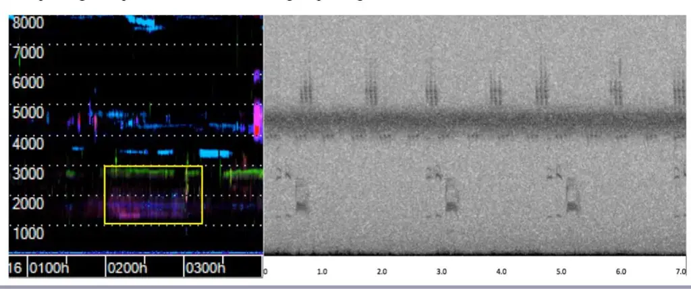
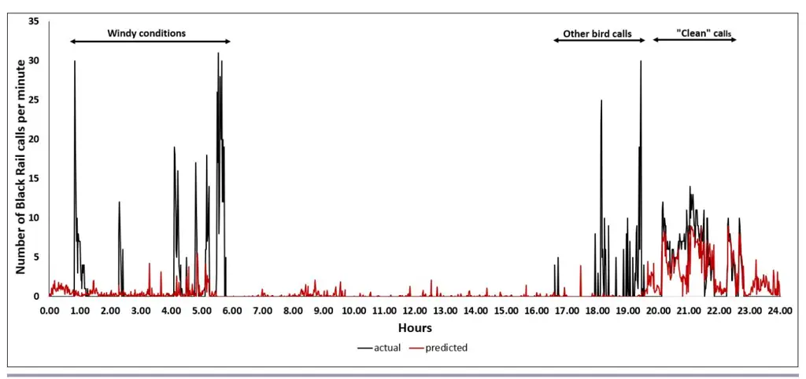
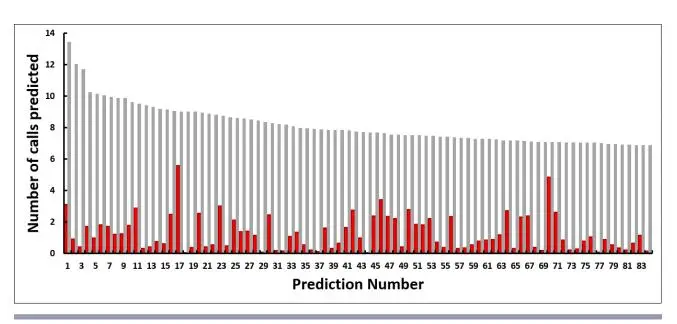

#### **VOLUME 16, ISSUE 1, ARTICLE 9**

Znidersic, E., M. W. Towsey, C. Hand and D. M. Watson. 2021. Eastern Black Rail detection using semi-automated analysis of long-duration acoustic recordings. _Avian Conservation and Ecology_ 16(1):9. https://doi.org/10.5751/ACE-01773-160109
Copyright © 2021 by the author(s). Published here under license by the Resilience Alliance.

Methodology

# Eastern Black Rail detection using semi-automated analysis of long-duration acoustic recordings

Elizabeth Znidersic 1, Michael W. Towsey 1,2, Christine Hand 3 and David M. Watson 1

1Institute for Land, Water and Society, Charles Sturt University, Australia, 2QUT Ecoacoustics Research Group, Science and Engineering Faculty, Queensland University of Technology, Australia, 3South Carolina Department of Natural Resources, USA

ABSTRACT. Detecting presence and inferring absence are both critical in species monitoring and management. False-negatives in any survey methodology can have significant consequences when conservation decisions are based on incomplete results. Marsh birds are notoriously difficult to detect, and current survey methods rely on traditional labor-intensive methods, and, more recently, passive acoustic monitoring. We investigated the efficiency of passive acoustic monitoring as a survey tool for the cryptic and poorly understood Eastern Black Rail (Laterallus jamaicensis jamaicensis) analyzing data from two sites collected at the Tom Yawkey Wildlife Center, South Carolina, USA. We demonstrate two new techniques to automate the reviewing and analysis of long-duration acoustic monitoring data. First, we used long-duration false-color spectrograms to visualize the 20 days of recording and to confirm presence of Black Rail "kickee-doo" calls. Second, we used a machine learning model (Random Forest in regression mode) to automate the scanning of 480 consecutive hours of acoustic recording and to investigate spatial and temporal presence. Detection of the Black Rail call was confirmed in the long-duration false-color spectrogram and the call recognizer correctly predicted Black Rail in 91% of the first 316 top-ranked predictions at one site. From ten days of continuous acoustic recordings, Black Rail calls were detected on only four consecutive days. Long-duration false-color spectrograms were effective for detecting Black Rail calls because their tendency to vocalize over consecutive minutes leaves a visible trace in the spectrogram. The call recognizer performed effectively when the Black Rail call was the dominant acoustic activity in its frequency band. We demonstrate that combining false-color spectrograms with a machine-learned recognizer creates a more efficient monitoring tool than a stand-alone species-specific call recognizer, with particular utility for species whose vocalization patterns and occurrence are unpredictable or unknown.

# Détection du Râle noir de l'Est au moyen d'une analyse semi-automatique d'enregistrements acoustiques de longue durée

RÉSUMÉ. La détection de la présence et l'inférence de l'absence sont toutes deux essentielles au suivi et à la gestion des espèces. Dans toute méthodologie de suivi, les faux négatifs peuvent avoir des conséquences importantes lorsque les décisions en matière de conservation reposent sur des résultats incomplets. Il est bien connu que les oiseaux de marais sont difficiles à détecter, et les méthodes de suivi actuelles sont fondées sur des méthodes traditionnelles plus laborieuses et, plus récemment, sur le suivi acoustique passif. Nous avons étudié l'efficacité du suivi acoustique passif comme outil de suivi pour le Râle noir de l'Est (Laterallus jamaicensis jamaicensis), espèce cryptique et mal connue, en analysant les données provenant de deux sites au Tom Yawkey Wildlife Center, en Caroline du Sud, aux États-Unis. Nous démontrons deux nouvelles techniques pour automatiser l'examen et l'analyse des données de suivi acoustique de longue durée. Tout d'abord, nous avons utilisé des spectrogrammes de longue durée en fausses couleurs pour visualiser les 20 jours d'enregistrement et confirmer la présence des cris "kickee-doo" du Râle noir. Ensuite, nous avons utilisé un modèle d'apprentissage automatique (Random Forest en mode régression) pour automatiser l'analyse de 480 heures consécutives d'enregistrement acoustique et examiner la présence spatiale et temporelle. La détection du cri du Râle noir a été confirmée dans le spectrogramme de longue durée en fausses couleurs et l'outil de reconnaissance du cri a correctement prédit le Râle noir dans 91 % des 316 prédictions les mieux classées à un site. Sur dix jours d'enregistrement acoustique continu, les cris du Râle noir n'ont été détectés que quatre jours consécutifs. Les spectrogrammes de longue durée en fausses couleurs ont été efficaces pour détecter les cris du Râle noir, car la tendance de cet oiseau à vocaliser pendant plusieurs minutes consécutives laisse une marque visible dans le spectrogramme. L'outil de reconnaissance des cris a été efficace lorsque le cri du Râle noir était l'activité acoustique dominante dans sa bande de fréquence. La combinaison de spectrogrammes en fausses couleurs et d'un outil de reconnaissance à apprentissage automatique constitue une méthode de suivi plus efficace qu'un outil autonome de reconnaissance de cris spécifiques à une espèce; cette combinaison est particulièrement utile pour les espèces dont les modèles de vocalisation et l'occurrence sont imprévisibles ou inconnus.

Key Words: acoustic monitoring, autonomous recording unit, Black Rail, call recognizer, long-duration false-color spectrogram, marsh bird

#### **INTRODUCTION**

Detecting presence and inferring absence are critical in the monitoring and management of species. Because species vary in detectability between sites or seasons, and are frequently present but not detected, conventional monitoring methods may provide misleading information about occurrence patterns, constraining efforts to manage populations. In many study designs there is the assumption (rarely expressed but frequently implied) that a standardized survey protocol ensures comparability but, unless sample completeness is estimated, comparability is unknown (Watson 2017). As no population estimate is free from bias, some methodologies then adjust for the detection probability (Lieury et al. 2017). There are two approaches to maximize comparability of samples with differing detection probabilities: (1) to statistically adjust estimates of site occupancy using species detection probabilities (ideally, collected contemporaneously), and (2) to determine the minimum sampling effort required to adequately represent the communities (de Solla et al. 2005; Pellet and Schmidt 2005). Failure to detect a species in an occupied habitat patch is a common sampling problem, particularly when the population is small, the individuals are difficult to detect, or sampling effort is inadequate (Gu and Swihart 2003).

The sampling effort required to detect some species can be unacceptably high where it requires long hours of labor-intensive field work. There is an additional risk of habitat disturbance when employing methods such as call-playback, or dogs to promote flushing or nest searching (Bibby et al. 1992, Peterson et al. 2015). To reduce the human-induced impacts on species behavior and to extend data collection capabilities through time and space, researchers are increasingly using passive acoustic monitoring. The method is suitable for a wide range of species and habitats: marine species (Parmentier et al. 2018, Sousa-Lima et al. 2013), mammals (Collier et al. 2010), freshwater ecosystems (Linke et al. 2018), invertebrates (Fischer et al. 1997), bats (Estrada-Villegas et al. 2010), anurans (Crouch and Paton 2002), and more recently, marsh birds (Sidie-Slettedahl et al. 2015, Drake et al. 2016, Bobay et al. 2018, Schroeder and McRae 2019, Znidersic et al. 2020).

The Eastern Black Rail (_Laterallus jamaicensis jamaicensis_) is the smallest, most secretive, and least understood marsh bird breeding in North America (Davidson 1992, Legare and Eddleman 2001). It is listed in six US states as endangered and is a federally listed threatened species (Endangered Species Act - Section 4(d) Rule, 2020) (U.S. Fish and Wildlife Service 2020). Salt marshes are their primary habitat, but they are also found in impoundments, freshwater wetlands, coastal prairies, and grasslands. Targeted surveys for this species typically consist of point count surveys including intermittent conspecific callplayback conducted by one or more trained human observers (hereafter call-playback surveys, Conway et al. 2004). Little information is documented about their natural vocalization strategies without the bias of a human observer and call-playback to elicit a response. However, call-playback can induce movement and therefore disturbance, which in turn can lead to falsenegatives and reduced precision in species-habitat modeling. Observed diel timing of vocalization activity varies across the species range and includes reports of primarily nocturnal vocalizations in Maryland (Weske 1969) and reports of early morning and late evening vocalizations in Arizona (Conway et al. 2004) and Florida (Eddleman et al. 2020). In addition to the apparent variability in the diel timing, the inconsistencies in vocal responsiveness to call-playback among different stages of the breeding cycle (Legare et al. 1999) contributes to low detection probabilities (Conway et al. 2004), making call-playback surveys difficult and costly. Recent efforts have therefore implemented passive acoustic monitoring for detecting Black Rail (Bobay et al. 2018).

While acoustic monitoring has significant advantages over callplayback survey approaches, the acquired acoustic recordings (sometimes many Gigabytes and even Terabytes), require expert review by aural and/or computational means. This poses a new set of data management and analysis challenges. Skills that were associated with computer science are now required by ecologists to obtain and then interpret results.

Call recognizers have been developed to automate species detection in acoustic datasets and are available in multiple open source and proprietary software such as RavenPro (Charif et al. 2008), WEKA (Frank et al. 2016), and Kaleidoscope (Wildlife Acoustics 2017). The preparation of an automated recognizer is especially useful where an ecologist must scan many days of data to determine the presence/absence of a species. However, building a recognizer takes both time and skill, and their success is often confounded by a high rate of false-positive and false-negative detections (Bobay et al*.* 2018, Priyadarshani et al. 2018). Longduration false-color (LDFC) spectrograms offer a novel way to interpret soundscapes obtained from very long acoustic recordings (Towsey et al. 2014). As a visual tool, they are useful to identify broad taxonomic groups, such as frogs, bats, or birds, as well as individual species (Towsey et al. 2018b, Znidersic et al. 2020).

Here, we combine the LDFC spectrogram technique with a call recognizer to detect the Black Rail "kickee-doo" call (Robbins et al. 1983) in long-duration acoustic recordings. We demonstrate how Eastern Black Rail (hereafter referred to as Black Rail) calls are discernible in LDFC spectrograms, and we supplement this approach with an automated call recognizer. In addition, we compare the effectiveness of our approach with previous methods to monitor the subspecies across its range in the USA, allowing for independent validation of both survey effort and sampling efficiency. Finally, we discuss how the sampling duration and distance between acoustic monitoring points are critical for species detection.

#### **METHODS**

#### **Study Area**

All recordings were obtained at the Yawkey Wildlife Center, in Georgetown, South Carolina. The Centre includes three coastal islands (North and South Islands, and most of Cat Island) at the mouth of Winyah Bay (33° 14′ 56.89′′ N, 79° 15′ 54.12′′ W). It encompasses over 9712 hectares of natural marsh, managed wetlands, forest openings, ocean beach, longleaf pine forest, and maritime forest. Yawkey Wildlife Center is managed by the South Carolina Department of Natural Resources as a wildlife preserve, research area, and waterfowl refuge and has restricted access to the public.

**Fig. 1**. Long-duration false-color (LDFC) spectrogram for Site A (top) and Site B (bottom) from 23 April 2016. X-axis is 24 hours (midnight to midnight), y-axis 0–11,000 Hz. The yellow rectangle on the top spectrogram shows the concentrated vocalization period (20:55–22:30 hr) of Black Rail calls at Site A. The same calls are not visible in the spectrogram from Site B.

# **Data collection**

Two SongMeter-3 (SM3) acoustic sensors (Wildlife Acoustics, 2017) were deployed from 20 April to 30 April 2016, programmed to record "continuously" (24×1-hour WAVE files per day) in stereo at a sampling rate of 22.05 kHz. The sensors were powered by four D-cell batteries. They were affixed to a metal stake with cable ties and positioned ~80 cm above the ground. The acoustic sensors were deployed at established call-playback survey points which were sited on the edge of an impounded marsh, at locations separated by 490 m. These two sites will henceforth be referred to as Site A and Site B.

# **Data visualization using long-duration falsecolor (LDFC) spectrograms**

We used the open-access software package Ecoacoustics Analysis Programs (Towsey et al. 2018a) to calculate spectral acoustic indices at one-minute resolution and to produce long-duration, false-color (LDFC) spectrograms (Towsey et al. 2014). Each spectrogram condenses 24 hours of recording (midnight to midnight) into a single image, making it possible to see the entire acoustic landscape in a single view. To calculate spectral indices, we converted each one-minute segment of audio to an amplitude spectrogram by calculating a Fast Fourier Transform (with Hamming window) for each non-overlapping frame (width = 512 samples). Each spectrum of 256 amplitude values (bin width = ~43.1 Hz) was smoothed using a moving average filter (width = 3) after which, the Fourier coefficients (_A_) were converted to decibels using dB = 20×log10(_A_). In addition to the amplitude and decibel spectrograms, we prepared a third noise-reduced spectrogram by subtracting the modal decibel value of each frequency bin from every value in the bin (after Towsey 2017).

Three acoustic indices were calculated for each frequency bin of each one-minute recording segment. Each index can be viewed as a mathematical function summarizing some aspect of the distribution of acoustic energy in the frequency bin from which it is derived (Towsey et al. 2014). We calculated the Acoustic Complexity Index (ACI; Pieretti et al. 2011), the Temporal Entropy Index (ENT; Sueur et al. 2008), and the Event Count Index (EVN; Towsey 2017). These three indices were combined by assigning ACI, ENT and EVN to the red, green, and blue channels respectively, to produce a single 24-hour LDFC spectrogram (Fig. 1). In this spectrogram, high values of the ACI index (red color) in a frequency bin indicate rapid changes in acoustic intensity from one timeframe to the next, over one minute; high values of the ENT index (green color) indicate a concentration of acoustic energy in just a few timeframes over one minute; and high values of the EVN index (blue color) indicate a large number of separate acoustic events over one minute. Different sound sources contribute differentially to the three indices and hence the great variation in color.

# **Preparing a regression recognizer using acoustic indices**

The same three spectral acoustic indices (ACI, ENT, EVN) can also be understood as acoustic features that can be used for machine learning purposes. Typically, a machine learning approach is used to predict individual calls or call syllables and the acoustic features will be derived at millisecond scale. However, our indices are calculated at one-minute resolution, and the Black Rail may call several times in one minute. Consequently, rather than training a binary recognizer to predict presence/absence of a call, we trained a Random Forest recognizer (RF) on a regression task, that is, to predict the number of Black Rail calls in a one-minute segment of recording.

**Fig. 2**. (a) A 3-hour sample (01:00 to 03:00 hr) from the 24-hour long-duration false-color (LDFC) spectrogram of Site A, 21 April 2016. (b) A 7-second portion of standard grey-scale spectrogram extracted from the same period. The vertical axis (0–8 kHz) is the same for both spectrograms. The greyscale spectrogram illustrates three 'kickee-doo' calls of the Black Rail. These can be identified in the longduration false-color (LDFC) spectrogram within the yellow rectangle. The horizontal axis (x-axis) in the left spectrogram spans three hours; in the right spectrogram, seven seconds.

Building and testing the regression call recognizer involved five steps:

- **1.** _Labelling recording segments:_ Two complete days of recording from Site A (21 April 2016 and 23 April 2016) were labeled at one-minute resolution (1,440 minutes for each day), each minute annotated with the number of Black Rail calls in that minute. To determine the actual number of calls per minute, one of us (E. Znidersic, whose area of expertise is marsh birds) used a combined approach of visually examining standard grey-scale spectrograms and aurally reviewing the audio recordings to count the calls. The 1,440 minutes of 21 April 2016 included 270 minutes containing one or more Black Rail calls. The remaining minutes contained zero calls. The 1,440 minutes of 23 April 2016 included 248 minutes containing one or more calls. Black Rail calls occurred during day and night of both days. The 21 April recording was used for training purposes and the 23 April recording for testing.
- **2.** _Preparing datasets:_ Selecting a training set required careful consideration. A single Black Rail call has a duration of less than one second, but the acoustic features were extracted at one-minute resolution. There were many minutes when other bird species were calling in the same frequency band as the Black Rail and the inclusion of these minutes for training purposes would have confounded the recognizer. We therefore selected for training purposes, only those minutes in the 21 April 2016 recordings where Black Rail calls were the dominant acoustic component in its frequency band. The resulting training set consisted of 1,301 instances (an instance is a one-minute segment of recording), including 1,170 (90%) instances containing zero calls and 131 (10%) instances containing up to 18 calls.
- **3.** _Training the recognizer:_ The annotated data were used to train a Random Forest recognizer for the regression task of predicting the number of Black Rail calls in each minute of

- recording. We implemented three recognizers using the open source WEKA Machine Learning software (Frank et al. 2016): Multilayer Perceptron, SMOreg (a regression implementation of a support vector machine), and Random Forest, all with default parameters. The support vector machine and Random Forest performed equally well and better than the Perceptron. However, the support vector machine in regression mode took approximately ten times longer to train, thus we present results only for Random Forest.
- **4.** _Optimising the feature set:_ We used 10-fold cross-validation performance to optimize the feature set. The dominant components of the Black Rail call lie between 1000-3000 Hz (Fig. 2) which includes 46 frequency bins. However, including additional frequency bins on either side improved performance and the final feature set consisted of 159 features, 53 from each of the ACI, ENT, and EVN indices.
- **5.** _Determining performance on the test set:_ We assessed performance on a previously unseen test set by applying the trained recognizer to the 1,440 one-minute instances recorded on 23 April 2016. 1192 instances contained zero calls and 248 instances contained from 1 up to a maximum of 31 calls. In addition, the recognizer was applied to all recordings from Site A and Site B from 20 April 2016 to 30 April 2016.

#### **RESULTS**

# **Identification of Black Rail calls in spectrograms**

We collected approximately 480 hours of continuous acoustic recording from the two sites (A and B) with two acoustic sensors running simultaneously on the Yawkey Wildlife Center from 20 April to 30 April 2016. It was not possible to review such a large amount of data using grey-scale spectrograms at the standard

**Fig. 3**. Prediction of Black Rail calls by the Random Forest (RF) recognizer, trained on positive "clean" instances only. Black line = actual counts; Red line = predicted counts. X-axis is one day from midnight to midnight and the Y-axis is the number of Black Rail calls per minute. Note that the "clean" positives occur after 19:50 hr, and the recognizer failed to predict Black Rail calls when it was windy or when other birds were vocalizing.

30-60 second timescale. Instead we searched all 20 LDFC spectrograms looking for potential Black Rail "kickee-doo" traces in the 1.5-3.0 kHz frequency band. These were then checked against standard grey-scale spectrograms of the same one-minute instances (both aurally and visually) (Fig. 2b) and with practice it was possible to recognize "kickee-doo" calls in LDFC spectrograms. They appear as a green line just below 3.0 kHz and the pink/mauve color around the 1.5 kHz frequency (Fig. 2a). In general, however, it should be noted that the appearance of bird calls in a false-color spectrogram (that is, their color and saturation) will vary depending on the number of calls per minute, their amplitude, and of course the variability of the call.

# **Performance of the call recognizer on the test-day recordings**

We compared the predicted versus actual calls per minute on the test recording from 23 April 2016 at Site A (Fig. 3). The closest correlation between actual and predicted calls occurred between 1950 hours and 2300 hours where Black Rail calls were the dominant acoustic activity in its bandwidth. By comparison, the recognizer performed poorly during an interval of windy conditions from 0050 hours to 0540 hours and when other birds were chorusing (from 1750 hours to 1950 hours). This result was not unexpected because we trained the Random Forest recognizer only on positive ("clean") instances where the Black Rail call was dominant in its frequency band.

The actual calling rate of Black Rail was higher during periods of wind or when other species were calling - up to 31 calls per minute as at 0530 and 1925 hours (Fig. 3). When there was little other acoustic activity in the Black Rail frequency band, the maximum number of calls per minute reduced to a maximum of 14 (2100 hour) (Fig.3).

When used operationally, the predictions of a recognizer are typically ordered from highest prediction score to lowest, and they are verified in order until the level of false-positive predictions becomes unacceptably high. We show the results of this approach in Table 1, where the predictions are grouped into ranked blocks of 25, with the number of false-positive predictions per block of 25 shown in the right-most column. A false-positive in this context is a one-minute instance that is predicted to contain at least one Black Rail call but contains zero calls. There were eight falsepositive predictions in the first 100 ranked predictions (_precision_ = 92%, where precision is defined as _TP_/(_TP+FP_)) and a total of 25 in the first 150 predictions (_precision_ = 83%). The graph of predicted call counts over 24 hours (Fig. 3) indicates that predictions at or below a threshold of three calls per minute are unreliable and that this is a suitable cut-off point. This threshold was reached at the 120th ranked prediction (Table 1), at which point there were accumulated 14 false-positive errors. The first 120 predictions also included two correct predictions in the early morning "windy" part of the day. The confounding species in the bird chorus was primarily Chuck-will's-widow (_Antrostomus carolinensis_), whose call lies in the 1.2-2.5 kHz frequency band).

To determine the _recall_ (defined as _TP_/(_TP+FN_)) of the regression recognizer, we defined a false-negative as occurring when the regression score for a one-minute instance was 3.0 or below and the minute contained one or more calls. As noted above, we considered three calls per minute as a threshold below which the recognizer would not be expected to perform accurately. Of the 248 minutes containing at least one Black Rail call, 106 were correctly predicted. Thirty-four of the false-negative predictions were obtained from minutes containing three or fewer actual calls (Table 2). The remaining false-negative predictions could be accounted for by the presence of additional acoustic sources in

the 1-3 kHz band, for example wind, other bird species, and anthropogenic noise (Table 2).

**Table 1**. Random Forest (RF) recognizer results from the test day 23 April 2016, Site A. Predicted call counts were ranked from highest to lowest and compared with actual counts. The number of false-positive predictions are shown in blocks of 25 for the top 150 ranked predictions. A false-positive in this context is a oneminute instance that is predicted to contain at least one Black Rail call but contains zero calls.

| Prediction Rank | Prediction scores | Number of false positive predictions |
| --------------- | ----------------- | --------------------------------------- |
| 1-25            | 9.03-7.09         | 0                                       |
| 26-50           | 7.08-5.81         | 2                                       |
| 51-75           | 5.74-4.66         | 1                                       |
| 76-100          | 4.53-3.89         | 5                                       |
| 101-125         | 3.87-2.79         | 8                                       |
| 126-150         | 2.77-2.28         | 9                                       |

**Table 2**. The number of true-positive and false-negative predictions for Black Rail calls on the test day, 23 April 2016, Site A. A false-negative in this context is a one-minute instance that receives a prediction score of <3.00 but contains at least one Black Rail call. Most of the false-negative predictions are due to other acoustic activity in the 1.0–3.0 kHz band.

| Prediction status | Other acoustic activity in the 1-3 kHz.          | Number of minutes |
| -------------------- | --------------------------------------------------- | -------------------- |
| True-positive        | Insignificant                                       | 106                  |
| False-negative       | Actual Black Rail call rate ≤ 3 calls per minute | 34                   |
| False-negative       | Wind noise                                          | 64                   |
| False-negative       | Calls of other bird species                         | 38                   |
| False-negative       | Anthropogenic noise                                 | 3                    |
| False-negative       | Lower portion of cicada-chorus                      | 3                    |
|                      | Total                                               | 248                  |

# **Recognizer performance over all recordings**

We calculated Black Rail prediction scores for every minute of all recordings from 20-30 April 2016 at both Sites A and B (a total of approximately 480 recording hours). We verified the predictions (ranked by prediction score) down to a minimum prediction of 4.0 calls per minute. Sites A and B were ranked and verified separately for comparison. For Site A, this resulted in 316 predictions to verify (scores ranging from 13.45 to 4.01) and for Site B, 84 predictions (scores ranging from 7.35 to 4.01). There were no false-positives in the top 84 Site A predictions (precision = 100%) whereas all 84 Site B predictions were false-positives. The top 316 predictions for Site A yielded 287 true-positive and 29 false-positive predictions (precision = 91%) (Table 3). Detected Black Rail calls were confined to four consecutive days at Site A (21-24 April 2016) from the 10-day deployment (Table 4). There were no true-positive calls detected at Site B. False-positives at both Sites A and B were due to the confounding calls of Chuckwill's-widow, Common Gallinule (_Gallinula galeata_), and Redwinged Blackbird (_Agelaius phoeniceus_). Although no actual Black Rail calls were detected at Site B, we confirmed that there

was no correlation between the scores for Sites A and B by plotting the predictions for Sites A and B when ranked by the Site A prediction score (Fig. 4). The LDFC spectrograms for the two sites on the test day (23 April 2016) are shown in Figure 1. A concentration of actual Black Rail calls is shown enclosed in the yellow rectangle in the top LDFC spectrogram for Site A. A corresponding trace does not occur at the same time in the LDFC spectrogram for Site B.

**Table 3**. Random Forest (RF) recognizer results from the 21–30 April 2016 for Site A (316 instances) and Site B (84 instances). Predicted call counts were ranked from highest to lowest and compared with actual counts for the top predictions at each site above the call prediction threshold of 4.0.

| Prediction Rank | Site A. Prediction scores | Site A. False positives | Site B. Prediction scores | Site B. False - positives |
| ------------------ | ------------------------------- | ----------------------------- | ------------------------------- | ------------------------------- |
| 1-25               | 13.45-8.63                      | 0                             | 7.35-5.24                       | 25                              |
| 26-50              | 8.59-7.52                       | 0                             | 5.23-4.63                       | 25                              |
| 51-75              | 7.51-7.05                       | 0                             | 4.63-4.22                       | 25                              |
| 76-84              | 7.04-6.89                       | 0                             | 4.2-4.01                        | 9                               |
| 84-100             | 6.85-6.54                       | 2                             | n/a                             | n/a                             |
| 100-125            | 6.52-6.08                       | 1                             | n/a                             | n/a                             |
| 125-150            | 6.04-5.66                       | 2                             | n/a                             | n/a                             |
| 150-175            | 5.63-5.29                       | 3                             | n/a                             | n/a                             |
| 175-200            | 5.28-4.93                       | 1                             | n/a                             | n/a                             |
| 200-225            | 4.92-4.76                       | 1                             | n/a                             | n/a                             |
| 225-250            | 4.75-4.58                       | 7                             | n/a                             | n/a                             |
| 250-275            | 4.58-4.30                       | 4                             | n/a                             | n/a                             |
| 275-300            | 4.30-4.14                       | 4                             | n/a                             | n/a                             |
| 300-316            | 4.13-4.01                       | 4                             | n/a                             | n/a                             |

**Table 4**. The number of Black Rail predictions, true-positive calls and false-positive calls by day (20 April 2016 to 30 April 2016) at Site A.

| Date          | Predicted positive calls | True-positives | False-positives |
| ------------- | --------------------------- | -------------- | --------------- |
| 20 April 2016 | 0                           | 0              | 0               |
| 21 April 2016 | 94                          | 94             | 0               |
| 22 April 2016 | 26                          | 26             | 0               |
| 23 April 2016 | 94                          | 87             | 7               |
| 24 April 2016 | 84                          | 80             | 4               |
| 25 April 2016 | 7                           | 0              | 7               |
| 26 April 2016 | 3                           | 0              | 3               |
| 27 April 2016 | 1                           | 0              | 1               |
| 28 April 2016 | 1                           | 0              | 1               |
| 29 April 2016 | 2                           | 0              | 2               |
| 30 April 2016 | 4                           | 0              | 4               |

## **DISCUSSION**

Marsh birds are an ideal group to investigate monitoring and survey effort, both from the point of view of methodology and conservation. Despite growing concern about range-wide declines in this group, current monitoring protocols are reliant on laborintensive potentially biased call-playback surveys, and, more recently, passive acoustic monitoring. From a methodology viewpoint, the utility of monitoring techniques is best discussed in terms of effectiveness and efficiency. Efficiency, in turn, involves

trade-offs between costs and benefits. The increasing popularity of passive acoustic monitoring is due to its efficiency — greatly increased effort (actual recorded time saved to SD cards) at greatly reduced cost (time spent by trained staff in the field). Increased effort is a desirable feature when monitoring a cryptic species such as the Black Rail, which has an irregular calling behavior (Legare et al. 1999). Conway et al. (2004) demonstrated that an effort of up to 15 call-playback survey replicates would be required to attain a 90% detection probability of California Black Rail (_Laterallus jamaicensis coturniculus_). The requirement for such high survey effort is usually associated with greatly increased time in the field (Thomas and Marques 2012) and increased risk of incorrectly inferring "absence".

**Fig. 4**. The Black Rail prediction scores for Site A (gray) and Site B (red) when ranked by the first 83 Site A prediction scores. Site B predictions indicate no correlation for the same minute. Black Rail calls were not detected by the recognizer on the dataset collected from Site B.

## **Recognizer performance**

The increased efficiency of passive acoustic monitoring comes at a cost, namely the increased requirement for data storage and automated analysis, both of which require computational skills that are not always part of an ecologist's training. Consequently, cost/benefit decisions around data analysis can become an important component of monitoring decisions. As an example, a machine-learned recognizer, trained to detect Black Rail calls, yielded only 91 true positives from 11,872 predictions for a precision of 0.77% (Bobay et al. 2018). In this case, cost saving in the field was offset by the cost of processing a large volume of recognizer output. As these authors note, the inability to achieve accurate analysis of acoustic data can deter ecologists from applying passive acoustic monitoring.

Generally, more acoustic data is collected than can be listened to or visually reviewed, so the standard approach is to train a recognizer to detect vocalizations of the target species. Besides the possible software costs and time required to learn the software, there are additional significant time costs in assembling labeled datasets and verifying recognizer performance. These latter costs should not be underestimated and the old adage, "rubbish in rubbish out", is worth keeping in mind.

The ability to visualize our 20 days of recording in 20 LDFC spectrograms was an important contribution to the success of this monitoring exercise. The alternative would have been to review 28,800 standard scale spectrograms of one-minute duration. Interpreting LDFC spectrograms requires the ecologist to have a broad appreciation of the soundscape variability and the vocalizing species contributing to the recording. Only when major features in an LDFC spectrogram and their variability are understood, should attention be turned to the less obvious features that may reveal a rare or cryptic species such as Black Rail.

It is worth noting that a major difficulty in problem-solving with call-recognition software (such as Song-Scope, Kaleidoscope, RavenPro, and MonitoR) can be determining whether bad results are due to incorrect use of the software or whether the acoustic feature set used by the recognizer is inappropriate for the call of interest. An advantage of using LDFC spectrograms in conjunction with machine-learning is that, if one can visualize the call of interest in an LDFC spectrogram, then the underlying acoustic indices offer a useful set of acoustic features that can be used for machine-learning purposes.

Before training the recognizer for this study, we made an important decision involving a cost-benefit trade-off, namely, to train the recognizer on a regression task (predict the number of calls per minute) rather than the usual binary classification task (predict presence/absence of a single call). Three difficult questions must be answered when preparing a dataset for the binary classification task: 1. how to determine the boundaries when cutting out individual calls, 2. how to decide which calls to select for training, and 3. what acoustic features to extract to optimize classification accuracy. For the regression task in this study, these difficulties are reduced: 1. it is easier to count calls per minute over consecutive non-overlapping minutes, 2. all calls are counted, and 3. the feature set was the same as that used to construct the LDFC spectrograms. Indeed, our ability to visualize Black Rail calls in the LDFC spectrograms informed us that spectral indices would make suitable features for the regression task. The cost associated with extracting features at one-minute resolution was the increased probability that other acoustic events would confound recognition of Black Rail calls, leading to a higher number of false-negative predictions.

Of the 248 test-day minutes containing at least one Black Rail call, 142 were not detected by the recognizer, an implied falsenegative rate of 57%. An analysis of these 142 minutes revealed that 108 were due to the confounding presence of other acoustic sources and 34 were due to the actual call rate being below 3 calls per minute where recognizer performance was unreliable. A weakness of working at one-minute resolution is that our method only detects Black Rail calls in those minutes where they are dominant in their frequency band. However, when this condition was satisfied, the false-negative rate was 14% (34/248, the fraction of calling minutes below 4 calls per minute).

A question arises concerning lack of detection of Black Rail calls at Site B and whether a call recognizer trained on recordings from Site A would be reliable when analyzing recordings from Site B. As a rule-of-thumb, the training, validation, and test sets that determine the performance of a machine-learned model should be representative of the intended operational environment. Sites A and B were 490 meters apart and acoustically isolated. However, they were within the same impounded marsh and had the same vegetation composition and structure. Therefore, we are confident that sites A and B were sufficiently similar both acoustically and biologically, that Black Rail would have been detected during the 10-day deployment if it had been present.

We conclude that the recognizer prediction error rates are within acceptable bounds subject to two important conditions: 1. the target bird species is the dominant sound source in its frequency band in some of its calling minutes; and 2. the field recordings have sufficient spatial and temporal cover to detect target calls if they occur. This brings us to the issue of spatial cover and survey point placement.

# **Survey point placement**

Incorrectly inferring absence is a critical issue with all monitoring methods (Kéry 2002). Such errors can have serious management consequences, especially for threatened species (Robinson et al. 2018) such as the Black Rail. Although acoustic monitoring satisfies some efficiency criteria, budget constraints will demand consideration of additional effectiveness/efficiency trade-offs (Joseph et al. 2006), particularly those concerning spatial and temporal placement of recorders in the field.

Sample point spacing (for either passive acoustic monitoring or call-playback surveys) is critical to detection probability and therefore, should not be compromised to increase large scale spatial coverage. Although marginally outside the guidelines for call-playback surveys of marsh birds (Conway 2011), in our study, the two acoustic sensors were 490 m apart which resulted in significant variation in detection of Black Rail between the two sites. If detection was based purely at Site B, instead of Site A, there is a high probability that Black Rail would not have been detected either from a call-playback survey or by reviewing acoustic recordings. Therefore, the closer the sampling points, the lower the risk of incorrectly inferring absence. (Conway 2011, Schroeder and McRae 2019).

## **Vocalization strategies**

We also found that Black Rail called during only four consecutive days of the ten-day recording. This may be attributed to the variation of specific vocalization strategies (such as the "kickeedoo" call) or movement within territories during the breeding period (Conway et al. 2004). If our recording duration had been reduced to just a few days on the assumption that, if a Black Rail was present, it would call at some time during the day, our result would have been a false-negative.

Long-duration recordings offer the possibility of noting unexpected behavioral observations. For example, assumed vocalization patterns may only be dependent upon environmental conditions (wind and rain) or vocalizations of other species within frequency bands. In the case of Black Rail, the calling rate increased when the conditions were windy or there were competing species in the frequency band (maximum call rate of 31 per minute). This compares to a maximum calling rate of 14 calls per minute during the quiet time.

#### **Conclusion and prospect**

Our study has demonstrated that the high sampling effort required to detect Black Rail, or to more confidently infer its absence, can be achieved efficiently using long-duration recordings from passive acoustic monitoring. Although this was a comparatively small study consisting of just two sites, we have demonstrated that our method of combining two semi-automated analytical tools (LDFC spectrograms and the regression call-recognizer) was able to process a large-dataset (far more audio than could be listened to or scanned with standard scale spectrograms) and to detect Black Rail calls. The technical difficulty in implementing our method is only moderate. The software used to calculate acoustic indices and prepare LDFC spectrograms is a command-line tool but does not require any coding. WEKA is a well-known machinelearning toolkit with extensive documentation. As an alternative, R or Python could be used to do the machine learning step. However, it will always remain the case that a trade-off exists between the time it takes to perform a task manually and the time it takes to prepare the automation of the task.

This approach has been applied to other marsh bird species (Znidersic et al. 2020; Towsey et al. 2018b) and can be applied to other taxa where the primary mode of detection is auditory, and it is cost and time effective to apply a semi-automated analytical approach. Consideration still must be given to the species of interest, what is the best monitoring method for detection and the availability of time and budget. In addition, there is the ethical consideration. As ecologists, we must reduce our impacts on the environment and species by working smarter with the use of technology. As we know so little about the effects of call-playback and bird call apps on species and communities (Johnson and Maness 2018, Watson et al. 2018), the application of passive, low impact monitoring methods should lead future investigations.

Our results imply that improvements can be made to both onground monitoring (passive acoustic monitoring and callplayback surveys) of Black Rail and the subsequent analysis of acoustic data. Passive acoustic monitoring has the capability to collect large-scale temporal and spatial data, therefore increasing detection probability of this secretive species. The vocalization behavior of the Black Rail is not consistent, seemingly affected by weather (wind and rain) and the vocalization of other species in the same frequency band. Therefore, a standard monitoring protocol would need to be approached with some flexibility including timing and duration of passive acoustic monitoring, and the acoustic recorder placement. We see the potential for future work to include multiple agencies combining datasets to further refine the training of Black Rail recognizers using this method. This would result in a more scalable and transferable approach to detecting and monitoring Black Rail, therefore informing better decision making about where and when to monitor.

We recommend individual site assessment taking into consideration spatial placement of passive acoustic recorders according to potential sound attenuation influences (Yip et al. 2017). Also, vocalization intensity may be associated with breeding stage (Legare et al. 1999). Therefore, frequency of survey, whether passive acoustic monitoring or call-playback survey, should be increased during the breeding season.

Large datasets generated by long-duration passive acoustic monitoring require semi-automated analytical techniques such as call recognition. Solid data management protocols are also required to ensure data are available for further and future analysis as analytical tools improve.

The machine learning approach which we have described offers a middle path between simple but brittle, hand-crafted templates and the great complexity of convolution neural networks that require very large-training sets for deep-learning (Priyadarshani

2018). These are simply not available for a rare, cryptic species. Therefore, we recommend long-duration false-color spectrograms and a call recognizer to analyze Black Rail datasets, applying both visual and machine learning features. Although both tools have their limitations, these are compensated by high monitoring effort and relative ease in preparing a call recognizer.

_Responses to this article can be read online at:_ <https://www.ace-eco.org/issues/responses.php/1773>

#### **Acknowledgments:**

_Thanks to the staff at the South Carolina Department of Natural Resources at Yawkey Wildlife Center particularly J. Dozier and J. Lee for providing access, accommodation and logistical support. Also thanks to field technicians K. Brunk and S. Apgar._

# **LITERATURE CITED**

Bibby, C. J., N. D. Burgess, and D. A Hill. 1992. _Bird census techniques_. Academic Press Limited, San Diego, California.

Bioacoustics Research Program. 2014. _Raven Pro: Interactive Sound Analysis Software (Version 1.5) Computer software_. Ithaca, NY: The Cornell Lab of Ornithology. [online] URL: [http://www.](http://www.birds.cornell.edu/raven) [birds.cornell.edu/raven.](http://www.birds.cornell.edu/raven)

Bobay, L. R., P. J., Taillie, and C. E. Moorman. 2018. Use of autonomous recording units increased detection of a secretive marsh bird. _Journal of Field Ornithology_ 89:384-392. [https://doi.](https://doi.org/10.1111/jofo.12274) [org/10.1111/jofo.12274](https://doi.org/10.1111/jofo.12274)

Charif, R. A., A. M. Waack, and L. M. Strickman. 2008. _Raven Pro 1.3 user's manual_. Cornell Laboratory of Ornithology, Ithica, New York.

Collier, T. C., D. T. Blumstein, L. Girod, and C. E. Taylor. 2010. Is alarm calling risky? Marmots avoid calling from risky places. _Ethology_ 116:1171-1178. [https://doi.org/10.1111/j.1439-0310.2010.01830.](https://doi.org/10.1111/j.1439-0310.2010.01830.x) [x](https://doi.org/10.1111/j.1439-0310.2010.01830.x)

Conway, C. J. 2011. Standardized North American marsh bird monitoring protocol. _Waterbirds_ 34:319-346. [https://doi.](https://doi.org/10.1675/063.034.0307) [org/10.1675/063.034.0307](https://doi.org/10.1675/063.034.0307)

Conway, C. J., C. Sulzman, and B. E. Raulston. 2004. Factors affecting detection probability of California Black rails. _Journal of Wildlife Management_ 68:360-370. [https://doi.org/10.2193/0022-541X](<https://doi.org/10.2193/0022-541X(2004)068[0360:FADPOC]2.0.CO;2>) [\(2004\)068\[0360:FADPOC\]2.0.CO;2](<https://doi.org/10.2193/0022-541X(2004)068[0360:FADPOC]2.0.CO;2>)

Crouch, W. B. III, and P. W.C. Paton. 2002. Assessing the use of call surveys to monitor breeding anurans in Rhode Island. _Journal of Herpetology_ 36:185-192. [https://doi.org/10.1670/0022-1511](<https://doi.org/10.1670/0022-1511(2002)036[0185:ATUOCS]2.0.CO;2>) [\(2002\)036\[0185:ATUOCS\]2.0.CO;2](<https://doi.org/10.1670/0022-1511(2002)036[0185:ATUOCS]2.0.CO;2>)

Davidson, L. M. 1992. Black Rail. Pages 119-134 in K. J. Schneider and D. M. Pence (eds), _Migratory non-game birds of management concern in Northeast_. U.S Fish and Wildlife Service, Newton Corner, Massachusetts, USA.

de Solla, S. R., L. J., Shirose, K. J., Fernie, G. C., Barrett, C. S., Brousseau, and C. A. Bishop. 2005. Effect of sampling effort and species detectability on volunteer based anuran monitoring programs. _Biological Conservation_ 121:585-594. [https://doi.](https://doi.org/10.1016/j.biocon.2004.06.018) [org/10.1016/j.biocon.2004.06.018](https://doi.org/10.1016/j.biocon.2004.06.018)

Drake, K. L., M. Frey, D. Hogan, and R. Hedley. 2016. Using digital recordings and sonogram analysis to obtain counts of yellow rails. _Wildlife Society Bulletin_ 40(2):346-354. [https://doi.](https://doi.org/10.1002/wsb.658) [org/10.1002/wsb.658](https://doi.org/10.1002/wsb.658)

Eddleman, W. R., R. E. Flores, and M. Legare. 2020. _Black Rail (Laterallus jamaicensis) in The Birds of The World Online_ (A. Poole and F. B. Gill, Eds.). Cornell Lab of Ornithology, Ithaca, New York. <https://doi.org/10.2173/bow.blkrai.01>

Estrada-Villegas, S., C. F. J. Meyer, and E. K. V. Kalko. 2010. Effects of tropical forest fragmentation on aerial insectivorous bats in a land-bridge island system. _Biological Conservation_ 143:597-608. <https://doi.org/10.1016/j.biocon.2009.11.009>

Fischer, F. P., U. Schulz, H. Schubert, P. Knapp, and M. Schmöger. 1997. Quantitative assessment of grassland quality: acoustic determination of population sizes of Orthopteran indicator species. _Ecological Applications_ 7:909-920. [https://doi.](<https://doi.org/10.1890/1051-0761(1997)007[0909:QAOGQA]2.0.CO;2>) [org/10.1890/1051-0761\(1997\)007\[0909:QAOGQA\]2.0.CO;2](<https://doi.org/10.1890/1051-0761(1997)007[0909:QAOGQA]2.0.CO;2>)

Frank, E., M. A. Hall and I. H. Witten. 2016. _The WEKA Workbench. Online Appendix for "Data Mining: Practical Machine Learning Tools and Techniques"_. Morgan Kaufmann, Fourth Edition.

Gu, W., and R. K. Swihart. 2003. Absent or undetected? Effects of non-detection of species occurence on wildlife-habitat models. _Biological Conservation_ 116:195-203. [https://doi.org/10.1016/](<https://doi.org/10.1016/S0006-3207(03)00190-3>) [S0006-3207\(03\)00190-3](<https://doi.org/10.1016/S0006-3207(03)00190-3>)

Johnson. J. M., and T. J. Maness. 2018. Response of wintering birds to simulated birder playback and phishing. _Journal of the Southeastern Association of Fish and Wildlife Agencies_ 5:136-143.

Joseph, L. N., S. A. Field, Wilcox, C., and H. P. Possingham. 2006. Presence-Absence versus abundance data for monitoring threatened species. _Conservation Biology_ 20:1679-1687. [https://](https://doi.org/10.1111/j.1523-1739.2006.00529.x) [doi.org/10.1111/j.1523-1739.2006.00529.x](https://doi.org/10.1111/j.1523-1739.2006.00529.x)

Kéry, M. 2002. Inferring the absence of a species: A case study of snakes. _Journal of Wildlife Management_ 66:330-338. [https://](https://doi.org/10.2307/3803165) [doi.org/10.2307/3803165](https://doi.org/10.2307/3803165)

Legare, M. L., W. R. Eddleman, P. A. Buckley, and C. Kelly. 1999. The Effectiveness of Tape Playback in Estimating Black Rail Density. _The Journal of Wildlife Management_ 63:116-125. [https://](https://doi.org/10.2307/3802492) [doi.org/10.2307/3802492](https://doi.org/10.2307/3802492)

Legare, M. L., and W. R. Eddleman. 2001. Home range size, nestsite selection and nesting success of black rails in Florida. _Journal of Field Ornithology_ 72:170-177. [https://doi.org/10.1648/0273-8](https://doi.org/10.1648/0273-8570-72.1.170) [570-72.1.170](https://doi.org/10.1648/0273-8570-72.1.170)

Lieury, N., S. Devillard, A. Besnard, O. Gimenez, O. Hameau, C. Ponchon, and A. Millon. 2017. Designing cost-effective capturerecapture surveys for improving the monitoring of survival in bird populations. _Biological Conservation_ 214:233-241. [https://doi.](https://doi.org/10.1016/j.biocon.2017.08.011) [org/10.1016/j.biocon.2017.08.011](https://doi.org/10.1016/j.biocon.2017.08.011)

Linke, S., T. Gifford, C. Desjonquères, D. Tonolla, T. Aubin, L. Barclay, C. Karaconstantis, M. J. Kennard, F. Rybak, and J. Sueur.

- 2018. Freshwater ecoacoustics as a tool for continuous ecosystem monitoring. _Frontiers in Ecology and the Environment_ 16:231-238. <https://doi.org/10.1002/fee.1779>
- Parmentier, E., L. Di Iorio, M. Picciulin, S. Malavasi, J. P. Lagardere, and F. Bertucci. 2018. Consistency of spatiotemporal sound features supports the use of passive acoustics for long-term monitoring. _Animal Conservation_ 21:211-220. [https://doi.](https://doi.org/10.1111/acv.12362) [org/10.1111/acv.12362](https://doi.org/10.1111/acv.12362)
- Pellet, J., and B. R. Schmidt. 2005. Monitoring distributions using call surveys: estimating site occupancy, detection probabilities and inferring absence. _Biological Conservation_ 123:27-35. [https://](https://doi.org/10.1016/j.biocon.2004.10.005) [doi.org/10.1016/j.biocon.2004.10.005](https://doi.org/10.1016/j.biocon.2004.10.005)
- Peterson, S. M., H. M. Streby, J. A. Lehman, G. R. Kramer, A. C. Fish, and D. E. Anderson. 2015. High-tech or field techs: Radio-telemetry is a cost-effective method for reducing bias in songbird nest searching. _The Condor_ 117:386-396. [https://doi.](https://doi.org/10.1650/CONDOR-14-124.1) [org/10.1650/CONDOR-14-124.1](https://doi.org/10.1650/CONDOR-14-124.1)
- Pieretti, N., A. Farina, and D. Morri. 2011. A new methodology to infer the singing activity of an avian community: The Acoustic Complexity Index (ACI). _Ecological Indicators_ 11:868-873. <https://doi.org/10.1016/j.ecolind.2010.11.005>
- Priyadarshani, N., S. Marsland and I. Castro. 2018. Automated birdsong recognition in complex acoustic environments: a review. _Journal of Avian Biology_ 49:jav-01447 [https://doi.org/10.1111/](https://doi.org/10.1111/jav.01447) [jav.01447](https://doi.org/10.1111/jav.01447)
- Robbins, C. S., B. Brown and H. S. Zim. 1983. _A guide to field identification: birds of North America_. Golden Press, New York, New York.
- Robinson, N. M., B. C. Scheele, S. Legge, D. M. Southwell, O. Carter, M. Lintermans, J. Q. Radford, A. Skroblin, C. R. Dickman, J. Koleck, A. F. Wayne, J. Kanowski, G. R. Gillespie, D. B. Lindenmayer. 2018. How to ensure threatened species monitoring leads to threatened species conservation. _Ecological Management and Restoration_ 19:222-229. [https://doi.org/10.1111/](https://doi.org/10.1111/emr.12335) [emr.12335](https://doi.org/10.1111/emr.12335)
- Schroeder, K. M, and S. B. McRae. 2019. Vocal repertoire of the King Rail (_Rallus elegans_). _Waterbirds_ 42(2):154-167. [https://doi.](https://doi.org/10.1675/063.042.0202) [org/10.1675/063.042.0202](https://doi.org/10.1675/063.042.0202)
- Sidie-Slettedahl, A. M., K. C. Jensen, R. R. Johnson, T. W. Arnold, J. E. Austin, and J. D. Stafford. 2015. Evaluation of autonomous recording units for detecting 3 species of secretive marsh birds. _Wildlife Society Bulletin_ 39:626-634. [https://doi.](https://doi.org/10.1002/wsb.569) [org/10.1002/wsb.569](https://doi.org/10.1002/wsb.569)
- Sousa-Lima, R. S., T. F. Norris, J. N. Oswald, and D. P. Fernandes. 2013. A review and inventory of fixed autonomous recorders for passive acoustic monitoring of marine mammals. _Aquatic Mammals_ 39:205-210.<https://doi.org/10.1578/AM.39.2.2013.205>

- Sueur, J., S. Pavoine, O. Hamerlynck, and S. Duvail. 2008. Rapid acoustic survey for biodiversity appraisal. _PLOS ONE_, 3, e4065. <https://doi.org/10.1371/journal.pone.0004065>
- Thomas, L., and T.A. Marques. 2012. Passive acoustic monitoring for estimating animal density. _Acoustics Today_ 8:35-44. [https://](https://doi.org/10.1121/1.4753915) [doi.org/10.1121/1.4753915](https://doi.org/10.1121/1.4753915)
- Towsey, M. 2017. The calculation of acoustic indices derived from long-duration recordings of the natural environment. [online] URL:<https://eprints.qut.edu.au/110634>
- Towsey, M., A. Truskinger, M. Cottman-Fields, and P. Roe. 2018a. _Ecoacoustics Audio Analysis Software v18.03.0.41 (Version v18.03.0.41)_. Zenodo. [online] URL: [http://doi.org/10.5281/](http://doi.org/10.5281/zenodo.1188744) [zenodo.1188744](http://doi.org/10.5281/zenodo.1188744)
- Towsey, M, L. Zhang, M. Cottman-Fields, J. Wimmer, J. Zhang, and P. Roe. 2014 'Visualization of long-duration acoustic recordings of the environment', _Procedia Computer Science_, vol. 29, pp. 703-712
- Towsey, M., E. Znidersic, J. Broken-Brow, K. Indraswari, D. M. Watson, Y. Phillips, A. Truskinger, and P. Roe. 2018b. Longduration, false-colour spectrograms for detecting species in large audio datasets. _Journal of Ecoacoustics_ 2: #IUSWUI. [https://doi.](https://doi.org/10.22261/jea.iuswui) [org/10.22261/jea.iuswui](https://doi.org/10.22261/jea.iuswui)
- U.S. Fish and Wildlife Service. 2020. _Petition finding and proposed threatened species status for Eastern Black Rail with a 4(d) rule._ [online] URL: [https://www.federalregister.gov/documents/2020/](https://www.federalregister.gov/documents/2020/10/08/2020-19661/endangered-and-threatened-wildlife-and-plants-threatened-species-status-for-eastern-black-rail-with) [10/08/2020-19661/endangered-and-threatened-wildlife-and-plants](https://www.federalregister.gov/documents/2020/10/08/2020-19661/endangered-and-threatened-wildlife-and-plants-threatened-species-status-for-eastern-black-rail-with)[threatened-species-status-for-eastern-black-rail-with](https://www.federalregister.gov/documents/2020/10/08/2020-19661/endangered-and-threatened-wildlife-and-plants-threatened-species-status-for-eastern-black-rail-with)
- Watson, D. M. 2017. Sampling effort determination in bird surveys: do current norms meet best-practice recommendations? _Wildlife Research_ 44:183-193.<https://doi.org/10.1071/WR16226>
- Watson, D. M., E. Znidersic, and M. Craig. 2018. Ethical birding call playback and conservation. _Conservation Biology_ 33:469-471. <https://doi.org/10.1111/cobi.13199>
- Weske, J. S. 1969. _An ecological study of the Black Rail in Dorchester County, Maryland_. Thesis, Cornell University, USA.
- Wildlife Acoustics. 2017. 4.3.1 Documentation. [online] URL: [https://www.wildlifeacoustics.com/images/documentation/Kaleidoscope.](https://www.wildlifeacoustics.com/images/documentation/Kaleidoscope.pdf) [pdf](https://www.wildlifeacoustics.com/images/documentation/Kaleidoscope.pdf) (accessed 19 January 2019).
- Yip, D. A., E. M. Bayne, P. Solymos, J. Campbell, and D. Proppe. 2017. Sound attenuation in forest and roadside environments: Implications for avian point-count surveys. _The Condor_ 119:73-85. <https://doi.org/10.1650/CONDOR-16-93.1>
- Znidersic, E., M. Towsey, W. K. Roy, S. E. Darling, A. Truskinger, P. Roe, and D. Watson. 2020. Using visualization and machine learning methods to monitor low detectability species-- The least bittern as a case study. _Ecological Informatics_, 55,101014. [https://](https://doi.org/10.1016/j.ecoinf.2019.101014) [doi.org/10.1016/j.ecoinf.2019.101014](https://doi.org/10.1016/j.ecoinf.2019.101014)

Editor-in-Chief: Alexander L.Bond Subject Editor: Steven L.Van Wilgenburg

