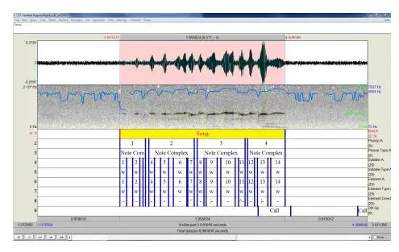
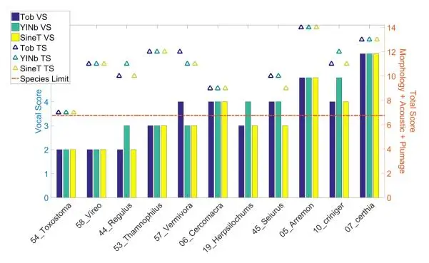
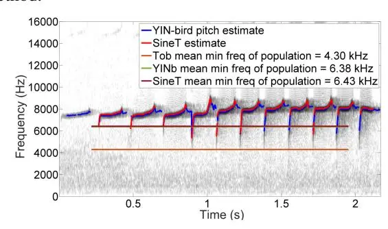

# Automatic Frequency Feature Extraction for Bird Species Delimitation

Colm O'Reilly1 , Munevver K ¨ ok¨ uer ¨ 2 , Peter Jancovi ˇ cˇ 2 , Regan Drennan3 , Naomi Harte1 1 Sigmedia, Department of Electrical & Electronic Engineering, Trinity College Dublin, Ireland 2 Department of Electronic, Electrical & Systems Engineering, University of Birmingham, UK 3 Department of Zoology, Trinity College Dublin, Ireland {oreilc16, nharte}@tcd.ie, {p.jancovic, m.kokuer}@bham.ac.uk

_Abstract_—Zoologists have long studied species distinctions, but until recently a quantitative system which could be applied to all birds which satisfies rigor and repeatability was absent from the zoology literature. A system which uses morphology, acoustic and plumage evidence to review species status of bird populations was presented by Tobias et al. The acoustic evidence in that work was extracted using manual inspection of spectrograms. The current work seeks to automate this process. Signal processing techniques are employed in this paper to automate the extraction of the acoustic features: maximum, minimum and peak frequency, and bandwidth. YIN-bird, a pitch detection algorithm optimized for birds, and sine-track method, successfully applied to bird species recognition previously, are the automatic methods employed. The performance of automatic methods is compared to the manual method currently used by zoologists. Both methods are well suited to this task, and demonstrate the strong potential to begin to automate the task of acoustic comparison of bird species.

_Index Terms_: Pitch, bird song, sinusoidal tracking

## I. INTRODUCTION

Conservation concerns have motivated the increased study of the geographic distribution of bird species. As most bird vocalizations have evolved to be species-specific, it is a natural and adequate way to automatically identify or discriminate between species [1]. Another common issue in ornithology is to determine how similar, or different, vocalizations from subspecies of a single bird species are. This has important implications for the correct taxonomic classification of populations. Groups of birds considered as the same species, but as different subspecies, will typically have more similar vocalizations than groups of birds considered as unrelated species. The task of classifying subspecies is more complex than species classification as classes are more confusable. Whilst ornithologists will use a combination of genetic and morphological evidence (e.g. plumage patterns) to help them in this task [2], the usefulness of vocalizations is also now strongly accepted. Systematic ways to quantify difference between groups of birds using their vocalizations is thus desirable for ornithologists.

Populations of a bird species can evolve over time to become new species. While plumage patterns and other morphological information can remain constant, the vocalizations of a given population may have diversified enough to warrant reclassification. McKay et al. in [3] examined song in making a case for the Bahan subspecies of the Yellow-throated Warbler to be reclassified as a distinct species. Song divergence was important evidence in the reclassification process. Comparisons were on the basis of visual inspection of spectrograms. Sangster et al. in [4], described a new species, the Rinjani Scops Owl, based on analysis of vocalizations. In both [3] and [4] various features were measured, like amplitudes at certain frequencies, number of syllables and phrases, pitch slope and frequency.

Whilst the importance of vocalizations in mate choice and species recognition is well documented (specifically by Catchpole et al. in [5]), quantitative systems to evaluate difference are few and far between. The task of bird population difference analysis using vocalizations is relatively uncharted with only a few papers to date [2], [4], [6], [7]. If two populations with a common origin are isolated, one can expect that the songs of each will accumulate modifications independently. In recent times, due to cheaper access to recording equipment and large on-line repositories of data (e.g. xenocanto.org) it has become plausible for ornithologists to have large numbers of recordings to analyze. Thus automatic ways to analyze and quantify vocalizations from different populations are required.

When zoologists analyze bird populations, they tend to look at acoustic evidence in specific ways. This paper investigates the automation of a taxonomic scoring system presented by zoologist Joseph Tobias et al. in [8]. The authors proposed a simple point-based system where the difference between population pairs is scored according to four degrees of magnitude: minor, medium, major and exceptional. A system where difference is classed like this is quite attractive to engineers and zoologists as it quantifies difference which leads to automatic species/subspecies decision making. Previous standard approaches in ornithology to bird song analysis were laborious, subjective and sometimes lacked repeatability. Tobias et al.'s system addressed these concerns. The acoustic evidence in [8] was collected by visual inspection of spectrograms using on-screen cursors. The goal of this paper is to automatically extract the spectral features used in [8], to offer ornithologists a consistent, repeatable way to measure features in vocalizations to compare populations. Section II gives a brief description of species delimitation system from [8], focusing on acoustic evidence. Section II-B describes YIN-bird feature extraction and section II-C outlines a sine tracking method. Experiments and results are explained in section III and finally a discussion is given in section IV.

TABLE I: Procedure for scoring species pair difference from [8]. If total $\geq 7$ , species status is assigned.

|               | 1                                   | Magnitude                |                             |                                   |                                  |       |     |     |     |     |
| ------------- | ----------------------------------- | ------------------------ | --------------------------- | --------------------------------- | -------------------------------- | ----- | --- | --- | --- | --- |
| Trait         | Features                            | Min (1)                  | Med (2)                     | Maj (3)                           | Excep (4)                        | Score |     |     |     |     |
| 1. Morphology | Strongest increase               | Effect size:          | Effect size:             | Effect size:                   | Effect size:                  | 1-4   |     |     |     |     |
| (biometrics)  | & decrease                          | 0.2-2                    | 2-5                         | 5-10                              | >10                              |       |     |     |     |     |
| 2. Acoustic   | Strongest temporal & spectral | Effect size: 0.2-2 | Effect size: 2-5      | Effect size: 5-10           | Effect size: >10           | 1-4   |     |     |     |     |
| 3. Plumage    | Plumage 3 strongest Slight din was  |                          | Distinct diff in tone | Contrast- ingly diff in hue | Radically diff colloration | 1-4   |     |     |     |     |
|               | 1                                   |                          |                             | 16                                | <u></u>                          |       |     |     |     |     |

#### II. SPECIES DELIMITATION

Many decisions on avian taxonomy made decades ago are now being contested, with species lists subject to review [8]. While biodiversity can be divided into a range of categories from genes to ecosystems, it is the species category that underpins much of biology, ecology and conservation [9]. Species are crucial to conservationists and policy-makers, who use them as units for prioritizing action and formulating law, and who therefore require species delimitation to be consistent and transparent [8]. Reclassification of any bird is a task which requires many characteristics to be examined such as morphological and genetic differences. The distinctiveness of their song is equally important and why bird song is so crucial to biodiversity studies.

To better understand bird song analysis, engineers must take a glimpse into how zoologists study bird population differences. One of the largest studies of its kind was reported by Tobias et al. in [8]. Tobias et al. gave a detailed account of bird population differences. Divergence of different trait types: morphological, voice, and biometrics were summed, and if the total score was $\geq 7$ , a pair of subgroups were considered different species. Subgroups can be two subspecies or species. Upon review of their analysis with this system, a subgroup's taxonomy may change between subspecies and species. This system is summarized in Table I (for a deeper explanation, see [8]). An example is useful to illustrate. The total score when comparing two populations of 'Arremon' was 14. Total score added 2; strongest morphology feature (Tarsus) with a medium difference 2; strongest temporal feature (duration) with a medium difference 3; strongest spectral feature (min freq) with major difference 3; for 1st plumage of major difference (color - midcrown to nape) 2; for 2nd plumage of medium difference (color - supraloral) 2; for 3rd plumage of medium difference (color - supercilium), which summed to 14.

The goal of this paper is to automate the extraction of acoustic features from [8] using YIN-bird pitch extraction [10] and sinusoidal tracking [11], as current practices by zoologists requires manual inspection of spectrograms which is laborious and subjective.

## A. Acoustic evidence

This section contains information relevant to the system from [8]. Only the acoustic evidence measure is investigated in this paper. For more information on morphological and plumage the reader is directed again to [8]. Song was used

rather than calls, as song tends to function in mate choice and hence reproduction isolation in birds [12]. Song refers to territorial or advertising signals and these are generally identifiable by their complexity or stereotypy in relation to alarm or contact calls. Four spectral features were used as part of the vocal evidence. The features extracted from the recordings were as follows:

- 1. maximum frequency
- 2. minimum frequency
- 3. bandwidth (max min)
- 4. peak frequency (mean pitch value)

These frequency measurements were taken from the prominent frequency partial, which is fundamental frequency for most cases. In rare cases where fundamental frequency is missing, the prominent partial is analyzed instead. Bandwidth refers to the bandwidth of the pitch and not the bandwidth of all harmonics present, as number of harmonics present in a recording can vary due to recording conditions.

Once the data was selected for taxa comparisons and features were extracted, the mean and standard deviation was converted to effect size for each feature using Cohen's d statistics. Cohen's d statistic is often used for effect size, which combines a measure of the degree of a difference with a measure of precision [8]. Cohen's d was calculated as

$$d = \frac{\bar{x}_1 - \bar{x}_2}{s_{pooled}} \tag{1}$$

where $\bar{x}$ = mean of subgroup 1 and 2, s = std dev, and

$$s_{pooled} = \sqrt{\frac{(n_1 - 1)s_1^2 + (n_2 - 1)s_2^2}{(n_1 + n_2 - 2)}}$$
(2)

where n = no. of individuals sampled in subgroups 1 and 2.

Upon building distributions of effect sizes produced by empirical tests of divergence in undisputed species (see Results Section in [8]), vocal differences were scored with an effect size of 0.2-2 as minor, 2-5 as medium, 5-10 as major and >10 as exceptional. This approach assumes that one can calibrate the significance of effect size differences according to divergence measured across a sample of known species. As the acoustic features are heavily correlated, only the strongest spectral feature was used in the acoustic similarity measure in [8]. The feature with largest absolute Cohen's d value was selected as the strongest spectral feature to use for each pair. Please note that in [8] temporal features (duration of song, number of notes and pace) were also used but this paper concentrates on extracting the spectral features.

#### B. YIN-bird feature extraction

YIN-bird [10] is a pitch extraction algorithm based on the original YIN [13], but optimized for bird vocalizations. YIN-bird uses spectrogram information to adaptively update the minimum frequency parameter for YIN based on identifying

1Note in [8] the -2 was omitted from the equation but including -2 gave the results presented in supplementary material with [8].

a prominent frequency region on a segment by segment basis within a recording. This prevents octave errors which are frequently observed using original YIN for birdsong. Thus if the fundamental is weak or missing, YIN-bird will track pitch as the prominent harmonic instead.

Note it was not disclosed in [8] if unvoiced vocalization frequencies were taken into account but for the most part song tended to be melodic and made up purely of voiced instances for the dataset. Therefore the inclusion/exclusion of unvoiced incidences would have little influence on overall mean and variance frequency measures.

The minimum and maximum frequency was selected from YIN-bird's pitch contour output. The peak frequency was calculated by taking the average pitch of YIN-bird's output, i.e. mean of pitch or mean of prominent frequency partial in a minority of cases. The bandwidth per song was calculated by subtracting the minimum frequency from the maximum frequency output from YIN-bird. These four spectral features were collected for each song sample. The mean and standard deviation of these features were then calculated.

## _C. Sinusoidal tracking feature extraction_

We employed the sinusoidal detection algorithm introduced by Jancovi ˇ c et al. in [14], which was used in a number ˇ of works on analysis of bird vocalisations and bird species recognition, e.g., [11], [15], [16]. This method performs the detection in the short-time spectral domain. Each peak in the magnitude spectrum of signal frame is considered as a potential sinusoidal component. The decision whether a peak corresponds to a sinusoidal signal or not is based on the maximum likelihood criterion, i.e., the peak is detected as a sinusoid if p(y|λs)>p(y|λn), where y is a feature vector consisting of magnitude and phase spectral features extracted around the peak, and λn and λs are trained models of noise and sinusoidal signals, respectively. Sinusoidal models were trained using simulated sinusoids with a range of linear frequency modulation. The outcome of detection is a set of isolated time-frequency segments, each segment corresponding to a temporal evolution of a sinusoidal component. The initial segmentation was further refined by discarding very short segments and segments of a low energy. In a case of temporal overlap of segments, only the higher energy segment was used.

#### III. EXPERIMENTS

The acoustic data in [8] contained recordings from 54 closely related congeneric species pairs. A detailed list of recordings for these species was given in supplementary material ('IBI 1051 sm AppendixS2-10.xls' - link available at [17]), along with their source library location. Final samples contained songs from 2 to 10 individuals per species, with 1 to 10 songs per individual. Where there was much intraand inter-individual variation (as in many oscine species) at least six individuals per species were sampled, and at least six songs per individual. Multiple songs were often analyzed from the same recording. Recordings were taken from commercially available CDs, the Cornell Laboratory of Ornithology Macaulay Library [18], xeno-cant.org and the British Sound Archive [19]. The authors were contacted about sharing the final samples, but regrettably they were not available. However, the details contained in the list of recordings allowed the majority of recordings to be acquired independently. Not all of the recordings used in [8] were used here, but all of the recordings used in this paper were used previously.

## _A. Expert labeling of data using Praat_

Recordings were manually segmented by a zoologist expert in bird song. As time was limited and this is an extremely timeconsuming task, it was not possible to fully segment every file. As some files contained multiple bouts of song, there is no absolute guarantee that the songs selected by Tobias et al. are identical to the songs selected in this work. However it can be assumed with a high degree of confidence that labels are accurate. The software used for this process was _Praat_ [20]. The segmentation was saved as a textgrid file. Thus each wave file has its own corresponding textgrid annotation file.

The majority of files contained vocalizations of target birds in the foreground, with non-target birds faintly observed in the background. A screenshot of _Praat_ can be seen in Figure 1 showing a single bout of song from _Regulus regulus_, with song, phrase, syllable and element levels fully annotated. Note a faint call from a non-target bird is observed and labeled on the "Other Species" tier. The main tier of interest for this paper is the top tier 'Bird.A', which contains song level annotation. Labels for this tier were either song, incomplete song, false start or call. The other tiers are useful to future work.

Fig. 1: _Regulus regulus_ screenshot _Praat_ showing time (top) and frequency (middle) domain information along with comprehensive labeling of boundaries (bottom).

## _B. Results_

Bouts of song were segmented from longer wave files in Matlab using the textgrid labeling files. This meant that between 15 and 200 songs were analyzed per species pair, with an average of 70 songs. Only the number of individuals was given in the original work. YIN-bird and sine tracking were both applied and the spectral features extracted from both as described in Sections II-B and II-C. The extracted spectral features were combined with temporal acoustic features given in supplementary material of [8] to yield the overall vocal score. A summary of how well the resulting vocal scores calculated by automatic means matched the score manually calculated by Tobias et al. is presented in Figure 2.

TABLE II: A comparison of results obtained using the methods of Tobias et al. (Tob), YIN-bird by O'Reilly et al. (YINb) and Sine Tracking by Jančovič et al. (SineT), to calculate spectral features. Difference description (Diff) corresponds to: Minor (Min) 0.2-2, Medium (Med) 2-5, Major (Maj) 5-10 or Exceptional (Excep) > 10.

|        | Details |         |               | Mean of features (kHz) |      |      | Counts |      | St. dev of features (kHz) |      |      | Cohen's d |      |       |      |       | Vocal |      |          |
| ------ | ------- | ------- | ------------- | ---------------------- | ---- | ---- | ------ | ---- | ------------------------- | ---- | ---- | --------- | ---- | ----- | ---- | ----- | ----- | ---- | -------- |
| Method | Pair    | Genus   | Species       | Max                    | Min  | Peak | BW     | Bird | Song                      | Max  | Min  | Peak      | BW   | Max   | Min  | Peak  | BW    | Diff | Score    |
| Tob    | 5       | Arremon | brunneinuchus | 10.84                  | 6.20 | 9.48 | 4.64   | 4    | N/A                       | 0.37 | 0.70 | 0.44      | 0.42 | -0.78 | 5.65 | 4.18  | -4.29 | Maj  | 5        |
| Tob    | i       | Arremon | torquatus     | 11.39                  | 2.98 | 6.86 | 8.40   | 3    | N/A                       | 1.01 | 0.28 | 0.83      | 1.29 |       |      |       |       | i    | <b>i</b> |
| YINb   | 5       | Arremon | brunneinuchus | 10.35                  | 7.31 | 9.08 | 3.05   | 4    | 28                        | 0.39 | 0.46 | 0.40      | 0.41 | 0.86  | 6.74 | 5.86  | -3.04 | Maj  | 5        |
| YINb   | İ       | Arremon | torquatus     | 9.64                   | 3.55 | 6.49 | 6.10   | 3    | 41                        | 1.21 | 0.68 | 0.51      | 1.51 |       |      |       |       | · ·  | İ        |
| SineT  | 5       | Arremon | brunneinuchus | 10.29                  | 7.61 | 9.20 | 2.68   | 4    | 28                        | 0.43 | 0.55 | 0.45      | 0.45 | 1.50  | 5.41 | 2.55  | -2.94 | Maj  | 5        |
| SineT  | İ       | Arremon | torquatus     | 9.17                   | 3.58 | 7.10 | 5.59   | 3    | 41                        | 1.06 | 0.96 | 1.19      | 1.46 |       |      |       |       | i -  | İ        |
| Tob    | 44      | Regulus | ignicapillus  | 8.85                   | 4.30 | 7.21 | 4.55   | 3    | N/A                       | 0.45 | 1.23 | 0.30      | 1.21 | -0.62 | 0.12 | -0.45 | -0.40 | Min  | 2        |
| Tob    | İ       | Regulus | regulus       | 9.24                   | 4.15 | 7.31 | 5.09   | 3    | N/A                       | 0.76 | 1.30 | 0.13      | 1.45 |       |      |       |       | i    | <b>i</b> |
| YINb   | 44      | Regulus | ignicapillus  | 8.34                   | 6.38 | 7.45 | 1.96   | 3    | 35                        | 0.40 | 0.41 | 0.19      | 0.73 | 0.94  | 1.96 | 2.18  | -1.29 | Med  | 3        |
| YINb   |         | Regulus | regulus       | 8.00                   | 4.91 | 7.00 | 3.09   | 3    | 27                        | 0.32 | 0.98 | 0.18      | 1.00 |       |      |       |       | İ    |          |
| SineT  | 44      | Regulus | ignicapillus  | 8.45                   | 6.43 | 7.54 | 2.02   | 3    | 35                        | 0.40 | 0.48 | 0.29      | 0.76 | 1.40  | 1.96 | 1.12  | -1.21 | Min  | 2        |
| SineT  |         | Regulus | regulus       | 7.97                   | 5.01 | 6.90 | 2.96   | 3    | 27                        | 0.27 | 0.90 | 0.74      | 0.79 |       |      |       |       |      |          |

Fig. 2: Bar chart shows vocal scores from Tob (navy), YINb (green), SineT (yellow) measured on the left y-axis. Total scores are given by markers using the right y-axis.

#### IV. DISCUSSION

Figure 2 shows vocal scores (VS) from [8] (label Tob, navy bars), vocal scores calculated using features extracted by YIN-bird (label YINb, green bars), and vocal scores calculated using features extracted by Sine Tracking (label SineT, yellow bars) measured on the left y-axis. The x-axis contains each pair's genus name, preceded by its reference number (1-58) from [8]. This allows direct reference back to the original work. Biometric and plumage scores from supplementary material were combined with vocal scores to aggregate total scores (TS). TS using Tob are plotted with blue triangular markers using the y-axis to the right. TS using YINb and SineT are plotted with green and yellow markers respectively. TS (morphology + acoustic + plumage evidence) are included in Figure 2 to show how vocal evidence influences the final difference score using the system from [8]. In [8], there was no biometric data available for genus 19 'Herpsilochums' hence it does not have a TS plotted in Figure 2. Species status is maintained if the TS is $\geq 7$ . All these pairs maintain species status using all methods which suggests automatic methods adequately agree with Tob VS difference. Circumstances where other evidence sums to 4, VS of 3 will maintain species status, while VS of 2 means pairs are considered subspecies. Here a variation in VS by $\pm$ 1 is critical to a pairs' evaluation.

6 of 11 pairs had the same vocal score using all 3 methods of feature extraction. When using YINb, 7 of 11 pairs had the

same score as Tob. For SineT, 9 of 11 pairs obtained the same score as Tobias et al. Vocal scores from all pairs were within $\pm 1$ between feature extraction methods. 3 of 11 pairs had the same strongest feature using Tob, YINb and SineT methods. For YINb, 5 of 11 pairs had the same strongest spectral feature as Tob. For SineT, 3 of 11 pairs had the same strongest spectral feature as Tob. From the point of view of calculating TS for species status, degree of difference is more important than which spectral feature is used, nonetheless the strongest feature to use should ideally not change between feature extraction method.

Fig. 3: Song of _Regulus ignicapillus_ with pitch estimate from YINb and SineT superimposed. The mean minimum frequency, of all _ignicapillus_ song examples, using the methods of Tob (orange), YINb (green) and SineT (red).

A selection of scores are examined in more detail in Table II. The first column, 'Method', states which method was used to extract the frequency features. The next group of columns, 'Details', contains the pair number from [8], which directly relates to the bird genus and species in the original work. The adjacent columns, 'Mean of features', gives the average feature value per taxa population for 'Maximum frequency' (Max), 'Minimum frequency' (Min), 'Peak frequency' (Peak), and 'Bandwidth' (BW). The next set of columns, 'Sample Size', contains a column for, 'Bird Count' (number of different birds recorded for a given taxa), and 'Song Count' (number of songs analyzed per taxa). The next group of cells, 'St. dev of features', give the standard deviation of these features. Cohen's d statistics were calculated on a pair by pair basis using the method described in Section II-A. The Cohen's d values for spectral features, maximum, minimum, peak and bandwidth frequencies, are highlighted in green with strongest in bold green.

Pair 5, '_Arremon_' obtained vocal difference scores which agree across all three feature extraction methods. The strongest feature is minimum frequency for all methods. The mean and standard deviation values of features, for both _Arremon_ populations, occur within a similar range which demonstrates that the use of automatic feature extraction methods produces the same finding as manual inspection analysis. Pair 44, '_Regulus_' presents feature values that do not agree across methods. Mean minimum frequency values for _Regulus ignicapillus_ were 4.30 (Tob), 6.38 (YINb) and 6.43 (SineT) kHz. The mean minimum frequency for _Regulus regulus_ were 4.15, 4.91 and 5.01 kHz. Both the automatic methods output a higher minimum frequency value than Tobias et al. An example of song from _Regulus ignicapillus_ in shown in Figure 3. The song of _Regulus_ contains rapid rising pitch modulations which appear stretched on a spectrogram even at high resolution. The true pitch may minimize at 5 or 6 kHz but due to its slope, appears as a dark blur with edges at 4.30 or 4.15 kHz on a spectrogram which may explain the discrepancy in values. YINb and SineT pitch are superimposed along with lines describing the population mean minimum frequency found by Tob, YINb and SineT methods. The two automatic methods give a higher mean minimum frequency than observed when manually inspecting the spectrogram. Both interpretations are fair, but from a signal processing point of view the true pitch calculated is more objective than how song appears on a spectrogram. Standardization of feature extraction requirements are necessary for future use of this system.

The feature with the strongest Cohen's d values also disagrees. Minor difference based on maximum frequency was found by Tob, medium difference using peak frequency was found using YINb and minor difference using minimum frequency was found by SineT. These inconsistencies are most likely due to the difficulty of tracking of syllables present in some examples of _Regulus ignicapillus_.

The pairs excluded from Table II but included in Figure 2 have features values which predominantly agree across different extraction methods. These difficult ones were chosen for discussion.

# V. CONCLUSION

For simple whistles, automatic pitch extraction methods such as YIN-bird and Sine Tracking work very effectively and can greatly benefit zoologists in their analysis. For complex syllables and song it is not as straight forward to extract bird features without the knowledge and supervision of expert listeners who can tell the difference between signature high pitch song and harmonics with F0 attenuated or missing due to environmental filtering for a given recording.

YIN-bird and Sine Tracking are both sufficient for the task here, with Sine Tracking values slightly more consistent with Tobias et al. A deeper comparison between YIN-bird and Sine Tracking performance on bird song pitch extraction would be an interesting study for future work. The results of experiments here suggest that the difference measure used by Tobias et al. is repeatable using some automatic means. If this system could be fully automated by engineers, it would remove subjectivity when making vocal comparisons while also saving zoologists time by removing the need to visually inspect every spectrogram.

# REFERENCES

- [1] C.-H. Lee, C.-C. Han, and C.-C. Chuang, "Automatic classification of bird species from their sounds using two-dimensional cepstral coefficients," _Audio, Speech, and Language Processing, IEEE Transactions on_, vol. 16, no. 8, pp. 1541–1550, 2008.
- [2] N. Harte, S. Murphy, D. J. Kelly, and N. M. Marples, "Identifying new bird species from differences in birdsong," in _Interspeech, Lyon, France_, 2013, pp. 2900–2904.
- [3] B. D. McKay, M. B. J. Reynolds, W. K. Hayes, and D. S. Lee, "Evidence for the species status of the bahama yellow-throated warbler (dendroica "dominica" flavescens)," _The Auk_, vol. 127, no. 4, pp. 932–939, 2010.
- [4] G. Sangster, B. F. King, P. Verbelen, and C. R. Trainor, "A new owl species of the genus otus (aves: Strigidae) from lombok, indonesia," _PloS one_, vol. 8, no. 2, p. e53712, 2013.
- [5] C. K. Catchpole and P. J. Slater, _Bird song: biological themes and variations, 2nd Edition_. Cambridge University Press, ISBN 9780521872423, 2008.
- [6] C. O'Reilly, N. M. Marples, D. J. Kelly, and N. Harte, "Quantifying difference in vocalizations of bird populations," in _Interspeech, Dresden, Germany_, 2015, pp. 3417–3421.
- [7] O. Tchernichovski, F. Nottebohm, C. E. Ho, B. Pesaran, and P. P. Mitra, "A procedure for an automated measurement of song similarity," _Animal Behaviour_, vol. 59, no. 6, pp. 1167–1176, 2000.
- [8] J. A. Tobias, N. Seddon, C. N. Spottiswoode, J. D. Pilgrim, L. D. Fishpool, and N. J. Collar, "Quantitative criteria for species delimitation," _The International Journal of Avian Science (IBIS)_, vol. 152, no. 4, pp. 724–746, 2010.
- [9] G. M. Mace, "The role of taxonomy in species conservation," _Philosophical Transactions of the Royal Society B: Biological Sciences_, vol. 359, no. 1444, pp. 711–719, 2004.
- [10] C. O'Reilly, N. M. Marples, D. J. Kelly, and N. Harte, "Yin-bird: Improved pitch tracking for bird vocalisations," in _Interspeech, San Francisco, USA_, 2016, pp. 2641–2645.
- [11] P. Jancovi ˇ c, M. K ˇ ok¨ uer, and M. Russell, "Bird species recognition from ¨ field recordings using HMM-based modelling of frequency tracks," in _IEEE Int. Conf. on Acoustics, Speech and Signal Processing (ICASSP), Florence, Italy_, 2014, pp. 8252–8256.
- [12] S. Collins, "Vocal fighting and flirting: the functions of birdsong," _Nature's music: the science of birdsong_, pp. 39–79, 2004.
- [13] A. De Cheveigne and H. Kawahara, "Yin, a fundamental frequency ´ estimator for speech and music," _The Journal of the Acoustical Society of America_, vol. 111, no. 4, pp. 1917–1930, 2002.
- [14] P. Jancovi ˇ c and M. K ˇ ok¨ uer, "Detection of sinusoidal signals in noise by ¨ probabilistic modelling of the spectral magnitude shape and phase continuity," in _IEEE Int. Conf. on Acoustics, Speech and Signal Processing (ICASSP), Prague, Czech Republic_, 2011, pp. 517–520.
- [15] P. Jancovi ˇ c and M. K ˇ ok¨ uer, "Acoustic recognition of multiple bird ¨ species based on penalised maximum likelihood," _IEEE Signal Processing Letters_, vol. 22, no. 10, pp. 1585–1589, Oct. 2015.
- [16] P. Jancovi ˇ c, M. K ˇ ok¨ uer, M. Zakeri, and M. Russell, "Bird species ¨ recognition using HMM-based unsupervised modelling of individual syllables with incorporated duration modelling," _IEEE Int. Conf. on Acoustics, Speech, and Signal Processing (ICASSP), Shanghai, China_, pp. 559–563, March 2016.
- [17] J. A. Tobias, N. Seddon, C. N. Spottiswoode, J. D. Pilgrim, L. D. Fishpool, and N. J. Collar, "Quantitative criteria for species delimitation - supporting information link," 2010, http://onlinelibrary.wiley.com/wol1/doi/10.1111/j.1474- 919X.2010.01051.x/suppinfo (accessed 29 Nov 2016).
- [18] C. L. o. Ornithology, "Macaulay library," 2016, http://macaulaylibrary.org/ (accessed 26 Nov 2016).
- [19] B. Library, "British national sound archive," 2016, http://explore.bl.uk/primo library/libweb/ (accessed 26 Nov 2016).
- [20] P. Boersma and D. Weenink, "Praat: Doing phonetics by computer (version 5.2.22)," 2010, http://www.fon.hum.uva.nl/praat/ (accessed 29 Nov 2016).
